**ADVANCED SQUAD LEADER RULEBOOK TABLE OF CONTENTS**


<!-- pdf-page 6 -->

## A. INFANTRY AND OTHER BASIC GAME RULES

```text
 1.  Personnel Counters
 2.  The Mapboard
 3.  Basic Sequence of Play
 4.  Infantry Movement
 5.  Stacking Limits
 6.  Line of Sight (LOS)
 7.  Fire Attacks
 8.  Defensive Fire Principles
 9.  Machine Guns & SW Malfunction
10.  Morale
11.  Close Combat (CC)
12.  Concealment
13.  Cavalry
```

```text
 1.  Open Ground
 2.  Shellholes
 3.  Roads
 4.  Sunken Road
 5.  Elevated Road
 6.  Bridges
 7.  Runways
 8.  Sewers & Tunnels
 9.  Walls & Hedges
10.  Hills
11.  Cliffs
12.  Brush
13.  Woods
14.  Orchard
15.  Grain
16.  Marsh
17.  Crag
18.  Graveyard
19.  Gullies
```

```text
14.    Snipers
15.    Heat of Battle
16.    Battlefield Integrity
17.    Wounds
18.    Field Promotions
19.    Unit Substitution
20.    Prisoners
21.    Captured Equipment
22.    Flamethrowers & Molotov Cocktails
23.    Demolition Charges
24.    SMOKE
25.    Nationality Distinctions
26.    Victory Conditions
```


## B. TERRAIN

```text
20.  Streams & Crest Status
21.  Water Obstacles
22.  Valley
23.  Buildings
24.  Rubble
25.  Fire
26.  Wire
27.  Entrenchments
28.  Minefields
29.  Roadblocks
30.  Pillboxes
31.  Village Terrain
32.  Railroads
33.  Stream-Hex Terrain
34.  Towers
35.  Light Woods
36.  Prepared Fire Zone
37.  Debris
```


## C. ORDNANCE & OFFBOARD ARTILLERY (OBA)

```text
1.  Offboard Artillery (OBA)
2.  Gun Classifications
3.  The To Hit Process
4.  Gun & Ammo Type Basic TH# Modifications
5.  Firer-Based Hit Determination DRM
6.  Target-Based Hit Determination DRM
7.  To Kill Tables
```

```text
 8.  Special Ammunition
 9.  Mortars (MTR)
10.  Gun & Ammo Movement
11.  Guns as Targets
12.  Recoilless Rifles (RCL)
13.  Light Anti-Tank Weapons (LATW)
```

<!-- pdf-page 7 -->

```text
1.  Vehicle Counters
2.  Vehicular Movement
3.  AFV Combat
4.  Terrain Modifications to Anti-Vehicle Fire
5.  Inherent Crew
6.   Transporting Personnel
7.   Overruns (OVR)
8.   Immobilization & Bog
```

```text
1.  Night
2.  Interrogation
3.  Weather
4.  Ski Troops
5.  Boats
6.  Swimming
```

```text
1.  Open Ground
2.  Scrub
3.  Hammada
4.  Deirs
5.  Wadis
6.  Hillocks
7.  Sand
```

```text
1.   The Japanese
2.   Jungle
3.   Bamboo
4.   Palm Trees
5.   Huts
6.   Kunai
7.   Swamp
8.   Rice Paddies
9.   Panjis
```

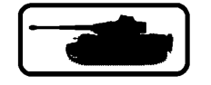

## D. VEHICLES

```text
 9.  Vehicles as Cover
10.  Wrecks
11.  Gyrostabilizers & Schuerzen
12.  Horse-Drawn Transport
13.  Vehicular Smoke Dispensers
14.  Radioless AFV
15.  Motorcycles & Bicycles
16.  DD Tanks & Amphibians
```

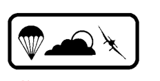

## E. MISCELLANEOUS

```text
 7.  Air Support
 8.  Gliders
 9.  Paratroop Landings
10.  Ammo Vehicles
11.  Convoys
12.  Barrage
```


## F. NORTH AFRICA

```text
 8.  Sangars
 9.  Tracks
10.  Hillside Walls & Hedges
11.  Arid Climatic Conditions
12.  Desert Overlays
13.  Alternate Terrain Types
```

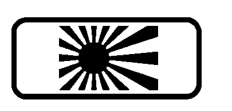

## G. PACIFIC THEATRE

```text
10.
11.
12.
13.
14.
15.
16.
17.
18.
```

```text
Animal-Pack
Caves
Landing Craft
Beaches
Seaborne Assaults
Bulldozers
Tropical Climatic Conditions
The U.S. Marine Corps & Early U.S. Army
The Chinese
```

1. Purchasing an OB

1. Miniatures <!-- pdf-page 8 --> 2. Converting ASL rules to Deluxe ASL

```text
1.  Day 1: Marching
2.  Day 2: LOS Course
3.  Day 3: Rifle Range
4.  Day 4: Close Combat Principles
5.  Day 5: Morale Indoctrination
```

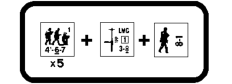

## H. DESIGN YOUR OWN

```text
2.    Vehicle and Ordnance Notes listings
 •    German Vehicles / German Ordnance
 •    Russian Vehicles / Russian Ordnance
 •    United States Vehicles / United States Ordnance
 •    British Vehicles / British Ordnance
 •    Italian Vehicles / Italian Ordnance
 •    Japanese Vehicles / Japanese Ordnance
 •    Chinese Vehicles / Chinese Ordnance
 •    Landing Craft
 •    French Vehicles / French Ordnance
 •    Allied Minor Vehicles / Allied Minor Ordnance
 •    Axis Minor Vehicles / Axis Minor Ordnance
 •    Finnish Vehicles / Finnish Ordnance
 •    Korean War UN Forces / Korean War Communist Forces
```

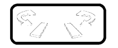

## I. CAMPAIGN GAME

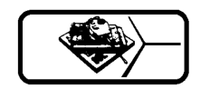

## J. DELUXE ASL

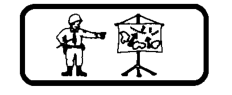

## K. TRAINING MANUAL

6. Day 6: Concealment 7. Day 7: Light Mortars and Basic Ordnance 8. Day 8: Guns and Advanced Ordnance

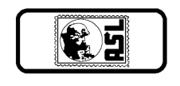

## L. ONLINE ASL

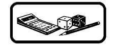

## M. ASL ANALYSIS


<!-- pdf-page 9 -->

## N. ARMORY

The pages for the ASL 1st Edition Armory were provided with their corresponding nationalities in each module. These pages are not going to be re-issued with the 2nd edition printing of the ASL Rulebook, nor with their corresponding modules. We hope to make them available in the future as PDF files, downloadable from our website at www.multimanpublishing.com.

## O. RED FACTORIES

```text
1.  Debris
2.  Railway Embankment & GLRR
3.  Printed Rubble
4.  Wide City Boulevards
5.  RF Factories
6.  RF Cellars
```

```text
1.  Pine Woods
2.  Slope Hexsides
3.  Barbed-Wire Fences
4.  Stream-Hex Terrain
```

```text
1.  Irrigation Ditches
2.  Partial Orchards
3.  Slope Hexsides
4.  Village Terrain
5.  Combination Terrain
```

```text
1.  Arnhem Bridge
2.  The Ramp
3.  Factories
4.  Cellars
5.  The Blockhouse
```


7. Culvert 8. Gully Entrance Hexside 9. Storage Tanks 10. Temporary Warehouses and Gutted Buildings 11. RF Campaign Games

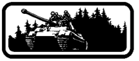

## P. KAMPFGRUPPE PEIPER

```text
5.  Village Terrain
6.  Hillside Walls & Hedges
7.  Known Minefields
8.  KGP Campaign Games
```

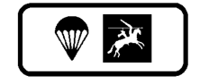

## Q. PEGASUS BRIDGE

```text
6.  Towers
7.  Barbed-Wire Fences
8.  Hillside Walls & Hedges
9.  PB Campaign Games
```


## R. A BRIDGE TOO FAR

```text
6.  Unit Replacement
7.  Wide City Boulevards
8.  Partial Orchards
9.  ABtF Campaign Games
```

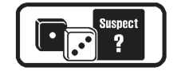

```text
1.  Introduction
2.  Random Events
3.  S? and ENEMY Attitude
4.  S? Placement and Entry
5.  Activation and Generation
6.  ENEMY Actions
7.  RPh
8.  ENEMY Attacks
9.  ENEMY Movement
```

```text
1.  Pathfinders
2.  BRT Ocean & Reef
3.  BRT Sand
4.  BRT Palm Trees
5.  Printed Rubble
6.  Bunkers & Pillboxes
7.  BRT Towers
8.  Gun Emplacements
```

```text
1.  KW Terrain
2.  The Americans
3.  The South Koreans
4.  British Commonwealth ForcesKorea
5.  Other UN Forces
```

```text
1.  Kakazu Ridge
2.  Edson’s Ridge
3.  Riley’s Road
4.  Primosole Bridge
5.  Singling
```

```text
1.  Chapter A
2.  Chapter B
3.  Chapter C
4.  Chapter D
5.  Chapter E
```

## S. SOLITAIRE ASL

```text
10.    ENEMY Rout
11.    ENEMY APh & CCPh
12.    The Missions
13.    Mapboard Selection & Features
14.    Victory Point Objectives
15.    FRIENDLY Units
16.    FRIENDLY Command Control
17.    Solitaire Campaign
18.    Campaign Companies
```


<!-- pdf-page 10 -->

## T. BLOOD REEF: TARAWA

```text
 9.   Port of Betio
10.   Betio Seawall
11.   Excavation Ditch
12.   Gullies
13.   Airfield
14.   Off-Map Terrain
15.   BRT Campaign Games
```


## W. KOREAN WAR

```text
 6.   The North Koreans
 7.   The Communist Chinese
 8.   KW Air Support
 9.   Forward Air Controllers & Close Air Support
10.   Searchlights
```

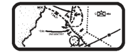

## Z. MINI-MODULES

```text
6.  Suicide Creek
7.  Sand and Blood
8.  Swedish Volunteers
9.  Sparrow Force
```

## CHARTS

```text
 6.  Chapter F
 7.  Chapter G
 8.  Chapter H
 9.  Chapter W
10.  Miscellaneous
```
