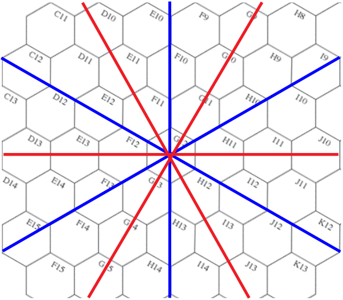

<!-- pdf-page 11 -->

# INDEX & GLOSSARY:

When numerous references are given for a single entry, a brief parenthetical description is also listed for the secondary entries. Most terms which have a common abbreviation are listed in full only under the abbreviation, but all references refer to the main rule.

**FORMAT**: “Entry” “(any spelled out version/description)”: “main rule #” “[other applications of entry: ]” Some Historical ASL (HASL) references will be to Campaign Game (CG) special rules (e.g., QCG14) or to SSRs (e.g., SSR PB19 or KGP SSR2). Terms and Definitions for Solitaire ASL are given at the beginning of Chapter S.

#### A

**a**: amphibious

**(a)** (American manufacture counter abbreviation): D2.5, F.9

**A#** (APCR Depletion Number; the number is the Depletion Number, and the superscript following it indicates the first year it applies and a letter indicates the month of that year [EX: A superscript of “4” means the vehicle/ordnance has that ammo starting in 1944]): (see also APCR) C8.1-.2

**AA Fire**: E7.5 [Caves NA: G11.83]

**AA Gun**: C2.2 [Gun Elevation: C2.6] [Gun Type: C2.22]

**AA Mode**: E7.5

**AAMG** (Anti-Aircraft Machine Gun): D1.83 [CC: A11.62] [fired by Heroic Rider: A15.23] [Repair: D3.7] [Scrounging: D10.51]

**A-B Mines** (Anti-Boat Mines): G14.53

**Abandonment, SW**: A4.43 [Captured: A20.21] [Surrender: A20.24]

**Abandonment, Vehicle**: D5.4 [Capture: A21.2] [in PB: QCG8; QCG9] [in PB, German crews may not voluntarily Abandon non-Immobilized vehicles: SSR PB16] [in RB, Non-captured Mobile non-halftrack AFV may not be voluntarily Abandoned: RB OCG16] [RePh: P8.6145, Q9.61423, R9.61422, T15.6135] [Shock vs: C7.42] [Unprotected Crews: D5.311]

**Abrupt Elevation Changes**: B10.5 [HD NA: D4.222] [Wadis: F5.12]

**AC**: Armored Car

**Accessible** (an adjacent Location which a hypothetical Infantry unit could— ignoring any enemy presence—advance into under normal APh conditions): [Caves: G11.6]

**Acquired Target**: C6.5 [Automatic Fire Action: S6.314] [vs Caves: G11.832] [Deliberate Immobilization NA: C5.71] [Night NA unless Illuminated: E1.74]

**Adj**: counter abbreviation for Adjacent

**adjacent** (hexes are considered adjacent if they share a common hexside): A.8

**ADJACENT** (Locations [and units in them] are considered ADJACENT if any Infantry unit in one Location could conceivably—ignoring any enemy presence—advance into the other during the APh and a LOS exists between the two Locations, excluding SMOKE Hindrance [B.10] and NVR [E1.101] as factors): A.8 [Building hexes: B23.25] [Caves: G11.6] [DM Cause: A10.62] [NA Examples: A6.8]

**Adv**: counter abbreviation for Advance

**Advance**: A4.7

**Advance Fire Phase**: (see AFPh) A3.5

**Advance Phase**: (see APh) A4.7

**Advance/Move**: (see Move/Advance) A.3

**Advanced Sequence of Play** (ASOP): ASOP Divider

**Aerial AF**: C7.12 [HD NA: D4.2] [Underbelly Hit: D4.3]

**Aerial Attack** (originating from an aircraft): E7 [Aerial AF: C7.12] [vs Cave: G11.86] [vs Column: E11.533] [Dust: F11.793] [Heat Haze: F11.622] [vs HD: D4.2] [Jungle: G2.213] [vs LC: G12.66] [vs AFV on LC: G12.6711] [LOS Hindrances: E.6] [Partial Orchard: Q2.5] [Range: E.5] [RB Roofless Factories: O5.47] [Sighting TC in Debris: O1.7] [Starshell NA: E1.921] [TK Case B:C7.22]

**Aerial Combat**: E7.22

**Aerial LOS**: E7.25 [BRT Palm Trees: T4.1] [Hindrances: E.6] [Paratroops: E9.31]

**Aerial Observation**: E7.6

**Aerial Range**: E.5

**AF** (Armor Factor; appropriate values are 0, 1, 2, 3, 4, 6, 8, 11, 14, 18, 26 or H in the case of unarmored vehicles): D1.6 [Aerial AF: C7.12] [vs A-T Mines: B28.52] [CC NA: A11.612] [achieving Final TK#: C7.11] [vs Minefield: B28.42] [vs OBA: C1.55]

**AFPh** (Advancing Fire Phase): A3.5

**AFPh Fire** (half FP for non-ordnance weapons or To Hit Case B/C for ordnance): A7.24 [Assault Fire: A7.36] [Case B TH: C5.2] [Case C TH: C5.3] [ENEMY FG: S8.52] [Glider Passengers: E8.4] [Paratroops NA: E9.5]

**AFPh SW/Gun Fire Limits**: A4.41, C5.2 [Bounding (First) Fire: D3.31] [MG: A9.2] [Moved Guns: C2.8]

**AFV** (Armored Fighting Vehicle): (see Partially Armored Vehicle) D1.2 [Aerial vs: E7.41-.43] [Combat: D3] [Japanese DYO: G1.661] [ENEMY Action DR: S6.13] [FFE vs: C1.55] [in PB, Freedom of Movement: QCG4] [vs Huts: G5.4] [Infantry Advance vs AFV: A4.71] [TB in Minefield: B28.61] [Panic Action: S6.21] [Radioless: D14] [RePh: O11.6131, P8.6206] [S? Activation: S5.71] [Smoke Dispensers: D13, F.10] [as Unarmored (vs mines): B28.42, B28.52]

**AFV Destruction Table**: C7.7

**AFV/Wreck LOS Hindrance**: D9.4 [Deirs: F4.51] [Hillock: F6.52] [on-board LC: G12.43]

**AFV/Wreck TEM**: D9.3 [IN a Rice Paddy: G8.31] [Hillock: F6.52]

**AG**: Assault Gun

**Aground**: G12.21 [Bog for LC: G12.21] [Heavy Surf: G13.446]

**Air Burst**: B13.3 [Entrenchments: B27.3] [Residual FP: A8.26] [Towers: B34.31] [WP: A24.31]

**Air Drop**: E9.1

<!-- pdf-page 12 -->

**Air Support**: E7, [BRT: TCG6] [Chinese DYO: G18.83] [ENEMY: S8.9] [cannot be used vs any Location in Fog: E3.313] [in RB, German Air Support is always a Stuka M42: SSR RB9] [Japanese DYO: G1.6621] [in KGP, NA if Mist Density \> Light, Night, or Overcast: SSR KGP3] [Napalm: G17.4] [Night NA: E7.2] [Overcast NA: E3.55] [during Seaborne Assault/Evacuation: G14.34] [Seaborne Assault DYO: G14.262] [Tarawa Naval Gunfire: TCG3.3]

**All MP/MF Expenditure**: D2.7

**Allied Minors**: A25.9

**Allied Troops**: A10.7

**Alpine Hill Option**: B10.211

**Alternate Hex Grain** (any string of connected hexes in which a straight line drawn between the first and last center dots lies along the hexspine of the first hex): A9.221 [Barrage: E12.11] [Human Wave: A25.231]

**Alternate Terrain Types**: F13

**Ambush**: A11.4 [attacks first in CC: A11.32] [ATTACKER adds +1 drm to Ambush dr in jungle, kunai, or bamboo Location: G.6] [Banks: G8.212] [keeping “?” during CC: A12.14] [Dummies are eliminated BEFORE the Ambush dr, and do not qualify for the -2 drm: ASOP 8.11B] [Hand-to-Hand CC: J2.31] [Night: E1.77] [Panic Action: S6.213] [Panjis: G9.21] [in Rubble: SSR RB8] [Street Fighting: A11.8] [T-H Heroes are created after Ambush determination: G1.421]

**American**: A25.3 [Early Army: G17.2] [OBA Accuracy: C1.3] [Paramarine: G17.111] [Raider: G17.111] [Rifle Company: S18.5] [U.S. Marine Corps: G17.1]

**Ammo Dump**: E10.6

**Ammo Portage**: E10.12

**Ammo PP Reduction**: C10.13 [Rider PP NA: D6.2]

**Ammo Supply**: E10.12

**Ammo Type TH Modifications**: C4

**Ammo Vehicles**: E10 [not a Gunflash: E1.89]

**Ammunition**: C8 [German in KGP: P8.618] [Plentiful/Scarce: C1.211]

**Ammunition Depletion**: C8.9, D3.71 *[EXC 28LL, 40LL: C4.3, C7.32]* [Replenishment: E10.31]

**Ammunition DR**: E10.3

**Ammunition Shortage**: A19.131 [Battery Access (Scarce): C1.211] [British in ABtF: RCG17] [Captured SW: A21.11] [Fire Lane NA] [German in KGP: P8.618] [RePh: R9.6201] [Replenishment: E10.31] [Residual FP: A8.221] [WW: RCG19]

**Amphibians** (any vehicle having a printed amphibious-MP superscript): D16, G13.401 [Drift: B21.121, G13.734] [Marsh: B16.42] [MP Allotment: D1.1] [Piers: G13.731] [Pond hexside: B21.13] [Routing onto: G14.41] [Swamp: G7.3] [Watercraft PRC: G14.23-.31] [Waterproofed: G13.4221] [Wire: G14.52]

**Animal Drawn Transport**: D.2, D12

**Animal Pack**: G10

**Anti-Tank Ditch**: (see A-T Ditches) B27.56

**Anti-Tank Gun**: (see AT Gun) C2.2

**Anti-Tank Magnetic Mine**: (see ATMM) C13.7

**Anti-Tank Mines**: (see A-T Mines) B28.5-.53

**Anti-Tank Rifle**: (see ATR) C13.2

**Anti-Tank Set Demolition Charge**: (see A-T Set DC)

**ANZAC** (Australian and New Zealand Army Corps): A25.44 [Stealthy: A11.17]

**AP#** (AP Limited Storage; the number is the Depletion Number, and the superscript following it indicates the first year it applies [EX: A superscript of “4” means the vehicle/ordnance has that ammo starting in 1944]): C8.8

**AP** (Armor Piercing): [vs Guns: C11.52] [HE Equivalency & Residual FP NA: C8.31] [Limited Stowage: C8.8] [vs Pillbox: B30.35] [To Kill Table: C7.31]

**A-P Mines** (Anti-Personnel Mines): B28 [Beach: G14.54]

**APC**: Armored Personnel Carrier

**APCR** (Armor Piercing Composite Rigid)/**APDS** (Armor Piercing Discarding Sabot): C8.1-.2 *[EXC German 28LL, 40LL: C4.3, C7.32]* [vs Guns: C11.52] [HE Equivalency: C8.31] [TH# Modification: C4.3] [To Kill Table: C7.32] [Residual FP NA: C8.31]

**APh** (Advance Phase): A4.7 [Board Entry Delay: A2.5] [Boats: E5.22] [Building Levels: B23.422] [ENEMY Guard Automatic Action: S6.303] [Gliders: E8.4] [Human Wave: S4.322] [Paratroops NA: E9.6] [S?: S3.322] [Sequence of Play: A3.7] [dropping SW before CC: A4.43] [wearing Skis: E4.32]

**AR** (Artillery Request): C1.3

**Area Fire**: A7.23, C.4 [vs AFV: A9.51] [Breach in Factory Walls: O5.331, R3.331] [Cellars: O6.4, R4.4] [Command Bunker: T6.1] [Crest Infantry firing through Non-Crest Status hexsides: B20.94] [vs Boats: E5.5-.51] [vs Dash: A4.63] [vs Fording: B21.42] [from Marsh: B16.32] [Ordnance: C.4] [Snap Shot: A8.15] [from Stream: B20.6]

**Area Target Acquisition**: C6.521

**Area Target Type**: C3.33-.332 [Bombs: E7.422] [Caves NA if LOS/LOF enters from outside CA: G11.831] [LC: G12.63] [Multiple Targets: C3.41]

**Arid Climatic Conditions**: F11

**Arid Land**: F11.2

**Armed** (any Personnel unit is Armed unless currently represented by an Unarmed counter (A20.54) not possessing a functioning Gun/SW, as is any non-Abandoned vehicle with an Inherent Crew): (see also Unarmed)

**Armor Factor**: (see AF) D1.6

**Armor Leader**: D3.4-.44 [Command Influence Range: S16.4] [DYO: H1.43] [Japanese become an Infantry leader: G1.411] [Mandatory Leadership: A10.72] [Recall: D5.341] [RePh: O11.6207, P8.206, Q9.6183, R9.6183]

**Armor Withdrawal**: [RePh: O11.614]

<!-- pdf-page 13 -->

**Armored Assault**: D9.31 [NA with Dash: A4.63] [Pathfinders: T1.2]

**Armored Cupola**: (see Dug-In Tank) D9.5 [Betio Gun Turrets: T8.2]

**Armored Halftracks**: (see Halftracks) D6.6

**Arnhem Bridge**: R1

**ART** (Artillery): C2.2 [Gun Type: C2.22]

**Artillery Request**: (see AR) C1.3

**Artillery Strike**: S8.7

**Artificial Terrain** (AFV, Roadblock, SMOKE, wreck): B.9

**ASAP** (As Soon As Possible): G14.234

**ASL**: Advanced Squad Leader

**ASOP** (Advanced Sequence Of Play): ASOP Divider

**Aspect** (Location of a hit vs a vehicular target broken down between turret/ upper-superstructure and hull): C1.55, C3.9, C7.11, D1.2, D1.22, D1.6, D5.311

**Assault Boats**: E5.11

**Assault Engineers**: H1.22 [ABtF Unit Replacement: R6.1] [+1 CCV: A11.5] [Marines in BRT: SSR9] [+2 Smoke Exponent: A1.21, A24.1]

**Assault Fire**: A7.36 [5-4-8 German paratrooper in its pre-armed 2-2-8 state NA: E9.7] [SS in 1944-45: A25.11]

**Assault Movement**: A4.61, S6.221 [ENEMY Guard Automatic Action: S6.303] [Human Wave NA: A25.232] [entering IP: S6.3121] [S? NA: S3.321] [Search NA: A12.152] [Wire: B26.4]

**Assault Wave**: T15.2 [Marine Unit Organization: TCG2.3]

**Assembly, SW**: A9.8

**A-T**: Anti-Tank

**A-T Ditches**: B27.56 [in RB Paved Road with Shellholes: SSR RB5]

**A-T Mines** (Anti-Tank Mines): B28.5-.53 [Beach/OCEAN: G14.53] [Bridges: B6.6] [Unhidden: B28.53]

**A-T Set DC**: G1.6121

**AT Gun** (Anti-Tank Gun): C2.2 [can occupy building/rubble if not a large target: C2.7] [Gun Type: C2.22]

**ATMM** (Anti-Tank Magnetic Mine): C13.7 [in RB, available to elite German Infantry: SSR RB13] [in PB, Gammon Bombs: SSR PB15] [Gunflashes: E1.85] [T-H Heroes: G1.4231]

**ATR** (Anti-Tank Rifle): C13.2 [Field of Fire: A9.21] [vs Gun: C11.52] [HE Equivalency: C8.31] [Japanese Squad/HS use: G1.611] [OVR FP NA: D7.11] [SW Team fire without non-qualified use penalty: S17.141]

**Attack Break**: G1.12

**Attack DRM**: A.5

**ATTACKER** (the player whose Player Turn is currently being played): A.13

**Availability Table**: [DYO: H1.3]

**Avenue of Approach**: E8.2

**AVRE** (Armored Vehicle, Royal Engineers): (see British Vehicle Note 37) [Seawall Breach: G13.624] [Seawall Fascine: G13.625]

**Axis Minors**: A25.8 [Berserk EXC: A15.1] [Escape NA unless Abandoned *(EXC Hungarians in Hungary)*: A20.55]

**Axis Vehicles**: [pre-10/42 in North Africa: D2.52] [Extreme Winter: E3.744]

#### B

**B**: [Brush overlay]

**B#** (Breakdown Number; [weapon is repairable]; If *italicized* [circled on counter], the vehicle has a Low Ammo B#, if **bold** [red on counter], the reference is to secondary weapon (FT or dual MA Vehicle) not necessarily the MA): A9.7, D3.7 [Aerial MG: E7.41] [Ammo Shortage: A19.131] [Captured: A21.11, C5.8] [Extreme Winter: E3.741] [Guns: C2.28] [Inexperienced: A19.32] [Intensive Fire: C5.62] [Low Ammo B#: D3.71] [Non-qualified use: A21.13] [Sustained Fire: A9.3] [Vehicular: D3.7] [X#: A.11]

**Backblast**: C13.8 [Huts: G5.62] [RCL: C12.3-.4]

**Bailing Out**: D6.24 [Bypass: D6.5] [Cavalry: A13.51] [Japanese: G1.13] [Motorcyclists: D15.53] [due to Terrain: D6.21]

**Balance**: A26.4

**Bamboo**: G3 [Fortifications, Fire Groups, Detection, Recovery, Ambush: G.2-G.6]

**Bangalore Torpedo**: B26.51

**Banks**: G8.21

**Banzai Charge**: G1.5 [Banzai Night Attack Decision: T15.616, T15.6203] [in BRT: TCG9, TCG10] [mandatory for DC Hero: G1.424] [Human Wave: A25.23] [T-H Heroes: G1.423]

**Barbed Wire Fences**: P3, Q7

**Barrage**: E12

**Barrel Length**: C4.1

**Base Level** (normally the lowest level Location other than cellar/sewer/tunnel in a hex; however, if the lowest level Location in building hex does not allow VBM along at least one hexside of that hex, the Base Level is that of the highest building level in that hex [EX: The Base Level of 20C7 is 21/2; that of 20D7 is 0]): C1.32

**Base NVR** (Base Night Visibility Range): (see NVR) E1.1

**Battalion Landing Team**: (see BLT) T15.2

**Battalion Mortar**: C1.22

**Battery Access**: C1.21

**Battle Hardening**: A15.3 [Battlefield Integrity: A16.3] [Panic Action: S6.211] [RePh: O11.6112-.6114, P8.6113-.6115, Q9.6112-.6113,  R9.6112-.6113, T15.6113-.6114] [SASL Campaign: S17.73-.74]

**Battlefield Integrity**: A16 [Japanese: G1.622] [NA in SASL: Chapter S Introduction] [Seaborne Assaults NA: G14.24] [Prisoner Rejection: A20.3]

<!-- pdf-page 14 -->

**BAZ** (Bazooka): C13.4 [Desperation: C13.81] [HE Equivalency: C8.31] [Height Restrictions: C13.8] [S? Activation in non-factory building/pillbox: S5.754] [SW Team fire without non-qualified use penalty: S17.141]

**Be**: Beach overlay

**Beach**: G13 [Be: Beach Overlay] [Pathfinders Eliminated: T1.3]

**Beach Defense Record**: T15.2

**Beach Definitions**: T15.2

**Beach-Hinterland Hexside**: G13.2

**Beach Obstacles** (mines, Panjis, tetrahedrons, wire): G14.5

**Beach-OCEAN Hexside**: G13.2

**Beach Setup Area**: T15.2

**Beach Slope**: G13.2 [BRT: SSR1] [DYO: G13.92]

**Beach Width**: [DYO: G13.93]

**Beaching**: E5.23 [Heavy Surf: G13.442] [LC: G12.3] [Loading: E5.21]

**Bedouin Camp** (Overlay X3): F12.45

**Berserk**: A15.4 [Automatic Action: S6.301] [Boat Entry NA: E5.54] [Cave: G11.97] [CMD DR NA: S16.32] [Commissar: A25.223] [Concealment NA: A12.12-.14] [Cowering NA: A7.9] [multi-Location FG participation NA: A7.54] [Fortified Building: B23.922] [Hand-to-Hand CC: J2.31] [Heat of Battle NA: A15.1] [Human Wave NA: A15.1] [Inexperienced: A19.31] [Massacre: A20.4] [MG vs: A9.4] [not subject to Straying: E1.533] [OCEAN: G13.491] [Opportunity Fire NA: A15.432] [Panic Action: S6.211] [Pillbox: B30.44] [Pin EXC: C13.31] [wearing Skis: E4.7] [WW: QCG17, RCG19]

**Betio** (Atoll on which BR:T occurs): [Piers: T9.2] [Port: T9] [Seawall: T10.1]

**BF** (counter abbreviation for Bow Flamethrower): (see FT) D3.6

**Bicycles**: D15.8 [Barbed-Wire Fences NA: P3.2, Q7.2] [DYO: H1.45] [Panji: G9.422]

**Black Beach** (Black Beach One and Black Beach Two): T15.2

**Blast Area**: C1.32 [Barrage: E12.11] [Harassing Fire: C1.72] [NOBA: G14.65] [Straying: E1.53]

**Blast Height** (two levels higher than Base Level of hex): C1.32 [Correcting SR/FFE: C1.331]

**Blaze** (fully-developed Fire): (see Fire) B25.1 [Cellars: O6.5, R4.5] [Control Forfeiture: A26.13] [Debris NA: O1.1] [Falling Rubble vs: B24.6] [Gusts: B25.651] [Ground Snow/Deep Snow: E3.721] [Illumination: E1.94] [LC: G12.44, G12.601] [Napalm: G17.41] [Narrow Street: B31.126] [RePh: O11.609, P8.609, Q9.609, R9.609] [S? elimination: S3.31]

**Blind Hex**: A6.4 [Bocage: B9.52, B9.531] [Crest Line: B10.23]

**Block**: R9.2 [Block Control Forfeiture: R9.6051]

**Block Locations**: Chapter R Divider, R9.15

**Blockhouse**: R5

**BLT** (Battalion Landing Team): TCG2.1, T15.2

**BMG** (Bow MG): D1.81 [CC NA: A11.61] [Scrounging: D10.51]

**Bnd (F) F**: counter abbreviation for Bounding (First) Fire

**Boats**: E5 [Crossing Frigid Stream: B20.7] [Drift: B21.121] [Heavy Surf: G13.4423] [Marsh NA: B16.42] [(un)Beaching: G13.4423]

**Bocage**: B9.5 [Aerial LOS: E7.25] [at Night, no extra MF: E1.51] [Night LV DRM NA: E1.7] [Underbelly Hit: D4.3]

**Bog**: D8.2-.4 [Aground-LC: G12.21] [Armor Leader: D3.44] [Barbed- Wire Fence: P3.3, Q7.3] [Bocage: B9.54] [Breach: B9.541] [Buildings: B23.41] [Bulldozer: B24.71] [Debris: O1.2] [Deep Snow: D8.23, E3.7332] [Drifts: E3.752] [ENEMY Vehicles: S9.36] [Factory: B23.742, R.3] [NA Ford: B20.82] [may cause Gap in Convoy: E11.21] [Graveyard: B18.41] [Irrigation Ditch: Q1.43] [Jungle: G2.211] [Marsh: B16.43] [Motorcycles NA: D15.47] [Mud: D8.23, E3.61] [Mudflat: B16.72] [Ocean Bog: T1.4, T2.3] [Railroad: B32.33] [RePh: O11.6131, P8.6044, Q9.6043, R9.6043, T15.6042] [Rice Paddies: G8.12] [Rubble: B24.121, B24.4] [S? when Activated has used entire MP: S5.712] [Sand: F7.31] [Soft Ground in PB: SSR PB5] [Stream: B20.46] [Swamp: G7.31] [Temporary Crew: A21.22] [Towers: B34.41] [VCA Change: C5.11] [Wadi: F5.21, F5.4251] [Wading: G13.4223] [Wire: B26.43] [Woods: B13.41-.42]

**Bombardment**: C1.8, J2.5 [Bombproof: T6.51] [BRT Sand: T3.2] [vs Cave: G11.841] [Command Bunker: T6.1] [DYO Cost: H1.53] [DYO purchase for Japanese: G1.662] [creates Flame or Shellholes: C1.823] [vs Huts: G5.32] [Island Command Bunker: T6.2] [Naval: G14.7] [Panji: G9.74] [Sand: F7.4] [Towers: B34.1]

**Bombproof**: T6.5 [BRT Sand: T3.2] [Passage: T6.4]

**Bombs, Aerial**: E7.42 [Heavy Payload: C.7] [Jettison: E7.225] [vs LC: G12.66] [vs Mines: B28.62] [Napalm: G17.41] [Shellhole Creation: B2.1] [vs Wire: B26.52]

**Bonus Infantry**: [DYO: H1.71-.73]

**Booby Traps**: B28.9 [in BRT: SSR BRT7] [Deactivation in RePh: O11.6123] [Motorcyclists NA: D15.54] [in RB: SSR RB15] [Search Casualties: A12.154][Wading Infantry/Cavalry NA: G13.421]

**Bore Sighting**: C6.4 [NA in ABtF: SSR19] [NA in BRT: SSR6] [Fire Lane at Night: E1.71] [NA in KGP: PCG12] [NA in PB: SSR PB18] [NA in RB: OCG5] [RCL: C12.24] [Residual FP: A8.26] [Shallow Ocean: G13.45] [Underbelly Hit: D4.3]

**Boulevards**: B7 [Arnhem Bridge: R1.2] [Ramp: R2.4] [Wide City Boulevards: R7.1]

**Bounding Fire** (fire by a vehicle in the AFPh after movement to a new hex/ use of VBM during the MPh used in place of—rather than in addition to— AFPh Fire): C5.3 [ENEMY Vehicles: S9.342]

**Bounding First Fire** (fire by a vehicle during its own MPh which enables a vehicle to both move and fire in the same phase ): C5.13, C5.3-.33, D3.3 [Acquired Target NA: C6.55] [ENEMY Vehicles: S9.341]

**Bow Flamethrower** (BF): (see FT)

**Bow MG**: (see BMG) D1.81

**BPV** (Basic Point Value; the relative value of one unit or OBA battery for DYO/Battlefield Integrity purposes ): [Battlefield Integrity: A16.1] [DVP: F.3] [Personnel: A1.4]

**Bracketing**: C6.52

<!-- pdf-page 15 -->

**Breach**: B9.541, B23.711 [Banks: G8.8] [Barbed-Wire Fence: P3.21, Q7.21] [Bocage: B9.541] [RB Cellar: O6.11] [DC Hero: G1.4241] [Factory Interior Walls: O5.33, R3.33] [Fortified Building: B23.9221] [Panji: G9.731] [Rice Paddy: G8.8] [Rowhouse: B23.711] [Seawall: G13.624]

**Breakdown**: (see B#) A9.7 [Excessive speed: D2.5] [Mechanical reliability: D2.51]

**Bren Carriers**: (see Carriers) D6.8-.84

**Brew Ups**: D5.7

**Bridge**: B6 [Arnhem Bridge: R1] [Bombardment vs: C1.822] [Bridge counter is Inherent Terrain: B6.2] [in BRT: SSR BRT1] [Crest status NA: B20.9] [Demolition: A23.71] [Entrenchments NA: B27.1] [Falling Rubble: B24.121] [Gullies: B19.1, B19.3, B6.1] [Mapboard Selection and Features: S13.5-.6] [Railroad: B32.14] [Road Network Bridge: S13.2311] [Streams: B20.3] [VPO: S14.12]

**Bridge Collapse**: B6.42 [Falling Rubble: B24.121] [in PB, Pegasus Bridge is indestructible: SSR PB4]

**Bridge Layer**: British Vehicle Note 36

**British**: A25.4 [Free French: A25.53]

**Broached Wreck**: G13.4421

**Broken Terrain**: F13.1

**Broken Units**: A10.4 [Battle Hardening: A15.3] [Berserk: A15.4] [Boat Entry NA: E5.54] [Passengers BU: D6.61] [CC: A11.16] [CMD DR NA: S16.32] [Concealment NA: A12.12, A12.14] [Crest status: B20.96] [ELR Replacement NA: A19.1] [FFMO/FFNAM: A8.14] [Hero: A15.21] [Japanese MMC: G1.12-.13] [Map Exit: QCG15] [MG vs: A9.4] [Pin NA: A7.8 *(EXC Interdiction and Huts)*] [Retained: S17.31] [Riders Bail Out: D6.23-.24] [TI NA: A4.8] [Vehicles: A12.1] [Water Shortage: RCG21] [WW: QCG17, RCG19]

**Brush**: B12 [B: Brush overlay] [Path: B13.6]

**BRT** (Blood Reef: Tarawa): [BRT Ocean: T2.1] [BRT Palm Trees: T4.1] [BRT Sand: T3.1] [BRT Towers: T7.1]

**BU** (Buttoned Up): D5.2 [Amphibian: G14.31] [can change BU/CE status during MPh or APh: D5.33] [ENEMY Vehicles: S9.31] [MA Interdiction NA: A10.532] [OT AFV: D6.61] [Passengers on LC: G12.123] [Pinning: A7.82] [Secret Record: A12.2] [sN: D13.34] [Sighting TC: E7.43] [sM: D13.3] [TH Penalty: C5.9]

**Buildings**: B23 [Blaze during RePh: O11.6094, P8.6094, Q9.6094, R9.604, T15.6105] [Building-Orchard Hex: Q5.4] [Building-Palm: T4.3] [Building- Road Hex: Q5.5] [Cavalry: A13.3] [Control: A26.14] [Dust DLV: F11.792] [Entrenchments NA: B27.1] [Indirect Fire TEM: B23.32] [Minefields: B28.44] [Mortar Setup: B23.423, B23.85] [Motorcycle: D15.45] [Paratroopers landing: E9.4] [Rally DRM: A10.61] [S? Activation in a Fortification: S5.742] [Schuerzen Loss: D11.22] [Single Hex Two-Story Building: B31.3] [Single Story Buildings: J2.4] [TH vs Multi-Levels: C3.32-.33] [Towing NA into: C10.1, C10.4] [Weather: E3.8] [X: Building overlay]

**Bulldozers**: (see Dozers) B24.7-.71, G15

**Bunkers**: B30.8 [BRT Pillboxes: T6.32] [Command Bunker: T6.1] [Straying: E1.531]

**Burma**: [DYO Chinese vs Japanese: G18.81]

**Burnable Terrain** (bamboo, brush, buildings, cactus patch, dense jungle, grain (in-season), hut, kunai, light jungle, olive grove, orchard, paddy (in-season), palm trees, pier, rubble, vineyard, wooden bridge, woods): B25.1

**Burning Wreck**: (see Wreck Blaze) B25.14 [RePh: R9.6091]

**Burnt-Out Wreck**: [ABtF: SSR14] [BRT: SSR15] [in KGP, PB, and RB, cannot be Scrounged, set Ablaze, or removed from play as per D10.4: SSR KGP10, SSR PB10, RB CG SSR 7] [in PB, any Vehicle that is Immobilized, Abandoned, all weapons are Disabled: QCG14]

**Buttoned Up**: (see BU) D5.2

**Bypass, Infantry**: A4.3 [Arnhem Bridge: R1.12] [Barbed-Wire Fence: P3.4, Q7.4] [Beach/Ocean overlay hexside NA: G13.81] [Building-Orchard Hex: Q5.41, Q5.43] [Building-Palm: T4.3] [Concealed enemy: A12.151] [Dense Jungle NA: G2.212] [NA through a Drift: E3.752] [Exit Playing Area: A2.6] [Factory Interior Wall: O5.32, R3.32] [Grid Coordinates: A2.2] [Horses/Animal-Drawn: D.2] [Panji NA: G9.46] [Railroad: B32.31] [Residual FP: A8.21] [Rout NA: A10.5] [Rowhouse: B23.71] [S? NA: S3.321] [Stream remnants NA: B20.1]

**Bypass, Vehicular**: (see VBM) D2.3

#### C

**C#** (Canister Depletion Number; the number is the Depletion Number, and the superscript following it indicates the first year it applies and a letter indicates the month of that year [EX: A superscript of “4” means the vehicle/ordnance has that ammo starting in 1944]): (see also Canister) C8.4

**CA** (Covered Arc; if used in reference to a vehicle, it refers to VCA/TCA): C3.2, J2.22 [Bocage: B9.531] [Bounding First Fire: C5.13] [Caves: G11.12] [Changes vs Dash NA: A4.63] [Changes for fire vs own hex: C5.51] [Changing TCA without fire: D3.12] [Changing without fire: C3.22, C10.22] [EN- EMY Activation: S5.4] [ENEMY Vehicles: S9.34] [Firing Within: C3.21] [MG: A9.21] [Maintaining CA: D3.51] [Opportunity Fire: A7.25] [Pinned Gun: A7.81] [SW: A9.21] [TCA/VCA: D.4] [Vehicular: D3.1-.12]

**Cactus Hedge**: B9.7, F13.3

**Cactus Patch**: B14.7, F13.4

**CAFP** (Covered Arc Focal Point; the vertex of a hexside in front of a straddling VBM vehicle): D2.32

**Caliber Size** (CSize): C2.21

**Campaign Exhaustion DRM**: R9.2

**Campaign Game**: (see CG) O11.2, P8.2, Q9.2, R9.2, S17, T15.2

**Campaign Purchase Points**: (see CPP) O11.2, P8.2, Q9.2, R9.2

**Campaign Roster Sheet**: S17.15

**Canal**: B21.11

**Canister**: C8.4 [vs a Cave: G11.836] [Cowering NA: A7.9] [vs Pillbox: B30.112]

**CAPP** (Covered Arc Purchase Points): T15.2

**Capture**: A20.22 [+1 CC DRM NA vs non-elite Italian defenders: A25.63] [Japanese may attempt Hara-Kiri: G1.641]

**Captured AFV**: [CC: A11.52] [RePh: O11.6136]

<!-- pdf-page 16 -->

**Captured Equipment**: A21 [Dozer: G15.27] [MG use at Night: E1.76] [Motorcycles NA: D15.7] [in PB, Ox and Bucks Captured Penalties NA: SSR PB14] [Penalties do not apply to Partisans using Allied SW/Guns: S12.211] [ROF: A21.12] [RePh: O11.6135, P8.6144, Q9.61422, R9.6143, T15.6134] [Repair NA: A9.72]

**Carriers**: D6.8-.84 [DYO: H1.43]

**Casualty MC**: A10.31 [Retained: S17.31] [WW: QCG17, RCG19]

**Casualty Reduction** (A combat result which eliminates a HS or crew, and wounds any SMC it afflicts. A squad is Reduced to a HS): A7.302 [Booby Trap: B28.9] [Casualty MC: A10.31] [CC: A11.11] [Crew Small Arms: A11.621] [Fate: A10.64] [Japanese: G1.14] [Interdiction: A10.53] [PF To Hit DR: C13.36] [Unarmed units Retained: S17.31]

**Casualty Victory Points** (CVP): (see VP) A26.2

**Cavalry** (Personnel on horseback—not those on Wagons): A13 [above a Bank counter: G8.2112] [Cavalry Wave: A25.23] [DEFENDER using TPBF: A13.351] [Heat of Battle NA: A15.1] [Irrigation Ditch: Q1.41] [Jungle: G2.4] [Mounted Firer: A13.4] [Night, considered Normal: E1.62] [Panjis: G9.422] [Stationary Bypass: D.2] [Swimming: E6.5] [Wave: A13.62] [in Wire: B26.42]

**Cave**: G11 [Entry: G11.7] [Elimination: G11.88] [Dozer vs: G15.22] [High Seawalls NA: G13.61]

**Cave Complex**: G11.2 [entry, advance, rout: G11.73] [Rice Paddy NA: G8.73]

**Cave Complex Setup Sheet**: (see CCSS) G11.32

**CC** (Close Combat): A11 [Armor Leader: D3.44] [ATMM: C13.7] [Berserk: A15.43] [units in Boats: E5.6] [Broken Units: A11.16] [BU: D5.2] [Bypass into “?”: A12.151] [Capture Attempt: A20.22] [Cavalry: A13.61] [NA to/ from Cave: G11.87] [CCT: A11.11] [CCV: A11.5] [CMG NA if restricted to VCA: D1.82] [Cowering NA: A7.9] [Crest: B20.94] [CX: A4.51] [Dare-Death Squads: G18.62] [ENEMY Advance: S11.4] [Field Promotion: A18.12] [Gammon Bombs: SSR PB15] [Gunflashes: E1.82] [Hand-to-Hand: J2.31] [Human Wave: A25.234-.235] [Infantry OVR: A4.152] [Japanese ATTACKER becomes Hand-to-Hand: G1.64] [vs LC NA: G12.7] [Narrow Street: B31.132] [Panic Action: S6.213] [Panjis: G9.21] [Pillbox: B30.6] [Pinned: A7.8] [Reaction Fire: D7.2] [wearing Skis: E4.5] [SW: A11.13] [T-H Heroes: G1.4231] [Unarmed Units: A20.54] [WW: QCG17, RCG19] [on Wire: B26.31]

**CC Reaction Fire**: D7.2 [Street Fighting: A11.8]

**CCPh** (Close Combat Phase): A3.8 [ENEMY Attacks: S11.5] [dropping SW before CC: A4.43]

**CCSS** (Cave Complex Setup Sheet): G11.32

**CCT** (Close Combat Table): (see CC) A11.11

**CCV** (Close Combat Value; CC Kill number vs vehicles [squad: 5, crew: 4, HS: 3, SMC: 2]): A11.5 [T-H Hero 5: G1.4231]

**cdr**: colored die roll

**CE** (Crew Exposed): D5.3-.342 [Air Bursts: B13.3] [Amphibian: G14.31] [Arnhem Bridge: R1.22] [can change BU/CE status during MPh or APh: D5.33] [ENEMY Vehicles: S9.31] [Halftrack Passengers: D9.1] [Passengers on LC: G12.123] [Secret Record: A12.2] [Sighting TC: E7.43]

**CE DRM** (Crew Exposed Dice Roll Modifier): D5.31, D9.1

**Cellars** (see RB Cellars): B23.41, O6, R4 [NA in BRT: SSR1] [Factory NA: B23.742] [in KGP, only multi-hex buildings have Cellars: SSR KGP8] [NA in Rice Paddy hex: G8.73] [Rubble NA: B24.4]

**CG** (Campaign Game): O11.2, P8.2, Q9.2, R9.2, S17, T15.2 [CG Date: P8.2, Q9.2, R9.2, T15.2] [CG Day: O11.2] [CG End: P8.2, Q9.2, R9.2, T15.2] [CG-LVP Total: P8.2] [CG Night Scenario: R9.2] [CG Roster: O11.2, P8.2, Q9.2, R9.14, R9.2] [CG-Scenario End: P8.2, Q9.2] [New CG Day: O11.6121]

**CH** (Critical Hit): C3.7 [Bombardment NA: C1.8] [Deliberate Immobilization NA: C5.72] [vs Gun: C11.4] [Harassing Fire: C3.75] [HD: C3.9] [Improbable Hit: C3.6] [Indirect Fire: C1.53] [LC: G12.64, G12.679] [Mortar: C9.5] [Multiple Hits: C3.8] [Pillbox: B30.113] [Rubble: C3.73] [WP: A24.31]

**Charge** (special cavalry attack): A13.6 [Woods-Road: B13.4]

**Chinese**: G18

**City Boulevards**: B7

**Civilian Interrogation**: E2.4

**Class, Personnel Types** (E: Elite; 1: 1st Line; 2: 2nd Line; G/C: Green/Conscript): A1.25 [Panic Action: S6.21]

**Clear** (Weather): E3.2

**Clearance** (the act of removing rubble, mines, Palm Debris, Wire, roadblock, Set DC, Flame): B24.7 [Debris: O1.5] [Dozer: G15.2] [Drifts: E3.751] [Jungle: G2.7] [Labor Status: B24.8] [Narrow Street Roadblock: B31.1411] [Panji: G9.71] [Palm Debris: T4.22] [Printed Rubble: O3.2, T5.2] [Prisoners: A20.5] [Roadblock by HE: B29.5] [Wire by vehicles, DC, FFE: B26.51-.53]

**Cliffs**: B11 [Beach-Hinterland: G13.24] [Crest NA: B20.9] [HD NA: D4.222] [High Seawall: G13.61]

**Climbing** (the act of ascending or descending a Cliff hexside): B11.4 [place DC from above a Cave: G11.8331] [High Seawall: G13.61] [Heat of Battle NA: A15.1] [Mission End: S17.41] [Scaling Bridge & Buildings: B23.424]

**Cloaking**: E1.4 [ABtF: SSR2] [Air Drop: E9.1] [Boats: E5.123] [Caves: G11.75] [Gliders: E8.1] [Marine Cloaking: TCG5] [Seaborne Assaults: G14.23] [Sniper: E1.72]

**Close Combat**: (see CC) A11

**Close Combat Phase**: (see CCPh) A3.8

**Close Defense Weapon System**: (see sN) A11.622

**Closed Topped**: (see CT) D1.24

**Cloud Cover**: [DYO: E1.11]

**CMG** (Coaxial MG): D1.82 [AA use: C2.6] [Acquisition Loss: C6.5] [Acquired Target Automatic Fire Action: S6.314] [in Bypass: D2.321] [CC: A11.62] [Mandatory Fire Direction NA: A9.4] [Scrounging: D10.51] [Stabilized: D11.13]

**Collapse**: B25.66 [Hut: G5.5] [Ice: B21.6] [RB Cellars: O6.62]

**Collateral Attack**: D.8 [CH: C3.74] [vs LC: G12.67] [Near Miss halves Specific Collateral Attack: E7.421] [Residual FP NA: A8.22]

**Column**: E11.5 [Animal Pack: G10.5] [CMD DR for entire formation: S16.32] [FRIENDLY: S15.4] [Panji: G9.44]

**Command Bunker**: T6.1 [Island Command Bunker: T6.2] [Passage: T6.4]

**Command Control**: S16.1

<!-- pdf-page 17 -->

**Commando**: H1.24 [ABtF: R6.31, R9.617] [Climbing: B11.433] [DYO: H1.24] [Gurkha: A25.43] [High Seawalls: G13.61] [Scaling: B23.424, R1.1] [Special Forces Integrity: S12.22] [Stealth: A11.17] [Unit Replacement: R6.31]

**Commissar**: A25.22 [Red Chinese: G18.31] [Disruption NA: A19.12] [Partisans: S12.211] [RB: OCG12] [RePh: O11.6206] [RtPh Surrender NA: A20.21]

**Company Improvement**: [SASL Mission End: S17.7]

**Concealment**: A12 [ABtF: RCG12] [Ambush: A11.4] [Banks NA: G8.2111] [Bocage: B9.55] [Caves: G11.812] [CC: A11.14-.15, A11.19] [Column: E11.54] [voiding Dash: A4.63] [DLV: F11.601] [Debris: O1.1] [revealed in Interrogation: E2.21] [Japanese & Korean in BRT: TCG11] [Japanese receive a -2 drm to their Concealment dr: G1.63] [KGP Setup: PCG11] [Mandatory Fire Direction (MG): A9.4] [Night: E1.3] [Observer: C1.6] [Ocean NA unless Night: G13.4212] [Opportunity Fire: A7.25] [Panji NA: G9.53] [PB: QCG10] [Pillbox: B30.7] [RB: OCG15] [RCL: C12.22] [Residual FP: A8.224] [Rooftop: B23.82] [effects on Rout: A10.533] [S?: S3.1] [Scrub: F2.3] [Target Acquisition: C6.5, C6.521, C6.57] [TH DRM: C6.2] [T-H Hero creation attempt loss: G1.421] [Towers: B34.5] [Trench: B27.54] [Vehicular Target Size: D1.76] [Winter Camouflage: E3.712] [WP Loss: A24.31]

**Concealment Loss**: A12.14 [Column disbands: E11.54] [Freedom of Movement dr NA: E1.21] [Spotter NA: C9.3] [WP: A24.31]

**Concealment Terrain** (bamboo, bocage, broken ground, brush, building, cactus patch, cave, cave complex, dense jungle, grain [in-season], hut, kunai, light jungle, marsh, olive grove, orchard, paddy [in-season], palm debris, palm trees, rubble, scrub, swamp, vineyard, woods): A12.12 [Command Bunker Rooftop: T6.2] [Night “?”/HIP setup/loss purposes: E1.2, E1.31] [Bocage: B9.55] [Rooftops: B23.8] [Scrub: F2.3] [Towers: B34.5]

**Concentration FFE** (an OBA Fire Mission with a seven hex Blast Area *[EXC NOBA: G14.67] [EXC Rocket OBA: C1.9]*): C1.5

**Conditional ROF**: C2.5

**Conscripts**: (see Inexperienced Personnel) A19.2-.3 [Panic Action: S6.21]

**Contact**: (see Radio Contact) C1.2

**Continuous Slope**: B.5 [Caves: G11.51] [Fire Lane: A9.22] [Height Advantage: B1.14]

**Control**: A26.1 [in PB, Bridge Control: SSR PB6] [Cave: G11.94] [Pillbox: B30.91]

**Control Markers**: [RePh: O11.6052, P8.605]

**Convoys**: E11 [Armor Leader’s Command Influence Range: S16.4] [CMD DR for entire formation: S16.32] [FRIENDLY: S15.4] [Vehicle Dust: F11.741]

**Coral Soil**: G13.82

**Correcting Fire**: C1.4 [Barrage: E12.4] [Creeping Barrage: E12.74] [ENE- MY FFE: S8.74]

**COT** (Cost of Terrain): B.2

**Counter**: any of the die-cut square pieces of the game

**Countermix** (pieces provided in one game): [DYO purchasing limits: H1.11] [S? Activation: S5.7, S12.22] [S? Activation in Fortification: S5.7, S12.22]

**Covered Arc**: (see CA) C3.2

**Covered Arc Focal Point**: (see CAFP) D2.32

**Covered Arc Purchase Points**: (see CAPP) T15.2

**Cowering**: A7.9 [British Elite/1st Line NA: A25.45] [Fanatic NA: A10.8] [FT: A22.1] [Hero FG: A15.24] [Inexperienced Personnel: A19.33] [Residual FP NA: A8.224] [SMC SW Usage: A9.12]

**Coy** (Company): O11.2, Q9.2

**CPP** (Campaign Purchase Points): O11.2, P8.2, Q9.2, R9.2

**CPP Entry Cost**: Q9.2

**CPP Replenishment**: [RePh: P8.616, Q9.617, R9.616]

**Crag**: B17 [Entrenchments NA: B27.1]

**Crash dr**: E8.23 [Effect: E8.24] [Huts: G5.43] [OCEAN: G13.492] [Panjis: G9.47] [Rice Paddy: G8.22] [Swamp: G7.32] [Tetrahedrons: G14.51] [in PB, Wire drm: SSR PB20]

**Creeping Barrage**: E12.7 [DYO purchase for Japanese: G1.662]

**Crest Line**: B10.11 [Bypass: A4.34] [Elevated Road: B5.21] [Slope Hexside: P2.53, Q3.53] [Valley: B22.2]

**Crest Status**: B20.9 [Culvert Location NA: O7.4, P4.22] [ENEMY Movement in Depression: S9.28] [Indirect Fire vs: C1.52] [Leadership: A2.8] [OVR: D7.15] [Russian AFV: F5.427] [S? Setup: S4.14] [Setup: A2.9] [Stream Hex Terrain: B33.12] [Wadi, may be used by all types of Infantry, SW, vehicles, and Guns: F5.4]

**Crew** (Inf. Crew has a FP of 2, Vehicle Crew has a FP of 1): (see also Inherent Crew) A1.123, C2.1 [Automatic Action: S6.310]  [DYO: H1.212, H1.3, H1.4] [ELR & Heat of Battle NA: A15.1, A19.11] [Gun Movement: C10.111] [Japanese: G1.3] [LC: G12.112] [S? Activation: S5.711] [SW Team treated as HS: S17.14] [Temporary: A21.22]

**Crew Exposed**: (see CE) D5.3-.342

**Crew Small Arms**: A11.621

**Critical Hit**: (see CH) C3.7

**CS#** (Crew Survival Number; for all PRC: If **bold** [red on counter] the vehicle has a tendency to Brew Up, if italicized [in lower case (cs#) on counter], it applies to Passengers/Riders only): D5.6, D6.9 [Brew Up: D5.7]

**cs#** (Crew Survival Number for Passengers/Riders only): D5.6, D6.9

**CSize** (Caliber Size): (see Gun Caliber Size) C2.21

**CT** (Closed Topped; a fully-armored AFV which is not OT): D1.24 [BU/CE Firing Restrictions: D5.2-.3] [HD Maneuver Attempt by CT Russian AFV: D4.22]

**Culin Hedgerow Device**: B9.541 [Underbelly Hit NA: D4.34]

**Culvert**: O7 [in RB, a Roadblock may be set up IN a gully or Culvert hexside: SSR RB5] [Stream Culvert: P4.2]

**Cumulative Terrain Effects**: A2.4

**Cupola**: (see Armored Cupola) D9.5

**Current**: B21.121

**Current-LVP Total**: P8.2

<!-- pdf-page 18 -->

**CVP** (Casualty Victory Points): (see VP) A26.2

**CX** (Counter Exhaustion): A4.51 [Advance into Difficult Terrain: A4.72] [Assault Movement NA: A4.61] [Barbed-Wire Fences NA: P3.2, Q7.2] [Berserk NA: A15.42] [CC: A4.51] [Climbing: B11.434] [CX DRM NA to Cavalry Charge: A13.6] [Deep Stream Entry: B20.43] [Gallop: A13.36, D12.4] [Interdiction NA: A10.532] [S? NA: S3.321] [Wire NA: B26.46]

**Cycle** (a motorcycle without a sidecar): D15.1 [above a Bank counter: G8.2112]

#### D

**D**: [Deir overlay]

**D#** (APDS Depletion Number; the number is the Depletion Number, and the superscript following it indicates the first year it applies and a letter indicates the month of that year [EX: A superscript of “4” means the vehicle/ordnance has that ammo starting in 1944]): (see also APDS) C8.1-.2

**Daisy Chain**: B28.531 [Japanese may convert all A-T mine factors to Daisy Chains: G1.613]

**Damage Point for LC**: (see DP) G12.601, G12.69

**Damaged Aircraft**: E7.226 [Glider: E8.21, E8.41]

**Dare-Death Squads**: G18.6

**Dash**: A4.63 [Column NA: E11.52] [Human Wave NA: A25.232] [Narrow Streets in ABtF: SSR5] [NA in Palm Debris: T4.21] [Road-Negating Terrain: R.1] [not Wide City Boulevards: R7.1]

**DASL**: (see Deluxe ASL) Chapter J

**Date**: S17.21

**Dawn**: QCG18 [ABtF: RCG20]

**DB** (Dive Bomber): E7.1

**DC** (Demolition Charge): (see also Placed DC, Thrown DC, Set DC) A23 [vs AFV: C7.346] [Assault Movement: A4.61] [Berserk: A15.431] [Breach rowhouse: B23.711] [Set DC vs bridge: B6.33] [vs Caves: G11.833] [Cowering NA: A7.9] [from Crest: B20.95] [Fortified Buildings: B23.921, B23.9221] [vs Gun: C11.4, C11.6] [Gunflashes: E1.85] [Japanese may Place/Throw DC into their own Location: G1.612] [LC NA: G12.611] [from marsh hex: B16.32] [Panji: G9.211] [vs/from Pillbox: B30.31, B30.2, B30.92] [Pinned Attacker NA: A7.81] [RePh: O11.6134, T15.6133] [vs Roadblock: B29.5, B31.1411] [removal of Set DC: B24.75] [Set vs bridge: B6.33] [vs sewer location: B8.5] [from IN stream: B20.6] [Thrown from: (Halftrack: D6.63) (Sidecar: D15.6)] [Wall/hedge TEM: B9.3] [vs Wire: B26.51] [NA from on wire: B26.45]

**DC Hero**: G1.424

**DD Tanks**: D16, British Vehicle Note 74, U.S. Vehicle Note 48

**Debris**: O1 [Factory: O5.41]

**Deep Snow**: E3.73 [A-P Minefield: B28.3] [A-T Minefield: B28.51] [Bog: D8.23] [Brush: B12.6] [Irrigation Ditch: Q1.5] [Marsh: B16.8] [Smoke NA: C1.71] [cumulative with other TEM DRM: E3.62]

**Deep Water**: G13.4

**DEFENDER** (the player whose Player Turn is not presently being played): A.13

**Defensive Fire**: (see DF) A8

**Defensive Fire Phase**: (see DFPh) A3.4

**Defensive First Fire**: (see First Fire) A8.1

**Deirs**: F4 [D: Deir overlay] [Indirect Fire vs: C1.52]

**Delay**: D2.17

**Deliberate Immobilization Attempt**: C5.7 [ENEMY: S8.24] [Specific Collateral Attack NA: D.8A]

**Deluxe ASL** (DASL): Chapter J [Vehicle size: D1] [Wall Advantage: B9.321] **Demolition**: A23.7

**Demolition Charge**: (see DC) A23

**Dense Jungle**: G2.2

**Depleted**: O11.2, P8.2, Q9.2, R9.2

**Depletion Numbers**: C8.9 [28LL, 40LL NA: C4.3] [Ammunition Shortage: A19.131] [Elite: C8.2]

**Deployment**: A1.31 [Automatic (Guard/Prisoner/Scrounging Wrecks): A20.5, A21.22, D10.5] [G.M.D. Chinese NA: G18.2] [Directly Attached Squad: S17.131] [ENEMY Guard Automatic Action: S6.303] [Finns: A25.7] [Italian NA unless Elite: A25.61] [Japanese: G1.16] [Offboard: A2.52] [Partisans NA: S12.211] [Russian NA: A25.2] [S? HS Activation becomes Squad if that Nationality cannot Deploy: S5.72] [Seaborne Assault: G14.311] [Setup: A2.9]

**Depression Cliff**: B11.1-.21 [Crest status NA: B20.9]

**Depression Hexside**: a hexside along which a Depression is drawn

**Depressions** (Gully, Stream, Sunken Road): A6.3 [Caves: G11.1] [ENEMY in APh: S11.3] [ENEMY Movement: S9.28] [Hill Depressions: B19.5] [IN/INTO: A.6] [Leadership: A2.8] [Sunken Railroad: B32.1] [Woods: B13.2]

**Depth**: B21.122

**Desert Boards**: F.1 [board 25 Hills: F.2A]

**Desert Low Visibility**: (see DLV) F11.6

**Desert Overlays**: F12

**Desert Victory Points**: (see DVP) F.3

**Desperation**: C13.81

**Desperation Morale**: (see DM) A10.62

**Destruction, Self**: (see Self-Destruction) [SW: A9.73] [Vehicles: D5.411]

**Destruction, SW**: A9.73-.74

**Detection**: A12.15 [NA in jungle, kunai, or bamboo Location against hidden, Stealthy Infantry DEFENDERS: G.4] [units in a Column: E11.522]

**DF** (Defensive Fire): A8 [ENEMY: S8.6] [ENEMY Action DR: S6.12] [EN- EMY FG: S8.53]

<!-- pdf-page 19 -->

**DFPh** (Defensive Fire Phase): A3.4 [Creeping Barrage: E12.74] [Gliders: E8.21] [Paratroops: E9.3]

**Difficult Terrain** (any hex which costs ≥ four MF or all of a unit’s available non-Double Time MF allotment to enter in MPh): A4.72 [Bamboo: G3.2] [Cactus Hedge: B9.7]

**Direct Fire** (Any fire attack requiring a LOS from the firer which does not use Indirect Fire): C.1, C9.1 [Intervening Units: A6.6] [LC: G12.61-.62, G12.671]

**Direct Hit** (a KIA/K Final DR result of an effects DR of any hit vs a Gun): C11.4

**Directing Fire**: A7.53 [Intervening Units: A6.6] [Tarawa Naval Gunfire: TCG3.21]

**Direction**: [Human Wave: A25.231]

**Direction, Random**: B.8

**Directly Attached**: S17.131

**Directional Aid Counter**: Any counter depicting a hex with each hexside numbered from 1 to 6 to aid in assessing the direction from that point on the mapboard in accordance with a dr such as Sniper Target Selection, AR, SR, FFE

**Disabled** (Vehicular armament which has malfunctioned and cannot be repaired is marked with a Disabled counter): D3.7 [Abandoned: D6.631] [Scrounging NA: D10.5] [Secret Record: PB QCG9]

**Disbandment, Column**: E11.53

**Disembarking**: (see Unloading) D6.5

**Dismantled**: (see dm) A9.8

**Dispersed Smoke**: A24.5, A24.61, C8.51 [Breeze: B25.63] [MOL-Projector: C13.58] [Smoke Grenades NA: A24.11] [Vehicular Smoke Dispensers: D13.31-.34]

**Disruption**: A19.12 [Heat of Battle Surrender: A15.5] [Japanese NA: G1.62] [U.S. Marine NA: G17.1]

**Dive Bomber**: (see DB) E7.1

**DLV** (Desert Low Visibility): F11.6

**DM** (Desperation Morale): A10.62 [BU Halftrack: D6.66] *[EXC Commissar and Japanese leader: A25.222, G1.41]* [ENEMY Removal: S7.2] [Interdiction: A10.53] [blocked LOS NA: A6.11] [Self Rally: A18.11] [Sniper attacks Location: A14.3]

**dm** (Dismantled): A9.8 [Boats: E5.123] [Cloaked: E1.42] [76-82mm MTR Passenger PP Reduction: C10.13] [76-82mm MTR Rider PP Reduction: D6.2] [Animal Pack: G10.32] [SW setup: A2.52] [Unpossessed on Beach: SSR BRT13]

**Dogfight** (Aerial Combat): E7.22

**Doubles** (same number on each die of a DR): [Bombardment Casualty Reduction: C1.8] [Cowering: A7.9] [Multiple Hits: C3.8]

**Double Break** (an already broken unit that breaks again): A10.3,  S17.31 [WW: QCG17]

**Double-Crests**: B10.52 [HD NA: D4.222] [Wadis: F5.12]

**Double Time**: (see also CX) A4.5-.51, S6.222 [ENEMY Guard Automatic Action: S6.303] [Manhandling: C10.3] [NA for Pathfinders: T1.2] [S? NA: S3.321] [Water Shortage: RCG21] [Wire NA: B26.46]

**Downhill Movement**: [Abrupt Elevation Change: A10.51] [Bicycles: D15.81] [Rain: E3.52]  [Skis: E4.31] [Snow: E3.723]

**Down-Slope**: P2.2, Q3.2

**Dozers**: B24.7-.71, G15 [Bank: G8.8] [Bocage: B9.541] [Dense Jungle: G2.211] [Huts: G5.4] [Panji: G9.73]

**DP** (Damage Points for LC): G12.601, G12.69 [Area/OBA Target Type: G12.64] [Blaze: G12.68] [CH: G12.64] [Dud: G12.64] [Ordnance: G12.62]

**DR** (dice roll; a roll of two or more dice): A.1

**dr** (die roll; a roll of one die): A.1

**Drained Rice Paddies**: G8.11

**Drift**: [during Air Drop, DR (same as Random Location DR): E9.2] [in Heavy Surf: G13.444] [LC: G12.23] [Piers: G13.734] [River: B21.121] [Smoke: A24.61, B25.2] [Smoke Grenades NA: A24.11]

**Drifts, Snow**: E3.75

**DRM** (dice roll modifier): [Cumulative: A.17] [TH: C3.4, C5-6]

**drm** (die roll modifier): [Cumulative: A.17]

**Drop Point**: E9.12

**Dropping SW**: (see SW, Dropping) A4.43

**Drowning**: E6.21

**Dud**: C7.35

**Dug-In Tank**: D9.54 [in RB: O.7, O11.6194c]

**Dummy** (a “?” counter representing a fake, unknown unit): A12.1-.11 [CC: A11.19] [Minefields: A12.11] [vs OVR: A12.41] [RePh at night: QCG10] [Panjis: G9.4] [Scenario Defender at Night: E1.2]

**Dummy Minefields**:F.7B, P7.2

**Dune Crest**: F7.51 [Indirect Fire vs: C1.52]

**Dusk**: QCG18 [ABtF: RCG20]

**Dust**: F11.7 [sM: D13.32]

**DVP** (Desert Victory Points): F.3

**dx**: Overlay for DASL boards

**DYO** (Design Your Own): Chapter H [Animal Pack: G10.6] [Beaches: G13.9] [Caves: G11.99] [Chinese: G18.8] [Dozer: G15.3] [Free French: A25.57] [Japanese: G1.66] [LC: G12.9, G14.26] [Naval Bombardment: G14.74] [NOBA: G14.69] [Panjis: G9.13] [Sangar: F8.2] [Seaborne Assaults: G14.26] [U.S. Marines:G17.15]

#### E

**E**: [Escarpment overlay]

<!-- pdf-page 20 -->

**Early Morning**: F11.611

**Early U.S. Army**: G17.2

**EC** (Environmental Conditions): B25.5 [Arid Land: F11.4] [Factories in RB: O5.44] [RePh: O11.618] [Tropical: G16.3] [always Wet in KGP and PB: SSR KGP2 and SSR PB3] [Snow (Falling/Ground) always Moist: E3.713, E3.72]

**Ef**: Effluent overlay

**Effluent** (Ef): G13.14

**Elevated Railroads**: (see ElRR) B32.1

**Elevated Road**: B5 [Entrenchments NA: B27.1]

**Elevation Change**: A4.133 [PB SSR PB1] [Vehicles: B10.4]

**Elevation Effects**: B9.33 [BU Halftrack: D6.61] [CE DRM: D5.31] [vs HD Amphibian: D16.3] [Maximum Gun Elevation/Depression: C2.6] [PF/ PSK/BAZ/US RCL: C13.8] [PIAT: C13.61] [Railroad: B32.32]

**Eliminated**: T15.2

**Elimination**: O11.2, P8.2, Q9.2, R9.2, S17.32 [Beach Obstacles: G14.56] [Cave: G11.88] [LC: G12.69] [Pathfinders Eliminated: T1.3] [RePh: P8.6095]

**Elite**: A1.25 [ABtF Special Ammunition Availability: SSR20] [AFV crew Morale: D5.1] [DYO Assault Engineer, Commando: H1.22] [Depletion Number increased by one: C8.2] [British Cowering NA: A7.9] [British Guardsmen, Gurkha, ANZAC, Canadian, and Free French/Polish forces: A25.4] [Class: A1.25] [Infantry Crew: A1.123] [Experience Level Rating: A19.1] [becomes Fanatic in Battle Hardening: A15.3] [German (Africa, 1942-43: F.6) (prior to 1944: A25.1) (SS: A25.11)] [Hungarians in Hungary: A25.8] [Italian can Deploy: A25.61] [Panic Action: S6.21] [Parachutes: E9.1] [Partisans NA: A25.24] [Prisoner gets +1 on Interrogation: E2.2] [Russian GUARDS: A25.2] [SMC: A1.11] [Skis: E4] [Special Forces Integrity: S12.22] [SS Chart Replacement: R6.2] [U.S. Marine: G17.1]

**ELR** (Experience Level Rating): A19.1 [BRT: TCG17] [Loss: A16.2] [Massacre: A20.4] [Night: E1.22] [in PB: SSR PB12] [Regaining: A16.3] [RePh: O11.617, PCG4, QCG3, R9.6202]

**ElRR** (Elevated Railroads): B32.1

**Embankment Railroads**: B32.1

**EmRR** (Embankment Railroads): B32.1

**Emplaced Gun** (Any Gun which has not been hooked up to a vehicle and has not been moved from its setup hex during the scenario *[EXC if it set up on a paved road]*. Such a Gun [and its manning Infantry] are entitled to a +2 Emplacement TEM): C11.2-.3 *[EXC Air Bursts: B13.3]* [Bamboo NA: G3.4] [BRT Sand: T3.2] [Concealment: A12.2, A12.34] [Desert: F.1A] [Gun Emplacements: T8.1] [Hidden Guns: A12.34] [not Rooftops: R.4] [S? Activation in a Hold Attitude is automatically Emplaced: S5.762] [Sand: F7.41] [Scrub: F2.2]

**En Portee** (a gun carried as Passenger PP): C10.5

**Encirclement**: A7.7 [Cellars NA: O6.7, R4.7] [Japanese do not lower their morale by 1: G1.62] [Mission End: S17.43] *[EXC Pillbox: B30.32]* [RePh: O11.6041, P8.6041, Q9.6041, R9.6041, T15.6041, T15.606] [Rout Effects: A20.21] [Upper Level: A7.72]

**End of Actions**: [OBA Observer: C1.322]

**End of Scenario:** [in ABtF: R9.4 CG4] [in BRT: T15.3] [in KGP: P8.4 CG23] [in PB: Q9.4 CG19 (-1 drm for any Night Scenario and +1 drm for Day II  scenario: Turn Record Track)] [in RB: O11.4 CG4]

**Enemy Setup Area**: R9.2

**Enterable**: P8.2, Q9.2, R9.2, T15.2

**Entrench Action**: S6.24

**Entrenching**: B27.11 [Bamboo NA: G3.5] [Coral Soil: G13.82] [CX: A4.51] [Desert: F.1B] [Extreme Winter NA: E3.743] [Labor Status: B24.8] [+1 in Mud: E3.63] [Partisans NA: S12.211] [Prisoners: A20.5] [Russians: A25.21] [Sand: F7.421] [Snow: E3.722] [Wire: B26.4]

**Entrenchments** (A-T Ditch, Foxhole, Sangar, Trench): B27, J2.15, F8 [Air Bursts: B13.3] [Dozer vs: G15.21] [Elevation Advantage vs: B9.33] [in RB, HIP NA for Russian: SSR RB7] [Irrigation Ditch NA: Q1.6] [does not alter Mud effects: E3.65] [Palm Debris: T4.22] [in RB, entrenched unit may not enter Sewer Location: SSR RB2] [in RB, in a paved-road Shellhole hex: SSR RB5] [elimination by Shellhole creation: B2.1] [Stacking: A5.6]

**Entry**: D5.42 [Automatic Action: S6.315] [FRIENDLY: S15.5]

**Entry** (Offboard): A2.5

**Entry Area**: P8.2, Q9.2, QCG5, R9.2, T15.2 [ABtF: RCG9] [RePh: R9.6151]

**Environmental Conditions**: (see EC) B25.5

**Equipment**: O11.2, P8.2, Q9.2, R9.2, T15.2

**Equivalency**: [DYO: H1.74]

**Errors**: A.2

**ESB** (Excessive Speed Breakdown): D2.5 [Platoon Move NA: D14.21]

**Escape**: A20.55, O11.2, P8.2, Q9.2, R9.2 [Japanese prisoners NA: G1.621] [RePh: O11.6063, P8.606, Q9.606, R9.6054]

**Escarpment**: F12.5 [E: Escarpment overlay]

**Evacuation**: G14.4

**Evasive Action**: E8.211

**EX**: Example

***EXC****:* Exception

**Excavation Ditch**: T11.1

**Exit of mapboard**: A2.6 [ENEMY Vehicles: S9.4] [FRIENDLY: S15.6] [in ABtF: RCG11] [in KGP: PCG21] [in PB: QCG15] [in RB: OCG13]

**Exit Victory Conditions**: A26.23

**Exposed Reefs**: G13.431 [in BRT: SSR4]

**Extent of Error**: C1.4

**Extinguishing Attempts**: B24.72 [Falling Rubble: B24.6]

**Extreme Winter**: E3.74 [Retained: S17.31]

**Extremely Heavy Dust**: F11.732

<!-- pdf-page 21 -->

#### F

**(f)** (French manufacture counter symbol): D2.5

**Factory**: B23.74, O.4, O5, R3 [Backblast penalties NA: C13.8] [Interior Walls: O5.3, R3.3] [Mapboard Selection and Features: S13.26] [NVR: E1.1, O5.311] [in RB, Russian Fanaticism: OCG11] [Vehicle Movement: B23.742, O5.2]

**Failure to Rout**: A10.5 [Desert: F.1C] [Night NA: E1.54] [RtPh Surrender: A20.21] [Withdraw from Melee: A11.16]

**Falling Snow**: E3.71

**Fanaticism**: A10.8 [Battle Hardened: A15.3] [in ABtF British: RCG23, SSR8] [in PB, British in Stone Buildings (Balance Provisions): Q9.31] [Command Bunker: T6.1] [Cowering NA: A7.9] [in KGP, German: PCG14] [Mission End: S17.71] [in RB, Russian in Factories: OCG11]

**Fascine**: British Vehicle Note 37 [Seawall: G13.625]

**Fast Aground**: G12.211

**Fast Turret Traverse**: D1.31

**Fate**: A10.64 [Extreme Winter: E3.742] [Retained: S17.31] [WW: QCG17, RCG19]

**FB** (Fighter Bomber): E7.21

**FBE** (FRIENDLY Board Edge; in SASL, the mapboard configuration’s edge along which FRIENDLY units normally enter; the player should be seated with this edge nearest to them. For the sake of convenience, the FBE is always considered the *west* edge of the mapboard configuration): A20.53 [in ABtF: SSR15] [in PB: SSR PB11]

**FF**: counter abbreviation for Defensive First Fire

**FFE** (Fire For Effect; resolves OBA fire): (see also Indirect Fire) C1.5 [1/2 Options: C1.33] [all hexes in the Blast Area are marked with Gunflashes: E1.87] [Barrage: E12.3] [Canceled ends Fire Mission: C1.35] [Correcting: C1.331] [Dust: F11.75] [enemy FFE permits Starshells/IR: E1.91] [IR: E1.931] [Jitter Fire: E1.55] [Mines: B28.62] [Offboard Effect: A2.51, C1.32, C1.321] [Routing: A10.51] [Shellholes: B2.1] [Straying: E1.53] [Wall/Hedge: B9.34] [Wire: B26.52] [WP: C3.76]

**FFE**:**C** (FFE Continuation): C1.34 [replace with AR: C1.343] [Convert to FFE:1: C1.342] [Correct: C1.341] [IR: E1.931] [replace with SR: C1.341]

**FFE Vision Effects**: C1.57 [Barrage: E12.52] [Creeping Barrage: E12.75] [Dust: F11.75] [ENEMY entry NA: S9.26] [ENEMY: S8.71] [S? entry NA: S3.322]

**FFMO** (First Fire Movement in Open Ground; a -1 DRM vs moving Infantry in Open Ground, but it does not apply if it is combined with another effective protective TEM or LOS Hindrance): A4.6 [vs Broken units: A8.14] [Bypass: A4.32] [FFE: C1.51] [HA: B10.31] [Heavy Dust: F11.73] [Loading/Unloading: D6.5] [not negated by LV hindrance: E3.1] [NA vs Pinned Units: A7.83] [Road Use: A4.132] [NA within Trench: B27.54] [Woods-Road: B13.31]

**FFNAM** (First Fire Non-Assault Movement; a -1 DRM vs moving Infantry, provided the target is not using Assault Movement): A4.6 [vs Broken Units: A8.14] [FFE: C1.51] [NA vs Pinned Units: A7.83] [NA within Trench: B27.54] [Unloading: D6.5]

**FG** (Fire Group): A7.5-.55 [Bore Sighting DRM: C6.44] [ENEMY: S5.3, S8.5] [Halftrack/Carrier: D6.64-.65] [Heavy Payload NA: C.7] [Heroic DRM: A15.24] [Human Wave: S4.36] [NA in dense jungle, kunai, bamboo, or swamp: G.3] [Leadership: A7.53] [MOL: A22.611] [Night NA: E1.75] [Partisans in multi-Locations NA: S12.211] [Seaborne Assaults NA: G14.25] [Spraying Fire: A9.52] [Vehicular: A7.51, D6.64]

**Field of Fire**: A9.21, J2.21

**Field Phones**: C1.23, OCG6, PCG15 [Cave: G11.837]

**Field Promotions**: A18

**Fighter Bomber**: (see FB) E7.21

**Final DR/dr**: a DR/dr after all applicable modification by DRM/drm

**Final Fire**: A8.4 [Cowering Penalty: A7.9] [ENEMY: S8.62] [Gliders, Paratroops: E8.3] [Panic Action: S6.212] [Spraying Fire: A9.52] [Thrown DC: A23.63] [Vehicular: D3.32]

**Final Protective Fire**: (see FPF) A8.31

**Finnish**: A25.7 [Cowering NA: A7.9] [Stealth: A11.17]

**Fire** (Blaze or Flame): B25 [Cave: G11.95] [Clearance: B24.72] [Control Forfeiture: A26.13] [Fortified Building: B23.94] [FT-caused: B25.12] [HE-caused: B25.13] [Huts: G5.6] [Illumination at Night: E1.94] [Jungle: G2.5] [Kindling Attempt: B25.1] [Kunai: G6.1] [MOL-caused: A22.611] [Mud: E3.6] [Palm Trees: G4.1] [in PB, NA: SSR PB9] [Rice Paddy: G8.6] [Rubble: B24.6] [Snow: E3.721] [Spreading Fire: B25.6] [WP-caused: A24.32]

**Firepower**: (see FP) A1.21

**Fire Attacks**: (see Fire Attacks NA) A7 *[EXC First/Final Fire: A.15]*

**Fire Attacks NA**: [AFV MG TK (unless MG is MA): D3.54] [vs friendly units: A7.4] [MMG, HMG, mortar, INF/RCL SW, or 5/8" non-vehicular ordnance if moved: A4.41] [restricted use of SW by Crest Infantry: B20.95] [out of hex if TPBF possible: A7.212]

**Fire Direction**: A7.53 [Mandatory MG Long Range: A9.4]

**Fire for Effect**: (see FFE) C1.5

**Fire Group**: (see FG) A7.5-.55

**Fire Lane**: A9.22 [NA in Ammunition Shortage: A19.131] [Betio Piers: T9.2] [Bore Sighting NA: C6.41] [Cave: G11.821] [Cowering NA: A7.9] [Dash: A4.63] [Deir: F4.52] [ENEMY entry NA if ≥ 4 unless in/ ADJACENT to a FRIENDLY Controlled VPO: S9.26] [Hillocks: F6.53] [Huts: G5.21] [IFE NA: C2.29] [Night: E1.71] [BRT Ocean: T2.4] [S? entry NA if ≥ 4 unless in/ADJACENT to a FRIENDLY Controlled VPO: S3.322] [Slope: P2.31, Q3.31] [Wreck Blaze: B25.2]

**Fire Lane “Hard” Hindrance** (modifies Fire Lanes; AFV/Bridge/ Crag/Debris/Graveyard/Light Woods/Olive Grove/Orchard/Palm Trees/ Seawall/Wooden Pier/Wreck): A9.222

**Fire Lane “Soft” Hindrance** (does not modify Fire Lanes; Brush/Heavy- [or denser]-Dust/FFE/Grain/Hut/Kunai/Marsh/in-season-Paddy/SMOKE/ Vineyard): A9.222

**Fire Mission** (A Fire Mission consists of the entire time between a Battery Access draw in which a FFE is on board; i.e., from the time it is placed as a FFE:1 counter to the CCPh of the Player Turn in which the FFE:2 counter is changed to a FFE:C counter): C1.7 [NOBA: G14.67]

**Fire Phase**: PFPh, DFPh & AFPh

**Firer-Based Hit Determination DRM**: C5

<!-- pdf-page 22 -->

**Firing Within Hex** (i.e., firing at zero range): A7.21-.212, C5.5 [Area Target Type NA: C3.33] [Bypass: A12.151] [CA: C3.2] [Concealment: A12.15-.151] [Japanese DC Usage: A23.61] [Marketplace: B23.732] [OVR Prevention: C5.64] [Reaction Fire: D7.2] [Stairwells: B23.25-.26] [Target Gunshield NA: C11.5] [To Hit Case E: C5.5] [TPBF: A7.21-.212] [Vehicular Overstacking: A5.132] [Vehicular Target Facing: D3.2]

**First Fire** (FF, also known as Defensive First Fire): A8.1 [Activated EN- EMY: S5.3] [vs Bypass: A4.33] [ENEMY vs non-Vehicular Target: S8.61] [ENEMY vs Vehicle: S8.612] [Human Wave: A25.233] [OBA: C1.51] [Reaction Fire: D7.2-.22] [Residual FP: A8.2] [Spraying Fire: A9.52] [TB DRM: B13.4212]

**Fixed Mount MG**: D1.81

**Flail Tank**: B28.7,  American Vehicle Note 20

**Flame** (preliminary-stage fire, as distinct from Blaze): (see Fire) B25.1, B25.15, J2.13 [Automatic Action: S6.304] [Bombardment: C1.823] [Clearance: B24.7, B24.72] [Control Forfeiture: A26.13] [Falling Rubble vs: B24.6] [Hampered: B25.15, J2.13] [in KGP, occur in a building/rubble location: SSR KGP9] [MOL-Projector: C13.57, C13.59] [Illumination at Night only in its own Location: E1.942] [RCL Backblast: C12.4] [RePh: O11.6096, P8.609, Q9.609, R9.609, T15.610] [S? Activation: S3.31] [Smoke NA: B25.2] [Wreck Blaze in flammable terrain: B25.14]

**Flamethrower**: (see FT) A22

**Fog**: E3.31

**Foot Bridge**: B6.44

**Fording**: B21.41-.43 [Fording Lines: E6.6]

**Fords**: B20.8 [Crest Status NA: B20.9] [Printed: P4.3]

**Forest**: B13.7

**Formation**: T15.2

**Fortification** (Cave, Entrenchment, Minefield, Panji, Pillbox, Roadblock, Tetrahedron, Wire): [Blaze Location in RePh: O11.6097, P8.6095, Q9.6095] [in BRT: SSR1 (BRT Sand: T3.2) (NA in Betio Piers: T9.2)] [Cave NA: G11.93] [Collapsed Hut: G5.51] [Debris: O1.3] [DYO purchase for Japanese: G1.663] [Elimination in RePh: O11.615, P8.615, T15.6139] [Fortifications in jungle, kunai, or bamboo lose HIP as if at night (E1.16): G.2] [FPP: O11.2, P8.2, Q9.2, R9.2, T15.2] [Gun S? Activation in a Fortification automatically in a Trench: S5.741] [HIP: A12.33] [Hidden in RePh: O11.6073, P8.6073, Q9.6073, T15.6082] [revealed by Interrogation: E2.23] [Irrigation Ditch NA: Q1.6] [Narrow Streets: B31.14] [Night: E1.16] [only Beach Obstacles allowed in Ocean: G13.5] [Palm Debris: T4.22] [Panji: G9.55] [Purchasing in RePh: O11.621, R9.619, T15.614] [Rice Paddy: G8.7] [S? Activation: S5.74] [Sand: F7.42] [Wire/Entrenchments NA in Bamboo: G3.5]

**Fortified Building**: B23.9 [ABtF Cellars: R4.11] [Command Bunker: T6.1] [DC Hero: G1.4241] [RB Cellars: O6.11] [Rooftop NA: B23.81] [Rubble: B24.3] [S? Activation in a Fortification: S5.742, S5.761] [Sewers: B8.44] [Steeple NA: B31.2] [Towers NA: B34.21] [Tunnels: B8.6-.61] [Wall Advantage: B9.32]

**Forward Location**: [Human Wave: A25.2311]

**Foxhole**: B27.1

**FP** (Firepower): A1.21

**FPF** (Final Protective Fire): A8.31 [vs Berserk: A15.432] [Cavalry: A13.6] [CC Reaction Fire: D7.212] [ENEMY: S8.613] [Human Wave: A25.231] [Non-CC Reaction Fire: D7.221] [Panic Action: S6.212] [Pillbox: B30.43] [Thrown DC NA: A23.63]

**FPP** (Fortification Purchase Points): O11.2, P8.2, Q9.2, R9.2, T15.2 [RePh: T15.6143]

**FRD**: Fractions Rounded Down

**Freedom of Movement**: E1.21 [in PB: QCG4]

**French**: A25.5 [Free French: A25.53] [Free French Equipment: A25.54-.56] [Green Units: A25.51, A19.2-.3]

**Friendly**: having to do with the Nationality controlled by the player

**Frigid**: B20.7, E6.1, P4.23

**Front Line Hex**: P8.2, Q9.2

**Front Line Location**: O11.2, R9.2, T15.2

**Frozen Stream**: B20.7

**FRU**: Fractions Rounded Up

**FT** (Flamethrower): A22 [Armor To Kill: C7.344] [Automatic Move Action: S6.306] [BF: abbr. for Bow Flamethrower] [Bounding (First) Fire: D3.31] [vs Caves: G11.834] [vs Guns: C11.51] [Gunflashes: E1.84] [Island Command Bunker: T6.2] [Kindling Attempt: B25.12] [LC NA: G12.611] [Motion Fire: D2.42] [OVR: D7.15] [RePh: O11.6134, T15.6133] [SA FT optional: U.S. Multi-Applicable Note F] [Vehicular-Mounted: D3.6]

**Full Level Height Equivalent** (the integral height [FRD] of a LOS obstacle): A6.4

**Full Strength**: O11.2, P8.2, Q9.2, R9.2

**Fully Armored**: any OT/CT AFV that is not partially armored

#### G

**G**: [Grain overlay] [Gyrostabilizer: D11.1]

**(g)** (German manufacture counter abbreviation): D2.5

**Gallop**: A13.36 [Wagons: D12.4]

**Game Turn** (two Player Turns each consisting of eight phases [RPh-CCPh]): A3

**Gammon Bombs**: SSR PB15 [ABtF: SSR6] [British Airborne SMC: SSR PB13]

**Gaps, Convoy**: E11.21

**German**: (see Axis Vehicles, SS) A25.1 [pre-1942 Paradrop: E9.7] [1942-43 in North Africa DYO: F.6] [Infantry Company: S18.5] [Paradrop: E9.2]

**Glider**: E8 [Cloaking NA: E1.41] [DYO: H1.48] [Huts: G5.43] [in PB, Landing drm: SSR PB20] [Irrigation Ditch: Q1.6] [Ocean: G13.492] [Panji: G9.47] [Partial Orchard: Q2.5] [Rice Paddies: G8.22] [Sniper NA until Game Turn after Landing: E9.32] [Swamp: G7.32] [Tetrahedron: G14.51]

<!-- pdf-page 23 -->

**GLRR** (Ground Level Railroads): B32.1

**G.M.D.** (Guomindang; the Chinese Nationalist Party, used here to refer to the Nationalist Chinese army as opposed to the Communist [Red] Chinese army): G18.2

**Goliath**: German Vehicle Note 93

**Good Order** (a Personnel unit or vehicular inherent crew which is neither broken, berserk, captured, stunned, shocked, or held in Melee; or a SW which is fully manned by a Good Order Personnel unit, and is not malfunctioned, or restricted by an Ammunition Shortage): A.7 [a Panicked unit is never in Good Order: S6.211] [Target of Activated ENEMY: S5.3, S5.31]

**GP** (see Ground Pressure): D1.4

**GPP** (Gun Purchase Points): T15.2 [RePh: T15.6141]

**Grain** (in season June to September): B15 [G: Grain overlay]

**Graveyard**: B18

**Green Beach**: T15.2

**Green Units**: (see Inexperienced Personnel) A19.2-.3 [British: A25.41] [Class ID: A1.25] [French: A25.51] [Panic Action: S6.21]

**Grid Coordinates**: A2.2

**Ground Level Railroads**: (see GLRR) B32.1

**Ground Pressure** (L = Low [boxed ID letter on counter]; H = High [circled ID letter on counter]): D1.4 [Bog Check DRM: D8.21]

**Ground Snow**: E3.72

**Ground Support**: E7.4 (see Aerial Attack: E7)

**GT** (Gun Type): D1.3 [T = fast traverse: D1.31] [ST = slow traverse: D1.322] [RST = restricted slow traverse: D1.321] [1MT = one-man turret: D1.322] [NT = non-turreted: D1.33]

**Guard**: A20.5-.55 *[EXC CC Withdrawal: A11.16]* [ENEMY Automatic Action: S6.303]

**GUARDS** (Russian elite status MMC units): A25.2

**Gully**: B19 [Betio Gullies: T12.1] [Exit; Underbelly Hits: D4.3] [Gully Entrance Hexside: O8] [in RB, a Roadblock may be set up IN a gully or Culvert hexside: SSR RB5] [Rubble: B24.2] [Shellholes: B2.1, B2.4]

**Gun** (for firing purposes, any weapon on a 5/8" counter currently firing as ordnance; for non-firing purposes, any non-vehicular weapon on a 5/8" counter): C2.1 [ABtF: RCG5] [never Emplaced in Bamboo: G3.4] [BRT: TCG13] [in Buildings: B23.423, B23.85, B23.93, C2.7, C10.3] [Cave: G11.92] [Classification: C2] [Concealment: A12.2] [Emplacement: C11.2] [En Portee: C10.5] [ENEMY Action DR: S6.13] [Factory: R3.4] [First/Final Fire: C2.241] [GPP: T15.2] [HIP: A12.34] [Irrigation Ditch TEM NA: Q1.3] [Non-Qualified Use (& SMC): A21.13] [PB: QCG11] [Pillbox: B30.111] [Possession: A4.43] [Random Destruction: A9.74, A11.13] [RB: OCG5] [setting up in a RB Factory: O5.6] [Rooftops: B23.85] [S? Activation in a Fortification automatically in a Trench: S5.741] [S? Activation: S5.76] [Sangar: F8.52] [Stacking: A5.4] [Steeple NA: B31.21] [Target Size: C2.271] [Towers NA: B34.4] [Towing: C10.1] [Wadi Crest position: F5.43]

**Gun & Ammo Movement**: C10 [Bamboo NA: G3.2] [Boats: E5.2] [Building: B23.423] [Caves: G11.76] [Deep Snow: E3.7332] [Fortified Building: B23.93] [Labor Status: B24.8] [LC: G12.421] [Manhandling in Irrigation Ditch: Q1.42] [Minimum Move NA: A4.134] [Mud: E3.61] [Panji hexside: G9.411] [Prohibited hexes: C2.7] [Sangar: F8.52] [Wading: G13.4211]

**Gun & Ammo Type Basic TH# Modifications**: C4

**Gun as Target**: C11 [ATR: C13.23] [Barrage: C1.821]

**Gun Caliber Size** (CSize): C2.21 [Overscore: AP NA] [Small Calibers (≤ 57mm): C4.2] [Smoke Only: British Multi-Applicable Vehicle Note S] [Underscore: HE NA]

**Gun Crew**: D7.23 [Automatic Action: S6.310]

**Gun Depression/Elevation**: C2.6 [across Cliff: B11.31-.32]

**Gun Destruction**: C11 [by CC: A11.13] [by OVR: A9.74] [while in Tow: C10.1]

**Gun Duel**: C2.2401 [DEFENDER declares: C5.33]

**Gun Emplacements**: T8.1

**Gun Purchase Points**: (see GPP) T15.2

**Gun Turrets**: T8.2

**Gun Type**: (see GT) C2.22, D1.3

**Gunflashes**: E1.8 [MTR/IR: E1.932]

**Gunshields**: C11.5 [NA against a Direct Hit: C11.4]

**Gurkha**: A25.43 [Climbing: B11.433] [DYO: H1.24] [Stealth: A11.17]

**Gusts**: B25.651, E3.4 [effect on Dust: F11.76]

**Gutted Factory**: O5.5

**Gyrostabilizer** (G; aka Stabilized Gun): D11.1 [Acquisition: C6.55] [BFF CMG: D3.31] [DYO: H1.42] [BRT: SSR10] [in KGP, U.S. makes a secret dr as per H1.42: SSR KGP17] [S? Activation: S5.713]

#### H

**H**: Hillock overlay

**H#** (HEAT Depletion Number; the number is the Depletion Number, and the superscript following it indicates the first year it applies and a letter indicates the month of that year [EX: A superscript of “4” means the vehicle/ordnance has that ammo starting in 1944]): (see also HEAT) C8.3

**HA** (Height Advantage): B10.31 [Cellars: R4.3] [Climbing NA: B11.42] [Continuous Slope: B1.14] [Factory Rooftop Access Points: R.3C] [Hillock: F6.51] [Indirect Fire NA: C1.55] [Residual FP: A8.26] [Vehicular: D4.22]

**Half Hexes**: A2.3

**Half-Level Obstacles** (Cactus Hedge, Cactus Patch, Dune Crest, Hedge, Hillock, Roadblock, Rubble, Seawall, Wall): A6.21 [FFE: C1.52]

**Half Squad**: (see HS) A1.122

**Halftracks, Armored** (ht): D6.6 [CC: A11.62] [Symbol: D1.14] [Trench entry NA: B27.55] [Unarmored: D6.7]

**Hammada**: F3

<!-- pdf-page 24 -->

**Hamper** (a Final Fire Clearance DR \< 7 but \> 2 which prevents a Flame from becoming a Blaze): B24.721

**Hand-to-Hand (HtH) CC**: J2.31 [ABtF: SSR10] [BRT: SSR3] [Dare- Death Squads: G18.62] [Gurkha: A25.43] [Japanese ATTACKER in CC: G1.64] [in RB, always allowed: SSR RB11]

**Hara-Kiri**: G1.641

**Harassing Fire**: C1.72 [CH: C3.75] [FFE Hindrance NA: C1.57] [Pre- Registered Fire: C1.733]

**Hazardous Movement**: A4.62 [Banks: G8.212, G8.2111] [Clearance of: (Debris: O1.5) (Fire: B24.72) (Jungle Path: G2.7) (Roadblock: B24.76) (Rubble: B24.71)] [Climbing: B11.42] [Column: E11.52] [Crew Survival: D5.6] [Fording: B21.4] [Immobilization TC: D5.5] [Manhandling: C10.3] [Pack-TI: G10.11] [Parachutes: E9.3] [Temporary Breach: P3.21] [To Hit DRM: C6.6]

**HD** (Hull Down): D4.2 [Bocage: B9.36] [Bow-Mounted Weapons: D4.223] [CH: C3.7] [Elevated Road NA: B5.21] [Elevation Effects vs wall: B9.33] [IFT vs Unarmored Vehicles: B9.36] [Setup on Crest: D4.221] [Trench: B27.52] [Wall: B9.36] [Water Obstacle: D16.3]

**HD Maneuver Attempt**: D4.22 [Armor Leader: D3.44] [Setup: D4.221]

**h-d** (horse-drawn; cannot be towed by a motorized vehicle): German Ordnance Listings Key [Horse-Drawn Transport: D12]

**HE** (High Explosive; a type of attack including DC, aerial bombs and all forms of Indirect Fire): [vs CE: D5.31] [CH: C1.53, C3.7-.74] [+1 TEM in Deep Snow: E3.731] [Flame Creation: B25.13] [German 28LL, 40LL: C4.3] [IFT Use: C.6] [Limited Stowage: C8.8] [Marsh: B16.31] [+1 TEM in Mud: E3.62] [To Kill Table: C7.34]

**HE#** (HE Limited Stowage; the number is the Depletion Number, and the superscript following it indicates the first year it applies and a letter indicates the month of that year [EX: A superscript of “F4” means the vehicle/ordnance has that ammo in February of 1944])

**HE Equivalency** (use of AP/APCR/APDS/ATR/HEAT on IFT): C8.31

**HEAT** (High Explosive Anti-Tank): C8.3 [vs Cave: G11.835] [Flame Creation: B25.13] [vs Guns: C11.51] [HE Equivalency: C8.31] [vs Huts: G5.31] [IFT Resolution & Personnel Target Restrictions: C8.31] [Range Effects NA: C7.24] [Rubble Creation: B24.11] [vs Schuerzen: D11.23] [To Kill Table: C7.33]

**Heat Haze**: F11.62

**Heat of Battle** (HOB): (see Heat of Battle NA) A15 [Japanese: G1.62] [WW: QCG17, RCG19]

**Heat of Battle NA**: A15.1 [Panji MC: G9.31] [Parachutes: E9.3] [Pathfinders: T1.1] [Swimming: E6.1] [Wading: G13.421]

**Heavy AA**: E7.52

**Heavy Dust**: F11.73

**Heavy Payload**: C.7

**Heavy Surf**: G13.44

**Heavy Wind**: B25.63 [Dust: F11.761]

**Hedgerow**: (see Bocage) B9.5

**Hedges**: B9 [Bog Check for all crossing vehicles: SSR PB6] [Bypass LOS across: A4.34] [Hillside: B9.6, P6, Q8] [OVR TEM: D7.15] [TEM NA for Ground Support: E7.4; for PRC: B9.3]

**Height Advantage**: (see HA) B10.31

**Hero**: A15.2 [Battle Hardening in RePh: O11.6112, P8.6113, Q9.6112] [BAZ: C13.45] [in BRT: SSR5] [Casualty MC: A10.31] [CMD DR NA: S16.32] [DYO: H1.2] [ENEMY: S8.4] [Heat of Battle NA: A15.1] *[EXC Pin: C13.31]* [RePh: O11.6112, P8.6113, R9.6112, T15.6113] [Rider with AAMG: D5.34] [Stealth: A11.17] [T-H Hero: G1.421] [WW: QCG17]

**Hex** (the area inside the six hexsides which compose a hex, including those hexsides and their vertices): [Location: A2.8] [Normal Stacking Limits: A5]

**Hex Grain** (any string of connected hexes in which a straight LOS drawn between the first and last hex center dots also bisects the hex center dot of every hex between them; all the red lines in the example below are drawn along a Hex Grain of the central hex; the blue lines represent the Alternate Hex Grain of the central hex): [Alternate Hex Grain: A9.221] [Field Phone Security Area: C1.23] [Fire Lane: A9.22]

**Hexside** (one of the six lines which combine to form a hex; each hexside also contains two vertices): [Indirect Fire TEM: C1.52] [Inherent Terrain: B.6] [MF cost: A4.131] [Railroad: B32.1] [Road hexside: B3.1] [TEM: B1.16]

**Hexspine** (the hexside of an adjacent hex which combines with two hexsides of the subject hex as if forming six spokes of a wheel; hexside E8-E9 is a hexspine of hex F8 and hex D8): C3.2

**HH**: Hull Hit required

**Hi**: Hill overlay

**Hidden Guns**: A12.34

**Hidden Initial Placement**: (see HIP) A12.3-.34

**High Seawalls**: G13.61

**Hill**: B10 [Open Ground: B1.14]

**Hill Depressions**: B19.5

**Hillock**: F6 [H: Hillock overlay] [Indirect Fire vs: C1.52] [EmRR: B32.12] [Ramp: R2.1] [Summit: F6.6]

<!-- pdf-page 25 -->

**Hillside Walls and Hedges**: B9.6, P6, Q8

**Hindrance, LOS** (AFV, Bridge, Brush, Crag, Debris, FFE, Grain, Graveyard, Hut, Kunai, Marsh, Olive Grove, Orchard, in-season Paddy, Palm Trees, Sea Wall, SMOKE, Vineyard, Wooden Pier, Wreck): (see LV) A6.7 [Blockage: B.10] [Convoy Hindrance: E11.4] [Debris: O1.1] [FFE: C1.57] [Fire Lane: A9.22] [Glider: E8.3] [IFT: A7.6] [Inherent Terrain: B.6] [beached LC: G12.81] [Level: B.4] [Motion/non-stopped NA: D2.41] [Outgoing LOS: A24.8] [Residual FP: A8.26] [To Hit: C6.9] [Towers: B34.2] [Wreck/AFV: D9.4]

**Hindrance, LV**: (see LV)

**Hindrance Level**: B.4 [SMOKE: A24.4]

**Hinterland**: G13.2 [BRT Sand: T3.1] [in BRT: SSR1] [Pathfinders Eliminated: T1.3]

**HIP** (Hidden Initial Placement): A12.3-.34 [Activation of ENEMY units during Mopping Up: S15.9] [Beach Obstacles: G14.501] [Caves and Cave Complexes: G11.3] [loss in CC: A11.19] [DLV: F11.601] [DYO: at Night, bonus set up is in addition to H1.6: E1.2, E1.411] [in RB, Entrenchments/Wire NA for Russian: SSR RB7] [Field Phone: C1.23] [FRIENDLY Units: S15.2] [Gun, Emplaced: A12.34] [Interrogation: E2.22] [Japanese: G1.631] [Japanese Pillbox: G1.632] [Night: E1.2, E1.31] [Panjis: G9.11] [PTO Terrain Detection: G.4] [Spotters: C9.3] [T-H Heroes: G1.422] [VBM vs: A12.42]

**Hit Location**: C3.9 [DC: C7.346] [Deliberate Immobilization: C5.72] [Fire in Same Location: D3.2] [Immobilization: C7.5] [UK: C7.41] [Underbelly Hits: D4.3] [Vehicular Target Facing: D3.2]

**Hits**: [Critical: C3.7] [Direct: C11.4] [Improbable: C3.6] [Multiple: C3.8] [Near Miss: C11.1]

**HMG** (Heavy Machine Gun): [AFPh: A4.41] [dm: A9.8] [Crest fire NA: B20.95] [First Fire: A9.2-.21] [Japanese Squad/HS use: G1.611] [Light AA: E7.51]

**HOB**: (see Heat of Battle) A15

**Hold Attitude** (An ENEMY Prevailing Attitude): S3.2 [Fortification Generation on S? Activation: S5.74] [Long Range Activation: S5.32]

**Hold Attitude Activation**: [S?: S3.31]

**Holding Box**: P8.2

**Hooking Up Guns**: C10.11 [CMD DR: S16.35] [Towing on Narrow Street: B31.124]

**Horse-Drawn Transport** (wagon, pulkka, sledge): (see also h-d) D12 [Barbed-Wire Fences NA: P3.2, Q7.2] [Bypass: D.2] [Column: E11.535] [DYO: H1.44-.441] [Irrigation Ditch NA: Q1.43] [VBM: D2.3] [Wire: B26.42]

**Horses**: A13.7 [Bypass: D.2] [Capacity: A13.32] [DYO: H1.44] [Foot Bridge: B6.44] [Panji: G9.422] [H Vehicle Target: A13.511]

**Hostile Country**: E2.4

**House Rules** (any mutually agreed upon method for speeding up play, or adjusting the official rules for a particular group’s own enjoyment or convenience): A.9 [Concealment: A12.16]

**HS** (Half Squad): A1.122 [Casualty VC: A26.21] [Deploying: A1.31] [DYO: H1.212] [Japanese: G1.2] [Recombining: A1.32] [S? Activation becomes Squad if that Nationality cannot Deploy: S5.72] [Stacking Equivalency: A5.5] [SW Usage: A7.352]

**ht**: (see Halftracks, Armored) D6.6

**HT**: Heavy Tank

**HtH**: (see Hand-to-Hand CC) J2.31

**Hull Down**: (see HD) D4.2

**Hull Hit**: C3.9 [Wading: T2.3]

**Human Wave**: A25.23 [APh: S4.322] [Automatic Action: S6.305] [Banzai Charge: G1.5] [Chinese: G18.5] [Cloaking: E1.423] [Column NA: E11.52] [Dare-Death Squads: G18.61] [ENEMY Human Wave moves after ENEMY Berserkers, and before other ENEMY units: S9.1] [Generation: S4.34] [FG: S4.36] [Heat of Battle NA: A15.1] [Move Action: S4.32] [S?: S4.3]

**Hungarian**: A25.8, A20.55

**Huts**: G5

#### I

**(i)** (Italian manufacture counter symbol): D2.5

**ICB**: (see Island Command Bunker) T6.2

**Ice**: B20.7, B21.6 [Snow: E3.722]

**Identity, Personnel**: A1.24

**Identity, Vehicular**: D1.4

**Idle Date**: P8.2, R9.2

**Idle Day**: O11.2

**i.e.**: “that is”

**IF**: (see Intensive Fire) C5.6

**IFE** (Infantry Firepower Equivalent): C2.29 [Acquisition NA: C6.53] [vs AFV: A9.61] [Concealment Loss: A12.34] [Cowering NA: A7.9] [Mandatory Fire Direction NA: A9.4] [Pinned: A7.81] [Conditional ROF, i.e., ROF -1: C2.29]

**IFT** (Infantry Fire Table): A7 [HE Use: C.6] [Unarmored Vehicles: A7.308]

**IIFT** (Incremental Infantry Fire Table): A7.37

**ILH** (Intended Landing Hex): E8.2

**Illuminating Rounds**: (see IR) C8.7, E1.93

**Illumination**: E1.9 [Cave Complex NA: G11.96] [Caves: G11.96] [Dust: F11.78] [RB Roofless Factories: O5.48]

**Immob** (counter abbreviation for Immobilized): D8.1

**Immobile** (any vehicle which is Abandoned, Bogged, Immobilized, Shocked, or Stunned): D.7 [RePh: O11.6131, P8.615] [Target Status: D8.4]

**Immobilization**: D8.1 [Ammo Vehicles: E10.4] [Deliberate: C5.7] [Factory Movement: R.3] [Hammada: F3.31] [LC: G12.602; LC Passengers NA: G12.13] [Motorcycles NA: D15.5] [OVR: D7.17] [Panji hexside: G9.42] [Pathfinders Eliminated: T1.3] [Random: C7.5] [Recall: D5.341] [RePh: O11.6131, P8.6141, Q9.6141, R9.6141, T15.6131] [Secret Record: PB QCG9] [TC: D5.5; TC in BRT: SSR12] [Unarmored Vehicle: A7.308] [Wreck depiction: D8.1]

<!-- pdf-page 26 -->

**Immune Areas**: C1.81 [Naval Bombardment: G14.71]

**Improbable Hits**: C3.6

**Impulse** (one segment in the movement of a Human Wave or radioless AFV platoon): A25.231, D14.2 [Column: E11.52] [Convoy: E11.2]

**IN/INTO** (used in reference to the bottom of a Depression hex, rather than to Crest status units in the same hex): A.6 [Gully Bridge: B19.3]

**In-Season Rice Paddies**: G8.13

**Incremental Infantry Fire Table**: (see IIFT)

**Indirect Fire** (mortar/OBA fire): (see FFE) C.1 [Air Burst: B13.3] [vs Bridges: B6.32] [Building: B23.32] [Climber: B11.42] [Crest: B20.92] [Culvert: O7.3, P4.24] [Factory TEM/Hindrance: R.3A] [HA NA: B10.31, C1.55] [HD NA: D4.2] [RB Roofless Factories: O5.45] [Roadblock: B29.5] [Upper Level Rubble: B24.3] [Wall/Hedge: B9.34]

**Inexperienced Crew**: D3.45 [LC: G12.113] [Panic Action: S6.21]

**Inexperienced Personnel**: A19.3 [CC capture attempt: A20.22] [Lax: A11.18]

**INF Gun**: C2.22 [Field of Fire: A9.21] [Gun Type: C2.22] [can occupy building/rubble if not a large target: C2.7]

**Infantry** (all SMC & MMC counters on foot; i.e., not mounted as Cavalry or PRC): Chapter A [DYO: H1.2-.28, H1.7-.73]

**Infantry crew counter** (distinct from a vehicular crew counter by its FP of 2 and Elite status): A1.123 [Captured AFV: A21.22]

**Infantry Movement**: A4 [Deep Snow: E3.733] [Mud: E3.64] [Rain: E3.54] [Snow: E3.723]

**Infantry OVR**: A4.15 [Japanese: G1.4, G1.62]

**Infantry Target Type**: C3.32

**Inferior Turret** (counter AF encased in a circle): D1.64

**Infiltration**: A11.22

**Inherent**: Any capability included within a counter with no need to be represented by another counter; for example, any AFV has an inherent crew that can Abandon the AFV and take separate counter form

**Inherent Crew**: (see also PRC) D5 [Broken inherent crews: D5.311] [Heat of Battle Exclusions: A15.1] [Inherent Vehicle: D5] [LC: G12.11] [Survival: D5.6] [Unprotected: D5.311]

**Inherent Driver** (unarmed vehicles are manned by an Inherent Driver who never leaves the vehicle and is never treated as crew): D5.1 [Assault Boats: E5.11]

**Inherent SW**: ATMM, MOL, PF, PFk

**Inherent Terrain** (AFV, bamboo, bridge counter, cactus patch, crag, debris, dense jungle, graveyard, hillock, olive grove, orchard, paddy (in-season), Palm Debris, palm trees, pier, reef, rubble, shellholes, SMOKE, vineyard, wreck): B.6 [in PB, Partial Orchard NA: Q2.2]

**Initial Scenario**: O11.2, O11.5, P8.2, P8.5, Q9.2, R9.2, T15.2

**Inside** (A building or pillbox Location): S5.761

**Inspection**: (see Right of Inspection)

**Integrity Base**: A16.1

**Integrity Check**: A16.2

**Intended Landing Hex**: (see ILH) E8.2

**Intense Heat Haze**: F11.621

**Intensive Fire** (IF): C5.6 [AFPh Restriction: A4.41, A7.25] [Area Target Type: C3.33] [B#/X#: A.11] [Conditional ROF: C2.5] [Depletion Number: C8.92] [ENEMY will only use against an ADJACENT Target: S8.21] [Final Fire Restriction: A8.41, C2.241] [OVR Prevention: C5.64] [Pinned: A7.81] [Subsequent First Fire: A8.3]

**Interdiction**: A10.53 [Aircraft NA: E7.4] [Area Target Type: C3.33] [Armor Leader: D3.44] [Dust: F11.711] [Entrenchments: B27.41] [HA: B10.31] [not negated by LV hindrance: E3.1] [Minefields: B28.413] [Woods-Road: B13.31]

**Interdictor**: A10.532

**Interior Building Hex** (a building hex completely surrounded by building hexsides, such as 1X4 or 20C7): [Indirect Fire: B23.32] [RB factory: O5.3] [Sniper Attacks NA vs: A14.22]

**Interrogation**: E2 [in ABtF: SSR7] [revealing the presence of Caves: G11.981] [Chinese: G18.71] [in KGP and PB, Civilian (only) interrogation (E2.4) is allowed: SSR KGP18, SSR PB21] [PTO: G1.621] [NA in SASL: S0]

**IPC** (Inherent Portage Capacity): A4.42 [Broken Units: A10.4] [-1 if CX: A4.52] [Voluntary Rout: A10.711] [WW: QCG17, RCG19]

**IR** (Illuminating Round; the superscript following it indicates the first year it applies [EX: A superscript of “2” means the Gun has IR in 1942]): C8.7, E1.93 [Dust: F11.78] [in RB: SSR RB12] [NOBA: G14.672]

**Irrigated Rice Paddies**: G8.12

**Irrigation Ditches**: Q1 [Irrigation-Ditch-Partial-Orchard Hex: Q5.2]

**Island Command Bunker** (ICB): T6.2

**Islands**: G13.15

**Isolated Area**: O11.2 [RePh: O11.606, O11.6072, P8.6052] [Upper Level in KGP: P8.6057]

**Isolated Location**: O11.2, P8.2, Q9.2, T15.2

**Isolated Unit**: [RePh: O11.6061, P8.6052, Q9.6052, T15.6072] [Setup in RePh: Q9.62021, T15.6201]

**Italian**: A25.6 *[EXC Berserk: A15.1]* [Escape NA unless Abandoned: A20.55]

#### J

**Japanese**: G1 [DC Usage: A23.61] [Disruption NA: A19.12] [Escape NA unless Abandoned: A20.55] [Massacre: A20.4] [RtPh Surrender NA: A20.21]

**Jetty**: [Port of Betio: T9.1]

**Jitter Fire**: E1.55 [FFE: E1.55] [Freedom of Movement NA: E1.552] [NA in Jungle: G2.22]

<!-- pdf-page 27 -->

**Jungle**: G2 [Fortifications, Fire Groups, Detection, Recovery, Ambush: G.2- G.6]

#### K

**K** (Kill): A7.302

**K#** (Kindling Number): B25.11

**Kampfgruppe (CG)**: R9.2

**KIA** (Killed In Action): A7.301

**Kindling**: (see Fire, Kindling NA) B25.11 [British in ABtF: SSR13] [Building-Palm: T4.3] [Building-Orchard Hex: Q5.44] [Control Forfeiture: A26.16] [Germans in ABtF: SSR13] [Gutted Factory: O5.51] [Irrigation Ditch: Q1.8]

**Kindling NA**: [BRT: SSR1] [Night: E1.94] [in KGP: SSR KGP9] [in PB: SSR PB9] [in VPO: S14.5]

**Known Enemy Unit** (any unconcealed, non-prisoner enemy unit—even one which is broken or in Melee—which the unit in question currently has a LOS to): A12.11

**Known Minefields**: B28.45, F.7, F.7A, P7 [ENEMY entry NA unless in/AD- JACENT to a FRIENDLY Controlled VPO: S9.26] [FRIENDLY: S15.3] [Rout not required through them: B28.413] [S? entry NA unless in/ADJA- CENT to a FRIENDLY Controlled VPO: S3.322]

**Korean Labor Units**: [BRT: TCG12]

**KR** “Kakazu Ridge” ASL mini-Historical Module: ASL Journal #2

**Kunai**: G6 [Fortifications, Fire Groups, Detection, Recovery, Ambush: G.2- G.6]

#### L

**L** (Long Barreled Gun): C4.1

**Labor Status**: B24.8 [CX: A4.51] [Entrenching: B27.11] [Manhandling: C10.3]

**Lake**: G13.12

**Landing MC**: [Bamboo: G3.7] [Dense Jungle: G2.213] [Huts: G5.43] [OCEAN: G13.492] [Panji: G9.47] [Rice Paddy: G8.22] [Swamp: G7.32] [Tetrahedrons: G14.51]

**Landing Craft**: (see LC) G12

**Landing Schedule Record**: T15.2

**Large Rafts**: E5.122

**LATW** (Light Anti-Tank Weapon; ATMM, ATR, BAZ, MOL-Projector, PIAT, PF/PFk, PSK): C13

**Lax**: A11.18 [while Clearing Jungle Path: G2.7] [German in ABtF: SSR9] [G.M.D. at Night: G18.2] [Human Wave: A25.23] [Inexperienced Personnel: A19.36] [non-elite Italians: A25.64] [Night: E1.62]

**LC** (Landing Craft): G12, H112 [Non-CC Attacks vs LC: G12.6] [Hit vs Passenger Vehicle/Gun: G12.65] [LVT in BRT: SSR11] [Tetrahedrons: G14.51]

**LC Destruction Table**: G12.6

**LD** (Counter abbreviation for leadership)

**Leader Creation**: A18.1 [G.M.D. Chinese receives +1 drm: G18.2] [Japanese NA: G1.62] [Mandatory Leadership: A10.72]

**Leader Determination DR**: T15.2

**Leader Exchange Table/DR**: [DYO: H1.82]

**Leader Generation**: [DYO: H1.8]

**Leadership**: A10.7-.72 [∆: A.10] [AA Fire NA: E7.5] [Automatic Move Action towards broken non-Self Rallying ENEMY unit: S6.317, S6.3173] [Battle Hardening: A15.3, Finns: A25.72, Japanese: G1.41] [Berserk Leader: A15.41] [Berserk NA: A15.42] [CC: A11.141] [Command Influence Range: S16.4] [Company Leaders: S17.81] [Cowering NA: A7.9] [ENEMY Rout: S10.4] [Finns: A25.71] [Fire Direction: A7.5-.531, S6.3174, S8.3] [Heroic Leader CMD DR NA: S16.32] [Heroic Leader Promotion at Mission End: S17.72] [Infantry OVR: A4.15] [Japanese: G1.41] [LLMC/LLTC: A10.2] [Location: A2.8] [Mandatory: A10.72, D3.45] [Mandatory Fire Direction: A9.4] [MC/TC: A10.21-.22] [MF Bonus: A4.12, A17.2] [Multiple Leader Command Influence: S16.42] [No Action: S6.3175] [PAATC: A11.6] [Partisan: A25.241] [Pin Effect: A7.831] [Promotion/Demotion at Mission End: S17.73] [Radio Contact: C1.2] [Spotted Fire: C9.3] [SW Recovery: A4.431-.44] [RePh: O11.6113, P8.6114, R9.6183, T15.6114] [Vehicle Command Influence from Personnel Leader: S16.43] [Vehicular FG: D6.64] [Wounded, RePh: O11.610, P8.610, R9.6101, T15.6112]

**LF** (Limbered Fire): C10.24 *[EXC Gun Caliber Size: C2.21]*

**LG** (Leader Generation factor): (see National Capabilities Chart [A./G.]) H1.8

**Light AA**: E7.51

**Light Dust**: F11.71

**Light Jungle**: G2.1

**Light Mortar**: C9.2

**Limbered Fire**: (see LF) C10.24

**Limbering**: C10.2 [Animal Pack: G10.32] [Limbered Fire: C2.21, C10.24]

**Limited Stowage** (AP/HE): C8.8

**LL** (extra Long Barreled Gun): C4.1

**LLMC** (Leader-Loss Morale Check; an additional MC caused by the elimination of a leader with a higher Morale Level than other friendly units in the same Location. The level of the required MC is equal to the strength of the negative leadership modifier of the affected leader; e.g., 0 is a NMC, -1 is a 1MC, etc.): A10.2 *[EXC Cavalry: A13.52] [EXC Climbing: B11.42] [EXC LC Passengers: G12.13]* [Leadership NA: A10.21] *[EXC Motorcyclist: D15.55]* [Prisoner NA: A20.54] [Swimming NA: E6.1] [Unbroken Japanese treat as LLTC: G1.62] [Wading NA: G13.421]

**LLTC** (Leader-Loss Task Check; an additional TC caused by the breaking of a previously unbroken leader with a higher Morale Level than other friendly units in the same Location. The level of the required TC is equal to the strength of the negative leadership modifier of the affected leader; e.g., 0 is a NTC, -1 is a 1TC, etc.): A10.2 [Human Wave NA: A25.231] [see all LLMC *Exceptions* listed above]

<!-- pdf-page 28 -->

**LMG** (Light Machine Gun): [First Fire: A9.2-.21] [Light AA NA: E7.51] [Passenger Use: D6.1] [Wading: G13.4211]

**Loading**: D6.4 [Boat: E5.21] [CMD DR: S16.35] [FFMO/FFNAM: A4.6] [Green/Inexperienced: A19.31] [LC: G12.4, G13.443] [Minimum Move NA: A4.134] [Narrow Street: B31.125] [Pier: G13.731-.732]

**Location** (a hex as well as any of the following sub-divisions of that hex: sewer, upper or lower building or bridge level, pillbox, cave): A2.8 [Area Target Type Multiple Effects: C3.33] [Known enemy units: A4.14] [Quasi-Location: O.4C] [Rally Effects: A10.6] [Wire: B26.32]

**Location of Vehicular Hits**: C3.9 [Improbable Hits: C3.6]

**LOF** (Line of Fire): The LOS along which an attack has been traced

**Long Range**: [Activation: S5.32]

**Long Range Fire**: A7.22 [Assault Fire NA: A7.36] [ATR NA: C13.24] [ENEMY HW First Fire: S8.611] [FT: A22.1, A22.32] [MG: A9.4] [Ordnance (Interdiction/Encirclement): A10.532] [Ordnance NA: C3.52]

**LOS** (Line of Sight): A6 [Aerial Units: E7.25] [Atypical LOS: A6.12] [Caves: G11.5] [Paratroops: E9.31] [Pier: G13.71] [Pillbox: B30.2] [Railroad: B32.21] [Restricted LOS negates Entrench Action: S6.241] [Rice Paddy: G8.4] [Seawall: G13.622]

**LOS Checks**: A6.11 [Acquisition retained if target vehicle moves but remains in LOS: C6.51] [Bore Sight Location: C6.42] [Bounding Fire (Case C1 and C2): C5.3] [Concealment removal: A12.14] [exiting Convoy: E11.251] [Defensive First Fire vs moving vehicle (Case J1 and J2): C6.15] [An ENEMY unit allowed free LOS check: S.2] [Fortifications that set up HIP in Concealment Terrain: A12.33] [Freedom of Movement: E1.21] [Guns set up HIP not in Concealment Terrain: A12.34] [Illumination: E1.91] [Motion Status Attempt: D2.401] [choosing a Pre-Registered Hex: C1.73] [Road entry: A4.132] [vs Routing units: A10.5]

**LOS Hindrance**: (see Hindrance, LOS) A6.7

**LOS Hindrance Blockage**: B.10

**Low Ammo B#** (B(#)): D3.71 [Animal Pack: G10.41] [Pushed Gun: C10.3] [RePh: O11.6138, P8.6147, Q9.61425, T15.6138]

**Low Crawl**: A10.52 [Bamboo: G3.2] [Disrupted NA: A19.12] [ENEMY Rout: S10.2] [Fording: B21.43] [Night: E1.54] [No Quarter: A20.3] [Wire: B26.4]

**Low Seawalls**: G13.62

**Low Visibility**: (see LV) E3.1

**LT**: Light Tank

**Lumberyard**: B23.211

**LV**(Low Visibility): (see Hindrance, LV) E3.1 [Arnhem Bridge: R1.2] [Desert (DLV): F11.6] [Falling Snow: E3.711] [Fog: E3.311] [Mist: E3.32] [Night: E1.7] [in PB, Dawn/Dusk: QCG18] [Rain: E3.52] [Winter Camouflage: E3.712]

**LVP** (Location Victory Points): P8.2

#### M

**M**: Marsh overlay

**M#** (Manhandling Number; if in **bold** type [circled in black or red on the counter], an increased (un)hooking MP cost applies to the towing vehicle): (see Gun & Ammo Movement) C2.27 [Pushing: C10.3]

**MA** (Main Armament; the main weapon on a vehicle and usually the only vehicular weapon which can have a Multiple ROF. The Vehicle Listings cite each vehicle’s specific MA as does the counter display. T = turreted; B = bow or non-turret mounted. F = Flamethrower; ## = Flamethrower FP. Note that Flamethrower designation, FP, and X# are red (D1.8). Flamethrower FP is underlined if its normal range is 2 hexes; otherwise, its normal range is one hex): D1.3 [AA Use: C2.6] [Disabled Recall: D3.7] [MG as: D3.53-.54] [SA: D1.34]

**Machine Gun**: (see MG) A9

**Majority Squad Type**: E.4

**Malfunction**: [Aerial MG: E7.223] [Bail Out: D6.24] [Fire Lane Cancellation: A8.221, A9.223] [dm German MMG/HMG: A9.8] [Gun: C2.28] [Low Ammo B(#): D3.71] [OVR: D7.17] [Residual FP: A8.221] [Secret Record: PB QCG9] [SW: A9.7] [Vehicular Weapons: D3.7]

**Mandatory FG**: A7.55 [Vehicular MG/IFE: D3.5]

**Mandatory Fire Direction**: A9.4

**Mandatory Leadership**: A10.72

**Manhandling Number**: (see M#) C2.27

**Manhole**: B8.1 [Debris: O1.6] [RB Cellars: O6.21] [Rubble NA: B24.4]

**Map-Edge Markers**: [RePh: O11.6053]

**Map Group**: P8.2

**Map Section**: P8.2, T15.2

**Mapboard**: A2 [ENEMY Vehicles: S9.32] [Entry: A2.5] [Selection and Features: S13]

**Marker**: Another term for a counter that indicates status, mode, condition, etc.

**Marketplace**: B23.73 [Cellar NA: B23.41]

**Marsh**: B16 [Drift NA: B21.121] [Dry Stream: B20.41] [Entrenchments NA: B27.1] [Low Crawl NA: A10.52] [M: Marsh overlay] [SW Possession: A4.43]

**Massacre**: A20.4 [NA in ABtF: SSR4] [in KGP: PCG4] [Japanese: G1.621] [in PB: QCG3] [Prisoners in RePh: T15.609]

**MC** (Morale Check): A10.1 [Failure: A10.3] [Panjis: G9.31] [Passengers on LC: G12.13]

**Mechanical Reliability**: D2.51 [Desert: F.4] [Platoon Movement: D14.21]

**Melee** (a condition existing between opposing Known enemy units occupying the same Location after being attacked in CC): A11.15 [CMD DR NA: S16.32] [ENEMY Advance: S11.4] [Infantry OVR: A4.152] [Mission End: S17.42] *[EXC Pillbox: B30.6]* [RePh: O11.601, P8.601, Q9.601, R9.601, T15.601] [Unarmed: A20.54] [Vehicle gets an Automatic Move Action: S6.308] [Voluntary Rout from Blaze Location NA: B25.4] [Withdrawal: A11.2] [Withdrawal with Vehicle/Cavalry/cyclists/PRC/Skiers: A11.7-.71]

**MF** (Movement Factor; a measure of movement capability for Infantry, Cavalry, and Horse-Drawn vehicles): A4.11 [Cloaking: E1.42] [Deep Snow: E3.733] [Snow Drift: E3.752] [Ground Snow: E3.723] [Mud: E3.64]

<!-- pdf-page 29 -->

[Rain: E3.54] [S?: S3.321] [Skis: E4.3] [Swimming: E6.2] [Weather: E3.9] [WW: QCG17]

**MG** (Machine Gun): A9 [Aerial: E7.41, vs AFV: C7.22] [Bore Sighting: C6.4-.44] [CH NA: C3.7] [Crest Status NA: B20.95] [Deliberate Immobilization NA: C5.7] [Leadership: A7.53] [by Pinned: A7.81] [TH vs AFV: A9.6] [TK vs AFV: A9.61, D3.53-.54] [Vehicular: (see Vehicular MG: D3.5-.54)]

**Minefield**: B28 [A-B: G14.53] [fully-tracked AFV TB: B28.61] [Beach: G14.54] [Blockhouse Rubble: R5.22] [Bombardment vs: C1.822] [in RB, may not be exchanged for Booby Trap: SSR RB15] [Clearance: B24.74] [Column: E11.534] [vs Concealed Stack: A12.11] [Culvert: O7.6] [Deep Snow: E3.732] [Dummy Minefield: B28.47] [FFNAM NA: A4.6] [FRIENDLY: S15.21] [Gunflashes: E1.83] [Known Minefields: B28.45] [Mission End: S17.44] [Narrow Street: B31.142] [RePh: O11.6042, P8.6042, Q9.6042, R9.6042] [Residual FP NA: A8.22] [Routing: A10.51] [vs Search: A12.33] [in RB, in a paved-road Shellhole hex: SSR RB5] [Straying: E1.53]

**Minimum Move, Infantry**: A4.134 [Bamboo: G3.2] [Wire NA: B26.4]

**Minimum Move, Vehicular**: D2.15 [Platoon Movement NA: D14.21] [Reverse: F.11]

**Mired**: D8.31 [LC: G12.2111] [Ocean Bog: T2.31] [Pathfinders: T1.4] [RePh: P8.6044]

**Mission Selection**: [Campaign: S17.22]

**Mist**: E3.32 [Falling Snow: E3.71] [in KGP: SSR KGP3] [Rain: E3.52]

**Mist Density Change**: [in KGP: SSR KGP3]

**Mistaken Attack**: E7.32 [Aerial Observation: E7.62]

**Mistaken Fire**: E1.76

**ML** (counter abbreviation for Morale Level): A10

**MMC** (Multi-Man Counter): A1.12

**MMG** (Medium Machine Gun): [AFPh: A4.41] [dm: A9.8] [Crest fire NA: B20.95] [First Fire: A9.2-.21] [Japanese Squad/HS use: G1.611] [Light AA NA: E7.51]

**Mnvr**: Counter abbreviation for Maneuver

**Mobile** (any vehicle which is not Abandoned, Bogged, Immobilized, Mired, Shocked, or Stunned): D.7

**Moderate Dust**: F11.72

**Moderately Sloped Beach**: G13.22

**Modified TH#**: C4.5

**MOL** (Molotov Cocktail): A22.6 [vs AFV: C7.344, C7.22] [DYO: H1.25] [vs Guns: C11.51] [Gunflashes: E1.84] [NA against LC: G12.611] [TK Case B: C7.22] [Partisans have MOL capability in SASL: S12.211]

**MOL-P** (Molotov Projector): C13.5

**Moon Phase**: [DYO: E1.11]

**Mopping Up** (NA when No Quarter is in effect): A12.153 [Activation of ENEMY HIP units: S15.9] [Chinese vs Japanese NA: G18.7] [Gunflashes: E1.86] [NA in PTO in/after 6/42: G1.621] [Rooftop: B23.82] [Rowhouses: B23.71] [S? Activation: S3.31]

**Morale**: A10 [Gain: Commissar, Fanaticism, Battle Hardening, Berserk, Human Wave, Japanese leader, Hero; Loss: Encirclement *(EXC Japanese)*, Wound, Replacement, Friendly FFE] [LC Morale Level 8: G12.122] [Morale Level Ceiling: A.18] [Rating: A1.23]

**Morale Check**: (see MC) A10.1

**Mortars**: C9 [≤ 60mm must attack Infantry during ENEMY Fire Action: S8.2] [AFPh: A4.41] [Animal Pack: G10.2, G10.61] [Bamboo treated as Dense Jungle: G3.1] [Battalion Mortar: C1.22] [Buildings NA unless on Rooftop Location: B23.423] [Cave NA *(EXC Japanese light mortar)*: G11.83] [Crag: B17.4] [Dense Jungle NA: G2.24] [Direct Fire vs Indirect Fire: C.1, C9.1] [dm 76-82mm PP Reduction: C10.13, D6.2] [DYO OBA: H1.51] [Foxhole: B27.1] [Graveyard: B18.43] [IR: E1.931] [Jungle: G2.24] [OVR FP NA: D7.11] [Radio Contact: C1.22] [Removal from AFV: A9.8] [Roofless Factories: O5.45] [Rooftop: B23.85] [Scrounging: D10.5-.52] [S? Activation in building/bunker: S5.753] [SMC Usage: A21.13, C9.2] [SW Team fire without non-qualified use penalty: S17.141] [TK Tables NA: C7.345] [Towing 76-107mm: C10.1] [Trench: B27.51] [Wall/Hedge: B9.34] [in KGP, U.S. 60mm Mortars fire WP as if it were 1945: SSR KGP16]

**Motion Fire** (the FP of all vehicles is halved while in Motion): D2.42 [Automatic Action: S6.309] [En Portee NA: C10.54] [Motion AFV Fire: C5.35] [Panic Action: S6.211] [Personnel Leader Vehicle Command Influence: S16.43] [sM: D13.32]

**Motion Status**: D2.4 [Attempt: D2.401] [Convoy: E11.24] [Flail: B28.7] [Leadership: A10.7] [Offboard: A2.52] [Panic causes vehicle to stop: S6.211] [Reverse: D2.24, F.11]

**Motorcycles**: D15 [A-T Mines NA: B28.5] [Deep Stream NA: B20.46] [DYO: H1.45] [Hammada: F3.32] [Lumberyard pushing: B23.211] [Wire: B26.42]

**Mounted Firer** (halving of FP of Riders, truck/unarmored halftrack Passengers, and Cavalry in attacks *[EXC Cavalry Charge]* on the IFT, or a +2 TH DRM for such units using ordnance): D6.1 [Boats: E5.4]

**Move Action**: S6.22 [Human Wave: S4.32]

**Move/Advance**: A.3 [Armored Assault: D9.31] [Mandatory Advance after PAATC: A11.6] [Stacked: A4.2]

**Move, beginning**: MF/MP dependent actions that must be declared at the beginning of a unit’s move (or the move of \> 1 unit moving together) prior to the expenditure of that unit(s) first MF/MP (i.e., CX (for full CX MF bonus)/ Assault Move etc.)

**Move, during**: MF/MP dependent actions declared during a unit’s move (or the move of \> 1 unit moving together), at anytime during that unit(s) expenditure of MF/MP

**Movement Factor**: (see MF) A4.11

**Movement, Guns & Ammo**: C10

**Movement, Infantry**: A4 [Cave: G11.7] [Column: E11.5] [Detection: A12.15] [Fortified Building Location: B23.922] [Human Wave: A25.23] [Night: E1.5]

**Movement Phase**: (see MPh) A3.3

**Movement Order**: S9

**Movement, Vehicle**: D2 [Boats: E5] [Convoys: E11.2] [LC: G12.2] [Night: E1.52] [Platoon: D14] [Railroad: B32.3] [River Entry, (see Amphibians: D16)]

**Moving Vehicular Target**: C.8

<!-- pdf-page 30 -->

**MP** (Movement Point; a measure of movement capability for vehicles. If

**bold** [red on counter], the vehicle has a high breakdown tendency (D2.5-.51). The superscript “t” indicates that the vehicle always expends MP as a truck): D1.1 [Bail Out NA: D6.24] [Deep Snow: E3.7331] [Snow Drift: E3.752] [Expending more MP than required: F11.74] [Ground Snow: E3.724] [Weather: E3.9]

**MPh** (Movement Phase): A3.3 [Boats on land: E5.21] [Water Movement: E5.3]

**MPV** (Modified Point Value): H1.211

**MT**: Medium Tank

**MTR**: (see Mortars) C2.2 [Gun Type: C2.22]

**Mud**: D8.23, E3.6 [Arid Climate: F11.8] [Bog: D8.23] [Irrigation Ditches: Q1.2] [Rice Paddy: G8.5]

**Mudflat**:B16.7-.72

**Mule**: G10.1

**Multi-Story Building**: B23.23 [Spraying Fire: A9.5]

**Multiple Hits**: C3.8, [ROF on white background means Multiple Hits possible: U.S. Multi-Applicable Vehicle Note R]

**Multiple Immobilization**: D8.11

**Multiple ROF** (Multiple Rate of Fire): (see ROF) A9.2, C2.24

**Multiple Targets**: [may use Infantry or Area Target Type: C3.41]

#### N

**NA**: Not Allowed

**NA VCA**: armament listed cannot fire through VCA

**Nahverteidigungswaffe**: (see sN) A11.622, D13.34

**Napalm**: G17.4 [DYO Chinese: G18.831]

**Narrow Street**: B31.1 [ABtF: SSR5] [Building-Road Hex: Q5.5]

**Nationality Distinctions**: A25, S1.1

**Nationality Tables**: S.1B

**Naval Bombardment**: G14.7

**Naval OBA**: (see NOBA) G14.6

**NCC** (National Capabilities Chart): A./G.

**Near Miss** (any hit vs a Gun/vehicle not resulting in a KIA/K result prior to any gunshield modification): C11.4 [Aerial Bomb: E7.421]

**Night**: E1 [Banzai: TCG10] [Barbed-Wire Fences: P3.2, Q7.2] [Cave: G11.96] [Dust: F11.78] [Jungle: G2.3] [KGP: PCG5] [OBA Observer: C1.6] [in PB: SSR PB14, PB12, QCG4] [RB: O11.6234]

**Night Visibility Range**: (see NVR) E1.1

**NM** (No Movement): C10.26

**NMC** (Normal Morale Check; requires a DR ≤ the current Morale Level of the unit—even if the unit is currently broken or suffering from a reduced Morale Level. Leadership modifiers can apply to this DR): A7.303

**Nml**: counter abbreviation for Normal

**No Fire**: A8.4, C5.64

**No IF** (counter abbreviation that indicates a Gun cannot use Intensive Fire): (see Intensive Fire) C5.63

**No Man’s Land**: O11.2, P8.2, Q9.2 [RePh: O11.6051, P8.6051, Q9.6051]

**No Move**: (see NM) C10.26, E1.21 [in PB: QCG4, Q9.6058]

**No Quarter**: A20.3 [ABtF: SSR4] [in PB, British have declared: SSR PB17] [Chinese vs Japanese: G18.7] [NA in North Africa: F.5] [in PTO in/after 6/42: G1.621] [in RB, is in effect: SSR RB14]

**NOBA** (Naval OBA): G14.6 [Heavy Surf adds a +1 drm to its Accuracy dr: G13.449] [Tarawa: TCG3]

**Non-Beach Shoreline**: G13.41

**Non-Qualified Use**: A21.13

**Non-Stopped** (a vehicle, during its MPh, that has not expended a Stop MP since its last Start MP expenditure): C.8

**Normal**: [Night: E1.63]

**Normal Range**: A1.22 [MG: A9.1] [Ordnance: A10.532, C2.25]

**North Africa**: F11.2

**NT** (Non-Turreted): D1.33 [Heroic CA Change: A15.23] [1MT: D1.322]

**NTC** (Normal Task Check; Task Check requiring a DR ≤ the current Morale Level of the unit—even if the unit is suffering from a reduced morale. Leadership benefits apply): A7.305 [Landing Injuries: E9.42]

**NVR** (Night Visibility Range): E1.1-.17 [BRT: TCG10] [Concealment: E1.33] [ENEMY Advance into CC/Melee: S11.4] [Jungle: G2.3] [RB Roofless Factories: O5.48]

**NWE**: North-Western Europe

#### O

**O**: Orchard overlay

**OB** (Order of Battle; the forces which compose one side in any scenario as defined by the scenario card): O11.2, P8.2, Q9.2, R9.2, T15.2

**OBA** (Offboard Artillery): C1.1 [ABtF: RCG6] [BRT Sand: T3.2] [Cave: G11.84] [Column: E11.533] [Cowering NA: A7.9] [Dust: F11.791] [DYO: H1.5-.53] [DYO Chinese: G18.82] [DYO Japanese: G1.662] [ENEMY: S8.7] [IR: E1.931] [Heavy Payload: C.7] [KGP: PCG15] [LC: G12.63] [vs Mines: B28.62] [No Depletion Numbers: C8.9] [RB: OCG6] [Retained: OCG10, PCG22] [Shellhole Creation: B2.1] [SMOKE: C1.71] [U.S. 60mm MTR: US Ordnance Note 1] [vs Wire: B26.52]

**Objective Hex**: P8.2

**Observer** (a Good Order leader with radio who directs OBA): C1.2, C1.6 [Creeping Barrage: E12.77] [Observation Plane: E7.6] [OP Tank: H1.46-.465]

**Obstacle**: A6.2

**OC**: Ocean overlay

<!-- pdf-page 31 -->

**OCEAN**: B21.14, G13.12 [BRT Ocean: T2.1]

**Offboard**: anything taking place outside the parameters of the scenario defined Mapboard Configuration

**Offboard Actions**: A2.52 [Movement DR NA while offboard: E1.531] [Starting MP Exclusion: D2.12]

**Offboard Artillery**: (see OBA) C1.1

**Offboard Observer**: C1.63 [Heat Haze: F11.624]

**Offboard Setup**: A2.51 [Starting MP Exclusion: D2.12] [on map terrain not in play: SSRs ABtF12, KGP6, PB2, RB17, T14.1]

**OG**: [counter and chart abbreviation for Open Ground: B1] [Open Ground overlay]

**Olive Grove**: B14.8, F13.5

**One Lane Bridge**: B6.43-.431 [Narrow Street: B31.11] [Sunken Lane: B4.43]

**One Man Turret** (1MT): D1.322 [OT: see appropriate Vehicle Notes]

**OP Tanks** (Observation Post Tanks): C1.2, C1.6, H1.46-.465

**Open Ground** (OG; for Concealment Gain/Loss, Dash, Interdiction, and Rout determination, an Open Ground hex is any hex in Normal Range in which any Interdictor could apply the -1 FFMO DRM): A10.531, B1 [Dash: A4.63] [Deep Snow: E3.65] [Desert: F1] [for FFMO: any hex in which no positive TEM or LOS Hindrance applies: A4.6] [Ground/Deep Snow: E3.722] [Irrigation Ditches: Q1.2] [Mud: E3.65] [Overrun: D7.15] [Partial Orchard: Q2.3] [Railroad: B32.21]

**Open Topped**: (see OT) D1.23

**Opportunity Fire**: A7.25 [Assault Fire NA: A7.36] [Berserk NA: A15.432] [instead of an ENEMY Move Command: S9.2] [Thrown DC: A23.62] [Vehicles NA: D3.3]

**Optional Armament**: H1.41, D1.84, QCG7 [ABtF: RCG15] [DYO: H1.12, H1.41, PCG8] [S? Activation: S5.713]

**Optional Rules**: A.4, E.1 [Alpine Hills: B10.211] [Battlefield Integrity: A16] [Cavalry: footnote A19] [Gyrostabilizer Use: D11.1] [IIFT: A7.37] [PF Possession: C13.311] [Reverse Motion: F.11] [Sz: D11.211] [“?”: A12.16 (see footnote A18)]

**Orchard** (in season April thru October): B14 [Building-Orchard Hex: Q5.4] [Irrigation Ditch-Partial Orchard: Q1.2] [O: Orchard overlay] [Partial Orchard: Q2] [Ramp: R2.2] [RePh: R9.6092] [Slope-Orchard Hex: Q5.6]

**Orchard Road**: B14.6

**Ordnance** (any weapon which must score a hit on a To Hit Table before rolling again on the IFT or To Kill Table to resolve that hit): C.2 [Area Fire: C.4] [vs Boats: E5.52] [Cowering NA: A7.9] [DYO: H1.3] [ENEMY Fire Action: S8.2] [Listings: Chapter H] [Motion/Non-Stopped Fire: D2.42] [Non-qualified use: A21.13] [Normal Range: A10.532] [Residual FP: A8.25] [SW fire before Inherent FP: S8.22] [vs Unarmored Vehicle: D6.71] [Using IFE: C2.29]

**Original DR/dr**: a DR/dr prior to any applicable modification by DRM/drm of any kind

**OT** (Open Topped; AFV lacking full roof armor, noted by a white overhead depiction on the counter): D1.23 [Airburst: B13.3] [Arnhem Bridge: R1.22] [BU Firing Restrictions: D5.3] [Vulnerability to elevation/Air Bursts: D5.31]

**Out-of-Gas DR**: SSR KGP13

**Out of Season**: [BRT Palm Trees: T4.1]

**Outside** (Not in a building or pillbox Location): S5.761

**Overcast**: E3.5 [Falling Snow: E3.71] [NVR: E1.11]

**Overlays**: (Abbreviations on overlays are: B: Brush, Be: Beach, D: Deir, dx: Overlay for Deluxe ASL boards, E: Escarpment, Ef: Effluent, G: Grain, H: Hillock, Hi: Hill, M: Marsh, O: Orchard, OC: Ocean, OG: Open Ground, OW: Orchard/Woods, P: Pond, RP: Rice Paddy, RR: Railroad, S: Sand, SD: Sand Dune, St: Stream, W: Wadi, Wd: Woods, X: Building): A2.7, F12, G.9A [Beach: G13.1] [Bedouin Camp: F12.45] [Desert: F.1D] [Escarpment: F12.5] [Mapboard Selection and Features: S13.24] [Mausoleum: F12.44] [Monastery: F12.43] [Ocean: G13.1] [Overlapping: G.9B] [PTO Terrain: G.9] [Railroad: B32.2] [Temple: G.9F]

**Overrun**: (see OVR) [Infantry: A4.15] [Vehicular: D7]

**Overstacking**: A5 [Cellars: R4.12] [Concealment Loss: A12.14] [ENEMY: S6.223] [Escape in RePh: Q9.606] [Location: S6.307] [MG vs: A9.4] [Prisoners: A20.51] [Prohibited Location: S9.26] [Rout: A10.51] [Trailers To Hit: C10.41]

**Over The Wall TC**: TCG16

**OVR** (Overrun): D7 [Armor Leader: D3.44] [BU CT AFV: D5.2] [Buildings/cellars: B23.41] [Concealed Units: A12.41] [Convoy NA: E11.2] [Crest: B20.92] [Dozer: G15.26] [Huts: G5.42] [Infantry Overrun: A4.15] [LC NA: G12.612] [Lumberyard NA: B23.211] [Motorcycles: D15.43] [Random SW Destruction: A9.74] [Unloading NA: D6.5] [Woods-Road: B13.32]

**OVR Prevention**: C5.64 [Japanese: G1.13]

**OW**: Orchard/Woods overlay

**Ox and Bucks** (in PB, units from the 2nd Oxfordshire and Buckinghamshire Light Infantry): SSR PB14

#### P

**P**: Pond overlay

**P.** (chart abbreviation for Possible)

**P. Sh** (Possible Shock): C7.41 [LC NA: G12.602]

**PAATC** (Pre-AFV Advance/Attack Task Check; NA to berserk/Fanatic/ Japanese/SMC): A11.6, G1.62 [vs Armored Cupola: O.7] [DC Placement: A23.3] [ENEMY Advance into CC/Melee: S11.4] [1PAATC: Chinese, Non- Elite Italians, Inexperienced, Allied/Axis Minors] [OVR vs “?”: A12.41] [CC Reaction Fire: D7.21]

**Pack/Unpack**: G10.3 [Pack-TI: G10.11]

**Paddlers, Untrained**: E5.34

**Palm Debris**: T4.2

**Palm-Debris-Palm**: T4.23

**Palm Trees**: G4 [BRT Palm Trees: T4.1]

<!-- pdf-page 32 -->

**Panic**: S6.21-.213, S16.3

**Panjis**: G9 [on Beach: G14.55] [Japanese MC: G1.13]

**Panzerfaust**: (see PF/PFk) C13.3

**Panzerschreck**: (see PSK) C13.48

**Paratroop Landings**: E9 [Pre-1942 Germans: E9.7] [Cloaking NA: E1.41] [Dense Jungle: G2.213] [DYO: H1.204] [DYO purchase for Japanese: G1.664] [Japanese MC: G1.13] [FT NA against descending Paratroops: A22.33] [Ocean: G13.492] [Panji: G9.47] [Rice Paddies: G8.22] [Swamp: G7.32] [Tetrahedron: G14.51]

**Partial Kill** (one defending unit in a CC attack suffers Casualty Reduction): A11.11

**Partial Orchards**: Q2, R8 [Irrigation-Ditch-Partial-Orchard: Q5.2] [Stream- Partial-Orchard Hex: Q5.3]

**Partially Armored Vehicle** (This unit is treated as an armored target unless specifically attacked through a non-armored Target Facing inclusive of Elevation Advantage that reduces its CE DRM to +1): D1.22, D5.311 [AF NA to TK#: C7.11] [Indirect Fire: C1.55, C7.345] [Spraying Fire: A9.51] [Unprotected Crews: D5.311]

**Partisans**: A25.24 [Commissar: A25.22] [DYO: H1.27] [ENEMY: S12.21] [Massacre: A20.4] [Panic Action: S6.21] [Stealth: A11.17]

**Passage**: T6.4

**Passengers**: (see PRC) D6.1 [Armored Halftrack: D6.6-.66] [Boats: E5.123] [CC: A11.52, A11.611] [CMD DR: S16.34] [CE: D9.1] [Collateral Attacks: D.8] [FG: A7.51, D6.64] [Glider: E8.12] [Indirect Fire: C1.55] [LC: G12.12, G12.45] [Minefields: B28.43] [Mounted Firer: D6.72] [OVR FP: D7.11] [Stacking: A5.3] [Survival: D5.6, D6.9] [Truck: D6.7-.72] [Vehicular Target Hits: D.6]

**Path**: B13.6 [Jungle: G2.7] [Lumberyard NA: B23.211]

**Pathfinders**: T1.1 [Marine Cloaking NA: TCG5]

**Paved Road**: B3.1 [Emplacement NA: C11.2] [Manhandling: C10.3] [Railroad: B32.11] [Runway: B7] [in RB, Trenches and A-T Ditches may exist here if Shellholes exist: SSR RB5]

**PB** (Pegasus Bridge): SSR PB4

**PBF** (Point Blank Fire): A7.21 [vs Aerial Target is NA: E.5] [AFV in CC NA: A11.62] [Arnhem Bridge NA: R1.121] *[EXC Canister: C8.41]* [CC NA: A11.1] *[EXC DC: A23.1] [EXC FT: A22.1]* [Hut Flame: G5.6] [MOL: A22.611] [Ordnance NA: C3.51] [Sewer: B8.3]

**Pedestrian Access Points**: [Arnhem Bridge: R1.4]

**Perimeter**: O11.2 [Determination: O11.605] [Markers: O11.6054]

**Personnel** (all SMC and MMC counters, including those mounted as Cavalry or Passengers/Riders, but excluding inherent crews since they are not in counter form): A1 [Personnel Types: A1.25]

**Personnel Escort** (any unbroken, unpinned, armed Personnel MMC in the same Location as a vehicle providing it with a favorable DRM when attacked in CC): A11.51

**Personnel Types**: (see Class, Personnel Types) A1.25

**PF/PFk** (Panzerfaust/Panzerfaust klein): C13.3 [Backblast: C13.8] [ENEMY: S8.23] [Height Restrictions: C13.8] [HE Equivalency: C8.31] [KGP Setup: PCG13] [in KGP, U.S. Captured PF: SSR KGP15] [in PB, Reduced Number: QCG12, SSR PB22] [Residual FP NA: C13.31]

**PFPh** (Prep Fire Phase): A3.2 [Berserk NA: A15.432] [Cowering: A7.9] [Creeping Barrage: E12.73] [ENEMY Actions: S6.1] [ENEMY FG: S8.51] [SMOKE placement by ordnance/OBA: C8.5]

**PIAT** (Projector Infantry Anti-Tank): C13.6 [Gunflash NA: E1.88] [HE Equivalency: C8.31] [Passenger Use: D6.1]

**Piers**: G13.7 [Betio Piers: T9.2] [SSR BRT4]

**Pillbox**: B30, J2.16 [AP vs: B30.35] [Backblast: C13.8] [Blaze: B25.4] [Blockhouse: R5.1] [Bombproof: T6.5] [BRT Pillboxes: T6.3] [Bunker: B30.8] [Cave: G11.932] [Control: B30.91; in BRT: TCG15] [Dozer vs: G15.21] [Eliminated: B30.92] [FG NA: A7.5] [Japanese: G1.632] [Passage: T6.4] [Rally DRM: A10.61] [Residual FP: A8.22] [Revealed at Night: E1.16] [Stacking: A5.6] [firing Starshell NA: E1.921]

**Pin**: (see Pin NA) A7.305, A7.8 [AFV: A7.82] [AFV Riders Bail Out: D6.23- .24] [Assault Fire: A7.36] [Broken leader: A10.2] [Bypass: A4.33] [Clearance NA: B24.7] [Collapsed Hut PTC: G5.5] [Concealment Loss: A12.14] [Fire Lanes: A9.22; Cancellation: A9.223] [Hampered Flame: B24.721] [Hazardous Movement: A4.62] [Intensive Fire: A7.81] [Leadership: A7.831] [Leader’s Command Influence Range: S16.4] [MG/IFE: A7.81] [Minimum Move: A4.134] [Ordnance: C5.4] [PAATC: A11.6] [Pathfinders: T1.1] [PF Check: C13.31] [Search NA: A12.152] [Sniper: A14.3-.4] [Spotter: C9.3] [Voluntary Rout NA: A10.711]

**Pin NA**: A7.8 [Berserk: A15.42] [Cavalry: A13.52] [Climbing: B11.4] [Fording: B21.41] [Hero: A15.2] [Human Wave: A25.231] [Japanese SMC: G1.4] [LC Passengers: G12.13] [Motorcyclist: D15.54]

**Pine Woods**: B13.8-.82, P1

**Pivot** (act of changing Covered Arc in player’s own PFPh, DFPh or AFPh independent of Motion/Moving status): C5.11, C5.2 [if Immobilized NA: D8.1] [if Shocked NA: C7.42]

**Placed DC**: A23.3 [vs AFV: C7.346]

**Placement Hex** (the hex ADJACENT to the target occupied by the unit Placing a DC): A23.3

**Platoon**: (see Pltn) O11.2, P8.2, Q9.2

**Platoon Movement**: D14.2 [Armor Leader’s Command Influence Range: S16.4] [CMD DR for entire formation: S16.32] [Convoys: E11.2] [all ENEMY Vehicles in a Platoon use the same Move Command: S9.2] [ENEMY Vehicles: S9.33] [Radio-equipped AFV: D14.23] [Vehicle Dust: F11.741]

**Player Turn** (The eight consecutive phases [RPh-CCPh] which are half of one Game Turn. The half portion of each Game Turn in which a player may move his forces is his Player Turn): A3

**Plentiful Ammunition, OBA**: C1.211 [DYO: H1.52] [U.S.: A25.33]

**Plowed Fields** (April & May only): B15.6, E3.65

**Plowed Roads** (in Snow, roads are considered unplowed unless specified by SSR): [Infantry/Cavalry Movement in Deep Snow: E3.733] [Infantry/Cavalry Movement in Ground Snow: E3.723] [treated as OG if unplowed: E3.65] [Road Network: S13.2312] [Vehicular Movement in Deep Snow: E3.7331] [Vehicular Movement in Ground Snow: E3.724]

**Pltn** (platoon): O11.2, P8.2, Q9.2, R9.2

<!-- pdf-page 33 -->

**Pneumatic Boats**: E5.12

**Pocket**: O11.2 [RePh: O11.6056]

**Point Attack, FB**: E7.402

**Point Blank Fire**: (see PBF) A7.21

**Point Blank Range**: C6.3 [Arnhem Bridge NA: R1.12]

**Pond**: B21.13 [Flooded Stream: B20.44] [P: Pond overlay]

**Pontoon Bridge**: B6.41 [HE Attack vs: B6.33]

**Port of Betio**: T9.

**Portage**: (see PP) A4.4 [Berserk: A15.431] [Boats: E5.2] [Broken: A10.4] [Cavalry: A13.33] [CX: A4.52] [dm Mortars: C9.2] [IPC & SMC additions: A4.42] [Motorcycles: D15.2] [Riders: D6.2] [Sewer: B8.4] [Swimming NA: E6.4] [Vehicle Portage: D6.1-.2] [Voluntary Rout: A10.711] [Wounded: A17.2]

**Position DR**: C7.346 [DC vs AFV: A23.5]

**Possession, SW**: A4.43, J2.12

**PP** (Portage Points): A4.4 [Convoy: E11.3] [CX IPC: A4.52] [Gliders: E8.1] [IPC: A4.42] [Vehicular Capacity: D6.1-.2] [Vehicular PP Reduction: C10.13]

**PRC** (Passengers/Riders/Inherent Crew): A5.3 [Collateral Attack: D.8] [CMD DR: S16.34] [Double Time NA: A4.5] [in PB, Freedom of Movement: QCG4] [Heat of Battle NA: A15.1] [LLMC/LLTC: A10.2] [Near Miss: E7.421] [disembarking in Panji: G9.423; embarking: G9.51] [Personnel Leader Command Influence: S16.43] [Residual FP vs: A8.222] [TPBF vs: A7.211]

**Pre-Registered Fire**: C1.73 [Barrage: E12.1, E12.2] [Battery Access: C1.211] [Creeping Barrage: E12.71] [DYO Cost: H1.53]

**Prep Fire Phase**: (see PFPh) A3.2

**Printed Rubble**: O3, T5.1

**Priority List**: (see S6.311, S7.1, S8.1, S8.12, S9.22 for examples of Priority Lists)

**Prisoners**: A20 [Cave: G11.98] [ENEMY Guard Automatic Action: S6.303] [Forced Labor: A20.5] [Majority Squad Type: E.4] [Panji: G9.56] [RePh: O11.608, P8.608, Q9.608, R9.608, T15.609] [Sequential CC: A11.33]

**Prohibited Location**: [ENEMY Activated unit: S5.61, S9.26] [S?: S3.323]

**Promotion** (see Field Promotion): [RePh: O11.611, P8.611]

**Promotion Out of the Ranks**: O11.6114, P8.6115

**PSK** (Panzerschreck): C13.48 [Height Restrictions: C13.8] [HE Equivalency: C8.31] [S? Activation in non-factory building/pillbox: S5.754] [SW Team fires without non-qualified use penalty: S17.141]

**PTC** (Pin Task Check): (see Pin NA for PTC exceptions) A7.305 [Collapsed Hut: G5.5]

**PTCA** (Port Turret Covered Arc): Polish Vehicle Note 2

**PTO Terrain**: G.1

**Pushing**: (see Gun & Ammo Movement) C10.3 [Minimum Move NA: A4.134] [Wrecks: D10.42]

#### Q

**QRDC**: Quick Reference Data Card

**Quasi-Location**: O.4C [Factory Rooftop Access Points: R.3B] [Towers: B34.43]

**QSU** (Quick Set-Up): C10.23

#### R

**®** (Radioless Symbol): (see Radioless AFV) D14

**R#** (Repair Number or Rear MG): A9.72 [Hull Rear MG: D1.81] [Turret Rear MG: D1.82] [Ordnance: C2.28] [Vehicular Armament: D3.7]

**Radio**: C1 [AFV: D14.1] [Captured Use NA: A21.1] [Cave: G11.837] [in KGP: P8.4 CG15] [PTO: G.7] [in RB: O11.4 CG6]

**Radio Contact**: C1.2 [Aerial Observers: E7.6] [PTO +1 DRM: G.7]

**Radioless AFV**: D14 [Convoy: E11.252] [ENEMY Vehicles: S9.332] [Platoon Movement: D14.2]

**Rafting**: E6.41 [FRIENDLY River Assault: S13.61]

**Railroads**: B32

**Railroad Crossing**: B32.4

**Railway Embankment**: O2

**Rain**: E3.51 [Dust: F11.77] [Hut Flame: G5.61] [Slope Hexside: P2.54, Q3.54] [Water Shortage: RCG21]

**Rally**: A10.6 [Berserk: A15.4] [Commissar: A25.221-.222] [Fate— Extreme Winter: E3.742] [Field Promotion: A18.11] [Japanese Leader: G1.41] [Leader: A10.71] [Rally Terrain DRM Bonus NA in Lumberyard: B23.211] [Pillbox: B30.5] [RePh: O11.6032, P8.6031, Q9.603, R9.603, T15.6031] [Roof: B23.83] [Self-Rally: A10.63, OCG17, PCG18] [Terrain Bonus: A10.61]

**Rally Phase**: (see RPh) A3.1

**Ramp**: G12.41, G12.674 [Arnhem Bridge: R2]

**Random Direction**: B.8

**Random dr**: Selects a single option/unit; there can be no “ties” (i.e., unlike a Random Selection dr)

**Random Location DR**: E.3 [Sniper: A14.2] [SR Placement: C1.31]

**Random Selection**: A.9, J2.11 [PF effects: C13.31] [Sniper: A14.2]

**Random SW Destruction**: A9.74 [CC: A11.13] [Towed Guns: C10.1]

**Range**: A1.22, A7.21, A7.212, C5.5 [Aerial: E.5] [Human Wave: A25.2321] [MG Mandatory Fire Direction: A9.4] [Maximum Hindrance: A6.7] [Normal Ordnance: A10.532] [Ordnance Limits: C2.25] [vs TK#: C7.24] [to Vertex: C.5C] [of Zero: see Firing Within Hex]

**Rarity Factor**: (see RF) H1.3

**Rate of Fire**: (see ROF) A9.2, C2.24

<!-- pdf-page 34 -->

**RB Cellars**: O6 [NA beneath printed Rubble: O3.3]

**RCL** (Recoilless Rifle): C12 [Field of Fire: A9.21] [Gun Type: C2.22] [Height Restrictions: C13.8]

**Reaction Fire**: D7.2 [Bypass: A12.151] [Street Fighting: A11.8]

**Rear MG**: (see RMG) [Hull: D1.81] [Turret: D1.82]

**Rearming**: A20.551 [Mission End: S17.623]

**Recall**: D5.341 [Aircraft: E7.24] [BRT: SSR12] [CMD DR NA: S16.32] [Convoy: E11.253] [Disabled MA and SA: D3.7] [Friendly Board Edge in PB: SSR PB11] [in KGP, German vehicles: SSR KGP12] [LC: G12.111] [LC during Seaborne Assaults: G14.232] [1MT: D1.322] [OP Tank MA NA: H1.461] [RePh: Q9.6141, R9.6141] [Seaborne Assault/Evacuation side NA: G14.33] [Sighting TC: E7.31] [Sniper: A14.3]

**Reciprocity (LOS)**: A6.5

**Recombining HS**: A1.32 [Carrier HS Crew: D6.82] [ENEMY: S7.5] [Horses: A13.32] [Mission End: S17.75] [Motorcycles: D15.44] [Prisoners: A20.51] [RePh: O11.6111, P8.6111, Q9.6111, R9.6111, T15.6111] [WW: QCG17, RCG19]

**Recon**: E1.23 [vs Cave: G11.33] [in KGP: P8.622] [in RB: O11.622] [Trip Flares: E1.953, G.8]

**Recovery, SW**: A4.44 [Automatic Action: S6.310, S6.315] [Broken NA: A10.4] [Cavalry NA: A13.33] [+1 if CX: A4.51] [ENEMY: S7.3] [Human Wave: S4.37] [Jungle, Kunai, or Bamboo Location +2 DRM: G.5] [Motorcycle: D15.7] [+1 at Night: E1.56] [PRC NA: D6.31] [Tunnel: B8.63]

**Red Beach**: [Red Beach One] [Red Beach Two] [Red Beach Three] T15.2

**Reduction**: (the changing of a squad to a HS due to casualties incurred) (see Casualty Reduction) A7.302

**Reef**: G13.43 [DYO: G13.91]

**Reinforcements**: [DYO: H1.7, H1.84] [ABtF: RCG9] [RB: OCG9] [OB-Given in RePh: Q9.615, R9.615] [in PB, PF Reduced Number: QCG12, SSR PB22] [KGP: P8.4, CG7]

**Reinforcement Group**: (see RG) O11.2, P8.2, Q9.2, R9.2

**Removal**: [Panji: G9.7] [RePh: O11.615, P8.6145, Q9.61423]

**Removal, SW** (a crew taking with it a vehicle’s MG/MTR armament as it voluntarily abandons that vehicle): D6.631 [LC: G12.82, G12.83]

**Removal, Wreck**: D10.4-.42 [NA in ABtF: SSR14] [NA in BRT: SSR15] [Elimination in RePh: P8.615] [Sunken Lane: B4.43]

**Repair**: [ENEMY: S7.4] [RePh: O11.6132, R9.6142, T15.6132] [SW: A9.72] [Vehicular Armament: D3.7]

**RePh** (Refit Phase): O11.2, P8.2, P8.6, Q9.2, R9.11, R9.2, R9.6, T15.11, T15.6

**Replacement** (the changing of a Personnel unit to another Personnel unit with at least one lesser number in one Strength Factor and no greater number in any other Strength Factor; an MMC’s Class must also decrease): A1.3, A19.13

**Replacements**: S17.8 [ABtF: R6]

**Replenishment**: E10.3

**Reserve**: O11.6194b, PCG7a

<!-- pdf-page 35 -->

****ment NA on Paved Road: C11.2] [Mapboard Entry: A2.51] [unpaved roads exist for Movement/Straying DR: E3.6] [Panji Covered hexside: G9.54] [Off-Map Road SSRs: ABtF12; KGP6; PB2; RB17; T14.1] [PTO Terrain: G.1A] [Railroad: B32.11] [Sand penalties NA for MF/MP: T3.1] [Vehicular Passing Penalty: D2.14] [Vehicular Sized Entrance: R3.2]

**Roadblock**: B29 [Clearance: B24.7, B24.76] [Narrow Street: B31.141] [Railway Embankment NA: O2.2] [IN a gully or Culvert hexside: SSR RB5] [Revealed at Night: E1.16] [TEM NA for Ground Support: E7.4; for PRC: B9.3]

**Road Intersections**: S9.35

**Rocket OBA**: C1.9 [DYO: H1.51]

**ROF** (Rate of Fire; any weapon which can attack more than once in the same phase due to an encased ROF number): A9.2, C2.24 [Aerial Combat: E7.222] [AFPh: A4.41, A7.25, C5.2] [Area Target Type: C3.33] [Captured Weapons: A21.12] [Case A TH DRM: C5.12] [Conditional ROF: C2.5] [ENEMY Fire Action: S8.13] [Final Fire: A8.41] [IFE: C2.29] [Intensive Fire: C5.6] [LOS Checks: A6.11] [Mandatory FG: A7.55] [Pinned: A7.81] [Residual FP: A8.23] [SMC with Mortar: C9.2] [Special Ammo use: C8.1] [Subsequent First Fire: A8.3] [Sustained Fire: A9.3] [Target Acquisition: C6.54] [White background means MA can use Multiple Hits: U.S. Multi-Applicable Vehicle Note R]

**Roofless Factory Hex**: O5.4 [Each hex of a Gutted Factory is considered Roofless: O5.52]

**Rooftop**: B23.8 [Command Bunker: T6.12] [Concealment in Towers: B34.5] [vs Indirect Fire: B23.32] [LOS on Factory Rooftop: O5.43] [Single Hex Two-Story Building NA: B31.3] [Steeple NA: B31.2] [SSRs: ABtF11; PB7; RB3] [Towers NA: B34.21, T7.21]

**Routing**: A10.5 [Caves: G11.77] [from Cave Complexes: G11.73] [Concealment: A10.533] [Crest Infantry: B20.96] [Desert: F.1C] [ENEMY: S10] [EN- EMY Overstacking: S6.223] [FFE: C1.51] [onto LC/Amphibian during Evacuation: G14.41] [Night: E1.54] [Offboard NA: A2.6] [Paratroops NA: E9.5] [Passengers: D6.1] [Pillbox: B30.5] [Rooftops: B23.83] [Rowhouse: B23.71] [wearing Skis: E4.33] [Surrender: A20.21] [Towers: B34.6] [Tunnels: B8.62] [Unprotected Crews: D5.311] [Voluntary Leader: A10.711] [Wire: B26.41] [WW: QCG17, RCG19]

**Rout Phase**: (see RtPh) A3.6

**Rowhouse**: B23.71 [Arnhem Bridge: R1.11] [Cellars: R4.2, R4.3] [Factory Interior Walls: O5.3, R3.3] [Spreading Fire: B25.62] [VPO: S14.32]

**RP**: Rice Paddy overlay

**RPh** (Rally Phase): A3.1

**RR**: [Railroads] [Railroad overlay]

**RR Hexside** (a hexside that is crossed by a Railroad): B32.1

**RST** (Restricted Slow Traverse): D1.321

**RtPh** (Rout Phase): A3.6, F.1C, S7 [OBA during: C1.51]

**Rubble**: B24 [ABtF: SSR21] [Arnhem Bridge: R1.12, R1.31] [Blockhouse: R5.2] [BRT Towers: B34.2] [AFV Building Entry: B23.41] [Cellars: O6.6, R4.6] [Clearance: B24.7, B24.71] [Debris: O1.4] [DC: A23.71] [Dozer vs Single Story House: G15.25] [Entrenchments NA: B27.1] [Factory Interior Wall: O5.34, R3.34] [Narrow Street: B31.126] [OCEAN: G13.493] [Printed Rubble: O3, T5.1] [in RB, Rubble is considered a building for Ambush and Street Fighting purposes: SSR RB8] [RB Factories: O5.34] [RB Roofless Factories: O5.46] [RePh, Wooden Blaze: Q9.6092, R9.6092, T15.6103; Stone Blaze: Q9.6093, R9.6093, T15.6104] [Road: B3.43] [Rooftop: B23.86] [Sewers: O.6] [+1 Stone drm for Steeple NA: B31.2]

**Rules Order Precedence** (Higher alphanumeric rule case takes precedence): Intro. pg. ii, E.2

**Runway**: B7 [Betio Airfield: T13.1] [Entrenchments NA: B27.1]

**Russian**: A25.2 [Extreme Winter: E3.741] [Massacre: A20.4] [Paradrop: E9.2] [Rifle Company: S18.5] [Temporary Crew Driving Ability: A21.22] [Vehicle Crest in Wadi: F5.427] [VP of Temporarily Attached units/Weapons worth normal VP in SASL: S17.1321]

#### S

**s**: (see SMOKE) A24, C8.5

**S**: Sand overlay

**S#** (Smoke Depletion Number; the number is the Depletion Number, and the superscript following it indicates the first year it applies and a letter indicates the month of that year [EX: A superscript of “4” means the vehicle/ordnance has that ammo starting in 1944]): (see also SMOKE) C8.5, C8.9

**S?** (“Suspect ?”): S3.1

**SA** (Secondary Armament): D1.34 [Acquired Target: C6.5] [Bore Sighting: C6.41] [Recall: D3.7] [To Hit Case I: D5.2]

**Same-Hex Fire**: (see Firing Within Hex) A7.21, A7.212, C5.5

**SAN** (Sniper Activation Number): A14.1 [DYO: H1.29] [DYO during Seaborne Assault: G14.261] [Night: E1.76] [RePh: O11.6122, P8.6122, Q9.6122, R9.6122, T15.6122]

**SAN Adjustment**: [RePh: O11.6122, P8.6122, Q9.6122, R9.6122, T15.6122]

**Sand**: F7 [Beach: G13.3] [BRT Sand: T3.] [S: Sand overlay]

**Sand Dunes**: F7.5 [Indirect Fire vs Dune Crest: C1.52] [SD: Sand Dune overlay]

**Sandbars**: G13.31

**Sangar**: F8 [Dozer vs: G15.261]

**Sappers**: B28.8 [Clearance DRM: B24.7] [DYO: H1.23]

**SC**: Scout Car

**Scaling**: B23.424 [Arnhem Bridge: R1.1] [Towers: B34.42]

**Scarce Ammunition, OBA**: C1.211 [DYO: H1.52]

**Scenario Attacker/Defender** (The Scenario Defender is the side that sets up wholly or partly on-board and does not have to capture terrain (on other than its setup board[s]) in order to fulfill its Victory Conditions, while facing an opposing side that enters wholly from offboard. This latter side is termed the Scenario Attacker. The Scenario Defender and Attacker both exist or neither does; a scenario cannot have one without having the other. In scenarios where neither exists, the use of rules pertaining specifically to their respective roles is not allowed): [Bombardment: C1.8] [Bore Sighting: C6.41] [Night: E1.2] [Pre-Registered Fire: C1.73]

**Scenario End**: [ABtF: CG4] [BRT: T15.3] [KGP: CG23] [PB: CG19] [RB: CG4]

**Schuerzen**: (see Sz) D11.2

<!-- pdf-page 36 -->

**Scrounging**: [a Burnt-Out Wreck cannot be Scrounged: SSRs ABtF14, KGP10, PB10, RBCG7, BRT15] [LC: G12.83] [RePh: O11.6072, P8.6145, Q9.61423, R9.61422, T15.6135] [Small Arms: A20.552] [Voluntarily Abandoning Crew: D5.41] [Wrecks: D10.5]

**Scrub**: F2

**SCW** (Shaped-Charge Weapon; PF/PFk, PSK, PIAT, BAZ): C13.9 [Cave: G11.835] [FG NA: A7.5] [HE Equivalency: C8.31]

**SD**: Sand Dune overlay

**sD** (Vehicular Smoke Discharger): D13.1, D13.31 [Depletion Number NA: C8.9]

**Seaborne Assaults**: G14 [BRT: SSR4]

**Seaborne Evacuation**: G14.4

**Searching**: A12.152 [Bamboo counts as Searching two hexes: G3.22] [vs a hidden Cave: G11.33] [Gunflashes: E1.86] [HIP units in jungle, kunai, or bamboo Location: G.4] [Human Wave NA: A25.232] [Minefield: A12.33] [Panji: G9.48] [Japanese opponents: G1.63] [Rooftop: B23.82] [Trip Flares: E1.953, G.8]

**Season** (monthly variations): [EC: B25.5] [Grain: B15.6] [Orchard: B14.2] [River Depth: B21.122] [Stream Depth: B20.4]

**Seasoning**: [Mission End: S17.74]

**Seawalls**: G13.6 [Betio Seawall: T10.1] [Over The Wall: TCG16] [Tarawa Naval Bombardments: TCG4a]

**Secondary Armament**: (see SA) D1.34

**Secret DR/dr**: D.5

**Sect** (Section): P8.2, R9.2

**Security Area**: C1.23

**Self-Destruction**: [SW: A9.73] [Vehicles: D5.411]

**Self Preservation**: S6.311

**Self-Rally** (the capability of a broken unit to rally itself): A10.63, S6.317 [Commissars: A25.221] [Crew: A1.123] [Disrupted: A19.12] [ENEMY: S7.1] [Field Promotions: A18.11] [Finns: A25.7] [CG SSRs: ABtF14, KGP18, RB17, BRT14] [Heat of Battle NA: A15.1]

**Sequence of Play, Basic**: A3

**Sequence of Play, Advanced** (ASOP): ASOP Divider

**Set DC**: A23.7 [A-T Set DC by Japanese: G1.6121] [vs Caves: G11.8332] [RB: O11.621] [Removal: B24.75]

**Setup Area**: P8.2, Q9.2, Q9.605, R9.2, T15.2 [Equipment: R9.6071] [RePh: T15.6071]

**Setup Limitations**: A2.9 [Cellars: R4.2] [Concealment: A12.12] [Crest: B20.91] [Half-Hexes: A2.3] [HD: D4.221] [HIP: A12.3-.34] [HIP Deployment: A5.5] [Offboard Actions: A2.52] [Ordnance: B23.93, C2.7] [Motion NA: D2.4]

**Sewers**: B8 [cannot connect to any other type of subterranean Location: G11.934] [RB: SSR RB2, OCG18] [Rice Paddy hex NA: G8.73] [Rubble: B24.4] [SCW Fire: C13.8] [Stacking: A5.6]

**SF** (counter abbreviation for side-mounted FT): D3.6

**SFCP** (Shore Fire-Control Party): G14.61 [Tarawa Naval Gunfire: TCG3.11]

**Shadows**: E1.941

**Shallow Water**: E5.532, G13.4

**Shellholes**: B2 [Bombardment: C1.823] [Elevation Effects: B9.33] [Excavation Ditch: T11.1] [Hut: G5.7] [Jungle: G2.6] [Motorcycle Wreck Check: D15.46] [Rice Paddy: G8.72] [Road: B3.43]

**Shift**: P8.2, Q9.2, R9.2 [RePh: P8.613, Q9.613, R9.613]

**Shipboard Observer**: G14.68 [Tarawa Naval Gunfire: TCG3.12]

**Shock** (the condition of any AFV crew/Passenger currently beneath a Shock or Unconfirmed Kill counter): C7.4-.42 [Automatic BU: D6.61] *[EXC Carrier: D6.84]* [LC: G12.602] [RePh: P8.6043, Q9.6044, R9.6044, T15.6043]

**Shore Fire-Control Party**: (see SFCP) G14.61

**Shore Hex**: O11.2

**Shoreline** (Non-Beach): G13.41

**Side Location**: [Human Wave: A25.2311]

**Sidecar** (a motorcycle with a Passenger pod): D15.1

**Sighting TC**: E7.3 [BRT Palm Trees: T4.1] [vs Cave: G11.86] [Dust: F11.793] [Partial Orchard: Q2.5] [Roofless Factory Hex: O5.47] [Swamp: G7.21]

**Single-Hex Two-Story House**: B31.3, O4, P5.3, Q4.3

**Single Lane Roads**: (see One Lane Bridge) [in KGP, all unpaved Sunken roads and roads through woods are considered Single Lane: SSR KGP7]

**Single Story House**: B23.21, J2.4 [Building-Road Hex: Q5.5] [Dozer vs: G15.25]

**Sinking**: E5.53

**Sissi**: A25.73 [DYO Skis: E4.1]

**Size**: (see Target Size) C6.7

**Ski Mode**: E4.2

**Ski Movement**: E4.3 [Barbed-Wire Fences NA: P3.2, Q7.2] [Downslope gain 1/2 MF bonus for each hexside: P2.51]

**Ski Troops**: E4

**Skis**: E4.21

**Sledge**: D12.5

**Slightly Sloped Beach**: G13.21

**Slope** (Continuous Slope): B.5

**Slope Hexsides**: P2, Q3 [Slope-Orchard Hex: Q5.6]

**Slow Turret Traverse**: (see ST) D1.32

**sM** (Smoke Mortar): D13.1, D13.32 [BU: D13.3] [Motion: D13.32]

<!-- pdf-page 37 -->

**Small Arms Fire**: The inherent FP of any personnel counter and includes any Inherent SW

**Small Rafts**: E5.121

**SMC** (Single Man Counter): A1.11 [Captured AFV use: A21.22] [Casualty Reduction: A7.302] [CC: A11.14] [Cowering NA: A7.9] [Firing crew-served Weapon: A21.13] [HIP set up at Night: E1.2] [Infantry Overrun: A4.15] [Japanese: G1.4] [MG usage: A9.12] [Mortars: C9.2] [Pathfinders: T1.1] [acting as Temporary Crew: D5.343] [Wound: A17] [WW: QCG17, RCG19]

**SMG** (Submachine Gun): An Infantry weapon inherently represented by a squad’s Assault Fire and Spraying Fire capabilities

**SMOKE** (Collective term for Smoke & WP): A24, C8.5 [Acquisition: C6.56] [Aerial LOS Hindrances: E.6] [Assault Engineers: H1.22] [Automatic Action if unit has a smoke exponent and is entering OG in LOS of armed FRIENDLY unit: S6.316] [Barrage: E12.51] [Blaze: B25.2] [Bypass: A4.3] [vs Cave: G11.85] [Cellars: R4.41] [Creeping Barrage NA: E12.75] [CX: A4.51] [Deep Snow NA: A24.6, E3.734] [Depletion Numbers: C8.9] [ENEMY FFE: S8.721] [Fired Round: C8.5] [Firing SMOKE consumes a Gun’s ROF *(EXC MTR)*: C3.33] [Gusts: B25.651] [Japanese: G1.17] [MOL-Projector: C13.58] [in Mud NA: A24.6] [Narrow Street: B31.131] [OBA: C1.71] [Ocean NA: G13.47] [Rain: E3.53] [RB Roofless Factories: O5.441] [S? Activation: S5.74] [affects Snap Shot: A8.15] [Strength & Placement phases: A24.5, C8.5] [TH# Modification: C4.4] [Wind Force: B25.63] [Wreck Blaze: B25.2]

**Smoke**(s): A24 [Blaze: B25.2] [MOL-Projector: C13.58] [Wreck Blaze: B25.2]

**Smoke Dischargers**: (see sD) D13.1, D13.31

**Smoke Dispensers** (sD, sM, sP, sN): D13, F.10 [Using & “?” Loss: A12.2]

**Smoke Grenades**: A24.1 [Assault Engineers: H1.22] [Hillock: F6.21] [Japanese: G1.17] [Vehicular: D13.35, F.10]

**Smoke Mortar**: (see sM) D13.1, D13.32

**Smoke Placement Exponent** (the exponent located after a squad’s Firepower which determines placement of smoke grenades; Placement Exponent -1 for White Phosphorus): A1.21, A24.1 [Assault Engineers: H1.22] [SMOKE Generation on S? Activation: S5.74]

**Smoke Pots**: (see sP) D13.1, D13.33

**sN** (Nahverteidigungswaffe; German AFV Close Defense Weapon System): A11.622 [Smoke Capability: D13.34]

**Snap Shot**: A8.15 [Depression: B19.4 EX] [Entrance of/rebuffed from Enemy hex: A12.15] [Loss of Concealment: A12.141] [Residual FP NA: A8.223] [through Wall/Hedge: B9.2]

**Sniper**: (see also SAN) A14 [Aerial Targets NA: E9.32] [Ammunition Shortage NA: A19.131] [CG SSRs: OCG8, PCG16, QCG13, RCG8, TCG8] [vs Column: E11.53] [Cowering NA: A7.9] [Culvert: P4.24] [DM: A10.62] [ENEMY: S8.8] [Factory: B23.741] [against LC: G12.603] [Mistaken Fire: E1.76] [Night: E1.72] [TEM in factory: O.4A] [unit IN a Culvert Location is considered a non-target: O7.5]

**Sniper Check**: A14.4

**Snow**: E3.7 [Drifts: E3.75] [NVR: E1.15] [Slope Hexside: P2.54] [Towers: B34.42]

**Soft Ground**: D8.21 [SSR KGP5] [SSR PB5]

**Solitaire Campaign**: S17

**Solitaire Tables**: S.1

**SP**: Self-Propelled

**sP** (Smoke Pots): D13.1, D13.33

**SPA**: Self-Propelled Artillery

**SPDC**: SP Demolition Charge (see Goliath)

**Special Ammunition**: C8 [ABtF: SSR20] [Ammo Vehicle: E10.2] [ENEMY: S8.25] [in RePh: O11.6137, P8.6146, Q9.61424, R9.6144, T15.6136]

**Special Forces Integrity**: S12.22

**Split Level Building**: B23.72

**Splitting Motorcycle Units**: D15.44

**Spotted Fire**: C9.31 [CMD DR: S16.36] [no Gunflash: E1.89]

**Spotters**: C9.3 [Towers: T7.8]

**Spraying Fire**: A9.5-.52 [Bore Sighting NA: C6.44] [Caves: G11.811] [Residual FP: A8.24] [Squad: A7.34]

**Squad**: A1.121

**Squad Equivalent** (two non-Inherent-crews/HS or one non-Inherent-crew/ HS and five SMC): A5.5

**Squad Seasoning**: [Mission End: S17.74]

**SR** (Spotting Round): C1.31 [Blast Height: C1.32] [Cancel: C1.35] [Correcting: C1.331] [IR: E1.931] [no Gunflash: E1.87] [Offboard: C1.321]

**SS**: A25.11 [ABtF Unit Replacement: R6.2] [in KGP, SSR KGP11] [Massacre: A20.4]

**SSR** (Scenario Special Rule): Always takes precedence over Game System rules

**ST** (Slow Turret Traverse): D1.32 [1MT: D1.322]

**St**: Stream overlay

**Stabilized CMG**: D11.13

**Stabilized Gun** (any AFV equipped with a Gyrostabilizer): (see Gyrostabilizer) D11.1-.12

**Stacking Limits**: A5 [Betio Piers: T9.2] [Cave: G11.4] [Cellars: R4.12] [Human Wave S? considered as two squads: S4.3] [Inspecting: see Right of Inspection: (Before Play: A2.9) (During Play: A12.16) (Pillboxes: B30.7)] [Cloaking: E1.422] [LC: G12.15] [Prisoners: A20.51] [S? considered as one squad: S3.11] [Steeple: B31.21] [Towers: B34.21]

**Stairwell**: B23.2 [LOS: B23.26] [Cellars: O6.61, R4.2] [Cellar Rubble: R4.61] [Factory Rooftop Access Points: B23.88] [Rubble: B24.4] [SW Field of Fire: A9.21]

**Stall** (Rules are given in a Chapter H Vehicle Note if a nationality’s AFV are subject to Stall; for example, German Multi-Applicable Vehicle Note H): [Platoon Movement: D14.22]

**Starshells**: E1.92 [Dust: F11.78] [in PB: SSR PB19] [Roofless Factory Hex: O5.48]

**Starshell Usage DR**: E1.921

<!-- pdf-page 38 -->

**Starting**: D2.12 [Reversing: D2.21]

**Stationary Bypass**: D2.34 [Horse/Animal Drawn Transport: D.2]

**STCA** (Starboard Turret Covered Arc): Polish Vehicle Note 2

**Stealth** (Heroes, Japanese Elite, and 1st Line Infantry, and Partisans are Stealthy; ANZAC, Commandos, Gurkhas, Finns are Stealthy unless Green): A11.17, G1.6 [British: SSR ABtF9] [Inexperienced Personnel NA: A19.2] [Night: E1.61] [in RB, Good Order Russian Elite and 1st line infantry: SSR RB18] [in PB, Ox and Bucks only at Night: SSR PB14] [Searching: A12.152, A12.154]

**Steeply Sloped Beach**: G13.23

**Steeple**: B31.2

**Step Reduction**: G1.11

**Steppe Terrain**: F13.2

**Sticks** (Elements of a Parachute Drop): E9.11

**Stone Location**: O11.2

**Stopping**: D2.13 [Reversing: D2.21, D2.24]

**Storage Tanks**: O9

**Strafing**: E7.401

**Strategic Location**: O11.2, P8.2, Q9.2, R9.2, T15.2

**Straying**: E1.53 [Bamboo: G3.21] [Barbed-Wire Fence causes TI: P3.2, Q7.2] [Beach: G13.83] [Column: E11.6] [Jungle: G2.22] [Railway Embankment NA: O2.3] [Unpaved Roads exist for Movement/Straying DR: E3.6]

**Stream**: B20 [Entrenchments NA: B27.1] [Motorcycle Wreck: D15.46] [Low Crawl NA in non-dry: A10.52] [St: Stream overlay] [Stream Hex Terrain: B33, P4] [Stream-Partial-Orchard Hex: Q5.3] [Stream Culvert: P4.2] [SW Possession: A4.43] [Underbelly Hit: D4.3]

**Street Fighting**: A11.8 [Narrow Street: B31.132] [Reaction Fire: D7.2] [in RB, Rubble: SSR RB8] [Wide City Boulevards NA: R7.1]

**Strength**: O11.2, P8.2, Q9.2, R9.2

**Strength Factor**: A1.2 [BAZ/DC/FT/PIAT/PSK/MG: FP-Range] [Leaders: Morale-Leadership] [MMC & Hero: FP-Range-Morale]

**Stuka**: E7.403

**Stun**: D5.34 [BRT: SSR12] *[EXC Carrier: D6.84]* [Halftrack Passengers NA: D6.62] [in KGP, German Vehicles: SSR KGP12] [LC: G12.111] [in RePh: P8.6141, Q9.6141, R9.6141, T15.6131] [Vehicle of Assaulting/Evacuating side: G14.33]

**Submerged Reef**: G13.431 [BRT Ocean: T2.1]

**Subsequent First Fire**: A8.3 [Activated ENEMY: S5.3]

**Subterranean** (a separate, underground Location or passage including Caves, Cave Complexes, Culverts, Passages, Sewers, and Tunnels): [Control: G11.94] [IR NA: E1.933]  [Security Area: G11.837] [Sniper Non-Target *(EXC Caves)*: A14.22] [Starshells NA: E1.923]

**Sun Blindness**: F11.61

**Sunken Lane**: B4.43

**Sunken Railroads**: B32.1

**Sunken Road**: B4 [Entrenchments NA: B27.1] [in KGP, unpaved are Single Lane: SSR KGP7]

**Superior Turret** (counter AF encased in a square): D1.63

**SuRR** (Sunken Railroads): B32.1

**Surr** (counter abbreviation for Surrender): (see Surrender) A15.5

**Surrounded Hexes**: [RePh: Q9.6054]

**Surrender**: A15.5, A20.21 [Japanese are exempt in the RtPh: A20.21, G1.62] [Night, only during CC or Mopping Up: E1.54] [refusal NA in North Africa: F.5]

**Survival**: D6.9, D5.6

**Sustained Fire**: A9.3 [B#/X#: A.11] [Final Fire Restriction: A8.41] [SMC NA: A9.3] [Subsequent First Fire: A8.3]

**SW** (Support Weapon; any weapon depicted on a 1/2" counter): [Animal Pack: G10.7] [Assembly: A9.8] [DYO Allotment: H1.83-.84]

**SW Abandonment**: (see Abandonment, SW) A4.43

**SW CA**: A9.21

**SW, Dropping**: A4.43 [before Routing: A10.4] [Prisoners: A20.21]

**SW/Gun Destruction**: A9.73 [CC: A11.13] [Motorcycles: D15.5] [OVR: A9.74] [Random Destruction: A9.74] [Rubble: B24.11]

**SW Malfunction**: A9.7 [Bail Out: D6.24] [Multiple SW: A9.71]

**SW Possession**: (see Possession, SW) A4.43

**SW Recovery**: (see Recovery, SW) A4.44

**SW Removal**: (see Removal, SW) D6.631

**SW Team**: S17.14 [Replacements: S17.83]

**SW Usage**: A7.35 [AFPh Limits: A4.41] [Berserk: A15.431] [CA: A9.21] [Cloaking: E1.42] [CC NA: A11.13] [Cavalry NA: A13.4] [dm in a Column, unless transported by wagons: E11.51] [dm setup: A2.52] [Crest Infantry restrictions: B20.95] [HIP set up at Night: E1.2] [Leadership: A7.531] [Loading: D6.4] [Motorcyclists: D15.6] [Multiple Targets: A7.33] [Passengers: D6.1] [Possession: A4.43] [Recovery: A4.44] [S? Activation: S5.75] [SMC on MTR: C9.2] [SW Chart: Chapter A divider] [Transfer: A4.431] [Wadi Crest position: F5.41] [Wading: G13.4211]

**Swamp**: G7

**Swamping DR**: G13.4222 [NA in BRT Ocean: T2.31] [Heavy Surf: G13.441]

**Swimming**: E6

**Sz** (Schuerzen): D11.2 [DYO: H1.42] [in KGP & PB, all PzKpfw IVH and IVJ have Schuerzen: SSR KGP14, SSR PB16] [S? Activation: S5.713]

<!-- pdf-page 39 -->

#### T

**T** (Fast Turret Traverse): D1.31

**(t)** (Czech manufacture counter abbreviation): D2.5

**T#** (Towing Number): C10.1, D1.5 [Narrow Street: B31.124] [Panji: G9.421] [in PB, only at Dusk: QCG11] [Reverse Movement NA: D2.2]

**Tankdozer**: G15.13, American Vehicle Note 18, British Vehicle Note 23

**Tank-Hunter Heroes**: (see T-H Heroes) G1.421

**Tarawa Naval Bombardments**: TCG4

**Tarawa Naval Gunfire**: TCG3

**Target Acquisition**: C6.5 [Night: E1.74]

**Target-Based Hit Determination DRM**: C6

**Target Determination**: A7.4

**Target Facing**: D3.2 [Hit Location: C3.9] [VBM: D2.32]

**Target Hit Determination DRM**: C6

**Target Selection Limits**: A7.212

**Target Size**: C6.7 [Gun: C2.271] [Revealing when Concealed: A12.2] [Vehicular: D1.7, Concealment: D1.76]

**Target Types** (Vehicle, Infantry, Area): C3.31-.332 [Undeclared: C.9]

**TB** (Trail Break): B13.421 [fully-tracked AFV in Minefield: B28.61] [Dozer: G15.24] [Minefield: B24.74] [Mines: B28.61] [Straying: E1.531] [Rubble: B24.71, B13.4212] [Vehicle in Woods-Road: B13.31] [Woods: B13.421]

**TC** (Task Check): A10.1 [Bog: D8.22] [Booby Traps: B28.9] [Deploying: A1.31] [Immobilization: D5.5] [Infantry OVR: A4.15] [Kindling: B25.11] [LLTC: A10.2] [Over The Wall: TCG16] [Passengers on LC: G12.13] [PAATC: A11.6] [Prisoner attacking Guard: A20.55] [PTC: A7.305] [Set DC: A23.7] [Swimming: E6.1]

**TCA** (Turret Covered Arc): D3.12 [Building-Road Hex: Q5.5] [Bypass: D2.32] [Narrow Street: B31.121] [Riders: D6.21] [Secret Record: A12.2] [Unprotected Crew: D5.311]

**TD**: Tank Destroyer

**TEM** (Terrain Effect Modifier; a DRM caused by terrain): A7.6 [AFV/ Wreck: D9.3] [Artificial Terrain (AFV, wreck, SMOKE): B.9] [LC if beached: G12.81] [Mud/Deep Snow is cumulative: E3.62] [Ordnance: C6.8]

**Temple**: G.9F

**Temporary Breach**: [Barbed-Wire Fence: P3.21, Q7.21]

**Temporary Crew**: A21.22 [SMC: D5.343] [Temporary Driver: A21.21]

**Terrain Combinations**: Q5

**Terrain Modification to Anti-Vehicle Fire**: D4

**Terrain Overlays**: (see Overlays) A2.7, F12, G.9A

**Tetrahedrons**: G14.51 [BRT Tetrahedrons: T2.5] [DYO: G14.58]

**TF** (counter abbreviation for Turret FT): (see FT) D3.6

**T-H Heroes** (Tank-Hunter Heroes): G1.421 [using A-T Set DC: G1.6121]

**TH#** (To Hit Number): C3.3 [Basic TH#: derived by cross-indexing Target Type & Range on To Hit Table] [Modified TH#: Basic TH# plus any modifications for Gun and Ammo Types]

**Third Level Structures**: B23.24

**360° Mount**: C2.3

**Thrown DC**: A23.6 [vs AFV: C7.346] [Berserk: A15.431] *[EXC Cavalry: A13.4]* [vs Caves: G11.833] [Passenger: D6.1] [Sidecar: D15.6]

**TI** (Temporarily Immobilized): A4.8 [Berserk NA: A15.42] [Clearance Attempts: B24.7] [Hooking/unhooking/pushing: C10.11-.3] [Mopping Up: A12.153] [caused by Panic: S6.211] [Scrounging: D10.5] [Searching: A12.152] [Sniper Check: A14.4] [Straying: E1.53]

**Tide**: [DYO: G13.97]

**Time of Day**: [DYO: F11.3]

**TK#** (To Kill Number): C7.11 [Basic TK#: Number beneath Gun Caliber & Length on applicable To Kill Table] [Modified TK#: Basic TK# plus applicable To Kill Modifications (Cases A-D)] [Final TK#: The Modified TK# minus the AF of the Target Facing hit] [Wading: T2.3]

**TKO** (Turret Knock-Out): Polish Vehicle Note 2

**To Hit Number**: (see TH#) C3.3

**To Hit Process**: C3 [Armor Leader: D3.44]

**To Kill Number**: (see TK#) C7.11

**To Kill Tables**: C7

**Towers**: B34, Q6, SSR PB8 [BRT Towers: T7.1]

**Towing**: (see T#) C10.1, D1.5

**TPBF** (Tripled Point Blank Fire): A7.21-.212 [MPh in jungle, kunai, or bamboo Location: G.4] [vs Aerial Target NA: E.5] [AFV in CC NA: A11.62] [Berserk: A15.432] [Bypass: A12.151] [vs Cavalry: A13.351] [CC NA: A11.13] *[EXC DC: A23.1] [EXC FT: A22.1]* [Hut Flame: G5.6] [MOL: A22.611] [Ordnance NA: C3.51] [Pillbox: B30.44] [Non-CC Reaction Fire: D7.2] [Spraying Fire NA: A9.5]

**tr**: Truck or Car

**Tracking**: C6.51 [Automatic Fire Action: S6.31433]

**Tracks**: F9

**Trail Break**: (see TB) B13.421

**Trailers**: C10.4-.41 [Reverse Movement NA: D2.2]

**Transfer, SW**: A4.431 [Prisoners: A20.5]

**Transporting Personnel**: D6

**Trench**: B27.5 [5/8" counters in ABtF: RCG13] [Betio Trenches: T12.2] [Bunkers: B30.8] [Cellars: O6.21, R4.2-.21] [Gun S? Activation in a Fortification automatically in a Trench: S5.741] [Lower Level Locations: B27.6]

<!-- pdf-page 40 -->

[Passage: T6.4] [Rally DRM: A10.61] [Straying: E1.531] [in RB, may exist in Paved Road if Shellholes exist: SSR RB5] [Rice Paddy: G8.71] [Sangar: F8.6] [connect to all ADJACENT building/rubble Locations: SSR ABtF17, SSR RB6, T6.33]

**Trip Flares**: E1.95 [Panji Location with no jungle/bamboo: G9.121]

**Tropical Climatic Conditions**: G16

**Trucks**: D1.15, D6.7

**Tt**: Tankette

**Tunnels**: B8.6 [BRT: SSR14] [Cave: G11.933] [RB Cellars: O6.21] [in RB, entrance/exit may cross Cliff hexside: SSR RB16] [Dozer vs: G15.21] [Japanese Pillbox: G1.632] [Passage: T6.4] [Rice Paddy hex NA: G8.73] [Stacking: A5.6]

**Turn Record Chart**: A3.9

**Turret Armor**: D1.63-.64

**Turret Hit**: C3.9 [Wall HD TH drm: B9.33]

**Two Story House**: B23.22 [Single Hex Two-Story Building: B31.3, O4, P5.3]

#### U

**UDT** (Underwater Demolition Teams): G14.22, G14.561 [DYO: H1.6]

**UK** (Unconfirmed Kill; the condition of an AFV and its crew/Passengers if it has failed to recuperate from Shock): C7.4 [RePh: O11.6131, P8.6043, Q9.6044, R9.6044, T15.6043] [Unarmored NA: D6.71]

**Unarmed** (Any unit without inherent FP usable on the IFT unless mounting or possessing a functioning Gun/SW or inherent crew; a leader is armed [unless a prisoner/swimmer: A20.551] but has no Normal Range; Abandoned AFVs are unarmed): A20.5 [Automatic Action: S6.302] [Heat of Battle NA: A15.1] [Inherent Driver: D5.1] [Japanese: G1.15] [Swimmers: E6.4]

**Unarmored Target Facing/Aspect** (Target Facing/Aspect represented by a “H” symbol; if “HT” appears beside an AF, the AFV’s rear turret/upper superstructure is unarmored): C7.11, D1.2, D5.311

**Unarmored Vehicles**: D1.21 [AFV (vs A-P mines: B28.42) (vs A-T mines: B28.52)] [Airburst: B13.3] [Crew Morale: D5.1] [Crew Protection: D5.311] [HD: A7.308] [IFT vs: A7.308] [MG: A9.6] [Ordnance Hits vs: D6.71] [OVR FP: D7.11] [Spraying Fire: A9.51] [Target Selection Limits: A7.212] [TEM NA: unless Wreck: D9.3] [Trucks: D6.7]

**Unbeaching**: G12.3, G13.442

**Unconfirmed Kill**: (see UK) C7.4

**Uncontrolled Territory**: P8.2, Q9.2 [RePh: P8.6053, Q9.6053]

**Underbelly Hits**: D4.3 [Bank: G8.2121] [Bocage/Breached: B9.54-.541] [Dune Crest: F7.515] [Sangar: F8.51] [Wadi: F5.422]

**Underwater Demolition Teams**: (see UDT) G14.22, G14.561

**Unhooking Guns**: C10.12 [Bogged/Immobilized Vehicle: D8.32] [CMD DR: S16.35] [Towing on Narrow Street: B31.124]

**Unit**: Any game piece or counter with its own MF/MP allotment and normally capable of movement without being portaged, pushed, or towed. Infantry, Cavalry [but not horses], Dummy stacks, and vehicles (even if Immobilized) are all different types of units

**Unit Setup**: [ABtF: R9.6214] [BRT: T15.620] [KGP: P8.624] [PB: Q9.6202] [RB: O11.624]

**Unit Size Number**: (see US#) A1.6

**Unit Substitution**: A19 [NA for Pathfinders: T1.1] [WW: QCG17, RCG19]

**Unlikely Kill**: A7.309, A11.501, E7.512

**Unlimbering**: C10.2

**Unloading**: D6.5 [Boat: E5.32] [CMD DR: S16.35] [Green/Inexperienced: A19.31] [LC: G12.4, G13.443] [Minimum Move NA: A4.134] [Narrow Street: B31.125] [Pier: G13.731-.732] [RePh: P8.6031, Q9.603, R9.603, T15.6031] [Seaborne Assaults: G14.231]

**Unloading LC**: G12.4, G13, G13.443 [Pier: G13.731]

**Unprotected Crew**: D5.311

**Up-Slope**: P2.2, Q3.2

**Upper Levels**: B23.421 [Encirclement: A7.72] [Isolation in RePh: O11.6057, P8.6057, Q9.6057]

**US#** (Unit Size Number; SMC: 1, Crew/HS: 2, Squad: 3, 5/8" counter: 4, Large vehicle or Gun/its manning Infantry: 5): A1.6  [Breach in Factory Walls: O5.331, R3.331] [Cellars: O6.4, R4.4] [Majority Squad Type: E.4]

**U.S. Army**: (see American) A25.3 [Early U.S. Army: G17.2]

**U.S. Marine Corps**: G17.1

**Usage Number** (the number that must be rolled ≤ to fire a Smoke Dispenser): D13.1

#### V

**Valley**: B22

**VBM** (Vehicular Bypass Movement): D2.3 [Arnhem Bridge: R1.12] [Barbed- Wire Fence: P3.4, Q7.4] [Building-Palm: T4.3] [Building-Road Hex: Q5.5] [Burning Wreck Spreading Fire: B25.6] [Concealed Enemy: A12.42] [ENE- MY Vehicles: S9.37] [Factory: R3.32] [Fire within Hex: C5.5] [(un)Hooking Gun NA: C10.12] [Huts: G5.42] [Minefield: B28.44] [OVR: D7.13] [Reaction Fire: D7.2] [Stationary Bypass: D2.34] [Street Fighting: A11.8] [Towing on Narrow Street: B31.124] [Unloading/Bailing Out: D6.5]

**VCA** (Vehicular Covered Arc): D3.11 [Motion VCA Change: D2.401] [Narrow Street: B31.123] [VCA Changes: D2.11]

**Vehicle**: D.1 [Armor Leader: D3.4-.43] [Cover: D9] [Cowering NA: A7.9] [CH vs AFV Location: C3.74] [Dust: F11.74] [DYO Purchase: H1.4-.465] [ENEMY: S9.3] [MG Armament: D1.8-.83] [Minimum Move: D2.15] [Reverse: D2.24, F.11] [Morale: D5.1] [S? Activation: S5.71] [Smoke Dispensers (sD, sM, sN, sP): D13, F.10] [Target Type: C3.31] [Vehicle Dust: F11.74]

**Vehicle Counters**: D1

**Vehicle Crew Counters** (Distinct from Infantry crew by its FP of one and non-elite status): A1.123, D5.1 [Captured AFV: A21.22] [SW Team treated as HS: S17.14]

<!-- pdf-page 41 -->

**Vehicular MG Fire**: D3.5-.54 [Bounding First Fire: D3.3-.32] [Cowering NA: A7.9] [Exchange in RePh: O11.6133, P8.6143, Q9.61421] [Fixed Mount: D1.81] [Malfunction: D3.7] [Motion: D2.42] [Multiple MG Malfunction: A9.71] [Range (b/c/a range 8/12/8): D1.81-.83] [Spraying Fire if MA: A9.5] [Sustained Fire NA unless MA: A9.3]

**Vehicular Movement**: D2 [Deep Snow: E3.7331] [Move Command: S9.2] [Mud: E3.64] [Panic Action: S6.21] [Rain: E3.54] [Reverse: D2.24, F.11] [Snow: E3.724]

**Vehicular Sized Entrance**: B23.742, O5.2, R3.2

**Vehicular Target Hits vs PRC**: D.6

**Vehicle Target Type**: C3.31 [MG vs AFV: A9.61] [To Kill Tables: C7.1]

**Vertex** (a point in every hex where one hexside meets another; every whole hex has six vertices of its own; when written as a three hex number coordinate the first number is always the hex actually containing the unit referred to): C.5

**Very Heavy Dust**: F11.731

**Victory Conditions**: A26 [Escaped Prisoners: A20.55] [Half-Hexes: A2.3]

**Victory Points**: (see VP) A26.2

**Village Terrain**: B31, P5, Q4

**Vineyard**: B12.7, F13.6

**Voluntary Break**: A10.41 [DM: A10.62] [ENEMY Rout: S10.5] [Japanese: G1.13, SMC NA: G1.4]

**Voluntary Rout**: A10.711

**VP** (Victory Points): A26.2 [CG: S17.5] [Captured Chinese Equipment: G18.44] [Desert: F.3] [ENEMY Vehicles Exit VP: S9.341] [Evacuation: G14.42] [Exit Victory Conditions: A26.3] [FRIENDLY Weapon Spiking: S15.7] [FRIENDLY Prisoners: S15.7] [FRIENDLY Captured Vehicles: S15.7] [Japanese: G1.65] [opponent does not gain VP when Japanese are flipped to their Reduced side: G1.65] [LC: G12.84, G12.114, G13.84] [LVP (Location Victory Points): P8.2] [Mission Victory Conditions: S12.6] [in RePh: Q9.6162] [Rooftops NA: R.4] [allowed for units/equipment lost from Swamping/Beaching: G13.84] [Temporarily Attached units/Weapons worth 1.5 times normal VP *(EXC Russian)*: S17.1321] [Towers: B34.7]

**vs**: versus

**Vulnerable PRC** (any PRC subject to a specified attack if their vehicle is not eliminated/shocked/stunned [Riders are still vulnerable]; all CE PRC are Vulnerable, as are all units conveyed by an unarmored vehicle and those in an AFV that for a particular reason is treated as unarmored [for that attack]): [Near Miss also affects Specific Collateral Attack vs Vulnerable PRC: E7.421]

#### W

**W**: Wadi overlay

**WA**: (see Wall/Hedge Advantage) B9.32

**Wadi**: F5 [W: Wadi overlay] [Betio Gullies: T12.1] [Overlay: F12.41]

**Wadi Cliff**: F5.3

**Wading**: G13.42 [Heavy Surf: G13.447] [Pathfinders: T1.2] [TK: T2.3] [Unit Survival: T15.605]

**Wagons**: (see Horse-Drawn Transport) D12

**Walking Wounded**: (see WW) QCG17, RCG19

**Walls**: B9 [Bypass LOS across: (Infantry: A4.34) (Vehicle: D2.37)] [Dune Crest NA: F7.514] [Fortified Buildings: O.2B] [Hillside Walls/Hedges: B9.6, P6, Q8] [HD: D4.21] [OVR TEM: D7.15] [TEM NA for Ground Support: E7.4; for PRC: B9.3] [Turret Hit drm: B9.33] [Underbelly Hit: D4.3]

**Wall/Hedge Advantage**: B9.32 [Cactus Patch and vehicle WA: B14.7] [Dune Crest NA: F7.514] [Indirect Fire: B9.34] [Olive Grove and vehicle WA: B14.8] [Seawall: G13.623, T10.1] [VBM: D2.37]

**Water Line**: E5.531

**Water Movement**: E5.3 [Drift: B21.121] [Entry: E6.1]

**Water Obstacles** (unfordable river, pond, frigid/flooded stream, canal, lake, ocean): B21 [Deep Water: G13.4] [Entrenchments NA: B27.1] [Frigid/ Frozen Stream: B20.7, E6.1, P4.23] [Low Crawl NA: A10.52] [S? entry NA: S3.323] [Shallow Water: G13.4] [SW Possession: A4.43]

**Water Shortage**: [British in ABtF: RCG21] [WW: RCG19]

**Watercraft** (LC, boat, or amphibian): G13.401

**Waterproofing**: G13.4221

**Wd**: Woods overlay

**wdr**: white die roll

**Weapon** (Any SW/Gun/Vehicular-armament/Daisy-Chain/MOL using the IFT/TK table to cause damage to the opponent): O11.2, P8.2, Q9.2, R9.2 [Mission End: S17.622] [RePh: O11.6132, P8.6142, Q9.6142]

**Weather**: E3 [ABtF: RCG3] [Arid: F11.2] [in a building: E3.8] [KGP: PCG3, P8.617, SSR KGP2] [RB Roofless Factories: O5.44] [RB: OCG3] [RePh: O11.618, R9.62161] [Tropical: G16.2]

**Weather Chart**: [Arid Climate: F11] [Temperate Climate: E3] [Tropical Climate: G16]

**White Counters**: A.12

**White Phosphorus**: (see WP) A24.3

**Wide City Boulevards**: B7, R7.1

**Wind**: B25.63-.651 [Arid Land: F11.5] [Dust: F11.76] [Fog: E3.312] [Heavy Surf: G13.448] [in KGP, SSR KGP2] [in PB, SSR PB3] [RB Roofless Factories: O5.441] [RePh: O11.624] [Tropical: G16.4]

**Wind Change DR**: B25.65 [Civilian Interrogation: E2.4] [Falling Snow: E3.71] [Gusts: E3.4] [Rain: E3.51] [RE: S2.2]

**Wings**: E9.11

**Winter Camouflage**: E3.712, S12.31 [ OBA Observer: C 1.6] [ Ski Troops: E4.4]

**Wire**: B26, J2.14 [Bamboo NA: G3.5] [Beach: G14.52] [Bombardment vs: C1.822] [Bypass: A4.3] [Caves: G11.931] [Clearance: B24.73] [Column: E11.534] [in PB, Crash drm for Glider Landing: SSR PB20] [Double Time NA: B26.46] [Dozer vs: G15.23] [in RB, NA for Russian HIP: SSR RB7] [Manhandling: C10.3] [OCEAN with Tetrahedrons: G14.52]

<!-- pdf-page 42 -->

**Withdrawal**: A11.2 [AFV: A11.7] [Ambush: A11.41] [ENEMY: S11.51] [Infiltration: A11.22] *[EXC Pillbox: B30.6]* [Vehicles, Cavalry, Cyclists, Skiers, PRC: A11.71]

**Woods**: B13 [Activated Partisan Infantry pays 1 MF to enter woods Location in SASL: S12.211] [Rally DRM: A10.61] [RePh: R9.6092] [Schuerzen Loss: D11.22] [Wd: Woods overlay]

**Woods-Road**: B13.31-.41

**Wounds**: A17 [Berserk: A15.431] [Climbing NA: B11.41-.42] [Mission End: S17.621] [Motorcyclist: D15.56] [Pathfinders: T1.1] [RePh: O11.610, P8.610, R9.6101, T15.6112]

**WP** (White Phosphorus): A24.3 [vs Cave: G11.85] [DM: A10.62] [FFE: C3.76] [Germans in ABtF: SSR18] [Straying: E1.53] [G.M.D.: G18.21] [Hut Flame: G5.6] [Japanese Elite: G1.17] [NOBA for US: G14.67] [Ordnance/ OBA: C8.6] [in KGP, U.S. 60mm Mortars fire WP as if it were 1945: SSR KGP16]

**WP#** (Smoke Depletion Number; the number is the Depletion Number, and the superscript following it indicates the first year it applies and a letter indicates the month of that year [EX: A superscript of “4” means the vehicle/ordnance has that ammo starting in 1944]): (see also WP) C8.9

**Wreck**: D10 [Convoy: E11.23] [any Immobilized, unloaded, unhooked, unarmored, unarmed vehicle is flipped to its Wreck depiction (or removed from play if there is no Wreck): D8.1] [LC: G12.43] [in Heavy Surf: G13.4422] [Narrow Street: B31.126] [Sunken Lane: B4.43] [TB: B13.4211] [IN Water Obstacle: B21.122]

**Wreck Blaze**: B25.14 [Ammo Vehicles: E10.4] [Creation: (AFV C7.6) (Unarmored: A7.308)] [Gusts: B25.651] [RePh: O11.6091, P8.6091, Q9.6091, T15.6101] [Smoke: B25.2] [Smoke DRM replaces Wreck DRM: D9.4] [TEM NA: D10.3]

**Wreck Check**: [Japanese MC: G1.13] [Motorcycle: D15.46] [Wagon: D12.4]

**Wreck Removal**: (see Removal, Wreck) D10.4-.42

**WW** (Walking Wounded): QCG17, RCG19 [CVP in RePh: Q9.6162] [Escape in RePh: Q9.606] [in RePh: Q9.6102, R9.6102] [Shift in RePh: Q9.613]

#### X

**X**: Building overlay

**X#** (Breakdown Number; weapon is not repairable): A9.7, A.11 [AFV: D3.7] [BAZ: C13.47] [Captured: A21.11] [DC: A23.4] [Extreme Winter: E3.741] [FT: A22.5] [Non-qualified use: A21.13] [OVR: D7.17]

**Symbols used in the ASL Rulebook and their definitions:**

**\>**: Greater than

**\<**: Less than

**≥**: Greater than or equal to

**≤**: Less than or equal to ∆: Leadership DRM/drm does not apply (A.10)

**#**: Number

**/**: and/or

H: Unarmored (D1.21)

**\***: short barreled Gun (C4.1)

**1S**: Counter abbreviation for one squad capacity

**2S**: Counter abbreviation for two squad capacity

**3S**: Counter abbreviation for three squad capacity

**“?”**: Concealment counter (A12)
