# A. INFANTRY AND BASIC GAME RULES

```text
ORDER OF PRESENTATION:
    1. Personnel Counters         14.  Snipers
   2.  The Mapboard               15.  Heat of Battle
   3.  Basic Sequence of Play     16.  Battlefield Integrity
   4.  Infantry Movement          17.  Wounds
   5.  Stacking Limits            18.  Field Promotions
   6.  Line of Sight (LOS)        19.  Unit Substitution
    7. Fire Attacks              20.   Prisoners
   8.  Defensive Fire Principles  21.  Captured Equipment
    9. Machine Guns &            22.   Flamethrowers &
       SW Malfunction                  Molotov Cocktails
  10.  Morale                     23.  Demolition Charges
   11. Close Combat (CC)         24.   SMOKE
  12.  Concealment                25.  Nationality Distinctions
  13.  Cavalry                   26.   Victory Conditions
```

<!-- pdf-page 43 -->

**A.1 DICE:** The rules often require use of a colored die to differentiate it from the other die in use. A set of four dice of different colors is included in ASL Module 1: BEYOND VALOR. A white die and one of the colored dice are rolled simultaneously and summed normally for most purposes, but occasionally the colored dr will take on added significance either by itself or in comparison to the white dr. Players may also find it beneficial to get in the habit of rolling three dice, and using the third colored die as an automatic “subsequent dr” for any situation requiring one (such as 5.132, 7.309, 9.74, 11.13, 11.501, 24.1). The term “dr” refers to die roll while the term “DR” in all CAPITAL letters refers to Dice Roll. The term Original DR/dr refers to one before the addition of modifiers; Final DR/dr refers to a DR/dr after the addition of all modifiers.

**A.2 ERRORS:** All results stand once play has progressed past the point of commission. In other words, if an error is discovered after play has passed that point, the game cannot be backed up to correct the error, even if such error is in violation of a rule.<sup>1</sup> For example, assume an attack is resolved without the application of a proper DRM, and a subsequent attack is resolved, or another unit moved, or play proceeds to another phase before a player remembers he was entitled to a DRM in the previous attack, thus changing the result. His failure to apply that DRM at the time of commission has cost him his right to claim that DRM. Or perhaps a player moves a unit before remembering that he wanted other units to attempt to Rally in the RPh or fire or entrench in the PFPh. Once the Phase for execution of a particular action has passed, the player has lost any claim to that capability.

**A.3 MOVE/ADVANCE:** Whenever a rule refers to a non-vehicular unit’s *inability to move*, it refers only to movement in the MPh. If a unit’s advance capability during the APh is also restricted, the rule will specifically prohibit *both* movement and advance.

**A.4 OPTIONAL RULES:** Rule cases preceded by an asterisk increase realism at a heavy price in playability. Players may consider such rules optional and agree on their use prior to play. Players are encouraged to use all non-optional rules to preserve the integrity of the *ASL* game system as a whole. Omission of any non-optional rule could have adverse consequences on both play balance and design validity.

**A.5 ATTACK DRM:** Whenever an attack is made against multiple defending units, if a modifier applies to some but not all of the defending units, that attack is made with only one DR by applying the appropriate DRM only to those units—thus getting two or more Final DR from the same Original DR. Conversely, whenever an attack is made by multiple attacking units/weapons, if a modifier applies to some, but not all, of the attacking units, it applies to the attack only if detrimental to the attacker. This often advocates the breaking up of a FG into separate attacks—not all of which are so penalized.

#### A.6 IN/INTO

**A.6 IN/INTO:** Depression hexes have the capability of containing units at both ground level (Crest status) and at the bottom of the Depression (i.e., not in Crest status). Rules referring specifically to the bottom of a Depression hex use the words IN/INTO with all CAPITAL letters as opposed to normal usage with lower case letters. A unit *IN* a Depression is at the bottom of it, but one *in* a Depression is in Crest status in it.

**A.7 GOOD ORDER:** This term refers to a Personnel unit/inherent crew which is not broken, berserk, captured, stunned, shocked, or held in Melee. A unit can be pinned, CX, TI, and/or unarmed and still be considered in “Good Order”. When used in regard to a SW it refers to a SW which is fully manned by a Good Order Personnel unit and is not malfunctioned or restricted by Ammunition Shortages.

#### A.8 ADJACENT

**A.8 ADJACENT:** Hexes (and the units inside them) are “adjacent” if they share a common hexside. Locations (and the units in them) are considered “ADJACENT” only if there is a LOS (excluding SMOKE Hindrance DRM and NVR—E1.101) between the two Locations and a player could conceivably move a hypothetical Infantry unit from that Location into the adjacent Location in question during the APh, ignoring any enemy presence. The word “ADJACENT” will be printed in all CAPITAL letters when this added restriction is necessary so as to differentiate from the more common usage with lower case letters.

**A.9 RANDOM SELECTION:** Whenever an event occurs calling for the Random Selection of one or more units in a hex, a dr is made for each such unit therein. The unit with the highest dr is the one affected by that event. If there is a tie for the highest dr, all of the applicable units which rolled that number are affected equally. The process can be speeded up by the application of assorted “House Rules” of the player’s choice. We recommend using four dice of different hues to resolve Random Selection with a single DR. The lightest colored dr applies to the top applicable unit in any stack, the next darkest to the next applicable unit in the stack, etc. EX: A leader, crew, HS, and squad are stacked in that order from top to bottom in a hex which has just been attacked on the IFT yielding a K/1 result (7.302). The Random Selection dice are thrown and result in a white 3, a green 1, a red 2, and a black 3. As a result, the leader is wounded and the squad Reduced to a HS. The crew and both HS suffer a 1MC. Random Selection among concealed units *[EXC: Sniper Concealed Targets (14.23*)*]* to select which units are revealed must include a dr for every counter beneath the top “?” counter in a stack; any Dummy unit selected is eliminated and the Random Selection process continues using the next lower dr of the same DR until a non-Dummy unit is revealed. If a SW is picked to be revealed, reveal its possessor instead. If the SW is unpossessed, use the next lower dr of the Random Selection DR.

**A.10 LEADERSHIP DRM (**∆**):** Leadership modifiers, which are usually negative, permit a leader to direct certain fire attacks or actions with improved chances of success. However, leadership ratings do not modify the DR/dr of certain actions/weapons/types of attack. These are identified by a triangle symbol “∆” on their counter, pertinent result tables, or rules.

**A.11 PERMANENT BREAKDOWN:** When a weapon uses a form of fire which increases its Breakdown frequency by decreasing the B#/X# (Sustained Fire, Inexperienced Personnel [19.32], Ammunition Shortage, Intensive Fire, Captured Weapons, unqualified crews [21.13]), it also transforms the weapon’s Original B# to an X# during that use. Multiple causes of Breakdown frequency increase are cumulative. EX: A German LMG with a malfunction rating of B12 uses Sustained Fire. During that attack it has a malfunction rating of B10 and X12. If its Original IFT DR is 10 or 11 the weapon malfunctions; if it is a 12 the weapon is permanently removed. If an American unit were using Sustained Fire with the captured LMG, it would have a B8/X12 rating.

**A.12 WHITE COUNTERS:** All counters printed on a white background can be used by any nationality and are often informational or memory devices only. Those printed in a color other than black on a white background


<!-- pdf-page 44 -->

are color-keyed to be automatically flipped over or removed at the end of the phase represented by that color on the Sequence of Play Chart *[EXC: Target Acquisition counters]*. For example, Pin counters (which are red on white) are removed at the end of each CCPh.

#### A.13 ATTACKER/DEFENDER

**A.13 ATTACKER/DEFENDER:** These terms, when printed in all CAPI- TAL letters, each refer to one of the two players. The ATTACKER is the player whose Player Turn is currently being played and is therefore capable of movement. The other player is the DEFENDER.

**A.14-.14B COLLATERAL ATTACKS:** See D.8-.8B

**A.15 FIRST/FINAL FIRE:** Even though Defensive First Fire occurs during the MPh and Defensive Final Fire usually occurs during the DFPh, qualifying units may fire in both without violating the general rule that no unit can fire in more than one phase per Player Turn (7.1). EX: A 4-6-7 squad firing during the opponent’s MPh as Defensive First Fire may still fire in its own DFPh at adjacent or same-hex units as Defensive Final Fire (provided it is not already marked with a Final Fire counter *[EXC: FPF; 8.31]*). An AFV firing its CMG as Defensive First Fire may still fire its MA in its DFPh; if it changed its CA to fire the CMG, the appropriate Case A DRM would still apply to its MA shot (D3.51).

#### A.16 SMOKE

**A.16 SMOKE:** The term SMOKE when spelled completely in CAPITAL letters refers to an artificial LOS Hindrance caused by any chemical agent or Blaze and therefore refers collectively to both Smoke and WP types.

#### A.17 DRM

**A.17 DRM:** Unless the rules specifically state otherwise, all applicable DRM or drm are cumulative.

**A.18 MORALE LEVEL CEILING:** Regardless of circumstances, a unit’s Morale Level can *never* be increased beyond 10. This is true even if the unit is Fanatic, heroic, with a Commissar, and/or part of a Human Wave.

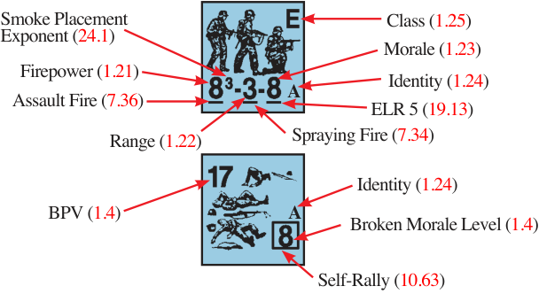

## 1. PERSONNEL COUNTERS

**1.1** There are two kinds of Personnel counters with several varieties of each. The values of each unit will vary from one nationality to another and are listed on the National Capabilities Chart (A25).

**1.11 SINGLE-MAN COUNTER (SMC):** SMC are *elite [EXC: Partisans]* units which bear a single silhouette and represent just one man. There are two types of SMC: leader and hero. Each is described in detail later.

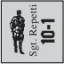

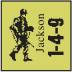

**1.12 MULTI-MAN COUNTERS (MMC):** MMC are units which bear the silhouette of more than one man and represent a number of men who perform as a group. There are three types of MMC: squad, HS, and crew. A vehicle’s *inherent crew* is not a MMC until it leaves the vehicle and takes the form of a counter.

**1.121 SQUAD:** A squad counter bears the silhouette of three men, and for game purposes represents approximately ten men, although historically the squad might range in size from seven to 15 men (depending upon nationality, date, and circumstances). Each nationality has at least three types of squads *[EXC: Partisans]* defined as either Elite, First Line, Second Line, Green, or Conscript.

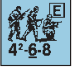

**1.122 HALF-SQUAD (HS):** A HS counter bears the silhouette of two men and represents roughly five men who perform as a group. A HS comes into play when a squad is Reduced or Deploys into two HS. A broken HS has a printed Morale Level one \< that assigned to a broken squad of the same Class and nationality *[EXC: Japanese elite and 1st line HS have the same broken Morale Level as a squad]*.

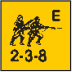

**1.123 CREW:** A crew counter bears the silhouette of two kneeling men and represents roughly five men with special training who perform as a group to operate special weapon counters. A crew also represents picked men who are the best of their company regardless of their Morale Level as evidenced by their Self-Rally capability (10.63). As such, *Infantry* crew counters are always considered elite troops with a printed Morale Level equal to that of their nationality’s Good Order elite squads as well as FP and Range factors of two. This Strength Factor serves to differentiate Infantry crew counters from dismounted *vehicular* (and thus non-elite) crew counters (D5.1).

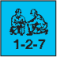

**1.2 MMC CAPABILITIES:** Each MMC and hero counter contains a three-digit hyphenated number called its Strength Factor which quantifies its capabilities in the game.

**1.21 FIREPOWER (FP):** The leftmost number of the Strength Factor represents the FP it can attack with in combat prior to any modification. The numerical exponent listed after the FP number on some squad types is the Smoke Placement Exponent (24.1). If the FP number is underlined, the unit may use the Assault FP bonus (7.36) during its AFPh. Leaders, although Armed, have no inherent FP.

**1.22 RANGE:** The middle number of the Strength Factor is the number of hexes away from the hex occupied by that unit which it can reach with its FP under normal conditions (hereafter referred to as Normal Range).<sup>2</sup> The range to a target is always the least number of hexes from the firing hex to the target hex (inclusive of only the latter), regardless of the actual number of hexes crossed by the LOS. If the Range number is underlined, the unit may use the Spraying Fire Option (7.34). Leaders have no Normal Range.

**1.23 MORALE:** The third number of the Strength Factor is the relative rating of a unit’s ability to withstand punishment before “breaking”. This Morale Level is the point at which its will to survive overcomes discipline and, consequently, the player’s control over the unit. When this point is exceeded during a MC the unit is flipped over to its broken side (see 10.4). If the Morale Number is underlined, the unit is given an ELR of 5 and if subject to ELR failure (19.13) is either Replaced by two broken HS (if a squad) or Disrupted (if a HS) *[EXC: SSR-defined units; 19.132]*.

**1.24 IDENTITY:** A *letter* follows the Strength Factor of each squad or HS to provide a means of distinguishing it from similar units. Crews are identified by a *numeral* above the silhouette. A corresponding alpha-numeric symbol is also listed on the back (broken) side of each unit.

**1.25 CLASS:** Every Squad/HS contains a letter or number in the upper right-hand corner which defines its Class, ranging in descending order from: E (Elite), 1 (1st Line), 2 (2nd Line), G (Green), to C (Conscript). Occasionally a circle or square encases the letter/number to differentiate between different types of the same Class (see A25: National Capabilities Chart). These Classes are important in that they affect a unit’s capabilities and also determine what units can be substituted for them during Deployment, ELR Replacement, or Battle Hardening.

<!-- pdf-page 45 -->

**1.3 COMPONENT PARTS:** Whenever a squad must be replaced by one or two HS, the component HS must be the corresponding HS for that Class and type as listed on the A25 chart and represented by the same Class/type symbol. Any excess FP, Range, or Morale lost in the exchange are forfeit due to the lessened confidence and efficiency of a split squad.

**1.31 DEPLOYMENT:** A Good Order squad with a Good Order leader in the same Location may attempt, in their RPh, to split into two equal HS by having that squad pass a leader-modified NTC *[EXC: Finns (25.7), Guards, Carrier HS, unarmed units (20.5), and U.S.M.C. 7-6-8s do not require lead- er direction to Deploy]*. A leader may attempt to Deploy only one Good Order squad in that Location per RPh, and a squad may be subject to only one Deployment attempt per RPh (see also Setup Limitations; 2.9). A squad’s possessions can be freely rearranged among its HS when Deployed. Regardless of the outcome, neither leader nor squad may attempt any other action in that RPh.

**1.32 RECOMBINE:** Any two Good Order HS of the same nationality with an identical Strength Factor may automatically Recombine as their sole action in that RPh into a squad of the same type and Class at the start of any RPh in which they occupy the same Location and terrain (see 2.8) with a friendly Good Order leader *[EXC: Finns, Guards, Carrier HS and unarmed HS do not need leader presence to Recombine]*. A Fanatic HS and non-Fanatic HS may Recombine, but the resulting Squad is not Fanatic. The sole activity of that leader during the RPh is to permit the Recombination of any eligible HS in his Location.

**1.4 BROKEN SIDE:** The reverse of each Personnel unit *[EXC: Hero (15.2); Japanese squads (G1.1) and leaders (G1.41)]* is its broken side. A broken unit has one (leader), two (HS/crew), or three (squad) prone or kneeling silhouettes to identify its size. The large number in the lower right-hand corner is its broken Morale Level (see 10.4). If the broken Morale Level is encased in a square that unit is capable of Self-Rally (10.63). The smaller number in the upper left-hand corner is its Basic Point Value (BPV) for Battlefield Integrity and DYO uses. Broken units have no FP or Normal Range.

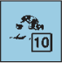

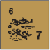

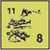

**1.5 SPECIAL STATUS:** In addition to the capabilities given to an Infantry counter by its Strength Factor, a SSR or DYO purchase can specify that certain counters have unique capabilities due to their specialized role (H1.22-.24).

**1.6 UNIT SIZE NUMBER (US#):** Each unit has an inherent Unit Size Number which approximates its relative size in terms of bulk, number of men, and/or difficulty to conceal which is used for certain rules (Concealment, 12.12; Guarding Prisoners, 20.5; Set DC, 23.7). Personnel units have a US# equal to the number of silhouettes on their counter (SMC: 1; Crew/HS: 2; Squad: 3). Horses and all other <sup>5</sup>/8" counters have a US# of 4 as do their Riders or attendant crews *[EXC: Any vehicle or Gun classified as large or very large (red* H*, AF, or M#) has a US# of 5]*.

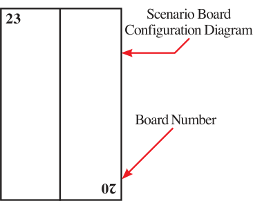

**N**

North

## 2. THE MAPBOARD

**2.1 BOARD CONFIGURATION:** The mapboard consists of all specified board sections depicted in the scenario Board Configuration Diagram, butted together to form one playing surface. Each of the separate board sections is geomorphic and can be butted together with others in many ways to form different playing areas. The corner of each board depiction in the Diagram contains a board number that corresponds to the yellow board number printed in hex B8 of each board, and indicates precisely how each board should be positioned. The letter N and an accompanying arrow on the Diagram indicate North with respect to the mapboard. Superimposed over the mapboard is a hexagonal grid used to measure movement/range to an abstracted scale of 40 meters per hex. Each hexagon contains a specific type of terrain which affects movement and attacks in or through that hex, as well as a white dot (or square) which marks the center of the hex. As most attacks are measured from center of hex to center of hex, these dots are usually the reference points for determining LOS.

**2.2 GRID COORDINATES:** Each hex contains its own identifying grid coordinate. A grid coordinate is composed of the board number, hex row letter, and hex number within that hex row. Whenever two boards are butted together, the half-hexes of each board edge combine to form an entire hex. If only one of these half-hexes contains a grid coordinate, use that grid coordinate to refer to the combined hex. If neither or both hexes contain a printed grid coordinate, the hex derives its board number and row letter from the northeastern most board of those two in the mapboard configuration. The row position number would be either 0 or 10 depending on the coordinate of the adjacent hex in the identifying row. If such combined hexes contain two hex center dots, the dot used is the one belonging to the board used to designate the composite hex. If no hex center dot is visible in a composite hex, the hex center must be estimated. If it is necessary to pinpoint a vertical level (other than the ground level) within a hex, a lower case “h” (for height) should be suffixed to the coordinate, along with the elevation level of the Location within the hex. A unit inside an entrenchment or pillbox (rather than just in the same hex) should be noted by the suffix “En” or “Pi”. A unit in a Wire or Bridge hex should be noted by recording “Wire/” or “Bridge/” before the coordinate if beneath the Wire or Bridge counter; otherwise, it is considered on top of the counter. A unit that is a Passenger or Rider is noted by the suffix “P” or “R” and the name and ID of the vehicle conveying it. A unit in Crest or HD status adds a suffix consisting of “/CR” or “/HD” and the grid coordinate of the hex which the center of that Crest/HD counter faces. In some instances, a record should also indicate the CA of a unit within a hex; this can be added merely by suffixing “ca x/y” where x/y defines the hexspine of the CA. When stating Bypass Movement, the first of the two coordinates (or three in the case of a Vertex) given is always the hex actually being passed through (EX: Bypass in F3 along the F3-E3 hexside is always expressed as F3-E3; not E3-F3). EX: 1E4h1 refers to the first level of the building in 1E4. 1E4h-1 refers to the sewer level beneath the building in 1E4. 1E4caD3/D4 refers to a unit at ground level in 1E4 with a CA centered on the hexspine which is the D3-D4 hexside.

**2.3 HALF-HEXES:** Mapboard edge half-hexes not butted together to form a full hex are still playable and have the same effect as full hexes. Units allowed to set up/enter anywhere on a given board may set up/enter on that board’s half-hexes only if the half-hex is either part of another board on which it is also allowed to set up/enter or is not butted against another half-hex. Similarly, occupation of a board’s half-hexes will satisfy occupation of that board for any applicable Victory Conditions only if they are not butted against other non-qualifying half-hexes. In the rare instance in which an Open Ground half-hex is butted together with another terrain type half-hex, the combined hex is considered that non-Open Ground terrain type.

**2.4 CUMULATIVE TERRAIN EFFECTS:** Terrain effects and movement costs of hexes containing more than one terrain feature (such as 2I9) are cumulative unless specified otherwise by the rules governing the involved terrain types. EX: Barring use of Bypass movement, it costs Infantry four MF to enter hex 2I9, and Small Arms Fire into that target hex will be modified by a +3 DRM to the IFT DR regardless of which hexside is crossed.

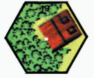

<!-- pdf-page 46 -->

**2.5 ENTRY:** All forces scheduled to arrive on a certain turn must enter the mapboard on that turn—although if capable of movement in the APh, entry may be delayed until then. If entry was to have been via a certain hex, but that hex is unenterable due to being occupied by an enemy unit during the friendly MPh (see 4.14), or is otherwise blocked by rubble or Blaze (even if the rubble or Blaze is not in that particular hex but does cut it off from the remainder of the board), entry must be made in a non-obstructed hex within four hexes of the scheduled entry point, but one Game Turn later. If all hexes are still obstructed, the radius of permissible entry is extended another four hexes in both directions at a cost of another turn’s delay, and so on. However, delayed entry is never voluntary and can never be used to appear on the other side of a river/canal instead of the side originally scheduled.

**2.51 OFFBOARD SETUP:** Units designated by a scenario as having to enter the mapboard (rather than setting up on it) must still be set up offboard on the turn of entry as the first act of the RPh of that Player Turn. This is done by placing any randomly chosen unused board(s) adjacent to the mapboard edge(s) the ATTACKER’s units are to enter. The offboard player then places all forces scheduled to arrive during that turn on any *whole hex(es)*. If only part of a board is in play, only the actual road hexes on the unused portion are “off board” road hexes. Fire and LOS between the mapboard and any setup board is not allowed (including the overlapping Blast Area of a FFE). However, offboard units may move normally on the offboard map so as to enter the mapboard on a hex which is not adjacent to the one they set up in, provided they were not scheduled to enter via a specified hex which is not blocked. All terrain on an offboard setup map is considered Open Ground except for off-map half-hexes which are butted against a half-hex of some other terrain type and hex rows Y, Q, and I which are road hexes if the board is butted lengthwise. If the board is butted widthwise, all offboard hexes with a coordinate of 5 are considered road hexes. Roads share the same status as the majority of on-board roads of the adjacent board (i.e., paved, plowed, or muddy). Entrance of an offboard setup hex on the way to entering the mapboard always costs the standard Open Ground MF/MP rate per hex (or standard road movement rate if on a road) except where scenario weather conditions increase the cost of such basic movement.

**2.52 OFFBOARD ACTIONS:** No action is allowed by units offboard awaiting entry *[EXC: An off-board squad capable of Deployment may at- tempt to Deploy in its RPh if stacked with a leader; see Setup Limitations (2.9)]*. However, SW/ordnance may start dismantled/limbered, and an AFV may start CE or BU. Vehicles may start loaded up to their normal capacity and are assumed to be in Motion (D2.4). Units setting up on-board have these same options except that on-board vehicles may not set up in Motion unless so stated by SSR.

**2.6 EXIT:** Units may leave the mapboard using normal MPh/APh capabilities from any mapboard edge hex or half-hex as if they are entering an imaginary off-board hex which is the mirror image of the one they currently occupy. Bypass can be claimed to exit a hex (such as 2X0) only if the unit has one additional MF/MP in excess of that needed for Bypass. The mapboard cannot be left during the RtPh. Units which leave the mapboard *[EXC: glider contents (E8.5); paratroops (E9.41)]* may not return.

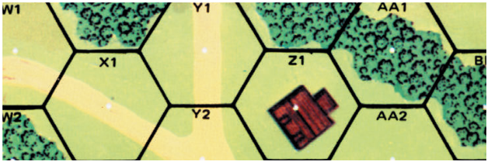

EX: Mapboard exit of 2Y1 can be done at the road movement rate, but mapboard exit of W1 must be done at the Open Ground rate. Vehicular mapboard exit of AA1 can only be done if the vehicle had actually paid to enter the AA1 woods obstacle and then pays to enter another woods obstacle offboard or to enter BB0 and exit at the Open Ground rate. A squad in X1 wishing to exit the mapboard directly through X0 can use Bypass (one MF) to reach vertex X0-W1-(non-existent) W0 from where it can expend the required one excess MF to exit the mapboard in Open Ground through the mirror image of W1.

**2.7 OVERLAYS:** A scenario may require the modification of a mapboard prior to play by the placement of an overlay on that board in a specific location. Such a placement will be mentioned by SSR and indicated on the Scenario Board Configuration diagram.

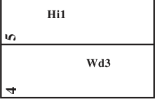

**2.71 CUTTING OUT OVERLAYS:** Overlays have been provided in a number of products, including *WEST OF ALAMEIN*, *CODE OF BUSHI- DO*, *GUNG HO!*, *CROIX DE GUERRE*, *DOOMED BATTALIONS*, *AC- TION PACK #2*, and Deluxe overlays in *ANNUAL 95w* (with Deluxe replacements in The GENERAL, Vol. 30 #3). See rules section F12 for cutting out the overlays provided in WEST OF ALAMEIN, section G.9A for cutting out overlays 1-5 in *CODE OF BUSHIDO*, and G13.14 for cutting out Effluent overlays in *GUNG HO!*. For other overlays, cut each one <sup>1</sup>/8" outside of its exterior hexside (approximately to the tip of its partial hexspines).

##### 2.72

**2.72** Most overlays contain no hex coordinates, but the front of each multi-hex overlay contains a small “1” in one hex and a small “2” in an adjacent hex; these numbers are used to orient the overlay on its board (see G13.1 for Beach and OCEAN overlays). Pressing a few small pieces of plastic adhesive (such as PLASTI-TAK© or PLAS-TIC©, which are usually available where office/ school supplies are sold) onto the back of the overlay is an easy and effective method of attaching it to a board for the duration of a scenario. Alternatively, a sheet of appropriately sized plexiglass may be laid over the playing area after the overlays have been placed.

**2.73 SSR PLACEMENT:** When a SSR calls for the use of one or more overlays, it will specify the board on which it will go and, if a multi-hex overlay, will also list the coordinates of two adjacent hexes that determine the overlay’s orientation. The first hex listed is covered by the overlay hex that contains the “1”, and the second is covered by the overlay hex that contains the “2”. If two or more overlays overlap—even if just along one of their exterior hexsides—each should be placed onboard in the order it is mentioned in the pertinent SSR. For single-hex overlays, the top of the alpha-numeric ID should be oriented with the grid coordinate of the hex. On the scenario card, the “board configuration” will contain the overlay’s ID in its approximate placement location. When recording hex coordinates for hexes covered by an overlay, insert the letter “o” between the board number and the grid coordinate (e.g., 32oE7). EX: A SSR states “Place Overlay H1 on 27H6-G7”. The hex of Overlay H1 that contains the “1” is therefore placed over hex 27H6, and that containing the “2” is placed over hex G7.

##### 2.74

**2.74** Once positioned onboard, only the overlay’s (or topmost overlay’s, should two or more overlap) hexsides and vertices—not those covered over by it—matter for rules purposes. In addition, treat any extraneous terrain (e.g., a sliver of wall/hedge/building not completely covered by the overlay; a portion of brush/water terrain protruding into an adjacent hex of another terrain type) as Open Ground. If a mapboard wall/hedge hexside forms a hexspine of an overlay hex, the overlay portion of that hexside (vertex included) is still a wall/hedge hexside (B9.1). This, of course, does not apply to a wall/hedge hexside that is covered by the overlay.

**2.75 SPECIFIC OVERLAYS:** Overlays 1-3 are used on boards 34-37, and can be placed on D2-D1, N8-N9, T2-T1 or DD8-DD9. Overlay 4 is used only on board 34. Overlay 5 can be placed on 34K2-K1 or 34O9-O10, and on boards 35 and 37 on K2-K1, O9-O10, S2-S1 or W9-W10. Overlay E1 is used only on board 25. Overlays 4 and E1 must be placed on top of the hexes bearing the same grid coordinates. Overlay OW1 is specifically designed for use on 45K4-J4 but can be used elsewhere as well. See G13.1-.15 for Beach, OCEAN, Effluent, and Island overlays. The remaining overlays can be used almost anywhere on practically every board.

<!-- pdf-page 47 -->

**2.76 WADIS/STREAMS:** If the “end-hex” of a wadi/stream overlay is adjacent to another wadi/stream (whether the latter is an overlay or not), or if two wadi/stream “end-hexes” (whether overlay hexes or not) are on different boards but are adjacent to each other, each hexside common to both such wadi/stream hexes is treated as a wadi/stream hexside (i.e., the two wadis/streams are treated as one continuous wadi/stream) except where a wadi/stream cliff is present *[EXC: for LOS/LOF purposes, that hexside is considered a wadi/stream hexside only if the LOS/LOF begins in/IN one of those two wadi/stream hexes and ends in/IN the other]*.

**2.8 LOCATION:** A hex may contain separate subdivisions within itself (i.e., units may occupy the same hex but still be in separate Locations within that hex). The most common application of this is when additional vertical levels exist within the horizontal dimensions of a hex. Thus sewers/tunnels/caves below ground level and/or upper building levels above ground level, a bridge, and/or a pillbox create additional Locations, each with their own stacking limits, entry costs, and confined space. Each hex contains one Location, unless a sewer, tunnel, cave, bridge, pillbox, or upper building level creates one or more additional Locations within that hex. A leader on one level cannot affect the performance of units on another level (i.e., a Crest leader cannot affect units IN a Depression). Even when additional vertical levels or a pillbox do not exist within a hex, units in the same hex can be subject to different movement costs or TEM due to occupation of different features within that hex. For example, units in an entrenchment or AFV are subject to different effects than other units which share the same Location, but are in different terrain features within that Location. Entrenchments and vehicles are not considered different Locations within the hex they occupy. EX: A HS in an entrenchment with a leader may not Recombine with another HS outside that entrenchment but in the same hex, even though they are in the same Location. However, that same leader could assist the HS outside its entrenchment with any MC or Rally attempts it makes.

**2.9 SETUP LIMITATIONS:** A unit/weapon may not set up overstacked or in a hex it could not enter during the normal course of play, but vehicles can set up free of Bog/Immobilization in hexes whose entry might cause Bog. See D4.221 for the possibility of vehicles setting up in HD status. Infantry may always set up in Crest status (B20.9). No enemy stack (i.e., all units/ SW/Guns/entrenchment-counters in a given Location) may be inspected prior to the start of play (see also 12.12 & 12.3). Up to 10% (FRU) of the squads that set up on-board, and up to 10% (FRU) of the squads that enter in a given turn, may be freely Deployed (without leader/TC) prior to setup, if the nationality is capable of Deployment.

## 3. BASIC SEQUENCE OF PLAY

Each Game Turn represents two minutes of actual time and consists of two Player Turns, each consisting of eight Phases. The player capable of movement in his Player Turn is termed the ATTACKER; his opponent is the DEFENDER. A basic Sequence of Play comprising a Game Turn is presented below, and a more detailed version is provided on the Advanced Sequence of Play (ASOP) divider.

**3.1 RALLY PHASE (RPh):** Both players may attempt to repair weapons, rally broken units, etc. Each unit may attempt only one type of action in a RPh. EX: If a squad rallies during its RPh, it may not attempt to Deploy in the same RPh (even if directed by a different leader).

**3.2 PREP FIRE PHASE (PFPh):** The ATTACKER may fire SMOKE with ordnance/OBA, fire any of his units capable of fire, designate Opportunity Firers, or perform labor tasks. Place a Prep Fire counter on those units which fire, a Bounding Fire counter on Opportunity Firers, and a TI counter on those units which perform labor tasks.

**3.3 MOVEMENT PHASE (MPh):** The ATTACKER may move any units capable of movement which, during the PFPh neither fired, nor became marked for Opportunity Fire, nor attempted a labor task. Units are subject to the effect of the DEFENDER’s First Fire as they move. The DEFENDER places a First Fire counter on any of his units which fire unless it retains a Multiple ROF (9.2).

**3.4 DEFENSIVE FIRE PHASE (DFPh):** The DEFENDER may fire any of his units that are capable of fire, and not yet marked with a First Fire counter at any enemy units currently within their LOS. He places a Final Fire counter on any of his units which fire. He may also fire those units marked with a First Fire counter, but only at adjacent enemy units and only under the constraints of Final Fire. Flip their First Fire markers over to the Final Fire side as they fire. Remove all First and Final Fire counters at the end of this phase.

**3.5 ADVANCING FIRE PHASE (AFPh):** The ATTACKER’s units which did not fire in the PFPh or attempt to perform a task requiring TI status may fire at half FP (see C.4 for ordnance/vehicular fire) *[EXC: FT/MOL/ DC (22-23) and Opportunity Firers (7.25) attack at full strength]*. Remove all Prep Fire and Bounding Fire counters at the end of this phase.

**3.6 ROUT PHASE (RtPh):** Broken units of both sides may seek cover, with the ATTACKER routing his units first (10.5). Units need not rout unless AD- JACENT to an unbroken, Known enemy unit *[EXC: Passengers; D6.1]*, or if in Open Ground and in the LOS and Normal Range of a Known enemy unit.

**3.7 ADVANCE PHASE (APh):** The ATTACKER may move any of his Infantry units capable of movement (4.7) one hex (even if the hex moved into is currently occupied by enemy units) or he may change Location within his current hex. A unit may never change Location within a hex *and* enter a new hex in the same APh.

**3.8 CLOSE COMBAT PHASE (CCPh):** Units of both sides occupying the same Location resolve their CC attacks; any survivors which have not withdrawn are considered in Melee. The ATTACKER places a “?” counter on any of his eligible unconcealed units as per 12.12-.122. Remove all TI/Pin counters. Flip CC counters over to Melee side or remove them.

```text
TURN RECORD CHART                Only one Player Turn (German) in last Game Turn
      RUSSIAN Sets Up First      1     2     3     4     5     6   END
GERMAN Moves First [150]
```

**3.9 TURN RECORD CHART:** Step 3.8 ends the AT- TACKER’s Player Turn. The previous DEFENDER now becomes the ATTACKER, inverts the Turn counter on the Turn Record Chart, and repeats steps 3.1— 3.8. At that point one complete Game Turn is finished and the Turn Counter is reinverted and advanced one box on the Scenario Turn Record Chart. When the Turn Counter is placed on the “END” box, the scenario is over. *[EXC: If a Scenario Turn Record Chart has numbered turn boxes beyond the “END” box, then the scenario does not end; the Turn counter must advance off the end of the Turn Record Chart, back to the beginning, and then on to the “END” box again before the scenario ends.]* If a Turn number and “END” are printed in gray instead of black those turns and consequently the end of the game are provisional based on some occurrence specified by a SSR. If a Turn box is halved diagonally and printed in red it indicates that only the first side to move has a Player Turn during that Game Turn. Other symbology or numbers appearing in a Turn box are reminders to check for reinforcements or the application of a SSR for the indicated side during that Game Turn.

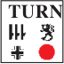


## 4. INFANTRY MOVEMENT

[Players should check the Index for definitions of “Infantry” and“Personnel” before proceeding further.]

<!-- pdf-page 48 -->

**4.1 BASIC MPh:** During his MPh, the ATTACKER may move all, some, or none of his Infantry units provided they did not fire during the PFPh and are neither broken, TI, designated to use Opportunity Fire, nor held in Melee. Infantry can be moved in any direction or combination of directions up to the limit of their movement allotment, which is measured in Movement Factors. Infantry units may move over and stack on top of other friendly units, although their ability to do so with enemy units during the MPh is restricted to a few specific cases (see 4.14). Each unit’s movement allotment may be increased, decreased, or restricted by certain circumstances.

**4.11 MOVEMENT FACTOR (MF):** Every Good Order MMC has a four MF allotment *[EXC: three if Inexperienced]* and every Good Order SMC has a six MF allotment with which to move in its MPh *[EXC: The MF allotment of a SMC is reduced to four MF if it mounts, rides, or dismounts any form of conveyance during that Player Turn. Wounded SMC (17.2) and Inexperi- enced Infantry have their MF allotment increased to four MF if they mount, ride, or dismount any conveyance during that Player Turn]*. A MF bonus of one can be earned for road movement (see B3.4). A MF cannot be transferred between units nor can it be accumulated from turn to turn. All Personnel and Horse-Drawn transport use MF as opposed to vehicular counters which use Movement Points (MP).

**4.12 LEADER BONUS:** Any Good Order MMC which begins the MPh/ APh and ends its MPh/APh stacked with a leader of the same nationality in the same Location, at the same level (2.8), and with the same Wire/entrenchment/panji/paddy status is eligible for a two MF bonus during that MPh/APh, provided it expends all its MF while moving in a combined stack with that leader, and does not expend any of its MF to mount, ride, or dismount any form of conveyance.

**4.13 TERRAIN EFFECTS:** Whenever Infantry moves into a hex during the MPh, it expends MF for that turn equal to the cost of the terrain within that hex as listed on the Infantry column of the MF Entrance Cost portion of the Terrain Chart/Desert Terrain Chart/PTO Terrain Chart, unless using Bypass movement.

**4.131 HEXSIDE COSTS:** Certain types of terrain depictions conform to hexsides. When crossing such a hexside to enter a new hex, an Infantry unit pays a specified number of MF for crossing that hexside *plus* the Cost of Terrain (COT) of the hex entered.

**4.132 ROAD:** Infantry entering a hex via a road hexside must pay either the road entry cost or the cost of other terrain in the hex. Road movement costs for Infantry are not cumulative with that of other terrain in the same hex (except for SMOKE). If Infantry pays the cost of other terrain in the hex, it is considered in that terrain and avoids FFMO DRM unless that other terrain is Open Ground. If any LOS Hindrance (such as SMOKE) or Artificial Terrain (such as AFV/wreck) is present, FFMO is negated even though the unit uses Road movement. Otherwise, if it pays only the road entry cost, it is subject to FFMO DRM (4.6) in that hex if the LOS can be traced to *either* of the two target points (a/b below) in that hex without crossing an obstruction in that hex. If the target enters at the road rate, the firer has the option of tracing LOS to either: a) the hex center dot, or b) the point where the hexside crossed intersects the road used. If the LOS to one target point is blocked, the firer can still fire at the other with no additional penalty. (See Examples at right.)

**4.133 ELEVATION CHANGE:** The MF cost for Infantry, Cavalry, and Horse-Drawn transport entering many terrain types is doubled while moving into a new hex one level higher than that previously occupied (see B.2). There is no penalty for moving along the same level of high elevation hexes, nor is there a lessened cost for moving from higher to lower elevations *[EXC: bi- cycles (D15.81), skis (E4.31)]*. There is no penalty for moving to a lower elevation hex except in the case of Abrupt Elevation Changes (B10.51) and Ground Snow (E3.723). (See Example at right.)

4.132 EX: A squad entering 5I4 at a cost of one MF would be subject to a -1 TEM for fire from G2, J3, K3, or L2 if the squad used Assault Movement, or a -2 TEM if it did not; there would be no woods TEM. However, if the squad entered I4 at a cost of two MF without using Assault Movement, only the FFNAM (-1) and Woods TEM (+1) would apply (cumulatively). Fire from I5 or J4 to I4 (represented by the blue arrows) would never receive the -1 FFMO DRM because it must trace its LOS through the Woods depiction in I4. Fire from H4 or I3 would qualify for the -1 FFMO DRM (red arrows) only if the unit entered I4 at the one MF rate across the H3-I4 hexside, because otherwise it would have to trace its LOS through the woods depiction in I4 (blue arrows). Similarly, Infantry could use the road in 5I10 to enter the building in I9 at a cost of one MF but if it did, it would be subject to the FFMO DRM (and no building TEM) for fire from any adjacent hex (except I8, whose LOS cannot reach either the hex center dot or any point on the road depiction of the I9-I10 hexside without first encountering the building obstacle). 4.133 EX: Hex 3W4 costs two MF to enter from hexes V4, W5 or X4. It costs four MF to enter from V3, W3 or X3 because the unit is moving to a higher elevation.

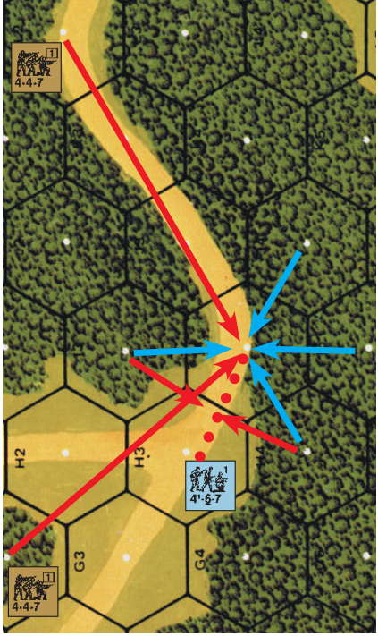

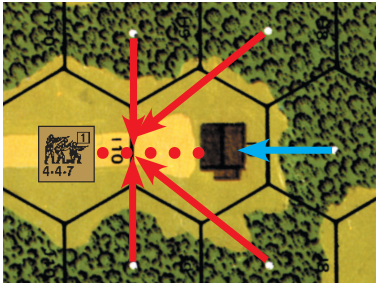

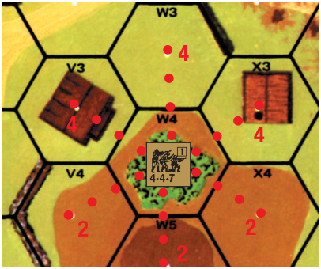

**4.134 MINIMUM MOVE:** An Infantry unit retaining at least one MF after deducting for portage costs exceeding its IPC, may make a Minimum Move of one hex during its MPh, even if CX or lacking the MF to pay the full entry cost of the hex *[EXC: Infantry pushing a Gun or loading/unloading may never Minimum Move]*. After a unit has entered a hex by Minimum Move and undergone all First Fire, all unbroken survivors become both pinned and CX (even if CX previously). If the entry cost of a hex is defined as “all” of a unit’s MF and there is still yet another cost to be paid beyond that, a Minimum <!-- pdf-page 49 --> Move can still be made. However, a Minimum Move cannot be made to enter terrain whose entrance cost is listed as NA (Not Allowed). In any case, the unit is considered to have spent the actual MF cost of entry. EX: A CX Russian squad with a HMG in 3W3 (see previous illustration) lacks the necessary four MF to enter W4, but may do so anyway by claiming a Minimum Move and becoming both CX and pinned. Consider it to have spent 4 MF. EX: It takes all of a unit’s MF to enter Marsh, but if entering it from a lower level hex (e.g., from 13J5 to K5) it would cost two times all of its MF and therefore could be entered only as a Minimum Move. An Inexperienced MMC would have spent 6 MF, while a SMC would have spent 12 MF.

**4.14 ENEMY UNITS:** Infantry may not move into the same Location containing an unconcealed enemy unit during the MPh *[EXC: Berserk (15.43), Human Wave (25.23), Disrupted (19.12), Unarmed (20.54), and Infantry OVR (4.15)]*, but may do so during the APh. However, PRC (7.211, D6.5) and charging Cavalry (13.61) can dismount in such a hex during the MPh.

**4.15 INFANTRY OVR:**<sup>3</sup> An Infantry MMC may enter in the MPh a Location containing only one Known enemy SMC (unless that SMC occupies an AFV) at double the total MF cost of entry provided it has passed a NTC to enable it to enter the Location *[EXC: Berserk (15.432)]*. A leader may exempt all MMC he is stacked with and moves with from that NTC by passing it himself but if he fails, no unit in his stack may attempt a NTC individually nor may any of those units move or take any other action during that phase (10.1). A unit may take its NTC at any time during its MPh prior to entering the enemy Location (or in the enemy Location in the case of entry of a Location containing only a concealed SMC), but must add a DRM equal to the TEM (and any applicable LOS Hindrance in—not between—that Location such as SMOKE, grain, or orchard) of the enemy-occupied Location it wishes to enter (hexside TEM apply only if the present LOS crosses that hexside). If other (concealed) units are in the same Location, 12.15 would apply. More than one SMC must be revealed to deny a Location to an enemy MMC capable of OVR. Other MMC could attempt subsequent Infantry OVR attacks but each would require a separate NTC.

**4.151 SMC OPTIONS:** The SMC being OVR has two options if in Good Order. It may attack the moving units on the IFT normally (non-heroic leaders with no SW have no such FP) with PBF/TPBF as applicable, and then, if the MMC is in the SMC’s Location, engage in immediate CC during that MPh; *or* the SMC may immediately, prior to any Defensive First Fire vs the ATTACKER, enter (free of all enemy fire) into any adjacent Accessible Location of the ATTACKER’s choice which is not occupied by an enemy unit. The ATTACKER may not force the SMC into a minefield, FFE, Wire, or Open Ground hex if an alternate choice is available as the ATTACKER’s MMC enters its hex. If the SMC is broken, pinned, already held in Melee, TI, occupying a vehicle, or otherwise incapable of movement it does not have this movement option, and its attack options are restricted as befits its status. This movement or attack option can be used by the same SMC again during that MPh if it is OVR by Infantry again, provided it is not now held in Melee.

###### 4.152 CC

**4.152 CC:** If, after Defensive First Fire, the SMC remains in its Location with the entering MMC, normal CC immediately ensues during that MPh. Should the SMC be eliminated or captured, the OVR unit(s) which defeated it may continue their MPh from that Location with any remaining MF allotment. Other units which have not already ended their MPh may then also transit the Location during that MPh. Should the SMC survive this initial CC, it and the OVR units are considered in Melee, marked with a Melee counter, and subject to CC again in that Location in that turn’s CCPh. Should another MMC attempt to OVR it while the SMC is in Melee, that MMC may attack it in CC (even though the SMC has already been attacked during that MPh and may not attack back in that MPh) but only the newly arriving attacking unit(s) is eligible to continue movement with any remaining MF in that MPh if successful.

**4.2 MECHANICS OF MOVEMENT:** Whenever a player moves a unit during his MPh he states aloud the MF expended by that unit in entering each hex or in performing any other activity within its current hex. If the unit is going to end its MPh there it must state so before moving another unit. The player is not allowed to take the unit back to a previously occupied hex and begin again *[EXC: If a unit’s move is illegal, either player may cite the ille- gal move and demand the move be retraced from the last legally entered hex unless another unit has moved, fired, or performed any other action in the interim]*. Once a unit moves, stops, and another unit moves, the original unit may move no farther during that MPh. Infantry may be moved one unit at a time unless berserk (15.43), in Column (E11.52), or a MMC is using bonus MF gained by being part of a Human Wave (25.23), or moving with a leader, or gaining added TEM (D9.31) for moving with an AFV. Otherwise, units may choose to move together as a stack at their own risk and may break up the stack during the MPh to continue to move separately but all members of that moving stack must end their MPh before another unit not in that stack may move.<sup>4</sup> Units moving as a stack expend MF simultaneously and need not spend MF for the same purpose, but must designate at the same time all actions for the same MF.

**4.3 BYPASS:** Bypass enables unbroken Infantry to move through a building/woods hex without entering the obstacle in that hex (and consequently having to pay the two MF cost of actually entering a building or woods), whenever that obstacle does not physically touch the hexside being Bypassed. Bypass cannot be used to skirt the edges of any other terrain feature (including gully-woods), nor an obstacle that is Ablaze or contains an armed non- Disrupted (19.12) Known enemy unit. Hexes containing rubble or Wire cannot be Bypassed. A hexside forming a part of a Wire Location, or covered by a Water Obstacle (24L9-M9), may not be Bypassed (B26.44) on either side of the hexside; roadblocks also have Bypass restrictions (B29.4). SMOKE does not prevent Bypass but adds to the MF cost (24.7) of transit through the hex. Bypass may be used in a mined woods/building hex but does not prevent mine attacks. Use of Bypass movement does not prevent placement of a DC (23.3) or SMOKE grenade (24.1). Bypass must be announced with the expenditure of MF as the unit moves inside the building/woods hex. A unit that decides to occupy an obstacle it is currently Bypassing must pay the entire in-hex MF cost to enter that obstacle even though it is already in the hex.

##### 4.31

**4.31** The movement cost of Bypass becomes that of the other terrain in the Location—usually one MF for Open Ground or two MF to enter higher elevation Open Ground. *[EXC: The building in building-woods hex 2I9 can be Bypassed along the I9-J9/I9-J8 Open Ground hexsides at a cost of one MF, or along two of its four woods hexsides at a cost of two MF (for moving around the building through the woods), rather than paying the normal entry cost of four MF for the hex.]* Bypass may consist of one or two contiguous unblocked hexsides of the building or woods hex being traversed. Bypass may exceed two contiguous unblocked hexsides per hex, but in so doing the Bypass cost for that hex is doubled. Remember that the unit is moving *around* the obstacle within the hex—not through it. Should there be any question whether a building or woods symbol touches a hexside, Bypass in that hex is blocked (i.e., is not allowed) along that hexside. Walls and hedges are considered extensions of hexsides for purposes of applying the mechanics of this rule; therefore if a wall/hedge depiction touches a building/woods depiction, bypass is blocked along that hexside. EX: The squad in 2D3 may Bypass D4 by moving in D4 along the D4-C4 and D4-C5 hexsides at a cost of one MF. However, it will cost the squad two additional MF to enter D5 because of the wall hexside, whereas it will cost only one MF to enter C5 even though the wall hexside extends to the D4-C5-D5 vertex. The squad cannot move into any hex other than C5 or D5 at this point during its MPh, unless it expends another MF for continued Bypass to D4-D5-E5 or D4-E4- E5; however, it can enter the building in D4 by expending two more MF.

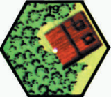

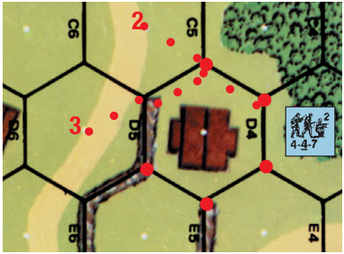

<!-- pdf-page 50 -->

**4.32 BROKEN IN BYPASS:** Infantry that voluntarily ends its MPh in an obstacle hex must pay the full MF cost of that obstacle unless it entered at the road movement rate (4.132); Infantry may not voluntarily end its move using Bypass. If the unit breaks while using Bypass, it remains in the open portion of the obstacle hex until the end of its MPh and is subject to the FFNAM (and usually also FFMO) DRM for multi-hex movement in the open for additional First Fire attacks made against it to or through the hexsides it traversed during that MPh. The broken unit and all portaged equipment are assumed to be in the obstacle during and after Final Fire.

**4.33 PINNED IN BYPASS:** Any Infantry unit that becomes pinned, or involuntarily stranded (24.1), while using Bypass is assumed to be in the non-obstacle portion of the obstacle hex for the remainder of its MPh. After its MPh it is considered in the obstacle itself and entitled to its protective TEM for all subsequent fire. Concealed enemy units in the Location lose that status (12.151) at the end of the moving unit’s MPh.

**4.34 BYPASS LOS:** Infantry using Bypass are subject to special terrain modifiers and LOS rules. A unit firing at a Bypassing unit does not have to trace its LOS to the target hex center, but has the option to make its one allowed LOS check per attack to either hex vertex along a hexside traversed by a unit moving in Bypass (thus a choice of two vertices for one hexside Bypass, three vertices for two hexsides Bypassed, etc.) instead. Should the LOS of a firing unit reach an Open Ground Bypass hexside vertex unobstructed (see also C.5), that unit can claim a LOS and a First Fire -2 DRM for non-Assault Movement in the open. A wall or hedge in the target hex is not an obstacle to LOS even though the target may be in Bypass on the other side of that same target hex (although its TEM would apply if crossed by the LOS). If the firer traces his LOS to the hex center, it must cross a bypassed hexside (thus usually qualifying for a -2 DRM for Non-Assault Movement in Open Ground) before reaching that hex center or the LOS is blocked. If a unit is using Bypass (including VBM) along a Crest Line, and the obstacle it is Bypassing is on the higher level of that Crest Line, then the unit is also at that higher level (since a Crest Line itself cannot be Bypassed; 4.3). EX: Using the previous example, the squad Bypassing 2D4, one can examine a variety of First Fire opportunities against it. As the squad enters D4, it must declare which side of the building it is moving around. If it declares hexsides D4-C4, D4-C5 it can be fired on from C7 with a -2 DRM for FFNAM/FFMO by tracing a LOS from C7 to either the D4-C4-D3 or the D4-C4-C5 Bypass hexside vertices. If it declares D4-E4, D4-E5, however, it is out of LOS from C7 at the D4-D3-E4 vertex because that vertex cannot be seen through the building in D4. The firer can trace its LOF to the D4-E4- E5, D4-D5-E5, or the D4-C5-D5 vertices but the FFMO DRM will not apply due to the wall TEM activated by the LOS crossing the wall at D4-D5. The wall TEM will also apply to the fire directly along a wall hexspine (B9.3) such as that from C5 to the D4-D5-E5 vertex.

**4.4 PORTAGE:** A SW may not move by itself; it must be carried or placed on a vehicle by Infantry/Cavalry at some cost to the latter’s MF allotment. The various SW portage costs are listed on each SW counter in the form “#PP”. Portage cost is assessed per item carried, not distance traveled; even if a unit carries a SW during only one MF expenditure before dropping it, that unit may not recoup the portage cost used for that SW for use in the remainder of its MPh. Otherwise, an unbroken Infantry unit can pick up and drop items at any point in its move provided it has sufficient MF to do so (subject to 4.431 & 4.44). No item can be portaged more than once per phase except as allowed by combined Infantry and vehicle portage within a single phase.

**4.41 AFPh SW FIRE LIMITS:** No MMG, HMG, mortar, INF/RCL SW, or <sup>5</sup>/8" non-vehicular ordnance counter which moved [other than being Recovered (4.44)] during the MPh may fire during the ensuing AFPh *[EXC: German dm MMG/HMG may fire as LMG; 9.8].* However, if such weapons remained stationary while their new owners moved into their Location, they can be fired during the ensuing AFPh with the normal penalties for fire in the AFPh—assuming they were Recovered during that MPh (4.44). A weapon fired during the AFPh cannot use Intensive Fire and is limited to one shot regardless of its ROF *[EXC: if using Opportunity Fire; 7.25]*.

**4.42 INHERENT PORTAGE CAPACITY (IPC):** A MMC has an IPC of three PP, and a SMC has an IPC of one PP.<sup>5</sup> An Infantry unit loses one MF for each PP carried in excess of its IPC. A SMC may never portage more than two PP although one SMC can add its IPC to that of any one Good Order Infantry unit to increase the IPC of the latter, provided the two units start the phase together and move together as a stack. Otherwise, Infantry units may not combine their IPC. A broken unit may not portage anything in excess of its IPC (see 10.4) even if accompanied by a leader. EX: A squad carrying four PP has only three MF left to expend in the MPh, but if accompanied by a leader that same squad has six MF remaining to use in the MPh (unless the leader carries a PP of his own in which case they have five MF left to expend in their MPh).

**4.43 POSSESSION:** All SW/Gun counters belong to the first Personnel unit stacked beneath them. A SW/Gun must be possessed (i.e., on top of a Personnel unit) to be fired or portaged (or pushed). A unit can possess any number of SW/Guns. If a unit breaks and rallies in the same Location, possession of its own SW/Gun is always retained. An *unbroken* unit may drop possession of a SW/Gun at no MF cost during its MPh (and thus need not actually move), APh, or at the start of a CCPh (11.21) in order to Withdraw from Melee.<sup>6</sup> If a unit drops possession of a SW/Gun at the start of an allowed phase prior to expending-MF/advancing/Withdrawing, that SW/Gun is assumed to have been unpossessed (and hence not portaged by that unit) at the start of that phase. Units also drop SW/Guns before they surrender or are captured (20.4), and sometimes before they can rout (10.4). Unpossessed SW in a marsh, shallow or deep stream, and unpossessed SW/Gun in any Water Obstacle, Blaze Location (or burning vehicle), or building Location when rubbled are removed from play.

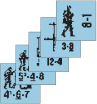

EX: A stack consists of a leader, a LMG, a PSK, and two squads in order from top to bottom. Both SW belong to the 5-4-8 even though it must forfeit its inherent FP to fire both of them that turn.

**4.431 TRANSFER:** Stacks may be freely rearranged to change possession of SW/Guns—but in all cases only between different Good Order unpinned units in the same Location *[EXC: Wire (B26.4); Panji (G9.52); NA between Crest-status units and units IN a Depression]*, and only during a RPh, at the start of their APh, or as a result of the creation of a sub-unit from a MMC. When a Personnel unit drops possession (4.43), is eliminated/ surrenders, or routs and cannot carry away its SW, its SW/Gun is left unattended in the same Location as per 4.32 or on the same vehicle *[EXC: Rider Bailing Out (inclusive of D6.24, D15.46, D15.53)]*, and must be Recovered to be possessed. Transfer/Recovery of a SW/Gun on a vehicle *in Motion* can be achieved only by Passenger(s)/Rider(s) of that vehicle who likewise can only Transfer/Recover a SW/Gun which is on that Motion vehicle.

**4.44 RECOVERY:** Infantry may claim possession of an unpossessed SW/ Gun at the start of any RPh as their sole action during that RPh, provided they make a Recovery Final dr \< 6 (∆). Infantry may also Recover an unpossessed SW/Gun during their MPh on a Final dr \< 6 (∆) after an expenditure of one extra MF (limit of one attempt per unit per SW or Gun per MPh), even if they attempted Recovery in the RPh. Only a SMC can Recover a SW/Gun possessed by a friendly *broken* unit, and does this by rolling a Recovery Final dr of \< 6 (∆) in its RPh/MPh without need of MF expenditure; if a unit surrenders, is eliminated, or routs away and cannot carry its SW, an Infantry SMC can immediately Recover one of that Infantry unit’s SW/Guns in this same manner but regardless of phase. In all cases, a Recovery attempt is allowed only by an unpinned, Good Order non-Bypassing unit in the same Location as the SW/Gun but that is not in the same Location as an armed, Known enemy unit *[EXC: Wire (B26.4); Panji (G9.52); Recovery of a SW/Gun IN a Depression is NA by a Crest status unit and vice versa]*. A SW/Gun cannot be Transferred in the same phase it is Recovered. Recovery drm include +1 if CX and +1 at night. See G.5 for jungle/kunai/bamboo. See “SW Recovery” in the index for other PRC Transfer/Recovery capabilities.

<!-- pdf-page 51 -->

**4.5 DOUBLE TIME:** Any Infantry (including bicyclists/skiers) capable of movement and neither broken, wounded, nor CX, may Double Time by its owner announcing the option at the *start* of its MPh and placing a CX (4.51) counter on the unit. Double Time increases the MF allotment of Infantry by two. *[EXC: Double Time can be announced after a unit has expended MF, but doing so increases the unit’s MF by only one while incurring the same penalties.]* A Double Timing leader (and any units accompanying him) have eight MF—the highest possible allotment for Infantry *[EXC: Only seven MF if Conscript Personnel; one extra MF is possible if the entire move is along a road; B3.4]*. Double Time does not allow any additional movement when entering a Location whose cost of entry is “all”. Double Time may not be used by a unit that will mount, ride, or dismount any form of conveyance during that Player Turn, or that will attempt to move beneath a Wire counter (B26.46).

**4.51 COUNTER EXHAUSTION (CX):** CX units must add one to any labor task or attack DR they make or direct (+1 to To Hit DR for ordnance; +1 to IFT DR for all others). CX units must add one to any inherent SW (ATMM, MOL, PF) or SMOKE Grenade Availability Check dr they make. CX units must also add one to any CC attack they make, and deduct one from any CC attack made against them. CX units must add one to their Search/Recovery dr (12.152; 4.44), and Ambush Status dr (11.4), and may not advance into Difficult Terrain (4.72). A unit’s CX counter is removed if the unit breaks; or in its next Player Turn as soon as it: has completed all of its Prep Fire, or is designated as an Opportunity Firer, or moves (unless due to a Minimum Move or Deep Stream Entry it becomes CX again), or becomes TI; or at the conclusion of its next MPh—whichever comes first. A CX counter is removed at the start of a MPh and does not affect that unit during that MPh other than prohibiting its use of Double Time during that MPh.

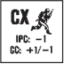

**4.52 PORTAGE EFFECTS:** CX Infantry have an IPC one \< normal. Each PP carried in excess of this reduced IPC is deducted directly from their increased MF allotment. EX: A squad carrying four PP has only three MF because four PP is one \> a squad’s IPC. However, if that squad Double Times, its MF allotment is increased to four (4 MF + 2 MF [CX] - 2 MF [2 PP \> CX IPC] = 4). EX: A HS carrying five PP has only two MF; if accompanied by a leader, they would have five MF (4.12, 4.42). If the HS (only) Double Times with the leader, they have six MF. However, if the leader also Double Times, then they have only five MF.

**4.6 MOVEMENT MODIFIERS (FFMO/FFNAM):** Infantry that has moved during the MPh without using Assault (or Hazardous) Movement is subject to a -1 FFNAM DRM to all Defensive First Fire attacks against it in addition to the applicable TEM of its Location *[EXC: Minefield attacks and units moving from one trench to another]*. Units loading onto/disembarking from vehicles are always subject to FFNAM except vs mines. A further -1 First Fire DRM applies to units moving in the open (FFMO), but whenever such movement is combined with another effective protective TEM or LOS Hindrance feature (such as SMOKE or an AFV/wreck) between the target and firer or in the target Location itself, the -1 FFMO DRM does not apply.

**4.61 ASSAULT MOVEMENT:** Non-berserk Infantry that remains Infantry throughout the MPh (i.e., is not a PRC during that phase), and that moves ≤ one Location during its MPh without using all of its MF (including any leader/road bonus, but not Double Time), may use Assault Movement. *[EXC: additional MF expenditure within a Location (e.g., out of, or into, a Fortifi- cation, or Recovery) in addition to a change of Location, does not prevent Assault Movement unless, in so doing, a unit expends all its MF or requires CX status.]* A unit using Assault Movement in Open Ground is subject to the -1 FFMO DRM but not to the -1 FFNAM DRM. Assault Movement, if it is to be used, must be declared prior to movement of that unit, and is not applicable to Infantry using Hazardous Movement (4.62) or to Cavalry. A unit using Assault Movement which uses all its MF to move beneath Wire (B26.4), or which breaks, or becomes berserk, due to Defensive First Fire is no longer considered using Assault Movement and is subject to the -1 FFNAM DRM for the remainder of its MPh. Otherwise, once declared, Assault Movement cannot be voluntarily voided.

EX: [1] A crew moving ≥ two hexes into a woods hex and subject to First Fire has a total TEM of 0 (+1 for woods and -1 for FFNAM). [2] A SMC using Assault Movement to move one hex into Open Ground has a total TEM of -1 for incoming First Fire. [3] A HS Assault Moving behind a hedge in Open Ground receives a +1 TEM (+1 for hedge), but a unit moving behind a hedge in Open Ground without Assault Movement receives a 0 DRM to incoming First Fire (+1 for hedge, and -1 for FFNAM). [4] A squad moving one hex uphill into woods has a TEM of 0 (+1 for woods, and -1 for FFNAM due to using all its MF). If the same unit is accompanied by a leader, giving it six MF, the TEM is +1 because it can claim (if it was declared) Assault Movement.[5] PRC abandoning an AFV in Open Ground (D5.41) have a TEM of 0 (+1 for being beneath an AFV and -1 for FFNAM).

**4.62 HAZARDOUS MOVEMENT:** Certain activities are so dangerous that they automatically incur a -2 IFT DRM to any attacks against units so engaged *regardless of fire phase* until they are pinned (if subject to Pin results). Neither FFMO nor FFNAM apply to shots affected by Hazardous Movement; however, Hazardous Movement is cumulative with all other terrain DRM. Hazardous Movement acts include: pushing a Gun; Flame, roadblock, or rubble Clearance; descending paratroops; Fording; preparing Set DC; Climbing; and sewer movement. Hazardous Movement never applies to vehicles (but does apply to PRC Survival; D5.6, D6.9).

**4.63 DASH:** Infantry may declare a Dash through a road Location if it declares a Dash move to a particular Location prior to moving, and then moves from a non-Open Ground Location on one side of the road directly into the road and then directly into a non-Open Ground Location on the other side of the road provided the normal MF expenditure for this two-hex move is ≤ the unit’s available MF. For purposes of determining the legality of a Dash move, any Location out of the LOS of a firer is also considered a non-Open Ground Location. The Dashing unit may not have expended any MF prior to the Dash *[EXC: SMOKE grenade placement attempt; 24.1]*, may expend no MF in the road or the Dashed-to location beyond the minimum required to enter, and must end its MPh in the non-Open Ground Location it Dashed to (unless

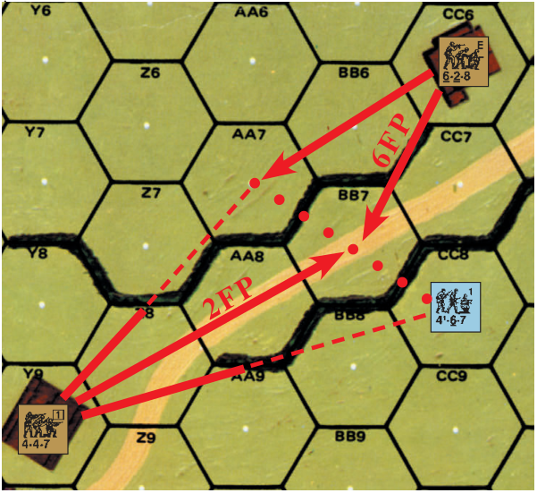

EX: The 4-6-7 has declared a Dash to 4AA7, thus halving the FP of the 4-4-7 in Y9 which fires on it in BB7. However, a 6-2-8 hidden in CC6 now drops its HIP to fire on the 4-6-7 in BB7 or AA7. The halving FP of a Dash does not apply to the 6-2-8 because AA7 is Open Ground to it. Even if the 4-4-7 were to fire after the 6-2-8, its FP would still be halved because AA7 and CC8 are not Open Ground Locations vs fire from Y9. Even if AA7 were a building hex, an attack by the 6-2-8 vs AA7 would not be halved because the 4-6-7 is Dashing only in BB7—not in the hex it is moving *to*. None of this would change if the road ended in BB7, or if there were another road running from AA7 to CC8. EX: Assume AA7 were a building hex and that a leader was Dashing with the 4-6-7. If the leader broke in BB7, the 4-6-7 could declare Double Time and continue Dashing into AA7. If for any reason the 4-6-7 did not have enough MF to enter AA7, it would be stuck in BB7 without Dash benefits.

<!-- pdf-page 52 -->

becomes berserk, pinned, broken or wounded in the road Location, or otherwise unable to enter the Dashed-to Location, in which case Dash benefits immediately cease). All non-ordnance Defensive First Fire vs a Dashing unit in the road Location is considered Area Fire except for Fire Lanes and pre-existing Residual FP, but FFMO/FFNAM DRM apply normally. A weapon with a specified CA may not fire on a Dashing unit in the road Location if it must change its CA to do so. An ordnance weapon that can fire on the Dashing unit in the road Location must use the Case J To Hit DRM (Cases J<sup>3</sup> and J<sup>4</sup> do not apply in the road Location). If blocked from entering a non-Open Ground Location by a concealed unit therein (12.15), the unit is considered to have expended the additional MF used in entering the non-Open Ground Location in the road Location instead, where it ends its MPh and is again subject to possible Defensive First Fire—this time without the applicable Dash penalties to the firer. Because the existence of an Open Ground Location can be dependent on the LOS of any potential firer into that Location, it is possible that a declared Dash might not qualify as such vs one or more DEFENDING units. In this case, Dash First-Fire penalties may apply to some DEFENDERS but not to others. Once a Dash is declared, no other movement/MF-expenditure options are available to the Dashing unit and Armored Assault (D9.31) is NA.

**4.7 ADVANCE PHASE:** Infantry units which are neither broken, pinned, TI, nor marked with a CC counter may use the APh to move one hex horizontally or *vertically (to a different ADJACENT building level Location of the same hex)* but not both. A unit may not change both its Location within a hex and also the hex it is in during the same APh although it could change both elevation and hex in an APh by advancing to an adjacent hex of different elevation such as a hill or Depression. The one hex advance may even be from inside an entrenchment to inside another in an Accessible hex (even if on different levels). A unit’s IPC is unchanged during the APh except as restricted by Difficult Terrain (4.72).

**4.71 vs AN AFV:** An Infantry advance into a Location containing an enemy AFV is contingent on the unit first passing a PAATC (11.6).

**4.72 vs DIFFICULT TERRAIN:** An advance into any hex whose MF cost (excluding SMOKE) is ≥ four MF or all of a unit’s available non-Double Time MF allotment (whichever is less) may not be made if the unit is already CX *[EXC: Climbing, B11.432; Deep Stream Entry, B20.43]*; otherwise it may advance but becomes CX in the process. In no case may a unit advance if it retains no MF after deducting for portage costs. EX: A Russian squad carrying five PP has only two MF and therefore must become CX to advance into a hex requiring two MF to enter during the MPh (unless it is accompanied by a leader who adds two MF and one IPC to the squad; thereby leaving it with five MF).

**4.8 TEMPORARILY IMMOBILIZED (TI):** TI status is incurred by Infantry engaged in various tasks requiring prolonged effort throughout the Player Turn. When a unit is affected by TI status it is marked by placing a TI counter on top of it, which is removed at the end of its CCPh (or if the unit breaks). A TI unit may not move, advance, fire, or perform other labor tasks anytime during its Player Turn. If engaged in CC, it must add +1 to any CC attack DR it is involved in (limit of one per attack), and subtract one from any CC attack DR made against it (A.5). EX: If two TI squads combine to make a CC attack, there is a +1 DRM to that attack. If two TI units and a non-TI unit are attacked together in CC, the -1 DRM for TI status applies only to the TI units; the DR is not modified for the non-TI unit.

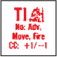

## 5. STACKING LIMITS

**5.1 INFANTRY/CAVALRY:** Each side may stack up to three squads or their equivalents (5.5) plus up to four SMC per Location without penalty. Hexes which have additional vertical Locations within their horizontal hex parameters are entitled to their own separate stacking limits on each level of that hex. Stacking limits can be exceeded only at increased risk and inconvenience to all of the friendly units therein, and never during initial or offboard setup.

**5.11 MOVEMENT:** Entrance of a Location overstacked by Personnel (even if overstacked only due to the moving unit’s entry) costs one additional MF for each squad (or its equivalent; FRU) in the Location that exceeds normal Personnel stacking limits. Vehicles must pay one MP for each overstacked squad or equivalent (FRU), in addition to any overstacking movement cost for vehicles (D2.14). Personnel movement into a Location overstacked by vehicles is not penalized. Overstacking movement penalties can cause use of Minimum Move (4.134) or Advance vs Difficult Terrain (4.72). EX: There are two squads and a crew in building hex 1F5. If a squad moves into 1F5, it will cost three MF (two to enter the building, plus one to enter a now overstacked Location). If another squad advances into the same Location, it will have to become CX because the MF cost of the Location is now four MF (two to enter the building, plus two to enter a Location overstacked by 1½ squads). A single HS/crew entering the Location at this time will also incur only a two MF overstack penalty because its entrance increases the overstack to only two squads.

**5.12 ATTACK PENALTY:** All units attacking from or within a Location which their side has currently overstacked must add one to their IFT/CC DR (or +1 to their To Hit DR for ordnance) for each vehicle and squad equivalent (FRU) by which they exceed normal stacking limits.

**5.13 DEFENSE PENALTIES:** Overstacking penalties during the MPh apply only to moving units, although the presence of non-moving units in the target Location will probably be the determining factor in whether a moving unit is overstacked at the instant of attack.

**5.131 PERSONNEL:** All Personnel units (except PRC) being attacked in a Location their side has overstacked suffer a -1 To Hit DRM when attacked by ordnance (or a -1 IFT/CC DRM when attacked by any other means) for each squad equivalent (FRU) by which their side exceeds normal Personnel stacking limits.

**5.132 VEHICULAR:** If a vehicle is being attacked in a Location whose vehicular stacking limits its side has exceeded, it is not directly penalized. However, any Vehicle Target Type Final To Hit DR which exceeds its Modified To Hit Number (C3.3) by \< the amount of vehicles in that hex (excluding any out of the firer’s LOS, wrecks, and the firer itself if in the same hex) may still possibly hit another (even friendly) vehicle in that vehicular-overstacked hex. Make a subsequent dr; if that dr is \< the total number of vehicles in that hex other than the firer, wrecks, or vehicles out of the firer’s LOS, one of them has been hit (use Random Selection if three or more targets exist therein—modifying each vehicle’s dr by the reverse of its size modifier if they have different size classifications and randomly select among ties). A Specific Collateral Attack would apply normally. Overstacking penalties do not apply to attacks resolved on the H Vehicle line of the IFT. EX: A PzKpfw IVH tank and two Kuebelwagens occupy woods hex 1EE4. The tank is fired on by a Russian AT Gun in Z9 during the Russian PFPh at a range of eight hexes for a Modified To Hit Number of 8. Only the +1 TEM of the woods will affect the DR, resulting in a hit on the tank with an Original To Hit DR ≤ 7. However, an Original To Hit DR of 8 or 9 will hit one of the Kuebelwagens instead on a subsequent dr \< 3.

**5.2 VEHICULAR:** Each side may have only one vehicle in each Location without suffering overstacking penalties. The presence of a wreck(s) in a hex does not affect stacking penalties.

#### 5.3 PRC

**5.3 PRC:** Many vehicles have the capacity to transport Personnel in various quantities as specified on the vehicular counter. In addition, some AFV after 1942 may carry Riders (see D6.2). PRC and their SW are placed on top of the transporting vehicular counter and do not count against Personnel Location stacking limits as long as they remain mounted on their transport. PRC may never overstack on their vehicles.

<!-- pdf-page 53 -->

**5.4 COMBINED ARMS:** The presence of a vehicle(s) in a hex does not alter Personnel stacking limits. There is no stacking limit for ordnance or SW, although the number of crews/HS which may function as Gun crews in a Location (5.5) limit the effective use of Guns in a Location to three.

**5.5 EQUIVALENTS:** Five SMC equal a HS, and two non-Inherent-crews/ HS equal a squad, but ≤ 4 SMC count as zero squad-equivalents. However, if an Infantry crew/HS is manning a Gun it is considered equal to a squad for stacking purposes.<sup>7</sup> A squad’s equivalent can be substituted for a squad which has been given special capabilities by a SSR so as to share those special capabilities (e.g., if a SSR specifies that a squad may set up hidden, two hidden HS can be used instead provided that nationality is allowed to Deploy HS).

**5.6 LOCATION RESTRICTIONS:** Although a Location containing a pillbox/entrenchment can be overstacked, the pillbox/entrenchments therein can never be overstacked; i.e., they can hold only their specified amount of Infantry per side. Similarly, a sewer or tunnel may never contain \> three squads (plus four SMC) or their equivalent per side.

## 6. LINE OF SIGHT (LOS)

**6.1 CHECKING LOS:** The ability of a unit to “see” and “fire directly” at another unit in a different hex is dependent on having a LOS between those units. Whether a unit has a LOS to a given hex is usually determined by stretching a sewing thread taut between the center of the firing hex and the center of the target hex. If the thread does not cross a terrain depiction capable of obstructing the LOS between the target and firing hexes *(with the obstruc- tion visible on both sides of the thread) [EXC: Inherent Terrain hexes (B.6) block or hinder LOS if traced exactly along their hexside even though the terrain depiction is not visible on both sides of the thread]*, there is a clear LOS between the two hexes. If players still cannot agree whether a LOS is blocked or not, the matter is resolved by a dr: 1-3 LOS is not blocked; 4-6 it is blocked. It is usually (but not always; see B.6 & B9.1) the terrain depiction which can potentially block or hinder LOS—not the hex containing that terrain type.

**6.11 LOS CHECKS:** Before setup, LOS may be checked only by the side setting up first, and only if that side is the Scenario Defender, or has Pre-Registered Fire (C1.73) or Bore-Sighted weapons (C6.41-.42). During play, neither player may make potential LOS checks to determine if a LOS exists for an attack until after that attack has been declared *[EXC: Concealment Removal (12.14), Road entry cost (4.132)]*. Should the LOS check for an attack reveal a blocked LOS, the units which were to have made the attack are still considered to have fired for all purposes (they thought they saw something); that fire would not generate DM status nor affect units in the obstacle that blocked the LOS, although a DR must still be made to check for possible Random Events and the retention of any Multiple ROF.

**6.12 ATYPICAL LOS:** Occasionally, the rules will specify that an entire hexside, part of a hexside, or a vertex be used for tracing LOS to/from a firer/target instead of the hex center dot. This occurs during Road use (4.132), Bypass (4.34, D2.32), Climbing (B11.42), Underbelly Hits (D4.3), Snap Shot (8.15), and movement between Rowhouses (B23.71).

**6.2 OBSTACLES:** Each terrain type *[EXC: Depressions 6.3]* is defined as to whether or not it presents an obstacle or Hindrance to LOS and, if an obstacle, the height of that obstacle. LOS extends into or out of obstacles, but not through them into hexes beyond the obstacle except in certain cases wherein the target/firer are at an elevation ≥ the height of the obstacle or are adjacent to a hexside obstacle. The terrain in a firer’s hex never blocks LOS traced from its hex center dot, although it may block LOS traced from a vertex of its hex across the interior of its own hex. EX: Woods are a level 1 obstacle to LOS. If the firing unit is beneath level 1, it cannot see through ground-level woods to a target hex at level 1 or lower. The target unit would have to be at an elevation \> the top of the obstacle to possibly establish a LOS to a hex at ground level beyond that obstacle.

**6.21 HALF-LEVEL OBSTACLES:** Any terrain feature defined as a half-level obstacle blocks all same-level LOS *through (not into or out of)* that terrain hex. Half-level obstacles never form Blind Hexes nor block LOS to/from a higher level Location.

**6.3 DEPRESSIONS:** Certain terrain types are defined as being relatively narrow slits carved into the surface below ground level. Although they present no obstacle to LOS between units at or above ground level, units IN Depressions are often out of LOS of even relatively nearby higher level units. A unit must be at least one level higher for every hex of range to units IN a Depression to have a LOS to them *[EXC: Units with a clear LOS between them through other continuous Depression hexsides (exclusive of vertices) need not count those intervening Depression hexes in determining the nec- essary elevation advantage]*. A unit in a ground level hex always has a LOS INTO an adjacent level -1 Depression hex, but a unit two hexes away must be at level 1 or higher to have a LOS INTO that hex, and a unit three hexes away must be at level 2 or higher. Boards 24 and 25 contain Depressions that change elevation along their length, thus creating several additional LOS possibilities; see B19.5. EX: A unit in 5FF6 cannot see INTO EE8 because it is two hexes away with only a 1 one level elevation advantage. However, a unit in GG7 can see INTO EE8 because it has a LOS INTO Depression hex FF7 and then along the Depression depiction INTO EE8, whereas FF6 cannot trace a straight LOS INTO an adjacent Depression hex, and then on INTO EE8.

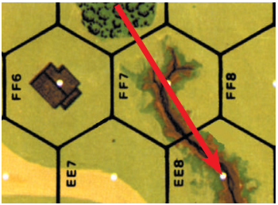

**6.4 BLIND HEXES:** Assuming an otherwise clear LOS, even if a firing (or target) unit is at an elevation \> the height equivalent of any intervening full level obstacle, a number of potential target hexes that are both directly behind that obstacle and also equal to the *full level* height equivalent (i.e., ignoring any half-level) of that obstacle are considered Blind Hexes to the firer. Blind Hexes cannot be seen by the firer unless the Blind Hex is at an elevation ≥ the full-level height of the obstacle (in which case it is not a “Blind” Hex after all). This “blind” area can increase as the range to the obstacle increases (6.41), and/or decrease according to the extent of elevation advantage over the obstacle (6.42).

##### 6.41

**6.41** For every multiple of five hexes (FRD) to a full level obstacle, increase by one the number of Blind Hexes created by that obstacle.

##### 6.42

**6.42** For every full-level elevation advantage \> one level over an obstacle, decrease the number of Blind Hexes created by that obstacle by one, to a minimum of one *[EXC: non-Cliff Crest Lines may have their Blind Hexes reduced to none by sufficient elevation advantage; B10.23]*. EX: The distance to a level 1½ obstacle is 12 hexes. Three blind hexes (1 [normal Blind Hex; 6.4] +2 [extra Blind Hexes; 6.41]) are created by that obstacle for a unit at level 2; two blind hexes are created by that obstacle for units at level 3 at the same range; and only one blind hex is created by that obstacle for a unit at level 4 or higher at that range.

##### 6.43

**6.43** The number of Blind Hexes created by an obstacle can be changed by the height of the hexes directly behind the obstacle along the LOS. If a hex behind an obstacle is at a lower level than the elevation *of the hex containing the obstacle* (not the obstacle itself), the difference in elevation of those two hexes is added to the number of Blind Hexes which are created by that obstacle to determine if that hex behind the obstacle is actually a Blind Hex. However, if the Blind Hex is created solely by a Crest Line (B10.23), only any difference \> one is added since a difference of one level is necessary for a Crest Line to even exist. If a hex behind an obstacle is at a higher level than the elevation of the hex containing the obstacle, the difference in elevation of those two hexes is *subtracted* from the number of Blind Hexes which are created by that obstacle to determine if that hex behind the obstacle is actually a Blind Hex. (See Example at the top of the next page.)

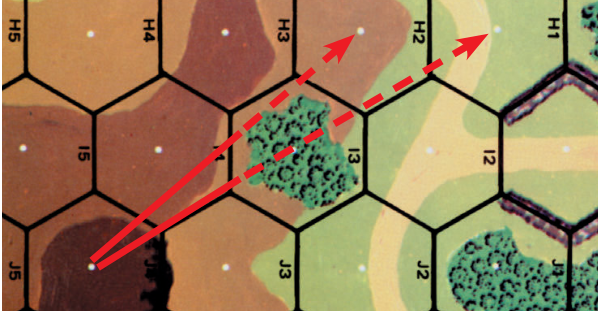

<!-- pdf-page 54 -->

EX: There is no LOS from Level 3 hill hex 2J4 to Level 1 hill hex H2 because the intervening woods in I3 makes H2 a Blind Hex (6.4). The LOS to H1 is also blocked, because the difference in elevation of I3 and H1 is added to its Blind Hex creation. Had H1 been a Level 1 hex instead, a LOS to it would exist; alternatively, had J4 been a level 4 hex instead, a LOS to H1 would exist (6.42).

**6.5 RECIPROCITY:** As high-to-low LOS procedures are the converse of low-to-high, it follows that whenever a higher unit can see a lower unit that the lower unit can also see the higher unit.

**6.6 UNITS:** The presence of Personnel units in a hex does not block LOS through that hex (although the presence of an AFV/wreck may hinder [and thereby modify] fire through the hex; D9.4). Direct Fire attacks can be traced through units in intervening hexes without affecting them unless specified otherwise.

**6.7 LOS HINDRANCE:** Some terrain types are not uniformly high or substantial enough to be considered a complete obstacle to same-level LOS, and are listed as LOS Hindrance hexes because each one hinders such fire traced through its hex to another hex but not sufficiently to prevent it entirely (see Terrain Chart/Desert Terrain Chart/PTO Terrain Chart). All same-level Direct Fire and spotting attempts traced *through (not just into or out of)* an effective LOS Hindrance hex are modified by a +1 DRM to either the IFT or To Hit DR, or the Artillery Initial Accuracy dr. The presence of such a Hindrance always negates Interdiction and FFMO. Being in a LOS Hindrance hex *[EXC: SMOKE (24.2) and FFE Hindrance (C1.57)]* does not hinder the LOS of a firing or target unit; it is only the presence of a LOS Hindrance hex between the same-level firing and target units (regardless of whether either/ both are Personnel or vehicles) that forms a LOS Hindrance *[EXC: SMOKE and FFE Hindrances are effective Hindrances to LOS even if they are in the viewer or target hexes rather than between them; these Hindrances (24.4 & C1.57), as well as bridge (B6.2), orchard (B14.2), and tower (B34.2) LOS Hindrances and Fog (E3.311) may affect units at different levels]*. Unlike range, which is always the least number of hexes from firer to target regardless of LOS, LOS Hindrances are incurred whenever the LOS crosses a Hin-

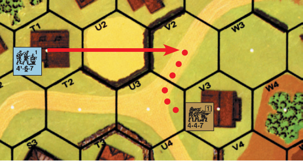

EX: A 4-6-7 squad in 3T1 using Defensive First Fire vs a Non-Assault moving squad in V2 traces his LOS through a Hindrance hex (the grainfield in U2). The 4-6-7’s attack is modified by +1 for the LOS Hindrance, +1 for TEM (hedge), and -1 for FFNAM for a total modification of +1. Now, assume that T1 is a building with an upper level and the firing 4-6-7 is at level 1. The same attack would now be resolved without any DRM (-1 [FFNAM] +1 [hedge TEM] = 0).

drance—regardless of how small a portion of that hex it may be. Whenever a LOS crosses (or goes along the shared hexside of) two hexes that have the same range to the firer, however, only the LOS Hindrance of the hex with the highest applicable LOS Hindrance DRM is counted. Therefore, the number of hexes in which a LOS Hindrance applies will not exceed the range. EX: Even though the LOS from 4V3 to W10 encounters seven LOS Hindrance hexes in an area equivalent to a range of only five hexes, the Hindrance DRM is +5, not +7. Hexes V6 and W6 are both three hexes from V3, so only one +1 LOS Hindrance DRM is counted for those two hexes. Similarly, hexes V7 and W7 cause only one +1 Hindrance DRM between them. If there were a wreck in V7, however, the total LOS Hindrance DRM would be +6.

**6.8** Even units in adjacent hexes do not always have a clear LOS to each other. This is especially true of units using Bypass to transit an obstacle hex with the obstacle between the mover and the firer. EX: Even though in adjacent hexes, units IN gully hexes 12BB4 and AA5 cannot see each other because they are not connected by a Depression hexside.

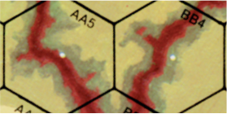

EX: A unit on the ground level of 12U5 cannot see a unit on level 2 of U5 or level 1 of V4 because of the intervening building levels.

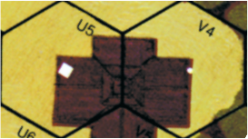

EX: A unit in 12P2 does not have a LOS to a unit in O3 Bypassing the O3-N3 hexside.

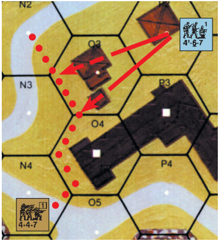

## 7. FIRE ATTACKS

#### 7.1

**7.1** Fire attacks are the main process by which a unit attacks enemy units. Fire attacks can occur in the PFPh and AFPh by the ATTACKER and in the MPh and the DFPh by the DEFENDER, but no unit can fire its inherent FP/SW/ Gun in more than one fire phase (A.15) per Player Turn. Otherwise, players may fire all, some, or none of their units in any applicable fire phase.

**7.2 FIREPOWER MODIFIERS:** The FP factor of an attacking unit can be doubled, tripled, and/or halved due to a variety of circumstances. Fractions of halved FP factors are not dropped or rounded off; they are retained and subject to further modification, or added to the fractional FP factors of other units involved in the same attack. FP modifiers are cumulative; an attacker’s FP can be both doubled and halved (with the net result that it retains its normal FP), and/or it can be halved and then halved again several times.

**7.21 POINT BLANK FIRE (PBF):** The Small-Arms/MG/ATR/IFE FP of an attacking unit is doubled while either ADJACENT to its target or adjacent to and either within one level of or higher than its target.<sup>8</sup> If adjacent but without a LOS to it (such as units IN non-connecting gully hexes 12AA5 and

BB4) no attack can be made. On those rare instances when fire attacks are allowed vs units in the same Location as the attacker or vs PRC in the same hex (7.211), the FP of the attacking unit is tripled (hereafter referred to as TPBF). As IFT attacks are not allowed by units in Melee, such occurrences vs non- PRC are usually limited to instances in which Infantry are allowed to enter an enemy-occupied Location during the MPh (4.14). Ordnance weapons do not double their FP for PBF, but may have a greater chance of scoring a CH (C3.7).

<!-- pdf-page 55 -->

###### 7.211 TPBF vs PRC

**7.211 TPBF vs PRC:** Any PRC not BU in a CT AFV which are in an enemy-occupied hex are subject to TPBF attacks from enemy units in that Location or any higher Location in that hex, regardless of whether or not the PRC disembark (see also D6.5). Halftrack Passengers and OT AFV crews are subject to such an attack even if not CE, but receive the +2 CE DRM (D5.31). The Moving units *[EXC: BU PRC]* may attack first as part of an OVR or in turn during their AFPh with both Area and TPBF if they are able to. Any survivors are not considered held in Melee until after the CCPh (PRC of Mobile vehicles are never held in Melee; 11.71) and are marked with a CC counter once the vehicle ends its MPh in that Location and are therefore able to rout away in the RtPh.

**7.212 TARGET SELECTION LIMITS:** A unit does not have the freedom to attack units in other Locations while its own Location is occupied by a Known enemy unit (even if disrupted) unless the only known enemy unit in its Location is an unarmed, unarmored vehicle. Whenever a unit is eligible for TPBF vs Known enemy units, it can attack only those units. Spotters (C9.3) are similarly limited, but Observers (C1.6) are not. EX: As long as the squad and the halftrack are in the same Location (even if in Bypass), neither can fire outside of that Location. The squad can attack the PRC with TPBF but the PRC, being BU, cannot attack back. If the squad were in an upper-level Location of the hex, it still could attack only its own Location or that of the halftrack. The upper-level squad would still attack the PRC with TPBF, but now the Passengers could attack back (D6.61) although only with PBF (if within one level), not TPBF; if CE, the ht (and its Passengers) could fire outside its Location. If the squad were in an upper-level Location and the halftrack were instead a BU CT AFV, then neither would be restricted by the other.

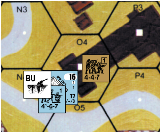

**7.22 LONG RANGE FIRE:** A unit may attack beyond its Normal Range at a distance up to and including double that range *[EXC: ATR, MOL, DC, Ordnance and some FT]*, but it does so at half FP.

**7.23 AREA FIRE:** The FP of an attacking unit is halved if the target is concealed or for any application of the Area Fire penalty *[EXC: MOL; ordnance; C.4]*, and is halved again for each additional applicable use.

**7.24 AFPh FIRE:**<sup>9</sup> The Small-Arms/MG/ATR/IFE FP of an attacking unit is halved if the attack occurs in the AFPh—*even if the firing unit did not move in that Player Turn*—unless it is using Opportunity Fire. MOL, FT, and DC are not halved (see C.4 for Ordnance).

**7.25 OPPORTUNITY FIRE:** Any Good Order Infantry/Cavalry which has not yet fired or become TI during that Player Turn may be placed beneath a Bounding Fire counter during its PFPh. Such placement removes any concealment status it may have had if it is in LOS within 16 hexes of a Good Order enemy Ground unit (12.14). Such a unit cannot fire during the PFPh or move during the MPh, but if still unbroken (/unpinned, in the case of FT/DC/ MOL) may fire during the AFPh without the penalty of AFPh Fire (7.24). Once a unit Opportunity Fires and exhausts its Multiple ROF, flip its Bounding Fire marker over to the Prep Fire side. An Opportunity Firer is the only unit that can use a Multiple ROF or Intensive Fire during the AFPh.<sup>10</sup> Ordnance can use Opportunity Fire only if fired by Infantry, and cannot change its CA until actually resolving its To Hit attempt during the AFPh when it would be subject to applicable Case A To Hit DRM.

**7.26 MISCELLANEOUS:** Several other relatively rare circumstances can serve to modify FP and are listed beneath the IFT and in their respective rule sections.

**7.3 RESOLUTION:** Fire attacks are resolved by checking to see if any FP modifiers alter the FP of each attacking unit and then adding the adjusted FP factors of all units attacking the same target (see 7.4-.5) to determine the total FP strength of the attack. Make a DR and, after adding any applicable DRM as listed on the IFT DRM chart or in the appropriate rules section, cross-index the adjusted DR with the applicable FP column of the IFT to determine the results of the attack. Each applicable entry on the IFT DRM chart is cumulative (A.17) and is applied only once per attack, unless indicated otherwise. The attacker uses the rightmost column of the IFT whose listed FP (in bold type) does not exceed the total adjusted FP of the attack. Any excess FP factors have no effect *[EXC: Heavy Payloads; C.7]*. The results vs Personnel targets are applied as follows:

###### 7.301 #KIA

**7.301 #KIA:** At least as many target units in each specifically targeted Location (e.g., Spraying Fire or Canister, but not Area Target Type, attacks) as the number indicated (#) are eliminated (as determined by Random Selection); all remaining target units are automatically broken. Units which cannot be broken (e.g., berserk/heroic/broken/unarmed) suffer Casualty Reduction instead. The number of units eliminated can exceed the number specified if Random Selection results in a tie for the last unit to be eliminated, but in no case are more units affected than are subject to that attack.

###### 7.302 K/#

**7.302 K/#:** At least one target unit suffers Casualty Reduction in each specifically targeted Location and all other target units (including any just-Reduced HS) must take a MC, adding the number indicated (#) to the MC DR. Random Selection is used to determine which of multiple targets suffer Casualty Reduction. Casualty Reduction eliminates any HS or crew *[EXC: Re- call; D5.341]*, and wounds any SMC it applies to (the wound may become an outright elimination, depending on the Wound Severity dr; 17.11). A squad is Reduced to a HS with the same broken/non-broken status of the squad it was Reduced from.

###### 7.303 NMC

**7.303 NMC:** Each target unit must attempt to pass a Morale Check by making a DR ≤ the Morale Level of the unit, best leaders first; those which fail are usually broken. See 10.3.

###### 7.304 #MC

**7.304 #MC (1, 2, 3, or 4):** Same as NMC but the # is added to the MC DR.

###### 7.305 PTC

**7.305 PTC:** A “PTC” result forces an unbroken Personnel target to take a NTC; those which fail are pinned—not broken. Broken units never take Pin TC, although they can become pinned during Interdiction (10.53) by passing a MC with the highest DR possible (7.8). See 7.82-.821 for Pin effects vs vehicle and PRC.

**7.306 —:** No Effect EX: A FG of two 4-6-7 squads, a MMG, and a 9-2 leader Prep Fires at three squads and a leader seven hexes away in Open Ground. The FP of the two squads is halved due to Long Range Fire, leaving the FG with a total of nine FP factors. The Original IFT DR is an 8 which is modified by -2 for the leader’s direction of fire, resulting in a FINAL DR of 6. A 6 DR on the 8 FP column of the IFT results in a 1MC to each of the four defending units, leader checking first.

**7.307 vs ARMORED TARGETS:** Small Arms and non-ordnance attacks *[EXC: FT, DC, MOL, ATMM]* have no effect vs armored targets but may leave Residual FP. Any Vulnerable PRC in or on such vehicles are affected normally as Personnel targets [see Stun (D5.34), Recall (D5.341), Unprotected Crews (D5.311), and Bailing Out (D6.24)].

**7.308 vs UNARMORED VEHICLES:** All non-ordnance Direct Fire attacks vs unarmored vehicles/horse counters are resolved on the ★ Vehicle line of the IFT using the same IFT DR (after any applicable modification) for any Personnel target in the same Location. Unless using Defensive First Fire, non-ordnance attacks vs unarmored vehicles/horses affect all occupants of the Target Location including Infantry and other vehicles/horses which are <!-- pdf-page 56 --> present in the same Location *[EXC: a vehicle in Bypass and out of the firer’s LOS cannot be affected, nor can more vehicle/horse counters be affected by a DR than the highest KIA# of that column as randomly determined (e.g., a 6, 8 or 12 FP attack vs the* H *Vehicle Line could affect no more than three ve- hicles; a 2 or 4 FP attack could affect only two vehicles; a 1 FP attack could affect only one vehicle)]*. If that Final DR is \< the Kill Number listed for the IFT FP column used, the vehicle is eliminated *[EXC: Unlikely Kill; 7.309]*; if it equals the Kill Number, the vehicle is immobilized; if the Final DR is ≤ half of the Kill Number, the vehicle is eliminated as a burning wreck and all of its PRC are eliminated. Otherwise, the PRC of an eliminated vehicle must check for survival (D5.6). The surviving PRC of an eliminated vehicle are not subject to further effects from that attack. However, the Vulnerable PRC of a vehicle that has not been eliminated may still be subject to a Collateral Attack (D.8). EX: A 4-4-7 squad, an 8-0 leader, and a MMG form a FG during the PFPh to attack a shellhole hex containing a squad and a truck that is transporting a HS Passenger. The Original IFT DR is a 7. The 8 FP attack is resolved against the truck with no DRM because the TEM of a shellhole applies only to Infantry. The Final DR of 7 immobilizes the truck, and the HS Passenger suffers a 1MC in the General Collateral Attack. In addition, the squad suffers a NMC because the shellhole +1 TEM has adjusted the IFT DR to an 8. If the Original DR had been a 3, the truck would have been turned into a burning wreck, eliminating the HS Passenger, with a 2MC to the squad in the shellhole. If the Original DR had been a 6, the truck would have been eliminated and its HS Passenger would have had to pass a Survival Check to not be eliminated (and if it passed it would be otherwise unaffected by this attack). The squad would have suffered a 1MC.

**7.309 UNLIKELY KILL:** Any Original 2 IFT resolution DR on the H Vehicle line of the IFT always yields the *possibility* of damage even if applicable DRM raise the Final DR above the indicated Kill Number for that FP column. In such a case, the firer can make a subsequent dr even if the Original 2 DR would have resulted in an elimination or Immobilization. On a dr of 1 the vehicle becomes a burning wreck; on a dr of 2 it is eliminated; on a dr of 3 it is immobilized (unless HD); on a dr of 4-6 (3-6 if HD) there is no effect. However, regardless of the subsequent dr, if the Original 2 DR would have resulted in elimination or Immobilization that result occurs instead, unless cancelled by a better (i.e., elimination or burning) result from the subsequent dr.

##### 7.31

**7.31** A target may be attacked any number of times during a fire phase (depending on the type and phase of the attack), but when a result is called for by the IFT it is resolved prior to making any other attack on that target.

##### 7.32

**7.32** A player need not predesignate attacks; i.e., he may witness the outcome of each attack before committing other units to fire.

**7.33 MULTIPLE TARGETS:** A Personnel unit may not split its inherent FP between different targets *[EXC: 7.34]*, but a squad can fire one or two of its SW separately at different targets provided it does so in the same fire phase (7.1). A squad which has fired its inherent FP but not yet used its SW (or the SW’s final shot in the case of Defensive First Fire) should be marked with the proper Prep Fire/First Fire/Final Fire counter, but with the SW on top of that counter unrestrained by it.

**7.34 SQUAD SPRAYING FIRE:** Spraying Fire is limited to those squads with an inherent LMG, multiple SMG, and/or superior tactical training. Any squad with a Spraying Fire option is identified by the underscore beneath the Range portion of its Strength Factor. Squad Spraying Fire is identical to MG Spraying Fire (9.5) except that it is limited to a maximum range of three hexes. If Spraying Fire at three hex range exceeds the Normal Range of the unit, any target hex beyond Normal Range would halve the FP again as Long Range Fire. (See Example at the top of the next column.)

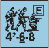

**7.35 SW USAGE:** All weapons on <sup>1</sup>/2" counters are SW *[EXC: Goliath]* and must be possessed by an unbroken Personnel unit in order to fire. Usage limitations for each type of SW are listed on the SW Chart. However, two general rules apply to all SW:

7.34 EX: The 6-2-8 squad in 2D6 can trace a LOS to each of hexes C5 and C4 so it attacks both hexes with Area Fire. Note, however, that C5 is attacked with three FP while C4 is at Long Range so the FP must be halved again and attacks with only 1<sup>1</sup>/2 FP plus a +1 TEM for the woods. So an Original DR of 3 would result in a 1MC vs C5 and a NMC vs C4.

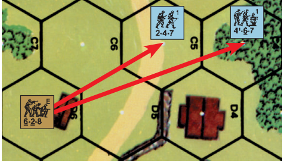

**7.351** A squad may fire any one SW/Gun without the squad losing its inherent FP; this inherent FP can be added to the SW attack in the case of a MG, or used for a separate attack in the same fire phase. A squad may never fire more than two SW/Gun in the same fire phase although it may fire two different types. A squad using two SW/Gun loses its inherent FP until the CCPh *[EXC: 7.353]*.

**7.352** A crew/HS/SMC that fires any SW/Gun loses its inherent FP until attacked/attacking in CC or the end of that Player Turn (whichever comes first) *[EXC: 7.353]*.

**7.353** In both of the above cases, Subsequent First Fire (8.3), FPF (8.31), and Final Fire (8.4) vs adjacent units retain halved inherent FP for those attacks (regardless of how they were used during First Fire)—although use of full SW/Gun capability during such attacks can negate inherent FP in the normal manner. See the 8.41 EX.

**7.36 ASSAULT FIRE:** Assault Fire is restricted to squads armed primarily with SMG/semi-automatic rifles, as well as appropriate training in their use. Such squads are identified by the underscoring of their FP factor. Assault Fire capability allows any squad using its inherent FP during the AFPh to add one FP to its Small Arms Fire attack after all modification to the squad’s inherent FP; any fraction in its FP is then rounded up. The Assault Fire bonus is not applicable to Opportunity Fire or Long Range Fire, but is still applicable to pinned-firers/Spraying-Fire in the AFPh. EX: A 6-6-6 squad firing at a target four hexes away in the AFPh has four FP (3 [AFPh Fire] +1 = 4). Two 5-4-8 firing during the AFPh at an ADJACENT concealed target have eight FP ([5 [FP] × 2 [PBF] = 10] ÷ 2 [AFPh] = 5 ÷ 2 [Concealed Target] = 2½ +1 [Assault Fire] = 3½ = 4 [FRU] × 2 [two squads] = 8). **\*7.37 INCREMENTAL IFT (IIFT):** In addition to the standard IFT (A7), an Incremental IFT is included for optional use. The IIFT is used exactly as the standard IFT except as indicated below. <sup>10A</sup>

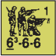

**7.371 COLUMN SHIFTS:** Column shifts (for Cowering, Fire Lane, Barrage FP, HEAT HE Equivalency, etc.) always use “standard” IFT columns (i.e., 1, 2, 4, 6, 8, 12, 16, 20, 24, 30, 36), which are marked on the IIFT with a colored background (as opposed to the “incremental” columns which are not so marked). When a one-column shift is required, an attack that would otherwise have used a “standard” IFT column simply shifts to the next-lower-FP “standard” column; an attack that otherwise would have used an “incremental” column first shifts to the next-lower-FP “standard” column, then shifts again to the next-lower-FP “standard” column. A two-column shift follows these same principles, but drops yet again to the next-lower-FP “standard” column. EX: A 4FP attack that Cowers (7.9) shifts to, and is resolved on, the 2FP “standard” column (or the 1FP “standard” column if Inexperienced Personnel were involved [19.33]). A 5FP attack that Cowers is resolved in the same manner, but it first shifts to the 4FP (i.e., next-lower-FP) “standard” column, and then to the 2FP “standard” column where it is resolved (unless Inexperienced Personnel were involved). A 7FP German HMG would place a 4FP Fire Lane assuming it did not cower. Similarly, 150mm OBA, which is normally resolved on the 30FP “standard” column, shifts to the 24FP “standard” column when used as Barrage (E12.5). Likewise, 160mm through 190mm OBA would be resolved on the 24FP

<!-- pdf-page 57 --> “standard” column if used as Barrage. Additionally, resolution of 75mm HE uses the 14FP “incremental” column, but its HEAT HE Equivalency (C8.31) would be resolved on the 8FP “standard” column.

**7.372 FIREPOWER MODIFIERS:** Doubling, halving and such of FP (e.g., PBF, Area Fire, etc.) is based upon the actual FP (both before and after increasing/decreasing it), regardless of whether the columns are “standard” or “incremental” *[EXC: Residual FP (8.2) uses the highest-FP counter that is ≤ ½ the FP used in the attack]*. DRM are applied normally, regardless of column. EX: A 5FP attack is resolved on the 10FP column if using PBF, or on the 2½ FP column if firing at Long Range; in the first case it would leave 4 Residual FP, in the second it would leave 1 Residual FP. An HE Concentration of 105mm OBA is resolved on the 21FP column, or on the 10FP column (<sup>1</sup>/2 × 21 = 10 [FRD]) if resolved vs Marsh (B16.31). A Barrage of 105mm OBA would be resolved on the 16FP “standard” column or on the 8FP column vs Marsh. Harassing Fire 105mm OBA is resolved on the 7FP column (<sup>1</sup>/3 × 21 = 7) or on the 3<sup>1</sup>/2 FP column vs Marsh. A CH with 105mm OBA (whether HE Concentration, Barrage, or Harassing Fire) would involve 42FP (C3.75) and would be resolved on the 36FP column with no modifiers (since 42FP is not a whole multiple of 8FP in excess of 36 [C.7]), or on the 21FP column vs Marsh.

**7.4 TARGET DETERMINATION:** Except during Defensive First Fire (8.1), all the Personnel-units/unarmored-vehicles/Vulnerable-PRC in the same Location are considered targets of fire that does not have to specify a particular target, with the outcome of such fire affecting all those enemy (or Melee) units in the target Location (except those to which the LOF is blocked, such as being entrenched behind a wall [B9.21], Area Target Type [C3.33], or non-Crest units in a Depression [B20.92]). Although all targets are affected by the results of such fire combat, some may escape harm entirely while others are eliminated, broken, pinned, or affected by Heat of Battle (15.). A MC/PTC result requires all target units to take an independent MC/TC with a separate DR for each unit. A unit/weapon may purposely attack a friendly unit(s) only if specifically allowed to by the rules governing a particular circumstance (e.g., Prisoners, Melee, OBA, Area Target Type vs enemy units [C3.33]).

**7.5 FIRE GROUP (FG):** Two or more units/weapons joining together to make a combined fire attack are a FG. Two SMC manning the same SW are not a FG as they are considered one combined firing unit. A FG may consist of units from more than one Location only if each participating unit occupies a Location ADJACENT to another participating unit of the same FG. It is possible to have a FG composed of a virtually unlimited string of ADJA- CENT Locations; provided each Location in the FG contains a unit that is participating in the attack. A leader alone in a Location cannot be a link in a FG (unless he is Heroic or firing a SW) because each Location of a FG must participate in the attack and a leader normally has no attack capability. Units inside a pillbox may not form a FG with units outside the pillbox.

**7.51 VEHICLES/ORDNANCE:** Vehicles/Passengers/Riders may be part of a FG within certain restrictions; see D6.64. Vehicles in Bypass in the same hex without a LOS to each other may not form a FG. Ordnance-weapons/ Canister/IFE may not form a FG with any other unit/weapon, including other weapons of the same unit *[EXC: vehicular MG/IFE; D3.5]*; e.g., a tank may not combine its ordnance MA and MG armament into a single attack.

**7.52** All members of a FG must be able to trace a LOS to the target. Should the LOS of any FG member be subject to a Hindrance/TEM, the worst possible case applies to all members of the FG (A.5). Should any member of the FG incur a detrimental DRM, it applies to the entire FG (cumulative as per A7.3). For this reason, it is often wise to break up such a FG and have its component parts attack separately. A multi-Location FG which discovers that one or more of its units’ LOS is blocked forfeits the participation of only those units whose LOS was blocked. The FG’s other units with a valid LOS must still attack the same target (unless it was eliminated by a previous attack, in which case their attack is forfeit and they are marked with an appropriate fire phase counter) after resolving the blocked firer’s DR (6.11), but as a smaller FG or as separate attacks.

**7.53 FIRE DIRECTION:** A single leader cannot direct more than one weapon/unit per phase unless they are part of the same FG. Hence a squad that elects to use its inherent FP in a different attack than that of the MG it is manning does not get the leadership benefit if given to the MG instead. However, a leader can direct the fire of a MG as many times as the MG can fire, even if he also directed other units as part of a FG in the MG’s previous attack. Leader direction used during Defensive First Fire can be used again in Subsequent First Fire, FPF, or Final Fire, but again only for one firing unit/SW or FG—and that unit/SW/FG can only include firers he directed during First Fire; if forming a new FG or using a different SW during that Player Turn, the leader cannot direct its fire (even during FPF). Similarly, a leader may not affect more than one To Hit attempt per fire phase (except for a multiple ROF weapon) regardless of the number of SW the firing unit is eligible to fire. See also 9.4, 10.7, and D6.65.

**7.531** A leader may use his leadership DRM (10.7) to modify the IFT DR of any one attacking unit or FG per Player Turn, provided all firing units of the FG are in the same Location. A leadership DRM may be employed with a multihex/Location FG only if a leader directing that attack is present in every Location; the leadership DRM in effect is that of the lowest-quality participating leader. A Leader affects the To Hit DR of an ordnance SW—not the effects of those hits on the IFT or AFV To Kill Table, nor the chance of a weapon malfunction. A Leader directing fire is marked with an appropriate Fire counter.

**7.54 BERSERK:** A berserk unit may never be part of a multi-Location FG.

**7.55 MANDATORY FG:** If units/weapons capable of forming a FG with each other in the same Location are going to fire at the same target (i.e., at both the same Location and the same unit and the same “simultaneous” [8.1] MF/ MP expenditure; see D3.5) during the same phase they must form a FG *[EXC: Fire Lane; 9.22]*; they may not attack separately except with ordnance/FT/DC or the subsequent shots of multiple ROF weapons (9.2).

**7.6 TEM & LOS HINDRANCES:** The terrain of the target hex/Location often alters the effectiveness of Fire Attacks by adding a DRM to the IFT DR. The DRM applicable to each terrain type is listed on the TEM column of the Terrain Chart and in the applicable rule section. TEM are generally cumulative, although there are many exceptions. Any LOS Hindrance (6.7) between the target and firer also lessens the effectiveness of Fire attacks by adding a Hindrance DRM to the IFT DR.

**7.7 ENCIRCLEMENT:** Any non-Aerial Infantry, or Vulnerable PRC of an Immobile vehicle, fired upon consecutively during the same PFPh, DFPh (*not* MPh), or AFPh by two or more non-Aerial units using their inherent-FP/SW/ ordnance/vehicular-armament at ≤ Normal Range (1.22, 10.532) is subject to possible Encirclement *[EXC: pillbox; B30.32]*. The attack(s) constituting an Encirclement must be resolved *consecutively*; if a player fires at a different target in the interim, he cannot use previous attacks as the basis for his claim to Encirclement. Encirclement occurs if the firer’s LOS enters the target Location either: a) through opposite hex*spines*; b) with exactly three target-hex vertices between them in both clockwise and counter clockwise directions; or c) through any three non-contiguous hex*sides*. An Encirclement can also be created by a LOF from both the Location directly above and below it in a building hex. To be considered valid fire, ordnance weapons must secure a hit on the target, and other firers must exert enough FP (taking the *possibility* of Cowering into account) to possibly inflict at least a NMC result on the target. A qualifying target Location is thereafter marked with an Encirclement counter and every non-berserk, non-heroic enemy/Melee Personnel unit therein suffers an immediate one level drop in morale to both the attack that sealed its Encirclement and any other attacks made against that Location as long as it is so marked. All fire by an Encircled unit is subject to a +1 DRM on the IFT (or To Hit DR if ordnance). The MF cost of the first Location entered (regardless of phase) by an Encircled unit is doubled (after all modification). Should other enemy units enter an Encirclement Location they are immediately Encircled. Regardless of the Encircler’s subsequent actions, the Encircled counter remains on the Location to affect all enemy/Melee Infantry units, and Vulnerable <!-- pdf-page 58 --> PRC of an Immobile vehicle, in that Location until they all leave the *Lo- cation* (even if they all leave it only momentarily), become berserk/heroic, are eliminated, or are captured. Being Encircled has adverse effects on a unit’s ability to avoid capture (20.21). A unit Encircled more than once does not suffer additional penalties for multiple Encirclement.

EX: **Encircled Not Encircled**

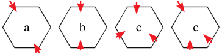

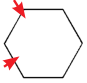

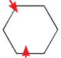

##### 7.71 FG

**7.71 FG:** The LOS of a FG may penetrate the target Location through more than one hexside; all such hexsides crossed count toward possible Encirclement. It is even possible for a single FG to cause Encirclement.

**7.72 UPPER LEVELS:** Encirclement also applies to any non-heroic/non-berserk unit in an upper level building Location that cannot trace a path free of an unbroken, armed, unconcealed enemy unit/Blaze to ground level through (or past, if Scaling; B23.424) Locations it could legally traverse if so inclined. This type of Encirclement is broken the instant such a path can be traced.

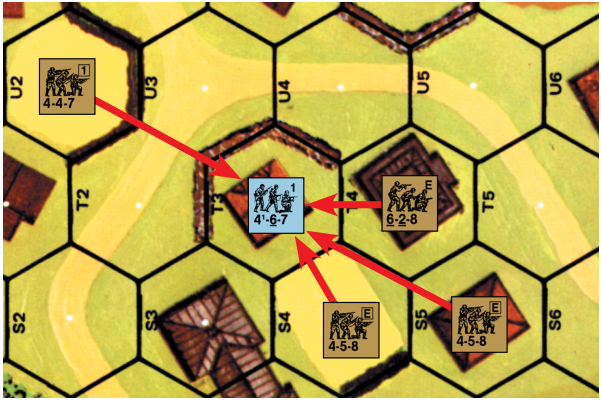

EX: If a unit in U2 fires on T3, T3 can be Encircled if the next attack(s) in that phase is from S5 (along the S4-T4 hexspine of T3), or through both the S4-T3 and T4-T3 hexsides. A four-hex FG in 3T3-U4-U5-T5 firing on T4 with enough FP to cause a MC or better result on an Original 2 DR automatically Encircles it.

```text
7  .  8  P  I  N  :  P  i  n  ni  n  g  (  7  .  3  05  ) a  ls  o o  cc  ur  s w  h  en  ev  e  r a  n  y
u  n  i  t i  s a  t  ta  c  k  e  d r  e  s  u  lt  i  n  g i  n a  n I  F  T M  C t  h  a  t i  s p  a  sse  d
```


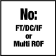

by rolling the highest DR possible that still results in a passed MC. Cavalry, vehicles, units in Water Obstacles, and units that are berserk, Heroic, Aerial, or Climbing are not subject to pinning *[EXC: a Minimum Move (4.134) pins berserk/heroic Infantry, as might a PF check (C13.31); see G5.5 for Collapsed huts]*. A unit is also pinned if it fails a PAATC (11.6; 12.41). Pinning affects broken units only during Interdiction (10.53), and even then only during the RtPh, so there is no need to place Pin counters on broken units. A pinned unit has its inherent FP halved for the remainder of that Player Turn (in addition to any other halving of its FP for other reasons) and may not move/advance farther during that Player Turn (although it may rout if later broken, even voluntarily). Place a Pin counter on top of the affected unit. The halved FP of a pinned unit in CC applies only to its attack, not to its defense. Pin effects are not cumulative; a unit suffering multiple Pin results has its FP halved only once, so an already-pinned unit does not take a NTC due to a “PTC” result on the IFT. Remove all Pin counters at the end of the current Player Turn or if the unit subsequently breaks/goes-berserk/Battle-Hardens/becomes-heroic (whichever comes first).

**7.81 INFANTRY EFFECTS:** Pinned Infantry fires MG/IFE/Canister as Area Fire, must add +2 to its To Hit DR (To Hit Case D), and cannot attack with a FT/MOL/DC, declare a Fire Lane, change a weapon’s CA (9.21; C5.1-.12), or use Intensive Fire or a Multiple ROF (although it may use Subsequent First Fire/FPF; 8.3-.31).

**7.82 VEHICLE/CREW:** A Pin result vs the CE Inherent crew of a CT AFV forces it to remain BU during that Player Turn, thus subjecting it to the Case I (BU) To Hit DRM. The Inherent crew of an OT AFV remains CE vs a Pin result, but during that Player Turn is subject to the Case D To Hit DRM and the halving of all MG/IFE/FT/Canister FP, as well as prohibiting it from using Intensive Fire and Multiple ROF. An Inherent crew that suffers a Pin result when attacked through an unarmored Target Facing (even if only hull or turret/upper superstructure) is subject to the same penalties as that of an OT AFV. A vehicle itself can never be pinned, nor can its Inherent crew; however, leave the Pin counter on the vehicle to show that the above penalties apply.

**7.821 PASSENGERS/RIDERS:** Pinned Passengers must BU if CE and are considered Pinned for all purposes, although they may continue to be transported by their vehicle and may even unload (D6.5) at their option, but then become pinned in the dismount Location. Pinned AFV Riders must Bail Out (D6.24).

**7.83 MOVEMENT/ADVANCE:** Pinned Infantry is not subject to any further DRM for FFNAM/FFMO during that Player Turn. However, if a pinned unit is subsequently broken during Defensive First Fire, it loses its pinned status and is subject to FFNAM/FFMO DRM (if applicable) for further Defensive First Fire attacks against it in its MPh (keeping in mind that a broken unit’s MPh ends as soon as another unit moves<sup>11</sup>). A pinned unit *[EXC: PRC]* is considered a non-moving unit for purposes of all subsequent ordnance To Hit attempts during that Player Turn. A unit that is pinned while moving through an entrenchment Location without actually having paid the one MF necessary to enter that entrenchment is not considered in it, and cannot enter it while pinned. EX: A squad uses Non-Assault Movement to enter an Open Ground hex and is attacked by Defensive First Fire with a -2 FFMO/FFNAM DRM, resulting in it being pinned. Another defending unit now First Fires on it but without the -2 DRM because the unit is pinned. However, this attack breaks the squad and removes its pinned status. If another unit First Fires on it in its present MPh it will again be subject to the -2 DRM. However, as soon as another unit is moved, the broken unit’s MPh is over and it is no longer subject to FFMO/FFNAM DRM.

**7.831 LEADERS:** A moving leader who becomes pinned does not force any Infantry in the same moving stack to take a LLTC, but does cancel the two MF (if not already used; see 4.12) and/or portage (4.42) bonus that it might otherwise have given to other Infantry in the same moving stack. A pinned leader can neither direct an attack nor use Voluntary Rout (10.711; although it may still voluntarily break [10.41] to rout)—nor can a pinned leader aid other units’ MC/TC (including the use of a Commissar’s increased Morale Level; 25.221).

**7.9 COWERING:** IFT attacks are adversely affected by any IFT resolution DR that results in Original “Doubles” unless a leader directs that attack. The penalty for rolling Doubles without leadership direction is that the attack is resolved on the next lower column of the IFT. An attack on the lowest column which cowers is reduced to no effect at all, although a malfunction result can still occur. In addition, any unit that cowers (as well as all of its SW regardless of whether it was using its inherent FP) is automatically marked with a Final or Prep Fire counter as appropriate. Cowering affects all fire except that from a SMC, berserk or Fanatic unit, Fire Lane, IFE, Canister, Aircraft, British Elite and First Line units, Finns *[EXC: Conscripts (25.7)]*, Sniper, ordnance, OBA, or any form of vehicular fire. Cowering FP penalties are doubled (i.e., resolved *two* columns lower on the IFT) for an attack by Inexperienced (19.33) Personnel (even in conjunction with other troops). Cowering does not affect CC or DC resolution (including Reaction Fire; D7.2). If a FG cowers, Random Selection is used to determine the unit(s) (and its SW) that becomes marked with a Prep or Final Fire counter.

<!-- pdf-page 59 -->

## 8. DEFENSIVE FIRE PRINCIPLES

**8.1 FIRST FIRE:** Defensive Fire is unique in that it can occur during the enemy MPh as well as during its own DFPh. The portion occurring during the enemy MPh is called Defensive First Fire and can be used only vs a moving unit(s)—although it can also affect the terrain in the hex. During the ATTACKER’s MPh, the DEFENDER should keep careful watch as the ATTACKER counts aloud the MF/MP expended as each unit/stack he moves enters a new Location or performs some task requiring the expenditure of MF/MP in its current Location. Anytime a unit/stack expends MF/MP in the LOS of one of his units, the DEFENDER has the option to temporarily halt its movement while he fires at it in that Location with as many attacks as he can bring to bear. The DEFENDER must place “First Fire” counters above all units/weapons that have fired and exhausted their ROF (being sure to place any SW that are still eligible to fire above that First Fire counter); these units/weapons may not fire again during that MPh *[EXC: Subsequent First Fire and FPF (8.3-.31); Intensive Fire (C5.6)]*. Defensive First Fire attacks affect only the moving unit/stack regardless of other units that occupy the same or intervening hexes at the instant of attack. Although a vehicle that enters a new hex is considered a “moving target” throughout the DFPh (C.8), only one vehicle at a time is ever considered “moving” for Defensive First Fire purposes *[EXC: Radioless AFV Platoon (D14.2); Convoy (E11.)]*. Once another unit begins movement or the MPh is declared over, previously moved units are no longer subject to Defensive First Fire attack. Units can expend MF/MP for movement activities other than physically moving (e.g., placing SMOKE grenades, SW Recovery, etc.) but may not combine two or more different activities in one “simultaneous” MF/MP expenditure. EX: A unit wishing to move into an Open Ground Location and attempt SW/Gun Recovery (4.44) cannot declare a two-MF expenditure to do so; it must expend one MF to enter the Location, and only after surviving, unpinned and in Good Order, all Defensive First Fire ensuing from that expenditure can it expend another MF to Recover the SW/Gun. **\*8.10 OPTIONAL FIRST FIRE COUNTERS:** Special individual “FIRST FIRE—XX” counters are provided for players who wish to mark separately the units and weapons making Defensive First Fire attacks, e.g., “FIRST FIRE—INHERENT” (see Appendix 6). Other than how those units/ weapons are marked, none of 8. DEFENSIVE FIRE PRINCIPLES changes.

**8.11 FACING:** Defensive First Fire must be resolved before the moving unit/ stack leaves the intended target Location (or, if firing at a particular Target Facing of an AFV, before that AFV changes its current Target Facing). The DEFENDER may not request that a moving unit be returned to a previous position to undergo attack. However, the ATTACKER must give the DEFENDER ample opportunity (as previously defined between the players) to declare his fire before moving on and, before moving another unit, must declare the end of the first unit’s movement at which time it may be fired on as moving. Vehicular Facing changes (D2.11) must be declared aloud and followed by an appropriate pause before further movement. Similarly, any moving vehicle planning to unload Passengers/Riders may do so only after an adequate pause following its expenditure of a Stop MP (D2.13). Once the ATTACKER announces that he is unloading Passengers, it is too late for the DEFENDER to announce an attack on the vehicle with its Passengers/Riders still loaded—even if the disembarking declaration is the first MP/MF expenditure of the MPh.

**8.12 MOVING WITHIN LOCATION:** Any action that requires the expenditure of a MF/MP in a Location qualifies it as a target for Defensive First Fire even though it might not have entered that Location during that MPh. Examples of such expenditures include a vehicle changing VCA or (un)loading Passengers, Infantry leaving an entrenchment without leaving the Location, or placing SMOKE grenades (24.1) or a DC.

**8.13 DEFENSIVE FIRST FIRE DRM:** The -1 DRM for FFNAM/ FFMO apply only to Defensive First Fire attacks, as do all To Hit Cases of J *[EXC: vehicle in Motion; D2.4]* of the Target Hit Determination DRM (C6.1) for ordnance.

**8.14 FOLLOW-UP ATTACK:** A unit broken or pinned by Defensive First Fire can be fired on again in its current Location by other same-phase Defensive First Fire attacks, but is attacked in its broken or pinned state. A unit that survives a Defensive First Fire attack with no effect can be fired on again in that same Location during its MPh before expending additional MF/MP, but only by different attackers or if it expended at least two MF/MP in that Location (see 9.2). A moving unit subject to FFNAM/FFMO which breaks is still subject to those DRM in that Location for subsequent Defensive First Fire attacks until *its* MPh ends, even if previously pinned (see 4.61 for Assault Movement).

**8.15 SNAP SHOT:** Any unit wishing to make a Small-Arms/MG Defensive First Fire attack may claim a Snap Shot if it can trace a LOS to an *entire* hexside (even if that hexside is part of a Blind hex) that was crossed by the moving unit in entering a on-board hex (even if the center dot of that hex is out of the firer’s LOS) *[EXC: A Snap Shot cannot be taken at a unit while entering the firer’s hex]*. The FFNAM/FFMO DRM cannot apply (even if the entire length of the hexside is along Open Ground), nor does the TEM of most other terrain in the target hex (C.5C; however a wall/hedge/SMOKE/rubble hexside/spine of a hex being entered/exited can modify a Snap Shot if crossed by the LOF on the way to the target hexside). Snap Shots are resolved as Area Fire. If affected by a Snap Shot, the moving unit is considered in the Location entered thereafter. Neither a MG that must change its CA (9.21), nor an ordnance weapon, nor a weapon using IFE/Canister can make a Snap Shot (see also B9.2 and C.5). A firer can make only one Snap Shot at a unit crossing a hexside, even if that unit is expending \> one MF to enter the hex, but may do so after other (even non-Snap-Shot) attacks. EX: The 5-2-7 in 1H5 has a LOS to both H7 and I7, but rather than firing at the 4-6-7 as it Assault Moves to H7 from I7 with five FP and a +2 TEM, it prefers to take a Snap Shot along the H7-I7 hexside with 2<sup>1</sup>/2 FP and no TEM. Now assume that the 4-6-7 did not use Assault Movement and continues to move by entering G7. The 4-4-7 in K2 does not have LOS to either H7 or G7 (because of the buildings in J4 and H5 respectively) but it does have a LOS along the entire H7-G7 hexside, and therefore may take a Snap Shot at the 4-6-7 as it crosses that hexside with 1 FP choosing not to use its MG (4 ÷ 2 [Snap Shot] = 2 ÷ 2 [Long Range] = 1). If a wall existed at H7-H6/G7-H6, the Snap Shot from K2 would have to add a +2 DRM. If the 4-6-7 had started in H7 and Dashed through G7 to G6, the 4-4-7 could use its MMG to take a Snap Shot with 1 FP (4 ÷ 2 [Snap Shot] = 2 ÷ 2 [Dash] = 1). If hexes G7, H7, and I7 comprised a Level 1 hill, both Snap Shots would be subject to Height Advantage TEM.

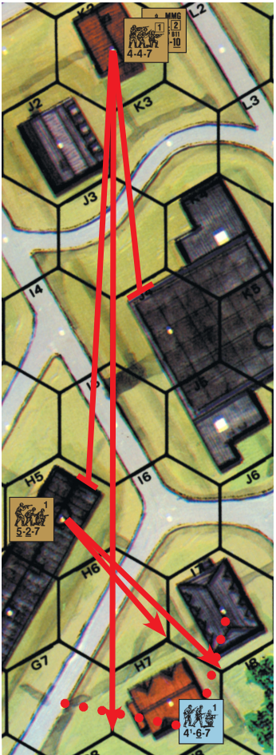

<!-- pdf-page 60 -->

**8.2 RESIDUAL FIREPOWER:** When a unit is attacked by Defensive First Fire/Subsequent First Fire/FPF, the target Location in which the attack is resolved (even if in Bypass) is marked with a Residual FP counter equal to half (up to a maximum of 12 after adjustment as per 8.26; FRD) of the highest IFT FP column used for that attack. If the attack includes a To Kill DR vs a vehicle, Residual FP is created in the same manner *[EXC: If AP (unless fired by a MG), ATR, APCR, or APDS was used, or if a Dud (C7.35) resulted, no Residual FP is created]*. Thereafter, any unit entering (or expending MF/MP in) that same Location in the same MPh is attacked on the IFT with the FP represented by that Residual FP counter, a new IFT DR, and any applicable FFMO/FFNAM DRM. A unit expending MF/ MP to leave a Location is not subject to Residual FP attack in the Location it is leaving. All non-hexside TEM and SMOKE/FFE-Hindrance DRM of the target Location apply to a Residual FP attack (even vs Bypassing units). Remove all Residual FP counters at the end of the MPh.


**8.21** No more than one Residual FP counter can be placed in a Location (although Fire Lane Residual FP is not a Residual FP counter and therefore can co-exist with other Fire Lane counters or Residual FP counters; 9.222). However, a larger Residual FP counter subsequently earned from a larger qualifying IFT attack can replace a smaller Residual FP counter. Residual FP can attack even units using Bypass (or those who must be attacked at a particular vertex) in the Residual FP Location.<sup>12</sup> Similarly, fire at a unit using Bypass leaves Residual FP in the entire obstacle Location, but fire that cannot affect units IN a Depression leaves Residual FP only on a Crest counter or bridge and can affect units in that hex only at/if crossing that higher level.

**8.22 RESTRICTIONS:** Residual FP can never form a FG; i.e., it must always attack alone. Existing Residual FP is always the *first* Defensive First Fire attack allowed against a moving unit in its current Location during its MPh. A Collateral Attack never leaves Residual FP but the attack that causes it may. OBA and minefields never leave Residual FP because they attack any unit that enters the minefield or FFE Blast Area (C1.5). A unit can be attacked by Residual FP only once per Location *[EXC: if, since that first Residual FP attack, the Residual FP has increased in strength or the unit is subject to more-negative-DRM/less-positive-DRM, it will be attacked again by that Residual FP upon further MF/MP expenditure]*. However:

- MF/MP expended “simultaneously” (e.g., two MF to enter a building, two MF to cross a wall and enter Open Ground, eight MP for a truck to ascend a Crest Line, etc.) do not cause multiple Residual FP attacks. Expending MF/MP for separate activities (e.g., one MF to enter a hex plus one MF to place SMOKE grenades) is never considered a “simultaneous” expenditure (8.1).
- Residual FP does not attack until any activity that a MF/MP expenditure allowed is completed (e.g., placing SMOKE grenades, SW Recovery, Searching, firing a Smoke Dispenser, etc.) *[EXC: entering a vehicle; (un)hooking; D5.43]*.
- An attack vs a pillbox never leaves Residual FP in the pillbox Location, nor in the non-pillbox Location of that hex unless the attack could affect the entire hex (e.g., Spraying Fire, Area Target Type, etc.).

**8.221 MALFUNCTION:** Residual FP is not gained for an attack by a malfunctioning weapon, nor by a unit that makes a Small-Arms-attack Original 12 IFT DR while suffering from Ammunition Shortage (19.131). Attacks by Residual FP *[EXC: MG Fire Lane; 9.223]* are never subject to malfunction or Ammunition Shortage.

###### 8.222 vs AFV

**8.222 vs AFV:** Residual FP has no effect vs an AFV except Collaterally (D.8) vs any Vulnerable PRC.

**8.223 SNAP SHOT:** A Snap Shot does not leave Residual FP.

**8.224 COWERING:** Residual FP attacks are not subject to Cowering. However, the amount of Residual FP formed by a Cowering attack is usually reduced since Cowering reduces the IFT FP used for the attack. *Once placed, Residual FP is never halved or reduced for any reason* (including Dashing or concealed targets).

##### 8.23 ROF

**8.23 ROF:** A weapon does not automatically leave Residual FP if it retains a Multiple ROF (9.2, C2.24). In essence, placement of a Residual FP counter always ends a unit’s/weapon’s Defensive First Fire attacks for that MPh *[EXC: Subsequent First Fire (8.3), FPF (8.31), Intensive Fire (C5.6)]*. The decision to forfeit possible remaining First Fire capability in order to leave Residual FP must be made immediately after resolving its attack. If a player decides not to leave Residual FP for a weapon so as to preserve its Multiple ROF, a Residual FP counter can still be placed in the Location attacked if the weapon used was part of a FG, but the Residual FP is based on the FP used by the FG’s other units that do (or choose to) not retain a Multiple ROF. EX: A 4-6-7 squad and a MMG make a 9 FP Defensive First Fire attack vs a unit in Open Ground. The colored dr of the IFT DR is ≤ 2. To retain his Multiple ROF for the MMG, the German player opts to leave no Residual FP with the MG, but the squad still leaves two Residual FP in the target Location.

**8.24 SPRAYING FIRE:** Any squad, Gun, or MG allowed to place Residual FP may place an appropriate Residual FP counter in each of the affected Locations when using Spraying Fire—even where no enemy unit is present (9.52).

**8.25 ORDNANCE:** An ordnance weapon must secure a hit in order to exert Residual FP. However, once the Residual FP has been placed its effect is automatic; newly arriving units do not have to be “hit” again to be affected by it (see 8.23). Neither Intensive Fire (C5.6), AP-type ammo (see 8.2), nor PF/PFk (C13.31) leaves Residual FP.

**8.26 EFFECT OF DRM:** The amount of Residual FP left by any attack is reduced by one IFT column for each positive DRM *caused solely by condi- tions outside (including CX, BU, Stun, leadership modifier, orhexside/bridge TEM of the target Location which modified (or could have modified; B9.31) the To-Hit/IFT DR, but excluding Height Advantage and LV DRM (E3.1))* the target hex (e.g., a 6 Residual FP counter is flipped over to the 4 FP side for a +1 DRM or changed to a 2 Residual FP counter for a +2 DRM *[EXC: Fire Lane; 9.22]*). Negative DRM (such as those for leadership, FFMO/FFNAM, and Bore Sighting) never affect the amount of Residual FP left in a hex *[EXC: Air Bursts increase the amount of Residual FP left by one IFT column]*. 8.26 EX #1: A four-FP Defensive First Fire attack from 3R6 to T7 leaves two Residual FP in T7 despite the +1 TEM of the woods, but a four-FP First Fire attack from T9 to T7 leaves only one Residual FP in T7 due to the +1 Hindrance DRM caused by the grainfield in T8. Only the larger of the two Residual FP counters remains in the hex.

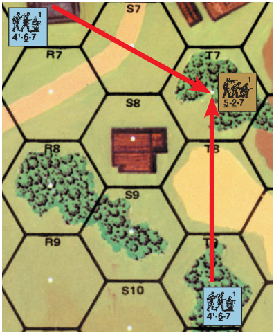

(See 8.26 Example #2 at the top of the next page.)

<!-- pdf-page 61 -->

8.26 EX #2: A 4-6-7 in 3X1, directed by a 9-2 leader, has fired on a moving unit in Z2 with a total DRM of -2 (-2 [leadership] +1 [hedge TEM] -1 [FFNAM] = -2) and eliminated it. However, for Residual FP purposes only the +1 TEM for the hedge is considered—resulting in one Residual FP being placed in Z2. A 5-2-7 now enters Z2 from Z3 without Assault Movement and is attacked on the 1 FP column with a -2 DRM for FFNAM/FFMO. The hedge does not negate the FFMO DRM because the Residual FP was already reduced by the hedge when it was initially placed in the hex. The Residual FP DR is 8 and has no effect. Assume there was a 2 squad foxhole in Z2 with an entrenched 6-2-8 and unpossessed MG. If the 5-2-7 were to enter the foxhole it would not be attacked again by the Residual FP. When the 6-2-8 expends a MF to Recover the MG, it is attacked by the 1 FP column with a total +1 DRM (+2 [TEM] -1 [FFNAM] = +1) despite the fact that the 4-6-7 doesn’t have LOS to a non-adjacent unit entrenched behind a hedge. If the 6-2-8 then exits the foxhole, it would be attacked again by the Residual FP since it is becoming more vulnerable with a -2 DRM for FFNAM/FFMO. EX: A hit with a 60mm mortar attacks an Open Ground Location on the 4 FP column and leaves 2 Residual FP. If the attack had been vs a woods Location subject to Air-bursts, it would leave 4 Residual FP, and Infantry moving through the woods would receive the +1 TEM vs the 4 FP Residual attack. If the attack had been through a hedge hexside, the Residual FP would be unaffected by the zero Indirect Fire TEM of the hedge (B9.34). EX: A 4 FP attack traced through a wall hexside yielding a +2 TEM leaves no Residual FP (2 Residual FP reduced to 1 Residual FP by a +1 TEM and reduced  to 0 Residual FP by the second +1 TEM).

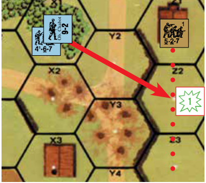

**8.3 SUBSEQUENT FIRST FIRE:** A DEFENDING *Infantry* unit/(its MG/ IFE-weapon) already marked with a First Fire counter may Defensive First Fire again during that MPh as Area Fire by flipping its First Fire counter over to the Final Fire side. Such fire can leave Residual FP but if using a MG/IFE is treated as Sustained Fire and penalized accordingly. Only Small Arms *[EXC: MOL]*, MG, and IFE can be used as Subsequent First Fire. Subsequent First Fire cannot be attempted against any target at a range \> that to the closest armed, Known enemy unit, nor outside the firer’s Normal Range. Like Defensive First Fire, Subsequent First Fire options are MF/MP dependent; i.e., if the moving unit expends only one MF and draws Defensive First Fire, that Defensive First Firer cannot immediately Subsequent First Fire at it until it expends another MF. The same unit/weapon can never fire on a moving unit in the same Location more times than the number of MF/MP expended (FRD, but a minimum of once per hex) in that Location during that MPh (see 9.2). Whenever a unit uses Subsequent First Fire, it must use all MG/IFE in its possession (up to the unit’s normal operation capabilities; 7.35-.353) as Subsequent First Fire or forfeit their use for the remainder of that Player Turn (barring FPF); a squad may not split its usable inherent FP from that of its MG/IFE during Subsequent First Fire unless it opts to not use the remaining FP/SW at all. A Multiple-ROF weapon cannot be fired more than once per Subsequent First Fire attack. If a unit, or any SW/Gun it possesses, uses Subsequent First Fire (or Intensive Fire) then that unit and all its SW/Guns are marked with a Final Fire counter.

**8.31 FINAL PROTECTIVE FIRE (FPF):** FPF is a Subsequent First Fire option available only to DEFENDING *Infantry* already marked with a Final Fire counter<sup>13</sup> which wish to use their Small Arms *[EXC: MOL]*/MG/IFE to attack ADJACENT or same-hex moving ground units in the ATTACKER’s MPh. All usable MG/IFE possessed by that unit (up to the unit’s normal operation capabilities; 7.35-.353) must be fired (even if not previously marked with a Final Fire counter) and are subject to Sustained Fire penalties. A unit using FPF may form a FG with units not using FPF, but only those units using FPF are affected by its adverse affects. FPF is a combination of Area Fire and PBF (or TPBF), and also in-volves considerable risk to the firer. Immediately after normally resolving the FPF attack vs the moving units, the firer’s Original IFT DR is modified only by any applicable leadership DRM and is used as a NMC against the firing unit(s) using FPF (including any directing leader). Whenever a Casualty MC (10.31) or Heat of Battle (15.1) applies to this NMC and ≥ 2 units are involved, use Random Selection to determine which unit is affected. The target of the FPF attack is attacked normally even if the FPF DR also breaks or pins the firer. Provided it does not break, there is no limit to the number of FPF attacks a unit may make, other than the number of moving units and the MF they expend (as in 9.2) moving ADJACENT to or in the firer’s hex (thus affording the DEFENDER the opportunity to attack them). Any MG/IFE possessed by a unit using FPF is marked with a Final Fire counter regardless of its ROF— even if it had not fired previously in that MPh. Units broken by FPF in a Location containing enemy units are eligible to rout out in the ensuing RtPh. After a TPBF FPF attack, all non-Meleeing co-occupants of that Location are marked with a CC counter to show that they are not yet in Melee.


**8.311 RESTRICTIONS:** A unit eligible to use TPBF vs a Known enemy unit *[EXC: unarmed, unarmored vehicle; 7.212]* cannot use FPF vs an adjacent unit. Infantry manning ordnance cannot fire it during FPF *[EXC: OVR Prevention; C5.64]* but must add their inherent FP to the FPF attack.

###### 8.312 TPBF

**8.312 TPBF:** An armed, unbroken *Infantry* DEFENDER not in Melee *must* after all Residual-FP/minefield/OBA attacks then immediately attack any Infantry/Cavalry MMC unit that enters its Location during the MPh whether it uses Defensive First Fire, Subsequent First Fire, or FPF *[EXC: A SMC with a MG/IFE already marked with a First Fire counter may not use Subsequent First Fire or FPF because it cannot use Sustained Fire; 9.3]*. See also OVR; D7.2. All such FPF and any Defensive/Subsequent First Fire must be combined into one Mandatory FG (7.55).

**8.4 FINAL FIRE:** That portion of Defensive Fire which occurs during the DFPh is called Final Fire. During Final Fire any of the DEFENDER’s units/ weapons that are *not* marked with a First, Final, Intensive, or No Fire counter may fire. Any such units/weapons that *are* marked with a First Fire counter may also fire again (by flipping their First Fire marker over to the Final Fire side), but as Area Fire and only at units in an adjacent (or same) hex, therefore also possibly benefiting from PBF (or TPBF). A unit/weapon already marked with a Final Fire counter cannot fire during Final Fire. Final Fire affects all applicable units in a target Location—not just those that may have moved— but without any modifiers for FFNAM/FFMO.

**8.41 MULTIPLE ROF:** Any Multiple-ROF weapon which is *not* marked with a First, Final, Intensive or No Fire counter (even though it may have fired during First Fire) is still entitled to multiple attack possibilities during Final Fire, and at any target, not just adjacent ones. Any weapon marked with a First Fire counter and capable of Intensive Fire (C5.6) or Sustained Fire (9.3) may use such for one additional attack during Final Fire only vs adjacent or same-hex targets. EX: It is the Russian MPh and all three Russian units are berserk (15.4). The 6-2-8 starts the MPh by charging the 4-6-7 in 1X2, and is First Fired upon in W2 by the 4-6-7 and its LMG directed by the 8-1 leader (14 FP and a -3 DRM). The Original 6 DR on the IFT results in a “K/3” which Reduces the 6-2-8 to a 3-2-8 HS but fails to eliminate the resulting 3-2-8 HS when it passes the 3MC due to its berserk Morale Level of 10, so it enters X2 where it must be fired on again (8.312) using Subsequent First Fire with 10<sup>1</sup>/2 FP (7 × 3 [TPBF] = 21 ÷ 2 [Area Fire] = 10<sup>1</sup>/2) and a +1 DRM (+3 [TEM] -1 [FFNAM] -1 [Leadership] = +1), and with the LMG’s B# reduced by two (invoking A.11) even if it retained its

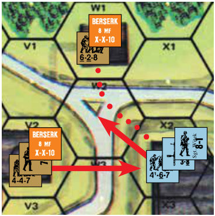

<!-- pdf-page 62 -->

multiple ROF (9.3). The attack causes a NMC which the 3-2-8 passes. However, the German units and LMG are now marked by a Final Fire counter. The German units cannot fire outside their Location as long as the 3-2-8 occupies it too (7.212). Because the 3-2-8 expended two MF to enter X2, the German stack may attack it again (this time using FPF), but declines. The berserk 4-4-7 and 7-0 leader now charge into X2, where they are first (8.22) attacked by the four Residual FP left by the previous attack and a +2 DRM (+3 TEM -1 FFNAM). This attack has no effect, however, and now the German units must attack with FPF (8.312). The German FPF attack is once again 10<sup>1</sup>/2 FP with a +1 DRM, but is made only vs the 4-4-7 and 7-0 since the 3-2-8 is no longer moving. The Final IFT DR is an 8, which results in a NMC vs the two Russian units, which they pass. The Original IFT DR of 7 results in no effect vs the Germans due to their leadership modifier which makes it a Final DR of 6. However, if the Original DR had been an 8 the German 8-1 would have immediately been pinned which in turn would have caused the 4-6-7 to break (due to the temporary loss of his -1 DRM; 7.831); had it been a 9 both units would have broken and would have to rout from the hex (assuming they survive the Russian AFPh). Because the Russians used two MF to enter X2, the Germans can repeat their FPF attack but are not obliged to and, given the dire consequences of rolling too high, decide not to attack further. During the AFPh the Russians will be able to attack with 10<sup>1</sup>/2 FP (7 × 3 [TPBF] = 21 ÷ 2 [AFPh] = 10<sup>1</sup>/2) and a +3 TEM, but with no leader direction (15.41-.42). Any broken units will rout out during the RtPh and all remaining units will engage in CC during the CCPh. If the LMG (only) were already marked with a First Fire counter when the 6-2-8 was first attacked in W2, that attack would use 11 FP ({4 [4-6-7 FP] + 1<sup>1</sup>/2 [LMG Area Fire]} × 2 [PBF] = 11) since the LMG would be using Sustained Fire, and the 8-1 would not be able to direct it (since the FG would now contain a new unit not directed by that Leader during Defensive First Fire; 7.53); the 4-6-7 and LMG would then both be marked with a Final Fire counter. If on the other hand only the squad had First Fired previously, after the first attack on the 6-2-8 both the 4-6-7 and its LMG would be marked with a Final Fire counter (even if the German player opted not to use the LMG in that attack; 8.3). Now assume that the LMG was possessed by a 2-2-8 crew in X2 with the squad and leader, and that the crew had held its fire until X2 was entered. The attack vs the 3-2-8 in X2 would be 15FP (4  [squad FP] × 3 [TPBF] = 12 ÷ 2 [Area Fire] = 6 + (3 [LMG FP] × 3 [TPBF] = 9) = 15) with a +2 DRM (leader direction is NA; 7.53). The crew could use either its inherent FP or the LMG. The crew or its LMG (now both marked with a First Fire counter) can elect to make a second attack in X2 as Subsequent First Fire with either its inherent FP or the LMG (thus flipping its First Fire counter to the Final Fire side) but has only three FP (or 4.5 FP if it uses the LMG) unless the squad joins the attack with FPF. The squad does not have to attack, however, because it has already fulfilled its requirement to do so when the Location was entered, although it has the option to do so. The German player, realizing that other berserk units will soon enter the Location and force another FPF attack by the squad, declines to attack again with the squad at this time—but because the crew will be unable to fire outside its Location (now occupied by enemy units), decides to use its Subsequent First Fire opportunity now. Both German units will be forced to use FPF vs the remaining berserk Russian units when they enter their Location, with the crew forced to use the LMG rather than its inherent FP.

## 9. MACHINE GUNS & SW MALFUNCTION

[A LMG counter represents a weapon additional to the inherent complement of such weapons present in a squad and accounted for by that squad’s FP. The inherent LMG of a squad counter is not subject to any of the following rules, nor can it ever be turned into a LMG counter.]

**9.1 COUNTERS:** A <sup>1</sup>/2" MG counter is a SW and is dependent on Personnel to portage and fire it. Each SW MG has a two-number hyphenated Strength Factor; the number on the left is its FP and the number on the right is its Normal Range as measured in hexes. See also 4.4, 9.2, and 9.7-.72.

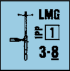

**9.11 MMC USAGE:** A squad may fire any one SW MG at no cost to its own Inherent FP, or any two SW MG at their normal MG FP effect at the cost of forfeiting its own Inherent FP for the current and any remaining fire phases in that Player Turn *[EXC: 7.353]*. Any other MMC may fire only one SW MG (regardless of type) with full FP, but in so doing forfeits its Inherent FP for any remaining fire phases in that Player Turn *[EXC: 7.353]*.

**9.12 SMC USAGE:** Unless otherwise prohibited, a single leader may fire any one SW MG as Area Fire, while two SMC stacked together may fire any one SW MG counter at full FP. If a leader fires/uses a SW-MG/any-other-SW (either singly or in combination with another SMC), he loses any leadership DRM he may have otherwise exerted during that fire phase, but the SW is exempt from Cowering. See 15.23 for Hero usage.

**9.2 MULTIPLE ROF:** Each SW (or vehicular MA) MG has a number encased in a square to denote its Multiple ROF, and therefore may conceivably fire many times each Player Turn (whether separately or as part of a FG), depending on how long its operator engages each target. This time factor is abstractly represented by the Original colored dr of the MG’s IFT-Resolution/ TH-(9.6) DR. If that colored dr is ≤ the MG’s applicable ROF, the MG retains its Multiple ROF and may be fired again during that phase (A.15). However, during the MPh a DEFENDER MG cannot fire at the same unit in the same Location more times than the number of MF/MP expended by the target in that Location (FRD, but a minimum of once per hex). Once a MG has lost its Multiple ROF, it is marked with an appropriate Prep, First or Final Fire counter. Each MG in a multiple-MG FG retains or loses its own Multiple ROF based on the Original colored dr of the FG IFT DR (e.g., if a FG with a MMG and a LMG rolls a colored 2 dr on its IFT DR, the LMG has exhausted its Multiple ROF but the MMG has not). See also 4.41 and 21.12-.13. EX: The Russian MG in 1J5 Defensive First Fires with a -2 FFNAM/FFMO DRM on the squad and leader stack as they enter H6 from H7 at a cost of one MF. The result pins the leader, but the squad continues on into H5. Having retained Multiple ROF with a 1 on the Original colored dr of its IFT DR, the MG may fire again, but not on the pinned leader (unless it waits until Final Fire and is still not marked with a First Fire or Final Fire counter) because only one MF was expended in that hex. (If the pinned leader had expended two MF in entering H6 and thereby allowed another shot, the -2 FFNAM/FFMO DRM would not apply to that second shot because the leader is now pinned; moreover, the MG would have to make its decision whether to continue firing at the pinned leader before the squad leaves the leader’s hex, because thereafter the leader’s MPh has ended and it is no longer subject to First Fire.) So the MG fires on the squad in H5 with a +2 DRM (-1 [FFNAM] +3 [TEM]) and breaks it while again rolling low enough on the colored dr of his IFT DR to retain its Multiple ROF. Because the now-broken squad expended two MF in entering H5, the MG may attack it once more (still with a -1 FFNAM DRM; 8.14) and does so—but this time loses its Multiple ROF and is marked with a First Fire counter. It cannot use Subsequent First Fire vs the broken squad because it has already fired on it twice and the unit had expended only two MF in its current Location. Should another unit move into the MG’s CA (9.21) within a two-hex range, the MG could use Subsequent First Fire (and thus Sustained Fire; 9.3), but otherwise its attack opportunities are over for this Player Turn unless an enemy unit moves ADJACENT or into its current Location (see FPF; 8.31). The German MPh ends at this point, and the MG (not adjacent to an enemy unit) gets no Final Fire (8.4).

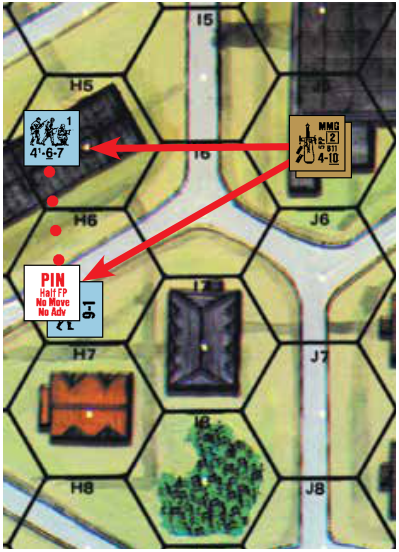

**9.21 FIELD OF FIRE:** Normally, a SW may fire in any direction with no detriment due to the facing of the counter. However, if a SW MMG/HMG in a woods/rubble/building hex fires and is entitled to another shot, it may continue to fire during that phase only inside the CA of the prior shot (which, unlike the CA of a Gun [C3.2], includes the MG’s own Location regardless of the hexside [if any] crossed by the target unit entering that Location). If it fired up or down a stairwell within its same

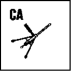

<!-- pdf-page 63 -->

hex, its CA is defined vertically and subsequent shots during that phase (other than vs its own Location) are limited to the same direction up or down the staircase. If necessary, place a CA counter on the MG (or alternately two hexes away to relieve any congestion caused by stacking), pointing to the center hexspine of that CA as a reminder of its now-fixed CA. Remove the CA counter at the end of the current phase *[EXC: a SW MMG/HMG with a fixed CA, and whose operator was pinned in the PFPh/MPh, retains that fixed CA until the end of the DFPh]*. The restricted-CA principles of 9.21 also apply to SW of the INF, RCL and 20L ATR types.

**9.22 FIRE LANE:** Whenever the DEFENDER declares a Defensive First Fire attack with a *Good Order* SW MG that is manned by unpinned *Infantry* (even as ordnance or as part of a FG), he may also declare a Fire Lane with that MG if it is not already marked with a First/Final Fire counter or is restricted by its terrain to using Area Fire (7.23) and is firing within its Normal Range (but not using TPBF) and at a same-level (B.5) target. If he does declare a Fire Lane, he must place a First Fire counter on the MG and, after resolving that First Fire attack in the normal manner, must also place a Fire Lane Residual FP counter in one hex along a Hex Grain; that Hex Grain must include the MG’s hex and its First Fire target hex, but he may place the Fire Lane counter in or beyond the latter hex *[EXC: no Fire Lane is placed if the MG’s manning Infantry Cowered, and/or used Subsequent-First-Fire (8.3-.31)/FPF, during that initial First Fire attack]*. Fire Lane FG are NA; i.e., each MG must create a separate Fire Lane even if using the same Hex-Grain/IFT-DR as another. An illegally placed Fire Lane counter is removed, but the MG is still marked with a First Fire counter. Each Fire Lane Residual FP counter contains an ID letter to match the A-F ID letter of its MG counter, and should be placed so that the arrow points back along the Fire Lane Hex Grain to the firing MG. A Fire Lane Residual FP counter exerts a unique form of Residual FP in its Location, and in every same-level (B.5) Location of the Fire Lane Hex Grain between that counter and the MG, that is within the MG’s Normal Range and in the LOS of its manning Infantry (when tracing their LOS to the hex center dot). However, neither NVR (E1.1) nor any SMOKE/brush/grain/marsh/ FFE/LV-(E3.1)/DLV-(F11.6)/Dust-(F11.794)/hut-(G5.21) Hindrance affects LOS for Fire Lane placement/attack purposes. A Fire Lane’s Residual FP is equal to the FP column to the left of the FP column normally used by that MG’s FP *[EXC: PBF doubles the reduced FP in the ADJACENT hex; Fire Lane Residual FP TPBF is NA (9.223)]*. A MG which has established a Fire Lane may not fire again until the DFPh *[EXC: if its Location is entered by an enemy unit; 9.223]*; see 9.3.


**9.221 ALTERNATE HEX GRAIN:** A Fire Lane may also be declared along an Alternate Hex Grain, which is a string of connected hexes in which the Fire Lane’s LOF (i.e., a line drawn between the first and last center dot) lies along a hexspine of the first hex. Whenever that LOF lies along a hexside, the Alternate Hex Grain includes the hex either to the left *or* to the right of that hexside. If that LOF lies along more than one hexside, the Alternate Hex Grain consistently includes the hexes on one side (either left or right). When placing a Fire Lane Residual FP counter along an Alternate Hex Grain, the DEFENDER must declare whether that Alternate Hex Grain will include the left- or right-side hexes, but must place the counter itself in a hex with a hexspine that points directly back to the MG. A unit crossing a hexside to enter/exit a Location where an Alternate-Hex- Grain Fire Lane exerts Residual FP may be attacked by it as a Snap Shot, provided the hexside being crossed lies along the Fire Lane’s LOF *[EXC: the Snap Shot is NA if that Fire Lane has already attacked that unit in the Location it is exiting; the Snap Shot FP of a Fire Lane is not halved as Area Fire]*. If the Defender opts for the Snap Shot, its target (including any element of a target stack) cannot be attacked again by that Fire Lane in the Location it is entering unless it expends further MF/MP (but regardless of any +/- change in DRM) therein. If he forgoes the Snap Shot, the unit will still be subject to attack per 9.22 if entering a Fire Lane Location.


**9.222 RESIDUAL FP:** Fire Lane Residual FP is treated as normal Residual FP except as stated otherwise. The Residual FP of a Fire Lane is never reduced by the effects of DRM (8.26). Because Fire Lane Residual FP is alEX: This Fire Lane, using the left Alternate Hex Grain, exerts four Residual FP in 21K8 (due to PBF) as well as two Residual FP in K7 and J6. (If it were using the right Alternate Hex Grain, it would exert four Residual FP in L7 and two Residual FP in K7 and K6, but any non-PRC unit attacked in K6 would receive wall TEM; 9.222.) Neither Fire Lane could affect J5, because the LOS to the center dot of that hex’s Level 0 Location is blocked by the K6-J6-K7 wall vertex (9.22; B9.1). A unit Assault Moving from K6 to J6 can, at the DEFENDER’S option, be attacked using two Residual FP either as a Fire Lane Snap Shot (with Wall TEM; 8.15) at the K6-J6 hexside, or as a normal Fire Lane attack (with a -1 FFMO DRM) in J6. The latter is the better attack, but if a stone building existed in J6—or an obstacle in K8 blocked the firer’s LOS to J6—the Snap Shot would be a better choice. A unit that *starts* its MPh in J6 by moving to K6 can be attacked by the Fire Lane only as a Snap Shot; however, if it were already vulnerable to Defensive First Fire in J6 it would undergo a normal Fire Lane attack there (thus prohibiting the Snap Shot), unless no LOS existed from the MG to J6 (in which case the Snap Shot would occur as it crossed hexside J6-K6 regardless of whether or not it *began* its MPh in J6). ways traced from its source, the effects of Hindrance/hexside/bridge DRM are resolved as DRM to the Residual FP attack *[EXC: SMOKE/grain/brush/ marsh/FFE/Heavy-(or denser)-Dust-(F11.794)/hut-(G5.21) Hindrances do not apply as DRM but do cancel FFMO; LV-(E3.1)/DLV-(F11.6) Hindrances do not apply as DRM]*. No CX/leader/hero DRM applies to a Fire Lane Residual FP attack. Fire Lane Residual FP attacks cannot cause the firer to Cower and need not be made if they could cause no effect. When a Fire Lane is placed due to a First Fire attack vs a unit using some form of Impulse movement (13.62; 25.232; D14.2; E11.2; E11.52), its Fire Lane Residual FP immediately attacks all other elements of that Impulse currently in any Location(s) where that Residual FP now exists. Fire Lane Residual FP cannot be used to increase the size of Residual FP from another source. In hexes where Fire Lanes intersect, *each* Fire Lane Residual FP attack must be resolved separately (in an order chosen by the firer), unless the first eliminates all targets. If Residual FP from a source other than another Fire Lane exists in a Location of a Fire Lane, it must be resolved separately prior to the Fire Lane Residual FP. (See Example at the top of the next page.)

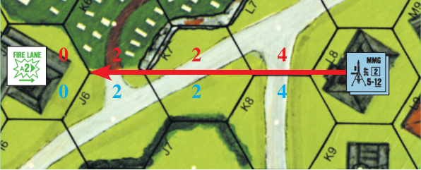

**9.223 CANCELLATION:** A MG’s Fire Lane Residual FP counter is removed only if the MG malfunctions, its manning Infantry is broken/pinned/ eliminated, or at the end of the current MPh—whichever occurs first. The MG malfunctions whenever its Fire Lane Residual FP attack DR is also an Original Malfunction DR. A MG may cancel its Fire Lane in order to gain freedom to fire elsewhere (/its manning Infantry may use Subsequent-First- Fire/FPF after establishing the Fire Lane) only if a TPBF/CC-Reaction-Fire situation occurs (8.312/D7.21)—in which case the Fire Lane must be cancelled *[EXC: an unarmored vehicle with no PRC (7.212) or an armored vehicle with no Vulnerable PRC which does not end its MPh in the Location do not require cancellation]*, even if the unit entering the MG’s hex does so across the hexside of the Fire Lane.

**9.3 SUSTAINED FIRE:** A MG that attacks using Subsequent-First-Fire/ FPF (8.3/8.31), or during the DFPh while marked with a First Fire counter (8.4), is using Sustained Fire and as a consequence its B# is lowered by two (see A.11) in addition to its FP being halved as Area Fire. Sustained Fire cannot be used by a vehicular MG *[EXC: MA, as per 8.4]*, nor if firing as ordnance, nor by a MG fired by a lone SMC. Sustained Fire always forfeits any chance for additional shots during the current phase *[EXC: FPF; 8.31]* and results in a Final Fire counter being placed on the weapon, regardless of its Multiple ROF and the colored dr.

<!-- pdf-page 64 -->

9.222 EX: The units in 3X3 declare a First Fire attack against a target using Assault Movement in AA5, and state that the MMG will create a Fire Lane. After resolving the attack with 8 FP and a 0 DRM (+1 [grain Hindrance] -1 [leadership]), the DE- FENDER places a 2 FP Fire Lane counter in BB5 thereby leaving two Fire Lane Residual FP in Z4, AA5, and BB5 (plus 4FP in Y4). In addition, the squad’s FP leaves one normal Residual FP in AA5 (8.21; 8.26). A unit subsequently using non-Assault in AA5 will be attacked first (9.222) by the one Residual FP with a -1 DRM (FFNAM) and then by the Fire Lane’s two residual FP with a -1 DRM (FFNAM) but the 4-6-7 cannot Subsequent First Fire against it (9.223). If the 4-6-7 were CX the First Fire Attack would have a +1 DRM, reducing the *squad’s* Residual FP to zero but not affecting the Fire Lane. If a +3 SMOKE were in X3 before/after the First Fire attack, the two Fire Lane Residual FP in BB5 would not be affected even though the SMOKE and Hindrance DRM from X3 to BB5 would total +6 (9.22; 24.8). If the HMG declares both a First Fire attack against a target in BB5 and a Fire Lane, the latter must use the left Alternate Hex Grain because no other (Alternate) Hex Grain includes that firer’s *and* target’s hex. If the Fire Lane Residual FP counter is placed in EE6 it will leave four Residual FP in AA6, BB5, CC6 and EE6 (plus 8 FP in Z5)— even if the original target was concealed. A unit attacked by the four Fire Lane Residual FP in EE6 would receive a +1 wreck Hindrance DRM, while Infantry attacked in CC6 would receive a +1 wreck TEM. No Fire Lane Residual FP exists in DD5 because the 5-4-8’s LOS to DD5’s center dot is blocked by the woods in BB5. If the wreck were in DD5, its +1 Hindrance DRM would not apply vs a target in EE6 (D9.4). Since two Fire Lanes merge in BB5, both must be resolved unless the first eliminates all targets. The existence of any obstacle(s) in Z5/Z6 would not prevent the HMG from establishing a Fire Lane to/past EE6 (assuming the LOF is not blocked), but would prohibit non- Snap-Shot Fire Lane Residual FP attacks in hexes that lack a LOS (as per 9.22) from Y6.

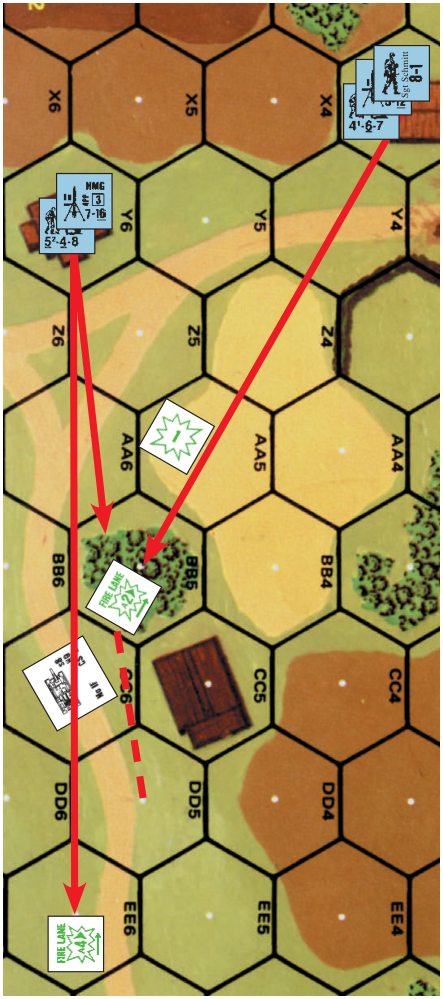

**9.4 MANDATORY FIRE DIRECTION:** MG fire is limited to a 16 hex maximum range unless an Infantry leader (even a 0 or + DRM leader) is directing that fire; moreover, MG attacks vs unconcealed Infantry at a range ≥ 17 hexes treat those Infantry as concealed unless they are broken/berserk/ overstacked *[EXC: A CMG/IFE, which was usually rigidly mounted and equipped with a telescopic sight, does not require the presence of a leader to fire beyond 16 hexes, nor does it treat unconcealed Infantry as concealed]*. A MG using Mandatory Fire Direction/Long Range Fire has no effect vs armored targets. See 12.14 for an EX of usage.

**9.5 SPRAYING FIRE:** A MG (not vehicular MG except for MA) may use Spraying Fire instead of its normal FP at any two target Locations in its LOS except its own Location (7.212), provided each target Location shares a common hexside with the other. The TEM of each target Location and LOS Hindrances between the firer and each target apply individually to each attack although both attacks use the same Original IFT resolution DR. Spraying Fire is always Area Fire. Any Location not in the MG’s LOS is unaffected by its Spraying Fire. The target Locations can be “adjacent” vertically in the case of building upper levels, but each must be within one level of the other and in the same hex. Spraying Fire can be traced to points other than the hex center when firing at units in Bypass (4.34) or using the road movement rate in a non-Open Ground hex (4.132). EX: A German 5-4-8 squad with a LMG in 1G4 can trace LOS to both H3 and I4. Combining its inherent FP with the FP of the LMG, it attacks both hexes using Spraying Fire thus halving the FP vs each hex. H3 is attacked with 8FP (PBF) and a +2 TEM, and I4 with 4FP and no DRM.

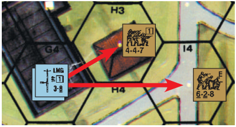

**9.51 vs VEHICLE:** Spraying Fire (like all forms of Area Fire) has no effect vs an AFV, but can affect Vulnerable PRC and unarmored/partially armored vehicles in the same manner as Small Arms Fire.

**9.52 RESTRICTIONS:** Spraying Fire cannot be used in a FG attack unless all members of the FG are capable of Spraying Fire, opt to use it, and trace their LOS to the same two target points. Spraying Fire can be used against a moving unit and against a Location without a moving unit (halved again for Area Fire), although its only effect in the second Location would be to leave Residual FP. A unit marked with a First Fire counter which attacks during Final Fire may use Spraying Fire only if both of the attacked hexes are adjacent to the firer. Spraying Fire cannot be used vs descending paratroops.

**9.6 VEHICULAR TARGETS:** The process for resolution of MG fire vs vehicular targets is dependent on whether the vehicle Target Facing/Aspect is armored or not. If the Target Facing is armored, such fire is resolved on the AP To Kill Table after securing a hit on the To Hit Table; otherwise it is resolved on the H Vehicle line of the IFT and no To Hit DR is necessary. A non-captured MG To Hit DR always uses the black To Hit numbers regardless of nationality when firing as ordnance.

**9.61 AFV KILL:** Unlike Small Arms Fire, a MG attack may conceivably destroy a poorly armored AFV during a fire phase by attacking it alone (i.e., not as part of a FG) on the To Hit Table (using the Vehicle Target Type) and the AP To Kill Table. Such an attack must be made within Normal Range of the MG, without any form of halved FP penalty imposed, and predesignated as an AFV To Kill attack vs a specific AFV. If hit in an unarmored Target Facing, the AFV is attacked on the H Vehicle line of the IFT instead of on the AP To Kill Table. If the resulting To Kill DR is \< the Final Kill Number for that Target Facing the AFV is eliminated (and burning if ≤ half of the Final Kill Number), and if the To Kill DR equals the Final Kill Number the AFV is Stunned (even if BU; D5.34). See C3.8 (Multiple Hits), C3.9 (Location of Hits) and D3.54 (Vehicular MG Fire vs AFV) for related information.

<!-- pdf-page 65 -->

**9.611 EFFECT vs PERSONNEL:** A MG making a normal IFT attack has no effect vs armor other than its effect on any Vulnerable PRC. However, a MG To Kill attack can also affect Vulnerable PRC of that AFV Collaterally (D.8A).

**9.7 SUPPORT WEAPON (SW) MALFUNCTION:** Whenever a SW fires there is a chance it will jam or run out of ammunition. Each SW has an inherent B12 unless it has a Breakdown Number printed on its counter in the form “B#” or “X#”. Whenever a SW participates in an attack in which the Original IFT resolution DR (or To Hit DR in the case of ordnance weapons) is ≥ that SW’s B#, that SW malfunctions and is inverted (or if the SW has an X#, the SW has permanently malfunctioned and is removed). The attack which caused the breakdown is still resolved *[EXC: DC; 23.4]* but no subsequent fire is allowed from that SW until it has been repaired (see A.11). A white “X” is superimposed over the nationality color of the malfunctioned side of a SW/ Gun as a reminder that it is malfunctioned and subject to repair. A SW/Gun without this white X on its reverse side cannot be repaired or requires placement of a special Malfunction counter.

**9.71 MULTIPLE SW MALFUNCTION:** Should a FG containing two or more SW roll ≥ a B# when resolving its attack, at least one of the participating SW whose B# has been rolled will malfunction, but not necessarily all of them. Random Selection is used to determine the one(s) affected. This rule also applies to multiple MG and OVR attacks by the same AFV (D3.7), as well as to multiple elimination due to rolling ≥ X#. EX: A FG contains a German HMG using Sustained Fire (thus a B# of 10 and an X# of 12 [A.11]) and a LMG firing normally (B# of 12). If the Original IFT DR is a 10 or 11, the HMG automatically malfunctions. However, if the IFT DR is a 12, either the LMG malfunctions, the HMG is removed, or both—as determined by Random Selection.

**9.72 SW/GUN REPAIR:** Any Good Order unit may attempt to repair as many of its malfunctioned SW during any RPh as it can fire in one phase, by making a dr (∆) for each. If the Repair dr is ≤ the Repair Number listed on the back of the counter (in the form “R#”), the SW/Gun is repaired. A dr of 6 eliminates the SW/Gun; any other dr results in no change during that Player Turn. A captured SW/Gun may never be repaired unless recaptured by its original side. Only a crew (not a Temporary Crew) can attempt to repair a Gun, and not while hooked up.

**9.73 SW SELF-DESTRUCTION:** A SW/Gun/vehicular-weapon may be destroyed or deliberately malfunctioned (instead of firing it) by the unit or inherent crew possessing it during any PFPh/DFPh in which the weapon and possessing unit would otherwise still be allowed to fire it (see 8.4 for DFPh restrictions). A unit/inherent crew may malfunction/destroy only as many weapons as it could fire were it not engaged in their malfunction/destruction. Such destruction counts as use of a SW.

**9.74 RANDOM SW/GUN DESTRUCTION:** When a Final KIA result occurs on the IFT *[EXC: to determine Gun Destruction due to ordnance/ bomb/DC/OBA; see C11.4-.52]*, make a dr on the same column of the IFT for each SW/Gun possessed by the unit(s) eliminated by that KIA. Indirect Fire and OVR attacks can also destroy unpossessed weapons in the target hex. A -1 drm applies to the SW Destruction dr if the KIA was due to a fully-tracked AFV OVR, but no DRM carries over from the original KIA resolution. If the Final dr is a KIA, that SW/Gun is eliminated; if it is a K, that SW/Gun is malfunctioned (or eliminated if already malfunctioned or it has an X#). An overrunning, fully-tracked AFV which ends its MPh in a target Location may check for Random SW Destruction of unlimbered, NM, and RFNM (C10.2- .26) Guns and abandoned weapons even if the OVR did not result in a KIA unless the weapon is in an entrenchment. A fully-tracked AFV may make an OVR attack vs a Location devoid of Personnel to automatically destroy any Gun/SW therein not in an entrenchment, but must pay normal OVR MP costs. See 11.13 for Random SW/Gun destruction occurring in CC.

**9.8 DISMANTLED (dm) SW:** Any light mortar of ≥ four PP, 76-82mm mortar, or non- Russian HMG/MMG *[EXC: Russian .50 Cal. MG]* may have its PP halved (FRU) if in a dismantled state. A dm weapon is replaced with the appropriate dm SW counter. A weapon may be converted to an appropriate dm SW counter (or vice versa) by the unit possessing it during any PFPh/DFPh in which the weapon has not fired, but such conversion counts as use of that SW (including the use of all ROF). A unit may assemble/disassemble only as many weapons as it could fire were it not engaged in assembly/disassembly. 76-82mm mortars can be portaged by Infantry in the dm state at a cost of five PP apiece. A weapon may start a scenario dm at the owner’s option *[EXC: if listed as dm it must start in that state]*. A malfunctioning weapon may be dismantled and transported, and repairs can be attempted while it is dm (using its normal, assembled R#). If captured, the captor may disassemble/reassemble a weapon as if it were his own. A mortar or MG Removed or Scrounged from a vehicle/ wreck in which it was previously inherent armament is always removed as a dm SW if possible. A dm SW may not be fired until reassembled *[EXC: a German dm HMG/MMG may be fired as a German LMG*<sup>14</sup>*]*. Should a dm German HMG/MMG malfunction while firing as a LMG, it is marked with a MG Malfunction counter until repaired or removed (or assembled; in which case the inverted HMG/MMG counter can be used instead).

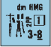

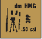


## 10. MORALE

**10.1 MORALE CHECK (MC)/TASK CHECK (TC):** Every Personnel unit has a basic morale rating printed on its counter. This is the number which the player must roll ≤ with two dice in order to succeed in performing some task or avoid damage inflicted by enemy fire. When an attack result dictates that a unit must check morale, it is termed a MC. Failure of a MC (by rolling \> the Morale Level after modification) results in the breaking/Reduction/elimination of the unit. If a unit checks morale in order to be allowed to perform some action it is termed a Task Check (TC). Failure of a TC results in the inability of that unit to perform that task during that phase and prohibits the unit from attempting any other action during that phase *[EXC: FPF PAATC; D7.212]*. See 11.6 for effects of failing a PAATC.

**10.2 LEADER LOSS MORALE CHECK (LLMC)/LEADER LOSS TASK CHECK (LLTC):** Whenever a MC/TC is required, leaders must check before other units (with higher Morale Level leaders checking before lower Morale Level leaders). For each leader *eliminated* (whether by breaking when already broken, a mortal wound, or any other cause), after resolution of that attack (if any) all other friendly Personnel units *with a currently lower Morale Level* and in the same Location (or in the same moving stack, e.g., during Defensive First Fire) must take a LLMC *[EXC: Riders (13.52, D15.55), Passengers (D6.651), Climbers (B11.42), and units at a different level (2.8), or in CC (11.141) neither take or cause LLMC/LLTC (as a result of their breaking or elimination). Passengers take/cause LLMC/LLTC only to fellow passengers of the same vehicle (D6.651)]*. A LLMC is always based on the unit’s current Morale Level, even if that unit is broken or has a reduced or increased Morale Level. Any negative leadership modifier of the eliminated leader must be reversed to a positive DRM and added to each LLMC. A leader eliminated/broken during Defensive First Fire does not cause other units in the same Location to take a LLMC/LLTC unless they were moving with him as one combined stack. Should an unbroken leader break, all unbroken friendly Personnel units with a lower Morale Level in the same Location (or moving stack during Defensive First Fire) must take a LLTC *[EXC: if exempt from pinning]*. This LLTC is handled in the same manner as a LLMC except that if the LLTC is failed, the unit is pinned instead of broken. EX: A Good Order 9-1 leader is stacked with a 6-5-8 and a 4-6-7 squad. Their Location is attacked resulting in a 1KIA. Random Selection determines that the leader is eliminated and therefore both squads are automatically broken (7.301). The broken 4-6-7 must take a 1MC as its LLMC, which will Reduce it to a broken HS if it fails. The broken SS squad need not take a LLMC because its current morale (9) is not \< that of the eliminated leader.

<!-- pdf-page 66 -->

**10.21 LEADERSHIP DRM:** The only applicable DRM to a MC/TC DR *[EXC: LLMC/LLTC/WP/Bombardment MC]* is the leadership modifier of one available unbroken leader in the same Location (or moving stack in the case of Defensive First Fire). The leadership modifiers of multiple leaders in a Location or moving stack are not cumulative; the owner must choose which leadership DRM to apply (10.72). Normal, un-reversed leadership DRM are NA to LLMC/LLTC. EX: A broken 8-0 leader, stacked with a 4-6-8 and a 4-6-7 squad, is eliminated by a fire attack which caused a 1MC result. Regardless of the outcome of that 1MC on the squads, the 4-6-7 must also take a NMC as its LLMC. If the leader were an 8-1, the 4-6-7 would have to take a 1MC as its LLMC. If the leader were a 9-1, both the 4-6-8 and the 4-6-7 squad would have to take a 1MC as their LLMC.

##### 10.22

**10.22** A leader may not apply his own leadership DRM to his own MC/TC, although he may apply the leadership DRM of an unbroken leader of higher morale which happens to be in the same Location or moving stack. EX: A 9-1 leader which was fired on during the PFPh, yielding a “NMC” result on the IFT, must roll ≤ 9 to pass his NMC. However, if an unbroken friendly 10-2 leader is also in the same Location, the 9-1 can pass his MC with a DR ≤ 11. A 9-2 leader in the hex instead of the 10-2 leader has no effect because his Morale Level is the same as the 9-1. The 10-2 must past his NMC first and with no assistance from the 9-1. Had the 9-1 leader been moving and fired on by First Fire, the presence of a superior—but non-moving—leader in the same Location would not have aided the moving unit in its NMC.

**10.3 MC FAILURE:** Personnel which pass their mandated MC are unharmed (although possibly pinned; 7.8), but those which fail are immediately inverted and become broken *[EXC: broken/Heroic (15.2)/Berserk (15.42)/ Unarmed (20.54)/Wading (G13.421) units, Japanese squads (G1.12) and leaders (G1.41), and LC Passengers (G12.13); see G14.32 for Infantry/Cavalry in Beach Locations during a Seaborne Assault/Evacuation]*. An already broken unit that fails a MC suffers Casualty Reduction (7.302). See D5.311 and D5.34 for Inherent Crews.

**10.31 CASUALTY MC:** If an unbroken Personnel unit rolls an Original 12 during a MC, it suffers Casualty Reduction and is broken (or eliminated if not subject to breaking) *[EXC: A hero/berserk-leader is wounded and must add +1 to his Wound Severity dr as if already wounded (17.11); see G1.14 for Japanese squads]*—after any unit Replacement which may also be required by ELR Failure (19.13). If a *broken* unit rolls an Original 12 during a MC, it is eliminated. See D5.341 for Inherent Crews.

**10.4 BROKEN UNITS:** Broken units are inverted and henceforth use the Morale Level printed on their reverse side for all MC/TC and Rally attempts they make until rallied and returned to their normal side. Broken units may neither attack in any way nor move except to rout during the RtPh or withdraw from CC. A broken unit may not portage anything in excess of its IPC, and prior to rout must abandon any items in excess of its IPC in its current Location—but must rout with any SW ≤ its IPC limits if it possessed such items when it broke. If it is carrying two or more SW which together are \> its IPC, it must rout with a combination of SW of its choice exactly equal to its IPC or, failing that, equal to the highest number of PP it can portage which is also \< its IPC. Once it starts its rout, a unit may neither Recover nor Abandon SW.


**10.41 VOLUNTARY BREAK:** Units within both the LOS and Normal Range per A10.532 of an armed, unbroken Known enemy ground—and/or ADJACENT to any unbroken enemy ground unit—may voluntarily break (even if pinned) at the start of the RtPh so as to be able to rout during that RtPh (but only if breaking will not cause their immediate Reduction or elimination).

**10.5 ROUTING:** During the RtPh a broken unit not in Melee may not remain in the same Open Ground hex in the Normal Range (10.532) and LOS of a Known non-Melee enemy unit/its-SW/Gun, nor—regardless of terrain— may it end a RtPh ADJACENT to or in the same Location with a Known enemy unit that is both unbroken and armed *[EXC: Night; E1.54]*. A leader with no SW is still considered “armed” for purposes of determining legal rout paths and enforcing Failure to Rout eliminations. Broken units must rout away (ATTACKER first—one unit at a time *[EXC: Voluntary Rout; 10.711]*) during that RtPh or be eliminated for Failure to Rout *[EXC: Surrender; 20.21]*. Otherwise, a broken *unit* must rout only if in a Blaze (B25.4). A broken unit *may* rout if currently under DM. All broken units (including Conscripts) other than wounded SMC have six MF for use in the RtPh; this amount can never be increased. A broken unit may end its RtPh in an Open Ground hex in the LOS and Normal Range of a Known enemy unit without Interdiction only if it has used Low Crawl (10.52) during that RtPh, but it still may not be ADJACENT to an unbroken and armed Known enemy unit at the end of the RtPh or it will be eliminated for Failure to Rout. Broken units may not use Bypass (4.3).


EX: German units Occupy 5M2, K2, and K4. The broken Russian unit in L2 must rout away from the Known enemy units in M2 and K2 without moving ADJACENT to them, so it routs to L3 where it now discovers a Known enemy unit ADJACENT in K4. It cannot remain there without being eliminated for Failure to Rout, so it elects to continue its rout to M4, where it may end its rout, or continue on to N3 or N4. If the German unit were in L3 or L4 instead of K4 the broken unit would be unable to rout away without moving ADJACENT to a Known enemy unit, and therefore would be eliminated or captured for Failure to Rout.

**10.51 DIRECTION:** A routing unit may never rout toward a Known armed enemy unit (even if that enemy unit is broken or disrupted), while in that enemy unit’s LOS, in any way which decreases the range in hexes between the routing unit and the Known armed enemy unit *[EXC: Passengers, D6.1]*; nor may it move toward such an enemy unit after leaving its LOS during that RtPh; nor, if ADJACENT to a Known armed enemy unit, may it rout ADJACENT to that same enemy unit. A routing unit may never move ADJACENT to a Known enemy unit, unless in doing so it is leaving that enemy unit’s Location. Otherwise, a routing unit may move toward an enemy unit. Assuming it can abide by the previous requirements, a routing unit must move to the nearest (in MF calculated at the start of its RtPh) building or woods hex (even if overstacked) unless that route is through/into a known minefield or FFE, or is not traversable (e.g., through a Blaze, unbridged Water Obstacle, Cliff, etc.). As long as it reaches that hex during a single RtPh, it need not use the shortest route, but as long as it follows the shortest path in MF otherwise, it may enter a shellhole/entrenchment/pillbox to avoid Interdiction even if it can no longer reach that woods/building hex in a single RtPh. A routing unit can rout into/out of/within a known minefield or FFE at its option, but is not forced to do so merely to reach the closest woods/building hex. At the start of its RtPh, a routing unit must designate its destination and must attempt to reach it during that RtPh *[EXC: if using Low Crawl].* If a newly-Known enemy unit prevents this, a new destination is re-figured from that point. Upon reaching a building/woods Location not ADJACENT to a Known enemy unit, a routing unit must stop and end its RtPh in that building/ woods Location even if overstacked unless the unit can directly enter another building/woods Location in its next entered hex (not necessarily the same building or through a continuous woods hexside).

<!-- pdf-page 67 -->

*[EXC: A broken unit in a building need not consider a hex of the same building in which it begins the RtPh (or when a new destination is refigured) as its closest building hex if it prefers to rout out of that building altogether and toward another building/woods hex—even if it must cross Open Ground or another building hex of the same building to do so. A routing unit may also ignore a building/woods hex if that hex is no farther from a Known enemy unit than its starting hex, even if it must rout through that now-ignored hex to reach its destination.]* If no non-ignorable building/woods Location can be reached during that RtPh, a broken unit may rout to any terrain hex consistent with the above restrictions and need not rout toward the nearest woods/building Location. Any unit which routs through the Blast Area of a FFE is attacked in each Location of the Blast Area into which it routs as if it were a moving target during Defensive First Fire. A broken unit may continue its rout in a subsequent RtPh only if under DM. EX: A broken unit begins its RtPh in 3M2 at ground level with a Good Order enemy unit in M3. The broken unit can rout one hex vertically upstairs to M2 1st level and end its RtPh or, at its option, continue into N1 1st level or even to N1 2nd level via M2 2nd level. It is not ADJACENT to the enemy squad in M3 when on the 1st level or 2nd level of M2 or N2, as no unit can advance into an adjacent hex *and* move up a building level in an APh.


**10.52 LOW CRAWL:** Low Crawl is a rout of one Location which requires the entire MF allotment of the routing unit (but is still considered a form of Assault Movement should the routing unit enter a FFE Blast Area). A routing unit using Low Crawl cannot be Interdicted. Low Crawl cannot be used to enter Marsh or a Water Obstacle, or in any stream unless dry. Low Crawl cannot be used to exit an enemy-occupied Location *[EXC: Night (E1.54)]*. All other Rout provisions apply unchanged to Low Crawl, e.g., rout must still be towards the nearest woods/building Location within 6 MF.

**10.53 INTERDICTION:** A routing unit which enters an Open Ground hex without Low Crawl, in both the LOS and Normal Range of an unbroken enemy unit capable of fire on it in that hex with at least one FP without any form of LOS Hindrance, is subject to a NMC and everything that normally entails (see B27.41 and B30.41 for applications of a change of Location within the same hex). A routing unit which fails its Interdiction NMC suffers Casualty Reduction, although any remaining HS continues its rout thereafter. Interdiction does not affect other units in the same Location. Units are capable of Interdiction even if they have already exhausted their fire capability during that Player Turn. An Interdicted unit is also subject to pinning (7.8), to the extent that if pinned, it may not rout further during that RtPh and if pinned while still ADJACENT to a Known, armed, unbroken, enemy unit is eliminated for Failure to Rout. A broken unit may not be Interdicted more than once per Open Ground hex entered, regardless of the number of opposing units which can claim Interdiction. Once a unit begins its rout, it is expending MF; it cannot begin anew. Whenever a unit routs, it is restricted by the mechanics of movement (4.2) and must face the consequences of that move.

**10.531 OPEN GROUND:** For purposes of rout determination, Dash, concealment gain/loss, and Interdiction, an Open Ground hex is any hex in which the particular enemy unit(s) could apply, during a hypothetical Defensive First Fire opportunity (regardless of what attacks it actually made in previous phases), the -1 FFMO DRM. Note, however, that First Fire does not actually occur during the RtPh and that routing units, unlike units in the MPh, may pay combined entry costs to enter Open Ground hexes containing entrenchments or a pillbox (see B27.41). The cost to enter/exit Fortifications within a hex are not part of the total MF cost used when calculating the nearest building/woods hex. Whether a broken unit pays such MF costs during its RtPh is up to the owning player and the speed with which he wishes to enter such terrain; he does not have to ignore the safer and higher MF cost option in order to reach cover in the same RtPh, although this is his option. EX: A grain, brush, or orchard hex is not Open Ground because the -1 FFMO DRM does not apply. A shellhole, entrenchment or pillbox is not Open Ground unless the routing unit pays only the minimum MF to enter the hex. SMOKE or LOS Hindrances exerting a DRM, either in the Open Ground hex or between it and all potential Interdictors, allow rout transit of an otherwise Open Ground hex free of Interdiction. Similarly, if the routing unit can claim TEM, Interdiction cannot be claimed. An Entrenched unit, or a crew/HS manning an Emplaced Gun, is not in Open Ground for Failure to Rout (10.5) purposes.


EX: It is the RtPh and each of the broken units is under DM and therefore eligible to rout. The 1G2 unit may rout to F1, G1, or even H2 because, although it would be moving closer to the enemy, it had not been in the LOS of any of the units it was moving closer to before routing to that hex. The J2 unit can opt to remain stationary or rout to building K2. It could also ignore K2 (because it is no farther away from a *Known* enemy unit than its present position) and rout to the J0 woods instead, but it would be subject to Interdiction in J1 from the 4-6-7 in H5 unless using Low Crawl to J1. The I5 unit cannot rout because any move it made would be ADJACENT to a Known enemy unit; consequently, it must surrender (20.21) or be eliminated at the end of the RtPh for Failure to Rout if No Quarter (20.3) is in effect. Assuming No Quarter is in effect, the broken squad in I4 may only rout to I3 because doing otherwise would be either moving ADJACENT to or decreasing the range to a Known enemy unit. In routing to I3, the squad announces that it is using Low Crawl. However, it also has the option to attempt to rout through I3 to H2 or J2, but at the risk of Interdiction in I3 (or, because those hexes are no farther away from the Known enemy in G4/K4 [10.51], it may continue to rout from H2, or J2, or directly from I3 toward H0/J0 subject to possible further Interdiction). Even if it failed the resulting NMC in I3, a broken HS would survive (barring a 12 Casualty MC DR) to enter H2 or J2. If No Quarter were not in effect, the broken squad in I4 would Surrender to the 4-6-8 in J4.

**10.532 INTERDICTOR:** One unit may Interdict any number of routing units and may Interdict the same routing unit in more than one hex. No weapon is effective for Interdiction purposes beyond its Normal Range or 16 hexes (whichever is less). If a Gun would have to change its CA in order to fire (if this were a fire phase), a positive DRM would usually come into effect and thereby disallow its Interdiction. Similarly, a CX or Encircled unit, or a unit using Spotted Fire or one in Melee cannot Interdict an enemy unit due to those limitations on its fire. An AFV cannot Interdict if it would have to change its VCA/TCA or use armament which is currently penalized by the +1 BU or +1 Stun DRM. A leader without a SW has no range and therefore cannot Interdict a rout hex. Any unit whose FP is halved *[EXC: mortars]* (Pin, Motion, Mounted Firer, etc.) may not Interdict. Naturally, in order for a SW or ordnance to Interdict a rout hex, that weapon must be functioning.

<!-- pdf-page 68 -->

**10.533 CONCEALMENT:** Concealed units, since they are not Known, must be ignored by the routing player in determining his legal rout route. The presence of a concealed enemy unit in the closest building/woods hex (not in the direction of a Known enemy) to a unit that must rout, does not free the broken unit from its normal obligation to rout to that hex. Upon entrance of the concealed unit’s Location, one concealed non-Dummy unit therein must become Known (i.e., lose its concealment, using Random Selection) in repulsing the routing unit to the last occupied hex (wherein the routing unit must end its RtPh—and be eliminated for ending the RtPh ADJACENT to a Known enemy unit; 12.15). A concealed unit can possibly claim Interdiction or force a routing unit to alter its route by becoming Known (i.e., by forfeiting its concealment) during that RtPh while in the LOS of the routing unit.

EX: The broken unit has to rout because it is in Open Ground in the LOS and Normal Range of a Known enemy unit. It must rout into J4, which is the closest building not closer to a Known enemy unit in its LOS. Entry to J4 is repulsed however, as the German squad loses concealment and becomes a Known enemy unit in the process. The broken squad is eliminated for Failure to Rout because it had to end its RtPh ADJACENT to a Known enemy unit. Had he preferred to take the Russian unit prisoner, the German could have opted to drop his concealment voluntarily and allowed the Russians to rout to him as his prisoners (20.21). The fact that he did not voluntarily drop his concealment does not make him subject to No Quarter (20.3) penalties. EX: Now assume only the German squad in 1G4 is concealed. The Russian can rout to H3 and stop, or move on into G3 or H2—*unless* the German squad in G4 drops its concealment *before* the Russian routs to H3. The broken unit could even attempt to enter G4 causing the German unit to lose its “?” status, but this would result in the elimination of the broken unit for Failure to Rout. Once the Russian routs to H3 it will be eliminated only if it attempts to continue its rout into the concealed German’s hex. Revealing its position after the Russian reaches H3 will not eliminate the Russian because it did not move ADJACENT to a Known enemy unit at the time of the Rout. The broken unit can even end its RtPh in H3 without being eliminated for Failure to Rout provided it does so before the German squad drops its concealment. If the German squad drops its concealment before the next unit begins to rout or the end of the RtPh (whichever comes first), the broken unit would have to continue its rout to H2 or be eliminated for Failure to Rout.


**10.6 RALLY:** Broken units of both sides may attempt to rally during any RPh if a Good Order friendly leader is present in the same Location *[EXC: Armor Leader (D3.4); see D6.651 for Passengers]*. In addition, Finns *[EXC: Conscripts (25.7)]*, broken leaders and crews as well as one MMC per Player Turn (18.11) may attempt Self-Rally without the presence of a Good Order leader. To rally, a broken unit must make a DR ≤ the morale number on its broken side. The leadership modifier of any Good Order leader attempting to rally a broken unit modifies the Rally DR. There is no penalty for failing a Rally attempt *[EXC: Fate; 10.64]*. No unit may attempt to rally more than once per Player Turn regardless of any Self-Rally capability/leader access. However, one leader may attempt to individually rally all the broken units in his Location.

**10.61 TERRAIN BONUS:** There is a -1 DRM to any Infantry Rally attempt which occurs in a building, pillbox, trench, or woods.

**10.62 DESPERATION MORALE (DM):** DM is a condition which afflicts any unit during the Player Turn it breaks (even if it breaks voluntarily) or any already broken unit which is subsequently attacked by CC/WP, or enough FP (taking the *possibility* of Cowering into account) to possibly inflict at least a NMC result on the target. An effective Sniper attack causes DM to all broken enemy units in the same Location as the unit attacked—not just the attacked unit. To be considered fired upon by ordnance, a hit must have been achieved against the unit regardless of its FP effect, or a non-Smoke FFE must have been resolved in the hex. A broken unit is also automatically under DM whenever a Known armed enemy unit is ADJACENT to it (even if it does not end the phase ADJACENT to it) or when it starts a RtPh in a Blaze Location (B25.4) or in Open Ground in the LOS and Normal Range (10.532) of a Known enemy unit. Place a DM marker on any unit under DM and remove it at the end of every RPh *[EXC: A unit may opt to retain its DM status provided it is not in a woods/building/pillbox/ trench so as to guarantee its ability to rout again in the next RtPh. If overstacked in a woods/building, it may also opt to retain its DM status.].* DM has no effect on any unit taking a MC, but does require a unit attempting to rally to add a +4 DRM (plus any leadership, terrain, and/or Self-Rally modification).


**10.63 SELF-RALLY:** All Personnel units whose Morale Level on the lower right of their broken side is encased in a square have Self-Rally capability. In addition, *one* MMC may attempt Field Promotion (18.11) as the first MMC Rally attempt of its own Player Turn. Any unit attempting Self-Rally (i.e., attempting to Rally without the presence of an unbroken leader) must add a +1 DRM. Self-Rally can never occur in a Location containing a Good Order friendly leader.

**10.64 FATE:** A broken unit which rolls an Original 12 DR while attempting to rally suffers Casualty Reduction and does not rally.

**10.7 LEADERSHIP:** Leaders have a two-number Strength Factor which consists of the leader’s Morale (on the bottom) and his Leadership DRM (on the top). An unbroken Personnel leader may use its leadership rating to affect the performance of other Personnel in its Location *[EXC: A Passenger/Rider leader cannot Rally, direct, or otherwise aid units outside of its vehicle unless it is CE in an armored halftrack that is stopped (D2.13); likewise, a leader cannot affect units at a different level (2.8)]*. Leadership ratings are usually expressed as a negative number, or 0, or occasionally even +1 or +2. A leadership rating is treated as a DRM when used to influence *another* Personnel unit’s performance, but can *never* be used to enhance its own performance nor to direct another unit’s fire if the leader is firing a weapon himself (see also 7.53-.531). Leadership modifiers are not cumulative (i.e., the leadership modifiers of two or more leaders cannot be combined). A leader may attempt only one action per phase, and may use his leadership modifier (even if 0 or +1) more than once in the same phase only to attempt to rally more than one unit in a RPh, to direct Multiple ROF, Subsequent First Fire, Final Fire, or FPF attacks, and/or to assist units in the same Location or moving stack with a MC/Pin Check. The leadership rating of a leader is worsened by one whenever influencing Allied Troops of a different nationality. Allied Troops take a LLMC/LLTC based on the reduced leadership modifier due to the elimination/breaking of a higher-morale Allied leader in their Location.


<!-- pdf-page 69 -->

**10.71 RALLY:** A broken leader may attempt Self-Rally, unless in the same Location *[EXC: Passenger/Rider leader as per 10.7 EXC]* with another unbroken leader. If more than one unbroken friendly leader is present in a Location, the player may choose which one will influence any Rally attempts in that Location. If the only leader stacked with a broken unit(s) is himself broken, those units may not attempt to rally (barring Self-Rally capability) unless the leader succeeds in rallying himself first. Having rallied himself, the leader may then attempt to rally any remaining broken units in his Location during that RPh.


**10.711 VOLUNTARY ROUT:** A non-berserk, non-pinned leader already stacked with (see 4.12) a broken unit before it routs may elect to rout with the broken unit even though he is not broken. If he does so, the leader shares the broken unit’s vulnerability to Interdiction and, although he does not have to take any Interdiction NMC himself, he is eliminated if the broken unit he is stacked on top of fails an Interdiction MC. He must remain with the broken unit throughout the RtPh, but is not considered broken and may add his leadership DRM to its Interdiction NMC. The leader, if already in possession of a SW, may portage it, but cannot improve the broken unit’s portage capacity.

**10.72 MANDATORY LEADERSHIP:** A player cannot decline use of a non-zero (whether positive or negative) leadership modifier in the same Location or moving stack when performing a MC/TC or Rally attempt or Ambush, Concealment, Search Casualties, or Integrity Check dr/DR unless there is another leader present in the Location or moving stack whose leadership modifier he can substitute. However, a player can always opt to exclude leader direction in any attack it makes *[EXC: Armor Leader (D3.45); Leader Creation (18.12); MG Mandatory Fire Direction (9.4)]*.

**10.8 FANATICISM:** Fanaticism is evoked only by SSR or Battle Hardening to depict particularly heroic or desperate performances in a particular situation. A SMC created from an already Fanatic MMC (15.21, 18.2) is also Fanatic. Any unit classified as Fanatic has both its normal and broken Morale Levels increased by one and is not subject to Cowering, surrendering by the RtPh method (15.5 & 20.21), or PAATC. Fanatic troops are not subject to Disruption, although they can be Reduced/broken normally for all purposes of Unit Substitution (19.13).


#### Comprehensive Rout Example

(Please see Illustrations on pages A28-A29. For purposes of this example, no other hexes exist.) **Rout Phase Russian Player Turn** (page A28 Illustration) Russian Routs (ATTACKER routs first) The pinned half-squad in P8 Voluntarily Breaks [10.41], which it must declare before any units rout. Before the routs of the non-Disrupted units, the Disrupted squad in Q2 must Surrender to the 4-6-7 in R1 despite having a legal rout path to P2 [19.12]. The Surrender is accepted, and Q2 is replaced by a squad-sized Unarmed MMC which is possessed by the 4-6-7 in R1. If this Surrender were rejected, the Disrupted squad would be eliminated and No Quarter would be invoked for the German side only [20.3]. The broken 4-4-7 on Level 2 of M2 does not have to rout; if it elects to, it could rout to any Location in its building or it could ignore its building entirely [10.51] and rout to M1. Routing to L1 or L0 is illegal because that would entail moving closer to the KEU (Known enemy unit) in J1. If it routed to the ground level of N1, it could not stay there because of the ADJACENT unbroken KEU in O1, and it could not continue on to N2, M1 or M2 because that would be moving closer to the KEUs it remembers seeing in J6, K3, and J1, and so would surrender, or be eliminated for Failure to Rout if No Quarter had been in effect. It therefore routs downstairs to the ground level of M2, dropping the HMG in M2 Level 2 because its IPC of 3 is not enough to carry the 5 PP weapon. Either SMC in the Location where the HMG was dropped can immediately attempt to Recover it (4.44); the Hero does so with a dr of 5. The 9-1 leader could rout with the squad [10.711], but elects to stay with the Hero to help man the HMG. The broken 4-4-7 in J4 does not have to rout, but chooses to rout to K5 and L4 for 4 MF. Routing to K5 does not bring it closer to either of the KEUs in J6 or K3, and K6 was not Known to J4 at the time it entered K5. It cannot stay there because of the ADJACENT unbroken KEU in K6, but it cannot be Interdicted there because the 4-6-7 is CX [10.532] and K5 has a +1 Height Advantage TEM relative to K3 [10.531]. Even if the German leader in J6 was not Pinned, it could not Interdict by itself because it has no SW, let alone one capable of being fired at full effect by a lone SMC [10.532]. The 7-0 elects to accompany the broken squad throughout its rout using Voluntary Rout [10.711]. The routing units do not have to stay in L4 since that hex is no farther from the KEU in K3 as their original hex, but their only rout options at this point are to move upstairs to Level 1 or continue routing to M5 (which hex cannot be ignored as a rout destination). They elect to move upstairs to L4 Level 1 for their 5th MF and end their rout there. The broken squad in L8 must rout since it is in the same hex as an unbroken KEU and not in Melee. It must rout towards building M7 since that building will bring it farther away from all KEUs (in J9, L8 and M9) [10.51]. The first hex it enters while routing cannot be L9 or M8 since that would be moving ADJACENT to the unbroken KEU in M9. It cannot enter K9 from L8 since that would be moving closer to the KEU in J9. Therefore, the first hex it routs through must be K8 or L7. It cannot Low Crawl when leaving an enemy-occupied Location [10.52] and the squad in M9 as well as the AFV MG in L8 can Interdict the rout to either K8 or L7 because the +1 Height Advantage TEM does not apply when the LOS crosses the Crest Line traversed by the moving unit [B10.31]. Therefore, the broken unit cannot rout without being subject to Interdiction and since No Quarter is not in effect, it Surrenders [20.21], and the squad in M9 accepts the Surrender. The broken 4-4-7 in M5 cannot rout because it is not DM [10.62]. The broken 4-4-7 in N3 becomes DM since it started the RtPh in Open Ground, LOS, and Normal Range of the KEU in O1 and must rout. However, it cannot rout toward any of the KEUs in O1, K3, or P5, so it is Eliminated for Failure to Rout [10.5]. The broken squad in building O5 does not have to rout since it is not ADJACENT to an unbroken KEU; it cannot legally rout toward any of the KEUs it sees in R1, K3, J6, or P5 and so stays in O5. The broken squad in R6 must rout because of the ADJACENT unbroken KEU in S6. Since it is Encircled, it must Surrender to the 4-6-7 in S6 despite having rout paths upstairs to R6 Level 1 or to Q6 [20.21]; its Surrender is accepted. The HS in P8 (which Voluntarily Broke at the start of the RtPh) must rout since it is ADJACENT to the unbroken KEUs in Q8. It must choose N8 as its destination and routs there via O9, but it cannot stay in N8 because of the KEU in M9. It has enough MF remaining to reach M7, so it must attempt to do so since it is not Low Crawling; it routs to M7 via N7 (since entering M8 would be moving ADJACENT to M9). The broken unit cannot drop the Russian LMG since it is ≤ the HS’s IPC. The broken squad in S3 must rout because of the ADJACENT unbroken KEU in S2. It can ignore S3 Level 1 as a rout destination because it can ignore Locations of the building it starts in (Rowhouse hexes are considered separate buildings for rout purposes [B23.71]). It can also ignore R3 and P2 as being equidistant from the KEU in R1. Able to ignore all rout destinations within 6 MF, the broken unit is free to rout anywhere it can legally reach on the board [10.51]. It elects to rout to R3, expending 3 MF via rowhouse bypass at the S3/R3/S4 vertex. It cannot be Interdicted at that vertex because the S4 Grainfield Hindrance negates Open Ground relative to the German units in S5. From R3 it could spend 2 MF to enter the Shellholes in Q3 and avoid Interdiction from R1, or it could enter Q3 for 1 MF, risking Interdiction without the Shellhole TEM, but able to reach P2 with its last two Movement Factors should it survive the Interdiction Morale Check unpinned. It enters the Shellholes for 2 MF and ends its RtPh there. The enemy units in J6 are not Known to the broken unit in either S3 or R3; otherwise it could not rout to Q3. Even if Grainfields did not exist and the 4-6-7 was in Good Order by itself in S2, the squad could still rout to R3 via the S3/R3/S4 vertex without fear of Surrender because it has the *option* of routing to the first level of S3. The broken squad in the R2 Foxhole must rout since it is ADJACENT to the unbroken KEUs in R1 and S2. Its rout options are restricted by not moving closer to the KEUs in J6 and not moving ADJACENT to the KEU in S2; its only rout option is to enter R3 for 3 MF (1 MF to exit the Foxhole plus 2 MF to enter R3). It could move upstairs to Level 1 but declines. It cannot be Interdicted as it exits the foxhole because (unlike in MPh/APh) it combines that MF expenditure with the cost of entering R3, which is not Open Ground [B27.41]. It could conceivably ignore R3 as a rout destination because that hex is equidistant from the KEUs in J6, but once it enters R3, it gains LOS to the KEUs in S5 and cannot continue its rout toward R5. It also cannot continue its rout into Q4 because that would entail moving closer to the enemy units it remembers seeing in J6, even though J6 is not in its current LOS. The broken squad in S2 must rout because of the unbroken KEU in its own Location. Its only option is to enter S3 and move upstairs to Level 1 since it cannot remain ADJACENT to the unbroken KEU in S2 (whose CC counter is removed once the broken unit leaves its Location). It cannot use Rowhouse Bypass to enter R3 because that would entail moving closer to the KEUs it remembers seeing in J6. The broken squad in R8 cannot rout because broken units cannot rout out of Melee;


<!-- pdf-page 70 -->

it must attempt to Withdraw from Melee in the upcoming CCPh [11.16]. If No Quarter were in effect for the Germans, the broken squad in R6 would not Surrender and would rout to either Q6 or upstairs to R6 Level 1. The broken squad in L8 would rout to L7 and suffer Interdiction there and any survivors would be unable to rout further without moving closer to the KEUs in K6 and Q8; unable to rout away from the ADJACENT unbroken KEU in L8, the broken unit would be Eliminated for Failure to Rout. The Disrupted squad in Q2 could rout to P1 (where it would then be Eliminated for Failure to Rout) or to P2 and then stop upon seeing the KEUs in J6. The other Russian routs would be unaffected.

**German Routs (**page A29 Illustration) No German unit elects to use Voluntary Break. The broken squad in J1 must rout because of the ADJACENT, unbroken KEU in K1, but cannot rout to J2 because that would be moving closer to the KEUs which routed to the upper level of L4; it therefore surrenders to K1, dropping its LMG in J1 before doing so. The Guarding squad may immediately Deploy [20.5] despite being Russian [25.2].  The broken passenger in K3 does not have to rout (even if its vehicle were ADJACENT to a KEU); if it were to rout, it would be placed underneath the vehicle and end the RtPh there [D5.311]. The broken units in J6 must rout because they are in Open Ground, LOS, and Normal Range of the two SMCs manning the HMG in M2 Level 2. If the HMG were manned by just one SMC it would still force this rout but would not be able to Interdict [10.532]. The unbroken leader may not rout with the broken units because he is


<!-- pdf-page 71 -->

Pinned [10.711]; he would have had to use Voluntary Break in order to do so [10.41]. The routing units’ only valid rout destinations are L9 and M9; they choose M9. They could Low Crawl to J7 on their way to M9 and end their routs there without being Interdicted by the Russian HMG, or they could attempt to reach M9 by risking Interdiction in J7. They must rout one at a time [10.5]. The first broken squad decides not to Low Crawl and is Pinned in J7 when it rolls a 7 on its Interdiction MC and ends its rout there. The second squad also risks Interdiction in J7, rolls an 11 on the Interdiction MC and is Casualty Reduced (Unit Substitution caused by failing ELR does not apply to broken units, [19.11]). This HS continues its rout to K8, L8 (no Interdiction from the squad in M7 because the +1 AFV TEM negates Open Ground) and finally M9. The broken HS Low Crawls to J7 and ends its RtPh there without Interdiction [10.52]. The broken squad in P5 is not required to rout since it is not ADJACENT to an unbroken KEU. If it routs, it must choose Q5 or P6 as its destination since those hexes only cost 2 MF as opposed to 3 MF for Q6; once in Q5 it could continue on to Q6 or Q7 if so desired, or from P6 it could go to Q6. It could even attempt to enter R5 and strip the concealment of the Russian unit there (12.15) but would then be forced to end its rout in the last hex occupied before R5, where it would be eliminated for ending the RtPh ADJACENT to an unbroken KEU [10.533]. It therefore routs to P6 and stops. If there were a Good Order KEU in Q6, the squad would Surrender to it. The broken squad in S5 (despite being DM) is not required to rout since it is not ADJACENT to an unbroken KEU. If it wanted to rout, it could not rout closer to the KEUs it sees in R3 and R8. If the 4-4-7 in R5 were to voluntarily drop its concealment or have it stripped by the squad routing from P5, the squad in S5 would then have no rout options and would be forced to Surrender to the 4-4-7 in R5. If No Quarter were in effect for the Russians, the squad in J1 (and the one in S5, were the  4-4-7 in R5 to lose concealment) would be eliminated for Failure to Rout, and the other German routs would be unaffected.

## 11. CLOSE COMBAT (CC)

<!-- pdf-page 72 -->

#### 11.1

**11.1** CC is a form of attack which can occur only during the CCPh *[EXC: vs Unarmed units (20.54), Reaction Fire (D7.2), Infantry OVR (4.152), TH- Hero Banzai Charge (G1.423)]* between opposing units in the same Location *[EXC: CC with units in a pillbox never occurs in the same Location although it does occur between units in the same hex; B30.6]*. Units in different terrain features of the same Location (such as foxholes) still engage in CC with each other. There are no TEM or LOS Hindrance modifications to a CC attack DR, nor does PBF/TPBF ever apply to CC. Unlike Fire attacks, CC is *usually* simultaneous, so both sides attack the other even if one or both is thereby eliminated.

**11.11 RESOLUTION:** The FP of attacking units is compared to the FP of those enemy units being attacked in order to achieve a ratio of attack-to-defense FP strength called odds. For example, if two 6-2-8 squads combine to attack a 4-6-7 squad the odds are 12-4, which is then rounded *down* to the nearest corresponding odds ratio printed on the CCT (EX: 7 to 4 would be 3-2; 11 to 2 would be 4-1; 4 to 15 would be 1-4). Once the odds have been determined, a DR is made for each attack. If the Final DR is \< the Kill Number listed on the CCT under the applicable odds column, the attacked units are eliminated. A Final DR which equals the Kill Number listed on the CCT is a Partial Kill: one (or more) defending unit suffers Casualty Reduction as determined by Random Selection. A Final DR \> the Kill Number has no effect. Normally the black Kill Numbers are used; see Hand-to-Hand CC (J2.31) for use of the red Kill Numbers.

**11.12 MECHANICS:** The ATTACKER specifies the order in which multiple Locations containing CC situations are to be resolved; each Location’s CC for that Player Turn must be completely resolved before resolving CC in another Location. Barring sequential CC, each side in a Location must designate all of its attacks in that Location prior to the resolution of any of them (ATTACKER designating his first). The DEFENDER then designates all of his attacks, after which the ATTACKER resolves all of his previously declared attacks. The DEFENDER then resolves all of his attacks—even if those units have been eliminated, Reduced, or captured. Units may attack any unit or combination of units in the same Location *[EXC: SMC; 11.14]*, so long as no unit attacks or is attacked *[EXC: Infantry OVR (4.152) or CC vs/by a vehicle]* more than once per CCPh. All units in the hex do not have to be attacked, nor do all units have to make an attack. See also 11.19. EX: Assume that, in the same Location, both players have three squads with a FP of four each, prior to Melee. Each player can choose to divide his combat in any of the following ways: A.	 One big 1-1 attack (12-12) involving all six units, or B. Three squads against one at 3-1 (12-4), or C. Three separate 1-1 attacks (4-4) against each squad, or D.	 A 2-1 attack (8-4) against one squad and a 1-2 (4-8) against the other two, or E. A 2-1 attack (8-4) against one squad and a 1-1 (4-4) against one of the other two.

##### 11.13 SW

**11.13 SW:** A SW/ordnance counter may not be used in CC. Each Gun/SW counter possessed by a unit eliminated in CC may also be eliminated if the Original colored dr of that CC DR is a 1. The attacker makes a subsequent dr for each Gun/SW possessed by the eliminated unit and if this dr is ≤ the black Kill Number of that CC attack, the Gun/SW of the unit is eliminated also. All other SW of units eliminated or captured in CC remain in the Location unpossessed until Recovered (4.44).

**11.14 SMC:** Any SMC in CC has an inherent FP attack and defense strength of one. A SMC may attack alone, but if it does, it must also defend alone and if occupying a Location with other friendly Personnel it must announce its solo attack status (although not necessarily the unit it will attack) before the opponent designates his attacks. Any number of SMC may combine with a MMC or other SMC to make a CC attack *[EXC: vs vehicles; 11.5]* and to defend by adding their inherent FP together, but a SMC must attack with the MMC it is stacked on top of if it is to combine FP with any MMC. The player is free to rearrange his stack in a CC Location so as to change the MMC that ≥ 1 SMC is stacked with, but he must do so prior to both sides’ declaration of CC attacks in that Location. A SMC defends in CC as part of the group it attacks with by adding its inherent FP to the FP of the MMC stacked beneath it *[EXC: A Known SMC may never defend with a concealed unit unless that unit forfeits its concealment so as to defend with the Known SMC, or vice versa]*. A CC attack cannot single out one or more SMC to attack unless the SMC(s) attack(s) without an MMC, or they are attempting to withdraw (or conversely, to stand) without an accompanying MMC. Otherwise, the smallest increment which can be the subject of a single CC attack is a single MMC (plus any SMC stacked directly above it).

**11.141 LEADER:** One leader may direct the CC attack of the unit(s) it defends with (and any other units which join them in a combined CC attack) by applying his leadership DRM to the CC DR, in addition to adding his inherent FP (or increasing the CCV; see 11.5) to the strength of the attack. However, a leader may not use his leadership DRM to modify the CC DR of his own attack if he attacks alone or if any of the units attacking with him are berserk. Units in CC never take LLMC/LLTC. EX: A German 4-6-7 squad and 8-1 leader are in the same Location with two Russian 4-4-7 squads. The German player attacks both Russians squads at 1-2 (5-8) and can eliminate them both with an Original DR \< 5 due to the -1 leadership modifier. If the Original DR is a 5, at least one of the Russian squads is Reduced to a HS. The Russians attack at 3-2 (8-5) and can eliminate both German units with a DR \< 6. If the Russian player rolls a 6, the German player must make a Random Selection DR to determine which unit(s) suffers Casualty Reduction. EX: German 5-4-8 and 4-4-7 squads along with 9-2, 8-1, and 7-0 leaders are in the same Location as two Russian 6-2-8 squads. One, two, or three of the leaders could defend with either German squad, or all three could defend together without any MMC, or each separately, etc. Each leader will be stacked with the MMC it defends (and therefore attacks) with. The 9-2 and 7-0 leaders stack with the 5-4-8 (7 FP) while the 8-1 stacks with the 4-4-7 (5 FP). This prevents the two Russian squads from being able to muster 2:1 odds vs the 9-2 stack or 3:1 odds vs the 4-4-7. The 9-2 and 8-1 could each direct separate 1:1 and 1:2 attacks vs a different 6-2-8, but in the end the 9-2 directs one big 1:1 attack by all the Germans vs both Russian squads, which in turn combine to attack all the Germans at 1:1.

**11.15 MELEE:** If Infantry of both sides remain in the same Location after all initial CC attacks have been resolved at the end of a CCPh, they *[EXC: bicyclists, skiers]* are considered to be locked in Melee and may not leave that Location or attack except as part of CC.<sup>15</sup> Infantry are also held in Melee by enemy Cavalry, cyclists, and non- Abandoned, Stopped, “unbroken” (12.1) vehicles. Place a Melee counter above the stack of units so afflicted *[EXC: Any unit which retains its concealment (11.19) is not locked in Melee itself nor can it hold opposing units in Melee. It is free to fire in its next Fire Phase (into the Melee at TPBF; 7.212) or leave the Location in its next MPh/APh. Therefore, a concealed unit may wish to decline its CC attack opportunity in an effort to save its concealment. Upon losing its “?” such a unit in a Melee Location is immediately held in Melee]*. Units locked in Melee may not Interdict routing units nor conduct any activity other than CC or Withdrawal from Melee. New units may advance into a Melee Location but must engage in CC (though a concealed unit may elect not to attack in an attempt to retain its concealment). The Melee units may be attacked by non-Melee units during a fire phase (or even the ATTACKER’s MPh in some cases) but all friendly *Melee* and enemy units in the Location must be attacked *[EXC: a Sniper attacks a Melee Location without harming friendly units]*.


**11.16 BROKEN UNITS:** A broken unit may be attacked in CC and is subject to a -2 DRM to the CC DR. Broken units may never attack, but still defend with their full (unbroken side) FP. Broken Infantry in Melee may not rout during the RtPh, but must attempt to Withdraw from Melee (11.2) unless Disrupted or guarding prisoners. Any non-guard broken unit unable to withdraw from Melee is eliminated at the end of that CCPh for Failure to Rout. Broken units may withdraw into any Accessible Location unoccupied by enemy units, but once there normal rout rules apply in any subsequent RtPh.

<!-- pdf-page 73 -->

**11.17 STEALTH:** A SSR may bestow special powers of Stealth on Good Order troops to reflect their ferocious nature in CC or adeptness at night fighting or ambush. ANZAC, Gurkhas, Elite/1st-Line Finns, Heroes, Commandos, and Partisans are always considered Stealthy unless Lax. See G1.6 for Japanese. Such Good Order troops receive a -1 drm to their Ambush status dr (11.4), Concealment Growth dr (12.122), Searching dr (12.152), and Search Casualties dr (12.154).

**11.18 LAX:** A SSR may penalize certain units as Lax to reflect their generally unprepared status. All Inexperienced Personnel are considered Lax. A Lax unit must add +1 to its Ambush status dr (11.4), Concealment Growth dr (12.122), Searching dr (12.152), and Search Casualties dr (12.154).

**11.19 CONCEALMENT:** The FP of an attacking unit is always halved when attacking a concealed Unit in CC. For that reason, it is rarely wise to attack both concealed and unconcealed units in the same CC attack. Even though concealed, a unit in CC must reveal its Strength Factor prior to both sides’ declaration of CC attacks in that Location. Dummy units are automatically removed prior to attack designation in CC because they cannot reveal a Strength Factor. A hidden unit must be placed on board beneath a “?” counter at the start of any CCPh in which it is in the same Location as an enemy unit. A unit loses its concealment in the CCPh only if it makes/directs a CC attack *[EXC: a successful Ambush; 11.4]* or suffers Casualty Reduction.


**11.2 WITHDRAWAL FROM MELEE:** Any Infantry unit engaged in Melee which is not currently pinned may attempt to Withdraw from Melee *[EXC: berserk/Disrupted units may never Withdraw from CC/Melee]* by announcing its intention to do so (ATTACKER first) at the start of the CCPh prior to both sides’ declaration of CC attacks in that Location. Withdrawing units may not make CC attacks and are subject to a -2 DRM to all CC attacks made against them during that CCPh *[EXC: Infiltration (11.22) and Ambush Withdrawal (11.41)]*. The Withdrawal DRM is further modified by adding a +1 DRM for every friendly unit in the Melee which is not attempting to withdraw. If the withdrawing unit is a SMC, it may be attacked in CC as a separate target with a defense strength of one unless it is withdrawing with a MMC, in which case it defends in combination with that unit. Units may attack both withdrawing and standing units in the same CC attack, but the Withdrawal DRM (and standing Unit modifications to it) affect only the withdrawing unit. Any withdrawing unit which is not eliminated/reduced/captured in the CCPh successfully withdraws, and if previously concealed retains that “?” provided it withdraws into a non-Open Ground Location (12.14).

**11.21 WITHDRAWAL MECHANICS:** Any unit withdrawing during the CCPh may carry only ≤ its IPC and must enter an adjacent Location which is Accessible to that Unit under normal APh conditions (even if it requires placement of a CX counter; 4.72). The Location withdrawn to cannot be currently occupied by a Known enemy unit. If a unit withdraws into a concealed enemy’s (not Dummy) Location it is eliminated automatically but an enemy unit(s) in that Location (determined by Random Selection) must forfeit its concealment.

**11.22 INFILTRATION:** The simultaneous nature of CC is momentarily suspended following an Original CC DR of 2/12. Provided it has not already been eliminated/captured/pinned, any Infantry/Cavalry unit which rolls an Original 2 CC DR may withdraw from CC/Melee immediately thereafter in the same CCPh without being attacked, even if it did not eliminate the defenders (see also Field Promotions; 18.12). Any Infantry/Cavalry unit(s) attacked by an Original 12 CC DR may likewise withdraw from CC immediately thereafter, assuming it has not been eliminated by that 12 CC DR. If the option to withdraw is taken, it must be done immediately; the unit cannot wait to make its own attack (if it has not yet done so) or see the outcome of other attacks before leaving. See also Ambush Withdrawal (11.41).

**11.3 SEQUENTIAL CC:** There are three other instances in which CC is not considered simultaneous; rather it is sequential, in that attacks are resolved in a specific order and any unit which is eliminated before it attacks forfeits its attack opportunity. Sequential attacks need not be predesignated (i.e., the player may observe the results of each attack before declaring the next one), but any Withdrawal from Melee attempt (11.2) must still be announced before any CC in that Location is resolved and may not be canceled.

**11.31 vs VEHICLE:** All CC attacks taking place in a Location containing a vehicle (even if abandoned) must be declared sequentially (even if the vehicle neither attacks or is attacked). The non-vehicular player attacks first, but he may make only one attack at that time. If the only involved vehicle is abandoned, the player who last possessed that vehicle is considered the vehicular player. Thereafter, each side alternates taking its CC attacks one at a time until all units in that Location have attacked, been eliminated, or passed. If opposing vehicles are in the same Location, the ATTACKER makes the first attack, and attack opportunities then alternate between the players for the rest of the CC in that Location during that CCPh.

**11.32 AMBUSH:** Whenever one side ambushes another, the ambushing side resolves all of its CC attacks in that Location first, until a Melee develops in the next Player Turn.

**11.33 PRISONERS:** Prisoners attempting to eliminate their captor may resolve all of their CC attacks first (20.55).

**11.34** Should more than one sequential combat criterion occur in the same CC, the highest numbered rule takes precedence. EX: Should an Ambush occur in a CC Location containing a vehicle, the ambushing side gets to resolve all of its CC attacks in that Location first during that CCPh. In any subsequent CCPh, the players would alternate sequential attacks.

**11.4 AMBUSH:** Whenever Infantry *advance* into CC (unless reinforcing a Melee) in a woods/building Location or with/against a concealed unit(s) an Ambush can conceivably occur. Whenever a hidden unit is placed onboard as per 11.19, an Ambush can occur. Prior to declaring CC attacks, each player makes one dr. If either player rolls at least three \< the other, he has succeeded in ambushing his opponent. The side which has Ambush status in a CC is entitled to a -1 DRM to its CC attacks and a +1 DRM to CC attacks against it until that CC becomes a Melee in the next Player Turn. The side with an Ambush advantage may also maintain any concealment it has in CC until it attacks without eliminating/capturing its target. The side being ambushed loses all concealment it may have had. The Ambush Status dr is subject to the following drm even if only a portion of a player’s CC force is qualified to use it.

```text
drm    CAUSE
+2     Cavalry, Vehicle, or in Pillbox
+2     Above Bank counter
+1     Above Panji counter
+1     BU or Stunned AFV (each)
+1     CX, Lax, broken, pinned, or berserk (each)
+1     ATTACKER in Jungle, Kunai, Bamboo
-1     Stealthy
-2     Concealed
+x     Leadership modifier of best unpinned Good Order leader unless
       alone (10.7) or if any of the force is berserk
```

EX: A concealed Partisan squad with a CX 8-0 leader advances into an enemy-occupied Location. The total Ambush Status drm for the Partisan player is -2 (-3 for the concealed and stealthy squad plus +1 for the CX leader).

**11.41 AMBUSH WITHDRAWAL:** Any Infantry (unless pinned/berserk/ Disrupted) that is part of a force which has qualified for Ambush has the option to decline CC altogether, prior to CC resolution, by immediate withdrawal into an Accessible Location or may withdraw from CC automatically after resolving all CC attacks by and against it, but only before Melee occurs. EX: A German 6-5-8 squad advances into a Location containing a concealed Russian 4-4-7 squad. The 4-4-7 does not lose concealment yet (12.14). Both players make a dr in order to establish if an Ambush has occurred. As neither side is CX, Lax, or Stealthy, <!-- pdf-page 74 --> the Russian player has a -2 drm (Concealed) while the German player has no drm. The German player makes an Ambush dr of 3; if the Russian player makes an original Ambush dr of ≤ 2, he Ambushes the German (11.4). The Russian player makes an Original dr of 3, however, and no Ambush occurs. The Russian player must now decide (even though the German is the ATTACKER; 11.12) if his concealed 4-4-7 squad is going to attack in CC. If the Russian decides to attack, the 4-4-7 immediately loses its concealment (12.14), allowing the German 6-5-8 to attack at 3-2 odds. If the Russian decides not to attack, the German’s attack would be 3-4 (11.19). 3-4 rounds down to the nearest odds ratio (11.11) which is 1-2. If the German CC DR is a 2 or 3, the concealed Russian squad is eliminated; if the DR is a 4, the 4-4-7 loses its concealment and becomes a HS (11.11; 12.14). Any other DR has no effect on the concealed 4-4-7; i.e., it does not lose its concealment, is not locked in Melee (11.15), and is free to leave the hex during its next MPh/APh. If it were to use Assault Movement or advance into an ADJACENT non- Open Ground Location, it would even be able to retain its concealment.

**11.5 CC vs A VEHICLE:** Infantry/Cavalry (only) may attack a vehicle in the CCPh but they do not use the Odds Ratios or the Kill Numbers printed on the CCT as they do when attacking Personnel. Instead, the Basic Kill Number of any vehicle in CC is the *Close Combat Value (CCV)* of the Personnel attacking it. The CCV of a squad is 5, a Crew is 4, a HS is 3, and a SMC is 2. The CCV is modified by +1 for an Assault Engineer, -1 for an Inexperienced unit, and +1 for a SMC combining with the main attacking unit in the same attack. A CCV subject to any form of halving FP penalty (such as being pinned) is reduced by one for each such penalty. If the CC DR is \< the CCV of the attacker, the vehicle is eliminated (and turned into a burning wreck if the CC DR is ≤ *half* of the CCV). If the CC DR equals the CCV of the attacker the vehicle is immobilized instead. No more than two units may combine into a single CC attack vs a vehicle and one of the units in any combined attack must be a SMC who modifies the CCV of the other unit by +1. A single CC attack cannot affect both a vehicle and Personnel (except for the PRC of a vehicle, which are eliminated if the vehicle is destroyed). However, with multiple attackers in the same Location, one attack can be made vs Personnel (11.611) and subsequent attacks vs a vehicle, perhaps with a better chance of success due to the elimination of Personnel in the earlier attack.

**11.501 UNLIKELY KILL:** An Original 2 CC DR always results in a chance of success for the attacker even if a CC DRM or a small CCV otherwise makes success impossible. Whenever the attacker makes an Original 2 DR, he may roll a third die. If the subsequent dr is a l, the vehicle is a burning wreck; if a 2 it is eliminated; if a 3 it is immobilized; otherwise there is no effect. However, regardless of the subsequent dr, if the Original 2 DR would have resulted in elimination or Immobilization that result still occurs, unless canceled by an elimination or burning result from the subsequent dr.

##### 11.51 CC DRM

**11.51 CC DRM:** CC attacks vs unarmored vehicles are eligible for a -3 DRM. A CC attack vs any vehicle without inherent manned functioning (e.g., Shock, stun, most BU AAMG) MG armament (including turreted MA ≤ 15mm) is eligible for a -1 DRM. There is a +1 DRM to the CC DR for every unbroken, unpinned, and armed enemy HS/crew Personnel counter (+2 for each such squad) in the CC Location (and not in the act of Withdrawal) at the time of each attack unless they are BU. There is a +2 DRM for CC vs a Motion/non-stopped vehicle. An Ambush DRM (11.4/11.8) or Hero DRM (15.24) can also apply to CC vs a vehicle. A leadership DRM applies to CC vs a vehicle only when that leader is combining with another unit in that attack. See also 11.61.

**11.52 CAPTURE OF VEHICLE IN CC:** Infantry may not attempt to capture a manned AFV or a Motion/non-stopped vehicle (or its PRC), but may attempt to capture or eliminate an Abandoned AFV as per 21.2. An unarmed, stopped/non-Motion vehicle without Personnel Escort is captured instantly in any CCPh in which it is alone with opposing Infantry. If an unarmored stationary vehicle has Passengers and the attacker wishes to capture (rather than eliminate) the vehicle, he must first attack and eliminate/capture all enemy Personnel in the Location, but must *capture* any Passengers. If all the Passengers are captured, so is the vehicle. The attacker must engage these Passengers in normal Infantry vs Infantry CC, but is eligible for both a -2 DRM for his attacks vs these Passengers and a +2 DRM in defending against attacks from those Passengers. This -2 DRM is combined with the +1 DRM for attempting to capture these Passengers in CC.

**Close Combat comprehensive Example** (Please see Illustration on page A33). EX: GERMAN CCPh. All Advances (shown by yellow arrows) have been completed. The German 9-2 and 4-6-7 at ground level in hex F3 Advance onto the Wire in F4 to Streetfight (11.8) the T-34. The 4-6-7 has passed a PAATC with an Original 8 which was modified by the 9-2, but the leader did not have to take one and waited to see the outcome of the squad’s PAATC before advancing. The leader and squad could attack separately but elect to defend and attack together, allowing the leader to direct the attack.  Because a vehicle is involved, CC is sequential with the German attacking first. Either the 9-2 or the 4-6-7 (but not both) may make an ATMM Check dr, but the leader would have a +2 drm. The squad opts to attempt the ATMM Check and obtains one with an Original 3 dr. The German CCV is 6 (5 for the squad plus 1 for the leader) with a total DRM of -5 (-1 Street Fighting Ambush, -3 ATMM, -2 Leadership Modifier, +1 Wire). The Original CC DR of 9 is modified to a Final DR of 4. Since this is less than the CCV, the T-34 is eliminated and flipped to its wreck side (Crew Survival NA). The German 9-2 and 4-6-7 must stay in F4 due to the Wire; otherwise, they could have chosen to return to F3 because they were Street Fighting. Because the 4-6-7 in G2 Advances into CC in a building Location in G3, Ambush can occur. The Ambush Status drm of the Russian is +1 (Lax, due to being Inexperienced) while the German drm is zero. No Ambush occurs when the Russian dr is a 3 and the German dr is a 2. The German declares a Capture attempt vs the 4-2-6 at 1:1 odds with a -1 DRM (Capture vs Inexperienced) while the 4-2-6 attacks the 4-6-7 back at 1:1 with zero DRM. The German Original CC DR of 6 results in Casualty Reduction, i.e., the Capture of one HS. The Russian original CC DR of 9 has no effect. The 4-2-6 is replaced by a 2-2-6 and a HS Prisoner possessed by the German. Taking advantage of the squad’s status as a Guard, the German Deploys into two HS, one of which possesses the Prisoner HS. The survivors are now held in Melee. If the Russian Original CC DR had been 4, the 4-2-6 would have eliminated the 4-6-7 and thus would not have been Captured. If the 4-6-7 had been Casualty Reduced, the remaining 2-4-7 HS would still Capture a HS Prisoner. Because at least one of the units in CC is concealed when the 2-4-7 Advances into G5 from G6, Ambush can occur. Both sides must now reveal their strength factors. (If one had been a dummy stack, it would be removed now.) Both the 2-4-7 and the 4-4-7 receive a -2 Ambush drm for being concealed, and the 2-4-7 Ambushes the 4-4-7 (which loses concealment) when their respective drs are 2 and 5 (since 0 is at least 3 less than 3), making CC sequential, and allowing the 2-4-7 to Withdraw, either *before* CC or *after* CC and before Melee. The 2-4-7 could choose to attack the 4-4-7 at 1:2 odds with a -1 DRM for Ambush. The 2-4-7 could keep its concealment if it eliminates the 4-4-7, and then could elect to Withdraw or not. The 2-4-7 would lose its concealment if it did not eliminate the 4-4-7 which would then attack back at 2:1 odds with +1 DRM for Ambush. If the 2-4-7 survives, it could then Withdraw. Not willing to risk CC, the 2-4-7 elects to use its Ambush advantage to Withdraw to G4 before CC. Unfortunately for the 2-4-7, there is a HIP Russian AT Gun and crew in G4 (outlined in white). The Gun and crew are placed on board unconcealed (11.21) and the 2-4-7 is eliminated. In hex H3, the German PzV and the Russian 6-2-8 and 4-4-7 have already engaged in CC this Player Turn when the PzV entered the Location during its MPh and the Infantry used CC Reaction Fire (D7.21). Since the units are not in Melee yet, Ambush can occur when the German 5-4-8 and Hero Advance into CC in this building hex. There is no drm to the Russian Ambush Status dr, while the German Ambush dr receives +2 drm (+2 vehicle, +1 BU, -1 Stealthy [Hero]), but no Ambush occurs when the Original dr for each side is 3. The Hero must announce if defending alone before any attacks are designated, but defends (and attacks) with the 5-4-8. Despite going first in sequential CC due to being the non-vehicular side, the Russian need not attack the vehicle and so the 6-2-8 attacks the German Infantry at 1:1 odds with zero DRM, but has no effect with an Original CC DR of 8. Subsequent attack opportunities alternate between sides and the German 5-4-8 and Hero attack back at 1:1 odds with -1 DRM (Heroic). The Original CC DR is 2, resulting in Infiltration and Field Promotion (18.12), as well as eliminating the 6-2-8. The German dr on the Leader Creation table is an Original 4 with a -2 drm (-1 German, -1 ML 8) resulting in a Final dr of 2, creating an 8-0 leader. Adding the leader to the attack does not change the result, and the German Infantry Withdraws to H2. Even if CC had not been sequential, the attacking German Infantry would have made its CC attack first and the Russian 4-4-7 would still have been unable to attack the German Infantry before it withdrew. The 4-4-7 now turns its attack against the PzV with a CCV of 5. Since the AFV is in Bypass and no Ambush occurred, the 4-4-7 receives the -1 Street Fighting Ambush DRM and Immobilizes the PzV with an Original CC DR of 6. No Immobilization TC is required. The PzV then attacks with its sN Close Defense Weapon System (11.622). Its Original IFT DR of 7 is ≤ its Usage #, so it attacks *all* unarmored units with 16 FP (no TEM or DRM ever apply) resulting in a 2MC vs the 4-4-7. If the 6-2-8 had survived or the German Infantry not Withdrawn, they would be attacked also. The 4-4-7 passes the 2MC, and the PzV attacks again with its 5 FP CMG vs the 4-4-7’s CCV of 5 at 1:1 odds with

<!-- pdf-page 75 --> +1 DRM (+1 Street Fighting Ambush). If the 4-4-7 had failed its 2 MC, the -2 DRM for broken would also apply to the CMG attack, for total DRM of -1. If the 4-4-7 had rolled an Original MC DR of 2 on its 2MC, Heat of Battle would apply. The Original CC DR of 12 results in the CMG Malfunctioning and Infiltration, allowing the 4-4-7 to Withdraw to H4. If the 4-4-7 stayed in the Location with the Immobile PzV instead of withdrawing, the squad would be locked in Melee; but the vehicle would not be held in Melee despite being Immobile, although it still could not shoot outside the Location it shares with the 4-4-7. Being Fanatic, the 5-4-8 in J4 is exempt from PAATC when it Advances into I5 and attacks the T34/85 in sequential CC using Street Fighting. The German makes an ATMM check and rolls an Original 6, pinning the 5-4-8 and reducing its CCV to 4. DRM are -2 (-1 Street Fighting Ambush, -1 CE). The German then rolls an Original CC DR of 12 resulting in Casualty Reduction from Crew Small Arms (11.621). The T34/85 attacks with its CMG vs the CCV of the surviving, pinned 2-3-8 HS at 2:1 odds (4 FP:2 CCV [3 CCV -1 pinned]) with +1 DRM for Street Fighting Ambush. The Original CC DR of 9 has no effect. Since the 2-3-8 is pinned, it cannot return to its building Location and is locked in Melee with the vehicle. Hex K4 has been in Melee for two Player Turns. The German 4-6-7 attacks the Russian 4-4-7 at 1:1 odds with zero DRM while the 8-1 declares it will attempt to Withdraw from Melee with the 4-6-7 covering. (If this were the first round of CC rather than Melee, the leader could not attempt to Withdraw.) The two Russian squads attack both German units at 3:2; zero DRM apply vs the 4-6-7 and -1 DRM apply to the leader (-2 Withdrawing, +1 covering unit). Since the leader is Withdrawing it cannot defend with the 4-6-7 so the Russian could have attacked them separately, 1:1 vs the squad and 4:1 vs the leader with the same DRM as the combined 3:2 attack. The German rolls an Original 12 CC DR resulting in no effect other than Infiltration for the Russian, who can now choose to Withdraw either or both squads *before* making an attack. (If the Russian had rolled to cause Infiltration, the Russian squads could Withdraw *after* making their attack.) The Russian Withdraws the 4-4-7 to K5 and attacks both German units with the 5-2-7 at 1:1 odds with the same DRM as before. The original CC DR of 6 results in Casualty Reduction for the leader. The Wound Severity dr of 5 eliminates the leader but no LLMC is required. The 4-6-7 and 5-2-7 remain in Melee. Because the 4-4-7 in L5 passed a PAATC when the PzIVH entered its Location in the MPh, the squad retained its “?” when it opted not to make a CC Reaction Fire attack. The 4-4-7 now attacks the PzIVH first in sequential CC with a CCV of 5 with zero DRM. Street Fighting Ambush is NA since the 4-4-7 did not advance out of a building to attack the AFV. The Original CC DR of 7 has no effect. The AFV then attacks the squad at 1:1 odds (5 FP CMG vs 5 CCV) with zero DRM, but has no effect with an Original CC DR of 7. A Melee counter is placed in L5, although a vehicle cannot be held in Melee. If in the PzIV’s next MPh it expends a Start MP, the 4-4-7 will no longer be held in Melee and could conduct a CC Reaction Fire (but not a Non-CC Reaction Fire) attack, with a +2 DRM for the AFV being Non-Stopped. The 4-4-7 which Withdrew from K4 to K5 could also attack the PzIVH on its Start MP using Street Fighting CC Reaction Fire (D7.211) with DRM of +1 (-1 Street Fighting Ambush, +2 Non-Stopped). Because the 4-4-7 in L5 was concealed at the start of CCPh, it could opt to not attack in CC, retaining its “?”. The AFV’s CC attack would be halved to 1:2 (2<sup>1</sup>/2 FP:5 CCV). If this attack has no effect, the 4-4-7 would continue to retain its “?” and not be held in Melee. The broken 2-2-7 in J2 routed there from I3. Since the 3-3-8 is not Known, the 2-2-7 could have continued routing to K2 but would have been eliminated when it tried to enter the 3-3-8’s Location. Because the 3-3-8 is not Known, the 2-2-7 can end its RtPh ADJACENT without being eliminated. When the 3-3-8 Advances into CC in the J2 building Location, Ambush can occur (even if the 3-3-8 were not concealed). The Russian Ambush Status drm is +1 (Broken) while the German drm is -2 (concealed). The Russian is Ambushed when both roll an Original 5 Ambush dr. Even if there had been no Ambush, the broken 2-2-7 could not attack the 3-3-8, which attacks the 2-2-7 at 3:2 odds with -3 DRM (-1 Ambush, -2 broken), but rolls an Original CC DR of 11 for no effect. Because the 3-3-8 did not eliminate the its target, it loses concealment but can still Withdraw due to the ambush. If it does not Withdraw, it will be in Melee with the broken 2-2-7, which would then be relieved of the obligation to rout in the next RtPh, being required instead to Withdraw from Melee in the next CCPh while facing CC DRM of -4 (-2 broken, -2 Withdrawing).


**11.6 CC vs AN AFV:** In order for a MMC to *advance* into a Location containing a manned unconcealed enemy AFV, it must first pass a PAATC (failure of which causes the unit to become pinned). SMC, Fanatic, and Berserk units are exempt from PAATC. A leader may use his leadership modifier to aid any units in the same Location with their respective PAATC even if he does not advance into the Location himself. All Inexperienced Infantry must take a 1TC rather than a NTC in order to advance into a manned enemy AFV’s Location. Once in the same Location with an enemy AFV during the CCPh, no further PAATC is necessary in order to attack it during CC. A unit which passes a PAATC must immediately advance into the AFV Location; it may not await the outcome of another unit’s PAATC before deciding whether or not it wishes to advance. PAATC attempts need not be predesignated.

**11.61 CC ATTACK DRM vs AFV:** A CC attack vs an OT or partially armored AFV (whether CE or not) is eligible for a -2 DRM. A CC attack vs a CE CT AFV is eligible for a -1 DRM. An AFV BMG may not be used in CC even if listed as MA, but does serve to void the DRM for a vehicle defending without a MG (11.51). Any Immobile AFV is subject to a -1 CC DRM. The Immobile DRM remains -1 even if the AFV suffers from more than one immobilizing condition. See also 11.51.

###### 11.611 PRC

**11.611 PRC:** The PRC of a vehicle destroyed in CC are eliminated with no chance of survival. However, Riders can be attacked separately as an Infantry-vs-Infantry CC attack. Riders are susceptible to a +1 CC DRM when attacking and a -1 CC DRM when defending. All other PRC cannot be attacked separately in CC *[EXC: capturing Passengers; 11.52]* and must share the fate of their vehicle.

###### 11.612 AF

**11.612 AF:** An AFV’s AF is not considered in CC.

<!-- pdf-page 76 -->

**11.62 AFV CC ATTACKS vs INFANTRY:** An AFV usually attacks Infantry/Cavalry on the CCT only with its AAMG FP (which usually is usable only if the AFV is CE, or is fired by a Heroic Rider; 15.23) and/or its CMG factor (unless that CMG can fire only through the VCA as signified on the counter by “CMG: VCA only”; D1.82) and/or the IFE FP of turreted MA ≤ 15mm. The only other ways an AFV may attack in CC are with a RMG factor, Riders, CE Passengers in a halftrack, or a Close Defense Weapon system. An AFV may combine any CMG (+1 DRM on a Narrow Street; B31.132), RMG, halftrack Passenger’s FP, and AAMG FP into one or more combined CC attacks or use them separately in different CC attacks. All such FP is used to form Odds ratios vs the defender’s CCV and uses the CCT black Kill Numbers, and is never increased due to any condition—although it can be halved due to Motion/or vs concealed units/by Pinned units (cumulatively), or negated (see Shock; C7.42 and Stun; D5.34). A defender’s CCV cannot be reduced below 1; treat any condition that would do so as a CC DRM instead. Multiple ROF never applies in CC, nor do Intensive Fire penalties/restrictions. Unarmored vehicles attack Infantry/Cavalry the same way as AFV do *[EXC: CE NA]*.

**11.621 CREW SMALL ARMS:** Anytime a unit attacks a non-Abandoned crewed vehicle in CC which is neither Shocked nor Stunned and rolls an Original 12, the attacking unit(s) suffers Casualty Reduction.

**11.622 CLOSE DEFENSE WEAPON SYSTEM:** Beginning in July 1944, certain German AFV are equipped with a close defense anti-personnel projector (Nahverteidigungswaffe) in their turret roof. It can be used to make a HE attack on the IFT if the AFV is BU, but only during the CCPh after the AFV or its Personnel Escort has been attacked in that CCPh (11.31) *[EXC: an AFV may fire a Nahverteidigungswaffe before being attacked if it qualifies as the Ambusher; 11.4]*.<sup>16</sup> An AFV with this capability is identified by the symbol “sN” on the back of its counter. If fired (see D13.3), it must attack all unarmored units in its Location (including friendly Personnel/Vulnerable PRC/unarmored vehicle) with 16 factors on the IFT. A Close Defense Weapon System attack cannot be combined with any other form of FP. No To Hit DR is necessary, but if the Original IFT DR is \> its Usage Number there is no effect (see D13.34). Despite the use of the IFT, TEM/SMOKE/other LOS Hindrances never apply to the resolution of a CC attack. EX: Three Russian 4-4-7 squads and an 8-1 leader wish to advance into an Open Ground hex containing a BU, Mobile, stationary German PzIVJ tank. Each squad (aided by the leader) makes a DR ≤ 8 for their PAATC (11.6) enabling all four units to advance into the German AFV’s hex during that APh. In the ensuing CCPh, the Russian will get to attack first because CC vs a vehicle is sequential (11.31). His first attack is with squad A and the leader for a CCV of 6. The only applicable DRM is the leadership modifier of the 8-1 leader so the tank will be immobilized on an Original DR of 7, eliminated on an Original DR ≤ 6, and burns on an Original DR ≤ 3 (11.5). The Original DR is a 7 so the tank has been immobilized. It is now the tank’s turn to attack and it does so with its Close Defense Weapon System by attacking on the IFT with 16 FP (11.622). The IFT DR is a 7 resulting in a 2MC vs all four Russian units. The Russian leader breaks as do squads A and C, but no LLTC is required (11.141). It is now the Russian’s turn to attack again, but he has only one unbroken squad left with which to attack. That squad has a CCV of 5, but because the tank is now immobile the Russian qualifies for a -1 DRM. He can eliminate it with an Original DR ≤ 5. However, he rolls a 7 and it is again the German’s turn to make a CC attack; this time with his 5 FP coaxial MG which is all he has left to attack with. Bow MG are not usable in CC and AAMG usually must be CE to be fired (11.62). Nevertheless, the tank now has a choice of making a 1-1 (5-5) vs squad B or C, 1-2 (5-10) vs squads B and C, or 1-2 (5-6) vs squad A and the leader, or 1-4 (5-16) vs all four units. He opts to attack all four units at 1-4, mainly because he gets a -2 DRM vs the three broken units (11.16). His Original DR is a 5 which causes Casualty Reduction among the three broken units; the unbroken squad B is not affected. A Random Selection (A.9) DR results in reducing squad A to a HS and wounding the leader due to a tie highest dr. At this point the CCPh ends since neither side has anything left to attack with which hasn’t already been used in this phase. As the immobilized German AFV cannot move, it will hold all four Russian units in its hex in Melee until the next CCPh when new attacks and Withdrawal from Melee attempts may be made although the AFV may attack the Infantry during the PFPh.

**11.7 VEHICLE WITHDRAWAL FROM CC:** A vehicle is never held in Melee and, if Mobile, may move out of a CC Location normally in its MPh. An Immobile vehicle or a vehicle which opts to stay in a Location where it started its turn with Known armed enemy units may only fire at enemy units in that Location (7.212) and must use To Hit Case E for any ordnance attacks. Even though a vehicle cannot be held in Melee, a non-Abandoned, “unbroken” (12.1) vehicle holds all Known enemy Infantry occupying the same Location after a CCPh in Melee as long as it remains in the Location (unless in-Motion/Non-Stopped).

**11.71 OTHER WITHDRAWAL FROM CC:** Passengers/Riders of Immobile vehicles are held in Melee, but Cavalry, cyclists, skiers, and Passengers/Riders of Mobile vehicles who survive their initial round of CC are not required to remain in Melee. These units may dismount during their next MPh and remain in Melee without their prior handicap, as may Passengers/ Riders of Immobile vehicles, or they may move out of the Melee Location in their mounted mode normally during their next MPh. Should they dismount, their form of conveyance remains with them and is subject to capture *[EXC: A Mobile vehicle can still move out of the Melee Location and a manned AFV is never subject to capture]*. Whenever any of the ATTACKER’s units leave a Melee Location, he must declare whether any units will remain behind to preserve the Melee. Should no friendly units remain behind to keep the enemy in Melee, those enemy units are freed from Melee and may Defensive First Fire on the moving units.

**11.8 STREET FIGHTING:** Any vehicle in a road hex and ADJACENT to a building hex on both sides of that road is especially vulnerable to CC in that hex.<sup>17</sup> All Infantry advancing into that road Location from ground level of one or more of those adjacent building hexes qualify for a Streetfighting Ambush -1/+1 DRM in CC vs the vehicle (not cumulative with the normal -1/+1 CC DRM for Ambush) unless actual Ambush occurs even if the vehicle is accompanied by escorting Personnel. The unit(s) would be moved onto the vehicle(s) in the road hex to make their CC attack(s) and following any CC attack returned to the same Locations they came from with mines/FFE attacking normally when they return or at their option remain in the road Location. If broken or pinned or on top of Wire, they would not be returned to their building Location. Furthermore, any vehicle in such a road hex may be attacked with CC Reaction Fire (D7.21-.211) by Infantry on the ground level of those buildings as their Defensive First Fire attack. Reaction Fire is identical to Street Fighting CC procedures except that the vehicle may not attack back; i.e., it has no CC attack options during Reaction Fire (although Crew Small Arms still applies; 11.621). Any vehicle in stationary Bypass or using VBM is also subject to Street Fighting rules from any Infantry in the Bypassed obstacle of their hex. Normal PAATC requirements (11.6) apply in all cases.

## 12. CONCEALMENT

**12.1** Concealment<sup>18</sup> refers to a condition in which units are not seen by other units in play even though the omniscient player can see the physical presence of counters in a hex. To simulate an opposing unit’s inability to see these units, a concealment counter (“?”) is placed above such units so as to hide their true nature and provide them with several pertinent advantages. No unit can be concealed more than once at any one time, although one or more Dummy counters (12.11) can be placed atop a unit(s). Generally speaking, “?” loss can occur due to an action performed while in the LOS of a *Good Order* enemy ground unit, whereas “?” *gain* can be denied while in the LOS of an *unbroken* enemy ground unit *(which includes Dummies)*. Note the distinction: *Good Order* for “?” *loss; unbroken (and Dummies)* for denial of “?” *gain*. A vehicle that has neither an inherent crew, nor Passenger(s), nor Rider(s), is considered “broken” for “?” gain/loss purposes (i.e., such a vehicle can neither force loss of “?” nor block placement of “?”).


**12.11 KNOWN/DUMMY ENEMY UNIT:** A unit or stack of units beneath a “?” is not a Known enemy unit and cannot be inspected by the opposing player. If a hex contains both concealed and unconcealed units, the unconcealed units must be placed on top. If a scenario allocates a number of “?” available for setup at the start of the scenario, those “?” can be placed atop each other to act as Dummies—thus giving the mistaken impression of a stack of real counters beneath a “?” but a single such counter cannot be placed beneath unconcealed units. A stack of Dummies containing no real unit may <!-- pdf-page 77 --> be moved as if it contains a real unit (even to the extent of being able to move with leader/Double Time MF bonuses), but it is removed if it moves without Assault Movement (or into Open Ground) in the LOS of a Good Order enemy as per 12.14. A <sup>5</sup>/8" Dummy stack can claim to be an Emplaced Gun (without Emplacement TEM) or a vehicle but, except for moving, is treated like a <sup>1</sup>/2-inch Dummy stack for concealment loss. Before announcing any mine attacks exposed by the movement of a stack topped by a “?”, the DEFENDER may force the ATTACKER to momentarily reveal a non-Dummy unit in that stack to show that an actual force exists there. If he cannot, or if the stack is friendly to the DEFENDER, the Dummy stack is removed. Dummy stacks can be created only during initial setup and among OB-designated “?” reinforcements during their initial turn of entry. Multiple concealed units can combine into a concealed stack but must remove the top “?” counter from all but the original concealed (or Dummy) stack. A concealed stack under a single “?” can split into separate stacks; each new stack is topped with its own newly created “?”. An unpossessed SW or other “non-unit” cannot gain/retain a “?”.

**12.12 PLACEMENT:** The player setting up first in a scenario does so out of vision of his opponent, and after setting up his regular units may place only scenario OB-designated “?” at first—but only in *Terrain listed in red in the Terrain Chart/Desert Terrain Chart/PTO Terrain Chart*. After his opponent sets up in the same manner, each unconcealed unit (of both sides) which is either out of the LOS of all unbroken enemy ground units within 16 hexes of it, or at ≥ 17 hexes from all of them, may have a “?” not designated by the OB placed on it *[EXC: only one non-OB-designated “?” can be placed per stack of units and not on top of any previously placed “?”]*. Therefore, if one side begins with no forces on board, the other side will be able to place “?” on all of its non-Dummy units after placing those units (before the opponent may look at the board). Thereafter, a “?” may be placed on top of any non-concealed Good Order unit/stack before it enters the mapboard for the first time. During play (and in addition to all other restrictions; see 12.121) an Infantry unit can gain “?” only if it is *non-concealed* and in *Good Order*, and only *at the end of its own Player Turn*. A unit can never gain “?” while broken or berserk, because such a unit is not in Good Order.

**12.121 CONCEALMENT LOSS/GAIN TABLE:** The specific situations that allow “?” gain (or cause “?” loss) are given in the Concealment Table *[EXC: Night (E1.3)].* To find if a particular non-concealed Good Order unit can gain “?” at the end of its Player Turn, determine that unit’s category in the Table, whether or not it is in the LOS of an unbroken enemy ground unit (and, if it is in such LOS, the range from the nearest such enemy having a LOS), and whether or not it occupies Concealment Terrain. Cross-index these facts to find the appropriate triangle; the letters in this triangle represent the Cases that list the specific situations in which that unit can gain “?”. Not all the situations listed will necessarily apply to that unit in its present circumstances but, if one or more does apply, that unit is eligible for a “?”. The Concealment Table always takes precedence over the body of the rules (e.g., an uncommon cause of “?” loss might be mentioned in the Concealment Table even though it is omitted from the rules proper for the sake of brevity). EX: At the end of its Player Turn a non-concealed Infantry squad is out of the LOS of all unbroken enemy ground units and is in woods. Checking the Concealment Table, the applicable Case is found to be J. Therefore, the squad can gain “?” if it is in Good Order. If an unbroken enemy ground unit (including a Dummy stack; see “Unit” in Index) within 16 hexes of the squad had a LOS to it, it could not become concealed (Case “[NA]”).

**12.122 CONCEALMENT dr:** There are two instances when a dr must be made to determine if “?” can be gained. These are:

- A unit that is *within* 16 hexes of an unbroken enemy ground unit, is *not* in Concealment Terrain, and is *out* of the LOS of *all* unbroken enemy ground units (see the applications of Case K in the Concealment Table);
- An Infantry unit (not manning a Gun) that is *beyond* 16 hexes from all unbroken enemy ground units but in the LOS of *at least one* of them, and is *in* Concealment Terrain (see the application of Case I in the Concealment Table).

Such a unit can receive a “?” only by rolling ≤ 5 on a Concealment Final dr. All such units in a stack check for concealment individually using a separate dr for each unit. The Concealment dr is subject to the following cumulative drm:

```text
+X      X is US# of unit or its possessed Gun/Horse
+Z      Z is Leadership of best leader in same Location unless alone (10.7)
+1      Lax
-Y      Y is TEM & Hindrance DRM of Location occupied (all hexside/
        Height Advantage TEM are NA)
-1      Stealthy
-2      Japanese (G1.63)
```

EX: At the end of their Player Turn, a Russian squad, HS, Hero, and 8-1 leader occupy an Open Ground Location out of the LOS of all unbroken German ground units but are still within 16 hexes of one. Case K of the Concealment Table thus applies. On an Original dr of 4 the squad fails to gain “?” (4 [dr] +3 [US#] -1 [Leadership] does not equal 5 or less). On an Original dr of 5 the HS fails to gain “?” (5 [dr] +2 [US#] -1 [Leadership] does not equal 5 or less), as would the leader (5 [dr] +1 [US#] does not equal 5 or less) since a leader can never modify his own DR. The Hero gains “?” automatically even on a dr of 6 (6 [dr] +1 [US#] -1 [Leadership] -1 [Stealthy] = 5 which is ≤ 5). If this same example were to occur in an Open Ground hex with a Dispersed Smoke counter, the highest Original dr gaining “?” in each case would be increased by two.

**12.13 EFFECT:** All fire and CC vs a concealed unit are halved as Area Fire *[EXC: Residual FP, OBA, ordnance, Sniper, and minefield attacks]*. Ordnance attacks apply the Case K To Hit DRM instead of halving the FP of any resulting hit. The effects of Area Fire for concealment are cumulative with other causes of Area Fire. If a target Location contains both concealed and unconcealed units, any attack capable of affecting both types must be resolved once for each type, using a different FP column (or To Hit Numbers for ordnance) but the same DR. See also 12.16 and 12.2; for the effects of concealment in CC see 11.19 and 11.4-.41. EX: A concealed German 4-6-7 squad fires at a woods hex five hexes away containing a concealed 4-4-7 and an unconcealed 6-2-8; the 4-6-7’s “?” is immediately lost (Case B of the Concealment Table). The German player rolls an Original 4 IFT DR which becomes a Final DR of 5 due to the TEM. The effect is a 1MC vs the 6-2-8 on the 4 FP column and a NMC vs the concealed 4-4-7 on the 2 FP column. Regardless of the outcome of the MC DR, the 4-4-7 loses its “?” (Case A of the Concealment Table). In the case of a hidden unit, the owner (or referee) must make these calculations mentally and reveal the unit if affected. EX: A German 75mm Gun fires at a woods hex containing a concealed 4-4-7 and an unconcealed 6-2-8 at seven hex range. The Final To Hit Number for the unconcealed unit is a 6 (7 [Basic To Hit Number] -1 [woods TEM] = 6), and for the concealed unit is a 4 (same calculation -2 [concealed target] = 4). If the German player rolls a 5 on his Final To Hit DR, he hits the unconcealed 6-2-8 and resolves that hit with a DR on the 12 column of the IFT; the concealed unit is not hit and does not undergo attack on the IFT. Had it been hit, it would have undergone an attack on the 12 column of the IFT, losing its “?” if the attack causes a “PTC” or better result.

**12.14 REMOVAL:** The specific situations that cause loss of “?” are listed in the Concealment Table, and are determined using the principles given in 12.121; note however that any LOS necessary to cause “?” loss must be from a *Good Order* (not just *unbroken*) enemy ground unit. When a unit loses concealment (see 12.31 for HIP loss) its “?” is removed immediately. When a concealed unit fails a MC or breaks or becomes Wounded/Reduced it loses its “?”, regardless of the range to any enemy units in its LOS, or even if out of the LOS of all enemy units. A Dummy stack out of the LOS of all enemy ground units uses a Morale Level of 7 when attacked, or when taking a PAATC (12.41), or a Bombardment MC (C1.82). Any K/KIA result eliminates the stack. Otherwise, the owner declares how many DRs (at least one) he will make; any failed MC or Pin result eliminates the entire stack. Whenever any of the following happens to a concealed unit while in the LOS of a Good Order enemy ground unit *(regardless of range)*, it loses its “?”:

- becomes berserk/overstacked,
- is attacked resulting in at least a PTC (or its corresponding DR vs a vehicle; see 12.2) on the IFT *[EXC: A-P Mine attacks; B28.411]*,
- is attacked by a Sniper (dr 1 or 2; 14.3).
<!-- pdf-page 78 -->

A concealed unit’s “?” is also lost immediately if it does any of the following *in LOS* of a Good Order enemy ground unit within 16 hexes (such potential LOS checks are free and require no attack or penalty for a blocked LOS):

- uses Non-Assault Movement *[EXC: behind bocage (B9.55) or between connected trenches (B27.54)]*,
- moves/advances/withdraws into an Open Ground hex (as defined in 10.531),
- directs fire or fires or is designated as an Opportunity Firer in a fire phase,
- attacks in CC *[EXC: an Ambush attack which eliminates/captures the defending unit(s); 11.4]*,
- an enemy Infantry/Cavalry unit attempts to enter its Location (see 12.15) during the MPh/RtPh.

This list is not all-encompassing; see the Concealment Table for other causes and conditions of “?” loss. A concealed Infantry unit may otherwise retain its concealment during Assault Movement or an advance even if it enters a non-Open Ground hex ADJACENT to a Good Order enemy, or even if it advances into CC (or an enemy unit advances into its Location). The owning player can voluntarily remove any concealment at any time during his or his opponent’s Player Turn *[EXC: between when a Sniper target hex Random Location DR (14.2) is made and the Sniper counter is relocated]*. If the only Good Order enemy ground unit in LOS is itself concealed when a concealed friendly unit makes a concealment-loss action (other than breaking or being Reduced/Wounded), that enemy unit must completely forfeit its “?” momentarily (to prove that it is not a Dummy) if it opts to force the friendly unit to lose his; the viewing unit’s momentary forfeiture of concealment is instantly regained. The presence of a LOS Hindrance or beneficial defensive DRM (such as TEM and CA change DRM) along the LOS to a concealed unit does not prevent loss of its concealment. Loss of concealment by one unit does not necessarily cause loss of concealment to other units in the same Location. EX: A concealed German 4-6-7, while at 12 hexes from (and in the LOS of) a Good Order Russian 4-4-7, uses Non-Assault Movement into a graveyard hex that contains a truck with a HS Passenger. The 4-6-7 loses its “?” (Case A of the Concealment Table), while the truck and its Passenger could not have even been concealed (Case H). A Russian HMG with leader direction later Final Fires at the graveyard hex at a range of 18 hexes; this attack has 1½ FP vs the Infantry 4-6-7 (6 [MG FP] × ½ [Long Range] × ½ [treated as Concealed target (Mandatory Fire Direction; 9.4)] = 1½), and vs the truck and HS Passenger it has 3 FP (since the concealment penalty of Mandatory Fire Direction only applies vs Infantry). If the 4-4-7 were not in Good Order (or were not present at all), the 4-6-7 would not lose its “?” when it moved (since the nearest Good Order enemy with a LOS to it would now be the Russians manning the HMG 18 hexes away, thus making Case E of the Concealment Table applicable for determining “?”-loss instead of Case A), while the truck and HS Passenger would still be unconcealed (Case H would still apply at ≥ 17 hexes)—so the MG’s attack would still affect those units with 11/2 FP and 3 FP respectively.


EX: Russian concealed squads are in 1N2 and P3. The Russian squad in N2 (even though presently in LOS of the German squad in M4) may move into O3 and P3 without losing its concealment because the hexes in which it expends those MF are not in LOS of a Good Order enemy ground unit within 16 hexes. If the building in N2 was instead a foxhole or pillbox containing the Russian squad, it would lose its “?” due to expending MF in Open Ground in N2 in LOS of a Good Order enemy ground unit, even if it uses Assault Movement to enter O3 (4.61); Case B of the Concealment Table. The Russian concealed squad in P3 can fire at the broken German squad in N4 without losing its “?” (except momentarily for verification) because there are no Good Order enemy ground units in LOS within 16 hexes. The concealed squad in N2 would have lost its concealment had it fired on the German in M4 (Case B)—even if that fire had broken or eliminated the German squad—because the German was in Good Order at the instant of attack. However, it may regain a “?” at the end of its Player Turn if it is in Good Order and there is no unbroken enemy ground unit in LOS and within 16 hexes (Case J).

**12.141 ACTIONS:** Any other activity which a concealed unit engages in *[EXC: operation of radio/field phone; taking a PAATC or Set DC NTC; dropping/attempted repair of a SW/Gun; Spotting; and application of a leadership modifier to another concealed unit’s PAATC (EXC: 12.41)]* causes loss of concealment if that unit is currently in the LOS and within 16 hexes of a Good Order enemy ground unit. LLTC/LLMC, attempts to entrench, set a Fire, Deploy, Recombine, make a Sniper Check or PF/MOL/ATMM check, rally a broken unit, engage in Clearance attempts, change CA, apply a leadership modifier to anything other than a PAATC, or place SMOKE grenades are examples of actions that cause loss of concealment. A Snap Shot attack opportunity is not sufficient to cause the moving unit to lose its concealment unless the attack generates a “PTC” or better result.

**12.15 DETECTION:** Concealment can also be lost due to attempted enemy *movement* (not advance) into a concealed unit’s Location. Whenever a non-berserk enemy infantry/non-charging Cavalry unit attempts to move into a Location containing a concealed unit during the MPh *[EXC: Bypass (12.151)]*, the DEFENDER must *immediately* reveal at least one concealed unit in that Location and thereby force the moving unit back (even from a Wire Location) to the last Location occupied before entering his Location *[EXC: units allowed to enter an enemy Location during the MPh; 4.14]* where it will lose Concealment and end its MPh (unless it goes Berserk first) and is subject to possible Defensive First Fire attack (or, in the case of a routing unit, eliminated or captured for Failure to Rout; 10.533). If the ATTACKER is concealed, the DEFENDER can (before he reveals any unit) force him to momentarily reveal a non-Dummy unit in that stack; if the ATTACKER cannot, his Dummy stack is removed. The MF expended in attempting to move into the concealed unit’s Location are still used, but are considered expended in the Location it is returned to; such re-entry causes any already-existing Residual FP in the returned-to Location to attack the returning unit—even if it had already attacked that unit in that phase. Similarly, a Unit forced back into a FFE or minefield Location is subject to FFE/minefield attack as it re-enters that Location. A unit forced back into a Wire Location is placed *beneath* the Wire counter. A unit forced back to a Depression Location is placed IN it—not in Crest status. A unit forced back to an entrenchment/shellhole Location can derive no TEM benefit therefrom vs any ensuing Defensive First Fire, although it can for any Defensive Final Fire or subsequent attacks. A unit forced back to its previous Location is not subject to attack (even by a minefield or FFE) during its brief period in the previously-concealed unit’s Location, nor can it be the subject of a Snap Shot from the firer’s hex while attempting to *enter* the concealed unit’s Location, but it is subject to Snap Shots/other First Fire attacks (see C.5C) when being *returned* to its previously occupied Location. Random Selection is used to determine which of multiple concealed units must lose their concealment, but all hidden Units in the Location must be placed on board beneath a “?” prior to that Random Selection. If the DEFENDER is unable to reveal a non-Dummy unit in that Location because there are none, all of his “?” in the Location are removed and the moving unit may continue its move from that Location without ever having been forced out of it. If the only concealed unit revealed is a SMC, the ATTACKER may, at his option, immediately attempt an Infantry OVR (4.15) if possible, thereby forcing the DEFENDER to immediately reveal another non-Dummy unit in the Location (if he has one).

**12.151 BYPASS:** A unit concealed in woods/building terrain does not necessarily lose that status due to an opposing Infantry unit using Bypass in that hex. The opposing Infantry unit must actually attempt to occupy the concealed unit’s obstacle and Location (not


<!-- pdf-page 79 -->

using Bypass) to cause loss of concealment. However, should Defensive Fire, the presence of other unknown units in the planned exit hex, or other unforeseen circumstances force a Bypass Infantry unit (or any other Infantry unit which legally ends its MPh in the same Location) to end its MPh prematurely in the Bypass Location with a concealed enemy unit, *all* concealment in that Location is lost. The previously concealed DEFENDING unit(s) may use TPBF against any units in the same Location and is also entitled to *[EXC: if the targets are already pinned; 7.83]* a -2 First Fire DRM for both FFNAM and FFMO unless the Bypass is through other than Open Ground (such as I9-H8 in 2I9). This FFMO DRM and the lack of TEM apply to units in an obstacle Location only if they were in the act of Bypass therein when First Fired upon (e.g., a berserk unit entering the same Location in non-Bypass mode would be subject only to FFNAM and the normal TEM of that Location). If the Bypassing unit cannot enter the Bypassed Location (e.g., a Fortified Building Location containing an enemy squad), the unit is forced back to the last previously occupied Location it *may* enter. During Final Fire the moving units would be entitled to full TEM for the obstacle and may attack in turn during their AFPh (Area & TPBF) if they are able. Any survivors are not considered held in Melee until after the CCPh and are therefore able to rout away in the RtPh. Mark the stack with a CC counter to indicate that Melee rules do not yet apply. Any AFV using VBM in the hex can be attacked using Reaction Fire (D7.2).

**12.152 SEARCHING:** As each Good Order Infantry/Cavalry MMC, or moving stack that contains ≥ one MMC, *ends* its move it may attempt to reveal concealed enemy units (/Minefields; 12.33) in Accessible hexes (including its own) by expending one additional MF in its present hex and making a Search dr, provided that all units making the attempt are neither Pinned nor using Assault Movement. Regardless of the outcome, that unit or moving stack is TI for the remainder of that Player Turn. The Final dr indicates the number of Accessible *hexes* other than its own of the ATTACKER’s choice which the unit/stack may *not* Search. Such hexes may include those which the ATTACKER knows contain no hidden units (such as Open Ground or a just-traversed hex). This dr is modified as follows:

```text
-1       Per Stealthy Searching unit
-1       Per HS equivalent > one HS Searching
+x       Leadership factor of best participating leader
+1       Per Lax or CX Searching unit (per each condition)
+2       vs Japanese [EXC: vs building/rubble only] (G1.63)
```

All Searched hexes (including all above-ground Locations in those hexes) automatically reveal their contents, including the presence of minefields (but not their type and strength) and Fortified Buildings. All enemy concealed units revealed lose their “?” (or if hidden are placed on board with a “?”).

**12.153 MOPPING UP:** During its PFPh, an armed unpinned Good Order Infantry MMC in a multi-hex/multi-level building (Note: each hex [not Location level] of a Rowhouse must be Mopped Up separately) that contains no unconcealed unbroken enemy unit, may declare that it is becoming TI so that it may secure the building, provided it is within two hexes of every ground level Location of that building which it or a friendly unit does not actually *Control* (26.11). If necessary, two or more units in different hexes may declare Mopping Up simultaneously (e.g., so that between them they can be within two hexes of every ground level Location of that building which their side does not Control). Any hidden enemy unit(s) in the building is immediately placed in view beneath a “?”, and all enemy Dummies are removed. Other concealed units remain concealed. If no concealed enemy unit remains, the building is considered secured, all its Locations Controlled, and all broken enemy units therein immediately surrender to units of the ATTACKER’s choice inside that building regardless of their proximity. All Fortified Building Locations so Controlled are revealed. Mopping Up can be attempted only once per building per Player Turn but can be attempted even if no stairwell is available to reach upper levels. A rubbled/Blazing building Location is not considered part of a building for Mopping-Up purposes. Once a side employs No-Quarter/Massacre (20.3-.4), it may no longer use Mopping Up.

EX: Two German squads occupy the ground level of F5 and F6 of building 1G6, which contains a broken Russian unit on level 1 of F6. The German squad in F5 declares Mopping Up in its PFPh and becomes TI. If no hidden enemy unit is found in the building, the broken Russian squad will have to surrender. However, a hidden Russian squad and a 9-1 leader are placed beneath a “?” in G6 so the broken unit does not surrender, and the Russian may make a dr to cause Search casualties with a -2 drm (-1 drm [leader] + -1 drm [extra HS] = -2). If he rolls an Original dr ≤ 3, the TI German squad will be Reduced to a HS.


**12.154 SEARCH CASUALTIES:** If a Location that is Searched/Mopped- Up contains an armed Good Order unit/minefield/Residual FP/HE FFE Blast Area, or if the DEFENDER has any Booby Trap capability (B28.9), the DEFENDER may make one Casualty dr per Search dr in an effort to cause casualties to the searching/Mopping-Up unit(s). This Casualty dr (which does not involve a “?” loss action) is in addition to, not in lieu of, any attack made by the DEFENDING unit(s). A Final dr ≤ 1 causes Casualty Reduction to the Searching/Mopping-Up unit (or units if Random Selection results in a tie). This Casualty dr is modified as follows (based on the concealed status at the time of the Search dr):

```text
-1      Per Stealthy concealed DEFENDING unit
-1      Per HS equivalent > one concealed DEFENDING HS
+x      Leadership Factor of best concealed DEFENDING leader if not
        alone (10.7)
+1      Per Lax concealed DEFENDING unit
```

**12.16 RIGHT OF INSPECTION:** If a stack is not concealed after play begins (2.9), the opposing player may inspect its contents—unless the stack is out of the LOS of all of his Good Order ground units, in which case he may only demand verification of action(s) taken. The required response to this demand is limited to showing only the information needed for verification. Since this would reveal Dummy stacks as soon as they move, players should simply not ask for verification of MF/MP expended by concealed moving units in exchange for not exceeding the MF capability of any concealed unit. Dummy stacks (not being Good order) will not reveal hidden Fortifications (even after entering their Location or gaining LOS to them); players should adopt an honor system House Rule to balance the desire of the moving player to find hidden fortifications vs his desire to avoid revealing whether the stack is Good Order.

**12.2 CONCEALED <sup>5</sup>****/**8" **COUNTERS:** The rules of concealment apply equally to vehicles (and their PRC), Cavalry, horses, bicycles, and non-Emplaced Guns except that such concealment is lost immediately (regardless of range) whenever the unit is in the LOS of a Good Order enemy ground unit and not in Concealment Terrain (Case H of the Concealment Table), and is lost immediately if the unit moves (or is in Motion) in any way within 16 hexes and in the LOS of a Good Order enemy ground unit—even to change its CA within the same hex, regardless of the terrain it occupies (Cases B and D). A *vehicle* that sets up in a woods-road (or orchard-/brush-/grain- road) hex is considered to be in Concealment Terrain for the purposes of placing OB-designated “?” (12.12) and of using SSR-allowed HIP—but thereafter it is considered to be on the road (B13.31) and thus in Open Ground to a clear LOS traced to it along the road. A concealed vehicle in the LOS of a Good Order enemy ground unit (regardless of range) loses its concealment if hit on a To Hit Table, or by at least a “PTC” result vs its vulnerable PRC (or its corresponding DR, on the H Vehicle line or for OBA regardless of PRC vulnerability), or by an A-T Mine attack Immobilization result or better, on the IFT. Any Target Size DRM for a concealed vehicular/Gun target is not revealed until after the To Hit DR is made—and then only if it turns a miss into a hit (or vice versa). If a just-revealed Small Target Size (+1 or +2) DRM turns a hit into a miss, the vehicle/Gun does not lose its concealment. Only successfully firing a Smoke Dispenser—not just an attempt to do so—causes loss of <!-- pdf-page 80 --> that AFV’s “?” (see D13.3). If a Gun, vehicle, Cavalry, horse, or bicycle (or SW) counter loses its hidden/concealed status (regardless of range) so does its manning Infantry or PRC, and vice versa. The BU, CE, TCA, HD status of a concealed vehicle may be secretly recorded at setup but must be revealed when the vehicle is unconcealed. See also 12.34. When a scenario OB gives a side a number of <sup>1</sup>/2-inch “?” counters, the player may choose some/all <sup>5</sup>/8-inch “?” counters instead.

**12.3 HIDDEN INITIAL PLACEMENT (HIP):** A SSR may allow HIP for one or more units. HIP is a form of concealment wherein a player may secretly record the location of his units in Concealment Terrain (including the TCA/VCA for AFVs and CA for <sup>5</sup>/8" ordnance weapons) by written side record rather than placing them on board beneath “?”. Hidden Status is considered the equal of concealment except as otherwise specified. Solitaire players should substitute two “?” in a side’s OB for each squad-capacity of HIP that a SSR grants that side.

##### 12.31

**12.31** Once revealed, a hidden unit may never regain hidden status *[EXC: Caves; G11.75]*, although it can gain concealed status. A revealed hidden unit is totally discovered; it is not placed on board beneath a “?” unless specifically stated by a rule covering that particular situation (e.g., 11.19, 12.15, .152, .153, .32, .34) or if placed on board voluntarily.

##### 12.32

**12.32** Hidden units may not move (even within their hex or to change a CA) or advance and remain hidden. If a hidden unit is to move/advance it must first be placed on the mapboard beneath a “?”; normal concealment rules then apply to its activity. A hidden unit may sacrifice its hidden status and become concealed to prevent an opposing unit in LOS from gaining concealment or to affect an enemy unit during that unit’s RtPh.

**12.33 FORTIFICATIONS:** Fortifications in Concealment Terrain may always set up hidden and remain hidden until use of its protective TEM is claimed, or a unit therein loses its concealment, or a Good Order enemy ground unit gains a LOS to its Location and is within 16 hexes. *[EXC to all: Minefields; B28.1.]* Fortifications set up in non-Concealment Terrain are treated as if set up in Concealment Terrain *[EXC: they also lose their HIP status due to enemy LOS regardless of range]*. A roadblock also loses HIP status if it blocks the LOS of a Good Order enemy unit to any Location. The presence (but not the actual strength) of minefields can be discovered by a successful Search (12.152). A unit entering/exiting a hidden Fortification (including Wire but not Panjis) pays no MF/MP to do so, provided that Fortification remains hidden including Infantry/Cavalry (only) crossing a roadblock hexside. Hidden Fortifications revealed by LOS during setup are placed on-board just prior to placing non-OB “?”.

**12.34 HIDDEN GUNS:** An Emplaced (C11.2) non-vehicular Gun and its manning crew *[EXC: if possessing a non-inherent SW]* may always use HIP if it sets up (i.e., starts the scenario) in Concealment Terrain, even if in the LOS of an enemy unit. An Emplaced Gun may also always use HIP if not in Concealment Terrain, provided it sets up out of the LOS of all enemy ground units—but must be placed onboard under a “?” as soon as a Good Order enemy ground unit has a LOS to it regardless of range, e.g., at the start of the first RPh. An Emplaced hidden/concealed Gun that fires is revealed if the colored dr of its Original TH DR is ≥ 5 and the nearest Good Order enemy ground Unit with a LOS to it is within 16 hexes, or if that dr is a 6 and the nearest such unit with a LOS to it is at ≥ 17 hexes; otherwise that Gun is placed (or remains) beneath a “?” *[EXC: if it is considered not to have fired (C8.9); it retains HIP if no Good Order enemy ground unit has a LOS to it when it fires at other than a FB/DB (E7); a RCL (C12.22), or a Gun firing at-zero-range/ using-IFE, is always revealed if it fires while in the LOS of any Good Order enemy ground unit]*. See 12.2 for the HIP/“?” loss-gain relationship between a Gun and its manning Infantry.

**12.4 VEHICULAR MOVEMENT THROUGH CONCEALMENT:** The presence of any concealed unit(s) in a Location does not itself prevent an enemy vehicle from entering that Location.

##### 12.41 OVR

**12.41 OVR:** Should an “unbroken” (12.1) vehicle enter a concealed enemy’s Location without using Bypass or a woods-road, all concealed enemy Personnel *[EXC: those exempt from PAATC]* in that Location must instantly either be revealed voluntarily (12.14) or take one *combined* PAATC (1PAATC if any of these ordinarily take 1PAATC) using the lowest current Morale Level among them, modified by the DRM of the best unpinned friendly Good Order leader present. A Dummy stack takes its PAATC with a Morale Level of 7. If that PAATC is failed, all those subjected to it are immediately pinned and revealed. If the Location contained no Known enemy unit when the vehicle entered it, OVR expenditure is NA until the combined PAATC (if any) has been resolved, after which the vehicle may conduct an OVR if able to (D7.1). In all cases, if the PAATC is passed, those concealed units remain concealed and thus can be OVR only as Area Fire; if no OVR is made, the vehicle it still subject to attack (including *CC* Reaction Fire: D7.21) by any eligible unit(s) in the normal manner.

**12.42 BYPASS:** A vehicle entering a concealed enemy’s Location using Bypass may not attempt an OVR as part of that entry or even be informed of any hidden unit(s) therein. Concealed unit(s) in the Location are revealed due to the vehicle’s presence only voluntarily, or if the vehicle/its-Passenger(s)/ Rider(s) end its MPh in that Location *[EXC: a “broken” vehicle cannot cause concealment loss; 12.1]*. Since a Bypassing vehicle occupies only the hex containing the terrain being Bypassed (C.5C), it has no effect on the concealment of any unit(s) in an adjacent hex.

## 13. CAVALRY

#### 13.1

**13.1** Cavalry<sup>19</sup> is any Personnel unit Riding a horse, and is symbolized by placing the Personnel Counter directly atop the Horse Counter. The instant Cavalry dismounts it is treated as Infantry with a separate Horse counter. Any Personnel unit that mounts a horse is considered qualified Cavalry.

**13.2 STACKING:** Cavalry stacking limits are equal to those for Infantry (5.5). There is no limit to the amount of unmounted horses in a hex.

**13.3 MOVEMENT:** Cavalry is not vehicular in nature; it has no VCA, and expends MF (not MP) as per the Cavalry column of the Terrain Chart. This column also lists all terrain types in which Cavalry/horses are NA (though movement through building hexes via Infantry Bypass is allowed; see D.2). The normal cost for Cavalry to move along a TB in woods is 3 MF. Cavalry may make a Minimum Move like Infantry *[EXC: both the Cavalry unit and its horse become CX; Cavalry does not pin (13.52)]*. Cavalry cannot receive a leader-MF bonus (see also B3.4), but a Cavalry leader may provide a leader- MF bonus (4.12) to *Infantry* if they all move as a stack throughout their MPh. See also 13.5 and 13.7.

**13.31 MF COSTS:** (Dis)mounting a Horse counter costs one MF of the basic 4-MF allotment of any Infantry unit (4.11), but is NA during the APh. When (dis)mounting, the unit also loses one MF of its basic MF allotment for every 25% of the horse’s current MF allotment (i.e., 12, 16 or 20 MF; 13.34, 13.36) that the latter has already used/lost during that MPh, and the horse loses 25% of its current MF allotment for each MF expended (not lost) by the Infantry/Cavalry unit in that MPh prior to and during this (dis)mounting. A Horse counter may be dismounted after having been mounted/moved earlier in the same MPh, but it may not be mounted in the same MPh after having been dismounted or otherwise having moved. EX: An Infantry SMC that moves into an Open Ground hex (one MF) and mounts a SMC Horse-counter (one MF) leaves the horse with six MF remaining out of its current 12-MF allotment. If he then declares a Gallop, he increases the horse’s current MF allotment to 16 and its available MF to 10. If he wishes to dismount in the same MPh, however, he can expend no \> 4 more Cavalry MF before doing so, because he must expend one MF to dismount and will also lose another MF for the 1-4 MF expended by the horse while he was Riding it. EX: A Cavalry unit that declares a Gallop at the start of its MPh can expend no more than 15 Cavalry MF if it wishes to dismount in the same MPh, because dismounting will cause the horse to lose five MF (25% × 20 [current MF allotment] = 5 MF).

<!-- pdf-page 81 -->

**13.32 CAPACITY:** A Horse counter with three horse depictions can carry *only* one squad-equivalent plus any number of SMC, while one with two horse depictions can carry *only* a HS-equivalent plus ≤ four SMC. A single animal (one horse depiction) can carry just one or two SMC. See also 13.33. If a single Infantry unit can and wishes to mount a Horse counter that is too “large” for it, that Horse counter first automatically either Deploys into two HS Horse-counters (if that Infantry unit is a HS or crew) or creates a SMC Horse-counter (if that Infantry unit is a SMC) *[EXC: no SMC horse is created if the SMC will mount a Horse counter that is already carrying its capacity of MMC].* In addition, a Cavalry SMC may create a SMC Horse-counter from its MMC Horse-counter at any time during its MPh in order to move separately from the latter. Otherwise, a squad Horse-counter can be split into two HS Horse-counters only to satisfy losses or when the squad Riding it Deploys. Horse counters may Recombine when their HS Riders do (1.32), or whenever the proper number occupy the same Location while unmounted and “accompanied” (13.7).


**13.33 PORTAGE:** The IPC of Cavalry equals that of Infantry, and is the maximum amount of SW it may carry. Cavalry may not dm a SW (but all SW it carries must be dm if possible), possess a Gun or Recover a SW/Gun, but may Transfer SW between friendly units if otherwise allowed. A Cavalry SMC cannot add his IPC to that of another unit.

**13.34 MF ALLOTMENT:** A Horse counter’s basic MF allotment is 12 MF.

**13.35 ENEMY UNITS:** A Cavalry unit may move into/through an enemy-occupied Location during the MPh only if all enemy units therein are Unarmed/Disrupted/concealed - (see 12.15/G.4), or if it is Charging (13.6).

###### 13.351 FPF

**13.351 FPF:** DEFENDER Infantry using TPBF vs Cavalry are also considered to be using FPF (and thus Area Fire). Infantry manning a Gun must use OVR Prevention (C5.64) if possible, as if the Cavalry in their hex were a vehicle conducting an OVR.

**13.36 GALLOP:** Cavalry may increase its MF allotment by eight (to 20) by declaring a Gallop at the *start* of its MPh, or by four by declaring a Gallop during its MPh, and placing a CX counter on the Horse counter *[EXC: Gallop declaration is NA while in a marsh, deep stream, or fordable Water Obstacle, or if the Cavalry/Horse was already CX this turn]*. Galloping Cavalry may not Bypass, or move into woods (unless on a road), marsh, crag, graveyard, deep stream or a fordable Water Obstacle, across an Abrupt Elevation Change, onto a one-lane bridge, INTO an Irrigated paddy (G8.12), or onto/ off-of a Bank counter (G8.2112).

**13.4 FIRE EFFECTS:** Cavalry FP is halved as Mounted Fire except in CC or a Charge. Cavalry cannot use SW *[EXC: MOL (22.6); Thrown DC (23.6)]*, cannot use Assault/Spraying Fire, and cannot place SMOKE.

**13.5 VULNERABILITY:** Cavalry is always subject to a -2 IFT (or ordnance TH) DRM when fired upon *[EXC: minefield attack]*. However, this DRM is not cumulative with the FFMO/FFNAM DRM. Cavalry is not eligible for Assault Movement, nor can Infantry after dismounting use it in the same turn. Wall/hedge TEM is NA to Cavalry; shellhole/entrenchment TEM (and Hazardous Movement) is NA to Cavalry and horses.

##### 13.51 MC

**13.51 MC:** Horses have no inherent Morale Level and are not affected by MC. If Cavalry *breaks*, it must Bail Out (D6.24); its Horse counter is considered to have bolted or been destroyed and is removed from play *[EXC: if any of the Cavalry on that Horse counter remain mounted, a Horse counter just sufficient in size to carry the unbroken Cavalry remains in play]*.

**13.511** Horses, whether mounted or not, are attacked using the H Vehicle Line of the IFT in addition to, and at the same time as, fire against any Cavalry unit(s) riding them. Horses are not subject to the -2 DRM for Cavalry or to FFMO/FFNAM. If the Final IFT DR is \< the H Vehicle Kill #, a number of Horse counters up to the highest KIA # listed in that column (7.308) are eliminated. If the Final IFT DR equals the H Vehicle Kill #, one Horse counter (unless Random Selection results in a tie) suffers Casualty Reduction; all others are unharmed. Random Selection determines the Horse counter(s) affected and can include those that have just bolted (13.51) due to a MC vs their Riders. The Rider of an eliminated horse must Bail Out (D6.24) after all MC/Reduction caused by that same attack have been resolved. If a squad Horse-counter is Reduced, randomly determine which HS Horse-counter each SMC-Rider/SW was Riding; if the squad Riding that Horse counter is unaffected by that attack, it immediately Deploys in order to have one of its HS (randomly determined) Bail Out.

**13.52 PIN & HEAT OF BATTLE:** Cavalry and horses do not take PTC/ LLMC/LLTC, and are not subject to Pin/Heat-of-Battle results.

**13.6 CHARGE:** Cavalry may Charge a Known-enemy-occupied Location, provided it declares a Charge vs that Location while in the LOS of and at a range of ≥ three hexes from it, is Galloping (or declares a Gallop) when it declares the Charge, can Gallop into that Location, and pays three MF (simultaneously with the cost to enter the target Location) to make the attack. After undergoing all Defense/Subsequent First Fire/FPF (see also 13.351), it then (if still able) attacks its target(s) with TPBF/MOL—(if available), neither halved for Mounted Fire nor penalized by the *horse’s* CX status. Thereafter it need not declare a further Charge during that MPh until it actually enters a new target hex. Each Charging unit attacks separately unless moving as a stack (/Cavalry Wave; 13.62) with ≥ one other Cavalry unit, in which case they attack together.


EX: A 4-4-7 and 8-0 mounted on the same squad Horse-counter in 4N6 have declared a Gallop, and a Charge vs the 4-6-7 in K5. The 4-6-7 Defensive First Fires at the stack with four FP, and a -2 DRM vs the Cavalry, as they enter M6. The Original DR is a 7 which spares the horses but becomes a Final IFT DR of 5 vs the Cavalry, resulting in a 1MC which the 8-0 fails but the 4-4-7 passes. The 8-0 must now take a Bailing Out NMC which he fails, causing him to suffer Casualty Reduction—but the 4-4-7 takes no LLTC/LLMC (13.52). As the 4-4-7 Rides into L5 (second MF), the 4-6-7 Subsequent First Fires with four FP (Area Fire and PBF), still with a -2 DRM vs the 4-4-7. The Original DR is a 5, which Reduces the squad Horse-counter to a HS Horse counter; the 4-4-7 must take a 2MC (due to the Final IFT DR of 3) which it passes, but Deploys into two 2-3-7 HS because one HS must Bail Out due to the Reduction of the horses (13.511). The remaining Cavalry HS pays four MF (one for entry plus three for the Charge attack) and enters K5. The 4-6-7 then makes its mandatory FPF attack (8.312 and 13.351) with six FP (Area Fire and TPBF) but rolls an Original 10, breaking itself but leaving the Cavalry unaffected. The 2-3-7 Cavalry now makes its six-FP (TPBF) Charge attack which is resolved immediately.

**13.61 POST-RESOLUTION:** After resolving its Charge attack, Cavalry may remain mounted in its current hex, dismount, or enter another Location (even declaring another Charge against that Location), provided it has sufficient MF remaining to do so. If it remains in an enemy-occupied Location, it is not yet considered in Melee (although it may attack and can be attacked in the upcoming CCPh) and should be marked with a CC counter. A unit that declared a Charge in its MPh may not attack, etc., during the ensuing AFPh even if currently dismounted, and at the end of its MPh is marked with a Prep Fire counter as a reminder of its status.

**13.62 CAVALRY WAVE:** Cavalry may make Human Wave attacks as per 25.23-.235 (and E1.423) except as stated otherwise. Any nationality may make a Cavalry Wave attack. To declare a Cavalry Wave, at least one squad-equivalent of Cavalry must occupy each hex of the chain, no unit in the chain can be within three hexes of an enemy unit, at least one unit in the chain must be within 16 MF of and have a LOS to an enemy unit, and all units must immediately Gallop. An average of ≥ one MMC per hex of the chain and at least one leader must participate. The morale of Cavalry does *not* increase during a Cavalry Wave. At least one participating unit must Charge an enemy unit during that MPh. Each Charging unit need not end its MPh upon entering an <!-- pdf-page 82 --> enemy-occupied hex. Cavalry and Infantry cannot make a combined Human Wave attack.

**13.7 HORSES:** Horses are units, but are never considered *enemy* units. A Horse counter may be captured in the same manner as a SW via Recovery (4.44), but need not be Recovered by the side that last possessed it. No horse may be transported by vehicle *[EXC: LC; G12.12]*, portaged, or moved in the RtPh/APh or by Assault Movement. Aside from LC movement, an unmounted horse may move only if accompanied by Infantry/Cavalry, and does so at no extra MF cost to either the Infantry (using Infantry MF costs) or the horse/ Cavalry (using Cavalry MF costs), but still may not enter terrain prohibited to Cavalry except via Bypass. Each unbroken Infantry/Cavalry unit can “lead” Horse counters equal to triple its own size (i.e., a SMC may lead ≤ three SMC Horse counters, a HS or crew may lead a squad Horse-counter plus a HS Horse-counter, etc.). A unit leading a Horse counter may eliminate that counter as if it were a SW. A horse itself cannot carry a SW *[EXC: Animal Pack; G10]*, and its being CX does not affect its Rider’s (non-)CX status (e.g., non- CX Cavalry on a CX horse would not generate a +1 CX Ambush drm as per 11.4). See also 13.2-.52.

## 14. SNIPERS

#### 14.01

**14.01** Snipers are an *inherent* part of every scenario OB that has a designated SAN (14.1) of ≥ 2. Snipers are not represented by Personnel Counters, and are not subject to the complete control of either player. A Sniper counter is not a unit, and cannot be used to claim LOS.<sup>20</sup>

**14.1 SNIPER ACTIVATION NUMBER (SAN):** Each side’s SAN is given in brackets in its scenario OB. A SAN is never \> 7, or subject to increase *[EXC: at Night (E1.76); DYO Seaborne Assault (G14.261)]*. If a SAN is (reduced to) \< 2, that Sniper counter is removed from play and that side may make no (further) Sniper attacks. A player is subject to Sniper attack during any PFPh, MPh, DFPh or AFPh whenever he makes a TH, MC, TC, non- OBA IFT, or Entrenching, Original DR *[EXC: those made for Prisoners]* equal to the enemy SAN. Any such DR that can yield no game result other than a SAN is not made *[EXC: the DR required for an attack negated by blocked LOS (6.11) is made]*. The Sniper attack occurs after resolving all effects of the DR that activated it, but not before resolving (14.3) all (if any) Sniper attacks made prior to it.

**14.2 TARGET SELECTION:** Prior to the start of play, each player (DEFENDER first) places one friendly Sniper Counter in an unoccupied hex within six hexes of ≥ six enemy-occupied (including enemy “?”, but excluding the enemy Sniper counter) hexes if possible. If this is not possible, it must be placed in an unoccupied hex within six hexes of ≥ five enemy-occupied hexes, etc., (thus it may be set up anywhere if no enemy unit sets up onboard). Thereafter, it may be repositioned by the Sniper player (within the same placement requirements) if he forfeits an effective Sniper attack dr (dr 1 or 2 following a DR equal to his SAN) prior to selecting the hex for that forfeited Sniper attack. Whenever a Sniper attack is called for, a dr (∆) is made to determine the result of the attack (14.3). If that dr is a 1 or 2 (and the Sniper player does not forfeit his attack), he must then (but not before all Sniper attacks made prior to his have been resolved as per 14.3) make a Random Location DR to determine the target hex (i.e., as if determining where a SR [C1.31] will land, but with no Initial Accuracy dr) and move his Sniper counter to that hex. If that new target hex Contains \> one Location occupied by an eligible (14.22) enemy unit(s), the Sniper player selects which of those Locations to attack. Should the target Location be occupied by \> one eligible (14.22) target, use Random Selection to determine the target(s) in that Location *[EXC: prior to Random Selection, the Sniper may choose one of the following (if present in that Location) as its target: the enemy Sniper counter; a Vulnerable Inherent Crew; or an unarmored vehicle; if any eligible target is concealed, see 14.23]*. If the Random Selection results in multiple targets, only one (Sniper’s choice) is attacked by the initial Sniper attack dr; the others are each subject to a new Sniper dr. The Sniper attack is resolved against the selected enemy target(s), with two exceptions:


**14.21 ALTERNATE TARGET:** If the present target hex contains neither an eligible target (14.22) nor the enemy Sniper counter, the attacking Sniper counter is moved to, and will attack, the hex closest (in hexes) to that target hex which does contain one/both of them. Should ≥ two such hexes be equidistant, the Location with the lowest TEM is the target. Only the *lowest* (to a minimum of *zero*) in-hex TEM/SMOKE DRM applicable to any eligible target currently occupying that hex, regardless of LOS, is considered in the comparison *[EXC: the +1 HA TEM, and the +1 Factory (but not that building) TEM, are NA]*. Hidden Fortifications (e.g., entrenchments, Fortified Building Locations) *may* be revealed at this time. If the target hex is still undetermined, the Sniper player chooses which of those equidistant hexes to attack.

**14.22 NON-TARGETS:** All units are eligible Sniper targets except AFV with no Vulnerable PRC, units in subterranean *[EXC: Caves; G11.8]* or Interior-Building Locations, prisoners, or hidden/friendly/Aerial units. Enemy PRC are Vulnerable to Sniper attack if they are CE and/or occupy a Partially Armored AFV or unarmored vehicle. An unarmored vehicle with no PRC (14.33) can be considered an ineligible target at the Option of the Sniper player.

**14.23 CONCEALED TARGETS:** If the eligible possible targets include both concealed and unconcealed units, treat the concealed stack as one possible target (regardless of how many units it actually contains) for Random Selection purposes. Then, if a concealed stack is chosen as the sniper’s target (either per the above Random Selection or if all units are concealed), the sniper player’s opponent must declare the number (only) of eligible possible targets that stack contains. If it contains none (i.e., is a Dummy stack), it is automatically eliminated. If it contains one, that unit is selected. If it contains two or more, the player rolls for Random Selection accordingly.

**14.3 RESOLUTION:** A Sniper attack is resolved by the same “1” or “2” dr that caused it. There are *no* modifications to a Sniper attack, nor does concealment/cowering affect it. A Sniper attack never causes a Collateral Attack or leaves Residual FP, but always inflicts DM on all broken enemy units in the attack Location (10.62). Otherwise, a Sniper attack is resolved as follows:

**dr 1:**	 Eliminates SMC, Dummy stack, or (as per 14.4) Sniper; Stuns and

Recalls CE crew; breaks MMC (or Reduces MMC that does not break); breaks Inherent crew of unarmored-vehicle/Partially-Armored-AFV; immobilizes unarmored vehicle (see 14.33). **dr 2:**	 Eliminates Dummy stack; Wounds SMC; Stuns CE crew; pins MMC not immune to Pin results, Inherent crew of unarmored-vehicle/Partially-Armored-AFV, or Sniper (14.31). In addition, the Sniper attack is considered resolved only after the full resolution of all further Sniper attacks generated by Random Selection (14.2), all LLMC/LLTC/Heat-of-Battle DR, etc.

**14.31 vs SNIPER:** An enemy Sniper can be attacked only by Sniper Check (14.4) or if its Sniper counter is selected as the target of an enemy Sniper attack. An enemy Sniper counter is considered part of every Location in the hex it occupies. A pinned Sniper has its counter flipped to its red-on-white side, and forfeits all further attack and repositioning (14.2) opportunities during that Player Turn.


##### 14.32 vs CC

**14.32 vs CC:** A Sniper attack can attack an enemy unit(s) in Melee without also possibly harming the friendly unit(s) in that Melee.

**14.33 vs UNARMORED VEHICLE:** An unarmored vehicle *and* its PRC cannot be attacked by the same Sniper dr. A Sniper attack vs an unarmored vehicle itself can only immobilize it, and only if the Sniper dr were a “1”. There is no further effect vs an already-immobilized unarmored vehicle if it is immobilized again. See also 14.22.

**14.4 SNIPER CHECK:** After resolving (14.3) an effective Sniper attack (dr 1 or 2), any unpinned, non-TI, armed Good Order Infantry/Cavalry unit <!-- pdf-page 83 --> in the target Location which has not yet fired/moved during that Player Turn may attempt to eliminate that Sniper, and will do so on a Sniper Check Final DR of ≤ 2. A Sniper Check Final DR of 3 pins the Sniper. All eligible participating units in the target Location become TI, and must make one combined Sniper Check DR so as to maximize benefit from those Sniper Check DRM.

```text
DRM     CAUSE
  +x    Leadership factor of one leader directing any unit other than him­
        self making the Sniper Check
  -1    Each participating hero
  -1    Each participating crew/HS equivalent
```

A Sniper Check or attack vs a Sniper (14.3) which eliminates a Sniper reduces that side’s SAN by one for the duration of the scenario. Mark the new SAN on the SAN track of the Scenario Aid Card. If the SAN is reduced to 1, remove the Sniper Target Selection counter from the game. EX: An 8-1 leader making a Sniper Check would not qualify for any DRM because a leader cannot modify his own DR. An 8-1 leader with a HS would receive a -2 DRM (-1 for leadership and -1 for a HS taking the Sniper Check). An 8-1 leader, a squad, and a HS would receive a -4 DRM (-1 for leadership, -1 for the HS, and -2 for the squad).

## 15. HEAT OF BATTLE

#### 15.1

**15.1 HEAT OF BATTLE:** The cauldron of battle, which destroyed so many units that failed the test of arms, could also forge better soldiers and/or acts of desperation borne of heroism or despair. This process is reflected by a Heat of Battle DR which follows any Original MC or Rally (not Self-Rally) DR of 2. Unarmed units, Cavalry, PRC, Heroes, crews (including both inherent and Temporary Crews; 21.22), participants in a Human Wave attack, already berserk units, Climbing/Swimming/Wading units, and units in boats/ on parachute counters are not subject to Heat of Battle. The Heat Of Battle DR is subject to the following cumulative DRM. The +1 DRM for a broken unit applies even if the unit rallied as a result of the 2 DR which allowed the Heat of Battle DR. A Final Heat Of Battle DR of 5 or 6 results in both Hero Generation and Battle Hardening.

```text
HEAT OF BATTLE                      HEAT OF BATTLE DRM
DR      Result                      -1    Elite, British, Finnish (each)
≤ 6     Hero Creation (15.21)       +1    Broken, Inexperienced (each)
5-8     Battle Hardening (15.3)     +1    French, Partisan
9-11    Berserk (15.4, 15.44)†      +2    Russian, Allied Minor
12      Surrender (15.5)*           +3    Axis Minor, Italian
                                    +4    Japanese
```

† Non-elite Italian/Axis Minors Surrender on a Final Heat of Battle DR ≥ 10. \* *Treat as Berserk if:* Japanese, Gurkhas, Partisans, Fanatics, Commissars, SS vs Russians, or subject to No Quarter (15.5). \* *Treat as Battle Hardening if:* Japanese in Pillbox (G1.62) or Cave (G11.97); or if Assaulting/Evacuating side in a Beach Location/on a Pier (G14.32). † *Treat as Battle Hardening if:* no Known Enemy units in LOS (15.44); Japanese in Pillbox (G1.62) or in a Cave (G11.97); its closest Know enemy unit is in Ocean (G13.491); or if Assaulting/Evacuating side in a Beach Location/on a Pier (G14.32).

**15.2 HEROES:** A hero is represented by a SMC with a Strength Factor of 1-4-9. If it fails a MC, the hero is considered wounded and the counter flipped to the wounded side where it displays a Strength Factor of 1-3-8 and must undergo a Wound Severity dr (17.11). If a wounded hero fails a MC it is eliminated; a hero never breaks or goes berserk and is not subject to Cowering or enforced Pin results *[EXC: Minimum Move (4.134), Wounds (17.2), PF Checks (C13.31), ATMM Checks (C13.7), and Collapsed huts (G5.5)]*. A hero’s current printed Morale Level is never lowered by any cause, but could be increased to 10 (9 if wounded) by various causes (A.18).


**15.21 CREATION:** A hero is randomly created from other Personnel types (even if broken) during the course of play by a subsequent Final Heat Of Battle


DR ≤ 6. A leader which becomes heroic automatically rallies and retains his leadership modifier and all leader capabilities (as well as any higher morale rating; a 10-2 or 10-3 leader would be considered a 1-4-10 hero; 1-3-9 if wounded). A leader that becomes heroic is marked with a generic Hero counter (1-4-9X) as a reminder that it retains both its leadership (or commissar) benefits and heroic qualities. A heroic leader may not combine his heroic DRM with his leadership DRM. However, should a heroic leader be eliminated, he can still be the cause of a LLMC. A MMC which creates a hero is not affected in any way (other than possibly also increasing in value due to Battle Hardening). The hero shares the MMC’s fire/movement status at the time of creation; i.e., if the MMC was marked with a Prep Fire or TI counter, so is the hero.

**15.23 WEAPONS USE:** A hero may use a non-MG SW as if he were a leader but applies a -1 DRM to its To Hit or IFT DR. In addition, a hero uses a MG (at full FP) or other SW normally requiring two men to fire by adding +1 to its To Hit or IFT DR as appropriate (which is negated by the heroic DRM). A hero forfeits his own inherent FP during any phase in which he uses a SW. A hero may fire any Gun ≤ 82mm that normally requires a crew as if it were captured and being fired by an enemy crew (21.11 & 21.12), but his heroic DRM does not apply. If firing a Gun \> 82mm, it may fire only once per Game Turn and only during the MPh/DFPh. A hero cannot change the CA of a NT weapon *[EXC: if its M# (C2.27) is ≥ 9]*. A hero is the only unit which may fire an AFV AAMG while a Rider.

**15.24 HEROIC DRM:** A hero/any FG (even if just another SMC) he is part of (providing the hero is firing at Normal Range of either his inherent FP or his weapon counter) may deduct one from its IFT/CC resolution DR. This DRM is cumulative with that of any applicable leadership DRM/additional heroes present in the same attack. Unlike a leader, a hero’s IFT DRM is not contingent on being in the same Location with all other members of the FG or in combination with another unit. A hero is always considered Stealthy, and may use his DRM for Clearance attempts. A hero’s participation does not exempt other members of a FG from Cowering. The heroic DRM is NA for FT/DC attacks.

**15.3 BATTLE HARDENING:** An armed Personnel Unit can also benefit from a form of Unit Substitution whenever it rolls a 5-8 Final Heat of Battle DR (see also 15.44). This Battle Hardening effect improves the unit in Class (even if broken) by exchanging it for an unbroken, unpinned unit of the same size but the next higher quality. When substituting a unit of the next higher quality, none of the numbers of its Strength Factor can decrease and, if given a choice between two different unit types of the next higher class, must use the one which gains the least (e.g., a German 2-4-7 HS must be exchanged for a 2-4-8 HS; not a 3-4-8 SS HS). Battle Hardening can be refused. A leader which becomes Battle Hardened is exchanged for the next higher grade leader; i.e., a 6+1 becomes a 7-0, an 8-0 becomes an 8-1, or a 9-2 becomes a 10-2; a Finnish/Japanese 9-1 becomes a 10-0. An already elite MMC (or best possible leader or partisan) which is Battle Hardened also becomes Fanatic (10.8) and is marked with a Fanatic counter. It remains Fanatic for the remainder of the game even if subsequently Replaced or Reduced but cannot attain any loftier status due to yet another Battle Hardening result.

**15.4 BERSERK:** Berserk units are created from infantry by a Final Heat of Battle DR of 9-11 *[EXC: non-elite Italian/Axis Minor Personnel units surrender (15.5) on a Final Heat of Battle DR ≥ 10]*. Mark units with a BERSERK counter when they go berserk. A broken unit which goes berserk is automatically rallied.


**15.41 LEADER CONSEQUENCES:** When a leader goes berserk, he must (after first resolving any fire attack vs any other targets in that Location) attempt to change any *[EXC: units not normally subject to Heat of Battle]* other friendly units (even if broken or not subject to that same attack) in the same Location to berserk status also. Each such unit must take a NTC subject to the berserk leader’s modification. If they pass the Berserk TC they become berserk; if not, there is no change to their status. After the Berserk TC, the leader forfeits his leadership DRM until he returns to normal.

<!-- pdf-page 84 -->

**15.42 MORALE:** Berserk units assume a base Morale Level of 10. If a berserk unit fails a MC it is not broken, but suffers Casualty Reduction. A berserk unit never takes a PAATC, nor a LLMC/LLTC, and never breaks, cowers, or becomes pinned except due to PF/ATMM Checks (C13.31, C13.7), Minimum Move (4.134), Wounds (17.2), or Collapsed huts (G5.5). A berserk unit never has its Morale Level lowered by any cause and automatically loses any CX, TI, Concealment or pinned status. However, a berserk unit never receives the leadership benefit of a friendly leader even if this deprives Good Order units of such benefits.

**15.43 CHARGE:** At the start of the MPh, each non-Melee berserk unit must charge the nearest (in hexes not MF) Known enemy unit in its LOS and must (if it has sufficient MF) enter its Location *[EXC: pillbox (B30.4); Fortified Building (B23.922)]* during that MPh in an attempt to destroy it in CC. If equidistant, the ATTACKER may choose which of those hexes he will charge. If multiple berserk units of the same side occupy the same Location they must move together as one combined stack unless they will require different MF expenditures to exit their Location (e.g., units inside and outside a foxhole in the same Location) or one is wounded and one is not.

###### 15.431

**15.431** All berserk units have eight MF *[EXC: Wounded still have only three MF (17.2)]*—a total which can never be increased *[EXC: road bonus (B3.4); downhill skiers (E4.31)]*. A unit which becomes berserk while still moving (i.e., not pinned or wounded) must use the remainder of its MPh to charge. The unit’s MF allotment for the rest of that MPh is eight minus whatever MF it has already expended during that MPh. At the start of its MPh before charging, a berserk unit must abandon any SW which individually costs more than 1 PP or which in combination with other 1 PP SW is in excess of its IPC, but may use them in the DFPh/AFPh prior to that, and must still carry those it can retain (DC can only be Thrown—not Placed or Set). A berserk unit never qualifies for Assault Movement even if its “charge” consists of just one hex, nor may it move in the APh but it may Dash across a road.<sup>21</sup> The charging unit must take the shortest route (in MF) to the enemy unit, including the use of Bypass (counting Wire as 1 MF for purposes of this calculation only). If, in the act of charging the nearest Known enemy in its LOS, the berserk unit moves into the LOS of a closer (in hexes) Known enemy unit, he charges that unit from that point instead. Similarly, if it moves into a concealed enemy’s Location and reveals it (12.15) while charging another unit, the berserker must remain in this hex and attempt to eliminate all enemy units therein instead. Should the only Known enemy unit no longer be in his LOS in the interim, the berserk unit still charges toward the hex originally occupied by that unit. If it still sees no Known enemy unit, it ends its move after entering that Location, and the berserk status is removed at the end of that current phase. Otherwise, it continues its charge to the now nearest Known enemy unit.

###### 15.432

**15.432** A berserk unit must enter a Known enemy occupied Location during the MPh if it has sufficient MF and, as such, may possibly force any DEFENDING Infantry therein to attack them with FPF. If the only Known enemy unit is a lone SMC, a berserk MMC will immediately conduct an Infantry OVR (4.15) with neither the NTC nor increased MF normally required and without the option of the SMC entering a new hex. The berserk unit may also attack with TPBF during its AFPh, but this TPBF is halved due to taking place in the AFPh. Survivors are not yet held in Melee, and the stack is marked with a CC counter to indicate this. Because a berserk unit must charge in its MPh, it may never fire during its PFPh—even if ADJACENT to the Location it must charge. However, it may fire during its AFPh (not Opportunity Fire) and DFPh/opponent’s MPh. A berserk unit does not take prisoners. Berserk units are always Lax (11.18) in CC.


**15.44 NO ENEMY IN LOS:** If a unit suffers a berserk result, but has no Known enemy unit in its LOS at that time, the result is changed to Battle Hardening.

**15.45 TERRAIN RESTRICTIONS:** A berserk unit will not charge through unbridged Water Obstacles, nor a cliff, nor a Blaze; it will charge the next nearest Known enemy unit instead unless an alternate route to the nearest known enemy unit is still closer than the next nearest known enemy unit. If there is no other Known enemy unit, 15.44 applies. However, a berserk unit will move into minefields, FFE/Wire during a charge.

**15.46 RETURN TO NORMAL:** A berserk unit loses its berserk status and returns to Good Order whenever it (or the group it attacks with) eliminates all (but at least one) Known enemy units in its Location with either TPBF (halved) or FT during the AFPh or CC, or if at the end of a charge there is no Known enemy unit in its LOS (15.431).

**15.5 SURRENDER:** A Final Heat of Battle DR ≥ 12 causes the affected unit to become broken if it is not already, and Disrupted (19.12), and to Surrender immediately to any ADJACENT Known Good Order armed enemy Infantry/Cavalry as if they shared the same Location.<sup>22</sup> If no such enemy unit is ADJACENT, the unit is only Disrupted instead *[EXC: Units subject to No Quarter, Japanese, Gurkhas, Partisans, Fanatics, and Commissars never surrender by the RtPh method nor do SS vs Russians (20.21); nor do they become Disrupted whether thusly ADJACENT or not. They instead become berserk on a Final Heat of Battle DR ≥ 12]*.

## *16. BATTLEFIELD INTEGRITY

[In recognition that even simple record keeping is offensive to many, this rule is considered optional. Battlefield Integrity rules are never used in any scenario where either side begins play with less than ten squad-equivalents. However, occasionally, Battlefield Integrity will apply to only one side—as indicated by the presence or absence of the bracketed total number of MMC BPV in the starting OB for each side on the Turn Record Chart.<sup>23</sup>]

**16.1 INTEGRITY BASE:** The integrity Base is the number of MMC points a side can lose before it must check for Battlefield Integrity. The Integrity Base for each side is 10% (FRU) of the number printed to the left of the Turn 1 box on the Turn Record Chart. In DYO scenarios, players must sum the BPV of all MMC (not inherent crews) in their starting OB and divide by ten (FRU) to determine their Integrity Base. As play proceeds, each player is responsible for keeping a running Casualty Tally of the BPV of all eliminated/captured enemy MMC *[EXC: Rejected Prisoners; 20.3]* on the Casualty Tally Track of the Scenario Aid Card. Mark the Integrity Base for each side by placing their Integrity Base counter on the proper box of the Casualty Tally Track. When the Casualty Tally marker passes or lands on its Integrity Base counter, the Integrity Base is immediately subtracted from the Casualty Tally to start a new Casualty Tally, that side’s Infantry marker is moved one box to the right on the Previous Integrity Base Loss Track of the Scenario Aid Card, and the opposing player must immediately check for Battlefield Integrity.

##### 16.11

**16.11** BPV losses due to Deployment or Unit Substitution (19.13) or the rejection/massacre of prisoners are ignored. Only the BPV of eliminated/ captured MMC (not inherent crews until they take counter form) is recorded. When a squad is Reduced to a HS, the difference in BPV of the squad and HS is added to the Casualty Tally. Point values for prisoners are not doubled nor are they counted again for elimination after already being counted once as prisoners, nor are they restored due to escape. The BPV of any MMC lost must be added to the Casualty Tally, even if those units were not present at the start of a scenario.<sup>24</sup>

##### 16.12

**16.12** Whenever a player receives reinforcements, he adds 10% (FRU) of the BPV of all MMC in those new arrivals to his Integrity Base to derive a new Integrity Base for use thereafter and moves the Integrity Base counter along the Casualty Tally Track accordingly. EX: The Russian OB consists of 400 MMC BPV, giving him an Integrity Base of 40. Upon loss of a MMC which brings his current Casualty Tally to 43, he subtracts the Integrity Base of 40, leaving him with a new Casualty Tally of 3, and takes a Battlefield Integrity Check. He must lose another 37 MMC BPV before his opponent can make him take another Battlefield Integrity Check. If, in the meantime, he receives MMC reinforcements worth 41 points, his new Integrity Base will be 45 so he shifts the Allied Integrity Base Counter from 40 to 45 on the Casualty Tally Track. Those same 41 points of reinforcements will entitle him to a -2 DRM when attempting to regain ELR (16.3).

<!-- pdf-page 85 -->

**16.2 INTEGRITY CHECK:** Whenever a player’s Casualty Tally is ≥ his Integrity Base he must make an Integrity Check DR. If this Final DR is ≥ 12, the current ELR of all his forces is immediately lessened by one until changed by another Integrity Check. The Integrity Check DR is subject to the following cumulative DRM:

```text
Case    DRM Cause
  A      +1     Per Integrity Base Loss (e.g., +1 for 10% losses, +2 for 20%
                losses)
  B      +1     Enemy Unopposed Armor** or Air Support (+2 if both apply)
  C      +x     x is leadership modifier of best friendly Good Order leader*
  D       -1    Friendly Unopposed Armor** or Air Support (-2 if both apply)
  E      +1     Side has no Good Order leader
```

\*Remember that leadership modifiers are usually negative, so this DRM is in effect usually subtracted. Armor Leaders are applicable. \*\*Unopposed Armor is defined as any Known Mobile and functioning AFV with a Final TK# \< 5 when theoretically hit at 12 hex range by a same-level shot vs its weakest side Target Facing AF without benefit of a CH by the best opposing AFV/Gun (using its normal AP or HE ammunition) currently on the mapboard. Unopposed Armor/Air Support must be actually present on board—not waiting offboard and not under Recall.

##### 16.21

**16.21** ELR can continue to drop—due to subsequent Battlefield Integrity Checks—to a minimum of 0. Any change in ELR takes effect immediately; i.e., prior to the next MC resolution. EX: The Russians, whose best Good Order leader is a 9-1, have just suffered losses ≥ their Integrity Base for the first time. Neither side has an AFV or Air Support on the board. Therefore the Russian must take an Integrity Check DR with a +1 DRM for Case A, and a -1 DRM for Case C for a total DRM of 0. The Russians will lose an ELR at this time only by rolling an Original Battlefield Integrity Check DR of 12.

**16.3 REGAINING ELR:** A player may occasionally attempt to regain lost ELR (one level at a time) by making another Integrity Check Final DR ≤ 2. However, he may ignore all positive DRM and apply all negative DRM he qualifies for. A player may immediately attempt to regain ELR in this manner once per Player Turn as a result of receiving MMC or armor reinforcements during that Player Turn (or Air Support or an OBA FFE successfully placed on an opposing force so that at least one Known enemy unit and no friendly units lie within its Blast radius; Harassing Fire & SMOKE NA) and once per Battle Hardening of a friendly leader immediately after that event. The arrival of MMC reinforcements qualifies the receiving player for a -1 DRM for each 10% (FRU) increment of the current Integrity Base that his reinforcements amount to. A side may not gain ELR it has not lost, nor can it save opportunities to regain ELR until a later time. If an ELR Final Integrity Check DR is ≤ 2, all present cumulative Integrity Base Loss DRM are eliminated and the corresponding ELR marker is returned to 0 on the Previous Integrity Base Loss Track of the Scenario Aid Card. Therefore, a player may attempt to regain ELR it has not lost even though it cannot regain that ELR yet, merely in the hope of voiding all previous cumulative Integrity Base Loss DRM if they are successful.

## 17. WOUNDS

**17.1 OCCURRENCE:** Wounds are accounted for only when they occur to a SMC, thereby diminishing their abilities but still leaving them in play. A wound occurs as a result of Casualty Reduction or Sniper attack. In addition, an unwounded hero is considered wounded instead of broken whenever it fails a MC. A wounded leader must be marked by a “Wound” counter; a wounded hero is merely flipped over to its 1-3-8 side.


**17.11 SEVERITY:** Whenever a SMC is wounded, another dr must be immediately made to determine the severity of the wound. On a dr of 5 or 6, the wound is considered mortal and is treated as a KIA instead. On a dr of 1-4, the wound is minor. A wounded man who is wounded again must add a +1 drm to his Wound Severity dr. There is no additional penalty for being wounded more than once.

**17.2 MOVEMENT:** A wounded man is reduced to three MF (even if berserk/ during the RtPh) except while being carried by any form of conveyance (in which case he is considered to have 4 MF), has an IPC of zero, and cannot Double Time. A SMC who becomes wounded (e.g., by Defensive First Fire) after already expending \> 3 MF is pinned. A Good Order wounded man who is not portaging a SW may be carried by any Good Order MMC at a cost of five PP. A wounded leader’s two MF bonus for accompaniment throughout the MPh still applies.

**17.3 EFFECTS:** A wounded man has his Morale Level *[EXC: berserk]* and leadership (not his heroic DRM) modifier reduced by one (a leadership modifier of 0 becoming +1, one of +1 becoming +2, etc.). However, he is otherwise unimpaired; he may fire a SW or use a radio normally and does not require other units in his hex to pass a LLMC/LLTC due to his wound. A SMC never loses more than one Morale Level and one Leadership DRM due to wounds—even if wounded several times.

## 18. FIELD PROMOTIONS

#### 18.1

**18.1** Leader creation during play may occur in either of two ways.

**18.11 SELF-RALLY:** The *first* MMC Rally attempt of a player’s *own* RPh may be performed as Self-Rally regardless of Self-Rally capability (10.63) in an attempt to rally that MMC, provided there is no Good Order leader in that Location and the broken unit is not *Disrupted (19.12)*. If this Self-Rally attempt results in an Original 2 DR, the MMC is rallied and, in addition, the ATTACKER may roll on the Leader Creation Table with a +1 drm for having been broken prior to the Self-Rally 2 DR. Any Original DR other than 2 during the Self-Rally attempt is handled as a normal Self-Rally attempt, so the broken unit can still rally without a Field Promotion taking place even if it is not normally capable of Self-Rally.

##### 18.12 CCPh

**18.12 CCPh:** Anytime a MMC attacking in CC rolls an Original 2 DR, the player makes an immediate dr on the Leader Creation Table. If this results in the creation of a leader, that leader must add his leadership to the Original 2 CC DR that created him (even if the modifier is a +1), and possibly changing its odds due to his one Inherent FP. Unless one or both sides Withdraw due to Infiltration (11.22), both attacks are re-figured using both of the originally-rolled Original DRs and the new leader’s FP/Leadership just as if he had been there all along.

#### 18.2

**18.2** The quality of leader created is based on a dr on the Leader Creation Table plus any cumulative drm for nationality, unit type, and status (including the Morale Level of the unit at the time of the Original 2 DR). If more than one type of MMC made the CC attack which created the leader, the MMC with the highest BPV involved is used to determine any Leader Creation drm; if necessary, use Random Selection to determine which MMC that leader defends with. The existence of DM is not a factor. A created leader cannot be refused. The creation of a leader does not harm the base MMC unit from which it is derived.

```text
 A18.2 LEADER
 CREATION TABLE*                   LEADER CREATION drm
 die roll Leader Type Created       drm Cause
   ≥ 7             None              -1   American, British, German
    6               6+1              -1   CC vs AFV or Per odds column < 1-1
   4, 5             7-0              -1   Base unit has Morale Level ≥ 8
   2, 3             8-0              +1   Base unit has Morale Level ≤ 6
   ≤ 1              8-1              +1   Base unit was broken
* = NA to Finns or Japanese          +1   G.M.D., Russian, Italian
```

<!-- pdf-page 86 -->

EX: If a German 4-3-6 rolls an Original 2 DR in CC at odds of 1-4, the final Leader Creation drm is -2 (-1 for being German, -2 for CC attack at 1-4 odds, and +1 for having a Morale Level of 6). If a Russian 4-2-6 attempts Self-Rally and rolls an Original 2 Rally DR, the subsequent Leader Creation drm is +3 (+1 each for having a Morale Level ≤ 6, being broken and Russian).

## 19. UNIT SUBSTITUTION

**19.1 EXPERIENCE LEVEL RATING (ELR):** All OB forces in each scenario will specify a given number of Elite, 1st Line, 2nd Line, or Green/ Conscript squads/HS with which each Player starts the game. However, during the course of play, each of these units is subject to possible Replacement by poorer quality squads/HS, depending on the interaction of fire, fate, and the prior experience level of the unit. Each scenario OB will list an ELR for that group of units as a number ranging from 0 to 5. This number represents the maximum amount by which an unbroken squad/HS/leader may fail any MC (after modification) without being Replaced by a lesser quality squad/ HS/leader. Thus, an unbroken squad/HS/leader with an ELR of 1 would automatically be downgraded if it broke with a MC DR two or more \> the number it needed to avoid breaking. Mark the current ELR level for each OB on the ELR Track of the Scenario Aid Card with any appropriately colored Infantry counter not in use.

**19.11 ELR IMMUNITY:** All crew-types, Commissars, Heroes, unarmed and already broken units are never subject to Replacement due to ELR failure.

**19.12 DISRUPTION:** Should an unbroken squad/HS/6+1 leader which cannot be Replaced by a lower quality unit fail a MC by more than its ELR, it is broken and marked with a Disrupted counter *[EXC: Partisans, Commissars, Gurkhas, U.S. Marines, Japanese (and SS when opposed by Russians), Fanatic units, and PRC are never Disrupted; only broken]*. Non-6+1 leaders become Disrupted only by Heat of Battle (15.5). A Disrupted unit may not Self-Rally. Unless rallied by a leader first, a Disrupted unit will surrender at the start of any RtPh it begins ADJA- CENT to, or during any phase it occupies the same Location as, a Good Order armed Known enemy Personnel unit not in Melee *[EXC: No Quarter 20.3]*. Disrupted infantry do not rout unless in a Blaze Location (B25.4) or an Open Ground (as per 10.531) or Water Obstacle hex (as per B21.43) or if the only armed enemy units ADJACENT are in-Melee/ berserk/vehicular (20.21) and may not use Low Crawl *[EXC: Night (E1.54)]*. Disrupted Personnel remain Disrupted until rallied or captured. Disrupted units do not prevent enemy movement into or through their hex (4.14), but do prevent rout toward or through them (10.51). Disrupted units in Melee may not Withdraw; unless captured, they will be eliminated at the end of the CCPh if still in Melee.


**19.13 REPLACEMENT:** An unbroken Personnel unit which fails a MC by an amount \> its ELR is immediately Replaced by a broken Personnel unit of lesser quality but the same size. *[EXC: A squad with an underscored Morale Factor is Replaced by its two broken HS (even if its ELR has dropped below 5); a HS with an underscored Morale Factor is Disrupted instead unless exempt per 19.12. A Casualty MC (10.31) failure which also exceeds a squad’s ELR causes that squad to be Reduced to a broken HS of lesser quality.]* When Replacing a Personnel unit with one of lesser quality, none of the individual parts of the Strength Factor may increase, and at least one must decrease. When replacing a MMC, the unit’s Class must also decrease (i.e., a 1st Line squad/HS cannot be replaced by another 1st Line squad/HS even if all of the individual factors of its Strength factor are less). An unbroken leader which fails a MC by more than its ELR is immediately Replaced with a broken leader of the next lower quality (i.e., a 9-2 is Replaced by a 9-1, a 9-1 is Replaced by an 8-1, etc.).<sup>25</sup>

**19.131 AMMUNITION SHORTAGES:** Unit Replacement can also occur if a SSR cites a side’s on board OB as being afflicted by Ammunition Shortages, in which case any MMC of that side which rolls an Original 12 DR on the IFT while using its Inherent FP suffers Unit Replacement *after* the attack which caused it is resolved. Any MMC subject to, but incapable of, further quality loss is broken *after* resolution of the attack, unless berserk. Not all members of a FG would be subject to Unit Replacement; determine the MMC affected by Random Selection after malfunction or elimination of applicable SW. Unit Replacement does not occur as a result of a 12 To Hit DR, but A.11 would apply because all SW Original B#/X# *[EXC: DC]* and Ammunition Depletion Numbers are decreased by one during an Ammunition Shortage. All vehicles and Guns are considered to have a circled B# (D3.71) one lower than their inherent B# during an Ammunition Shortage. Those which already have a circled B# start play with a Low Ammo counter already in place. Ammunition Shortages have no effect on CC, Sniper, or Residual FP attacks, but do prevent placement of Fire Lanes.

###### 19.132

**19.132** Whenever a SSR (not just an OB) specifically assigns an ELR ≤ 4 to units with an underscored Morale Factor, they suffer Unit Replacement normally regardless of the severity of the quality drop thereby resulting (e.g., a German 6-5-8 ➞ a 4-4-7; a British 6-4-8 ➞ a 4-4-7). Likewise, with a mixed OB of MMC both with and without an underscored Morale Factor, an ELR ≤ 4 would apply to those MMC with an underscored Morale Factor only via SSR.

**19.2 GREEN & CONSCRIPT TROOPS:** During WWII many nations were forced to use hastily raised and poorly trained troops.<sup>26</sup> Green and Conscript troops represent the bottom rung of the quality ladder, and both are governed by the rules for Inexperienced Personnel. Neither Green nor Conscript troops may ever use Stealth advantages (even a Green squad accompanied by a leader; 19.3). SMC/crews are never considered Green or Conscript.

**19.3 INEXPERIENCED PERSONNEL RESTRICTIONS:** A Green MMC stacked with an unbroken leader is exempt from the restrictive rules of Inexperienced Personnel, which always apply to Conscripts/Unarmed-units regardless of leader presence.

**19.31 MOVEMENT:** Except in a Player Turn when being carried by or mounting/dismounting any form of conveyance, Inexperienced Personnel have a basic MF allotment of three—not four, but can still use the two MF bonus for movement in a stack with a leader. Green Infantry moving in such a stack have the normal six MF—not five. Berserk/HW Inexperienced Infantry still receive eight MF.

##### 19.32 SW

**19.32 SW:** The Breakdown Number (even inherent B#/X#; 9.7) of any SW used by Inexperienced Personnel is reduced by one.

**19.33 COWERING:** Inexperienced Personnel or a FG containing Inexperienced Personnel which cowers (7.9) must shift two columns to the left on the IFT for that attack. A mixed FG of regular and Inexperienced Personnel may thus prove to be a liability because the presence of the latter may penalize the performance of the FG as a whole.

##### 19.34 PAATC

**19.34 PAATC:** Inexperienced Infantry taking a PAATC must pass a 1TC— not a NTC. The CCV of inexperienced infantry is always one less (11.5).

**19.35 CAPTURE:** The attacker may apply a -1 DRM (instead of the +1 DRM for a normal capture attempt) when attempting to capture an Inexperienced Personnel unit (20.22) in CC.

**19.36 LAX:** Inexperienced Personnel are Lax (11.18).

## 20. PRISONERS

**20.1 VALUE:** Every unit which surrenders or is captured and still under guard at the end of a scenario is worth double its normal Victory Condition value.

**20.2 CAPTURE:** Berserk units can neither take prisoners, nor be captured. Otherwise, units can be captured in any of three ways.

**20.21 RtPh:** Any broken Infantry unit during its RtPh that is both ADJACENT to Known, Good Order, armed enemy Infantry/Cavalry and unable to <!-- pdf-page 87 --> rout away from it or *only* able to rout while being subject to Interdiction or resorting to Low Crawl (regardless of how it actually routs or if the possible unconcealed Interdictor is Known to it), will surrender to that enemy unit as its prisoner instead, (captor’s choice of unit receiving surrender if more than one unit qualifies) after first abandoning all its SW *[EXC: if pinned; 10.53 & G5.5]*. A stack of broken units in a Location surrenders simultaneously and must be accepted or rejected (20.3) as a stack. If there are not enough Guards for all such surrendering units, the excess units (captor’s choice) are freed as Unarmed (20.5). Surrendering units are not subject to FFE or minefield attacks. If the only adjacent armed enemy unit is in-Melee/berserk/vehicular, the broken unit must rout away (even if Disrupted) or be eliminated for Failure to Rout—such elimination does not incur No Quarter penalties. If the broken unit is also Disrupted, Encircled, or surrendering due to a Heat of Battle DR (15.5), it will instead rout to that enemy unit as its prisoner even if it had a legal rout path not requiring Interdiction or Low Crawl. Partisans (25.24), Gurkhas (25.43), Commissars (25.22), SS troops facing Russians (25.11), Fanatics (10.8), Japanese and units faced with No Quarter (20.3) never surrender via the RtPh method; they always use Low Crawl or risk Interdiction to avoid surrender. If unable to do any of these, they are eliminated rather than surrender.

##### 20.22 CCPh

**20.22 CCPh:** Any non-vehicular, non-berserk unit attacking anything but a manned AFV in CC may predesignate its CC attack as an attempt to take prisoners by adding a +1 DRM to its CC DR. If the Final CC DR is \< the CC Kill Number for that attack, all defending units are captured; if the Final CC DR is equal to the CC Kill Number for that attack, one defending unit of the defender’s choice is captured (one HS if the defending unit is a squad; the other HS remains uncaptured). The +1 DRM for a capture attempt is instead a -1 vs Inexperienced Personnel (19.35). EX: A German 8-3-8 attacks two Russian 4-2-6 squads and a 4-4-7 squad in CC at 8-12 (1-2) and announces he will attempt to capture them. If the Original CC DR is a 3, the Russian 4-4-7 is exchanged for two HS (one of which is captured) and the two 4-2-6 squads are captured. The 4-4-7 squad is not completely captured because the +1 capture attempt DRM applies to it.

###### 20.221

**20.221** Whenever any side in a CC or Melee Location is completely eliminated/captured in simultaneous CC, any unit it had captured during that phase is unchanged (i.e., all of that side’s Capture attacks resolved in that Location during the phase are treated as ineffectual). If all opposing non-prisoner units in a CC/Melee Location completely eliminate or capture each other in their simultaneous CC, all remaining unarmed prisoners remain in that Location but are exchanged for Green/Conscript units as per 20.551, regardless of the number of units eliminated in that Location or what units eliminated them. Should this leave opposing, newly armed units of both sides alone in the same Location, they all remain in Melee. All SW in such a Location are considered abandoned.

**20.23 MOPPING UP:** See 12.153.

**20.24** Whenever a unit surrenders or is captured, it first abandons all its SW. Those SW must be Recovered (4.44) normally to be possessed by the captor.

**20.3 NO QUARTER:** The captor may opt to reject a RtPh/Disrupted surrendering unit/stack at the instant of its capture and eliminate it instead, but if he does so all other enemy units will subsequently always use Low Crawl or risk Interdiction to avoid surrendering—even if Disrupted. When one side invokes No Quarter by rejecting a RtPh surrender (or by Massacre), the other side’s ability to accept such a surrender is unaffected. A rejected surrendering unit does not count toward the Battlefield Integrity Casualty Tally (16.1).

**20.4 MASSACRE:** Only SS, Japanese, Partisan, Russian, or berserk Infantry/ Cavalry—if not in Melee—may eliminate an unarmed unit in their Location not in the act of escape. They do so in their fire phase as if using a SW by declaring that unit as their target, which automatically eliminates them. Any berserk unit in the same *Location* with prisoners, whether guarding them or not, will at the start of *that* fire phase eliminate those prisoners (thereby losing their berserk status). If not in the same *Location* with prisoners, a berserk unit will ignore them in determining the closest enemy unit to charge. Should a Massacre occur, the ELR of all enemy units in that scenario is increased by one (once only) to a maximum of 6, in addition to the application of all the penalties of 20.3.

**20.5 GUARDS & UNARMED UNITS:** A Personnel unit is captured as (i.e., exchanged for) a white unarmed counter of the appropriate size (for VP purposes, keep track of crews on a side record), and is placed above the unit that captured it (captor’s choice if more than one capturing unit). An unarmed SMC must be noted on a side record, but maintains its normal morale and leadership levels. All unarmed units have a FP factor of “(1)”, which can be used only in CC vs Personnel. The captor unit becomes the Guard and may only be relieved of that task during any friendly RPh/APh in which the prisoners—if not involved in Melee with the Guard— are either transferred above another guarding unit in the same manner as a SW (4.431) or abandoned. Such transfer does not penalize either unit’s APh/ RPh capabilities. Any armed Personnel unit (even a broken SMC or Cavalry) may act as a Guard. Only one unit, the one directly beneath the prisoner unit(s), is the Guard. Should the Guard unit be eliminated, any unit capable of accepting their transfer (disregarding phase) may immediately assume the Guard position. Should no enemy unit be in that Location, the unarmed units are no longer prisoners and may be moved normally by their previous owner except that unarmed units may not enter a location containing a Known enemy unit. If the only Personnel unit available to assume Guard duties is insufficient, it guards all those units it can handle (20.51) and the remainder may be moved by their previous owner as if there were no Guard unit present. An unbroken Guard squad can Deploy into HS automatically at any time, regardless of nationality or leader requirements. A guarded prisoner does not affect rout. A Guard can force any prisoner to attempt entrenchment (B27.11), or clear rubble/Flame/roadblock (B24.7) by sharing any applicable TI/ (Hazardous-)Movement status with the prisoners.


**20.51 STACKING:** A single Guard unit can guard prisoners with a total US# up to five times its own US#, and can automatically exchange two prisoner HS/crew for an Unarmed squad and vice versa. Unarmed units lose all previous armed identity and classification (i.e., a crew becomes an unarmed HS). Overstacking penalties never apply to prisoners, although they apply to their Guards if the captor side (excluding prisoners) is overstacked. Prisoners share the entrenched status of their Guards, but may accompany them as Passengers/Riders only if the vehicle has sufficient Transport Capacity for them all.

**20.52 GUARD FP:** A Guard whose US# is \< the total US# of its prisoners may not attack any unit other than its prisoners except in CC and may not use a SW, Interdict, or Kindle. A Guard’s FP is halved for attack (but not defense) purposes when attacking non-prisoners in CC.

**20.53 MOVEMENT:** All prisoners move at the foot rate (not the Cavalry rate) of their accompanying Guard as one combined stack, and are moved during the captor’s MPh/APh at the direction of the captor. Prisoners do not rout while guarded unless their Guard routs—in which case they accompany the Guard. Guards abandon their prisoners only by choice per 20.5. Abandoned prisoners are still subject to the protection of 20.3-.4 (i.e., an abandoned prisoner subsequently eliminated by the side that abandoned it causes the Massacre rule to take immediate effect). Abandoned MMC prisoners are represented by Unarmed counters and the rules applicable thereto including Inexperienced Personnel Restrictions (19.3). Guards may escort their prisoners off a Friendly Board Edge without the Guards being considered eliminated for Victory Conditions. Unless defined otherwise by SSR, a Friendly Board Edge is one from which that side’s forces entered the game. If a side’s forces set up on board and have received no reinforcements, its Friendly Board Edge is any side it was allowed to set up in front of with no enemy units between its forces and that board edge and through which no enemy units have entered.

**20.54 ATTACK EFFECTS:** Fire into a Location containing prisoners or unarmed units from outside the Location affects both the Guard and the prisoners/unarmed units as if they were combatants in a Melee, except that prisoners are never broken and do not


<!-- pdf-page 88 -->

take the LLMC/LLTC usually required for the elimination/breaking of a leader in the same Location. A prisoner/unarmed unit which fails a MC is not broken; it suffers Casualty Reduction instead. A prisoner is not subject to pinning directly (although Unarmed units are), but if a Guard pins then so do its prisoners. A CC attack against a Guard does not affect its prisoners. Prisoners/Unarmed units eliminated by fire from their own side still count double for Victory Conditions. The Casualty Reduction portion of a “K/#” result can affect either the Guard or the prisoners as determined by Random Selection. Similarly, the unit(s) eliminated by a “#KIA” result are chosen by Random Selection. Unarmed units are not an obstacle to movement, and can be recaptured normally by CC or by any Infantry/Cavalry unit entering their Location and engaging in an *immediate* CC attack *during the MPh*. If they fail to eliminate or recapture those unarmed units during the MPh, they are considered in Melee thereafter and may move no farther. Place a Melee counter on the stack to indicate their status. A non-prisoner, unarmed Infantry unit may not enter a Known enemy-occupied Location.

**20.55 ESCAPE:** Unless a Melee exists in the Location, prisoners must pass a NTC before they can attack their Guard. This attack can only occur during the CCPh and only if the Guard is broken. Once a Melee exists within the Location, prisoners may, during the CCPh, attack without passing a NTC and even if the Guard is not broken. Prisoners must eliminate their Guard before they can attack any other units in that Location unless they attack their Guard and other units in the same Location as part of the same CC attack. Once Melee exists with a Guard, prisoners may attempt Withdrawal from Melee (11.2) in a subsequent CCPh. Prisoner CC attacks are sequential in that the prisoners may make all of their CC attacks before they can be attacked in turn by the survivors and any other enemy units in that Location. Escape is successful only if there are no enemy units in the same Location (other than prisoners) or by successful Withdrawal from Melee or Infiltration (11.22), in which case the former prisoner unit has freedom of action thereafter until recaptured. Prisoners eliminated in an escape attempt do not incur any penalties upon the captor, and are still counted (although not doubled) for Victory Condition purposes (20.1). An escaped prisoner does not count at all toward Victory Conditions, unless subsequently eliminated or recaptured. Only Infantry may escape and Italians, Japanese, and Axis Minors *[EXC: within own national borders vs Russians; 25.82]* will not attempt escape unless abandoned.<sup>27</sup> EX: A German 2-4-7 HS and a broken crew are in a hex with three prisoner squads that are all stacked above the crew, which is the Guard. Only two prisoner squads pass their NTC and are allowed to attack in CC. They can attack their Guard at 1-1 (2-2) with a -2 DRM (vs broken unit), or both the Guard and HS at 1-2 (2-4). The broken Guard cannot attack but the HS can, and elects to attack both of the prisoner squads at 1-1 (2-2). The non-participating prisoner squad is not involved at all and remains under control of the Guard. Neither side is successful in CC, but now all the units are in Melee and the stack is so marked with a Melee counter. During the next CCPh, none of the prisoners need to pass a NTC to participate. One of the squads elects to withdraw from CC while the other two engage the HS and broken Guard at 1-2 (2-4). If the HS tries to stop the withdrawing unarmed squad alone at 2-1 it gets no CC DRM (2 [standing units] -2 [CC Withdrawal DRM] = 0) so the German player elects to attack all three prisoner squads at 1-2 (2-3). The German player knows that unless his HS is eliminated by the Prisoner’s CC attack, he will succeed at least in keeping the other two prisoner squads in Melee even though the withdrawing squad will probably escape.

**20.551 REARMING:** Escaped SMC are always Armed. One attacking Unarmed friendly unit of equal or smaller size is rearmed immediately for each armed enemy unit it eliminated/captured in CC (or by any other means if no other enemy unit is currently in the same Location), but the unarmed unit is replaced with a Green or Conscript squad/HS of its size and nationality (complete with any inherent SW). An unarmed unit in the same Location with an armed enemy unit that surrenders to a friendly armed unit can be immediately rearmed as per the preceding sentence.

**20.552 SCROUNGING:** Small arms capable of rearming any one Infantry counter may be scrounged from any non-water/marsh hex occupied by the unarmed unit at the end of a MPh in which it has expended all of its MF in movement (not necessarily in the same hex), and is able to roll a 2 on a Scrounging DR (∆). There is a limit of one Scrounging DR per hex per MPh, regardless of the number of units contained therein. The unarmed unit is replaced with a Green or Conscript squad/HS of its size and nationality as per 20.551. Scrounging wrecks (D10.5) offers a better chance of success.

## 21. CAPTURED EQUIPMENT

**21.1 POSSESSION:** Any SW counter *[EXC: radio]* possessed by an enemy unit may be used by its new owner, subject to certain restrictions. Possession of an enemy SW can occur only by Recovery (4.44).

**21.11 MALFUNCTION:** A captured Gun/SW (or vehicle) has its B#/X# decreased by two due to lack of familiarity with the equipment and difficulty of resupply (see A.11). Ammunition Shortage (19.131) penalties do not apply to captured Gun/SW.

**21.12 PERFORMANCE:** Captured weapons must reduce any Multiple ROF capability by one. All attacks by captured ordnance must use the red To Hit Numbers and add a +2 DRM to all To Hit attempts (Case H). Captured non-ordnance weapons are penalized only by the decrease in their breakdown number and ROF.

**21.13 NON-QUALIFIED USE:** An ordnance weapon which requires a crew to man it may be operated by non-qualified friendly MMC or qualified enemy MMC by applying the 21.11-.12 penalties to their use. Non-qualified enemy MMC may use these special weapons by doubling these penalties. Two or more SMC may fire a crew-served weapon as a non-qualified MMC; a lone SMC may fire a crew-served weapon only if heroic (15.23) *[EXC: a lone SMC may fire a mortar ≤ 82mm as if it were a light mortar; C9.2]*.

**21.2 VEHICLE:** A vehicle can be captured only in the CCPh (11.52). An AFV can be captured only if Abandoned (D5.42). If there are no enemy Personnel in the Location with an Abandoned enemy AFV, it may be captured automatically by any Infantry unit in the same location at the end of a CCPh but Ambush is NA. Otherwise, an Abandoned AFV can be captured only by a CC attack capture attempt *in a CC Location*—even though it is Abandoned. Both sides could attempt to capture it and therefore the Infantry of both sides in that location would qualify as a “Personnel Escort” for the Abandoned AFV’s defense until it is controlled by one side or the other. An attack against an Abandoned AFV (whether to capture or eliminate it) is entitled to a -1 DRM because it is a vehicle with no manned MG, as well as the DRM listed in 11.61 (the AFV is assumed to be CE and Immobile as long as it is unmanned).

**21.21 TEMPORARY DRIVER:** An unarmed vehicle which is captured takes on a new inherent driver at no cost to a MMC captor and can be operated by him even to the extent of leaving a Melee hex as per 11.71. If the vehicle was captured by a SMC, that SMC is removed until the vehicle takes on a new crew (D5.42) or is Abandoned.

**21.22 TEMPORARY CREW:** An armed vehicle which is captured takes in a new inherent crew by removing the MMC that entered it (or exchanging a capturing squad for a HS). Should the vehicle be manned by a now-removed vehicular crew counter, normal captured weapon (21.11-.12) and red MP (D2.51) penalties apply. Should it be manned by a now-removed HS or Infantry crew counter, its MP allotment is halved, and each attempt to start the vehicle must be preceded by a dr ≤ 4. A dr of 5 results in no movement allowed during this phase (although the attempt still counts as movement insofar as it prohibits/penalizes any other fire or movement attempt by that vehicle); a dr ≥ 6 results in Bog in that hex. A Russian/Japanese captor receives a +1 drm to this dr. Should it be manned by a HS rather than a vehicle crew, both the above movement and doubled captured weapon penalties (21.13) apply. Should it be manned by an Infantry crew counter, only the above movement and normal captured weapon penalties (21.12) apply. A vehicle captured by a SMC is both Immobile and limited to AAMG attacks while he is CE in an AFV. If not CE the vehicle may move, or fire either its BMG or CMG *[EXC: CMG/MA if an AFV with a one man turret; D1.322]*, but may never both move and fire in the same Player Turn. Such fire is not halved due to fire by a SMC, but captured weapon penalties do apply. If two or more SMC capture and man a vehicle, it is considered to be manned by an Infantry HS unless all of the SMC are heroes, in which case the vehicle is considered manned by an Infantry crew.

<!-- pdf-page 89 -->

## 22. FLAMETHROWERS & MOLOTOV COCKTAILS

**22.1 FP MODIFICATION:** A FT counter is an Infantry SW with a Normal Range of one hex and a FP factor of 24. A FT may attack at Long Range (two hexes) with 12 FP, but is never increased for PBF/ TPBF. Long Range Fire for a FT (even vehicular FT) is always limited to one hex beyond its Normal Range. FT FP is affected by LOS Hindrances and is halved for all forms of Area Fire (but not for use in the AFPh) and is reduced by cowering (7.9), but is never increased for any reason. Some vehicular FT (D1.8) have a Normal Range of 2 (signified by the FP factor being underscored).


#### 22.2 DRM

**22.2 DRM:** FT attacks vs non-Armored units are resolved on the IFT but receive no DRM due to leadership/heroism or defender’s TEM except for non- CA attacks on a pillbox (B30.113). LOS Hindrances and the +1 DRM for CX usage apply to IFT attacks.

**22.3 USAGE:** Non-elite Personnel must use the captured SW X# penalty (21.11) when firing a FT. That penalty is doubled if firing a captured FT. A unit may only use one FT/DC in a Player Turn. A squad attacking with a FT may use its Inherent FP in a separate attack.

##### 22.31 FG

**22.31 FG:** A FT may not combine FP with any other unit/weapon—including the unit firing it or even another FT *[EXC: OVR; D7.11]*.

**22.32 LINE OF FIRE (LOF):** Infantry FT seldom had a range in excess of 40 meters; therefore, use at long range required use of “looping” fire similar to (but not counted as) Indirect Fire (i.e., all FT fire is considered Direct Fire) to extend its range. Consequently, a FT cannot apply both its Normal and Long Range FP, and cannot attack at Long Range if the LOS is obstructed. Otherwise, a FT can attack either an adjacent hex at full FP or a Location two hexes away with Long Range Fire. A vehicular FT with a Normal Range of two hexes can attack either an adjacent hex or one two hexes away with full FP, or one three hexes away with halved (Long Range) FP. No FT may attack more than one Location at a time. A FT may never fire at a target \> two levels higher/lower than its own elevation. A FT which fires at an unarmored target two levels higher/lower than its own elevation uses 12 FP at normal range and 6 FP at long range.

**22.33 RESTRICTIONS:** A FT cannot be used to fire at descending paratroops. A pinned unit cannot use a FT.

##### 22.34 vs AFV

**22.34 vs AFV:** A FT attack against an AFV is resolved on the C7.34 HE & Flame To Kill Table, but only if the AFV is predesignated as the main target. If the AFV is not destroyed, its Vulnerable PRC are still subject to a Specific Collateral attack (D.8). AF do not affect a FT attack, but the FT’s Basic TK# is halved at Long Range. The FT’s Basic TK# is increased by one if the target AFV is CE, and by two if OT (or by three if both CE and OT).

**22.35 vs TERRAIN:** Under certain conditions a FT may create a Flame in the target hex (B25.12).

**22.4 VULNERABILITY:** Any Personnel unit possessing a FT must deduct one (per FT possessed) from the IFT resolution DR of any attack (including ordnance hits) against it. The PRC of a vehicle equipped with a FT are not penalized by the presence of that vehicular FT, or by transporting an otherwise unpossessed FT SW.

**22.5 MALFUNCTION:** If the Original resolution DR for any FT attack by Infantry is ≥ 10, that FT has run out of fuel and is removed from play after resolving that attack.

**22.6 MOLOTOV COCKTAILS (MOL):** MOL<sup>28</sup> are available only when specified by SSR or DYO purchase.

**22.61 AVAILABILITY:** A MOL is not represented by a counter, but is considered an inherent SW of any Personnel unit. A MOL can be used at the option of any *unpinned*, Good Order (or Berserk) Personnel unit as a SW in one of three ways. It cannot be used in CC.

**22.611 vs UNARMORED TARGETS:** Any Personnel unit may make a MOL Check dr after declaring a PBF/TPBF attack but prior to resolving it, provided the attack is not through an orchard or woods hexside (i.e., a hexside shared by two orchard hexes or by two connected woods hexes) *[EXC: across a road hexside vs unit on the road]*. Using a MOL in a PBF/TPBF attack entitles the firer to add four FP to that attack, even if it occurs as part of a Final Fire or TPBF attack. The MOL 4 FP bonus is always added after any modification of FP; i.e., it is not subject to modification. In order to have a MOL and be in position to use it, a unit must roll a 1-3 on a MOL Check dr (∆). There is a +1 drm if the unit is a HS/crew and a +2 drm if the unit is a SMC. There is also a cumulative +1 drm to the MOL Check dr (∆) if it is being used by a CX unit, or vs a non-AFV. A MOL Check dr can be made in neither Subsequent First Fire nor FPF, nor in both Defensive First Fire and later in Final Fire whether MOL were actually used in First Fire or not. A unit taking a MOL Check must declare any FG it will be part of, as well as its target, prior to making the MOL Check dr. The declared FG must *immediately* attack the announced target even if the MOL Check dr is not passed. A FG may make only one MOL Check dr per attack. A MOL Check dr counts as use of a SW, so a HS/crew which fails a MOL Check dr may not attack at all because it has exhausted its only attack opportunity for that Player Turn (7.352-.353); this would not negate any FG including it, however. A squad which makes a MOL Check dr may not fire any other SW and must add its inherent FP to the attack (See Mandatory FG; 7.55). A SMC may attack alone with a MOL without combining into a FG.

###### 22.6111

**22.6111** There are several possible consequences to a MOL attack. If the Original colored dr of the IFT DR is a 6, the unit using the MOL is broken (only one unit if being used by a FG) and both the FP of the unit and the MOL it contributed to the attack are voided, and a Flame is placed in the thrower’s Location. The breaking of the unit does not void its FG. If the Original colored dr of the IFT DR is a 1, a Flame is placed in the target Location. In both cases, the Flame is placed only if the Location contains Burnable Terrain. If the Location containing the Flame is a Fortified Building or a non-building Location subject to adverse weather, the EC drm must also be consulted to determine if the Flame is placed. For purposes of Flame determination only, the white dr of the MOL attack DR is modified by -1 if in a Fortified Building (B23.94) or by the appropriate EC DRM (B25.5) for adverse weather; a Flame is placed only if the Final white dr is ≥ 1. EX: Assume a squad makes a MOL attack vs a unit in a woods hex during Wet EC. The MOL attack DR is a 3 with a 1 on the colored dr. Normally, the 1 colored dr would create a Flame in the woods hex, but because EC are Wet there is a -2 drm to the white dr for Flame Determination purposes so no Flame is placed (2 [white dr] -2 [Wet drm] = 0 which is not ≥ 1).

**22.612 vs ARMORED TARGETS:** Use of a MOL against armored targets is identical to 22.611-.6111 except as follows; The AFV must be predesignated as the specific target. If the MOL Check dr is successful, the ensuing Small Arms—MOL attack is resolved vs the AFV by means of a To Kill DR on the MOL column of the C7.34 HE & Flame To Kill Table. This same DR also serves as a Specific Collateral Attack (using both the Small Arms FP and the MOL’s 4 FP) vs the AFV’s Vulnerable PRC, and as a normal IFT attack (using only the Small Arms FP) vs all other non-armored units in the AFV’s Location. If the MOL Check dr is not successful, the IFT attack (minus the MOL 4 FP bonus) is carried out against all non-armored units in that Location per 7.4. The AFV is turned into a burning wreck by a To Kill DR \< the AFV Final TK#, and eliminated (with PRC Survival possibilities) by a To Kill DR equal to the Final TK#. There is no armor modification; however, the AFV’s Basic TK# is modified by +2 for an OT AFV *or* by +1 for a CE AFV (unlike a FT attack where both OT and CE modifiers can apply, only one of the two can apply to a MOL attack). A MOL’s Basic TK# is reduced by two vs a moving vehicle (C.8). See also C7.344. When attacking from the same hex, a MOL is assumed to have scored a rear hit; otherwise the Target Facing determines the facing hit. The Rear Armor and Elevation Advantage To Kill Modifications (Cases A and B; C7.21-.22) can apply to a MOL attack vs an AFV.

<!-- pdf-page 90 -->

**22.613 vs TERRAIN:** Any Infantry unit with a MOL (ascertained by making the MOL Check dr of 22.611) may add +2 to its Kindling Attempt DR (B25.11). Unlike the other uses of a MOL, the user is in no jeopardy of breaking for using it to enhance his Kindling Attempt DR.

**22.62 LEADERSHIP:** Leadership modifiers do not apply to a MOL To Kill DR, or to the MOL Check dr, but do apply to any FG attack containing more than four FP factors from a MOL. EX: It is moderate weather and a 3-3-7 Partisan squad occupies 3X8 and during its PFPh opts to attack a 4-6-7 squad in W9 with a MOL. The Partisan rolls ≤ 2 on its MOL Check dr, so the MOL FP bonus applies. The attack uses the 8 FP column of the IFT (3 FP × 2 [PBF] = 6 FP + 4 FP bonus = 10). The Original IFT DR is a 7 (1 on the colored dr), modified to an 8 by the +1 TEM of the woods, resulting in a “NMC” against the 4-6-7 and a Flame in W9. Had his 7 IFT DR contained a 6 colored dr, the attack would have been canceled because the Partisan squad would have broken, and a Flame would be placed in its hex. The Partisan squad could not use its MOL against hex X9 had there been a target there because the X8-X9 hexside is a woods hexside. Now assume that the 4-6-7 squad is berserk and charges the Partisan squad in the next Player Turn by entering X8 during its MPh. The Partisan squad attacks the 4-6-7 in its own hex using Defensive First Fire. Assuming it opts to use a MOL attack and that it passes its MOL Check dr by rolling a 1 or 2, it will have a 12 FP attack without modification (3 FP × 3 [TPBF] = 9 + 4 FP [MOL bonus] = 13 FP; +1 DRM [woods TEM] -1 [FFNAM] = 0 DRM). A Flame will be placed in X8 if the colored dr of the IFT DR is either a 1 or 6 since both firer and target are in the same hex. Assume the Partisan squad attempts a PFPh MOL attack on the halftrack and 4-6-8 in Y9. It specifies the halftrack as its primary target, passes its MOL Check dr, and makes an Original DR of 7 (2 on the colored dr). There is a +2 modifier to the Basic To Kill Number on Table C7.34 because the halftrack is OT, resulting in a Final To Kill Number of 8—so the AFV is eliminated as a burning wreck. The 4-6-8 squad is attacked on the IFT with 6 FP (PBF) and a +1 DRM (AFV) resulting in a PTC. A 6 on the colored dr would have negated the attack, broken the squad, and placed a Flame in X8. Now assume the Partisan had failed the MOL Check dr. Its attack would be limited to a 6 FP (PBF) attack on the IFT vs both the Vulnerable CE crew of the halftrack and the 4-6-8. Finally, assume that a Partisan leader is directing the squad in a PFPh Kindling Attempt (B25.11). If the squad passes its MOL Check dr by rolling ≤ 2, it may add +2 to its Kindling Attempt DR. If it fails its MOL Check, it may still make a Kindling Attempt (as could a HS/crew) but with no DRM.


## 23. DEMOLITION CHARGES

#### 23.1

**23.1** A DC is a SW which explodes in the target Location with 30 FP factors on the IFT *[EXC: Set DC; 23.7]*. It is not subject to FP modification for PBF/ TPBF, use in the AFPh, or for any form of Area Fire other than concealment at the time the DC is Thrown/operably-Placed (or detonated if Set). Concealment-caused Area Fire does not apply when determining the possibility of Rubble Creation (B24.11). A DC attack may not combine FP with any other unit. The defender’s (or thrower’s) TEM (not LOS Hindrances) applies to the resolution of the attack *[EXC: hexside TEM is NA if DC Placed/Set]* but leadership modifiers do not.


**23.2 USAGE:** Non-elite Personnel must use the captured SW X# penalty (21.11) to attack with a DC. The penalty is doubled if attacking with a captured DC. A squad attacking with a DC may use its inherent FP, but only in the same phase during which the DC explodes.

**23.3 PLACEMENT:** A DC is *Placed* on an ADJACENT target Location during the MPh by a carrying Infantry unit expending extra MF (in the hex the DC is Placed from) equal to the number of MF it would require that unit to directly enter that target Location were it to do so during that MPh without Bypass (see Wire; B26.45). The act of Placing the DC is considered movement expended in the *Placement Hex (the Location occupied by the Placing unit—not the Location in which the DC is actually Placed)* and therefore a unit could conceivably remain entrenched the entire time, but cannot Place a DC if it fired during the PFPh or was pinned prior to Placement during that MPh. Furthermore, if an enemy AFV occupies the target Location, most Placing units must pass a PAATC (11.6) in order to Place the DC. Should the Placing unit survive (unbroken and unpinned, even if newly berserk) all enemy Defensive First Fire, Subsequent First Fire, and FPF in the Placement Hex (including any resulting from the expenditure of MF in the Placement of that DC), the weapon is considered operably Placed. Thereafter, the Placing unit may move away or suffer adverse results with no effect to the DC. However, if the Placing unit is broken, pinned, or eliminated before or during Placement, the DC is not operably Placed, remains with the Placing unit (or in the Placing unit’s Location if the unit is eliminated), and may not attack— although it is still usable for future Recovery/Placement attempts. A unit may not Place (or Throw; 23.6) a DC to an adjacent Location out of its LOS (7.21) *[EXC: Cave; G11.8331]*. EX: A squad in 1Y7 moves to Y6 and places its DC in building Location X5 by expending two additional MF in Y6. If it is neither broken, pinned, nor eliminated by Defensive First Fire up to this point, the DC is operably Placed. Assuming the squad did not Assault Move, it may use its last MF to move away. It would have to use Double Time or be accompanied by a leader to have sufficient MF to re-enter its original building hex Y7. The squad cannot place the DC in the first level of building X5 from Y6 even if it had three MF remaining because it could not move directly from Y6 to the first level of X5; the Placement hex must be the ground level of X5 instead. The DC will attack the 5-2-7 in X5 in the AFPh with 30 FP and +3 Stone Building TEM, even if the 4-6-7 declares Double Time *after* Placing the DC. If the 4-6-7 were CX when it Placed the DC, there would be an additional +1 DRM to the attack. If the 5-2-7 were concealed when the DC was operably placed, the attack would be halved for Area Fire to 15 FP (the 12 FP column). If the ground level of X5 were Fortified, the attack would suffer an additional +1 TEM. Furthermore, the 4-6-7 could instead attempt to breach the X5-Y6 hexside of the Fortified Building Location (B23.9221 and B23.711); normal FP applies to the Breach attempt and Area Fire to the attack vs the 5-2-7, with Fortified Building TEM applying to them both. A NMC result on the Breach attempt (30 FP with +4 TEM) Breaches the building hexside. An Original DR of 9 would be just enough to create a Breach but the 12 FP attack vs the 5-2-7 would have no effect. If the 5-2-7 were *concealed* when the DC was operably Placed, the Breach attempt would be unaffected but the resulting attack vs the 5-2-7 would be halved again to 7.5 FP (6 FP column). If the unconcealed 5-2-7 were merely not Known to the 4-6-7 (e.g., due to +3 Smoke DRM in both Locations [still ADJACENT] or if the Breach attempt were against a Rowhouse black bar hexside instead), the Area Fire attack vs the 5-2-7 would not be halved again.


**23.4 DETONATION:** If the Placing/Throwing unit is CX, the +1 DRM for a CX attack is applied to the Attack Resolution DR (or Position DR; C7.346). A DC operably Placed during the MPh detonates during the AFPh on any Original DR \< 12 (or 10 for a captured DC) and is removed from play. An Original malfunction DR of 12 (or ≥ 10 if captured) for a Placed/Thrown DC attack on the IFT also removes it from play, but without detonation *[EXC: a Thrown DC still detonates if the second DR is 12 (or ≥ 10 if captured)]*.

<!-- pdf-page 91 -->

**23.41 vs TERRAIN:** Under certain conditions a DC may create a Flame in the target Location (B25.13) and/or cause a Building to rubble (B24.11).

#### 23.5 vs AFV

**23.5 vs AFV:** In order for a DC attack (as with any ordnance Direct Fire vs a Location containing an AFV in combination with unarmored targets) to affect an AFV, it must be predesignated as being made against the AFV. A DC can affect an AFV only if it is the primary target of that DC attack. If the attacker chooses to attack the AFV, he does so on the C7.34 HE & Flame To Kill Table using the DC column—but only after a special DC Position DR (C7.346). A DC Placed/Thrown from within the same hex attacks the Rear Target Facing of an AFV. Otherwise, the Target Facing of the AFV is based on the hexside through which the DC was Placed/Thrown, even if the AFV changes its CA prior to the detonation of the DC in the AFPh.

**23.6 THROWN DC:** A DC may be Thrown (thereby constituting use of a SW; 7.35) into an ADJACENT Location in its LOS—including down to the next lower level of the thrower’s hex via a stairwell—or down (e.g., from an upper-level building Location or across a cliff hexside) to the ground-level, in-LOS Location of an adjacent hex, or to the ground level of a non-Interior Building hex from a higher level Location of that hex (even though there may be intervening building levels) by any unpinned, Good Order (or berserk) Personnel capable of SW use during any friendly fire phase (or Defensive First Fire) instead of Placed during the owner’s MPh. However, a Thrown DC is less accurate than a Placed DC and may not be Thrown to a full-level higher elevation. A Thrown DC must add an additional +2 DRM (+3 if Thrown from a non-stopped/Motion vehicle or by Cavalry) to the attack resolution *[EXC: vs an AFV the +2/+3 DRM applies to the DC Position DR instead; C7.346]* in the target Location, and is resolved immediately on the 30 FP column. Since the Throwing range of a DC is less than its blast radius (and since a wide variety of results can occur—including the target tossing it back), both the target’s and thrower’s Locations are immediately attacked by the DC; the Thrower’s Location receives a +3 DRM (+4 if Thrown from a non-stopped/ Motion vehicle/Cavalry) *[EXC: If a DC is Thrown from an elevation two or more levels higher than the target, the Throwing level is not affected by the DC unless it rubbles the lower level (B24.11)]*. A separate DR is used to resolve the attack of a Thrown DC on each Location. A DC Thrown from an AFV does not affect it, but does attack any Vulnerable PRC of that AFV.

##### 23.61

**23.61** A DC may not be Thrown to, or Placed in, the same Location occupied by the unit possessing it—unless the unit is Japanese or the target is a vehicle in Bypass in the same Location as the Placing/Throwing unit. In such cases, the Placement cost is always one MF; the DRM for a Thrown DC remains the same.

##### 23.62 AFPh

**23.62 AFPh:** A DC Thrown in the AFPh incurs an additional +1 DRM to the IFT DR vs both the target and the Throwing Locations unless thrown by an Opportunity Firer. A DC Thrown at an AFV in the AFPh suffers a +1 Position DRM instead.

**23.63 FINAL FIRE:** A DEFENDING Unit already marked by a First Fire counter may not throw a DC (nor can it do so during Subsequent First Fire or FPF; 8.3-.31).

**23.7 SET DEMOLITION:** A DC which is neither *Placed* nor *Thrown* is considered a *Set* DC and has special advantages and requirements. A Set DC is one which has been Set *prior to play by SSR*, or which was Set and declared during play by an Infantry unit which spent all of its MF (using Hazardous Movement) to Set the DC in its Location during its MPh and made a dr ≤ its US# (subject to leadership drm by any leader assisting the unit to Set the DC) without being pinned or broken. A Set DC may be detonated using the 36+ IFT column during any friendly fire phase in a subsequent Player Turn by that Good Order unit (or one of its derivative HS, if a squad which has been Reduced or Deployed), provided it is within six hexes and LOS of the DC (but at least two hexes away), and passes a NTC. A Set DC malfunctions on an IFT DR of 12, but there is a +1 DRM to this DR, for malfunction (only) purposes for each enemy Infantry unit currently in the Location.

**23.71** A detonated Set DC is resolved on the 36+ FP column of the IFT (or with 18 FP [the 16 FP column] vs concealed units) with a -3 DRM and no TEM including vs the vulnerable PRC of an AFV (with +2 CE DRM). A Final KIA result on a Set DC attack results in the destruction of any bridge or affected building level in that hex (see Rubble, B24.11). When a multi-hex bridge is the target of a Set DC, a number of spans are eliminated equal to the KIA#. A Set DC is the only weapon which can destroy more than one bridge counter in this fashion. Each span to be eliminated must in turn be as close to the original DC as possible with ties resolved by the owner of the DC. A Set DC which detonates without destroying a bridge hex has no effect on units on or beneath the bridge.

**23.72 SET DC CLEARANCE:** A Set DC is removed due to a malfunction result (as per 23.7) or by Set DC Clearance (B24.75) but cannot be Recovered (4.44). Searching will reveal, and Random SW Destruction will eliminate, a hidden Set DC. See G1.6121 for A-T Set DC.

## 24. SMOKE

**24.1 INFANTRY USAGE:** SMOKE placement may be attempted via inherent SMOKE grenades by any Good Order Infantry squad having a SMOKE Placement Exponent and still capable of movement during its MPh, at a cost of two MF if the attempt is to place SMOKE in an ADJACENT Location, or one MF if the attempt is to place SMOKE in its own Location. Units attempting to place SMOKE grenades must specify the hex they wish to place them in before rolling the placement dr, but are otherwise free to observe the placement attempts of previous moving units before designating their own placement attempts. No unit may attempt to place SMOKE more than once per MPh, but neither an attempt nor actual placement is considered use of a SW. The Smoke Placement Exponent is the numerical exponent of a squad’s FP rating, and is the highest number the unit can roll with one die (∆) and still place Smoke during that Player Turn. If the SMOKE Placement dr is a 6, the unit must immediately end its MPh in its current Location. A squad may not place SMOKE in Water Obstacles *[EXC: Bridges (not foot bridges)]*, sewer, or marsh hexes (and neither may ordnance). Placement in an ADJACENT hex is permissible if there is no wind. If there is a mild breeze, SMOKE cannot be placed in the three hexes adjacent to the placing unit in an upwind direction. Placement in an ADJACENT hex of higher elevation is allowed only across a single Crest Line or building level stairwell (not across a cliff) and only on a subsequent dr of 1-3. If the subsequent dr is 4-6, the SMOKE must be placed in the placing unit’s Location instead. SMOKE grenades can never be placed in an adjacent Location if that Location is two or more levels higher. SMOKE grenades can be placed down to the next lower level of the unit’s building hex via a stairwell or to the ground level of a non-Interior building hex. SMOKE grenades can also be placed across a cliff or Double-Crest Line into an adjacent lower hex.


##### 24.11

**24.11** Any SMOKE screen caused by SMOKE grenades<sup>29</sup> is represented by 1/2" counters and is immediately removed at the end of the ATTACKER’s MPh in which it is placed, *after* all opposing First Fire but *before* any Defensive Final Fire. A <sup>1</sup>/2" SMOKE counter is never Dispersed or subject to Drift, and cannot be placed in Heavy-Winds/Rain/Mud/Deep-Snow *[EXC: 24.6]*.

**24.2 EFFECT:** All Direct Fire and on-board mortar fire traced into, through, within, or *out of* (see 24.8) a SMOKE Location is affected by a Hindrance DRM of +1, +2, or +3 depending upon the type of SMOKE, in addition to any normal TEM/LOS Hindrance effects of that hex. SMOKE has no effect on minefield, OBA, and DC attacks other than the added MF cost to place the DC (or the added difficulty of placing or correcting OBA; C1.62). The application of SMOKE Hindrance DRM is cumulative for each SMOKE counter encountered along the firing unit’s LOS. There is no limit to the number of SMOKE counters which can be placed in a hex but the total Hindrance DRM of SMOKE for any one Location can never be more than +3 *[EXC: outgoing LOS Hindrance; 24.8]*. A LOS traced exactly along a SMOKE hexside (B.6) is affected by that SMOKE. FFMO does not apply to any target shrouded by SMOKE, although FFNAM does.

<!-- pdf-page 92 -->

**24.3 WHITE PHOSPHORUS (WP):** WP is a special form of SMOKE commonly available only to the U.S. player. WP grenades are available to British squads beginning in 1944 (25.46), elite Japanese squads (G1.17), and Chinese 5-3-7 squads (G18.21); use by other nationalities is limited to SSR. The rules for placement of WP grenades are identical to those of conventional smoke except that such use must be announced prior to the Placement Attempt dr. The Smoke Placement Exponent is one less when attempting to place WP. WP is treated the same as conventional smoke in all other ways except as listed below.


**24.31 CASUALTIES:** The chemical agents in WP caused discomfort and could result in demoralization/casualties. All units (including friendly ones) except a non-CE, CT AFV in a Location with a WP counter must take a NMC when the WP is placed (by any means) *[EXC: non-moving units in First Fire]* in that Location (not when it drifts or they move into it) or when hit by ordnance WP *[EXC: if the WP does not rise to that elevation (24.4)]*. See C1.71 for OBA. The NMC causes DM status (10.62), and also causes loss of concealment if the affected unit is in LOS of a Good Order enemy ground unit. Leadership, CE DRM and TEM apply as negative DRM to the NMC (treating grenades as if a Direct Fire attack for TEM purposes). However, if a CH (or Air Burst when using Indirect Fire) is obtained with WP, TEM are applied to the NMC as positive DRM instead. A CH with WP grenades occurs if the colored dr of the MC DR is a 6.

**24.32 FIRES:** WP can cause Fires only if Environmental Conditions are either Dry or Very Dry. The player who placed the WP must make a DR ≥ the Kindling Number of the terrain during his MPh (even if placed during that phase) to start a Flame in the WP hex. Normal EC DRM do not apply, but there is a -1 DRM if Environmental Conditions are not Very Dry. A -2 DRM always applies to buildings. WP may not be used to burn vehicles or wrecks.

**24.4 HEIGHT & DURATION:** Conventional smoke is treated as a two level Hindrance to LOS and does not Hinder LOS occurring above that elevation. Smoke *in* a terrain/wreck Blaze hex is a four level LOS Hindrance *[EXC: in a mild breeze it is a two level LOS Hindrance]*. WP is a four level LOS Hindrance (even in a mild breeze). SMOKE does not block LOS *[EXC: B.10]*. White Dispersed SMOKE is removed at the start of the owning player’s next PFPh. His white SMOKE counters are then flipped over to the white Dispersed side.


EX: Squad A fires at squad C with no DRM, since non- WP Smoke rises up to, but not through, the second level above the base level of the hex. Squad A fires at squad D with a +3 Smoke DRM for firing down *through* (but not out of) the Smoke in I4. Squad B fires at squad C with a +3 Smoke DRM (and an additional +3 TEM) because it is in a Dispersed Smoke Location, but has no LOS to squad D because the total LOS hindrance is +6.  Squad D, on the other hand, is not in a Smoke Location and can see squad B, firing at it with +8 DRM (+5 Smoke, +3 Stone Building TEM).


**24.5 STRENGTH:** A smoke counter has a full-strength Hindrance effect of +3; a WP counter has a full-strength Hindrance effect of +2. These counters can be placed with their full-strength side face-up only if placed by ordnance/ OBA as the first resolved attack of their PFPh (i.e., before non-SMOKE attacks are made). All other ordnance/OBA placement uses the reverse (Dispersed SMOKE) side of the counter which has a Hindrance effect of one less. Smoke grenades have a Hindrance effect of +2; WP grenades have a Hindrance effect of +1. A Mild Breeze does *not* lower the Hindrance DRM of a SMOKE source.

**24.6 WEATHER:** SMOKE has no effect where vision is already Hindered by fog (E3.31). SMOKE is removed immediately for Rain or Heavy Wind and has no effect in Mud (E3.6) or Deep Snow (E3.73) *[EXC: SMOKE placed inside a building from either the same Location or an ADJACENT Location of the same building across a hexside of that building or completely within a factory; E3.8]*. **24.61 DRIFT:** Original SMOKE sources (other than SMOKE Grenades which do not last long enough to drift) are differentiated from drifting Dispersed SMOKE by using white counters for original SMOKE *[EXC: a Wreck/Terrain Blaze needs no original Smoke counter]* and gray counters for drifting SMOKE. Whenever there is a Mild Breeze, Dispersed SMOKE drifts from any original SMOKE source *[EXC: to/from non-rooftop Locations of an Interior Building hex]* at the start of the game’s first RPh and at the start of every AFPh. Drifting SMOKE consists of a number of Dispersed SMOKE counters equal to the Hindrance DRM of the original SMOKE EX: LOS from the 4-6-7 on level 2 hill hex 2I5 to the 6-6-6 at level 0 in D4 is Hindered by the level 2 +3 Smoke Hindrance DRM in F4, as is the LOS from the 4-6-7 to the 5-4-6 in C5 (Smoke is Inherent Terrain; B.6). The 6-5-8 on the level 3 hill hex J4 can see “over” the level 2 Smoke Hindrance in F4 to the 5-4-6 in C5 since the Smoke casts only two “Blind Hexes” (6.4). LOS from the 6-5-8 to the 6-6-6, however, is blocked (B.10) by the +6 Smoke Hindrance DRM (+3 for each Smoke counter in F4 and E4).


placed directly downwind from the original SMOKE source (even if the original SMOKE source was Dispersed). All drifting Smoke is a Hindrance up to two levels higher, and drifting WP up to four levels higher, than the Location it occupies, but never a Hindrance at levels below the Location of the original SMOKE source. Drifting SMOKE is removed immediately when the original SMOKE source is removed or when the wind changes direction or force. Whenever the original SMOKE source becomes Dispersed SMOKE, the number of gray Dispersed SMOKE counters drifting from it is decreased by removal of the furthest Dispersed SMOKE counter emanating from it (thus keeping the number of drifting SMOKE counters equal to the Hindrance DRM of that original SMOKE source). Smoke drifting from a Wreck/Terrain Blaze is treated identically to that from an original white Smoke counter.

<!-- pdf-page 93 -->

**24.62 GUSTS:** During Gusts (B25.651), remove Dispersed SMOKE and then flip the remaining SMOKE counters to their Dispersed side, first in the RPh and then again in the AFPh.

**24.7 MOVEMENT:** It costs one additional MF/MP to enter a SMOKE (including Dispersed SMOKE) Location during the MPh/RtPh (see B.2).

**24.8 OUTGOING LOS HINDRANCES:** Regardless of the type of SMOKE placed or the method by which it is placed, SMOKE is always more effective in obscuring the view/fire of units inside the SMOKE Location than units outside the SMOKE Location firing into it. Any LOS/non-Residual-fire which is traced out of or within (not through or into) a SMOKE Location must add +1 Hindrance DRM (to its IFT or To Hit DR if a fire attack) in addition to the normal effects of that SMOKE.

## 25. NATIONALITY DISTINCTIONS<sup>30</sup>

[The A./G. National Capabilities Chart lists all the different MMC types (as well as their national capabilities) for all nationalities in both Chapter A and Chapter G.]

**25.01 ASSAULT ENGINEERS**: Additionally, MMC counters with a DC symbol are provided to indicate units that have been designated as Assault Engineers (H1.22). The enhanced Smoke capability normally afforded an Assault Engineer squad is already reflected in the printed Smoke Placement Exponent, which may not be increased further. These Elite (1.25) MMC include German 8<sup>5</sup>-3-8s (SS and regular), Russian 6<sup>2</sup>-2-8s, American 7<sup>5</sup>-4-7s, and British 6<sup>4</sup>-4-8s and their respective HS. If an Assault Engineer is Replaced by a lower quality unit, it loses all special capabilities, even if it subsequently Battle Hardens.


**25.1 GERMAN**: In general, elite ground troops prior to 1944 should be represented by 4-6-8 squads; 5-4-8 squads should be used in 1944-45 or to represent paratroops. The 4-6-8 must undergo three ELR Replacements to reach Inexperienced status, whereas the 5-4-8 will do so in two Replacements.


##### 25.11 SS

**25.11 SS:** SS squads/HS (6-5-8/3-4-8) are elite Class troops with underlined morale differentiated by the SS insignia on the counter and their increased Morale Level on their broken side.<sup>31</sup> Early-war SS squads/HS (4-6-8/2-4-8) also have the SS insignia and increased broken Morale Level. SS crews and SMC do not receive the increased Morale Level on their broken side, and are therefore represented by normal German crew and SMC counters. SS 6-5-8 squads are entitled to Assault Fire capabilities in any scenario during 1944-45. SS will not surrender to Russians via the RtPh method (20.21), do not become Disrupted while opposing Russians, and may perform Massacre (20.4). Any weapon/AFV identified in a scenario Order of Battle as belonging to a SS formation has its Depletion Numbers increased by one due to being Elite (C8.2).


**25.111 LATE WAR SS**:<sup>31A</sup> If an SSR designates the German OB as consisting of “Late War SS,” the following special Unit Substitution (19.) rules apply for non-crew SS MMC *[EXC: SS 8-3-8s/3- 3-8s]*, as shown in the progression below. All non-crew SS MMC that Battle Harden (15.3) follow the reverse of this progression *[EXC: SS 4-4-7s/2-3-7s always Battle Harden to SS 4-6-8s/2-4-8s]*. In addition to SS 8-3-8s/3-3-8s and 6-5-8s/3-4-8s, SS 5-4-8s/2-3-8s, 4-6-8s/2-4-8s, and 4-4-7s/2-3-7s are considered Elite Class (1.25) troops, but the Morale Factor of Late War SS MMC *[EXC: SS 8-3-8s/3-3-8s]* is never considered underscored. Any SS MMC Replaced by a Conscript MMC is considered Inexperienced (19.3) for all purposes and is no longer considered SS (25.11). **LATE WAR SS UNIT SUBSTITUTION**


**25.12 COMBAT ENGINEERS**: 8-3-8 squads represent special units such as the Combat Engineers of Pioneer Battalions and have an ELR of 5, regardless of the ELR of other German MMC in the scenario. However, 8-3-8s are not automatically considered Assault Engineers; any elite unit can be designated as an Assault Engineer in a DYO scenario (H1.22). SS Combat Engineers are differentiated by the SS insignia on the counter and their increased Morale Level on their broken side; SS rules (25.11) also apply.


**25.13 VOLKSGRENADIER:**<sup>31B</sup> Volksgrenadier MMC are 2nd Line troops (1.25), and represented by 5-3-7 squads and their 2-3-7 HS, both distinguished by a square encased “2” in the upper right corner. A Volksgrenadier MMC that Battle Hardens becomes Fanatic (10.8). Neither Heat of Battle nor ELR Replacement can transform a *non*-Volksgrenadier MMC into a Volksgrenadier MMC.


**25.2 RUSSIAN**: Use of elite status troops should be reserved for those formations classified as Guards quality. Any weapon/AFV identified in a scenario Order of Battle as belonging to a Guards formation has its Depletion Numbers increased by one due to being Elite (C8.2). Russian squads may not Deploy *[EXC: 20.5 & 21.22]*, although they can take HS losses and Recombine into squads again. A 4-2-6 squad Battle Hardens to a 5-2-7 *[EXC: 25.211]*; a 2-2-7 HS to a 3-2-8.


**25.21 ENTRENCHING**: Russian units are entitled to a -1 DRM when entrenching. This DRM does not apply to prisoners of any nationality.

**25.211 RUSSIAN SMG SQUADS:**<sup>31C</sup> Prior to 1941, Russian Conscript squads/HS (4-2-6/2-2-6) Battle Harden to 4-4-7/2-3-7 instead of to 5-2-7/2-2-7, unless there are 6-2-8/5-2-7 in the Russian OB.


**25.212 RUSSIAN EARLY WAR DOCTRINE:**<sup>31D</sup> The following apply only if invoked by SSR. All CC attacks against Russian 4-2-6s/2-2-6s are subject to a -1 DRM that is *not* cumulative with the -1 DRM for a capture attempt (20.22). In each friendly MPh, any Russian AFV that wishes to move must do so before any friendly non-Berserk Infantry unit moves *[EXC: if (un)loading]* during that MPh. Russian units may not use Armored Assault (D9.31).

<!-- pdf-page 94 -->

Russian OBA is never Accurate (C1.3) *[EXC: if the AR is in a Pre-Registered hex; C1.732]*. Russian aircraft receive a +2 Sighting TC DRM (E7.3).

**25.22 COMMISSAR:** A Commissar is a 9-0 or 10-0 leader with special capabilities. At the *start* of any scenario (including DYO/ Russian Partisans) during or prior to 10/42, the Russian player may replace up to one 8-0 leader with a 9-0 Political Commissar and/or one 8-1 leader with a 10-0 Political Commissar provided the scenario is not begun with more Commissars than other leaders in the OB. No SSR is required to make this substitution.


###### 25.221

**25.221** A Commissar is superior to all leaders regardless of Morale Level, and therefore is the first unit in a Location to take an IFT-dictated MC (10.2), is exempt from LLMC/LLTC, and can even cause LLMC/LLTC to leaders of higher morale. An unpinned, unbroken Commissar increases the Morale Level of all other friendly Infantry/Cavalry units in the same Location by one *[EXC: Commissars and units with Morale Level of 10]*, while prohibiting the application of another leader’s DRM to morale activities. A broken Commissar must always attempt Self-Rally, even if with another leader. A Commissar never receives the leader DRM of another leader when performing any action (including MC/TC), and is not subject to Unit Substitution (19.).

**25.222 RALLY:** A Commissar *must* attempt to rally broken units in its Location. A unit is immune to DM status while being rallied by a Commissar—in addition to the Morale Level increase (25.221). Any MMC which fails to rally under the direction of a Commissar is Replaced by the next lower quality unit of its size; if already the lowest quality, a squad is Casualty Reduced. A broken crew, SMC, or HS that cannot be Replaced is eliminated.

**25.223 BERSERK:** Should a Commissar go berserk, all friendly Infantry in the same Location automatically become berserk also *[EXC: units immune to Heat of Battle]*.

**25.224 8+1 COMMISSAR**: This lesser-quality Commissar can be present only if listed in a scenario OB or Campaign Game or if generated by NKVD Leader Creation (25.25).


**25.23 HUMAN WAVE (HW):** Human Wave may only be conducted by Russians and Chinese (G18.5), but it also forms the basis for Cavalry Wave (13.62) and Banzai (G1.5). The ATTACKER may declare a HW attack during his MPh by selecting ≥ 1 participating MMC (and an average of at least two MMC per hex) from each hex of a chain of three or more adjacent contiguous hexes, as well as ≥ 1 leader from any of these hexes. All the participating units must be in a contiguous chain of ADJACENT Locations, must be in Good Order, free to move, and cannot have started *their* MPh yet. No unit in the HW chain can be a Guard, PRC *[EXC: Cavalry Wave (13.62)]*, or ADJACENT-to/in-the-same-hex-as an enemy unit *[EXC: G1.5]*. At least one unit in the HW chain must have a LOS to an enemy unit (the “target”) within eight hexes which the chain will move towards during that MPh. The units participating in the HW are termed HW Units; they lose any concealment and are exempt from Heat of Battle, PAATC, and any pin results *[EXC: Minimum Move (4.134), Wounded SMC (17.2), Collapsed huts (G5.5)]* while they are part of the HW; for the remainder of that Player Turn they have their Morale Level increased by one *[EXC: if broken]* and are Lax (11.18).


**25.231 DIRECTION:** The ATTACKER must choose one Hex Grain or alternate Hex Grain that includes the target enemy unit and that is as close as possible to a HW Unit that has LOS to, and is within eight hexes of, the target enemy unit. This HW (alternate) Hex Grain should be marked with HW Direction counters. The direction along the HW (alternate) Hex Grain towards, and beyond, the target enemy unit is the HW Direction *[EXC: a unit conducting a Banzai Charge (G1.5) against an enemy unit in the same hex cannot be used to establish the HW Direction; if no other unit can establish the HW Direction, then only units in the hex may participate in the Banzai Charge]*.


**25.2311 FORWARD AND SIDE LOCATIONS:** During the HW, two or three of the hexes adjacent to a HW Unit are considered forward hexes. Given a normal HW Hex Grain, the hex adjacent to a HW unit in the HW Direction is a forward hex, as are the two hexes adjacent to both this hex and the HW unit. Given an alternate HW Hex Grain, the two adjacent hexes in the HW Direction are forward hexes, and the two hexes adjacent to the HW unit and one of the forward hexes are side hexes. The Locations in forward hexes that are ADJACENT to the HW Unit are Forward Locations and the Locations in side hexes that are ADJACENT to the HW Unit are Side Locations.


**25.232 MOVEMENT:** All HW Units have 8 MF (which can never be increased) and can enter enemy-occupied Locations, but cannot Assault Move, Dash, Search, carry more than their IPC, or use Column movement. The HW units must move using Impulse Movement (D14.3) *[EXC: a wounded SMC has 3 MF without restricting the other HW units’ movement; if a wounded SMC has enough MF for its next action, but not as many MF as are being expended by the rest of the HW that Impulse, the remaining units may move as normal while the SMC instead expends its remaining MF for this action as if it were making a Minimum Move (4.134)—i.e., it becomes pinned and CX—even if it already entered a new Location this MPh]*.<sup>32</sup> For each Impulse, each HW Unit *must* (if possible) do exactly *one* of the following and cannot expend MF for any other reason: move to a Forward Location; move to a Side Location that contains an enemy unit; move up or down in a building while moving closer to the Ground Level and/or an enemy unit in that hex; move beneath Panji/Wire (with individual Exit dr for each HW unit); move above an Entrenchment/pillbox counter; move below an Entrenchment counter containing an enemy unit; move below an Entrenchment counter or into Crest status if lacking sufficient MF to enter a new Location. In addition, it may perform non-MF-dependant actions as per D14.31.

**25.2321 RANGE:** If a HW Unit increases its Range to the HW (alternate) Hex Grain (25.231)—i.e., to the closest hex of that Hex Grain—it must be marked with a Range counter. As long as it is so marked, it cannot enter a hex that would increase the range to the (alternate) Hex Grain. The Range counter is removed as soon as the HW Unit decreases the range in a later Impulse (or at the end of the MPh).


###### 25.2322

**25.2322** A HW Unit may enter neither a Location that it left in a prior Impulse that MPh nor a Location ADJACENT to such a Location. If the HW Unit is unable to move to a new Location, it must spend its remaining Impulses in its current Location.

**25.233 ENEMY UNITS:** If a Forward Location enterable by a HW Unit is devoid of armed, friendly units and contains an armed, Known, non- Disrupted enemy unit, the HW Unit must move to that Location, or to another enterable Location that contains either a Known enemy unit or a pillbox occupied by such a unit. Once any HW Unit enters such a Location during an Impulse, the Location is no longer devoid of friendly units, freeing other HW Units from the requirement to enter that Location during that Impulse. Upon entry of an enemy-occupied Location, mark all units with a CC counter. If a Location entered contains one enemy SMC only, Infantry OVR (4.15) is automatic without a NTC and with normal (non-doubled) MF cost, and the SMC cannot move to another Location. If the Location contains Disrupted/ Unarmed enemy units, 19.12 and/or 20.54 apply at the end of the Impulse.

<!-- pdf-page 95 -->

**25.234 ENDING THE HUMAN WAVE:** A unit remains a HW Unit (even if no longer adjacent to another HW Unit) until it is: eliminated; broken; out of MF at the end of an Impulse; at the start of an Impulse in a Location (or in a hex with a pillbox) containing an armed, Known enemy unit *[EXC: if it uses the Impulse to move beneath an enemy-occupied Entrenchment counter]*; or is a Guard due to capturing a SMC/Unarmed/Disrupted unit (25.233). When there are no HW Units left or no HW Unit is able to enter a new Location, the HW ends. A unit that has been part of a HW may use Advancing Fire and/or Advance if otherwise able to *[EXC: if in a Location containing a Known enemy unit it is marked with a CC counter (or a Melee counter, as appropriate; 4.152, 20.54) and cannot advance out of that Location as long as that CC/Melee continues]*.


EX: The Russian has just declared a Human Wave attack using the enemy units in O3 for determining the direction. He must now choose a (alternate) Hex Grain that includes O3 and is as close to a HW Unit as possible. Possible (alternate) Hex Grains are: O1-O2-O3- O4...; P1-O2-O3-N3...; P1-P2-O3-O4...; Q2-P2-O3-N3...; and R2-Q3-P2-O3... which all have a range of 0 to a HW Unit. He chooses P1-P2-O3-O4.... by marking it with HW Direction counters. During the Human Wave, a unit’s forward hexes will be the hexes that share hexsides 4 and 5 (see Sniper counter) with the unit’s current hex, and its side hexes will be the hexes that share hexsides 3 and 6 with the current hex (i.e., a HW Unit in P2 will have O3 and P3 as forward hexes and O2 and Q3 as side hexes). If instead the non-alternate Hex Grain Q2-P2-O3-N3... had been chosen, a unit’s forward hexes would be the hexes that share hexsides 4, 5 and 6, and there would be no side hexes (i.e., a HW Unit in P2 would have O2, O3, P3 as forward hexes). As his first Impulse the Russian moves all elements of the chain forward one hex as shown, at a total cost of two MF (because the units in Q2 and R2 had to cross a hedge; grain is not in season). The units that entered N1 and O2 are marked with a Range counter (25.2321) since they increased the range to the HW alternate Hex Grain and must decrease the range before they can increase it again. The German 4-6-7 attacks N1 with its inherent 4 FP and -2 FFMO/FFNAM DRM and rolls an Original 9, which results in a PTC which is ineffective vs a Human Wave. The 4-6-7 is marked with a First Fire counter. The squad now fires the MMG directed by the 8-1 leader (7.53) at O2 and P2 with Spraying PBF. The attack is 5 FP (Area & PBF) with a -3 DRM. The Original DR is an 8 (with a 2 colored dr), resulting in a 1MC vs both hexes. The Russian player rolls a 9 for the leader which breaks and now no longer has its Morale Level increased. All four squads roll ≤ 7 and are unaffected. They need not take a LLTC because they are part of a Human Wave (which is immune to Pin results). However, the MMG retained its Multiple ROF and—because the Russian Impulse used two MF—it may First Fire again and chooses to repeat the same attack. This time it rolls an Original 5 (2 on the colored dr), resulting in a K/2. The Random Selection DR in O2 is a tie, so both squads are Reduced to HS (7.302) before taking a 2MC, which they each pass by rolling ≤ 6. The Random Selection DR in P2 selects the broken leader, who wounds, rolls a 5 on his Wound Severity dr (17.11), and thus is eliminated. If, however, the leader had survived, it would not then have to take the 2MC. The two squads roll a 6 and 7 for their 2MC which breaks one, which then passes its LLMC with a 7. The MG has retained its Multiple ROF and the German wants to fire again but cannot, because two shots are all that are allowed vs a moving unit that expended only two MF in its Location. The MG cannot avoid this by picking another target, because all of the units in its LOS moved simultaneously as part of the same Impulse (moreover, the other targets are all outside of the MG’s now-fixed CA; 9.21).


In the second Impulse at least one of the HW Units in O2 or P2 must now enter O3 (25.233). The Russian moves all unbroken units forward as shown. Since the 4-4-7 in P2 enters O3, the two 2-3-7 in O2 are free from the restriction of 25.233 and may instead move to N2, which one of them does, while the other enters O3. Of the units that were marked with Range counters in the first Impulse, the two 4-4-7 in N1 and the 2-3-7 that enter O3 can remove their Range counters since they now decrease the range, while the 2-3-7 that enters N2 does not and must keep its Range counter. The German must use Subsequent First Fire vs the 4-4-7 and 2-3-7 as they enter his hex (8.312) and because they both enter O3 as part of the same Impulse, he fires at them simultaneously. It is now the Russian third Impulse; the Russian units currently in O3 now end their MPh and may move no farther (25.234), but the Russians in N2 and P3 must continue the Human Wave. The units in P3 can enter O3 (since it is a Side Location containing enemy units) or the Forward Locations O4 or P4. The two 4-4-7 in N2 can enter the Side Location O3 or the Forward Locations M3 or N3, but will be marked with a Range counter if entering M3. The 2-3-7 in N2 can enter N3, but can enter neither M3 (since it is already marked with a range counter) nor O3 (which is ADJACENT to the O2 Location that the 2-3-7 left earlier in the MPh per 25.2322). From N3 it will be able to enter M4 or N4. At the end of the Impulse, the German squad must use FPF vs any new units entering O3 in that Impulse with 13<sup>1</sup>/2 FP (9 [FP] × 3 [TPBF] = 27 divided by 2 [Area Fire] = 13<sup>1</sup>⁄2), but only the Russian units entering O3 during that Impulse will be affected.

**25.24 PARTISANS:**<sup>33</sup> Partisans can belong to any nationality but are listed here and represented by Russian colors because they were most prevalent on the Eastern Front. Partisans are represented by 3-3-7 squads with a broken Morale Level of 6, and are considered Stealthy while in Good Order. Partisans are not affected by the special rules for their nationality; a Russian Partisan unit is treated as a Partisan unit, not a Russian unit *[EXC: Russian Partisans may use Commissars; 25.22]*. Partisan leaders have no leadership effect whatsoever over non-partisan units (and vice versa). Unless specifically indicated otherwise, Partisans have an ELR of 5 regardless of the ELR of non-Partisan allied forces in the scenario. Partisans never surrender by the RtPh method, are considered neither elite (including SMC) nor Inexperienced for any purpose, and never become Disrupted.


**25.241 MOVEMENT:** Partisans may be subject to SSR which grant them specific movement advantages in wooded or urban areas. Partisans that are moving as a combined stack together with non-Partisan units may endow the regular units with whatever SSR-endowed movement advantages they have.

**25.242** Ordnance used by Partisans always uses the red To Hit Numbers *[EXC: ATR/MG].*

<!-- pdf-page 96 -->

##### 25.25 NKVD MMC

**25.25 NKVD MMC:**<sup>33A</sup> Russian NKVD Personnel are represented by 6-2-8/3-2-8 MMC with a hammer and sickle symbol in the upper right corner. NKVD MMC are 2nd Line troops (1.25), have an ELR of 5, and an increased broken Morale Level. NKVD MMC receive an additional -1 Heat of Battle DRM. An NKVD MMC that Battle Hardens becomes Fanatic (10.8). When Field Promotion (18.) occurs, an NKVD MMC will possibly create a Commissar; use the following table to determine the type of Commissar (if any) received.


```text
  NKVD FIELD PROMOTION         COMMISSAR CREATION drm
dr   Commissar Type Created     drm   Cause
≥ 6            None              -1   CC vs AFV or Per odds
4-5             8+1                   column < 1:1
2-3             9-0              -1   Base unit was Fanatic
≤ 1            10-0             +1    Base unit was broken
```

**25.3 AMERICAN:** U.S. Infantry squads have a printed broken Morale Level one higher than that used on their Good Order side except for 1st Line Infantry, which have a broken Morale Level two higher than their Good Order side. Second Line Infantry should generally be used to represent American units which were not prepared for combat. See G17.1 for U.S. Marine Corps and G17.2 for pre-6/42 U.S. Army and Philippine Army troops.


**25.31 PARATROOPS:** 7-4-7 squads have an ELR of 5, regardless of the ELR of other U.S. MMC in the scenario.


**25.32 ORDNANCE:** All U.S.-built AFV/ordnance *[EXC: ATR/MG]*, including such equipment used by other nationalities (identified by the (a) in the name), uses red To Hit Numbers prior to 1944 and black To Hit Numbers thereafter.<sup>34</sup>

**25.33 AMMUNITION:** No fighting men were better supplied than the Americans, who excelled in logistics. American OBA batteries are assumed to have Plentiful Ammunition unless specified otherwise.

**25.34 SMOKE:** An American squad may place either WP or conventional Smoke grenades at its option, but placing WP is more difficult (see 24.3).

**25.35 U.S.-BUILT, BRITISH-/FRENCH- COLOR SW:** U.S. MMG, HMG, .50-cal HMG, M2 60mm mortars and BAZ 44 are provided in the British color in *FOR KING AND COUNTRY* and in French color in *CROIX DE GUERRE* (2nd Edition). They are identified by having “(a)” in their piece name and are used by Free French as per 25.55. The BAZ 44(a) is also used to represent a BAZ 44 Scrounged (D10.5) from a U.S.-built vehicle/ wreck [which includes one with “(a)” in its piece name] by Free French (only); other nationalities would Scrounge a U.S.-color BAZ 44. The appropriate MG(a) is also used to represent one Removed (D6.631) from a U.S.- built vehicle by a British (as defined in 25.4) unit. A MG Scrounged by any nationality from a U.S.-built or British-built vehicle/wreck takes counter form as a standard British LMG, with no Captured penalties when being used by a U.S. or British (25.4) unit. Captured penalties do not apply to the use of U.S.- color MG by British (25.4) units, nor to U.S./British-(25.4) use of British-/ French- color “(a)”-type SW *[EXC: non-Free French British treat all, while Free French treat no, type(s) of U.S. MTR/BAZ as captured]*.


**25.4 BRITISH:** British troops also encompass all “Commonwealth”, Free French, and liberated forces. Guardsmen, Gurkha, ANZAC (Australian and New Zealand),


and Free French/Polish forces should generally be regarded as elite troops, as should Canadian units—all of which were composed of volunteers rather than draftees. Colonial troops such as the King’s African Rifles and pre-44 Indian troops in India and Burma should be considered 2nd Line troops represented by 4-4-7 squads. See 25.53 for Free French.

**25.41 GREEN:** British 4-3-6 squads (and their HS) are Green troops. They are considered Conscripts only in hypothetical scenarios depicting the British Home Guard or poor quality colonial troops.


**25.42 AIRBORNE:** The 6-4-8 squads represent Airborne troops and have an ELR of 5, regardless of the ELR of other British MMC in the scenario.


**25.43 GURKHA:** Gurkha troops were feared in CC due to their handiwork with their famed Kukri knives (which were a combination knife-hatchet-sword). Whenever ≥ one unbroken Gurkha Infantry unit is the ATTACKER in CC/Melee or Ambushes the enemy in CC, that CC/Melee may become Hand-To-Hand (J2.31) at the option of the Gurkha player unless every such Gurkha unit participating in it was Ambushed in that phase and/or is withdrawing/pinned. However, Hand-To-Hand CC can never be used by/vs any vehicle/PRC/pillbox-occupant(s). Each Gurkha Hand-To-Hand CC attack receives an extra -1 DRM unless every Gurkha Infantry unit participating in that attack is pinned/Unarmed. Hand-To-Hand Melee counters are provided in *CODE OF BUSHIDO/RISING SUN*. Gurkhas are Commandos (H1.24) unless Green. Gurkhas will not surrender via the RtPh method (20.21) or become Disrupted.

##### 25.44 ANZAC

**25.44 ANZAC:** Good Order ANZAC (Australian and New Zealand) forces are Stealthy unless Green.

**25.45 COWERING:** British troops were renowned for their marksmanship and calmness under fire (or “Moral Fibre” as they termed it). Therefore, their elite and 1st Line units are immune to Cowering effects *[EXC: NA for Free French; 25.53]*.

##### 25.46 WP

**25.46 WP:** A British squad may place only normal (i.e., not WP) smoke grenades prior to 1944. Beginning in 1944, they may also place WP (24.3). This restriction does not apply to ordnance WP ammo.

**25.5 FRENCH**: French units and the rules (25.51-.52) pertaining to them apply only until the French capitulation in June 1940, and to Vichy French forces (25.58) thereafter.<sup>35</sup> See 25.53 for Free French forces.


**25.51 GREEN:** French 4-3-7 squads are considered Green reservists (not Conscripts), and should ordinarily be brought into play by ELR Unit Substitution.


**25.52 ORDNANCE:** French vehicles use red To Hit Numbers *[EXC: MG MA]*; other French ordnance uses black To Hit Numbers.

**25.53 FREE FRENCH:** Use Free French Personnel (designated by a white “Cross of Lorraine” symbol in the upper left hand corner) and French SW counters and rules (or optionally British counters) for Free French Personnel *[EXC: in/after 12/43, Free French squads have Assault Fire (7.36) capability and may place WP (24.3) beginning in 1944]*. Free French OBA (including Accuracy and Draw Pile) is always treated as if British *[EXC: DYO purchase; 25.57]*. See also 25.35 and 25.54-.57 and the French section of Chapter H.


**25.54 PRE-12/43 EQUIPMENT:** For scenarios set prior to 12/43, Free French use (without Captured penalties) certain British [/British-color “(f)”; 25.56] vehicles, Guns and (optionally) SW, and the rules covering them.

**25.55 12/43-5/45 EQUIPMENT:** For scenarios set in/after 12/43, Free French use French-color, British-color “(a)”/“(f)” SW (optionally, and without <!-- pdf-page 97 --> Captured penalties; see 25.35 and 25.56), certain U.S. [/U.S.-color “(f)”; 25.35] vehicles, Guns, and the rules covering them *[EXC: Free French Inherent crews are considered British when determining their morale as per D5.1]*.

**25.56 FRENCH-BUILT EQUIPMENT:** Certain French-built SW/vehicles/Guns are provided in *CROIX DE GUERRE* for Free French use. They are in the French and U.S./British colors, with the latter identified by having “(f)” in their piece name. An “(f)”-type, or French-color, SW/vehicle/ Gun suffers Captured penalties when being used by other than (Free/Vichy) French *[EXC: Vichy French treat all French-color “(a)”/“(b)” SW as Captured]*. Free French treat no Vichy French SW as Captured.

**25.57 DYO:** Free French use their own SW Allotment, OBA Availability, and Rarity Factor Charts for DYO scenarios. Use H1.463 for Free French OP tanks. Free *and* Vichy French cannot be purchased by the same side.

**25.58 VICHY FRENCH:** Vichy French Personnel and SW counters have a unique two-tone color and are used after June 1940 for Vichy French forces. Vichy French use French vehicles and guns and in some circumstances German SW, vehicles, and guns.


**25.6 ITALIAN:** Italian ordnance uses the red To Hit Numbers *[EXC: ATR/MG]*.<sup>36</sup>


**25.61 ELITE:** 4-4-7 squads, their 2-4-7 HS, and 2-2-7 crews are the only elite Italian MMC. Only elite Italian squads may Deploy *[EXC: 20.5, 21.22]*. A 4-4-7 which suffers ELR failure is Replaced by a 3-4-6.


**25.62 1ST LINE:** The 3-4-7 squads represent the Bersaglieri which were light infantry transported by trucks, motorcycles, or bicycles. A 3-4-7 which suffers ELR failure must be Replaced by a Conscript squad, and not a lower quality 1st Line squad, while a Conscript squad that Battle Hardens becomes a 3-4-6.


**25.63 SURRENDER:** The +1 CC DRM for a capture attempt does not apply vs non-elite Italian defenders. Once captured, no Italian unit will attempt escape (20.55).

**25.64 LAX:** Non-elite Italian units are always Lax (11.18).

**25.65 PAATC:** Non-elite Italian troops (including Inexperienced units) must pass a 1PAATC rather than a normal PAATC whenever required to take a PAATC.

**25.66 ERITREAN:**<sup>36A</sup> Eritrean units are treated as Italian except as stated otherwise. Eritrean 3-4-7 squads and their 1-3-7 HS that suffer ELR failure are replaced by 2nd Line MMC, not Conscripts, and become Fanatic when they Battle Harden. An Eritrean 2nd Line MMC which Battle Hardens becomes an Eritrean 1st Line MMC and one which suffers ELR failure is Disrupted. Eritreans are *not* Lax and must pass only a normal PAATC whenever required to take a PAATC. Neither Heat of Battle nor ELR Replacement can transform an Eritrean MMC into an Italian MMC or vice-versa.


**25.7 FINNISH:**<sup>37</sup> Finnish Personnel *[EXC: Conscript squads/HS (4-3-7/2-2-7)]* may attempt Self-Rally during any RPh, are immune to Cowering results, and are Stealthy if Elite/1st-Line. All Finnish units are ski-capable (E4.2).


**25.71 LEADERS:** Finnish units usually take less severe LLMC/LLTC (the most severe being a 1MC/1TC) because Finnish


leaders have a unique rank structure descending in order as follows: 10-1, 10-0, 9-1, 9-0, 8-0, 8+1. Finns are not eligible for Field Promotion. In addition to Deploying normally, a squad may Deploy without a leader by passing a 1TC instead of a NTC (1.31). A leader is not required in order to Recombine (1.32).

**25.72 BATTLE HARDENING:**<sup>37A</sup> Finnish leaders Battle Harden and are Replaced according to the unique Finnish rank structure (25.71). The 8+1 leader cannot be Replaced and will therefore Disrupt instead. The progression for all Finnish MMC subject to Replacement (19.13) is shown here. All Finnish MMC that Battle Harden (15.3) follow the reverse of this order. A Finnish 1st Line MMC that Battle Hardens becomes Fanatic (10.8). An Unarmed Finnish MMC that becomes rearmed (20.551-.552) is replaced by a Conscript squad/HS of its size.


**25.73 SISSI:** The 8-3-8 squads and 3-3-8 HS represent Sissi elite units that were handpicked and specially equipped.


**25.74 1ST LINE:** Finnish 1st Line Personnel may use FT and DC as if they were Elite (22.3, 23.2).

**25.75 CAPTURED EQUIPMENT:** Finnish Personnel may use Russian MG *[EXC: LMG in 1939; .50-cal HMG]* and Russian Personnel may use Finnish “(r)” MG without Captured Use penalties (21.11-.12, E1.76). Germans may use Finnish-color PSK (and vice-versa *[EXC: 25.77]*) without Captured Use penalties.


**25.76 PANZERFAUST (PF):**<sup>37B</sup> Finnish Elite/1st-Line MMC use PF as if they were Germans (C13.3) except as otherwise noted. Availability begins 7/44, and the PF range is always one hex. A unit making a Final PF Check dr ≤ 2 has a PF and an opportunity to fire it. All non-date-dependent PF Check drm apply normally. The total number of PF shots taken in a scenario may not exceed 1½ (FRD) times the number of Elite/1st-Line MMC squad-equivalents.

**25.77 PANZERSCHRECK (PSK):** Finnish Personnel may only use PSK in scenarios set in 7/44-45. Finnish 2nd-Line/Green/ Conscript Personnel use *all* PSK with Captured Use penalties.


##### 25.78 OBA

**25.78 OBA:** Finnish OBA batteries use a Draw Pile (C1.211) of six black and three red chits if the scenario is set in 1939-40, and seven black and three red if it occurs in 1941-45. In 1943-45, Finnish OBA batteries are assumed to have Plentiful Ammunition *[EXC: vs Germans]* unless specified otherwise.

**25.79 ORDNANCE:** Finnish ordnance uses red To Hit numbers *[EXC: ATR/MG]*.


**25.8 AXIS MINORS:**<sup>38</sup> The Romanian, Hungarian, Slovakian, Croatian, and Bulgarian troops which comprised Germany’s minor allies were neither well equipped, nor particularly ardent practitioners of Hitler’s war. As such, the broken Morale Level of all such non-elite squads is one less than their unbroken Morale Level. Any Axis Minor troops fighting within their own borders should generally be represented by Elite and 1st Line MMC with an SSR making their broken side Morale one higher than printed *[EXC: when fighting against partisans or Germans]*. Due to the historical dislike Hungarians and Romanians had for each other, in all scenarios where Hungarians are fighting Romanians, the broken Morale Level of their MMC is one higher than printed and No Quarter (20.3) <sup>39</sup> is in effect for both sides.


##### 25.81 PAATC

**25.81 PAATC:** Non-elite Axis Minor troops <sup>40</sup> (including Conscript units)

*[EXC: 1st Line Romanian MMC beginning 7/43]* must always pass a 1PAATC rather than a normal PAATC when called upon to take a PAATC.

<!-- pdf-page 98 -->

**25.82 ESCAPE:** Axis Minors *[EXC: if within own national borders vs Russians]* will not attempt escape. Non-elite Axis Minors surrender on a Final Heat of Battle DR ≥ 10 *[EXC: in any scenario where the Hungarians and Romanians are fighting each other, each nationality goes Berserk on a Final Heat of Battle DR of 10 or 11 (rather than Surrender)]*.

**25.83 ORDNANCE:** Axis Minors use red TH# *[EXC: Romanian, Hungarian, and Slovakian units using German-manufactured or Czech-manufactured equipment, as designated by “(g)” or “(t)” in the piece name, use black TH#]*. HEAT is available beginning 1/43 per the applicable Chapter H note.

**25.84 SMG SQUADS:** The 5-3-7 squads and their 2-2-7 HS are 1st Line MMC that are available as Romanian SMG squads (infantry in armored units, Air Force security units, etc.) beginning 1/43 and in some Bulgarian armored units beginning 10/44. A 5-3-7/2-2-7 is replaced by a Conscript when it suffers ELR and becomes Fanatic if it Battle Hardens, while a Conscript squad that Battle Hardens is replaced by a 3-4-7.


**25.85 PANZERFAUST (PF):** Non-crew Romanian and Hungarian MMC use PF as if they were Germans (C13.3) except as otherwise noted. Availability begins 3/44 for Romanians and 6/44 for Hungarians. A unit making a Final PF check dr ≤ 2 has a PF and an opportunity to fire it. PF range is limited to one hex prior to June 1944 and two hexes from June 1944 on. All non-date-dependent PF check drm apply normally. Additionally, Conscripts receive a +1 PF Check drm, Elite Romanians receive a −1 PF check drm vs AFV, and all Romanians receive a +1 PF check drm in scenarios set in 1945. The total number of PF shots taken in a scenario may not exceed the number of squad-equivalents for Hungarians in 1944-45 and for Romanians in 1945, and 1½ (FRD) times the number of squad-equivalents for Romanians in 1944.

**25.86 HUNGARIAN TROOPS:** Hungarian troops are represented by unique two-tone counters.<sup>41</sup> All Axis Minor rules apply normally.


**25.87 ROMANIAN ATMM:** Beginning 7/43 an unbroken and unpinned Elite/1st-Line Romanian non-crew MMC<sup>42</sup> may roll for an ATMM (C13.7) before making its CC attack *[EXC: ATMM add a −2 DRM to the CC attack of that unit]*. The only drm that apply to an ATMM Check are +1 for CX, +1 vs an unarmored vehicle, +1 if a HS, +1 if 1st Line, and +1 before 1944.

**25.9 ALLIED MINORS:** The broken Morale Level of all minor country squads is one less than that unit’s unbroken Morale Level [*EXC: Greek or Yugoslavian forces opposing an all-Italian OB have the broken Morale Level of their MMC increased by one*]. Polish and Belgian elite and 1st Line squads should generally be assigned Assault Fire (7.36) via a SSR. Polish elite and 1st Line MMC, as well as Infantry crews, with the Polish eagle in the upper left-hand corner have their broken Morale Level increased by one on the counter; such squads have their FP underscored signifying Assault Fire capability.<sup>43</sup>


##### 25.91 PAATC

**25.91 PAATC:** Non-elite Allied Minor troops (including Inexperienced units) must pass a 1PAATC rather than a normal PAATC when called upon to take a PAATC.

##### 25.92

**25.92** After the conquest of their own country, Allied Minor forces are often represented by the British or Russian forces by whom they were organized and supplied, and are therefore governed by those British or Russian nationality rules.

**25.93 ETHIOPIAN:** Ethiopian units are treated as Allied Minor except as stated otherwise. Ethiopian MMC have their own Class structure.<sup>44</sup>

**25.931 ELITE:** 3-4-7 squads, their 1-3-6 HS, and 1-2-7 Infantry crews are the only elite Ethiopian MMC. Only elite Ethiopian Personnel may be part of a multi-Location FG, and only elite Ethiopian squads may Deploy *[EXC: 20.50; 21.22]*. A 3-4-7 which suffers ELR failure is Replaced by a 3-3-7.


**25.932 1ST LINE:** The 3-3-7 squads represent troops generally led by European-trained officers and equipped with modern small arms. A 3-3-7 which suffers ELR failure must be Replaced by a Conscript squad, not a lower quality 1st Line squad, while a Conscript squad that Battle Hardens becomes a 2-3-7 unless there are no 2-3-7s in the Ethiopian OB. The different 1-2-6 HS are functionally the same but are differentiated so that they can Recombine into the proper squad.


**25.933 HUMAN WAVE:** Ethiopians may make Human Wave attacks just as if they were Russians (25.23-.234).


###### 25.934 CC

**25.934 CC:** Ethiopians resolve CC as if Japanese (G1.64), but *MMC* have a CCV 1 lower than normal.


**25.935 TANK FLIP:** Whenever ≥ two unpinned Ethiopian squad-equivalents (including any SMC) are eligible to attack a vehicle weighing ≤ 4 tons, they may choose to forgo their normal 11.5/D7.21 CC attack and instead attempt a combined Tank Flip Attack as a CC attack. Absent an Ambush (11.4), this interrupts the normal order of CC attacks and allows the vehicle to make (if able to) one (*only*) attack first vs the unit(s) declared as making the Tank Flip Attack (if attacking multiple units, combine their CCV), after which ≥ two surviving squad-equivalents (plus SMC) make their Tank Flip Attack if still able.


**25.9351 RESOLUTION:** The vehicle is Immobilized on a Final DR of 7 and destroyed on a Final DR ≤ 6 (place a Scrounged counter on the wreck). The only possible modifiers to a Tank Flip Attack are: -1	 by Ambush +X		 Leadership modifier -1		 For one additional squad-equivalent (beyond two) -1		 For each participating Hero -1		 vs Immobile AFV (11.61) +1		 CX +1		 On Wire +1		 Per escorting Personnel HS/Crew (11.51) (squad: +2) +2		 Vehicle is in-Motion/Non-Stopped


**25.936 MMG/HMG/MTR:** An Ethiopian MMG/HMG/ LtMtr being fired by a non-elite Ethiopian squad/HS has its B# and Multiple ROF lowered by 1 (A.11 applies).


**25.937 CAPTURED USE:** Captured Guns (and vehicles) used by Ethiopians have the 21.11-.12 penalties *doubled*, and Ethiopians operating as a Temporary Crew must add a +2 drm to the start dr (21.22).

**25.938 NO QUARTER & LEADER CREATION:** No Quarter (20.3) is *always* in effect for the Ethiopians and is in effect for both sides in scenarios set in/after 11/35. Ethiopians receive an extra +1 drm for Leader Creation purposes.

## 26. VICTORY CONDITIONS

**26.1 CONTROL VICTORY CONDITIONS:** Control of Locations, hexes, or buildings often determines scenario Victory Conditions. Control of Locations/hexes/buildings <!-- pdf-page 99 --> is accomplished by gaining Control of them at scenario start and/or during the game. Once Control of a Location/hex/building has been gained, that side retains Control of it (even if the circumstances that allowed the side to gain Control no longer apply *[EXC: 26.12]*) until the opponent actively *gains* Control of it.

**26.11 GAINING CONTROL:** At scenario start a side gains Control of all Locations/hexes/buildings within its set-up area *[EXC: if within both sides’ set-up areas]*, as well as all Locations/hexes/buildings on a board if that side is the only side which may set up on that board at scenario start. During play, a side gains Control of a Location/hex/building by occupying it with an armed Good Order Infantry MMC without the presence of an armed enemy ground unit *[EXC: subterranean units]* in that same Location/hex/ building (see also 26.13-.14 for hex/building Control). Control can be gained during the act of movement; a unit need not end a phase (or even survive Defensive First Fire) in the Location/hex/building to gain Control of it. However, Control cannot be gained via Bypass. A vehicle (or its PRC) can never gain Control of a building, but may gain Control of its Location/hex as per 26.12. A non-bypassing armed vehicle (or armed PRC) prevents the opponent from gaining Control of the Location/ hex/building it occupies. An armed vehicle in bypass of a building prevents the opponent from gaining Control of the Location/hex, but not from gaining Control of the building. After successfully securing a building by Mopping Up (12.153), a player gains Control of the building and all its hexes and Locations *[EXC: any Location/hex containing an armed enemy vehicle (including armed PRC) in bypass]*. See G11.94 for Control of caves.

**26.12 VEHICULAR CONTROL:** An armed, non-bypassing vehicle temporarily gains Control of the Location it presently occupies if that Location is devoid of armed enemy units. Control immediately reverts to its prior status (either un-Controlled or enemy-Controlled) if the vehicle leaves the Location. A vehicle which Controls the only Location in a hex also Controls that hex. EX: The unoccupied bridge hex and bridge Location at 13CC5 are both Controlled by the Russians. A PzIIIG enters the bridge, and temporarily gains Control of the bridge Location—but not the hex. If a 4-5-8 advances in with the AFV, the German player still Controls the bridge Location. As soon as the PzIIIG leaves the bridge the Russian player immediately reclaims Control of the bridge Location, regardless of the presence of any Russian units.

**26.13 HEX CONTROL:** Only an armed Good Order Infantry MMC at *ground* level can gain Control of the hex it occupies *[EXC: Mopping Up (12.153); Bridge hex (B6.); a vehicle Controlling the only Location within the hex (26.12)]*.

**26.131 BRIDGE HEX:** An armed Good Order Infantry MMC in either the Bridge Location or the Depression Location of a bridge hex can gain Control of the hex.

**26.132 PILLBOX HEX:** Control of a pillbox hex is gained by Controlling the pillbox Location *and* occupying the hex with an armed Good Order Infantry MMC while the hex is devoid of armed enemy ground units (B30.91).

**26.14 BUILDING CONTROL:** An armed, Good Order Infantry MMC at any non-rooftop, non-subterranean level in any hex of a building can gain Control of the building; a side need not physically occupy all levels or all hexes of a building to gain Control of it as long as the conditions of 26.11 are fulfilled. The different hexes of a Rowhouse structure (B23.71) are considered *one* building for building Control purposes.

**26.15 CONCEALMENT:** Dummy units cannot gain Control, but a concealed stack containing real units may if otherwise able to. Likewise, a dummy unit cannot prevent the opponent from gaining Control, but a concealed or HIP armed unit can. In all cases, control of a Location/hex/building by a concealed or HIP armed unit need not be declared until game end. Control of a Location/hex/building may be verified by Searching, Mopping Up, or physically occupying (at the start of the CCPh if G.4 applies) all Locations of the building/hex, but there is no requirement to do so.

**26.16 CONTROL FORFEITURE:** A player forfeits to his opponent Control of any Location/hex/building which he has deliberately set on fire by Kindling (B25.11)—even if that Fire (i.e., Flame or Blaze) spread from elsewhere. If, due to a Fire deliberately Kindled by a player, parts of the playing area become totally unenterable by armed enemy ground units, the opponent immediately gains Control of every Location/hex/building completely within that area, even if the area is unenterable partly by other causes (e.g., Rubble, non-Kindled Blazes, etc.). A player gaining Control due to a deliberately-started Fire does so even if he has no units in the area and regardless of the presence of enemy units. A player who forfeits Control in this manner may not regain Control until the Fire causing forfeiture is extinguished, or the Fire is later considered to have been accidentally started because Fire started by both sides has become joined (26.162). EX: Building 22U3 is Controlled (as are its three hexes and six Locations) by the German player. During the Russian MPh, a 4-4-7 enters the ground level of V2 and immediately gains Control of the building, hex V2, and the ground level Location of V2. It continues to the upper level of V2, gaining Control of this Location, then moves to the upper level of V3. In V3 it gains Control of the upper level Location, but *not* of the hex since it must occupy the ground level Location of a hex to gain Control (26.13). Based on the MF expenditure for entering V3, the 8-3-8 fires and breaks the 4-4-7, but this has no effect on Control since the 4-4-7 was in Good Order when it entered the Location. During the RtPh, the 4-4-7 routs back to the upper level of V2. In the next German MPh, the concealed 5-4-8 enters the ground level of V3. The German player already Controls the ground level Location and hex, but if he didn’t, he would gain Control of them now. He does not gain Control of the building since the broken 4-4-7 is still an armed enemy unit and thus prevents the German player from gaining Control. The 5-4-8 continues to the ground level of V2, gaining Control of that Location (although this Control by a concealed unit need not be declared at this time), but not of the hex due to the 4-4-7 in the upper level. If the 4-4-7 is eliminated, the German player would then immediately gain Control of the building and hex V2. At that point, the Russian would Control the upper level Locations of V2 and V3, while the German player would Control the building, all its hexes, and all other Locations. If the building hexes were separated by black Rowhouse bars, Control of the Locations/ hexes/building would still be as described above (although certain movement possibilities would be precluded). If the 5-4-8 Mopped Up the non-Rowhouse building 22U3, the 4-4-7 (if still alive) would Surrender, and the German player would Control all Locations, all hexes, and the building. If building 22U3 were a Rowhouse which the 5-4-8 Mopped Up, however, the 4-4-7 (being in the same hex with the 5-4-8) would still Surrender, and the German player would still gain Control of the building and (by virtue of Mopping Up) the upper level Location of V2, but the upper level Location of V3 would remain under Russian Control (since Rowhouses are treated separately for Mopping Up—B23.71).


###### 26.161

**26.161** A player is not held responsible for Fires started randomly while firing (e.g., with HE, FT, MOL, WP, or vs Huts [G5.6] or by causing a Burning Wreck), or for Fires existing at the start of play. An accidentally-started *Flame* counter does not affect Control in any way, but such *Blaze* counters may: if the *ground* level Location(s) of one or more adjacent hexes are unenterable by both sides because of such Blaze counter(s), the side that Controls a majority of hexes adjacent to this area also gains Control of all hexes of this area. Any Location that is unenterable due to such a Blaze or Rubble is Controlled by the side Controlling its hex. Control of a building that is unenterable due to such a Blaze is gained by the side Controlling *all* of the building hexes <!-- pdf-page 100 --> per the first part of this rule. The Locations/hexes/buildings must be unenterable by *all* Ground units of *both* sides for this rule to apply.

###### 26.162

**26.162** If a hex or a chain of adjacent hexes contains Fire (i.e., Flame/Blaze) deliberately started by *both* players, the Fire is considered accidentally started and 26.161 applies. If a hex or a chain of adjacent hexes contains Fire accidentally started (26.161) and Fire deliberately started by *one* player, all that Fire is considered deliberately started by that player. EX: Blazes that started accidentally are in the ground level of 1F3 and G3 and in the 1st level of G3 and G4. Due to the Blazes, all Locations of F3 and G3 as well as the upper level Locations of G4 and E4 are unenterable. Before the Blazes were placed, the German player had gained Control of the building and its hexes/ Locations. The German player retains Control of hex F3 and G3 until the Russian player gains control of the majority of the eight adjacent hexes, but as soon as that happens the Russian player gains Control of hexes F3 and G3 as well as all Locations of those hexes (since all the Locations are unenterable). The Russian player would then retain Control of F3 and G3 until the German player gains Control of a majority of the eight adjacent hexes. Control of hexes G4 and E4 is gained normally since the ground level Locations can be entered, while the level one and level two Locations (which are unenterable) are Controlled by the side controlling the hex. If the Blazes were instead a result of a Kindling by the German side, the Russian player would automatically gain Control of: all Locations that contained a Flame/Blaze counter and all Locations unenterable due to those Fire counters (i.e., all Locations except the ground level of G4 and E4); all three hexes containing a Flame/Blaze counter; and the building (since it contains a Flame/Blaze counter). This is still true if the Flames/Blazes in the building were a result of spreading Fire and not a direct result of Kindling, as long as the original Fire source was created by Kindling.


**26.2 VICTORY POINTS:** Victory Conditions are often decided on the basis of points awarded for the elimination, capture, or exit of units/equipment. These points are termed VP (Victory Points).


**26.21 VICTORY POINT VALUE:** The total VP value of a side’s OB may be altered during play due to circumstances other than elimination/capture/ exit (e.g., Leader Creation, a leader being Replaced, malfunction of MA, etc.); the VP value of such units/equipment are awarded normally according to their new VP value if eliminated/captured/exited thereafter.

**26.211 INFANTRY & PRC:** Each squad or crew is worth two VP *[EXC: a LC crew is worth one VP; G12.114]*. Each HS is worth one VP. A leader (including armor leader) is worth one VP plus one VP for each negative leadership modifier it possesses (a leader with a zero or positive leadership modifier is worth one VP); a wounded leader is worth full VP as if unwounded *[EXC: Japanese leaders; G1.65]*. A Hero is worth one VP, but only for exit VP purposes in a Seaborne Evacuation (G14.42).

**26.212 VEHICLES & EQUIPMENT:** Each aircraft *[EXC: Gliders]* and non-vehicular Gun (even if dismantled) is worth two VP. Each vehicle (including Wagon/Sledge, but excluding motorcycle/Goliath/Boat/Glider) is worth one VP plus: one VP for a MA which is not malfunctioned/disabled; one VP for every multiple of five AF (FRU; a 0 AF is worth one VP) based on the AFV’s single strongest AF (VP for any PRC are determined as per 26.211). See G12.84 for the VP value of LC and F.3 for the VP value of Guns/ vehicles in desert scenarios. EX: Russian vehicle VP values (assuming an inherent crew and no armor-leader/other- PRC): a T-70 is worth six points, a KV-1E seven points, a T-37 five points, an IS-3 ten points, an unarmed truck or a Wagon/Sledge one point (no crew), and an IAG-10-AA is worth four points.

###### 26.213

**26.213** All SMC/MMC/Guns are worth the same amount of VP regardless of whether they are in counter form or inherently present in any way *[EXC: Carrier HS are worth two VP when inherently present in a Carrier (D6.82); Guns are worth one VP when MA of a vehicle (26.212)]*.

**26.22 CASUALTY VICTORY POINTS:** Whenever a scenario uses Casualty Victory Points (CVP), each player receives CVP for eliminated/captured enemy units/equipment, and should keep a side record of his CVP by simply recording an appropriate number of slash marks as each piece is removed from play or by appropriately moving his VP marker along the Victory Point Track of the Scenario Aid Card.

**26.221** A player receives CVP equal to the VP value for all enemy units/ equipment that are eliminated. Units/equipment that leave the mapboard are considered eliminated for purposes of CVP *[EXC: if under Recall, Guards escorting prisoners (20.53), Paratroops/Gliders landing offboard, or if satisfying Victory Conditions or a SSR by such exit]*. CVP are not awarded for units/equipment which are merely broken, wounded, disrupted, malfunctioned, shocked or Immobile, nor for a disabled MA.

**26.222 CAPTURE:** A leader/MMC is captured for Victory Condition purposes if currently a prisoner. A Gun/vehicle/LC is considered captured if the opponent is the last to have Recovered the weapon or captured the vehicle (21.2), even if the Gun/vehicle/LC is currently not manned. A player receives CVP for an enemy unit/equipment when it is captured. If it is no longer captured, these CVP are immediately lost. During the course of play (including determination of immediate Victory Conditions), captured units/equipment are worth their normal VP value. As soon as the scenario has ended, captured units/equipment are worth double their normal VP to their captor *[EXC: at game end, the VP value of captured Chinese Guns/vehicles is quadrupled; G18.44]*. Should any captured unit/equipment be eliminated, it is no longer considered captured, although the elimination of that unit/equipment grants the capturing side normal CVP (26.221) instead of the CVP for the capture *[EXC: if a prisoner is eliminated due to an attack by its own side, the capturing side immediately receives double CVP for the elimination].* EX: When the MA of a Russian KV-1E becomes malfunctioned, the German player receives no CVP (26.221). The KV-1E is later Abandoned before being captured by a German HS, which gives the German player four CVP: one for a vehicle, three for 11 AF, but none for functioning MA or Inherent crew since the KV-1E currently has none. The Russian player then attacks and eliminates the KV-1E. For this the Russian player gains one CVP (for the HS manning the AFV) while the German retains the four CVP for the elimination of the AFV. If the KV-1E had not been eliminated, the German player would instead receive four additional CVP at scenario end when captured units/equipment count double CVP.

**26.23 EXIT VICTORY CONDITIONS:** Some Victory Conditions are based on the exit of a set number of VP (26.21) from the mapboard through a specified exit area. A player receives Exit VP equal to the current VP value for units/equipment exited according to the Victory Conditions *[EXC: a player receives no exit VP for vehicles under Recall or broken Personnel (unless exited in a Seaborne Evacuation; G14.42)]*. Captured enemy units/ equipment exited according to the Victory Conditions count as normal VP during play and double exit VP at scenario end (26.222).

**26.3 AVOIDANCE:** Whenever the Victory Conditions of a scenario lists the Victory requirements for only one side, the other side wins by avoiding those Victory Conditions.

**26.4 BALANCE:** Each scenario contains a section entitled “Balance” which proposes a variation to the basic scenario format which is advantageous for the stated side. Whenever both players wish to play the same side in a scenario, they decide the matter with a dr and the loser of the dr gets to claim the Balance provision of the scenario for his side as a consolation.

## CHAPTER A FOOTNOTES

#### 1

**1.** *A.2 ERRORS:* To the unscrupulous, these mechanics for handling errors might be viewed as a license to steal. We do not mean to insinuate that cheating is acceptable behavior; rather, that backing up a game to accommodate a forgotten rule/unit is a drag <!-- pdf-page 101 --> on play. In essence, the player’s knowledge of the system and methodical application of its benefits as opportunities present themselves becomes an added skill factor better reflecting the abilities of an experienced battlefield commander. Ultimately, the only protection against a cheater is not to play him.

**2.** *1.22 RANGE:* Range is far more than simply a measure of the distance a unit’s weapons can shoot. It is also an abstracted measure of the unit’s discipline, fire doctrine, training, and willingness to engage an enemy. The player who assumes that his units will fire at any enemy they can see is giving them the benefit of far more heroic and aggressive tendencies than they usually possessed. Fire draws fire in return, and more units sought to duck a fight than to seek one.

**3.** *4.15 INFANTRY OVR:* The inclusion of an Infantry OVR rule was a source of heated debate among our playtesters—many of whom opposed it as an unnecessary complication. Others pointed out the End Game problem of using SMC as unrealistic sacrifices to “block” movement into hexes required for Victory Conditions. The resulting rule is an attempt to deal both with the artificial time constraints of the Game Turn and to give lone SMC the option of giving way before overwhelming force rather than risk sure elimination or capture.

**4.** *4.2 MECHANICS OF MOVEMENT:* Players who find it difficult to remember which units have already moved should get in the habit of turning all units (for which facing is not important) to face North after movement on even-numbered turns, and south on odd numbered turns. At the end of the MPh all such units should be turned to face that direction.

**5.** *4.42 IPC:* Players may question why a squad has no more IPC than a crew or HS which represents half as many men. However, a squad does have twice as much IPC as a HS when you consider that the squad can be Deployed into HS to double its portage capacity. Deploying a squad into HS decreases its fighting capacity, however, which is traded for the unit’s increased IPC. A squad which forfeits some FP or Range to increase its IPC by Deploying into HS is realistically burdened by the excess baggage it is transporting.

**6.** *4.43 POSSESSION:* I’ve often found it humorous that the very people who complain about the overwhelming omniscience of the player (i.e., the availability of too much information or the lack of “Fog of War”) are usually the first to whimper when a rule such as the Sniper rule takes control out of their hands and relegates to chance decisions that virtually no battlefield commander could influence. Such is the case here. Broken units are not allowed to transfer or drop their weapons because allowing them to do so expands the omniscient player’s control over broken units that he should have little or no control of. Allowing a unit in a 40 meter hex to automatically know that a SW therein is out of action and to go man it is assuming an awful lot. Does the unit even know where the SW is or why it isn’t firing; would it be willing to leave its own position to man it; would the broken unit even give it up? I won’t even go into the case of an apparently terrorized broken unit which routs but has the presence of mind to know where to drop its SW so that it can be recovered by friendly forces.

**7.** *5.5 EQUIVALENTS:* Infantry crews/HS manning Guns are treated as squads for non-vehicular stacking purposes to simulate the difficulty that multiple Guns would have in terms of adequate dispersal, concealment, and use when clustered together in the same Location. The inherent attack and defense penalties of the overstacking rules encourage players to adopt more realistic tactics in terms of heavy weapon dispersal.

**8.** *7.21 PBF:* Adjacent and same-hex fire attacks are given double or triple FP not only due to their close proximity, but because grenades are now factored into the FP generation. This is the main reason why a unit two or more levels beneath an enemy Location does not qualify for PBF, while the higher unit firing down, does; it is easier to drop a grenade than to throw it up—and if you miss while dropping a grenade it doesn’t come rolling back up to you. Players should also realize that a Defensive First Fire attack at an adjacent enemy does not necessarily mean that the attacker held his fire until the enemy moved within 40 meters; the attack could also represent the cumulative effect of fire vs the unit as it moved during the MPh, culminating in a net effect in the adjacent hex.

**9.** *7.24 AFPh FIRE:* The rationale for penalizing the AFPh fire of units which did not move during that Player Turn is twofold. The obvious benefit is that it increases playability by eliminating the player’s burden of remembering two phases later which units have moved and which have not. From a realism viewpoint it reflects the fact that the fire is occurring at a later time and therefore is not using the full quantity of FP assumed to be used during Prep Fire. By sheer volume of fire the amount of damage is likely to be correspondingly less. This “time” theme is one which is consistently applied throughout the rules and the main reason why Multiple ROF is not allowed during the AFPh.

**10.** *7.25 OPPORTUNITY FIRE:* Although Opportunity Fire is executed during the AFPh it is considered a form of Prep Fire and therefore not subject to AFPh penalties, because the units so assigned are assumed to be “firing” or alert for fire opportunities since the PFPh when they were designated as Opportunity Firers. Only the mechanics of that fire have been changed by allowing them to pick their targets during the AFPh so as to be able to fire more effectively at recently discovered enemy units. Vehicles are not allowed to use Opportunity Fire because of their restricted fields of vision, and because they are the only units capable of both movement and fire in their own MPh (Bounding First Fire).

**10A.** 	*7.37 Incremental IFT:* The Incremental IFT and its accompanying article (“One-Half FP”) first appeared in the ASL Annual ‘89. (In 1998, both were reprinted in *Classic ASL.*) Thereafter, various commentaries appeared in several succeeding Annuals. At one time, the ASL community seemed seriously divided over whether the IIFT should either be declared the official IFT or should be relegated to the dustbin. Since that time, however, consensus has settled upon treating the IIFT as just another optional rule, and that is how we present it here in the 2nd edition. One of the several criticisms leveled against the IIFT was that, by adding additional PTC effects for higher Final DRs in the various intermediate FP columns, the IIFT strips concealment more readily than does the regular IFT. To counter this criticism, some suggested making all those additional PTC effects conditional, so that they only applied to unconcealed units and thus would not strip concealment too easily. We tend to agree with this thinking, and seriously considered changing the IIFT in that manner. In the end, however, we decided to leave the IIFT essentially unchanged from when it was originally published in 1989, but highlighted such “conditional” PTCs on the IIFT in blue. Anyone concerned about concealment being stripped away too easily can adopt the “conditional” PTC as a house rule.

**11.** *7.83 PIN:* Remember that a broken unit doesn’t necessarily do what is best for it (and certainly doesn’t do what the player would like it to do); it has lost its discipline and may panic—thus making it once again subject to FFMO/FFNAM penalties during Defensive First Fire or Subsequent First Fire.

**12.** *8.21 RESIDUAL FP:* Residual FP is far less effective than normal FP because it is incidental; i.e., not aimed. It may hit and affect other units moving up into that position, but it does so purely by chance. Nevertheless, even when obstacles block LOS between the source of Residual FP and later entrants of a target hex (such as often happens when firing at a Bypass unit), the discomfiting effects of nearby fire—even the very sounds of battle—can be enough to cause units to falter and refuse the ATTACKER’s command for further movement. This is reflected by allowing all Residual FP attacks to occur vs the moving occupants of a hex regardless of LOS to the original firer who left that Residual FP while also affording the obstacle TEM to Bypassing units.

**13.** *8.31 FPF:* FPF adversely affects only those firing units already marked with a Final Fire counter because only those units are assumed to have been tested to the very limits of their breaking points. A unit which uses Defensive First Fire or Final Fire is considered in no immediate danger of being overwhelmed because those attacks fall within the normal limits of its volume of fire. A unit which uses FPF, however, is being pressed beyond normal limits and may break under the pressure, if for no other reason than an appearance of being overwhelmed before it can reload.

**14.** *9.8 dm SW:* Unlike other nationalities, which used entirely different weapons in the light and medium/heavy machine gun roles, the German MG 34 (and later also the MG 42) was the first general purpose MG; i.e., it would be used as either a LMG or (with the proper attachments) as a MMG/HMG. As a LMG the MG 34 was bipod-mounted and often drum-fed, whereas the HMG version was simply the LMG mounted on a stable tripod, equipped with a telescopic sight, and usually belt-fed (all of which improved the MG’s range, accuracy, and volume of fire). Thus when a German MMG/ HMG was dismantled by removing its tripod/sight, the basic bipod-mounted LMG still existed. Incidentally, the MMG version in the game represents a HMG with less ammunition and no telescopic sight.

**15.** *11.15 MELEE:* It should be remembered that Melee can stand for other events than the commonly held visions of a deadly wrestling match with desperate men grappling at knife point. Melee can also depict a situation wherein opposing sides are in close proximity and aware of each other’s presence, but not necessarily in view, and both sides are afraid to make the first move—a standoff test of wills. The most vivid example is of the fighting in Stalingrad, where whole platoons occupied adjacent rooms of the same building for hours but were afraid to even make a sound let alone venture into the other’s lair. The fighting may indeed be hand-to-hand, but it can also be resolved with a hand grenade or burst from a SMG, and it may well represent no actual combat at all—a stalemate which effectively removes all involved from considerations beyond their immediate environs.

**16.** *11.622 CLOSE DEFENSE WEAPON SYSTEM:* The 92 mm grenade projector is limited to use only after being attacked in CC to force players to use it realistically as the CC defense mechanism it was, rather than as another tool in a tank’s offensive arsenal which might encourage a player to go hunting CC opportunities with his tank—something a real tank commander took great pains to avoid. By requiring that the tank or its accompanying escort be attacked first, we guarantee that the projector is being used against assaulting troops—not to seek out hidden defenders in their holes.

**17.** *11.8 STREET FIGHTING:* An AFV was at a distinct disadvantage in the close quarter combat posed by the narrow city streets of Europe. The abstracted mapboards of the game system do not give adequate representation of the suffocating confinement of street fighting, thereby requiring special treatment.

**18.** *12.1 CONCEALMENT:* A more realistic alternative for players who are willing to <!-- pdf-page 102 --> sacrifice speed of play is to secretly record the “contents” of each “?” and keep those pieces offboard out of sight until revealed. Each “?” is printed with an ID letter for this purpose. A “?” can exist alone in a hex only when this system is in use. Ideally, of course, the best “Fog of War” or concealment rules involve use of a neutral third person acting as a referee. The players make their moves in separate rooms on separate games, while the referee observes their moves and reports to the opponent only those moves and attacks which he judges the opponent will be able to see. Play-by-phone schemes with the judge acting as a neutral moderator while positioning all the counters on his board as the action unfolds but passing on only those moves which he judges to be in actual LOS of an opposing unbroken unit make for fascinating, if somewhat lengthy, simulations of actual combat.

**19.** *13.1 CAVALRY:* While cavalry played a relatively minor role in WWII, it nonetheless saw action at one time or another with nearly every nationality that took part in that war. The exploits of German, Russian, and Polish cavalry are relatively well known, but little has been written concerning the battles fought by Italian, Hungarian, Romanian, Finnish, Greek, or Japanese cavalry formations—to name only some of the belligerents that used horse soldiers. Of course, massed cavalry charges became less and less common as the war progressed, as the lethality of automatic weapons in well-sited defensive positions often caused the slaughter of both men and horses. Under the right conditions, however, and using more suitable tactics, cavalry units fought on in the Balkans and on the Eastern Front until the very cessation of hostilities. Therefore, cavalry is a valid adjunct of WWII infantry combat. The rule which allows any Infantry unit to become cavalry by mounting a horse counter is an admitted simplification to avoid the need for written records. A more realistic approach would be to limit cavalry capabilities to specific units by recording the ID letters of those units or using infantry counters from the basic SQUAD LEADER game system which can be distinguished from ASL counters. Scenario designers might want to limit cavalry capability to only one side.

**20.** *14. SNIPERS:* Snipers are a breed apart from the average soldier. Stealth and patience are every bit as important as marksmanship. They work alone, often in no man’s land or even behind enemy lines, and are subject to only one order: survival. A sniper strikes only when he feels assured he can do so without being detected, and may pass up endless attack opportunities waiting for a better target. As such, snipers must be free of emotion and oblivious to all events not directly related to their own survival and the pursuit of a clean kill. Consequently, sniper activity is no more likely at the front of an advance than in the rear. A sniper does not attack the first target he sees; indeed, he may wait for hours with enemy activity all around him before selecting a “safe” target, and therefore sniper activity occurred “behind the lines” quite frequently. Some players will doubtless object to this depiction of snipers because they cannot control their attacks, but in real life no battlefield commander could control a sniper’s attacks. Such attacks are indeed random, and to present them in a format where a player can dictate when they will occur would be extremely ahistorical. Each player should watch for and announce SAN DRs made by either player. A side benefit of the rule in its present form is that it acts as a sort of balancing mechanism; the player getting the majority of the good DR is also likely to be subject to more Sniper attacks as a consequence. Furthermore, it discourages the old “pot shot” mentality wherein players rolled the dice for every conceivable 1 FP attack because they had nothing to lose. Now they do. Another benefit is that solitaire play is much enhanced by random depiction of snipers because the player never knows “where” they are and therefore cannot be subconsciously taking unrealistic countermeasures. Lastly, some may complain that leaders are not targets in multi-target Locations often enough. They cite the fact that snipers were trained to select leaders as their targets. I only point out that a leader in a hex with a squad representing ten men has a 1000% greater chance of being the sniper’s target than any one of the men represented by that squad. Sniper Checks are not allowed following ineffective sniper attacks merely to speed up play; the lethality of a Sniper Check has been correspondingly increased to abstractly reflect other such attempts following ineffective sniper attacks.

**21.** *15.431 BERSERK CHARGE:* Berserk units lose their APh capability because the “time” normally allotted for that activity during each turn is being used in the MPh to grant them 8 MF. It also simulates well their frenzied rush of a defender by forcing entry during the MPh (where TPBF and FPF come into play) rather than allowing them to take the more cautious route allowed by an APh capability.

**22.** *15.5 SURRENDER:* Some players become indignant when a 2 DR on a MC or Rally Attempt ultimately results in surrender when the subsequent Heat of Battle Final DR comes up 12. Such people feel cheated, so wedded are they to the concept that a low DR is good. What they do not realize or care to consider is that the 2 DR is merely a convenient activator for the entry of the rule; it doesn’t guarantee them a positive result—only entry to a range of possible results that are generally favorable. If a unit, due to nationality, Class, or broken status, has poor Heat of Battle DRM, it merely detracts in a convenient way from the percentages that the unit should have been favorably affected by a MC or Rally Attempt DR of 2 in the first place. The alternative, making units subject to Heat of Battle only on certain types of MC, subsequent dr, or other hard-to-recall conditions, is hardly worthy of the name “alternative”.

**23.** *16. BATTLEFIELD INTEGRITY:* In most wargames, a side often fights on to the last counter regardless of the punishment the parent formation has taken. In reality, however, this is seldom the case. A combat formation, as a whole, will take only so much punishment before it disintegrates into a panic stricken mob. The effect is heightened if casualties have been disproportionately high among the leaders.

**24.** *16.11 BPV LOSSES:* Loss of BPV due to Unit Substitution is partly balanced by Battle Hardening, but more by the fact that units lost due to a double break don’t represent casualties so much as it represents a unit which has lost its combat coherence. It has become ineffective in game terms but not necessarily because all of its men are dead. They could be stragglers, wounded, prisoners, or just plain survivors—men attempting to avoid the enemy rather than seek him out.

**25.** *19.13 UNIT SUBSTITUTION:* Unlike MMC substitutions, which usually reflect a loss of strength due to an inherent casualty suffered when a MC is failed, the Replacement of a leader reflects the loss of respect by his peers for breaking down under fire.

**26.** *19.2 GREEN & CONSCRIPT TROOPS:* Even if these men were properly equipped (and they often were not), they frequently lost their equipment in their first encounter with an enemy or were hesitant to use their weapons effectively. These units are Conscripts, depicted not only by lower quality Strength Factors but by special restrictive rules as well. Even those nationalities which, due to time and circumstance, did not have to field such forces, were constantly committing newly raised and untried troops to battle, or refitting mauled units around a cadre of veterans who, under the pressure of enemy fire, could revert back to a level of performance not in keeping with their training and equipment. These units are classified as Green and were very unpredictable; they could stand like a stone wall one day and be driven like sheep the next. Even veteran troops could be reduced to sniveling shadows of their former selves if subjected to enough unnerving firepower. Therefore, Green troops are often represented by line infantry units with the capacity of becoming Green when brought under fire, while Conscripts often start a scenario as such, although they too can start a scenario under the guise of higher quality troops only to be replaced in mid-scenario by poorer quality troops, due to the loss of a key veteran from within their ranks. Therefore as a battle unfolds and one’s troops are exposed to losses and unnerving fire, they will become less and less responsive to the player’s command.

**27.** *20.55 ESCAPE:* For the most part, Italians and Axis Minors were relieved to be out of the fighting—especially if they were captured by the Western Allies. In those rare instances when Japanese were captured, they were too humiliated to consider returning to their own side—feeling that their dishonor had already claimed their lives.

**28.** *22.6 MOL:* In the absence of more sophisticated weaponry, partisans and other poorly-equipped units often relied on a primitive, but occasionally effective, home remedy known as the Molotov Cocktail. The main advantage of the “infantry antitank petrol bomb” was its availability. Any bottle, some petrol, and a suitable wick could be turned into a dangerous weapon in the hands of an experienced and courageous foe. To use a MOL, one merely lit the wick and hurled the bottle at the target. More sophisticated types needed no flame, the chemical contents igniting upon contact with the air. Hopefully, the bottle broke upon impact and the contents became an instant inferno— not as safe, quick, or easy to use as a hand grenade, but considerably more effective against armor.

**29.** *24.11 SMOKE GRENADES:* SMOKE grenades (as opposed to canisters or shells placed by OBA, Guns, or AFV—which are represented by <sup>5</sup>/8" SMOKE counters) created smoke for only about 30 seconds and contained far less chemical agents, resulting in a smaller smoke screen of short duration.

**30.** *25. NATIONALITY DISTINCTIONS:* Nationality Distinctions vary troop capabilities from one nation to another, and while patently unfair in their application of stereotyped and over-simplified traits to all troops of a country without exception, nonetheless do serve to give the game much of its flavor. All variations from the basic game system are identified in an accessible format on the National Capabilities Chart, and are alluded to in section 25 only where special cases may make clarification desirable. The Leader Generation (LG) column of this chart is used only for the construction of DYO scenarios and is explained in H1.7.

**31.** *25.11 SS:* Early-war SS formations and other pre-1944 SS formations which are in need of rest and/or refit can be represented by the 4-6-8/2-4-8 SS squad/HS Class.

**31A**. *25.111 LATE WAR SS*: Due to severe manpower losses over the course of the war, by 1944 the quality and training associated with the average German replacement soldier diminished greatly. This loss in capability was also manifest in the ranks of the SS, and has been previously represented in the historical modules *A BRIDGE TOO FAR* and *FESTUNG BUDAPEST*. To better reflect this diminished capability in certain other situations, we are adopting this unit replacement rule and the necessary counters from those prior HASLs for use when specified.

**31B**. *25.13 VOLKSGRENADIER*: After the failed attempt on Hitler’s life in July 1944, replacing the severe losses suffered by the German Army came under the of jurisdiction of Himmler when he took command of the Replacement Army. This led to the creation a new type of unit, the Volksgrenadier Division, originally envisioned to be <!-- pdf-page 103 --> commanded by a cadre of ardent Nazi Party officers and outfitted with experienced non-commissioned officers and soldiers. The realities of Germany’s manpower shortages did not allow for the creation of this type of seasoned unit, however, and a large portion of Volksgrenadier divisions were built around the remnants of existing units that had been decimated in combat and reinforced by lower quality troops from a variety of sources. By mid-October, Germany had succeeded in forming 49 new divisions bearing the Volksgrenadier designation. Outfitted to a large degree with the new *Sturmgewehr 44* assault rifle (also known as the MP 44), the typical Volksgrenadier unit was able to generate a significant amount of squad fire power. These late war Volksgrenadier units, with their superior firepower but suboptimal training and brittle morale, were not well represented by the existing counter mix, so we have added this squad type to better reflect the characteristics of these units. Players wishing to undertake the accounting effort may wish to agree ahead of time to Battle Harden any 4-3-6 that used to be a Volksgrenadier squad to a 5-3-7 rather than a 4-4-7 (and similarly for HS).

**31C.** *25.211 SUB-MACHINEGUN UNITS:* The Russians started producing the PPD SMG in 1935, but it was discounted as being just a “police weapon,” and production stopped in January, 1939. The weapons that had been distributed were collected and put in storage. Following the experiences of the Winter War, however, this policy was changed, and some of the about 4,000 PPDs began being handed out to special units such as ski troops. Mass production began again in 1940, but it was officially replaced by the superior and cheaper PPSH-41 by the end of 1941.

**31D.** *25.212 RUSSIAN EARLY WAR DOCTRINE:* Stalin had anticipated that the Red Ary would capture Helsinki and destroy the Finnish army in less than three weeks, and when this failed to happen, he replaced Kliment Voroshilov with Semyon Timoshenko. Besides the ferocious Finnish defense, there were numerous reasons for the Red Army failure in Finland, chief among them poor organization and communication resulting from deficiencies both of the rank-and-file soldiers (mostly training-related) and of their officers, who were still suffering the effects of the Great Purge of the mid-1930s. Timoshenko reorganized the army and instituted improvements to existing tactical doctrines to ameliorate many of the remaining problems, the effects of which could be seen as early as February, 1940.

**32.** *25.232 HUMAN WAVE:* The eight MF allotment for a Human Wave attack does not necessarily reflect an all-out foot race towards the enemy. Observers of the Eastern Front would most likely remember the early Russian Human Wave assaults for the steady progress of their linked-arms ranks into devastating fire. The eight MF allotment is both a concession to playability (so that the player need only remember the MF expenditure of the chain as a whole, rather than that of its individual hexes) and a method for allowing the entire chain to maintain an even progression regardless of terrain. Previous experience with the Human Wave rules had shown that many players were confused by the phrase “in the same general direction” and that the application of that phrase was subject to abuse. The updated rules replace that phrase and attempt to tread a fine line between giving the Human Wave player either too much flexibility or not enough, without being too complex. This is further complicated by the need to use these rules as the basis for Cavalry Wave and Japanese Banzai attacks. The updated rules loosely tie the HW units to a specific Hex Grain. Other methods were tried based on utilizing either a covered arc or a channel, but the updated rules proved to be the best approach.

**33.** *25.24 PARTISANS:* Partisans of all nations shared the same characteristics. They were usually weak in firepower, with few heavy support weapons. Lacking in training and discipline, they rarely held their own in a sustained firefight with enemy regulars. On the other hand, they usually enjoyed the benefits of operating in familiar territory and with the element of surprise. These advantages, coupled with the fact that they usually faced rear area support troops, made them troublesome adversaries. As a general rule, partisan units should be prohibited by SSR from deploying freely, making multi-Location firegroups, and attempting to entrench.

**33A**. *25.25 NKVD MMC*: The People’s Commissariat for Internal Affairs (NKVD) were Stalin’s equivalent of the SS. Their brutality and harsh tactics made them greatly feared. The NKVD were used to provide security for borders and rear areas, and to escort convoys and trains, and for suppression of occupied territories. Most large metropolises had a garrison of NKVD militia that would be responsible for the defense of the city. The NKVD were also used to provide “backbone” to the regular army units with their Blocking Detachments (*Zagrad Otryadi*) by preventing unauthorized retreats. While not trained combat troops, the NKVD often fought with grim fanaticism (as well documented in the battles for Stalingrad, Rostov, and Voronezh). Thus, an NKVD MMC’s strength lies in its morale benefits, while its combat deficiencies are reflected by its 2nd-Line status and the lack of Assault Fire capability normally associated with SMG-armed squads. However, sometimes NKVD troops were just conscripts armed with submachine guns, in which case their morale factor would not be underscored, and they should be replaced (or sometimes even initially represented) by Conscript MMC. Their leaders are represented by Commissars rather than regular leaders, reflecting political motivation as opposed to the combat efficiency normally attributed to negative leadership modifiers. Like all other Soviet troops, NKVD MMC are subject to a Commissar’s wrath if they fail to rally. While this may seem harsh for units with an underscored morale factor, having NKVD troops failing to rally would set a poor example and thus would not be tolerated by a Commissar. NKVD MMC were first introduced in the Historical module *VALOR OF THE GUARDS* due to the importance the 10th NKVD Division played in the fighting around Stalingrad’s Central Railway Station.

**34.** *25.32 ORDNANCE:* U.S. ordnance early in the war suffered from inferior optical and fire control ranging equipment due, in part, to a dependence on German optical glass. In addition, U.S. forces in Africa experienced difficulties with over-age ammunition. U.S. industry provided adequate substitutes only as the war progressed.

**35.** *25.5 FRENCH:* The French, considered by most experts of their day to have the finest army in Europe, were plagued by outmoded tactics, the dreary French political climate, confusion, and the disheartening failures brought about by the unexpected successes of the blitzkrieg. Defeatism became rife among many units of the French Army soon after the initial armored breakthroughs; thus the poorer broken Morale Level of their MMC. The original printing of *CROIX DE GUERRE* used British counters to represent Free French units in an effort to minimize the number of new counters and to keep costs down. While a worthy sentiment, as ASL has matured we think it is best to use French blue counters for the Free French, so we have provided the British personnel and SW counters in French blue with a Lorraine cross. Free French will still use the same mixture of French, British, and American vehicles and guns. Because some players will not have the new Free French counters, British counters may continue to be used on an optional basis. We have also provided Vichy French personnel and SW in two-tone blue-in-blue counters to distinguish them from allied French forces and to facilitate battles against the Free French. Free-French vs Vichy-French battles featuring guns and vehicles on both sides (if any are to be found) may have to make accommodations.

**36.** *25.6 ITALIAN:* Italy was a country woefully unprepared for the total war into which her leaders cast her. Despite a serious lack of raw materials, inadequate heavy industry, an unprepared military, and a less than fervently bellicose population, Mussolini and his cohorts deemed it necessary to forge ahead with their new Roman Empire before Hitler had conquered everything worth ruling—a tragic miscalculation. The Italian soldier has been much maligned for his lack of fighting spirit and tendency to surrender en masse, but it must be remembered that his training was generally sparse, his equipment poor, his officers insulated by class and tradition, and his will weakened by lack of conviction. The Italian soldier fought bravely when well led and equipped but usually one or the other (if not both) of these factors were lacking. Elite squads should generally be used only in scenarios recreating actions of the Grenadiers of Sardinia, the Folgore or Julia Divisions, the Alpini, or the San Marco Marines. Bersaglieri formed the full infantry complement (one regiment) of the armored divisions and one regiment of each motorized and cavalry division, and were also used in the recon role in these divisions. The 3-3-6 squads represent Colonial troops and Blackshirts. Colonial troops were merely native levies trained and armed only for tribal warfare, unaccustomed to maneuver, with mostly Italian officers. The Blackshirts were the Fascist Militia, grudgingly accepted as fighting forces by the Army due to its need for manpower. They were summarily trained and only lightly armed. Blackshirts were usually assigned on the basis of one Legion (two weak battalions) per division, from 1940 on.

**36A.** *25.66 ERITREAN:* The Italian Army formed several units of colonial troops in its Corps of Colonial Troops (*Regio Corpo Truppe Coloniali*, RCTC). The primary colonial troops fighting in the Second Italo-Ethiopian War (1935-1936) were the Eritrean Ascaris (literally “soldiers”) of the Royal Corps of Eritrean Colonial Troops, but the Eritrean MMC can represent other colonial troops, including Libyans and Somalis. Colonial troops remained active until Italy’s defeat in 1943.

**37.** *25.7 THE FINNS:* No nationality can lay claim to having fought as valiant and skillful a defense of their homeland as the Finns of 1939-44. Extremely individualistic, patriotic, and ruthless, totally at ease in severe weather conditions, the Finnish soldier was tactically superior to his foe and fanatic in his resistance. The superiority of the Finnish soldier was based upon a deeply in-grained quality of “sisu”—determination and individuality. This trait was evidenced in combat where the Finnish soldier rallied quickly and often without the intervention of his leaders. However, the Finns did not share the goals of their German co-belligerents and for political and strategic reasons usually refused to take offensive action after 1941. Finland was not one of the Axis powers, and any reference in the rules to “Axis” does not include the Finns. Some rules, however, specifically exempting Finns from Axis Extreme Winter penalties have been retained to avoid the appearance of any change in game play. The Finns fought three different wars from 1939 to 1945:

- **• Winter War** (vs Soviet Union) 30 November 1939—13 March 1940
- **• Continuation War** (vs Soviet Union) 25 June 1941—4 September 1944
- **• Lapland War** (vs Germany) 15 September 1944—27 April 1945

The Continuation War can be roughly divided into three phases: the Finnish Attack to regain territories lost in the Winter War and later into Russian Karelia for strategically <!-- pdf-page 104 --> advantageous defensive lines (7/41-12/41); the Static War (42-5/44); and the Soviet Summer Offensive (6/44-8/44).

**37A.** *25.72 FINNISH SQUAD TYPES:* New squad types have been added to the Finns to allow designers to better portray a broader range of actions.

**37B.** *25.76 PF/PSK:* The Germans supplied PF/PSK to Finland in April 1944, but these were not handed out until 6/44. As troops gained familiarity with these weapons, Finnish ability to deal with Soviet tank attacks improved greatly. PF/PSK can be available by SSR in 6/44, but Casualty Reduction occurs on a PF Original TH DR of 11 or 12, and Captured Use penalties (21.11-.12) apply for PSK.

**38.** *25.8 AXIS MINORS:* **Romania:** Romania, with no allies left following Germany’s successes through 1940, bowed to German pressure and surrendered Bessarabia to Russia, northern Transylvania to Hungary, and southern Dobrogea to Bulgaria. Aware that she now depended on Germany to guarantee her survival, Romania joined the Axis in November 1940; her objective thereafter, both as an Axis and later an Allied partner, was to regain the lost territories. Although the Romanian 1st Army was kept from the eastern front to guard the border with Hungary, Romania was one of Germany’s most dependable allies until she switched sides in August 1944 after the death of General Antonescu. Each Romanian infantry battalion had a HQ company, a Transport and Supply unit, a MG company and three infantry companies. Battalion support was provided by three MG platoons, a mortar platoon, and a single AT Section. Each MG platoon had three MG squads each with two MG and crews. Each rifle company had three rifle platoons of three squads and a LMG. **Hungary:** A traditional German ally, Hungary in 1938-1940 regained through the assistance of Germany most of the land lost after The Great War, albeit while simultaneously gaining the animosity of her neighbors. Hungary followed Germany first into Yugoslavia and then into Russia. Each Hungarian infantry battalion consisted of three rifle companies (with a HQ section, three rifle platoons and a light mortar squad each) and a heavy weapons company (with platoons of medium MG, 81mm mortars, and light AT guns). Each Mountain rifle company was composed of a HQ platoon and 4 Mountain rifle platoons; each platoon had three squads and its own light mortar squad outfitted with a 50mm mortar. **Slovakia:** Urged on by the Germans, Slovakia declared its independence from Czechoslovakia in March 1939, and quickly helped itself to the Czech equipment within its borders. It repaid its protector by participating in the invasions of Poland and Russia. Each infantry battalion had a battalion HQ, a Combat Support company, and three rifle companies. The battalion HQ had a small two-squad security section for local control. The Combat Support company had a HQ section and five MG platoons, two heavy and three light. The two heavy MG platoons each had 4 MG and crews. The three LMG platoons also had four HS armed with the LMG. While the LMG squads were administratively under the command of the Combat Support company, each infantry platoon had a LMG squad attached to it for operational purposes. Each rifle company had four rifle platoons each with four rifle squads. The Germans began disbanding Slovakian units in May 1944. After putting down the August 1944 uprising in Slovakia, Germany disarmed all remaining Slovakian units. **German-Croatian units in Russia:** Within a short time of the German conquest of Yugoslavia, over 5,000 Croatian volunteers, mostly from Croatia’s *Ustashi* Party enlisted in the fascist cause. From this group, a German-Croat Legion was established as the 369th Reinforced Croat Infantry Regiment serving as part of the 100th Jäger Division. The regiment was formed using the German organization and command structure and had three infantry battalions and an attached artillery battalion. Each infantry battalion had three infantry companies and one weapons company. All regimental transportation was horse-drawn, and all weapons were of German manufacture. One unusual feature of this unit was that it was officered completely by Croatian officers even while under German operational control. This unit was destroyed at Stalingrad at the end of 1942, but Croatian volunteers continued to man German units throughout the war, and the “German-controlled” sectors of Croatia continued to raise forces to fight against the Russians. Use German counters and Nationality Distinctions in Russia prior to 1/43. **Italian-Croatian units in Russia:** The Italian-Croat Legion was organized as a reinforced regiment (the “Light Transport Brigade”) with two Blackshirt battalions, a Replacement battalion supported by a mortar company and an artillery battalion. The two Blackshirt battalions each had three infantry companies and a weapons company of light mortars and MG. The Replacement battalion was slightly heavier in mortars with three 81mm mortars assigned for direct support as well as light mortars and MG. The Italian-Croat Legion was dispatched to the Russian front on February 1, 1942, assigned to the Italian 3rd “Celere” Mobile Division under the overall command of the Italian 8th Army. It entered combat in May and fought well, but was eventually overrun and completely destroyed by the Russians around the Don River in December 1942. Use Italian counters (3-4-6s) and Nationality Distinctions for these units. Starting in May 1943 the Italians sponsored another “Legion,” but those troops did not see any action before Italy surrendered, after which they were used to reinforce existing German-Croatian units. **Croatian units in Yugoslavia:** Until the arrival of Soviet forces later in the war, Croatian Army units were engaged primarily in anti-partisan activities, fighting mostly against the Communist partisans of Tito. A major problem for the Croatian Army throughout the war was the exodus of many of the best Croatian officers, non-coms, and soldiers to volunteer for service in the German or Italian armies. Croatia raised the 369th Croatian Infantry Division in March 1943, the 373rd Infantry Division in late 1943, and the 392nd Infantry Division in 1944. All three Croatian divisions fought against the partisans and never left the confines of Yugoslavia. Additionally, the infamous *Ustashi* militia was active in anti-partisan activities, gradually playing a larger and larger role. Use Axis Minors counters and National Characteristics for all Croatian units beginning in 1943. **Bulgaria:** Bulgaria joined the Axis in March 1941 but refused to attack Russia. The Bulgarian Army remained behind in the Balkans as security forces for the occupied Macedonian (Yugoslavian) and Thracian (Greek) areas. There had been, historically, a deep and bitter hatred between the Greeks and Bulgarians for centuries and this was released during the occupation of Greece. The harsh and cruel treatment of the Greek civilians by the Bulgarian soldiers helped to restrain Greek partisans from operating during the early part of the war but the unrelenting atrocities on Greek civilians by the Bulgars led many Greeks to join in with local partisan bands in ever-increasing numbers. Following the death of Tsar Boris III and Romania’s defection in August 1944, Bulgaria abandoned Germany and joined the Allies under pressure from Russia. The normal Bulgarian rifle company was infantry heavy but was very lightweight in its firepower. While the rifle company did not have an inherent Heavy Weapons (HW) platoon, it was able to draw upon the resources of the parent battalion or regiment for certain types of HW support. These attachments included 20mm and 37mm AT Guns, 37mm INF guns, and light 50mm mortars from the regimental Close Support company while the battalion MG company provided HMG support.

**39.** *25.8 NO QUARTER:* An SSR should generally apply No Quarter to both sides in actions involving Axis Minor troops against partisans.

**40.** *25.81 PAATC:* Generally, an SSR should show that 1st Line Infantry components of the armored divisions take PAATC rather than 1PAATC.

**41.** *25.86 HUNGARIAN TROOPS:* As the fortunes of war turned against the Germans and the Russians started driving the Axis forces out of Russian territory, Germany’s Eastern European allies started having second thoughts about their support for the Axis. Partisans staged an abortive uprising in Slovakia in August 1944, aided by significant defections from the army. The Tiso regime managed to maintain control, but many Slovakian Army units disbanded, with the ethnic German *Volksdeutsche* transferred en masse to the Wehrmacht. Also in August, as the Soviet offensive drove into Romania, General Antonescu was arrested and on August 25th Romania abrogated its treaties with the Axis. The Red Army moved into Bucharest on August 31st, and Romania went from being Germany’s strongest ally in the region to being the biggest thorn in Germany’s side, seeing significant action in Transylvania, Hungary, Slovakia, Moravia, and Bessarabia. Tsar Boris III’s death and Romania’s defection in August 1944 prompted a pro-Allied coup in Bulgaria, which followed Romania’s example and switched sides. The army attempted to frustrate Germany’s retreat from Greece, although not too successfully. In October 1944, as the Russians closed in on Hungary, the regent Vice-Admiral Horthy declared an armistice as he tried to negotiate a deal with the Western Allies. Hitler had Horthy arrested, installed the ultra-nationalistic Arrow Cross regime in power, and had the army placed under direct German control. Hungarian units continued to fight on the Axis side into May 1945. The Soviets created a rival Hungarian government, which promised Stalin eight divisions to fight the Axis but was unable to deliver. The Axis Minor units that switched sides at the end of the war were otherwise unchanged and continued to use the same weapons, doctrines, etc. Because the Hungarians ended up fighting Romanian and Bulgarian troops, some way was needed to distinguish between the two armies. The Hungarians had the greatest variety of vehicles that were not also used by other Minor nations. Representing them with the two-tone counters thus required that fewer such vehicles had to be in both regular green counters and the two-tone counters. With the blue border on the two-tone counter, Hungarians can also use the occasional German vehicle/SW while concealed.

**42.** *25.87 ROMANIAN ATMM:* Like all of Germany’s minor allies, Romania suffered from a chronic shortage of adequate anti-tank weapons to combat the Soviet armor. Romania addressed this issue during the army’s restructuring following the Stalingrad debacle by creating special tank destroyer teams. The job of these hand-picked two-man teams was to close with and destroy enemy AFV at close quarters by whatever means necessary—usually improvised antitank mines made by banding together several fragmentation grenades or using PF. The 1PAATC exception for 1st Line Romanians, the -1 PF Check drm for Elite Romanian MMC vs AFV, and this ATMM availability all help to reflect Romania’s use of these teams.

**43.** *25.9 ALLIED MINORS:* The Blitzkrieg never really gave the forces of the various invaded neutrals (Poland, Belgium, Netherlands, Norway, Greece, Yugoslavia, etc.) a chance to develop a national characteristic. For the most part, these countries were defended by reservists hastily mobilized to deal with a better equipped and trained invader already flushed with momentum from initial successes. Lacking sufficient training and resources to withstand the superior firepower of the enemy in a pitched battle, these <!-- pdf-page 105 --> forces, although brave enough, were often shocked into submission by the seemingly hopeless nature of their defense. Nonetheless, many of these nations (most notably Poland and Belgium) did manage to field some elite, well-trained units. Furthermore, Polish and Belgian non-reservist Infantry squads were equipped with inherent BAR rather than with the occasional LMG. The introduction of Allied Minor Infantry to ASL in 1988 used three basic squad types (Elite, 1st Line, and Green), all with broken morale level one lower than unbroken, to represent the forces of the six different nationalities utilizing an appropriate degree of abstraction to efficiently provide an encompassing game experience. Thirty-five years later, ASL is more robust and able to accommodate greater flexibility. Poland fought tenaciously and professionally for 36 days against the concentrated might of both the German and Soviet armies, demonstrating a level of expertise, training, and durability not often seen in other Allied Minor armies. The imminent publication of a Historical Study module on Polish forces throughout the war (*POLISH EAGLES*), complete with a Historical ASL campaign game occurring on the first day of the war, demonstrated the need for a less-fragile Polish MMC that could be used in many different battles, with a broken morale level equal to the unbroken morale level for Elite and 1st Line units (as well underscoring their squad FP, signifying the Assault Fire capability given to them by virtue of their inherent BAR). To differentiate these MMC, we have added the Polish eagle in the upper left-hand corner. Designers can use these counters as needed to represent less-brittle Polish units going forward, or they can continue to use the preexisting counters. We did not think it appropriate to retrofit any existing scenarios (even though we might use the newer counters in some cases if we were designing them today). Those scenarios stand on their own.

#### 44

**44.** *25.93 ETHIOPIAN: The Soldiers of the Negus* (SON) was an eight-scenario pack originally published by ELR and featuring Emperor Haile Selassie’s armies trying to hold off Mussolini’s war of aggression to conquer Ethiopia (Abyssinia). The Second Italo-Ethiopian War during which these battles occurred is widely seen as a precursor to World War 2. The army of the Ethiopian Empire fielded a core of regular soldiers augmented by irregular levies. Though some wore European-style uniforms, many fought in traditional tribal garb. We have provided SMCs in both European-style and Ethiopian dress; there is no functional difference between the types of counter icons.

<!-- pdf-page 106 -->


```text
                                A7 INFANTRY FIRE TABLE (IFT)
      Backblast                           PFk
         dr                               C37      PF                                  A-T Mine
        ATR         MOL    [   A-P Minefields  ]   sN       C75      C105      DC       Set DC
 DR/FP  1/20  2/30  4/37   6/50   8/60    12/70    16/80   20/100    24/120   30/150    36+/200+
★Vehicle 3     4     5      6      7       8        9        10       11        12        13
  ≤0   1KIA  2KIA  2KIA   3KIA    3KIA    3KIA    4KIA     4KIA      5KIA      6KIA     7KIA
  1     K/1  1KIA  1KIA   2KIA    2KIA    2KIA    3KIA     3KIA      4KIA      5KIA     6KIA
  2    1MC   • K/1  • K/2  •‡•1KIA •‡• 1KIA ••‡• 1KIA •‡‡• 2KIA  •‡‡• 2KIA  •‡‡• 3KIA  ••‡‡• 4KIA  ••‡‡• 5KIA•
  3    1MC   1MC    2MC   • K/2   • K/2  ‡• K/3  ••‡• 1KIA  ••‡• 1KIA  •‡‡• 2KIA  ••‡‡• 3KIA  ••‡‡• 4KIA•
  4    NMC   1MC    1MC   2MC     2MC     3MC     ‡• K/3   ‡• K/4  ••‡• 1KIA  ••‡‡• 2KIA  ••‡‡• 3KIA•
  5    PTC   NMC    1MC   1MC     2MC     2MC     3MC       4MC      ‡• K/4  •••‡• 1KIA  ••‡‡• 2KIA•
  6     —    PTC   NMC    1MC     1MC     2MC     2MC       3MC      4MC      ‡• K/4  •••‡• 1KIA•
  7     —     —     PTC   NMC     1MC     1MC     2MC       2MC      3MC       4MC      ‡• K/4‡
  8     —     —      —     PTC    NMC     1MC     1MC       2MC      2MC       3MC      4MC‡
  9     —     —      —     —      PTC     NMC     1MC       1MC      2MC       2MC      3MC‡
  10    —     —      —     —       —      PTC     NMC       1MC      1MC       2MC      2MC‡
  11    —     —      —     —       —       —       PTC     NMC       1MC       1MC      2MC‡
  12    —     —      —     —       —       —       —        PTC      NMC       1MC      1MC‡
  13    —     —      —     —       —       —       —        —        PTC       NMC      1MC‡
  14    —     —      —     —       —       —       —        —         —        PTC      NMC‡
 ≥15    —     —      —     —       —       —       —        —         —         —       PTC‡
     • Original FT DR causes P. Flame creation (B25.12); DR + EC ≥ Kindling # = Flame.
     ‡   Original HE/HEAT Effects DR causes P. Flame creation (B25.13); DR + EC ≥ Kindling # = Flame.
     •  •  Original HE Effects DR ≥ 70mm causes P. wooden rubble creation (B24.11); dr ≤ Original KIA #.
     ‡   Original HE Effects DR ≥ 70mm causes P. rubble creation (B24.11); dr [+1 if stone] ≤ Original KIA #.
     •  •  Original Concentrated HE FFE/Aerial Bomb Effects DR removes A-P/A-T minefield (B28.62) and/or Wire (B26.52).
     ‡ Original Concentrated HE FFE/Aerial Bomb Effects DR reduces minefield strength (B28.62) by one column (A-P) or one factor (A-T).
     •  •  Original Concentrated HE FFE/Aerial Bomb Effects DR creates shellhole in OG, orchard, brush, and grain (B2.1).
     • A-T Mine Attack DR eliminates AFV* or burns ★vehicle † (B28.52)  * Aerial AF of lowest hull AF is +DRM
     ‡ A-T Mine Attack DR immobilizes AFV*, or eliminates ★vehicle † (B28.52)  † AFV with any 0 hull AF is ★vehicle
     C# = Canister Firepower
```

```text
                     IFT FP MODIFIERS                                                                  IFT DRM
Area Fire (A7.23); each.................................. ×^1/2^a         vs Bicyclist (D15.85)......................................-1^a
   • vs Dashing unit (A4.63)       • From Marsh (B16.32)                  vs Cavalry (A13.5)...................................... -2^af
   • By Pinned firer (A7.8)^bc     • From IN Deep/Shallow stream (B20.6)  CX firer (A4.51) [EXC: Cavalry Charge]........................+1^a
   • Spraying Fire (A9.5; A7.34)^bc  • By Fording Infantry (B21.42)^bc    Encircled firer (A7.7)..................................... +1^a
   • vs Concealed target (A12.13; A9.4)                                   Firer on Wire (B26.31).................................... +1^a
Area Target Type (C3.33).................................. ×^1/2  • By Crest Inf. across non-Crest-status hexside (B20.94)  FFMO/FFNAM (A4.6); each................................ -1^a
                                                                          Hazardous Movement (A4.62)............................... -2^af
Assault Fire (AFPh; A7.36) [EXC: Opportunity/Long-Range Fire]..FRU & +1  ×^1/2^ade  • Preparing Set DC (A23.7)    • Manhandling (C10.3)
Non-Opportunity-AFPh/Bounding-(First) Fire (A7.24/D3.31).......               • Sewer Movement (B8.3)             • PRC Survival (D5.6; D6.9)
Barrage FFE (E12.5)....................one “standard” column to left          • Climbing/Scaling (B11.42/B23.424) • Aerial Paratroops (E9.3)
Non-ordnance/Area-Target-Type vs non-Beached Boat (E5.5)......... ×^1/2^f     • Fording (B21.41)                  • Rubble/Flame/Roadblock
Critical Hit (C3.71) (all other FP Modifiers NA)........... Normal FP ×2^e                                         Clearance (B24.71-.72; B24.76)
Cowering (A7.9).....one (Inexperienced: two) “standard” column(s) to left^ae  Harassing Fire FFE (C1.72)................................ ×^1/3  OBA/Bomb Heavy Payload (C.7); each.......................... -1
HE vs Fording Infantry/Cavalry (B21.41; C3.53).................. ×^1/2^f     • per 50mm > 200mm (FRD)
HE vs Marsh (B16.31) (FFMO NA)........................... ×^1/2              • CH only; per 8 FP > 36 FP (FRD)
Long Range Fire (A7.22; A22.1)............................ ×^1/2^ac       LOS*/LV/DLV Hindrance (A6.7/E3.1/F11.6)..................... +x^ae
A-P Mine attack in Deep Snow (B28.3)........................ ×^1/2^f           * FFMO NA
                                                                   ×^1/2^ae  Leader/Hero direction (A7.531/A15.24)........................ ±x^ade
Motion/Non-Stopped Fire (D2.42) [EXC: OVR].................               A-P/A-T Mine attack in Deep Snow (E3.732)..................... +1^f
   • By AFV/Sidecar Rider (D6.22; D15.6)^b                                vs Motorcyclist (D15.5)................................... -1^af
   • By vehicle/non-Beached-Boat Passenger (D6.1; D6.72; E5.4)^b    ×^1/2^b  Overstacked firer (A5.12); per friendly vehicle or squad-equivalent (FRU). +1^a
Mounted Fire (D6.22)...................................                   vs Overstacked Personnel* (A5.131); per enemy squad-equivalent (FRU)...-1^a
   • By non-Charging-Cavalry^e, AFV^c, or Sidecar^e Rider (A13.4; D6.22; D15.6)  *[EXC: PRC of other than motorcycle/bicycle]
   • By Passenger of other than armored halftrack (D6.1; D6.72; E5.4)^ae  ×^1/2^c  OVR vs Infantry in Open Ground (D7.15)........................-1^c
OVRing vehicle becomes Immobile or eliminated before OVR (D7.11)..  PBF vs target ADJACENT or adjacent & ≤one level higher (A7.21)....×2^ade  OVR vs Motion unarmored vehicle (D7.12)...................... +2^c
Ordnance/OBA vs Sand (F7.4).............................. ×^1/2*          vs Personnel unit possessing FT (A22.4)......................... -1
                                                                          Set DC (A23.71)................................(& no TEM) -3
  * [EXC: vs AFV; Vehicle Target Type; Direct Hit vs Gun; Specific        Defender’s TEM (A7.6)............................(CH: -x^e) +x^a*
vs Swimmer (E6.3) [EXC: HE; IFE]......................... ×^1/2^ef  Collateral Attack]  * TEM is not applicable to FT (A22.2) [EXC: pillbox NCA TEM] or Set DC (A23.71)
TPBF vs same Location (A7.21) or hex (vs PRC; A7.211)........... ×3^ade   Thrown DC (A23.6).........................(+3* vs Thrower) +2*
                                                                             * Increase by one if the Thrower is Non-Stopped or Cavalry, and by one if
                                                                               Thrown in the AFPh as non-Opportunity-Fire (A23.62)
        aNot applicable to ordnance  bFT use not allowed  cDC use not allowed  dNot applicable to FT  eNot applicable to DC  fFFMO/FFNAM not allowed
```

```text
A3 SEQUENCE OF PLAY
 1.  Rally Phase (RPh)
 2.* Prep Fire Phase (PFPh)
 3.* Movement Phase (MPh)
      Defensive First Fire
 4.* Defensive Fire Phase (DFPh)
      Defensive Final Fire
 5.* Advancing Fire Phase (AFPh)
 6.  Rout Phase (RtPh)
 7.  Advance Phase (APh)
 8.  Close Combat Phase (CCPh)
  * SAN are applicable
 Dual Player Participation Phase
```

```text
  A17 WOUNDS ∆
K    (A7.302, A14.3)
CC   (A11.11)
Fate (A10.64)
 dr: 1-4 = Wounded
    ≥5 = KIA
drm: +1 if wounded already
```

```text
A11.11 CLOSE COMBAT TABLE (CCT)
Odds Ratio:             < 1-8   1-8    1-6   1-4   1-2    1-1    3-2    2-1    3-1    4-1    6-1     8-1     10-1   > 10-1
Kill Number:              0 2    1 3   2 4   3 5   4 6    5 7    6 8    7 9   8 10    9 11  10 12   11 13   12 14    13 15
Red Kill Numbers apply to Hand-to-Hand CC only. NA by/vs vehicles/PRC/pillbox-occupants (G1.64, J2.31)
Sequential CC: Ambush, AFV, Prisoner   * Applicable only to CC vs vehicles; DR ≤CCV     *CCV: Squad 5, Crew 4, HS 3, SMC 2
CCV Modifiers: Assault Engineers: +1,   Inexperienced: -1,   extra SMC: +1,   halved FP: -1 (per each application)
CC FP or DR Modifiers:
by Ambush (NA during Melee).................(vs Ambush +1)..............-.1  *With ATMM (C13.7)..................................................................-3
vs Crest/ski/Truck Passengers....................(by same: +2)..................-2  *vs Motion/non-stopped vehicle (A11.51)..................................+2
vs CX/TI/Wire unit/Riders.........................(by same: +1)..................-1  *vs OT/partially armored AFV (A11.61).....................................-2
Capture Attempt....................(vs Inexperienced Infantry: -1)...........+1  *vs CE CT or abandoned AFV (A11.61).....................................-1
vs Withdrawing Infantry(A11.2)...........(per Covering unit: +1)........-2  *vs vehicle with no manned usable MG (A11.51).......................-1
vs Broken Unit (A11.16)....................................................................-2  *vs unarmored vehicle (A11.51)..................................................-3
by armed, unpinned Gurkha (A25.43)/Japanese (G1.64) vs Infantry/   *Per escorting Personnel HS/Crew (A11.51) (squad: +2) ..........+1
Cavalry in HtH CC.............................................................................-1  vs Concealed unit (A11.19).............................................................× ^1/2  *vs Immobile AFV (A11.61)........................................................-1
by Guarding/Motion/Pinned unit (per application).........................× ^1/2  *Original 2 DR (A11.501)............[dr 1: Burn, 2: Elim, 3: Immob]
                                                                   vs Overstacked per excess squad (A5.131) .................................-1
by Overstacked per excess squad (A5.12).........................................+1  vs boat/amphibious Passengers (E5.6).....(by Same: +2).............-2
vs Bank unit (G8.212)/Panji unit (G9.21)...........(by Same: +1)........-1  Leadership (if not alone) (A11.141)/Heroic (A15.24) DRM..+x/-1
by vehicle on Narrow Street (B31.132)...................................... ......+1
by armed, unpinned Dare-Death MMC (G18.62) vs Personnel........-1
```

```text
     A11.4 AMBUSH
  < enemy dr by at least 3 (by at
    least 2 if non-illuminated
      ATTACKER at night)
drm Cause
+2    Cavalry, vehicle, pillbox
+2    Above Bank counter
+1    BU or Stunned (each)
+1    CX, Broken, Pinned (each)
+1    Lax, Berserk (each)
+1    Above Panji Counter
+1    ATTACKER in Jungle,
      Kunai, Bamboo
+x    Leadership if not alone
-1    Stealthy
-2    Concealed
```

<!-- pdf-page 107 -->


```text
                       A12.121 CONCEALMENT LOSS/GAIN TABLE ∆
  “?”/HIP
    IS                 LOS RANGE FROM NEAREST GOOD ORDER OR UNBROKEN ENEMY GROUND UNIT
  LOST
                                  ≤16                            ≥17                    ∞    (none in LOS)
         “?” IS           IN             NOT IN           IN           NOT IN           IN            NOT IN
        GAINED       CONCEALMENT     CONCEALMENT     CONCEALMENT    CONCEALMENT    CONCEALMENT    CONCEALMENT
                       TERRAIN          TERRAIN        TERRAIN         TERRAIN        TERRAIN        TERRAIN
                    ABCD              ABCD           E              E              F               F
 INFANTRY
 (not manning
 a Gun)
                               [NA]           [NA]              I            [NA]              J             K
                    ACDG              ACDG           AG             AG             F              F
 EMPLACED
 GUN (and
 manning
 Infantry)
                               [NA]           [NA]           [NA]            [NA]              J             K
VEHICLE (and        ABCD              H              AB             H              F               F
 PRC)/UNEM-
 PLACED GUN
 (and manning
 Inf)/CAVALRY/
 HORSE/BICYCLE
                               [NA]           [NA]           [NA]            [NA]              J             K
                    HL                HL             L              HL             L              L
 FORTIFICATION
 (HIP Loss/
 Gain only)
                               [NA]           [NA]           [NA]            [NA]           [NA]           [NA]
[NA] “?” cannot be gained.
A If it: becomes broken/Reduced/Wounded/berserk/overstacked/captured, uses Non-Assault Movement, attacks in CC [EXC: an Ambush that eliminates/captures its target; A11.4], is in
Location that enemy Infantry/Cavalry attempt to enter during the MPh/RtPh, is forced back to its last Location via Detection (A12.15), is in an obstacle where a vehicle ends its MPh in
Bypass (A12.42), is attacked resulting in at least a PTC (or its corresponding DR, on the ★Vehicle line or for OBA [or for an A-T Mine Immobilization result] vs a vehicle) on the IFT
[EXC: A-P Mine Attacks; B28.411], is a vehicle hit by ordnance, is in a Location successfully Searched by the enemy, is a Dummy in a building successfully Mopped Up by the enemy,
fails a PAATC caused by a vehicle’s entry of its Location (A12.41), or is attacked by a Sniper dr (A14.3) or WP NMC (A24.31).
B If it/its PRC/its manning Infantry: moves/advances/withdraws into an Open Ground hex (A10.531), is in Motion, expends any vehicular MP/MF, fires or directs fire, or fires (not just
attempts to use) a Smoke Discharger (D13.3).
C If it engages in any other action [EXC: using a radio/field phone; Spotting; taking a PAATC (and Leader DRM applied to such a PAATC) not caused by a vehicle entering its Location;
SW/Gun repair attempts, dropping SW; taking a Set DC NTC]; e.g., attempts to entrench, kindle a Fire, Deploy, Recombine, make a Sniper/PF/MOL/ATMM Check, rally a broken unit,
apply Leader DRM [EXC: PAATC; Armor Leader], use Clearance, place SMOKE grenades, etc.
D If it/its PRC/its manning Infantry is designated as an Opportunity Firer (A7.25), or changes CA; or if its manning Infantry fire their inherent FP/any SW.
E If it: becomes broken/Reduced/berserk/Wounded/overstacked, fails a MC, is attacked resulting in at least a PTC on the IFT [EXC: A-P Mine attack; B28.411], or is attacked by a
Sniper dr (A14.3) or WP NMC (A24.31).
F If it: becomes broken/Reduced/Wounded, fails a MC, is in a Location successfully Searched by the enemy, or is a Dummy in a building successfully Mopped Up by the enemy.
G If it: uses IFE; or fires its Gun at a range of zero, or at a range of 1-16 hexes with a colored dr ≥5 in its Original TH DR, or at ≥17 hexes with such a colored dr of 6 [EXC: a RCL
would automatically lose its “?”; C12.22] (the range is that from the nearest Good Order enemy ground unit to the Gun—not necessarily that from the target to the Gun).
H Its “?” (or HIP for a Fortification) is lost automatically.
I “?” is gained only if the unit is in Good Order and first makes a Final Concealment dr ≤5 (A12.122).
J “?” is gained if the unit is in Good Order.
K “?” is gained if the unit is in Good Order [EXC: it must first make a Final Concealment dr ≤5 if an unbroken enemy ground unit is within 16 hexes of it; A12.122].
L If a unit therein loses its “?”/HIP, or if use of its protective DRM is claimed.
```

```text
         A12.152 SEARCHING: (MMC only)
dr=number of hexes which CANNOT be searched
drm    Cause
 -1    Per Stealthy Searching unit
 -1    Per HS equivalent > one HS Searching
 +x    Leadership factor of best participating leader
 +1    Per Lax or CX Searching unit (per each condition)
 +2    vs Japanese [EXC: vs building/rubble only] (G1.63)
A12.154 SEARCH & MOPPING UP CASUALTIES dr ≤1 = IFT K result
```

```text
 12.122 CONCEALMENT drm
drm Cause
+X X is US# of unit or its possessed Gun/Horse
+Z  Z is Leadership of best leader in same Lo-
    cation unless alone (10.7)
+1  Lax
-Y  Y is TEM & Hindrance DRM of hex occu-
    pied (all hexside TEM are NA)
-1  Stealthy
-2  Japanese (G1.63)
```

<!-- pdf-page 108 -->


```text
      A26.2-.23 VICTORY POINTS (VP)
INFANTRY
 2VP: Squad
       Crew [EXC: Landing Craft crew = 1VP]
 1VP: Half-Squad [EXC: Carrier HS are worth 2VP
       when inherently present in a Carrier]
       Leader^1 (Infantry and Armor) +1 VP for each
       negative leadership modifier
       Hero in a Seaborne Evacuation (only) G14.42
 1 Treat wounded leaders as unwounded for VP purposes
   [EXC: Japanese leaders grant VP for side “face-up”]
VEHICLES AND EQUIPMENT^†
 2VP: Airplane [EXC: Gliders]
        Guns (non-vehicular)
 1VP: Vehicle + 1VP for functioning MA + 1VP for
        each Multiple of five AF (FRU) of the AFV’s
        single strongest AF + xVP for PRC as per the
        Infantry VP [EXC: Motorcycle/Goliath/Boat/
        Glider].
        Landing Craft + 1VP for ≥ one still
        functioning MA + 1VP if fully-armored + 1VP
        its Inherent crew did not survive + 1VP each
        multiple of 50PP (FRU) in its Passenger
        capacity.
 LC and its PRC are NA for CVP/Exit VP if LC exits playing
 area carrying a Blaze counter.
†VEHICLES AND EQUIPMENT IN THE DESERT
 Any scenario that specifies Desert Victory Points (DVP)
 uses the following method for VP/CVP calculation:
 Each Gun/Vehicle has a DVP value equal to 10%
 (FRU) of its printed Basic Point Value even if dm/
 Malfunctioned/Disabled. [EXC: U.S./German mortar
 halftracks (SPW 250/7, SPW 251/2; M4, M4A1,
 M21), British IP Carrier 3-in. Mortar, 2pdr Portee.
 If the Inherent MA of these vehicles is currently
 Removed/unloaded, the vehicle’s DVP value is 2 if it
 is an AFV, or 1 if it is unarmored; otherwise, calcu-
 late its DVP normally.]
CASUALTY VICTORY POINTS (CVP) and EXIT VP
 During play, each enemy unit captured^2/eliminated^3  and each friendly unit exited according to the
  Victory Conditions is worth its normal VP value.^4
  2 A Captured Chinese Gun, dm 76-82mm MTR, or vehi-
    cle has its VP value quadrupled at game end.
  3 A prisoner eliminated due to an attack by its own side
    is immediately worth double CVP to its captor.
  4 Vehicles under Recall and broken Personnel grant no
   Exit VP [EXC: broken Personnel exited in a Seaborne
   Evacuation grant normal VP].
```

```text
 A14.3 SNIPER ATTACK                                      ∆
dr 1: Eliminates SMC, Dummy stack, or (as per 14.4) Sniper;
      Stuns and Recalls CE crew; breaks MMC (or Reduces
      MMC that does not break); breaks Inherent crew of unar-
      mored-vehicle/Partially-Armored-AFV; immobilizes unar-
      mored vehicle (see 14.33).
  2:  Eliminates Dummy stack; Wounds SMC; Stuns CE crew;
      pins MMC not immune to Pin results, Inherent crew of unar-
      mored-vehicle/Partially-Armored-AFV, or Sniper (14.31).
≥ 3:    No Effect.
 A14.4 SNIPER CHECK DRM: Leadership, Hero: -1; per HS: -1
```

```text
A16 BATTLEFIELD INTEGRITY
ELR Level Loss if Final Integrity Check DR ≥12
DRM Cause
+1      Per Integrity Base Loss
+1      Enemy Unopposed Armor or Air Support
+1      Side has no Good Order leader
+x      Leadership modifier of best Good Order leader
-1      Friendly Unopposed Armor or Air Support
Regaining ELR Level: DR ≤2; only negative DRM apply
```

```text
∆  A15.1 HEAT OF BATTLE
DR follows any Original 2 MC/Rally DR
NA to Banzai, Berserk, Climbing, Crew, Hero, Human
Wave, Panji MC, Parachute, PRC, Self-Rally, Swim-
ming, Unarmed, Wading Infantry/Cavalry
      DR      Result
      ≤6      Hero Creation
      5-8     Battle Hardening
      9-11    Berserk †
      ≥12     Surrender *
   * Treat as Berserk if: Japanese, Gurkhas, Partisans,
     Fanatics, Commissars, SS vs Russians, or subject
     to No Quarter (A15.5)
   * Treat as Battle Hardening if: Japanese in Pillbox
     (G1.62) or Cave (G11.97); or if Assaulting/
     Evacuating side in a Beach Location or on a Pier
     (G14.32)
   † Non-elite Italian/Axis Minors Surrender on a
     final Heat of Battle DR ≥ 10
   † Treat as Battle Hardening if: no Known enemy
     units in its LOS (A15.44); Japanese in Pillbox
     (G1.62) or in a Cave (G11.97); its closest
     Known enemy unit is in Ocean (G13.491);
     Assaulting/Evacuating side in a Beach Location or
     on a Pier (G14.32)
  DRM Cause
    -1    Elite, British, Finnish (each)
    +1    Broken, Inexperienced (each)
    +1    French, Partisan
    +2    Russian, Allied Minor
    +3    Axis Minor, Italian
    +4    Japanese
```

```text
A18.2 LEADER CREATION
dr follows Original 2 on the first MMC Self-Rally or
 ∆   any MMC CC DR (NA Finns/Japanese)
       dr  leader
      ≥7    None
        6    6+1
       4,5   7-0
       2,3   8-0
      ≤1     8-1
drm     Cause
-1  U.S., British, German
-1  vs AFV, or per odds column < 1-1
-1  Base unit had Morale Level ≥8
+1 Base unit had Morale Level ≤6
+1 Base unit was broken
+1 Russian, Italian, G.M.D.
```

```text
                                     SUPPORT WEAPONS CHART
                    Operational Capabilities
                 3 IPC      3 IPC   1 IPC(2PP Max)
SW               Squad    Crew/HS         SMC          NOTES:
LMG                1A        1B        1/2 FP; C, D    A. May fire two by forfeiting inherent FP
MMG                1A        1B        1/2 FP; C, D    B. May fire one SW but at cost of inherent FP
HMG                1A        1B        1/2 FP; C, D    C. Any two SMC may fire at full effect
ATR                1A        1B             1          D. Hero fires by adding 1 to MG IFT DR (using full FP) or TH DR
FT                 1E       1B, E          1E          E. Use by other than elite is use of captured SW
DC                 1E       1B, E          1E          F. German inherent SW; requires dr 1-3 for each use
PIAT               1A        1B             1             drm: Aug—Sep ‘43: +1 (PFk; SSR only), ‘45: -1
BAZ/PSK            1A        1B           C, D            Original dr 6: pinned (broken if already pinned)
Radio              NA        NA             1          G. German inherent SW; requires dr 1-3 for each use
Lt. MTR            1A        1B            1C             Pinned: NA         Original dr 6: pinned
PF, PFk           1A, F     1B, F          1F          H. Inherent SW by SSR only; requires dr 1-3 for each use; Pinned NA
ATMM               1G        1G            1G          J. Use by MMC other than crew is non-qualified use
MOL                1H       1B, H          1H          K. Use by one SMC is non-qualified use
MOL-P             1A, J     1B, J        C, D, K       M. Two U.S. SMC are qualified to fire U.S. weapon; which U.S. Hero
INF/RCL           1A, J     1B, J          M               may fire by adding 1 to TH DR
                                                       drm for Cases F, G, H: HS/crew: +1; SMC +2; CX +1; vs non-AFV: +1
                                                       Portage Costs: As per counter listing [EXC: Wounded: 5PP (A17.2)]
```

<!-- pdf-page 109 -->


```text
  A./G. NATIONAL CAPABILITIES CHART                                                                               • Superscript “AE” = Assault Engineer (H1.22)
                                                                                                                  • Broken Morale Level is listed as superscript to Morale Level
                                                                                        ORDNANCE
                                                                                        TH# Color
 NATIONALITY                                                                            OBA ACCESS        HoB        SMOKE
 CREW (BPV)          LG      CLASS     SQUAD    BPV      HS        BPV     FINAL ACC dr      DRM    GRENADES    MISCELLANEOUS
GERMAN                    4        (E)^AE      8^5-3-8^9    18      3-3-8^8     7      Black                      0         Smoke         • PF Inherent 10/43+ (8-9/43 by SSR; C13.3)
2-2-8^8 (8)                         (E)        8^3-3-8^9    17      3-3-8^8     7      8B/3R                                              • ATMM Inherent 1944+ (C13.7)
1-2-7^7 (7)                         (E)        6^2-5-8^9    15      3-4-8^8     7      ≤ 2                                                • SS: Disrupt/RtPh-Surrender NA vs Russians
                                                                                                                                            (A15.5); may Massacre (A20.4); 6-5-8 squad
                                    (E)        5^2-4-8^9    14      2-3-8^8     6                                                           Assault Fire 1944+ (A25.11)
                                    (E)        4^2-6-8^9    14      2-4-8^8     6
                                    (E)        4-4-7^8       8      2-3-7^7     4
                                A  (E)^AE      8^5-3-8^8    17      3-3-8^7     6
                                    E          8^3-3-8^8    16      3-3-8^7     6
                                    E          4^2-6-8^8    13      2-4-8^7     5
                                    E          5^2-4-8^8    13      2-3-8^7     5
                                     1         4^1-6-7^7    10      2-4-7^6     4
                                     2         5^1-3-7^7     9      2-3-7^6     3
                                     2         4-4-7^7       7      2-3-7^6     3
                                    C          4-3-6^5       5      2-3-6^4     2
ITALIAN                   8         E          4^1-4-7^7     8      2-4-7^6     3      Red                       +3         Smoke         • Escape NA (A20.55)
2-2-7^7 (6)                          1         3-4-7^6       6      1-3-7^5     2      7B/3R                                              • 1 & C: Surrender on HoB Final DR ≥ 10 (A15.4);
1-2-6^5 (5)                                                                            ≤ 1                                                  Deploying NA (A25.61); +1 CC Capture DRM
                                     1         3-4-6^5       5      1-3-6^4     2                                                           NA (A25.63); Lax (A25.64); 1PAATC (A25.65)
                                    C          3-3-6^5       3      1-2-6^4     1
Eritrean
2-2-7^7 (6)                          1         3-4-7^7       7      1-3-7^6     3                                                         Eritrean
                                     2         3-3-6^6       5      1-2-6^5     2                                                         • PAATC; not Lax (A25.66)
FINNISH                   8         E          8-3-8^8      17      3-3-8^7     8      Red                       -1            —          * Plentiful ammo included (A25.78)
2-2-8^8 (8)                                    6-4-8^8                                 39-40: 6B/3R                                       • Deploy (1TC)/Recombine without Leader
                                     1                      15      2-4-8^7     7                                                           (A25.71)
1-2-7^7 (7)                          1         5-4-8^8      14      2-3-8^7     6      41-42: 7B/3R                                       • Self-Rally/No-Cowering [EXC: Conscript]
                                                                                       43-9/44: 8B*/3R                                      (A25.7)
                                     2         4-4-7^7      10      2-3-7^6     5                                                         • E & 1: Stealthy (A11.17); FT/DC use (A25.74);
                                    G          5-3-8^8      13      2-3-8^7     6      10/44+: 7B/3R                                        PF Inherent 7/44+ (6/44 by SSR); range = 1
                                                                                       ≤ 1                                                  (A25.76)
                                    C          4-3-7^6       6      2-2-7^5     3                                                         • Ski trained; don Skis one MF (E4.2)
                                                                                                                                          • Leader Creation NA (A25.71)
                                                                                                                                          • Captured Use penalties NA for Russian MG
                                                                                                                                            [EXC: LMG in 1939; .50-cal] (A25.75)
AXIS MINOR                6         E          4^1-4-7^7     8      2-4-7^6     3      Red                       +3         Smoke         • Escape NA (A20.55) [EXC: A25.82]
2-2-7^7 (6)                          1         5^1-3-7^6     9      2-2-7^5     3      6B/3R                                              • 1 & C: 1PAATC (A25.81); Surrender on HoB
1-2-6^5 (5)                                    3-4-7^6                                 ≤ 1                                                  Final DR ≥ 10 (A15.4) [EXC: A25.82]
                                     1                       6      1-3-7^5     2
                                                                                                                                          • PF Inherent in non-crew MMC (Romanian
                                    C          3-3-6^5       3      1-2-6^4     1                                                           3/44+; Hungarian 6/44+); range = 1 pre-June
                                                                                                                                            44 and 2 thereafter (A25.85)
Hungarian                           E          4^1-4-7^7     8      2-4-7^6     3                                                         • ATMM Inherent in Romanian non-crew E & 1
2-2-7^7 (6)                                                                                                                                 MMC  7/43+ (A25.87); -2 CC DRM
                                     1         3-4-7^6       6      1-3-7^5     2
1-2-6^5 (5)                         C          3-3-6^5       3      1-2-6^4     1
JAPANESE                  5         E          4^2-4-8      16      2-3-8^8     7      Black                     +4        SMOKE          * Reduced Strength (G1.1; G1.3)
2-2-8 (10)                                     *3^2-4-8                                5B/2R                                              • SMC PTC/Pin/break NA (G1.4)
                                                                                                                                          • Leader: Replace NA; Casualty MC = elim;
*1-2-8                               1         4^1-4-7      13      2-3-7^7     6      ≤ 1                                                  ML/rally/berserk as “Commissar” (G1.41)
1-2-7^8 (8)                                    *3^1-4-7                                                                                   • T-H Heroes (G1.421) & ATMM (G1.4231)
                                                                                                                                          • Banzai Charge (G1.5)
                                     2          3-4-7       10      1-3-7^6     4                                                         • E & 1 Stealthy, C & Banzai Lax (G1.6)
                                               *2-3-7                                                                                     • MMG/HMG/ATR B#/ROF penalty (G1.611)
                                    C                               1-2-6^5                                                               • NA: PAATC; Escape; RtPh Surrender; Disruption (G1.2);
                                                3-3-6        6                  2                                                           Encircled lower ML (G1.62); Leader Creation (G1.62)
                                               *2-2-6                                                                                     • LLMC = LLTC if unbroken (G1.62)
                                                                                                                                          • May Massacre (A20.4); -1 Interrogation DRM (G1.621)
                                                                                                                                          • -2 Concealment drm;  enemy +2 Search drm (G1.63)
                                                                                                                                          • Hand-to-Hand CC & Hara-Kiri (G1.64-.641)
ALLIED MINOR              7         E         4^1-5-8^7     12      2-4-8^6     5      Red                       +2         Smoke         • +1 Broken Morale vs Italians (A25.9)
2-2-8^7 (7)                          1        4-5-7^6        8      2-3-7^5     3      6B/3R                                              • 1 & G: 1PAATC (A25.91)
1-2-7^6 (5)                         G         4-3-7^6        6      2-2-7^5     2      ≤ 1
                                                                                                                                          Ethiopian
Ethiopian                           E          3-4-7^6       6      1-3-6^6     3                                                         •  E : Deploy & multi-Location FG (A25.931)
1-2-7^7 (5)                                                                                                                               • Human Wave (A25.933); Hand-to-Hand CC &
                                     1         3-3-7^6       5      1-2-6^6     2                                                           MMC -1 CCV (A25.934)
                                     1         2-3-7^6       4      1-2-6^6     2
                                    C          2-2-6^5       3      1-1-5^4     1
                                                                                                                                          Polish
Polish                                                                                                                                    • Polish Vehicle crews and Conscripts are (and
2-2-8^8 (8)                         E         4^1-5-8^8     13      2-4-8^7     6                                                           other units may also be) represented by stan­
                                     1        4-5-7^7        9      2-3-7^6     4                                                           dard Allied Minor MMC
RUSSIAN                   8      E ^AE         6^2-2-8^8    13      3-2-8^7     5      Red                       +2            —          • May Massacre (A20.4)
2-2-8^8 (6)                         E          6-2-8^8      12      3-2-8^7     5      5B/2R                                              • Deploying NA (A25.2)
1-2-7^7 (5)                                                                            ≤ 1                                                • Entrench -1 DRM (A25.21)
                                    E          4-5-8^8      11      2-4-8^7     5
                                                                                                                                          • Commissars (NA 11/42+; A25.22); Human
                                     1         4-4-7^7       7      2-3-7^6     3                                                           Wave (A25.23)
                                     1         5-2-7^7       7      2-2-7^6     3                                                         • Riders 1942+ (D6.2)
                                    (2)        6-2-8^9      13      3-2-8^8     6                                                         •        NKVD MMC (A25.25)
                                    C          4-2-6^5       4      2-2-6^4     1
AMERICAN                 5.5    A  (E)^AE      7^5-4-7^8    15      3-3-7^7     6      Pre-44: Red                0        SMOKE          * Plentiful ammo included (A25.33): deduct one
Army                                E          7^3-4-7^8    14      3-3-7^7     6      44+: Black                                           Black for Normal ammo
2-2-7^8 (7)                         E          6^3-6-7^8    14      3-4-7^7     6      10B*/3R
1-2-6^7 (6)                          1         6^3-6-6^8    11      3-4-6^7     4      ≤ 2
                                     2         5^2-4-6^7     7      2-3-6^6     3
                                    G          5^2-3-6^7     6      2-2-6^6     2
Early (P.A.)             5.5         2         4^1-4-7^7     7      2-3-7^6     3                                                         Early (P.A.)
                                    G          3-3-6^6       4      1-2-6^5     2                                                         • Used vs Japanese in Philippine Islands 12/41-
                                                                                                                                            5/42 (G17.2)
U.S.M.C.                 4.5        (E)        7^3-6-8^8    17      3-4-8^7     7                                                         U.S.M.C.
2-2-8^8 (8)                         (E)        6^3-6-8^8    16      3-4-8^7     7                                                         • Disruption NA (G17.1)
                                               5^2-5-8^8                                                                                  • 7-6-8 Self-Deploy (G17.11)
                                    (E)                     13      2-3-8^7     5
                                                                                                                                          • Vehicle [EXC: LC] crew: Army 1-2-6^7 (G17.13)
                                    (E)       †5^2-5-8^8    14      2-3-8^7     6                                                         † Stealthy (A11.17) unless       (G17.111)
                                    (E)        4^2-5-8^8    12      2-4-8^7     6
BRITISH*                  5      E ^AE         6^4-4-8^8    15      3-3-8^7     6      Black                     -1         Smoke         * Includes all Commonwealth & Free French
2-2-8^8 (8)                         E          6^2-4-8^8    14      3-3-8^7     6      8B/2R                                              † Free French
1-2-7^7 (7)                                                                            ≤ 2                              44+: SMOKE        • E & 1: No Cowering (A25.45) [EXC: Free French]
                                    E          4^2-5-8^8    13      2-4-8^7     5
                                                                                                                                          • ANZAC Stealthy (A11.17) unless G (A25.44)
                                  1    1 †     4^2-5-7^7    10      2-4-7^6     4                                                         • Gurkha: -1 CC DRM; No Disrupt/RtPh-Surren­
                                     2         4-4-7^7       7      2-3-7^6     3                                                           der; Commando unless G (A25.43); Stealthy
                                    G          4-3-6^6              2-2-6^5                                                                 (A11.17)
                                                             5                  2
FRENCH*                   6         E          4^1-5-8^7    12      2-4-8^6     5      Black (Veh: Red)          +1         Smoke         * Includes Vichy
2-2-8^7 (7)                          1         4-5-7^6       8      2-3-7^5     3      6B/2R
1-2-7^6 (5)                         G          4-3-7^6       6      2-2-7^5     2      ≤ 1
CHINESE                 8; 6*       E          5^2-3-7^8     9      2-2-7^7     3      Red                        0        SMOKE          * If Majority Squad Type is 5-3-7 (G18.42; G18.8)
G.M.D.                              E          4^1-4-7^7     8      2-3-7^6     3      5B/2R                                              **If Majority Squad Type is 3-3-7 or 3-3-6 (G18.42)
2-2-7^7 (6)                                                                            6B/2R*                                             • Deploying NA; Lax at Night; +1 Leader Creation
                                     1         3-3-7^6       5      1-2-7^5     2                                                           drm; 1 & C 1PAATC (G18.2); Human Wave
1-2-6^5 (5)                         C          3-3-6^5              1-2-6^4            5B/3R**
                                                             3                  1                                                           (G18.5); Dare-Death Squads [EXC: 5-3-7] (G18.6)
                                                                                       ≤ 1
Red†                      7          †         3-3-7^6       7      1-2-7^5     3      Red                       +1            —          Red
2-2-8^8 (7)                                                                                                                               † Partisans; neither E nor C/G (A25.24)
                                                                                                                                          • No Cowering (G18.3); Commissars (G18.31);
1-2-7^6 (6)                                                                                                                                 Human Wave (G18.5); Dare-Death Squads (G18.6)
PARTISAN                  7          *         3-3-7^6       6      1-2-7^5     2      Red                       +1            —          * Neither E nor C/G (A25.24)
                                                                                                                                          • Stealthy (A11.17); may Massacre (A20.4);
                                                                                                                                            Disrupt & RtPh-Surrender NA (A25.24)
```

<!-- pdf-page 110 -->


```text
                              CONTROL (A26.1)
                                             Location        Hex             Building
Armed Good Order Infantry MMC (A)         Yes                 Yes (B)         Yes (C)
Armed-Vehicle/Its-PRC                         Yes (D)        Yes (D, E)        No
A If the MMC either entered or Mopped Up that Building/Hex/Location while there is no armed
   enemy ground unit (including SMC or non-bypassing armed vehicles/PRC) in that
   Building/Hex/Location. Armed enemy vehicles/PRC in bypass prevent Hex and Location
   Control, but not Building Control (A12.153; A26.11).
B If the unit is at ground level [EXC: Bridge hexes can be controlled by Good Order Infantry
   MMC from either the Bridge Location or the Depression Location in the hex; A26.131. Pill-
   box hexes must be controlled by controlling the Pillbox Location and fulfilling the conditions
   of Hex Control via footnote A; A26.132].
C The unit must be in a non-rooftop, non-subterranean level.
D If not in Bypass and there are no armed enemy units in the Location. Control reverts to its pre-
   vious status the moment the vehicle leaves the Location; A26.12.
E If the vehicle’s Location is the only one in the hex.
   Other Notes:
  • Each side controls all Buildings/Hexes/Locations within its exclusive setup area or board
    at scenario start.
  • Control cannot be gained via Bypass.
  • A moving unit need not survive Defensive First Fire in order to claim Control.
  • Different hexes of a Rowhouse (B23.71) are considered one building for Building Control
    purposes (A26.14); Mopping Up a Rowhouse hex applies only to that hex alone, not the
    entire Rowhouse Building; A12.153.
  • Control of Buildings/Hexes/Locations deliberately set on fire by Kindling (B25.11) is for-
    feited to the opponent; A26.16.
  • In order to Control a Pillbox Location, a unit must actually enter that Location (B30.91).
  • Non-hidden Caves not occupied by Good Order IJA MMC are controlled by any ADJA-
    CENT Good Order Allied Infantry MMC (G11.94).
  • Entering an empty enemy-controlled building at ground level will gain Control of that build-
    ing, hex, and Location for that side, but any other Locations of that building must be either
    entered directly (and hexes entered at ground level) or be successfully Mopped Up in order
    for that side to gain Control of those Locations or hexes.
```

```text
           A22.6 MOLOTOV COCKTAILS
    Available by SSR or DYO purchase only. (DYO cost of 1 pt
       per Squad which gives all Personnel MOL capability)
 Molotov Check dr (∆)* Result      Molotov Check dr Modifiers
           ≤ 3         Successful    +1 HS/Crew
           ≥ 4         No Effect     +2 SMC
                                   +1 CX
                                   +1 vs non-AFV
* MOL Check only by unpinned, Good Order (or Berserk) Personnel
unit. NA as SFF, FPF, or in both First and Final Fire (even if MOL
not used in First Fire). MOL Check counts as use of SW. Only one
MOL Check per FG. MOL must be combined with unit’s available
inherent FP (if any) and add 4 FP to FG after all modifications.
Molotov IFT DR
Using a MOL entitles firer +4 FP. The MOL 4FP bonus is never modified.
Colored dr 6 = unit breaks (one per FG); FP of that unit and MOL
NA; Flame placed in thrower’s Location.*
Colored dr 1 = Flame placed in target Location.*
* Location must contain burnable terrain. (If Fortified Building or
adverse weather, see A22.6111.)
 After successful MOL Check, MOL used in one of three ways:
 Attack NA across woods/orchard hexside [EXC: across road hexside
                        vs unit on road]
1. vs Unarmored Target
Must be PBF/TPBF attack.
2. vs Armored Target
Must pre-designate AFV target. If Check dr successful, MOL vs
AFV resolved on C7.34 TK Table (∆), Small Arms plus MOL 4FP
as Specific Collateral Attack vs Vulnerable PRC, Small Arms FP
without MOL 4FP vs all other non-armored units in AFV Location.
            vs Armored Target TK# Modifiers:
+2 OT AFV or +1 CE AFV, not both; -2 vs Moving Vehicle (C.8);
Same hex MOL attack = rear hit; TK Case A and B can apply but
AF NA.
3. vs Terrain
+2 to Kindling Attempt DR (B25.11). Colored dr NA.
```

```text
                A9.22 FIRE LANES
              FL is declared when the Original DFF
           attack is announced (before it is resolved).
Fire Lane not allowed if:          Fire Lane Cancelled if:
  • MG marked First/Final Fire     • Original DFF IFT DR causes
  • firing > Normal Range             manning Infantry Cower/SFF/
  • different level target            FPF
 [EXC: Continuous Slope; B.5]     •  MG Malf/Elim
  • MG using TPBF                  • Manning Infantry are:
  • manning Infantry Pinned           Pinned/Broken/Eliminated
  • MG not Good Order*             • end of the current MPh
                                   • enemy unit enters MG
                                      Location [EXC: unarmored
                                      Vehicle with no PRC]
* Good Order = fully manned by Good Order Personnel unit; not Mal-
  functioned nor restricted by Ammunition Shortage (A19.131).
Each MG creates a separate Fire Lane (even if using the same Hex-
Grain/IFT-DR as another) by placing a FL counter (even beyond the original
DFF Location) within LOS [EXC: “soft” Hindrances NA] of manning In-
fantry. MG marked First Fired and manning Infantry may not Subsequent
First Fire unless FL is cancelled. See E1.71 for Fire Lanes at night.
           FIRE LANE RESIDUAL FP (FL RFP)
A Fire Lane exerts Residual FP in all same-level (B.5) Locations from the
Fire Lane counter to (but not including) the MG Location equal to one
column to the left of the MG’s normal IFT FP [EXC: PBF doubles the re-
duced FP in Adjacent Locations].
                   FL RFP HINDRANCES^1
            HARD                               SOFT
  + DRM to FL Residual FP attacks;   not  added to FL placement/attack
  Bridge/Crag/Debris/Graveyard/           but cancel FFMO;
  Light-Woods/Olive-Groves/Orchard/  SMOKE/Grain/Brush/Kunai/Hut/
  Palm-Trees/Seawall/wooden-pier/    Vineyard/Marsh/FFE/
  Wreck (/AFV)^2                     Heavy-(or denser)-Dust/
                                     In-season-Paddy
1 Low Visibility (LV)/Desert Low Visibility (DLV) and NVR do not
2 Wreck/AFV Hindrance NA if Case J applies; see also Deir (F4.51).  act as Hindrance to a FL, nor do they cancel FFMO.
Miscellaneous:
• Like other Residual FP, FL RFP is not halved vs a Dashing/concealed
 unit and does not cower.
• FL RFP is NA vs units in Deir unless FL counter is in that Deir hex or
 no Deir Lip hexside crossed.
• FL can originate from a Cave, but NOT enter one.
• FL RFP has No Effect vs units ≥ ^1⁄2-level lower than FL, and ^1⁄2-level
 Hindrance whose base hex level ≥ ^1⁄2-level lower than FL has no effect
 vs FL/FL-RFP.
• FL RFP is not affected by CX/Leadership/Hero/Boresighting DRM.
```

```text
                   OFFBOARD ARTILLERY FIREPOWER CHART
                          HE               Critical      Harassing         Barrage          NOBA
                     Concentration           Hit            Fire         (one column       “LOF” Hexes
Gun Caliber Size        (100%)            (doubled)        (33%)          to the left)      (50%)
60mm+ [U.S.]              8 [4]              16           2 [NA]            6 [NA]            —
70mm+                      12                24              4                8               —
80mm+                      16                30              4                12              —
100mm+                     20                36              6                16              8
120mm+                     24              36(-1)            8                20              12
150mm+                     30              36(-3)            8                24              12
200mm+                     36              36(-4)            12               30              16
250mm+                   36(-1)            36(-5)           NA               NA               16
300mm+                   36(-2)            36(-6)           NA               NA             16(-1)
350mm+                   36(-3)            36(-7)           NA               NA             16(-1)
400mm+                   36(-4)            36(-8)           NA               NA             16(-2)
Harassing Fire and Barrage NA for NOBA and U.S. 60mm mortars.
```

<!-- pdf-page 111 -->


```text
                                                                                                  A7.37 IIFT
  Backblast dr                                                                         PFk/C37                  PF                                                                                                             A-T
     ATR                              MOL               A-P        A-P                    A-P                   sN                    C75                   C105                              DC                               Set DC
#Ve    3    3     4     4    4     4    5     5    5     6     6    7     7    7     7     8    8     8    8     9     9    9     9    10   10    10   10    11    11   11    11    11   11    12   12    12   12    12   13    13   #Ve
mm    20    25    30   —     —    —     37   —     45    50   57    60   —     65    —    70    —    75    —    80    85    88   95   100   105   107  —    120    —    128   —    140   —    150   160  170   —    183   —    200+  mm
 FP    1    11/2  2    21/2  3    31/2  4    41/2  5     6     7    8     9    10    11   12    13   14    15   16    17    18   19    20   21    22    23   24    25   26    27   28    29   30    31    32   33    34   35   36+   FP
 ≤0  1KIA 1KIA 2KIA 2KIA 2KIA 2KIA 2KIA 2KIA 2KIA 3KIA 3KIA 3KIA 3KIA 3KIA 3KIA 3KIA 3KIA 3KIA 4KIA 4KIA 4KIA              4KIA 4KIA 4KIA 4KIA 4KIA 5KIA 5KIA 5KIA     5KIA 5KIA 5KIA 5KIA 6KIA    6KIA  6KIA 6KIA 6KIA 6KIA 7KIA    ≤0
 1    K/1  K/1  1KIA 1KIA 1KIA 1KIA 1KIA 1KIA 1KIA 2KIA 2KIA 2KIA 2KIA 2KIA 2KIA 2KIA 2KIA 2KIA 3KIA 3KIA 3KIA             3KIA 3KIA 3KIA 3KIA 3KIA 4KIA 4KIA 4KIA     4KIA 4KIA 4KIA 4KIA 5KIA    5KIA 5KIA 5KIA 5KIA 5KIA 6KIA      1
 2   1MC   K/1   K/1   K/2  K/2   K/2  K/2   K/2  K/2  1KIA 1KIA 1KIA 1KIA 1KIA 1KIA 1KIA 1KIA 1KIA 2KIA 2KIA 2KIA         2KIA 2KIA 2KIA 2KIA 2KIA 3KIA 3KIA 3KIA     3KIA 3KIA 3KIA 4KIA 4KIA    4KIA 4KIA 4KIA 4KIA 4KIA 5KIA      2
             •    •     •    •     •    •     •     •   •*•   •*•   •*•  •*•   •*•  •*•   ••*• ••*•  ••*• ••*•  •**• •**•  •**•  •**• •**•  •**• •**•  •**• •**•  •**•  •**• •**•  •**• •**• ••**• ••**• ••**• ••**•  ••**•  ••**• ••**••
 3   1MC   1MC   1MC  2MC   2MC  2MC   2MC  2MC   2MC   K/2   K/2  K/2   K/3   K/3  K/3   K/3  K/3   K/3  1KIA 1KIA 1KIA   1KIA 1KIA 1KIA 1KIA 1KIA 2KIA 2KIA 2KIA     2KIA 2KIA 2KIA 3KIA 3KIA    3KIA  3KIA 3KIA 3KIA 3KIA 4KIA     3
                                                         •     •    •     •     •    •    *•    *•   *•    *•   ••*•  ••*• ••*•  ••*• ••*•  ••*• ••*•  •**• •**•  •**•  •**• •**•  •**• •**• ••**• ••**• ••**• ••**•  ••**•  ••**• ••**••
 4   NMC NMC     1MC  1MC   1MC  1MC   1MC  2MC   2MC   2MC  2MC   2MC  3MC   3MC   3MC  3MC   3MC  3MC   K/3   K/3   K/3   K/4  K/4  K/4   K/4  1KIA 1KIA 1KIA 1KIA   1KIA 1KIA 1KIA 2KIA 2KIA    2KIA  2KIA 2KIA 2KIA 3KIA 3KIA     4
                                                                                                           *•    *•   *•    *•    *•   *•    *•  ••*•  ••*•  ••*• ••*•  ••*• ••*•  ••*• •**• ••**• ••**• ••**• ••**•  ••**•  ••**• ••**••
 5    PTC  PTC  NMC NMC NMC NMC 1MC         1MC   1MC   1MC  2MC   2MC  2MC   2MC   2MC  2MC   3MC  3MC   3MC  3MC   3MC   4MC  4MC   4MC  4MC    K/4  K/4   K/4  K/4   K/4   K/4  K/4 1KIA 1KIA   1KIA  1KIA 1KIA 1KIA 2KIA 2KIA     5
                                                                                                                                                  *•    *•   *•    *•   *•    *•    *•  ••*• •••*• •••*• •••*•  •••*•  •••*•  ••**• ••**••
 6               PTC  PTC   PTC  NMC NMC NMC NMC        1MC  1MC   1MC  1MC   1MC   1MC  2MC   2MC  2MC   2MC   2MC  2MC   3MC  3MC   3MC  3MC   4MC   4MC  4MC   4MC  4MC   4MC   K/4  K/4   K/4   K/4  K/4   K/4  K/4  1KIA 1KIA    6
                                                                                                                                                                                    *•   *•   *•    *•    *•   *•    *•  •••*• •••*••
 7                          PTC   PTC  PTC   PTC  PTC  NMC NMC     1MC  1MC   1MC   1MC  1MC   1MC  2MC   2MC   2MC  2MC   2MC  2MC   2MC  3MC   3MC   3MC  3MC   3MC  3MC   4MC   4MC 4MC   4MC   4MC   4MC 4MC    K/4   K/4  K/4    7
                                                                                                                                                                                                                     *•   *•    *•*
 8                                                PTC   PTC  PTC   NMC NMC NMC      1MC  1MC   1MC  1MC   1MC  1MC   2MC   2MC  2MC   2MC  2MC   2MC   2MC  2MC   2MC  3MC   3MC  3MC 3MC    3MC   3MC   3MC 4MC    4MC  4MC   4MC    8
                                                                                                                                                                                                                                *
 9                                                           PTC   PTC  PTC   PTC  NMC NMC NMC NMC NMC          1MC  1MC   1MC  1MC 1MC    2MC   2MC  2MC   2MC   2MC  2MC   2MC  2MC 2MC    2MC   2MC   3MC 3MC    3MC   3MC  3MC    9
                                                                                                                                                                                                                                *
 10                                                                           PTC   PTC  PTC   PTC  PTC   PTC  NMC NMC     NMC NMC 1MC     1MC   1MC  1MC   1MC   2MC  2MC   2MC  2MC 2MC    2MC   2MC   2MC 2MC    2MC   2MC  2MC    10
                                                                                                                                                                                                                                *
 11                                                                                                       PTC   PTC  PTC   PTC  NMC NMC NMC      NMC NMC    1MC   1MC  1MC   1MC  1MC 1MC    1MC   1MC   2MC 2MC    2MC   2MC  2MC    11
                                                                                                                                                                                                                                *
 12                                                                                                                              PTC  PTC  PTC   PTC   PTC  NMC NMC NMC NMC       NMC NMC    1MC   1MC   1MC 1MC    1MC   1MC  1MC    12
                                                                                                                                                                                                                                *
 13                                                                                                                                                         PTC   PTC  PTC   PTC  NMC NMC NMC NMC        NMC NMC    1MC   1MC  1MC    13
                                                                                                                                                                                                                                *
 14                                                                                                                                                                          PTC   PTC  PTC   PTC  PTC   PTC NMC    NMC NMC NMC       14
                                                                                                                                                                                                                                *
≥15                                                                                                                                                                                                PTC   PTC  PTC   PTC   PTC  PTC   ≥15
                                                                                                                                                                                                                                *
                 IFT FP MODIFIERS                                                IFT DRM                                   •  Original FT DR causes P. Flame creation (B25.12); DR + EC ≥Kindling # = Flame.
 Area Fire (A7.23); each.................................. ×1/2a  vs Bicyclist (D15.85)......................................-1a  *  Original HE/HEAT Effects DR causes P. Flame creation (B25.13); DR + EC ≥Kindling #  =  Flame.
   • vs Dashing unit (A4.63)  • From Marsh (B16.32)       vs Cavalry (A13.5)...................................... -2af    •  Original HE Effects DR ≥70mm causes P. wooden rubble creation (B24.11); dr ≤Original KIA #.
   • By Pinned firer (A7.8)bc  • From IN Deep/Shallow stream (B20.6)  CX firer (A4.51) [EXC: Cavalry Charge]........................+1a  *  Original HE Effects DR ≥70mm causes P. rubble creation (B24.11); dr [+1 if stone] ≤Original KIA #.
   • Spraying Fire (A9.5; A7.34)bc  • By Fording Infantry (B21.42)bc  Encircled firer (A7.7)..................................... +1a  •  Original Concentrated HE  FFE/Aerial Bomb Effects DR removes A-P/A-T minefield (B28.62) and/or Wire (B26.52).
   • vs Concealed target (A12.13; A9.4)                   Firer on Wire (B26.31).................................... +1a
   • By Crest Inf. across non-Crest-status hexside (B20.94)  FFMO/FFNAM (A4.6); each................................ -1a   *  Original Concentrated HE  FFE/Aerial Bomb Effects DR reduces minefield strength (B28.62) by one column (A-P) or one factor (A-T).
 Area Target Type (C3.33).................................. ×1/2  Hazardous Movement (A4.62)............................... -2af  •  Original Concentrated HE  FFE/Aerial Bomb Effects DR creates shellhole in OG, orchard, brush, and grain (B2.1).
 Assault Fire (AFPh; A7.36) [EXC: Opportunity/Long-Range Fire]..FRU & +1  ×1/2ade  • Preparing Set DC (A23.7)  • Manhandling (C10.3)  •  A-T Mine Attack DR eliminates AFV* or burns # vehicle † (B28.52)  * Aerial AF of lowest hull AF is +DRM
 Non-Opportunity-AFPh/Bounding-(First) Fire (A7.24/D3.31).......  • Sewer Movement (B8.3)  • PRC Survival (D5.6; D6.9)     *  A-T Mine Attack DR immobilizes AFV*, or eliminates # vehicle † (B28.52)  † AFV with any 0 hull AF is # vehicle
 Barrage FFE (E12.5)....................one “standard” column to left  • Climbing/Scaling (B11.42/B23.424)  • Aerial Paratroops (E9.3)
 Non-ordnance/Area-Target-Type vs non-Beached Boat (E5.5)......... ×1/2f  • Fording (B21.41)  • Rubble/Flame/Roadblock     C# = Canister Firepower
 Critical Hit (C3.71) (all other FP Modifiers NA)........... Normal FP ×2e                Clearance (B24.71-.72; B24.76)
 Cowering (A7.9).....one (Inexperienced: two) “standard” column(s) to leftae  Harassing Fire FFE (C1.72)................................ ×1/3  OBA/Bomb Heavy Payload (C.7); each.......................... -1
 HE vs Fording Infantry/Cavalry (B21.41; C3.53).................. ×1/2f  • per 50mm > 200mm (FRD)
 HE vs Marsh (B16.31) [FFMO NA]........................... ×1/2  LOS*/LV/DLV Hindrance (A6.7/E3.1/F11.6)..................... +×ae  • CH only; per 8 FP > 36 FP (FRD)
 Long Range Fire (A7.22; A22.1)............................ ×1/2ac  A-P Mine attack in Deep Snow (B28.3)........................ ×1/2f  * FFMO NA
 Motion/Non-Stopped Fire (D7.11) [EXC: OVR]...................×1/2ae  Leader/Hero direction (A7.531/A15.24)........................ ±×ade                               A4 MF/PP CHART
                                                          A-P/A-T Mine attack in Deep Snow (E3.732)..................... +1f            Unit(s)*           IPC†  0pp   1pp  2pp   3pp  4pp   5pp   6pp  7pp   8pp  9pp   10pp
   • By AFV/Sidecar Rider (D6.22; D15.6)b                 vs Motorcyclist (D15.5)................................... -1af               SMC                 [1]   6     6    5    —     —    —     —     —    —     —     —
   • By vehicle/non-Beached-Boat Passenger (D6.1; D6.72; E5.4)b  ×1/2b  Overstacked firer (A5.12); per friendly vehicle or squad-equivalent (FRU). +1a  CX SMC  [0]  8/7  7/6  6/5  —   —    —     —     —    —     —     —
 Mounted Fire (D6.22)...................................  vs Overstacked Personnel* (A5.131); per enemy squad-equivalent (FRU)...-1a    SMC w/SMC           [2]   6     6    6    —     —    —     —     —    —     —     —
   • By non-Charging-Cavalrye, AFVc, or Sidecare Rider (A13.4; D6.22; D15.6)  *[EXC: PRC of other than motorcycle/bicycle]
   • By Passenger of other than armored halftrack (D6.1; D6.72; E5.4)ae  ×1/2c  OVR vs Infantry in Open Ground (D7.15)........................-1c  MMC      [3]   4     4    4     4    3     2     1    0     0    0     0
 OVRing vehicle becomes Immobile or eliminated before OVR (D7.11)..  PBF vs target ADJACENT or adjacent & ≤one level higher (A7.21)....×2ade  OVR vs Motion unarmored vehicle (D7.12)...................... +2c  CX MMC  [2]  6/5  6/5  6/5  5/4  4/3  3/2  2/1  1/0  0  0  0
 Ordnance/OBA vs Sand (F7.4).............................. ×1/2*  vs Personnel unit possessing FT (A22.4)......................... -1   MMC w/Hero          [4]   4     4    4     4    4     3     2    1     0    0     0
                                                          Set DC (A23.71)................................(& no TEM) -3                  CX MMC w/Hero       [3]  6/5   6/5   6/5  6/5   5/4  4/3   3/2   2/1  1/0   0     0
   * [EXC: vs AFV; Vehicle Target Type; Direct Hit vs Gun; Specific Collateral  Defender’s TEM (A7.6)............................(CH: -xe) +xa*  MMC w/Leader  [4]  6   6    6     6    6     5     4    3     2    1     0
     Attack]                                              * TEM is not applicable to FT (A22.2) [EXC: pillbox NCA TEM] or Set DC (A23.71)
 vs Swimmer (E6.3) [EXC: HE; IFE]......................... ×1/2ef  Thrown DC (A23.6)...............(+3* vs Thrower)  +2*                CX MMC w/Leader     [3]  6/6   6/6   6/6  6/6   6/6  6/5   5/4   4/3  3/2   2/1  1/0
 TPBF vs same Location (A7.21) or hex (vs PRC; A7.211)............×3ade  * Increase by one if the Thrower is Non-Stopped or Cavalry, and by one if Thrown  CX MMC w/CX Leader  [2]  8/7  8/7  8/7  7/6  6/5  5/4  4/3  3/2  2/1  1/0  0
                                                          in the AFPh as non-Opportunity-Fire (A23.62)                                   *  First listed unit possesses all PP.
                                                                                                                                         †  [#] is combined IPC (SMC + MMC)
                                                                                                                                            Cross-referenced # is MF for that stack.
aNot applicable to ordnance  bFT use not allowed  cDC use not allowed  dNot applicable to FT  eNot applicable to DC  fFFMO/FFNAM not allowed  #/# First number represents MF if designated unit(s) declare(s) Double Time at beginning of that unit(s) move; Second number
                                                                                                                                            if Double Time declared during that unit(s) move.
                                                                                                                                            Subtract one MF from all cases for Inexperienced penalties (A19.31).
```
