# C. ORDNANCE & OFFBOARD ARTILLERY (OBA)

```text
ORDER OF PRESENTATION:
   1.   Offboard Artillery (OBA)   7.  To Kill Tables
   2.   Gun Classifications        8.  Special Ammunition
   3.   The To Hit Process         9.  Mortars
   4.   Gun & Ammo Type Basic     10.  Gun & Ammo Movement
        TH# Modifications         11.  Guns as Targets
   5.   Firer-Based Hit           12.  Recoilless Rifles (RCL)
        Determination DRM         13.  Light Anti-Tank Weapons
   6.   Target-Based Hit               (LATW)
        Determination DRM
```

<!-- pdf-page 162 -->

**C.1 INDIRECT FIRE:** Despite the fact that many Gun types were capable of Indirect Fire (indeed, most artillery and mortars were used primarily as Indirect Fire weapons), all ordnance weapons that appear on the mapboard are limited to Direct Fire *To Hit* procedures (or use IFE if capable). All *ASL* references to Indirect Fire apply to both OBA and mortars, although onboard mortars must secure hits using the To Hit Table in the same manner as Direct Fire weapons. All ordnance on the mapboard is considered either too close or inadequately prepared to use normal Indirect Fire techniques (i.e., SR and FFE process).

**C.2 ORDNANCE:** Any weapon that must secure a hit on a To Hit Table before resolving the effect of that hit on either the IFT or To Kill Table is termed ordnance. The same weapon may or may not be considered ordnance depending on its use; a Gun with an IFE capability (2.29) is not considered ordnance while using IFE because it does not make a To Hit DR.

**C.3 TO HIT/EFFECTS DRM:** No TEM, Hindrance or other DRM ever affects both the To Hit DR and the resulting Effects DR; it affects only one or the other *[EXC: CH: 3.71]*.

**C.4 ORDNANCE AREA FIRE:** Ordnance Area Fire never halves the FP effect of any hit. Instead, any shot affected by any provision of Area Fire caused by the *target’s* status uses the Case K To Hit DRM (6.2). Fire during the AFPh is represented by use of To Hit Cases B/C as applicable. An AFPh attack vs a concealed (Area) target uses To Hit DRM B/C as applicable, plus Case K. If the firer’s status would impose Area Fire (e.g., Pinned, LATW firing from shallow stream, etc.), Case D applies (5.4). See also 3.53.

**C.5 VERTEX AIMING POINT:** Any fire traced to a vertex (including a Snap Shot, which must be traced to an entire hexside; A8.15) rather than to a hex center dot, is subject to the following:

**C.5A RANGE:** Range is always measured from the firing hex to the hex containing the target (C.5C); just because a vertex is also part of a closer hex does not allow the firer to reduce the range to that other closer hex.

**C.5B FIRE WITHIN CA:** A firer that must fire within a given CA must have the *hex containing the target* completely within its CA—merely having the vertex (or hexside) aiming point forming a part of the boundary of its CA is insufficient.

**C.5C** *The hex containing the target* by definition must include the building/woods obstacle being bypassed, or the hex the target would remain in if affected by that fire (e.g., Snapshot [A8.15], Rowhouse “Bypass” [B23.71], Underbelly Hit [D4.3]) or the lower side of a cliff hexside being Climbed (B11.42).

**C.6 HE USE ON IFT:** Each column of the IFT contains a Minimum Gun Caliber Size listing next to that column’s FP. A Gun (or OBA) firing HE uses the highest FP column whose Caliber Size listing is ≤ the firing Gun/ OBA’s Caliber Size; e.g., a 100 or 105mm Gun (or “100+mm” OBA HE Concentration; 1.7) uses the 20 FP column, but a 90mm Gun (or “80+mm” OBA HE Concentration) uses the 16 FP column.

**C.7 HEAVY PAYLOAD:** An OBA or bomb hit of ≥ 250mm is resolved on the 36 FP column with a -1 bonus DRM for each multiple of 50mm in excess of 200mm (FRD). (Any such attack halved for any reason is resolved on the 16 FP column with half of any bonus size DRM [FRD].) In addition, any CH that generates FP in excess of 36 FP is resolved on the 36+ column of the IFT with a -1 bonus DRM for each whole multiple of eight FP in excess of 36. A FG may never use Heavy Payload rules. The Original DR for rubble creation (B24.) and pillbox elimination is determined after application of the bonus DRM *[EXC: CH; 3.73]*. EX: Any 120mm Gun HE CH vs Infantry is resolved on the 36 column of the IFT with a -1 bonus DRM (24 FP × 2 [CH] = 48 - 36 = 12 ÷ 8 = 1<sup>1</sup>/2). A 150mm OBA CH is resolved on the 36 column using its Original 2 DR and a -3 bonus DRM (30 FP × 2 [CH] = 60; 60 - 36 = 24; 24 ÷ 8 = 3). A 250mm bomb CH is resolved on the 36 column with a -5 bonus DRM (-1 [250mm] + -4 [36 FP × 2 {CH} = 72; 72 - 36 = 36; 36 ÷ 8 = 4<sup>1</sup>/2] = 5).

**C.8 MOVING VEHICULAR TARGET:** A vehicle is considered a moving target for To Hit/Effects purposes only if during the current Player Turn it has entered a new hex, or used VBM (D2.3), or began its MPh in Motion (D2.4), or is currently in Motion. A *Stopped* (D2.13) vehicle is also treated as a moving target if during the current Player Turn it has entered a new hex, used VBM, or began its MPh in Motion. Thus a *Non-Stopped* vehicle is a moving, Mobile (D.7) vehicle that has not expended a Stop MP (D2.13) since its last Start MP (D2.12) expenditure. Expenditure of MP for other purposes (such as loading/unloading, Bog Removal attempts, or VCA changes) do not by themselves qualify a vehicle as a moving target although they too allow Defensive First Fire shots vs it.

**C.9 UNDECLARED ORDNANCE TARGET TYPE:** Any time ordnance capable of fire on more than one Target Type of the C3 To Hit Table makes a To Hit DR without first specifying the Target Type being used, the Target Type used for that To Hit DR is the topmost one listed on the To Hit Table that can legally be used vs a target in that hex by that firer (i.e., Vehicle, Infantry or Area in that order).

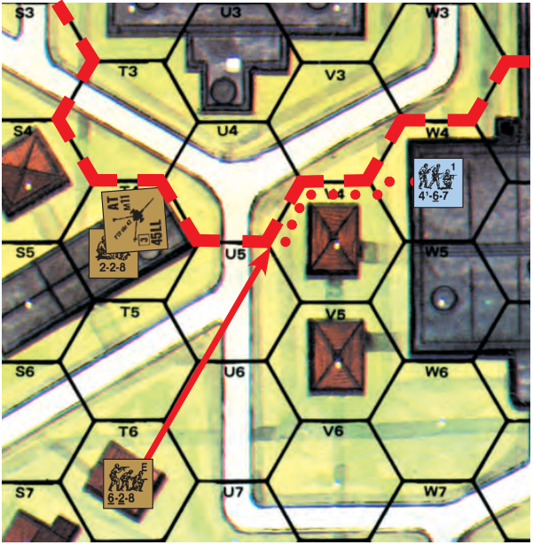

EX: The 4-6-7 in 1W4 is using Bypass in V4 along the V4-V3 and V4-U4 hexsides when it is fired on by the 6-2-8 in T6. The LOS is traced to the V4-U4-U5 vertex. The range is three even though the vertex is also a part of hex U5, which is only two hexes away. The Gun in T4 with CA T3-U4 must change its CA to fire on the 4-6-7, because although the V4-U4-U5 vertex is on a hexside defining the Gun’s present CA, the target hex (V4) is not inside that CA.

<!-- pdf-page 163 -->

## 1. OFFBOARD ARTILLERY (OBA)

#### 1.1

**1.1** OBA represents a battery of Guns outside the area represented by the mapboard, using radio-directed Indirect Fire to fire HE or SMOKE (or IR; E1.93) onto designated areas of the mapboard. OBA availability is usually symbolized by the presence of a radio counter in the scenario OB and is further defined by SSR or DYO purchase as to type. Each radio in the OB represents one predesignated available OBA battery (aka module). Each battery may produce a variable number of Fire Missions, but only via the one radio representing it in the scenario. If that radio is lost, so is the opportunity to contact that battery; another radio may not be used to call in the remaining Fire Missions of that battery.

**1.2 RADIO CONTACT ATTEMPT:** OBA may be called-for/ placed/Corrected/Converted/voluntarily-Cancelled only if the friendly player currently has Radio Contact and Battery Access. Only an Observer (i.e., a Good Order leader possessing a functioning radio/field-phone counter [1.6], or an OP tank [H1.46], or an Off-board Observer [1.63; E7.6]) may attempt Radio Contact *[EXC: not if he is a Rider, or a Guard whose US# is \< that of his prisoners],* and may do so only at the start of the PFPh/DFPh<sup>1</sup> (as given in the Advanced Sequence of Play) as his sole action for that phase aside from other allowed OBA activities. Radio Contact is established with a DR ≤ the Radio Contact value printed on the radio counter (∆). If the Radio Contact DR is failed, neither the radio nor the Observer may attempt Radio Contact again until the start of his next PFPh/DFPh (whichever comes first; see also 1.61). The Contact value may vary with nationality and, in some cases, time frame of the scenario. If a radio counter has a multiple Contact value, the dates for their use are listed on the reverse side. EX: The Russian Contact value of 6/7/8 indicates a Radio Contact value of 6 through June ‘42, 7 from July ‘42 through June ‘43, and 8 thereafter.

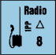

**1.21 BATTERY ACCESS:** Having established or maintained Radio Contact, the player *must* then immediately attempt to gain Battery Access if that battery currently has no SR/FFE counter onboard or does have a FFE:C counter onboard. In addition, whenever placing an AR counter onboard in order to place (1.3) or Correct (1.4) a SR/FFE, and whenever Converting *any* SR/ FFE:C to a FFE:1 (1.332-.333; 1.342), Battery Access must be attempted a second (i.e., an *extra*) time if ≥ one non-hidden enemy ground unit is in/ adjacent-to the AR (or, when Converting, to the SR/FFE:C) counter’s hex but none of those units are Known to the Observer (see also 1.6). Battery Access is gained only by randomly drawing a *black* card/chit from that battery’s Draw Pile (1.211) and revealing it to the opponent. Once gained, Battery Access is retained until the end of a RPh in which that battery has a FFE:C counter onboard or until a FFE of that battery is Cancelled (whichever comes first). Failure to gain Battery Access (i.e., drawing a red card/chit at any time) does not break Radio Contact, but does cause all currently onboard AR/SR/FFE counters of that battery to be removed, Cancels its current Fire Mission (if any), and ends that Observer’s and battery’s OBA actions for that phase. In addition, the second permanently-removed (i.e., non-*extra*) red card/chit drawn for a battery causes the loss of its Battery Access for the duration of the scenario. The current Radio-Contact and Battery-Access status of each radio is marked on the Scenario Aid Card by flipping the Battery Contact counter to the appropriate side and placing it in either the “Battery Access” box (if Access has been gained) or the “Contact” box (if it has not).


**1.211 DRAW PILE:** Each battery’s Draw Pile is assembled prior to setup, and comprises a number of black and red chits or playing cards (hereafter referred to collectively as chits) as listed in the form “#B/#R” in that nationality’s “OBA ACCESS” column of the A25 National Capabilities Chart on the Chapter A divider. (OBA chits are the reverse side of certain DM counters.) Each Draw Pile can be increased at this time by one or more of the following, as applicable: one extra black chit if the battery has been assigned ≥ one Pre-Registered hex (1.73); one extra black chit if it is specified as having Plentiful Ammunition; one extra red chit if it has Scarce Ammunition. The Draw Pile is then “shuffled” and set aside for use during play. Whenever Battery Access is lost or a new chit draw is made, the previously drawn chit is removed permanently from the Draw Pile *[EXC: each extra chit drawn as per 1.21 is mixed back into the Pile immediately after being revealed].*

**1.22 MAINTAINING RADIO CONTACT:** To maintain Radio Contact from a preceding turn, the player must roll ≤ the Radio Contact value again in his next PFPh or DFPh (whichever comes first), but may deduct one from the DR *[EXC: the Maintenance DRM is -2 if the battery is 70+mm/80+mm battalion mortar OBA**<sup>2</sup>**]*. The Maintenance DR is the Observer’s sole allowed action for that fire phase (other than further allowed radio activities). A radio is a 1PP SW. A leader must possess a radio to use it.<sup>3</sup> A radio breaks down on any Original Contact or Maintenance DR of 12 (or as listed on the radio counter) and is subject to normal SW Repair (A9.72). The involuntary loss of Contact does not automatically cause loss of Battery Access, but failure to regain Contact in the next friendly PFPh/ DFPh (whichever comes first) will prevent the Conversion, Correction, and voluntary Cancellation of that battery’s onboard SR/FFE counter; the FFE would continue to be resolved as per 1.5-.51, and, if still existing at the end of the RPh in which it is a FFE:C, would at that time be Cancelled (1.34); a SR would remain in place. Voluntary loss of Contact (i.e., failure to roll for Contact/Maintenance or voluntary rout; 1.6) causes the immediate loss of Access and Cancellation of the Fire Mission (if any). However, failing to roll for Contact/Maintenance is considered voluntary loss of Contact only if the Observer has no LOS to the SR’s/FFE’s Blast Height (1.32). See also 1.61.

**1.23 FIELD PHONES:** A Field Phone is equal to a radio in all respects, except that: Contact and Maintenance DR are passed by a DR of ≤ 11; unlike a radio, a Field Phone cannot be moved or repaired; a Field Phone can be eliminated by the presence of enemy troops or an HE FFE resolved within its Security Area. A Security Area is a prerecorded line of hexes with either the same vertical row letter or horizontal grid number from the Field Phone (inclusive) to its Friendly Board Edge. Anytime a FFE is resolved within that area resulting in an Original KIA DR, or the opposing player rolls an Original 2 DR for *any* purpose for one (or more) of his units in the Security Area, the line is considered cut and the Field Phone is removed. A Field Phone and its Observer may always set up using HIP (if otherwise able to). EX: If a Field Phone is in hex 4E5 and its Friendly Board Edge is along the side whose hexes are numbered 10, its Security Area is Hex Grain E5-E10. If its Friendly Board Edge is along the side whose hexes are numbered 1, its Security Area is Hex Grain E5- E1. If its Friendly Board Edge is along the A hex row, its Security Area is E5-D5-C5- B5-A5.

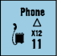

**1.3 ARTILLERY REQUEST (AR):** Having established (or maintained) Radio Contact during that phase, and if he has Battery Access, the player may continue his radio action in that phase by placing an AR counter on any hex containing a Location that is in his Observer’s LOS which he wishes to be the target of an OBA attack. LOS is then checked from the Observer to the AR’s hex; if no such LOS exists to any non-Aerial Location therein, that AR is removed, that Observer’s OBA actions are considered finished for the current phase, and at the opponent’s option that current Fire Mission is Cancelled. If at this point the AR is not removed (as per either the preceding sentence or a 1.21 *extra* red chit draw), the player then makes an Accuracy dr to determine if his SR will land Accurately (i.e., in the AR’s hex). For British (including Free French), German, and U.S. OBA *[EXC: Off- board Observer (1.63; E7.61)]* and Shore Fire-Control Party (G14.64), a Final Accuracy dr of ≤ 2 (see below and 1.62 for cumulative drm) results in the SR landing on target and the AR counter being exchanged for a red Spotting Round (SR) counter. All other nationalities must make a Final Accuracy dr of ≤ 1 to result in the SR landing on target. An Accuracy dr made for a Corrected SR that is predesignated to be Converted to a FFE (1.332) receives a +1 drm if that SR was Corrected 7-12 hexes, or a +2 drm

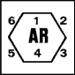


<!-- pdf-page 164 -->

if it was Corrected 13-18 hexes. A SR has no detrimental effect on any unit or terrain.

**1.31 DIRECTION/EXTENT OF ERROR:** Make a DR if the SR does not land on target on the AR. The colored dr indicates (using the hexagonal grid reference on the AR counter) the hexside direction from the AR that the SR has landed. The white dr (modified as per 1.4/1.732 as applicable) determines the Extent of Error and is the number of hexes away from the AR counter along that Hex Grain in the errant direction that the SR lands. Mark this hex with the battery’s red SR counter and remove the AR counter.

**1.32 BLAST HEIGHT/AREA:** For Observer-LOS purposes, the Blast Height (visible effect) of a SR rises from the Base Level of its hex through the next two higher levels *[EXC: a SR that lands offboard has no Blast Height];* see the first 1.62 EX. The Blast Height of a FFE is the same *[EXC: that of a WP FFE rises through the next four higher levels],* but exists in each hex of its Blast Area. The Blast Area of a HE/SMOKE Concentration FFE comprises the hex containing the FFE counter and all hexes adjacent to it *[EXC: each such hex that is offboard is not a part of the Blast Area, regardless of the type of Fire Mission (1.7); for a SMOKE FFE see also 1.71]*. See 1.72 for the Blast Area of Harassing Fire, and E12.11 for that of a Barrage.

**1.321 OFFBOARD SR/FFE:** If a SR lands offboard, use an extra board butted against the playing area to mark that SR’s position (to indicate its distance to/from the AR counter). As long as the SR remains on this board it is considered out of the Observer’s LOS (since it has no Blast Height; 1.32). Use the same procedure if a FFE counter lands offboard; however, only its Blast Area (i.e., the onboard portion, if any, of that FFE) is resolved and Observed in the normal manner—the offboard portion is *never* resolved *[EXC: Drifting SMOKE; 1.71]*, nor is it ever in the Observer’s LOS (1.32).

**1.322 END OF ACTIONS:** Placing a SR (1.3-.31), or Correcting one without predesignating its Conversion to a FFE (1.332), ends both that Observer’s and that battery’s OBA actions for that phase.

**1.33 SR & FFE:1/2 OPTIONS:** At the start of each friendly PFPh/DFPh in which an Observer has gained/maintained Radio Contact and Battery Access, and has that battery’s SR or FFE:1/2 onboard from his previous PFPh/DFPh (whichever came last), he *must* then attempt to perform one of the following, as applicable, for that battery (no other options [e.g., replacing a FFE:1/2 with a SR] are possible):

###### 1.331

**1.331** If he currently has a LOS to the SR’s or FFE’s Blast Height, he may leave that SR in place or Correct (1.4) that SR or FFE; or,

###### 1.332

**1.332** If he currently has a LOS to the SR’s Blast Height, he may predesignate aloud that he will Correct that SR and then Convert it to a FFE:1; he then does so, and must Convert the now-Corrected SR *[EXC: if the requirements of 1.333 are not met at this time];* or,

###### 1.333

**1.333** If he currently has a LOS to the Base Level of the SR’s hex, or to its Blast Height *and* any non-Aerial Location in/adjacent-to the SR’s hex that contains a Known (to him) enemy unit, he may Convert that SR to a FFE:1 and leave it in that hex for resolution; or,

###### 1.334

**1.334** Disregarding SMOKE, if he currently has a LOS to the Base Level of the FFE counter’s hex, or to the FFE’s Blast Height *and* any non-Aerial Location in/adjacent-to the FFE counter’s hex that does/did contain a Known (to him) enemy unit during this FFE’s current Fire Mission, he may leave that FFE in its present hex for resolution; or,

###### 1.335

**1.335** Disregarding SMOKE, if he currently has *no* LOS to the SR’s or FFE’s Blast Height nor to any non-Aerial Location in/adjacent-to the SR’s hex that contains a Known (to him) enemy unit, he *must* Correct (1.4) or Cancel (as per 1.336-.337) that SR or FFE; or,

###### 1.336

**1.336** He may voluntarily Cancel the SR, and may also attempt to place an AR (followed by a new SR) as per 1.3-.31 (including situations when, disregarding SMOKE, he has no LOS to the SR but can see a Known (to him) enemy unit in a non-Aerial Location in/adjacent-to the SR hex); or,

###### 1.337

**1.337** He may voluntarily Cancel the FFE. See also 1.35.

##### 1.34 FFE:C

**1.34 FFE:C:** A FFE:C (Continuation) counter is never Corrected, and is resolved only vs each unit that enters or becomes more vulnerable in a hex of its Blast Area (1.51). Its main purpose is to mark the position of the previous FFE:2 counter so that its Observer, after regaining Battery Access in the next PFPh/DFPh (whichever comes first), may place his next SR or FFE:1 counter in that same hex. At the start of each friendly PFPh/DFPh in which an Observer has gained/maintained Radio Contact and has that battery’s FFE:C onboard, he *must* attempt to gain Battery Access as per 1.21. Regardless of the outcome, that previous Fire Mission is now Cancelled— but if he gains Access *and* had a LOS to the FFE’s Blast Height during the current phase prior to achieving Access, he must now attempt to perform one of the following for that battery (no other options are possible):


###### 1.341

**1.341** He may replace the FFE:C counter with a SR, which he may also Correct (1.4) or leave in its present hex; or,

###### 1.342

**1.342** If he currently has a LOS to the Base Level of the FFE:C’s hex, or to its Blast Height *and* any non-Aerial Location in/adjacent-to its hex that contains a Known (to him) enemy unit, he may Convert that FFE:C to a FFE:1 and leave it in that hex for resolution; or,

###### 1.343

**1.343** Even if he had no such LOS (1.34), he must remove the FFE:C counter, but may also attempt to place an AR (followed by a SR) as per 1.3-.31.

**1.35 CANCELLED SR/FFE:** *Any* Cancellation of a FFE immediately ends that Fire Mission and causes the removal of that FFE counter from onboard. In addition, Cancelling a FFE:1/2 necessitates regaining Battery Access at the start of a *subsequent* friendly PFPh/DFPh before a new AR can be placed for that battery. Cancelling a SR does not end a Fire Mission, but causes the removal of that SR counter.

**1.4 CORRECTING OBA:** An Observer may Correct an existing SR up to 18, or an existing FFE counter up to 3, hexes from its current position by attempting (as per 1.3) to place an AR and make an Accuracy dr *[EXC: the AR may not be placed in the SR/FFE counter’s present hex; Accuracy is not possible if the SR/FFE must be Corrected (1.335)]*. If the Correction is not Accurate, the Direction and Extent of Error must be determined before moving the SR/FFE counter. Direction of Error is determined as per 1.31. The Extent of Error is determined as per 1.31 *[EXC: unless the SR/FFE must be Corrected (1.335), the Extent of Error is limited to a maximum of one hex for each multiple of three hexes (FRU) from the SR/FFE counter to the AR counter (inclusive of the latter only)].* See also 1.62. EX: A SR is being voluntarily Corrected four hexes to an AR, but the Observer’s LOS to the AR is Hindered by Dispersed smoke. There is no Accuracy dr because the +2 drm of the Dispersed smoke makes Accuracy impossible (1.62; A24.4). Even so, the maximum Extent of Error will be two hexes: an Extent-of-Error dr of 1 will land the SR adjacent to the AR, while a dr of 2-6 will cause a two-hex error.

**1.5 FFE RESOLUTION:** A new Fire Mission always begins with the FFE:1 side of the counter face-up. After resolution in that PFPh or DFPh it is replaced with that battery’s FFE:2 counter, and after resolution in the next friendly PFPh/DFPh (whichever comes first) that FFE:2 is flipped to its FFE:C side *[EXC: if Cancelled in the interim; 1.35].* Once placed, a FFE:1/2 must be resolved at the start of that fire phase (as per the Advanced Sequence of Play). See 1.22 if Radio Contact is lost during the course of a Fire Mission. (See also


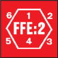

<!-- pdf-page 165 -->

1.61.) Each FFE:1 and FFE:2 attacking in the PFPh/DFPh is resolved on the IFT vs all (including friendly; see 1.54) units *[EXC: Aerial units, those in sewers/tunnels, non-Vulnerable PRC, and certain Climbing units (B11.42)]* in each hex of its Blast Area, using a separate DR vs each *hex* and the FP that corresponds to the battery’s Caliber Size (C.6) *[EXC: Harass- ing Fire (1.72) and Barrage (E12.5) use modified FP; see 1.71 for a SMOKE FFE]*. A hex devoid of units is still attacked if there is a possibility of Fire/rubble/shellhole creation, minefield/Fortification/weapon elimination, and/or effects vs HIP units or Field Phone security area (1.23).

**1.51 ENTERING A FFE:** A HE/WP FFE:1/2/C also attacks each unit/ stack that *enters* a hex of the Blast Area during the MPh/RtPh/APh/CCPh *[EXC: not if the unit/stack is immune to OBA therein (1.5)]*. It also attacks each unit/stack that is changing position (or becoming vulnerable) *within* a Blast Area hex *if* the unit/stack is becoming more vulnerable to the FFE than it was in its immediately-previous position (e.g., a unit exiting a sewer or foxhole, claiming Wall Advantage while in a building Location, or moving to a higher building level). Such attacks are resolved using the FP determined in 1.5 (or cause WP NMC; see 1.71), but differ from PFPh/ DFPh resolution in the following ways: a new resolution DR is made *each time* the unit/stack enters-a-new-hex/becomes-more-vulnerable-in-one; FFMO/FFNAM can apply during the MPh (only); and no terrain, Fortifications or other units in the hex can be affected. A moving unit/stack can undergo a FFE attack in its MPh and again (along with the hex’s other contents) in the DFPh. A FFE does not cause Interdiction.

##### 1.52 TEM

**1.52 TEM:** Indirect Fire IFT resolution is subject to TEM *[EXC: Height Advantage (B10.31), Crest (B20.92), Deir (F4.5), Hillock (F6.5), and Dune Crest (F7.513) TEM]* in the normal manner (see B9.31 and B9.34 for wall/hedge/bocage). Indirect Fire cannot reduce Half-Level-Obstacle hexside TEM to \< zero. Hindrances/SMOKE never affect FFE IFT resolution. See also B13.3 (Air Bursts), B23.32 (higher building levels), and 11.5 (Gunshields).

##### 1.53 CH

**1.53 CH:** A HE/WP FFE Original resolution DR of 2 yields a CH. See 3.7-.75 for HE, and 3.76 for WP.

**1.54 FRIENDLY UNITS:** Each non-heroic, non-berserk unit *[EXC: an Observer within that Blast Area due to his Accurate placement/Correc- tion of that FFE; units in Locations immune to OBA (1.5)]* has its Morale Level, or that of its Inherent Personnel, lowered by one while within the Blast Area of a *friendly* HE/WP FFE or Bombardment.<sup>4</sup>

**1.55 vs VEHICLE:** The H Vehicle line of the IFT (A7.308) is used for an unarmored vehicle attacked by a HE FFE (or hit by HE using the Area Target Type; 3.33). However, such attacks vs an AFV are resolved in a different manner on the IFT: A Final KIA result destroys the AFV but allows normal Survival (D5.6; D6.9) possibilities *[EXC: a Final DR ≤ half of the Final DR that corresponds to a K/# result on that IFT column results in a Burning Wreck (B25.14) and the elimination of its PRC (D5.6); no more vehicle counters can be affected than the highest KIA# of that IFT col- umn (as given in A7.308)]*; a Final DR that is a K/# or one \> a K/# creates either an *automatic* (not a “possible”) Shock for a turret hit, or Immobilization for a hull hit; a MC or PTC result has no effect vs the AFV, but can affect its Vulnerable PRC Collaterally. An AFV’s vulnerability is not increased by its being Partially Armored (D1.22). Use the OBA’s original IFT DR vs an AFV to determine the hit location (3.9) of that OBA attack. TEM applies to the IFT DR as per 1.52/3.331 as applicable (for an AFV hit by Air Bursts, see also D5.311). HD status (D4.2), HA (D4.22) and AF (D1.6) never apply to Indirect Fire. A FFE/Area-Target-Type HE attack is resolved vs an AFV using ≥ one of the following DRM if applicable (these DRM do not apply Collaterally vs its PRC):

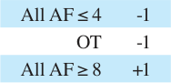

**1.56 vs CONCEALED UNITS:** The resolution of a FFE is not halved vs a concealed unit(s).

**1.57 FFE LOS HINDRANCE:** A *HE Concentration* (1.7) FFE of ≥ 70mm is considered a two level +1 LOS Hindrance to any LOS traced into, through, within, or from its Blast Area hex(es). This Hindrance DRM never exceeds +1 per FFE, regardless of the number of HE Blast hexes of that concentration it is traced through. For Barrage, see E12.52 and E12.75. See also F11.75.

**1.6 OBSERVER:** An Observer must have a LOS to the AR counter to call in OBA, so an Observer in an AFV *[EXC: OP tank; H1.46-.465]* must be CE to spot. Concealed units in non-Concealment Terrain and in the LOS of a Good Order Observer are always considered Known to that Observer *[EXC: at night; vs Winter-Camouflaged unit; vs unit capable of claiming bocage TEM vs Observer]*, but only for his OBA actions. Such units would always be considered concealed for all other purposes. An Observer cannot be used in any other capacity to gain the benefit of “seeing through concealment”. An Observer can operate only one radio per phase and therefore may not maintain Radio Contact with more than one battery at a time. An Observer who uses a radio (including any unsuccessful attempt to make or maintain Contact) may attempt no actions other than OBA direction during that PFPh (and may not move in the following MPh) or DFPh *and* if not hidden/concealed is marked with a Prep or Final Fire counter, but does not lose any “?” he may have.<sup>5</sup> A leader Observer who has Radio Contact loses it voluntarily (1.22) when he accompanies a routing unit as per A10.711.

##### 1.61

**1.61** An Observer not in Good Order immediately loses Radio Contact. A different Observer or one restored to Good Order may use the radio again but must re-establish Radio Contact.

**1.62 VISION EFFECTS:** When placing/Correcting a SR/FFE, all Hindrances along the Observer’s LOS between his hex and that of the AR, as well as any SMOKE in his hex, are treated as cumulative drm to the Accuracy dr if they Hinder his LOS to *all* non-Aerial Locations of the AR’s hex that are in his LOS *[EXC: if the AR is in a Pre-Registered hex; 1.732]*. EX: A German Observer for a 70+mm OBA battery is in 3W6, and Russian squads are in U3, U4, V3, and W4. In his Turn 2 PFPh the German makes a DR of ≤ 8 to establish Radio Contact (1.2). He then draws a chit (1.21), which is black, thereby gaining Battery Access. Next he places an AR counter in U3 (1.3), which is in his LOS. No *extra* chit draw is required since he can see ≥ one non-hidden Known enemy ground unit in/ adjacent-to the AR. He then makes an Accuracy dr of \> 2 resulting in an inaccurate SR, so he makes a DR to determine Direction and Extent of Error (1.31). This DR is a 5 (3 on the colored dr), indicating that the SR lands in W4, which is not in his LOS. However, he can still see the SR there because its Blast Height is two levels higher than the Base Level of that hex. (Thus even had the SR landed in W3 he still could have seen it.) The AR is now removed and a red SR is placed in W4, thus ending his OBA actions for this phase. If the Russians in U3 and U4 were *both* under “?” and in Concealment Terrain, or were absent altogether, in order to leave the AR in U3 and attempt to place a SR on it the German would also have to draw an *extra* black chit (since there would be ≥ one non-hidden enemy ground unit in/adjacent-to the AR’s hex, but none of them would be Known to the Observer; 1.21, even if U3 were a Pre-Registered hex).

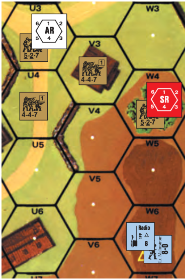

<!-- pdf-page 166 -->

In the Turn 2 German DFPh, the German maintains Contact with a Final DR of ≤ 9. Now he would like to Convert his SR in W4 to a FFE and resolve it in that hex (1.333) where it would affect the Russians in V3 and W4. He cannot, however, because those Russians are not Known to him nor does he have a LOS to the Base Level of W4. Thus, his only options are to Cancel (1.336) or Correct (1.331-.332) the SR or leave it in place. By Correcting it ≤ three hexes he is guaranteed to place it no farther than one hex off-target (1.4), so he decides to Correct it and Fire For Effect (1.332) with a HE Concentration. He declares this intention and places an AR in U4 (again requiring no *extra* chit draw) which is in his LOS. His Accuracy dr is \> 2, and the Direction of Error roll is a 3, which moves the SR to V4 (and the AR is removed). Now, since he meets the requirements of 1.333, he must Convert it to a FFE:1—but first he must check again to see if an *extra* chit draw is necessary as per 1.21. It is not, thanks to the Known (to him) Russian in U4, so he exchanges the SR for a FFE:1 counter which will now attack the Russians in U4, V3, and W4 (despite the latter two being out of his LOS) with 12 FP. He makes a separate IFT DR for each target hex, with a +2 TEM for V3, a -1 TEM for W4, and a +1 TEM for U4 (U4-V4 wall; B9.34). If the Russian in U4 were under a “?” *and* in Concealment Terrain, or were absent altogether, the German *would* have to draw an *extra* black chit before he could convert the SR.

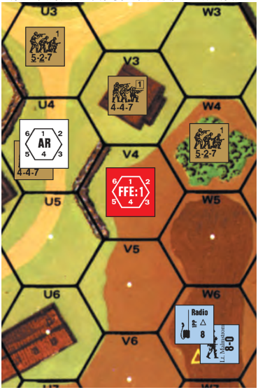

**1.63 OFFBOARD OBSERVER:** A SSR may give a player an OBA module that uses an Offboard Observer. The SSR will specify a particular on-board hex and level (even though the listed hex may have no such level), and all OBA LOS checks are taken from this point as if the Observer were located there. Since there is no Observer actually in the designated Observer hex, any fire or movement into/through that hex has no effect on the OBA *[EXC: Hindrances affect the Observer’s LOS (and hence, Accu- racy dr) from that hex level normally]*. Even though no radio is provided for the OBA module, all OBA procedures are conducted normally except that Radio Contact and Maintenance are automatic. The Final Accuracy dr required for OBA using an Offboard Observer is always ≤ 1 *[EXC: Pre- Registered Fire; 1.73].*

**1.7 FIRE MISSIONS:** A Fire Mission consists of the entire time between Battery Access chit draws in which a FFE is on board. There are seven types of Fire Missions. The first is the HE Concentration and the second the SMOKE Concentration (1.71), the Blast Area for both of which is defined in 1.32. The other types are Harassing Fire (1.72), IR (E1.93), Barrage (E12.1), SMOKE Barrage (E12.51) and Creeping Barrage (E12.7). A Fire Mission cannot be of more than one type; e.g., if a battery uses a HE Concentration in its FFE:1 stage, it cannot switch to Harassing Fire or SMOKE, etc., in its FFE:2 stage. Whenever a FFE:1 appears onboard, or when an SR is predesignated for conversion to a FFE (although if it does not actually Convert it may be re-designated later), the type of Fire Mission to be used (including whether Smoke or WP) must be announced immediately by its owner (before making any required Accuracy dr for it) *[EXC: IR Missions must be declared prior to the Mission’s first Battery Access draw]*.

**1.71 SMOKE:** A SMOKE FFE is treated like an equivalent HE FFE except that it does not attack with HE, and in the PFPh and DFPh it places a SMOKE counter in each Blast Area hex. Normal SMOKE rules (3.76; 8.5-.6; A24.2-.8) apply *[EXC: during the PFPh and DFPh, a WP FFE subjects all vulnerable units/PRC in every Blast Area hex—not just those in Locations where WP counters are placed—to an A24.31 NMC]*. OBA SMOKE may not be placed in Mud, Deep Snow, Marsh, or a Water Obstacle *[EXC: on a bridge]* or during rain/heavy-wind, and is removed immediately when rain/gusts/heavy-wind occurs *[EXC: gusts only remove Dispersed SMOKE; flip other SMOKE counters]*. FFE SMOKE that lands offboard has no effect *[EXC: it can Drift onboard in the normal manner]*.

**1.72 HARASSING FIRE:** Whenever a FFE:1 that could be declared a HE Concentration appears onboard, its owner may announce it as Harassing Fire instead. The Blast Area of Harassing Fire comprises all onboard hexes within *two* hexes of the FFE counter, and its per-hex FP within that 19-hex Blast Area is <sup>1</sup>/3 of that battery’s HE Concentration FP; however, it cannot place SMOKE. Harassing Fire is indicated by using a *blue* FFE counter.

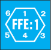

**1.73 PRE-REGISTERED FIRE:** Pre-Registered Fire may be used only if allowed by SSR or DYO-purchase (H1.53), and only if that battery’s Observer starts the game onboard or is an Offboard Observer (1.63; E7.6). Prior to the start of the opponent’s setup, that Observer’s owner may secretly record ≥ one (as determined by SSR or DYO-purchase) target hex as that battery’s Pre-Registered hex(es). A battery with Pre-Registered Fire capability also receives an extra black chit in its Battery Access Draw Pile (1.211). If that Observer has both Battery Access and a LOS to any non- Aerial Location in a Pre-Registered hex of that battery, the following rules apply (Pre-Registered Fire has no additional effect):

###### 1.731

**1.731** After successfully placing the AR on that Pre-Registered hex, the player may dispense with the SR and instead immediately place a FFE:1 on that AR. He then rolls for Accuracy, etc. as per 1.732.

###### 1.732

**1.732** While the AR is in that Pre-Registered hex (even if the SR is not being dispensed with), Accuracy (1.3) occurs if the Original dr is ≤ 4; if not Accurate, the Extent of Error dr is halved (FRU).

**1.733** Pre-Registered Fire may be used with any type of Fire Mission *[EXC: only as per E12.71 for Creeping Barrage]*, but is always limited to the specific Observer and battery (not radio or field phone) that start the scenario with such capabilities.

**1.8 BOMBARDMENT:** The following rules, which may be invoked only via SSR or DYO-purchase, simulate the artillery softening-up process conducted prior to a set-piece attack.

**1.81 AREA:** Bombardment begins after setup but prior to the start of play. Bombardment potentially affects all the hexes of an entire mapboard (hexrows A-GG) or two adjacent halfboards (hexrows A-Q/Q-GG) at the firer’s option, including all friendly units present in that designated area. The firer makes six dr, modifying the last three dr by +6. Each of these Final dr represents a numerical grid coordinate of the Bombardment area which is *immune* to its effects. Should any of these Final dr result in the same number or exceed 10, the total area spared the effects of the Bombardment is correspondingly less. A Final dr of 10 also spares all hexes of the Bombardment area that have a coordinate of 0 (see A2.2). For *Deluxe ASL* see J2.5. EX: The German player is entitled to a pre-game Bombardment and rolls 3, 1, 3, 4 (+6 = 10), 5 (+6 = 11), and 2 (+6 = 8). All hexes of the Bombardment area with a numerical coordinate of 0, 1, 3, 8, and 10 are spared the effects of Bombardment.

**1.82 EFFECTS:** All non-Aerial Personnel units and Vulnerable PRC not in the spared hexes must take a 2MC prior to the start of play (thus *passing* the 2MC has no effect on HIP/“?” status). However, the TEM of their Location is added to their MC DR as a negative DRM (e.g., -4: entrenchment; +1: woods [Air Bursts]; -3: entrenchment in woods; 0: Open Ground). The +1 DRM for each non-rooftop level of a building above it (B23.32) does not apply. A -2 DRM applies if in Marsh. Otherwise, *all* rules for, and consequences of, a MC apply in the normal manner *[EXC: each Personnel unit whose MC DR is Original Doubles \< 12 suffers Casualty Reduc­*

<!-- pdf-page 167 -->

*tion if it also fails that MC]*; A10.31 applies to an Original 12. Hidden/ concealed Personnel that break or become pinned must be completely revealed regardless of enemy LOS (thus eliminating a Dummy stack). All Horses, Motorcycles, and Boats not in the spared hexes are eliminated; their Passengers/Riders must Bail Out (D6.24), and then must take the Bombardment 2MC. CH are not applicable during Bombardment.

**1.821 EQUIPMENT:** Vehicles (and SW/Guns, in some instances) not in the spared hexes must take a NMC *[EXC: Horses, Motorcycles, and Boats do not take MC; they are affected as per 1.82]*. Unarmored vehicles have a Morale Level of 6, Guns and SW have a Morale Level of 7, all OT AFV and those CT AFV with all AF ≤ 4 have a Morale Level of 8, and all other CT AFV have a Morale Level of 9. There is no Pin, or reversed TEM (1.82), effect. Each vehicle must take its MC before its occupants do. A possessed SW/Gun takes the NMC only if its possessor fails-a-MC/ suffers-Casualty-Reduction; if unpossessed when attacked by the Bombardment, it must always take the NMC. Failing a MC by one immobilizes vehicles, and malfunctions SW and non-vehicular ordnance. Failing the MC by two eliminates it, and a destroyed vehicle’s PRC must roll for Survival (D5.6/D6.9; those that survive are not attacked again by the Bombardment). A vehicle failing a MC by ≥ three results in a burning wreck.

**1.822 TERRAIN:** Each building/bridge hex not in the spared hexes must take a NMC before any of its occupants do. Wooden buildings/bridges (and pontoon bridges) have a Morale Level of 8, and stone buildings/bridges have a Morale Level of 9. Completely Fortified building hexes *[EXC: Factory]* may increase their Morale Level by one. A “brown” pillbox has a Morale Level of 10; a “grey” pillbox has a Morale Level of 11. One level of the building (from top down) is turned to rubble for every multiple of one by which the MC is failed (a bridge would be treated as a Single Story House). All occupants of a rubbled level are eliminated (also check for Falling Rubble; B24.12). Wire and Roadblock counters, as well as all minefields, have a Morale Level of 9, and are eliminated if they fail their NMC; if hidden, they take their NMC and any eliminations are noted on the owner’s side record (without telling his opponent what was eliminated or where such occurred). If a *unit* in a sangar is eliminated, so is that sangar (see the last sentence of F8.41).

**1.823 FIRE/SHELLHOLES:** Whenever any Bombardment MC DR is an Original 12, place either a Shellhole counter or a Flame at the Base Level of that hex, depending upon which placement is legal. If both placements are legal, make a subsequent dr. If this dr is ≤ 3 a Shellhole counter is placed; if this dr is ≥ 4, a Flame is placed. Bombardment may place no more than one per hex.

**1.9 ROCKET OBA:** Rocket OBA is available only to certain nationalities (see the DYO OBA Battery Availability Charts) and only by SSR or DYO-purchase. No SR is placed nor is a FFE subject to Correction. Rocket OBA never receives more than one Fire Mission per battery. Rocketry is inaccurate and consequently never gets the benefit of an Accuracy dr; Error is automatic (although Extent of Error may be halved by Pre-Registered Fire). After gaining Battery Access, the firer merely places his AR (1.21 applies), rolls for Error, and places his FFE. Rocket OBA has the same Blast Area as Harassing Fire but is resolved with full FP. Rocket OBA cannot use Harassing Fire, Barrage, IR or SMOKE.

## 2. GUN CLASSIFICATIONS

**2.1 GUNS/SW:** Any ordnance-capable weapon depicted on a <sup>5</sup>/8" counter is termed a Gun, while any on a <sup>1</sup>/2" counter is a SW. Unlike SW *[EXC: U.S. RCL; 12.2]*, a Gun must be manned by a crew counter to fire without penalty (A21.13). The rules that follow are also applicable to vehicular-mounted Guns.

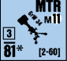

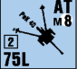

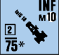

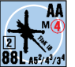

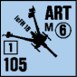

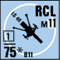

**2.2 COUNTERS:** Illustrated above are sample counters for the six non-vehicular Gun categories in *ASL*. The reverse of each counter illustrates either its malfunctioned side with applicable repair (R) and removal (X) numbers, or its Limbered status if applicable.

**2.21 GUN CALIBER SIZE:** This number is the weapon caliber (in mm) of the Gun—and of certain other ordnance types such as light mortars and some ATR. An overscored Caliber Size indicates that the weapon cannot fire AP ammunition. An underscored Caliber Size means it cannot fire HE ammunition. A Caliber Size that is neither underscored nor overscored means it can fire both AP and HE. In the absence of a declaration to the contrary, it is otherwise always assumed to be firing HE vs unarmored targets or AP vs armored targets, provided that ammunition type is available, is not Special Ammunition (i.e., has no Depletion #; 8.8), and is allowed on the applicable Target Type of the To Hit Table. An “\*”, “L”, or “LL” suffix means that certain To Hit modifiers are used at various ranges, due to varying muzzle velocities or inherent accuracy, and also serve to change the To Kill capabilities of these Guns/SW as listed on the respective columns of their To Kill Tables *[EXC: If a Gun is firing while limbered (LF; 10.24) it uses the limbered Caliber Size for To Hit modifiers but uses the unlimbered Caliber Size for determination of its Basic To Kill Number]*.

```text
                 EX: A limbered FlaK 30 must secure a hit without ben-
                 efit of the “L” modifier, but, if it hits, uses the 20L col-
◊                umn to resolve the effect of an AP hit.
```

**2.22 GUN TYPE:** This abbreviation indicates the general type of Gun: MTR = Mortar, AT = Anti-Tank Gun, INF = Infantry Howitzer, ART = Artillery, RCL = Recoilless Rifle, AA = Anti-Aircraft. This type of description is based on the actual terminology of such weapons. However, troops in the field very often used their weapons in *ad hoc* roles, so these names should not be taken literally. A player is free to use any Gun as an anti-tank weapon or an AT Gun vs Infantry targets, etc.

**2.23 FACING:** The depicted gun barrel of a Gun must be pointing toward a hexspine to define its current CA; see 3.2.

**2.24 RATE OF FIRE (ROF):** A Gun normally fires once per Player Turn (aside from its possible use of Sustained or Intensive Fire; 2.29, 5.6- .64). However, a number encased in a square on the counter indicates a Multiple ROF equal to that number, thus conceivably allowing it (and certain ordnance SW such as light mortars and some ATR, as well as MG making TH DR) to fire many times during a Player Turn.<sup>6</sup> If the Original colored dr of its TH (or IFE IFT) DR is ≤ its ROF, that weapon may fire again during that Player Turn unless otherwise prohibited. However, during Defensive First Fire the number and rapidity of its shots are MF/MP dependent; see 6.17. Similarly, a vehicular weapon using Bounding First Fire (D3.3) must expend at least one MP between its shots—during which time Defensive First Firers can be shooting back. If the Original colored dr of the TH (or IFE IFT) DR is \> the firing weapon’s ROF, it is marked with an appropriate fire counter (Prep, First Fire, etc.) and may fire no more in that Player Turn *[EXC: Sustained/Intensive Fire if so allowed]*.

**2.2401 GUN DUELS:** Vs a non-concealed, non-Aerial DEFENDER’s declared Defensive First Fire attack on it, a vehicle may attempt to Bounding First Fire (D3.3) its MA (/other-FP, including Passenger FP/SW) at that DEFENDER *first*, provided the vehicle need not change CA, is not conducting an OVR (D7.1), its total Gun Duel DRM (i.e., its total *Firer-Based* [5.] and Acquisition [6.5] TH DRM for its potential shot) is \< that of the

DEFENDER, and the DEFENDER’s attack is not Reaction Fire (D7.2). Neither the +1 DRM for a Gyrostabilizer nor the doubling of the lower dr for other ordnance in TH Case C<sup>4</sup> (5.35) is included in the Gun Duel DRM calculation. The order of fire for non-ordnance/SW is determined as if it were ordnance *[EXC: TH Case A can apply to non-ordnance/SW only if mounted-on/aboard a vehicle that is changing CA; all such non- turret-mounted fire is considered NT for purposes of TH Case C, and A.5 applies to any type of FG]*. If the ATTACKER’s and DEFENDER’s total Gun Duel DRM are equal, the lower Final TH (or non-ordnance IFT) DR fires first—and voids the opponent’s return shot by eliminating, breaking, stunning or shocking it. If those two Final DR are equal, both shots are resolved simultaneously. Any CA change the DEFENDER requires in order to shoot (5.11) is made *before* the ATTACKER’s shot *if* the DEFENDER’s total Gun Duel DRM is ≤ the ATTACKER’s; otherwise its CA changes (if still able to) *after* the ATTACKER’s shot. After the initial Gun Duel has been fully resolved, and *if otherwise able and allowed to*, that DEFENDER may announce another attack vs that ATTACKER who in turn may declare another Gun Duel; this time the printed ROF of one firing weapon on each side may be included as a negative DRM in that side’s Gun Duel DRM calculation. Only the ATTACKER may declare a Gun Duel *[EXC: not if the DEFENDER has done so as per 5.33]*. <!-- pdf-page 168 --> EX: A CE PSW 234/2 expends <sup>1</sup>/2 MP to enter 23N6 (with its CA as illustrated), where it sees the Russian 57LL AT Gun in O5. The AT Gun’s owner declares that it will fire at the Non-Stopped (C.8) PSW, whose owner in turn declares a Gun Duel vs the AT Gun with either its MA *or* CMG. Their respective Gun Duel DRM are totaled and compared. The PSW must use TH Case C<sup>4</sup> (+6) for a total Firer-Based TH DRM of +6. The AT Gun must use Case A for a +6 Firer-Based TH DRM (+3 [NT Gun] × 2 [firer in woods] = +6). No Acquisition applies. Both players now make their TH DR, which will also determine who fires first. Had the PSW expended a MP to Stop before firing, its TH chance (but not its Gun Duel DRM) would be better because it would not be subject to the doubling of the lower dr of the TH DR, but then it would have to concede the first shot to the AT Gun before it could Stop. If the AT Gun were concealed when it declared its attack, the PSW could not declare that Gun Duel vs it.

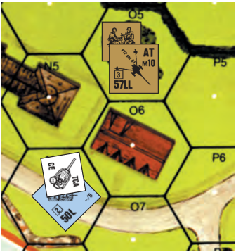

**2.241 FIRST/FINAL FIRE:** A Gun marked with a First Fire counter is limited to only one additional attack during that Player Turn *[EXC: OVR Prevention; 5.64]* if firing as ordnance, and that shot must be treated as Intensive Fire (5.6). Any Multiple ROF Gun which is not marked with a First Fire (even though it may have fired during First Fire), Intensive Fire, or No Fire counter is still entitled to multiple ordnance attack possibilities during Final Fire. If the Gun can use IFE, see 2.29.

**2.25 RANGE LIMIT:** Most Gun counters do not list a range limit because their range is far greater than that encountered in a normal scenario. For use in large DYO scenarios, however, maximum ranges are given in each nationality’s Ordnance Listing. A number in brackets (“[#]”) on a Gun (or light mortar, etc.) counter is that weapon’s maximum range in hexes. If two numbers (“[#-#]”) appear, the first is its minimum range, the second its maximum. See also 3.52.

**2.26 SPECIAL AMMO:** Some Guns and certain ordnance SW can fire other ammunition types besides AP/HE. Other ammunition type usage is more restricted, however, and is available only if the code letter for that ammunition type (e.g., as H for HEAT) is listed on the counter (usually on the reverse side). See also Section 8.

**2.27 MANHANDLING NUMBER (M#):** Each non-vehicular Gun has a Manhandling Number on its counter in the form “M#”, which is used to determine its Towing (10.1) and Pushing (10.3) requirements.

**2.271 GUN TARGET SIZE:** The color of the M# indicates the Gun’s Target Size (6.7). If the M# is printed on a white circular background, the Gun is a Small Target and a +1 To Hit DRM applies when firing at that Gun. If the M# is printed in red, the Gun is a Large Target and a -1 To Hit DRM applies when firing at that Gun.

**2.28 BREAKDOWN:** All Guns have an inherent B# of 12 if not listed on the counter. In cases where malfunction was more frequent, a lower B# is printed on the counter. All normal malfunction and repair provisions apply (A9.7-.74). If a non-vehicular Gun permanently malfunctions it is immediately removed from play.

**2.29 INFANTRY FIREPOWER EQUIVALENT (IFE):** This is a special option afforded certain Guns with a high ROF. Any number appearing in parentheses is that Gun’s IFE, which is used directly on the IFT in lieu of using the normal TH procedure. A Gun using IFE has its Multiple ROF reduced by one for that shot (cumulative with all other ROF reductions). IFE may neither establish a Fire Lane nor attack an AFV on the AP TK Table, must pay TH Case A DRM as IFT DRM when changing CA to fire (D3.52), may not make a Snap Shot (A8.15), is not subject to Cowering (A7.9), may not form/participate-in a multi-unit FG, may not be directed by a non-armor leader *[EXC: as per D6.65]*, may not attempt Deliberate Immobilization or use/gain/retain Acquisition (6.5), and is not subject to Mandatory Fire Direction (A9.4). IFE may use Spraying Fire (A9.5), and Bore Sighting (6.44) if otherwise allowed, but may not use both simultaneously. IFE has a Normal Range of 16 hexes (and halved FP from 17 to 32 hexes). When using IFE, a weapon is not considered ordnance and is subject to Sustained Fire—not Intensive Fire—penalties as per A9.3.

**2.3 360****<sup>o</sup> MOUNT:** A 360<sup>o</sup> Mount is the non-vehicular equivalent of a turreted vehicle, and is indicated on the counter by a large white circle around the Gun depiction. When assessing TH DRM for changing a Gun’s CA (5.1), a 360<sup>o</sup> Mount Gun is treated as a T weapon type; all other Guns not listed otherwise are treated as NT types. Some T types are further classified into various sub-groups (D1.3).

**2.4 MOVEMENT/FIRE LIMITATIONS:** The designations RFNM, NM, and QSU refer to limits on the movement/fire of Guns due to their individual characteristics, and are explained in the rules for Gun Movement (10.). See also A4.41.

**2.5 CONDITIONAL ROF:** The multiple ROF of a non-vehicular NT Gun *[EXC: 76-82mm mortar]* is lowered by one for its next shot in the current phase if it changes its CA for that shot. If that Gun has no Multiple ROF to lower, it is instead covered with an Intensive Fire counter (5.6) after that shot (even if it did not use Intensive Fire), thus indicating that it cannot use Intensive Fire for the duration of the current Player Turn *[EXC: OVR Prevention; 5.64].* EX: A 50L AT Gun with a 3 ROF changes its CA in order to fire, reducing its ROF to 2. If it rolls a 1 or 2 on the colored dr of its To Hit DR it may attack again in this fire phase, and for this next attack its ROF will be 3 again unless it once again changes its CA.

**2.6 GUN DEPRESSION/ELEVATION:** Only mortars, AA Guns (2.22) and Guns capable of using AA fire may fire-at/affect a higher-level target if the range to that target is \< the elevation difference between the firer’s and the target’s Location. Otherwise, a Gun may fire-at/affect a different-level target only if the range is ≥ the elevation difference between them *[EXC: cliff; B11.31-.32]*. A Gun in a building hex may not fire at a lower-level target in its own hex, and may fire at an higher-level target in its hex only if it is an AA Gun of ≤ 40mm. These restrictions also apply to non-AA vehicular MG and to vehicular FT, but not to SW *[EXC: they do apply to MTR/INF/RCL ordnance SW]*. If a vehicle’s MA has AA capability, then its CMG does too.

**2.7 PROHIBITED HEXES:** A Gun cannot occupy an upper building level *[EXC: Fortified Buildings and mortars on Rooftops]*, nor can it occupy a Water Obstacle, crag *[EXC: mortars; B17.4]*, marsh, or Irrigated-paddy <!-- pdf-page 169 --> (G8.12) unless dm and possessed or in/on a vehicle/boat. Small-Target-Size Guns and AT/INF Guns that are not large targets are the only <sup>5</sup>/8" non-vehicular Gun counters that may ever occupy a building/rubble hex *[EXC: Rooftop mortars (B23.85); Fortified Building (B23.93)]*.

**2.8 FIRE & MOVEMENT:** A Gun can fire during the same Player Turn after it has entered a new Location only if it is vehicular-mounted. See A4.41 for stationary Guns and moving crews.

#### 2.9

**2.9** If an item on the front of a Gun or Vehicle counter has a small “★” next to it, the player should check the back of that counter where he will find (usually in abbreviated form) some special characteristic of that item. Similarly, a small “**\***” on the counter also indicates some characteristic of the item next to it, but in this case the appropriate Vehicle or Gun Listing Note in Chapter H must be consulted (such an **\*** on a counter corresponds to a “†” in the Listing Notes). Do not confuse these “Notice” stars/asterisks with those used to show unarmored Target-Facings/Short-Gun-Barrels.

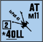

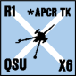

## 3. THE TO HIT PROCESS

#### 3.1

**3.1** Firing ordnance is always a one- or two-step process. First the firer must determine if he has hit the target; if he has, he must then determine the effect(s), if any, of that hit.

**3.2 COVERED ARC (CA):** Unlike Personnel units and SW, which can fire in any direction regardless of facing, the placement within a hex of a vehicle/Gun counter is important in that it defines that piece’s current Field of Fire, thus affecting its chances of hitting a target. A vehicle/Gun’s facing is called its Covered Arc (CA) and is derived by placing the counter such that its depicted gun barrel (or vehicle front) points directly at one of the six hexspines of its current hex. The CA comprises the two hexes joined by that hexspine, all the hexes (and hexsides) of the two diagonal rows of hexes that pass through those hexes while converging on the unit’s hex, and all the hexes between those two converging diagonal hexrows (see the example below). If the current placement of the counter is ambiguous such that the CA hexspine cannot be determined, the opposing player may select which of the two equidistant hexspines shall be used to determine the present CA of the counter.

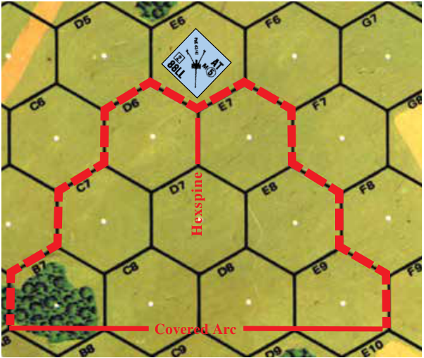

EX: 4E6 is also within the Gun’s CA; however, during the enemy’s MPh, the target would have to cross a hexside of the Gun’s CA when it entered E6. A8, B8, C9, D9, and E10 are also within the Gun’s CA if the range is extended another hex.

**3.21 FIRING WITHIN CA:** A Gun can fire only at a target within its CA. To fire at a target outside its CA, the unit must first change its CA to bring the target within that new CA. Changing a CA in the same fire phase in which the unit fires incurs a TH DRM penalty (5.1) that lessens the chance of obtaining a hit. This DRM varies in severity depending on the circumstances. See D3.52 for IFE and Canister.

**3.22 CHANGING CA WITHOUT FIRE:** A Gun may change its CA without firing only at the end of a friendly fire phase (not MPh), and only if at that time its crew is still able to fire it without using Intensive/Sustained Fire *[EXC: (un)limbering (10.22), Pushing (10.3), and turreted guns with other turreted armament (D3.51)]*. Such a change in the PFPh cancels any movement possibilities for that Gun (even a vehicular Gun) and its crew for the rest of that Player Turn, but does not prevent that Gun from attacking in the AFPh—presumably now without any Case A DRM.

**3.3 TO HIT (TH) TABLE:** The TH process is merely a matter of cross-indexing the “Target Type” classification with the “Range” to the target on the TH Table to obtain a *Basic To Hit Number (TH#)*. *Any Gun or Ammo modifications (C4) are added directly to the Basic TH# to achieve a Modified TH#*. A Final DR ≤ this Modified TH# results in a hit vs the target, which is then resolved on the IFT vs Infantry/Cavalry/Motorcycle targets or on the appropriate To Kill Table vs non-motorcycle vehicular targets *[EXC: Boats; E5.5-.52].* A Final DR \> the Modified TH# results in a Miss, which requires no further resolution *[EXC: Vehicular Overstack- ing; A5.132]*. The TH DR is also subject to favorable/detrimental modifications for a variety of causes. Each possible TH DRM is listed under the TH Table and explained in Sections 5 and 6. All Firer and Target TH Determination DRM are cumulative except as noted otherwise on each applicable TH line. There are two Basic TH# for each Range and Target Type combination, one red and one black *[EXC: the Area Target Type has only red Basic TH# which are used by all nationalities]*. The proper color TH# to be used is specified for each nationality on the A25 National Capabilities Chart in the “Ordnance TH#” column. Ordnance using a TH Table can cause Collateral Attacks to Vulnerable PRC; D.8.

**3.31 VEHICLE TARGET TYPE:** The Vehicle Target Type can be selected only when firing at a specific vehicle (even if HIP/concealed) and must be used when firing at an AFV *[EXC: firing HE or SMOKE when using the Area Target Type (3.33)]*. A hit on the target vehicle cannot itself cause damage to any other vehicle, Infantry, Cavalry, and/or terrain in the same target hex. The Vehicle Target Type cannot be used to fire at motorcycles.

**3.32 INFANTRY TARGET TYPE:** The Infantry Target Type can be selected only when firing HE *[EXC: AP or HEAT vs an unarmored tar- get (8.31, 11.52)]* and only against an unarmored target. All AFV (but not their Vulnerable PRC) in the target Location are immune to damage from a hit on this table, other than that resulting from damage to terrain (B24.121). All other in-LOS enemy units in that Location can be hit *[EXC: those immune as per 3.4]*, and all that are hit are then attacked on the IFT with a single Effects DR; see 3.4. EX: A Russian 57LL AT Gun Prep Fires with HE on the Infantry Target Type at a shellhole hex six hexes away containing an Opel Blitz truck (0 size TH DRM), a Kuebelwagen (+2 size TH DRM) and an Infantry squad. An Original TH DR of 8 for the truck, 7 for the squad (+1 shellhole TEM), and 6 for the Kuebelwagen (+2 size TH DRM) is needed, so if that DR is ≤ 6 all three targets will be hit and their fate will be resolved on the “6” column of the IFT with a single Effects DR. An Original TH DR of 9 will not result in a possible hit vs one of the vehicles due to vehicular Overstacking (A5.132), because the Infantry Target Type was used.

**3.33 AREA TARGET TYPE:** The Area Target Type must be used at all times by mortars and whenever ordnance *[EXC: LATW]* attempts to fire SMOKE; otherwise it may be selected when firing HE (but not AP/HEAT HE Equivalency; 8.31). *All* (including friendly) non-Aerial units in the target *hex* can be hit (even by WP), except for those *immune* as per 3.4 *[EXC: a mortar also hits all target-hex units that are out of its firer’s (Spotter’s, if one is being used; 9.3) LOS if that shot hit the non-hidden enemy target that currently was the hardest for it to hit (i.e., that received the highest*

<!-- pdf-page 170 -->

*net TH DRM for that shot)].* All units hit by HE are attacked on the IFT using a single DR and *half* the FP of the firing ordnance; see A24.31 for a hit by WP or if in a Location where WP is placed. Fire on the Area Target Type by a non-Mortar consumes all of that Gun’s ROF for that turn (excluding Intensive Fire) and thus cannot be used after taking any other shot first. Use of the Area Target Type does *not* itself prohibit Interdiction. The Area Target Type cannot be used within the firer’s own hex (i.e., at zero hex range), or as Bounding *First* (D3.3) or Motion Fire (D2.42).<sup>7</sup>

###### 3.331

**3.331** TH Cases C<sup>1</sup>-C<sup>4</sup>, E, G and L do not apply to the Area Target Type. TEM (Case Q) does not apply to an Area Target TH DR, but TEM that does not grant the target HD status vs that shot (see D4.2-.21) *does* apply (as per 3.4) to the resulting Effects DR. (See also 1.52 and 1.55 for TEM vs a mortar.) All other TH DRM apply to the Area Target Type TH DR in the normal manner vs each applicable target. EX: A German 50mm mortar at level 0 Prep Fires at a woods-gully hex that contains two enemy squads (one concealed and one Known) in Crest status at level 0 and a third IN the gully. If its TH DR is low enough to hit the concealed squad it will also hit the other two squads, resulting (barring a CH) in a 2-FP attack vs all three enemy units resolved with one IFT DR (and a -1 DRM due to Air Bursts, but with no Crest TEM). Assuming the mortar retains its ROF—which it can do despite using the Area Target Type—it now Prep Fires on a building hex that contains one enemy squad apiece at the ground and upper levels plus a *German* OT AFV in bypass out of the mortar crew’s LOS. The crew’s LOS to the ground-level (only) squad is Hindered by a grainfield, which will modify the TH DR (Case R; 6.9) vs that enemy squad—but not vs the upper-level squad (3.4). Barring a CH, each squad hit will undergo a 2-FP IFT attack modified by the appropriate building TEM (B23.3; B23.32). *If* the ground-level squad is hit, the AFV will also undergo a 2-FP IFT attack as per 3.332 (with a -1 DRM for being OT; 1.55) despite being friendly to the firer. See also B9.521 second EX for WP placement.

###### 3.332

**3.332** An Area Target Type hit vs vehicles *[EXC: motorcycle; D15.5]* is resolved as per 1.55 (see also D5.311 for mortar Air Bursts). Vulnerable PRC are attacked Collaterally (D.8B) unless otherwise prohibited. EX: A Russian 76mm Gun uses the Area Target Type to fire HE at a hex that contains a PzKpfw IIIG that, due to being behind a wall, is HD to the firer. The Original TH DR’s colored dr is \< its white dr, so the tank is hit. To resolve the hit the 6 FP column of the IFT is used, with a -1 Effects DRM (all AF ≤ 4; 1.55); the wall TEM does not apply since it gave the tank its HD status (D4.2). If the wall were instead a hedge, the tank would not be HD but the net Effects DRM would be 0 (-1 [all AF ≤ 4] plus +1 [hedge TEM] = 0). If the tank were instead a truck, the hit would be resolved on the H Vehicle Line of the IFT’s 6 FP column with a net Effects DRM of 0 (if HD behind the wall) or +1 (if behind the hedge). In both cases, if the vehicle was not destroyed, its non-shocked non-stunned vulnerable PRC would be subject to a General Collateral Attack (D.8B) but would receive no wall/hedge TEM (B9.3).

**3.4 MULTIPLE TARGETS:** A hit obtained on *any* TH Table affects only the target hex and, depending on the Target-Type/applicable-DRM, not necessarily all the occupants of that hex. Not all enemy (and Melee) potential targets in a hex/Location are always hit/affected, because some of them might be *immune due to qualifying for TH/Effects DRM not applicable to others, being out of the firer’s LOS, being too close (2.6) to be hit or in a Location immune to a hit, being non-moving during Defensive First Fire, etc*. Hence one shot can result in a combination of hits/misses and varying subsequent effects. See also A7.4.

**3.41** The Infantry, as well as the Area, Target Type may be used to attack a(n) unarmored-target/unmanned-Gun/building/bridge/vehicle, and may also attack a hex devoid of such. *[EXC: The Infantry Target Type (3.32) attacks a specific Location rather than an entire hex, and cannot be used to attack an AFV.]*

**3.5 FP MODIFIERS:** Most FP modifications do not apply to ordnance attacks. See also C.6.

**3.51** Ordnance does not double/triple its IFT FP for PBF/TPBF; instead the chances for a CH (3.7) may increase as the range to a target decreases.

**3.52** Ordnance has no Long Range Fire. Since it cannot hit a target outside its listed range (2.25), it cannot harm that target.

**3.53** Ordnance FP is not halved for firing at a concealed target, nor for being pinned, nor for firing in the AFPh. However, ordnance HE FP is halved for firing into a marsh or vs fording Infantry/Cavalry; if also using the Area Target Type, the FP is halved twice.

**3.6 IMPROBABLE HITS:** When firing under adverse conditions, it can become impossible to roll ≤ the required TH#. When this is the case (i.e., when the lowest Final TH DR possible for that shot would be a miss), the firer still obtains a hit with an Original 2 TH DR by making a subsequent dr of 1, 2 or 3. A subsequent dr of 1 is a CH, a 2 is a turret/upper-superstructure hit, and a 3 is a hull hit (unless HD); a 4-6 (3-6 if HD) is a miss. Both hull and turret hits are considered normal hits vs non-vehicular targets. EX: A German L Gun fires on the Infantry Target Type at a target 37 hexes away, thus requiring a Modified (3.3) TH# of 3. All of the pertinent TH DRM amount to +2, so the German player needs to make a 1 DR to score a hit. Even though this is impossible, the German can possibly score a hit with an Original 2 TH DR. Having rolled the Original 2 TH DR, he makes a third dr. If the dr is 1-3, he has scored a hit; otherwise he has missed.

**3.7 CRITICAL HITS (CH):** A CH is a hit so well placed that it increases the chance of causing damage on the resulting IFT Effects or TK DR. Even if the target is HD (3.9), a CH occurs on an Original 2 DR during the resolution of a HE (or WP; see 3.76) FFE (1.53), or on an Original TH DR of 2 on the Area/Vehicle Target Type or on a LATW TH Table. *[EXC: De- liberate Immobilization (5.72). If only the lowest Final TH DR possible for that shot would achieve a hit, a CH occurs only on a subsequent dr of 1 following that hit; a 2-6 results in a normal hull hit (or a normal turret hit vs a HD vehicle); if the lowest Final TH DR possible for that shot would be a miss, 3.6 applies.]* A CH also occurs while using the Infantry Target Type whenever the *Final* TH DR is \< half the *Modified TH#* (3.3), or on an Original TH DR of 2 followed by a subsequent dr of 1 or ≤ half of the Modified TH#. MG (including all 12.7mm [.50-cal] and aircraft MG, but not 15mm) TK attacks have no CH possibility, since this effect is factored into their Basic TK# and Range modifiers. The effects of a HE FFE CH are resolved using the same Original 2 DR that caused it. EX: A CE tank Prep Fires through its TCA at an Infantry unit in a wooden building two hexes away using the Infantry Target Type. There are no Gun or Ammo Basic TH# modifications at this range so the Modified TH# is 8. The only applicable To Hit DRM are cases L (-1) and Q (+2) for a combined To Hit DRM of +1. The tank would score a CH only on an Original DR of 2 (which becomes a Final DR of 3, which is the highest number that is \< half of 8). Assuming the situation remains unchanged until the tank’s next shot, it could repeat the same attack, this time adding the -1 Acquisition To Hit DRM of Case N for a combined To Hit DRM of 0. The tank would then score a CH on an Original To Hit DR ≤ 3 (which is also a Final DR ≤ 3). Should the situation remain unchanged again until its next shot, the tank could fire again, earning a -2 Acquisition To Hit DRM for a combined To Hit DRM of -1. The tank would then score a CH on an Original To Hit DR ≤ 4 (which equals a Final DR ≤ 3).

**3.71 RESOLUTION vs NON-ARMORED TARGET:** A CH vs a non-armored target is resolved on the IFT (as per A7.3-.308) with the attacking weapon’s/FFE’s full HE (or HE Equivalency; 8.31) FP *doubled* (with no prior halving or other modification *[EXC: C.7]* if using the Area Target Type, Barrage, etc.) *[EXC: a hit requiring a TK DR (7.1) is resolved on the pertinent TK Table (7.31-.34) after doubling the Basic TK# (7.23)]*. Furthermore, any positive TEM *[EXC: higher-building-level TEM (B23.32), pillbox NCA TEM (B30.113), SMOKE, and Hindrance]* which that target would normally be entitled to for TH or IFT purposes is *reversed* (before any movement modifications) and applies as a negative DRM to the IFT DR. Air Burst TEM, and any other negative TEM, e.g., Runway (B7.3), Hammada (F3.4), Bamboo (G3.3), as well as FFMO and FFNAM (or Hazardous Movement) are not reversed and still apply (if applicable) in addition to the effects of a CH. A CH automatically destroys a Gun and its manning Infantry (11.4). EX: A squad using Non-Assault Movement through a woods hex is struck by a 50mm mortar HE CH. The attack is resolved on the 12 FP column of the IFT with a -2 DRM (-1 [FFNAM] + -1 [Air Burst] = -2).

<!-- pdf-page 171 -->

**3.72 RESOLUTION vs ARMORED TARGET:** A HE CH vs an AFV caused by a FFE or on the Area Target Type is resolved as per 1.55, but with doubled full FP (as per 3.71) and no TEM of any kind. See also C.7. If the CH involved Air Bursts vs an OT AFV, see also D5.311. Otherwise, a CH vs an AFV has its Basic TK# doubled on the pertinent TK Table (7.31-.34).

**3.73 RESOLUTION vs TERRAIN:** A CH has no special additional effect vs terrain. Fire and rubble generation are handled as per a non-CH.

**3.74 RESOLUTION vs MULTIPLE TARGETS:** Regardless of the number of targets in a Location struck by a CH, the special provisions of a CH apply only to the target(s) determined by Random Selection. Attacks on other units hit in that Location are resolved as if struck by a normal hit *[EXC: If a CH is obtained vs a vehicle, the vehicle always receives the CH and any other units affected Collaterally are attacked normally; D.8].* If using the Area Target Type or OBA, and more than one occupied Location is hit, use Random Selection to determine the occupied Location in which the CH occurs.

**3.75 HARASSING FIRE & BARRAGE:** A HE CH achieved by Harassing Fire (1.72) or Barrage (E12.) is resolved with double the full FP of that OBA—not double its lowered FP.

##### 3.76 WP

**3.76 WP:** The resolution DR for a WP FFE is a special DR used to determine if a CH has occurred as per 3.7. A separate resolution DR is made for each Blast Area *hex* attacked during the PFPh and DFPh, and for each unit/stack attacked as per 1.51. This DR always precedes the WP NMC DR, and during the PFPh and DFPh is also used to determine whether a Flame has occurred as per A24.32.

**3.8 MULTIPLE HITS:**<sup>8</sup> A Gun of ≥ 15mm but ≤ 40mm that scores a non-CH hit while rolling an Original *Doubles* TH DR on the Vehicle/ Infantry Target Type has achieved two hits instead of one, with the result that the firer is then entitled to two DR on the applicable Effects table (IFT or TK), but uses only one of the two DR (firer’s choice). IFE/LATW/MG- (including all 12.7mm [.50-cal] and aircraft MG) fire does not qualify for Multiple Hits; nor do Guns granted ≥ 2 TK DR per hit via a pertinent Vehicle/Ordnance Note. A Multiple Hit must be applied to the same target; the firer may not apply the first hit to one target and the second to another. [Note: all unarmored units in the Location of an Infantry Target Type hit are considered the same target and subject to the chosen DR’s effect.] A Multiple Hit occurring on the same To Hit DR that also yields a Gun malfunction or an ammunition depletion still yields two hits of the same ammunition type. The first To Kill DR of a Multiple Hit vs a vehicle is also used to determine the location of the second hit as per 3.9. An Improbable Hit (3.6) cannot achieve Multiple Hits.

**3.9 LOCATION OF VEHICULAR HITS:** It is often necessary to know the location of a hit vs a vehicular target in order to determine the correct AF (or in the case of a HD target, whether a hit has been scored at all). An ordnance hit vs a vehicle strikes its *turret/upper-superstructure* Aspect (as opposed to its hull Aspect) if the colored dr of the Original TH DR is \< the white dr *[EXC: A CH vs a HD target is always considered to occur vs the turret/upper-superstructure, and can occur on an Original 2 TH DR; 3.7]*. Otherwise, the hit strikes the hull. A turreted vehicle hit on the turret bases its Target Facing (D3.2) for the subsequent resolution of that hit on its TCA, not its VCA.

## 4. GUN & AMMO TYPE BASIC TH# MODIFICATIONS

[Gun and Ammo Type modifications are distinct from all others because they modify the *Basic TH#*—not the *To Hit DR*—to achieve the *Modified TH#*. The distinction is very important and care should be taken not to lump these modifications together with a DRM.]

**4.1 BARREL LENGTH:** Put simply, the longer the gun barrel (or tube), the more accurate a weapon is at greater ranges. Therefore, all ordnance weapons (including SW MTR, INF, RCL, and 20L ATR, but not MG/ LATW) are rated for tube length as being either short (**\***), normal (no suffix), long (L), or extra long (LL). Normal length tubes have no effect on the Basic TH# of that Gun, but all other types are subject to modification of their Basic TH# when firing at a range \> 12 hexes. Barrel Length does not affect any resulting To Kill DR; the added lethality of the longer tubes is built into the To Kill Tables.

##### 4.11 *

**4.11 \*:** Short-barreled weapons must subtract one from their Basic TH# when firing at a range \> 12 hexes.

##### 4.12 L

**4.12 L:** Long barreled weapons must add one to their Basic TH# when firing at a range \> 12 hexes.

##### 4.13 LL

**4.13 LL:** Extra-long barreled weapons must add one to their Basic TH# when firing at a range \> 12 hexes, or must add two to their Basic TH# when firing at a range \> 24 hexes.

**4.2 SMALL CALIBERS:** Smaller shells generally lost velocity faster than larger shells, affecting trajectory, stability, and ultimately, accuracy. Any weapon (including MG) ≤ 57mm is subject to a -1 modification to its Basic TH# for every 12 hexes (or fraction thereof) beyond 12 hex range. A weapon ≤ 40mm is subject to an additional -1 modification to its Basic TH# at \> 12 hex range.

#### 4.3 APCR/APDS

**4.3 APCR/APDS:** APCR ammunition was less accurate at long range due to the poor ratio of weight to diameter. APDS ammunition was also less accurate at long range due to the separation of the sabot from the core. Therefore, the Basic TH# of any shot using APCR/APDS is lessened by one for every 12 hexes (or fraction thereof) beyond 12 hex range. The German 28LL and 40LL Guns use the APCR Basic TH# Modification even if firing HE, and are not subject to APCR Depletion Numbers (8.11).

**4.4 SMOKE:** Ordnance using the C3 To Hit Table to fire SMOKE at ≤ 12 hexes must add two to its Basic TH#.

**4.5 MODIFIED TH#:** All Gun & Ammo Type modifications are cumulative and transform the *BASIC TH#* to a *MODIFIED TH#*. All other factors affecting the To Hit process are DRM which affect the To Hit DR, not the TH#. EX: A German 4.2cm lePaK 41 (40LL) firing APCR at a tank 25 hexes away has a Basic TH# of 6, but a Modified TH# of 3 (+2 [LL] -2 [APCR] -2 [≤ 57mm] -1 [≤ 40mm] = -3).

## 5. FIRER-BASED HIT DETERMINATION DRM

[Players should note that certain Firer and Target Hit Determination DRM listed on the To Hit Table are also applicable to LATW/Aerial attacks. Those applicable to LATW are preceded by a **L**; those applicable to Aerial attacks are preceded by a **@**. Those preceded by a † are not applicable when using the Area Target Type.]

**5.1 CASE A; FIRE OUTSIDE CA:** The To Hit DRM penalty for firing a Gun at a target outside its current CA is based on a combination of the type of ordnance (2.3) and the number of hexspines adjustment being made to the CA of the Gun as it is turned to bring the target into its CA. Fast Traverse turreted weapons and 360<sup>o</sup> mounted Guns (T) incur a +1 DRM penalty for each hexspine adjustment of their TCA during that fire phase. See D2.321 for Bypass TCA side Target Facing. Slow Traverse turreted weapons (ST) incur a +2 DRM penalty for the first hexspine adjustment in their TCA, and a +1 DRM for each subsequent hexspine adjustment. Bow-mounted vehicular Guns (D1.33) and all non-360<sup>o</sup> ordnance (NT; Non- Turreted) incur a +3 DRM penalty for the first hexspine adjustment in their CA, and a +1 DRM for each subsequent hexspine adjustment.

```text
                       CASE A DRM
Gun Type           1st Hexspine  2nd Hexspine  3rd Hexspine
(T) Fast Traverse       +1            +1            +1
(ST) Slow Traverse      +2            +1            +1
(NT) Non-Turreted       +3            +1            +1
```

<!-- pdf-page 172 -->

##### 5.11

**5.11** All Guns use Case A to fire at targets outside their current CA when changing their CA for a shot in that phase. Turreted vehicles change only their TCA so that their target lies within that TCA. Should they elect to pivot their vehicular counter instead so as to change their VCA, the NT To Hit DRM apply to the first shot of all vehicular weapons (see also D3.51). A NT Gun must pivot within the firing hex so that the target lies within its vehicular/Gun CA. Such a pivot does not qualify the vehicle/Gun as a moving target. Regardless of Gun Type, the Case A DRM is doubled if the firer is in woods/building/rubble; in addition, a change of VCA in woods/building/rubble requires passage of a Bog Check (D8.2) first. Furthermore, once a Gun (other than a mortar) fires from woods/building/rubble it may continue to fire during that phase from that hex only inside its current CA *[EXC to all: Bounding First Firers and vehicles on the road in a woods-road hex]*. If it retains a Multiple ROF, place a CA counter on the Gun (or alternately, to prevent congestion due to stacking, two hexes away from the Gun pointing to the same hexspine) to indicate its current CA for the remainder of that phase. The CA of a *pinned* firer fixed in the MPh would remain fixed during the DFPh.

##### 5.12

**5.12** The Case A DRM is applicable only to a Gun which made a CA change as part of its shot. If a Gun makes a CA change and fires with a Case A DRM and then fires again in the same phase, the Case A DRM will not apply unless it changes its CA again for the next shot.

**5.13 BOUNDING FIRST FIRE:** Case A is never applicable to an AT- TACKER firing during his own MPh. A Bounding First Firer must always fire within its current CA; it may change that CA only via MP expenditure (TCA D3.12; VCA D2.11).

**5.2 CASE B; FIRE IN AFPh:** All ordnance weapons firing during the AFPh which did not enter their current hex/hexside during that Player Turn, and are not using Opportunity Fire (A7.25), are subject to the Case B (+2) To Hit DRM—regardless of whether the Gun has pivoted or changed its CA while in that hex. The Case B DRM is increased to +3 if the firer is in woods/building/rubble. No weapon may fire more than once in its AFPh, unless using Opportunity Fire.

**5.3 CASE C; BOUNDING FIRER:** A vehicle (including its Passengers) which has *entered a new hex/hexside during its MPh but does not fire un- til its AFPh is using Bounding Fire* and always uses Case C when firing ordnance. Vehicular (including Passenger) ordnance which fires *during* its MPh (D3.3) must use one of the Case C DRM (i.e., it must add the +2 DRM of Case B to the applicable Gun Type DRM of Case C) as Bounding *First* Fire for any shot it takes. A vehicle with a Multiple ROF may not fire again until it has expended another MP (even if only a Delay MP). EX: A Stabilized Gun (D11.11) firing in the AFPh after entering a new hex during that Player Turn must apply a +3 DRM (case B + C; 2 + 1) to its To Hit DR; a T or ST Gun Type must add a +4 DRM (2 + 2); a NT Gun Type or any Passenger must add a +5 DRM (2 + 3). MA AAMG would add +2 DRM (Case B only).

**5.31 CASE C****<sup>1</sup>****; BOUNDING FIRST FIRER, RESTRICTED AIM:** A vehicle First Firing during its own MPh, and having had a continuous LOS to its target for only 2<sup>1</sup>/2-3 MP during that Player Turn at the time of the shot, must add one to the Case C To Hit DRM. Case C<sup>1</sup> does not apply in the AFPh.

**5.32 CASE C****<sup>2</sup>****; BOUNDING FIRST FIRER, LIMITED AIM:** A vehicle First Firing during its MPh, and having had a continuous LOS to its target for ≤ two MP during that Player Turn at the time of the shot, must add +2 to its Case C To Hit DRM. Case C<sup>2</sup> does not apply in the AFPh.

**5.33 BOUNDING FIRST FIRE:** A vehicle First Firing during its own MPh, and having had a continuous LOS to its target for \> three MP uses the Case C To Hit DRM. A vehicle wishing to fire at the start of its MPh prior to entry of a new hex (or one that has had a continuous LOS to its target since before the MPh) may do so using Case C; it need not expend Delay MP first to avoid having to use Case C<sup>1</sup> or C<sup>2</sup>. If the Bounding First Firer vehicle declares a shot prior to any MP expenditure, a DEFENDER can still declare a Gun Duel (2.2401) that he might win (due to the Bounding First Firer’s use of TH Case C), and thus he could fire *before* the vehicle expends any MP.

**5.34 CASE C****<sup>3</sup>****; LATW:** Any LATW firing in the AFPh without Opportunity Fire must add the +2 DRM of Case C<sup>3</sup> to its To Hit DR. In addition, those weapons with a Backblast (13.8) must use this +2 To Hit DRM when firing from ground-level rubble/building *unless* the firer predesignates that he will risk Desperation penalties (13.81) or is using Opportunity Fire. Should such a weapon fire from ground-level rubble/building in the AFPh without Opportunity Fire, the +2 To Hit DRM applies for both conditions and is treated as +4. Case C<sup>3</sup> is never applicable to Case C or any of its other subcases.

**5.35 CASE C****<sup>4</sup>****; MOTION FIRER:** A Motion/Non-Stopped vehicle which is moving and wishes to fire without stopping (D2.13) first, must add the applicable DRM of Case C<sup>4</sup> to its To Hit DR. If the AFV is equipped with a Gyrostabilizer, it must use the Case C, or C<sup>1</sup>, or C<sup>2</sup> DRM as applicable (depending on MP expended in continuous LOS of the target just prior to the shot) plus an additional +1 DRM. If the vehicle is not equipped with a Gyrostabilizer, it must use the Case C, or C<sup>1</sup>, or C<sup>2</sup> DRM as applicable *and* must double the lower dr of its TH DR. Motion Fire is NA for Guns *en portee* (10.5). EX: A CE moving PSW 234/2 wishes to fire, without stopping, at a stationary T-34 six hexes away in Open Ground which has been in its continuous LOS for 3<sup>1</sup>/2 MP. The Modified TH# is 10. However, Case C<sup>4</sup> applies so there is a +4 DRM to the To Hit DR (Case C) plus a doubling of the lower dr of the To Hit DR. The PSW 234/2 will score a hit only with a To Hit DR ≤ 6 but only if that “6 or less” DR has been achieved despite doubling the lower dr (i.e., on a TH DR of 1 & 4, 1 & 3, 1 & 2, 1 & 1, or 2 & 2).

**5.4 CASE D; PINNED FIRER:** Any ordnance weapon whose firer is under the effects of a PIN counter must add the +2 DRM of Case D to its To Hit DR and forfeits any Multiple ROF. Firers under the effect of Area Fire (e.g., LATW firing from shallow stream) also add the +2 DRM for each instance. See also A7.81-.82.


**5.5 CASE E; FIRING WITHIN HEX:** Any Gun firing at a target within its own hex must add the +2 DRM of Case E. Cases J<sup>3</sup>, J<sup>4</sup>, L, and M are not applicable to any To Hit DR affected by Case E. The presence of a wreck/SMOKE/AFV other than the target or firer in the same hex adds to the applicable LOS Hindrance (Case R). The Case E DRM is doubled if the firer is in a woods/building/rubble hex (unless in Bypass). If both firer and target are in Bypass, no shot is allowed unless a LOS can be drawn between their respective CAFP.

**5.51 CA CHANGE:** The firer’s CA does not change when using Case E to fire at a target in the same hex—unless firing during the opponent’s MPh as Defensive First Fire, in which case the firer’s CA is changed only as much as is necessary to include the hexside that moving unit used to enter that hex during that MPh. This is the only instance where Case A DRM are applicable with Case E DRM *[EXC: VBM; D2.321]*.

**5.6 CASE F; INTENSIVE FIRE:** Intensive Fire is available only to Guns (not SW), and can be used only if the crew of the Gun is not pinned, shocked, stunned, or marked with a Final/ Intensive Fire counter. An Intensive Firing Gun automatically gains one (and only one *[EXC: OVR Prevention; 5.64]*) additional shot

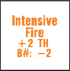

<!-- pdf-page 173 -->

during that Player Turn. Intensive Fire cannot be used during the AFPh except by an Opportunity Firer. A Gun cannot use Intensive Fire until it has already exhausted its normal ROF. A Gun which has Intensive Fired replaces its fire phase counter with an Intensive Fire counter.

**5.61 TO HIT PENALTY:** Any Gun using Intensive Fire must add the +2 DRM of Case F to its Intensive Fire To Hit DR to reflect loss of accuracy.

**5.62 MALFUNCTION:** The B# of any Intensive Firing Gun decreases by two while Intensive Firing (see A.11).

**5.63 RESTRICTIONS:** Certain Guns may not use Intensive Fire in any form (including OVR Prevention or Final Fire; 2.241) and are so restricted by notes on their respective Listing Chart and the back of the counter in the form “No IF”. Case B is applicable to Intensive Fire only as an inherent part of Case C. Loss of Multiple ROF does not cause loss of Intensive Fire capability.

**5.64 OVR PREVENTION:** Regardless of the number of shots a non-vehicular Gun has already taken during a Player Turn (including Intensive Fire), it is entitled to the *possibility* of one more Intensive Fire shot at a target in its own hex if it is about to be OVR *[EXC: OVR Prevention cannot be used by a Gun with a “No IF” listing on the back of its counter; 5.63]*. Immediately after the OVR MP expenditure (D7.1) is announced (but before the OVR is resolved) the Gun makes its To Hit DR vs the vehicle making the OVR, but not until its CA covers the hexside entered by the OVR vehicle. If a Gun has already fired from woods/building/rubble, it is not allowed to change its CA (5.11) and is not eligible for OVR Prevention vs an AFV entering its hex from outside the Gun’s CA. A Gun which has already Intensive Fired during that MPh suffers only one set of Intensive Fire penalties (i.e., the Intensive Fire DRM and B# reductions of the two Intensive Fire shots are not cumulative). The Original To Hit DR of the firing Gun also acts as a NMC vs its own manning Infantry. If the manning Infantry is pinned or broken as a result of that NMC, the To Hit attempt is voided (except for any Gun Malfunction or Low Ammo (D3.71) it may have caused) and the OVR vehicle resolves its OVR. If the NMC is passed by rolling \< the manning Infantry’s Morale Level, the To Hit DR is resolved vs the OVR vehicle and may possibly lessen the OVR attack (D7.11). Regardless of the outcome of the To Hit DR, the Gun is marked with a “No Fire” counter to indicate that it may not fire again during that Player Turn—even if it is about to be OVR again.


###### 5.641

**5.641** A non-vehicular Gun not currently marked by a First/Final/Intensive Fire counter is subject to all the provisions of OVR Prevention when about to be OVR except that its shot is not penalized as Intensive Fire and it is not marked with a “No Fire” counter thereafter.

**5.7 CASE G; DELIBERATE IMMOBILIZATION ATTEMPT:** Often an AFV target’s AF is so formidable that it makes a kill by certain Guns unlikely if not impossible. A player may instead attempt Deliberate Immobilization with his ordnance by adding the +5 To Hit DRM of Case G.

**5.71** Deliberate Immobilization can be attempted only by ordnance, and only if the weapon’s Basic TK# (for the ammunition type it chooses to fire) is \> the target’s lowest hull AF, and only with a hull hit at a range of ≤ six hexes. A Deliberate Immobilization attempt is not allowed against a HD/ immobilized target, or with Indirect Fire or MG/IFE, or when using the Area Target Type. Acquisition DRM are not applicable to a Deliberate Immobilization attempt. However, Acquisition can be gained while attempting such a shot in case the firer subsequently fires on the target normally.

**5.72** A Deliberate Immobilization hit is not resolved on a To Kill Table— even if it otherwise would be considered a CH; if it results in a hull hit, automatic Immobilization results and causes a Crew TC; see D5.5. If it does not result in a hull hit, there is no effect.

**5.8 CASE H; CAPTURED GUN:** Any To Hit attempt by a Captured weapon (or one manned by a non-qualified unit; A21.13) must add the +2 DRM of Case H. If the weapon is both Captured and manned by non-qualified Infantry, the Case H DRM is doubled. A Captured weapon is also penalized by using the red TH# and reducing its B# by two (see A.11 & A21.11-.12).

**5.9 CASE I; BUTTONED UP:** Any BU, CT AFV must add the +1 DRM of Case I to its To Hit DR. Being BU has no other effect on the LOS of a vehicle *[EXC: Night; E1.14]*, even if the target is outside its CA, but prevents Interdiction (A10.532). RST and 1MT AFV must be BU to fire their MA (D1.321-.322). [There are numerous other firer-based To Hit Determination DRM listed elsewhere in the rules; CX (A4.51), Overstack (A5.12), Leadership (A7.531; D3.44), Encircled (A7.7), Spotted Fire (9.3), Bypass TCA change to/through (or coinciding with) side Target Facing (D2.321), and Stun (D5.34).]

## 6. TARGET-BASED HIT DETERMINATION DRM

All Firer and Target To Hit Determination DRM are cumulative except where noted otherwise on each applicable To Hit DRM line.

**6.1 CASE J; MOVING/MOTION VEHICULAR TARGET:** Ordnance firing at a Dashing target (A4.63), or at a vehicle *which has entered a new hex or used VBM (D2.3)* during that Player Turn, or is/was in Motion status during that Player Turn, must add the +2 DRM of Case J to its To Hit DR.

**6.11 CASE J****<sup>1</sup>****; RESTRICTED AIM:** If ordnance Defensive First Fires at a moving (C.8) vehicle which at that point has just expended ≤ three MP in the firer’s continuous LOS, it must add Case J<sup>1</sup> to its To Hit DR. Case J<sup>1</sup> = Case J (+2) plus (+1) = +3.

**6.12 CASE J****<sup>2</sup>****; LIMITED AIM:** If ordnance Defensive First Fires at a moving (C.8) vehicle which at that point has just expended ≤ one MP in the firer’s continuous LOS, it must add Case J<sup>2</sup> to its TH DR. Case J<sup>2</sup> = Case J (+2) plus (+2) = +4. Case J<sup>1</sup> is not applicable to Case J<sup>2</sup>.

**6.13 CASE J****<sup>3</sup>****; FFNAM:** Ordnance using Defensive First Fire vs moving Infantry using Non-Assault Movement must add the -1 DRM of Case J<sup>3</sup> to its TH DR.

**6.14 CASE J****<sup>4</sup>****; FFMO:** Ordnance using Defensive First Fire vs any moving Infantry in Open Ground must add the -1 DRM of Case J<sup>4</sup> to its TH DR.

##### 6.15

**6.15** Cases J<sup>1</sup> and J<sup>2</sup> both deal with a moving (C.8) vehicular target’s expenditure of time in the LOS of a firer since the last hex occupied by that target out of the firer’s LOS. A target that begins its MPh (or a portion thereof while subject to neither Case J<sup>1</sup> nor J<sup>2</sup>) in the firer’s LOS is unaffected by these Cases until it is out of that LOS *after* entering a new Location/vertex; i.e., the target’s being momentarily out of the firer’s view *as* it moves from center-dot/vertex in his LOS to another in his LOS does not constitute leaving his continuous LOS.

##### 6.16

**6.16** A moving vehicle that ends its MPh with MP remaining is assumed to expend all those MP in its present hex (D2.1). However, the subcases of J apply only to Defensive First Fire shots; ordnance firing at a moving vehicle during the DFPh is subject to Case J only.

##### 6.17

**6.17** An ordnance weapon may not Defensive First Fire at the same target in the same Location more times (including the use of Multiple-ROF/ Intensive-Fire) than the number of MF/MP (including Delay MP; D2.17) expended by that target (in its current Target Facing, if an AFV) in that Location (FRD, but a minimum of once per hex). Within this restriction, <!-- pdf-page 174 --> all MF/MP thusly expended by the target in that Location before the firer takes his first shot may (*must*, if engaging in a Gun Duel; 2.2401) be used to minimize the application of Case J<sup>1</sup>/J<sup>2</sup> DRM to that first shot, or (if not engaging in a Gun Duel) may be applied in increments to a series of shots at it.

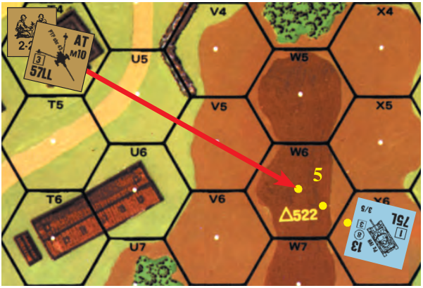

EX: A tank expends five MP to enter 3W6 from X6 and enters the LOS of the AT Gun in T4 for the first time. The tank has expended \> 3 MP in W6 in the AT Gun’s LOS, so the AT Gun can Defensive First Fire on the tank without application of TH case J<sup>1</sup> or J<sup>2</sup>. However, if the AT Gun retains its Multiple ROF and wishes to First Fire on the tank again in W6 before the tank moves farther during that MPh, it can fire only one more time (again using Case J) because the tank has expended only an additional 1<sup>1</sup>/2 MP in its LOS since the 3<sup>1</sup>/2 MP expended (the minimum MP expenditure in LOS to void the application of Cases J<sup>1</sup> and J<sup>2</sup>) before the previous shot.<sup>9</sup> Alternatively, the Russian theoretically could shoot five times (once per MP expended), using Case J<sup>2</sup> for the first shot, Case J<sup>1</sup> for the second and third shots, and Case J for the fourth and fifth shots.

**6.2 CASE K; CONCEALED TARGET:** Ordnance firing at a hidden/ concealed target *[EXC: pillbox/cave occupant; B30.7 and G11.812]* must add the +2 DRM of Case K to its TH DR vs that target *[EXC: when firing SMOKE, Case K applies only if the target hex contains ≥ one non-hidden enemy ground unit but none of those units are Known to the firer/Spotter]*. The effect of a hit that used Case K is not halved as Area Fire.

**6.3 CASE L; POINT BLANK RANGE:** Ordnance *[EXC: non-ATR LATW using its own TH table; 13.]* firing at a range of one or two hexes is considered to be firing at Point Blank Range and adds the -1 DRM of Case L to its TH DR if firing at two-hex range, or the -2 DRM of Case L to its TH DR if firing at one-hex range, unless firing at a Motion/Non-Stopped vehicle or Motorcycle-Rider. Case L is not applicable if using the Area Target Type, firing at a target in the firer’s hex (including Aerial targets), and/or the *firer* is in-Motion/Non-Stopped/Aerial.

**6.4 CASE M; BORE SIGHTED LOCATION:**<sup>10</sup> A Gun, or allowed SW (6.41), firing at a target in a Location it has Bore Sighted may add the -2 DRM of Case M to its TH DR. If Cases M and N both apply, the firer may choose one *or* the other.

##### 6.41

**6.41** Bore Sighting may be used only by a Scenario Defender (see Index). All Guns (including only the MA, and SA [Secondary Armament, as per Chapter H Vehicle Listings], of vehicles *[EXC: not FT or LATW]*) of such a force may be Bore Sighted, but the only SW that can be are MMG, HMG, and light mortars (9.2).

##### 6.42

**6.42** During setup, the Scenario Defender may choose one Bore Sighted Location for each allowed weapon. This Location must be outside the weapon’s own hex, and within both the LOS of the weapon (or its Spotter; 9.3) and its Normal Range (16 hexes maximum). The Bore Sighted Location, the weapon’s and its possessor’s/crew’s ID, and the setup Location must be recorded. In a building hex only the ground-level Location (which includes its Bypass area) may be Bore Sighted.

##### 6.43

**6.43** The Bore Sighting DRM cannot be claimed if the weapon is being fired by other than its original crew/manning-Infantry, but is permanently lost only if the weapon leaves the setup Location, changes Crest/Entrenched position, (un)Hooks, (un)Limbers, (un)Packs, is dm, or its VCA (not just CA) changes.

##### 6.44

**6.44** A MG/IFE non-ordnance attack *[EXC: all forms of Residual FP; A8.2, A9.22]* vs a unit in the firing weapon’s Bore Sighted Location may deduct two from its IFT DR unless using Spraying Fire or taking a Snap Shot *[EXC: vs Infantry, only such an attack conducted as Defensive First Fire (A8.1) qualifies for this -2 DRM].* The -2 Bore Sighting DRM may be used by a FG making such an attack only if *all* elements of that FG have Bore Sighted that same Location. See also E1.71.

**6.5 CASE N; ACQUIRED TARGET:** When a Gun (including the MA and SA [Secondary Armament, as per Chapter H Vehicle Listings], of vehicles *[EXC: not FT or LATW]*) of ≥ 20mm other than a mortar fires at (not Interdicts) a Known unit or a bridge, it may place a <sup>1</sup>/2" -1 Acquired counter on its target (or flip over an already present -1 counter to the -2 side), and this Acquired counter then applies as a TH DRM for subsequent shots by that Gun *[EXC: Acquisition DRM cannot be used for Deliberate Immobilization attempts; (5.71); see also 6.54-.57]*. A target can be acquired by more than one Gun, but no target is subject to more than a -2 Acquisition DRM per Gun. The target remains acquired until the Gun/manning-Infantry that placed it leaves its present Location *[EXC: Gyrostabilizer; 6.55]*—*or* the Gun changes its CA without firing on its already-acquired target during the current phase—*or* the Gun (or its CMG unless in a separate turret) attacks (including in CC, or Interdicts) a different target—*or* the Gun malfunctions or fires SMOKE (6.56), canister or IFE—*or* its crew/manning-Infantry are eliminated or not in Good Order, or they no longer possess it, or they fire Inherent FP/SW or use Interdiction, or they (un)limber/dm it—*or* the target is no longer in their LOS *after* entering a new Location/vertex-(see 6.15) (although in this case the last in- LOS Location occupied by the target will remain acquired; 6.51).


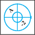

##### 6.51

**6.51** A <sup>1</sup>/2" Acquired-counter DRM gained against a stack cannot be retained on all those units should they scatter and enter different Locations. The firer may retain only one such Acquired counter; he may not create more to cover several targets at once. He may choose which of his previously acquired targets will remain acquired, but need not specify which one until he fires at it or that unit has finished its MPh/APh/RtPh/CCPh- Withdrawal (whichever occurs first). If an acquired target leaves its present Location and thereby goes out of the firer’s LOS (as per 6.15; a free LOS check may be made to ascertain if this occurred), the <sup>1</sup>/2" Acquired counter remains in the last Location that target occupied prior to leaving the acquirer’s LOS. If the firer does not lose that counter as per 6.5, it will still apply should another Known unit occupy that acquired Location. A 1/2" Acquired-counter DRM applies only to all Known units (/bridge) in that target Location, even if only one such unit therein was previously acquired.

**6.52 BRACKETING:** Acquisition DRM gained on one target/Target- Type can be transferred to another target/Target-Type when the firer announces a shot at-that-new-target/using-that-new-Target-Type, provided the target Location (or hex, if using the Area Target Type) remains the same during the transfer **[***EXC: Area Acquisition cannot be transferred to another Target Type and used vs a concealed unit (6.57), nor can a mortar transfer its Area Acquisition to another Target Type at all]*.

```text
             6.521 AREA ACQUISITION: Acquisition
             gained while using the Area Target Type is sym­
◊            bolized by use of a ^5/8" Acquired counter. Area
             Acquisition follows all the principles of ^1/2"
             counter Acquisition except as specified other­
```

wise. An Area Acquired counter applies to *all* non-Aerial units and terrain which are currently in the acquirer’s LOS in that Acquired counter’s *hex*

<!-- pdf-page 175 -->

(unlike a <sup>1</sup>/2" Acquired counter, which cannot apply in more than one Location). Using the Area Target Type, a Gun can fire on a hex not containing a Known enemy unit; Area Acquisition can be gained on that hex, and can be used vs any (even subsequent/unknown) occupants of that hex which are in that firer’s LOS when he fires. An Area Acquired counter cannot track a moving/routing/advancing/Withdrawing unit as per 6.51; the firer would have to re-acquire such a unit each time it enters a new hex. All (even light) mortars use Area Acquisition.

**6.53 MULTIPLE ROF:** Acquisition DRM are gained per consecutive TH attempt unless otherwise prohibited. An Acquisition DRM already earned applies to all TH attempts against the allowed target(s) in that fire phase and any subsequent fire phase, as per 6.5.

##### 6.54 IFE

**6.54 IFE:** A Gun using IFE cannot place an Acquired counter, nor can it use or retain a previously placed one.

**6.55 GYROSTABILIZER:** Only a Stabilized Gun (D11.1) may claim/ retain its Acquisition DRM for Motion/Bounding-*First* Fire TH attempts, and only if it retains its LOS to that target (as per 6.15) during its move. If having Area Acquisition on its target, it must transfer to a <sup>1</sup>/2" Acquired counter before it can use that DRM for Motion/Bounding-*First* Fire (since use of the Area Target Type is NA for such fire; 3.33).

**6.56 SMOKE:** A target cannot be acquired (or Acquisition maintained) by firing SMOKE. However, an existing Acquisition DRM can be used normally to attempt to place SMOKE in the hex.

**6.57 CONCEALED:** A concealed target becomes acquired only if using the Area Target Type—or, when using the Vehicle or Infantry Target Type, if the acquiring shot causes the loss of that concealment.

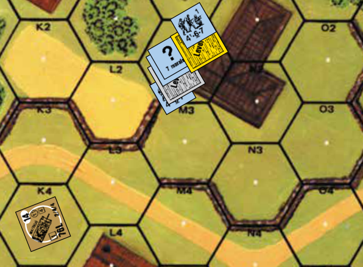

6.57 EX: The tank in 3K4 wishes to Final Fire at M2, each level of which contains a squad (with the one on Level 1 concealed). Using the Infantry Target Type, the tank can fire at either Level 1 or Level 2 of the building; barring malfunction, it will gain Acquisition on Level 2 if it fires at that squad—but if it fires at the squad on Level 1 it can acquire it only if it achieves a “PTC” or better result on the IFT. Alternatively, it can use the Area Target Type to fire at (and acquire) both Levels 1 and 2. In neither case however, can it affect the squad at Level 0 (except via rubble), which is out of its LOS. The tank uses the Area Target Type to fire (and thus has no Multiple ROF; 3.33), so a -1 Area Acquired counter is placed above the Level 1 counter. Assuming the situation remains unchanged through the beginning of its PFPh, the tank can now fire again on the Area Target Type at M2 with the -1 Acquisition DRM, or it can transfer that DRM to a <sup>1</sup>/2" Acquired counter and use it with the Infantry Target Type to fire at level 2. It cannot transfer the DRM to use with the Infantry Target Type to fire at Level 1 if the squad on Level 1 is still concealed; if it fires at this squad, its prior Acquisition is lost (6.52). If the tank has a Stabilized Gun, it can forego attacking in the PFPh and instead move to L3, where it can use Bounding First Fire to attack one level of M2. It will retain its Acquisition DRM for this attack, but must transfer it to the Infantry Target Type (using a <sup>1</sup>/2" Acquired counter) when it announces the attack (6.55). It cannot use (and will lose) its Acquisition DRM if it attacks the concealed squad on Level 1—but it *can* attack the unconcealed squad on Level 0 using its Acquisition DRM, because it had Area Acquisition in that *hex* when this squad came into the tank’s LOS (6.52). Now assume that instead of firing during Final Fire, the M4/76 fired on the Area Target Type during its Defensive First Fire when the squad shown on Level 2 of M2 originally entered that Location. Both Levels 1 and 2 would be acquired, and this DRM would still apply at both levels if that squad then descended to Level 1 (or if the squad at Level 0 ascended to Level 1) and the tank fired again on the Area Target Type. However, if the squad moved from Level 2 of M2 into N2 it would no longer be acquired, nor could the tank transfer its Area Acquired counter to a <sup>1</sup>/2" Acquired counter to track that squad into N2. If instead the tank had fired on the Infantry Target Type to attack the 4-6-7 when it entered Level 2 of M2, it would have gained a -1 <sup>1</sup>/2" Acquisition counter which would follow the squad when it moves to Level 2 of N2; when the squad moves to Level 2 of N1, the <sup>1</sup>/2" Acquisition counter would stay at Level 2 of N2. If the tank then used Area Target Type vs hex N2, it could transfer the Acquisition DRM and replace the <sup>1</sup>/2" Acquisition counter with a <sup>5</sup>/8" Acquisition counter.

**6.58** Each Acquired counter contains a letter to match it with the Gun it applies to. Acquired counters are provided in several different colors so that different types of Guns with the same ID letter can be kept track of at one time.<sup>11</sup> EX: A PzKpfw VG (ID letter C) fires on an Infantry target using the Area Target Type during his PFPh and places a <sup>5</sup>/8" -1C Area Acquired counter on the target. The tank fires on the same target in the same hex during his DFPh using the Area Target Type, but this time uses the -1 To Hit DRM for an acquired target. The Area Acquired counter is flipped over to its -2C side. The tank attacks the same target in his next PFPh again in the same hex but this time switches to the Infantry Target Type. The PzKpfw VG still gets the -2 Acquisition DRM for this attack, but switches to a <sup>1</sup>/2" -2C Acquired counter.

**6.6 CASE O; HAZARDOUS MOVEMENT:** Ordnance firing at a target engaged in Hazardous Movement must add the -2 DRM of Case O to its TH DR. Case O cannot be used with Case J/its-subcases.

**6.7 CASE P; TARGET SIZE:** All vehicles (D1.7) and Guns (2.271) are rated for size, based on their height and bulk. Ordnance firing on such a target *[EXC: units in a pillbox (B30.32) or in a cave (G11.83)]* must add the applicable Target Size DRM of that target (ranging from -2 to +2 as depicted on the counter) to its TH DR (see 11.2 and A12.2).

**6.8 CASE Q; TEM:** TEM<sup>12</sup> applicable to the target must be added as a DRM to the TH DR of a shot taken on the Vehicle or Infantry Target Type or on a LATW TH Table *[EXC: BAZ firing WP; HD (D4.2)]*. Case Q does not apply to an Area Target Type TH DR (see 3.331).

**6.9 CASE R; HINDRANCE:** Each applicable Hindrance DRM must be added directly to the TH DR of any shot. Such application would not apply to the effects of any hit thus obtained (see C.3). [There are numerous other Target-Based Hit Determination DRM listed elsewhere in these rules; vs Overstacked Personnel (A5.131), vs Cavalry (A13.5), vs mounted motorcyclist (D15.5).]

## 7. TO KILL TABLES

#### 7.1

**7.1** A hit scored on a vehicle while using a LATW TH Table or the Vehicle Target Type is resolved on the applicable To Kill (TK) Table (7.31-.34). There are four different TK Tables; each is consulted only to resolve hits using its particular ammunition type. Each TK Table lists a Basic TK# for each weapon capable of using that type of ammunition.<sup>13</sup>

**7.11 TK#DERIVATION:** The *Basic TK#* of an ordnance hit vs a vehicle *[EXC: via the Area Target Type]* is found by consulting the TK Table used for that ammunition type to find the TK# listed under that Gun Caliber and Length. This Basic TK# is then increased/decreased by all applicable TK modifications (Cases A-D) to reach a *Modified TK#*. Lastly, the *Final*

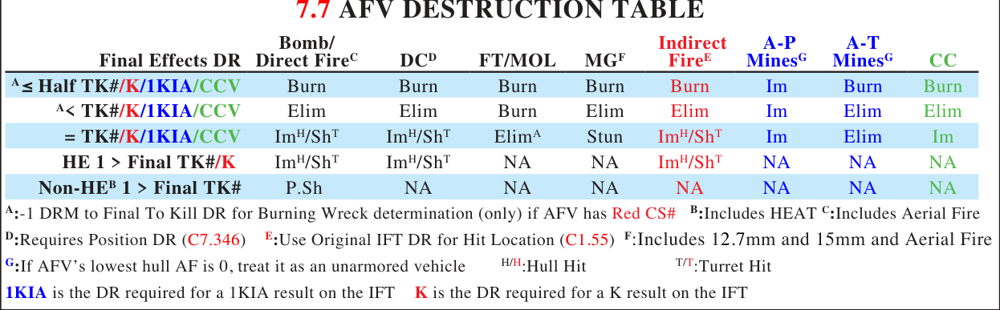

<!-- pdf-page 176 -->

*TK#* is derived by subtracting from the Modified TK# the Armor Factor (AF; D1.6) of that portion of the AFV which was hit. The AF is not used to modify the TK# of an unarmored vehicle or a Partially Armored AFV hit in an unarmored Target Facing/Aspect (3.9). The Final TK# is the DR total that the firer must roll \< in order to guarantee elimination of the vehicle. An AFV hit in an unarmored Target Facing/Aspect by ordnance is treated as an unarmored vehicle, including use of the appropriate Unarmored Vehicle TK# *[EXC: an Area Target Type hit; 3.332]*.

**7.12 AERIAL AF:** The Aerial AF is listed on the C7.11 AF Table and is used instead of the normal AF if an AFV is hit by an aircraft attack, an optimally positioned DC (7.346), or in its Underbelly (D4.3). Such an attack uses the Aerial AF listed beneath the AFV’s worst AF (either hull or turret—regardless of the “location” of the hit)—even if attacked through the vehicle’s front Target Facing. EX: The worst AF of a Russian T-50 is “3”, so that tankette’s Aerial AF is “2”.

**7.2 MODIFIED TK#:** Four modifications of the Basic TK# are possible:

**7.21 CASE A; AFV REAR TARGET FACING:** The Basic TK# vs an AFV hit (or attacked by FT/DC/MOL) in its armored rear Target Facing is always increased by one. All aircraft hits vs an armored Target Facing/ Aspect (3.9) qualify for the rear Target Facing modification. Otherwise, normal Target Facing rules apply.

**7.22 CASE B; AERIAL/DC/MOL ELEVATION ADVANTAGE vs AFV:** The Basic To Kill number of an aircraft hit vs an armored Target Facing/Aspect (3.9) is further increased by one (or by two if the AFV is Open Topped). The Basic To Kill number of a MOL attack vs an AFV is also increased thusly if the attacker has at least a one level elevation advantage. Case B also applies to the Position DR (but not the To Kill DR) of a DC vs an AFV if the DC is Placed/Thrown from at least a one level elevation advantage.

**7.23 CASE C; AFV CH:** Whenever an AFV is struck by a non-Area Target Type Direct Fire CH, the Basic TK# is doubled prior to the application of any To Kill modifications. See 3.72 for Area Target Type and Indirect Fire CH.

**7.24 CASE D; RANGE EFFECTS VS AFV:** The penetration capability of an AP/APCR/APDS shell decreases as the range increases. The Basic TK# of any non-aerial hit vs an armored Target Facing on the AP or APCR/APDS To Kill Tables is modified according to the range charts on those tables. Range has no effect on the Basic TK# of a HEAT or HE hit, nor vs an unarmored target. See 7.344 for Range effects on FT use. EX: A 50L AT Gun fires at the rear Target Facing of a KV-1E tank at 25 hexes, resulting in a hull hit. The Basic TK# is 13. Case A (+1) and Case D (-2) of the To Kill Modifiers apply, yielding a Modified TK# of 12. The AF of the KV-1E’s rear hull armor is 8, which is subtracted from 12, yielding a Final TK# of 4.

EX: A LMG at Level 2 fires at the rear Target Facing of an adjacent PzKpfw IIA, resulting in a hull hit. The Base TK # is 4. Case A (+1) and Case D (+2) of the To Kill Modifiers apply, but not Case B, yielding a Modified TK # of 7. The AF of the PzKpfw IIA’s rear hull armor is 1, yielding a Final TK # of 6.

**7.3** Each of the four To Kill Tables has unique features not found on the others.

**7.31 AP TO KILL TABLE:** Several Gun Caliber/Length types are listed more than once and in different locations, seemingly resulting in two Basic TK# for the same weapon. However, such dual weapon listings are color coded for identification purposes. For example, Russian 76L AFV armament has a Basic TK# of 13 (found under the brown 76L listing), not 17 as is found under the other listing of 76L armament. Similarly, the red ATR listing with a Basic TK# of 6 is used with the Russian ATR and the Finnish, Japanese, Italian, and Dutch 20L ATRs, while the ATR used by other nationalities has a Basic TK# of 5.

**7.311 vs UNARMORED:** Barrel Length, range, and AF have no effect on the TK# of a hit vs an unarmored vehicle; in this case the Basic TK# of each basic Gun Caliber Size also serves as the Final TK#.<sup>14</sup>

**7.32 APCR/APDS TO KILL TABLE:** The German 28LL and 40LL always use the APCR To Kill Table (unless firing HE), since the range characteristics of their projectile (APCNR—Armor Piercing Composite Non-Rigid) were more akin to that of APCR.

**7.321** The Final TK# for an unarmored vehicle hit by APCR/APDS is equal to that listed on the AP To Kill Table for unarmored vehicles.

**7.33 HEAT TO KILL TABLE:** Barrel lengths have been omitted on the Gun Caliber listings since the Basic TK# listed applies to any Gun of that caliber which can use HEAT (as indicated by the H# on the counter).

**7.331** Any unarmored vehicle hit by HEAT has a Final TK# of 11.

**7.332** There is no Case D (Range) modification to the Basic TK# on the HEAT To Kill Table.

**7.34 HE TO KILL TABLE:** Barrel Length and specific Gun Caliber Sizes are not listed on the HE To Kill Table. The firer simply uses the highest Gun Caliber listing that does not exceed the caliber of the fired Gun. For example, a 76L Gun firing HE has a Basic TK# of 7 or 12, as listed in the “70+” column. OBA and Area Target Type fire is resolved on the IFT as per 1.55.

###### 7.341

**7.341** There is no Case D (Range) Modification to the TK# on the HE Table.

###### 7.342

**7.342** The HE TK# listed for unarmored targets is the Final TK#.

<!-- pdf-page 177 -->

###### 7.343

**7.343** HE rounds also generate a greater likelihood of a Shock/Unconfirmed Kill (7.41) and Immobilization (7.5).

###### 7.344 FT/MOL

**7.344 FT/MOL:** No AF apply to a FT/MOL attack. The Basic TK# of both FT and MOL attacks are increased by +1 if the AFV is CE, or by +2 if the AFV is OT (both modifiers can apply only to a FT attack; MOL attacks can be modified by only one or the other). To Kill Modification Cases C and D are NA to FT/MOL. However, the Basic TK# of a FT is halved if it is firing at Long Range. Other factors (e.g., “?”/CX/SMOKE/ Hindrance/TEM/AFPh-use) do not modify the Basic TK#.

**7.345 MORTARS:** Mortar fire, being indirect in trajectory, is always resolved on the IFT (1.55) and therefore never uses the HE (or any other) To Kill Table.

###### 7.346 DC

**7.346 DC:** The resolution of a Placed/Thrown DC attack vs an armored target (A23.5) requires a Position DR to determine the AF to be applied. The DC Position DR also serves as the hit location DR (3.9). If placed through an unarmored target facing, make an IFT (rather than a To Kill) DR vs the vehicle as if it were unarmored (A7.308). Any Collateral Attack(s) thus obtained by a Final Position DR ≥ 9 (and therefore prior to a To Kill DR) must use a new DR.

```text
DC POSITION DR       Result
        ≤ 5          Optimally Positioned; Use Aerial AF
        6-8          Successfully Positioned; Use AF
        9-11         Poorly Positioned; No Effect vs AFV *
       ≥ 12          No Effect vs AFV or its PRC @
```

\* Resolve vs target’s vulnerable PRC as a Specific Collateral Attack. @ Resolve only vs other unarmored units in AFV’s Location, and as an Area Fire attack (as well as vs any in Thrower’s Location; A23.6).

```text
DC POSITION DRM:
 +2     Non-Stopped or Motion or concealed AFV Target
 +2     Thrown DC (+3 if Thrown from Motion/Non-Stopped conveyance)
 +1     Placed/Thrown through hull front Target Facing
 +1     AFV target is CE
 +1     Thrown in AFPh (unless by Opportunity Firer)
 +1     CX
 -1     Placed/Thrown through hull rear Target Facing
 -1 or -2 * To Kill Modification Case B (as applicable)
 -2     Immobile or OT AFV target (each)
 -2     Vehicle target is in Bypass in same hex as Placing/Throwing unit
```

\* The Case B To Kill Modification applies inversely to the Position DR, rather than modifying the Basic TK#.

**7.35 DUD:** Any Original TK DR of 12 (regardless of ammunition or Target Type) has no effect.<sup>15</sup>

**7.4 SHOCK/UNCONFIRMED KILL (UK):** A hit which fails to penetrate armor can still have devastating effects on the inside of the vehicle.<sup>16</sup>

**7.41 OCCURRENCE:** A Shock *possibility* occurs whenever a non-MG, non-HE To Kill DR is one \> the Final TK# of an AFV. Such an AFV must take a NTC, failure of which results in placement of a Shock counter on the AFV. An *automatic* Shock is caused by an HE turret hit or FFE/DC effect DR one \> the Final TK#/K IFT result number, or on a turret hit TK# equal to the Final TK#/K IFT result on Direct, Indirect, and DC attacks; no TC is necessary (see 7.7 AFV Destruction Table).

**7.42 EFFECT:** The crew and passengers of a shocked AFV are incapable of any action. If CE, they must immediately BU and are not subject to any Collateral Attack; however, any Vulnerable Riders may be, as per D.8 and may unload in their MPh (D6.5). A shocked AFV may not move (even to pivot or change TCA), Interdict, or attack (even in CC). No MP expenditure is necessary to bring the shocked AFV to an automatic halt. However, any ensuing First Fire or DFPh attacks vs a shocked AFV that had entered a new hex during that Player Turn are still subject to applicable To Hit DRM cases. At the end of the next RPh the AFV must roll for recuperation (∆), even if already Abandoned before being hit. On a dr of 1 or 2, the Shock counter is removed; on a dr of 3-6 it is flipped over to its UK side. An AFV under an UK counter is still shocked, and must end its next RPh by rolling again for recuperation. On a dr of 1-3, the UK counter is removed; on a dr of 4-6 the AFV is flipped over to its wreck side with no DR for Crew Survival. A shocked AFV which is hit by another Shock result must flip its UK counter back to the Shock side; if already on the Shock side there is no additional effect.


**7.5 IMMOBILIZATION:** A Final To Kill DR equal to the Final TK# of any AFV struck by a hull hit results in Immobilization of that AFV regardless of Target Facing *[EXC: HD to firer; D4.2]*. A Final HE/DC To Kill DR one \> the Final TK# of a hull hit or an Indirect Fire attack resulting in a K/# vs the hull on the IFT also results in Immobilization of the AFV. Such Immobilization causes an automatic Crew TC (D5.5). A FT/MOL/MG/IFE attack never results in Immobilization. A FT/MOL To Kill DR equal to the Final TK# of an AFV eliminates the AFV but does not turn it into a burning wreck and therefore allows a Crew Survival DR.

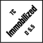

**7.6 BURNING WRECK:** Any Final To Kill DR ≤ half of the Final TK# of a vehicle target turns that vehicle into a burning wreck by placing a Blaze counter on top of the resulting wreck (B25.14). The PRC of any vehicle which becomes a burning wreck are eliminated with no chance to roll for survival, but there is no direct effect on other Infantry in the hex. All vehicles eliminated by a FT/MOL attack DR \< its To Kill Number are automatically burning wrecks.

**7.7 AFV DESTRUCTION TABLE:** Rules 7.4-.6 are based on a TK# for the target AFV and therefore do not apply to any combat resolution not resolved on one of the To Kill Tables. However, Immobilization, Shock, burning vehicles, and other results can still occur via other forms of attack, but only by the rules specified for those forms of attack; these results are summarized on the AFV Destruction Table. On this Table, HEAT = “Non-HE”, and a Dud always takes precedence over any result shown. (See AFV Destruction Table at the top of page C15)

## 8. SPECIAL AMMUNITION

[The use of Special Ammunition Depletion rules requires that players maintain a written side record of the current capabilities of each Gun in play. The following information is not meant to be all inclusive, but rather is supplemental in nature; the game effects of these ammunition types are in some cases described elsewhere.<sup>17</sup>]

**8.1 AMMUNITION DEPLETION:** A Gun/SW capable of firing Special Ammunition must announce its intention to do so prior to rolling that To Hit DR. The Ammunition Depletion rules (8.9) then govern the effects of the To Hit DR. Weapons with a Multiple ROF may choose a different type of ammunition for each shot.

##### 8.11 APCR

**8.11 APCR****<sup>18</sup> (A)/APDS****<sup>19</sup> (D):** The availability of APCR, APDS, and certain other munitions varies with the time frame of the scenario (as per the Ammunition Supply Chart for APCR/APDS) and is listed on the back of each applicable counter (8.9).

**8.12 AMMUNITION SUPPLY CHART:** Some Guns/AFV have a different Depletion Number printed on their counter, which applies to that

<!-- pdf-page 178 -->

Gun/AFV. U.S. ordnance includes Guns in British/Commonwealth service, while British ordnance includes Guns in Commonwealth service. A parenthesized month indicates the start of availability in that year.

```text
Nationality/Date& Gun Size   1941 1942 1943   1944  1945
GERMAN:    50L                A5   A6   A5    A4     —
           37L, 47L, 50, 88L  A4   A5   A4    A3     —
           75L, 76L           —    A5   A4    A3     —
AMERICAN: 76L                 —    —    —   A4(Aug)  A5
           90L                —    —    —      —     A5
RUSSIAN:   45L, 45LL, 76L, 76LL  — A4   A5    A6     A7
           57LL, 85L          —    —    A4    A5     A6
BRITISH:   57L                —    —    —   D6(Jun)  D7
           76LL               —    —    —   D5(Sep)  D6
```

**8.2 ELITE:** Increase the Depletion Number of an armed-vehicle/weapon by one for Elite forces. An armed-vehicle/weapon in a printed scenario is Elite for this purpose if so specified by an SSR or if the historical formation to which it belongs is either SS or Russian Guards. For DYO scenarios a force is considered Elite only if the Majority Squad Type of its side’s total OB is Elite.

#### 8.3 HEAT

**8.3 HEAT (H):** HEAT<sup>20</sup> is available to the Germans starting in May 1942, and to the U.S., Britain, and Russia starting in 1943. SCW also fire HEAT, but without use of a Depletion Number (availability of rounds has been factored into their X#). SCW HEAT has the same effects as other HEAT rounds.

**8.31 HE EQUIVALENCY:** The explosive force of HEAT was considerable and, although less than HE, could still have a devastating effect on exposed personnel. Therefore, all HEAT ammunition (whether used by SCW or ordnance) has an HE Equivalency FP which is used against Personnel targets or for Collateral Attack and rubble/fire determination purposes. HEAT may only be fired at a vehicle or Gun, or at Infantry/Cavalry receiving a wall/building/rubble/pillbox TEM. AP is also given HE Equivalency for normal A-P use, as well as for Collateral Attacks. However, AP/APCR/APDS/ATR attacks never leave Residual FP.<sup>21</sup>

```text
AP^1               HEAT
                    BAZ/  PSK/PFk^4/
< 37mm^2  ≥ 37mm    PIAT    H#[9]^3 ^4  PF^4  Other Ordnance
    1        2       8        12       16  Use IFT column
                                           to the left of Gun’s
                                           normal HE FP
 1: No AP-type attack can leave Residual FP. ATR can use AP HE Equiva-
   lency only if it is 20mm.
```

**2**: Includes all APCR/APDS/ATR, but not MG (including 12.7 and 15mm).

**3**: As used by German 37mm AT and AA Guns.

**4**: PF/PFk/H#[9] cannot leave Residual FP.

**8.4 CANISTER (C):** Canister<sup>22</sup> is ineffective vs armored targets (but not their Vulnerable PRC). A To Hit DR is not required for Canister, but if the AFV is using Bounding (First) Fire and/or is in-Motion/Non-Stopped (or if Infantry move to and man a Gun during the MPh and then fire Canister in the AFPh), or Intensive Fire is used, or the attack is against HIP/“?” units, the FP of the Canister is halved as Area Fire (or quartered if both Motion and Bounding Fire penalties apply). Canister is resolved on the IFT using its FP and adding any applicable DRM for TEM, LOS Hindrance, and/or hexspine changes in the CA. See the table below for the correct FP value of each Canister type. The IFT DR also serves as the Ammo Depletion, armament breakdown, and ROF checks usually resolved with the To Hit DR. If the Canister Depletion Number has been exceeded, 8.9 applies. Canister is fired at a common vertex and elevation shared by three hexes which is two hexsides distant (excluding the firing hex) and, barring obstacles in the first hex of the cluster, affects all occupants of all hexes per A7.4 at that elevation (and in the firer’s LOS) although LOS Hindrances and the individual TEM of each Location may vary the results in each hex. LOS to the vertex aiming point is not required. If the firer has LOS to both the vertex aiming point and a Known enemy unit in one of the three hexes, then (only) vulnerable units in the other two Locations which are out of LOS due solely to SMOKE/LV Hindrances or NVR are attacked with halved FP (halved again if they are HIP/“?”, etc.). Instead of firing at a vertex, Canister can also be used to fire at any three contiguous levels of a building hex by firing at the middle level, provided it is two hexes away.

```text
Canister FP IFT Equivalency Table
     Gun Size IFT FP
     37mm       12
     75mm       20
     105mm      24
```

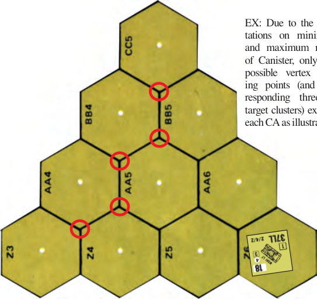

##### 8.41

**8.41** Canister has no effect on units in the firer’s hex, but if firing at a same-level target, it attacks units in the hex adjacent to the firer along the LOS as Area Fire with no doubling for PBF. If the LOS in the adjacent hex is traced exactly along a hexside, the fire affects both adjacent hexes but is quartered instead of halved.

##### 8.42

**8.42** Canister cannot be used to rubble a building, set a Fire, or clear Wire. A Canister KIA result has the same chance of destroying a SW in the hex as an HE KIA result.

**8.5 SMOKE (s):** Smoke<sup>23</sup> may be placed by ordnance/OBA only at the *start* of the owner’s PFPh/DFPh. Once any unit fires anything other than SMOKE during that PFPh/DFPh, no SMOKE may be fired during that PFPh/DFPh. Smoke is treated as a two level Hindrance to LOS and does not Hinder firing, Observing, or Spotting occurring above that elevation; smoke from both artillery and smoke grenades falls into this category. SMOKE does not block LOS *[EXC: B.10]*; it only Hinders it. See A24 for further effects of SMOKE.

##### 8.51

**8.51** Due to the timed effects of smoke rounds, such ammunition may be fired with full effect by Ordnance/OBA only in the PFPh, prior to all other non-smoke placement Prep Fire. Such smoke fired in any other phase is placed as white Dispersed smoke.<sup>24</sup>

##### 8.52

**8.52** SMOKE ammunition is always placed at ground level in any target hex which is hit on the Area Target Type, except Interior Building hexes, <!-- pdf-page 179 --> even if the only visible part of that hex is the upper level of a building. A Gun cannot place SMOKE in its own hex, although some AFV may place smoke in their own hex without their Gun (D13).

**8.6 WHITE PHOSPHORUS (WP):**<sup>25</sup> Unlike Smoke, WP may be fired by ordnance during (but prior to any friendly unit firing anything other than SMOKE) any friendly fire phase—not just the PFPh/DFPh—although placement in other than the PFPh results in Dispersed WP (see A24.5). See 1.71 and A24.31-.32 for further effects.

**8.7 ILLUMINATING ROUNDS (IR):** Many Indirect Fire weapons were capable of firing carrier rounds containing flares on parachutes for illuminating the battlefield. These weapons do not have a Depletion Number for IR, the use of which is described in E1.93.

**8.8 AP/HE LIMITED STOWAGE:** Due to their specialized role, some AFV types carried limited amounts of AP or HE ammunition, because it was deemed more expedient to carry more rounds of AP for use vs armored targets (Tank Destroyers), or HE for use vs non-armored targets (Assault Guns). Such AFV types have a Depletion Number (in the form “AP#” or “HE#”) listed on the back of their counter for usage of the ammunition type in limited supply.

**8.9 DEPLETION NUMBERS:** The number following each special ammunition symbol is a Depletion Number which defines its availability to the firer. This Depletion Number is applicable if the firer announces his intention to use Special Ammunition prior to a To Hit DR. If that Original To Hit DR is \< the Depletion Number, the firer uses that ammunition to resolve the effect of any hit it achieved with that DR. If that Original To Hit DR equals the Depletion Number, the firer uses that ammunition to resolve the effect of any hit it achieved with that DR, but the firer runs out of that Special Ammunition in the process and may not use it again for the remainder of the scenario. If that Original To Hit DR is \> the Depletion Number, the firer had no such ammunition and is considered not to have fired yet for any purpose unless Gun Malfunction or Low Ammo (D3.71) occurs. The firer is free to fire again (unless it malfunctioned) with other ammunition at the same or different target with a new To Hit DR or refrain from firing altogether and instead move. The Gun may not use that special ammunition again in that scenario. Depletion Numbers do not apply to OBA or Vehicular Smoke Dispensers.

##### 8.91

**8.91** If more than one Depletion Number is listed on a counter for a Gun’s particular Ammunition type, the first number is for the first year of availability, and the exponent following it is the last digit of that year; the next number is for the next year of availability, and so on. EX: The T34-85 has an APCR rating of A5<sup>4</sup>/6<sup>5</sup>, so its Depletion Number is 5 in any scenario taking place in 1944, and 6 in any scenario taking place in 1945.

**8.92** Intensive Fire does not change Depletion Numbers.

## 9. MORTARS

**9.1** Mortars are Direct Fire ordnance but are treated as Indirect Fire weapons for fire resolution purposes; i.e., although they must make To Hit DR, the IFT effects of those hits are resolved using Indirect Fire principles and modifiers. Due to their high trajectory, mortars always use the Area Target Type (3.33) and consequently never use the To Kill Tables to resolve any hits vs vehicles. Instead, Indirect Fire hits vs vehicles are resolved on the IFT as per 1.55. Mortar Fire is never resolved as Direct Fire—even if the mortar is in LOS of the target. See 9.2 and 10.1 for special movement capabilities allowed to 76-107mm mortars.

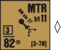

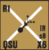

**9.2 LIGHT MORTARS:** A mortar is classified as either a Gun or a SW depending on size. Any mortar ≤ 60mm is a light mortar and is treated as a SW be­

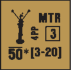

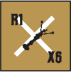

cause it is on a <sup>1</sup>/2" counter. As a SW, a light mortar has no CA and thus does not have to suffer To Hit DRM for fire outside its CA. A light mortar can be fired by any squad/HS like a normal SW with no detriment (i.e., it does not require a crew to be fired with full efficiency) and normal leadership To Hit modification. Should a lone SMC fire a light mortar, it loses its Multiple ROF. Otherwise, use of a light mortar is as specified on the SW Chart. Even though a light mortar is a SW, it can use Area Target Acquisition (6.521), losing it as if a Gun. A 76-82mm mortar can be dismantled (A9.8) and is then represented by a <sup>1</sup>/2" counter in its dm state, which allows it to be portaged as a five PP SW rather than being subject to normal Gun Movement rules.

**9.3 SPOTTERS:** A mortar is the only on-board weapon which may be fired against a target which is not in its LOS. One Good Order Personnel unit in the same or an adjacent hex to a mortar (regardless of vertical level distance and LOS) can be a Spotter (∆) for any mortar(s) in one hex (be it the same or an adjacent hex), provided they all fire on the same target. Otherwise, each mortar must have its own Spotter. Spotting is considered the equivalent of using a SW for purposes of movement curtailment and inherent FP loss; the Spotter must be predesignated by the owning player during his PFPh/DFPh and marked with an appropriate fire counter for having used a SW during that phase. If the Spotter is hidden, it must be recorded as a Spotter. As long as the Spotter remains in Good Order, the adjacent mortar(s) may fire on any target in the Spotter’s LOS. Any LOS Hindrance DRM that affects the Spotter’s LOS (or the crew in the absence of a Spotter) is applied to the mortar’s To Hit DR. A pinned Spotter in effect pins the mortar crew for attacks Spotted by that Spotter. A new Spotter may not be designated until the original Spotter is eliminated, broken, or captured—and not until the start of the owner’s MPh following such a loss of the original Spotter *[EXC: if a Spotting squad is Reduced, its surviving Good Order HS retains Spotting ability. A mortar cannot be designated for Opportunity Fire if it has no Spotter (9.3) and its intended target is out of its LOS. A mortar designated for Opportunity Fire but not able to fire in the AFPh due to no Spotter and no target in its LOS must still roll for breakdown purposes (as per A6.11)]*.

**9.31 SPOTTED FIRE:** Spotted fire is not as effective as fire which is actually observed by the men manning the mortar. Spotted fire is subject to a +2 To Hit DRM and a reduction of the mortar’s Multiple ROF by one. If the mortar has no Multiple ROF the latter penalty does not apply. EX: A leader stacked with a Spotter may not modify a mortar’s To Hit DR, but one stacked with another unit firing a SW mortar may modify one mortar’s To Hit DR. A unit may Spot for more than one mortar in a Player Turn only if the mortars are all in the same Location and firing at the same target. A squad may attack with its inherent FP and spot for ≥ 1 mortar but will lose any acquisition gained with the mortars when it does so attack.

**9.4 MINIMUM RANGE:** Mortars are unique in that they may not fire at targets closer than their minimum range, as printed on their counter in brackets in the form “[#-#]” with the first number being its minimum range and the second number its maximum range.

#### 9.5 CH

**9.5 CH:** A mortar generates a CH only on an Original To Hit DR of 2 (as per 3.7). However, instead of halving the FP of a mortar for a hit on the Area Target Type, that fire is instead doubled for a CH and further modified as per 3.71-.72. EX: A 76mm mortar fires at a target hex 18 hexes away containing a stationary CE PzKpfw IVF2 tank and a broken 4-6-7 Infantry squad in Open Ground. The Modified TH# is 7, but because the LOS to the target hex from the crew (which is doing its own spotting) is Hindered by a wreck and a brush hex there is a +2 DRM to the To Hit DR. The Original To Hit DR is a 2, thus resulting in a CH. Random Selection determines that the CH occurred vs the tank; therefore the FP of the mortar is doubled to 24 vs the tank, resulting in a kill on an IFT DR ≤ 4, or an Immobilization or Shock result (depending on location of the hit) on an IFT DR of 5 or 6. The IFT DR is a 6 (colored 2, white 4) resulting in Shock. The 6 DR is also used vs the broken 4-6-7 but, because there was no CH vs the squad, the 6 FP column is used (Area Target Type fire is halved; 3.74) and a +1 TEM is added for the AFV, resulting in a NMC.<!-- pdf-page 180 --> 

## 10. GUN & AMMO MOVEMENT

**10.1 TOWING:** A vehicle allowed to tow a Gun has a Towing Number printed on its counter in the form “T#”. A vehicle’s T# must be ≤ a Gun’s M# (see 10.3) in order for that vehicle to be able to tow that Gun. A vehicle towing a Gun pays one extra MP (MF for wagons) per hex entered (added after all other modifications to the MP/MF cost). No vehicle may tow a Gun over a wall or hedge or into a building/rubble. A Gun may not fire while in tow (i.e., while “hooked up”). A vehicle may not use Reverse or Bypass Movement *[EXC: Narrow Streets; B31.124]* or enter a Deep Stream while towing a Gun. *[EXC: The +1 per hex MP/MF cost, as well as the Reverse/Bypass/wall/hedge/rubble/stream towing restrictions, do not apply to the vehicular transport of a <sup>5</sup>**/8" 76-107mm MTR counter; however, all other rules pertinent to Gun towing/pushing do apply to these MTR when they are not dm and they may only be unloaded by a Passenger on the same vehicle.]*<sup>26</sup> When a vehicle with a Gun in tow is destroyed, so is the Gun. A Gun in tow cannot be targeted separately from its vehicle.

**10.11 HOOKING UP:** A Stopped vehicle not in Bypass may hook up a Gun (if the vehicle’s T# ≤ the Gun’s M#) by spending half (FRU) of its MP/MF allotment *[EXC: if the Gun’s M# is circled (e.g., M 6 ), the vehicle must expend two-thirds (FRU) of its MP/MF allotment]* in that Gun’s hex (in addition to any required MP/MF cost to enter the hex), provided a crew (as per 10.111) is on foot in that hex. This expenditure does not itself qualify that vehicle as a moving target, but does allow Defensive First Fire opportunities against it (that Gun shares its target status and is destroyed or missed depending on the fate of the vehicle). That Gun is then placed on top of that vehicle to indicate that it is in tow. Neither that Gun, its crew, nor that vehicle/its PRC can fire during that PFPh/MPh and all are TI for the rest of that Player Turn. That crew may also load into that towing vehicle at no extra MP/MF cost as it hooks up that Gun, but if it expends \> half its MF allotment in pushing/entering that Gun’s hex, that Gun cannot then be hooked up by that unit in that MPh. A non-QSU Gun (10.23) must first be limbered (10.21) before it can be hooked up. See 10.31 for pushing and hooking up a Gun in the same MPh.

###### 10.111

**10.111** A crew must be in Good Order and unpinned in order to (un)hook/ (un)limber/push a Gun it possesses. See D5.43 for attack effects while (un) hooking. A HS (even if inherent in a squad) equals a crew for such purposes, but it takes five SMC to equal a crew for such purposes.

**10.12 UNHOOKING:** A Stopped vehicle not in Bypass may unhook a Gun only by spending half (FRU) of its MP/MF allotment *[EXC: if the Gun’s M# is circled (e.g., M 6 ), the vehicle must expend two-thirds (FRU) of its MP/MF allotment]* under the otherwise same conditions as were necessary for hooking up (10.11). That Gun’s crew may disembark from that vehicle at no extra MP/MF cost as part of that unhooking procedure, but that crew and Gun must remain TI in that hex *[EXC: that vehicle may expend its remaining MP/MF]*. After being unhooked, certain Guns must still be unlimbered (10.21) before they can be fired. Neither the crew nor the vehicle/PRC may fire during that PFPh/MPh prior to unhooking. A Gun’s CA may be changed simultaneously as it is (un)hooked.

**10.13 AMMO PP REDUCTION:** The usable Passenger PP capacity of a vehicle with a hooked up Gun (or a dm 76-82mm mortar) is considered reduced by four PP—or by eight PP if the Gun being towed is ≥ 100mm— due to the bulk of the ammunition. If this reduces an *empty* vehicle’s PP to ≤ 0, no extra penalty is incurred beyond the loss of its entire Passenger PP capacity; i.e., an empty vehicle whose T# is ≤ a Gun’s M# can still tow that Gun even if doing so would reduce it to ≤ 0 PP, but it would then not be able to also carry that Gun’s crew or anything else that would reduce that PP capacity. If the vehicle is not empty, the Gun could not be hooked up or towed if doing so would reduce its Passenger capacity to \< 0. Otherwise, if PP are retained, they may be used normally. A dm 76-82mm mortar lowers a vehicle’s Passenger PP capacity by only four PP (not nine PP for the ammo and dm mortar). EX: An SPW 250/1 (with 9 PP and T9) can tow any Gun whose M# is ≥ 9. When hooking up a 75\* RCL (with M11) its PP capacity is reduced to five PP, so it can also load the Gun’s crew. When hooking up a 105\* RCL (with M10) however, its PP capacity is reduced to one PP, so it cannot also carry the crew. If the vehicle already contained two PP in SW, it could not hook up or tow the 105\* RCL, but it could tow the 75\* RCL with three PP remaining—not enough to also carry the 75\* RCL’s crew.

**10.2 (UN)LIMBERING:** Any Gun not indicated as having QSU (10.23) must be limbered before it can be pushed, towed, or hooked up *[EXC: Guns with NM (10.26) or RFNM (10.25)]*.

##### 10.21

**10.21** To limber such a Gun, invert it to its limbered side. Limbering is accomplished by the Gun’s crew (as per 10.111) during any fire phase in which the crew could otherwise fire the Gun (excluding Breakdown as a factor), although neither may fire in the Player Turn of (un)limbering. A limbered Gun cannot fire *[EXC: LF Guns; 10.24]*, nor can it be unlimbered while in tow. Unlimbering is the inverting of the Gun to its normal firing side within the same restrictions. Guns with a Limbered reverse side require Malfunction counters to mark their status when suffering such a result. A Malfunctioned Gun can be (un) limbered, and can be repaired while limbered.

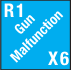

##### 10.22

**10.22** A crew (as per 10.111) may (un)limber a Gun and change its CA simultaneously. A TI counter is placed on that MMC and Gun after it has unlimbered (but not when it has limbered).

**10.23 QUICK SET-UP (QSU):** A Gun with QSU printed on its counter can never be (un)limbered; i.e., such a Gun is never subject to the provisions of 10.2-.22 and can be (un)hooked in its normal state. EX: HOOKING UP PROCEDURE: FRIENDLY PFPh: Crew limbers Gun if not QSU. Neither Gun, crew, nor vehicle/ PRC may fire (but are not TI). SUCCEEDING FRIENDLY MPh: Vehicle/Gun enters other’s hex (if not already there) and Gun is hooked up (10.11). The Stopped vehicle expended half of its MP/MF allotment (or two-thirds if gun has M # ) plus any hex entry cost to do so. The Gun, crew, and vehicle become TI. NEXT FRIENDLY MPh: Vehicle may drive away with Gun in tow. EX: UNHOOKING PROCEDURE: FRIENDLY MPh: Vehicle towing Gun enters new hex, paying hex entry cost (plus one MP/MF; 10.1) to do so and stops. The Gun is unhooked into its present hex, provided neither the vehicle nor any PRC has fired (10.12), and the vehicle can expend half its MP/MF allotment (or two-thirds if Gun has M # ). If unhooked, Gun and crew are TI; vehicle may exit hex, and may fire if otherwise able to. NEXT FRIENDLY DFPh: Crew unlimbers Gun if not QSU, and both become TI. If Gun is QSU, it may instead fire.

**10.24 LIMBERED FIRE (LF):** Certain Guns may fire while limbered, and are indicated by having a Gun Caliber Size, ROF, etc. on the limbered side of the counter. Limbered Fire is not allowed while a Gun is in tow; it must first be unhooked. LF Guns often suffer penalties to their performance in terms of changes in their Barrel Length, 360<sup>o</sup> Mount, B#, or ROF ratings; such ratings are printed directly on the limbered side of their counter (see 2.21).

**10.25 RESTRICTED FIRE, NO MOVEMENT (RFNM):** A Gun listed as RFNM may not (un)limber; i.e., it cannot be unlimbered if in tow at scenario start, and cannot be limbered or pushed if in firing mode at scenario start. Furthermore, it may not use To Hit Cases A (i.e., it cannot change its CA), E (i.e., it cannot fire if a Known enemy unit occupies its own hex), J<sup>4</sup>, or L (it can fire at one or two hex range but does not receive this DRM), and any use of Case J is always doubled at ≤ six hexes.<sup>27</sup>

**10.26 NO MOVEMENT (NM):** A Gun listed as NM may change CA normally, but may not (un)limber; i.e., it cannot be unlimbered if in tow at scenario start, and cannot be limbered or pushed if in firing mode at scenario start.

<!-- pdf-page 181 -->

**10.3 PUSHING:** A limbered or QSU Gun *[EXC: if having NM or RFNM]* can conceivably be pushed (and simultaneously have its CA changed) during the MPh by a Good Order crew (as per 10.111) at double its normal MF cost, provided it makes a Final DR ≤ its M#/M # for each hex it attempts to enter. Pushing a Gun (i.e., making a Manhandling DR) is Hazardous Movement, prevents Assault Movement, and cannot be attempted while carrying PP, or moving beneath a Wire/Panji counter, or attempting a Minimum Move. Double Time can be used, but the road bonus MF (B3.4) cannot. A Gun cannot be pushed INTO a deep stream or into Bamboo (G3.2) *[EXC: via TB]*. A Gun cannot be pushed using Bypass, nor can it be hooked up to or unhooked from a vehicle in Bypass. If the Final Manhandling DR is \> the M#, neither the Gun nor any pushing unit(s) can be moved farther during that MPh but the pushing unit(s) receives a -1 Labor counter for use in its next attempt. If the Final Manhandling DR equals the M#, the Gun and pushing unit(s) can enter that hex but cannot be moved any farther during that MPh. If the Final Manhandling DR is \< the M#, the Gun can enter that hex and either attempt to be pushed another hex or can be hooked up (see 10.31), provided all the Infantry which has engaged in pushing during that Player Turn have sufficient MF left to expend in that hex. In all three cases, the Gun and its pushing Infantry become TI for the rest of that Player Turn when their pushing/hooking up has ended. These rules do not apply to SW portage. See B23.423, B23.85, B23.93 and 2.7 for pushing Guns into a building (B30.45 for pillbox). A Gun may not be pushed during the same Player Turn in which it is unhooked. The following cumulative DRM apply to the Manhandling DR:

```text
                  10.3 MANHANDLING DRM:
    +X   *X is positive TEM of hexside crossed plus that of hex entered
    +Y   Y is pushing unit’s MF expenditure for hex entered
    +3   Pushing into/from a mud or deep snow hex
         Per additional pushing crew/HS up to a maximum of -4 (-2
     -1  per additional squad, -1 if only pushing MMC is squad); such
         units also become TI
     -2  Crossing a road hexside (B3.4 is NA) unless into/from mud/
         deep snow unless paved/plowed
     -2  Low Ammo counter (D3.71) is placed on Gun prior to DR
-1 or -2 Per Labor Status (B24.8)
  M DR > M#: NA             M DR = M#: Stop
  M DR < M#: Continued Movement Allowed
```

\* LOS Hindrance, SMOKE, HA, FFMO/FFNAM DRM NA.

EX: A crew attempts to push a 37L AT Gun into a stone building from Open Ground (1H4 to G4). It needs an Original Manhandling DR ≤ 5. Its M# is 12 with +7 DRM (+3 [TEM of hex entered] +4 [MF of hex entered]).

##### 10.31

**10.31** A Gun can be pushed and then hooked up during the same MPh, but only if its pushing Infantry can still attempt to push that Gun another hex in that MPh (i.e., can attempt another Manhandling DR), and only if the vehicle has not yet exceeded the specified MP/MF expenditure for hooking up (10.11). No Manhandling DR is actually required for hooking up or unhooking.

**10.4 TRAILERS:** A vehicle towing a trailer may traverse any terrain permitted were it not towing the trailer *[EXC: it may not enter a building/ rubble, nor may it use Reverse Movement or cross an unbreached wall/ hedge]*.

**10.41** For To Hit purposes, a trailer (not a towed Gun) may be targeted separately with a +3 size modifier if the towing vehicle presents a side Target Facing to the firer. Any rear Target Facing hull hit is considered to have struck the trailer instead of the vehicle. A trailer cannot be hit by Direct Fire through the towing vehicle’s front Target Facing, nor if it is HD to the firer. Otherwise, if a hit is missed by one, the trailer is considered hit on a subsequent dr of 1. The trailer hit possibility is determined before any accidental hits vs overstacked vehicles (A5.132) can be scored. All other To Hit DRM apply normally. Indirect Fire and non-ordnance do not attack the trailer separately; i.e., the trailer shares the fate of the vehicle as per 10.1. If a trailer becomes immobilized its towing vehicle must stop (or remove its Motion counter) and disconnect it before it can expend a start MP. Trailer hits do not cause Collateral Attacks, and a trailer never leaves a wreck when it (not the vehicle) is destroyed. Check the towing vehicle’s Vehicle Listing Notes in Chapter H for further information.

**10.5 EN PORTEE:** Some German, British, Italian, and French Guns may be carried *en portee*, which means they may be loaded onto a vehicle (during setup/play) and carried as Passenger PP. The applicable Ordnance Notes will describe exactly which Guns can be porteed by which vehicles during which periods. Prior to setup the appropriate vehicle must be noted on a side record as being able to portee a Gun of that particular Caliber Size and Barrel Length. As a passenger, the Gun and its ammo together use all but 5PP of the vehicle’s Passenger capacity. A vehicle may not simultaneously have one Gun en portee and another hooked up for towing.

**10.51 (UN)LOADING:** A Gun can be (un)loaded only after a *crew* counter has spent its entire MF allotment as unpinned, non-entrenched Good Order Infantry in the Location of the Gun and a non-Bypass vehicle in a declared attempt (which makes it subject to Hazardous Movement) to do so. A non-QSU Gun (un)loads in Limbered mode. When a Gun has been thusly loaded it is marked with an En Portee counter, and once (un)loaded the crew and vehicle become TI. A Gun may not be (un)loaded to/from a vehicle that has expended any MP in the same MPh.

**10.52 WRECK:** A vehicle porteeing a Gun is not flipped over to its wreck side if it becomes Immobilized, and the Gun may be unloaded (at which time the vehicle counter is flipped over). If a vehicle porteeing a Gun is eliminated, the Gun is eliminated too.

**10.53 CA & GUNSHIELDS:** When loaded on the vehicle, the Gun’s CA must coincide with either the VCA or “rear” VCA and may not change relative to that VCA while being porteed *[EXC: some Guns are restricted by their Note to only the VCA or “rear” VCA]*. An AT (with a Gunshield) being porteed provides no protection to the vehicle, but Direct (only) Fire attacks vs it which emanate from within the Gun’s CA and which do not destroy the vehicle, affect the Passengers as if they were manning a non- Emplaced, non-vehicular AT.

**10.54 PORTEE FIRE:** Certain Guns (see applicable Ordnance Notes) may be fired by their Passenger crew while being porteed *[EXC: Bound- ing (First) Fire and Motion Fire are NA]*. Mounted Fire penalties (D6.72) are NA.

## 11. GUNS AS TARGETS

**11.1 NEAR MISS:** Any “hit” vs a Gun usually represents a Near Miss close enough to affect the crew.<sup>28</sup> A hit which actually strikes the Gun is termed a Direct Hit (11.4).

**11.2 EMPLACEMENT:** The To Hit procedure vs a Gun which has not been hooked up and which set up manned by a crew and has not been moved since the start of the scenario (11.3) can be resolved in either of two ways at the firer’s option. An Emplaced Gun can be fired on using the Area Target Type (the Gun’s Target Size [2.271] is a To Hit DRM unless inside a pillbox/cave; B30.32 and G11.83) with a +2 TEM (once hit) for being Emplaced; or it can be fired on using the Infantry Target Type, with the +2 Emplacement TEM and the Gun’s Target Size used as a combined To Hit DRM. For OBA or other FP attacks, the +2 Emplacement TEM applies on the IFT *[EXC: FT; A22.2]*. In all cases, however, the Emplacement TEM cannot be used in addition to any other positive TEM; the Gun’s owner may choose one or the other, but not both. There can possibly be different To Hit Numbers for units in the same hex. A Gun can never be Emplaced on a paved road, bridge, runway, Rooftop, or in Bamboo and does not receive the +2 TEM while manned by a squad.

<!-- pdf-page 182 -->

EX: Using the Infantry Target Type, a CE PzKpfw IVH Prep Fires at a 57mm AT Gun six hexes away in a 2+3+5 pillbox that is in its LOS through the pillbox CA. The Modified TH# is 8, but there is a +3 To Hit DRM for Case Q (since the +2 Emplacement TEM would be less beneficial to its defense). EX: A CE PzKpfw IVH Prep Fires on a hex containing an entrenched squad, an emplaced 45mm AT Gun, and another non-emplaced 45mm AT Gun in an Open Ground hex six hexes away on the Infantry Target Type. The Modified TH# is 8 but there is a +1 DRM for the non-Emplaced Gun (Target Size), a +2 DRM for the entrenched squad (foxhole), and a +3 DRM for the Emplaced Gun (Target Size and Emplacement). So the tank will hit the non-Emplaced Gun with an Original To Hit DR ≤ 7, or the squad *and* the non-Emplaced Gun with an Original DR ≤ 6, or all three targets with an Original To Hit DR ≤ 5.

#### 11.3

**11.3** If a Gun is a RCL or starts a scenario hooked up or manned by a non-crew unit, moves, or its manning Infantry voluntarily forfeits Wall Advantage (B9.322) it loses the “Emplaced” To Hit DRM of Case Q. Once lost, a Gun may not regain Emplaced status during that scenario. A Gun’s Emplacement TEM ceases to exist when that Gun is removed from play. A Gun that sets up qualified for Emplaced status may nevertheless set up non-Emplaced, provided this fact is noted on a side record. EX: A CE PzKpfw IVH fires during its DFPh at a 57mm AT Gun in its TCA which has just been pushed into a woods hex six hexes away. The Modified TH# is 8 and there is no DRM to the To Hit DR (+1 [Case P; Target Size] +1 [Case Q; TEM] -2 [Case O; Hazardous Movement] = 0 To Hit DRM).

**11.4 DIRECT HIT:** Once a hit is secured (or in the case of OBA/DC attacks which do not need hits), the firer rolls on the IFT to determine the effects on the crew and Gun. If the Final DR (prior to any gunshield DRM) results in a KIA vs the Gun (after any necessary Random Selection), the Gun is considered to have taken a Direct Hit and is destroyed along with its manning Infantry. A K result is also considered a Direct Hit, although it does not actually strike the Gun; rather it causes the Gun to malfunction and causes Casualty Reduction to its manning Infantry *[EXC: if AP was fired; 11.52].* Gunshield DRM never apply to a Direct Hit. If the IFT DR does not result in a Direct Hit, the hit is considered a Near Miss and the +2 DRM for any gunshield is applied (if applicable) to the same DR to determine the effect (if any) on the manning Infantry. Even unattended Guns must check for elimination. Gunshield modifiers are lowered by one to +1 vs all forms of Indirect Fire. A CH automatically destroys both the Gun and its manning Infantry.

**11.5 GUNSHIELDS:** All AT and INF Guns have gunshields which help protect their manning crew.<sup>29</sup> A gunshield helps protect the Good Order manning crew (only) of a Gun from most attacks which originate within its current CA. Other Infantry in the same hex, even if serving as an ad hoc crew, receive no benefit from the gunshield. Infantry moving to a Gun or pushing it while being attacked by Defensive First Fire is not entitled to any protective DRM from its gunshield, nor is manning Infantry attacked by any means from the Gun’s own hex ever entitled to protective DRM from its gunshield. A manning crew protected by a gunshield may add +2 to the IFT DR of fire vs that manning crew *[EXC: +0 for FT (A22.2) and +1 for Indirect Fire (11.4)]*. The gunshield DRM is never cumulative with that of positive TEM; the target has its choice of accepting either the gunshield DRM (if applicable) or the positive TEM of the terrain (including Emplacement; 11.2) in that Location. A gunshield does not have to be penetrated for HE fire to affect the Gun/its-crew, and protects the Gun and such Infantry from ordnance hits only insomuch as the application of the gunshield modifier to the IFT DR of all Near Miss hits may lessen any MC level sustained. A gunshield DRM never affects a To Hit DR, but can be used to modify the effects of a Near Miss Hit even if a TEM was already used to modify the To Hit attempt. EX: Continuing the second 11.2 EX, the PzKpfw IVH hits all three targets with an Original To Hit DR of 5. The AFV’s 75mm MA attacks all three on the 12 FP column of the IFT. An Original IFT DR of 6 would (if unmodified) result in a 2MC, qualifying as a Near Miss vs the AT Guns. If the attack originated within the CA of the Guns and the Guns were manned by *crews*, they would each receive a +2 DRM to the IFT DRM due to their gunshields, changing the 2MC result to a 1MC. An Original IFT DR of 3 on the 12 FP column results in a K/3, which (depending upon Random Selection) may result in a Direct Hit vs ≥ 1 Gun, eliminating any affected crews; any of Guns not selected for the K result will receive the +2 gunshield DRM, changing the 3MC to a 2MC. (If the result had been a 1KIA instead, all units not selected for the KIA result would be broken.) An 8-3-8 squad attacking both crewed Guns through their CA at normal range attacks on the 8 FP column. The non-emplaced Gun receives a +2 gunshield DRM regardless of the Original IFT DRM since Infantry fire cannot secure a Direct Hit; the emplaced Gun receives either the +2 Emplacement TEM or the +2 gunshield DRM.

**11.51** HEAT destroys a Gun using the same mechanics as an HE hit, except that it uses HE Equivalency (8.31). A FT/MOL attack destroys a Gun using Random SW Destruction (A9.74) but is slightly more effective than MG/Small Arms Fire because gunshields never modify a FT attack or a FG which includes only units attacking from outside the Gun’s CA and/ or using MOL.

##### 11.52 AP

**11.52 AP:** AP/APCR/APDS/ATR hits vs a Gun are resolved using the same mechanics as HE hits, but using HE Equivalency (8.31). The Gun and any manning Infantry are destroyed by a CH/any K/KIA result. A MG attacking alone, an ATR attacking as Small Arms, or an ATR/MG attacking as part of a FG, may cause Gun Destruction only as per A9.74.

**11.6 GUN DESTRUCTION TABLE:** The above rules for Gun Destruction are summarized on the Table below.

```text
              GUN DESTRUCTION TABLE^1
               Ordnance/    MG/IFE/Small Arms/
               Bomb/OBA       FT^2/MOL^2/OVR      DC
≤ Final^4 KIA    Elim^3     Random SW/Gun Dest    Elim
= Final^4 K     Malf-CR^5           NA          Malf-CR
= CH             Elim               NA            NA
 Elim: Gun and manning Infantry are eliminated.
```

Malf-CR: Gun is malfunctioned; manning Infantry suffers Casualty Reduction. Random SW/Gun Dest: Check for Random SW/Gun Destruction (A9.74). 1 If in tow or being (un)hooked, a Gun can only be destroyed if its vehicle is (10.1-.12). 2 Gunshield is NA to FT/MOL-“only” attack (11.51). 3 If there are Personnel in the Location, unpossessed Guns check for Random SW/Gun Destruction if KIA achieved via Indirect Fire. 4 Prior to applying Gunshield DRM (11.4). 5 K result = Elim if AP was fired (11.52).

## 12. RECOILLESS RIFLES (RCL)

#### 12.1

**12.1 GERMAN/U.S.:** German RCL were more like ART than SW. RCL do not have gunshields (gunshields were optional on German RCL, but were small and of little protection to the crew which had to stand away from the weapon at the moment it was fired). U.S. RCL are treated as SW although they too use the C3 To Hit Table.

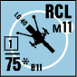

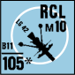

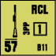

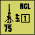

#### 12.2

**12.2** RCL are crew-served and fire HE as their main ammunition. U.S. RCL were intended for more widespread distribution as Infantry SW, but their late introduction restricted their use to specially trained teams. Any friendly squad/HS using a RCL does so with captured weapon penalties (A21.13).

##### 12.21

**12.21** Two SMC may fire a RCL of their own nationality without penalty if they direct no other fire during that Player Turn, but leadership DRM never apply when firing a RCL.

<!-- pdf-page 183 -->

**12.22** A RCL uses the To Hit Table but To Hit Case A applies only to German RCL. The U.S. 57mm RCL may fire during the AFPh even after it or its crew moves in the MPh by adding the +2 To Hit DRM for LATW firing in the AFPh (Case C<sup>3</sup>). A RCL (and the unit firing it) can never retain concealment when it fires in the LOS of a Good Order enemy ground unit.

**12.23** A RCL may never fire from a building, rubble, entrenchment, pillbox, cave, or vehicle *[EXC: the US 57mm RCL may fire as per 13.8]*.

**12.24** A RCL cannot acquire a moving (C.8) target or use previous acquisition against it. Only German RCL may Bore Sight.

**12.3 BACKBLAST ZONE:** The backblast zone of a RCL consists of the firing hex and all Locations within one level of the RCL in the hex or hexes immediately behind it in the opposite direction of the LOF. This zone is determined by extending the LOS of the firing weapon backward through the firing hex a distance of one hex. If this backward extension of the LOS lies exactly along a hexspine of the firing hex (such that it forms a hexside between two adjacent hexes) then both of those adjacent hexes are considered part of the backblast zone. If firing within hex, the zone is only that hex.

##### 12.31

**12.31** Any unarmored friendly/Melee unit in the backblast of a RCL when it fires, other than the manning Infantry which fired it, is TI for the remainder of that Player Turn. If those units have already fired or moved during that Player Turn they undergo attack on the 1 FP column of the IFT using the colored dr of the RCL’s To Hit DR as an IFT DR. No drm apply.

#### 12.4

**12.4** Any time a RCL rolls an Original 11 on its To Hit DR there is a chance that the backblast will start a Flame in the backblast zone of the weapon. If the backblast zone contains Burnable Terrain, each hex must be rolled for separately on the Kindling Table (with applicable EC DRM) to determine if a Flame results.

## 13. LIGHT ANTI-TANK WEAPONS (LATW)

#### 13.1 LATW

**13.1 LATW:** The term LATW includes all ordnance weapons represented by SW-size counters whose main use is against armor. LATW include ATR, ATMM, Bazooka, PIAT, Mol-Projector, PF/PFk, and PSK. All LATW ordnance must first secure a hit vs armor on the appropriate To Hit Table (C3) before resolving that hit on the applicable To Kill Table. All Firer and Target Hit Determination DRM applicable to LATW are listed on the To Hit Table and marked with a green “L”. However, all LATW firing during the AFPh *[EXC: Opportunity Fire]* are subject to a +2 To Hit DRM (Case C<sup>3</sup>). LATW may never use the Area Target Type.

**13.2 ANTI-TANK RIFLE (ATR):** An ATR is a SW which uses the C3 To Hit Table and the C7.31 AP To Kill Table to resolve its hits.<sup>30</sup> An ATR counter’s To Hit attempt uses the black Basic TH# regardless of nationality distinctions, unless it is a captured weapon.

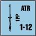

**13.21 USAGE:** Any unbroken Infantry unit can use an ATR but such use constitutes use of a SW (A7.35).

**13.22 RANGE:** An ATR has a maximum range of 12 hexes. The Basic TK# of an ATR hit is modified by range according to the “≤ 25mm” row of the Case D Range Chart for the AP To Kill Table.

**13.23 vs GUNS:** An ATR can be used vs Guns as per 11.52 without using the AP To Kill Table.

**13.24 vs PERSONNEL:** An ATR can be used against Personnel targets with one FP as Small Arms Fire (no To Hit DR is necessary and therefore it may be used as part of a FG but it has no Long Range capability; i.e., it may not be fired beyond 12 hexes). An ATR leaves no Residual FP even if it attacks as part of a FG. Only 20L (i.e., 20 mm) ATR may use the Infantry Target Type and AP HE equivalency.

**13.25 LEADERSHIP:** Leadership/Hero modifiers do not apply to ATR To Kill DR, but do modify any To Hit DR and affect use of the weapon as Small Arms Fire normally.

**13.26 MALFUNCTION:** Normal Breakdown and Repair rules apply to an ATR.

**13.3 PANZERFAUST (PF):** The PF<sup>31</sup> is a potentially inherent SW of every German Infantry unit after September 1943 (see A25.76 for Finnish use and A25.85 for Romanian and Hungarian use), and uses the C3 To Hit Table (as per 13.33) and the C7.33 HEAT To Kill Table to resolve any vehicular hit. PF are not normally available prior to October 1943; prior to that date, encounters with PF were limited to some 5,000 weapons undergoing combat trials, which in the game are termed PFk. Possible encounters with PFk can occur anytime after July 1943, but only as per SSR.

**13.31 USAGE:** All Good Order (or Berserk) German Infantry after September 1943 which can still fire during their current fire phase can possibly fire a PF. A unit attempts to fire a PF by making a PF Check dr (∆). If the final PF Check dr is a 1-3, the unit has a PF and an opportunity to fire it and must attempt a To Hit DR on the C3 To Hit Table. If the final PF Check dr is ≥ 4, the unit may have a PF but no opportunity to fire it so the unit cannot attempt a To Hit DR. If the PF Check dr is an Original 6, the unit has no PF in position to fire and is pinned (even if heroic or berserk). If already pinned, the unit is broken instead (or suffers Casualty Reduction if berserk or heroic). There is a +1 drm to a PF Check dr if the scenario is set in Aug- Sept 1943, a -1 drm if it occurs in 1945, a +1 drm if it is fired at other than an AFV, and a +1 drm if used by a CX unit. There is a +1 drm if the unit is a HS/crew and a +2 drm if the unit is a SMC. A unit may not make a PF Check in Subsequent First Fire or FPF (A8.3-.31)—regardless of whether it made a PF Check during First Fire. Provided a *squad* has not yet fired its inherent FP, it can attempt to fire a second PF in the same phase even if its first attempt did not yield a shot, but that would constitute use of two SW and cause the squad to lose its inherent FP for that phase (A7.351). Even if a unit’s PF Check dr fails to result in a shot, that PF Check constitutes use of a SW (A7.35). A PF Check dr can be made only during a friendly fire phase (including a Defensive First Fire opportunity during an enemy MPh) and if successful must be immediately fired. As a one-shot weapon, a PF may not directly affect more than one unit when fired at an Infantry/Cavalry target (see 8.31) unless the Random Selection DR indicates several units are affected. However, once a hit is gained vs a multi-target Location and prior to any Random Selection, the firer can select the unit to be affected, provided that unit is Known and manning a Gun/SW. A PF/PFk hit does not leave Residual FP because it is a one-shot weapon with limited application vs Infantry. The total number of PF shots taken in the course of a scenario may not exceed the number of German squad-equivalents in the OB prior to 1944, 1<sup>1</sup>/2 (FRD) times the number of squad-equivalents during 1944, and twice the number of German squad-equivalents in 1945. The number of shots taken is recorded on the PF Usage Track of the Scenario Aid Card by marking the total allowed number of PF shots on the track with a PF counter and moving it along the Track towards 0 one box at a time whenever a PF shot is taken. When the PF counter reaches the 0 box, no more PF shots may be attempted.<sup>32</sup> **\*13.311 OPTIONAL USAGE:** Prior to setup in any scenario occurring after September 1943, the German player is allocated PF equal to the number of squad-equivalents in his OB prior to 1944, 1<sup>1</sup>/2 times (FRD) the number of squad-equivalents in 1944, and twice the number of squad-equivalents in 1945. He secretly records which units are carrying PF. Each Personnel unit may carry a number of PF equal to its US#. There is no portage cost. The weapons may be fired or transferred in the same manner as any inherent SW, except that no PF Check is necessary. After use or transfer, the PF possession records are updated accordingly because a PF can fire only once before being removed.

**13.32 RANGE:** The effective range of a PF varies with the time frame of the scenario. PF range is limited to one hex prior to June 1944, two hexes from June to December 1944, and three hexes thereafter. A PFk always has a one hex range.

<!-- pdf-page 184 -->

**13.33 RANGE EFFECTS:** The Basic TH# (10) of a PF/PFk attack is modified by -2 for each hex of range to the target. EX: A PF firing on a vehicular *or Infantry* target two hexes away has a Modified TH# of 6; if it fired during the AFPh, Case C<sup>3</sup> would also apply and add a +2 To Hit DRM (unless fired as Opportunity Fire).

##### 13.34 TK#

**13.34 TK#:** The Basic TK# of a PF is 31 as listed on the C7.33 HEAT To Kill Table; that of a PFk is 22.

**13.35 LEADERSHIP:** A leader stacked with a PF firer can apply his leadership modifier to the To Hit DR of one PF but such use would constitute his sole fire direction for that phase. A leader who does not make a PF Check himself is not committed to that attack (or use of that SW), although if he does direct the To Hit DR of another unit which has passed its PF Check, he must state so before making the DR.

**13.36 MALFUNCTION:** A PF is a one-shot weapon which can only be fired in the same fire phase in which it was secured by a PF Check, and is therefore unaffected by Breakdown or Repair rules. However, an Original To Hit DR of 12 (11 or 12 for Inexperienced Infantry; A19.32) is not only a miss but results in its operator suffering Casualty Reduction.<sup>33</sup> An Original To Kill DR of 12 is a Dud (7.35), or if rolled on the IFT has no effect.

**13.4 BAZOOKA (BAZ):** BAZ Counters are provided for three different versions; the actual year of availability of each is specified on the counter *[EXC: BAZ 43 first becomes available in Novem- ber, 1942]*. The American units are always assumed to use the latest model available.<sup>34</sup>

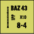

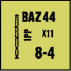

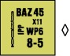

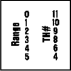

**13.41 USAGE:** Any unbroken Infantry MMC can fire a BAZ and such use constitutes use of a SW (A7.35).

**13.42 TO HIT:** Each BAZ has its own abbreviated To Hit Table listing its Basic TH# at each of its allowable ranges, printed on the reverse of its counter. This To Hit Table is used for both armored and unarmored targets. Although a BAZ has its own To Hit Table, all Firer (C5) and Target (C6) Hit Determination DRM applicable to LATW apply.

**13.43 TO KILL:** Once a hit has been scored vs a vehicular target, it is resolved on the C7.33 HEAT To Kill Table using either the BAZ 43 or the BAZ 44+ column, depending on the time frame of the scenario; vs an unarmored target, a hit is resolved on the 8 column of the IFT (see 8.31).

**13.44 LEADERSHIP:** The leadership modifier of any one leader directing a BAZ attack may be used to modify its To Hit DR.

**13.45 SMC USAGE:** Any combination of two SMC may fire a BAZ at full effect. Leaders cannot modify their own fire although a Hero can, (A15.24) whether singly or in combination with another SMC. A BAZ can be used by one SMC only if that SMC is a Hero (A15.23).

##### 13.46 WP

**13.46 WP:** The BAZ 45 has the option of firing WP. Normal Ammunition Depletion Number rules (8.9) apply.

**13.47 MALFUNCTION:** A BAZ is permanently removed from play if its unmodified To Hit DR is ≥ its X#.

**13.48 PANZERSCHRECK (PSK):** All BAZ rules apply to the PSK<sup>35</sup> except that the latter does not fire WP, has its own To Hit Table printed on the back of its counter, has an IFT effect of 12 (see 8.31), resolves

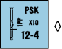

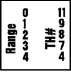

its vehicular hits on the PSK column of the C7.33 HEAT To Kill Table, and is available from September 1943 on.

**13.5 MOLOTOV PROJECTOR:** The MOL-Projector<sup>38</sup> is a crewed, 2PP Russian LATW ordnance- SW with its own To Hit Table printed on the back of the counter. This TH Table is used vs both armored and unarmored targets in the same manner as a BAZ except as noted otherwise below.

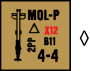

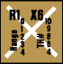

**13.51 USAGE:** Only a Russian crew, or two Russian SMC (as per 12.21), may use a MOL-Projector with neither Captured nor non-qualified use (A21.13) penalties. A Russian non-heroic leader may use one *with* non-qualified-use penalties. A Russian hero may use one as per A15.23. A MOL-Projector is not a SCW, has no “backblast” and does not fire HEAT; hence 13.8-.9 do not apply to its use, and it may be fired from a building/ Pillbox/Rooftop. Like ordnance unable to use the Area Target Type (13.1), a MOL-Projector must predesignate its target before firing. Moreover, in the PFPh and DFPh it must fire before the first weapon firing other than SMOKE in that phase (since it places smoke when it achieves a hit; 13.58); however, this restriction does not apply to firing in the enemy MPh. Leadership DRM do not apply to a MOL-Projector’s TH DR. A MOL-Projector may not fire at a target that lies at a different elevation than the firer if the elevation difference between them exceeds the range, nor may it be fired by PRC (though it may be carried as a Passenger/Rider on a vehicle). It may not use Bore Sighting, Target Acquisition, Intensive or Sustained Fire, nor may it attempt Deliberate Immobilization.

##### 13.52 CH

**13.52 CH:** A MOL-Projector achieves a CH on an Original 2 TH DR (3.7). See also 13.53-.56.

**13.53 EFFECTS:** The effects of a hit by a MOL-Projector are similar to those of a MOL attack. However, unlike the latter, a MOL-Projector attack is an ordnance attack and hence is never accompanied by a Small Arms attack.

##### 13.54 vs AFV

**13.54 vs AFV:** An AFV hit by a MOL-Projector is affected exactly as if hit by a MOL (A22.612). However, the *only* possible modifications to the MOL-Projector attack’s Basic TK number are: +1 for hitting an OT AFV; +1 for a rear Target Facing hit; and doubling due to a CH. A hit also causes a 4-FP Specific Collateral Attack vs an AFV’s Vulnerable PRC.

**13.55 vs UNARMORED VEHICLE:** An unarmored vehicle hit (or Partially Armored Vehicle hit in an unarmored Aspect; 3.9) by a MOL-Projector is attacked on the ★ Vehicle Line of the IFT using a Kill number of 9. A CH doubles this Kill number to 18.

**13.56 vs INFANTRY/GUN:** An Infantry-target/non-vehicular-Gun hit by a MOL-Projector is affected exactly as if hit by a 4-FP HE attack. A CH causes an 8-FP attack with applicable reversed TEM (or, vs the Gun, eliminates it and its manning Infantry).

**13.57 vs TERRAIN:** A MOL-Projector hit can cause a Flame in Burnable Terrain as per A22.6111, but uses the colored dr of the TH DR. (An Original 6 dr has no adverse effect—but see 13.59.)

**13.58 SMOKE:** A MOL-Projector hit creates a white Dispersed Smoke counter as per 8.52.

**13.59 MALFUNCTION:** A MOL-Projector malfunctions on an Original TH DR of 11. As signified by “X12” printed in red on the counter, an Original TH DR of 12 eliminates the MOL-Projector and creates a Flame in its Location if there is Burnable Terrain therein. Both the X# and B# are lowered by the appropriate amount if Inexperienced/Captured/non-qualified, etc., use applies.

<!-- pdf-page 185 -->

#### 13.6 PIAT

**13.6 PIAT:** The Projector, Infantry, Anti-Tank device was a spigot launcher which hurled, rather than fired, HEAT and was first available in April, 1943. It was normally issued one per platoon. There is only one version of the PIAT and it is treated as a SW counter. A PIAT cannot fire WP, has its own To Hit Table printed on the back of its counter, and resolves its vehicular hits on the PIAT column of the C7.33 HEAT To Kill Table. All other BAZ rules *[EXC: Backblast; 13.8]* apply to the PIAT except as modified below.

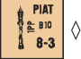

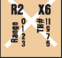

**13.61 HEIGHT RESTRICTIONS:** A PIAT cannot be fired at a target one or more levels lower in the same or an adjacent hex, since the required level of depression would pull the projectile out of firing position.

**13.62 SMC USAGE:** A PIAT can be used by a SMC at full effect with no penalty, although no leadership modifier would apply unless a non-firing leader directed the attack.

**13.63 MALFUNCTION:** A PIAT<sup>36</sup> has B10 instead of an X#, and is repaired on a Repair dr of 1-2 or removed on a dr of 6 (A9.72).

**13.7 ANTI-TANK MAGNETIC MINE (ATMM):** ATMM<sup>37</sup> are not represented by counters, but are considered possibly inherent in any German Infantry unit during or after 1944. An ATMM can be used at the option of any unbroken and unpinned German Infantry unit against a vehicle *[EXC: wagon or motorcycle]* in the same hex as part of the CC process. Any unit—after designating but prior to resolving its CC attack vs a vehicle—may opt to declare an ATMM attack by making an ATMM Check dr. On an ATMM Check dr of 1-3, a man possessing an ATMM is in position to place it, which adds a -3 DRM to the CC attack by that unit. If the dr is a 4-5, no man with an ATMM is in position to attempt placement and the unit may attempt CC normally that turn. If the ATMM Check dr is an Original 6, the unit is pinned (even if berserk) and consequently has its CCV reduced by one during the subsequent CC attack (A11.5). A HS/ Crew must add +1 and a SMC +2 to its ATMM Check dr. A CX unit must also add +1 to its ATMM Check dr, as would any unit using it vs a non-armored vehicle.

**13.71 LEADERSHIP:** Neither leadership nor heroism affects the preliminary ATMM Check dr, but does apply normally to the subsequent CC attack DR (unless a leader is attacking alone).

##### 13.72

**13.72** An ATMM has no effect on other units in the same hex, other than the normal effects vs any PRC of a vehicle which is destroyed (D5.6/D6.9).

##### 13.73 SMC

**13.73 SMC:** An Infantry SMC may attempt an ATMM attack vs a vehicle (as per 13.7) and if the ATMM Check dr is successful, the ATMM DRM can be applied to the combined CC attack of the SMC and *any* unit it attacks with, provided their combined attack was predesignated before the ATMM Check dr. If a SMC attempts an ATMM Check dr, no unit attacking with it may make an ATMM Check dr of its own. However, if the SMC ATMM Check dr is not successful, no unit other than the SMC can be pinned due to that ATMM Check dr.

**13.74 MALFUNCTION:** An ATMM malfunctions on an Original CC DR of 12 and therefore its CC DRM is not applicable.

**13.8 BACKBLAST:** Due to the attendant backblast of these weapons, a PF/PFk, BAZ, PSK, or RCL may not be fired from inside a vehicle, rubble, pillbox, cave, sewer, or building *[EXC: Factory and rooftop]* without a Desperation (13.81) penalty. *[EXC: Non-Desperation fire from ground- level rubble or the ground floor of a building (but not from pillbox, sewer, or vehicle) is allowed by unpinned units using Opportunity fire or applying the Case C**<sup>3</sup> To Hit DRM (5.34), due to the movement which is assumed necessary to move into an alley prior to the shot]*. These weapons also may not fire at a target two or more levels higher in an adjacent hex, or directly above them in the same hex.

**13.81 DESPERATION:** Whether due to ignorance, panic, or dire circumstance, these weapons (13.8) were sometimes fired inside restrictive terrain, and hundreds of deaths and serious burns resulted to the operators as a consequence. Therefore, the Case C<sup>3</sup> To Hit DRM can be ignored if so predesignated, but all occupants of the firing Location in such restrictive terrain undergo attack on the 1 FP column of the IFT using only the colored dr of that To Hit DR. No drm apply.

**13.9 SHAPED-CHARGE WEAPONS (SCW):** PF/PFk, BAZ, PSK and PIAT are all SCW. The anti-personnel rounds fired by SCW were actually HEAT, not HE, and only these rounds (and WP fired by BAZ) can be used vs Personnel targets (see 8.31).

## FOOTNOTES

**1.** *1.2 RADIO CONTACT ATTEMPT:* We do not mean to leave the player with the impression that an Observer could call in fire directions and have those orders cleared fast enough to actually track a moving unit’s path across the board. OBA resolution actually represents pre-plotted fire which was originally handled in the RPh of the basic game. However, handling artillery mechanics in that manner allowed players to unrealistically avoid pre-plotted orders through their omniscience and move away from shellings which had not even started yet. To avoid this, we found it far more playable and realistic to allow OBA to be plotted “instantly” even though the actual “calling in” of such fire would have occurred previously.

**2.** *1.22 MAINTAINING RADIO CONTACT:* Almost every Infantry battalion had its own inherent mortar battery, and the chance of receiving Fire Missions from it was much greater than from larger caliber batteries because the mortars had less area to cover and correspondingly fewer demands for Fire Missions.

**3.** *1.22 MAINTAINING RADIO CONTACT:* Admittedly, a leader/Observer often had another squad member along to tote a radio for him, but allowing a leader to use any radio possessed by a friendly unit in the same Location poses far more specific rules questions and inconsistencies than it is worth—especially when two leaders occupy the same Location.

**4.** *1.54 FRIENDLY UNITS:* Few things in battle are as demoralizing as being shelled by one’s own artillery or strafed by friendly aircraft. Even Green troops could usually tell the direction of incoming fire and identify it as friendly or enemy.

**5.** *1.6 OBSERVER:* A radio tends to be all too visible to the omniscient player and can rapidly become the target of all available FP. For this reason, players may well wish to agree beforehand to note the Location or possession of radios by side record rather than revealing their presence with a counter. Observers are assumed to be equipped with field glasses and therefore better able to discern targets at great distances which would not be visible over the open sights of most weapons. However, concealed units ≥ 16 hexes away are considered conducting themselves in such a cautious manner that better optics are not of particular value in “seeing” them—at least not automatically.

**6.** *2.24 ROF:* If the crew hits the target with its first shell, it has saved itself time which can be used to select and engage another target. On the other hand, if the crew misses the same target many times or by a wide margin, it may not even hit its initial target within that time frame, let alone engage other targets. This accuracy/time factor is abstractly represented by the colored dr of the To Hit Resolution DR.

**7.** *3.33 AREA TARGET TYPE:* Direct Fire on the Area Target Type represents using a lower ROF to shell a general area (usually to discourage movement and/or to keep enemy heads down), as opposed to aimed fire at a particular target. It is generally easier to hit such an area, but less likely that serious damage will be inflicted on any given unit therein. Mortars use the Area Target Type mainly because the mechanics of its resolution is more in keeping with their Indirect Fire characteristics. The prohibition against allowing Area Target Fire to affect units out of the firer’s LOS is less realistic for mortars than for Direct Fire Guns, but effectively keeps them from firing at units they could not see in reality (the Omniscient Player syndrome)—while still allowing them to fire at an upper building level in order to acquire it. The Basic To Hit Numbers are lowered at short range for three reasons. First, making them “9” at 0-12 hexes would result in mortars being too accurate at such range. Second, the closer an area is to a Gun shelling it, the more the Gun must be traversed in order to land shells throughout that area. This lowers its ROF and consequently its overall ability to affect that area. Third, with enemy units so close it is assumed that a Gun would usually aim at specific targets, so as to achieve maximum effect. The lowered close-range To Hit Numbers encourage use of the Infantry Target Type and thus simulates this tactic.

**8.** *3.8 MULTIPLE HITS:* The two minute Game Turns of ASL, combined with the To Hit system mechanics, require that each “shot” fired on the gameboard actually represents the firing of an unspecified number of rounds within that time span. A “hit” means only that at least one of those rounds found its target. In reality, several such rounds may have struck the target and had an effect—a “hit” that eventually scores a

KIA/MC on several units in the same hex can often be assumed to have been caused by several well-placed rounds. This multiple hit possibility increases with smaller caliber Guns which could fire a greater number of rounds in a given time span, and were often even clip-fed with automatic fire capability.

**9.** *6.17 EXAMPLE:* A veteran gamer will recognize that the example poses an unrealistic situation because the bulk of the five MP expended in W6 were actually spent out of LOS of the AT Gun while the tank ascended the hill on the other side of the crest. A more realistic treatment would take the slope of the hill into consideration so as to declare that only one MP was spent in LOS of T4 while all five MP were spent in LOS of X5 (or any hex on that side of the hill with a LOS to W6). Veteran gamers may well wish to adopt House Rules of this type for this situation, rather than use the simpler rules presented here.

**10.** *6.4 BORE SIGHTED LOCATION:* Units in a defensive posture with time to set up a well-planned defensive perimeter would analyze the avenues of approach to their lines and zero their heavy weapons in on particular pieces of ground. By sighting through a gun’s open bore or firing sample rounds, they could eyeball the weapon into a position wherein it could hit the target area automatically, merely by adjusting the Gun according to pre-set coordinates. The principal use of Bore Sighting (or Grazing Fire) was to be able to lay down effective fire on an expected avenue of approach despite poor visibility. MG, in particular, were “set” to lay down fire at knee level above the ground which is why Bore Sighting is not allowed at upper building levels.

**11.** *6.58 ACQUISITION COUNTERS:* In most scenarios, players can help ensure that the numbers of Acquired Target counters provided will suffice by selecting Guns with properly diverse ID letters. For example, if a scenario calls for three each of six different types of Guns, the player can double his supply of usable Acquired Target counters if he uses ID letters A-C for three of them and D-F for the other three, rather than using A-C again or an indiscriminate mix for all six.

**12.** *6.8 TEM:* Players should realize that use of the TEM to alter the To Hit DR rather than the IFT DR does not mean that a stone building is harder to hit than a wooden building. It does mean that a shell must be placed closer to an unarmored target within that building to have an effect on that target than would be true for a less formidable structure.

**13.** *7.1 TO KILL NUMBERS:* Each TK# represents the Gun’s armor penetration at 500 meters range and at an impact angle of 0<sup>o</sup> plus a base of 5 (although some TK# are weighted further for special performance characteristics). A Final TK# of 5 means that the shell would just barely penetrate the armor struck; one of ≤ 4 indicates that it generally could not penetrate unless it struck a weak spot—although such hits could sometimes cause spalling (fragmentation) of the armor’s inner surface. HE does not actually “penetrate”; but its concussive effect can cause thinner armor to shatter and collapse inward, as well as causing spalling and/or blasting loose interior attachments that become deadly projectiles.

**14.** *7.311 vs UNARMORED:* It is interesting to note that the TK# for unarmored vehicles is often \< that of an AFV. This is due to the fact that, although an unarmored vehicle is always penetrated by a hit, the projectile may pass entirely through the vehicle without detonating or striking anything vital. On the other hand, a projectile which has penetrated an AFV often explodes, or loses too much velocity to punch its way out the other side and therefore ricochets inside with murderous effect—in both cases in addition to causing potentially lethal fragmentation as it penetrates the armor.

**15.** *7.35 DUD:* This rule generically encompasses another minor aspect of fate; i.e., rounds that fail to detonate or shatter harmlessly upon impact, and also those that strike a glancing blow or hit a non-vital part of an AFV (such as a stowage bin).

**16.** *7.4 SHOCK/UK:* In the early days of riveted (as opposed to cast/welded) construction, even a MG bullet making a direct hit on a rivet could send it hurtling through the interior to ricochet with deadly effect. Later, as tanks acquired ever-thicker armor in the escalating race to stay ahead of constantly enlarging anti-tank armament, a hit could result in only partial armor penetration but could still cause spalling (fragmentation) in the interior with devastating effects. Regardless of the cause, a non-penetrating hit still occasionally gave an undergunned attacker the chance to finish off a superior foe before it could effectively return fire. Another common occurrence was an AFV’s crew being killed, injured, or stunned—with no visual effect of this apparent to the firer. In such an instance, the firer, not knowing if the target was out of action, usually continued to pump rounds into it until satisfied that it was indeed knocked out.

**17.** *8. SPECIAL AMMUNITION:* Types of available ammunition varied with each piece of ordnance, but as the war progressed the combatants often tried to overcome the shortcomings of their weapons with innovations and refinements to the projectiles. The availability of special types was always limited, however, due to either shortage of raw materials, local supply shortages, mass production facilities for its manufacture, or merely the lack of room (especially in an AFV) to store and transport many specialized rounds beyond the standard needs of more conventional AP and HE ammunition.

**18.** *8.11 APCR:* As the tank evolved, attempts to combat it with steel shot proved increasingly difficult as typical AP rounds then in existence tended to shatter at the high velocities necessary. Tungsten shot, although it would not shatter, was so dense that it <!-- pdf-page 186 --> required more propellant than the gun breeches could safely tolerate. The Germans were among the first to solve this problem by using a tungsten core surrounded by a light alloy body. This made a projectile of the necessary size, but whose weight was actually less than standard steel shot thus giving both a higher velocity and a shatter-proof projectile. The only drawback to such ammunition was a lack of carrying power over long range due to its poor weight:diameter ratio. This ammunition was called PzGr40 by the Germans and HVAP (High Velocity Armor Piercing) by the U.S., but for our purposes it will be referred to as APCR (Armor Piercing Composite Rigid). The German supplies of tungsten were limited and for them such ammunition became increasingly rare after 1942.

**19.** *8.11 APDS:* The British developed a unique composite projectile referred to as APDS (Armor Piercing Discarding Sabot), composed of a tungsten core enclosed in a light alloy sheath. Unlike APCR, this sheath separated from the core at the muzzle, allowing the core to gain both high velocity and carrying power due to its better weight:diameter ratio.

**20.** *8.3 HEAT:* High Explosive Anti-Tank rounds were designed to detonate at a predetermined distance from the target’s surface, and to channel the resulting explosion in a narrow concentration which could instantly burn through armor like a super blow torch while simultaneously spraying the AFV interior with molten metal.

**21.** *8.31 HE EQUIVALENCY:* PF were used against non-armored targets; particularly in urban areas where they acted as portable howitzers in assaulting buildings. However, allowing such use under the standard PF availability rules would make a German squad far too strong in terms of pure firepower against Infantry because a player would not “save” his PF for use vs armored targets as his real life counterpart would be prone to do. AP was also sometimes used vs personnel—usually due to no other ammunition being available. Moreover, many of the Guns listed as having no HE capability did in fact have HE rounds produced for them, but they were rarely used due to their very marginal performance.

**22.** *8.4 CANISTER:* Canister is an A-P round which fires many steel balls in a pattern not unlike that created by a shotgun. The American 37mm round for example contained 122 <sup>3</sup>/8" steel balls.

**23.** *8.5 SMOKE:* Conventional smoke rounds represent “base-ejection carrier shells” which used a time fuze to propel smoke canisters out of the shell while still airborne. The canisters, usually three to a shell, then scattered as they fell to the ground, and continued to emit smoke for up to two minutes. Smoke produced in this manner was relatively cool and clung to the ground, providing a fine smoke screen.

**24.** *8.51:* The assumption here is that DFPh placement is not planned but reactionary, and therefore not as many rounds are fired.

**25.** *8.6 WP:* The U.S. used a different chemical agent for much of its ordnance. WP used a bursting type carrier shell which exploded upon contact and instantly spread its entire phosphorus content, whereupon it ignited upon contact with the air. Phosphorus generates heat, causing the surrounding air to rise taking the smoke with it; consequently phosphorus tends to pillar and leave gaps in the resulting smoke screen. The Germans rarely used WP due to raw material shortages. The British received it from the U.S., but their quantities were limited.

**26.** *10.1 TOWING:* Mortars of 76-107mm are exempted from many of the normal Gun Towing penalties because they were generally carried in the vehicle rather than towed behind it.

**27.** *10.25 RFNM:* Guns penalized with RFNM generally represent long range heavy artillery pieces that weighed in excess of ten tons. They often had to be disassembled to be moved—a process requiring far more time than available in the average scenario. In addition, their Indirect Fire role meant that they often did not even have Direct Fire optics.

**28.** *11.1 NEAR MISS:* A Gun was rarely the target of ordnance fire. Rather, fire was concentrated on the crew serving the Gun; the fact that the crew serving the Gun was clustered around it merely made the Gun a convenient aiming point. Nevertheless, the intent was to silence the Gun; elimination or intimidation of the crew is the easiest way to accomplish that end. If, in the process, the Gun itself happened to be damaged, so much the better, but that particular outcome need not be achieved to put the Gun out of action. Thus, the proper tactic vs any Gun is to use HE ammunition on the Infantry or Area Target Type so that it can be silenced with a Near Miss.

**29.** *11.5 GUNSHIELDS:* While many ART and AA Guns also had gunshields, their crews were too large and their ammunition too bulky for their gunshields to have a consistent effect in game terms.

**30.** *13.2 ATR:* Most ATR are not given a Multiple ROF because it is assumed that several such “hits” are necessary to generate a substantial chance of eliminating an AFV by striking it in a vital area. In essence, the extra “shots” have been traded for a higher likelihood of meaningful hits with one To Hit DR.

**31.** *13.3 PF:* The PF was a weapon born of necessity during the war, and continued to evolve with newer improved versions being introduced for combat trials and later standardized as the war progressed. Therefore, its capabilities and availability change <!-- pdf-page 187 --> with the time frame of the scenario.

**32.** *13.31 PF USAGE:* Alternatively, players looking for a use for the German squad counters in previous games may wish to represent an Original PF Check dr of 6 as meaning the unit has no PF and noting it by replacement with a counter from the previous game system. PF counters were removed from *ASL* not just due to the clutter they contributed to on the board, but primarily for realism reasons. In the old *SQUAD LEADER*, a player always inspected a stack for the presence of PF before deciding whether he would move his armor in range. In real life, tank commanders had no such opportunity—all enemy Infantry had to be treated as a potential threat—no degree of safety was ascertained by checking for visible SW counters. Even if one used the hidden PF option, which many were loath to do, the Infantry was still given an unfair advantage in that it was assumed those PF were always fired when needed. Doubtless many players will not care for this system of inherent SW where they have to roll a die to have access to a weapon. These are the same players who want to control everything that their forces do in a game. It is our contention, however, that representing such weapons with counters and allowing a player to shoot at will is much less realistic than this abstracted system which factors in the unknowns of the battlefield. One should keep in mind that the PF Check dr represents an abstracted calculation of not only whether the unit possesses such a weapon, but also whether the man possessing it is in a position to take a shot, and if he is—whether he is willing to do so. This is why a unit can be unable to fire a PF one turn, and is able to do so the next. The weapon didn’t “grow” in the meantime; the individual soldier has found his nerve or is now in position to attempt a shot even though his counter hasn’t moved on the map. The player who wants his cardboard soldiers to fire his PF on his command is playing with just that—cardboard soldiers. On the battlefield, a man acts with no such certainty—especially with a weapon as cumbersome to fire as a PF, or at a target as terrifying as a tank whose attention will most assuredly be drawn should he miss with his one shot.

**33.** *13.36 MALFUNCTION:* A PF, like all SCW with a backblast, was a dangerous weapon to fire in combat. The firer had to position himself so that neither he nor his comrades would be affected by the backblast—which often meant firing from an exposed position while standing erect. Then too, the weapon could hardly be fired from the hip, and required taking careful aim—rather than snap shots—making its operator a prime target.

**34.** *13.4 BAZ:* Like the PF, the performance of the American BAZ—or the “shoulder 75mm” as the Germans referred to it—was improved with newly evolving models as the war progressed. Unlike the PF, a BAZ was not an inherently authorized squad weapon and therefore is represented by a SW counter. BAZ were issued to Heavy Weapons Platoons and Companies and then assigned as special support elements as the situation warranted. The relatively low X# for SCW primarily represents the limited ammunition stocks carried in the field.

**35.** *13.48 PSK:* The PSK is an improved German version of the BAZ and indeed was inspired by captured BAZ. Although the PSK was authorized as a weapon at the squad level in the 1944-45 versions of SS Panzer Grenadier units, it is doubtful whether even the SS received such a full complement and as a consequence the PSK is treated as a SW counter rather than an inherent squad SW.

**36.** *13.63 PIAT MALFUNCTION:* A PIAT depended on the recoil of its spring propulsion system to recock the weapon for its next use. If it did not succeed in recocking itself, a considerable effort was necessary to recock it manually. This is reflected by both higher Breakdown incidence (B10+) and (unlike rocket propulsion LATW) Repair Numbers (R2). Almost 115,000 PIAT were made, and were issued one per Infantry platoon.

**37.** *13.7 ATMM:* An ATMM is a special form of LATW which is not fired, but must be physically placed on its target. ATMM proved to be devastating tank killers, given Infantry with enough nerve and opportunity to clamp one onto an AFV. Contrary to popular opinion, ATMM were not used by the Russians. It was long assumed that they were because the Germans developed Zimmerit—an anti-magnetic paste application for their AFV. However, this proved to be a case of the Germans foreseeing a solution to a problem which never developed. They believed the Russians would be quick to copy their own magnetic mines and took immediate countermeasures, but the Russians never did develop an ATMM of their own.

**38.** *13.5 MOL-PROJECTOR:* This little-known Soviet weapon, for which no official designation has come to light, was used in 1942-43 and then discarded. It looked somewhat like a PSK but, unlike the latter, did not fire a rocket. Moreover, not being recoilless, it could not be shoulder-fired. The U. S. Army referred to it as a low-trajectory mortar for firing incendiary ampules at AFV, thus implying that it was a smooth-bore muzzle-loader with a glass, MOL-like projectile. (In this it was similar to the Northover Projector, a British Home Guard weapon of 1940 that fired a glass WP grenade.) Its issue was apparently not widespread, but in 1942-43 at least some rifle battalions contained one MOL-Projector platoon (probably 2-4 weapons). Photographic evidence indicates that it was used in Stalingrad.

<!-- pdf-page 188 -->

<!-- pdf-page 189 -->

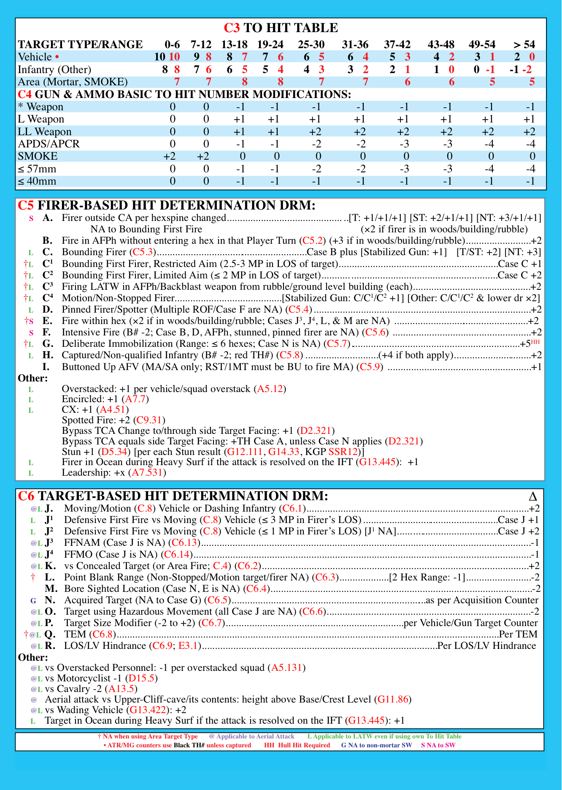

```text
                                        C3 TO HIT TABLE
TARGET TYPE/RANGE           0-6  7-12  13-18  19-24   25-30   31-36   37-42    43-48   49-54   > 54
Vehicle •                 10 10   9  8  8   7  7   6   6   5   6   4    5   3   4   2   3   1  2   0
Infantry (Other)            8  8  7  6  6   5  5   4   4   3   3   2    2   1   1   0   0 -1   -1 -2
Area (Mortar, SMOKE)          7     7      8      8       7       7       6        6       5      5
C4 GUN & AMMO BASIC TO HIT NUMBER MODIFICATIONS:
* Weapon                     0      0     -1     -1      -1      -1      -1       -1      -1      -1
L Weapon                     0      0     +1    +1      +1       +1      +1      +1      +1      +1
LL Weapon                    0      0     +1    +1      +2       +2      +2      +2      +2      +2
APDS/APCR                    0      0     -1     -1      -2      -2      -3       -3      -4      -4
SMOKE                       +2    +2       0     0       0        0       0        0      0       0
≤57mm                        0      0     -1     -1      -2      -2      -3       -3      -4      -4
≤40mm                        0      0     -1     -1      -1      -1      -1       -1      -1      -1
```

```text
C5 FIRER-BASED HIT DETERMINATION DRM:
   S  A.   Firer outside CA per hexspine changed..............................................[T: +1/+1/+1] [ST: +2/+1/+1] [NT: +3/+1/+1]  (×2 if firer is in woods/building/rubble)
                   NA to Bounding First Fire
      B.   Fire in AFPh without entering a hex in that Player Turn (C5.2) (+3 if in woods/building/rubble).........................+2
   L  C.   Bounding Firer (C5.3)..........................................................Case B plus [Stabilized Gun: +1]  [T/ST: +2] [NT: +3]
 †L   C^1  Bounding First Firer, Restricted Aim (2.5-3 MP in LOS of target).............................................................Case C +1
 †L   C^2  Bounding First Firer, Limited Aim (≤2 MP in LOS of target)...................................................................Case C +2
 †L   C^3  Firing LATW in AFPh/Backblast weapon from rubble/ground level building (each).............................................+2  Motion/Non-Stopped Firer.........................................[Stabilized Gun: C/C^1/C^2 +1] [Other: C/C^1/C^2 & lower dr ×2]
 †L   C^4
   L  D.   Pinned Firer/Spotter (Multiple ROF/Case F are NA) (C5.4)...................................................................................+2  Fire within hex (×2 if in woods/building/rubble; Cases J^3, J^4, L, & M are NA) ...................................................+2
  †S  E.
   S  F.   Intensive Fire (B# -2; Case B, D, AFPh, stunned, pinned firer are NA) (C5.6) .....................................................+2
 †L   G.   Deliberate Immobilization (Range: ≤6 hexes; Case N is NA) (C5.7)................................................................+5^HH
   L  H.   Captured/Non-qualified Infantry (B# -2; red TH#) (C5.8)............................(+4 if both apply)..............................+2
      I.   Buttoned Up AFV (MA/SA only; RST/1MT must be BU to fire MA) (C5.9) .......................................................+1
Other:
   L       Overstacked: +1 per vehicle/squad overstack (A5.12)
   L       Encircled: +1 (A7.7)
   L       CX: +1 (A4.51)
           Spotted Fire: +2 (C9.31)
           Bypass TCA Change to/through side Target Facing: +1 (D2.321)
           Bypass TCA equals side Target Facing: +TH Case A, unless Case N applies (D2.321)
           Stun +1 (D5.34) [per each Stun result (G12.111, G14.33, KGP SSR12)]
   L       Firer in Ocean during Heavy Surf if the attack is resolved on the IFT (G13.445):  +1
   L       Leadership: +x (A7.531)
```

```text
C6 TARGET-BASED HIT DETERMINATION DRM:                                                                                                 ∆
   @L J.    Moving/Motion (C.8) Vehicle or Dashing Infantry (C6.1).....................................................................................+2
   L   J^1  Defensive First Fire vs Moving (C.8) Vehicle (≤3 MP in Firer’s LOS)....................................................Case J +1
   L   J^2  Defensive First Fire vs Moving (C.8) Vehicle (≤1 MP in Firer’s LOS) [J^1 NA].......................................Case J +2
   @L J^3   FFNAM (Case J is NA) (C6.13)..............................................................................................................................-1
   @L J^4   FFMO (Case J is NA) (C6.14).................................................................................................................................-1
   @L K.    vs Concealed Target (or Area Fire; C.4) (C6.2)......................................................................................................+2
   †   L.   Point Blank Range (Non-Stopped/Motion target/firer NA) (C6.3)...................[2 Hex Range: -1].........................-2
       M. Bore Sighted Location (Case N, E is NA) (C6.4)....................................................................................................-2
   G   N.   Acquired Target (NA to Case G) (C6.5)..........................................................................as per Acquisition Counter
   @L O.    Target using Hazardous Movement (all Case J are NA) (C6.6)..............................................................................-2
   @L P.    Target Size Modifier (-2 to +2) (C6.7)....................................................................per Vehicle/Gun Target Counter
  †@L Q.    TEM (C6.8)..................................................................................................................................................Per TEM
   @L R.    LOS/LV Hindrance (C6.9; E3.1)..........................................................................................Per LOS/LV Hindrance
Other:
   @L vs Overstacked Personnel: -1 per overstacked squad (A5.131)
   @L vs Motorcyclist -1 (D15.5)
   @L vs Cavalry -2 (A13.5)
   @ Aerial attack vs Upper-Cliff-cave/its contents: height above Base/Crest Level (G11.86)
   @L vs Wading Vehicle (G13.422): +2
   L   Target in Ocean during Heavy Surf if the attack is resolved on the IFT (G13.445): +1
                     † NA when using Area Target Type  @ Applicable to Aerial Attack       L Applicable to LATW even if using own To Hit Table
                       • ATR/MG counters use Black TH# unless captured       HH  Hull Hit Required      G NA to non-mortar SW  S NA to SW
```

<!-- pdf-page 190 -->

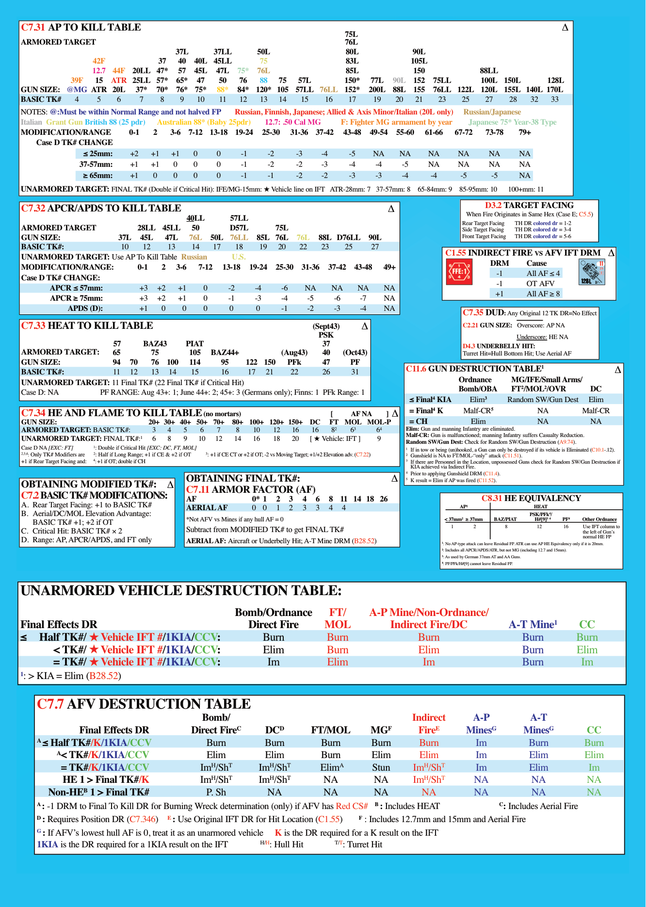

```text
C7.31 AP To kIll TAblE                                                                                                               ∆
                                                                                75l
ARmoRED TARGET                                                                  76l
                                      37l      37ll       50l                   80l             90l
                  42F             37   40  40l 45ll        75                   83l             105l
                  12.7 44F  20ll 47*   57  45l  47l  75*  76l                   85l             150              88ll
            39F   15  ATR 25ll 57*    65*  47    50   76   88  75   57l         150*  77l  90l  152  75ll        100l 150l       128l
GuN sIzE: @mG ATR 20l       37*  70*  76*  75*  88*  84*  120* 105  57ll 76ll   152* 200l  88l  155  76ll 122l   120l 155l 140l 170l
bAsIC Tk#    4     5    6    7    8    9   10    11   12   13  14    15    16   17     19   20   21    23   25    27    28   32   33
NOTES: @:must be within Normal Range and not halved FP    Russian, Finnish, Japanese; Allied & Axis minor/Italian (20l only)  Russian/Japanese
Italian  Grant Gun british 88 (25 pdr)  Australian 88* (baby 25pdr)  12.7: .50 Cal mG  F: Fighter mG armament by year  Japanese 75* Year-38 Type
moDIFICATIoN/RANGE         0-1   2   3-6 7-12 13-18  19-24 25-30  31-36 37-42  43-48  49-54 55-60  61-66   67-72  73-78   79+
    Case D Tk# ChANGE
               ≤ 25mm:     +2   +1   +1   0     0     -1     -2     -3    -4     -5    NA    NA     NA     NA      NA     NA
               37-57mm:    +1   +1    0   0     0     -1     -2     -2    -3     -4    -4     -5    NA     NA      NA     NA
               ≥ 65mm:     +1    0    0   0     0     -1     -1     -2    -2     -3    -3     -4     -4     -5      -5    NA
uNARmoRED TARGET: FINAL TK# (Double if Critical Hit): IFE/MG-15mm: ★Vehicle line on IFT   ATR-28mm: 7   37-57mm: 8    65-84mm: 9    85-95mm: 10      100+mm: 11
C7.32 APCR/APDs To kIll TAblE                                                             ∆                       D3.2 TARGET FACING
                                         40ll      57ll                                                      When Fire Originates in Same Hex (Case E; C5.5)
ARmoRED TARGET               28ll  45ll   50       D57l        75l                                          Rear Target Facing  TH DR colored dr = 1-2
                                                                                                            Side Target Facing  TH DR colored dr = 3-4
GuN sIzE:               37l  45l   47l   76l   50l 76ll   85l 76l   76l  88l D76ll   90l                    Front Target Facing  TH DR colored dr = 5-6
bAsIC Tk#:               10   12    13    14   17    18    19  20   22    23    25    27                C1.55 INDIRECT FIRE vs AFv IFT DRm      ∆
uNARmoRED TARGET: Use AP To Kill Table Russian      u.s.                                                           DRm      Cause
moDIFICATIoN/RANGE:          0-1   2  3-6   7-12  13-18 19-24  25-30 31-36  37-42 43-48  49+                         -1     All AF ≤ 4
Case D Tk# ChANGE:                                                                                                   -1     OT AFV
       APCR ≤ 57mm:          +3   +2   +1    0     -2     -4    -6    NA    NA     NA    NA                          +1     All AF ≥ 8
       APCR ≥ 75mm:          +3   +2   +1    0     -1     -3    -4    -5     -6    -7    NA
            APDs (D):        +1    0    0    0     0      0     -1    -2     -3    -4    NA                  C7.35 DuD: Any Original 12 TK DR=No Effect
C7.33 hEAT To kIll TAblE                                                (sept43)    ∆                        C2.21 GuN sIzE:   Overscore: AP NA
                                                                         Psk                                              Underscore: HE NA
                       57     bAz43      PIAT                             37                                 D4.3 uNDERbEllY hIT:
ARmoRED TARGET:        65       75       105   bAz44+           (Aug43)   40   (oct43)                       Turret Hit=Hull Bottom Hit; Use Aerial AF
GuN sIzE:              94  70   76  100  114     95    122  150   PFk     47     PF            C11.6 GuN DEsTRuCTIoN TAblE^1                      ∆
bAsIC Tk#:             11  12   13  14    15     16     17  21    22      26     31
uNARmoRED TARGET: 11 Final TK# (22 Final TK# if Critical Hit)                                               ordnance    mG/IFE/small Arms/
Case D: NA          PF RANGE: Aug 43+: 1; June 44+: 2; 45+: 3 (Germans only); Finns: 1  PFk Range: 1        bomb/obA    FT^2/mol^2/ovR      DC
                                                                                               ≤ Final^4 kIA  Elim^3   Random SW/Gun Dest  Elim
C7.34 hE AND FlAmE To kIll TAblE (no mortars)                               [          AF NA        ]  ∆  = Final^4 k  Malf-CR^5  NA      Malf-CR
GuN sIzE:                      20+ 30+ 40+ 50+ 70+  80+ 100+ 120+ 150+ DC   FT  mol mol-P      = Ch            Elim            NA           NA
ARmoRED TARGET: BASIC TK#:      3   4   5   6   7    8   10   12   16  16   8^2  6^3   6^4     Elim: Gun and manning Infantry are eliminated.
uNARmoRED TARGET: FINAL TK#:^1  6   8   9   10  12  14   16   18   20  [ ★ Vehicle: IFT ]  9   malf-CR: Gun is malfunctioned; manning Infantry suffers Casualty Reduction.
                                                                                               Random sW/Gun Dest: Check for Random SW/Gun Destruction (A9.74).
Case D NA [EXC: FT]  1: Double if Critical Hit [EXC: DC, FT, MOL]                              1 If in tow or being (un)hooked, a Gun can only be destroyed if its vehicle is Eliminated (C10.1-.12).
2,3,4: Only TK# Modifiers are  2: Half if Long Range; +1 if CE & +2 if OT  3: +1 if CE CT or +2 if OT; -2 vs Moving Target; +1/+2 Elevation adv. (C7.22)  2 Gunshield is NAto FT/MOL-“only” attack (C11.51).
+1 if Rear Target Facing and:  4:+1 if OT; double if CH                                        3 If there are Personnel in the Location, unpossessed Guns check for Random SW/Gun Destruction if
                                                                                                KIA achieved via Indirect Fire.
                                         obTAINING FINAl Tk#:                              ∆   4 Prior to applying Gunshield DRM (C11.4).
obTAINING moDIFIED Tk#:             ∆                                                          5 K result = Elim if AP was fired (C11.52).
C7.2bAsIC Tk# moDIFICATIoNs:             C7.11 ARmoR FACToR (AF)
A. Rear Target Facing: +1 to BASIC TK#   AF              0* 1  2  3  4  6   8 11 14 18 26                        C8.31 hE EQuIvAlENCY
B. Aerial/DC/MOL Elevation Advantage:    AERIAl AF       0 0   1  2  3  3   4  4                            AP^1              hEAT
                                         *Not AFV vs Mines if any hull AF = 0                           < 37mm^2 ≥ 37mm      Psk/PFk^4/
   BASIC TK# +1; +2 if OT                                                                                           bAz/PIAT  h#[9]^3 ^4  PF^4  other ordnance
C. Critical Hit: BASIC TK# × 2           Subtract from MODIFIED TK# to get FINAL TK#                      1    2       8       12    16   Use IFT column to
                                                                                                                                          the left of Gun’s
D. Range: AP, APCR/APDS, and FT only     AERIAl AF: Aircraft or Underbelly Hit; A-T Mine DRM (B28.52)                                     normal HE FP
                                                                                                       1: No AP-type attack can leave Residual FP. ATR can use AP HE Equivalency only if it is 20mm.
                                                                                                       2: Includes all APCR/APDS/ATR, but not MG (including 12.7 and 15mm).
                                                                                                       3: As used by German 37mm AT and AA Guns.
                                                                                                       4: PF/PFk/H#[9] cannot leave Residual FP.
uNARmoRED vEhIClE DEsTRuCTIoN TAblE:
                                                     bomb/ordnance          FT/       A-P mine/Non-ordnance/
Final Effects DR                                        Direct Fire        mol             Indirect Fire/DC             A-T mine^1       CC
≤    half Tk#/ ★vehicle IFT #/1kIA/CCv:                    Burn            Burn                   Burn                     Burn         Burn
        < Tk#/ ★vehicle IFT #/1kIA/CCv:                     Elim           Burn                   Elim                     Burn         Elim
        = Tk#/ ★vehicle IFT #/1kIA/CCv:                      Im            Elim                    Im                      Burn           Im
1: > KIA = Elim (B28.52)
    C7.7 AFv DEsTRuCTIoN TAblE
                                             bomb/                                              Indirect       A-P           A-T
              Final Effects DR            Direct Fire^C     DC^D       FT/mol         mG^F        Fire^E     mines^G       mines^G         CC
    A ≤ half Tk#/k/1kIA/CCv                   Burn          Burn          Burn        Burn        Burn          Im           Burn         Burn
         A< Tk#/k/1kIA/CCv                    Elim          Elim          Burn        Elim        Elim          Im           Elim         Elim
          = Tk#/k/1kIA/CCv                  Im^H/Sh^T     Im^H/Sh^T       Elim^A      Stun      Im^H/Sh^T       Im           Elim          Im
          hE 1 > Final Tk#/k                Im^H/Sh^T     Im^H/Sh^T       NA           NA       Im^H/Sh^T      NA            NA            NA
       Non-hE^b 1 > Final Tk#                 P. Sh          NA           NA           NA         NA           NA            NA            NA
    A : -1 DRM to Final To Kill DR for Burning Wreck determination (only) if AFV has Red CS#   b : Includes HEAT     C: Includes Aerial Fire
    D : Requires Position DR (C7.346)    E : Use Original IFT DR for Hit Location (C1.55)       F : Includes 12.7mm and 15mm and Aerial Fire
    G : If AFV’s lowest hull AF is 0, treat it as an unarmored vehicle  k is the DR required for a K result on the IFT
    1kIA is the DR required for a 1KIA result on the IFT   H/H: Hull Hit     T/T: Turret Hit
```

<!-- pdf-page 191 -->

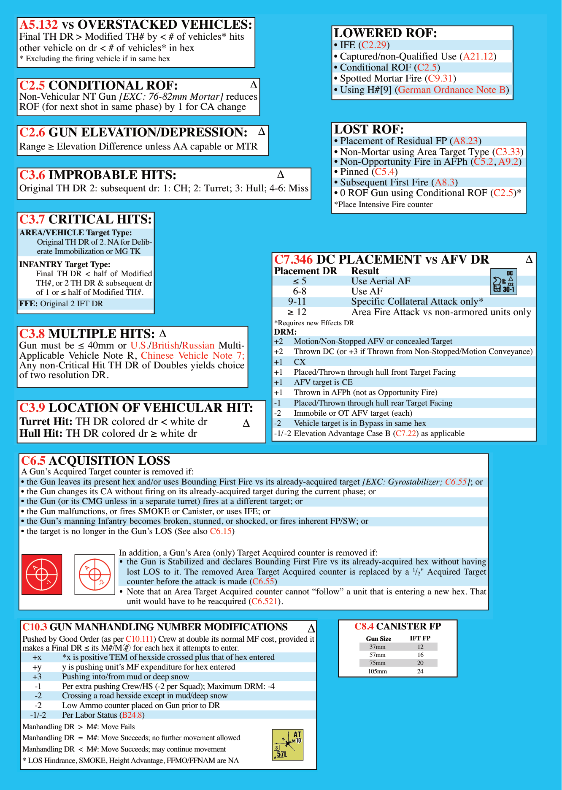

```text
A5.132 VS OVERSTACKED VEHICLES:
Final TH DR > Modified TH# by < # of vehicles* hits
other vehicle on dr < # of vehicles* in hex
* Excluding the firing vehicle if in same hex
```

```text
C2.5 CONDITIONAL ROF:                           ∆
Non-Vehicular NT Gun [EXC: 76-82mm Mortar] reduces
ROF (for next shot in same phase) by 1 for CA change
```

```text
C2.6 GUN ELEVATION/DEPRESSION: ∆
Range ≥Elevation Difference unless AA capable or MTR
```

```text
C3.6 IMPROBABLE HITS:             ∆
Original TH DR 2: subsequent dr: 1: CH; 2: Turret; 3: Hull; 4-6: Miss
```

```text
C3.7 CRITICAL HITS:
AREA/VEHICLE Target Type:
     Original TH DR of 2. NAfor Delib-
     erate Immobilization or MG TK
INFANTRY Target Type:
    Final TH DR < half of Modified
    TH#, or 2 TH DR & subsequent dr
    of 1 or ≤half of Modified TH#.
FFE: Original 2 IFT DR
```

```text
C3.8 MULTIPLE HITS: ∆
Gun must be ≤ 40mm or U.S./British/Russian Multi-
Applicable Vehicle Note R, Chinese Vehicle Note 7;
Any non-Critical Hit TH DR of Doubles yields choice
of two resolution DR.
```

```text
C3.9 LOCATION OF VEHICULAR HIT:
Turret Hit: TH DR colored dr < white dr      ∆
Hull Hit: TH DR colored dr ≥white dr
```

```text
LOWERED ROF:
• IFE (C2.29)
• Captured/non-Qualified Use (A21.12)
• Conditional ROF (C2.5)
• Spotted Mortar Fire (C9.31)
• Using H#[9] (German Ordnance Note B)
```

```text
LOST ROF:
• Placement of Residual FP (A8.23)
• Non-Mortar using Area Target Type (C3.33)
• Non-Opportunity Fire in AFPh (C5.2, A9.2)
• Pinned (C5.4)
• Subsequent First Fire (A8.3)
• 0 ROF Gun using Conditional ROF (C2.5)*
*Place Intensive Fire counter
```

```text
C7.346 DC PLACEMENT VS AFV DR                                ∆
Placement DR       Result
     ≤5            Use Aerial AF
     6-8           Use AF
   9-11            Specific Collateral Attack only*
   ≥12             Area Fire Attack vs non-armored units only
*Requires new Effects DR
DRM:
+2   Motion/Non-Stopped AFV or concealed Target
+2   Thrown DC (or +3 if Thrown from Non-Stopped/Motion Conveyance)
+1   CX
+1   Placed/Thrown through hull front Target Facing
+1   AFV target is CE
+1   Thrown in AFPh (not as Opportunity Fire)
-1   Placed/Thrown through hull rear Target Facing
-2   Immobile or OT AFV target (each)
-2   Vehicle target is in Bypass in same hex
-1/-2 Elevation Advantage Case B (C7.22) as applicable
```

```text
C6.5 ACQUISITION LOSS
A Gun’s Acquired Target counter is removed if:
• the Gun leaves its present hex and/or uses Bounding First Fire vs its already-acquired target [EXC: Gyrostabilizer; C6.55]; or
• the Gun changes its CA without firing on its already-acquired target during the current phase; or
• the Gun (or its CMG unless in a separate turret) fires at a different target; or
• the Gun malfunctions, or fires SMOKE or Canister, or uses IFE; or
• the Gun’s manning Infantry becomes broken, stunned, or shocked, or fires inherent FP/SW; or
• the target is no longer in the Gun’s LOS (See also C6.15)
                           In addition, a Gun’s Area (only) Target Acquired counter is removed if:
                           • the Gun is Stabilized and declares Bounding First Fire vs its already-acquired hex without having
                             lost LOS to it. The removed Area Target Acquired counter is replaced by a ^1/2" Acquired Target
                             counter before the attack is made (C6.55)
                           • Note that an Area Target Acquired counter cannot “follow” a unit that is entering a new hex. That
                             unit would have to be reacquired (C6.521).
C10.3 GuN mANhANDlING NumbER moDIFICATIoNs                                    ∆            C8.4 CANISTER FP
Pushed by Good Order (as per C10.111) Crew at double its normal MF cost, provided it          Gun Size  Gun Size  IFT FP
makes a Final DR ≤ its M#/M #  for each hex it attempts to enter.                              37mm         12
   +x      *x is positive TEM of hexside crossed plus that of hex entered                      57mm         16
   +y      y is pushing unit’s MF expenditure for hex entered                                  75mm         20
   +3      Pushing into/from mud or deep snow                                                 105mm         24
    -1     Per extra pushing Crew/HS (-2 per Squad); Maximum DRM: -4
    -2     Crossing a road hexside except in mud/deep snow
    -2     Low Ammo counter placed on Gun prior to DR
  -1/-2    Per Labor Status (B24.8)
Manhandling DR  >  M#: Move Fails
Manhandling DR  =  M#: Move Succeeds; no further movement allowed
Manhandling DR  <  M#: Move Succeeds; may continue movement
* LOS Hindrance, SMOKE, Height Advantage, FFMO/FFNAM are NA
```
