# D. VEHICLES

```text
ORDER OF PRESENTATION:
    1. Vehicle Counters            9.  Vehicles as Cover
   2.  Vehicular Movement         10.  Wrecks
    3. AFV Combat                 11.  Gyrostabilizers & Schuerzen
   4.  Terrain Modifications to   12.  Horse-Drawn Transport
       Anti-Vehicle Fire          13.  Vehicular Smoke Dispensers
    5. Inherent Crew              14.  Radioless AFV
   6.  Transporting Personnel     15.  Motorcycles & Bicycles
    7. Overruns (OVR)             16.  DD Tanks & Amphibians
   8.  Immobilization & Bog       17.  Aerosans
```

<!-- pdf-page 192 -->

**D.1 VEHICLE LISTINGS:** Due to the complexity of AFV data and the minor variations in each model type, vehicle data has been compiled into master listings to supplement the data contained on the counters. Players should consult the Vehicle Listings in Chapter H before each scenario to fully familiarize themselves with the special capabilities of any vehicle that appears in that particular scenario. The Vehicle Listings contain in chart form the information printed on each vehicle counter, plus other data such as the vehicle’s weight and special notes pertaining to its unique traits (if any) that require further explanation. Any Listing data followed by a dagger symbol (†) indicates a specific Vehicle Note that should be consulted for exceptions/explanations pertinent to that data. When a Note creates an exception to the normal use of a particular rule, that Note takes precedence.

**D.2 ANIMAL MOVEMENT:** Horse- (and other animal-) drawn transport is considered vehicular except that it uses MF as opposed to MP and therefore is governed by different rules of movement (12.1). All other vehicles use MP—not MF. Horses/cavalry and animal-drawn transport which end their move in a building/woods hex while using Bypass are left straddling the hexside facing their CAFP in the same manner as a vehicle in stationary Bypass.

**D.3 PREP FIRE:** Should any vehicle/its-PRC fire in its PFPh, it may neither move in the subsequent MPh nor fire during that MPh or the subsequent AFPh (although Passengers/Riders that have not yet fired may unload in the MPh; 6.5).

#### D.4 CA

**D.4 CA:** A rule that refers to a change in CA without specifying any difference between VCA and TCA is considered relevant to both.

**D.5 SECRET DR/dr:** The rules will occasionally require a player (in the absence of a judge) to make a “Secret DR/dr” which presents the player with the dilemma of his opponent making a DR/dr for him which the latter can see but which the former cannot, while still being able to later verify the result. Below are two House Rules recommended in increasing order of required preparation. Fake DR/dr, e.g., for non-existent A-T mines, or for unnecessary Reliability DR, are NA, whether secret or not.

**D.5A DICE CUP:** The player places the die or dice in an opaque cup and turns it upside down on the table, being careful to check the results so that only he can see. Later, when verification is needed, the cup is lifted to reveal the DR/dr. If both a DR and a dr are required (as per 8.23), use two white dice for the DR and a colored die for the dr and resolve both simultaneously. Similar color substitutions can be made under your own House Rules to resolve any number of DR/dr with a single resolution, provided they are specified in advance.

**D.5B CARDS:** The player should prepare two specially composed decks from conventional playing cards. The DR deck consists of 36 cards (one 2, two 3’s, three 4’s, four 5’s, five 6’s, six 7’s, five 8’s, four 9’s, three 10’s, two Jacks (11’s), and one Queen (12). The dr deck will consist of 24 cards (four each of Ace through 6) of another back pattern style. The player can resolve his Secret DR/dr by selecting a card at random from the appropriate deck and leaving it face down until verification is necessary.

**D.6 VEHICULAR-TARGET HITS vs PRC:** First Fire DRM (FFNAM & FFMO) never apply to PRC as long as they remain on their vehicle. PRC can never be fired on separately by ordnance *[EXC: motorcyclists; 15.5]*, but if Vulnerable can still be affected Collaterally by such attacks (D.8).

**D.7 MOBILE/IMMOBILE:** A Mobile vehicle is one capable of movement during its MPh because it is not Immobile (i.e., because it is not bogged, immobilized, mired, or Abandoned, and whose Inherent crew is not broken, Shocked or Stunned). A vehicle that cannot move in its MPh due to being radioless (14.23), or because it is TI or has already Prep Fired, is still considered Mobile.

**D.8 COLLATERAL ATTACKS:** Generally, when a vehicle is in a Location where occupants are subjected to incoming FP or a To Kill DR, that vehicle’s Vulnerable PRC can also be affected by that attack. This effect vs Vulnerable PRC is called a Collateral Attack, and can occur in two ways. The first is via an attack that does not have the vehicle as its predesignated target (e.g., Small Arms Fire, OBA, or use of the Infantry or Area Target Type); this type of attack affects the PRC normally (i.e., causes a General Collateral Attack since it applies equally to all occupants of that Location; A7.4). The second way is via an attack that must “specify” the vehicle as its predesignated target (e.g., ordnance, MG vs AFV, minefield, etc.); this type of attack primarily affects the vehicle, with the PRC receiving the secondary effects of that attack as a Specific Collateral Attack. A Collateral Attack (whether General or Specific) is resolved as a separate attack vs the vehicle’s Vulnerable PRC immediately subsequent to the resolution of the attack vs the vehicle, using the attacking weapon’s/ammo type’s IFT FP (which includes HE Equivalency; C8.31) and the same Original Effects DR that resolved the attack vs the vehicle *[EXC: No Collateral Attack occurs if the vehicle is destroyed outright (5.6). If the crew/Passenger(s) are/become shocked (C7.42) or stunned (5.34), a Collateral Attack applies only to the vehicle’s Riders (6.23). See 6.84 for crews that cannot be BU.]*. Multiple Hits (C3.8) do not cause extra Collateral Attacks. A Collateral Attack receives no increased benefit due to Multiple Hits, nor does it leave Residual FP (A8.2).

**D.8A SPECIFIC:** When a vehicle is attacked (such that a DR is made on the IFT or a To Kill Table) as a predesignated target but not destroyed, etc., any Vulnerable PRC in/on it are subject to a full strength Specific Collateral Attack as per D.8 above. The only DRM which applies is that for any applicable CE status. No other unit in the same Location is affected by the FP of a Specific Collateral Attack. A Deliberate Immobilization hit never causes a Specific Collateral Attack.

**D.8B GENERAL:** When a vehicle is subjected to (but not destroyed, etc. by) FP which is not required to predesignate it as the target, any Vulnerable PRC in/on it are subject to a General Collateral Attack as per D.8 above, but modified normally for range, Hindrances, TEM/CE DRM, etc.—just as if the Vulnerable PRC were the only target being attacked. Additionally, the Vulnerable PRC of any other vehicle in the same Location are also subject to the same General Collateral Attack (but possibly with different modifiers due to their CE/Motion status, etc.). A General Collateral Attack is just a special name for the application of the original attack to a vehicle’s Vulnerable PRC. (See Collateral Attack Table and Example at the top of the next page.)

```text
              COLLATERAL ATTACK TABLE^1
Weapon                    Target:  AFV      Unarmored Vehicle
MG/IFE/Small Arms^2                 G^3            G
FT                                   S             G
DC^6                                 S^7           G
MOL^8                               S/G            G
A-P Mines^9/A-T Mines^10             S              S
OBA/Infantry-and-Area-               G             G
Target-Types/Canister
Vehicle Target Type^4                S             S^5
```

<!-- pdf-page 193 -->

S: Specific Collateral Attack applies vs Vulnerable PRC of that vehicle. G: General Collateral Attack applies vs all Vulnerable PRC in that Location. 1 Collateral Attack is NA if vehicle is destroyed. If crew/Passengers are/become stunned or shocked, Collateral Attack applies only to the vehicle’s Riders. 2 Includes ATR when used as Small Arms (C13.24), but not MG To Hit/To Kill. 3 Firing at Vulnerable PRC directly on the IFT (rather than making To Hit/To Kill DR vs the AFV) is termed a General Collateral Attack since the AFV is unaffected (A7.3, A9.6-.611). Collateral Attack is NA if hit results in Dud (C7.35).

4 Collateral Attack is NA if target is motorcyclist(s).

5 Collateral Attack is NA if DC malfunctions. If a Final Position DR (C7.346) was

6 ≥ 9, a new DR is made to resolve the Collateral Attack. 7 	 Collateral Attack applies as determined by Position DR (C7.346). 8 	 If the MOL Check dr (A22.611) is successful, the ensuing Small Arms-MOL attack is resolved vs the AFV by means of a To Kill DR on the MOL column of the C7.34 HE & Flame To Kill Table. This same DR also serves as a Specific Collateral Attack (using both the Small Arms FP and the MOL’s 4 FP) vs the AFV’s Vulnerable PRC, and as a normal IFT attack (using only the Small Arms FP) vs all other non-armored units in the AFV’s Location. 9 	 Only applies if vehicle becomes immobilized; crew (only) is not Vulnerable if vehicle is AFV with all hull AF \> 0 (B28.43). Collateral Attack is 16 FP vs PRC (NA vs crew if vehicle is AFV with all hull

10 AF \> 0; B28.52). EX: During their MPh, the German  SPW 251/1 and 4-6-8 squad Armor Assault (9.31) into X1. The American 7-4-7 attempts To Hit the halftrack firing the HMG as ordnance (A9.61). After securing a hit and keeping ROF with an Original TH DR of ≤ 6 (Modified TH# 10 - 4 [+1 Wreck Hindrance, +2 Moving Target, +1 Small Target = 4]), the HMG fails to destroy or Stun the halftrack since its TK DR of 5 is greater than the Final TK# of 4 (Base 4 + 1 Case D - 1 AF). The CE Crew immediately undergo a Specific Collateral Attack using the HMG’s 6 IFT FP (as would any CE [i.e., unbroken] Passengers). Modified only by the +2 CE DRM, the Original TK DR of 5 becomes a Final IFT DR of 7, which results on the 6 FP column in a NMC on the Crew, which they pass. Because the HMG was firing as ordnance, the 7-4-7 could not firegroup with it. If the HMG had lost ROF, its attack would leave 1 Residual FP in X1 (reduced from 2 Residual due to the +1 Hindrance), but the Collateral Attack itself does not leave Residual FP. The halftrack and squad continue moving in X1 as the halftrack changes VCA to Y1-Y2 and the squad attempts (but fails) to place a Smoke grenade. The 7-4-7 uses the HMG’s ROF to attack again, but this time on the IFT; the 7-4-7 firegroups with the HMG for 13 FP. The Original IFT DR of 8 results in a 9 on the 12 FP column for a NMC for the moving squad (8 +1 Hindrance +1 Armored Assault -1 FFNAM = 9). The attack cannot harm the halftrack (A9.611) and the resulting General Collateral Attack has No Effect on the Vulnerable Crew after the +3 DRM (+2 CE, +1 Hindrance) is added to the Original IFT DR of 8.

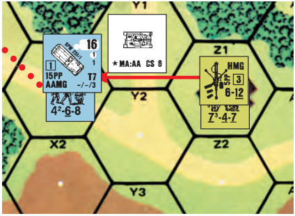

## 1. VEHICLE COUNTERS

[All vehicles are represented by <sup>5</sup>/8" counters bearing an overhead depiction of the vehicle (which for most is drawn to a scale roughly corresponding to the hex size of *Deluxe ASL*) and an assortment of data pertaining to its size, movement, defense, and attack strengths. Although all vehicles have that information listed in chart form in their respective nationality’s Vehicle Listing, the most commonly used data can be determined from the graphic layout of the counter. See also C2.9.]

**1.1 MOVEMENT TYPE:** For land movement purposes there are five types of vehicles (1.11-.15). Each *[EXC: Motorcycle]* is readily identified by the shape of the white symbol behind the large MP number in the upper right-hand corner of the counter. Any numerical superscript to the right of the MP number represents the vehicle’s amphibious MP allotment (16.2); the movement type of the vehicle on land is still determined normally. If the MP number is printed in red, the vehicle is prone to mechanical breakdown (2.5).

**1.11 MOTORCYCLE:** A vehicle classified as a Motorcycle for movement purposes is recognizable by its white counter and its obvious overhead depiction.

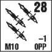

**1.12 ARMORED CAR:** A vehicle classified as an Armored Car for movement purposes is recognizable by the white circular background (representing a wheel) behind its MP number (EX: German PSW 234/1 armored car).

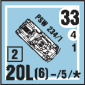

**1.13 FULLY TRACKED:** A vehicle classified as Fully Tracked for movement purposes is recognizable by the white oval (representing a track) behind its MP number (EX: German PzKpfw IVH tank).

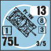

**1.14 HALF-TRACKED:** A vehicle classified as a Halftrack for movement purposes is recognizable by the white combination circle-oval (representing a track and a wheel) behind its MP number (EX: German SPW 251/1 halftrack).

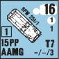

**1.15 TRUCK:** A vehicle classified as a Truck for movement purposes is recognizable by the white double circles “figure eight” symbol (representing two wheels) behind its MP number (EX: Russian GAZ-MM truck; Russian BA-20 armored car).

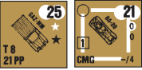

**1.2 ARMOR STATUS:** Every vehicle falls into at least one of four Armor status categories. If a vehicle has any armor (1.6) it is referred to as an Armored Fighting Vehicle (AFV) and is subject to many special rules. The main advantage of an AFV is that it cannot be harmed by Small Arms on the IFT (although its PRC may be Vulnerable to such fire in certain situations) unless struck through an unarmored Target Facing/Aspect.

**1.21 UNARMORED:** An unarmored vehicle is recognizable by the presence of two H symbols (in red, white or black) vertically aligned beneath the MP number (EX: German Opel truck; German SdKfz 7 halftrack). AFV can be treated as unarmored vehicles vs certain types of attack; see 5.311 and B28.42.

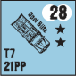

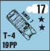

**1.22 PARTIALLY ARMORED:** An AFV that has armor protection along only its front and side Target Facings is recognizable by the presence of a H symbol along the right-hand margin beneath its Side/Rear AF. If a “T” appears beside the H, only the turret/upper-superstructure Aspect (C3.9) of the rear Target Facing is unarmored (EX: German Marder III(t)H).

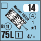

<!-- pdf-page 194 -->

**1.23 OPEN-TOPPED (OT):** An AFV whose entire overhead depiction is printed on a white background is an OT AFV (EX: German SPW 251/1 halftrack).

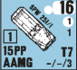

**1.24 CLOSED-TOPPED (CT):** An AFV with neither a H, nor a white background for its overhead depiction, is a CT AFV (EX: German PzKpfw IVH tank).

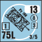

**1.3 MAIN ARMAMENT (MA) TYPE:** Each armed vehicle has one MA Inherent weapon. The MA is shown as a large number representing its MA Gun Caliber Size (C2.21), or by the appropriate acronym for its MA MG, FT or ATR, in the bottom left-hand corner of the counter. The MA is either turret-mounted (1.31-.322) or bow-mounted (i.e., non-turreted; 1.33) *[EXC: MA AAMG; 1.83]*.

**1.31 FAST TURRET TRAVERSE (T):** Any MA of the “T” Type (which generally represents a three-man turret crew) is recognizable by a large but thin white circle on the counter (EX: German PzKpfw IVH tank).

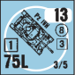

**1.32 SLOW TURRET TRAVERSE (ST):** Any MA of the “ST” Type (which generally represents a two-man turret crew or heavy, manual-traverse turret) is recognizable by a large but thin white square on the counter (EX: German Panther tank).

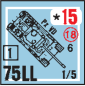

**1.321 RESTRICTED SLOW TRAVERSE (RST):** Some tanks of the ST Type<sup>1</sup> had a turret/crew arrangement such that the MA and CMG could not be used while the commander was CE. Such a MA Type is termed “RST” (symbolized by a large thick white square), and is considered a ST Type but can fire neither its MA nor its CMG while CE (EX: Russian BT-5 tank).

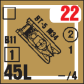

**1.322 ONE-MAN TURRET (1MT):** Any MA of the “1MT” Type is recognized by a large thick white square with no corners (EX: German PzKpfw IB tank). A 1MT AFV is considered a ST Type, but can fire neither its MA nor its CMG while CE. In addition, any 1MT AFV that is Stunned is automatically Recalled (5.341) and may not become CE for the remainder of its time onboard.

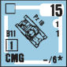

**1.33 NON-TURRETED (NT):** Any MA of the “NT” Type *[EXC: MA AAMG; 1.83]* is recognizable by having no MA Type white circle/square on the counter (EX: German StuG IIIB assault gun). All bow-mounted weapons fall into this category.

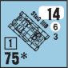

**1.34 SECONDARY ARMAMENT (SA):** Some vehicles have a SA weapon, which is indicated on the counter in the same manner as, but above and in a smaller typeface than, the MA *[EXC: the SA is prefixed with a “T” if turret-mounted or a “B” if bow-mounted]* (EX: Italian M11/39 tank). A weapon must also be specifically listed in the SA column of that vehicle’s entry line in its Vehicle Listing in order to be considered SA.

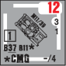

**1.4 IDENTITY & GROUND PRESSURE:** Each vehicle is identified by name (sometimes in shortened form) beside its overhead depiction, and individually by letter in the upper left-hand corner of the counter. The ID letter is used to identify different vehicles of the same type for record-keeping/Target-Acquisition-(C6.58) purposes. Each vehicle’s Ground Pressure is listed as Low, Normal or High for Bog DR (8.21) purposes.

**1.41 LOW GROUND PRESSURE:** Any vehicle whose ID letter is encased in a square has Low Ground Pressure (EX: German PzKpfw IB tank).

**1.42 NORMAL GROUND PRESSURE:** Any vehicle whose ID letter is not encased in a circle or square has Normal Ground Pressure (EX: German StuG IIIB assault gun).

**1.43 HIGH GROUND PRESSURE:** Any vehicle whose ID letter is encased in a circle has High Ground Pressure (EX: Russian BA-20 armored car).

**1.5 TOWING (T#)/PORTAGE (#PP):** If a vehicle is allowed to tow a Gun, its counter will have a “T#” to indicate how heavy a Gun it can tow (C10.1). If a vehicle can carry Personnel/SW as Passengers, its counter will be marked in the form “#PP” to indicate the vehicle’s maximum Passenger capacity (6.1).

**1.6 ARMOR FACTOR (AF):** Every AFV is rated as to the quality of its armor protection for both its front and side/rear Target Facings, as well as for both its hull and turret/upper-superstructure aspects, by the two numbers vertically aligned beneath its MP number. Armor is given a rating called an AF.<sup>2</sup> There are 11 different AF in the game: 0, 1, 2, 3, 4, 6, 8, 11, 14, 18, 26. Unless Partially-Armored, each AFV actually has four AF (which may or may not differ from each other): one each for its front (i.e., for the front Target Facing of its) hull, front turret/upper-superstructure, side/rear hull, and side/rear turret/upper-superstructure.

**1.61 FRONT ARMOR:** The upper printed AF is the AFV’s front hull AF and, unless encased in a box or circle (1.63-.64), is also its front turret/ upper-superstructure AF.

**1.62 SIDE/REAR ARMOR:** The lower printed AF is the AFV’s side/ rear hull AF and, unless encased in a box or circle (1.63-.64), is also its side/rear turret/upper-superstructure AF.

**1.63 SUPERIOR TURRET:** A printed AF encased in a square indicates that the AFV’s turret/upper-superstructure AF for that Target Facing is \> that hull AF. The Superior-Turret AF is calculated by increasing that printed AF to the next-higher AF value given in 1.6. EX: The front hull AF of the German StuPz IV is 11, but its front upper-superstructure AF is 14. Its side/rear hull AF is 3, but its side/rear upper-superstructure AF is 4.

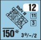

**1.64 INFERIOR TURRET:** A printed AF encased in a circle indicates that the AFV’s turret/upper-superstructure AF for that Target Facing is \< that hull AF. The Inferior-Turret AF is calculated by decreasing that printed AF to the next-lower AF value given in 1.6. EX: The front hull AF of the Russian T-50 tank is 6, but its front turret AF is 4. Its side/rear hull AF is 4, but its side/rear turret AF is 3.

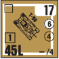

**1.7 TARGET SIZE:** All vehicles are rated for one of five possible Target Sizes, as follows:

**1.71 VERY LARGE:** A vehicle whose upper and lower AF (or H symbols) are both red is subject to a -2 Case P To Hit DRM when fired on (EX: German PzJg Tiger TD).

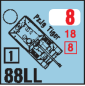

**1.72 LARGE:** A vehicle whose upper AF (or H symbol) is red is subject to a -1 Case P To Hit DRM when fired on (EX: German Panther tank).

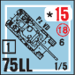

**1.73 AVERAGE:** A vehicle whose upper and lower AF (or H symbols) are both black is subject to no Case P To Hit DRM when fired on (EX: German PzKpfw IVH tank).

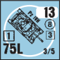

**1.74 SMALL:** A vehicle whose upper AF is printed on a white dot (or whose upper H symbol is white) is eligible for a +1 Case P To Hit DRM when fired on (EX: German PzKpfw IIF tank).

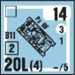

<!-- pdf-page 195 -->

**1.75 VERY SMALL:** A vehicle whose upper and lower AF are each printed on a white dot (or whose H symbols are both white) is eligible for a +2 Case P To Hit DRM when fired on (EX: German Kfz 1 Kuebelwagen).

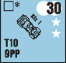

**1.76 CONCEALMENT:** If a vehicle is concealed, special rules apply concerning its Target Size TH DRM, see A12.2.

**1.8 VEHICULAR MG/FT:** A vehicle with Inherent MG armament is identified by the MG FP factors printed in the lower right-hand corner in the configuration “b/c/a”, with b = Bow MG FP, c = Coaxial MG FP, and a = AAMG FP. If no AAMG is present, the shortened form “b/c” is used. If a vehicle has an Inherent FT, its mounting configuration (B = Bow NT; T = Turret; S = Side-hull [see the pertinent Vehicle Note]), FP, and X*#* are printed in red; if the FP is underscored, its Normal Range is two hexes (see A22.1).

**1.81 BOW MG (BMG):** A BMG is a bow-mounted MG, and thus may fire only at a target that lies within its vehicle’s VCA *[EXC: see 4.223, 8.5 and C2.6]*. The Normal Range of a BMG is eight hexes. A few AFV have a hull RMG (Rear MG), which is represented by an “R*#*” superscript after the BMG FP. A hull RMG is equivalent to a BMG *[EXC: it may fire only at a target that lies either within its rear hull Target Facing or in its own hex but not in OVR]*. A BMG factor printed over a white dot represents a Fixed-Mount MG, which receives a +1 DRM to all fire at a moving unit (including moving vehicular target; C.8).

**1.82 COAXIAL MG (CMG):** The CMG FP may be used only when firing through the TCA. The Normal Range of a CMG is 12 hexes. Use of a CMG against other than an acquired target causes loss of any pre-existing Acquisition (C6.5) by the MA. Some AFV have a turret Rear MG which is reflected by the superscript “<sup>R#</sup>” after the CMG FP. A turret Rear MG has a Normal Range of eight hexes, may not be used in OVR or the same phase in which the MA fires, and can fire only through its rear turret Target Facing or at a target in the same hex (see 3.5). If a vehicle’s CMG is restricted to firing only through its VCA (shown by “CMG: VCA Only” on the counter back), that CMG may not be used to attack in CC but it does serve to void the -1 CC DRM for an attack vs a vehicle “without manned, functioning MG armament” (A11.51). Mandatory Fire Direction (A9.4) does not apply to CMG.

**1.83 ANTI-AIRCRAFT MG (AAMG):** The AAMG FP may be used either within or outside of its vehicular current TCA/VCA at no penalty; i.e., for rules purposes it is considered neither “turret-mounted” nor “bow-mounted” (3.51) *[EXC: AAMG with restricted CA (e.g., German StuG IIIG or French H35) must pay the applicable Case A penalty for changing TCA/VCA as appropriate]*. Unlike the BMG/CMG FP of a CT AFV or any MG on an unarmored vehicle, an AFV AAMG must be manned by CE (5.3) crew members in order to be used; a BU AFV cannot use its AAMG FP (although a Hero could do so in either case; A15.23). The Normal Range of an AAMG is eight hexes.

**1.84 OPTIONAL ARMAMENT:** Some vehicles have different armament assortments. Procedures for purchasing such added armament in DYO scenarios are provided in H1.41. However, in official scenarios only the armament configuration illustrated in the scenario OB is available unless the number of such vehicles required exceeds the number provided in the game, in which case the excess can be composed of vehicles with optional armament (of the owner’s choice) provided that armament is available within that time frame.

**1.9 WRECK:** Most vehicles have a wreck depiction on a white background on their reverse side. If no wreck is depicted on the reverse of the counter, it (and any attendant fire/smoke) is removed from play when the vehicle is eliminated. The reverse of each counter also lists special information pertinent to that counter: Special Ammunition Depletion Numbers (C8), Gyrostabilizer (11.1), Smoke Dispensers (13), Crew Survival Number (5.6-.7), lack of radio (14), and other miscellaneous notes.

## 2. VEHICULAR MOVEMENT

#### 2.1

**2.1** A vehicle may expend up to its full MP allotment (and tracked vehicles may even exceed it at some risk; ESB, 2.5) during its own MPh in accordance with the COT entered, as listed on the pertinent MP Entrance Cost column of the Terrain Chart. The mechanics of vehicular movement are the same as for Infantry (A4.2 & A8.1). During his MPh, a player may move all, some, or none of his vehicular units, provided that each one he wishes to move did not fire during the preceding PFPh, is not TI, and is Mobile *[EXC: Radioless AFV; 14.23]*. A vehicle can be moved in any direction or combination of directions up to the limit of its MP allotment. A vehicle may enter one or more enemy-occupied hexes during the MPh— although at some risk, and perhaps at additional MP cost. A vehicle which ends its MPh with MP remaining is assumed to use all those MP in that hex. Once a vehicle has moved to a new hex/hexside during its MPh (even if it is currently stopped or Immobile), it is still considered a moving target (To Hit Case J) to any Defensive Fire because it entered a new hex/hexside during that MPh (C.8). A vehicle may never move during the APh.

**2.11 VCA CHANGES:** The Vehicular Covered Arc is the CA (C3.2) of a vehicle based on the front of that vehicle. During setup and movement, care must always be taken to ensure that the VCA is clearly defined (along one of the six hexspines of its currently occupied hex) as it expends MP to change its hex/VCA. VCA can be changed only at the cost of one MP per hexspine change (two MP per hexspine change if actually in [not in bypass of] a building/woods/rubble or any combination thereof). VCA changes (if not on a road) in difficult terrain (see Terrain Chart) require a Bog Check (8.2). A vehicle must move within its current VCA as it enters each hex *[EXC: Reverse Movement]*. For a vehicle to move directly to a hex outside its current VCA it must first expend one MP per hexspine changed to change its VCA within its currently-occupied hex, or use Reverse Movement. The MP expenditure for a change of VCA within a vehicle’s currently-occupied hex must be announced separately for each hexspine change so that the DEFENDER may intervene to Defensive First Fire at the target at that point, although this alone would not qualify the vehicle as a moving target (C.8). A VCA can also be changed following a successful Motion Attempt (2.401), as a result of firing outside its CA during any fire phase (other than its own MPh; C5.1), or at the end of any fire phase in which it is still eligible to fire a turret/bow-mounted weapon (3.12 and C3.22).

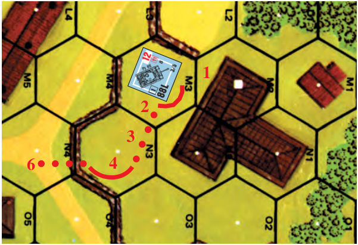

EX: A moving tank in 3M3 with a VCA of L2-M2 must expend two MP in M3 in order to change its VCA two hexspines to N2-N3 so that it can move into N3 by expending one more MP in N3. Its VCA is now O3-O4 and it can enter either of those hexes, but instead it pays another MP to change its VCA one hexspine to O4-N4 so that it can move to N4.

**2.12 STARTING:** A vehicle not under a Motion counter must expend one MP to start movement before entering a new hex or changing its VCA during the MPh. Unless Reverse Movement (2.2) is declared, forward movement is assumed. The Starting MP expenditure is considered to take place in the currently occupied hex (thereby making it subject to Defensive First

<!-- pdf-page 196 -->

Fire in that hex although not as a moving target; C.8). A Starting MP expenditure is not necessary if entering from off-board because such units are assumed to have set up in Motion (A2.52).

**2.13 STOPPING:** A vehicle must expend one additional MP in its current hex to stop movement, unless it is ending its MPh under a Motion counter (2.4). If it stops (e.g., to fire or to fake fire), it may begin to move again during that MPh if it has MP remaining, but must pay the Starting MP expenditure to do so. Even though stopped, the vehicle is considered a moving target if it entered a new hex/hexside during that Player Turn or began its MPh in Motion (C.8).

**2.14 WRECK/VEHICLES:** A vehicle *[EXC: motorcycle]* must pay one additional MP (or MF for a wagon) per wreck or vehicle (not motorcycle) in a hex (regardless of nationality) to enter that hex. This penalty is doubled to two MP per wreck or vehicle in the hex if the hex is entered via a road hexside while using the road movement rate, and can be doubled again for certain types of roads (see Note D of Terrain Chart).

**2.15 MINIMUM MOVE:** A Mobile vehicle may attempt to move just one hex per MPh into permissible terrain if the MP Entry cost of that hex is \> the vehicle’s printed MP allotment. This is done by declaring a Minimum Move attempt and moving into the new hex while expending all its MP allotment (other than any towing MP (C10.1)/any starting MP required in the hex being exited) as it does so, making any Bog (8.2) DR required for normal entry of that hex, and (if still Mobile) being placed under a Motion counter. VCA change or entry of a blocked One-Lane bridge or Sunken Lane, are prohibited to a vehicle during a MPh in which it attempts a Minimum Move. See 2.24 for Reverse Minimum Move. If the (now in Motion) vehicle wishes to fire, 2.42 applies. A vehicle which *stalls* (e.g., German Vehicle Listing Notes F and H, and Russian Note M in Chapter H) while attempting to start may not claim a Minimum Move during that Player Turn.

**2.16 ROAD RATE:** The <sup>1</sup>/2 MP rate for a motorized vehicle crossing a road hexside is doubled to one MP if the vehicle is a BU (5.2) AFV.

**2.17 DELAY:** The expenditure of MP without moving is termed Delay and can be used only while the vehicle is stopped or using platoon movement (14.21). This might be done to increase its MP expenditure in LOS of its target during that MPh before firing (so as to use To Hit Case C instead of Case C<sup>1</sup> or C<sup>2</sup>), to change its TCA (3.12), or to draw enemy Defensive First Fire, or to use up part of its MP allotment while stopped before starting to move.

##### 2.18

**2.18** A vehicle is not prohibited from expending more MP to enter a hex than the minimum required, and may, as it enters a new hex, declare a higher-than-necessary MP expenditure.

**2.2 REVERSE MOVEMENT:** Occasionally a vehicle may wish to leave its present hex without directly entering a hex within its VCA, but cannot (or does not want to) change its VCA within its current hex. Reverse movement is then its only option. Motorcycles, and vehicles towing Guns or trailers, may not use Reverse Movement.

**2.21 MP COST:** Reverse Movement costs quadruple the normal MP entry cost for tracked vehicles, triple for trucks, and double for most armored cars. Exceptions to these Reverse MP classifications are listed on the reverse of the applicable counters in the form “REV × #” with “#” being the number used to multiply normal MP cost for Reverse Movement. If a MP multiplier or penalty were already in effect (such as doubled MP costs for VBM) for normal entry of a hex, the Reverse Movement multiplier would be applied to the total cost of entry of that hex, including any penalties/ multipliers for any purpose other than stopping/starting movement.

EX: A stopped BT-7 M37 tank in 2FF5 with VCA FF4-GG5 uses VBM and Reverse Movement to back out of FF5 to FF6 and EE7. It costs the tank nine MP ((2 [VBM] × 1 [Open Ground] = 2 MP) × 4 [Reverse Movement] = 8 +1 [starting] = 9 MP)) to enter FF6 in Reverse and another four MP to back into EE7 (4 [Reverse Movement] × 1 [Open Ground] = 4 MP) since it cannot change its VCA in obstacle hex FF6 (2.33) unless it continues Bypass in that hex.

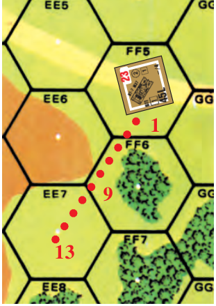

**2.22 RESTRICTIONS:** Any hex entered with Reverse Movement must be one of the two hexes which formed the rear vehicular Target Facing of the vehicle prior to that move, and the only hexside that can be Bypassed by that Reverse Move is the hexside joining those two hexes. Once backed into its new hex, it may change its VCA (barring other restrictions) within that new hex at the normal cost. EX: Continuing the 2.21 example, the BT-7 M37 could not use VBM and Reverse Movement to Bypass hexside FF6-GG6. With its VCA at FF4-GG5 it could Bypass only along hexside FF6-EE6.

**2.23 START/STOP:** Unless Reverse Movement is specified upon expending a Starting MP, forward movement is assumed. A vehicle combining both forward and Reverse movement in the same MPh must pay a MP to stop and another MP to start again as it switches from one direction to the other.

**2.24 REVERSE MOTION:** “Reverse Motion” counters are provided in *WEST OF ALAMEIN*, the use of which enables a vehicle to end its MPh in Motion while using Reverse Movement *[EXC: NA if the vehicle is prohibited from using Reverse Movement]*, and also enables it to make a Reverse Minimum Move. When using Reverse Motion/Minimum-Move, the principles of and rules for Motion, Minimum Move and Reverse apply unchanged except for obvious differences due to the vehicle’s direction of movement. EX: Continuing the 2.21 example, assume the BT-7 M37 is in Motion in 2FF5 with VCA FF4-GG5 and decides to Reverse move into hill hex EE6. It will cost two MP to stop and again start movement, and 20 MP to reverse into EE6 (4 [Reverse Movement] × (1 [Open Ground] +4 [move to higher elevation] = 5) = 20) for a total MP expenditure of 22, plus one more MP to stop. Rather than spending the MP to stop, it could instead end the MPh in Reverse Motion—without expending any additional MP, since it does not have sufficient MP remaining to enter the next hex it desires to enter (2.4).

**2.3 VEHICULAR BYPASS MOVEMENT (VBM):** VBM enables vehicles (and animal-drawn transport) to move through a building/woods hex at a reduced MP (MF) cost without risking Bog penalties for movement through those obstacles. The MP cost of VBM is double that of the hex’s non-obstacle terrain (usually Open Ground) per hexside traversed; any additional terrain cost in that hex (such as SMOKE or a move to higher elevation) is also doubled. The vehicle is moving around the obstacle within the hex—not through the obstacle. Therefore, the interior of each hexside traversed must be clear of any obstacle depiction to the depth of an edge of a unit counter for VBM to be usable. Hold a unit counter vertically so that the entire thickness of the hexside is just visible along the edge—if the other edge touches any obstacle depiction, VBM is not allowed along that hexside. Walls/hedges are considered extensions of hexsides for this rule. If players cannot agree on whether a hexside is obstructed, resolve the matter with a dr (as per A6.1). The hexside clearance measurement cannot be made until the VBM and all applicable MP costs are announced (and thus expended in the previously occupied hex/hexside if the move is subsequently not allowed). If the hexside clearance is insufficient, the vehicle must expend one extra MP to stop in its present position—even if it then proceeds to start movement again in another direction.

<!-- pdf-page 197 -->

EX: A vehicle using VBM to enter 3I10 from J10 must pay ten MP ((4 MP [higher elevation] +1 MP [Open Ground] = 5) × 2 [VBM] = 10 MP). EX: If a vehicle were Bypassing the woods in J10 along the J10-I10 hexside (assuming there was room enough), another vehicle in I10 could not Bypass the building along the I10- J10 hexside.

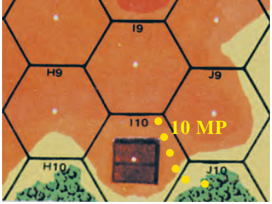

**2.31 RESTRICTIONS:** VBM is not allowed in any rubble hex, across any hexside connected directly to a roadblock hexside (B29.4), or in any hex containing a ground-level terrain Blaze. VBM is allowed only in woods/building hexes and only to Bypass those specific obstacles—not other terrain depictions which may be in the same hex. VBM is not allowed along a hexside already containing another Bypass vehicle/wreck along that hexside.

**2.32 VCA & TARGET FACING:** A vehicle in Bypass has a different (and much more restrictive) VCA because it is now traversing a hexside rather than a hex. When using VBM, the vehicle counter is placed on the hexside being traversed so that it straddles the hexside, with the VCA corner of the counter resting on the vertex of that hexside in the direction the vehicle is facing. This vertex is called the Covered Arc Focal Point (CAFP) and is the point in the hex where all fire to and from the vehicle is traced while using VBM or Stationary Bypass in that hex. The Bypass VCA consists of the hex directly in front of the vehicle formed by that vertex, the hexes of the two diagonal rows of hexes that converge on that hex, and all the hexes between those two converging diagonal hex rows. The Bypass VCA also doubles as the VBM front Target Facing as per the following diagram. The Target Facing of a hit vs a vehicle in Bypass is based on the hex *it originated from (not the target hexside crossed as per nor- mal Target Facing; 3.2)*; to score a rear hit the shot must have originated from a hex in the target’s rear Target Facing. If a firer is itself on a CAFP that separates two adjacent Target Facings of the Bypass target, that fire is resolved as per C.5B. Any shot not originating from within a Bypass Target’s front or rear Target Facing is considered to strike it in the side Target Facing (e.g., a hull hit from a weapon in the hex being Bypassed).

**2.321 BYPASS TCA:** A vehicle in Bypass has only four points on which to base its TCA: The CAFP (Front), the reverse of the CAFP (Rear), and the two hexes it is straddling (Side)—at least one of which will be largely obstructed by the obstacle it is Bypassing. A side TCA is shown by placing the TCA counter so that it points at one of the two side corners of its AFV counter. A TCA based on a Bypass side Target Facing covers a potentially much larger Field of Fire (all hexes on that side of the firer between the front and rear Target Facings) and consequently must pay appropriate Case A (C5.1) penalties for firing within this enlarged CA *even if it does not change its TCA [EXC: a weapon firing with an already earned Target Acquisition DRM (or, in the case of a CMG/IFE/Canister, vs the same Known target in the same Target Facing as last fired on) does not have to add Case A to fire within its current CA]*. A TCA change to or through a Bypass side Target Facing must suffer an additional +1 To Hit DRM in addition to normal Case A DRM. A vehicle in Bypass must measure its Case A DRM in terms of Target Facings moved by the TCA, not hexsides. (See first Example in Right column.)

**2.33 VCA CHANGES:** VCA changes by a vehicle using VBM are limited to the two hexsides of the VCA at the CAFP (i.e., the two hexspines of its CAFP which are not straddled by its counter). Therefore, a Bypassing vehicle desiring to move must either move (outright or via Bypass) into the hex which forms the base of its VCA, or pay one MP for a VCA change to continue Bypass along a connecting hexside of that CAFP (other than the one it just traversed), or use Reverse Movement. Even a fully-tracked 2.321 EX: Hexes 23BB4, AA5, BB5, Z5, AA6, and BB6 form the first six hexes of the front Target Facing and VCA of the PSW 234/2 in Bypass at BB3. Hexes CC3, CC2, DD2, CC1, DD1, and EE2 form the first six hexes of its rear Target Facing. All other hexes shown are part of one of its two side Target Facings. To fire on the     4-4-7 in AA4, the AFV will have to change its TCA to the side Target Facing and pays a +3 To Hit DRM for Case A (+2 [ST] +1 [Change to Bypass side Target Facing] = +3). Should it switch targets to the 6-2-8 in BB2 it must again pay the +2 To Hit DRM for Case A (ST), even though it is still firing in the same side Target Facing. Had it continued firing on the 4-4-7 instead, there would be no Case A To Hit DRM because it had already acquired that target. If the PSW 234/2 had changed its TCA all the way from the front to the rear so as to fire on DD1, the Case A To Hit DRM would be +4 (+3 [ST TCA change of two Target Facings] +1 [TCA Target Facing change to/through side Target Facing] = +4).

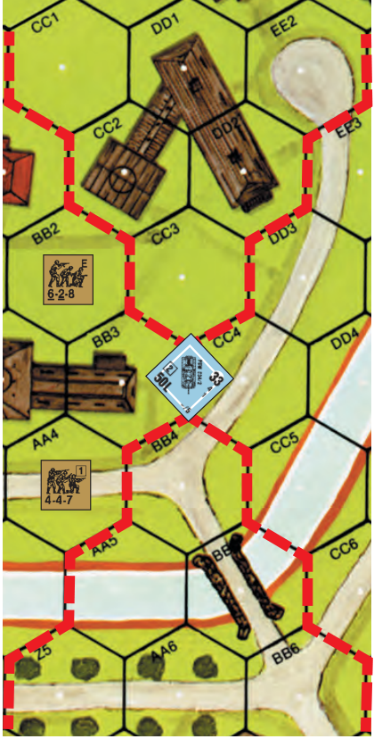

2.33 EX: A CE moving PzKpfw VIE in 1L1 with VCA K1-K2 spends <sup>1</sup>/2 MP (shown in red) to enter K1 along the road, and therein spends one MP to change its VCA from J0-J1 to J1-K2. It then moves into K2 using VBM along hexside K2-J1 at a cost of two more MP. Its CAFP is K2-J1-J2. It may now spend one MP to change its VCA, plus two MP to continue VBM in K2 along the K2-J2 hexside, to reach its new CAFP K2-K3-J2 at a total cost of 6<sup>1</sup>/2 MP; or it may leave the K2-J2-J1 CAFP become BU and enter the building in J2 at a cost of half its MP allotment (shown in yellow) and a Bog Check (8.21) with a +5 DRM, at a total cost of 9<sup>1</sup>/2 MP; or it may spend one MP to change its VCA to J2-J1, which will allow it to Bypass into J2 for another two MP to reach CAFP J2-J1-I2 (shown in blue) at a total cost of 6<sup>1</sup>/2 MP; or it may Stop, Start in Reverse, and use Reverse Movement into K1 for a total of 9<sup>1</sup>/2 MP. It cannot attempt VBM in J2 along the J2-K2 hexside because that hexside is too close to the building depiction in J2 (2.3), nor can it use Bypass in J1 because J1 is not a woods/ building hex.

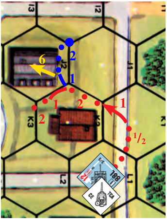

<!-- pdf-page 198 -->

CT AFV may not enter the obstacle of a hex it is currently Bypassing; it must first leave and re-enter the hex. A vehicle in stationary Bypass cannot change its VCA to take a shot; i.e., it can only change VCA if exiting that Bypass hexside. A VBM vehicle making a VCA change cannot voluntarily end its MPh in that position; it must move to the next CAFP or reverse into a new hex to its rear. If Defensive First Fired upon or Immobilized before it can complete its move, it is considered to be at the same CAFP and Target Facing last occupied before the VCA change. (See second Example on the previous page.)

**2.34 STATIONARY BYPASS:** Unlike Infantry, a vehicle may voluntarily end its MPh using Bypass. It remains straddled across the hexside last traversed, with the CAFP defining its position within the hex, its VCA, and its vehicular Target Facing. Its ability to change its VCA is limited as per 2.33.

**2.35 FIRING RESTRICTIONS:** A vehicle in Bypass may not fire any bow-mounted armament outside its current VCA since the vehicle is unable to readily change its VCA to take the shot. A TCA can be changed while in Bypass but that CA is considerably different (2.32).

##### 2.36 PRC

**2.36 PRC:** All Fire vs units embarking or disembarking from a Bypass vehicle must be traced to the CAFP of the vehicle—not the hex center. Infantry loading onto a vehicle (or PRC disembarking from one) in Bypass must do so in the hex occupied by the vehicle. Even though a Bypass vehicle straddles a hexside it is never considered in both hexes; it actually occupies the hex containing the obstacle it is Bypassing and its CAFP (C.5B).

##### 2.37 LOS

**2.37 LOS:** Fire to/from a vehicle in Bypass alters the LOS rules somewhat because of the need to trace fire to/from the CAFP instead of the hex center. The obstacle depiction in the firer/target hex can actually block LOS to/from outside the hex (or within the hex in the rare case of enemy vehicles in Bypass on different hexsides of the same hex) if it is crossed before reaching the CAFP. A wall/hedge hexside does not block LOS to/ from its hex even if the firer/target is in Bypass on the opposite side of that hex; such a vehicle in Bypass on the other side of that hex could not claim Wall Advantage (B9.32), or deny it to a unit adjacent to that wall/ hedge hexside.

##### 2.38 TEM

**2.38 TEM:** A vehicle in Bypass is in the Open Ground portion of the hex and is therefore not entitled to any beneficial TEM for the woods or building it is Bypassing *[EXC: Residual FP (A8.2); also, in certain hexes (e.g., 2I9 or 3I1) a vehicle can be in Bypass of a building but still be in woods]*.

**2.4 MOTION STATUS:** Any Mobile vehicle (including a boat or amphibian) which has used its entire printed MP allotment during its MPh, without expending a MP to Stop (2.13) or Delay (2.17) at the end of that MPh, is considered in Motion and covered with a Motion counter. A vehicle may end its MPh in Motion without expending all of its MP only if it has insufficient MP remaining to enter the next hex it wishes to enter. A Motion vehicle (i.e., one covered by a Motion counter) receives no extra MP, but at the start of its MPh it does not have to pay the one MP Starting cost (2.12) and is considered a moving target during that MPh even prior to entry of a new hex. A vehicle’s Motion counter is immediately removed when it starts movement in its next MPh or if the vehicle becomes Immobile. For a vehicle to not end its MPh in Motion status, it must always have one extra MP (beyond the total cost of the final hex entered) to expend as its Stopping MP (even if it means chancing an ESB DR to do so). A Motion tracked vehicle may use ESB but does not have to. A vehicle is marked with a Motion counter only before or after its MPh, not during it. A vehicle (and its PRC) which starts its Player Turn in Motion may not Prep Fire and must expend at least one MP (even if just to stop) during its MPh. A vehicle may not start a scenario set up onboard in Motion.

##### 2.401

**2.401** A Motion status attempt may be declared during the MPh of an enemy ground unit by any DEFENDING Mobile vehicle which makes a Motion attempt dr ≤ the number of MF/MP expended in its LOS by that unit during its MPh.<sup>3</sup> The enemy unit must be one that had not been in the vehicle’s LOS during that Player Turn prior to entering it during that MPh. If a subsequent (free) LOS Check proves that the unit had been in LOS during that Player Turn after all, the Motion attempt automatically fails. A vehicle may attempt Motion status only once per enemy MPh and may not attempt it at all if already marked with a First Fire (or Final/Intensive Fire) counter. There is no penalty (including “?” loss) for failing a Motion attempt dr other than the inability to gain Motion status during that Player Turn. A vehicle which gains Motion status during the enemy MPh is marked with a Motion counter and allowed to freely change its VCA/TCA (provided it passes any required Bog Check DR as a result), but may still use Motion Fire (Case C<sup>4</sup>) thereafter. Even a vehicle in Motion may make a Motion Attempt dr in this manner so as to freely change its VCA/TCA at that time. In any case, a successful Motion Attempt results in neither Motion nor VCA change if any mechanical reliability DR (2.51) results in Immobilization or stall. If the vehicle stalls, this is treated as a failed Motion Attempt only.

**2.41 TARGET CONSEQUENCES:** Any Motion vehicle is eligible for the Case J To Hit (Motion Target) DRM when fired upon, *regardless of fire phase*. The +2 DRM also applies to a Motion/Non-Stopped vehicle when attacked by DC (C7.346), MOL (A22.611), OVR (D7.12), or CC (A11.5), but not to any other attack resolved on the IFT. A Motion vehicle is never considered a LOS Hindrance/TEM.

**2.42 FIRING CONSEQUENCES:** A Motion/Non-Stopped vehicle/its- Passengers must add the Motion To Hit DRM (Case C<sup>4</sup>; C5.35) when firing ordnance. All other types of FP from such a vehicle (including FT/canister) and/or its Passengers’/Riders’ FP are halved as Motion Fire which is cumulative with any other FP modifications, such as AFPh Fire *[EXC: Thrown DC use +3 DRM instead (A23.6; C7.346)]* and Mounted Fire (6.22, 6.72).

**2.5 EXCESSIVE SPEED BREAKDOWN (ESB):** A tracked vehicle may attempt once per MPh (at any point during its move) to exceed its land MP allotment at the risk of Immobilization.<sup>4</sup> The maximum MP gain is limited to one-fourth (FRD) of the vehicle’s printed MP allotment. A vehicle attempting ESB must state the number of MP it is trying to gain and make an ESB DR, adding a +1 DRM for each extra MP (FRD) sought *[EXC: Any tracked vehicle whose MP allotment is printed in red is especially prone to breakdown and consequently must add a +1 DRM for each MP (FRU) sought in an ESB DR]*. In addition, the ESB DR is modified by the nationality DRM of the vehicle’s manufacturer (not its crew), as follows:

```text
ESB DRM Table
U.S. (a), Czech (t)               0
Russian (r), all Chinese         +1
British (b), German (g)          +2
French (f), Italian (i), Others  +3
```

Any Final ESB DR ≤ 11 is successful and gains the declared MP amount, which can be used in one or more hexes. If the Final ESB DR is ≥ 12, the vehicle is immobilized in/on its current hex/hexside (although it is still considered a moving target for the rest of that MPh/DFPh if it had entered a new hex in that MPh prior to attempting ESB or began its MPh in Motion).

**2.51 MECHANICAL RELIABILITY:** Each time an AFV having a red MP allotment expends a MP to start (or makes a successful Motion attempt; 2.401), its owner must make a DR; if a 12 is rolled, the AFV has suffered a mechanical breakdown and is immobilized.<sup>5</sup> If the owning player forgets to make this DR, the opposing player can thereafter call for it to be made at any time during that MPh as the AFV expends any MP. An AFV that suffers a Mechanical Reliability Immobilization is subject to Defensive First Fire (since it has expended a MP to start), but not as a moving target unless it had already entered a new hex/hexside during that MPh or started that MPh in Motion.

<!-- pdf-page 199 -->

**2.52 AXIS VEHICLES:** All Axis vehicles *[EXC: motorcycles]* in North African (as defined in F11.2) scenarios set prior to October 1941 are assumed to have their MP allotments printed in red (2.5-.51).<sup>5A</sup> Hence even wheeled Axis vehicles are subject to Mechanical Reliability DR (2.51) during that time period.

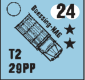

**2.6 ENEMY AFV:** A vehicle cannot voluntarily stop or end its MPh in Motion in an enemy AFV’s hex (whether Known or not) unless it can do so out of that AFV’s LOS (i.e., while Bypassing a hexside opposite that of the DEFENDER’s Bypass AFV), or unless it can, at the moment and position of entry into that hex, attack that AFV (regardless of its To Hit possibility) and be capable of destroying or shocking it with an Original TK or IFT DR of 5 (using a non-Depletable ammo type available to the vehicle). A vehicle thus barred from remaining in an AFV’s hex may not attempt ESB in that hex.

**2.7 ALL MP/MF EXPENDITURE:** Any hex entry listed on the Terrain Chart as requiring *ALL* of a unit’s movement capability (other than a Minimum Move which *must* end in Motion) still allows the unit any MP/MF necessary for starting (2.12), stopping (2.13), or towing (C10.1), but further movement is NA even if ESB or Gallop is declared.

## 3. AFV COMBAT

Most of the mechanics for AFV combat are covered by the rules of ordnance in Chapter C.

**3.1 COVERED ARC (CA):** A vehicle possessing turreted armament actually has two CA: a Vehicular CA for movement and bow-mounted weapons, and a Turret CA for turret-mounted weapons. The C3.2 definition of CA is applicable to both but may be based on different points of reference, depending on the orientation of the counter.

**3.11 VEHICULAR COVERED ARC (VCA):** The VCA is identical to the CA defined in C3.2, and is used for all bow-mounted weapons and vehicle movement, as well as determining Target Facing for any hull hit vs the vehicle.

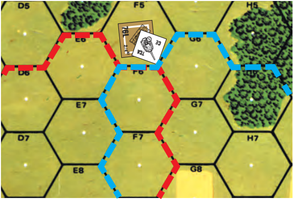

EX: The VCA is outlined in red, the TCA is outlined in blue.

**3.12 TURRET COVERED ARC (TCA):** The TCA determines the Field of Fire of all turret-mounted weapons, and differs from the VCA only when a turret counter is placed on the vehicle with the Gun pointing toward a different hexspine than that of the vehicle counter. Should the TCA and VCA coincide and the vehicle is a BU CT (or CE OT) AFV, there is no need for a turret counter and it is removed. However, whenever a vehicle fires a turret-mounted weapon outside its VCA (To Hit Case A), the VCA is not changed (unless the vehicle uses the NT DRM application of Case A). Instead, a turret counter is placed so that the fired-on target lies within the TCA (see 3.51). The TCA may change as a result of firing a turret-mounted weapon outside its current TCA and the VCA may change for firing a turret/bow-mounted weapon outside its current VCA (Case A), or at the end of any friendly fire phase in which the AFV is eligible to fire (a turret-mounted weapon for TCA or turret/bow-mounted weapon for VCA) without using Intensive Fire (as per C3.22). The TCA may also change freely with each MP expended during the MPh. The TCA change must be announced as the MP are expended but can coincide with MP expended for movement, stop, start, or Delay purposes; i.e., the MP cost for a TCA change is not in addition to other MP expenditures. The MP expenditure required for a TCA change during its MPh is doubled if in a woods or building obstacle (not Bypassing those obstacles or on a road) or rubble hex (C5.11). For Narrow Streets see B31.12. The Target Facing of any turret/upper superstructure hit is based on the target’s TCA—not its VCA.

**3.2 TARGET FACING:** When an AFV is hit it is necessary to determine the Target Facing of the AFV to determine what AF modifies the Modified TK#. Target Facing is determined as depicted in the diagram, depending on which target hexside is crossed by the firing unit’s LOS. Note the difference in the procedure for determining Target Facing for a target in Bypass (2.32). If the LOS of the firing unit runs exactly along a hexspine of the target hex which determines Target Facing, the Target Facing is that least favorable to the attacker. If the fire originates from within the target hex (Case E To Hit DRM; C5.5) the colored dr of the To Hit DR determines the Target Facing: 1-2 Rear, 3-4 Side, 5-6 Front *[EXC: Bypass; 2.32]*. FT/MOL/DC attacks made from within the same hex attack the Rear Target Facing, even vs Bypass vehicles. In the diagram, the shot along the E7-F7 hexspine is vs the front Target Facing.

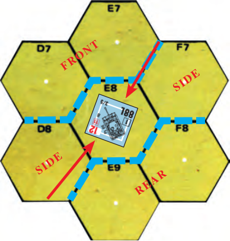

**3.3 BOUNDING FIRST FIRE:** Vehicles are not eligible for Opportunity Fire (A7.25), but unlike Infantry, a vehicle/its Passengers/Riders may move *and* also fire (or vice versa) in its MPh; this is termed Bounding First Fire. Any vehicle that fires during its MPh is using Bounding First Fire and is marked with a Bounding Fire counter *[EXC: if the only weapon fired did not exhaust its Multiple ROF]*. However, to use Bounding First Fire, any vehicular ordnance must use one of the Case C To Hit DRM (either Case C, C<sup>1</sup>, C<sup>2</sup>, or C<sup>4</sup>; see C5.3-.33, C5.35). The vehicle can expend additional Delay MP while stopped (including at the outset of its MPh prior to movement) by announcing their expenditure one at a time. A vehicle may move again in the same MPh after using Bounding First Fire (or just stopping) provided it has sufficient MP (even to the extent of stopping and firing a Multiple ROF Gun again; see C2.24). The DEFENDER can intervene to attempt Defensive First Fire after the announcement of expenditure of any MP (even Delay MP), but must do so before the announcement of the next MP expenditure or of Bounding First Fire; the target cannot be forced to return to a previously occupied hex or CA after it has announced a MP expenditure that legally changes its position. A vehicle (including its PRC) with either a Prep Fire or Bounding Fire counter cannot fire during its AFPh.

**3.31 MG/CANISTER/FT FIRE:** Any non-ordnance weapon *[EXC: FT; Gyrostabilized CMG vs acquired target (11.13)]* using Bounding (or Bounding First) Fire has its FP halved. If a vehicle fires any weapon other than its MA during the MPh it may not fire its other weapons/PRC during the AFPh.

<!-- pdf-page 200 -->

**3.32 FINAL FIRE:** Unlike Defensive First Fire, a vehicle using Bounding First Fire has no opportunity for an equivalent form of Bounding Final Fire. However, if the vehicle did not exhaust its Multiple ROF during its MPh, and did not fire any other weapons (including PRC) during its MPh, it may fire that Multiple ROF weapon (only) again once (C5.3) during its AFPh using the Case C To Hit DRM for ordnance, or halved FP for MG/IFE  if not in Motion; or Case C<sup>4</sup>/quartered FP, if in Motion.

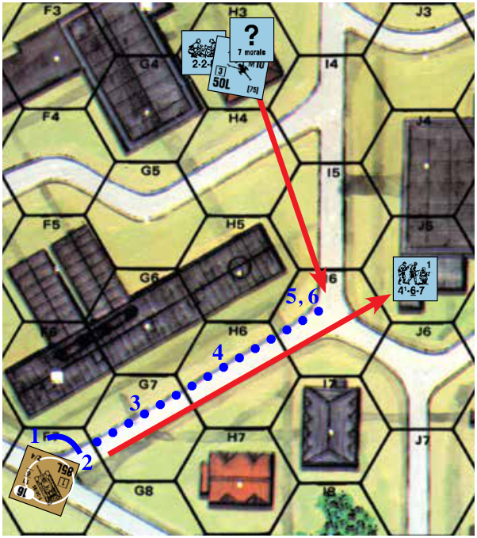

EX: It is the DFPh of the T34/85 in 1F7. It wishes to fire (using the Infantry Target Type) at the 4-6-7 in J5, so it must change its TCA one hexside from E7-F6 to F6-G7. Having done so, it may now fire at J5 with a +1 DRM for Case A due to changing a T Type Gun one hexside, a +1 DRM for being BU, and a +3 DRM for terrain (Case Q). During its MPh (shown by the blue dots) the T34/85 starts, changes its VCA to F6-G7, and moves to I6—expending a total of five MP before stopping. The 6th MP for stopping is the second MP expended in the LOS of the hidden AT Gun in H3 with a H4-I4 CA. The AT Gun immediately fires at the tank, with a +3 DRM for Case J<sup>1</sup>, before the tank can announce a Bounding First Fire attack on the 4-6-7 in J5. Although the AT Gun hits the tank, it does not penetrate its thick frontal armor. However, it did roll low enough on the colored dr of the To Hit DR to retain a Multiple ROF. The tank must now make an unenviable decision. If it uses Bounding First Fire to fire on the now  concealed AT Gun after first expending a MP to change its CA, it must use the +5 DRM of Case C<sup>1</sup>, plus Case I (BU), Case K (Concealed, C6.2) and Case Q (TEM), making a hit all but impossible (C3.6). Even if the tank were to roll a 1 on the colored dr of its TH DR and retain another shot, its To Hit chances remain negligible especially since it cannot acquire the concealed Gun. Spending an additional (Delay) MP to increase its stay in LOS of the target to 4 MP allows it to use the +4 DRM of Case C, but also allows the AT Gun to improve its next To Hit attempt by  switching to Case J (instead of J<sup>1</sup>) and would allow the AT Gun a potential of two more shots (one per MP expended) against the stopped tank (C6.17) if the AT Gun retains its Multiple ROF. Should the tank start up (7th MP) and change its VCA to J5-J6 (8th MP) in an attempt to move out of LOS (via J6 and K6) it could be fired on through its more vulnerable side Target Facing and/or in J6 (9th MP).

Starting up (7th MP) and moving toward the AT Gun with the intention of an OVR attack has the advantage of preserving the front Target Facing, but increases the penetration capabilities of the AT Gun (C7.24) and allows it as many as five (1: start up; 2: change CA; 3: enter I5; 4: enter I4; 5: enter H3) more potential shots (Multiple ROF C2.24; Intensive Fire C5.6; OVR Prevention; C5.64). All of which is a moot point since, even with a maximum ESB chance, the tank lacks the 22 MP necessary [8th MP to change VCA to H5-I5, 9th MP to enter I5, 10th MP to enter I4, 18th MP to enter H3 obstacle, and 22nd MP for OVR] to make the OVR (7.1). Failing to do anything and ending its MPh accomplishes nothing because the AT Gun can continue firing at it during the ensuing DFPh as long as it retains its Multiple ROF. The safest solution is to spend its 7th MP to start in reverse, and its 8th-11th to Reverse (2.21) back to H6 and out of LOS. The AT Gun may fire at it again in I6 before it leaves the hex because it expended another MP in I6 to start (C6.17).

**3.4 ARMOR LEADERS:** Infantry leaders have no effect on vehicular or Gun performance. However, a special class of leaders known as Armor Leaders can affect vehicular/vehicular Gun performance, although they have no effect on Personnel or non-vehicular Guns *[EXC: either an Armor or a Passenger leader can direct a FG consisting of its CE halftrack/Carriers and Passengers/Infantry/ Cavalry; see 6.64-.65]*. An Armor Leader is depicted in counter form by the silhouette of an exposed tank commander with rank, and a Strength Factor ranging from 8-1 to 10-2.

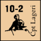

##### 3.41

**3.41** An Armor Leader is considered inherently present in the particular AFV his owner assigns him to, and his presence is noted on a side record. The Armor Leader counter remains out of play until the owner needs to use his morale/leadership factor to verify/avoid a result even if the AFV is CE (a normal CE counter is used to hide the true identity of the Armor Leader). The Armor Leader’s morale/leadership factor may be used both before and after he is revealed.

##### 3.42

**3.42** The inherent crew of a vehicle always has the same Morale Level as any Armor Leader in that vehicle. Should the Armor Leader pass/fail his MC/TC, the crew passes/fails also; a separate MC/TC DR for each is never made.

##### 3.43

**3.43** An Armor Leader affects only its own vehicle/crew (even a captured vehicle) and ceases to exist once the crew takes counter form. Should that particular vehicular crew counter reoccupy a vehicle, the Armor Leader will once again exist in that vehicle.

##### 3.44

**3.44** The leadership modifier of an Armor Leader can be used only to modify a *vehicle’s* MA DR (To Hit if ordnance; IFT otherwise), OVR DR, CC DR, HD Maneuver dr (4.22), halftrack FG (3.4), and Bog Removal DR. An Armor Leader cannot modify non-OVR MG/FT (unless MA) attacks, but neither does his use of an AAMG prohibit application of his leadership to other uses. Being BU does not void an Armor Leader’s effects, although BU penalties (Case I To Hit DRM) still apply. An Armor Leader’s negating a positive DRM of any kind is not sufficient to allow his vehicle to Interdict.

**3.45 INEXPERIENCED CREWS:** A SSR may specify certain armed vehicles to have Inexperienced Crews. Each such crew is treated as if it contains an inherent 6+1 Armor Leader, which is not shown in counter form. Usage of this “quasi-” Armor Leader is the same as for any normal Armor Leader *[EXC: his leadership modifier must be used whenever it is optionally usable by a normal Armor Leader; and the quasi-Armor Leader can never be eliminated or removed from its crew]*.

**3.5 VEHICULAR MG/IFE FIRE:** The MG/IFE armament of a vehicle, unlike a SW counter (A9.2), may make only one fire attack per Player Turn unless it is the vehicle’s MA with a specific Multiple ROF, in which case it and its ROF will be listed as the MA in the lower left-hand corner of the counter.<sup>6</sup> [*EXC: RMG/CMG/AAMG FP can be used more than once per Player Turn if counting their potential use in CC; see A11.62 for use of AFV MG in CC. MG/IFE may also be used more than once by vehicles making multiple OVR attacks (7.14)].* Non-CC vehicular MG fire is limited <!-- pdf-page 201 --> to the same fire phase (A.15) as the vehicle’s other weapons or that of its PRC; if any weapon is fired from a vehicle, the remaining weapons must fire in the same phase or forfeit their non-CC fire attack opportunity for that Player Turn *[EXC: Bounding (First) Fire; 3.31-.32]*. The FP of a vehicle’s various MG/IFE armaments may all be added together for one attack (assuming the target lies within their respective CA), or fired separately at different targets [Mandatory FG (A7.55) applies]. If fired together in one attack, the worst applicable CA DRM of any participating MG/IFE (3.52) applies to the total attack. The target can be the same unit attacked by the MA or a different target altogether. It makes no difference which weapon fires first. A vehicle may use MG fire on a target it cannot affect (e.g., to check the LOS before committing his MA to fire). See also 3.52- .54 and BU; 5.2.

**3.51 MAINTAINING CA:** Once a vehicle fires any turret-mounted weapon, any of its other turret-mounted weapons which fire within the current respective CA must pay the same CA Change penalty as the first weapon which fired. If, after firing, another turret-mounted weapon (or the MA which has retained a Multiple ROF) wishes to fire at another target outside the current TCA, the Case A TH DRM would be applicable based only on the move from the current TCA to the new TCA (C5.12) but only if the preceding shot(s) were taken at a Known enemy unit; otherwise no further change in TCA is allowed during that phase. These same principles also apply to bow-mounted weapons if changing the VCA to fire. If the VCA is changed, the TCA changes the same number of hexspines while retaining its position relative to the VCA. Any further changes of the TCA incurs normal TCA Case A DRM in addition to the NT Case A DRM of the VCA change *[EXC: Bounding First Fire does not pay CA change DRM (C5.13) nor does it prevent further changes in TCA/VCA]*. Once any vehicular weapon fires, its other weapons may fire in that phase only from that same hex *[EXC: OVR; and MA retaining a Multiple ROF may fire again from another hex if the previous shot(s) were Bounding First Fire]*.

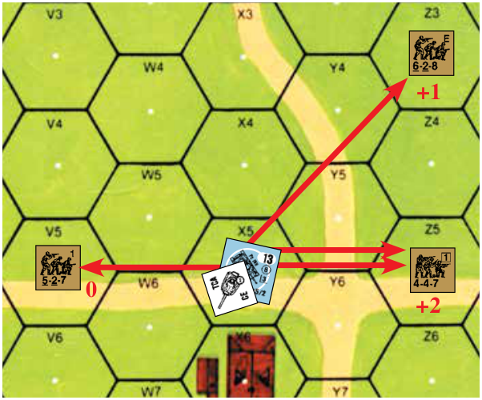

EX: It is the German PFPh and the CE Pz IVH in 19X5 with a VCA of X6-Y6 and a TCA of W6-X6 is about to pick its targets. The German wants to fire at all three Known Russian units so he decides not to combine any of his MG factors and to attack each target separately. He starts by using his AAMG vs the 5-2-7 because it pays no DRM for fire outside its CA (1.83) and its use has no effect on the tank’s other weapons. He decides not to fire his BMG because to do so he must change his VCA and that would require penalizing the first shot of all CA-restricted weapons firing as NT Gun Types rather than T Types (C5.11). He now decides to fire his CMG vs the 4-4-7 in Z5 but must pay a +2 DRM due to the two hexspine change in its TCA to Y6-Y5 (C5.1). The attack fails to harm the 4-4-7 so the tank fires his MA against the same target—again with a +2 DRM (but this time to the TH DR; 3.51). However, the TH DR contains a 1 on the colored dr so the tank maintains its Multiple ROF. The tank could now fire on the 4-4-7 with a -1 Acquisition TH DRM but decides against that and changes its TCA one more hexspine to X4-Y5 where it can fire on the 6-2-8 with a +1 Case A To Hit DRM (3.51 & C5.12). Assuming it again retains its Multiple ROF, it may fire on the 6-2-8 again with no Case A DRM (C5.12) and a -1 Acquisition TH DRM or it may change its TCA again—say two hexspines to W5-W6, where it may attack the 5-2-7 with a +2 Case A To Hit DRM. Using the same diagram, assume the tank changes its VCA two hexspines to X4-Y5. As a result, the TCA is now at Y5-Y6. If the BMG fires on Z3—it must do so with a +4 DRM (NT Gun Type; C5.11). If the TCA is also to change to X4-Y5 in order to fire at the same target, it must do so with a +5 DRM (+4 [two hexspine change with NT Gun Type] +1 [further TCA change from Y5-Y6 to X4-Y5 with a T Gun Type]). Now assume the tank changes its VCA from X6-Y6 to Y5-Y6, but the TCA changes from W6-X6 to W5-W6. The BMG would fire with a +3 Case A DRM, any turret-mounted weapon would fire with a +5 Case A DRM (+3 [one hexspine change for NT Gun Type] +2 [two further TCA hexspine changes for T Gun Type] = +5). Lastly, assume the tank changes its VCA from X6-Y6 to Y5-Y6, but the TCA remains at W6-X6. The BMG would fire with a +3 Case A DRM, but any turret-mounted weapon would fire with a +4 Case A DRM (+3 [one hexspine change for NT Gun Type] +1 [one further TCA hex-spine change for T Gun Type]).

##### 3.52

**3.52** Any BMG/CMG/IFE firing outside its current respective CA must add a DRM to its IFT DR equal to the pertinent To Hit DRM of Case A (Bow MG = NT, CMG = T or ST depending on Gun Type; 1.3). A vehicle which uses MG Bounding First Fire must use half FP instead *[EXC: Gyro- stabilized CMG vs Acquired Target; 11.13]* because a Bounding First Firer must always fire within its current CA (C5.13).

##### 3.53

**3.53** The Case B To Hit DRM does not apply to vehicle MG; the FP of any MG firing during the AFPh is halved instead, unless it is MA attempting a To Kill DR as ordnance (A9.61).

##### 3.54 vs AFV

**3.54 vs AFV:** A vehicular-mounted MG may not attempt a To Kill attack unless it is the vehicle’s MA. Another MG may never substitute for the listed MA of a vehicle.

#### 3.6 FT

**3.6 FT:** Vehicular-mounted FT are often more powerful than the Infantry SW variety of A22 and may have more FP, range, and different X# as depicted on the counter, but otherwise work the same *[EXC: Motion Fire; 2.42]*. Case A To Hit DRM apply as IFT DRM unless using Bounding First Fire (C5.13).

**3.7 MALFUNCTION:** Whenever a vehicle fires, that armament is subject to breakdown. A printed B# \< 12 applies only to the MA unless Vehicle Notes specify otherwise. Breakdown Numbers are not printed on a vehicle unless the armament is prone to malfunction and has a B# \< 12 or a X#; otherwise a B# of 12 is inherently assumed. Such ordnance malfunctions on an Original To Hit DR of 12 and MG/FT/IFE malfunctions on an Original IFT/CC DR of 12. However, unlike SW malfunction (A9.7), a vehicle cannot simply be flipped over to reveal a malfunction side because a vehicle is often still capable of movement/fire of other weaponry. Instead, a Gun, MA, SA, or MG Malfunction counter (of which there are three main types; BMG, CMG, AAMG) is placed on the vehicle until the weapon is repaired. Repair of each malfunctioned weapon can be attempted once per RPh with a separate dr for each malfunctioned weapon by any inherent crew that is not shocked or stunned *[EXC: Repair of an AAMG requires a CE crew or Hero Rider]*. A dr of 1 repairs the weapon and removes the Malfunction counter. A dr of 6 disables the weapon permanently and causes the malfunction counter to be flipped over to the Disabled side. A dr of 2-5 has no effect. Any vehicle whose MA and all Secondary Armament (if any, as per Vehicle Listing) are all disabled is immediately Recalled (5.341) unless that vehicle has Passenger/ Towing capability.

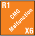

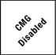

**3.71 LOW AMMO B# (B # ):** Some armed vehicles carried such a small ammunition load that Ammo Depletion must be considered even within the limited time frame of ASL scenarios.<sup>7</sup> Such vehicles have a circled B# (e.g., B 11 ) This symbol

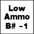

<!-- pdf-page 202 -->

represents the possibility of normal malfunction plus the possibility of Ammo Depletion. A Gun with a B #  malfunctions on an Original 12 To- Hit/IFT DR and suffers Low Ammo on any other Original To-Hit/IFT DR ≥ the B # . A Low Ammo result includes all ammo types the vehicle is allowed to use, as per its Vehicle Listing and the scenario date. A vehicle suffering from Low Ammo is marked with a Low Ammo counter, which changes the original B #  to an X# (as per A.11) and creates a new B #  one less than the Original B # . EX: An IS-3 tank has a B 11 signifying its limited ammo capacity. If it rolls an Original TH DR of 12, the MA will malfunction normally. If it rolls an Original TH DR of 11 it is marked with a Low Ammo counter. Thereafter, any Original TH DR of 11 or 12 will Disable the MA, resulting in Recall (3.7); any Original TH DR of 10 will malfunction the MA normally—leaving it subject to repair.

## 4. TERRAIN MODIFICATIONS TO ANTI-VEHICLE

## FIRE

**4.1 TERRAIN BENEFITS:** The TEM occupied by a target vehicle is added to either the To Hit DR (as Case Q) of any ordnance shot against it when using the Vehicle or Infantry Target Type (C3.31-.32), or to the IFT DR of any Area Target Type (C3.33) *[EXC: if the target is HD to that attack; 4.2]*. LOS Hindrance DRM are *always* added to the To Hit DR. There are also several other ways that terrain can affect anti-vehicle fire.

**4.2 HULL DOWN (HD):** HD is a term used to describe any situation wherein the LOF to the bottom half of a vehicle is blocked by terrain, making that portion of the target incapable of being hit by Direct Fire ordnance. A vehicle qualifying as a HD target is considered hit by Direct Fire only if that hit results in a turret/upper superstructure hit (C3.9). A HD target may not also claim a Case Q TH DRM but it may claim an in-hex Case Q TH DRM in lieu of HD status. HD status does not apply to a vehicle fired on by Indirect Fire, although the TEM of a wall that would make such a vehicle HD to Direct Fire might count as a reduced TEM for Indirect Fire (see C1.52). A target is never considered HD to any attacking unit qualified to attack its Aerial AF.

**4.21 WALL/ROADBLOCK:** A vehicular target fired on by Direct Fire ordnance through a wall/bocage/roadblock hexside that would affect that fire with a +2 or +1 TEM (see B9.3-.36 and B9.5) is instead considered HD to that fire.

**4.22 HEIGHT ADVANTAGE:** The

```text
 BU:  +1  ◊ BU:  +1
CT:  +2    CT:  +2
```

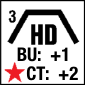

+1 Height Advantage TEM vs Direct Fire (B10.31) also applies to vehicles, but only if they are not HD to the firer. A vehicle may become HD to Direct Fire from an elevation at least one level lower only by declaring a HD Maneuver Attempt during setup, or during its MPh by expending two *extra* MP either upon entering a hill Crest-Line hex or *after* changing VCA in such a hex. The vehicle’s owner then makes a dr to determine the extent of its HD protection, using the following cumulative drm as applicable: +2 if the vehicle is a CT Russian AFV; +1 if the vehicle is BU; +x for that vehicle’s Armor Leader modifier; and -1 if making the attempt during setup. If successful, the owner places an appropriate HD counter beneath the vehicle so as to mark the applicable hexsides. Any Defensive First Fire prompted by a HD Maneuver MP expenditure must await the outcome of the HD determination dr before being resolved. Regardless of the outcome of the HD Maneuver Attempt, the vehicle must then immediately end its MPh by expending a Stop MP if still Mobile.

**HD MANEUVER ATTEMPT**

```text
Final dr Result
  ≤ 1    ≤ 3 lower-level contiguous Crest Line hexsides of present hex are HD
    2    ≤ 2 lower-level contiguous Crest Line hexsides of present hex are HD
    3    One lower-level Crest Line hexside of present hex is HD
  ≥ 4    No Effect
```

The maximum number of HD hexsides allowed to a vehicle is never \> either three hexsides or the number of contiguous, completely-lower-level Crest Line hexsides in that hex (whichever is less). A vehicle in Bypass may only become HD behind the hexside it straddles and the two adjoining hexsides.

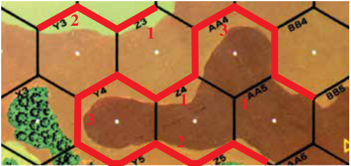

EX: The maximum number of HD hexsides allowed in 2AA4 or Y4 is three, the maximum allowed in AA5 or Z3 is one, and the maximum in Y3 is two. Z4 can be HD on two hexsides if those hexsides are Z4-Y5 and Z4-Z5. The hexsides through which the vehicle can be considered HD are shown with red bars. Now assume that a tank begins its MPh in X3, expends one MP to enter Y3 and an additional two MP for a HD Maneuver Attempt, and a fourth MP to Stop. The entry of Y3 brought the tank into the LOS of an AT Gun in Z2. If the AT Gun announces a Defensive First Fire shot at the tank upon entry of Y3, and before declaration of the HD Maneuver Attempt, it may fire on the tank without it being HD using the Case J<sup>2</sup> TH DRM for fire vs a moving vehicle with ≤ one MP in the firer’s LOS, and a +1 HA TEM. However, if it waits for the HD Maneuver Attempt declaration before firing (in order to qualify for TH Case J or J<sup>1</sup>), the target will be considered HD if the maneuver attempt is successful. The tank cannot expend three MP at once to both enter Y3 and attempt a HD Maneuver; the entrance and HD Maneuver expenditures are separate cases announced at different times.

**4.221** A vehicle whose HD Maneuver Attempt was successful is marked with a HD counter depicting which of its current lower-level Crest Line hexsides (of the vehicle owner’s choice) it is now considered HD behind. Any Direct Fire from an elevation *at least one level lower* that crosses one of these hexsides is considered against a HD target. Once placed, a HD counter may not be moved (although the vehicle’s TCA may be), and is removed immediately if the vehicle changes VCA, expends a Start MP without Stalling or goes into Motion (2.401). A vehicle being set up in a hill Crest Line hex must make a HD Maneuver attempt immediately after it sets up if it wishes to possibly start the game HD, and after that Attempt may not be “reset-up” in another hex.

**4.222** A vehicle is never considered HD due solely to Height Advantage across a cliff, Double-Crest, or Abrupt Elevation Change hexside.

**4.223 HD FIRER:** Non-MA bow-mounted weapons cannot be used against a target if the firing vehicle is HD to that target’s position.

**4.3 UNDERBELLY HITS:** As an AFV crosses a wall/bocage hexside (not via a road/breach) or exits a gully/stream, DEFENDING ordnance within six hexes of the hex being entered, at the same level as (or lower than) that hex, and within that AFV’s VCA (or “rear” VCA if the AFV is using Reverse movement), may (if otherwise allowed) use the Vehicle Target Type or a LATW TH Table to attempt an Underbelly Hit. Such Defensive First Fire is conducted after the AFV expends the MP to cross-the-hexside/exit-the-gully but before it enters the next hex (and thus precedes <!-- pdf-page 203 --> any OVR vs that hex); if the firer is in the hex being entered, TH Case E does not apply. The firer’s LOS is traced to a specific vertex (C.5C) of the hexside being crossed (ATTACKER’s choice *[EXC: if using VBM; 2.32]*, though once he chooses the vertex he may not change it vs another shot or to affect LOS). If the firer has no LOS to that vertex, he does not qualify for an Underbelly Hit and his shot is assumed to have missed (A6.11 applies). If the firer does have a LOS to that vertex, any such hit that would normally be a turret hit is instead an Underbelly Hit and uses the Aerial AF (C7.12). A hull hit is treated in the normal manner. If the firer has Bore Sighted the Location being *exited*, that DRM applies to his TH DR.

##### 4.31

**4.31** The ability to make an Underbelly Hit does not itself prohibit a Deliberate Immobilization attempt (C5.7). A vehicle immobilized or destroyed by a hit is left in the hex it was entering, but is no longer considered “belly up” after resolving all shots at it allowed by that MP expenditure.

##### 4.32

**4.32** Case Q/R TH DRM are based on the hex being entered. A wall/bocage being crossed does not add its TEM to the TH DR.

##### 4.33

**4.33** Underbelly Hits (and Deliberate Immobilization attempts) are NA until after the AFV has passed its crossing/exiting Bog DR.

##### 4.34

**4.34** Underbelly Hit attempts are NA vs a vehicle Breaching bocage (B9.541).

## 5. INHERENT CREW

#### 5.1

**5.1** All armed vehicles are manned by an Inherent crew which is not represented by a crew counter until it leaves the vehicle. While inside an AFV, the crew checks morale with a Morale Level equal to that of its nationality’s best unbroken elite Infantry MMC; Inherent crews of unarmored vehicles take MC with a Morale Level equal to that crew nationality’s best unbroken 1st Line Infantry. *[EXC: Armor Leaders (3.42) & Inexperienced Crews (3.45).]* All unarmed vehicles are manned only by an Inherent Driver who never leaves the vehicle and is never treated as a crew. Whenever a crew leaves its vehicle it becomes a vehicle-crew counter with a FP of one and often a lower morale. A vehicle-crew counter has all the capability of an infantry-crew counter (A1.123), other than its lower Strength Factor, while still retaining its vehicle crew capabilities (A21.22). All rules dealing with Inherent crews also apply to Temporary crews (A21.22) unless stated otherwise.

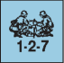

**5.2 BUTTONED UP (BU):** An Inherent AFV crew must be defined as being either CE (Crew Exposed) or BU (Buttoned Up). Any CT AFV beneath a BU counter or *not* topped by a CE counter is considered BU. A BU crew is generally not Vulnerable *[EXC: see 5.311 and A7.211]*. A BU CT AFV firing its MA (or SA [Secondary Armament, as per Chapter H Vehicle Listings]) as ordnance must add one to that TH DR (Case I; C5.9). Being BU doubles the <sup>1</sup>/2 MP road movement rate of an AFV, but otherwise has no detrimental effect on an AFV’s (or its Inherent crew’s) actions/ abilities *[EXC: see 5.3 and A10.532; at night see E1.14 and E1.52]*.

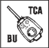


**5.3 CREW EXPOSED (CE):** An OT AFV is always considered CE unless beneath a BU, Shock, or Stun counter. A CE counter must be on top of a CT AFV in order to use its AAMG *[EXC: a hero Rider; 1.83]*. An OT AFV must be CE to use any weapon other than a bow-mounted MG/ FT. A CE AFV may enter/exit a building *obstacle* only if it pays Open Ground costs to do so or is moving entirely within a Factory (B23.742) but can become CE once inside a building. However, being CE makes an Inherent AFV crew Vulnerable to Collateral attacks (D.8).

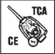


##### 5.31 CE DRM

**5.31 CE DRM:** A CE counter represents the Vulnerability of an AFV crew to Collateral Attacks. A CE crew is normally entitled to a +2 DRM due to the partial protection afforded by the AFV but some AFV receive (according to their Vehicle Notes) more protection (or less) depending upon the Target-Facing/Aspect (C3.9) through which they are fired on. Non-Fire Lane Residual FP attacks receive the CE DRM that applies to the Side Target Facing. An OT AFV’s normal (usually +2) CE DRM can be reduced by Elevation Effects as per 6.61, and by Air Bursts (B13.3); see 5.311. The CE DRM is not cumulative with any positive TEM.

**5.311 UNPROTECTED CREWS:** The Inherent crew (as well as each Passenger) of a vehicle receiving fire (including Fire Lane Residual FP) *[EXC: Sniper attack]* through an unarmored Target Facing/Aspect (C3.9; including any OT AFV receiving either Air Bursts or fire from a higher elevation whose elevation advantage is \> the range [5.31]—and, vs mines, the PRC of any AFV with a hull AF of 0 [B28.43]) is Vulnerable even if BU, and receives no (or a reduced; 5.31) CE DRM. Consequently the crew is not susceptible to Stun/Recall from such an attack; it is instead subject to PTC/MC/K/KIA results. If it breaks it must rout from the vehicle using normal Infantry rout procedures *[EXC: it expends all its initial-RtPh MF to be placed beneath the vehicle]*. The vehicle automatically Stops (no Stop MP is spent) when its crew breaks. If the crew routs or is eliminated, the vehicle is marked with an Abandoned counter. If an OT AFV’s crew would receive a CE DRM *reduced by Elevation-Effects/Air-Bursts* to \< its normal CE DRM, that AFV is instead treated as unarmored and the attack vs it—but not vs its PRC—is resolved (with no Air Burst TEM) either as per A7.308 (for non-ordnance/Indirect-Fire-HE) or on the proper TK Table using the pertinent Unarmored Vehicle TK#. C3.71 also applies if a HE CH occurred.

**5.32 ORDNANCE:** A CE crew cannot be targeted by ordnance (D.6).

**5.33 CE MOVEMENT:** Vehicle CE counters may be placed or removed (except due to combat results) only during the owner’s MPh/APh, but may not be both placed and voluntarily removed (or vice-versa) during the same phase. Such placement/removal of a vehicle CE counter cannot occur in a MPh *following* Prep or Bounding First Fire by that vehicle/ its PRC, nor between the time it is named as a target and the time all fire against it allowed by its last MP expenditure is resolved, and does not constitute movement for purposes of moving target/firer penalties. An AFV’s crew and Passengers always become CE or BU together *[EXC: those that are broken must remain BU until they rally or disembark; an OT AFV’s pinned CE Passengers must BU (A7.821) but its pinned/CE crew does not (A7.82)]*.

**5.34 STUN:** An AFV CE Inherent crew checks morale as per 5.1. If a CE AFV crew that qualifies for its normal CE DRM fails a MC, or if any CE crew of a fully armored AFV is attacked by a “2” Sniper dr (A14.3), or if a MG Final TK DR vs any (even a BU) AFV equals the Final TK#, or if Falling Rubble lands on a CE CT AFV (B24.121), that Inherent crew is Stunned and the AFV is marked with a Stun counter. A Stunned AFV and its Passengers immediately become BU if CE, and may not regain CE status (even if BU when the Stun occurred) until able to do so as per 5.33 in a subsequent Player Turn. A Stunned AFV may not fire (even in CC—though a Rider Hero could fire its AAMG), move (inclusive of CA changes) or expend MP for any reason during the remainder of that Player Turn, and immediately Stops (no Stop MP is spent) if moving/in- Motion. At the end of the Player Turn in which it was placed, flip the Stun counter to its “+1” side. This indicates that the AFV is no longer Stunned but must add one to any TH, MG/IFE/FT IFT, CC, TC/MC, Crew Survival, or OVR DR it makes. The “+1” counter remains on the AFV until the AFV is Abandoned, at which point it remains on the crew counter to signify its lessened vehicular capabilities in case it should re-crew another vehicle. The +1 counter has no other effect on the unit while outside a vehicle.

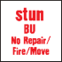

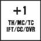

**5.341 RECALL:** Recall occurs whenever an AFV CE Inherent crew that qualifies for its normal CE DRM suffers a K/KIA or Casualty MC result, or when any 1MT AFV (1.322) suffers a Stun Result


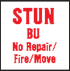

<!-- pdf-page 204 -->

*[EXC: SMC crew; 5.343]*, or when the CE crew of a fully armored AFV is attacked by a “1” Sniper dr (A14.3). Recall is treated the same as a Stun except that at the end of that Player Turn the STUN counter is flipped over to its “Recall; +1” side. The “+1” effects are the same as in 5.34 above, but in addition that AFV and crew must attempt to exit the playing area along a Friendly Board Edge via the shortest route (in MP) using Motion status. ESB attempts are NA. If the AFV is carrying any Passenger(s)/Rider(s) it may Stop (or remain Stopped) long enough to unload them, but must unload them as soon as possible after the Recall occurs. A bogged/immobilized Recalled AFV must be Abandoned instead; its crew is no longer obliged to leave the board, but may not re-crew that AFV. Recall eliminates any Armor Leader present in that AFV *[EXC: Inexperienced Crew; 3.45]*.

###### 5.342

**5.342** An AFV crew that suffers a second Stun result (e.g., while already under the effects of a “+1” counter) suffers Recall instead. See also Disabled MA Recall; 3.7.

**5.343 SMC CREW:** A SMC acting as a Temporary crew (A21.22) also becomes Wounded if he suffers a Stun result (even while in a 1MT AFV). If he suffers Recall *[EXC: due to Disabled MA (3.7); Stunned in a 1MT AFV (5.341)]* he is eliminated.

**5.4 ABANDONMENT:** Occasionally, a crew may wish to exit its vehicle voluntarily (rather than due to combat) in order to take counter form on the board. This is referred to as *Abandoning* the vehicle.

##### 5.41

**5.41** A crew may abandon its vehicle only during its own MPh, and does so by expending all of its MF to be placed beneath the vehicle. The vehicle/crew may not have moved or fired during that Player Turn. See also 5.43. Place an Abandoned counter on the vehicle to indicate that it may not move or fire and is subject to capture. The crew *[EXC: a lone SMC; A21.22]* may Remove certain weapons with it (see 6.631 for halftracks and 6.83 for Carriers, other vehicles may only be Scrounged [10.5- .52]) *or* attempt to unhook a Gun from it. Place the appropriate Disabled counter(s) (MA/AAMG, etc.) on the vehicle to indicate the absence of each weapon Removed, and place the appropriate SW (or mortar—dm if 76-82mm; A9.8) counter on top of the crew.

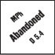

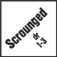

**5.411 SELF-DESTRUCTION:** Only an Inherent crew that *voluntarily* abandons a vehicle may turn it into a non-burning wreck or malfunction its weapon(s) as it leaves.

**5.42 ENTRY:** An Infantry unit may enter an Abandoned vehicle to become its Inherent crew *only* if it occupies that vehicle’s Location at the start of its MPh (not APh) and expends all of its MF to do so *[EXC: CCPh; A21.2]*. It may also attempt to hook up a Gun as it does so. See also 5.43. A vehicle may not be entered during the same Player Turn in which its previous crew left *[EXC: CCPh; A21.2]*.

##### 5.43 FFNAM

**5.43 FFNAM:** An Inherent crew Abandoning its vehicle as per 5.41 (as well as any other Personnel unit exiting/entering a vehicle) is considered *Infantry* and subject to FFNAM (until pinned) vs all attacks declared against it due to either its embarking/debarking MF expenditure or the vehicle’s simultaneous MP/MF expenditure (6.4; 6.5). If also attempting to (un)hook a Gun while doing so, it succeeds in (un)hooking it only if it survives all such attacks unpinned and in Good Order. Likewise, Infantry attempting to enter a vehicle succeed only if they survive all such attacks unpinned and in Good Order. EX: An Infantry Unit attempting to enter and Inherently crew a vehicle *(or attempting to load on to any form of transport as a Passenger/Rider)* does not succeed—and also fails to hook up a Gun if it were attempting to do so too—if, due to defensive fire prompted by that MF/MP expenditure, it is pinned, eliminated or loses its Good Order Status (or the vehicle is destroyed). An Inherent crew attempting to Abandon a vehicle *(or a Passenger/Rider attempting to unload from its transport) does* succeed—but does *not* unhook a Gun if it were also attempting to do so—if it is pinned, eliminated or loses its Good Order status (or the vehicle is destroyed) due to such fire.

**5.5 IMMOBILIZATION TC:** An immediate TC is required of the non-Shocked, non-Stunned Inherent crew of a vehicle *[EXC: one in a Water Obstacle; 16.3]* that becomes *immobilized by any non-CC attack*, or that is already bogged/immobilized and is hit by *Direct Fire ordnance* which fails to destroy, Stun, or Shock it but that would have destroyed or Shocked it with an Original TK or IFT DR of 5. Failure of the TC results in the crew being immediately placed beneath the vehicle (expending all remaining MF) and subject to the Hazardous Movement DRM during that phase (see also 9.3). Place an Abandoned counter on the vehicle (5.41). A crew thus *forced* to leave its vehicle may not Remove (6.631) any weapons from it. If the TC is passed, the crew may continue to Inherently man it or may abandon it voluntarily (5.41) during its MPh.

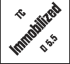

**5.6 CREW SURVIVAL (CS):** On the wreck side of each vehicle is a CS# representing an abstracted calculation of the crew size and its chance to escape its vehicle sufficiently intact to still represent a viable unit on the battlefield. If, after its elimination, the vehicle’s owner makes a Final DR ≤ its CS#, a vehicle-crew counter is placed beneath the wreck (expending all remaining MF) and is subject to the effects of Hazardous Movement (see also 9.3) vs all subsequent attacks during that phase *[EXC: A CS DR is NA if that vehicle was eliminated in CC or turned into a Burning Wreck]*. Surviving PRC (see 6.9) are not subject to any Collateral Attack from the shot/FP that destroyed their vehicle, and can be subject to Residual FP attack during that phase only if the Residual FP was not the cause/result of their vehicle’s destruction. There is a +1 DRM to the CS DR if the crew had been broken or under the effects of Shock/Stun at the time of the vehicle elimination. If the CS# is printed in lower case letters (cs); that vehicle has no crew survival possibilities; the cs# can only be used to resolve the survival chances of any Passengers/Riders (6.9).

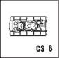

**5.7 BREW UPS:** Certain AFV suffered from extreme fire hazard due to design defects in either the engine, ammo bins, or fuel tanks and consequently are more liable to become burning wrecks when eliminated. These vehicles are identified by having a red CS#. If the AFV has a red CS#, a special -1 DRM applies to the Final To Kill DR for Burning Wreck determination purposes only (see C7.7).


**5.8 CREW FP:** An inherent crew may fire all the armament of a vehicle *[EXC: see U.S. Multi-Applicable Note E and similar Vehicle Notes for secondary AAMG fired by Passengers]* but may not fire its inherent FP until it takes crew counter form outside that vehicle, and only if it has not yet fired a vehicular weapon or been a moving target (C.8) *prior* to taking counter form during that Player Turn (although it could still engage in CC/FPF). Any crew counter thus lacking use of its inherent FP should be marked with an appropriate Prep Fire or Final Fire counter.

## 6. TRANSPORTING PERSONNEL

**6.1 PASSENGERS:** Passengers ride inside their transporting vehicle and have their FP halved for Mounted Fire *[EXC: armored halftracks; 6.63]* (in addition to any penalties for Bounding (First) Fire/Motion). Passengers may engage in CC although at a disadvantage (A11.52 & A11.611). Any vehicle capable of transporting a Passenger has its carrying capacity printed on the counter in the form “#PP”. For Passenger purposes, a squad equals ten PP, a HS/Crew five PP, and ≤ four SMC equal zero PP. Thus a vehicle with Transport Capacity can carry any combination of MMC/SW, provided the transport’s PP capacity is not exceeded. See A5.5 for equivalents, and C10.13 for PP reduction due to a towed Gun’s ammo. Passengers may remain in their vehicle even while broken or may rout beneath a Stopped vehicle per 5.311, unless the inherent crew (if any) is eliminated, breaks, or Abandons the vehicle, in which case any broken Passengers must rout beneath the vehicle. Otherwise, a broken Passenger may remain in its vehicle free from rout requirements even if enemy units are ADJACENT, in the same hex, or the vehicle is moving toward an enemy unit (even to OVR).

<!-- pdf-page 205 -->

LMG, PIAT, and Thrown DC are the only SW which can be fired by Passengers. *[EXC: Desperation attacks by SCW/RCL as per C13.8-.81]*.

**6.2 RIDERS:** Riders are Personnel being transported on the outside of an AFV (or Cavalry or motorcyclists). AFV Riders cannot be used until 1942—and even then only by the Russians. In 1943 and thereafter, all nationalities may use Riders. Riders are limited to tanks (not tankettes), TD, SPA, SPAA, Carriers (limited capacity; 6.81), and Assault Guns. Rider capacity is limited to a maximum of 14 PP (as per 6.1); within those timeframes a vehicle not otherwise granted Rider capability can carry one SMC as a Rider and the two PP he possesses. See A5.5 for equivalents. Rider PP cannot be used to satisfy the ammo PP reduction (C10.13) of any Gun that requires a T# (C10.1) to be transported; therefore, a dm 76-82mm mortar is transported by Riders at its normal five PP cost.

**6.21 RESTRICTIONS:** Riders are not allowed while the AFV is moving *through* (not around via Bypass) woods, orchard, buildings *[EXC: friendly Vehicular-Sized Entrance; B23.742]*, rubble, or Water Obstacles or through Bocage *[EXC: Breach; B9.541]*, unless it is moving across a road hexside. Should any AFV enter/exit such terrain with Riders, the Riders must Bail Out in the last hex occupied prior to that prohibited terrain. A Rider on a turreted AFV must Bail Out if the AFV changes its TCA.

**6.22 ATTACKS:** Riders may not use SW, must use halved FP as Mounted Fire when firing their inherent FP on the IFT (quartered if the vehicle has moved or is in Motion, inclusive of OVR attacks), and must add one to their CC DR (A11.611).

**6.23 TARGET STATUS:** Riders are always Vulnerable to fire; i.e., they can never be BU like an AFV crew or halftrack Passenger, nor do they receive any CE benefit. Riders are subject to Collateral Attack. AFV Riders must Bail Out if pinned or broken.

**6.24 BAILING OUT:** A Rider (even if already broken) which is forced to leave its AFV (or broken Cavalry [A13.51] or motorcyclists [15.53]) by combat results (other than the destruction of the AFV) or terrain restrictions (6.21) is Bailing Out. Bailing Out never costs the transport any MP but for Defensive First Fire purposes the Rider is considered to spend all remaining (but at least one) MF subject to FFNAM. Any Rider which Bails Out must take a NMC, be placed beneath the AFV in the AFV’s current Location, is unable to move or fire further during that phase, and if unbroken is marked with either a Prep Fire or Final Fire counter as appropriate. Any SW carried by a Bailing Out Rider is eliminated if the carrying unit breaks or is eliminated prior to or after Bail Out. Even if the carrying unit does not break as a result of Bailing Out, its SW must be removed from the AFV and checked for malfunction [dr 1-3 = ok; dr 4-6 = malfunction (or elimination if an X# SW)]. Bailing out into an enemy-occupied hex is allowed. See 6.5 for Bailing Out while in Bypass.

**6.3 TRANSPORT:** There is no reduction of a vehicle’s MP allotment for transporting Personnel, although it does cost MP to load/disembark them. Units being transported are placed on top of the vehicle; units beneath a vehicle are on foot.

**6.31 RECOVERY:** PRC may not Recover SW not already in their vehicle, although they may transfer SW in their possession to other friendly Infantry/Cavalry in the same Location or other PRC on the same vehicle. Otherwise, SW must be Recovered by Infantry and loaded as the Infantry loads.

**6.4 LOADING:** A vehicle must be stopped to embark Passengers/Riders. It may move in the same MPh after they load, but it may not move in that MPh prior to their loading (including the expenditure of a MP to bring a Motion vehicle to a stop) *[EXC: Infantry hooking up a Gun, C10.11]*. The vehicle retains <sup>1</sup>/4 of its MP allotment for use in that MPh for each MF remaining to the Infantry that board it. If more than one Infantry unit boards the vehicle, only the unit expending the most MF is counted. It costs one MF to board a vehicle from the same Location. Loading (or unloading) may never occur during the APh. A SW may not be loaded onto or remain aboard an AFV without Passenger/Rider accompaniment *[EXC: any halftrack or Carrier may retain any SW placed in it if those SW apply to that vehicle’s Passenger PP capacity]*. A vehicle which was not in Motion and loads/unloads Passengers or Riders as its first action in the MPh is not considered a moving target for Case J To Hit purposes, but can be Defensive First Fired upon due to its expenditure of MP. See 5.43 for attacks vs (un)loading Passengers/Riders. A leader cannot apply his MF bonus to units that load/unload during the same MPh (A4.12), but he can add his IPC to one such unit’s IPC to increase its movement capability (A4.42). EX: A HS carrying only two PP of SW can enter one Open Ground hex and board a vehicle in that hex which has not moved in the same MPh, leaving the vehicle with half of its MP, but a squad carrying five PP has only two MF and must expend them both to enter that Open Ground hex and load onto the vehicle unless it is accompanied by a SMC (A4.12, A4.42) carrying no PP of its own, thereby leaving the vehicle with one-fourth of its MP remaining for that MPh.

**6.5 UNLOADING:** A vehicle disembarks Passengers/Riders (without the latter Bailing Out) at a cost of one-fourth (FRU) of its MP allotment *[EXC: Infantry unhooking a Gun, C10.12]* per disembarking stack but only while stopped during its own MPh. Disembarking Personnel must expend one MF to be placed beneath the vehicle and are additionally considered to have already expended one MF for every one-fourth of the MP allotment (FRU) used by the vehicle during that turn prior to unloading. Since ESB (2.5) does not grant any additional *MF*, Passengers/Riders may not unload after a vehicle has spent \> than <sup>3</sup>/4 of its printed MP allotment, although they may continue to be transported via any additional MP so obtained. Passengers/Riders may leave a vehicle that fired in the preceding PFPh and expended no MP in this MPh, although they could not leave the vehicle’s Location during that MPh. Likewise, they may unload from an immobilized vehicle unless that vehicle has already expended more than three-fourths of its MP allotment during the current MPh. Otherwise, if an unloading unit has MF remaining (keeping in mind its overall limit of four MF and expenditures of MF during vehicle movement) it may continue to move from that Location with any remaining MF but must do so as part of the same MPh as the conveying vehicle (i.e., it does not have to move together with the stack of units it disembarked with, but no unit other than the conveying vehicle and any other disembarking PRC of that vehicle may move in the interim). Unloading pinned Passengers may not leave the Dismount Location during that MPh. FFNAM always applies vs loading or unloading units (A4.6); FFMO applies only if unloading Passengers from an unarmored conveyance in an Open Ground hex or CAFP. PRC may unload or Bail Out in an enemy-occupied hex with no special rules or consequences unless they do so from a vehicle in Bypass (A12.151); place a CC counter to show they are not held in Melee. Passengers/Riders of a vehicle in Bypass which unload (even if they do not have enough remaining MF to move into the obstacle) or which during their MPh Abandon/Survive/Bail- Out (5.4-.6, 6.24) are assumed to be in the terrain of the vehicle’s CAFP (2.36) for purposes of any Defensive First Fire vs them. Immediately after all such First Fire is resolved, they are assumed to be in the woods or building terrain of the obstacle itself. Unlike AFV, Infantry may not move (on their own) and fire in the same phase. Therefore, Passengers/Riders which fire or add their FP to an OVR during a MPh may not unload in that phase (although they could Bail Out) and vice versa. However, Passengers/Riders on an OVR vehicle which do not add their FP to that OVR may disembark during that MPh. SW carried by a vehicle’s Passenger PP capacity can be unloaded/Recovered only by Passengers of the same vehicle.

**6.6 ARMORED HALFTRACKS:** An armored halftrack is unique in that it can carry Passengers who can either share the AFV’s invulnerability to Small Arms Fire while BU, or can be CE.

##### 6.61 BU

**6.61 BU:** As long as an armored halftrack’s Passengers are not CE, they may not be attacked separately *[EXC: A7.211]* from their vehicle (i.e., the halftrack itself must be attacked in order to harm the Passengers—even in CC), *unless* the firer has an elevation advantage \> the range to the halftrack. In this event, the +2 CE DRM applies but is reduced by one for each full level elevation advantage \> the range (to a minimum CE DRM of 0) <!-- pdf-page 206 --> as per 5.31, and even BU Passengers may return fire. Otherwise, BU Passengers may not fire, Spot/Observe for Indirect Fire, or attack in CC, or even provide a Personnel Escort DRM for vehicles being attacked in CC (A11.51). Broken/shocked Passengers are automatically considered BU.

##### 6.62 CE

**6.62 CE:** Armored halftrack Passengers/crew are always considered CE unless broken, shocked, pinned, or beneath a BU counter, and when CE are entitled to a normal +2 DRM as per 5.31. Such halftrack Passengers are not subject to Stun; they must become BU instead and broken if they also fail a MC. Armored halftrack Passengers must be CE in order to fire *[EXC: Reciprocity; A6.5]*, direct attacks, attack in CC, or Spot/Observe for Indirect Fire. Placement and removal of Passenger CE status is identical to that for inherent crews (5.33). Armored halftracks (and other non-turreted AFV) use the CE/BU counters with no TCA depiction unless they have a turret-mounted MA.

**6.63 FIRE/MOVEMENT:** If an armored halftrack moves, all fire from its Passengers is halved as either Bounding First Fire during that MPh or as AFPh Fire (i.e., Bounding Fire; 3.31). However, an armored halftrack Passenger never has its FP halved due strictly to Mounted Fire (as a Truck Passenger must).

**6.631 SW REMOVAL:** A crew abandoning (5.41) an armored halftrack of that crew’s nationality may Remove from the AFV and take with them (in dm form if possible), that halftrack’s MG/mortar armament. The MG takes the form of a MG counter with the same or less FP as available to the vehicle. The weapon can be returned and the Abandoned/Disabled counter removed from that AFV by a friendly crew’s (with the appropriate MG/ mortar counter) re-entry into the halftrack as per 5.42. Armament Removable by a *Passenger* (e.g., the German SPW 251/sMG) is Removed as part of the normal unloading cost (6.5).

##### 6.64 FG

**6.64 FG:** The only vehicles (as opposed to Passengers/Riders) that may be part of a multi-unit FG are Carriers/armored halftracks, each of which must be CE and using its vehicular-mounted non-ordnance weapon(s) *[EXC: FT, IFE]* to qualify for that FG; such a FG may be composed of such Carriers/halftracks and/or Infantry/Cavalry. A Passenger may be part of a FG composed only of other Passengers/vehicular-mounted non-ordnance weapons, and only if all elements of that FG are on the same vehicle *[EXC: CE halftrack Passengers may be part of a FG composed of other Carriers/halftracks (as above), and/or other Passengers of the same or another CE halftrack, and/or Infantry/Cavalry]*. AFV Riders may be part of a FG composed only of other Riders on the same vehicle and/or that vehicle’s AAMG *[EXC: Carrier Riders may be part of any FG that consists of (or includes) that Carrier’s non-ordnance weapon(s)]*. In all cases, the normal rules for FG (A7.5-.55) still apply. The vehicle crew is always assumed to fire its own weapons; a player may not specify his Passengers to be CE and firing the armament of an otherwise BU halftrack.

**6.65 LEADERSHIP:** The leadership modifier of any CE (or otherwise exposed to fire) leader *Passenger* may be used to direct the fire of other Passengers in that halftrack (including their use as a FG). However, it may not be used to direct the fire of other units in the hex if that halftrack has entered a new hex/hexside or been in Motion during that phase. The leader cannot direct fire to a target out of his LOS even if the target is in LOS of other units in the hex—a situation that can occur when the leader’s halftrack is in Bypass (because his LOS must be traced from the vehicle’s CAFP and can be blocked by the obstacle in its own hex). Similarly, a Passenger leader may direct an OVR or CC attack in which other Passengers take part, but may not be used to direct the halftrack alone. Likewise, a CE (or exposed) Armor Leader can direct the fire of his Passengers/other nearby units only if their FP is added to the non-ordnance FP of his halftrack to form a FG; he cannot direct them separately. A CE Passenger leader may provide a leader-MF bonus (A4.12) to Infantry if they all move as a stack throughout their MPh.

**6.651 RALLY/MC/TC:** A leader who is a Passenger can only affect the Rally/MC/TC of other Passengers in the same vehicle unless he is CE in a halftrack that has not entered a new hex/hexside or been in Motion during the current phase. Similarly, an Armor Leader can affect the MC/TC only of the inherent crew of his vehicle. Likewise, a non-Passenger leader may only affect Passengers of a non-moving (C.8) vehicle, but regardless of whether they are CE. The loss or breaking of an Armor Leader has no effect on anyone but his own crew (3.42). The loss/breaking of a Passenger leader cannot cause a LLMC/LLTC to any occupants of the same Location, except to other Passengers of the same vehicle (A10.2).

##### 6.66 DM

**6.66 DM:** Although a broken Passenger in an armored halftrack is automatically BU, it is put under DM by any ordnance hit vs that halftrack or by any attack vs that halftrack or its PRC which is capable of possibly inflicting at least an NMC result on a hypothetical CE target in that halftrack, even though such fire is normally not effective vs a BU target.

**6.7 TRUCKS:** All unarmored, fully-wheeled vehicles (such as a jeep) are generically covered by the truck rules. The only difference in transporting Personnel by truck (or unarmored halftrack) is that both the vehicle and its Passengers are subject to all forms of attack (i.e., its PRC are always Vulnerable). A non-ordnance or mortar attack is resolved on the H Vehicle line of the IFT (A7.308) against both the vehicle and Collaterally (D.8B) against its Passengers/crew with the same DR *[EXC: if that attack destroys the vehicle; D.8]*.

**6.71 ORDNANCE:** Ordnance *[EXC: mortar/Area Target Type; C1.55]* hits vs a truck are resolved on the Unarmored line of the proper To Kill Table. Any To Kill DR one \> the Final TK# vs an unarmored vehicle is a miss (C7.311)—not Shock or Immobilization. Ordnance *[EXC: mortar/ Area Target Type; C1.55]* can cause Immobilization vs an unarmored vehicle only with a TK DR equal to the Truck’s Final TK#. If the vehicle is not destroyed, its Vulnerable PRC are subject to a Specific Collateral Attack (D.8A).

**6.72 PASSENGER FIRE:** Truck Passengers must use Mounted Fire if they make a fire attack, in addition to any other application of halved or Area Fire; thus a truck Passenger may add only one-fourth (tripled) of its printed FP to an OVR. In a few cases, a truck may have mounted weaponry, but that must be fired by its inherent crew. Truck Passengers may engage in CC, but are severely penalized (A11.52).

**6.8 CARRIERS:** A Carrier<sup>8</sup> is treated as a halftrack except as stated otherwise below.

##### 6.81 PP

**6.81 PP:** A Carrier is a fully-tracked OT AFV. A Carrier without a mortar, FT, or 6 FP AAMG listed as MA on its counter has a Passenger capacity of four PP (as per 6.1) for SMC/SW/ammo (C10.13). Any Carrier can also carry ≤ eight Rider PP (as per 6.2).

**6.82 CREWS/HS:** Carrier crews usually dismounted to make an attack as normal Infantry; therefore, their inherent crews are really 2-4-7 HS (or 2-4-8 if representing an elite unit) that, due to their unique training, need not pass a TC nor have a leader present (A1.31-.32) to recombine after Dismounting, or to Deploy for the purpose of mounting their Carriers (after having been combined into squads) when dismounted *[EXC: those Carriers armed with a FT or 76mm mortar or specified as towing ordnance, have inherent crews]*.

**6.83** A Carrier HS/crew may also abandon/re-occupy a Carrier along with the Carrier’s MG/ATR/mortar as per 6.631. The inherent crew/HS of a Carrier has the option to unload more quickly as per 6.5 but may not Remove any of the vehicle armament (6.631) or destroy the vehicle (5.411) if it does so.

##### 6.84 CE

**6.84 CE:** A Carrier is never considered BU. Its inherent HS/Crew/Passengers are always considered CE and Vulnerable to Small Arms Fire and Collateral Attacks in the same manner as a CE crew (5.31) *[EXC: they re­*

<!-- pdf-page 207 -->

*main CE if stunned or shocked, and are subject to the Collateral Attack that may result from that attack]*. Even though always exposed to fire, the inherent Crew/HS of a Carrier must abide by 5.8.

**6.9 SURVIVAL:** The effects of Crew Survival (5.6) also apply to any Passenger/Rider of a vehicle destroyed by other than CC or burning. Each unit makes an individual DR to determine its own fate. A Rider who must check for Survival does not have to Bail Out. The Shock/Stun DRM applicable to inherent crews does not apply to Passengers but, if they happen to be broken, a +1 DRM applies to the Survival DR of those Passengers. SW not possessed by Surviving PRC are eliminated.

## 7. OVERRUNS (OVR)

#### 7.1

**7.1** An OVR is a form of Bounding First Fire. A vehicle that enters an enemy-occupied Location during the MPh can attack that Location’s occupant(s) by expending one-fourth (FRU) of its *printed* MP allotment (wagons may not OVR because they expend MF; a pillbox may not be OVR because the vehicle cannot enter its Location) therein and announcing an OVR, provided it (and its PRC) is not already marked with a Bounding Fire counter *[EXC: 7.14]*. The OVR MP expenditure must be announced as a combined expenditure with that for entrance of the hex as the vehicle enters the OVR hex, unless that hex contains only unknown enemy units (A12.41). An OVRing vehicle may not declare a Gun Duel (C2.2401); instead, the OVR is resolved on the IFT immediately after the MP expenditure *[EXC: Bog DR, and defensive First Fire other than Reaction Fire (7.2), prompted by that MP expenditure (or by the MF expenditure of accompanying Infantry using Human Wave {A25.23} and Armored Assault {9.31}) are resolved first]*.

##### 7.11 FP

**7.11 FP:** The FP base for an OVR is one FP for an unarmored vehicle, two FP for an AFV, or four FP for an AFV whose MA is manned and functioning and is not a MG, FT, MTR, ATR or IFE-capable.<sup>9</sup> The FP base is modified by adding to it the tripled (TPBF) and halved (Bounding First Fire) FP of all manned and functioning MG/IFE armament on the vehicle *[EXC: RMG do not add to OVR FP]*. CE armored halftrack (only) Passengers can add one-half (and the Passengers/Riders of other vehicles can add one-fourth) of their printed FP to an OVR, but this too is subject to TPBF. All FT FP is added normally with no TPBF/halving adjustment. The total FP of an OVR is halved if the vehicle becomes Immobile or destroyed before it can resolve its OVR (in addition to any halving vs a concealed target; A12.13), but combat results vs Passengers/Riders after an OVR declaration do not affect the OVR FP. The halving of FP for Motion/ Non-Stopped Fire does not apply to OVR FP.

**7.12 VEHICULAR TARGETS:** An AFV may not be OVR, but any Vulnerable PRC on it can be. The presence of an AFV in a hex does not prevent an OVR against other non-armored targets in the hex. An OVR receives a +2 DRM vs a Motion vehicle (and its Vulnerable PRC).

**7.13 RESTRICTIONS:** An OVR may not be made using Reverse Movement. A DEFENDER in a woods/building/Rail-Car-(B32.5) obstacle cannot be OVR by a vehicle using VBM in that hex (2.33). An OVR may not be made by any vehicle currently marked with a Bounding First Fire counter (3.3) *[EXC: Multiple OVR; 7.14]*. A vehicle may not OVR the hex it begins its MPh in unless it leaves that hex and re-enters it.

**7.14 MULTIPLE OVR:** A vehicle may continue to OVR the same or a different target hex as long as it has sufficient MP to expend. However, each vehicle must attack separately; two or more vehicles may not add their OVR FP into a single attack, nor may a vehicle split its OVR FP (or that of its PRC) into two or more OVR attacks during a single entry of the target hex. A vehicle that conducts an OVR must exit that target hex before making another OVR.

##### 7.15 TEM

**7.15 TEM:** The DEFENDER(S) in an OVR are entitled to the applicable TEM of that target Location unless the OVRing vehicle is using *only* a FT. If the ATTACKER adds any other FP (including the two base FP of an AFV) to the OVR FP of a FT, the DEFENDER receives full TEM (A.5). However, an OVR vs Infantry/Cavalry in any Open Ground hex may apply the FFMO -1 DRM, cumulative with applicable TEM (e.g., entrenchment, Emplacement, shellhole, vehicle/wreck, bridge, wall, bocage, etc.) and SMOKE. Wall/hedge TEM applies only if the OVRing vehicle entered the target hex across that hexside, and is not cumulative with in-hex TEM (B9.31). A vehicle OVRing a Crest-status unit does not have to cross a Crest hexside during that attack.<sup>10</sup>

**7.16 LEADERSHIP:** Leadership modification of an OVR is limited to an Armor Leader (or a Passenger leader in that vehicle as per 6.65 although the vehicle does not have to be a halftrack). Should both occupy the same vehicle, only one leadership modifier may be used.

**7.17 MALFUNCTION:** An OVR Original IFT DR of 12 results in weapon malfunction; use A9.71 if \> one weapon contributed to the OVR FP. All weapons that added to the OVR FP (including AFV MA) are eligible for malfunction, though some with a B#/X# \< 12 may be more prone to malfunction than others (i.e., a weapon with a B#/X# \< 12 would malfunction on an Original OVR DR ≥ that #). In all cases the OVR is still resolved normally. If no weapon participating in the OVR can malfunction, or if the OVR is vs only inanimate objects (A9.74), the vehicle is immobilized instead if its Original IFT DR is a 12.

**7.2 REACTION FIRE:** Reaction Fire is conducted during the MPh by the DEFENDER, who uses it to attack a vehicle in that DEFENDER’s (or, if using Street Fighting [7.211], in an allowed ADJACENT) Location. There are two types of Reaction Fire: *CC Reaction Fire* (7.21), which is resolved on the CCT; and *Non-CC Reaction Fire* (7.22), which is resolved on a TK Table or the IFT and which can be used only vs an OVR. Except as stated otherwise, a DEFENDER may use Reaction Fire as often as it is able to use the various forms of First/Final Fire. After making its Reaction Fire attack(s), that DEFENDER must await further movement expenditure by the vehicle (or by its Personnel Escort; A11.51) before conducting other than Reaction Fire vs that unit. Reaction Fire vs an OVRing vehicle is resolved immediately after the resolution of that OVR.

**7.21 CC REACTION FIRE:** Each Infantry/Cavalry DEFENDER unit that is unbroken, unpinned and neither Unarmed (A20.5) nor in Melee may attempt CC Reaction Fire, using the CC-vs-vehicle rules (A11.5, etc.; see also 7.211-.213) *[EXC: Ambush is NA unless using Street Fighting; 7.211]*. After completing its attack, that DEFENDER *and all* of its possessed SW (including those Inherent) and Guns are marked with a CC counter, if the vehicle has survived, to prohibit non-CC Reaction Fire attacks, and also with a First or Final Fire counter as appropriate for that attack. To attempt CC Reaction Fire vs an AFV, the DEFENDER must first pass a PAATC unless it is exempt from PAATC (A11.6) or took one when the AFV entered its Location earlier in the MPh (A12.41). If it fails the Reaction Fire PAATC, it becomes pinned and can neither make that CC Reaction Fire attack (7.213) nor opt to make a Non-CC Reaction Fire attack (7.22) instead. A DEFENDER need not pass more than one PAATC to attack the same vehicle more than once during the same (A.15) phase.


**7.211 STREET FIGHTING:** CC Reaction Fire may use Street Fighting (A11.8—including the Street Fighting Ambush -1 CC DRM) vs an ADJACENT vehicle if the units involved meet all the requirements for both. However, Street Fighting CC Reaction Fire may not be attempted by a unit that is, and/or possesses a SW-(including Inherent)/Gun that is, already marked with a First/Final/Intensive/No Fire counter. Mines/FFE/ Residual-FP in the vehicle’s/DEFENDER’s Location can (as per their normal rules) attack the DEFENDER, who for that purpose is treated as using Assault Movement (into both Locations) and can claim any normally allowed SMOKE/TEM benefits present. A unit entering a wire Location must remain above that Wire counter as per B26.4 but a Street Fighting unit may not *voluntarily* remain in the road Location during CC Reaction Fire. The vehicle being attacked (including its PRC) cannot use Bounding First Fire before the end of that DEFENDER CC action.

<!-- pdf-page 208 -->

**7.212 FPF CC REACTION FIRE:** Each DEFENDER unit (even if pinned) otherwise eligible to use CC Reaction Fire, and marked with a Final Fire counter when OVR by other than an unarmored vehicle with no PRC, *must* attempt (as per 7.21) such a CC attack vs that vehicle *[EXC: if otherwise allowed, it may use FPF Non-CC Reaction Fire (7.221) in- stead]*. Vs an AFV, that DEFENDER may first be subject to a PAATC (see 7.21). Being currently pinned (for any reason) does not cancel its required FPF CC Reaction Fire attack. Each FPF CC Reaction Fire attack DR also acts as a NMC DR vs the attacking DEFENDER(S) as per A8.31. For DE- FENDER Infantry manning a Gun, see also 7.23.

###### 7.213

**7.213** The only differences between resolving CC Reaction Fire and normal CC are that: CC Reaction Fire occurs during the MPh when no vehicle CC attacks (of *any* kind, including “sN”; A11.622) are allowed; no pinned unit—regardless of how it became pinned—may make a CC Reaction Fire attack *[EXC: FPF CC; 7.212]*; CC Reaction Fire conducted by a unit marked with a First/Final Fire counter (including its SW) has its CCV reduced by one; and ATTACKER Personnel Escort *[EXC: PRC]* in the vehicle’s Location are not affected by CC Reaction Fire, nor can they (even if PRC) engage the attacking DEFENDER in CC or with Bounding First Fire before the end of that DEFENDER CC action (and even then they can conduct no CC prior to the CCPh except possibly Infantry OVR; A4.15).

**7.22 NON-CC REACTION FIRE:** Each unbroken DEFENDER unit in an OVR Location and not beneath a CC/Melee counter may conduct Non-CC Reaction Fire within (and up to the limits of) its present capabilities, using TPBF/ordnance/FT/Thrown-DC in the normal manner vs that OVRing vehicle *[EXC: if that DEFENDER is marked with a Final Fire counter, see 7.221; if it possesses a Gun that is marked with a fire counter, see 7.23; if it is pinned, see A7.81]*. A Gun must change its CA to coincide with that of the OVRing vehicle’s VCA before it can fire, but TH Cases A and E are NA. A Reaction Fire ordnance *hit* or FT/DC attack vs an OVRing AFV automatically strikes (or is Thrown through; C7.346) that AFV’s rear Target Facing. MOL cannot be used with/as TPBF if that DE- FENDER, or any Gun it possesses, is marked with a First/Final/Intensive/ No Fire counter. For TPBF vs an OT AFV, see also A7.211.


EX: The BU tank expends one MP to enter 1E3. The 4-4-7 and 8-1 in D2 then declare a Street Fighting CC Reaction Fire attack (7.211) vs it as their Defensive First Fire. The 4-4-7 passes its PAATC, and both units enter E3 where (after surviving all attacks by mines in D2/E3 and Residual-FP/FFE in E3, if any) they make their Reaction Fire CC attack. Their combined CCV is 6, but there is a +2 DRM because the vehicle is Non- Stopped (A11.51) and a -2 DRM due to leadership and Ambush, so the AFV will be immobilized on an Original DR of 6, eliminated on an Original DR of 4 or 5, and burned on an Original DR of ≤ 3. However, the DR is ≥ 7 so the attack fails. The 4-4-7 and 8-1, now marked with both a First Fire and a CC counter, return to D2 (again assuming they survive all mine/FFE/Residual-FP attacks as they attempt to do so), and the tank expends another MP to enter D3 where it is safe from Street Fighting since all AD- JACENT Russian units are marked with First Fire counters. Next it enters C3 at a cost of 11 MP (7 MP for entering woods, plus an additional 4 MP [<sup>1</sup>/4 of its MP allotment; FRU]) to make an OVR, for a total MP expenditure of 13 thus far in its MPh [Note: the 12.5 MP in the illustration is prior to FRU]. It passes a Bog DR and attacks the 6-2-8 with 20 FP on the IFT (11 [FP] × 3 [TPBF] = 33 ÷ 2 [Bounding First Fire] = 16<sup>1</sup>/2 + 4 [MA base] = 20<sup>1</sup>/2) and a +1 DRM (woods TEM). This attack has no effect vs the 6-2-8, which then passes a PAATC in order to use CC Reaction Fire. Because the 6-2-8 is already marked with a First Fire counter it must reduce its CCV by one due to making a CC Reaction Fire attack as Subsequent First Fire. There is a +2 DRM to its attack (vs a Non-Stopped vehicle), so the tank can be affected only by an Original DR of 2 which will immobilize it or allow the possibility of an Unlikely Kill (A11.501). The tank, with one MP remaining, decides to enter B2 and remain in Motion rather than chance CC with the 6-2-8 in the upcoming CCPh. The 6-2-8 is marked with both Final Fire and CC counters. Now assume the 6-2-8 was under a Final Fire counter when it was OVR. It must now use FPF CC Reaction Fire (7.212) even if it fails its PAATC. If it passes the PAATC, its attack will be identical to the Subsequent First Fire CC Reaction Fire attack just described, except that it will be pinned if its Original attack DR is an 8 or broken if that DR is ≥ 9. If it fails the PAATC, it must still attack with the same risk to itself but with its CCV reduced to 3 (5 [CCV] -1 [Pinned] -1 [marked with Final Fire counter] = 3), which, the AFV is still moving (+2 DRM), means its only chance to harm the AFV is with an Original 2 DR, yielding an Unlikely Kill. If the 4-4-7 possessed a SW such as an ATR and fired it when the tank entered E3, that squad could not then use Street Fighting CC Reaction Fire (since the ATR would be marked by a First Fire counter; 7.211). On the other hand, if the 4-4-7 conducted Street Fighting CC Reaction Fire in E3 first, its ATR would still be marked with a First Fire counter.

**7.221 FPF NON-CC REACTION FIRE:** Each DEFENDER Personnel unit *[EXC: Infantry manning a Gun marked as given in 7.23]* eligible to use Non-CC Reaction Fire, and marked by a Final Fire counter when OVR by other than an unarmored vehicle with no PRC, *must* use (as per 7.22) TPBF, an ordnance SW, a FT or a Thrown DC vs that vehicle *[EXC: if pinned, it cannot use FT or DC (A7.81); if otherwise allowed, it may use CC Reaction Fire (7.212) instead]*. Each FPF Reaction Fire TH, TPBF/FT/IFT, or DC Position, DR also acts as a NMC DR vs the attacking DEFENDER(S) as per A8.31 (as per C5.64 for ordnance).

**7.23 GUN CREWS:** DEFENDER Infantry eligible to use Non-CC Reaction Fire, and manning a Gun that is marked with a First/Final/Intensive/No Fire counter when OVR by other than an unarmored vehicle with no PRC, *must* conduct FPF Reaction Fire as follows: If the Gun is marked with a First Fire counter, they Intensive (or Sustain; C2.29) Fire it as per 7.221; however, if for any reason they cannot do so (e.g., if the Gun cannot use such fire, or if its CA must, but cannot, be changed as per 7.22), or if the Gun is marked with a Final/ Intensive/No Fire counter, they make a CC or TPBF attack (owner’s choice as otherwise allowed) modified as if they were already marked with a Final Fire counter (7.212 or 7.221).

## 8. IMMOBILIZATION & BOG

**8.1 IMMOBILIZATION:** An immobilized vehicle cannot expend a Start MP, leave its current Location nor change its VCA, but may change its TCA if otherwise able to. Immobilization cannot be repaired during play. Immobilization usually occurs due to a variety of combat results [IFT vs unarmored (A7.308); CC (A11.5); DC (C7.7); minefields (B28.42); A-T mines (B28.52); Clearing mines (B28.71); ordnance fire (C7.3, C7.7); OVR (7.17)], but can also occur due to Bog Removal attempts (8.3), mechanical failure (2.51), or tracked vehicles attempting Excessive Speed (2.5). After all Passengers/Riders/SW/Guns have been unloaded/unhooked, an unarmed and unarmored immobilized vehicle is flipped over to its Wreck side (or removed if it has no wreck side).

**8.11 MULTIPLE IMMOBILIZATION:** The Inherent crew of an immobilized vehicle that receives another Immobilization result may be subject to an Immobilization TC (5.5).

**8.2 BOG:** Bog occurs only when a vehicle fails a Bog Check DR. A vehicle must make a Bog Check as dictated by the Terrain Chart for entering, or exiting or making any VCA change (one Bog DR per hexspine) in, certain terrain types termed Bog hexes. The Bog effect always takes place in the Bog hex, whether the vehicle is attempting to enter or (in the case of vehicles leaving a stream or trucks leaving a gully; B20.46) leave it. A bogged vehicle may not exit its current Location or change its VCA until freed, and therefore is Immobile, but may change its TCA if otherwise able to. EX: A PzKpfw IIA exiting a stream across a non-stream hexside into a woods hex would possibly be subject to two Bog Checks. If it passes the first in the stream hex (0 DRM), it must take a second in the woods hex adding the +1 DRM for gaining elevation while entering woods and (unless making a Minimum Move) the +3 DRM for entry of woods at half MP allotment.


<!-- pdf-page 209 -->

**8.21 BOG CHECK:** If a Final Bog Check DR is ≥ 12, the vehicle bogs, is marked with a Bog counter, and must end its MPh immediately. The Original Bog Check DR is subject to the following cumulative DRM:

```text
DRM Cause
  +1   Vehicle has Normal Ground Pressure
  +2   Vehicle has High Ground Pressure
  +1   Vehicle is towing ordnance^1 or trailer
  +1   Ground is specified as soft^2, mud^2, or snow-covered^3
  +1   Ground is covered with Deep-Snow^3/vehicle is crossing a Drift (E3.752)
  +1   Vehicle is not fully-tracked
  +1   Vehicle has Truck-type MP expenditure
  +1   Making an Abrupt Elevation Change
  +1   Exiting a Deep Stream & vehicle is neither amphibious nor
       water-proofed
  +1   Gaining elevation and entering woods
  +1   Entry of Light Woods at one-third MP allotment
  +1   Entry of debris
  +2   Moving into Wire
  +3   *Entry of woods, graveyard, wooden-building or rubble, at half
       MP allotment
  +4   *Entry of stone building at half MP allotment
```

\*+1 instead if moving from Factory hex to non-rubble hex within the same Factory (B23.742) 1 NA if ordnance is 76-107mm MTR 2 NA if on paved road or in building 3 NA if in building or on plowed road

**8.22 BOG TC:** The Inherent crew of a Bogged vehicle may be subject to an Immobilization TC when hit by sufficiently threatening ordnance (5.5).

**8.23 MUD & DEEP SNOW:** When scenario Weather (E3) is “Mud” or “Deep Snow”, a vehicle *[EXC: motorcycle (15.47); Aerosans (17.24)]* must chance a Bog DR whenever it enters a hex or hexside without benefit of a paved/plowed road/runway hexside. The opponent makes one Secret (D.5) Bog Check DR for the vehicle’s entire MPh (unless it enters—or, in the case of a stream, exits—a regular Bog hex in which case a Bog DR is also made for that hex; see also E3.752), plus a Secret dr. If the Secret Bog Check DR is sufficient to cause a Bog, note is taken of the Secret dr. The Bog takes place in a hex along the vehicle’s path equal to the dr; e.g., if the dr was a 2, the opponent must declare the vehicle bogged in the second hex (/Bypassed hexside) moved into during that MPh which can cause such a Bog result. MP expenditure is not a factor. If the vehicle does not move into that many hexes (/Bypassed hexsides) subject to Bog, no Bog result occurs.

**8.3 BOG REMOVAL:** An otherwise-Mobile vehicle may attempt to eliminate its Bog status at the start of its MPh, provided it has not fired during its PFPh. Bog Removal is attempted by spending as its Start MP an amount of MP equal to an Original colored dr times a white dr (instead of the usual one MP for Starting). This MP cost is doubled if the vehicle is non-tracked. If the Final colored dr is 1-4, the vehicle is freed (even if its total MP allotment is \< the modified start MP expenditure), but it is still in the Bog hex. The vehicle may then use any remaining MP to change-CA/move-normally. A -1 drm also applies to the colored dr if, in the same Location as the bogged/mired vehicle, there is a Mobile AFV (whose weight is ≥ 90% of the bogged/mired vehicle’s weight) that has not Prep Fired, is CE, Stopped, and expends all its MP in Delay to assist in the other vehicle’s unbogging attempt. However, if this other AFV assists thusly, both vehicles are then TI for the rest of that Player Turn, regardless of the Bog Removal DR’s outcome. Both vehicles remain Stopped, and may not change CA, throughout their MPh—but may be Defensive First Fired on due to their MP expenditure. One armor leader in either AFV also modifies the colored dr.

```text
 Final
colored
  dr     Result
  ≤ 4    Freed at MP cost equal to white dr × colored dr (× 2 if not tracked)
    5    Vehicle becomes Mired
  ≥ 6    Vehicle becomes Immobilized
```

**8.31 MIRED:** If a vehicle becomes Mired, its Bog counter is flipped over to the Mired side. Thereafter it receives a +1 drm to the colored dr of its future Bog Removal DR as long as it is Mired. The Mired drm is not cumulative for being Mired more than once.


**8.32 TOW:** A towed Gun may be unhooked from a bogged/immobilized/ Abandoned vehicle with no special penalty for the vehicle’s status.

**8.4 TARGET STATUS:** A vehicle bogged/immobilized during a MPh due to having entered-a-new-hex/used-VBM/been-in-Motion in that MPh is considered a moving target (C.8) for the rest of that MPh. However, a vehicle that begins its MPh bogged is considered a moving target only after it leaves its Bog hex/hexside, though the MP it expends in attempting Bog Removal will allow an enemy to Defensive First Fire upon it in its Bog hex with no Case J TH DRM.

#### 8.5

**8.5** Assuming an Inherent crew that is not broken/stunned/shocked, a bogged/immobilized vehicle may still expend MP for “non-movement” purposes (e.g., to change TCA, [un]load PRC, fire Smoke Dispensers, etc.), and its firing capabilities are unchanged except as related to its inability to change VCA. However, after the phase (A.15) in which it becomes thusly Immobile, its bow mounted weapon(s) may be used against a target in that vehicle’s hex only during Defensive First Fire (thus its BMG is unusable in CC), only if the target is entering that hex from within the vehicle’s VCA, and only a number of times ≤ the MF/MP expended by the target to *enter* the hex. See also C2.6.

## 9. VEHICLES AS COVER

#### 9.1 BU/CE

**9.1 BU/CE:** Only AFV Inherent crews and OT AFV Passengers can affect their Vulnerability to most attacks by being BU or CE. Riders are always Vulnerable as per 6.23. See also D.6.

**9.2 SURVIVAL:** An attack that destroys (but not burns) a vehicle does not attack its PRC separately. They instead roll for Survival (5.6/6.9). See also 5.7 and C7.6.

**9.3 AFV/WRECK TEM:** All Infantry in the same Location with a wreck/friendly-AFV/abandoned-enemy-AFV are entitled to a +1 TEM unless one or more of the following applies: they are being fired on from within that same Location; the wreck is burning (10.3); that AFV/wreck is entrenched (B27.52), Dug-In (9.54), or at a different level than the Infantry in its Depression hex, or that AFV would be subject to TH Case J (a Stopped AFV or wreck which has moved/was in Motion during the current Player Turn’s MPh provides a +1 TEM during all Phases following the AFPh) if at that moment it were to be fired on by ordnance (C.8) *[EXC: Armored Assault (9.31); units Abandoning/Surviving/unloading/ Bailing-Out from an AFV (5.5, 5.6, 6.5, & 6.24)]*. This TEM is applicable only if the unit can claim *no* other positive TEM, but is cumulative with any SMOKE/Hindrance DRM applicable to the firer. An unarmored vehicle exerts no TEM until it becomes a wreck.<sup>11</sup> Infantry/Cavalry in the same hex with a vehicle are not affected by the elimination of that vehicle.

**9.31 ARMORED ASSAULT:** Infantry may take advantage of the +1 TEM afforded by a friendly AFV in the same hex to move in a combined stack with that AFV, provided they begin their MPh beneath that AFV. If Infantry move in a stack with the AFV, that AFV cannot move farther than if it were accompanied by that same Infantry throughout the move— <!-- pdf-page 210 --> even if that Infantry fails to end its MPh in the same hex with the AFV. Infantry moving with an AFV across otherwise Open Ground is not subject to FFMO but is subject to FFNAM (unless Assault Movement is declared) and +1 for the AFV for a combined DRM of 0. A Stopped AFV continues to provide the +1 TEM during the DFPh to the units that moved with it. EX: Using the 9.4 illustration, assume an Infantry squad is beneath the Tiger in O2 and has already expended two MF in Armored Assault. The squad could now use its last two MF to enter the building in P1 and the Tiger could continue movement alone into P2 and Q2. However, if fired on in P1 either normally or by Snap Shot, the squad would receive no TEM/LOS Hindrance aid from the Tiger. Had the squad been Double Timing or accompanied by a leader so that it had six MF at the Start of its MPh, the Tiger could continue on into R1 and R0 which it may have reached had the Infantry continued with it. Similarly, had the squad declared Double Time upon entering the building to gain one extra MF, the Tiger could get to R1 but no farther.

**9.4 AFV/WRECK LOS HINDRANCE:** There is a +1 Hindrance DRM to a same-level LOS for firing *through (not just into or out of)* a hex containing one or more wrecks/AFV, but it does not apply if that wreck/AFV is in Bypass and the LOS does not touch the hexside being bypassed, or if the AFV/wreck forming the Hindrance is not in the LOS of *both* the firer *and* the target, or if that wreck is burning (B25.2), or if that AFV/wreck would be subject to To Hit Case J (a Stopped AFV or wreck which had moved/was in Motion during the current player Turn’s MPh nonetheless presents a +1 Hindrance during all phases following the AFPh) if at that moment it were to be fired on by ordnance, or if entrenched/Dug-In. If the Hindrance DRM of a concealed AFV would actually change the result of an attack, the owner must show that it is not a Dummy stack.


EX: A German tank is in 22O2, a wreck is in R1, and a Russian tank in S2. Normally a LOS drawn from O2 to S2 (shown in red) would have to add a +1 Hindrance DRM for the wreck in R1—but not in this case, because the firer in O2 cannot trace a LOS (shown in blue) to the center of R1 which contains the wreck. Should the Russian tank fire on the German tank the wreck LOS Hindrance likewise does not apply because the target in O2 cannot trace a LOS to the wreck.

**9.5 ARMORED CUPOLA:** An Armored Cupola represents a Dug-In AFV (9.54) or ground-mounted turret or specially constructed bunker with a rotating turret, and is represented in a scenario OB by a BU TCA counter. A corresponding SSR is necessary to define its armament, turret type, and AF. The TCA counter is used to define its CA and any To Hit/IFT DRM penalties for fire outside it (3.12 & 3.52). CC vs an Armored Cupola requires the use of PAATC and CCV in the usual manner. An Armored Cupola is considered the equivalent of an Immobile tank in every way except as modified below or by SSR.


**9.51 CREW:** An Armored Cupola is manned by an inherent Infantry (not vehicular) crew counter; it can hold no other unit—even a SMC—and therefore is not subject to any leadership DRM. CE status and CS# do not exist in an Armored Cupola. BU To Hit DRM always apply. However, Immobilization TC are never required. All of an Armored Cupola’s MG armament is usable in CC.

**9.52 PLACEMENT:** An Armored Cupola can be placed only in brush, grain, woods, orchard, shellhole, debris (O1.), or Open Ground hexes as if it were a pillbox (B30.1). Although it cannot leave or be pushed out of its hex, it is free to change its TCA 360 degrees. An Armored Cupola is never eligible for concealment and leaves no wreck. An Armored Cupola set up directly behind a wall/hedge is always assumed to have Wall Advantage over those hexsides unless it is Abandoned/in-Melee or its inherent crew is stunned/shocked.

**9.53 SIZE:** The Target Size (1.7) of an Armored Cupola is always small (+1). It is not considered HD and Hit Location (C3.9) is NA.

**9.54 DUG-IN AFV:** A Dug-In AFV is treated as an Armored Cupola except as stated otherwise. A Dug-In AFV is HD to all Direct Fire attacks *[EXC: vs Aerial AF]*, has a +1 Target Size *[EXC: if the AFV actually has a +2 Target Size]*, and does not create a Hindrance. A Dug-In AFV has a vehicular (not Infantry) crew (and therefore, unlike other Armored Cupolas, cannot place a Fire Lane), can be CE, does have a CS#, and will leave a scroungeable (or burning) wreck which does not leave a *wreck* Hindrance (9.4). Place a Vehicle Crest counter (from *WEST OF ALAMEIN*) on the AFV to show its Dug-In status.

## 10. WRECKS

**10.1 CREATION:** A wreck is created whenever a vehicle with a wreck depicted on its reverse side has been eliminated. This is done by flipping the vehicle counter over to its white side. Some vehicles have no white side because they have different functioning values dependent on their current status and are depicted with those values as functioning vehicles on both sides of the counter; when such a vehicle is eliminated, replace it with the wreck side of a vehicle with comparable weight, scroungeable armament, and armored or unarmored status. Only those vehicles with no vehicle depiction at all on the reverse side leave no wreck behind when eliminated. If such a vehicle is eliminated by a “Burn” result, no Blaze actually occurs but all PRC are still eliminated with no chance for survival. If the wreck is a burning wreck (B25.14, C7.6), a Blaze counter is placed on top of it. A non-burning wreck may be attacked by either side, treating the wreck as if it were still the original vehicle *[EXC: for CC purposes it does not necessi- tate PAATC, cannot be Ambushed, and is considered CE and Abandoned (and therefore Immobile and with no useable MG)]*. Wreck counters retain the VCA of the original vehicle but the TCA is the same as the VCA.


**10.2 MOVEMENT EFFECTS:** A wreck does not increase movement costs for Infantry/Cavalry unless it is a burning wreck (due to the attendant smoke; B25.141). However, a wreck in a hex does increase the MP/ MF costs for a non-motorcycle vehicle to enter that hex (2.14), even if not burning (although a burning wreck costs more MP due to the attendant smoke). Wrecks do not contribute to Overstacking penalties. Wrecks (and vehicles) do not completely block entrance to a hex *[EXC: Bypass (2.31), One Lane Bridges (B6.431), and Sunken Lanes (B4.43)]* but do make entry more difficult through increased MP costs.

**10.3 COVER:** A non-burning wreck affords a +1 TEM cover benefit as per 9.3 and LOS Hindrance as per 9.4. A burning wreck does not provide the +1 TEM of 9.3 to Infantry in the same hex, nor does the burning wreck create a LOS Hindrance due to the wreck *counter [EXC: Fire Lane (A9.22); Heavy Winds (B25.63)]*; however, the attendant smoke of a burning wreck does create a LOS Hindrance (B25.2).

**10.4 REMOVAL:** Wrecks may be removed from play in either of two ways:

**10.41 FIRE:** Any wreck in a terrain Blaze is removed.

**10.42 PUSHING:** A wreck is removed at the end of the MPh by any tracked AFV (whose weight is ≥ 90% of the wreck’s weight) which remains mobile while expending half of its MP allotment (in addition to any MP cost for entry of the wreck’s hex) in that wreck’s Location solely for that purpose.

<!-- pdf-page 211 -->

**10.5 SCROUNGING:** Any non-berserk, unbroken Infantry MMC not in Melee may attempt to salvage a *functioning* SW from a non-burning wreck or abandoned vehicle, provided that vehicle/wreck has not already been scrounged or marked with a Disabled counter (6.631). Any successfully salvaged weapon is treated as a normal SW (see also 10.51-.52) of that wreck/vehicle’s nationality. A unit in the same hex with a vehicle/wreck during its own RPh may attempt to scrounge, but regardless of the outcome, it and any SW it salvages are TI for the balance of that Player Turn. An AFV carried inherent small arms capable of rearming any unarmed unit of up to HS size; thus scrounged small arms can rearm a previously unarmed SMC, crew, or HS completely (as per A20.552). An unarmed squad would be immediately replaced by an armed HS and a still unarmed HS, without the usual Deployment requirements. Such arms cannot be given voluntarily by a manned AFV. To scrounge anything of value, a 1-3 dr (**∆**) is necessary. The dr also doubles as the number of SW that may be scrounged (selected randomly) if more than one exists. Regardless of the outcome, place a “Scrounged” counter on the wreck/abandoned vehicle to signify that it cannot be scrounged again and all its scroungeable weapons are Disabled.


##### 10.51

**10.51** Only BMG/AAMG/SW carried by the vehicle as per Vehicle Listing Notes may be recovered by scrounging. Fixed-Mount (1.81) BMG, ordnance, CMG, smoke dispensers, FT, and MA other than mortars cannot be scrounged *[EXC: CMG that may be repositioned as AAMG may be Scrounged]*.

##### 10.52

**10.52** A scrounged MG is represented by a LMG counter of that wreck/vehicle’s nationality, regardless of its FP while mounted in the vehicle (U.S. LMG are represented by British LMG counters without captured weapon use penalties). A MG/mortar is always scrounged in its dm form if possible.

## 11. GYROSTABILIZERS & SCHUERZEN

**11.1 GYROSTABILIZER (G):** Any AFV possibly equipped with a Gyrostabilizer (hereafter referred to as a Stabilized Gun) is indicated by the letter “G” on the wreck side of its counter. Gyrostabilizers are considered in use only if specified by SSR or DYO purchases (H1.42).<sup>12</sup> **\*OPTIONAL AVAILABILITY:** Players who do not mind recording which vehicles have this feature may make a dr for each applicable AFV prior to the start of play on the Gyrostabilizer Availability Table (H1.42). Such availability once determined can be easily recorded by placing a Gyrostabilizer counter on the pertinent block of that AFV’s master Control Card (both counters and cards are provided in the *Deluxe ASL* Module *Hedgerow Hell*).


##### 11.11

**11.11** A stopped Stabilized Gun using Bounding First Fire uses the Case C To Hit DRM (C5.3) but as a “Case B + 1” DRM for a Stabilized Gun. A Stabilized Gun can also use Bounding First Fire while not stopped; to do so it must add a +1 DRM to the applicable Case C, C<sup>1</sup>, or C<sup>2</sup> DRM of Case C<sup>4</sup>.

##### 11.12

**11.12** A Stabilized Gun firing while not stopped can claim Target Acquisition benefits (even during Bounding First Fire) if it does not move out of the LOS of that target (or vice versa) and fulfills the other requirements of Target Acquisition.

**11.13 STABILIZED CMG:** The CMG of a Stabilized Gun is not halved for Bounding (First)/Motion Fire if it is firing at a target currently acquired by that Gun.

**11.2 SCHUERZEN (Sz):** Certain German AFV built or rebuilt after March 1943 had thin soft-steel plates called Schuerzen (aprons) attached at various points, the purpose of which was to prematurely detonate HEAT projectiles. A turreted AFV with Schuerzen has them on its hull sides and turret sides and rear. A non-turreted AFV with Schuerzen has them only on the sides of both its hull and superstructure.

**11.21 AVAILABILITY:** Only the following AFV can have Schuerzen, and not before July 1943: PzKpfw IIIJ, L, N; PzKpfw IVF2, H, J; all StuG IIIG and StuH 42; Brummbaer; all JgdPz IV. This possibility is symbolized on the reverse of their counters by the notation “Sz”. These AFV are considered to have Schuerzen only if so designated by SSR or DYO purchase (H1.42). **\*11.211 OPTIONAL AVAILABILITY:** Players who do not mind recording which vehicles have this feature may make a DR on the Schuerzen Availability Table (H1.42) for each applicable AFV prior to the start of play. Such availability once determined can be easily recorded by placing a Schuerzen counter on the pertinent block of that AFV’s appropriate AFV card (J2.6). Schuerzen counters are provided in *Deluxe ASL* Module *Hedgerow Hell*.


**11.22 LOSS:** All Schuerzen are automatically lost if the AFV enters rubble or a building/woods obstacle unless on a previously placed TB or while crossing a road hexside.

**11.23 EFFECT:** Any HEAT round (including all SCW) hitting a Target Facing protected by Schuerzen causes a doubling of the lower dr on the resulting To Kill DR.

## 12. HORSE-DRAWN TRANSPORT

Despite the attention given to tank and mechanized warfare in WWII, all nations but Britain and the U.S. relied primarily on horse power for the bulk of their non-rail overland transport.

**12.1 VEHICLE CLASS:** A wagon counter is always identified by its obvious overhead depiction. Horse-Drawn transport (hereafter referred to as a Wagon) is considered vehicular in nature except that it expends MF rather than MP because the expenditure costs are often similar to those for Personnel. For example, entry of a road hexside costs one MF—not <sup>1</sup>/2 MP, there is no MF cost for starting or stopping, and entry of higher terrain costs double *[EXC: Abrupt Elevation Change; B10.51]* MF—not an additional four MP. However, a wagon must expend one MF for each hexspine change in its VCA. Exact MF expenditures for entry of various terrain types and prohibited terrain types are listed on the MF Entrance Cost column of the Terrain Chart (although Vehicular Bypass type movement is allowed through applicable buildings or woods hexes). References to MP expenditures/requirements apply equally to the MF of horse-drawn transport unless specified otherwise. A wagon leaves no wreck (or burning wreck) when destroyed. See also D.2.


**12.2 TRANSPORT:** A wagon provides transport services in the same manner as a truck (6.7). A player can declare that two wagon counters will tow one Gun whose M# is ≥ 2. The combined wagons are treated as one wagon in all respects *[EXC: its Towing Number is 2 (T2) and it is a Large Target (1.72)]*.

**12.3 TARGET STATUS:** A wagon is an unarmored vehicle target and is treated as such when attacked (6.7-.71). A single wagon has an average Target Size (1.73); only combined wagons (12.2) have large Target Size.

**12.4 GALLOP:** Provided it is not already CX, a wagon may increase its MF allotment by half for its present MPh by declaring a Gallop at the start of that MPh and placing a CX counter on the unit. The CX counter affects both the wagon and any Passengers on it. Any wagon increasing its MF in this manner must undergo an immediate Wreck Check dr in every hex in which it changes its VCA or pays more than one MF for entry *[EXC: entering a higher elevation via a road hexside]*. If it rolls a 6, the wagon is eliminated. Any Passengers/SW are broken/malfunctioned (or eliminated in the case of X# SW).

<!-- pdf-page 212 -->

**12.5 SLEDGE:** The reverse side of each wagon counter portrays a sledge for use in Snow scenarios. A sledge is the equivalent of a wagon in all respects except for its higher T# and cs#, and its smaller movement allotment which, unlike most vehicles, is never reduced by the effects of snow. A sledge may even represent a Finnish pulkka pulled by reindeer, as actually depicted on the counter.


## 13. VEHICULAR SMOKE DISPENSERS

**13.1 TYPES:** Smoke Dischargers (sD), Smoke Mortars (sM), Smoke Pots (sP), and the Nahverteidigungswaffe (sN) are all vehicular smoke dispensers. An AFV is equipped with such only if the reverse side of its counter contains the appropriate abbreviation followed by a Usage Number; e.g., “sD7”. The abbreviation indicates the type of smoke dispenser carried, and the Usage Number represents the abstracted probability (in terms of equipage, damage, loaded status, and crew awareness) that it can fire when its owner wishes. These Usage Numbers replace normal Breakdown and Ammunition Depletion rules. A smoke dispenser is not considered a weapon *[EXC: sN in CC]*.

**13.2 USAGE:** An AFV may attempt to dispense smoke once per Player Turn during the MPh—but only if that AFV is not Abandoned, its crew is not stunned, shocked, or broken, and the AFV/PRC has not yet fired (including Bounding or Defensive First Fire) any weapon during that Player Turn. *Firing* (see 13.3) a smoke dispenser costs one MP during an AFV’s own MPh, but there is no MP cost for a usage attempt which fails to result in the smoke dispenser being fired. The one MP expenditure for smoke dispenser firing cannot coincide with any MP expenditure for any other use. During the opponent’s MPh, a smoke dispenser usage attempt can be made following any MP/MF expenditure by an opposing unit in the vehicle’s LOS as if it were intervening with Defensive First Fire.

**13.3 FIRING:** When a player wishes his AFV to attempt smoke dispenser use, he makes a DR (∆). If that Final DR is ≤ its Usage Number, it has *fired* and a smoke counter is placed as per the applicable rule (below) for the type of dispenser used. If the Final DR is \> the Usage Number, it did not *fire* (and smoke was not placed), but the player is free to have this AFV attempt such use again in another Player Turn. A BU AFV must add a +1 DRM to its Smoke Dispenser Usage DR *[EXC: sN firing HE in the CCPh; A11.622]*.

##### 13.31 sD

**13.31 sD:** A successfully fired sD places white dispersed smoke at the Base Level of the AFV’s own hex.

##### 13.32 sM

**13.32 sM:** A successfully fired sM places dispersed white smoke at the Base Level of any hex of the firer’s choice that is at a range of 1-3 hexes from the AFV, is within its TCA and in its LOS. Whenever an AFV changes its CA to fire its sM, the appropriate Case A TH DRM applies to the sM Usage DR. During the AFV’s MPh that Case A DRM would not also apply to subsequent Bounding First Fire by CA-restricted weapons in that new CA (C5.13), but during the opponent’s MPh it would apply (as per 3.51) to subsequent Defensive First Fire by such weapons. However, in all cases the CA actually changes (and that Case A DRM will apply to those Defensive First Fire attacks) only if the sM successfully fires. A moving/ Non-Stopped (C.8) AFV must add a +2 DRM to its sM Usage DR. Hindrance DRM between the AFV’s hex and the hex it wishes to place smoke in also apply to that DR (including a subsequent dr for Dust if necessary; F11.7). An AFV may not fire sM from inside a building or from within dense jungle.

##### 13.33 sP

**13.33 sP:** An AFV’s Inherent crew must be CE to attempt sP usage. A successfully fired sP places white dispersed smoke at the Base Level of the AFV’s own hex.

##### 13.34 sN

**13.34 sN:** An AFV must always be BU to use its sN. A successfully fired sN places white dispersed smoke at the Base Level of the AFV’s own hex *[EXC: HE use during CC; A11.622]*. If the sN Usage Number takes the form “#<sup>4</sup>/#<sup>5</sup>”, the sN uses the left-hand # for a scenario set in 7-12/44 (inclusive) and the right-hand # in 1945.

**13.35 VEHICULAR SMOKE GRENADES:** The crews of almost all armed vehicles carried smoke grenades for self protection. Therefore, the Inherent Crew (or HS) of any vehicle with a MA weapon indicated on its counter may place Smoke Grenades (A24.1) using the same rules as attempting to fire a Smoke Dispenser (13.2-.3), with the following exceptions: A CT AFV crew must be CE to attempt placement; a usage dr of “1” is necessary for successful placement by an armed-but-unarmored vehicle or BU OT AFV, or of “≤ 2” for any CE AFV (a “6” dr has no effect beyond prohibiting placement); if successfully placed, a <sup>1</sup>/2" *Smoke* counter is placed in the vehicle’s own Location and treated as per A24.11; if placed during the opponent’s MPh, the Smoke counter is removed at the end of that phase. Vehicular smoke grenades may not be used in any other way by PRC, nor may they be Removed/ Scrounged. A vehicle may attempt to use vehicular smoke grenades *or* a smoke dispenser, but not both, during the same MPh.


## 14. RADIOLESS AFV

[One of the reasons that French and early Russian armor was no match for the less numerous German panzers was the formers’ lack of wireless equipment, which greatly hampered them in maneuver.]

**14.1 AFV RADIO:** All AFV are assumed to have an inherent radio unless they contain an **®** on their reverse side. An AFV cannot use a radio counter to nullify its lack of an Inherent radio, nor can an AFV radio be used to call in OBA or otherwise spot for Indirect Fire *[EXC: OP tank; H1.46]*.

**14.2 PLATOON MOVEMENT:** Radioless AFV must move in platoons or pay penalties as per 14.23. Two or three AFV may create a platoon during setup, at the start of their MPh or when leaving a Convoy (E11.252), provided each AFV fulfills the requirements of 14.21. Once a platoon is formed, a member of the platoon can only cease using Platoon Movement per 14.22- .23.

**14.21 MECHANICS OF MOVEMENT:** A platoon uses Impulse Movement (14.3) and may not attempt ESB or make a Minimum Move. At the end of each Impulse (but not during the Impulse) and when called for by other rules, each AFV in the platoon must:

- Be adjacent to/in the same hex as another AFV of the same platoon.
- Have a LOS (ignoring SMOKE/NVR) to that AFV.
- Share the same Stopped/Non-Stopped/Motion status (including Forward/Reverse Movement) with all other platoon members. If ≥ one AFV in the same platoon is subject to Bog/Mechanical-


Reliability/Stall DR, only one DR per condition is made for the platoon at the end of the Impulse, before any attacks (14.32). If Bog/ Immobilization occurs, Random Selection is then used—but only among the AFV that would normally have been Bogged/Immobilized by that Final DR (with different DRM potentially applying to different AFV). If Stall occurs, all AFV in that platoon are immediately considered Stopped; make one Delay DR (regardless of how many AFV Stalled) and the Start MP plus Delay DR is the Impulse MP cost.

**14.211 MOTION ATTEMPT:** If a platoon wishes to make a Motion attempt during the enemy MPh (2.401), the enemy unit triggering that attempt need have expended MF/MP in the LOS of only one AFV in that platoon; one Motion Attempt dr suffices for the entire platoon, but it is subject to a drm equal to the number of AFV in that platoon.

**14.212 OFFBOARD MOVEMENT:** A platoon may have partly entered or exited the playing area at the end of an Impulse (even the last Impulse of their MPh, unless disallowed by A2.5) if they meet all Platoon Movement requirements (for the purposes of 14.21, LOS may be traced to/from an offboard unit). An offboard radioless AFV must use Platoon Movement if possible.

<!-- pdf-page 213 -->

**14.22 GAPS:** If an AFV is destroyed, Recalled, uses non-platoon movement (14.23) or becomes Immobile, it is no longer considered part of the platoon. A radioless AFV that suffers Recall is thereafter treated as if radio-equipped. If the remaining two AFV of a former three-AFV platoon do not fulfill the requirements of 14.21, they must move to do so at the end of the first impulse in which one or both of them enter a new hex (unless they end their MPh in their current hexes). If they haven’t done so by the end of their MPh or this happens during any other phase, they immediately cease using Platoon Movement. If only one AFV is remaining, it is free from platoon restrictions for the remainder of its current MPh.


EX: A radioless Russian T26S M37 (with 11 MP) and two radioless T26 M33 (with 12 MP), whose ID letters are A, B and C are Stopped in hexes 3Y5, Z5, and AA6 respectively. All have AA4 within their VCA, and they wish to exit the playing area via EE1 using Platoon Movement. As their first Impulse all three tanks expend one MP to Start, before making one Mechanical Reliability DR (2.51) which they pass; this allows all three tanks to continue movement. The MP expenditures for the first Impulse are shown in blue. Next, tank A expends one MP to enter Z4 and tank B does likewise to enter AA5. Tank C can expend two MP—either to enter AA5 or to Bypass to vertex BB5-BB4-AA5— but if it does, then all three tanks will have spent two MP during this Impulse (14.31)—so it instead remains in AA6 doing nothing. Tank C is considered to have expended one MP in this Impulse, but is not a Moving Target (since it did not enter a new hex). The moves and MP expenditures for the second Impulse are shown in red with Impulse MP expenditures due solely to being part of the platoon shown in parentheses. Next, tanks B and C enter hexes BB4 and AA5 respectively while tank A changes VCA to AA4-AA5 (shown in blue). Since each tank paid one MP to do so, the platoon thus expends one MP for this Impulse, for a total expenditure of three MP so far in the MPh. On the fourth Impulse, tank B continues to move by expending five MP to enter CC4 (shown in red) while tank C enters BB4 and tank A enters AA5. This Impulse costs each tank of the platoon five MP for a total of 8 so far. Further movement in the desired direction (into DD3, CC4 and BB4 for tanks B, C, A respectively) would force all tanks to expend five MP, thus exceeding the platoon’s 11 MP allotment. So the last Impulse only consists of tank A changing VCA to AA4-BB4, expending one MP (shown in blue), for a total of nine MP expended so far in the MPh. The tanks could expend their tenth MP to Stop, but choose to remain in Motion.


In their next MPh tank B enters DD3, tank C enters CC4, and tank A enters BB4; thus the platoon (and each tank) expends five MP in its first Impulse (shown in red). In the next Impulse tanks B, C and A enter EE3, DD3 and CC4 respectively—costing the platoon (and each tank) another five MP, for a total of ten MP expended so far in the MPh (shown in blue). A hidden AT Gun in FF3 (with CA EE3-EE4) now fires at tank B but misses, so tank B (and thus the entire platoon) expends one MP to Stop in order to return fire. Regardless of the outcome, the platoon’s MPh is now ended because any further movement will exceed tank A’s 11 MP allotment. The one MP expenditure for Stopping is not shown in the illustration.


EX: Continuing the previous example (and assuming that all three tanks and the AT Gun still survive unscathed), in the platoon’s next MPh all three tanks expend a Start MP and pass a Platoon Mechanical Reliability DR (shown in blue). The AT Gun now Defensive First Fires at tank B (and retains ROF), but fails to affect the tank. The AT Gun could not fire again even if it had LOS to the other two AFV, since they expended their 1 MP simultaneously. Next, tank C continues by spending five MP to enter DD2, while tanks B and A enter EE2 and CC3 respectively. The platoon has thus expended five MP in its second Impulse (shown in red). The AT Gun fires at tank C and now destroys it (leaving a wreck in DD2), but fails to maintain its ROF. Tank A and B must now move adjacent and in LOS in the first Impulse one of them enters a new hex (or spend the rest of their MPh in their current hexes—in which case the platoon will be disbanded). To accomplish this, tank B expends one MP to change its VCA to DD1-EE1 while tank A does nothing (shown in yellow), then tank B enters DD1 and tank A enters CC2 expending one MP (shown in green), before tank B change its VCA to DD0-EE1, while tank A does nothing (again shown in blue). The platoon has now expended nine MP in its MPh. In the next Impulse (shown in red) tanks B and A use their tenth MP to enter EE1 and DD1 respectively. No First Fire ensues, so using their 11th MP (shown in yellow), tank B can exit while tank A enters EE1, where it must end its MPh in Motion. Since a platoon is a single entity, in its next MPh tank A must exit via the same hex exited by tank B or via a hex adjacent to it. Of course, tank A could instead leave the platoon and move normally if it first passes a NTC in this next MPh (14.23), but if it fails the NTC it would have to end its MPh in its present hex. If the AT Gun had destroyed tank B as well as tank C, then tank A would be free to continue its MPh from CC3. In its next MPh it would have to pass a non-platoon movement NTC if it wanted to move.

**14.23 NON-PLATOON MOVEMENT:** Radioless AFV need not set up in platoons *onboard*, but if at the start of its MPh such an onboard Mobile AFV is alone (i.e., doesn’t meet the 14.21 requirements) or wishes to break off from its platoon (this is the only time it can do so voluntarily), it must pass a NTC in order to move during that MPh. If it fails the NTC it must immediately Stop (if currently Non-Stopped) and expend the rest of its MP allotment as Delay MP, and may not perform any other action during that MPh, though Passengers/Riders may unload. A lone radioless AFV need not pass a NTC before attempting a Motion dr (2.401), but must always add a +1 drm to that dr. See G12.403 for radioless AFV (un)loading from/onto a LC.

<!-- pdf-page 214 -->

**14.24 RADIO-EQUIPPED AFV:** Radio-equipped AFV may use Platoon Movement as if radioless, but are then subject to all Platoon Movement penalties/restrictions *[EXC: radio-equipped AFV can depart from the platoon at the beginning of their MPh without first passing a NTC]*.

**14.3 IMPULSE MOVEMENT:** Impulse Movement is a form of movement where units in different Locations coordinate their movement. This represents situations such as Human Wave (A25.23) or Platoon Movement (14.2). During Impulse Movement, all participating units move as a stack as per A4.2, even if moving in multiple Locations. A leader using Impulse Movement only affects other participating units in his current Location, not units in other Locations of this “multi-Location stack” *[EXC: MF bonus for a leader participating in a Column; E11.52]*.

**14.31 IMPULSE:** When using Impulse Movement, the MPh of all participating units is broken into a number of Impulses. During each Impulse each participating unit may perform a maximum of one MF/MP expenditure (EX: moving to a new Location; changing VCA one hexside; using VBM along one hexside; exiting a Foxhole; using Infantry bypass along 1-4 hexsides). Actions that cost no MF/MP (EX: dropping a SW; changing CE/BU status) may be performed as normal during each Impulse. An Impulse ends when every participating unit has completed its single MF/MP expenditure, or the player declares the Impulse to be over. Units using Impulse Movement do not need to predesignate their actions, as in normal stacked movement (A4.2). The MF/MP cost of an Impulse is equal to the most MF/MP spent by any unit during that Impulse, and all the units are considered to have spent this number of MF/MP during that Impulse (even if they didn’t perform an MF/ MP expenditure). This even allows a Non-Stopped vehicle to spend MP doing nothing if other units expend MP during that Impulse. No unit may expend MF/MP unless all units participating in that Impulse have enough remaining MF/MP, so all the participants must end their MPh if one of the units lacks necessary MF/MP *[EXC: wounded SMC; A25.232]*.

**14.32 FIRST FIRE:** All rules for Defensive/Bounding First Fire treat all units moving during an Impulse as a single stack. Hence, Defensive/Bounding First Fire may only be declared at the end of each Impulse *[EXC: before the first Impulse; C5.33]*. The same restriction applies to other actions by the DEFENDER (EX: Motion Attempt, Vehicular Smoke Dispensers).

**14.33 ARMORED ASSAULT:** Impulse Movement and Armored Assault (9.31) may be combined with certain restrictions. The only forms of Impulse Movement that can be combined with Armored Assault are Human Wave (A25.23) (including Banzai Charge [G1.5], but not Cavalry Wave) and Platoon Movement (14.2). When combining Impulse Movement and Armored Assault, all units must use Impulse Movement—even if some units normally would not (e.g., a single AFV, a single Infantry stack). There will be two simultaneous Impulses, one for vehicles and one for Infantry. The MF and MP cost are calculated independently per 14.31 for each of the two Impulses, possibly with zero MF/ MP cost for one of the two Impulses. For the purpose of follow-up attacks, each Defensive First Fire attack constitutes one allowed attack against all units in both groups. EX: Two AFV moving as a platoon expend 2 MP in an impulse while the squad Armored Assaulting with the second AFV spends 1 MF. A Gun attacks and eliminates the first AFV on the first MP and attacks the second AFV on the second MP. This second shot cannot affect the squad, which spent only 1 MF.

**14.331 BREAKING OFF:** When one or more units cease using Armored Assault, those units must postpone their MPh while the remaining units finish their MPh, before the postponed units finish theirs—or vice versa *[EXC: platoon (or HW units) no longer using Armored Assault continue to move simultaneously until all units of their platoon (or Human Wave) have ceased using Armored Assault]*.

**14.332 HUMAN WAVE:** Units participating in a Human Wave may use Armored Assault to move with one single AFV, or with some or all AFV of one platoon. Only the HW Units that began their MPh beneath an AFV and have moved in a combined stack with it receive the Armored Assault benefits.

**14.333 PLATOON:** When using Platoon Movement, the platoon may use Armored Assault to move with one individual Infantry stack, or with HW units per 14.332.

## 15. MOTORCYCLES & BICYCLES

****pend MP (rather than MF) as per the Motorcycle column of the MP Entrance Cost section of the Terrain Chart. Motorcycle counters are provided both with and without sidecars. For ease of reference, a motorcycle without a sidecar will be referred to as a “cycle”; that with a sidecar will be referred to as a “sidecar”. The word “motorcycle” will collectively refer to both. Each counter with three overhead depictions represents enough machines to transport a squad and ≤ four SMC. Each with two overhead depictions represents enough machines to carry a HS or crew and ≤ four SMC. One machine (a single overhead depiction) may transport ≤ two SMC (≤ three if a sidecar).


**15.2 PORTAGE:** Cycles have no portage capacity. A Sidecar may carry three PP of SW if squad size, two if HS size, and one PP if SMC size.

**15.3 STACKING:** Only the Riders of a motorcycle count for stacking purposes. The presence of a motorcycle in a hex does not affect other vehicular entrance or movement costs.

**15.4 MOVEMENT:** Motorcycles have no Inherent Driver. To move they must be mounted (placed beneath) or Pushed by Infantry. A Motorcycle counter may not be moved by an Infantry unit smaller than that which it can transport (excluding extra SMC). Each Motorcycle counter contains an M#, and is Pushed as if it were a Gun (C10.3) *[EXC: a SMC motorcy- cle can be Pushed by one SMC, and one other SMC may help to Push it, giving a -1 DRM to its Manhandling DR (MMC Gun Pushing DRM ap- ply normally)]*. Motorcycles may not be moved, Pushed, mounted or dismounted during the APh. A vehicle may not carry or tow a motorcycle(s).

**15.41 MOUNT/DISMOUNT:** To mount or dismount a motorcycle requires one MF of the Personnel unit’s basic four MF allotment plus <sup>1</sup>/4 of the total MP allotment of the motorcycle. The Personnel unit also loses one MF of his basic MF allotment for every <sup>1</sup>/4 (FRU) of the motorcycle’s total MP allotment which he uses during that MPh. Once a Personnel unit uses all of his basic MF allotment he cannot be carried farther by the motorcycle—regardless of the number of MP the latter may still have left unused. A dismounting motorcyclist is subject to *possible* FFMO, but FF- NAM always applies to mounting/dismounting Personnel (A4.6). EX: A leader moves into an Open Ground hex (one MF), mounts a cycle counter (one MF/7 MP), rides the cycle a distance of 11 road hexes (two MF/7<sup>1</sup>/2 MP including one MP for Starting and one MP for Stopping) but cannot dismount because he has used the basic four MF allotment of all conveyed Personnel units (A4.11).

##### 15.42

**15.42** A motorcycle may not use Reverse movement. A motorcycle pays no MP penalty for entry of a hex containing a wreck/vehicle, but must pay normal MP costs for Starting, Stopping, and changing VCA.

##### 15.43 OVR

**15.43 OVR:** A motorcycle may be ridden through an enemy-occupied hex. Sidecars may even make an OVR (**∆**) in the same manner as any unarmored vehicle, adding <sup>1</sup>/4 of their Riders’ FP (subject to TPBF) to the attack. A motorcycle may not be voluntarily dismounted in the same Location with a Known enemy unit *[EXC: in Melee; A11.71]*.

<!-- pdf-page 215 -->

**15.44 SPLITTING:** A SMC may create a single machine counter from any MMC Motorcycle counter at any time during the MPh in order to move separately from the MMC counter or immediately to accommodate combat losses (15.52). If a squad on a Motorcycle counter Deploys (or is Replaced by its two HS; A19.13), that counter is flipped to its HS side and another HS Motorcycle counter is placed to accommodate the other HS. See 15.52 for Casualty Reduction. Motorcycles of the same type may Recombine into larger capacity counters whenever the proper number occupy the same Location while unmounted, or whenever their Riders are eligible to Recombine into squads (A1.32).

**15.45 TERRAIN RESTRICTIONS:** A motorcycle may be mounted in and ridden out of terrain it is Pushed into; terrain restrictions apply only to entry, not exit.

**15.46 WRECK CHECK:** A motorcycle being ridden into shellholes or a stream, or across a non-road hexside via an Elevated Road (including leaving an ElRR), Double Crest or Abrupt Elevation Change, must check for wreck by making a dr. If it rolls a 6, the Rider breaks and is automatically dismounted at the Base Level of the hex it was attempting to leave, unless the hex it was attempting to enter has a lower Base Level, in which case the wreck occurs in that hex. The wreck result is implemented prior to the occurrence of Defensive Fire attacks prompted by that MP expenditure. Bail Out does not apply. The motorcycle is still usable even if it fails the Wreck Check dr.

**15.47 BOG:** Motorcycles are not subject to Bog.

**15.5 TARGET STATUS:** Fire is directed at the Rider of the motorcycle—not at the motorcycle itself and therefore does not cause any Collateral Attack or Immobilization result. Motorcyclists are considered an Infantry Target Type with no Target Size modifier. However, all fire vs a mounted motorcyclist is subject to a -1 To Hit DRM for ordnance or a -1 IFT DRM for non-ordnance weapons. All ordnance hits vs motorcyclists are resolved on the IFT (but not on the « Vehicle Line). However, as Riders, motorcyclists are not subject to FFMO/FFNAM and would be subject to vehicular To Hit DRM. Any unmounted motorcycle is considered a SW for purposes of self- and Random Destruction (A9.73-.74).

##### 15.51 KIA

**15.51 KIA:** Any KIA result vs a motorcyclist removes it and the motorcycle from play. Eliminated motorcycles do not create a wreck or wreck Blaze.

##### 15.52 K/#

**15.52 K/#:** A motorcycle with either a squad or more than one Rider counter is subject to Casualty Reduction as per Random Selection. Any excess motorcycle capacity caused by the elimination/Reduction of the motorcyclist is removed by substituting the correct size Motorcycle counter for its current Rider; any Riders not affected are then governed by the results of the subsequent MC or automatic break result.

##### 15.53 #MC

**15.53 #MC:** A motorcycle does not take a MC but motorcyclists must. Should the motorcyclist fail the MC, he must Bail Out if the motorcycle is currently moving or in Motion and thereby chance elimination or Reduction. The motorcycle is not removed and is subject to Recovery as if it were a SW. If a MMC motorcycle has two Riders (a MMC and a SMC) and the MMC breaks while the SMC does not, the MMC Motorcycle counter can be augmented by a single machine counter to accommodate the split. However, if a single machine carrying two SMC receives fire causing one of the two SMC to break, both SMC must Bail Out (although only one of them would be already broken and thus chance immediate elimination in the resultant NMC). If the motorcycle is stopped when the Rider breaks, the Rider automatically dismounts with no further side effects.

##### 15.54 PTC

**15.54 PTC:** A Pin result has no effect vs a motorcyclist so PTC are not resolved vs them—even in scenarios containing Booby Traps which are triggered by TC DR.

##### 15.55 LLMC/LLTC

**15.55 LLMC/LLTC:** A LLMC/LLTC has no effect vs a motorcyclist, nor can a broken/eliminated motorcyclist cause a LLMC/LLTC (A10.2). EX: A 75mm Gun Prep Fires on an Open Ground hex six hexes away which contains a 2-2-8 Infantry crew and a squad-sized cycle counter in Motion carrying a 4-6-7 squad and an 8-0 leader. All three units are subject to the Infantry Target Type To Hit Table with a Modified To Hit Number of 8. However, because the cycle is in Motion there is a +2 DRM (Case J) to it (in addition to the -1 DRM as mounted motorcyclists) so the crew will be hit by an Original To Hit DR ≤ 8, but the squad and leader on the cycle will be affected only if the Original To Hit DR is ≤ 7. Assume the Original To Hit DR is ≤ 7 and the resulting IFT DR is a 3. This results in a K/3 result on the 12 FP column of the IFT. A Random Selection DR is made to determine which of the three targets has been eliminated, wounded, or Reduced, and results in the squad being the unit affected and Reducing the Motorcycle counter in size accordingly. Consequently, the crew and leader each take a 3MC which they pass. The HS fails the subsequent 3MC, causing it to break and take a NMC while Bailing Out. If it fails this NMC also it will be eliminated, but a HS cycle counter will remain in the hex. The leader, having passed his 3MC, remains mounted in the hex on a SMC cycle counter still in Motion. Had the HS passed its 3MC, both it and leader would have remained in Motion on a HS cycle counter.

**15.56 WOUNDS:** A motorcyclist which is wounded suffers no additional effects and may continue movement with his normal four MF allotment (A17.2). He does not have to Bail Out or dismount.

**15.6 RIDER FIRE:** Riders mounted on cycles may not attack on the IFT or CCT. Riders mounted on sidecars may attack with half FP as Mounted Fire, which could be further reduced as AFPh Fire/any other application of halving FP. The only SW use allowed on sidecars is LMG/Thrown DC; a single sidecar would need two SMC Riders to be able to use a SW.

**15.7 CAPTURE:** Since a motorcycle has no inherent driver, it is not captured like a vehicle—it is Recovered like any SW. There are no penalties for captured use.

**15.8 BICYCLES:** Bicycles are represented by cycle counters, but are considered SW—not vehicles. All cycle rules apply except as amended below.

**15.81 MOVEMENT:** Bicycles have no MP allotment of their own. Instead, they have the same MF allotment as their Riders would if Infantry (including Leader Bonus and Double Time, if applicable) and use Infantry—not vehicular—movement *[EXC: they may not use Assault Move- ment]*. Bicycles may be ridden only across road hexsides, where they halve the MF costs of their Riders—provided they are not in a shellhole or entrenchment hex, gaining elevation, on a dirt road during Mud, or on a non-plowed road during Snow. A bicycle receives a one MF bonus for each level of elevation it descends while on a road and a one MF bonus for remaining on a road throughout its MPh (as per B3.4). There is no cost to mount/dismount a bicycle.

**15.82 PORTAGE:** Bicyclists have no portage capacity and cannot be used to transport SW counters. Bicycles may be portaged as one PP, but not during the APh because (like motorcycles) they cannot be moved during the APh.

##### 15.83 OVR

**15.83 OVR:** Bicycles may not make an OVR attack or be ridden into a Known enemy unit’s Location.

**15.84 WRECK CHECK:** Bicycles need not check for a possible wreck when entering a shellhole hex.

**15.85 TARGET STATUS:** Bicycle Riders are Infantry targets and as a result thereof, a bicyclist never Bails Out, but is treated as a normal Infantry target for all purposes, including “PTC” and FFMO/FFNAM effects, in addition to a -1 DRM as a mounted bicycle Rider (15.5).

## 16. DD TANKS & AMPHIBIANS

#### 16.1

**16.1** A DD tank is amphibious only while its screens are erect.<sup>13</sup> Should the vehicle be hit by any non-Dud ordnance-fired HE/HEAT while on land, the screens are considered worthless thereafter—regardless of the outcome of the To Kill DR.

##### 16.11

**16.11** The screens may be dropped automatically from inside the AFV during any friendly MPh in which it is on a land hex or is Wading (G13.42).

<!-- pdf-page 216 -->

##### 16.12

**16.12** DD tanks must be CE to move with screens erect and may not fire, use VBM, carry Riders, or occupy any building, rubble, woods, brush, or orchard hex *[EXC: woods-roads, orchard-roads, and brush-roads]* while screens are erect. The COT of any land hex is increased by one while screens are erect.

#### 16.2

**16.2** Amphibians engage their land movement rate when moving from a Water Obstacle to a land hex and vice versa. Amphibians may use a combination of their amphibious and land MP in the same MPh; for every amphibious MP used, the vehicle loses half of its land MP allotment (the land MP loss is one-third for those amphibious vehicles with a water mode MP rate of three), and vice versa. Use of even a half land MP causes the loss of an amphibious MP. An amphibious vehicle in a Water Obstacle is always in Motion unless stunned or shocked. A stunned or shocked amphibian in a Water Obstacle must expend an amphibious MP in its current hex to start movement again.

##### 16.21

**16.21** Cost of movement into a Water Obstacle (not Marsh; B16.42) is one amphibious MP. See B21.13 for crossing an all-water hexside into a non- Water Obstacle hex.

##### 16.22

**16.22** Amphibians must drift (B21.121) in the APh as per the type of current in force. An immobilized amphibian in a Water Obstacle drifts as long as it is in a hex affected by current.

##### 16.23

**16.23** Amphibians must check for Bog (8.2) in waterline (i.e., land) hexes when moving from Water Obstacle to land hexes.

#### 16.3

**16.3** An amphibian in a Water Obstacle (not marsh) always presents a Very Small target size (+2 TH; 1.75) as well as being HD. The HD status is not applicable to any firer with an elevation advantage over the target which is \> the range to that target.

#### 16.4

**16.4** A DD tank or unarmored amphibian (such as the DUKW) receiving fire in a Water Obstacle defends as an unarmored vehicle on the IFT, but non-ordnance FP against it is halved. A non-DD amphibious AFV (such as the LVT4) is immune to Small Arms Fire (although any Vulnerable PRC are not), and must be destroyed on an AFV Kill Table or by Indirect Fire in order to be sunk.

#### 16.5

**16.5** Any amphibian eliminated in a Water Obstacle is considered sunk and leaves no wreck. The crew/Passengers of a sunk amphibian are automatically eliminated.

#### 16.6

**16.6** An amphibian presents no LOS Hindrance while in a Water Obstacle.

#### 16.7

**16.7** An Amphibian may not carry Riders while in a Water Obstacle.

#### 16.8

**16.8** Because of their vulnerability, DD tanks and unarmored amphibians were kept well out of sight until such time as they were to actually enter the water. Therefore, such vehicles—even if listed as part of the setup OB in a scenario—may remain offboard until their owner wishes them to enter during a friendly MPh.

**17. AEROSANS**<sup>14</sup>

#### 17.1

**17.1** An Aerosan (motorized sledge) is a sixth type of vehicle for land movement (1.1) purposes and is recognizable by the white bar (signifying skis) behind its MP number. Normal vehicle rules apply to Aerosans unless specified otherwise below.


**17.2 MOVEMENT:** An Aerosan can only move when Ground Snow (E3.72) or Deep Snow (E3.73) is in effect, and can then only enter the terrain types listed in the Aerosan Movement Table.

**17.21 PROHIBITED MOVEMENT:** Aerosans may not enter a gully or stream, enter/exit a Sunken/Elevated/Woods/Brush Road across a non-road hexside, cross an unbreached wall/hedge, use Reverse Movement or Bypass Movement, or benefit from a Trail Break (B28.61).

**17.22 AEROSAN WRECK CHECK:** An Aerosan must make an immediate Wreck Check dr (∆) when entering certain terrain: a Brush-/Or**AEROSAN MOVEMENT TABLE MP Cost Terrain (Ground Snow or Deep Snow)\***


Crossing Brush-/Orchard-/Woods-Road hexside or a 2† Plowed Road hexside.


4 + COT Entering higher terrain (even across a road hexside).


chard-/Woods-/Plowed-Road and spending ≤ 3 MP to enter the hex (excluding MP spent for OVR), an Orchard hex *[EXC: across a road hexside, spending ≥ 4 MP to enter hex]*, or a hex containing a Trench. On a dr of 6, the Aerosan is Immobilized, Riders Bail Out (6.24), Passengers/Crew (as if unprotected; 5.311) take a NMC, and Passenger SW check for malfunction per 6.24. An Aerosan that enters a hex containing Wire automatically fails its Wreck Check.

**17.23 RAILROAD:** An Aerosan may enter a GLRR hex (other terrain permitting; B32.2) and/or cross a RR hexside at a COT of 1 MP; during Ground Snow (only), it must make a Wreck Check *[EXC: via a RR Crossing (B32.4)]*. An Aerosan may not enter an EmRR/ElRR/SuRR hex *[EXC: across a RR hexside or via a RR Crossing]*.

**17.24 BOG:** Aerosans are not subject to Bog.

**17.25 VCA CHANGE:** When changing its VCA outside of the MPh (2.401; C3.21-.22), an Aerosan is limited to a VCA change of one hexspine only. During the MPh, it may change its VCA one hexspine per hex (as a separate MP expenditure), either after entering a hex after having announced the change prior to entering the new hex or after expending a Start MP.


<!-- pdf-page 217 -->

EX: Deep Snow is in effect and the Russian player wants to overrun the Finnish 5-4-8 in 12V6 with the NKL-26 in Y8 (facing Z7-Z8). He starts the Aerosan (1 MP) and changes VCA to Y7-Z7 (1 MP). Then he states he will move the Aerosan into hex Y7 and make another VCA change, doing so for 2 MP (1 MP COT + 1 MP VCA change; total 4 MP spent). Again, the Russian player states he will change the VCA as the Aerosan enters X6, costing 2 more MP (total 6 MP spent). He does the same to enter W6 (total 8 MP spent). He can now declare the Overrun at the same time as another VCA change is declared, spending 10 MP (1 MP COT, 8 MP for the OVR, and 1 MP for VCA change) for a total of 18 MP spent. Assuming the NKL-26 is unaffected prior to the OVR, it attacks with 8 FP (2 FP Base for AFV plus 6 FP for the AAMG [(4×3)/2]; 7.11). Assuming the Aerosan is still Mobile after any Defensive First Fire prompted by the COT + OVR MP expenditure, it then changes its VCA as declared and continues its MPh. (The final VCA change was not necessary for the OVR, but it will make it easier for the Aerosan to exit the hex after the OVR and having been declared must be conducted.) If the Wire were not in X7, the NKL-26 could start, turn to Y7-Z7, stop, start, turn to X7- Y7, and move through X7 to W7 for a total of 7 MP before conducting the OVR. If instead the Russian player wanted to attack the 5-4-8 in the PFPh, he would have to change the NKL-26’s VCA to Y7-Z7 and fire on the IFT with a +3 DRM. The NKL-26 cannot fire through its “rear” VCA, and the Y7-Z7 VCA change is the only one-hexspine change that will remove V6 from the NKL-26’s “rear” VCA.

**17.26 TOWING:** An Aerosan towing a Gun (C10.1) pays two extra MP per hex entered, not one *[EXC: if an SSR specifies the Gun has transport- skis]*.

**17.27 STRAYING:** An Aerosan that is subject to Straying (E1.53) and required to change its VCA ≥ 1 hexspine to move in the indicated direction must immediately expend the minimum required Start/Stop/VCA-change MP to change its VCA to move in the indicated direction. If the next hex to be entered by a Straying Aerosan would require it to make a Wreck Check, it stops (if currently Non-Stopped) and becomes TI in its present Location without any VCA change. EX: See the 17.25 illustration. Having made a Straying DR requiring it to move in the direction of X8, the NKL-26 in Y8 Starts (1 MP) and changes VCA to Z8-Y9 (1 MP), then Stops (1 MP), and then Starts again (1 MP) and changes VCA to Y9-X8 (1 MP), spending 5 MP before entering X8. If the Straying DR had required it to move to X7, it would become TI without changing its VCA. (In both cases, if it had been Non-Stopped, it would first spend a Stop MP.)

**17.3 RIDERS:** An Aerosan may carry Riders (6.2) up to a maximum of seven PP regardless of time frame, in addition to any Passenger capacity.<sup>15</sup>

**17.4 WINTER CAMOUFLAGE:** Aerosans always have Winter Camouflage (E3.712).

**17.5 CLOSE COMBAT:** All CC attacks vs an Aerosan receive an extra -1 DRM.

## CHAPTER D FOOTNOTES

**1.** *1.321 RESTRICTED SLOW TRAVERSE (RST):* An AFV with a Two-Man turret was at a marked tactical disadvantage in combat; the commander’s need to divide his attention between directing his crew and serving the Gun resulted in lowered efficiency in both roles. Italian and Russian AFV aggravated this defect by using the commander as the gunner rather than as the loader, with the result that whenever he was unbuttoned to properly direct the AFV or to gain a better view of his situation, the Gun could not be fired at all. This explains much of the relative ineffectiveness of the masses of tanks which the Red Army fielded in 1941. Prior to the war only the Germans and British had grasped the fact that an undistracted commander (as well as a radio) was necessary for the efficient use of a battle tank. The One-Man turrets of French tanks aggravated their situation even more. Most tanks with these drawbacks are represented by having ST and a lower ROF, and thus require no special rules.

**2.** *1.6 ARMOR FACTOR:* The AF represents the average effective armor thickness in cm of that target Facing and aspect, weighted to take Slope into account. A 0 AF actually represents \< one cm of armor, while 1 AF represents 1-1.5 cm.

**3.** *2.401 MOTION STATUS:* The ability to declare Motion status during the opponent’s MPh addresses the issue of a fast defender which is forced to sit and watch while a slower but more heavily armed AFV moves next to it before firing. In reality, the lightly armed vehicle would use its speed to move away as soon as an enemy AFV was observed. While this rule does not prevent the ATTACKER from using the turn sequence to artificially cut down the range to such a would-be fleeing target, it does negate some of those advantages by putting the vehicle in Motion, thereby making it not subject to the Point Blank Range To Hit DRM (Case L) and increasing its chances of escape by allowing it to move in its MPh without first expending a MP to start/ change VCA.

**4.** *2.5 ESB:* Tracked vehicles were capable of greater speeds than their MP allotment represents, reflecting a driver’s reluctance to punish his vehicle at top speed for fear of mechanical breakdown or throwing a track—especially after long periods in the field without proper maintenance.

**5.** *2.51 MECHANICAL RELIABILITY:* While most AFV could be expected to function normally within the time span of an average ASL scenario, others were inherently more susceptible to frequent and unexpected mechanical failures usually due to overstressed/poor quality components or an unsound design. Such unreliable AFV should be at some risk of breakdown regardless of the scenario’s length or the speed at which they are moving. This phenomenon is obviously exaggerated within the limited time frame of an ASL scenario to compensate for the very presence of such vehicles—this unreliability manifesting itself most often in the failure of such vehicles to even reach the battlefield due to breakdowns en route. A more realistic rule would be to simply make a dr at the start of a scenario which a vehicle with poor mechanical reliability would have to pass in order to be included in the scenario. The drawback to such a system is that play balance can be destroyed before the game even begins.

**5A.** *2.52 AXIS VEHICLES:* This rule is included because early in the desert campaign these vehicles were not properly modified to cope with the harsh conditions of the desert. Of primary importance were special air and oil filters for engines—the lack of which, in combination with the tremendous clouds of dust raised by moving vehicles and the great distances rapidly traversed, caused engines to overheat/seize-up and led to the premature breakdown of other components.

**6.** *3.5 VEHICULAR MG/IFE FIRE:* A vehicular MG is not given Multiple ROF capability unless it is listed as the vehicle’s MA because of the limited vision and multiple duties of its one-man crew. This is especially true of BMG/CMG armament, which is usually secondary armament and cannot even bring fire to bear without special movement of either the vehicle or the turret (which may well be a hindrance to other tasks of the vehicle with a higher priority). Similarly, although the AAMG of many tanks is often the equivalent of a MMG or HMG in terms of equipment, it is still manned by only one man—whose other duties are usually deemed more important (and less dangerous) than the manning of an exposed MG.

**7.** *3.71 LOW AMMO B#:* Most vehicles with extremely limited ammunition loads were not intended for use in Direct Fire situations such as are most commonly depicted in ASL. Such vehicles are usually a source of OBA, where their ammunition needs are handled by supporting supply trucks. More detailed rules for the use of ammunition vehicles and replenishment of ammunition can be found in E10.

**8.** *6.8 CARRIERS:* The British Army did not have a halftrack as such, aside from the Lend-Lease M-5 and its variants. Far more common in Commonwealth service were the Universal, Loyd, and Bren Carriers. These tracked, armored vehicles were mass-produced by a variety of manufacturers in many different armament versions, and were invariably referred to as Carriers. Carrier “crews” were primarily mechanized infantry forming an integral part of the infantry battalions in the British Army. Each battalion <!-- pdf-page 218 --> HQ Company contained one Carrier platoon of 64 men and 13 Carriers, which functioned as a mobile assault or reserve unit.

**9.** *7.11 FP:* Ordnance is given little weight in calculating the FP of an OVR attack because it is of little value in the close-quarter fighting reflected by an OVR. The vehicle depends primarily on its movement, imposing presence, and secondary armament firing on targets of opportunity for its lethality. Most OVR situations would not leave the vehicle with time to bring its MA to bear against targets at such close range and probably in full flight, nor might the vehicle commander be willing to stop his vehicle long enough to aim in such close proximity to enemy infantry without escorting infantry of his own.

**10.** *7.15 OVR TEM:* The -1 FFMO DRM is applied to the defender in an OVR in Open Ground because it is likely that all but the most seasoned troops will panic and move about when enemy armor is in their midst if they have no cover to hide in. Similarly, the TEM for walls/hedges is applicable if the vehicle crosses that OVR hexside because although the attack is actually resolved in the target hex, it is also taking place as the vehicle approaches the target hex. Such walls/hedges provide excellent cover to hide behind while the vehicle passes by.

**11.** *9.3 AFV/WRECK TEM:* It is not our intention to imply that a wrecked truck is any more of a LOS Hindrance or beneficial cover than an intact one. However, without this rule “brave” players tend to purposely drive trucks in harm’s way to screen more valuable units from fire (much to the chagrin of their short-lived cardboard drivers no doubt).

**12.** *11.1 GYROSTABILIZER:* The Gyrostabilizer was a revolutionary feature found only in certain AFV of U.S. manufacture, commencing with the M3A1 light tank. This device allowed the Gun to maintain its aim in elevation regardless of the terrain traversed. Other tanks of the period required much longer to re-acquire a target after movement, thus presenting an easier target for return fire. However, many tank commanders disconnected their Stabilizers, preferring to halt before aiming the MA; this was due both to the danger the unpredictably moving breech presented to the turret crew, and to the difficulty in reloading the Gun when both it and the tank were moving. For this reason, players who feel Gyrostabilizers pose too strong an advantage may wish to consider lowering by one the Multiple ROF of all guns so equipped. Allowing every AFV equipped with a Gyrostabilizer the full benefit of a Gyrostabilizer is therefore arguably unrealistic as many crews were not proficient in its use and found it overly complicated and time consuming.

**13.** *16.1 DD TANKS:* Although other tanks pioneered the DD (Duplex Drive) principle, it was the Sherman that used it in action. The vehicle was water-proofed and fitted with a collapsible canvas screen around the hull sides, thus displacing enough water to keep it afloat even though the vehicle itself was suspended below the water’s surface. Both propellers and tracks were driven simultaneously, enabling the vehicle to engage the land transport mode instantly upon contact with the shore.

**14.** *17. AEROSANS:* The Soviets were using the Aerosan for military purposes by 1920, and it saw action in the Winter War in Finland and across the Soviet Union as far as Stalingrad into mid-1944. The ski-mounted, fan-propelled Aerosan could not be represented using any of the five existing movement types (1.1), so adding it required the introduction of a new type (AS)—a step not taken lightly.

**15.** *17.3 RIDERS:* To distinguish between Passengers and Riders on the same Aerosan, players may wish to place Riders on a CX counter or other, unused system counter.

<!-- pdf-page 219 -->

<!-- pdf-page 220 -->


```text
D2 nOn-terrain reLateD VeHiCULar MP exPenDitUres
1 MP Per Hexspine Change in VCA (D2.11)
2 MP Per Hexspine Change in VCA in woods/building/rubble terrain (D2.11)
1 MP to start if not In Motion (D2.12); Red MP = Mechanical Reliability; Start DR of 12 = Immobilized (D2.51)
1 MP to stop movement (D2.13)
1 MP per vehicle/wreck (D2.14) [EXC: Motorcycles]
2 MP per vehicle/wreck if using road movement rate (D2.14) [EXC: Motorcycles]
1 MP per road hex if BU (D2.16); Towing a Gun (C10.1)
Minimum Move: ALL MP plus end MPh in Motion Status (D2.15); VCA-change/Reverse NA
reverse Move: Tracked: 4 × MP Entrance cost, Truck: 3 × MP Entrance cost, AC: 2 × MP Entrance cost (D2.21)
Bypass: 2 × COT per hexside other than building/woods obstacle bypassed (D2.3)
Bypass VCa Change: 1 MP; MUST move into new hex/hexside (D2.33)
HD Maneuver attempt: Two extra MP following VCA change or hex entry (D4.22)
(Un)Load infantry: ^1/4 MP allotment; a loading vehicle cannot have spent any MP (D6.4); ^1/4 MP per each MF spent by
(un)loading Infantry (D6.4-.5); ESB NA if ≥ 3MF already spent.
OVr attack: ^1/4 MP (FRU) allotment (D7.1) in addition to COT to enter hex
Bog removal: If freed; MP = colored dr × white dr or ALL (×2 if non-tracked vehicle) (D8.3)
smoke Dispenser Firing: 1 MP during own MPh if successful (D13.2)
Hooking/Unhooking Guns: ^1/2 or ^2/3 (M # ) MP (FRU) allotment (C10.11)
intermediate Level of abrupt elevation Change: 4 MP to Ascend; 2 MP to Descend (B10.51)
Fully-tracked inside Factory: ^1/4 MP allotment plus Bog Check (B23.742)
entry of enemy aFV hex (D2.6): must be out of LOS or able to destroy or shock that AFV with an Original TK or IFT DR of 5
```

```text
D8.21 BOG CHeCk DrM                          DR + DRM ≥ 12 results in Bog            ∆
DrM Cause
 +1    Vehicle has Normal Ground Pressure
 +2    Vehicle has High Ground Pressure  Vehicle is towing ordnance ^1 or Trailer
 +1    Ground is specified as soft,^2 mud,^2 or snow-covered ^3
 +1
 +1    Ground is specified as Deep Snow ^3/vehicle is crossing a Drift (E3.752)
 +1    Vehicle is not fully-tracked
 +1    Vehicle has Truck-type MP Expenditure
 +1    Making an Abrupt Elevation Change
 +1    Exiting a Deep Stream & vehicle is neither amphibious nor water-proofed
 +1    Gaining elevation and entering woods
 +1    Entry of Light Woods at one-third MP allotment
 +2    Moving into Wire
 +3    *Entry of woods, graveyard, wooden building, or rubble at half MP allotment
 +4    *Entry of stone building at half MP allotment
1 NA if ordnance is 76-107mm Mortar  * +1 instead if moving from Factory hex to non-rubble hex within the same Factory (B23.742)  2 NA if on paved road or in a building hex
3 NA if in building hex or on plowed road
```

```text
    (D3) aFV PHase/MOtiOn Fire MODiFiers
                       MG         Ft^9        Ordnance         notes
PFPh—Stopped           Full FP    Full FP     No DRM           —
PFPh—Motion                       Cannot fire any weapon
MPh—Stopped            1/2 FP     Full FP     C, C^1, or C^2   1, 2
MPh—Non-Stopped        1/4 FP     1/2 FP      C^4              1, 2, 3
DFPh—Stopped           Full FP    Full FP     No DRM           4
DFPh—Motion            1/2 FP     1/2 FP      C^4              1, 3, 4
AFPh—Stopped           1/2 FP     Full FP     B or C           5, 6
AFPh—Motion            1/4 FP     1/2 FP      C^4              1, 3, 6
CCPh—Stopped           Full FP    NA          NA               —
CCPh—Motion            1/2 FP     NA          NA               7, 8
notes:
 1: Area Target Type NA (C3.33), Acquisition lost unless Stabilized Gun (C6.55)
 2: To Hit DRM Case A NA (The CA must be changed by expending MP) (D3.51)
 3: To Hit DRM Case L NA
 4: This line also applies to units using Defensive First Fire
 5: Ordnance use Case B if vehicle has not moved to a new hex/or used VBM during
   that Player Turn. If it has moved, the vehicle uses Case C (C5.3).
 6: Multiple ROF/Intensive Fire NA (C5.2 & C5.6)
 7: Enemy Infantry not held in Melee (A11.7)
 8: The FP of Nahverteidigungswaffe (sN) is not halved (A11.622)
 9. FT TK # unaffected
```

```text
       D8.3 BOG reMOVaL
          Freed on Colored dr of 1-4
 Start MP = Colored dr × White dr or ALL MP
           (and × 2 if not tracked)
Colored dr result
 1-4         Freed
  5          Mired
 6-7         Immobilized
Mired: +1 drm to colored dr  CE AFV Assistance: -1
```

```text
D2.5 exCessiVe sPeeD BreakDOwn DrM ∆
          MP Gain must be ≤ ^1/4 MP Allotment (FRD)
         Breakdown: DR + MP Gain + ESB DRM ≥ 12
               Black MP (FRD) red MP (FrU)
 esB nationality of Manufacturer DrM:
   0:      U.S. (a), Czech. (t)
  +1:      Russian (r), all Chinese
  +2:      British (b), German (g)
  +3:      French (f), Italian (i), All others
```

```text
  D4.22 HD ManeUVer atteMPt
          Two extra MP plus one MP to Stop
dr 1:     3 or less hexsides are HD
dr 2:     2 or less hexsides are HD
dr 3:     1 hexside is HD                   B U :  + 1
drm:                                       ★C t:  + 2
BU: +1; Russian CT AFV: +2; Armor Leader DRM; attempt at setup: -1
```

<!-- pdf-page 221 -->


```text
stun +1    D5.34-.43 stUn/reCaLL & sHOCk/Uk
Occurs when:
√  CE AFV crew that qualifies for normal CE DRM fails a MC
√  CE crew of a fully armored AFV is attacked by a “2” Sniper dr
√  MG Final TK DR vs any AFV equals the Final TK#
√  Falling Rubble lands on a CE CT AFV
results:
•   Place Stun counter. AFV immediately stops at no cost and becomes BU (includ-
    ing Passengers).
•   For remainder of Player Turn, Stunned AFV may not move/expend
    MP/Interdict/attack (even in CC—Rider hero can fire AAMG).
•   Beginning next RPh, flip counter to +1 side and add one to any TH, MG/IFE/FT
    IFT, CC, TC/MC, Crew Survival, or OVR DR.
stUn-reCaLL
Occurs when:
√   CE AFV crew that qualifies for normal CE DRM suffers K/KIA or Casualty
    MC result
√   CE crew of a fully armored AFV is attacked by a “1” Sniper dr
√   1MT AFV suffers a Stun Result*
√   AFV suffers a second Stun Result*
results:
•   Place Stun counter. AFV immediately stops at no cost and becomes BU (includ-
    ing Passengers).
•   For remainder of Player Turn, Stunned AFV may not move/expend
    MP/Interdict/attack (even in CC—Rider hero can fire AAMG).
•   At the end of CCPh, flip counter to +1 side and add one to any TH, MG/IFE/FT
    IFT, CC, TC/MC, Crew Survival, or OVR DR.
•  Recall eliminates any Armor Leader present in that AFV [EXC: Inexperienced
   Crew; D3.45].
*  A SMC acting as Temporary crew (A21.22) becomes Wounded if he suffers a
   Stun result (even while in a 1MT AFV). If he suffers Recall [EXC: due to
   Disabled MA; Stunned in a 1MT AFV] he is eliminated.
Beginning in its next MPh:
•  Recalled AFV** must attempt to exit playing area along Friendly Board Edge
   along shortest route (in MP) using Motion status. ESB is NA.
•  If carrying Passenger(s)/Rider(s) it must unload as soon as possible after Recall
   occurs.
•  Bogged/Immobilized/Recalled AFV must be Abandoned, crew no longer oblig-
   ed to leave the board, but may not re-crew that AFV.
** Any vehicle whose MA and all Secondary Armament are disabled is imme-
    diately Recalled unless vehicle has Passenger/Towing capability
C7.4 sHOCk/UnCOnFirMeD kiLL
Occurs when:
√  Automatic Shock is caused by HE turret hit or FFE/DC effect DR one > the
   Final TK#/K IFT result
√  Turret hit TK# equal to Final TK#/K IFT result on Direct, Indirect, and DC
   attacks
√  AFV non-HE To Kill DR is one > the Final TK# equals Possible Shock. AFV
   crew takes NTC, failure of which results in Shock
results:
•  Place Shock counter. Shocked AFV immediately stops and immediately BU,
   Collateral Attack NA [EXC: vs Vulnerable Riders as per D.8]  .
•  Shocked AFV may not move (nor change TCA), Interdict/attack (even in CC).
   No MP expenditure necessary to stop shocked AFV.
•  At the end of RPh, AFV must roll for recuperation (∆) even if already
   Abandoned; dr ≤2, Shock counter is removed; dr ≥3 flipped to UK side.
•  AFV under UK is still shocked, and must end next RPh by rolling again for
   recuperation; dr ≤3, UK counter is removed; dr ≥4 AFV is flipped to wreck-
   side, Crew Survival is NA.
•  Shocked AFV hit by another Shock result must flip UK counter to Shock side;
   if already on Shock side there is no additional effect.
```

```text
          C13.7 anti-tank MaGnetiC Mine
Available only to unpinned, unbroken German Infantry (1/44+), Romanian
Elite/1st-Line non-crew MMC (7/43+), or Japanese Tank-Hunter Hero
(anytime) against a vehicle [EXC: wagon/motorcycle] as part of CC; if
successful adds -3 DRM to unit’s CC attack.
          atMM Check dr (∆)         result
                  ≤ 3               Successful
                  4-5               No Effect
                   6                Pinned*
* Original 6 Check dr pins the unit, even if Berserk [EXC: T-H Hero;
  G1.4231] and reduces CCV by 1 for subsequent attack (A11.5)
atMM Check dr Modifiers (t-H Hero na)
   +1 HS/Crew
   +2 SMC
   +1 CX
   +1 vs non-AFV
t-H Hero (only) atMM Check dr Modifiers
   +1 Scenario is pre-1944
 • If a SMC attempts an ATMM check, no unit making a combined
  attack with it may make an ATMM Check dr of its own.
 • Original CC DR 12 results in ATMM malfunction in addition to
  possible Casualty Reduction (A11.621).
 • ATMM cause Gunflash only if vehicle is damaged (E1.85).
```

```text
                               D1.8 VeHiCULar MG
                  Listed on counter, in vehicle listing as: BMG/CMG/aaMG
BMG = Bow MG FP/CMG = Coaxial MG FP/aaMG = Anti-Aircraft MG FP; if no AAMG pre-
sent listing is BMG/CMG. Superscript R# (EX: “^R2”) after BMG or CMG FP denotes Rear MG
(RMG). RMG may only fire through rear VCA (for rear BMG) or rear TCA (for rear CMG), or in
own hex. BMG printed over white dot is a Fixed-Mount (D1.81), cannot be Scrounged and
receives +1 DRM when firing at a moving/Motion target.
               BMG^1                      CMG^2                      aaMG^3
range          8 hexes                  12 hexes*                     8 hexes
Ca         Thru VCA only              Thru TCA only           No TCA/VCA restriction
1  Non-MA BMG cannot be used vs target if firing vehicle is HD to target’s position. After phase in
 which a vehicle becomes bogged/immobile BMG may be used against a target in that vehicle’s hex
 only during Defensive First Fire (thus unusable in CC), only if target is entering hex within the vehi-
 cle’s VCA, and only a number of times ≤ the MF/MP expended by the target to enter the hex (if BMG
 is MA).
2 If a vehicle’s MA has AA capability, then its CMG does too. Use of a CMG vs non-acquired target
 causes loss of pre-existing Acquisition by the MA. If CMG is restricted to firing only through its
 VCA (shown by “CMG:VCA Only” on the counter back), that CMG may not attack in CC but does
 void -1 CC DRM for an attack vs a vehicle “without manned, functioning MG armament”.
3 AAMG must be manned by CE (D5.3) crew members to be used [EXC: Hero A15.23].
* A turret Rear MG has a Normal Range of eight hexes, may not be used in OVR or in same phase
  MA fires; can fire only through its rear turret Target Facing or at a target in the same hex (D3.51).
                  see D3.51 for maintaining Ca and tCa/VCa penalties.
```

```text
                                 C13.3 PanZerFaUst
PF are available to the following Good Order (or Berserk) Infantry which can still fire during any
friendly fire phase:
  • 10/43+ [EXC: PFk available 8/43+ by SSR only] German MMC/SMC
   • 3/44+ Romanian non-crew MMC
   • 6/44+ Hungarian non-crew MMC
   • 7/44+ Finnish Elite/1st-Line MMC
# PF/PFk available:
German: = to # of squad-equivalents in OB pre-1944; 1^1⁄2 × # of squad-equivalents (FRD) in 1944;
         2 × # of squad-equivalents in 1945.
Romanian: = to 1^1⁄2 × # of squad-equivalents (FRD) in OB 3-12/44; # of squad-equivalents in 1945.
Hungarian: = to # of squad-equivalents in OB.
Finnish: = to 1^1⁄2 × # of Elite/1st-Line MMC squad-equivalents (FRD) in OB.
PF/PFk Check Final dr (∆)
  nationality                        successful   no effect   Pinned*
  German                                ≤ 3         4-5           6
  Romanian, Hungarian, Finnish          ≤ 2         3-5           6
  * Original 6 Check dr pins firer (even Heroic, Berserk) or breaks firer already pinned; Casualty
   Reduces pinned heroic/berserk firer.
PF/PFk Check dr modifiers                                         PF range
  -1 Date is 1945 (Germans only)                    nationality   range (hexes)  Date
  +1 Date is 8-9/43 (PFk only)                       German          1*       8/43-5/44
  +1 Target not an AFV                                                2         6-12/44
  -1 Firer is an Elite Romanian vs AFV                                3          1/45+
  +1 Firer is CX                                     Romanian         1         3-5/44
  +1 Firer is a HS/Crew                                               2          6/44+
  +1 Firer is a Romanian in 1945                     Hungarian        2          6/44+
  +1 Firer is a Romanian/Hungarian Conscript          Finnish         1          7/44+
  +2 Firer is a SMC                                 *PFk always has one hex range
  BasiC tH#      range
      ≤ 10         0          PF Basic TK#: 31
      ≤ 8          1          PF HE equivalency: 16 FP
      ≤ 6          2          PFk Basic TK#: 22
      ≤ 4          3          PFk HE equivalency: 12 FP
Original TH DR 12 (≥ 11 for Inexperienced Infantry) results in a Miss and Casualty Reduction.
Fire from inside a vehicle, pillbox, sewer, or upper-level building invokes a Desperation penal-
ty†, as does non-Opportunity Fire from ground-level rubble or the ground floor of a building that
is not applying Case C^3. TK/IFT DR 12 result is a Dud (C7.35) or No Effect on the IFT.
† Desperation penalty: all occupants of firing Location undergo attack on the 1 FP column of the IFT
  using the colored dr of the To Hit DR.
Barring Random Selection ties, only 1 Infantry/Cavalry unit affected if fired at non-vehicle—firer
may choose affected unit if Known and manning a SW/Gun.
```
