# E. MISCELLANEOUS

```text
ORDER OF PRESENTATION:
    1. Night                        7.  Air Support
    2. Interrogation                8.  Gliders
    3. Weather                      9.  Paratroop Landings
    4. Ski Troops                  10.  Ammo Vehicles
    5. Boats                       11.  Convoys
    6. Swimming                    12.  Barrage
```

<!-- pdf-page 222 -->

**E.1 OPTIONAL/SSR:** Chapter E is composed entirely of Optional rules and SSR. As such, no rule herein will be used unless specifically cited by the scenario in play or agreed upon between the players prior to play. For some players, the rules in Chapter E are superfluous—adding more in complexity and playing time than they add in enjoyment. For others, however, the system would not be complete without these provisions. Therefore, players are free to pay as much or as little attention to this chapter as suits their own purposes. For that matter, within the privacy of their own groups, players are free to design their own House Rules or modifications. However, do not expect others outside your immediate gaming circle to embrace them as willingly, or us to resolve disputes arising from the use of House Rules.

**E.2 RULES ORDER:** Whenever a seeming contradiction occurs between rule cases, the higher alphanumeric rule case (e.g., E1. is a higher numbered rule than A2.) always takes precedence, barring mention of a specific exception.

**E.3 RANDOM LOCATION DR:** This is a DR as per C1.31 (i.e., the SR final placement procedure) to determine a randomly selected hex. If normally measured from a Sniper counter’s hex and the Sniper counter has been eliminated, base the Random Location DR on a hex that both players agree is within six hexes of as many ATTACKER units as possible.

**E.4 MAJORITY SQUAD TYPE:** An OB (or stack) that contains more than one type of Personnel unit is considered to have a Majority Squad Type equal to that of the most numerous squad type (including Prisoners) in that OB (prior to setup) or stack—weighing each unit by its respective US#. If the number of such types is equal, the Majority Squad Type is that of the least advantageous (to the owner) type among the numerically-tied types. EX: A stack consists of a Stealthy leader, squad and crew, and three Normal HS. There are six points of Stealthy units and six points of Normal units in the stack, so the Majority Squad Type of the stack is Normal.

**E.5 AERIAL RANGE:** The range to/from an Aerial target is always doubled (i.e., each hex of range is counted as two); when this doubled range is mentioned in the rules, it is always referred to as the Aerial Range. PBF/ TPBF (including TH Cases E and L) is NA, but halved FP for Long Range Fire is allowed vs an Aerial target.

**E.6 AERIAL LOS HINDRANCES:** Level 2 SMOKE is considered a Hindrance to Aerial attacks/Sighting TC only if the SMOKE is in the ground target/firer’s hex. Level 4 SMOKE (i.e., WP and Blazes not Dispersed by a Mild Breeze—regardless of the elevation at which it originates) is considered such a Hindrance if in the ground target’s/firer’s hex or adjacent to it in front of and along the LOS to the Aerial target/firer. SMOKE in the Aerial unit’s hex is not a Hindrance; only SMOKE in or adjacent to the ground unit’s hex is a factor in LOS to/from Aerial units.

## 1. NIGHT

**1.1 NIGHT VISIBILITY RANGE (NVR):** Night<sup>1</sup> rules are in effect only when cited by SSR. A SSR must always cite the Base NVR in effect for that scenario. The NVR is the maximum distance in hexes that any unit can see (barring LOS obstacles). This maximum distance is always measured in terms of the least number of hexes from the viewing unit’s hex to the viewed hex (inclusive only of the latter), regardless of the actual number of hexes crossed by the LOS. Mark the current Base NVR by sliding the NVR counter along the Base NVR track of the Chapter K divider Scenario Aid Card.


**1.101 BEYOND NVR:** Any unit at \> another unit’s NVR is beyond the hex range of visibility, and is therefore out of the latter’s LOS unless marked by a Gunflash (1.81). Illuminated Locations (1.9)/moving vehicles (1.14) can be treated as being within NVR even when they are beyond the NVR. The NVR of all units in an Illuminated Location is limited to Illuminated areas only *[EXC: Gunflashes are seen as per 1.8]*.

##### 1.11 DYO

**1.11 DYO:** To determine the Base NVR in a DYO scenario for which research has not suggested an appropriate value, make a DR on the NVR table prior to setup, but after rolling for Weather (3.) if Weather rules are in play. The colored dr indicates the Cloud Cover and the white dr indicates the phase of the moon. A +1 drm applies to the colored dr if the scenario occurs in December, January, or February. If Weather rules are in play, Cloud Cover is automatically Overcast during Overcast/Falling Snow weather.

```text
                          NVR TABLE
                      colored dr*                  white dr
 Final dr             Cloud Cover                Moon Phase
    ≤ 2                  None                        Full
    3,4                 Scattered                    Half
    ≥ 5     Overcast (not Overcast Weather; 3.5)  No Moon
*colored drm is +1 in Dec, Jan, Feb
```

Next, cross-index the Moon Phase and Cloud Cover to determine the NVR Modifier.

```text
            NVR MODIFIER
              Moon Phase
 Cloud    No Moon      Half      Full
 Cover
 None         0        +1         +2
Scattered    -1         0         +1
Overcast     -2         -1         0
```

This NVR Modifier is added to 3 (or to 6 if Ground/Deep Snow is present) to determine the Base NVR for the first Player Turn of the DYO scenario. EX: The NVR Table DR (in a scenario with no Ground/Deep Snow) is a colored 4 and a white 2, indicating Scattered clouds and a Full Moon, which means the Base NVR for the first Player Turn is four hexes.

**1.12 NVR CHANGE:** At the start of each subsequent RPh after the opening Player Turn of every night scenario, a NVR Change DR is made as an inherent part of the Wind Change DR: a 6 on the colored dr results in a one-hex change of the Base NVR. *[EXC: If the scenario specifies Scattered Clouds and a Half or Full Moon, the NVR change is not necessarily a one-hex change, but is equal to a subsequent Final dr that is divided by three (FRU) for a Half Moon, or divided by two (FRU) for a Full Moon.]* When the NVR Change colored dr indicates a Base NVR change, the white dr determines whether the Base NVR increases or decreases; a white dr ≤ 3 lowers the Base NVR (to a minimum of 0) and a white dr ≥ 5 raises the Base NVR (to a maximum of 6).<sup>2</sup> A white dr of 4 results in No Change *[EXC: before the first starshell/IR is placed, a dr of 4 increases the Base NVR]*.


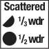

<!-- pdf-page 223 -->

EX: The base NVR is 3; there is no Cloud cover and No Moon. A Wind Change DR of 11 is made with a 6 on the colored dr. This results in a one-hex increase in the NVR to four hexes. Had there been Scattered Clouds and a Half Moon, another dr would have to be made to determine the amount of increase in the NVR; a dr of 1-3 would result in an increase of one, a dr of 4-6 would result in an increase of two.

**1.13 ZERO NVR:** When a unit’s NVR is 0, all Locations except the one occupied by that unit are beyond its NVR *[EXC: as per 1.101]*. Whenever a moving ATTACKER whose NVR is zero attempts to *move* into a *concealed* DEFENDER’s Location (A12.15), it would *not* be returned to its just exited Location but would be vulnerable to TPBF from that DE- FENDER. If so attacked, it cannot leave that Location; mark the units with a CC counter.

**1.14 VEHICULAR NVR:** A vehicle (and its PRC) that is in Motion/Non- Stopped, or changing its VCA, is treated as being within a viewing unit’s NVR if it is at ≤ 1<sup>1</sup>/2 times (FRU) the viewing unit’s NVR (or at ≤ twice the viewing unit’s NVR if the vehicle is tracked). If that viewing unit’s NVR is 0, treat its NVR as 1 for a wheeled vehicle or 2 for a tracked vehicle. The NVR from a BU AFV is halved (FRD).

**1.15 SNOW:** Whenever Ground/Deep Snow is present, the maximum Base NVR (1.12) becomes nine hexes, and the minimum Base NVR becomes two hexes *[EXC: between units in the same building the minimum Base NVR is still 0]*.

**1.16 FORTIFICATIONS:** All Fortification counters are set up hidden at night regardless of terrain, and remain hidden until their protective TEM is used, a non-Dummy enemy unit (determined by the procedure given in A12.11 for minefields) enters the Location that contains it (or enters a pillbox’s—but not a cave’s—hex), or extra MF/MP are used to enter/exit it in the LOS of a Good Order enemy unit or its existence causes the failure of a non-Dummy unit’s attempted entry into the Location (either because the unit does not have enough MF/MP or because entry is NA; the declared MF/MP are expended in the returned-to Location, treating vehicles as if attempted VBM (D2.3) had failed). During night scenarios there is no extra cost to enter/exit a pillbox/entrenchment unless it is done in the LOS of a Good Order enemy unit.

**1.17 FACTORIES:** For LOS traced completely within the building depiction of a Factory, a unit’s NVR is 1 hex *[EXC: if zero (1.13) or Illumi- nated (1.9)]*.

**1.2 SCENARIO DEFENDER:** The Scenario Defender in a night scenario may use HIP to set up 25% (FRU) of his onboard squad-equivalents (using squads and HS only *[EXC: Japanese include crew MMC also]*) and any SMC/SW that set(s) up with them in the same Location. The Scenario Defender may set up his remaining forces concealed, receiving Dummy counters equal to the number of squad-equivalents in his OB either at start or (separately) as reinforcements. These “?”/HIP allotments are in addition to any H1.6 purchases. Neither the “?”/HIP units need set up in Concealment Terrain but lose “?”/HIP as if they were. The Scenario Defender also has the option to record the Location as if they were HIP of any SMC/SW stacked with a HIP/concealed MMC until initially revealed rather than setting it up onboard. Such a counter must be placed onboard if it is ever in a different Location than that of the MMC or when the MMC is revealed.

**1.21 FREEDOM OF MOVEMENT:**<sup>3</sup> Each onboard unit of a Scenario Defender in a night scenario may attempt to move/ advance only if it has either been attacked by the enemy, by other than OBA/sniper, or has seen a Known enemy unit at some time during that scenario (such LOS checks are free). *[EXC: If an AFV with a radio is allowed to move, all other friendly Mobile AFV (and their PRC as long as they remain PRC) with a radio may also.]* Once the Scenario Attacker has resolved any attack other than a successful Ambush, the Scenario Defender’s single best leader (using Random Selection if necessary to determine the best) can gain Freedom of Movement thereafter, if currently in Good Order, if the player makes a dr (∆) \< his ELR. This Freedom of Movement dr can be made only once per friendly MPh. If a Good Order SMC is allowed to move in its MPh, any unit that begins the MPh with it, in the same stack, is allowed to move also (and need not move with it). As a memory aid, players should position all Scenario Defender units that are not yet free to move on a No Move counter (or, if preferred, they can be faced in a common direction instead). Once a unit has been freed to move, it retains this Freedom of Movement for the scenario’s duration.


**1.22 ELR LOSS:** The ELR of a Scenario Defender in a night scenario is always printed on the OB as (and for a DYO scenario is assumed to be) one less than it would be normally. Those Scenario Defender units with an underlined Morale Factor have their ELR lowered to 4 but retain their special characteristics when exceeding their adjusted ELR (A1.23).

**1.23 RECON:** A SSR or DYO purchase may give the Scenario Attacker a single Recon dr after the Scenario Defender has set up, but prior to his own setup. The Final dr is the number of hexes (chosen by the Scenario Attacker) which the Scenario Defender must reveal units in, if in fact he had set up in them. Hidden units are placed in their setup hexes concealed. Concealed units in these hexes lose their concealed status (the Scenario Attacker also receives Right of Inspection of those units; A12.16) regardless of the presence of a LOS to any enemy units. If any hidden Fortifications are in the hex, they must be revealed and placed on the board *[EXC: the type/strength of mines is not revealed, nor are Fortified Buildings/tunnels]*. The Recon dr is modified by the following cumulative drm based on the Scenario Attacker’s Majority Squad Type.

```text
British, Partisans, Russians, Japanese, Finns +1
Stealthy                                      +1
Germans, U.S.                                  0
All other nationalities                       -1
Lax                                           -1
```

**1.3 CONCEALMENT:** “?” is generally gained/retained more easily at night, but is otherwise identical to daylight concealment. Night “?” varies from daylight “?” in only three ways:

**1.31 LOSS:** An Infantry unit loses Cloaking/“?” at night if it uses Non- Assault Movement in a Location that is already Illuminated *when* that unit expends MF in it, or if it enters an enemy-occupied Location during the MPh. Otherwise, it does not lose Cloaking/“?” at night when moving/advancing. A unit in the act of movement when Illumination first affects its current Location has the option to expend no more MF/MP during that MPh *[EXC: Straying units become TI; 1.53]* and thereby avoid the loss of Cloaking/“?”. Movement from an Illuminated Location into a non-Illuminated Location incurs loss of Cloaking/“?” only if it requires expenditure of MF/MP in the Illuminated Location (such as leaving a foxhole—but not for crossing a hexside into a non-Illuminated Location). Vehicles/cavalry lose “?” at night just as if it were daytime.

**1.32 GAIN:** Situations requiring a “?” dr (A12.122) in a daylight scenario gain “?” automatically in a night scenario.

##### 1.33 NVR

**1.33 NVR:** An unconcealed unit beyond a viewing unit’s NVR is never Known to that viewing unit unless the target can be treated as being within NVR as per 1.101.

**1.4 CLOAKING:**<sup>4</sup> Only the Scenario Attacker uses Cloaking. A Cloaking counter is a “?” of any nationality not in play, and has all the characteristics of a “?” plus certain special benefits. Cloaked units are always concealed, but concealed units are not necessarily Cloaked. All rules pertaining to “?” apply to Cloaking counters except as specified otherwise herein.

**1.41 CONTENTS:** The Scenario Attacker’s Infantry (only) always starts the scenario in the form of Cloaking counters *[EXC: Aerial landings]*. Each Cloaking counter has an ID letter to identify it, and is used in place <!-- pdf-page 224 --> of actual units. Each Cloaking counter can represent any number of Infantry and their portaged SW up to the normal stacking limits of a Location (A5.1)—or it can represent no units at all (i.e., a Dummy which can be eliminated by its owner at any time). The actual contents (if any) of each Cloaking counter are recorded by placing them in the corresponding section of the Cloaking Box of the Chapter K divider, and are kept hidden from view by placement beneath a box lid. A Cloaking counter cannot represent (i.e., its Cloaking Box section may not contain) one or more “?”.

**1.411 SETUP:** The Scenario Attacker sets up offboard (including the possible use of Dummy Cloaking counters). He is allotted one Cloaking counter for each squad-equivalent in his OB, either at start or (separately) as reinforcements.

##### 1.42 MF & SW

**1.42 MF & SW:** A Cloaking counter has six MF, regardless of its contents. These MF cannot be increased by any method except road (B3.4) or downhill ski (4.31) bonus. Cloaked Infantry can portage four- or five- PP SW as if they were three-PP SW. Otherwise, Cloaked Infantry cannot portage more than its IPC. However, a SW ≥ four PP cannot be fired in the Player Turn it loses its Cloaked status. Cloaked SW must be dm if possible.

**1.421 MF COSTS:** All MF costs for a Cloaking counter are identical to daytime costs *[EXC: a +1 DRM applies to the Falling DR (B11.41) of Climbing units during a night scenario]*. When involuntarily revealed, Cloaked units are placed on board and must immediately revert to their normal MF allotments for any future movement undertaken in that MPh, minus any MF already expended in that MPh, but with no extra penalty if they had already exceeded such (see 1.51).

**1.422 STACKING:** All units represented by a single Cloaking counter always move/advance as a stack—unless the owner wishes to remove the Cloaking counter and replace it with the actual concealed unit(s). A Cloaking counter may not split into two or more Cloaking counters, although two or more Cloaking counters may combine into one. The inherent parts of a Cloaking counter can break into concealed units without removing the Cloaking counter, provided an original unit remains in the Cloaking Box. There is no limit to the number of Cloaking counters that can occupy a Location; however, when two or more Cloaking counters occupy the same Location, their owner must check their respective Cloaking Boxes to see if their contents merit Overstacking penalties. Cloaking/“?” is automatically lost if overstacked in the LOS of an unbroken enemy ground unit (A12.14).

**1.423 HUMAN WAVE:** All elements of a Human Wave attack lose Cloaked status.

**1.43 LOSS:** Cloaked status is lost, and replaced by its unconcealed actual contents (if any), for any situation that would cause one or more of its units to lose concealment at night (1.31; 1.72), and for making any attack other than a successful Ambush. Once removed, Cloaking counters cannot be regained.

**1.5 MOVEMENT:** The rules governing daytime movement remain in effect at night except as altered below (and in 1.42).<sup>5</sup>

**1.51 ON FOOT:** Infantry/Cavalry *[EXC: Infantry represented by a Cloaking counter; 1.41]* during a night scenario must pay an additional MF (after all modifications) per each Concealment Terrain Location entered *[EXC: if crossing a road hexside or using Bypass in an Open Ground hexside of an Obstacle hex; bocage (B9.5) does not make a Location Concealment Terrain for this purpose]*. In addition, if such a unit’s NVR is 0, it may not use Double Time, road bonus, or Gallop. EX: A squad ascending a Crest Line and entering woods must expend five MF ({2 [entering woods] × 2 [moving to higher elevation] = 4} +1 [entering Concealment Terrain Location at night] = 5).

**1.52 VEHICULAR:** All vehicles using land movement rate must pay an additional MP/MF per hexside crossed (or transited via VBM), added as if towing a Gun. In addition, if an AFV’s NVR is 0, it may not expend MP while BU except to Stop *[EXC: Passengers/Riders may unload as if the AFV had fired in the PFPh]*.

**1.53 STRAYING:**<sup>6</sup> At the start of its MPh, each onboard ground unit or stack wishing to move to a new hex in that MPh *[EXC: 1.531]* must first make a Movement DR (∆). If the colored dr of the Movement DR is a 6, that unit/stack is subject to Straying; otherwise, it can move normally. A Lax unit/stack automatically Strays if the colored dr of the Movement DR is a 6, a Normal unit/stack Strays only if the white dr of the Movement DR is ≥ 3, and a Stealthy unit/stack Strays only if the white dr of the Movement DR is ≥ 5. A unit/stack that must Stray immediately makes a Straying DR (∆), the colored dr of which indicates the Hex Grain Random Direction (B.8) that it must move along *[EXC: Doubles may result in ATTACKER Jitter Fire, cancelling that move; see 1.55]*. If insufficient MF/ MP are available to Stray at least one hex in the indicated direction without Double Time, Minimum Move, or ESB, or if the next Location to be entered by the Strayer would require climbing, traversing a stairwell, fording, scaling, swimming, moving closer to a Known enemy unit, or entering an Illuminated/non-enterable Location (including movement off the map) or entering a HE/WP FFE Blast Area or if it would be subject to a Known minefield (B28.45) attack, the Strayer instead becomes TI in its present Location. Straying units may not use Double Time, leader bonus, ESB, Delay MP, etc. If the next hex to be entered by a Straying vehicle contains an obstacle that would require the vehicle to make a Bog DR, and the vehicle cannot Bypass that obstacle, that vehicle instead becomes TI in its present Location; this is the only instance in which a Straying vehicle may use a Stop MP. Otherwise, the unit continues to move in that direction until it runs out of MF/MP (thus requiring a vehicle to remain in Motion). If the first AFV to move in a radioless platoon Strays, the remainder of the platoon simply follows it using normal Platoon Movement.

**1.531 EXCEPTIONS:** A unit or stack that, at the start of its MPh, wishes to enter a sewer/tunnel, or move within the same hex or along a TB, or can see a Known enemy unit, or is currently on or ADJACENT to a trench/bunker/road/path/gully/stream/river bank or Illuminated Location, does not make a Movement DR until such time as it is no longer in or ADJACENT to such terrain (at which point it must immediately make a Movement DR if still moving). For LOS to Beach/OCEAN Locations see G13.2 & G13.83. Only the first unit to move as part of a Human Wave, Radioless AFV Platoon, Convoy, or Column is required to make a Movement DR unless it individually meets one of the previous exceptions—all others follow accordingly (11.6). A unit/stack entering from offboard in the MPh need not make a Movement DR until it actually enters the board, at which time it becomes subject to all Straying rules.

**1.532 FRIENDLY CONTACT:** Whenever a Straying Mover enters a Location that contains a Good Order friendly unit, it is no longer subject to Straying and the ATTACKER may use the remainder of its MF/MP in completing its MPh as he wishes.

**1.533 BERSERK:** A berserk unit is always Lax (even in daytime) but is not subject to Straying. If it can see a Known enemy unit, its charge is predetermined (A15.431); if not, it is not berserk (A15.44).

**1.54 ROUTING:** A broken unit does not rout normally at night, but instead, always uses Low Crawl and is never eliminated for Failure to Rout. A broken Inherent Crew still uses all of its RtPh to rout out of its vehicle into the same hex as per D5.311. A unit is captured or Surrenders at night only by CC or Mopping Up (even if Disrupted). A DM unit retains DM until its makes a Rally/Self-Rally Original DR ≤ its current printed morale. A broken unit may *always* Low Crawl during the RtPh (including out of enemy-occupied Locations, into marsh, while fording, and through tunnels) and does not have to Low Crawl towards any particular terrain type, but still may not rout toward a Known enemy unit.

<!-- pdf-page 225 -->

**1.55 JITTER FIRE:** Jitter Fire cannot occur in a scenario until at least one Gunflash has been placed due to an attack vs an enemy unit. Thereafter, whenever a unit or stack makes a Straying DR (1.53) that results in Doubles, Jitter Fire can occur as follows:

```text
Doubles
  DR      Result
   2      Closest DEFENDER Jitter Fires
   4      Closest DEFENDER Jitter Fires unless Stealthy
   6      Closest DEFENDER Jitter Fires unless Stealthy or Normal
   8      Moving unit(s) Jitter Fires unless Cloaked, Stealthy or Normal
   10     Moving unit(s) Jitter Fires unless Cloaked or Stealthy
   12     Moving unit(s) Jitter Fires
```

**1.551 UNIT DETERMINATION:** The “Closest DEFENDER” is one or more Good Order non-hidden units in the nearest (in hexes) occupied hex to the moving unit(s)—ATTACKER’s choice in the case of equidistant hexes. If more than one applicable unit is able to Jitter Fire, all such applicable units are affected. Only MG and Small Arms fire are subject to Jitter Fire. Heroes, units with no FP (e.g., a leader without a functioning MG), units already marked with a Final Fire counter, and units marked with a First Fire counter and closer to a Known enemy unit than to the moving unit, are exempt from Jitter Fire. Should no unit in the closest occupied hex be able to Jitter Fire, none occurs. If a squad with a MG must Jitter Fire, both the squad’s inherent FP and that of one of its MG are affected. However, a vehicle subject to Jitter Fire will fire only its MG armament and PRC. No LOS to another unit is necessary to activate Jitter Fire. Should a Dummy Cloaking counter be subject to Jitter Fire (as determined by the side’s Majority Squad Type), it is eliminated. Moving Infantry, which cannot normally fire in its own MPh, can do so for Jitter Fire purposes only.

**1.552 EFFECT:** Jitter Fire has no effect on anyone other than the firer (i.e., placement of appropriate fire/Gunflash markers and attendant loss of Cloaking/concealment). A Jitter Fire attack is resolved only to determine ROF, malfunction/Low Ammo, and Sniper activation. Jitter Fire conducted by a moving unit cancels any remaining portion of its move.

**1.56 RECOVERY:** There is a +1 drm to all Recovery attempts (A4.44) at night.

**1.6 LAX/NORMAL/STEALTHY:** All units are classified as Lax, Stealthy, or Normal at night. Cloaking counters are considered equal to the Majority Squad Type of their side at Scenario start—regardless of actual contents. A SSR is the ultimate source of this definition, but the following general rules apply:

**1.61 STEALTHY:** At night, Stealthy units are generally those designated as Commando, Ranger, ANZAC, Gurkha, Elite/1st-Line Finnish, Good Order SMC, or Partisan.

**1.62 LAX:** At night, Lax units include all Inexperienced, berserk, non-elite Italian/Axis Minor MMC, pre-1943 German MMC, motorized vehicles (and their PRC), and non-Good Order units.

**1.63 NORMAL:** At night, all other Good Order MMC are Normal, as are Good Order Lax units stacked with a Good Order SMC (even for purposes of Ambush; A11.18). Horses, Cavalry, and Animal-Drawn Transport are Normal (unless their Passengers/Riders are Lax).

**1.7 COMBAT:**<sup>7</sup> All night attacks *[EXC: Fire Lanes, mines, Snipers, DC, Specific Collateral attacks, Residual FP, CC, and OBA]* are subject to a +1 Low Visibility (LV) Hindrance DRM (which does not nullify a FFMO DRM; 3.1).<sup>8</sup> However, the +1 Night LV DRM is never applicable in combination with any positive TEM due to HA or if the target hex contains any terrain (inclusive of hills/higher ground level) whose topmost height is at least a full level higher than the firer or if the target is claiming WA (B9.32) over a bocage (B9.5) hexside or is in the same hex as the firer. The Night LV DRM, LV Hindrances, and SMOKE DRM are all cumulative. The LV Hindrance DRM does not reduce the amount of Residual FP left in a hex. EX: The attack of the 4-6-7 in 3R6 against the Russian 5-2-7 in T7 is subject to only a +1 DRM for the Woods TEM. An Attack by the 4-6-7 in T9 would also be subject to a +1 LOS Hindrance for firing through the grainfield (in season). The Night LV DRM does not apply to either attack because the topmost height of the T7 woods is 1 full level higher than the firers. If the 4-6-7 in R6 were on the first level of that building, the +1 LV DRM would apply to its attack because the topmost height of the T7 woods would not be a full level higher. If the Russian squad fires back at R6 the +1 LV DRM will not apply to its attack regardless of which level that 4-6-7 is on.

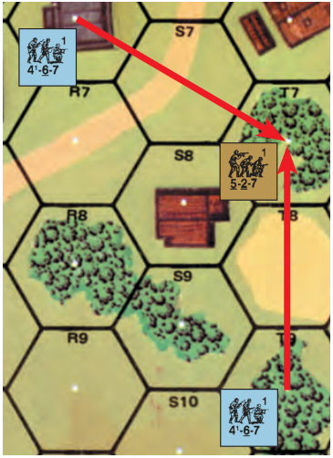

**1.71 FIRE LANE:** At night, a Fire Lane Residual FP counter can be placed beyond the firer’s NVR although the firer must still have a LOS to the moving initial target. *[EXC: Once any starshell/IR has been fired, a MG can place a Fire Lane without firing at any moving target if it can place a Fire Lane Residual FP counter in a Location that is Bore Sighted by that MG; however, if it does so it must thereafter place (if otherwise able to do so) a Fire Lane to that Location in every enemy MPh (and must do so before the ATTACKER begins moving his first unit in that MPh) un- til the start of an enemy MPh in which it can see a Known enemy unit. The firer must make an IFT DR to check for malfunction/cowering/SAN. Once that MG’s Bore Sighting advantage has been lost, it cannot thereafter use this Bore Sighted type of Fire Lane.]*

**1.72 SNIPERS:** An effective Sniper attack (dr 1 or 2) removes any Cloaking counter it attacks and places its contents onboard unconcealed. Random Selection is then used (if necessary) to determine which of those contents are affected by that Sniper attack.

**1.73 TO HIT:** When a unit enters another unit’s NVR it is treated as emerging from a Blind Hex for that latter unit’s To Hit purposes.

**1.74 TARGET ACQUISITION:** Target Acquisition DRM (C6.5) are NA at night unless the target is Illuminated. Remove all Acquired Target counters from a target/Location as soon as it loses such Illuminated status. Thus, a target Illuminated only by a Starshell/IR loses all Acquired Target Status when the Starshell/IR is removed at the end of each Player Turn. Only a target Illuminated by a Blaze/Flame at the end of a Player Turn can remain Acquired from one Player Turn to the next.

##### 1.75 FG

**1.75 FG:** Multi-Location FG are not allowed at night.

**1.76 MISTAKEN FIRE:** The printed (or recorded, for DYO; H1.29) SAN of each side in a night scenario is increased by two (up to a maximum of 7) in actual play, due to random mistaken fire. The actual SAN can never be reduced below the printed (or recorded) SAN in a night scenario; Sniper Checks can reduce it only to the printed number. In addition, anytime a captured MG is fired at night, its Location is subjected to an automatic sniper attack dr.<sup>9</sup>

##### 1.77 CC

**1.77 CC:** During a night scenario, the ATTACKER’s Ambush dr need be only at least two less than the DEFENDER’s to gain Ambush (A11.4) status unless Illuminated.

<!-- pdf-page 226 -->

**1.8 GUNFLASHES:** Gunflashes are *not* a form of Illumination. However, any unit that fires (regardless of its B#/X# DR, or Illumination, or NVR) reveals its Location (but not necessarily itself) to any unit with a LOS to it, regardless of NVR. This allows units to fire at a Location that contains a Prep/Bounding/First/Final/Intensive/No/Opportunity Fire or Melee counter as long as that counter remains in view, even if it is beyond the firer’s NVR.<sup>10</sup> This remains true even if any/all the units have in the meantime left the Gunflash Location and others have entered it. During night scenarios, First/ Final Fire counters are left in the Locations where they were originally placed until the end of the AFPh. All types of Gunflashes not marked automatically by the proper fire counter (1.83-.86) can be marked by placement of a generic Gunflash counter. EX: A MG using Prep Fire and maintaining its ROF is marked with a Gunflash counter.


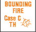

**1.81 BEYOND NVR:** Fire at/observation of a Gunflash beyond the firer’s NVR is treated as occurring vs a concealed target *[EXC: if the target can be treated as being within NVR, as per 1.101]*—regardless of whether or not the target is physically covered by a “?” or represented by a Cloaking counter. Therefore, firing at a concealed unit that is also marked by a Gunflash is subject to halving only once—not twice—for concealment.

##### 1.82 CC

**1.82 CC:** CC causes a Gunflash for as long as it is covered by a Melee counter.

**1.83 MINES:** Mines cause a Gunflash only if they cause Casualty Reduction, or break, immobilize, or eliminate a non-Dummy unit.

##### 1.84 MOL/FT

**1.84 MOL/FT:** A MOL/FT attack creates a Gunflash in the Location actually attacked by the weapon. A FT also creates a Gunflash in its own Location.

##### 1.85 DC/ATMM

**1.85 DC/ATMM:** A DC/ATMM causes a Gunflash only if the DC detonates or the ATMM causes damage to a vehicle.

**1.86 SEARCHING/MOPPING UP:** Searching/Mopping Up causes a Gunflash in all of the affected concealed/broken DEFENDER’s Locations, provided the Searcher suffers Casualty Reduction (A12.154).

##### 1.87 SR/FFE

**1.87 SR/FFE:** All hexes in the Blast Area of a HE FFE are considered marked by Gunflashes. A SR is not a Gunflash, but can be seen by Observers (only) regardless of NVR.

##### 1.88 PIAT

**1.88 PIAT:** A fired PIAT does not create a Gunflash.

**1.89 dm/RADIO/SPOTTING/AMMO-VEHICLE:** Neither dismantling/assembling a SW, Spotting (C9.3), nor use of a radio/phone or an Ammo Vehicle’s B# benefit (10.2) cause a Gunflash. Do not place a Prep Fire or Final Fire counter for such actions at Night despite the fact that the unit has indeed fired.

**1.9 ILLUMINATION:**<sup>11</sup> Illumination can occur via Starshells/IR or Fires—none of which create daylight conditions. Night rules remain in effect in an Illuminated Location *[EXC: Cloaking/“?” is lost more readily (1.31); an Illuminated Location is treated as being within the NVR of all units that otherwise have a LOS to it; Illuminated units can see only Gun- flashes and into Illuminated Locations; 1.101]*.

**1.91 INITIAL USE:** No Starshells/IR may be fired in a scenario until one of three events has occurred:

- while the friendly force has no motorized vehicle onboard an enemy motorized vehicle changes its hex or its VCA within 16 hexes of a friendly unit that is currently capable of firing a Starshell/IR (or Spotting/Observing for an IR-capable firer) and *fires* a Starshell/IR; or
- a friendly unit currently capable of firing a Starshell/IR (or Spotting/ Observing for an IR-capable firer) has a LOS to an enemy unit and *fires* a Starshell/IR; or
- a Gunflash is placed due to an enemy FFE or an attack vs an enemy unit.

Once a Starshell/IR has been fired, both sides are free to fire either type (within applicable restrictions).

**1.92 STARSHELLS:** Starshells may be fired in ei­

```text
       Ldr:≤4dr
    NMC/AFV:≤2dr
◊     LOS: ^1/2 wdr
       LOS: wdr
```

ther the PFPh or Defensive First Fire/DFPh by the player performing that phase’s functions (placement during Defensive First Fire can occur without seeing

a moving enemy unit). In the allowable phase, one attempt to fire a Starshell may be made per hex by one friendly leader, one friendly CE AFV, or one friendly MMC in that hex.

**1.921 USAGE RESTRICTIONS:** A unit must be in Good Order and neither Aerial nor in a pillbox nor pinned nor TI to fire a Starshell. Before a leader (including a CE Armor Leader) can fire a Starshell during that Player Turn, he must first make a Usage dr (∆) of ≤ 4. Before a CE AFV with no Armor Leader, or a MMC, can fire a Starshell, it must first make a Usage dr (∆) of ≤ 2.<sup>12</sup> In addition, after the Player Turn in which the first Starshell/IR of the scenario is fired, any unit *[EXC: a leader]* that fires a Starshell must do so at the start of the PFPh/enemy MPh before the AT- TACKER commences firing/moving during that phase. Firing a Starshell (only) has no effect on the firer’s ability to perform other actions, and does not cause a Gunflash or loss of the firer’s concealment *[EXC: a hidden or Cloaked unit that fires a Starshell must be placed on board beneath a “?”]*. A Starshell cannot be fired from inside an Interior Building Hex/ subterranean Location, nor can it Illuminate such.

**1.922 PLACEMENT:** A player has three choices after his unit passes its Starshell Usage dr, but must announce his choice before making the Starshell/IR placement dr/DR.

**1.** He can initially place the Starshell in its firer’s hex; he then makes a Random Direction dr (B.8) and moves the Starshell one hex in that direction, which is its final placement hex.

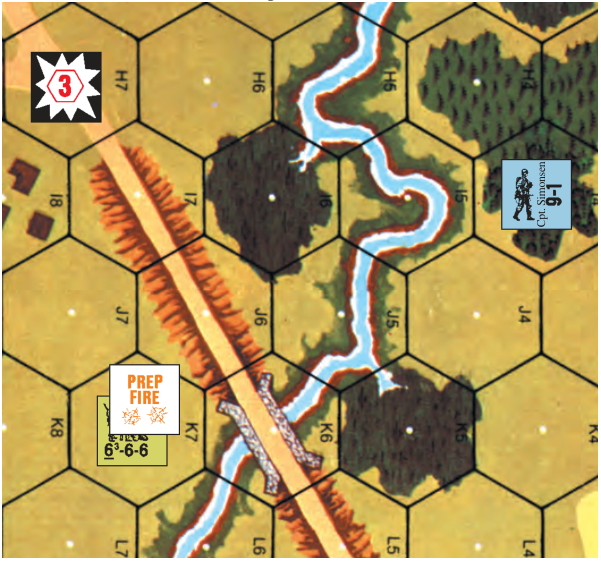

EX: A leader in 13I4, having “heard gunfire” and suspecting an enemy assault on the bridge in K6 (even though he can’t see any Known enemy units), opts to fire a Starshell toward the bridge. The DEFENDER picks K6 as the initial placement hex, and then makes a Starshell Placement DR which is a colored 5 and a white 3, resulting in the Starshell counter being finally placed in H7. Had the Elevated Road in K6 not blocked the LOS to K7, the Gunflash in K7 would have allowed the DEFENDER to halve the Extent of Error dr so as to place the Starshell in I7.

<!-- pdf-page 227 -->

**2.** If the Starshell firer has a LOS to a Gunflash, or to a Known enemy

unit that is \< nine hexes away from the firer, he can initially place the Starshell either in that target’s hex or along the firer’s LOS to it; in both cases the Starshell’s maximum initial placement range is six hexes from the firer. He then makes a Random Direction DR, with the white Extent of Error dr halved (FRU), to find the Starshell’s final placement hex. After this method has been declared, a free LOS check can be made; if no LOS exists, then method 3 must be used to fire the Starshell.

**3.**	 He can initially place the Starshell in any hex that is exactly three hex­

es away from the firer. He then makes a Random Direction DR (with no halving of the white Extent of Error dr) to find the Starshell’s final placement hex.

**1.923 EFFECTS & DURATION:** A Starshell Illuminates all non-subterranean and non-Interior building Locations *[EXC: Dense-Jungle (G2.2)/Bamboo]* within three hexes (even vs Aerial counters) even if it is placed offboard. Temporarily butt any unused board to the map edge to mark the placement of an offboard Starshell. Starshells are removed at the end of each CCPh after placement of “?”.

```text
     0 ROF   1.93 ILLUMINATING ROUNDS (IR): IR
             may be fired only via Indirect Fire, and only by
◊            OBA/onboard mortars that have IR listed as an
   6 hex multiple  available ammo type.
```

**1.931 USAGE:** No Usage dr is necessary for OBA to fire IR. However, the firer of an onboard mortar must make a Usage dr of ≤ 4 before he can fire an IR (failure of which is not considered firing), and in order to fire it he must make a To Hit DR (only to check for malfunction/Low-Ammo/ SAN). Firing one IR uses all of a mortar’s/OBA’s ROF for that Player Turn; therefore, neither type of firer may use another ammo type during a Player Turn in which it fires an IR (when an onboard mortar fires an IR, cover the mortar with a No Fire counter). An onboard mortar firing an IR (or malfunctioning) does cause a Gunflash (and can cause loss of concealment as per the normal rules for that weapon). When OBA is used to fire an IR, the owning player must still have Radio Contact and Battery Access, but FFE:1/2/C status is kept track of offboard (for Battery Access purposes), and each chit used solely to fire IR is reshuffled into the pile when that Fire Mission is completed. OBA fires IR in the same fashion as a SR—never as a FFE. IR Missions must be declared prior to the Mission’s first Battery Access draw.

**1.932 PLACEMENT:** If the mortar/Spotter/Observer has a LOS to a Gunflash/Known enemy unit, method 2 of 1.922 may be used to place the IR. *[EXC: The maximum initial placement range (six hexes) and maxi- mum range to the Known enemy unit (nine hexes) of method 2 do not ap- ply to IR. An onboard mortar must have its initial placement hex within its normal range limits (C2.25).]* Otherwise, method 3 of 1.922 is used *[EXC: instead of placing the IR three hexes away from the firer, it is placed in any hex (within the mortar’s normal range) that is exactly six (or some whole multiple of six) hexes away from the mortar/Spotter/Observer]*. A mortar’s To Hit DR automatically results in IR placement unless it malfunctions, in which case the IR is not placed. The initial placement hex of an IR fired by an onboard mortar does not have to be in the mortar’s CA and the CA cannot change as a result of firing IR.

**1.933 EFFECTS & DURATION:** An IR Illuminates all non-subterranean and non-Interior Building Locations *[EXC: Dense-Jungle/Bamboo; G2.3]* within six hexes.<sup>13</sup> It is otherwise treated like a Starshell (1.923).

**1.94 FIRES:** All Blazes cast an Illuminated Zone whose range from the Blaze’s hex is equal to twice the number of Blazing levels (excluding Rooftops) in that hex. A hex containing a Blaze is Illuminated at all levels (even vs Aerial counters), as is any hex within the Blaze’s Illuminated Zone *[EXC: Blind Hexes; 1.941]*. Fires may not be deliberately set at night unless allowed by SSR. Any attempt to Kindle a Fire automatically causes loss of the Kindler’s concealment and a Gunflash if within the LOS of any Good Order enemy ground unit—regardless of range. EX: Vehicle, brush, orchard, wheatfield, woods, and single-story building Blazes all have a two-hex Illumination range. A two-story house casts a four-hex Illumination range if both levels contain Blazes. A building of level 2 or 3 has an Illumination zone of six- or eight-hex-range respectively if all levels are ablaze.


**1.941 SHADOWS:** Terrain obstacles of ≥ one level within the Illuminated Zone of a Blaze cause quasi-Blind Hexes in the sense that the obstacle blocks the Illumination of those hexes. Any such LOS obstacle in a Blaze’s Illuminated Zone therefore creates a non-illuminated hex(es) behind it, just as if each Blaze counter were instead a viewing unit whose LOS to those hexes was blocked by that obstacle.

**1.942 FLAME:** A Flame Illuminates only its own Location.

**1.95 TRIP FLARES:** During setup for a 1944-5 PTO night scenario involving a U.S. Scenario Defender, the U.S. player may assign a number of trip flares (up to the number available in his OB) to any jungle/bamboo/wire/panji Locations.<sup>13A</sup> He does this by secretly recording the grid coordinate of each such hex and the number of trip flares set up therein. Each time any, even a friendly, non-Dummy (determined as per A12.11) ground unit/stack enters, expends additional MF/MP in or Searches (1.953), a Location that currently contains any trip flare(s), the player owning the trip flare(s) immediately makes a dr (∆) *[EXC: no dr is made if the unit/stack is entering (or entering the Location via) a trench/pillbox/ subterranean passage, or is entering the Location via a path/TB created during play, or if the MF/MP expenditure is made for Stopping, Delay or placing SMOKE; for panjis see also G9.121]*. During the MPh, one dr is made for each separate qualifying MF/MP expenditure (not for each such MF/MP expended), and is made before Defensive First Fire is conducted. The only possible drm is a -4, which applies if during the current Player Turn the unit/stack entered the hex using (or is Searching “across” a hexside that contains) a road or a path that was *not* created during play. If the Final dr is ≤ the number of trip flares currently in that Location, a trip flare has been set off and a Trip Flare counter is placed therein.


**1.951 EFFECTS:** A Trip Flare counter Illuminates the ground-level Location of its own hex and all Accessible ground-level Locations, including all pillboxes in those hexes *[EXC: if placed in/IN a Depression, it can Illuminate IN an Accessible Depression hex only if those two hexes share a Depression hexside]*. Each Trip Flare counter placed onboard during the MPh is placed with its red-on-white side face-up, and is removed at the end of that Player Turn’s CCPh after the placement of “?”; each placed during a RtPh/APh/CCPh is placed with its purple-on-white side face-up, and is removed at the end of the *next Player Turn’s AFPh* (along with First/Final Fire counters; 1.8). The MF/MP expenditure that sets off a trip flare is considered to have been made in an Illuminated Location. A set-off trip flare is equivalent to a fired starshell for the purpose of allowing Fire Lanes vs Bore Sighted hexes (1.71) and the subsequent use of starshells/IR (1.9).

**1.952 ELIMINATION:** Once a trip flare has been set off, the number of them remaining in that hex is reduced by one (or by two if the flare was set off by a vehicle and the -4 drm applied). All trip flares in the hex are eliminated by an Original KIA DR caused by a HE FFE Concentration; an Original K DR by such an attack eliminates one trip flare in that hex. Vs Bombardment, trip flares have a morale of 7 and must take a NMC; one trip flare in the Bombarded hex is eliminated for every multiple of one by which that MC is failed. Elimination by FFE/Bombardment does not cause trip flare Illumination.

**1.953 SEARCH & RECON:** A Search/Recon (A12.152/1.23) vs a hex reveals the presence, but not the number, of trip flares therein. In addition, when a hex that contains a trip flare is Searched, a separate trip flare dr is made for that hex as if the Searcher were entering it (1.95), but ignoring the presence of all entrenchments, TB and paths.

<!-- pdf-page 228 -->

## 2. INTERROGATION

**2.1 INCIDENCE:** Whenever a Personnel unit surrenders or is captured it is subject to immediate Interrogation.<sup>14</sup> The captor must make one DR on the Interrogation Table for each captured unit. An Interrogation DR can never be remade for the same Prisoner, even if the first DR did not yield a usable benefit.

**2.2 INTERROGATION TABLE:** The following cumulative DRM are applicable to the Interrogation Table DR:

```text
Final
 DR    Result                        DRM Cause
 ≥ 6   No Effect                       -1    Prisoner is squad
   5   Concealed Unit(s) Revealed      -1    Prisoner is Inexperienced
   4   HIP Unit(s) Revealed*           +1    Prisoner’s Heroic DRM
   3   Hidden Fortification(s) Revealed*  +1 Prisoner is Elite
 ≤ 2   Defenses Compromised            +1    Guard is Inexperienced
                                       +1    Prisoner is SMC
```

\* If not applicable, select any result with a higher Final DR. If equidistant qualifying hexes exist, the choice of which hex to reveal is made by the interrogated player. Automatic Right of Inspection (A12.16) regardless of LOS is permitted of any non-concealed unit.

**2.21 CONCEALED UNIT(S) REVEALED:** The prisoner player must remove all his “?” from the closest (in hexes) hex that contains such (see 2.3).

**2.22 HIP UNIT(S) REVEALED:** The prisoner player must place on board beneath “?” all his hidden units that are in the closest (in hexes) hex that contains such (see 2.3).

**2.23 HIDDEN FORTIFICATION(S) REVEALED:** The prisoner player must reveal his closest (in hexes) hidden Fortification (including type and strength in the case of minefields). All Fortifications adjacent to another Fortification of the same type are a multi-hex Fortification System which must be revealed in its entirety *[EXC: 2.3]*. A tunnel’s Location is based on its entrance/exit hexes—not the subterranean hexes. If multiple Fortifications exist in a hex to be revealed, all of those Fortifications/Fortification Systems in that hex are revealed.

**2.24 DEFENSES COMPROMISED:** The Prisoner’s side is subject to one application each of 2.21, 2.22, and 2.23 (including normal replacement of NA results; 2.2). EX: If the Prisoner suffers a “Defenses Compromised” result and the only applicable case is Concealment Loss, the Prisoner’s side is subject to Concealment Loss in the three closest hexes containing his concealed units.

**2.3 LOS/RANGE RESTRICTION:** No unit/Fortification is revealed if it is *both* out of LOS of the Prisoner and more than eight hexes away. For purposes of this rule only, the Prisoner can trace its LOS from any Location in its current hex that it could conceivably reach in its next MPh (the Prisoner need not be in that Location—it just needs to be able to reach it). This restriction does not apply to information gained from civilians (2.42).

**2.4 CIVILIANS:** The remnants of the local populace of any battlefield were frequent sources of information about enemy troop movements. This possibility exists only by SSR in every RPh as an inherent part of the Wind Change DR (B25.65). The ATTACKER is the recipient of the information. A Wind Change DR of 3 results in information for the ATTACKER who is in a hostile or neutral country, and a Wind Change DR of 4 results in information for the ATTACKER who is in a friendly country. If players cannot agree on which side is “hostile” or “friendly”, both sides are considered in a neutral country. Information cannot be refused. EX: In all scenarios occurring in France/Italy, the Allies would be considered in a friendly country and the Germans would be considered in a hostile country.

**2.41 LOCATION:** The ATTACKER must then determine where on the board he has received his information. He does this by making a Random Location DR measured from his Sniper counter, and the information is revealed to all Good Order friendly ground unit(s) in the indicated hex. If that hex is unoccupied by a qualifying unit, the information is revealed to all Good Order friendly ground unit(s) in the closest (in hexes) hex to that hex (ATTACKER’s choice in case of equidistant hexes). If the AT- TACKER has no Good Order units on board, no information is received.

**2.42 INFORMATION:** The ATTACKER then makes a dr on the Information Table. The dr is modified by +1 if in a hostile country, or by -1 if in a friendly country.

```text
           INFORMATION TABLE
dr    Result
 0    Defenses Compromised (2.24)
1-2   Hidden Fortification(s) Revealed* (2.23)
3-4   HIP Unit(s) Revealed* (2.22)
5-6   Concealed Unit(s) Revealed (2.21)
 7    False Information; units being informed are TI
```

\* If not applicable, select any result with a higher Final dr up to a maximum of 6. Right of Inspection (A12.16) applies regardless of LOS.

**2.43 CLARIFICATIONS:** The rules for Prisoner Interrogation (2.21- .24) apply equally to the Information Table by replacing: “the prisoner player” with “the DEFENDER”.

## 3. WEATHER

**E3. DYO TEMPERATE WEATHER CHART**

```text
 DR Mar, Apr, May Jun, Jul, Aug          Sep, Oct, Nov Dec, Jan, Feb
  2    Mud              Overcast         Fog/Mist         Clear & Gusty
  3    Mud              Clear & Gusty    Clear & Gusty    Overcast
  4    Clear & Gusty    Fog/Mist         Mud              Mud & Overcast
  5    Overcast         Overcast         Overcast         Clear & Gusty
  6    Clear            Clear            Clear            Snow
  7    Clear & Gusty    Clear            Clear            Clear
  8    Clear            Clear            Clear            Clear & Gusty
  9    Fog/Mist         Clear            Clear & Gusty    Snow
  10   Mud              Clear & Gusty    Mud              Snow
  11   Mud & Overcast   Mud              Mud & Overcast Snow
  12   Snow*            Mud & Overcast   Snow*            Snow
* March and November only; otherwise treat as Overcast
```

The Weather Chart is consulted only once prior to both setup of, and purchase for, any DYO scenario where research into weather conditions is insufficient to describe the actual weather. Otherwise, *weather condi- tions are always considered Clear in the absence of any weather SSR*. The Temperate Weather Chart is only for use in moderate climates such as those prevailing in Europe. Special Weather Charts and applicable rules are provided in Chapters F (*WEST OF ALAMEIN*) and G (*GUNG HO!*) for use in North Africa and the Pacific Theater respectively and on page H186 for use in Finland and the Leningrad-Murmansk area. Weather dictated by the Weather Chart always takes precedence over the determination of EC (B25.5); e.g., an EC result of “Snow” or “Mud” does not activate those respective weather rules if the Temperate Weather Chart result/ SSR listing (or non-listing) is Clear—only their EC DRM/drm applies.

**3.1 LOW VISIBILITY (LV):** LV is the term used to describe weather conditions and related camouflage (3.712) when Night/Fog/Mist/Rain/

<!-- pdf-page 229 -->

Falling Snow occur in a scenario. A LV Hindrance *[EXC: Fog]* is treated exactly like a LOS Hindrance except that a LV Hindrance DRM is cumulative with other Hindrances regardless of range and does not by itself negate the FFMO DRM or Interdiction, or affect the placement of (or attack by) Residual FP (A8.26), or prevent concealment loss *[EXC: Winter Camouflage]*.

**3.2 CLEAR:** Weather has no effect. EC are determined normally (B25.5).

**3.3 FOG/MIST:** Make a dr to determine whether Fog or Mist is in effect. On a dr of 1-5, the result is Mist (3.32); on a dr of 6, the result is Fog (3.31). EC are automatically “Moist” during a scenario that contains Fog or Mist.

**3.31 FOG:** Fog does not necessarily affect all hexes/Locations of the mapboard; it can occur at certain elevations while not affecting others that are higher. After setup, make a dr on the Fog Level Chart to determine the elevation(s) at which Fog exists, and place SMOKE counters accordingly on the Fog Display Chart of the Chapter K Scenario Aid Card to show the level(s) containing Fog.

```text
        FOG LEVEL CHART
dr    Levels Affected
 1    Level -1 and lower
 2    Level 0 and lower
 3    Level 1 and lower
 4    Level 2 and lower
 5    Level 3 and lower
 6    Level 4 and lower
                    EX: Fog is present at level 0 and lower with
                    a Density DRM of +1 per hex. All LOS be-
                    tween the various hill hexes is unHindered
                    by Fog LV DRM. However, the 4-6-7 on
                    level 2 hill hex 2I4 firing down to level 0 at
                    F4 would be subject to a +2 Fog LV DRM
                    (+1 each for F4 and G4). Although G4 is a
                    level 1 hill hex, Fog exists in the level 0 por-
                    tion of the hex. If the 4-6-7 traces its LOS
                    to E4, the Fog LV DRM remains +2 (+1
                    each for E4 and F3-F4) even though it was
                    traced through three Fog hexes; the Fog
                    in G4 has no effect on the LOS because as
                    a level 1 Hindrance it would Hinder only a
                    LOS drawn to the hex immediately behind
                    it. However, if the 4-6-7 were to fire at B5,
                    it would be subject to a +3 Fog LV DRM
                    (+1 each for B5, C5, and D5). D5 Hinders
                    the LOS because it is five hexes away and
                    therefore creates an additional “Blind Hex”
                    (A6.41). However, if the 6-5-8 in J4 were
                    to fire on B5, the Fog LV DRM would be
                    only +2 (+1 each for B5 and C5) because
                    as a level 3 firer, the 6-5-8 has a two-level
                    advantage over the height of the Fog Hin-
                    drance “obstacle” in E5, D5, and C5—thus
                    reducing the “Blind Hexes” they can each
                    Hinder by one (to a minimum of one) as per
                    A6.42. A unit in B5 firing at the 4-6-7 would
                    be subject to the same +3 Fog LV DRM (+1
                    each for B5, C5, and D5) plus an additional
                    +1 Fog LV DRM for firing out of a Fog Lo-
                    cation (A24.8).
```

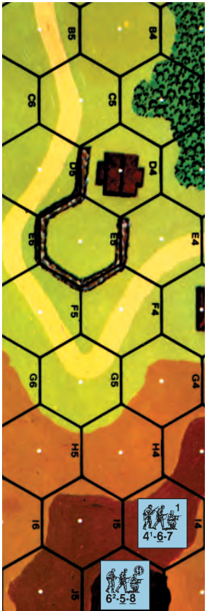

EX: The Fog Level dr is a 3, resulting in Fog at Level 1 and lower. Therefore, a non- Hindered LOS to another hex can exist only between units at Level 2 or higher, or those within a Factory (3.8).

**3.311 EFFECT:** The density of Fog is determined by a Fog Density dr after scenario setup. Each “fogged-in” level is assumed to be affected by Smoke of the proper DRM up to the start of the next full level. All Smoke rules otherwise apply normally. *[EXC: Fog is eliminated only via Wind Effects (3.312) and is not subject to Drift. The Fog DRM is halved (FRU) for fire within the same Location.]*

```text
dr     Fog DRM
 1         +1
2-3        +2
4-6        +3
```

**3.312 WIND EFFECTS:** Fog density will decrease one level during the RPh of each *Game* Turn in which a Mild Breeze is in effect after the Wind Change DR is made. Fog density will decrease one level during the RPh of each *Player* Turn in which Heavy Winds or Gusts are in effect after the Wind Change DR is made.

**3.313 AIR SUPPORT:** Air Support cannot be used vs any Location in Fog.

**3.32 MIST:** Whenever Mist is present, a LV Hindrance DRM applies at a range of ≥ seven hexes to all fire *[EXC: Specific Collateral Attack; Fire Lane; OBA; Residual FP]* and LOS. This Mist DRM is +1 for each multiple of six hexes (or fraction thereof) beyond the initial six-hex range. Mist DRM can apply to Aerial attacks (as per E.5). EX: Mist creates a +1 LV Hindrance DRM if the range to the target is 7-12 hexes (or at an Aerial Range of 4-6 hexes), +2 if 13-18 hexes, etc.

**3.4 GUSTY:** EC are resolved normally, but Gusts (B25.651) occur on a Wind Change DR ≥ 10.

**3.5 OVERCAST:** Overcast indicates the presence of storm clouds. Cloud Cover (1.11) is automatically Overcast. EC are determined normally until it rains (3.51).

**3.51 RAIN:** Players automatically check for rain at the start of each RPh as an inherent part of the Wind Change DR. Rain starts on a Wind Change DR ≥ 10 and stays in effect until a Wind Change DR ≤ 3 *ends* the rainfall (*regardless of intensity*). Rain can start again on a subsequent Wind Change DR ≥ 10 because the Overcast condition continues throughout the scenario. If a Wind Change DR ≥ 10 occurs while it is already raining, the intensity of the precipitation increases such that the Mist LV Hindrance DRM (3.32) is +1 at ≤six hexes, and is increased by +1 at all ranges \> six hexes, but can never increase further regardless of subsequent Wind Change DR. When rain starts, EC become “Wet” for the duration of the scenario.

##### 3.52 LV

**3.52 LV:** Rain automatically causes Mist (3.32).

**3.53 SMOKE:** The only SMOKE that can exist during rain is that emanating from a Blaze, or from SMOKE entirely placed inside a building (A24.6). Such SMOKE still fills the entire hex, but is not subject to Drift.

**3.54 MOVEMENT:** During and after rain, all ground units must expend one extra MF (or MP) per elevation level change (up/down) unless using a stairwell or paved road. (See example at the top of the next column.)

**3.55 AIR SUPPORT:** Air Support is not possible during Overcast.

**3.6 MUD:** EC are always “Mud”. Fires will spread to adjacent hexes only if the connecting hexside crosses a building/woods/brush/grain/orchard

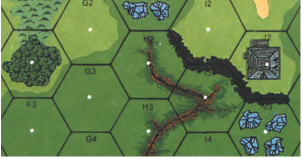

<!-- pdf-page 230 -->

3.54 EX: Infantry moving from 24G3 to G2 must pay three MF. If descending from G2 to G3 they must pay two MF. If moving from IN H2 INTO H3 they must pay five MF (2 [Abrupt Elevation Change intermediate level; B10.51] +2 [entering Open Ground gully] +1 [rain] = 5). A halftrack towing a Gun and moving from G3 to G2 pays seven MP (4 [higher elevation] +1 [Open Ground] +1 [rain] +1 [towing] = 7). If moving from IN H2 INTO H3 it must expend ten MP (4 [Abrupt Elevation Change intermediate level] +4 [entering Open Ground gully] +1 [rain] +1 [towing] = 10). (in season) symbol or the fire is spread by Gusts (B25.651). On *unpaved* roads, the road bonus in B3.4-.41 is NA and Open Ground movement COT applies (as modified by 3.64) when using the road. Paved roads (which include bridges) and runways are not affected by Mud.

**3.61 BOG/MANHANDLING:** The chances of vehicular Bog (D8.23) and difficulties with Manhandling Guns (C10.3) are increased during Mud.

**3.62 HE ATTACKS:** Due to the cushioning effects of Mud, there is a +1 TEM (cumulative with all other applicable TEM/Hindrance DRM) to all HE (not HE Equivalency; C8.31) attacks that are resolved in Open Ground (see 3.65) *[EXC: Mines, Air Bursts, Specific Collateral Attacks, Direct Fire ordnance vs a vehicle (and its PRC)/pillbox (and its occupants)]*. The Residual FP of such an attack is reduced by one IFT column (A8.26). FFMO still applies normally.

**3.63 ENTRENCHING:** In Mud, there is a +1 DRM to all Entrenching attempts.

**3.64 MOVEMENT:** In Mud, all ground units must expend an extra <sup>1</sup>/2 MF (or one full MP) per Open Ground (see 3.65) hexside *[EXC: if entering non-Open Ground terrain in that hex]*, as per 3.9. Double Time and Leader MF bonus are still applicable.

**3.65 OPEN GROUND:** For purposes of Mud and Deep Snow (3.62, 3.64, 3.731) only, Open Ground includes all unpaved (during mud) or unplowed (during Deep Snow) roads, gullies *[EXC: gullies containing woods/ brush during Mud, or containing woods during Deep Snow; B12.6]*, dry streams, plowed fields (not grain), and otherwise Open Ground hexes including shellholes and trenches regardless of LOS Hindrances, hexside TEM, entrenchments, or height.

**3.7 SNOW:** Snow can exist in several forms and combinations. A Snow result on the Weather Chart requires a dr on the Snow Chart to determine the type of snow rules in effect. **SNOW CHART Final dr Condition drm:**

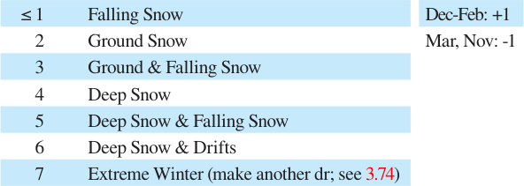

**3.71 FALLING SNOW:** Falling Snow is always accompanied by Overcast conditions, even if the snowfall ends. Falling Snow re-occurs on a Wind Change DR ≥ 10 and stays in effect until *stopped* by a Wind Change DR ≤ 3 (*regardless of intensity*). Once stopped, snowfall can start again on a Wind Change DR ≥ 10. If a Wind Change DR ≥ 10 occurs while it is already snowing, the intensity of the precipitation increases such that the Mist LV Hindrance DRM (3.32) is +1 at ≤ six hexes, and is increased by +1 at all ranges \> six hexes but can never increase further regardless of subsequent Wind Change DR.

###### 3.711 LV

**3.711 LV:** Falling Snow automatically causes Mist (3.32).

**3.712 WINTER CAMOUFLAGE:** In any type of snow, any unit/vehicle (not PRC) specified as having Winter Camouflage receives a +1 LV Hindrance DRM when fired upon beyond eight hexes if Infantry, or beyond 16 hexes otherwise *[EXC: OBA, Residual FP, Fire Lane]* unless it already qualifies for a positive TEM other than SMOKE. Such a unit also receives a -1 drm to its Concealment dr (A12.122). Winter Camouflaged units may Assault-Move/advance into Open Ground regardless of range from enemy units without loss of “?”.

###### 3.713 EC

**3.713 EC:** When Falling Snow is possible, EC are “Moist” (unless Ground/ Deep Snow are also present) and all streams are considered frigid.

**3.72 GROUND SNOW:** During Ground Snow, EC are always “Wet” unless Deep-Snow/Extreme-Winter also apply. The Winter Camouflage provisions (3.712) of Falling Snow also apply to Ground Snow.

**3.721 FIRES:** During Ground/Deep Snow, Blazes will spread to adjacent hexes only if the connecting hexside crosses a building/woods/brush symbol *[EXC: brush NA in Deep Snow]* or the Blaze is spread by Gusts (B25.651).

**3.722 TERRAIN:** Ground/Deep Snow turns all marsh/mudflat terrain into Open Ground (B16.8), freezes all streams, and activates all Ice rules (B20.7, B21.6). It also causes a +2 DRM to all Entrenching attempts.

**3.723 INFANTRY/CAVALRY MOVEMENT:** During Ground Snow, all Infantry/Cavalry must expend one extra MF per elevation level change (up/down) unless using a stairwell or plowed road. Road Bonus (B3.4) is NA unless using a plowed road.

**3.724 VEHICULAR MOVEMENT:** The minimum Road Entry MP cost in Ground Snow is one MP—not <sup>1</sup>/2. All non-tracked vehicles *[EXC: sledges]* must expend one extra MP (or MF) per hexside crossed/bypassed. Both effects apply even on plowed roads.

**3.73 DEEP SNOW:** EC are always “Snow”. Winter Camouflage (3.712), Fires (3.721), and Terrain (3.722) rules are in effect. In addition, Deep Snow transforms brush into Open Ground (B12.6).

<!-- pdf-page 231 -->

**3.731 HE ATTACKS:** All HE (not HE Equivalency; C8.31) attacks in Open Ground (see 3.65) must add a +1 TEM (cumulative with all other applicable TEM/Hindrance DRM) due to the cushioning effects of Deep Snow *[EXC: Mines, Air Bursts, Specific Collateral Attacks, Direct Fire ordnance vs a vehicle (and its PRC)/pillbox (and its occupants)]*. The Residual FP of such an attack is reduced by one IFT column (A8.26). FFMO still applies normally.

**3.732 MINEFIELDS:** All minefield attack/Clearance DR are subject to a +1 DRM due to Deep Snow. All A-P minefield attacks are resolved with half FP. The A-T Mine factors present in a hex are considered to be one less than normal.

**3.733 INFANTRY/CAVALRY MOVEMENT:** In Deep Snow, Infantry/ Cavalry movement penalties (3.723) still apply and, in addition, such units must pay an extra <sup>1</sup>/2 MF per hexside *[EXC: if entering any woods/building/rubble, or crossing a plowed road hexside]*. The road bonus (B3.4) is applicable only along plowed road hexsides (roads are plowed only by SSR). Gallop is allowed only if used entirely across plowed road hexsides.

**3.7331 VEHICULAR MOVEMENT:** In Deep Snow the minimum Road Entry MP cost is one MP—not <sup>1</sup>/2—whether BU or not (even on plowed roads). Except along plowed roads, all tracked vehicles must pay one extra MP, and all non-tracked vehicles *[EXC: sledges]* must pay two extra MP (or MF), per hexside. Along plowed roads, all non-tracked vehicles [*EXC: sledges*] must pay one extra MP/MF per hexside. Gallop is allowed only if entirely across plowed road hexsides.

**3.7332 BOG/MANHANDLING:** The chances of vehicular Bog (D8.23) and difficulties with Manhandling Guns (C10.3) are increased during Deep Snow.

**3.734 SMOKE:** The only SMOKE that can exist during Mud and/or Deep Snow is that from SMOKE entirely placed inside a building (3.8) or emanating from a Blaze. Such SMOKE still fills the entire hex.

**3.74 EXTREME WINTER:** A Final dr of 7 on the Snow Chart results in the use of Extreme Winter rules. Make another dr to determine the Snow conditions (3.7) that are in effect in addition to Extreme Winter rules. EC are always “Snow” during Extreme Winter.

###### 3.741 B#/X#

**3.741 B#/X#:** The B#/X# of all weapons *[EXC: DC]* decrease by the following amounts (A.11 applies) during Extreme Winter:

Pre-April, 1941 Russians: 1 Pre-April, 1942 Axis *[EXC: Finns]*: 2

Scenario designers should always reduce by one the ELR of units affected by 3.741.

**3.742 FATE:** In addition to the normal Fate rules (A10.64), any non-Finnish Axis Personnel unit prior to April 1942, or Russian prior to April 1941, that makes an Original Rally DR ≥ 11 while not in a building/pillbox during Extreme Winter suffers Casualty Reduction.

**3.743 ENTRENCHING:** Foxholes may not be dug (B27.11) during Extreme Winter.

**3.744 AXIS VEHICLES:** In an Extreme Winter scenario set prior to April 1942, a non-Finnish Axis Scenario Defender must, for each motorized vehicle that he sets up onboard and not in Motion, make a dr before that vehicle expends its first Start MP of the scenario; on a 6 it is Immobilized.

**3.75 DRIFTS:** Drifts occur at the start of a scenario by SSR or by DYO use of the Snow Chart. If Drifts are specified, each mapboard in play receives six Drift counters. A Drift is also created in one hex of each mapboard at the start of any RPh in which, prior to the Wind Change DR, Heavy-Winds/Gusts were in force in combination with Ground or Deep Snow. Drift placement is resolved by randomly drawing a Drift counter from the complete pool of remaining unused counters and initially putting it in the hex containing coordinate number 5 of the hexrow listed on that counter, and making a Random Location DR to determine the hex where the Drift counter will be permanently placed *[EXC: if placed in an Interior Building or another Drift hex, roll again]*. If placed on an adjoining board it remains there; if placed offboard that particular Drift is lost.

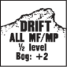

**3.751** A Drift affects only one hexside of its hex and is always placed so as to face the Direction the Wind is blowing to at the time of placement. If there is currently no wind, make a Random Direction dr to determine the wind’s last direction. Once placed, a Drift remains in play as is, regardless of Wind Changes or other events *[EXC: a Drift can be removed through the normal Roadblock Clearance rules; B24.76]*.

**3.752** A Drift hexside requires ALL of a unit’s MF/MP to cross, and also requires a vehicle to take a Bog Check with the Deep Snow DRM (+2; +1 each for Snow and Deep Snow; D8.21). If bogged, the vehicle is considered in the hex with the Drift counter. In addition, the Drift hexside is treated as a hedge unless a wall/roadblock hexside also happens to co-exist there. Bypass is not allowed along a Drift hexside, but normal movement between building hexes of the same building can occur across a building- Drift hexside.

**3.8 BUILDINGS:** Weather is always “Clear” for units in a building viewing/firing to/entering another Location of that same building through a building hexside and for units in the same hex *[EXC: Bypass/Rooftop]*.

**3.9 MF/MP COST ADDITIONS:** Any extra MF or MP costs due to weather are added per hexside crossed (or Bypassed), after calculating total cost *[EXC: Towing; C10.1]*.

## 4. SKI TROOPS

#### 4.1 DYO

**4.1 DYO:** Ski capability (and Winter Camouflage; 4.4) can be purchased for a DYO OB (H1.202).

**4.2 SKI MODE:** The special rules for ski troops apply only to those scenarios in which Ground or Deep Snow is present. Ski-capable units (those beginning a scenario with ski counters or that pass a ski-use dr; 4.21) may be on foot, on skis, or transported by any other normal means when not in ski mode. Units on skis are in ski mode and are referred to as Skiers. Skiers are identified by placing the possessed ski counter with the “Skis” up. Ski troops may switch between ski and foot/Passenger (or Rider) mode only during their own MPh/RtPh/ APh. Switching mode is considered movement and is NA if pinned/TI. There is no cost for switching from ski to foot mode, but it costs two MF to switch from foot to ski mode *[EXC: one MF for Finnish Infantry**<sup>14A</sup>**]*. Normal CX restrictions and penalties (A4.72) apply to units switching to ski mode and advancing (or vice versa) in the same APh. Vehicle crews never start a scenario with skis.

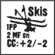

**4.21 SKIS:** When not in ski mode, skis are carried atop a unit with the “OFF Skis” side up at a cost of one PP. A unit cannot carry skis in excess of its own usage requirements. Skis can be eliminated like any SW (A9.73-.74). If skis are Recovered/Transferred they can be used by their new owner, only if it began the scenario with ski capability or makes a ski-use dr of 1 immediately upon Recovery/Transfer. A ski-use dr of 2-6 eliminates the skis automatically. Unpossessed skis are placed under all units in their Location.

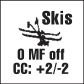

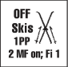

**4.22 DUMMY SKI COUNTERS:** Dummy ski counters are provided for scenarios where Dummy counters are allowed to use skis by SSR. Dummy ski counters are treated as normal Dummy coun­

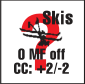


<!-- pdf-page 232 -->

ters (A12.11) in all aspects *[EXC: they must be stacked with ≥ 1 non-ski Dummy counter(s) at all times or be removed immediately regardless of LOS]*, but allow that Dummy stack to use ski movement. OB-given Dummy counters may be exchanged for Dummy ski counters as long as the above is adhered to.

**4.3 MOVEMENT:** Skiing is considered a form of Infantry movement and is therefore subject to all the pertinent rules of such, except as amended herein. A Skier pays no extra MF due to snow/Drift, and pays normal Infantry MF entrance costs. However, a Skier may never *enter* rubble or debris, nor a building, pillbox, vehicle, entrenchment (nor does it *ever* receive shellhole TEM benefits), Rail Car (B32.5), nor can a Skier cross a cliff hexside or move beneath a Wire counter. The Skier must first change to foot mode to enter these areas, although a building/Rail-Car hex that contains no rubble (see B24.2) can be entered via Bypass, and once beneath a Wire counter a unit can return to ski mode. If forced to remain in a building/Rail-Car hex following Bypass entry of that hex, loss of Skier status occurs automatically. Once in such a restricted area, the unit may not change to ski mode until it has left that area (a unit in a building can spend one MF for Bypass to an Open Ground vertex of its *hex* where it can then expend two *[EXC: Finns (4.2)]* more MF to switch to ski mode and thus leave its hex as a Skier). The extra MF bonus for exclusive use of road movement does not apply to a Skier.

**4.31 DOWNHILL:** A Skier receives a bonus of two MF for each Crest Line crossed while moving to a lower elevation during the MPh/RtPh. This bonus can be used to exceed the special MF allotment of broken (A10.5)/wounded (A17.2)/berserk (A15.431) units.

##### 4.32 APh

**4.32 APh:** A Skier can advance one hex during the APh, subject to the normal possibility of Difficult Terrain restrictions (A4.72). Such an advance can possibly include changing to/from ski mode in an allowable Location at either the start or end of that APh, although the MF expenditure for doing so is included in the A4.72 MF calculation.

**4.33 ROUTING:** Broken units may change ski mode/use skis during the RtPh by paying the applicable MF cost. Skiers may Low Crawl only if they first remove their skis.

**4.4 CAMOUFLAGE:** A unit that is ski-equipped at scenario start is also assumed to be wearing Winter Camouflage (3.712).

#### 4.5 CC

**4.5 CC:** Skiers engaged in CC must add +2 to their CC Attack DR and are subject to a -2 DRM when attacked in CC. However, Skiers in Melee have the option in their MPh to leave the Melee or change to foot mode (A11.71).

**4.6 ATTACK RESTRICTIONS:** A Skier may not fire any Gun, ordnance SW, or MMG/HMG; he must change to foot mode first.

**4.7 BERSERK:** A berserk unit may not change from foot to ski mode, or vice versa. *[EXC: A berserk Skier charging a Known enemy unit in a Location that the Skier cannot normally enter (4.3) must change to foot mode when it reaches the point where, due solely to being on skis, it can move no closer to the unit as per A15.431.]*

**4.8 AHKIO:**<sup>14B</sup> An Ahkio is treated as a 3 PP SW that must be *portaged* when possessed by Passengers/Riders or when entering terrain where its use is NA (4.83).


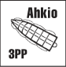

**4.81 INFANTRY USE:** The IPC of an Infantry MMC possessing (but not portaging) ≥ 1 Ahkio is increased by 2 PP (maximum) as indicated on the counter by “IPC: +2PP”.

**4.82 MOVEMENT:** Unless being portaged, an Ahkio can only be used in terrain a Skier (4.3) can enter. A unit must drop possession of an Ahkio before routing or performing a Berserk charge, or when it becomes part of a Human Wave or breaks while bypassing a building.

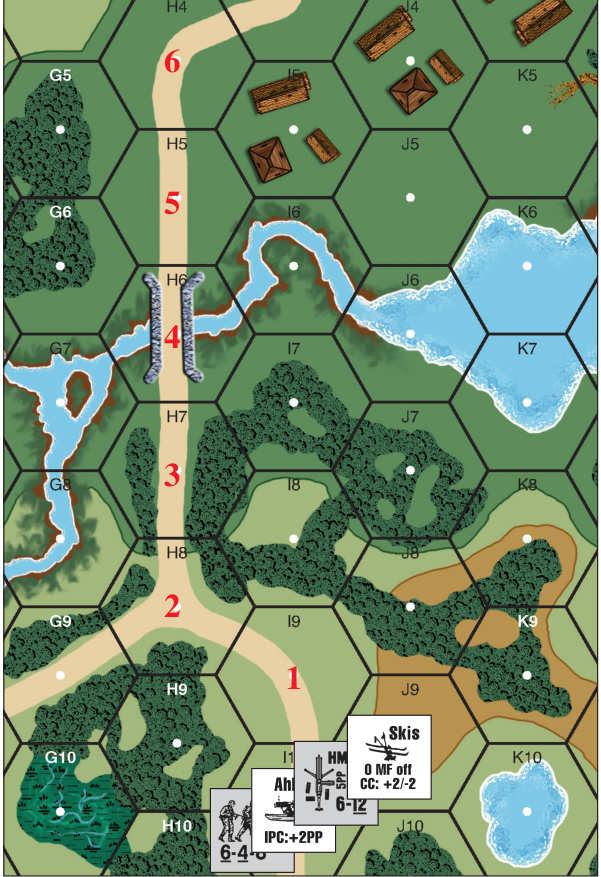

EX: A Finnish 6-4-8 squad in 47I10 starts its MPh in ski mode with Ground Snow in effect. It also possesses an Ahkio and a HMG. The HMG is five PP; the portage cost of the skis and the Ahkio do not count when in use in snow. The Ahkio increases the IPC of the squad by two PP, so there is no MF penalty (A4.42). The squad enters I9 for a cost of one MF. It continues to H8, spending one more MF. Entering H7 costs a third MF, but the unit also *gains* two MF for going downhill (4.31) for a total of six MF to spend in its MPh. It can continue moving to H6, H5, and H4 without declaring Double Time. If the squad was accompanied by a leader also on skis, it could move to H5 as indicated for five MF. Wishing to enter the I5 building, both units switch from ski mode to foot mode for zero MF (4.2) and drop both the Ahkio and skis. The squad and the leader carry the HMG into the building, using the remaining two MF (one MF is lost since the HMG’s portage cost exceeds the IPC of the squad + leader by one).

**4.83 TERRAIN LIMITATIONS:** In addition to the limits on Skier movement (4.3), an Ahkio cannot be used when crossing an unbreached wall/ hedge, entering a crag hex, or entering a hill hex when Alpine Hills (B10.211) are in effect.

##### 4.9 DYO

**4.9 DYO:** An Ahkio has a BPV of “1”.

<!-- pdf-page 233 -->

## 5. BOATS

**5.1 COUNTERS:** There are three types of boats provided in the game.<sup>15</sup> Each type is rated for water speed (MP; 5.3), size (stars; D1.7), capacity (PP; D6.1) and ability to be Manhandled (M#; C10.3).

**5.11 ASSAULT BOATS:** The German Assault Boat has an Inherent Driver; its four MP may be used regardless of the number/status of its Passengers. However, this counter can also be used to represent Assault Boats that have no motor or Inherent Driver and therefore must be paddled (with only two MP) by Personnel worth at least five PP (D6.1).

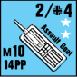

**5.12 PNEUMATIC BOATS:** Pneumatic boats (i.e., Large and Small Rafts) must be occupied by Personnel worth at least <sup>1</sup>/3 of their listed portage capacity to use that boat counter’s MP *[EXC: for Pneumatic boats only, each SMC equals 1 PP]*.

**5.121 SMALL RAFT:** Each Small Raft counter with three boat depictions represents enough boats to transport ≤ 14 PP as per D6.1, or if flipped over to its reverse side (with two boat depictions) represents enough boats to carry ≤ 7 PP. One Small Raft counter (a single boat depiction) can transport ≤ 3 PP. Once in the water, a three-boat counter may transform into a two-boat counter only to accommodate Casualty Reduction combat losses (5.5, 5.53). This is done by flipping that counter to its two-boat side and eliminating a HS (or possibly crew, randomly selected if appropriate) from among its Passengers. Any surviving HS does not have to take a MC/ LLMC. In addition, each SW/SMC in the boat counter must make a dr to determine whether it is eliminated (dr 4-6) or saved (dr 1-3). Those SW/ SMC which are spared remain in the two-boat counter without further penalty even if they exceed the counter’s reduced portage capability. A two-boat counter cannot be Reduced to a one-boat counter due to combat losses; it is eliminated instead. The three-boat Small Raft is the only boat that automatically suffers loss of a MMC Passenger when subject to Casualty Reduction; all other boats use Random Selection to determine the Passengers affected. However, either a one- or two-boat counter can be separated from a larger counter while on land/Beached, and can be Manhandled/launched by leaving behind a substitute counter with the proper number of boat depictions. Whenever possessed by the same Good Order unit, boat counters can be recombined into a larger boat counter, making “change” as necessary. EX: A one- and a two-boat counter can be recombined into a three-boat counter, or two two-boat counters can be recombined into a three-boat and a one-boat counter.

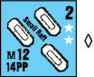

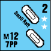

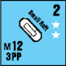

**5.122 LARGE RAFT:** A Large Raft may carry one piece of ordnance with a M# ≥ 10 at a Passenger cost of 10 PP. However, the Gun can be loaded onto the boat only if the boat is Beached (5.23) along a hexside of the Gun’s Location. Loading the Gun then requires passing a M# DR (C10.3), at a cost of one MF (not doubled). Unloading the Gun also requires passing a M# DR at a cost of one MF (not doubled) in addition to the normal MF entry cost of the land hex.

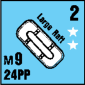

**5.123 PASSENGERS & SW:** Passengers and any Gun/SW on a boat can be removed from view by placing them in the Cloaking Box corresponding to their boat’s ID. Such pieces remain out of view until landed (although they are not considered concealed for TH/IFT Effects purposes), and are subject to loss/wounds normally. Any necessary Casualty Reduction is resolved in the Cloaking Box. Up to four SMC can be carried on any boat at no cost to its PP capacity. All SW carried on a boat must be dm if possible.

**5.2 OVERLAND MOVEMENT:** All empty boats can be carried overland by Infantry using the Manhandling system (C10.3) during *its* MPh (only). Unlike Gun Manhandling, these Infantry are not TI and may still carry up to their normal IPC. The Manhandling Infantry must amount to at least <sup>1</sup>/3 of the boat’s PP capacity to attempt Manhandling, and only men in excess of that minimum qualify for the Manhandling DRM for additional men. A Large Raft may not be Manhandled via Infantry Bypass or into/ out of a building *[EXC: Factory Stairwell Location; B23.742]*. Other boats may be Manhandled using Bypass. Up to four assault boats may be towed overland as if they were a single Gun with a Manhandling number of 10.

**5.21 MPh/LOADING:** Once Beached or in the water, a boat is considered a vehicle—which limits its Passengers to four MF during any MPh in which they mount, ride, or dismount (A4.11). An Infantry unit loads onto a boat that is Beached in its Location at a cost of one MF plus any MF required for crossing that hexside (including any wall, hedge, Abrupt Elevation Change, Weather effects, etc.); however, there is no cost to “enter” the Water Obstacle itself. Each remaining MF can then be used to power <sup>l</sup>/4 of the boat’s water MP allotment (FRD).

##### 5.22 APh

**5.22 APh:** A boat may not be Manhandled during the APh. However, if already Beached (5.23), it may be loaded onto *[EXC: Guns]* and placed in that water hex.

**5.23 BEACHING:** Beaching can occur freely during the boat’s MPh/ APh if it is declared as it enters any land/water hex containing any non-cliff shore hexside/pontoon (B6.41-.45) bridge, and is symbolized by placing the boat counter so that it straddles the water-land hexside on which it is Beached. If Beaching is not declared upon entry of such a hex, it requires further expenditure of another MF if on land, or another MP if in the water. Otherwise, there is no cost to Beach a boat. A Passenger must Beach a boat before it exits the boat. Personnel can load onto (or unload from) a boat only if it is Beached, and can do so only across the hexside on which it is Beached during their MPh/APh. A Beached boat can be freely unBeached anytime during the MPh/APh at the option of the possessing Infantry/Passenger unit by moving it from its straddling position on the bank to the middle of that same Water Obstacle hex. Drift does not affect a boat during the Player Turn it is un-Beached (B21.121). A Beached boat EX: A German Assault Boat is Beached on the 8I9-I10 hexside. The 4-6-7 and 8-1 in H10 use one MF to enter I10 and another MF to load into the boat. The Infantry un-Beaches the boat and uses its remaining two MF to expend half of the boat’s four MP, so the boat moves into I8 and I7. If the boat counter had been a squad-sized Small Raft counter, it would have had only one MP remaining (half of its two MP allotment) after being un-Beached. Now assume a Small Raft counter is Beached on the I9-H9 hexside and the Infantry are in G10. The Infantry must expend one MF to enter H9 (Bypass) and two MF to load into the boat (one extra MF to descend across each Abrupt Elevation Change intermediate level; B10.51), leaving them with only one MF. The Small Raft counter will be unable to move (aside from being un-Beached) during this MPh because <sup>1</sup>/4 of 2 = <sup>1</sup>/2 (FRD) = 0 MP. Now assume a squad with a three-boat Small Raft counter is in 8H10. The squad must expend two MF to attempt to Manhandle it into I10. It will be successful on a Manhandling DR ≤ 11 (12 [M# of boat] -2 [doubled MF cost of hex entered] +1 [additional pushing HS] = 11), and may Beach the boat as part of that two-MF expenditure. Provided its Final dr was not 11 (which would force it to stop), the squad could then spend a third MF to mount the boat and un-Beach it into I9. The squad’s fourth MF would not be sufficient to propel the boat further.

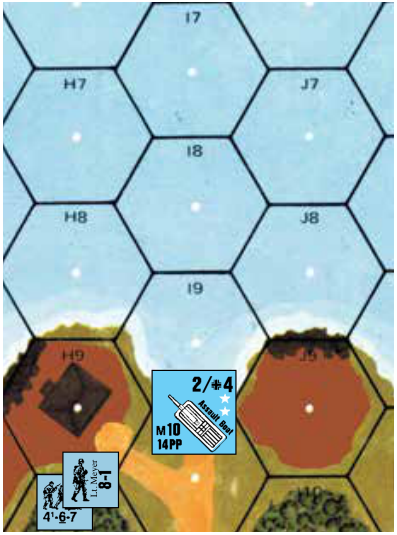

and its Passengers are at the elevation level of the water, but are not in the water. Nevertheless, if attacked, a Beached boat must be attacked in the water hex by tracing a LOS to that Water Obstacle’s hex center dot *[EXC: OVR]*. An abandoned drifting boat becomes Beached only if it makes a dr of l on an obligatory dr when it drifts into a possible Beaching hex. If there is more than one hexside through which a drifting boat can be Beached, the Beaching hexside is decided by making a Random Direction dr and using the applicable hexside closest to that Random Direction.

<!-- pdf-page 234 -->

**5.3 WATER MOVEMENT:** Once in the water, sufficiently-manned boats (5.11-.12) may move during the MPh a number of Water Obstacle hexes up to their MP allotment. A boat containing insufficient units to propel it (5.12) can move only by drifting or Beaching/un-Beaching *[EXC: a German Assault Boat can always move in the MPh due to its Inherent Driver; 5.11]*. Movement in the APh is limited to drifting in a Moderate or Heavy current (B21.121) or Beaching/un-Beaching. Boats may not move through (i.e., beneath) any type of pontoon bridge. Boats do not pay Start/ Stop MP and are always considered in Motion (unless Beached). Reverse movement is not allowed. Boats do not pay for VCA changes. Enemy units in a Water Obstacle Location present no obstacle to movement and their Location can be entered/passed through as if they did not exist (A8.312 does not apply).

**5.31 STACKING:** Boats pay no extra MP for entering a Water Obstacle that already contains another boat counter. However, multiple boat/amphibian counters in the same Location suffer inherent defensive disadvantages (5.5-.52).

**5.32 UNLOADING:** Passengers may exit a boat during any MPh/APh across a Beached hexside that the Passenger has enough MF remaining to enter. There is no additional MF cost to unload. If the hex to be entered contains an enemy unit, the boat cannot be unloaded until the APh (see 5.531). EX: The Small Raft counter in 8J6 uses one MP (and consequently two of its Passengers’ four MF) to enter J5 and Beaches on the J4-J5 hexside. Its Passengers may not unload because they lack the necessary three MF to both move to a higher elevation and cross the hedge. However, they may do so in the upcoming APh.

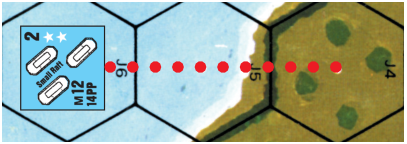

**5.33 TOWING/PUSHING NA:** Boats may not be towed by other boats/ amphibious vehicles nor may they be moved by fording/swimming Infantry.

**5.34 UNTRAINED:** If a SSR specifies that the Passengers of any *paddled* boat are Untrained in river assaults, each attempt to paddle that boat during the MPh must be preceded by a dr (∆). A 6 dr prevents that boat from being moved in the water during that MPh; however, it does not prevent it from being Beached, un-Beached, loaded, or unloaded, nor does it prevent it from being in Motion. A 5 dr halves the boat’s usable MP during that MPh.

**5.4 FIRE FROM BOAT:** Only Small Arms/LMG Fire is allowed from a boat—and such fire is halved as Mounted Fire if Beached, or quartered as Mounted Fire and Bounding or Motion Fire due to the boat’s Motion status if un-Beached. Firing in the AFPh is also subject to an additional halving of FP. An un-Beached boat’s Passengers may not Prep/Opportunity Fire. Boat Passengers may not Fire Group with any unit not in their own boat counter, even if in the same hex.

**5.5 NON-ORDNANCE & AREA TARGET TYPE ATTACKS vs BOATS IN WATER:** All non-ordnance attacks (including OBA) and Area Target Type hits (5.51), vs non-Beached boats in Water Obstacles have their FP halved (or actually quartered due to the normal halved FP of Area Target Type hits) and are resolved on the IFT’s H Vehicle line. Boats, like vehicles, are not subject to the DRM for FFMO/FFNAM. If the Final IFT DR is \< the H Vehicle Kill Number, a number of such boat counters in that Location up to the highest KIA# listed in that column (A7.308) sink *[EXC: Defensive First Fire can affect only the unit being moved at the time]*. If the Final IFT DR equals the H Vehicle Kill Number, one such boat counter in that Location (unless any necessary Random Selection results in a tie dr) *[EXC: a three-boat Small Raft counter; 5.121]*, suffers Casualty Reduction *among its Passengers* (with no MC/LLMC for survivors); all others are unharmed. Otherwise, boat Passengers cannot be attacked separately *[EXC: Snipers; 5.54]*; they share the fate of their boat instead.

**5.51 NON-ORDNANCE & AREA TARGET TYPE ATTACKS vs LANDED/BEACHED BOATS:** All non-ordnance attacks and Area Target Type hits vs boats on land/Beached are resolved on the H Vehicle line of the IFT with full FP *[EXC: hits resolved using the Area Target Type still have their FP halved]* and the same IFT Effects DR as would be used for any unarmored target in that Location (see 5.53).

**5.52 ORDNANCE FIRE vs BOATS:** Ordnance Fire vs boats in a Water Obstacle affects only one boat counter in that Location per shot *[EXC: if using the Area Target Type; C3.33]*, although the Vehicle Overstacking penalty (A5.132) applies. Ordnance Direct Fire To Hit attempts vs such a boat counter are resolved against a HD vehicular target *[EXC: HD status does not apply if the firer is an aircraft, or if the firer’s elevation advantage is \> the range (D16.3)]*. The +2 Case J To Hit DRM applies due to moving/Motion status, but no other subcases of J are applicable.<sup>16</sup> If a boat is hit using the Vehicle or Infantry Target Type, it sinks (see 5.53) *[EXC: a three-boat Small Raft counter is Reduced to a two-boat Small Raft counter (5.121) with no MC/LLMC for survivors]*. HEAT and ordnance ATR may not be fired at a boat that is Beached or in water (C8.31 applies on land). If firing with ordnance at a Beached boat or one on land, the +2 Target Size (D1.75) DRM, HD, and Motion status do not apply; all boats on land/Beached are treated as average-size targets for To Hit purposes.

**5.53 SINKING:** Whenever a boat counter is sunk (not just Reduced), all of its Passengers are also eliminated—unless the boat is Beached or in *shallow water (defined as fordable; B21.122)* in which case they undergo IFT attack normally using the same DR that sank the boat modified by the Hazardous Movement DRM. All SW/Guns of a sunk boat are lost even if Beached or in fordable water.

**5.531 WATER LINE:** The former Passengers of a Beached boat that is sunk remain in that Water Obstacle hex but are treated as if they were Infantry in a level -1 Open Ground land (not Water Obstacle) hex in every respect except that they are subject to the Hazardous Movement DRM as long as they remain Infantry in that hex. This “Water Line” existence occurs only to the former Passengers of a sunk, Beached boat, or to those who have left a boat during the MPh and directly entered a concealed enemy Location (A12.15) and are thereby returned to their Water Obstacle hex as Infantry (not to their boat as Passengers). Once these units successfully exit their Water Line position, they may not re-enter it.

**5.532 SHALLOW WATER:** The Passengers of a boat sunk in Shallow Water immediately become Fording Infantry (B21.41-.43) in that Water Obstacle Location.

**5.54 BROKEN/BERSERK UNITS:** A broken/berserk unit may not enter a boat. A boat Passenger never takes a MC/TC for any reason. Vs a boat Passenger, a Sniper attack that would ordinarily break a MMC is treated as Casualty Reduction, and pin results are ignored.

#### 5.6 CC

**5.6 CC:** When a boat/amphibious vehicle occupies the same Water Obstacle Location with an enemy unit during the CCPh, its Passengers are subject to CC—whether the enemy unit is in a boat, amphibious vehicle, on a pontoon bridge, or actually in the water (swimming/fording). Boats are not required to remain in Melee, and may move normally in their MPh/ APh (i.e., drift) despite the presence of enemy units. Boat Passengers are subject to a +2 DRM when attacking in CC and a -2 DRM when defending in CC in the same manner as truck Passengers. The boat itself cannot be attacked by CC and is destroyed only if all its Passengers are eliminated. A manned boat can be captured only if its Passengers are captured (A11.52), although once captured the prisoners can be rejected (A20.3) without harming the boat.

<!-- pdf-page 235 -->

## 6. SWIMMING

**6.1 WATER ENTRY:** Use of the swimming rule does not give the crew/ Passengers of an eliminated boat or amphibian a survival opportunity; they are still eliminated normally with their vehicle. Personnel are allowed to swim only in non-frigid Water Obstacles and only if they enter the water directly from a land/bridge Location immediately following a successful swimming TC (∆). Upon passing this TC, the Personnel unit *must* then use all of its MF allotment to enter an adjacent Water Obstacle during that MPh. A Water Obstacle cannot be entered by a swimmer during the APh. Failure of the swimming TC prohibits the unit from making any other movement during that MPh, but does not prevent it from attempting another swimming TC in one of its subsequent MPh. A unit that enters a Water Obstacle across a cliff hexside, or from any upper building level or bridge higher than water level, must also pass a MC (∆) after entry with a + DRM equal to the level from which the unit jumped. A unit may jump from an upper building level only if the building depiction is within a counter edge width from the cliff/water depiction. Broken/wounded units may not swim and are eliminated if already in the water. Swimmers do not take PTC, and are not subject to Pin/Heat of Battle/LLMC results.

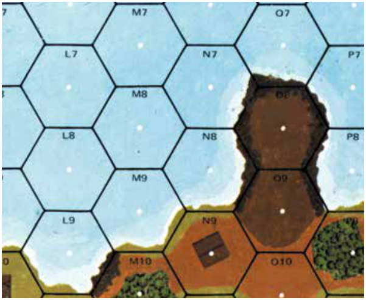

EX: Entry into 8L9 from M10 (level 1) requires a 1MC; entry into O7 from O8 (level 2) requires a 2MC. Entry into U6 from the 1st level of building V6 (level 3) requires a 3MC. A unit entering N8 from N9 requires no MC despite the two-level elevation difference, because the entry was not across a cliff hexside or from a bridge.

**6.2 SWIMMING:** Movement from one Water Obstacle to another requires all of a swimmer’s MF. A swimmer may not advance in the APh *[EXC: Drift]* except to enter a land hex (or pontoon bridge) through a non-cliff hexside. Swimmers/forders may enter an abandoned/friendly boat/amphibious vehicle in the same Location, but only during their APh. Swimmers/forders may enter an enemy-occupied boat but only if Beached/paddled and only during a CCPh in which they have successfully captured all enemy Passengers (5.6). Current affects swimmers during the APh in the same manner as it affects a paddled boat (B21.121). Swimmers may not fire, but can engage in CC using only their inherent “(1)” unarmed CC factor (even if using rafting; 6.41). Swimmers have no CCV, and may not tow a boat or amphibious vehicle (and vice versa) and may not be concealed.

**6.21 DROWNING:** A DR (∆) must be made for each swimmer at the end of every friendly APh in which that swimmer is in a non-fordable Water Obstacle. The swimmer is eliminated on a DR ≥ 12 in a Slow current, on a DR ≥ 11 in a Moderate current, and on a DR ≥ 10 in a Heavy current. If a Drift dr (B21.121) is also required, it should be made automatically as an inherent part of the Drowning DR by using the colored dr with no drm.

#### 6.3 TEM

**6.3 TEM:** Swimmers are not eligible for any TEM (although they can benefit from LV and SMOKE DRM). FFMO/FFNAM do not apply to swimmers. HE (and IFE) attacks vs swimmers are not subject to halved FP *[EXC: if using the Area Target Type]*, but all other non-CC attacks are.<sup>17</sup> HE Equivalency (C8.31) may not be used vs swimmers.

**6.4 PORTAGE:** Swimmers cannot portage any equipment (including their own inherent SW/Small Arms FP). MMC swimmers are represented by Unarmed units *[EXC: rafting units; 6.41]*. SMC are not exchanged for Unarmed units but are likewise similarly restricted, although their leadership/heroic DRM still apply.

**6.41 RAFTING:** If SSR allows, any Personnel unit that rolls \< its ELR with the colored dr of its swimming TC DR (or that is cited by SSR) is assumed to have found enough material to make sufficient floating platforms to carry its Small Arms (but not its SW) and inherent SW as it swims, provided it enters the water without need of a jump MC (6.1). Such a swimmer is not represented as Unarmed; it retains its normal counter form even though it may not fire (or attempt to place SMOKE) while swimming. The Small Arms represented by an armed swimmer are eliminated with that swimmer if it is eliminated.

**6.5 CAVALRY:** Cavalry may swim using the same rules with the following exceptions: Cavalry do not require a TC to attempt to swim, are not represented as Unarmed units, retain their full CC FP but cannot otherwise fire, cannot enter the water from a Location that would require a MC, and cannot use rafting. Cavalry may carry up to their IPC while swimming.

**6.6 FORDING LINES:** A SSR may specify the presence of fording lines across a non-fordable Water Obstacle by allowing a player to specify a hexrow as fordable by Infantry (B21.41). Such units are not swimmers and remain armed. A swimmer who enters a fording line hexrow may ford via the fording line. However, a broken/wounded/berserk unit fording via a fording line is considered eliminated, as is any fording unit that leaves the designated fording hexrow while in the water (unless a former swimmer). Forders *using a fording line* may not fire while fording, and if engaging in CC can use only their “(1)” inherent CC factor. A fording line can be eliminated as if it were a Field Phone line (C1.23), or by an unbroken Personnel unit that merely declares the attempt in a friendly fire phase while in a land/water Location of that line (provided that Location is not occupied by an enemy unit), or by any motorized amphibian/boat that passes from a hexrow adjacent to the line through its hexrow into the other hexrow adjacent to it. Otherwise, normal fording rules apply.

## 7. AIR SUPPORT<sup>18</sup>

**Fighter-Bomber/Stuka Counter example** AA Fire Target

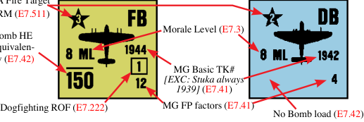

#### 7.1 DYO

**7.1 DYO:** See H1.531.

**7.2 ARRIVAL:** Air Support is never allowed during night or Overcast, or against a Location in or beneath Fog. However, in any other scenario in which a player has received Air Support by SSR

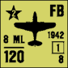

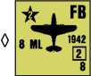

or DYO, he must make a dr during the RPh of each of his Player Turns *until* he rolls \< the current Game Turn Number. Once he does this, his Air Support must be placed onboard in his next MPh.

<!-- pdf-page 236 -->

**7.21 ENTRY:** Upon mapboard entry, another Air Support dr (halved; FRU) must be made to determine the number of aircraft the player receives. This determined, one more dr is made for all aircraft as a group to determine if they are armed with bombs (and in some cases to see if Stukas or *Fighter-Bombers* {hereafter referred to as FB} are received) by rolling ≤ the exponent of the applicable Air Support Number (see H1.531 Table). The aircraft are then placed onboard with the appropriate side face-up. All aircraft received will be of the same type and armament. Aircraft have an unlimited movement capability and may be placed anywhere on the mapboard. As aircraft operate at a level above the topography represented by the board, their movement is not restricted by terrain, enemy units, stacking, or any other factor. However, once an aircraft leaves the mapboard it may not return. Each aircraft remains on the mapboard until eliminated (7.221, 7.511, 7.52), Recalled (7.24), or voluntarily exited during an enemy MPh (unless engaged in Aerial Melee; 7.22). For Seaborne Assaults, see G14.262; for napalm usage, see G17.4 for U.S., G17.42 for British, and G18.831 for Chinese.

**7.22 AERIAL COMBAT:** Only an undamaged FB can voluntarily enter Aerial Combat. To enter Aerial Combat, a player places his FB on top of one or more enemy aircraft during the CCPh and covers them with a CC marker. He may place several of his FB on one enemy aircraft, one FB on several enemy aircraft, or place several of his FB on several enemy aircraft in one or more groups. Each group (or stack) of aircraft beneath a CC/Melee counter is termed a Dogfight. In each CCPh, the ATTACKER’s aircraft in each Dogfight attacks one enemy plane in that Dogfight in sequential CC. All ATTACKER planes resolve their attacks (including any additional attacks allowed by retained ROF; 7.222) before any surviving DEFENDER plane can return fire. The DEFENDER’s plane cannot attack back if eliminated. If the CCPh ends with planes of both sides still remaining under the same marker, that counter is flipped to its Melee side provided at least one undamaged FB with functioning MG of either side wishes to hold opposing aircraft in Aerial Melee *[EXC: Recall; 7.224]*. Aircraft in Melee cannot engage in any other activity and are forced to engage in Aerial Combat again in the next Player Turn if opposed by an undamaged FB with functioning MG *[EXC: 7.223-.225]*. Normal CC Withdrawal rules do not apply.


**7.221 DOGFIGHT RESOLUTION:** Aircraft in each Dogfight must predesignate their initial targets (ATTACKER first); i.e., a plane may not await the outcome of earlier attacks in its Dogfight to determine which opposing plane in that Dogfight to attack. A plane can attack only one opposing plane at a time—regardless of the number of enemy planes in that Dogfight. A Final Attack DR ≤ 4 eliminates the target. A Final Attack DR of 5 Damages (7.226) the target (mark it with a Wound counter). If a FB rolls an Original Aerial Combat DR of 11 while attacking a Stuka, it is assumed to have been hit by the Stuka’s rear gunner. If the colored dr of the Original 11 DR was a 6, it is eliminated; otherwise it is Damaged. Aerial Combat DR are subject to the following cumulative DRM:

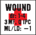

```text
DRM     Cause
 +1     Firer is Stuka
 +1     Firer has bombs
 +1     Firer is Damaged
  -1    Target is Damaged
  -1    Target is not a FB
  -1    Target has bombs
```

###### 7.222 ROF

**7.222 ROF:** A FB has an Aerial Combat ROF of 1 if carrying bombs, and 2 if not. Thus, if the colored dr of an Aerial Combat Attack DR of any FB without bombs is ≤ 2, it may attack again during that CCPh before receiving any return fire. Its target may be any plane in its Dogfight. Only FB have an Aerial Combat ROF. An Aerial Combat ROF cannot be used against a ground target.

**7.223 MALFUNCTION:** An Original Aerial Combat DR of 12 results in MG malfunction. Mark that plane with a MG Disabled counter; it may not attack in Aerial Combat or Ground Support thereafter *[EXC: it may still bomb]*. A FB with disabled MG may opt for Recall (7.24) at the end of the current CCPh unless it is in Aerial Melee with an undamaged enemy FB whose MG are functioning.


**7.224 RECALL:** Any plane that is attacked by a Final Aerial Combat DR of ≥ 10 has the option to accept Recall (7.24), thereby escaping Melee by leaving the game. Such option must be exercised at the end of that CCPh.

**7.225 JETTISON:** A plane may jettison its bombs by simply inverting its counter during its own MPh (even if in Melee) to improve its chances in Aerial Combat.

**7.226 DAMAGE:** A Damaged plane is Recalled (7.24) unless held in Aerial Melee. Any Damaged aircraft that is Damaged a second time by any means is eliminated. EX: Two British FB with no bombs are placed on top of three bomb-laden Stukas during the British CCPh. The British player designates that his planes will attack separate targets. The first British plane rolls an Original 7 DR (with 1 on the colored dr), resulting in a Final DR of 5 (7 -1 [target is not a FB] -1 [target has bombs] = 5) which Damages Stuka “A”. Having retained his ROF, the FB attacks again—choosing to attack the Damaged Stuka “A” again to receive an additional -1 DRM, and rolls an Original 8 for a Final DR of 5 which eliminates Stuka “A”. Having retained his ROF yet again, the FB now attacks Stuka “C” but rolls a 12, thereby disabling its MG and giving Stuka “C” a Recall Option. The British player would like to attack Stuka “C” with his other FB before that Stuka can escape at the end of the CCPh, but is unable to do so now because his initial attack was predesignated against Stuka “B”. He must attack Stuka “B” at least once before switching targets to Stuka “C”. However, his Original Aerial Combat DR is a 9, resulting in no effect and failure to retain his ROF. The German may now return fire with the two surviving Stukas but is subject to a +2 DRM to both attacks, and his Original DR of 4 and 7 fail to have any effect. The CCPh is now over and the CC counter is flipped to the Melee side. The British player, because he is not opposed by FB, may leave Melee but chooses not to. Instead he Recalls only the FB with the Disabled MG. The German chooses not to Recall Stuka “C” and consequently the two German Stukas will be allowed to attack the remaining FB first in their CCPh.

**7.23 ELIMINATION & VICTORY POINTS:** Aircraft may not ram other aircraft or ground units. If shot down they are simply removed from play, although they are worth two Victory Points (A26.212) *[EXC: the Passengers of a glider are worth Victory Points—not the glider itself]*. Aircraft never earn Exit Victory Points (A26.23).

**7.24 RECALL:** A Recalled aircraft is simply removed from play at the end of the current phase; it is not counted towards Casualty Victory Conditions. An aircraft can be Recalled in three ways: during Aerial Combat (7.223- .224), during a Sighting TC (7.31), or due to Damage (7.226, 7.511, 7.52).

**7.25 AERIAL LOS:** Given its ability to fly anywhere over the mapboard (and thus to move to the most advantageous viewing position), an aircraft counter is theoretically able to see (provided it passes a Sighting TC; 7.3) any non-hidden unit that is not completely surrounded by LOS obstacles at least one level higher than its own Location. Before it can attack, an aircraft counter must always move to an attack position (7.4-.403)—from which Blind Hexes can still occur. Aircraft cannot cause loss of “?” or prevent the gaining of “?” by “seeing” an enemy unit; aircraft cause “?”-loss only by attacking concealed units and scoring at least a PTC result on the IFT (provided that attacked unit is within the LOS of a Good Order enemy ground unit). However, a unit moving in Open Ground would not be considered concealed to the aircraft, although the aircraft player may not inspect that stack unless it passes the Sighting TC. Should such a Sighting TC reveal only a Dummy unit, the aircraft has the option of whether or not to count that Sighting TC as its only allowed Sighting TC for that turn, but is subject to Light AA fire regardless of his choice. All Aerial units <!-- pdf-page 237 --> are considered to be at sufficient elevation to reduce the number of Blind Hexes created by any full-level-or-higher LOS Obstacle to one hex, and to reduce any non-cliff Crest Line Blind hexes to zero if there is ≤ 1 level elevation difference (see B10.23), and to see INTO any Depression barring other LOS obstacles. To an Aerial viewer, the Blind Hex created by bocage is the hex formed by the bocage hexside. LV Hindrances (Mist; 3.32) also apply to Aerial LOS, as per the Aerial Range (E.5).

**7.3 SIGHTING TC:** Before a plane can make a Ground Support attack, it must first pass a Sighting TC from its initial attack hex along a specified Hex Grain to the target it wishes to “sight”. All aircraft have a Morale Level of 8 for purposes of Sighting TC. Failure to pass a Sighting TC results in the aircraft being unable to make a ground attack *[EXC: Mistaken Attack; 7.32, 7.62]*, and being immune to Light AA (7.51) fire, during that Player Turn. The Sighting TC is based on the easiest non-HIP *[EXC: Ob- servation Planes may target “empty” hexes]* target to spot in its initial target hex. Once an aircraft has sighted its initial target it need not take any additional Sighting TC to attack other units along the same Strafing Run during that Player Turn (see 7.43). The Sighting TC is subject to the following cumulative DRM:

```text
                       SIGHTING TC DRM
DRM Condition
 +X     SMOKE Hindrance DRM as per E.6
 +3    Target is in building/woods/rubble/orchard (in season)
 +2    Target is in Light Woods or Rail Car
 +1    Target is in brush/grain/marsh/crag/graveyard/debris
 +1     Target is within four hexes of non-HIP vehicle/MMC friendly
        to and in the LOS of the aircraft
 +1     Mist/Dust/Heat-Haze (regardless of Aerial Range)
  -1    Target is vehicular, or boat in water
  -1    Target has entered a new hex/used VBM/been in Motion dur-
        ing this Player Turn*
  -1    Target is part of a Convoy or Column
  -1    Target has been attacked by a friendly plane during this Player
        Turn
  -2    Target is not entirely concealed/HIP
```

\*Dashing or movement totally inside a building/trench/pillbox is not applicable.

**7.31 RECALL:** An Original Sighting TC DR of 12 results in Recall at the end of the MPh/DFPh of the TC, although if it also results in a Sighting/ Mistaken Attack<sup>19</sup>, that turn’s attack is resolved first.

**7.32 MISTAKEN ATTACK:** A Final Sighting TC DR ≥ 12 results in a Mistaken Attack. The ATTACKER may then immediately move the aircraft (but only onboard; he may not exit it from play by moving it off-board) and attack (without a new Sighting TC) the DEFENDER’s non-hidden onboard ground unit that is closest (in hexes) to the aircraft’s initial target and not in a completely Blind Hex (ATTACKER’s choice of equidistant targets). If strafing, this attack must be continued (using MG/ bombs) to include any other onboard ground units within the range and Hex Grain of a normal Strafing Run. The plane can use a different Hex Grain and type of attack than that initially planned by the DEFENDER.

**7.4 GROUND SUPPORT:** Aircraft may attack ground targets (but no Locations devoid of enemy units *[EXC: Observation Planes and subse- quent hexes of a Strafing Run]*) anytime during the opponent’s MPh (or the plane’s DFPh) by making a Strafing Run or Point Attack. An aircraft must always state whether it is making a Strafing or Point Attack just before resolving its second attack. Aircraft attack individually; they may not form a FG, but may attack the same target(s) and leave Residual FP normally. The C3 To Hit Table notes the applicability of To Hit DRM to Aerial attacks. Walls/hedges/roadblocks do not provide any TEM to a Ground Support attack. The DEFENDER may add an additional board to any board edge so that his aircraft can set up in its initial attack hex outside the confines of the scenario board configuration. An aircraft cannot attack a Location to which it has no LOS and cannot Interdict.

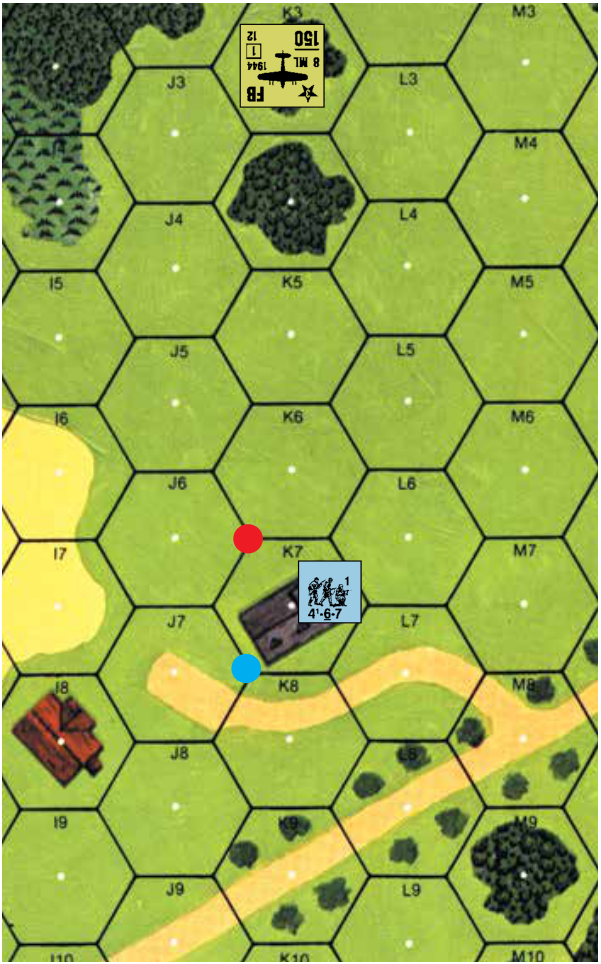

EX: A 4-6-7 is in the 19K7 building, and a truck is in stationary Bypass at K7-K6-J6 (red dot). The FB is moved to K3 and faced towards K7 to make its Sighting TC along the K3-K4 Hex Grain. Were the truck not present (or if it were out of the plane’s LOS at vertex K7-K8-J7 {blue dot}), the FB would have to add a +3 DRM for the building and a -2 DRM for the squad’s not being concealed, so it would have to roll ≤ an Original 7 to pass its Sighting TC. However, since the vehicle is in LOS and in the Open Ground portion of the building hex, the -1 DRM for a vehicular Target and the -2 DRM for not being concealed are applicable, so the Sighting TC is passed on an Original DR of ≤ 11. K8 and K10 cannot be attacked because they are Blind Hexes *[EXC: K10 could be attacked with a +1 LOS Hindrance DRM if the K9 orchard were out-of-season; B14.2],* but K9 can be attacked without an additional Sighting TC. Had a non-dispersed WP Level 4 counter existed in K6, a +2 DRM would have applied to both the Sighting TC and the resulting attack. Any SMOKE Hindrance in K7 would have applied to the Sighting TC and resulting attack.

**7.401 STRAFING:** An aircraft strafes by first being placed along a specified Hex Grain so that it is four hexes away from the initial target hex and facing same. After it passes its Sighting TC, and after all Light AA fire (7.51) against it has been resolved, it may fire on its initial target. The aircraft then moves to the next hex along the predesignated Hex Grain toward that target and, after receiving all Light AA fire in this hex, may (if it chooses) make another attack DR on a new target hex four hexes distant. The aircraft repeats this procedure (henceforth referred to as a Strafing Run) in every hex traversed until it occupies the target hex of its initial target. <!-- pdf-page 238 --> At this point it cannot attack again during that Player Turn, but must attempt to continue moving along that Hex Grain to receive all possible Light AA fire until it occupies the last hex it attacked. After receiving all Light AA fire in that last target hex, it is moved to an out-of-the-way corner of the mapboard where it is immune to further Light AA fire until it attacks again in a subsequent Player Turn.

**7.402 POINT ATTACKS:** A FB makes a Point Attack in the same manner as a Strafing Run with the following differences. After a FB has made its initial attack from four hexes away and has moved toward that target to the next hex along the predesignated Hex Grain, it may attack the same target hex again. Moreover, because it is now attacking from only three hexes away (six-hex Aerial Range), any To Hit DR is based on the 0-6 column of the To Hit Table instead of the 7-12 column. After this second attack, the FB must still attempt to continue moving along the predesignated Hex Grain until it occupies its target hex for purposes of receiving Light AA fire, but cannot make any additional attacks during that Player Turn.

**7.403 STUKA:** A Stuka must start a Point Attack from a hex adjacent to its target hex where it must pass its Sighting TC and make any initial MG (only) attack with its 4 FP. Regardless of the outcome of its first MG Point Attack, all unbroken Infantry *[EXC: those normally immune to Pin effects]* fired on in the target hex are pinned. After its initial MG attack (if any) is resolved, the Stuka is moved to the target hex itself where it may attack again with its MG and drop its bomb load, using the 0-6 column of the To Hit Table. Following its attack, the Stuka must attempt to continue moving along its Hex Grain of Approach for three more hexes for purposes of receiving Light AA fire. A Stuka making a Point Attack, unlike a FB, may attack from its present hex *before* receiving Light AA fire. A Stuka making a Strafing Run must do so normally; i.e., from four hexes distant, receiving Light AA fire before making each attack. A Stuka cannot bomb during a Strafing Run.

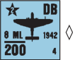

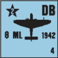

**7.41 MG ARMAMENT:** The IFT FP of FB varies according to the time frame of the scenario. All FB have six FP prior to 1942, eight FP in 1942-43, and 12 FP in 1944-45. This FP can be used against up to four target hexes during each Player Turn in a single Strafing Run and is not subject to Cowering. If attacking a building hex, each level of the building in that hex (including Rooftops if that rule is in play) in LOS is attacked with the same IFT Effects DR as a single attack vs that hex. No To Hit DR is necessary except vs an armored target (A9.6), in which case a hit must be secured (with a separate DR and all applicable Aerial Attack DRM; C6) on the 7-12 column if the Aerial Range is eight hexes, or on the 0-6 column if the Aerial Range is ≤ six hexes, using the Vehicle Target Type and the Black To Hit Number. An aircraft’s MG Basic To Kill Number is listed under either 39F, 42F, or 44F (depending on the scenario’s year) on the AP To Kill Table (C7.31) *[EXC: both Stuka types always use the 39F TK#]*, and is modified only by the Aerial AF of an AFV (C7.12), Aerial Advantage (C7.22), and rear Target Facing (C7.21). Neither To Kill Case C (CH) nor Case D (Range Effects) apply to Aerial MG attacks. Unlike all other MG To Kill attempts however, an aircraft’s MG may attack other unarmored targets in the same hex as the AFV—using the Original To Hit DR vs the AFV as the IFT Effects DR (modified appropriately) vs any unarmored targets (in lieu of any Collateral Attack vs vulnerable PRC). Use the MG—not the Direct Fire—column of the AFV Destruction Table to resolve the attack vs the AFV. A MG attack Original Effects (or To Hit if used as ordnance) DR of 12 results in the permanent breakdown of that weapon. Mark that aircraft with a MG Disabled counter.

**7.42 BOMBS:** Each FB or Stuka can carry one HE bomb load which it fires as an Ordnance weapon on the IFT vs unarmored targets or on the HE To Kill Table (C7.34) vs armored targets. If attacking a building hex, the effect is resolved against all targets in LOS in the building hex with the same IFT Effects DR as a single attack vs that hex. This bombing capacity can be used only once per aircraft. A FB can bomb any target four hexes distant as part of its Strafing Run (or three hexes distant if making the second attack of a Point Attack), but must first score a hit on the 7-12 column (or the 0-6 column if the Aerial Range is ≤ six hexes) of the applicable Infantry/Vehicle Target Type of the To Hit Table (C3), using all DRM applicable to Aerial Attacks (C6) and the Black To Hit Number. If a target hex contains both vehicles and non-vehicular targets, the same To Hit DR is applicable against both Target Types and is resolved against whatever Target Types are hit. The bomb attack can be made with or without an accompanying MG attack but, if made in conjunction with a MG attack, it must be predesignated before resolving that MG attack and resolved after that MG attack. After a bomb attack, the aircraft is flipped over to its reverse side to signify that it no longer has any bombs. Once a bomb To Hit DR is made, that aircraft may not continue to Strafe during that phase; i.e., the bombed hex becomes its final target hex. A bomb To Hit attempt that results in a miss is not resolved vs any target.

###### 7.421 vs AFV

**7.421 vs AFV:** Unless occurring on the Area Target Type (7.422), a bomb hit vs an AFV can be one of two types. If the Final To Hit DR is ≤ half of the Basic TH# (i.e., ≤ 5 unless a FB bombs from an Aerial Range of eight hexes), the result is a Direct Hit and is resolved vs the Aerial AF of the AFV with the HE Basic TK# of the bomb load. If the Final To Hit DR yields a hit, but is not ≤ half of the Basic TH#, the result is a Near Miss and is resolved vs the Aerial AF but with only half of the bomb’s Basic TK# and half FP for any Specific Collateral Attack. To Kill Cases A and B (C7.21-.22) for Aerial Advantage and rear Target Facing apply in both instances. Any additional AFV in the same Location is unaffected except by the provisions of Overstacking (A5.132). Regardless of the type of hit achieved vs an AFV *[EXC: Dud]*, all unarmored targets in the same Location are also attacked if hit. Each unit hit is attacked with the same IFT or To Kill DR. EX: A FB making a Point Attack from three hexes away is dropping its bombs on an Open Ground hex containing a moving, BU Pz VIE Tiger tank, a stationary Opel Blitz truck, a squad, and an entrenched HS. The bombs can conceivably affect all four units, depending on the To Hit DR. The Tiger is hit on an Original To Hit DR ≤ 9 (10 [Basic TH# at six-hex Aerial range] +1 [Target Size Modifier] -2 [Moving] = 9) and the truck by an Original TH DR ≤ 10. The squad is hit by an Original TH DR ≤ 8, and the HS by an Original TH DR ≤ 6 (+2 TEM). All four targets are hit if the Original TH DR is ≤ 6, and each hit is resolved with the same IFT or To Kill DR.

**7.422 AREA TARGET TYPE:** An aircraft may make a bomb attack using the Area Target Type instead of the Vehicle/Infantry Target Type, but any hit is resolved with only half the FP of the bomb load. All in-LOS ground units in the target hex are affected if hit, and the effect of the hit vs each unit is resolved on the IFT with a single DR although the applicable TEM of each unit may vary accordingly. AFV are subject to the C1.55 Indirect Fire vs AFV IFT DRM.

**7.43 TARGET STATUS:** An attacking aircraft counter does not have to base its Sighting TC on a moving unit. Unlike other units, it may attack both moving/non-moving units during Defensive First Fire with the same attack; any applicable DRM for movement (such as FFMO/FFNAM or the Case J To Hit DRM) are applicable only to those target units that happen to be moving (C.8) at the time of the attack. However, a successful Sighting TC vs a moving unit prevents that unit from expending any further MF/MP until that aircraft completes its attacks. An AFV that is the subject of a Sighting TC cannot change its CE/BU status before the initial attack of that successful Sighting TC is resolved (D5.33), but can thereafter (within the limits of D5.33)—as can other vehicles in subsequent target hexes of a Strafing Run, provided they do so before their hex becomes eligible for attack. Only one aircraft counter may attempt a Sighting TC before allowing the ATTACKER to expend at least one MF/MP with one of his units. If the ATTACKER declines to expend any MF/MP, the DEFENDER may then elect to attempt another Sighting TC with another aircraft. Each attacking aircraft counter resolves all of its attacks for that Player Turn before the ATTACKER is allowed to expend another MF/MP with any unit, and before another plane is allowed to take a Sighting TC.

**7.5 AA FIRE:** Whenever the ATTACKER uses AA fire vs aircraft, he must do so with AA-capable units that have not yet exhausted their fire capabilities during that Player Turn. Only an AA-capable weapon (as listed in 7.51 & .52) that sets up able to fire can set up in AA mode (i.e., marked with an “AA” counter). An AA counter must be placed on any AA-capable weapon that attacks an Aerial target while not in AA mode, and the AA counter is removed from any weapon that fires on a ground target while in AA mode *[EXC: Vehicular AAMG do not use AA counters and can fire at ground/Aerial targets with- out consideration of AA mode]*. Whenever a weapon’s AA counter is placed or removed due to its making an attack, its ROF is reduced by one for that one attack only (cumulative with all other ROF reductions) *[EXC: MG; 7.51]*. An AA-capable weapon’s AA mode can also be changed at the end of any fire phase (not MPh) in which that weapon can/ does change its CA as per the first sentence of C3.22 (even if it is not a Gun). A weapon cannot be marked for Opportunity Fire if in AA mode, but an AA-capable weapon marked for Opportunity Fire can be used vs aircraft by removing the Opportunity Fire counter and placing an AA counter. A weapon in AA mode may be (un)limbered/pushed/hooked up, or dismantled/portaged/loaded/Removed/Scrounged from a vehicle, but doing so causes it to lose its AA counter. An AA-capable weapon may not fire at an Aerial target from a Location that is Blind to that target *[EXC: Heavy AA; 7.52]*, nor from inside a building or pillbox. An AA-capable weapon marked with an AA counter (and AAMG firing at Aerial targets) may not form a FG *[EXC: Mandatory FG; A7.55]* or use a Fire Lane vs Aerial targets, nor may it use Subsequent First Fire/ Intensive/Sustained Fire vs aircraft (or vs any ground target in that Player Turn). An attack vs an Aerial target never leaves Residual FP or affects more than one Aerial target. A unit that exhausts its full ROF in AA fire is marked with a Prep Fire (or Bounding Fire if a moving vehicle) counter as well as retaining the AA marker.

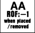

<!-- pdf-page 239 -->

**7.51 LIGHT AA:** Because aircraft counters attack during the opponent’s MPh/friendly DFPh, Light AA fire vs Aerial targets always functions as a form of Defensive (First) Fire by the ATTACKER. Aerial aircraft counters are assumed to be out of Light AA range<sup>20</sup> except when conducting an attack run after a successful Sighting TC or while in their Intended Landing Hex (8.2). *Only AA Guns with IFE, Infantry-manned HMG**<sup>21</sup>**, vehicular AAMG, and AA-capable MA/CMG can fire at aircraft coun- ters as Light AA*. AA Guns with IFE (C2.29) use that IFE (and a ROF reduced by one: C2.29) vs aircraft directly on the IFT without a To Hit DR. A MG loses its multiple ROF capability when it fires at an Aerial target and is subject to Cowering, but no leader DRM may apply. A Light AA weapon may not attack the same Aerial target more than once in the same target hex per Player Turn. A vehicle conducting Light AA fire is subject to Bounding First Fire penalties only if it is in Motion or has already expended a MP during that MPh. Regardless of its movement status, a vehicle does not have to expend a MP (C2.24) between each shot when using Light AA fire.

**7.511 RESOLUTION:** Light AA fire vs aircraft is resolved on the ★ Vehicle Line of the IFT (∆), but is never modified by TEM or Hindrances other than LV/SMOKE. Aircraft are not subject to the DRM for FFMO/ FFNAM, but are subject to a special positive DRM equal to the number inside the ★ symbol on the aircraft counter.<sup>22</sup> If the Final IFT DR is \< the ★ Vehicle Kill Number, the aircraft is eliminated; if the Final IFT DR equals the ★ Vehicle Kill Number, the aircraft is Damaged (7.226). If the Final IFT DR is one \> the ★ Vehicle Kill Number, the aircraft must break off its attack and evade. A Damaged/evading aircraft still receives all Light AA fire in its current hex before making any attack, and is still subject to Light AA fire until it exits the hex it last attacks or first sighted (whichever occurred last) *[EXC: a Stuka making a bomb attack must extend its “flyover” another three hexes as per 7.403]*. Damaged/evading aircraft must add a +1 DRM to its IFT DR (or To Hit DR for bombs) for any attack it makes from its current hex during that Player Turn, and may make no further Ground Support attacks during that turn.

**7.512 UNLIKELY KILL:** An Original IFT DR of 2 vs an aircraft always results in a chance of success for the attacker, even if a combination of DRM/insufficient FP otherwise makes success impossible. The attacker makes a subsequent dr: if it is a 1, the aircraft is eliminated; if a 2, it is Damaged; if a 3, it is forced to break off its attack and evade. Otherwise, there is no effect. If the Original 2 DR would have Damaged the aircraft or forced it to evade (regardless of the subsequent dr), that Original result applies instead unless superseded by a more severe result via the subsequent dr.

**7.52 HEAVY AA:**<sup>20</sup> Only an AA Gun without a printed IFE may use Heavy AA fire vs aircraft, and only during that Gun’s normal PFPh/DFPh (not MPh). Heavy AA fire may attack any Aerial aircraft on the board (including an Observation Plane; 7.6). A Heavy AA Original 2 To Hit DR eliminates an aircraft; an Original 3 To Hit DR Damages it (7.226); an Original 4 DR prevents it from attacking during that Player Turn (mark it with a TI counter). Normal Gun Malfunction/ROF rules apply. If more than one aircraft are onboard (including friendly aircraft), the target is determined by Random Selection. A -1 drm for friendly aircraft applies to the Random Selection dr unless those aircraft are in Aerial Melee (7.22). Each time a Heavy AA Gun fires on an aircraft, the white dr indicates how many hexspines the CA of the Gun must change in a clockwise direction (even if that CA change results in the Gun facing a Blind Hex).

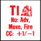

**7.6 AERIAL OBSERVATION:** Observation Planes were valuable as mobile, all-seeing artillery Observers for directing OBA. Only one Observation Plane is available per side in any scenario, and is subject to normal aircraft rules except where specified otherwise below. An Observation Plane has an inherent radio, which replaces the one normally included as part of an OBA battery. Heavy AA fire (7.52) is the only way ground units can attack an Observation Plane. Even though technically offboard, an Observation Plane can be attacked in Aerial Combat (although it cannot fire back), and if held in Aerial Melee loses Radio Contact. For DYO see H1.532.

**7.61 SIGHTING:** An Observation Plane does not take counter form, but is considered just offboard until Recalled/eliminated. An Observation Plane is considered an Offboard Observer (C1.63) with the added advantage of being able to make its OBA Aerial LOS Checks from any Friendly Board Edge hex of the owner’s choice. The owner may change the Observation Plane’s hex at will, in an effort to sight the best target. Before an Observation Plane can request Battery Access, it must pass a Sighting TC (7.3) vs a Known enemy unit (or draw an additional black chit if the Sighting TC is passed vs a HIP/concealed unit; [C1.211, C1.6] in which case the Sighting TC DRM apply as if vs a HIP/concealed unit) that will be in the planned seven-hex Blast Area of a hypothetical normal HE Concentration Fire Mission of any OBA that plane directs. Once an Observation Plane has sighted a target, it need not continue making Sighting TC as long as it is attempting to direct OBA vs that same target unit/hex until it needs to regain its Battery Access. Otherwise, an Observation Plane is subject to the same OBA rules as an onboard Observer, including the need to roll for Radio Contact/Maintenance *[EXC: Malfunction (C1.22) is NA].*

**7.62 MISTAKEN ATTACK:** When a Mistaken Attack opportunity occurs (7.32), the opposing player calls for a FFE immediately with the plane’s OBA—he does not require Sighting TC, Radio Contact, or Spotting Rounds. (If Battery Access is not achieved, no Mistaken Attack occurs.) The opponent’s control of the plane and its OBA is limited to one Fire Mission vs the non-hidden enemy ground unit that is closest (in hexes) to the original target of the Sighting TC and in the Observation Plane’s LOS. If the initial FFE is not accurately placed (C1.3), it must be Corrected toward either that unit or the original AR in its next PFPh or DFPh (whichever comes first).

<!-- pdf-page 240 -->

EX: It is the German MPh in a 1944 scenario. The 4-6-7 enters 4G6, so the American player places his FB in C8, makes a Sighting TC on it, and rolls an Original “11” which, due to the -1 DRM for a moving target and the -2 DRM for an unconcealed target, allows the aircraft to attack that unit—as well as any other in-LOS unit in that hex. However, before the aircraft can attack from C8, the stationary FlaKPz 38(t) in L4, nine hexes away (Aerial Range 18 hexes) and already marked with an AA counter, conducts Light AA fire at it with three FP (halved IFE due to Long Range) on the H Vehicle Line of the IFT. The German unit rolls an Original 4 (1 on the colored dr to maintain its Multiple ROF), but the +3 DRM for the 1944 FB results in a Final DR of 7 and thus no effect. The aircraft makes its attack against G6 with its full 12 MG FP. A -2 DRM (FFMO & FFNAM, due to the squad’s movement) applies to the 4-6-7 but not to the non-moving 4-6-8 in the same Location. The aircraft’s Original 7 Attack DR is modified to a 5, which yields a 2MC vs the 4-6-7 but remains a 7 DR (and a 1MC) vs the 4-6-8. The aircraft now moves to D7 where it announces that it will continue a Strafing Run vs H5 (if Light AA fire does not destroy it first); any eligible targets in the next three hexes along that Hex Grain can be attacked without need of a new Sighting TC. This time the FlaKPz 38(t) has its full six FP because the target is now within eight hexes (16 hexes Aerial Range), but its attack’s Original 10 DR causes loss of its Multiple ROF and has no effect vs the aircraft. The plane now attacks H5 with 12 FP and an Original 5 DR which, modified to a 6 by the woods TEM, causes a 2MC vs the 2-4-7. The aircraft then moves to E7 where it comes under Light AA fire from the HMG in K2 on the 6 FP column. The HMG could have fired on the aircraft earlier in C8 or D7 but chose not to because its FP would have been halved for Long Range Fire. The HMG is marked for Opportunity Fire but that counter must be removed to place the AA counter so it can use Light AA fire. The HMG’s ROF is reduced to 0 for firing at an Aerial Target, and it rolls an Original 3 DR for a Final DR of 6, which Damages the aircraft. The aircraft must continue along the present Hex Grain until it reaches H5—its last target hex. I5 cannot be attacked anyway because it is a Blind Hex. The aircraft now moves to F6 where, had the aircraft not been Damaged, it could normally attempt its last attack—but J4 is also a Blind Hex due to the woods in I5 and therefore cannot be attacked. Although the aircraft’s attack options are over, it must continue to move along the Hex Grain, accepting Light AA fire from eligible units, until it leaves H5. The HMG that Damaged the aircraft cannot be used against air or ground targets for the remainder of the current Player Turn. Because the aircraft is attacking during its DFPh, the ground units that are “Defensive First Firing” at it are actually firing during their MPh. If the FlaKPz 38(t) had been moving (as defined in C.8) its FP would have been halved as Bounding First Fire (7.51).

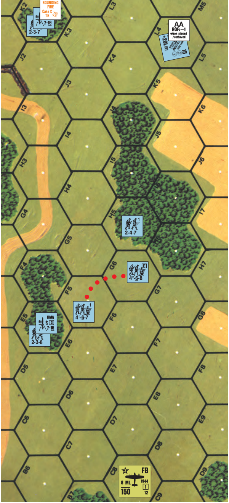

EX: A Non-Stopped (C.8) FlaKPz IV/20 Whirlwind is in AA mode when it is attacked by a strafing FB. Its Light AA FP vs the FB is quartered due to both Bounding First Fire (D3.31) and Non-Stopped fire (D2.42), but its ROF remains 2 (IFE ROF is always reduced by one; C2.29). Only after the FB completes its Strafing Run can the Whirlwind expend another MP to stop and, if it has retained its ROF, it can then fire on any other attacking aircraft in range and LOS with halved FP as Bounding First Fire. However, if it decides to fire on a ground target with IFE, it will have to remove its AA counter—thus reducing its ROF to 1 for its next shot.

<!-- pdf-page 241 -->

## 8. GLIDERS

**8.1 USAGE:** Gliders can be used in a scenario only if the weather is Clear, Mud, Mist, Gusty, or Snow (not Falling Snow). Wind Direction is established (B25.64) even if there is no wind. Glider capacity (D6.1) varies by nationality: German, 14 PP (DFS 230; cannot carry a <sup>5</sup>/8" counter); U.S., 19 PP (Waco CG-4A); British, 29 PP (Horsa II). U.S. and British gliders can also use their PP capacity to carry a vehicle/Gun, using the PP Capacity table given in U.S. Vehicle Note 51 (LVT4). All SW/Guns transported in a glider must be dm if possible. All Passengers and equipment remain offboard, with their presence inside a particular glider noted by secret side record (use of the Cloaking Counter Display boxes on the Chapter K Divider is recommended to avoid written records) until the AFPh of the Player Turn in which it lands (8.4). Glider Passengers forfeit all their normal capabilities (i.e., they may not fire, move, direct/assist/affect other units) until the AFPh of the Player Turn in which they land and, contrary to A12.12, may not enter the board concealed except possibly as the result of an offboard landing (8.221).

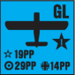

##### 8.11 DYO

**8.11 DYO:** See H1.48.

**8.12 PASSENGER STATUS:** Glider Passengers do not take PTC, and are not subject to Pin/Heat of Battle results.

**8.2 AVENUE OF APPROACH:** At the start of the MPh of the Player Turn in which they will land, all gliders are simultaneously placed on board; each in its Intended Landing Hex (hereafter referred to as ILH). No stacking of gliders is allowed at this point, although they may later involuntarily land in the same hex. All gliders landing during the scenario must land facing the current Wind Direction; therefore, each glider is placed so as to face that particular hexside of the ILH, thus defining the Hex Grain (not Alternate Hex Grain) approach of that ILH. This Avenue of Approach comprises the five hexes that directly precede the glider’s ILH (i.e., the five hexes that lie directly astern of the glider) along the Hex Grain that glider is aligned with. This Hex Grain approach need not be the same as that of any Paratrooper Wings dropping on the same turn.

**8.21 DEFENSIVE FIRST FIRE:** Once all gliders are placed in their ILH, the DEFENDER may attack them with Light AA fire as per 7.5-.511 as each attempts to land, except as modified below. If the Final IFT DR equals the H Vehicle Kill Number, the glider has been Damaged, is marked with a Wound counter, and must take Evasive Action (8.211) after all Light AA fire vs it in its present hex is resolved. Attacks are not resolved vs the Passengers (including all SW/ Guns/Vehicles aboard) separately (see 8.4). A Final IFT DR one \> the H Vehicle Kill Number forces the glider to take Evasive Action.

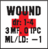

**8.211 EVASIVE ACTION:** A glider takes Evasive Action only as a result of effective enemy Light AA fire, and must be moved randomly to a new ILH by making a Random Location DR measured from its present hex after resolving all Defensive First Fire vs it in that hex. Regardless of the number of times it is shot at in an ILH, a glider will make only one Evasive Action DR in each ILH. The Hex Grain of the glider’s Avenue of Approach never changes. A glider can continue to be Defensive First Fired upon by the same or a different Light AA firer in its new ILH and forced to move to yet another ILH. Following the resolution of all Defensive First Fire vs an Aerial glider, that glider resolves its attempt to land in the ILH currently occupied.

**8.22 LANDING:** To land in its final ILH, each glider must make a Landing DR (∆) and roll ≤ 1 on the Final colored dr. If it fails to land in its ILH, it will overshoot the ILH if the white dr is ≥ 4 or fall short of it if the white dr is ≤ 3. The glider misses its ILH long or short by one hex for every number \> 1 on its Final Landing colored dr. The colored dr is subject to modification only as follows:

**Landing colored drm:**

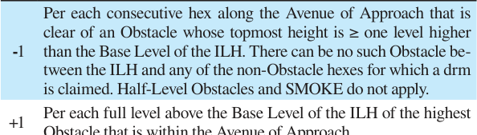

**8.221 OFFBOARD LANDING:** Should an Aerial glider’s ILH be so close to the edge of the playing area (or actually off the playing area) that it cannot trace five consecutive hexes back along the Hex Grain, the terrain on the edge of the playing board in the opposite direction is used in reverse order to represent the offboard terrain over which the glider made its approach or will land in. EX: A glider’s ILH is 4P10, with an Avenue of Approach of hypothetical “K13” to “O11”. The terrain in the preceding five hexes of the offboard Avenue of Approach is equivalent to U8, T8, S9, R9, and Q10 in that order. If the glider were to land now, it would be subject to a -3 drm to the colored dr (-4 [four consecutive hexes in the Avenue of Approach clear of Obstacles a level higher than the Base Level of the ILH] +1 [Level 1 Obstacle in U8] = -3). Now assume that the glider is forced to take Evasive Action and rolls a 6 DR (4 on the colored dr), resulting in a change of two hexes in direction 4 to hypothetical offboard hex P12. P12 is equivalent to the terrain in P8 and its Avenue of Approach is equivalent to the terrain in U6, T6, S7, R7, and Q8 in that order. Its Landing DR is not subject to any colored drm (-1 [one hex clear of obstacle] +1 [Level 1 Obstacle in R7] = 0).

**8.23 CRASH dr:** Upon landing, each glider is flipped to its landed (green) side and must immediately make a Final dr (∆) ≤ 6 to avoid a crash. All modifiers are cumulative *[EXC: the drm for vehicles, wrecks, and previously-landed gliders in the landing hex can never exceed +1]*. This dr is modified as follows: **drm Condition**

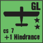

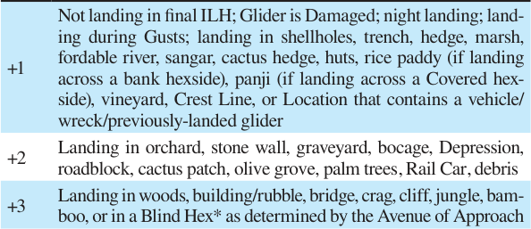

+4 Landing in a Swamp \* Bocage does not create a Blind Hex for purposes of this rule.

**8.231 HEXSIDE drm:** All Crash drm based on hexside terrain (i.e., hedges, cliffs, bocage, walls, roadblocks, Crest Lines) are applicable only if the glider crossed that hexside as it entered the landing hex.

**8.232** A glider that lands in a Blaze or non-frozen, non-fordable Water Obstacle is eliminated with all its contents *[EXC: if that Water Obstacle contains a bridge (not a foot bridge), the glider lands on it if the bridge parallels the Avenue of Approach]*. A glider that lands in a minefield is subject to minefield attack as if it were an entering truck. The landing of a glider has no effect on other units/terrain/Fortifications in that hex.

**8.24 CRASH EFFECT:** A glider that crashes with a Final Crash dr of 7 is considered Damaged (8.41). If the Final Crash dr is ≥ 8, the glider and all its contents are eliminated and replaced by an unarmed truck wreck.

**8.3 FINAL FIRE & GLIDER COVER:** During his DFPh, the DEFENDER may fire any of his units that have a LOS to the landed glider and are capable of Final Fire vs it, using the H Vehicle (A7.308) Line as if it were a stopped truck of “0” target size with a cs# of 7 *[EXC: gliders*

<!-- pdf-page 242 -->

*do not burn, and an Immobilization result is considered a Damage result instead]*; the H Aerial DRM does not apply, but Case J might. A landed glider has no TEM of its own but constitutes a LOS Hindrance even if Damaged; if eliminated, it is replaced by an unarmed truck wreck (which creates both a TEM and LOS Hindrance).

#### 8.4 AFPh/CCPh

**8.4 AFPh/CCPh:** During the ATTACKER’s AFPh, the contents of a glider *[EXC: vehicle/Gun (and its PRC/manning Infantry)]* are placed onboard in the glider’s hex for the first time, after resolving the consequences of all Damage results (8.41). Prior to this they were considered “broken” for LOS purposes. At this point the Passengers assume their own morale, FP, and leadership characteristics for the first time, are no longer subject to losses caused by Damage/elimination of the glider, and may possibly advance out of the hex. Such units can fire in that AFPh (but not as Opportunity Fire). Any vehicle/Gun (and its PRC/manning Infantry) aboard can be removed from the glider (into the same hex) only in a subsequent MPh as per the unloading rules in the “Vehicle” and “Gun” sections of U.S. Vehicle Note 51 (LVT4). In CC, a glider is treated as an Immobile, unarmed truck (8.3).

**8.41 DAMAGE:** An already-Damaged Aerial glider that is Damaged again is eliminated with all aboard (even during landing, in which case no wreck is placed). All SW/Guns in a Damaged glider are considered to have malfunctioned and are subject to normal repair (or eliminated if incapable of repair). Any vehicle in a Damaged glider is Bogged and can subsequently become Mired/Immobilized while attempting to exit the glider. A Damaged glider suffers Casualty Reduction to one or more of its Passengers (dependent on Random Selection dr), with all other Passengers taking a NMC *[EXC to both: inherent AFV crew]*.

**8.5 RE-ENTRY:** The contents of a glider that lands offboard may re-enter the gameboard as per 9.41. The contents of an offboard glider which remain out of play count towards Casualty Victory Conditions (A26.211- .212) only if eliminated by the landing.

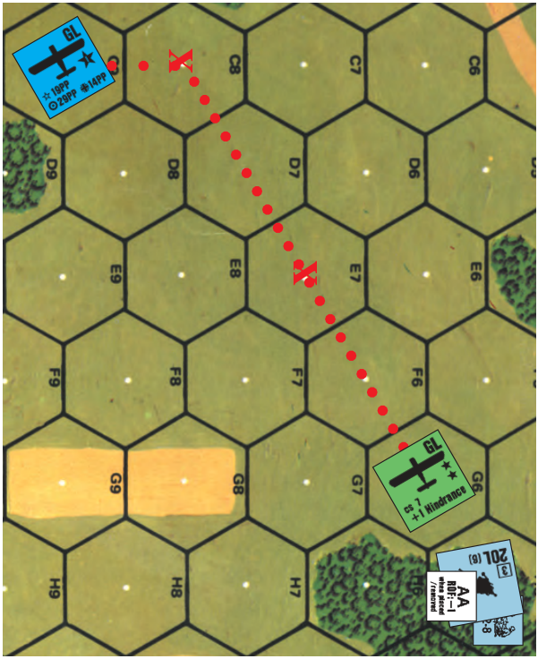

EX: The glider contains a 7-4-7, 8-1, and a dm MMG. It is shown in its ILH in 4C9, indicating an Avenue of Approach of D8-H6. The FlaK Gun in AA mode in H5, however, has Defensive First Fired at it with a 6 Original DR (1 colored dr to retain its Multiple ROF), resulting in a 7 Final DR (due to the glider’s +1 Aerial DRM) on the 6 FP column of the IFT. As a consequence, the glider must take Evasive Action (8.211) and rolls a 2 Random Location DR. The glider is placed in a new ILH in C8. Because the glider is now in a new ILH, the FlaK Gun can use its retained ROF to fire on it again and this time rolls an Original 5 DR (retaining ROF again) which becomes a Final DR of 6, Damaging the glider and again forcing Evasive Action after all other Defensive First Fire vs it in that ILH is resolved. The new Random Location DR is 4 (2 on the colored dr), making E7 its new ILH. The glider draws no additional Defensive First Fire in E7 so it attempts to land there. The Original Landing DR (8.22) is 6 (4 on the colored dr). The colored dr is modified by -1 (-2 [for two consecutive hexes clear of an Obstacle between E7 and H5] and +1 [level of closest Obstacle along the Avenue of Approach] = -1) resulting in a colored dr of 3. This, plus the white 2 dr causes the glider to land in G6—two hexes short of its final ILH (E7). The Crash dr is modified by +5 (+1 for being Damaged, plus +1 for not landing in final ILH, plus +3 for landing in a Blind Hex) so an Original Landing dr ≥ 2 will result in a crash. The glider rolls an Original 1, which is modified to a Final 6 Crash dr, resulting in its safe landing. The landed glider is not fired upon during Final Fire, so in its AFPh the 7-4-7 (determined by Random Selection) suffers Casualty Reduction. The resulting 3-3-7 HS and leader each take a NMC. There would have been no LLMC to the broken HS had the leader been mortally wounded because he has no leadership characteristics until actually placed on the board in counter form in the AFPh.

## 9. PARATROOP LANDINGS

**9.1 AIR DROP:** Paratroops can be dropped in a scenario only if the weather is Clear, Mud, Mist, Gusty, or Snow (not Falling Snow). Wind Direction is established (B25.64) even if there is no wind. Paratroops entering play via air drop are virtually helpless during and immediately after their descent<sup>23</sup>, and consequently forfeit their normal capabilities during the Player Turn in which they are dropped *[EXC: CCPh]*. Paratroops may not fire, move, advance, direct/assist/affect other units until they have removed their parachutes during their APh (9.6). Until then, each paratroop unit remains offboard and is represented solely by the parachute counter with the ID that matches the Cloaking Box it is in. For DYO purchase of <sup>l</sup>/2" and <sup>5</sup>/8" parachutes see H1.204.

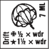

**9.11 WINGS & STICKS:** All paratroop forces to be dropped in the current Player Turn are divided into groups of five Sticks called Wings. Each Stick is composed of one <sup>5</sup>/8" parachute counter and up to one <sup>l</sup>/2" parachute counter. Only one Wing in a Player Turn’s air drop can be composed of less than five Sticks. Each Stick can consist of a maximum of one squad (or its equivalent), one SMC, and one separate SW. All Personnel in a Stick are represented by, and dropped as, an inherent part of that parachute, and have their identity as a component part of that parachute secretly recorded. Use of the Cloaking Counter Display Boxes on the Chapter E Divider is suggested to avoid written records. Air-dropped Personnel and weapons do not take their actual counter form until their parachute is removed from play; consequently, leaders have no leadership capabilities until they appear during their APh (9.6). All SW (including dm 76-82mm mortars) can be dropped by parachute, but must be dm if possible. A SW, although part of its Stick, is represented by a <sup>l</sup>/2" parachute which is placed onboard above the Stick’s <sup>5</sup>/8" parachute until Drift is resolved. Each SW remains in the Cloaking Box that matches its parachute ID until Recovered. A parachute serves only to mask the identity and provide a common Morale Level for its “occupants”; it does not render them concealed in any way. Air-dropped pieces cannot enter play concealed/Cloaked (an exception to A12.12) except possibly as a result of an offboard landing (9.41).

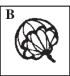

**9.12 DROP POINT:** Prior to scenario setup, each Wing secretly predesignates a Drop Point in the form of a whole hex somewhere on the playing surface and the hexgrain direction they will all share. Each Drop Point must be at least five hexes from all other predesignated Drop Points. Following setup, during the RPh of their entry Player Turn, the ATTACKER makes a dr (∆) for each Wing. If the dr is a 1-3 the predesignated Drop Point is used. If the dr is a 4-6, the final Drop Point is determined by Random Selection to determine the board (including the originally chosen board, and rerolling any tie dr) and the Drift Placement procedure (3.75) is used to determine the Drop Point on or near that board. With the Drop

<!-- pdf-page 243 -->

Points of all Wings thus determined, each Wing places a Stick on the Drop Point, and then places two Sticks on each side of that Drop Point along the same Hex Grain so that there is an uninterrupted line of parachutes five hexes long for each Wing with the Drop Point in the center of that line.

**9.2 DRIFT:** All Sticks are subject to drift during the MPh after all ground units have completed their MPh even if there is no wind. This is done by making a Random Location DR (here termed a Drift DR) for each parachute *[EXC: Germans halve the white dr (FRU) while Russians increase it by 50% (FRD), prior to any Wind adjustment]*.<sup>24</sup> All Personnel in the same Stick drift together in the same parachute. Each Aerial SW takes its own Drift DR and drifts separately *[EXC: British paratroopers retain possession of (i.e., drop with) their LMG, light mortar, and radio coun- ters, while U.S. paratroopers retain their light mortars; they are therefore placed in the Cloaking Box with the possessing Personnel]*. Each parachute’s drift is then adjusted for wind (if any) direction and strength by being moved two hexes directly downwind for a Mild Breeze, three hexes thusly during Gusts, or four hexes thusly during Heavy Winds. EX: The Drop Point of U.S. Stick “A” is 4K5. A Mild Breeze is blowing northeast as shown. The Drift DR of the Personnel in Stick “A” was 8 (5 on the colored dr), which results in the 5/8" parachute drifting to H6. The Drift DR of Stick “A’s” SW was 8 (6 on the colored dr), resulting in the <sup>1</sup>/2" parachute drifting to I4. The Mild Breeze then causes both to drift two hexes farther to the northeast, into J5 and K3 respectively.

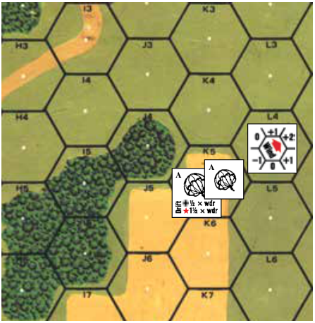

**9.3 DEFENSIVE FIRST FIRE:** After the Drift of all parachutes has been resolved, the DEFENDER may use Defensive First Fire and Subsequent First Fire vs them—even if they have drifted offboard (9.41). Aerial paratroops are subject to Hazardous Movement DRM, and can claim neither Height Advantage, TEM, concealment (9.11), nor any Hindrance other than LV/SMOKE (E.6). Hazardous Movement DRM even apply to an attack (only) on an Aerial SW in an attempt to destroy/malfunction it (A9.74) although such attacks will usually be caused by mistaken identity due to Random Selection. Although all Aerial paratroops are considered moving simultaneously, First Fire/Subsequent First Fire vs them can affect the contents of only one (barring a Random Selection tie dr) Aerial parachute regardless of the number of them in a hex. No Aerial target can be attacked twice in the same hex by the same firer (7.51), nor does fire vs Aerial targets leave Residual FP. While represented by a parachute counter, paratroopers do not take PTC, and are not subject to Pin/Heat of Battle results. EX: A crew, 3-4-7 HS, and 9-1 compose Stick “A”. A 4-6-7 two hexes away fires at the descending parachute with four FP and rolls an Original 4 DR, resulting in a K/2. Random Selection (due to a tie dr) results in the crew and the leader (by failing its Wound Severity dr) being eliminated; the HS takes a 2MC and passes. The leader and crew pieces are removed from the A Cloaking Box and four victory Points are recorded on the Casualty Track of the Scenario Aid Card. When the parachute is removed during the APh, it will be exchanged for the Good Order 3-4-7 HS. The HS is not affected by the elimination of the leader.


##### 9.31 LOS

**9.31 LOS:** A unit has a LOS (7.25) to Aerial paratroops unless it is in a Blind Hex created by an adjacent full-level obstacle between it and the parachute, or is in a pillbox, or has insufficient NVR, or encounters a combination of SMOKE/LV/LOS Hindrances ≥ 6.

**9.32 ELIGIBLE FIRERS & SNIPERS:** Only Small Arms and Light AA (7.51) weapons can Defensive First Fire/Subsequent First Fire vs Aerial paratroops. No To Hit DR, Sniper attack, or Fire Lane is allowed vs Aerial targets. Paratroop/glider snipers may not attack until the *Game* Turn their side starts with Infantry onboard (not in Aerial status above it).

**9.33 RESOLUTION:** When a Stick takes a MC/TC it does so for all of its Personnel contents, and they all pass or fail based on a single MC DR regardless of the number of component units (or their morale) represented therein. The entire Stick checks morale based on a Morale Level of 7— whether broken or not. Represent a broken Stick by flipping the contents of the appropriate Cloaking Box to their broken sides and placing a DM counter in the Cloaking Box. If a Stick suffers Casualty Reduction/ELR-failure, Random Selection is used to determine which inherent crew/HS/ SMC has been eliminated/wounded/replaced; any remaining components of that Stick pass or fail their MC uniformly, using the 7 Morale Level of their parachute.

**9.4 LANDING:** After all Defensive/Subsequent First Fire vs Aerial paratroops has ended, unbroken Aerial paratroops (not separate SW) may move one hex in any direction *[EXC: Germans**<sup>24</sup>**]*. All parachutes then land at the Base Level of their current hex at which point <sup>5</sup>/8" parachutes may become Known enemy units. *[EXC: If that hex contains a bridge (not a foot bridge), it lands on the bridge on a dr of 1 or 2 (dr 1 if a one-lane bridge); otherwise it lands IN the hex. There is a -1 drm to this dr if the unit is unbroken; for Interior Building hexes, see 9.42.]*. Units/SW landing in a Blaze, non-frozen Water Obstacle, or deep/flooded stream are eliminated. All <sup>1</sup>/2" parachutes are then flipped over; thereafter neither player may check the identity of that parachute until it has been Recovered.

**9.41 OFFBOARD LANDING:** If a unit/weapon lands offboard, it is not removed from play unless eliminated (9.42). The reversed-terrain-order technique of 8.221 is used to determine which units are broken/eliminated as a result of their offboard landing and such units count towards Casualty Victory conditions only if eliminated. Temporarily butt any unused board up to the board edge the unit drifted off of to measure the distance (in hexes) it landed off the playing area. An unbroken unit may move one offboard hex per friendly MPh (regardless of terrain) until it reaches the “live” board edge where it must enter normally in its next MPh/APh. The offboard unit can advance in its APh only to enter the “live” board. Broken offboard units may rally normally but may not move/rout until rallied. Offboard SW/Guns may be Recovered normally, but only by units that land offboard.

**9.42 INJURIES:** A <sup>5</sup>/8" parachute landing in a woods, forest-road, crag, building, shallow stream, vineyard, cactus patch, olive grove, Rail Car, Jungle (see G2.213), Bamboo, Swamp (see G7.32), Irrigated Rice Paddies, or marsh hex<sup>25</sup> must take an immediate NMC (∆) using the 7 Morale Level of their parachute (9.33). A <sup>1</sup>/2" parachute must also take an immediate NMC using a Morale Level of 7 when it lands in dense Jungle (see G2.213) or swamp (see G7.32); see G9.47 for panjis. One landing in an Interior Building Hex takes a NMC, then moves one hex directly downwind to another building hex where it takes another NMC, and so on until its contents are either eliminated or it reaches a non-Interior Building Hex, at the Base Level of which it lands. All other <sup>5</sup>/8" parachutes must take an immediate NTC (∆) upon landing, still using its 7 Morale even if broken. A Stick that fails its NTC automatically Deploys into its component HS *[EXC: If a Stick contains a SMC/crew, those units are revealed at this time with/in place of any component HS]*; one HS (and perhaps any accompanying SMC, determined by Random Selection if necessary) is moved to the next hex directly downwind, but need not take any further landing MC/TC—although it is eliminated if placed in a Blaze, non-frozen Water Obstacle, or flooded stream. The level of Landing MC/ TC required is increased by one (i.e., 1MC/1TC) if the unit lands during a Mild Breeze, or by two if it lands during a Heavy Wind/Gust.


**9.43 FINAL FIRE:** After all landing DR have been resolved, paratroops are subject to Final Fire using normal LOS and fire <!-- pdf-page 244 --> rules vs ground targets. Any paratroops in the same Location with enemy Infantry must be attacked by those units using TPBF (A8.312), even if the paratroops are already broken/Disrupted; mark the survivors with a CC counter. Broken DEFENDER (only) units may rout from the hex during the RtPh because they have not yet engaged in CC.

#### 9.5 AFPh/RtPh

**9.5 AFPh/RtPh:** In the Player Turn they land Paratroops may not attack or rout, and are not subject to rout rules (including Surrender/Failure to Rout).

#### 9.6 APh

**9.6 APh:** Paratroops may not advance during the APh. Instead, all *[EXC: those that have already Deployed; 9.42]* just-dropped <sup>5</sup>/8" parachutes are removed, and their component units are placed onboard with their normal capabilities restored. Prior to this, a Stick’s inherent leader who was eliminated/broken did not cause any LLMC/LLTC; and all its contents were considered “broken” for LOS purposes.

**9.7 PRE-1942 GERMAN PARADROPS:**<sup>26</sup> German paradrops prior to 1942 are made with Sticks containing partially-armed 5-4-8/2-3-8/2-2-8 squads/HS/crews. This partially-armed state is shown by placing any unused systems counter (Acquisition counters are recommended if not otherwise needed) over such a MMC. This systems counter gives the MMC a Strength Factor of 2-2-8 {8} if a squad (with no Assault/Spraying fire or smoke grenade capabilities), 1-2-8 {7} if a HS, or 1-2-8 {8} if a crew {broken morale level given in brackets}. However, at the end of every friendly MPh in which a Good Order partially-armed German MMC moves to another hex it may attempt to locate an arms canister by making a dr (∆) ≤ 1. This dr is subject to a -1 drm for every different hex entered during that MPh and a +1 drm if CX. If the MMC succeeds, its systems counter is removed and it is treated as a normal MMC thereafter. For Battlefield Integrity purposes, German paratroops dropped in this manner retain their fully-armed BPV.

## 10. AMMO VEHICLES

**10.1 AMMO VEHICLES:** If a vehicle has a B #  (D3.71), a SSR may specify that it receives an Ammo Vehicle, in which case the following rules apply.

**10.11 SELECTION:** If the SSR or Chapter H Vehicle Note does not specify a particular (type of) vehicle to be used as the Ammo Vehicle, any vehicle having ≥ 15 PP Passenger capacity (or ≥ 20 PP if the armament with the B #  is ≥ 100mm) is used. For DYO cost see H1.49.

**10.12 AMMO PORTAGE:** An Ammo Vehicle is signified by the placement of an Ammo Supply counter on it. The Ammo Supply counter reduces the usable Passenger capacity of its vehicle to zero PP, and may not be removed from it unless Immobile (10.4) or Depleted (10.3).

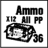

**10.2 BENEFIT:** If the correct Ammo vehicle is in an Accessible Location to (or in the same Location as) the proper CE armed vehicle when it fires, its B #  is treated as a normal B12. One Ammo Vehicle can be used to supply no more than two identically (in terms of Gun Caliber Size and Barrel Length) armed vehicles at any one time—assuming that the Ammo Vehicle has an Accessible/same-Location status to both.

**10.21 RESTRICTIONS:** Once an Ammo Vehicle’s B# benefit is used for Prep Fire, it may not expend MP in the subsequent MPh. (Mark it with a Prep Fire counter to indicate such.) An Ammo Vehicle’s B# benefit cannot be used in Bounding (First) Fire, but it can otherwise be used in the AFPh, provided 10.2 is adhered to.

**10.3 REPLENISHMENT:** When a vehicle with a B # suffers Low Ammo Depletion (D3.71), its ammo supply can be Replenished after it and its Ammo Vehicle have been TI in the same or Accessible Location(s) for a number of complete Game Turns (i.e., two Player Turns, RPh to CCPh inclusive) as per the Ammo Replenishment Table, which is reproduced on the back of each Ammo counter:

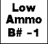

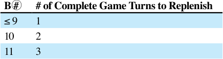

The armed vehicle must remain CE during Replenishment. The TI counter is removed (and the armed vehicle may function normally) when the Replenishment period has been successfully completed, or if for any reason the vehicle crew loses CE status, or either/both vehicles expend MP, fire any weapon(s), or are attacked in CC. *[EXC: If the TI counter is re- moved prior to the completion of Replenishment, that Game Turn does not count toward Replenishment and the armed vehicle must use its B # if it fires that weapon.]* One Ammo Vehicle can Replenish up to two identically armed (10.2) vehicles simultaneously. Upon the successful completion of each vehicle’s Replenishment period, the Ammo Vehicle must make an Ammunition DR. If it rolls an Original 12, the Ammo Vehicle has run out of ammunition, the Ammo Supply counter is removed, and the vehicle assumes its normal portage capabilities.

**10.31 SPECIAL AMMO:** All Ammo Types depleted due to normal Depletion (C8.9) are Replenished by an Ammo Vehicle but only B #  vehicles with Low Ammo status can be Replenished.

**10.4 IMMOBILIZATION/LOSS:** An unarmored Ammo Vehicle that becomes Immobilized is not flipped over to its Wreck side; it is instead marked with an Immobilized counter so it can continue to function in its Ammo Supply role. An Ammo Vehicle can offload to form an Ammo Dump in the same Location, or an Immobile Ammo Vehicle can transfer its ammo to another Accessible/same-Location vehicle (that qualifies as per 10.11) by using the Replenishment procedure for four Game Turns (10.3). When the TI counter is removed at the end of the CCPh, the Ammo Supply counter is placed in the other vehicle or Location (which then becomes the new Ammo Vehicle—or Ammo Dump; 10.6), and the original vehicle is flipped to its Wreck side if Immobilized. A vehicle cannot expend MP during the turn in which it becomes (or ceases to be) an Ammo Vehicle.

**10.5 BURNING WRECK:** If an Ammo Vehicle becomes a Burning Wreck (or would become one if it had a Wreck mode) it immediately explodes (removing its own wreck) as if it were a detonated Goliath *[EXC: it has no designated target and no X#]*; see German Vehicle Note 93.

**10.6 AMMO DUMP:** A SSR or DYO purchase (H1.6) can create an immobile Ammo Dump in the form of an Ammo Supply counter. All rules pertaining to Ammo vehicles apply to the Ammo counter as a stationary Location.

<!-- pdf-page 245 -->

## 11. CONVOYS

**11.1 COMPOSITION:** A Convoy consists of two or more motorized vehicle counters placed contiguously one per hex such that a continuous “line” is formed without a Gap between the “lead” and “rear” vehicles. However, the random occurrence of such relative positions during the course of a scenario does not invoke Convoy rules, nor can a Convoy be voluntarily created during a scenario. See also 11.8.

**11.2 MOVEMENT:** A Convoy is considered a “multi-hex stack” and, as such, its components move together in Impulses using the principles of Impulse Movement (D14.3). A Convoy vehicle must pay one extra MP (as if towing a Gun) per hex entered (or per hexside if using VBM). Furthermore, the minimum road rate for a Convoy vehicle is one MP, rather than <sup>1</sup>/2 MP. Thus the minimum per-hex *road* cost for a Convoy vehicle is two MP. If a Convoy vehicle is actually towing a Gun, the total extra movement cost per hex is still one MP—not two. Once a Convoy expends a Stop MP, neither it nor any of its vehicles may expend a Start MP in that MPh. See also 11.6-.7. A vehicle may not conduct an Overrun while part of a Convoy.

**11.21 GAPS:** A Gap appearing in a Convoy line (due to elimination/Immobilization/bog/leaving the Convoy [11.25-.254]) causes the original Convoy to become two separate Convoys *[EXC: a “new Convoy” that contains only one vehicle; 11.1]*, each of which can now move (and expend MP) independently of the other. However, in its MPh, if a Convoy has already completed one or more Impulses *before* a Gap appears in it, then the MPh of the newly-created “lead” Convoy must be completed before the “rear” Convoy can continue its MPh. Once a Convoy begins its MPh, no other ATTACKER unit can conduct its MPh until *all* elements of that original Convoy have completed their MPh. EX: A roadbound Convoy, consisting of three trucks followed by five halftracks, expends two MP and thusly completes one Impulse. Defensive First Fire now eliminates the last truck; the resulting Gap creates a new “lead” Convoy of two trucks and behind it a new “rear” Convoy of five halftracks. Since all of these vehicles have already completed at least one Impulse in the current MPh, the ATTACKER must finish moving the vehicles of the “lead” Convoy before any of his other units can move. After the vehicles of the lead Convoy finish their MPh, the ATTACKER then, with the same options, completes the “rear” Convoy’s MPh. Should the rear Convoy lose its middle halftrack, thus creating for the next Impulse new lead and rear Convoys of two halftracks apiece, this newest lead Convoy must also finish its MPh before the newest rear Convoy can.

**11.22 REVERSE:** A Convoy vehicle may not use Reverse movement. Furthermore, a Convoy vehicle may not, in the same MPh, re-enter its *last* previously-occupied hex. EX: During an Impulse a Convoy vehicle exits 5Y6 by moving into Z6. For the remainder of the current MPh it cannot re-enter Y6 until after it has exited Z6. The best way for it to re-enter Y6 is via Z5 or Y7. (Note that once in Z5 or Y7, the vehicle cannot then “directly” re-enter Z6 in that MPh.)

**11.23 ENTERING VEHICLE/WRECK LOCATION:** A Convoy vehicle entering a Location that contains one or more vehicle/wrecks must pay *twice* the D2.14-calculated MP cost for doing so. Furthermore, a vehicle entering a Location that contains a Convoy vehicle must also pay twice the D2.14-calculated cost. Thus a Convoy vehicle entering a Location that contains another Convoy vehicle must pay four times the D2.14-calculated cost. EX: A Convoy truck must expend six MP to enter, via a road, an otherwise Open Ground Location that contains a wreck (2 [Convoy road entry MP] + {2 [entering wreck Location; D2.14] × 2 [Convoy penalty]} = 6). If that Location does not contain a road, the truck must pay seven MP to enter it (5 + {1 × 2} = 7). If that Location contains no road, and contains another Convoy vehicle instead of a wreck, the truck must pay nine MP to enter it (5 + {1 × 4} = 9).

**11.24 MOTION:** A Convoy may use Motion status as if one unit. However, a DEFENDER Motion attempt (D2.401) may not be made by a Convoy vehicle, nor by the Convoy as a unit.

**11.25 NON-CONVOY MOVEMENT:** A Convoy vehicle wishing to use non-Convoy movement may voluntarily (but within certain restrictions) leave its present Convoy. The ATTACKER must declare, *before* an Impulse begins (but after all prior Defensive First Fire has been resolved), that the vehicle will use non-Convoy movement, and that vehicle must then (if it can; see 11.251-.252) immediately expend MP (and can be Defensive First Fired on) to move/use Bounding First Fire, etc., until it completes its MPh. After all vehicles that wished to do so have used this procedure to leave that Convoy, that Convoy’s own Impulse then begins.

**11.251** A vehicle may leave its Convoy (whether to use non-Convoy movement [11.25], or to form a new Convoy [11.254]) only if one or more of the following conditions apply:

**1)** it/its PRC currently has a LOS to a Known enemy ground unit, or to a friendly same-Convoy vehicle (including itself) that was either attacked (including Residual FP, but excluding a minefield attack that did not eliminate/immobilize it) at the end of the Convoy’s preceding Impulse (even if that Impulse ended its previous MPh) or eliminated/

immobilized during the current MPh, or;

**2)** it is an AFV with a radio, and the Inherent crew of another non-shocked/non-stunned friendly AFV (not necessarily in a Convoy)

with a radio has a LOS as per condition #1, or;

**3)** it is Recalled (11.253).

**11.252 RADIOLESS AFV:** A radioless AFV platoon (D14.2) leaves a Convoy to use non-Convoy movement as a single entity, with all its AFV completing their MPh using platoon movement. A radioless AFV that wishes to thusly use non-Convoy movement must pass a D14.23-mandated NTC only if it is the start of its MPh and it also wishes to leave a radioless AFV platoon. A radioless AFV may not voluntarily leave its AFV platoon after it has begun its MPh (D14.23), even if in a Convoy.

**11.253 RECALL:** The Recall of a Convoy vehicle forces it to leave its Convoy at the start of its next Impulse as per 11.25.

**11.254 NEW CONVOY:** A Convoy vehicle may also leave its parent Convoy *during* an Impulse by moving (or expending a Stop MP) so as to create a Gap, thus forming a new “rear” Convoy with itself as the “lead” vehicle. 11.251 still applies to such a move/expenditure. Once the Gap has been voluntarily created, the method and order of movement given in 11.21 apply to both new Convoys.

**11.255** MP expended to leave a Convoy do not apply to the original Convoy’s total MP expenditure, nor do they allow Defensive First Fire vs the original Convoy. A lone vehicle separated from its Convoy by a Gap is no longer in Convoy status (11.1).

**11.26 COMBINING:** Two or more Convoys can combine into one, but the highest current MP expenditure then immediately applies to all vehicles in the new Convoy.

**11.3 PP CAPACITY:** The Passenger capacity of a vehicle is assumed to be 0 PP while it is part of a Convoy, and remains 0 PP even if it leaves the Convoy *[EXC: if the vehicle sets up actually towing a Gun, it is allowed to also carry that Gun’s crew and ammo]*.

**11.4 CONVOY HINDRANCE:** A Convoy vehicle (not Column) *does* create a LOS Hindrance if it would be subject to TH Case J were it to be fired on by any ordnance at that moment.

**11.5 COLUMN:** A Column consists of two or more contiguous *hexes* that contain Infantry/Cavalry/Wagon counters placed such that a continuous line of units one hex wide is formed. Normal stacking applies in each such hex. All units in a Column must remain adjacent to the same unit(s) they are presently adjacent to, and each unit/stack in a Column *[EXC: the “lead” unit/stack]* may enter only that hex just exited by the one “ahead” of it when moving/advancing. A Column unit may not conduct (or even attempt to conduct) any activity other than moving/advancing, being affected by attacks, “?” gain/loss (and thus being possibly treated as a Known enemy unit), and Disbanding (11.53). (Such prohibited activities include Deploying, SW Recovery, SMOKE grenade placement, Searching, SMC Overrun, etc.) The random occurrence of units in Column position during the course of a scenario does not invoke Column rules, nor can a Column be voluntarily created during a scenario.

<!-- pdf-page 246 -->

##### 11.51 SW

**11.51 SW:** All SW being carried in a Column must be dm if possible unless being transported by wagons.

**11.52 MOVEMENT:** A Column uses Impulse Movement (D14.3) to move/advance as a “multi-hex stack”, and does so at the MF rate of the “slowest” unit in that Column. A Column unit is considered to be continuously engaging in Hazardous Movement (A4.62). Road bonus (B3.4) can apply normally to the movement of a Column, as can even a single leader’s MF bonus (since the Column is treated as a “multi-hex stack”). Gallop/ Double Time can be used in a Column, but Minimum/Assault/Bypass/ Dash/Human-Wave/Armored-Assault Movement cannot be.

**11.521 TERRAIN:** A Column unit may not enter a woods/building Location *[EXC: via a Path/road hexside; Factory]*, nor may it expend MF to move beneath a Fortification counter. A Column unit can never claim shellhole TEM.

**11.522 DETECTION:** When a Column unit enters a Location where Detection (A12.15) will occur, the DEFENDER does not reveal his unit until that Column has completed its Impulse. When he does reveal it, only the ATTACKER unit in the DEFENDER’s Location— not the rest of the Column—is forced to return to its previously-exited hex, where Overstacking might then apply.

**11.523 COMBINING:** Infantry/Cavalry/Wagon(s) may join a Column only if they are unpinned and in Good Order, and only if the Column foregoes its entire MPh so they can assume Column position. The act of joining must be declared by the ATTACKER, and each unit uses Hazardous Movement as it joins the Column.

**11.53 DISBANDMENT:** Column units may not “leave” their Column, nor will Gaps appear in a Column. Columns are checked for possible Disbandment at the times given in 11.531-.532. If at that time any Column unit has either been attacked (even by a Sniper, but see 11.534 for minefields) or has a LOS to a Known enemy ground unit, *that* Column instantly Disbands for the duration of the scenario. Whenever a Column Disbands, its units are instantly freed from the Hazardous Movement DRM *[EXC: a Column may voluntarily “initiate” Disbandment by expending a MF to do so (and declaring Disbandment), but does not actually Disband until after all De- fensive First Fire allowed by that MF expenditure]*; see also 11.535-.536. A Column can Disband only if it is (at least partially; 11.7) onboard.

###### 11.531 MPh

**11.531 MPh:** After all (if any) possible Defensive First Fire has been conducted vs *any* unit that has just expended MF/MP, all ATTACKER/DE- FENDER Columns are checked for Disbandment as per 11.53. When an ATTACKER Column Disbands during the MPh, its units’ MPh immediately ends—even if they had not yet begun to move.

**11.532 OTHER PHASES:** In other than a MPh, Column Disbandment is checked for after each attack (including CC) is resolved, as each routing unit expends MF, and as each unit advances.

**11.533 OBA/AERIAL ATTACKS:** Whenever a Column unit is within six hexes of a Location that is either attacked by an aircraft or in a HE OBA Blast Area, that Column immediately Disbands. If a Location is within six hexes of a Column unit *at the time* OBA-fired WP is placed in that Location, that Column immediately Disbands. In both cases, Disbandment occurs regardless of LOS from the Column unit to the Blast Area Location.

**11.534 MINES & WIRE:** For Disbandment purposes, a minefield is considered to attack a Column unit only if it pins/breaks/Reduces/eliminates/immobilizes it. A Column Disbands if any of its units enter a Location and reveal hidden wire therein.

**11.535 WAGON:** Whenever a Column Disbands, all wagons therein go (or remain) in Motion. If this occurs during a friendly MPh, those wagons thus immediately end their MPh (11.531) in Motion.

**11.536 PIN:** Whenever a DEFENDER Column Disbands, its units all become pinned *[EXC: wagons (11.535); units immune to Pin results]*.

**11.54 CONCEALMENT:** Column units may set up concealed as per the normal rules for doing so. However, a Column unit that has lost its “?” cannot regain it. Moreover, all units in a Column lose their “?” when that Column Disbands, regardless of LOS and the presence of and range to enemy units.

**11.6 STRAYING:** At night, when a Convoy/Column begins its MPh only its “lead” unit is capable of Straying (even if a Gap *involuntarily* appears in that Convoy); if that “lead” unit does Stray, those units behind it in that Convoy/Column will simply follow it. However, whenever a Convoy unit *voluntarily* leaves its Convoy (to use non-Convoy movement or to become the “lead” vehicle in a new Convoy), it is then capable of Straying as per the normal rules for doing so, even though it had already started its MPh.

**11.7 PARTIAL ENTRY:** If a Convoy or Column still has one or more units offboard when its MPh/APh ends, those units retain Convoy/Column status and can enter the playing area in their next MPh/APh. *[EXC: If a partially-offboard Column Disbands, its offboard units set up again and enter in their next allowed phase(s) without using Column status. The normal prohibition against subsequent-turn entry is voided for this situation.]*

**11.8 APPLICATION:** A Convoy/Column is used only for scenario setup/ entry/Victory Conditions. Convoy/Column units receive no special benefits, but neither do they pay any special penalties, other than those listed/ referred to above.

## 12. BARRAGE

**12.1** A Barrage is a type of OBA Fire Mission (C1.7), and is available to a player if he is allowed one or more Pre-Registered hexes.<sup>27</sup> A Barrage uses all the normal rules for OBA except as modified below. A rocket OBA battery cannot be used for any type of Barrage.

**12.11 CONFIGURATION:** A Barrage FFE Blast Area is one hex wide by nine hexes long, and must lie along a Hex Grain or Alternate Hex Grain. Thus there are nine possible Barrage alignments per Pre-Registered hex. A Barrage counter is placed four hexes away from the FFE counter in each of the two *outermost* hexes of the Blast Area, with the arrow on each Barrage counter aligned to point “through” the other Blast Area hexes to that FFE counter.

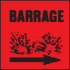

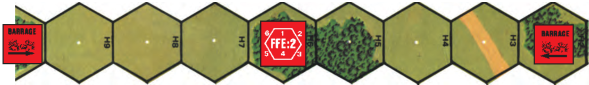

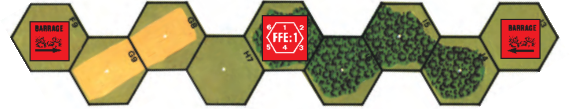

<!-- pdf-page 247 -->

**12.2 SETUP:** Prior to setup, all Pre-Registered hexes are recorded on paper normally. However, for each Pre-Registered hex that the player wishes to also have available for use with a Barrage, he must at this time also secretly record two Barrage Blast Area hexes that are adjacent to that Pre- Registered hex but not adjacent to each other. These two Blast Area hexes set the Hex Grain of all Barrages from that OBA battery, and make that Pre-Registered hex “Barrage-capable”. *All Pre-Registered hexes assigned a Barrage option from the same OBA battery must use parallel (Alternate) Hex Grains*. EX: 4H6 is a Pre-Registered hex. Its owning player decides to give it the option of also being used for a Barrage between hexes H2 and H10 inclusive, so where he has recorded “4H6” he also writes “(Barrage: H5-H7)”. Now assume the player is also allowed a second Pre-Registered hex, for which he chooses C6. If he decides to make C6 Barrage-capable too, the only Hex Grain he can record for it is C5-C7 (i.e., the Hex Grain parallel to that of his other Barrage-capable Pre-Registered hex). [If, instead of the H5-H7 Hex Grain, the player had chosen to designate for his first Barrage the Alternate Hex Grain that comprises J3, J4, I5, I6, H6 (the Pre-Registered hex), H7, G8, G9, and F9, he would have written “(Barrage: I6-H7)”—and he would have had to record “(Barrage: D5-C7)” for his second Pre-Registered hex.]

**12.3 PLACEMENT:** A FFE:1 counter being used for a Barrage can only be *directly placed* (C1.731; i.e., a SR may never be flipped over to become a Barrage FFE), and only in a Barrage-capable Pre-Registered hex. If a player wishes to use a Barrage Fire Mission, he must place the two Barrage counters onboard at the same time he places the FFE:1.

**12.31 ALIGNMENT:** A Barrage, regardless of where it actually lands, must *always* have its Hex Grain parallel to that of its Pre-Registered hex(es). EX: Continuing the first part of the previous example, when the Barrage FFE:1 counter is placed in H6 one Barrage counter will be placed in H2 and one in H10, with the arrow of each pointing through H3 and H9 respectively; thus the Blast Area of this Barrage will consist of the nine hexes H2 through H10 inclusive. However, assume that when the player directly places the FFE:1 counter in H6 it errors to D4. The Barrage will now be centered on D4, and the only Hex Grain alignment it can have is the one parallel to that of H6 (and C6). Thus the Barrage counters are placed in D0 and D8, with their arrows pointing through D1 and D7 respectively. [If he were instead using for his Barrage the Alternate Hex Grain that comprises J3, J4, I5, I6, H6 (the Pre-Registered hex), H7, G8, G9, and F9, when the FFE:1 counter were placed accurately in H6 one Barrage counter would then be placed in J3 with its arrow pointing through J4, and the other would be placed in F9 with its arrow pointing through G9.]

**12.4 CORRECTING:** An onboard Barrage (i.e., a FFE:1 or FFE:2 counter, and its associated Barrage counters) can be Corrected only onto or adjacent to (i.e., by placing the AR [as per C1.4] in or adjacent to) a Barrage-capable Pre-Registered hex *[EXC: when the FFE counter is in or adjacent to a Pre-Registered hex, it cannot be Corrected to another hex that is adjacent to that same Pre-Registered hex]*. 12.31 still applies to a Corrected Barrage. EX: Continuing the first part of the previous example with the FFE counter in D4 and the Barrage counters in D0 and D8, assume that in the subsequent allowable phase the player wishes to Correct his onboard Barrage FFE. He can Correct the FFE counter in D4 only to or adjacent to a Barrage-capable Pre-Registered hex, and can Correct it no farther than three hexes (C1.4). Therefore, he can place his AR only in or adjacent to C6 or in G6. If the player also had another Barrage-capable Pre-Registered hex that was too distant to allow him to Correct the FFE counter to it, he could use it for a Barrage only by calling in a new Fire Mission there.

**12.5 RESOLUTION:** A Barrage FFE is resolved using the IFT FP column to the left of the column that battery uses for a normal HE Concentration FFE. EX: 80+mm OBA uses 12 FP in a Barrage, 100+mm uses 16 FP, 150+mm uses 24 FP, etc.

**12.51 SMOKE:** A Barrage *[EXC: not Creeping Barrage]* FFE may be used to place SMOKE.

**12.52 FFE LOS HINDRANCE:** A Barrage *[EXC: not Creeping Bar- rage]* FFE causes a LOS Hindrance as per C1.57.

**12.6 CONVERSION:** A Barrage-capable Pre-Registered hex *[EXC: one designated for use with a Creeping Barrage; 12.7]* may also be used for normal Concentration/Harassing Fire Missions, although converting from any one type of Mission to another can only be done “between” Missions (C1.7).

**12.7 CREEPING BARRAGE:** a Creeping Barrage<sup>28</sup> is a type of Barrage that automatically Corrects in each Scenario Attacker PFPh (and possibly DFPh) without using an Observer or radio. A Creeping Barrage may only be used by a Scenario Attacker. All Barrage rules apply to a Creeping Barrage unless specified otherwise. For DYO cost see H1.5.

**12.71 SETUP:** Prior to all setup in a scenario that grants a Creeping Barrage to the Scenario Attacker, that player secretly records *one Barrage- capable Pre-Registered hex* (12.2) whose Hex Grain (or Alternate Hex Grain) alignment must parallel the Friendly Board Edge that the majority of his units will enter along on Turn 1, and into which his Turn 1 Creeping Barrage will be directly placed (C1.731). He also secretly records *an Aim- ing Hex*, which is any hex that lies along both a(n) (Alternate) Hex Grain of the Pre-Registered hex and the board edge *opposite* the above mentioned Friendly Board Edge. This (Alternate) Hex Grain, from the Pre-Registered hex to the Aiming Hex (inclusive), is termed the Creeping Barrage Hex Grain, and is the general path the Creeping Barrage’s FFE counter will follow as it is periodically Corrected toward the Aiming Hex. At this time he also secretly records whether in each Game Turn he will Correct this Creeping Barrage *in each friendly PFPh only, or in both his PFPh and DFPh.*<sup>29</sup> He also secretly records *the Game Turn in which the Creep- ing Barrage will Lift* (i.e., will end; 12.76). Note that the Creeping Barrage begins on Turn 1 (unless its Timing is off; 12.72), and will advance an average of two hexes per Correction. Lastly, he *prepares his Battery Access draw pile, including one extra black card/chit* for his Pre-Registered hex. EX: The Scenario Attacker will enter along hexrow A of board 4, and must capture the buildings in hexrows O and P in six turns with the assistance of a 100+mm Creeping Barrage. Hexrows Q-GG are not playable. Studying the board, he decides to make G5 his Pre-Registered hex and P5 his Aiming Hex—thus establishing as his Creeping Barrage Hex Grain all the hexes with a “5” coordinate between G5 and P5 inclusive. He also decides that he will Correct his Creeping Barrage in his friendly PFPh and DFPh; he indicates this by recording “Correct: FFE: 1-2”. (If he had wished to Correct it only in his PFPh, he would have written “Correct: FFE: 1”.) Finally, he decides to have his creeping Barrage end after Game Turn 3, so he writes “Lift: GT: 4”.

**12.72 TIMING:** After both sides have set up, but prior to the start of the initial RPh, the Scenario Attacker makes a special Battery Access draw. If it is *black*, the Creeping Barrage will commence in coordination with his ground attack, and the initial RPh now begins normally. If the draw is *red*, he must make a Timing dr (halved; FRU) to find how many “Game Turns” the Creeping Barrage will commence ahead of his ground attack.<sup>30</sup> He then begins “pre-Game Turn 1”. Each “pre-Game Turn” consists *only* of the Scenario Attacker’s friendly PFPh and friendly DFPh, and only so that his Creeping Barrage can be Corrected/resolved as per 12.73-.731. The appearance of the Creeping Barrage’s FFE:C counter in a “pre-game” DFPh signifies the completion of one “pre-Game Turn”, the number of which that must be completed is equal to the Final Timing dr. After the completion of all “pre-Game Turns”, the red card/chit that had been drawn is exchanged for a deliberately-drawn *black* card/chit, and the red card/chit is shuffled back into the pile. The initial RPh of the scenario then begins, with the Creeping Barrage’s FFE:C counter remaining in its present hex to be Corrected and resolved in the AT- TACKER’s PFPh, and with a black Battery Access card/chit showing.

**12.73 PFPh MECHANICS:** At the start of a friendly (even if “pre-game”) PFPh in which the Scenario Attacker has a Creeping Barrage available, he must, in lieu of rolling for Radio Contact, perform step 1 or step 2 below—after which he then performs step 3.

<!-- pdf-page 248 -->

**1)**	 *If it is the PFPh of Game Turn 1 and his special Battery Access draw was black (or if it is the PFPh of “pre-Game Turn 1”)*, he must place his Creeping Barrage’s AR counter in its Pre-Registered hex and then

“directly place” its FFE:1 counter as per C1.731-.732; or,

**2)**	 *If his Creeping Barrage’s FFE:C counter is onboard*, he must ex­

change it for a FFE:1 counter and then Correct that FFE:1 as per 12.74 *[EXC: if it Lifts; 12.76]*.

**3)**	 *Once the FFE:1 counter is in its final placement hex for that PFPh*,

he resolves that Barrage’s attacks and then exchanges its FFE:1 counter for a FFE:2.

**12.731 DFPh MECHANICS:** At the start of each (even if “pre-game”) DFPh in which the Scenario Attacker is the DEFENDER and has a Creeping Barrage FFE:2 counter onboard, he must perform one *or both* of the following actions in lieu of rolling for Radio Contact:

**1)**	 *If he had recorded his Corrections as “FFE:1-2”*, he must *first* Correct his FFE:2 counter as per 12.74 *[EXC: if it Lifts; 12.76]*; and/or,

**2)**	 *Regardless of whether he had recorded “FFE:1”  or “FFE:1-2” for his Corrections*, and if the Barrage did not Lift in step 1, he resolves that Barrage’s attacks and then flips its FFE:2 counter to the FFE:C

side.

**12.732 ADJUSTMENT:** If, in the Scenario Attacker’s Turn 1 (or “pre- Game Turn 1”) PFPh, the Creeping Barrage FFE:1 counter’s final placement hex is *not* its Pre-Registered hex, then on his side record he must cross out that Pre-Registered hex’s coordinate and substitute that of the FFE:1 counter’s present hex. He must then also cross out the coordinate he had recorded for the Aiming Hex and replace it with that of a new Aiming Hex. These two newly-recorded hexes must form a new Creeping Barrage Hex Grain that retains the exact alignment and configuration of the original Creeping Barrage Hex Grain.

**12.74 CORRECTING:** Each Correction of a Creeping Barrage FFE counter is of two hexes, and must be attempted to (i.e., the AR [as per C1.4] must be placed *in*) a hex in the Creeping Barrage Hex Grain that is *closer* (in hexes) to the Aiming Hex than the FFE counter’s present hex. If this cannot be done, then the Creeping Barrage must Lift (12.76). Each Correction is subject to a normal accuracy dr, and if inaccurate is also subject to a direction of error dr and a subsequent error of *one* hex. EX: Continuing the previous example, after all setup the Scenario Attacker’s special Battery Access draw is red. Therefore he makes a Timing dr that is an Original 3, which means his Creeping Barrage will attack for two “pre-Game Turns” before the actual Turn 1 RPh begins. So for the “pre-Game Turn 1” PFPh (step 1 of 12.73) he places his AR in G5 (his Pre-Registered hex) and rolls for accuracy, which he fails to achieve. It errors to G6, so he places the FFE:1 counter there, places a Barrage counter (12.11) in G2 and in G10, and then crosses out “4G5 (Barrage: G4-G6)” and writes “4G6 (Barrage: G5-G7)”. He also changes his Aiming Hex from “P5” to “P6”. (Note that P6 is the only hex that can serve as the new Aiming Hex, given both G6 as the FFE counter’s hex and the requirements of 12.732. In essence, the FFE’s inaccuracy has caused the Creeping Barrage Hex Grain to change from “all hexes with a coordinate of ‘5’ between G5 and P5 inclusive” to “all hexes with a coordinate of ‘6’ between G6 and P6 inclusive”.) After this he proceeds to attack hexes G2 through G10 (inclusive) with 16 FP each, and then exchanges the FFE:1 counter for a FFE:2 (step 3 of 12.73). Now he begins the DFPh of “pre-Game Turn 1”, in which he must Correct the FFE:2 counter (step 1 of 12.731) two hexes to a hex that is both in the new Creeping Barrage Hex Grain and closer to the new Aiming Hex. His only choice can be I6, so he places his AR there; however, his accuracy dr is a 3, so he makes a direction of error dr which as per the AR’s alignment results in the FFE:2 counter erroring one hex (12.74) to H6. After repositioning his Barrage counters he resolves all Barrage attacks vs hexes H2- H10 inclusive, and then flips the FFE:2 counter to its FFE:C side (step 2 of 12.731), thus completing “pre-Game Turn 1”. Next, in the PFPh of “pre-Game Turn 2”, he must replace the FFE:C counter with a FFE:1 which he must then Correct (step 2 of 12.73)—to J6 in this case. He will then repeat step 3 of 12.73, then step 1 of 12.731, and then step 2 of 12.731. When as per this last step he has flipped the FFE:2 counter to its FFE:C side (thus showing that his Creeping Barrage has completed its actions for another Game Turn—in this case the second and final “pre-Game Turn”), then the actual RPh of Turn 1 will begin. (If the Scenario Attacker’s Correction note were “FFE:1”, he would follow the same procedure except that he would not Correct the FFE:2 in the DFPh of each “pre-Game Turn”; i.e., he would not use step 1 of 12.731. He would still use step 2 of 12.731 though.) Once the scenario actually begins, the Scenario Attacker will handle the Creeping Barrage in each friendly PFPh in exactly the same manner as in the “pre-Game Turn 2” PFPh; likewise, he will handle it the same in each friendly DFPh as he did in the DFPh of “pre-Game Turn 2”. These procedures will continue until the Creeping Barrage Lifts (12.76). (If the Scenario Attacker’s Correction note were “FFE:1”, once the scenario actually began he would still follow the same procedure except that he would not Correct the FFE:2 in his friendly DFPh.)

**12.75 SMOKE/HINDRANCE:** A Creeping Barrage FFE may not be used to place SMOKE. However, the FFE Hindrance DRM (C1.57) of a Creeping Barrage is +2 instead of the normal +1 *[EXC: +1 if it is raining or the scenario has Deep Snow]*.<sup>31</sup>

**12.76 LIFTING:** A Creeping Barrage is one Fire Mission from the time its special Battery Access draw is made until that Barrage ends. A Creeping Barrage ends (i.e., Lifts) at the beginning of the first friendly fire phase in which it can no longer be Corrected as per 12.74 within the Creeping Barrage Hex Grain, or at the beginning of the first friendly fire phase that occurs after the Creeping Barrage has been used for the number of Game Turns (including “pre-Game Turns”) its owner had recorded for it (12.71)—whichever occurs first. When a Creeping Barrage Lifts, its FFE counter is simply removed from the board, and that Creeping Barrage is no longer usable in that scenario. EX: Continuing the previous example, it is now the beginning of the Scenario Attacker’s Game Turn 1 PFPh, and his Creeping Barrage’s just-substituted FFE:1 counter (step 2 of 12.73) is in N5 about to be Corrected to P6, which is the new Aiming Hex and the only hex to which that FFE can now be Corrected (12.74). The only possible *final* placement hex for the FFE counter is P6 or a hex adjacent to P6. If it lands in Q6 or Q7 it will not be resolved, since the entire FFE Blast Area will be offboard. If it instead lands in any other of those hexes it will be resolved. However, regardless of where it lands, it will Lift at the start of the Scenario Attacker’s next friendly DFPh, since it will then not be able to be Corrected *two hexes* and still be closer to P6 than its then-present hex. (If the Scenario Attacker’s Correction note is “FFE:1”, the same sequence of events will occur but the Barrage will attack the same Blast Area hexes twice (once as a FFE:1, then in his next DFPh as a FFE:2) before being Corrected [or Lifted] in his next PFPh.) (If this were the end of the Scenario Attacker’s Turn 1 DFPh instead of the beginning of his PFPh, the Creeping Barrage would Lift at the Start of his Turn 2 PFPh since he only allotted three Game Turns of use to it, two of which were unfortunately used in “pre-Game Turns”.)

**12.77 OBSERVER/RADIO/ACCESS:** The use of an Observer is not allowed with a Creeping Barrage. A radio may not attempt Contact with a battery that is conducting a Creeping Barrage. Battery Access draws are not made for a Creeping Barrage during a scenario. *[EXC to all: Converting; 12.771.]*<sup>32</sup>

**12.771 CONVERTING:** If a SSR allots a radio for use with a Creeping Barrage, a Good Order Observer may attempt to gain normal Radio Contact and Battery Access (using its present draw pile) in an allowed phase *after* that in which the Creeping Barrage Lifts. If he succeeds, that battery then becomes available for normal (Concentration/Harassing) Fire Missions.<sup>33</sup> However, the Pre-Registered hex used to initially place the Creeping Barrage is no longer considered Pre-Registered. EX: Continuing the previous example, assume that it is now the start of the Scenario Attacker’s *next* friendly DFPh and the Creeping Barrage Lifts. If he has a Good Order Observer available in his *next* friendly PFPh, or next DFPh, etc., he may at that time use that Observer in an attempt to gain Radio Contact and Battery Access, thereby converting the battery to normal OBA use.

<!-- pdf-page 249 -->

## CHAPTER E FOOTNOTES

**1.** *1.1 NIGHT:* Historically, the unique characteristics of nocturnal assaults offered significant advantages to the attacker and became increasingly common as the war progressed since, with proper planning, limited-objective attacks at night were more effective in terms of seizing ground and suffering fewer casualties than if made during daylight hours. During a night assault, the attacker had more difficulty in coordinating his actions and hence a greater dependence on some predetermined plan, but his normal advantages of initiative and surprise were much enhanced. The defender on the other hand, was already jittery since he was uncertain of what, if anything was happening “out there” in the black of night. Moreover, he couldn’t see to act—only to react—and the shock of heretofore unseen enemies suddenly almost upon him—well within the usual protective zone afforded by the range of his weapons—could easily cause panic and put an inexperienced (and perhaps otherwise superior) foe to flight. In any case, it invariably cut the exposure time to lethal defensive fire by lessening the area that had to be traversed under enemy fire. If anything, our night rules understate the difficulties of night combat for purposes of playability.

**2.** *1.12 NVR CHANGE:* The Base NVR Change dr is weighted to decrease NVR because as a battle progresses, visibility tends to drop due to the disruption that explosions and bursts of light have on night vision. See footnote E7.

**3.** *1.21 DEFENDER MOVEMENT RESTRICTIONS:* At night, a Scenario Defender is generally assumed to be settled in for the evening, with a minimum of movement so as not to provoke fire from nervous sentries. Even if aware of enemy activity, the defending commanders could see little of what was transpiring on the battlefield at night and hence could not easily assess their situation. This impediment prevented them from accurately determining if and how their units should be moved—i.e., which should be repositioned or formed up for a counterattack—since they didn’t know if the enemy was also advancing against other areas of the defensive line. In short, the defenders could not immediately act; only react—thus enhancing the effectiveness of the attacker’s initiative. This handicap to the defender’s flexibility is easily forgotten by the omniscient player who can see far more than his cardboard counterpart. Keep in mind also that an attack against a Cloaking counter or concealed unit does not necessarily mean that the Defender has seen an enemy unit—or that he has fired at a specific target—it is just the mechanic through which the Discovery process is simulated.

**4.** *1.4 CLOAKING:* The most important aspects of night combat were the ability to infiltrate enemy lines undetected, and the defenders’ surprise at an enemy force appearing “out of nowhere”. The Cloaking rules are necessarily abstract and should be so viewed. Players should realize that the superior movement ability granted to Cloaking counters does not mean that units could move any faster at night. Rather, it abstractly represents, due to the cloak of darkness, their increased ability to infiltrate vis-a-vis the defenders’ lessened ability to detect and react to such movement. Moreover, it illustrates the surprise effect of a sudden appearance at or within the enemy positions. Even though the omniscient player may be “attacking” the Cloaking counter in an attempt to “discover” it—the player should realize that the units involved do not actually know what they’re shooting at; i.e., they “think there’s something out there”. Their combined FP and the resulting fire attack just represent their percentage chances of “discovery” of the units (if any) hidden by the Cloaking counter, given the prevailing distance, terrain, and other factors involved in the firing process. Cloaked movement therefore represents prior/continuous movement of which the enemy is unaware, thus offsetting to some degree the defender’s omniscient view of the situation and eliminating the need for more game turns to allow adequate infiltration opportunities. An additional Cloaking Box Display is provided on the Chapter K Divider for use with footnote A18, PF possession (C13.311), parachute/glider contents (8.1, 9.1), etc.

**5.** *1.5 NIGHT MOVEMENT:* These movement rules assume operations under combat conditions (i.e., black out orders are in effect). Should a SSR wish to simulate a surprise raid deep behind enemy lines, it could specify that vehicles are operating with headlights on, or that city streets are lighted, in which case these movement penalties would not be applicable (and the vehicles would be perpetually marked with Gunflash markers as long as those conditions persisted).

**6.** *1.53 STRAYING:* The biggest problem with night attacks from an attacker’s point of view was the coordination of his units. Units wandering off course or mistaking objectives were commonplace occurrences and made it difficult for all but the most experienced night-fighters to launch coordinated assaults.

**7.** *1.7 COMBAT:* Night combat was vastly different due to the relative inability to see the enemy. One’s eyesight adjusts to darkness due to rhodopsin, or “visual purple”, in the retina—but gunflashes (especially from one’s own weapon), exploding artillery shells, and even starshells quickly counteract it, leaving “spots before the eyes” and great difficulty in seeing. The most one could see of the enemy during actual fighting were dark outlines and moving “shadows”. Adding to this problem was a lessened ability to judge distances, the near uselessness of conventional optical sighting and ranging equipment, and an increased sense of jitteriness. All these factors combined to make weapons markedly less effective at night and led to an increased reliance on Close Combat.

**8.** *1.7 COMBAT:* Conversely (to footnote 7), the consequences of movement at night in drawing fire were just as pronounced due to the heightened use of the sense of hearing to help “see” targets and guide fire. The sky at night is to some degree always less dark than the area below the skyline; therefore, anything that rises above the skyline (e.g., buildings, tree lines) stand out in silhouette and are much more noticeable. Moreover, such features provide a rough point of reference by which size and distance can be estimated. To help visualize this concept, picture a tree line silhouetted against the horizon at night. Since a rough estimate of the trees’ height can be made, it is not too hard to calculate the approximate distance to them. A unit in Open Ground with no nearby noticeable terrain features would thus have an advantage when trading shots with an enemy at the base of that tree line, since all the enemy could see would be gunflashes emanating from somewhere in a sea of darkness.

**9.** *1.76 MISTAKEN FIRE:* Being fired on by friendly troops was an all-too-frequent occurrence at night. Hence, the use of captured MG at night was discouraged since their use invariably drew fire from friendly units who mistakenly thought they were shooting at the enemy. Increasing the chances of an effective Sniper attack in this situation is the simplest way to show the increased risk of such use without prohibiting it altogether. Similarly, use of a Sniper attack to reflect Mistaken Fire is also a simple abstraction to reflect the average damage done to one’s own troops during a night action. It does not reflect increased enemy Sniper activity, nor does it necessarily represent fire from a specific friendly unit. The Mistaken Fire DR is just a convenient, artificial mechanism to trigger random errant fire which might be occurring anywhere on the board.

**10.** *1.8 GUNFLASHES:* Non-Opportunity Fire occurring in the AFPh does not leave Gunflashes because it is considered to be of such short duration that it is of little help in lining up return fire for the subsequent PFPh.

**11.** *1.9 ILLUMINATION:* Starshells, Fires, and the moon all aided night visibility in some respects—while in other ways they actually degraded it. Obviously, any light source would illumine an area in proportion to its brightness. An illuminating source even as “soft” as the full moon, however, increased the contrast between light and dark and thus actually made it harder to see into those areas that remained in shadow. Moreover, the light source diminished the eye’s visual purple, yet further increasing the difficulty of viewing these unlit areas—or of actually seeing at all if the light ceased to exist. Another problem with viewing an illuminated area at night was that the light from starshells and fires was “unnatural”; i.e., it did not re-create the daylight landscape. A starshell created an eerie vista whose vertically standing features could be either partially or totally illuminated—and/or silhouetted—depending on the relative positions of the viewer, feature, and starshell. These latter two in combination also caused stark shadows which changed shape and shifted position as the starshell descended or drifted with the breeze. A Fire cast a light which was often unsteady in intensity, so that while it created an illumination/silhouette phenomenon like a starshell, the landscape did not seem to shift about but rather seemed to “flicker” with a flame-red hue. Finally, to add to the combatants’ disorientation was the fear and agitation of battle, and also the presence of “spots before one’s eyes” caused by gunflashes and explosions. All these factors combined to make the details of illuminated areas far less discernible than when viewed in daylight.

**12.** *1.921 STARSHELL USAGE:* The requirement of a Usage dr is an abstraction of the unit’s ability to fire a starshell, its awareness, and the possibility of firing a dud.

**13.** *1.933 IR EFFECTS:* An IR illuminates a larger area (while using all ROF and prohibiting the use of other ammo types) because it is assumed that IR are brighter and more numerous within the given time period.

**13A.** *1.95 TRIP FLARES:* Since the light of starshells and IR often would not penetrate the canopy of foliage in the jungle, trip flares were sometimes used to detect enemy movement. These flares were actually incendiary grenades and incendiary instructional bombs, with trip wires attached.

**14.** *2.1 INTERROGATION:* In scenarios where Victory Conditions are not based on Casualty Victory Points (A26.21), the incentive for taking prisoners is greatly lessened; presumably only the effects of No Quarter (A20.3) prevent wholesale cardboard war crimes. This incentive can be increased in many scenarios by providing immediate practical application of information made available by those prisoners. Use of the Interrogation rule reinforces the importance of taking prisoners at the tactical level, where otherwise the need to guard such prisoners can be looked upon as a disadvantage.

**14A.** *4.2 SKI MODE:* The Finnish skier was able to remove or attach his skis very quickly due to the Finnish ski boots (*Pieksu*) used. These had turned up toes and no heel strap.

**14B.** *4.8 AHKIOS:* Ahkios (infantry-pulled sledges) were in widespread use throughout the winter season. In the Finnish Army using an Ahkio was a standard way to transport heavier equipment (MGs, tents, ATR, Lt MTR, wounded personnel, etc.) in the winter, and this method was (and is) almost mandatory if one wishes to move these while skiing. This method of transportation and the use of snow as a coolant increased the utility of Finnish MGs greatly. The Russians also made extensive use of infantry-pulled sledges.

<!-- pdf-page 250 -->

**15.** *5.1 BOAT COUNTERS:* The three types of boat counters used simulate the most prominent models employed by German assault engineers. While the equipment of other nationalities may have varied considerably, no attempt has been made to provide distinct models for each nationality given their infrequent and brief employment in the game. Anytime such equipment is listed for a non-German OB, these counters are assumed to be that nationality’s equivalent equipment. The German assault boat (Sturmboot) was a light, wooden, keel-less boat propelled by a long shaft, shallow-draught propeller which allowed it to be driven right up to the water’s edge. Small rafts (Kleine Flossaecke) were pneumatic boats propelled by paddles and carrying up to four men. The squad-sized counter represents several craft operating in close proximity. The large raft (Grosse Flossack) was a larger pneumatic boat that also relied on paddles for propulsion. Uninflated pneumatic boat counters may be transported by any vehicle at a PP cost of two PP each. Such transport requires inflation before use, which is inappropriate within the timeframe of most ASL scenarios. Should a scenario require such an option each pneumatic boat requires four complete Game Turns per 12 PP capacity (or fraction thereof) to inflate and requires a TI HS/Crew so involved. A TI squad may inflate two boats simultaneously but cannot decrease the time required to inflate one. Larger “ferry” configurations (built by engineers lashing together large rafts) were too vulnerable to be used in opposed crossings and consequently are not considered for use in the game.

**16.** *5.52 ORDNANCE FIRE vs BOATS:* All of these boats rode low in the water and therefore presented small target silhouettes. Furthermore, a boat was rarely motionless—being constantly subject to drift plus whatever propulsion it could manage on its own. Consequently, Motion and HD status are granted to boats being fired on by ordnance. A Beached boat with Passengers is not literally laying on the shoreline; rather, it is near the water’s edge with its Passengers engaged in the process of loading/unloading in the shallow water but still closely grouped around it.

**17.** *6.3 SWIMMING TEM:* Swimmers offer a small, alternately disappearing and reappearing target. However, the loss of shrapnel generation in a water hex is offset by the higher transmission of shock waves vs an immersed target.

**18.** *7. AIR SUPPORT:* The real value of tactical air support was in the interdiction of transport behind the lines, where identification of targets as friendly or enemy was not a problem. Although the importance of aerial ground support missions cannot be denied, its portrayal in a tactical level game such as ASL, which usually deals in real-life time span firefights of 30 minutes or less, is a real problem. Foremost is the very weighty matter of play balance given the potency of aircraft. Too much depends on the single roll of a die when matters of air support are being contested. Therefore, players more interested in an evenly played game should shy away from the use of Air Support rules, leaving them as an exercise for those more interested in simulating the effects of ground support. Furthermore, due to the plethora of differing aircraft types and armaments available to the various combatants, and its questionable relevance to the scope of ASL, we have made little attempt to distinguish between aircraft types/armament. All Fighter-Bombers are assumed to attack with “bombs” although the armament depicted could just as easily be rocket or armor piercing cannon. The Air Support rules are designed to show the average effects of ground support missions by depicting all aircraft except Stukas as generic Fighter-Bombers with the same armament/capability. Players who wish to more accurately portray the individual attributes of specific aircraft types are encouraged to satisfy their whimsy with a bit of research and SSR of their own design. The existing rules framework allows for the easy insertion of varying armaments, such as Hans Rudel’s special 37L cannon-equipped Stuka, or the various rocket/cannon armament of the Sturmovik, Hurricane, P-47, or Typhoon. A more common SSR would be the use of fighters with no bomb load. Due to the generic treatment of Air Support aircraft, they are provided in German blue, Japanese yellow, and American green. Other Allied nations simply use U.S. aircraft counters.

**19.** *7.31 RECALL:* A Recall due to a Sighting TC DR is assumed to be caused by one or more miscellaneous factors such as low fuel or an inability to sight any targets (or at least targets that can be clearly identified from the air as both enemy and worthwhile). Although aircraft are given a clear LOS to all hexes except Blind Hexes the concept of the Sighting TC pays homage to the fact that no one is as omniscient as the player—let alone a pilot thousands of feet up who must also fly his aircraft while searching for targets. Like the quarterback who throws into double coverage because he didn’t see a wide-open receiver, a pilot cannot see everywhere at once—let alone identify what he sees with complete certainty as friend or foe.

**20.** *7.51 & 7.52 AA FIRE:* AA ranges are actually much greater than assumed by the rule limiting AA fire to aircraft actually making an attack. However, the rule assumes that in a typical ASL scenario, such Guns are set up primarily for use against ground units, and are unwilling to betray their positions to opposing ground forces (or attract aerial attack) by use in a non-defensive manner vs aircraft not actually attacking them. Moreover, the rule also assumes that the aircraft remain above the effective ceiling of Light AA fire when not attacking. The principal use of AA Guns without IFE is vs high-altitude aircraft, due to their lower rate of fire and the difficulty of tracking such a fast-moving target at close range with a bulky weapon. Heavy AA is of little use vs low-flying planes and is therefore prohibited from such fire.

**21.** *7.51 LIGHT AA FIRE:* Most Infantry-operated MG are ground support weapons which could not effectively fire at an aircraft without special AA mounts. As HMG in the ASL system are often the same weapons represented by MMG (only with more ammunition and accessories), it is assumed that all HMG are equipped with the necessary adapters for use vs aircraft, whereas MMG are not. The requirement to have such weapons marked with an AA counter in order to engage in AA fire further depict the degree of readiness required by such a firer in order to effectively fire on attacking aircraft.

**22.** *7.511 AA RESOLUTION:* Fighter-Bombers became harder to shoot down as the war progressed and they evolved in their Ground Support role. The addition of armored cockpits, self-sealing fuel tanks, and higher speeds made them less vulnerable—an evolution required to keep pace with constantly improving light AA weapons.

**23.***9.1 AIR DROP:* WWII saw the zenith of the paratrooper. Since then, massed drops of entire divisions in hostile territory have been deemed too costly. The advent of the helicopter to allow airborne troops to hit the ground ready for combat and with immediate overhead fire support has more or less relegated the combat air drop to relative obscurity. Even in WWII, most air drops were attempted at night to give paratroopers a chance to land unobserved and regroup before facing opposition. Opposed daylight drops, i.e., descent directly upon an alert enemy position, invariably met with heavy casualties.

**24.** *9.2 DRIFT & 9.4 LANDING:* German parachutists dropped from lower altitudes than most Western Allies and were therefore not as subject to widespread drifting, although jump-related injuries were proportionately higher. In addition, their parachutes were not equipped with “risers” with which they could maneuver somewhat while in descent. The Russians jumped from higher altitudes because their square parachutes took longer to open, and tended to drift farther as a result.

**25.** *9.42 INJURIES:* During the Normandy landings, many Paratroopers drowned in less than three feet of water due to their overloaded condition. When a trooper hit the ground he was trained to roll to absorb the impact, but in their overloaded jump gear many who landed in the flooded lowlands, like overturned turtles, could not regain their feet and thus drowned. The NTC required of all landing paratroops to avoid Deployment simulates the scattering effect of paradrops and their increased vulnerability during their initial moments on the ground.

**26.** *9.7 PRE-1942 GERMAN PARADROPS:* During the early war years, the German *Fallschirmjaeger* dropped most of their weapons in separate arms canisters. Even in the attack on Crete, each paratrooper jumped carrying only a pistol with two magazines, a few grenades, and a knife. Only the squad/platoon leaders carried submachineguns. Four arms canisters were required in order to land the balance of a squad’s weapons. This meant that sizable numbers of German paratroops dropped into action virtually unarmed until they found, unloaded, and distributed the contents of each arms canister. This was in sharp contrast to the Western Allies who in 1944 dropped so encumbered with extra weapons, ammunition, and assorted equipment that they could scarcely gain their feet from a prone position without help.

**27.** *12.1 BARRAGE:* A Barrage was primarily a defensive type of Fire Mission, since by covering a wider area it interdicted movement better than a normal Concentration. In a Barrage, the guns were aimed so as to distribute their fire along a pre-plotted axis rather than concentrating it on a particular spot. While Concentrations could often be requested and “on the way” within minutes, the planning of Barrages took quite a bit longer; hence they were prepared well in advance along Pre-Registered lines that straddled the enemy’s expected avenues of approach.

**28.** *12.7 CREEPING BARRAGE:* The Creeping Barrage was widely used in WWI; during WWII it was held in less esteem since artillery by then had become much more flexible and accurate, but it was nevertheless used in a number of set-piece attacks. One advantage of the Creeping Barrage was that the attackers could advance behind a “curtain of fire”, gaining some protection from the visibility hindrance it created. Moreover, if the attackers “leaned on” the Barrage (i.e., advanced as close behind it as possible) they were often able to close with the defenders before the latter had time to recover from the shelling. There were also several drawbacks to a Creeping Barrage, one of which was that many of the shells fell on empty ground due to the dispersion inherent in that type of fire, thus wasting much of its firepower. Another type of Barrage was the Rolling Barrage, which was actually two separate Creeping Barrages that leapfrogged each other to hopefully catch more defenders offguard and provide extra cover for the attackers.

**29.** *12.71 PFPh/DFPh CORRECTING:* One of the major drawbacks to the Creeping Barrage was its inflexibility. If the attackers met unexpectedly heavy resistance or were late in starting their attack, they could become so separated from the Barrage that its main benefits, (i.e., of providing cover and temporarily neutralizing the enemy), were lost. On the other hand, even if the attack was meeting lighter than expected resistance, <!-- pdf-page 251 --> its pace was still tied to that of the Barrage since the attackers were understandably wary of moving through it themselves. In game terms the Scenario Attacker faces the same problems. If he anticipates a fairly rapid pace of advance he should Correct his Creeping Barrage in both the PFPh and DFPh—although if he runs into a stiff defense, or if the Barrage starts too “early”, it might leave his troops far behind. On the other hand, if he thinks his advance will be quite slow and the enemy will require extra “softening up”, then he should Correct it only in the PFPh—but he must consider whether doing so will leave him sufficient time to fulfill his Victory Conditions, since the Barrage will restrict the speed of his advance.

**30.** *12.72 TIMING:* Having the Creeping Barrage begin ahead of the ground attack doesn’t necessarily mean that the artillery commander’s watch was running fast. It can also represent the ground elements getting off to a late start due to any number of factors: arriving late at the line of departure, disorganization caused by enemy artillery fire, unexpected delays during the advance (extra-stubborn defenders in the outpost line, undiscovered minefields), etc. Such misfortunes could not usually halt the inexorable pace of the Barrage; it was not easy to make a last-minute change to the plans of a complicated artillery timetable once its wheels were in motion.

**31.** *12.75 SMOKE/HINDRANCE:* The normal procedure during a Creeping Barrage was to fire one or two SMOKE rounds after each time that a certain predetermined number of HE rounds had been fired. This decreased the defenders’ visibility (thereby aiding the attackers) while not substantially weakening the lethality of the barrage. Increasing the Creeping Barrage’s inherent Hindrance DRM is a simple yet effective way to portray this.

**32.** *12.77 RADIO/ACCESS:* Radio use is not allowed with a Creeping Barrage because this type of artillery fire took many hours—even days—to plan and prepare for. This amount of exacting preparation was not abandoned, or even altered, lightly (which is why Battery Access for a Creeping Barrage is assumed to be constant). Moreover, such planning was carried out at a high level, as was the command of the actual artillery operation, and it was not often that a mere Forward Observer could convince the Brass to scrap all their hours of meticulous plotting and calculating on his word alone. A Creeping Barrage could sometimes be held up (i.e., held in place) if the infantry fell too far behind it, but this was the rare exception rather than the rule. In any case, the amount of time it might take an Observer to get through the chain of command to those at the top would generally preclude his having any effect within the timespan of a normal scenario.

**33.** *12.771 CONVERTING:* Special arrangements were sometimes made to allow individual elements of the artillery to fire Concentrations after the Creeping Barrage had run its course. Generally these were on-call shots at pre-planned target coordinates, but for simplicity’s sake in the game such OBA just reverts to normal use.

<!-- pdf-page 252 -->

<!-- pdf-page 253 -->

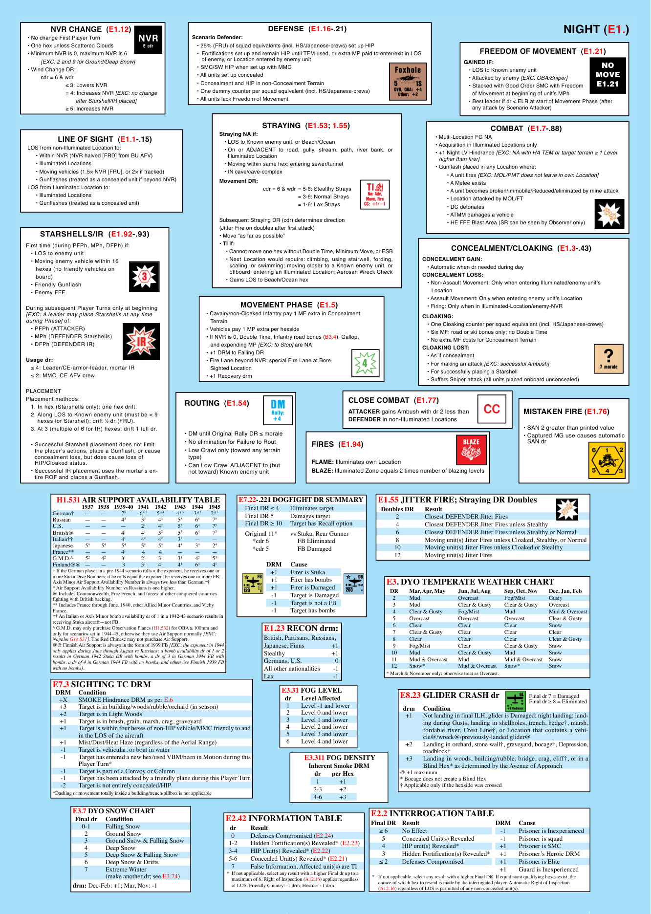

```text
                             DEFENSE  (E1.16-.21)                                                                                              NIGHT (E1.)
Scenario Defender:
  • 25% (FRU) of squad equivalents (incl. HS/Japanese-crews) set up HIP                                        FREEDOM OF MOvEMENT  (E1.21)
  •  Fortifications set up and remain HIP until TEM used, or extra MP paid to enter/exit in LOS
    of enemy, or Location entered by enemy unit                                                          GAINED IF:
  • SMC/SW HIP when set up with MMC                                                                                                                           NO
                                                                                                           • LOS to Known enemy unit                        MOVE
  • All units set up concealed                                                                             • Attacked by enemy [EXC: OBA/Sniper]
  • Concealment and HIP in non-Concealment Terrain                                                         • Stacked with Good Order SMC with Freedom       E1.21
  • One dummy counter per squad equivalent (incl. HS/Japanese-crews)                                        of Movement at beginning of unit’s MPh
  • All units lack Freedom of Movement.                                                                    • Best leader if dr < ELR at start of Movement Phase (after
                                                                                                            any attack by Scenario Attacker)
                           STRAYING  (E1.53; 1.55)                                                                 cOMbAT  (E1.7-.88)
           Straying NA if:                                                                    • Multi-Location FG NA
            • LOS to Known enemy unit, or Beach/Ocean                                         • Acquisition in Illuminated Locations only
            • On or ADJACENT to road, gully, stream, path, river bank, or                     • +1 Night LV Hindrance [EXC: NA with HA TEM or target terrain ≥ 1 Level
              Illuminated Location                                                             higher than firer]
            • Moving within same hex; entering sewer/tunnel                                   • Gunflash placed in any Location where:
            • IN cave/cave-complex                                                                • A unit fires [EXC: MOL/PIAT does not leave in own Location]
           Movement DR:                                                                           • A Melee exists
                          cdr = 6 & wdr = 5-6: Stealthy Strays                                    • A unit becomes broken/Immobile/Reduced/eliminated by mine attack
                                     = 3-6: Normal Strays                                         • Location attacked by MOL/FT
                                     = 1-6: Lax Strays                                            • DC detonates
                                                                                                  • ATMM damages a vehicle
           Subsequent Straying DR (cdr) determines direction                                      • HE FFE Blast Area (SR can be seen by Observer only)
           (Jitter Fire on doubles after first attack)
           • Move “as far as possible”
           • TI if:                                                                                 cONcEAlMENT/clOAKING  (E1.3-.43)
             • Cannot move one hex without Double Time, Minimum Move, or ESB
             • Next Location would require: climbing, using stairwell, fording,          cONcEAlMENT GAIN:
              scaling, or swimming; moving closer to a Known enemy unit, or                • Automatic when dr needed during day
              offboard; entering an Illuminated Location; Aerosan Wreck Check            cONcEAlMENT lOSS:
             • Gains LOS to Beach/Ocean hex                                                • Non-Assault Movement: Only when entering Illuminated/enemy-unit’s
                                                                                            Location
                                                                                           • Assault Movement: Only when entering enemy unit’s Location
                   MOvEMENT PHASE  (E1.5)                                                  • Firing: Only when in Illuminated-Location/enemy-NVR
     • Cavalry/non-Cloaked Infantry pay 1 MF extra in Concealment                        clOAKING:
       Terrain                                                                             • One Cloaking counter per squad equivalent (incl. HS/Japanese-crews)
     • Vehicles pay 1 MP extra per hexside                                                 • Six MF; road or ski bonus only; no Double Time
     • If NVR is 0, Double Time, Infantry road bonus (B3.4), Gallop,                       • No extra MF costs for Concealment Terrain
       and expending MP [EXC: to Stop] are NA                                            clOAKING lOST:
     • +1 DRM to Falling DR                                                                • As if concealment
     • Fire Lane beyond NVR; special Fire Lane at Bore                                     • For making an attack [EXC: successful Ambush]
       Sighted Location                                                                    • For successfully placing a Starshell
     • +1 Recovery drm                                                                     • Suffers Sniper attack (all units placed onboard unconcealed)
```

```text
        NvR cHANGE  (E1.12)
• No change First Player Turn
• One hex unless Scattered Clouds
• Minimum NVR is 0, maximum NVR is 6
     [EXC: 2 and 9 for Ground/Deep Snow]
• Wind Change DR:
     cdr = 6 & wdr
            ≤ 3: Lowers NVR
            = 4: Increases NVR [EXC: no change
             after Starshell/IR placed]
            ≥ 5: Increases NVR
```

```text
            lINE OF SIGHT  (E1.1-.15)
LOS from non-Illuminated Location to:
   • Within NVR (NVR halved [FRD] from BU AFV)
   • Illuminated Locations
   • Moving vehicles (1.5× NVR [FRU], or 2× if tracked)
   • Gunflashes (treated as a concealed unit if beyond NVR)
LOS from Illuminated Location to:
   • Illuminated Locations
   • Gunflashes (treated as a concealed unit)
```

```text
     STARSHEllS/IR  (E1.92-.93)
First time (during PFPh, MPh, DFPh) if:
  • LOS to enemy unit
  • Moving enemy vehicle within 16
    hexes (no friendly vehicles on
    board)
  • Friendly Gunflash
  • Enemy FFE
During subsequent Player Turns only at beginning
[EXC: A leader may place Starshells at any time
during Phase] of:
  • PFPh (ATTACKER)
  • MPh (DEFENDER Starshells)
  • DFPh (DEFENDER IR)
Usage dr:
 ≤ 4: Leader/CE-armor-leader, mortar IR
 ≤ 2: MMC, CE AFV crew
PLACEMENT
Placement methods:
  1. In hex (Starshells only); one hex drift.
  2. Along LOS to Known enemy unit (must be < 9
  hexes for Starshell); drift ^1⁄2 dr (FRU).
  3. At 3 (multiple of 6 for IR) hexes; drift 1 full dr.
  • Successful Starshell placement does not limit
   the placer’s actions, place a Gunflash, or cause
   concealment loss, but does cause loss of
   HIP/Cloaked status.
  • Successful IR placement uses the mortar’s en-
   tire ROF and places a Gunflash.
```

```text
ROUTING  (E1.54)
• DM until Original Rally DR ≤ morale
• No elimination for Failure to Rout
• Low Crawl only (toward any terrain
 type)
• Can Low Crawl ADJACENT to (but
 not toward) Known enemy unit
```

```text
            clOSE cOMbAT  (E1.77)
            ATTAcKER gains Ambush with dr 2 less than
            DEFENDER in non-Illuminated Locations
FIRES  (E1.94)
FlAME: Illuminates own Location
blAZE: Illuminated Zone equals 2 times number of blazing levels
```

```text
MISTAKEN FIRE (E1.76)
• SAN 2 greater than printed value
• Captured MG use causes automatic
 SAN dr
```

```text
  h1.531 air support availability table                                 e7.22-.221 dogfight dr summary                        e1.55 Jitter fire; straying dr doubles
German†       —       —          7^5          6*^5       5*^4        4*^3       3*^3       2*^3  1937   1938   1939-40   1941    1942      1943    1944    1945  Final DR ≤ 4  Eliminates target  doubles dr       result
Russian          —       —          4^3           3^3         4^3          5^5         6^5         7^5  Final DR 5  Damages target  2                Closest DEFENDER Jitter Fires
U.S.               —       —          —          2^1         4^2          5^3         6^4         7^5  Final DR ≥ 10  Target has Recall option  4                Closest DEFENDER Jitter Fires unless Stealthy
British@        —       —          4^1           4^1         5^2          5^3         6^4         7^5  Original 11*  vs Stuka; Rear Gunner  6                Closest DEFENDER Jitter Fires unless Stealthy or Normal
Italian††        —       —          4^1           4^2         4^2          3^2         —        —  *cdr 6                  FB Eliminated  8                Moving unit(s) Jitter Fires unless Cloaked, Stealthy, or Normal
Japanese         5^4        5^4           5^4           5^4         5^4          4^4         3^4         2^4  *cdr 5                  FB Damaged  10               Moving unit(s) Jitter Fires unless Cloaked or Stealthy
France**       —       —          4^1           4          4           —        —        —  G.M.D.^         5^2        4^2           3^1           2^1         3^1          3^1         4^2         5^3  12               Moving unit(s) Jitter Fires
Finland@@   —       —           3           3^1         4^1          4^1         6^4         4^1  drm     Cause
† If the German player in a pre-1944 scenario rolls < the exponent, he receives one or  +1        Firer is Stuka
more Stuka Dive Bombers; if he rolls equal the exponent he receives one or more FB.  +1        Firer has bombs                    e3. dyo temperate weather Chart
Axis Minor Air Support Availability Number is always two less than German.††         +1        Firer is Damaged
* Air Support Availability Number vs Russians is one higher.                                                                      dr        mar, apr, may         Jun, Jul, aug          sep, oct, nov        dec, Jan, feb
@ Includes Commonwealth, Free French, and forces of other conquered countries        -1        Target is Damaged                  2         Mud               Overcast                  Fog/Mist                Gusty
fighting with British backing.                                                       -1        Target is not a FB
** Includes France through June, 1940, other Allied Minor Countries, and Vichy                                                    3         Mud               Clear & Gusty         Clear & Gusty        Overcast
France.                                                                              -1        Target has bombs                   4         Clear & Gusty           Fog/Mist                  Mud  Mud & Overcast
†† An Italian or Axis Minor bomb availability dr of 1 in a 1942-43 scenario results in                                            5         Overcast          Overcast                  Overcast                 Clear & Gusty
receiving Stuka aircraft—not FB.                                                                                                  6         Clear             Clear             Clear            Snow
^ G.M.D. may only purchase Observation Planes (H1.532) for OBA ≥ 100mm and        e1.23 reCon drm:                                7         Clear & Gusty           Clear       Clear            Clear
only for scenarios set in 1944-45, otherwise they use Air Support normally [EXC:  British, Partisans, Russians,
Napalm G18.831]. The Red Chinese may not purchase Air Support.                                                                    8         Clear             Clear             Clear            Clear & Gusty
@@ Finnish Air Support is always in the form of 1939 FB [EXC: the exponent in 1944  Japanese, Finns                 +1            9         Fog/Mist                    Clear   Clear & Gusty        Snow
only applies during June through August vs Russians; a bomb availability dr of 1 or 2  Stealthy             +1                    10        Mud               Clear & Gusty         Mud          Snow
results in German 1942 Stuka DB with bombs, a dr of 3 in German 1944 FB with      Germans, U.S.               0                   11         Mud & Overcast       Mud           Mud & Overcast    Snow
bombs, a dr of 4 in German 1944 FB with no bombs, and otherwise Finnish 1939 FB                                                   12        Snow*             Mud & Overcast     Snow*           Snow
with no bombs].                                                                   All other nationalities        -1
                                                                                  Lax                        -1                   * March & November only; otherwise treat as Overcast.
e7.3 sighting tC drm                                                                     e3.31 fog level
 drm      Condition                                                                                                                    e8.23 glider Crash dr              Final dr 7 = Damaged
   +X     SMOKE Hindrance DRM as per E.6                                                 dr      level affected                                                                          Final dr ≥ 8 = Eliminated
   +3     Target is in building/woods/rubble/orchard (in season)                         1       Level -1 and lower                     drm     Condition
   +2     Target is in Light Woods                                                       2       Level 0 and lower                       +1     Not landing in final ILH; glider is Damaged; night landing; land-
   +1     Target is in brush, grain, marsh, crag, graveyard                              3       Level 1 and lower                              ing during Gusts, landing in shellholes, trench, hedge†, marsh,
   +1     Target is within four hexes of non-HIP vehicle/MMC friendly to and             4       Level 2 and lower                              fordable river, Crest Line†, or Location that contains a vehi-
          in the LOS of the aircraft                                                     5       Level 3 and lower                              cle@/wreck@/previously-landed glider@
   +1     Mist/Dust/Heat Haze (regardless of the Aerial Range)                           6       Level 4 and lower                       +2     Landing in orchard, stone wall†, graveyard, bocage†, Depression,
   -1     Target is vehicular, or boat in water                                                                                                 roadblock†
   -1     Target has entered a new hex/used VBM/been in Motion during this                        e3.311 fog density                     +3     Landing in woods, building/rubble, bridge, crag, cliff†, or in a
          Player Turn*                                                                             inherent smoke drm                           Blind Hex* as determined by the Avenue of Approach
   -1     Target is part of a Convoy or Column                                               dr       per hex                          @ +1 maximum
   -1     Target has been attacked by a friendly plane during this Player Turn               1            +1                           * Bocage does not create a Blind Hex
   -2     Target is not entirely concealed/HIP                                                       2-3       +2                      † Applicable only if the hexside was crossed
*Dashing or movement totally inside a building/trench/pillbox is not applicable                      4-6       +3
        e3.7 dyo snow Chart                                        e2.42 information table                                  e2.2 interrogation table
        final dr     Condition                                                                                              final dr   result                               drm     Cause
           0-1       Falling Snow                                   dr         result                                       ≥ 6         No Effect                             -1        Prisoner is Inexperienced
            2        Ground Snow                                    0          Defenses Compromised (E2.24)                 5          Concealed Unit(s) Revealed                -1        Prisoner is squad
         3           Ground Snow & Falling Snow                     1-2        Hidden Fortification(s) Revealed* (E2.23)    4          HIP unit(s) Revealed*                  +1       Prisoner is SMC
         4           Deep Snow                                      3-4        HIP Unit(s) Revealed* (E2.22)
         5           Deep Snow & Falling Snow                       5-6        Concealed Unit(s) Revealed* (E2.21)          3          Hidden Fortification(s) Revealed*      +1       Prisoner’s Heroic DRM
         6           Deep Snow & Drifts                             7          False Information. Affected unit(s) are TI   ≤ 2         Defenses Compromised                  +1       Prisoner is Elite
         7           Extreme Winter                                                                                                                                           +1       Guard is Inexperienced
                     (make another dr; see E3.74)                   * If not applicable, select any result with a higher Final dr up to a  * If not applicable, select any result with a higher Final DR. If equidistant qualifying hexes exist, the
                                                                      maximum of 6. Right of Inspection (A12.16) applies regardless  choice of which hex to reveal is made by the interrogated player. Automatic Right of Inspection
        drm: Dec-Feb: +1; Mar, Nov: -1                                of LOS. Friendly Country: -1 drm; Hostile: +1 drm        (A12.16) regardless of LOS is permitted of any non-concealed unit(s).
```
