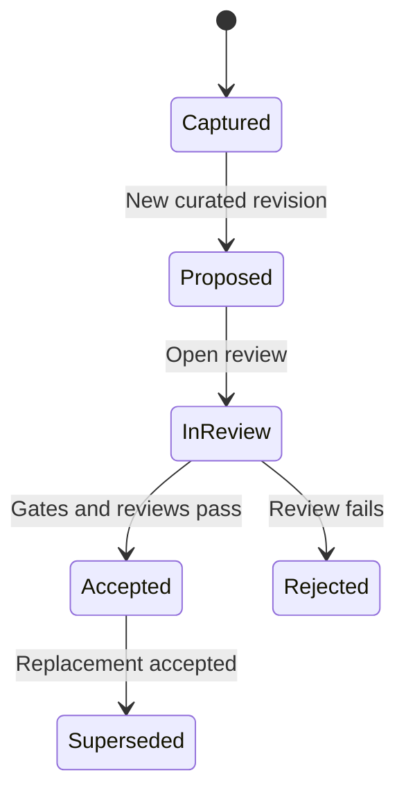

# LimboDancer.Agentic.CognitiveRuntime ASL-OT-03 Validation and Review Workflow Design

**Status:** Accepted; ASL-OT-03.1 through ASL-OT-03.3 implemented; ASL-OT-03.4 captured-evidence and curated-submission foundations in progress

**Date:** 2026-09-23

**Branch:** `decision-plane`

**Implementation language:** C# on the repository's current .NET baseline

**Governing authority:** ASL Ontology Transformation Specification, Domain Integration Model, ASL-OT-01 Source Registry Review, and ASL-OT-02 TIR Review

## 1. Purpose

This document defines `ASL-OT-03`: the deterministic validation and human-review workflow between captured TIR structure and later semantic curation.

ASL-OT-03 answers five questions:

1. What exact artifact revision is being validated or reviewed?
2. Which automated gates passed or failed for that revision?
3. Which source fragments and visual dependencies were verified against the authoritative edition?
4. Who proposed, reviewed, rejected, or adjudicated the artifact, and why?
5. What evidence permits an artifact to advance beyond `captured` without confusing confidence with authority?

The governing rule is:

> Validation establishes that declared invariants hold. Review establishes an accountable human disposition. Neither extraction confidence nor validation alone grants semantic authority.

ASL-OT-03 is an offline ASL authoring capability. It does not run inside a live Goal invocation, publish a domain package, resolve runtime semantics, produce a `DomainConclusion`, or authorize execution.

## 2. Architectural position

The accepted authoring sequence remains:

```text
registered source
-> immutable source fragments
-> captured structural TIR
-> exact validation subject
-> deterministic validation reports
-> source verification and semantic review
-> immutable review/adjudication records
-> accepted authoring artifacts
-> ASL-OT-05 publication
```

ASL-OT-03 owns validation and review evidence inside the ASL authoring boundary. It does not add review types or services to `LimboDancer.Abstractions` or `LimboDancer.Runtime`. Removing `src/ASL/` must continue to leave the runtime kernel buildable.

The first implementation belongs in the existing `src/ASL/LimboDancer.Domains.Asl.Authoring` library, CLI, and test solution. It should use base-class-library facilities unless a new dependency is separately justified.

## 3. Inputs and outputs

### 3.1 Inputs

Every validation or review operation consumes exact immutable inputs:

- TIR schema identifier and version;
- canonical TIR document SHA-256;
- source-registry identity, digest, and pinned source commit;
- subject artifact identity;
- canonical subject-artifact SHA-256;
- extractor identity, version, and configuration digest;
- applicable validation policy identity and digest;
- required source fragments and dependency hashes; and
- prior review records when a transition depends on history.

An operation must fail closed if any referenced bytes, identity, version, or digest cannot be reproduced.

### 3.2 Outputs

ASL-OT-03 produces immutable, canonical, hash-addressed authoring records:

- `ValidationReport` with deterministic findings and gate results;
- `SourceVerificationRecord` for authoritative-edition comparison;
- `ReviewRecord` for a requested review-state transition;
- `AdjudicationRecord` when material reviewer disagreement requires resolution;
- `DiagnosticDispositionRecord` for an extracted or validation diagnostic;
- `ReviewBundle` that binds the exact subject, reports, records, and computed effective state; and
- a representative committed review bundle used for conformance testing.

These records are evidence about an artifact revision. They do not overwrite the captured TIR document.

## 4. Immutable subject identity

`artifactId` is the stable authoring identity of an artifact. It is not sufficient to identify the exact revision reviewed because payload, dependencies, formalization, or review metadata may change while the authoring identity remains stable.

Every review subject therefore uses this compound identity:

| Field | Meaning |
| --- | --- |
| `tirDocumentSha256` | Canonical digest of the containing TIR document. |
| `artifactId` | Stable authoring identity. |
| `artifactSha256` | Canonical digest of the exact artifact snapshot. |
| `schemaId` | Schema governing the snapshot. |
| `packageCandidate` | Candidate package identity, not a published package reference. |

Changing any subject bytes produces a new `artifactSha256`. Existing validation and review records remain attached to the old subject and cannot be transferred silently. A materially corrected interpretation creates a new curated artifact or revision with explicit provenance; it does not rewrite extraction history.

## 5. Record identity and canonicalization

Every ASL-OT-03 record must contain:

- a schema identifier and version;
- a stable record kind;
- the exact subject reference;
- UTC `createdAt` plus a declared timestamp source;
- actor identity and role;
- tool identity, version, and configuration digest where automation participates;
- the record payload;
- references to prerequisite records;
- canonicalization profile identity and version; and
- a SHA-256 derived from canonical content excluding the digest field itself.

Arrays that carry sequence, such as state-transition history and reviewer rationale evidence, retain order. Sets, such as finding identifiers and prerequisite record references, are sorted canonically. Free-form rationale is preserved exactly and is never used as an executable expression.

Actor identity is an attestation in the first implementation. A string identity does not claim cryptographic authentication or organizational authorization. Signing and identity-provider integration require a later explicit security design.

## 6. Separation of immutable evidence and effective state

Captured TIR artifacts remain `origin: extracted`, `formalizationStatus: unmodeled`, and `reviewStatus: captured`. ASL-OT-03 must not mutate them to simulate workflow progress.

Effective state is a deterministic projection over:

1. the exact subject snapshot;
2. ordered immutable review and adjudication records;
3. applicable validation reports;
4. source-verification records; and
5. unresolved blocking findings.

Later semantic authoring may create curated or derived artifact snapshots whose envelopes materialize `proposed`, `in-review`, `accepted`, `rejected`, or `superseded`. Each materialized status must be backed by the exact review-record references used to derive it.

The ledger is authoritative for review history. A materialized envelope status is a reproducible projection, not an independently editable flag.

## 7. Roles and authority

| Role | May do | Must not do |
| --- | --- | --- |
| Extractor | Produce captured structural TIR and diagnostics. | Verify source fidelity, propose semantics, or accept artifacts. |
| Validator | Run deterministic gates and emit findings. | Change artifacts, waive findings, or grant acceptance. |
| Source verifier | Compare exact fragments and visual dependencies with the authoritative edition. | Infer semantic meaning merely from source fidelity. |
| Semantic author | Create a curated or derived proposal with exact provenance. | Solely approve the proposal they authored. |
| Domain reviewer | Evaluate source support, semantic fidelity, completeness, and declared limitations. | Rewrite extraction history or accept a different artifact revision. |
| Adjudicator | Resolve a recorded material disagreement and state the governing rationale. | Erase dissenting records or modify the reviewed subject. |
| Release approver | Later authorize an immutable package publication after all gates pass. | Publish during ASL-OT-03 or bypass artifact review. |

One person may hold more than one role in a small project, but the records must identify the role exercised. A semantic author cannot be the sole accepting domain reviewer of the same subject. A material dispute requires an adjudication record distinct from the conflicting review records.

## 8. Review-state model

The artifact review vocabulary remains:

- `captured` — mechanically extracted structure with no semantic proposal;
- `proposed` — an immutable curated or derived revision has been submitted for review;
- `in-review` — review has started against an exact subject digest;
- `accepted` — all applicable gates and required human dispositions pass for that exact revision;
- `rejected` — the exact revision is unsuitable, with rationale retained; and
- `superseded` — a formerly accepted revision has been replaced by another accepted revision with an explicit relationship.



Rules for the state projection:

1. Extracted artifacts remain `captured`; `captured -> proposed` means creation of a new proposal revision, not mutation of extracted evidence.
2. Content changes during review create a new subject digest and a new `proposed` review sequence.
3. `accepted` is terminal for that exact content. Corrections require a replacement revision.
4. `rejected` records remain auditable. A corrected proposal is new evidence, not a reopening that erases rejection.
5. `superseded` requires an accepted replacement and an explicit replacement reference.
6. Confidence never changes state.
7. Automated validation never creates an `accepted` transition.
8. A transition unsupported by its prerequisites is invalid rather than best-effort.

## 9. Formalization status

Formalization status is independent of review status:

| Status | Meaning |
| --- | --- |
| `unmodeled` | No executable semantic claim has been formalized. |
| `partial` | Some semantics are formalized, while identified source meaning remains outside the model. |
| `validated` | The declared semantic model passes all applicable deterministic semantic gates for the exact revision. |

`validated` does not mean `accepted`; a human review is still required. `accepted` does not imply that every attached source fragment is fully formalized. An accepted `partial` artifact must enumerate its unmodeled coverage and cannot support a definitive conclusion that depends on that missing meaning.

Scenario A1 artifacts used to produce definitive occupied-building entry conclusions must be both `formalizationStatus: validated` and `reviewStatus: accepted` for all semantics in the evaluation dependency closure.

## 10. Validation pipeline

Validation is deterministic for an exact subject, input set, policy version, and validator configuration.

### Gate 1: Input and schema integrity

- schema identifiers and versions are supported exactly;
- document, artifact, registry, source, fragment, and dependency digests reproduce;
- canonicalization profiles are recognized; and
- required records are present and internally consistent.

### Gate 2: Identity integrity

- stable and published identities are preserved;
- normalized identities are unique within declared scope;
- aliases resolve uniquely or remain explicitly ambiguous;
- subject and dependency references identify exact revisions; and
- no storage key, C# type, or provider syntax masquerades as semantic identity.

### Gate 3: Structural integrity

- required parents exist and hierarchy is acyclic;
- dependency targets exist and kinds are compatible;
- references resolve or retain explicit unresolved findings;
- examples remain distinguishable from normative artifacts;
- table claims do not exceed reviewed table structure; and
- required source and visual dependencies are closed.

### Gate 4: Source and provenance integrity

- every proposal traces to captured artifacts and registered source fragments;
- every derived artifact identifies all inputs and transformation identities;
- rule-critical fragments and required visuals have passing source-verification records;
- corrected or normalized text never replaces original evidence silently; and
- model-produced proposals retain model, prompt/schema, and configuration provenance.

### Gate 5: Semantic integrity

- semantic expression operators and operands are declared and type compatible;
- conditions, effects, restrictions, and exceptions identify governing artifacts;
- exception targets and precedence have source or curated policy support;
- enumerations claim closure only with evidence;
- conflicts and ambiguity remain explicit; and
- partial or unmodeled meaning cannot produce a definitive evaluation path.

This gate is implemented only as ASL-OT-04 introduces the corresponding semantic kinds and operators. ASL-OT-03 defines the contract and test fixtures first.

### Gate 6: Review integrity

- every state transition is legal for the exact subject digest;
- required role dispositions are present;
- the author is not the sole accepting reviewer;
- material disagreement has an adjudication record;
- blocking findings have valid dispositions; and
- accepted and superseded histories remain complete.

### Gate 7: Architecture and authority integrity

- ASL authoring dependencies remain outside the runtime kernel;
- no accepted authoring artifact becomes published implicitly;
- no record claims a `DomainPackageRef` before ASL-OT-05;
- no `DomainConclusion` or action authority is created; and
- no provider-specific projection becomes canonical evidence.

## 11. Findings and diagnostic disposition

Validation findings and extracted TIR diagnostics share a disposition workflow but retain their original codes, severities, sources, and messages.

Each disposition records:

- exact diagnostic or finding identity;
- exact subject and report digest;
- disposition: `resolved`, `not-applicable`, `deferred`, or `accepted-limitation`;
- rationale;
- evidence references;
- actor identity and reviewer role;
- UTC timestamp and timestamp source; and
- replacement or tracking reference when applicable.

`resolved` requires changed evidence or a new exact subject on which the finding no longer occurs. It cannot relabel the original finding as absent. `not-applicable` requires a deterministic scope reason. `deferred` keeps the finding open outside the current acceptance scope. `accepted-limitation` records a known gap but does not permit a definitive result that depends on it.

Blocking behavior is policy-driven and fail-closed:

- every error blocks acceptance;
- a warning blocks acceptance when it lies in the subject's dependency or evaluation closure;
- a deferred or accepted limitation blocks any definitive use that traverses it; and
- informational findings do not block unless an applicable policy promotes them.

The 32 missing-reference diagnostics in the approved ASL-OT-02 corpus enter ASL-OT-03 as open findings. They must be classified individually. They need not all resolve before Scenario A1, but any one in Scenario A1's dependency closure blocks acceptance or definitive adjudication until resolved or shown not applicable to that scope.

## 12. Source verification

Source verification compares the exact extracted evidence with the authoritative ASL edition. It is separate from structural extraction and semantic review.

A `SourceVerificationRecord` contains:

- fragment identity and content hash;
- optional exact UTF-8 sub-fragment span;
- registered edition, source path, page range, and source digest;
- every required figure/table dependency and digest;
- comparison method;
- disposition: `verified`, `mismatch`, `dependency-missing`, or `indeterminate`;
- observed discrepancy without modifying original content;
- verifier identity and role;
- UTC timestamp and timestamp source; and
- references to correction proposals when needed.

Only `verified` satisfies a source-verification gate. A mismatch creates a correction proposal or source-registry change through an explicit later revision. It never causes silent repair of the Markdown, fragment, or accepted record.

The first ASL-OT-03 implementation may use operator-entered verification records. It must validate their structure and transition effects but must not claim that identity or source access was independently authenticated.

## 13. Review and adjudication records

A `ReviewRecord` contains:

- exact subject identity;
- prior effective state and requested next state;
- review role and actor identity;
- disposition: `approve`, `reject`, `request-changes`, or `abstain`;
- source-verification records considered;
- validation reports and diagnostic dispositions considered;
- reviewed dependency closure;
- rationale and evidence references;
- UTC timestamp and timestamp source; and
- record digest.

An `AdjudicationRecord` additionally contains:

- the conflicting review-record references;
- the disputed questions;
- the governing source and policy evidence;
- disposition and rationale;
- any required replacement proposal; and
- the exact transition, if any, that the adjudication authorizes.

Adjudication resolves workflow disposition. It does not make unsupported semantic meaning true. If evidence remains insufficient, the result is rejection, requested changes, or an accepted limitation that cannot support definitive use.

## 14. Acceptance gate

An exact artifact revision may become effectively `accepted` only when all applicable conditions hold:

1. input, identity, structural, provenance, semantic, review, and authority gates pass;
2. the artifact kind and intended use determine an explicit validation policy;
3. required source fragments and visual dependencies are verified;
4. no blocking diagnostic or validation finding remains in its dependency closure;
5. formalization status is sufficient for the declared use;
6. at least one qualified domain-review approval exists;
7. the semantic author is not the sole accepting reviewer;
8. every material disagreement is adjudicated;
9. the accepted transition targets the exact reviewed artifact digest; and
10. the complete record set reproduces its canonical review-bundle digest.

Acceptance remains authoring authority only. The artifact is unavailable to the runtime until ASL-OT-05 publishes an immutable package and the Host registers its exact `DomainPackageRef`.

## 15. Review bundle

A canonical `ReviewBundle` is the portable handoff between authoring stages. It contains:

- bundle schema and canonicalization versions;
- exact package candidate;
- TIR document and subject references;
- validation policy identity and digest;
- validation-report references;
- source-verification references;
- review, diagnostic-disposition, and adjudication references;
- computed effective formalization and review state;
- open and blocking finding references;
- coverage and declared-use scope;
- creation metadata; and
- bundle SHA-256.

The bundle contains records or content-addressed references sufficient to reproduce its state projection. Missing referenced records make the bundle invalid. A bundle is not a published package manifest.

## 16. C# implementation boundary

The first implementation should add ASL-owned types and concrete services such as:

- `TirReviewSubjectReference`;
- `TirValidationPolicy`;
- `TirValidationReport` and `TirValidationFinding`;
- `TirSourceVerificationRecord`;
- `TirDiagnosticDispositionRecord`;
- `TirReviewRecord`;
- `TirAdjudicationRecord`;
- `TirReviewBundle`;
- `TirStructuralValidator`;
- `TirReviewStateProjector`; and
- canonical JSON writers and digest calculators for each record family.

Names may be refined during implementation, but responsibilities must remain separate. Do not create a generalized runtime validation framework, repository abstraction, database schema, web service, or operator UI in this slice. The CLI may expose narrowly scoped offline commands after the record schemas are implemented.

All repository-owned implementation code and tests must be C#. Python may be used only as disposable development scaffolding and must not become an ASL-OT-03 source, build, test, or runtime dependency. `utils/pdf_to_markdown.py` remains outside this authoring implementation.

## 17. Persistence and concurrency decision

ASL-OT-03 defines canonical files and hashes, not a persistence product. Initial records and representative bundles may be committed JSON artifacts generated by the C# CLI.

Database selection, multi-user locking, distributed transactions, authenticated identity, digital signatures, and operator-console workflows are deferred until a concrete collaboration or publication requirement justifies them. An implementation must not disguise ordinary files or in-memory collections behind speculative repository interfaces.

Concurrent edits are resolved through exact subject and predecessor digests. A record based on a stale subject or review history is rejected; it is not merged implicitly.

## 18. Test requirements

The C# conformance suite must prove:

- canonical subject digests change with any reviewed artifact byte change;
- validation reports reproduce for identical subject, policy, and configuration inputs;
- unsupported schema, policy, or canonicalization versions fail closed;
- missing or changed prerequisite records invalidate a review bundle;
- captured extracted artifacts cannot be mutated into proposed or accepted artifacts;
- content changes reset review to a new proposed subject;
- illegal review-state transitions fail;
- validation alone cannot accept an artifact;
- confidence cannot advance review state;
- a semantic author cannot be the sole accepting reviewer;
- rejected records remain auditable;
- supersession requires an accepted replacement;
- source verification pins exact fragments, spans, dependencies, and source digests;
- source mismatches cannot be silently corrected;
- open errors block acceptance;
- warnings in an acceptance dependency closure block until validly dispositioned;
- deferred findings cannot support definitive evaluation;
- material disagreement requires adjudication;
- review-bundle effective state is independent of input enumeration order where order is not semantic;
- ASL authoring remains isolated from runtime projects; and
- generated review artifacts reproduce in the supported CI environment.

## 19. Implementation increments

The review workflow should be implemented in small, independently testable increments:

1. **ASL-OT-03.1 — Record schemas and canonical identity:** define review subjects, validation findings, immutable records, canonical JSON, and digests.
2. **ASL-OT-03.2 — Structural validation:** implement the deterministic input, identity, hierarchy, reference, provenance, and architecture gates applicable to TIR 1.3.
3. **ASL-OT-03.3 — Source verification and diagnostic disposition:** add exact source-comparison records and fail-closed finding policy.
4. **ASL-OT-03.4 — Review-state projection and acceptance gate:** implement legal transitions, role separation, adjudication, and review bundles.
5. **ASL-OT-03.5 — Conformance review:** commit a representative review bundle, run the full corpus through applicable validators, and approve the gate into ASL-OT-04.

Semantic artifact kinds and Scenario A1 meaning remain ASL-OT-04 work. ASL-OT-03 may use synthetic semantic fixtures to prove workflow gates but must not claim those fixtures as accepted ASL semantics.

### 19.1 Implemented foundation

ASL-OT-03.1 is implemented as the narrow record and identity foundation for the later workflow increments:

- `Schemas/asl-tir-review-record-1.0.schema.json` defines the immutable validation-report, source-verification, diagnostic-disposition, review, and adjudication record family;
- ASL-owned C# records represent the exact review subject, actors, tools, policies, findings, gate results, decisions, and record payloads;
- the review subject binds the canonical TIR document digest, stable artifact identity, canonical artifact digest, TIR schema, and package candidate;
- canonical C# serialization produces `asl-tir-review:sha256:` record identities and lowercase SHA-256 payload digests;
- deterministic finding identities bind the exact subject, validation policy, gate, code, optional artifact, and evidence set;
- set-valued collections sort ordinally, while reviewer rationale evidence retains supplied order because that order can carry explanatory meaning; and
- serialization fails closed for unsupported subject schemas, invalid identities or hashes, non-UTC timestamps, duplicate set members, invalid role-to-record combinations, and internally inconsistent validation findings.

At its completion, this increment did not implement validators, verify source content, apply diagnostic dispositions, project review state, enforce transitions, or create a review bundle. Those behaviors were assigned to ASL-OT-03.2 through ASL-OT-03.5. A representative bundle remains deliberately deferred until ASL-OT-03.4 supplies the state projection it must prove.

### 19.2 Implemented structural validation

ASL-OT-03.2 implements the deterministic C# `TirStructuralValidator` for the exact TIR 1.3 subject selected from a containing document. Its versioned `asl-tir-1.3-structural` policy produces the immutable validation-report records introduced by ASL-OT-03.1.

The input boundary first requires the TIR schema, canonicalization profile, hashes, artifact types, captured authority state, and canonical payload to be valid. If those prerequisites fail, validation fails before a report can claim an exact subject. For an admitted subject, the validator:

- reproduces artifact identities and detects normalized-identity collisions within artifact-kind scope;
- checks hierarchy basis, parent existence and kind, sibling order, candidate/missing/ambiguous relationships, and cycles;
- checks artifact-dependency closure, resolved and unresolved cross-reference consistency, example targets, and table-note fragment references;
- binds artifact creator identity and source revision to the containing extractor and source registry;
- requires evidence to resolve to a matching registered source-fragment artifact with compatible hashes and bounds;
- confirms that captured TIR has not claimed semantic, review, publication, conclusion, or action authority; and
- emits deterministic findings and explicit results for all seven gates, marking semantic and review validation `notApplicable` until their owning increments exist.

Warnings and errors both fail their applicable structural gate; later disposition and acceptance policy must decide whether a finding blocks a declared use. The validator never repairs source material, mutates captured TIR, changes formalization or review status, verifies authoritative source content, or grants acceptance. At completion of 03.2, source comparison and diagnostic disposition remained assigned to ASL-OT-03.3; transition legality and review bundles remain ASL-OT-03.4.

### 19.3 Implemented source verification and diagnostic disposition

ASL-OT-03.3 implements exact source-evidence attestation and fail-closed finding disposition in C#. Because the 03.1 record schema did not yet carry the complete edition, path, page, dependency-hash, and finding-severity evidence required by this design, this increment preserves schema 1.0 unchanged and introduces `Schemas/asl-tir-review-record-1.1.schema.json`. The canonical review writer now emits schema and canonicalization version 1.1.

`TirSourceVerificationService` constructs a source-verification record only after it proves that:

- the supplied source registry identity, canonical digest, and source commit reproduce the exact TIR document reference;
- the fragment belongs to the selected artifact and reproduces its registered source identity, source hash, content hash, line bounds, and optional UTF-8 sub-fragment bounds;
- edition, source path, source-artifact digest, and page range remain explicit in the record;
- required figure and table dependencies resolve to pinned registry artifacts and retain their SHA-256 digests; and
- a missing dependency uses `dependencyMissing`, while `verified` cannot conceal missing evidence.

The comparison disposition remains an operator attestation. The implementation validates the evidence bound by that attestation but does not independently authenticate the operator, obtain the authoritative edition, or infer that matching converted Markdown alone proves authoritative fidelity. A mismatch requires discrepancy details and a correction-proposal reference; any other non-verified disposition requires explicit discrepancy or indeterminacy details.

`TirDiagnosticIdentity` gives every extracted diagnostic a deterministic `asl-tir-diagnostic:sha256:` identity bound to the exact subject, original code, severity, artifact association, and message. `TirDiagnosticDispositionService` creates dispositions for either an extracted diagnostic or a validation finding, retaining severity and pinning validation findings to their exact report record. The canonical contract enforces these rules:

- extracted diagnostics cannot claim a validation-report reference;
- validation findings must claim their exact report reference;
- `resolved` requires supporting evidence and a changed-evidence or replacement-subject reference;
- `notApplicable` and `acceptedLimitation` require supporting evidence; and
- `deferred` and `acceptedLimitation` remain open and block definitive use.

Disposition records never remove or rewrite the original diagnostic or validation finding. Whether a valid disposition permits a review-state transition remains ASL-OT-03.4 work; this increment does not project state, accept an artifact, or create a review bundle.

### 19.4 Captured-evidence projection foundation (partial ASL-OT-03.4)

The C# `TirReviewStateProjector` and versioned `Schemas/asl-tir-review-bundle-1.0.schema.json` introduce a canonical, hash-addressed bundle for an exact **captured TIR 1.3 artifact**. Bundle generation recomputes the document and artifact digests, validates record subjects and identities, closes prerequisite references and detects cycles, checks validation-policy and finding/disposition bindings, and derives open and blocking findings. Canonical serialization embeds the review records, pins the external TIR document by digest, sorts unordered coverage and record sets, and reprojects before writing; an asserted state cannot override the computed one. A source TIR document with that exact digest is required to reproduce the bundle.

`TirReviewTransitionRules.ValidateShape` tests permitted edges, matching prior status, the ban on transitioning extracted evidence, and independent reviewer identity. It is **not** an acceptance authorization: it does not assert that reports, source verification, dependency closure, and adjudication are sufficient. A TIR 1.3 bundle always projects `captured / unmodeled`, and any review or adjudication transition against it fails closed. This is intentional because the current TIR canonical writer admits only extracted artifacts; a curated semantic revision with verifiable content does not yet exist. ASL-OT-03.4 remains open until an exact curated subject representation and its acceptance prerequisites can be validated end-to-end. No accepted review bundle or definitive Scenario A1 authority is claimed.

### 19.5 Exact curated-proposal draft (partial ASL-OT-03.4)

`TirCuratedProposalJson` and `Schemas/asl-tir-curated-proposal-1.0.schema.json` define a separate, canonical, SHA-256-addressed **draft**. The draft contains the exact captured TIR source subject (document digest, artifact identity and digest, TIR schema, and package candidate), semantic-author identity, declared use, verbatim proposal text, and UTC timestamp with source. Its `proposalSha256` hashes the canonical payload excluding that digest field. The C# writer recomputes the source subject from the supplied TIR document before serializing; changing source evidence, author, use, text, or time creates a distinct proposal or invalidates the stale source binding. No TIR 1.3 schema or existing review-record/bundle version is reinterpreted.

The text is an opaque human-authored interpretation, not a rule expression or validated ontology. This draft does **not** assert `proposed`, `in-review`, `accepted`, or `formalizationStatus`; it is not yet a subject accepted by review-record schema 1.1 or review-bundle schema 1.0. In particular, a digest and an identity string alone do not prove source fidelity, semantic completeness, role authorization, or dependency closure. The draft supplies exact bytes for a future versioned curated subject; it does not bypass ASL-OT-04 semantic modeling.

### 19.6 Curated submission subject and bundle (partial ASL-OT-03.4)

`TirCuratedReviewSubjects` identifies a distinct curated submission using the proposal schema ID, proposal payload digest, and exact captured source subject. `TirCuratedReviewBundleJson` and `Schemas/asl-tir-curated-review-bundle-1.0.schema.json` bind that subject to the complete proposal payload, the canonical digest and schema of a separately reproducible captured-source review bundle, the declared use, and a UTC submission time. The writer recomputes the proposal and source-bundle digests, checks both against the same source TIR document and declared use, and rejects a stale or forged subject, source projection, or premature submission. The source TIR document and captured review bundle must accompany a submission for independent reproduction; a digest alone does not provide their contents.

This first submission schema has exactly one effective state: `proposed / unmodeled`. The state means only that the authored text was submitted with identified source evidence. It cannot carry curated review records, and neither an embedded captured validation report nor a source-verification record is an approval of the new proposal. Review-record schema 1.1 and captured review-bundle schema 1.0 remain unchanged. No reviewer transition, semantic validation, acceptance, supersession, publication, or runtime authority follows from a submission digest.

Transition-history versioning follows in §19.7. Before acceptance, the projector must check applicable validation gates (including an actually implemented semantic gate), verified source and use-specific dependency closure, disposition of blocking findings, independent review, and material-disagreement adjudication. Until these checks exist and reproduce, acceptance and supersession must fail closed. Synthetic fixtures may test the workflow but must not be described as accepted ASL semantics or runtime authority.

### 19.7 Non-accepting curated review history (partial ASL-OT-03.4)

`TirCuratedReviewTransitionJson` and `Schemas/asl-tir-curated-review-transition-1.0.schema.json` introduce exact, hash-addressed reviewer attestations. Each record binds the curated submission bundle digest and subject, actor identity and domain-reviewer role, prior record, requested status, rationale, evidence references, and UTC timestamp. A record alone is an attestation, not proof of a valid state transition; a reviewer identity remains unauthenticated in this implementation.

`TirCuratedReviewHistoryProjector` and `Schemas/asl-tir-curated-review-bundle-1.1.schema.json` recompute the complete submission and project exactly two supported edges: `proposed → in-review` (open review) and `in-review → rejected` (with an exact predecessor). The canonical history bundle embeds the complete submitted bundle and transition records in predecessor order, detects missing, duplicate, stale, or reordered dependencies, and rejects self-review by the semantic author. Enumeration order of the supplied records does not change the output. Review-bundle schema 1.0 remains a valid `proposed`-only submission; the separate history bundle cannot claim `accepted` or `superseded`. A rejection is terminal for that proposal digest. Corrections require a new proposal and new submission.

This is **not yet acceptance projection**: validation reports, source verification, findings, dependency closure, dissent, adjudication, and semantic coverage cannot be promoted into acceptance merely by attaching them to this history. Before adding an `accepted` edge, define a versioned acceptance record and a reproducible authorization check for source fidelity, semantic gate, use-specific dependency closure, diagnostic dispositions, independent approval, and material disagreements. Supersession requires an accepted replacement and remains unavailable. No package publication or runtime authority is granted here.

## 20. Completion boundary

ASL-OT-03 is complete when the repository can truthfully state:

> Given an exact TIR artifact revision and declared validation policy, the C# authoring implementation reproducibly validates applicable invariants, preserves source-verification and diagnostic dispositions, enforces accountable human-review transitions, and produces an immutable review bundle without granting publication or runtime authority.

Completion requires:

- versioned JSON schemas for the ASL-OT-03 record family;
- ASL-owned C# record models and canonical serializers;
- deterministic structural validators and finding identities;
- source-verification and diagnostic-disposition support;
- review-state projection, role constraints, and acceptance checks;
- a representative canonical review bundle;
- C# unit, conformance, and architecture tests;
- updated CLI regeneration or verification commands;
- CI coverage; and
- an `ASL-OT-03 Validation and Review Workflow Review` approval document.

## 21. Explicit exclusions

ASL-OT-03 does not include:

- automatic semantic extraction or ontology generation;
- acceptance of Scenario A1 semantics;
- complete verification of all Chapters A-E source fragments;
- resolution of every ASL-OT-02 missing-reference diagnostic outside an approved scope;
- a database, queue, web API, operator console, or collaborative editing service;
- cryptographic reviewer identity or digital signatures;
- immutable package publication or runtime resolution;
- graph/vector projections;
- provider evaluation or Decision labels;
- a `DomainConclusion`; or
- action execution authority.

## 22. Admission decisions

The following design constraints are accepted and govern implementation:

1. review subjects bind both stable artifact identity and exact canonical content digest;
2. captured extraction remains immutable;
3. validation, source verification, review, adjudication, and publication are separate authorities;
4. effective state is projected from immutable records;
5. formalization and review status remain independent;
6. diagnostic disposition never erases the original finding;
7. acceptance is scoped to an exact artifact revision, policy, dependency closure, and declared use;
8. C# remains the only repository-owned ASL authoring implementation language;
9. canonical files precede persistence-product decisions; and
10. ASL-OT-04 remains blocked until ASL-OT-03 is implemented and reviewed.
