<!-- page 112 -->

# B. TERRAIN

```text
ORDER OF PRESENTATION:
   1.   Open Ground               19.   Gullies
   2.   Shellholes                20.   Streams & Crest Status
   3.   Roads                     21.   Water Obstacles
   4.   Sunken Road               22.   Valley
   5.   Elevated Road             23.   Buildings
   6.   Bridges                   24.   Rubble
   7.   Runways                   25.   Fire
   8.   Sewers & Tunnels          26.   Wire
   9.   Walls & Hedges            27.   Entrenchments
  10.   Hills                     28.   Minefields
  11.   Cliffs                    29.   Roadblocks
  12.   Brush                     30.   Pillboxes
  13.   Woods                     31.   Village Terrain
  14.   Orchard                   32.   Railroads
  15.   Grain                     33.   Stream-Hex Terrain
  16.   Marsh                     34.   Towers
  17.   Crag                      35.   Light Woods
  18.   Graveyard                 36.   Prepared Fire Zone
                                  37.   Debris
```

**B.1** **SYMBOLOGY:** For aesthetic purposes, terrain symbology may extend marginally out of a hex into an adjacent hex of another type, but most hexes are dominated by one specific terrain type and are governed by the rules for that specific terrain type. Usually, the dominant terrain type includes the hex center dot, but occasionally building hexes have a hex center dot in Open Ground; an Open Ground hex center dot never changes a hex containing a building to an Open Ground hex. In some cases a hex will contain more than one terrain type with neither dominant over the other, in which case the terrain effects of both types are cumulative. EX: The brush symbology of 14H2 extends into H1 and I2 but there should be no doubt that the latter are woods hexes. However, a LOS from H1 to I3 is subject to a +1 Hindrance DRM due to the Brush depiction crossed along the H2-I2 hexside. Common sense must prevail. Just because the hex center dot in 14P1, dD0 of *Deluxe ASL*, or 4X8 does not touch the buildings in those hexes does not mean that they are Open Ground hexes; they are building hexes although a LOS may be traced through them as if they were Open Ground, provided the building depiction is not crossed. On the other hand, 2I9 is a combination building-woods hex and 2M4 is a wooded hill hex.

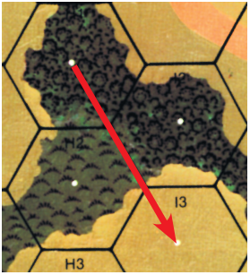

#### B.2 COT

**B.2 COT:** This term means “Cost of Terrain” and refers to the normal MF/ MP cost for entrance of a hex plus the movement cost of any Artificial Terrain therein. Therefore, if Infantry must pay double the COT to enter a higher elevation hex also containing SMOKE it costs 2 × 2 = 4 MF, not 2 × 1 = 2 + 1 = 3 MF *[EXC: Abrupt Elevation Changes; 10.5]*. COT is usually used in conjunction with an added cost to enter a hex; e.g., it costs Infantry one MF plus the normal cost of entry into the next hex to cross a wall hexside. Therefore, a squad crossing a wall hexside into an Open Ground hex pays two MF (1 + 1 [COT] = 2), while a squad crossing a wall hexside into a woods hex pays three MF (1 + 2 [COT] = 3).

**B.3 MP COSTS:** To avoid needless repetition, vehicular movement costs for each terrain type are listed only on the MP Entrance Cost column of the Terrain Chart for each of the five general classifications of vehicles, and alluded to in the written rules only where further clarification may prove helpful.

**B.4** **HINDRANCE LEVEL:** In the course of relating LOS rules, the word “through” will be used only in relation to a LOS which is actually traced *through* that terrain type at an elevation wherein the terrain has some effect. Tracing a LOS *over* a terrain type such that the terrain type has no effect is assumed to be understood and therefore is not continually referred to. Similarly, any wreck, AFV, or LOS Hindrance in a Blind Hex does not affect a LOS over that Blind Hex to a target beyond *unless* the Hindrance is of such a height (SMOKE) to be able to affect a LOS over that hex.

**B.5** **CONTINUOUS SLOPE:** A Continuous Slope is a change in elevation such that, in each hex successively crossed by the LOS, the elevation changes by one level in a continuous gradient. All rules pertaining to same-level LOS also apply to Continuous Slope LOS *[EXC: walls/hedges and AFV/wrecks* *(D9.4)]* even though the latter term is not mentioned, although Height Advantage is unaffected.

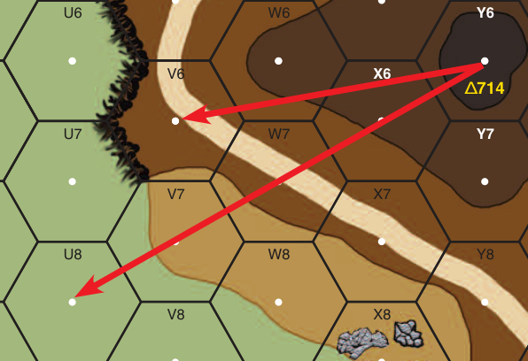

EX: A LOS traced from 15Y6 to U8 is a Continuous Slope LOS and would be affected by any LOS Hindrance in those hexes. A LOS traced from Y6 to V6 is not a Continuous Slope LOS however, because it crosses two hexes (W6, X6) which are at the same elevation.

**B.6** **INHERENT TERRAIN:** Certain terrain depictions (orchard, crag, graveyard, shellholes, etc.) and counter contents of a hex (SMOKE, Bridge, rubble, AFV, wreck) *[EXC: Bypass AFV/Wreck (D9.4)]* identify the entire hex (inclusive of hexsides) as having the characteristics of that terrain type. It is not necessary that a LOS actually cross such a symbol to be affected— mere entrance of the hex (even if only to trace a LOS to or through a vertex of such a hex) or a LOS exactly along one of its hexsides (A6.1) suffices. A LOS traced exactly along such a hexside is considered to have passed through only one such hex—not two—even if that hexside is shared by another LOS Hindrance hex. If the Hindrance DRM of two such hexes differ, the larger of the two Hindrance DRM is used.

**B.7** **LOS & TERRAIN CHECKS:** To make LOS checks easier and to also clearly see terrain depictions without having to shift counters on the board, it is suggested that a duplicate mapboard configuration be laid out adjacent to the boards in play. Duplicate boards may be purchased directly from www. multimanpublishing.com.

**B.8 RANDOM DIRECTION:** Whenever a dr is called for to determine a Random Direction not involving a Directional Aid Counter already in place, any board is chosen as a reference point and a dr is made. A dr of 1 refers to the hexside containing the grid coordinate, a dr of 2 refers to the next hexside in a clockwise direction, etc.

**B.9 ARTIFICIAL TERRAIN:** Any counter other than an entrenchment, pillbox, and/or shellhole placed in a hex which affects the TEM of that hex is Artificial Terrain. Any AFV, wreck, SMOKE (or roadblock along the LOS) can increase the TEM of a hex. The TEM of entrenchment, pillbox, or shellhole counters are dependent on MF expended upon entry and therefore are not considered Artificial Terrain.

<!-- page 113 -->

**B.10 LOS HINDRANCE BLOCKAGE:** Any combination of SMOKE, vision (weather), and/or terrain LOS Hindrance DRM ≥ +6 blocks that LOS completely.

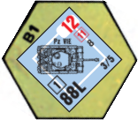

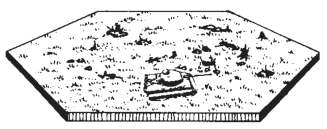

## 1. OPEN GROUND

#### 1.1

**1.1** Open Ground is any hex devoid of other printed terrain features which would affect fire or LOS into that hex. The most common form is any hex covered uniformly in light green such as 2B1. However, there are many other types of Open Ground hexes.

**1.11** **ROADS:** The presence of a road modifies an Open Ground hex for movement purposes through a road hexside only. Otherwise, a road (such as 2W8) devoid of other terrain is considered an Open Ground hex.

**1.12 RUNWAY:** A runway hex is treated as Open Ground for most purposes with an additional TEM and prohibition against most Fortifications.

**1.13 SHELLHOLES:** Shellholes are treated as Open Ground only during Defensive First Fire and the RtPh, and only if the unit moving into them paid Open Ground entry costs as opposed to shellhole entry costs.

**1.14 HILLS:** Any hill hex devoid of other terrain is also an Open Ground hex. 2L4, 2L5, and 2K5 are examples of Open Ground hexes. However, the -1 FFMO DRM does not apply (due to the +1 TEM for Height Advantage) for most fire traced from a lower elevation, and therefore that hex is not considered unmodified Open Ground (A10.531) for that type of Interdiction claim unless the routing unit is crossing a Crest Line through the same hexside crossed by the firer’s LOS (see 10.31).

**1.15 BRIDGES:** A bridge is considered Open Ground (actually a road) if the LOS of the firing/interdicting unit enters the bridge hex only through the road depiction of that bridge.

**1.16 HEXSIDES:** The presence of a wall, hedge, crest, or cliff hexside in an Open Ground hex does not change it from an Open Ground hex unless the LOS crosses that hexside. A FFNAM DRM and any hexside TEM are cumulative, but any beneficial TEM means the -1 FFMO DRM does not apply, thereby preventing any Interdiction attempt across a hexside TEM.

**1.17 ARTIFICIAL TERRAIN:** The placement of Artificial Terrain in (or along the LOS to) an Open Ground hex provides cumulative TEM or Hindrance bonuses which negate Interdiction and FFMO claims (even if using Road Movement rate). EX: A Defensive First Fire attack on a squad making an Assault Move into an Open Ground hex containing a wreck does not receive a negative DRM for FFMO (due to the TEM of the wreck) so it is entitled to a total TEM of +1.

#### 1.2

**1.2** Open Ground presents no obstruction or Hindrance to LOS, although those hexes which are also hills, or contain non-Open Ground hexsides or Artificial Terrain may, consistent with the rules for those other terrain types.

#### 1.3

**1.3** The only TEM for Open Ground is the -1 FFMO DRM vs moving Infantry.

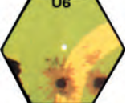

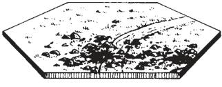

## 2. SHELLHOLES

#### 2.1

**2.1** Shellholes are represented by brown splotch marks with a dark brown core. 2U6 is an example of a shellhole. Shellholes can be created to a maximum of one per hex during play by placing a shellhole counter in Open Ground, orchard, brush, or grainfield immediately after any Original KIA result during a PFPh/DFPh resolution of a Concentrated HE FFE (or aerial bomb/rocket) attack of ≥ 150mm. Such placement removes all entrenchment counters in that hex (al-though not necessarily their contents) even if the hex was already a shellhole hex; the in-hex terrain *[EXC: roads]* (and any Flame/Blaze already in it) is considered to no longer exist at all. Shellholes occur only IN a Depression —not at its Crest level.


#### 2.2

**2.2** A shellhole presents no obstacle or Hindrance to LOS through its hex.

#### 2.3

**2.3** The conditional TEM of a shellhole is +1. It applies only to Infantry who are not Manhandling a Gun/Boat and is not cumulative with any other pos-sible TEM.

#### 2.4

**2.4** Infantry may enter a shellhole hex at a cost of one or two MF. If it expends one MF to enter a shellhole hex it may be subject to FFMO (or Interdiction in the RtPh) in that hex during that MPh until pinned. If it expends two MF in entering the hex, or starts the phase therein, it is considered in a shellhole and not subject to FFMO penalties. Cavalry and horse-drawn vehicles must enter at the two MF rate even though they never receive the protective TEM benefits of a shellhole hex. The MF cost to enter a gully shellhole Location is as per 19.4. EX: On the *RED BARRICADES* map, a squad IN CC3 may move INTO the BB3 gul-ly-shellhole Location at a cost of two MF, or three MF if also using the shellhole TEM. It may continue movement into AA3 at a cost of two MF (Open Ground) or three MF (if using the shellhole TEM).

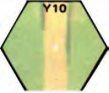

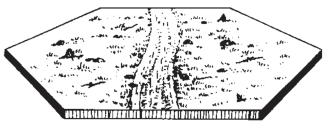

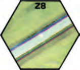

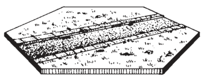

## 3. ROADS

#### 3.1

**3.1** Roads represent either paved or dirt surfaces. A road represented by a broad brown stripe such as 1Y10 is a dirt road; a broad gray stripe such as 1Z8 is a paved road. A road hex containing both paved and dirt roads is considered a paved road hex, although entry of the hex is based on the type of hexside entered (e.g., 12M4 is a paved road hex but entry of it through the M4-L3 hexside is per a dirt road hexside). Entry of 23Y1 from 4Y10 is per paved road hexside; entry of 4Y10 from 23Y1 is per dirt road hexside.

#### 3.2

**3.2** Roads are not obstacles or Hindrances to LOS, although other terrain in a road hex may be. A road hex devoid of other terrain features is considered Open Ground for all purposes except movement across the road hexside.

#### 3.3

**3.3** The other terrain in a road hex determines any TEM of that hex. However, if a unit moves into a hex via the road rate it would be subject to Interdiction/FFMO (in the case of Infantry) instead of the TEM of the other terrain in the hex unless the LOS was traced through other non-Open Ground terrain between the firer and target points. The possible target points are increased when firing at an Infantry unit using the road movement rate in a combination road/Non-Open Ground terrain hex (as per A4.132).

#### 3.4

**3.4** Infantry may cross any road hexside at a cost of one MF (two MF if move is to higher elevation). Infantry, Cavalry, and Horse-Drawn units which cross only road hexsides throughout their MPh are entitled to one extra MF provided they do not encounter mines, burning wrecks, Wire, mud, rubble, roadblocks, debris (O1.2), Panji Covered hexsides, SMOKE, or Deep Snow in those road hexes and are not pushing Guns (C10.3). EX: Barring Bypass, hex 3I10 costs Infantry two MF to enter from H9, I9, or J9. It costs four MF to enter from H10 or J10, due to a move to higher elevation. The road leading into the hex from offboard negates the movement cost of the building at the mover’s option and allows entrance at a cost of two MF, but if it does not pay the normal four MF cost of entering a building at a higher elevation, it would be subject to FFMO penalties (A4.132) to any Defensive First Fire that can be traced to the road depiction crossing that hexside (3.3).

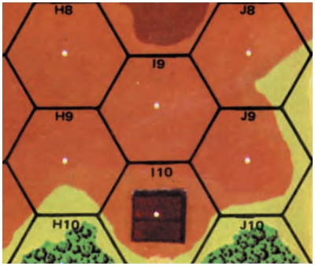

##### 3.41

**3.41** A vehicle may cross any road hexside at a cost of <sup>1</sup>/2 MP *[EXC: Graveyard-Roads (18.41)/BU (D5.2)/Snow (E3.724)/in-Convoy (E11.2)]*. The four MP surcharge for a vehicle entering higher terrain is halved to two MP while crossing a road hexside.

##### 3.42

**3.42** The one MP penalty for entering a hex already containing a vehicle/ wreck is doubled to two MP per vehicle/wreck if entering that hex across a road hexside while using the road movement rate.

**3.43** **ROAD-NEGATING TERRAIN:** Infantry may not claim the extra- MF road bonus during a MPh in which they expend extra MF to derive the protection of shellholes/woods—nor may they claim it if they choose the non-Open-Ground cover of an orchard in preference to the Open Ground of a road. A road covered by rubble/debris (O1.2) is treated as non-existent *[EXC: for Street Fighting (A11.8) purposes; if Cleared (24.71)]*. Therefore, Dash (A4.63), road bonus (3.4) and the <sup>1</sup>/2-MP road rate are not allowed in a road hex covered by rubble or debris except via TB.

#### 3.5

**3.5** Hidden mines *[EXC: in debris]* and entrenchments may not be placed in a paved road hex due to the urban nature of the terrain.

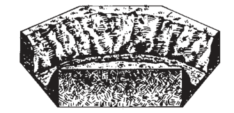

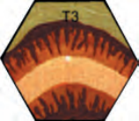

## 4. SUNKEN ROAD

#### 4.1

**4.1** Sunken Roads are relatively narrow slits carved out of natural depressions in the ground, and have steeper sides than a gully. A hex such as 14T3 containing a road symbol bordered on two sides by two-tone brown contour lines (with the darker contours on the outside) is a Sunken Road hex.

#### 4.2

**4.2** A Sunken Road is a -1 level Depression hex; i.e., a unit in it is one level lower than it would be if the Sunken Road were not present. A unit IN a Sunken Road cannot see any other Depression hex unless it can trace a LOS through other Sunken Road hexes clear of the dark brown contour lines of those hexes.

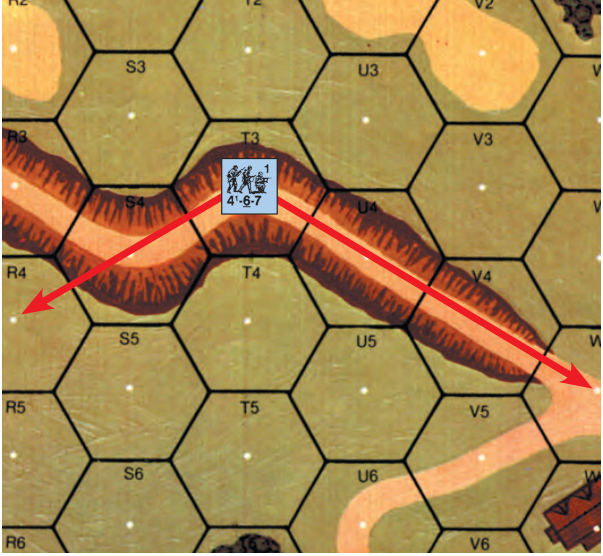

EX: The 4-6-7 IN 14T3 can see only the six adjacent hexes in addition to V4, W5, and R4. R4 can be seen because it is the first ground-level hex in its LOS which is not blocked by a previous ground level depiction.

#### 4.3

**4.3** Provided a LOS into it exists, a Sunken Road is considered Open Ground for TEM and Interdiction purposes.

#### 4.4

**4.4** Movement costs across a Sunken Road hexside are identical to those for other roads. Only the entrance costs of a Sunken Road hex through a non-road hexside differ.

##### 4.41

**4.41** Infantry/Cavalry entering a Sunken Road hex through a non-road hex-side do so at a cost of two MF. There is no cost for leaving a Sunken Road hex other than the normal penalties (10.4) for moving to higher elevation.

##### 4.42

**4.42** Vehicles may not enter or leave a Sunken Road hex except across a road hexside. All MP penalties for entering a hex containing a wreck/vehicle, or for changing a VCA across a non-road hexside, are doubled while in a Sunk-en Road hex. EX: It costs a CE tank 4<sup>1</sup>/2 MP to enter a wreck hex while on a Sunken Road (1 × 2 [3.42]) × 2 [4.42] + <sup>1</sup>/2 = 4<sup>1</sup>/2.

**4.43** **SUNKEN LANE:** A Sunken Road can be treated as a Sunken Lane if so designated by SSR. All Sunken Road rules also apply to a Sunken Lane unless specified otherwise. The rules for a Sunken Lane are the same as those for One-Lane Bridges (6.43-.431) except that Wreck Removal (D10.42) does not apply in a Sunken Lane.

#### 4.5

**4.5** Entrenchments cannot be placed in a Sunken Road hex. See also 3.5.

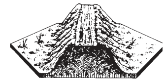

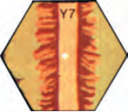

## 5. ELEVATED ROAD

#### 5.1

**5.1** Elevated Roads are located on man-made mounds, usually constructed for purposes of flood control. Any hex such as 13Y8 or 13Y7 containing a road symbol bordered on two sides by two-tone brown contour lines (with the darker contour lines on the inside) is an Elevated Road hex.

<!-- page 115 -->

#### 5.2

**5.2** An Elevated Road is a one level obstacle (inclusive of the contour lines which border it) to LOS. Any unit on an Elevated Road on board 13 is at level 1 and subject to the same LOS restrictions as a unit on a level 1 hill.

##### 5.21

**5.21** The contour lines forming the edge of the Elevated Road symbol are the equivalent of hill Crest Lines. Even so, vehicles cannot claim HD status on an Elevated Road hex. A unit at a lower level may maintain a LOS through an Elevated Road hex to another unit on the same level as the viewer only if its LOS does not cross any part of the brown contour lines of that Elevated Road hex or of the road itself.

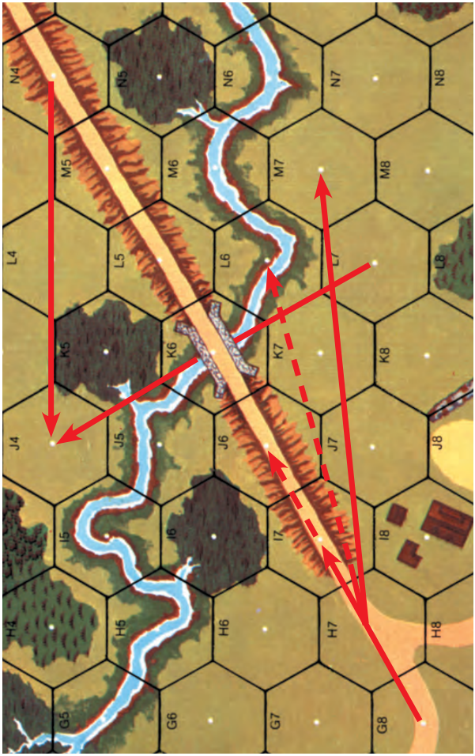

EX: The solid red lines show that 13H7 can see M7, but the dashed lines indicate that H7 cannot see a Crest unit in L6, because the H7-L6 LOS actually crosses the contour lines of the Elevated Road hex. An unobstructed LOS exists beneath the level 1 obstruction of the bridge between L7 and J4.

##### 5.22

**5.22** Due to the Crest effects of an Elevated Road hex, a unit on an Elevated Road cannot see a unit at a lower level if it must trace its LOS through the brown contour lines of another Elevated Road hex. EX: Using the previous illustration, we find that a unit on 13G8 can see I7, but not J6. A unit in N4 can see J4 even though the LOS does cross the Elevated Road hex M5 because it does not cross the brown contour lines of that Elevated Road hex.

#### 5.3

**5.3** An Elevated Road is considered Open Ground for TEM and Interdiction purposes, provided the Height Advantage TEM does not apply. The +1 TEM for Height Advantage can apply to Direct Fire from a lower elevation, thus allowing rout through the hex free of Interdiction and movement free of the FFMO DRM. However, the Height Advantage TEM does not apply to moving units during Defensive First Fire or Interdiction, if in entering the Elevated Road the moving unit crosses a Crest Line through the same hexside that is intersected by the firer’s LOS (10.31). EX: Again using our previous illustration, we find that a broken unit in 13J6 can be Interdicted by a unit in I8 as the broken unit routs from J7. A unit in J6 making an Assault Move to I7 while being fired on from K8 receives only a +1 DRM (for Height Advantage) because the FFMO DRM does not apply.

#### 5.4

**5.4** Movement costs across an Elevated Road hexside are identical to those of other roads. Only entrance of an Elevated Road hex through a non-road hexside differs.

##### 5.41

**5.41** Infantry/Cavalry may enter an Elevated Road hex through a non-road hexside at a cost of two MF (one MF doubled to two for a move to higher elevation) unless the move gains two levels of height, in which case an Abrupt Elevation Change (10.5) applies.

##### 5.42

**5.42** Tracked vehicles may enter or leave an Elevated Road hex through a non-road hexside at a MP cost equal to crossing an Open Ground hill Crest hexside. Vehicular entrance or exit of the Elevated Road hex directly to/from a Depression would amount to crossing an Abrupt Elevation hexside (see 10.51). Motorcycles which enter/leave an Elevated Road hex through a non-road hexside can do so only by chancing a Wreck Check dr (D15.46) or being pushed. All MP penalties for entering a hex containing a wreck/vehicle on a road (two MP), or for changing a VCA across a non-road hexside, are doubled while in an Elevated Road hex.

#### 5.5

**5.5** Entrenchments may not be placed in an Elevated Road hex. See also 3.5.

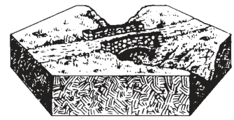

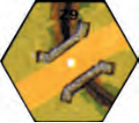

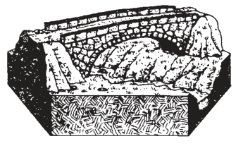

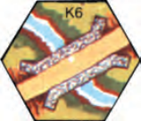

## 6. BRIDGES

#### 6.1

**6.1** Bridges are man-made structures used to cross Depressions or water. All bridges depicted on the map (such as 5Z9 and 13K6) are two-lane bridges of stone<sup>1</sup> construction capable of being used by vehicles. In addition, there are numerous bridge section counters which can be used in combination to bridge multi-hex Water Obstacles or Depressions. The <sup>5</sup>/8" bridge counters may be used by any unit; see 6.44 for <sup>1</sup>/2" bridge counters. Bridges usable by vehicles always connect directly to any adjacent road to which the bridge depiction points, and are considered an extension of that road. Units on bridges (other than pontoon bridges) are considered in a separate Location from other units in that hex not on the bridge.

#### 6.2

**6.2** All bridges block LOS between units on the bridge and units beneath the bridge. Otherwise, a bridge does not block LOS. However, a non-pontoon bridge does Hinder any LOS drawn through it between units which are at the same level as the Bridge or units only one of which is below the level of the Bridge (unless that LOS is traced only through the road depiction of the Bridge). Non-pontoon bridges are always at the same level as the road they connect to. Bridge counters are Inherent Terrain (B.6) but LOS into/through its hex does not incur the Bridge Hindrance/TEM if it crosses only road hexsides (exclusive of vertices) of that hex.

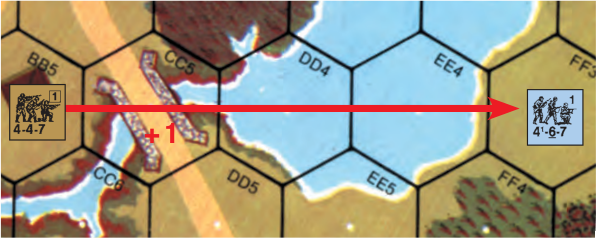

EX: The bridge at 13CC5 is at ground level; a unit in BB5 can fire through the bridge to FF3 by adding a +1 Hindrance DRM to its IFT DR. The bridge at 13K6 (see 5.21 illustration) is at level one; a unit in J4 can fire beneath the bridge at K6 to L7 with no Bridge Hindrance DRM.

#### 6.3

**6.3** Direct Fire (and Direct Fire Interdiction) against a target on a bridge which is traced only through the road depiction of that bridge hex (or against any pontoon bridge, regardless of LOF) and Residual FP attacks are considered to take place in Open Ground (1.15). Of course, fire traced through a Hindrance hex elsewhere along the LOS still negates any FFMO or Interdiction claim in the bridge hex. See 9.33 for Elevation Effects.

##### 6.31

**6.31** Direct Fire against targets on a non-pontoon bridge (not against the bridge itself) which enters the bridge other than across the road depiction (or road hexside of a Bridge counter’s hex; 6.2) has a TEM of +1 regardless of bridge construction type.

##### 6.32

**6.32** Indirect Fire against a non-pontoon bridge/targets on or beneath that bridge has a TEM of +1 regardless of the LOF due to the separation of the bridge from the obstacle it crosses—thus reducing the effects of near misses and negating Interdiction.

##### 6.33

**6.33** Only HE attacks can destroy a bridge. Direct Fire attacks use the Infantry Target Type To Hit Table. If using the Vehicle Target Type for Direct Fire vs a vehicle, there can be no effect vs the bridge. The same Original DR used on the IFT to resolve attacks against units on the bridge is used against the bridge itself by adding a +3 TEM for a stone bridge, or a +2 TEM for a wooden bridge, or a +1 TEM for a pontoon bridge (+2 TEM if underwater) *[EXC: Set DC; A23.71]*. This TEM is applicable only to the bridge itself—not to the units on it. Only a Final KIA result will destroy the bridge in the target hex. All units/equipment on or beneath a destroyed bridge are eliminated. EX: A German 88mm Gun fires at a squad on a wooden bridge through a non-road hexside at a range of 12 hexes. Based on its Modified TH# of 7, it will need an Original DR ≤ 6 (6 + 1 [TEM DRM]) to hit. Having secured the hit, it now rolls on the 16 column of the IFT with no DRM vs the squad, but a +2 DRM vs the bridge itself. An Original IFT DR of 3 eliminates the squad but has no effect vs the bridge. EX: A 120mm OBA FFE is being resolved vs a stone bridge hex containing a squad. There is a +1 DRM to the IFT DR vs the squad (for Indirect Fire; 6.32) and a +4 DRM to the same IFT DR vs the bridge itself (+1 [Indirect Fire] +3 [stone bridge] = +4).

###### 6.331

**6.331** Whenever a non-pontoon bridge is destroyed, the bridge is replaced by a rubble counter at the level below it (unless in a deep or flooded water hex). If in a deep or flooded water hex, the bridge counter is simply removed (or if depicted on the mapboard, covered by a destroyed bridge counter).

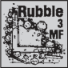

###### 6.332

**6.332** A destroyed pontoon bridge section is simply removed.

#### 6.4

**6.4** Entrance of/exit from a bridge Location can occur only by crossing a road hexside on that bridge *[EXC: by Scaling (23.424)* *and using a Climbing counter in the bridge hex]*. A unit beneath a bridge is depicted by placement beneath a bridge counter and is at the level being spanned by the bridge (usually -1 for a Depression or Water Obstacle).

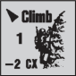

**6.41** **PONTOON:** Only pontoon bridges, which are always at water level, permit exit/entry of a bridge through a non-road hexside without Scaling, Swimming, Fording, or Boating. Infantry may enter/exit a pontoon bridge as if it were Open Ground. Units may not move beneath a pontoon bridge. Pontoon bridge <sup>5</sup>/8" counters are con-sidered One-Lane vehicular bridges with unlimited weight capacity.


**6.42** **COLLAPSE:** Wooden bridges may collapse under loads \> their cur-rent weight limit. The first time the total weight of vehicles/wrecks on a wooden bridge (regardless of length) exceeds ten tons, a Bridge Collapse DR must be made. The DR is modified by +1 for every five-ton increment or frac-tion thereof in excess of the current bridge weight limit. If the Final Bridge Collapse DR is ≥ 12, the entire bridge Location collapses with the elimina-tion of all counters on and beneath it. Rubble is placed as per 6.331. If the Final Bridge Collapse DR is \< 12, the bridge remains intact and its new cur-rent weight limit is the current weight just checked. This new weight limit is marked on a side record. The bridge does not have to check for collapse again until this new current weight limit is exceeded.

**6.43 WIDTH:** All MP penalties for entering a hex containing a wreck/ve-hicle on a road, or for changing a VCA across a non-road hexside, are doubled while on a bridge.

**6.431** **ONE-LANE:** Once a vehicle moves across a One-Lane bridge in a direction opposite that used by any vehicle on that bridge during that Player Turn, no further vehicular movement is allowed onto that bridge in either direction during that Player Turn. The direction of vehicular traffic on a One-Lane bridge thus far in a Player Turn can be marked with a One-Lane counter. A One-Lane bridge is blocked to vehicular traffic by the presence of a wreck or vehicle (not motorcycles) *[EXC: Infantry/Cavalry, vehicles with a +2 size modifier, and motorcycles* *are never blocked]*. Normal Wreck Removal rules (D10.4) apply. An unhooked Gun (on a <sup>5</sup>/8" counter) on a One-Lane bridge would be eliminated by an AFV entering its hex, and the AFV would have to check for Bog. While on a One-Lane bridge, a VCA *[EXC: Motorcycles]* must always contain an adjacent road hex. This allows changing the VCA center hexspine only from one side of the road to the other (i.e., between vertices of the same road hexside).

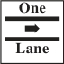

**6.44** **FOOT BRIDGES:** A foot bridge is a <sup>1</sup>/2" pontoon bridge counter. Only Infantry, their portaged equipment, and unmounted horses/cycles may cross a foot bridge. The stacking capacity of a foot bridge is one squad-equivalent per hex.


**6.45** **UNDERWATER:** Occasionally, pontoon bridges may be defined as being laid below the surface of the water. Such bridges have a +2 TEM for purposes of bridge destruction instead of +1 TEM (6.33), double road movement costs, and disallow Road bonus (3.4).

**6.5** **BURNING:** Stone Bridges do not burn.<sup>2</sup> A bridge defined by SSR as wooden can be burned as if it were a stone building.

#### 6.6

**6.6** Entrenchments/mines *[EXC: unhidden AT Mines; 28.53]* cannot be placed on a bridge.

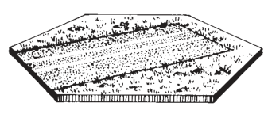

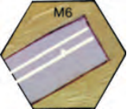

## 7. RUNWAYS

The following rules apply only to hard surface runways or SSR-designated wide city boulevards.<sup>3</sup>

#### 7.1

**7.1** Any hex containing a gray road surface crossed by two parallel white lines (such as 14M6) is a runway hex.

<!-- page 117 -->

#### 7.2

**7.2** Runways are neither an obstacle nor Hindrance to LOS.

#### 7.3

**7.3** Any unarmored unit in a runway hex receives a -1 TEM to all IFT fire resolved against it regardless of fire phase. This TEM is in addition to any ap-plicable DRM for FFMO/FFNAM and is cumulative with other (including hexside) TEM. A runway hex is considered Open Ground for all Interdiction purposes (barring the presence of any Artificial Terrain).

#### 7.4

**7.4** Movement costs for entering a runway hex are identical to that of a paved road if entered through a runway hexside; identical to that of Open Ground if entered through a non-runway hexside. Streetfighting and Dash are NA “across” a runway or boulevard.

#### 7.5

**7.5** The only Fortifications allowed in a runway hex are Wire, roadblocks, and/or unhidden AT Mines (28.53).

## 8. SEWERS & TUNNELS

**8.1 SEWERS:** Sewers represent large drainage systems found beneath ground level in major cities and create new Locations below the ground level of city boards. Sewers are not usable unless specified by SSR and allow In-fantry to move beneath the surface of the playing board free from the ef-fects of enemy presence or fire at higher levels. Entrance to and exit from the sewer system are limited to Manhole Locations. The ground level Location of any hex marked with a black circle (EX: 1AA5, 21P3) or any paved road hex which intersects with any other road such that at least three hexsides of that hex are crossed by a road (EX: 1Y9) are Manhole Locations *[EXC: on* *Deluxe ASL boards only hexes marked with a black circle contain Sewer* *Locations]*.

**8.2 SEWER LOCATION:** A Sewer Location exists beneath each Manhole Location and is a different Location for all purposes. A unit in a Sewer Loca-tion is at a level one lower than the Manhole Location in that hex and out of LOS of all enemy units other than those occupying a Sewer Location in the same or an adjacent hex, and/or by any unit directly above it in a Manhole Location which has discovered it via a Sewer Emergence dr (8.42) *earlier* *that Player Turn.* Reciprocity (A6.5) applies. A Sewer Location may never be overstacked.

**8.3 ATTACKS:** A unit in a Sewer can only be attacked by a unit with a LOS to it. All fire vs a unit in a sewer is PBF and subject to the -2 Hazardous Move-ment DRM regardless of fire phase. A Sewer Location has no TEM. Neither a vehicle nor ordnance/IFE/OBA may fire into a sewer.

**8.4 SEWER MOVEMENT:** A unit may never start play already in a sewer. Only Good Order Infantry (or a dummy stack) may enter a Sewer system from a Manhole Location and only at the start of their MPh and do so at the cost of all their MF. Furthermore, only those units granted Sewer Movement capability by SSR, or who are accompanied by a leader who passes a 4TC at the start of their MPh while in a Manhole Location, may enter the Sewer. The latter method of entrance is available only when a SSR has specified sewers as usable and units of either side not granted the capability wish to attempt en-trance. Units in a Sewer may not portage more than their IPC nor push a Gun. Sewer movement cannot be used to move beneath any Water Obstacle hex.

##### 8.41

**8.41** Sewer movement must start in or beneath a Manhole Location and end in a Sewer Location no farther than three hexes away. Sewer movement must be performed as one combined stack whenev-er more than one unit starting their MPh in the same Location wants to use Sewer Movement, and must be declared as Sewer Movement and symbolized by placement of a “Sewer ?” counter above the moving units. A unit using Sewer Movement is always concealed by being placed beneath a “Sewer ?” counter, even if not concealed prior to entry of the Sewer. However, prior to actual movement, a dr (∆) is made to determine who moves the stack; on a dr of 6-7, the units become lost and must move to an al-lowable Sewer Location designated by the DEFENDER, and the “Sewer ?” counter is flipped to the “Lost ?” side. This dr is repeated at the start of the stack’s MPh during every friendly MPh that the units remain in the sewer system, but with a +1 drm if the units in question are currently lost. Whenever a lost stack’s Final dr is ≤ 5, the “Lost ?” counter is flipped back to the “Sewer ?” side and the ATTACKER moves the stack that turn. Units in a Sewer must move during their MPh; they cannot remain motionless, although they can return to a Sewer Location occupied during a previous turn. If they are unable to move to a new Sewer Location, they are eliminated. Units in a sewer may use the APh only to advance vertically out of the sewer system *[EXC: 8.44]* and into the Manhole Location—even if enemy occupied *[EXC: Fortified* *Building; 23.922]*. If the non-sewer Location left that turn was Encircled, units become pinned and CX upon advancing out.

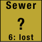

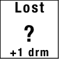

##### 8.42

**8.42** Upon ending their MPh, units in a Sewer Location must make a dr on the Sewer Emergence Chart and perform the result for the entire stack.

```text
                 SEWER EMERGENCE CHART ∆
 dr    Action Required
≤ 4    May emerge concealed at owner’s option during the APh; not sub-
       ject to Defensive Fire in the interim.
5-6    Cannot emerge during this Game Turn; not subject to Defensive
       Fire in the interim.
       Discovered. Cannot emerge during this Game Turn; subject only
≥ 7    to Defensive Fire from any opposing Infantry in Manhole Loca-
       tion but without benefit of concealment (although concealment is
       not lost).
The following cumulative drm apply to the Sewer Emergence dr:
  -1   Manhole Location is occupied by other friendly unit(s)
  -1   Manhole is in a building Location unoccupied by enemy units or in a non-
       building Location not in LOS of enemy or all such LOS is Hindered by ≥ +2
 +1    Sewer units are currently lost
 +1    Per enemy Good Order MMC* in Manhole Location
 +1    Enemy non-dummy unit(s)* in adjacent Sewer Location
```

\* Any such concealed unit must be momentarily revealed (and hidden units placed on board) for this drm to apply, but the DEFENDER may do so at his own option after the dr is made.

##### 8.43

**8.43** A unit in a sewer can attack units in the Manhole Location above it only during the AFPh after having been “discovered” by a Sewer Emergence dr ≥ 7.

##### 8.44 APh/CCPh

**8.44 APh/CCPh:** Opposing units in the sewer system may not enter an en-emy occupied Sewer Location during the MPh, and may end their respective MPh ADJACENT only if they are both beneath Manhole Locations in adja-cent hexes. Should this situation occur, fire attacks between the ADJACENT units are allowed as normal during the DFPh and AFPh, and the APh can be used by the ATTACKER to move either to the Manhole Location above it (if allowed by the Sewer Emergence dr) or to enter into CC with the adjacent sewer unit(s). Since units in a sewer are always concealed (8.41) they are never locked in Melee, and during the next MPh the ATTACKER must move to a new Sewer Location.

**8.45 BROKEN & BERSERK:** Any unit which becomes broken or berserk while in a sewer is eliminated. An already broken or berserk unit may never enter a Sewer Location. Similarly, because units in a Manhole Location are usually unaware of units in a sewer beneath them, they ignore them for pur-poses of rout or charge.

#### 8.5

**8.5** No Fortifications are allowed in a sewer. A Manhole Location covered by rubble or Blaze is treated as if no Manhole exists therein, but the Sewer Location beneath it still exists. There is no Sewer Emergence dr if units in the sewer end their MPh in such a Sewer Location. Should a DC attack in a Sewer Location result in rubble (treating the Sewer Location as if a stone building), all units/SW therein are eliminated. Mark that hex with a rubble counter be-neath a sewer counter; no Sewer Movement is allowed into that hex, and the Manhole Location is unaffected.

<!-- page 118 -->

**8.6 TUNNELS:** A tunnel exists only by SSR or DYO, or if a player forfeits a Fortified Building Location (23.9) capability in order to have access to a tun-nel *[EXC: a Fortified Building Location that is specified by building/hex co-* *ordinate cannot be forfeited; see also G1.632 for Japanese pillboxes]*. Tun-nels are not dug during play; they must be secretly recorded prior to setup. A tunnel consists of two entrance Locations which must be within three hexes of each other. The entrances must be in separate ground level building, pill-box, brush, or woods Locations. The entrance may (if so recorded) lead into an OB-given entrenchment. The tunnel may not pass beneath any hex whose base elevation differs from that of its entrance Locations (which must both be at the same elevation) or beneath any Water Obstacle hex. See G11.93 for Cave Complexes. A unit in a tunnel never has LOS to any enemy units and is never subject to any form of attack.

**8.61 MOVEMENT:** Only Good-Order/dummy Infantry of the owning side may enter a tunnel during the MPh. A unit may move into a tunnel from one entrance Location at the start of its MPh by being placed beneath a “Sewer ?” counter in the *opposite* entrance hex at the cost of all its MF, and must ad-vance out that entrance concealed during the subsequent APh (even if that Location is occupied by enemy units and is Fortified but would instead be eliminated if the opposite entrance were an enemy-occupied pillbox). A tun-nel may never be overstacked, and units in a tunnel may not portage more than their IPC nor push a Gun. If the Location left was Encircled, units be-come pinned and CX upon advancing out.

##### 8.62 RtPh

**8.62 RtPh:** Broken units may enter a tunnel during their RtPh and use it to rout, provided they exit it in the same RtPh. Routing units must begin their rout in one tunnel entrance Location and end it in the opposite Location. Routing units are immune to Interdiction while in a tunnel and may use it to move adjacent to or towards a Known enemy unit, provided that when they emerge they are no closer to any armed enemy unit that was Known when they entered the tunnel, and that they don’t become ADJACENT to a Known, unbroken armed enemy unit. Routing units are not concealed when they emerge from a tunnel.

**8.63 DESTRUCTION:** Any tunnel entrance may be destroyed by any Good Order Infantry unit in the same Location without a Known enemy unit at the end of the CCPh provided the entrance/exit has been used in the LOS of that unit and subsequently discovered using the Recovery procedures of A4.44. The presence of an entrance/exit cannot be revealed by Searching.

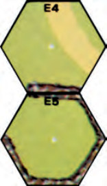

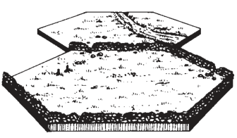

## 9. WALLS & HEDGES

#### 9.1

**9.1** A wall represents a stone fence varying in height between one and two meters, and conforms to hexsides rather than the interior of a hex. Any hexside that overprints a thick gray line such as 2E4-E5 is a wall hexside. A hedge represents hedges one to two meters high and also conforms to hexsides. Any hexside containing a thick green line such as 2T1-U2 is a hedge hexside. The thick terrain depiction, as well as the hexside itself (inclusive of vertices), represents the wall/hedge and will affect any LOS through it, except for obvious breaks in the depiction such as 6W9-X9. A wall/hedge cannot be eliminated.

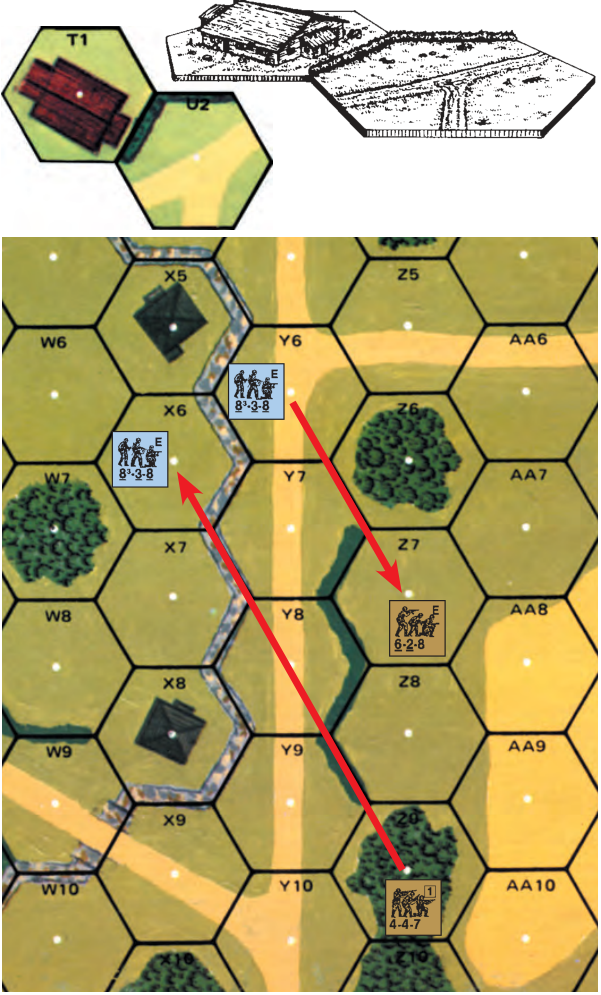

EX: An attack from 6Y6 to Z7 is affected by the hedge hexside Y7-Z7 even though the hedge depiction does not actually extend to the vertex.

#### 9.2 LOS

**9.2 LOS:** Wall and hedge hexsides are Half-Level obstacles to same-level LOS (A6.21) unless the wall/hedge hexside is part of the viewing/target hex. A wall/hedge hexside never blocks LOS to any portion of its own hex even in the case of Snap Shots or vs Bypassing units on the opposite side of that hex *[EXC: 9.21]*. A wall/hedge lying lengthwise (on a hexspine) exactly along a LOS is a Half-Level LOS obstacle only if the wall/hedge hexspine is not touching the viewing or target hex, or if touching *one* of the viewing/target hexes and the vertex opposite of the viewing/target hex has walls/hedges on *all* of its three hexspines. EX: In the 9.1 illustration, the 4-4-7 in 6Z9 can attack the 8-3-8 in X6 with a +2 DRM for the wall because both intervening wall/hedge hexspines are part of either the firing or target hex and neither of them has three wall/hedge hexspines on the vertex that is part of neither Z9 nor X6. If Y8-Y9 were a hedge hexside, no LOS would exist since the Y8-Y9-Z8 vertex would have wall/hedge hexsides on all three hexspines. If a German unit were in Y8, both it and the 4-4-7 would qualify for the +1 TEM of the Z8-Y9 hexspine when firing at each other. If the Z8-Y9 hedge did not exist (or were instead at Y8-Y9), the LOS from Z9 to X6 would be blocked at the Y8-Y9-Z8 vertex.

**9.21** **ENTRENCHMENTS:** A unit in an entrenchment cannot see (or be seen) across a same-level wall/hedge hexside/hexspine forming  a  part  of the unit’s hex to (or from) any non-adjacent same-level or lower Location— although an elevation advantage of at least a half-level over the Entrenchment does allow such LOS. LOS is reciprocal. If a viewer would have LOS to any non-entrenched units in such a Location, it also has LOS to any entrench-ments in that Location even though it may not have LOS to units beneath that entrenchment. EX: The 4-4-7 can make a Snap Shot at the unit en-tering hex 3Z3 because a “hedge hexside never blocks LOS to any portion of its own hex”. Now as-sume that Z3 is a building hex and that a vehicle in By-pass exists at CAFP Z3-Z4- AA4. Provided the LOS is not blocked by the building, the 4-4-7 can trace a LOS to that vertex. The same could not be said for a By-pass vehicle in Z4 at CAFP Z4-Z3-AA4 (assuming Z4 was a woods/building hex allowing such Bypass) because it is in a different hex and thus blocked by the Z3-Y3 hedge even though the target points are essen-tially the same (C.5).

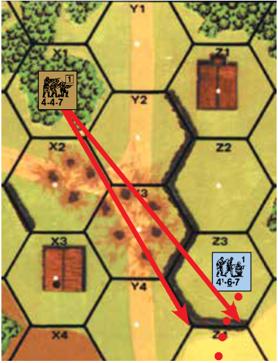

EX: If the 4-6-7 in 3Z3 were beneath a foxhole, no LOS would exist between the 4-6-7 and the 4-4-7 in X1, but the 4-4-7 would still have LOS to the foxhole, thus revealing it if hidden.

#### 9.3 TEM

**9.3 TEM:** The TEM of a wall is +2; the TEM of a hedge is +1. Fire traced through a wall/hedge hexside or hexspine may be subject to a TEM for that wall/hedge if the target is in the Location formed by that hexside/hexspine. If the LOS crosses the wall/hedge hexside through a road/gap depiction (such as 6W9-X9) the wall/hedge TEM can only apply if the target is a non-moving unit. PRC *[EXC: Motorcyclists]* never receive a TEM for a wall/hedge. The wall/hedge TEM is NA for DC attacks *[EXC: if thrown across a wall/hedge* *hexside, the TEM applies to both the target and thrower’s Location; A23.6]*.

##### 9.31

**9.31** The wall/hedge TEM is not cumulative with positive TEM of oth-er terrain in that hex, although it is cumulative with LOS Hindrances and SMOKE. A target unit claiming WA (9.32) does not receive in-hex TEM *[EXC: Runway (7.3); Air Bursts (9.34)]*, but receives wall/hedge TEM if ap-plicable *[EXC: it may elect instead to receive appropriate TEM for Emplace-* *ment or for a friendly AFV with which it shares WA (D9.3)]*. A target unit not claiming WA receives only in-hex TEM, but may instead use wall/hedge TEM vs enemy units which do not have WA over the hexside. In any case the wall/hedge TEM applies only as per 9.3. In order for a wall to justify firing HEAT at Infantry/Cavalry (C8.31), those units must be claiming-WA/receiv-ing-Wall-TEM. The amount of Residual FP left by an attack that crosses a wall/hedge hexside is reduced by that hexside TEM (A8.26) if hexside TEM could have been claimed against at least one firing unit—even if the moving unit is not claiming hexside TEM. See 9.36 and D4. for wall-TEM/HD-status for vehicles.

**9.32 WALL ADVANTAGE (WA):** A unit may claim WA over a same level wall/hedge hexside if it is an armed, unbroken ground level unit which is not: a vehicle eligible to receive in-hex TEM of ≥ 1 *[EXC: Height Advantage (10.31)/Cactus Patch (14.7)/Olive* *Grove (14.8)]*, in Column/Convoy, in a Fortified building possessing a Gun, on a bridge *[EXC: over a Roadblock]*, in a pillbox/cave, beneath an entrench-ment counter, above Wire/Panji or in a Location containing a non-hidden, non-prisoner enemy *[EXC: “broken” vehicle (A12.1)]* unit. A unit in Bypass may claim WA only over the hexside it straddles and the two hexsides of its hex that join that hexside. Units in a Location do not need to share the same WA status, but are still considered in the same Location for all purposes. Bro-ken or unarmed units may (must if 9.323 applies) claim WA if other units in the same Location claim WA.


A unit claiming WA is still considered occupying any obstacle/terrain as it would if not claiming WA for all purposes (e.g., Concealment Terrain, firing backblast weapon from building) *[EXC: 9.31]*. Lack of WA does not prevent LOS through a wall/hedge hexside of the viewer’s hex *[EXC: Entrenchments* *(9.21); bocage (9.521)]*.

###### 9.321

**9.321** A unit always has WA over all possible (as per 9.32) wall/hedge hex-sides of its hex; if it forfeits/is-denied WA over one of those wall/hedge hex-sides it cannot claim WA over any other hexsides *[EXC: in Deluxe ASL, WA* *is claimed/retained/lost per hexside—not hex]*. Adjacent units of opposing sides can never both claim WA over a shared wall/hedge at the same time; thus one of them claiming WA over the shared hexside prevents the other from claiming WA over any hexsides at all *[EXC: Deluxe ASL]*. EX: The 4-6-7 occupies 3T3 before the 4-4-7 moves ADJACENT to it in U3. If the 4-6-7 First Fires at the moving 4-4-7 as the latter enters U3 it may do so using FFMO and no wall TEM because (vs an adja-cent firer) the Wall TEM does not apply to a unit entering a hex if that firer qualifies for Wall Advantage. Assuming the 4-4-7 survives that attack, its AFPh attack vs the 4-6-7 will be affected by the +2 TEM of the wall because the German re-tains the Wall Advantage, but the hexside TEM of a target hex is not cumulative with that of the other terrain in the same hex so the build-ing +2 TEM does not also apply. However, if T3 could be fired on along a LOS that did not cross the wall hexside (e.g., from T4), the German might choose to use the building +2 TEM rather than the non-applicable wall +2 TEM. If he does (or if for any reason he chooses the building TEM rather than the wall TEM), the German must first lose the “Wall Advan” counter (9.31) and, if the Russian unit is adjacent, the “Wall Advan” counter automatically shifts across the wall hexside to the ADJACENT Good Order 4-4-7. On the other hand, if the 4-6-7 chooses to keep Wall Advantage it would be considered in Open Ground to any fire from the 6-2-8. A unit in V4 may not claim Wall Advantage because it is at a higher elevation than the wall hexside (9.35). EX: The 4-6-7 in 3Y3 has Wall Ad-vantage over the 4-4-7 that has just entered Z2. If another German unit enters Y2 or Y3 it will also qualify for Wall Advantage, because the Russian cannot claim the hedge TEM of either common hexside (since it does not have Wall Advan-tage over it). The Russian unit can-not “steal” Wall Advantage from ei-ther unit as long as the other retains Wall Advantage in the adjacent hex. Because the 4-6-7 has claimed Wall Advantage, it cannot also claim Shellhole TEM without first losing the Wall Advantage. If the 4-6-7 fires as a FG with another unit in X2 at the 4-4-7 in Z2, the hedge TEM would apply (A.5).

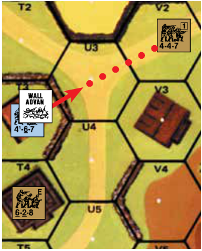

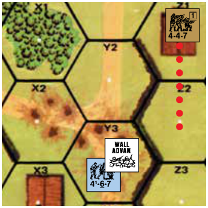

###### 9.322

**9.322** A unit claiming WA must always be marked with a “Wall Advan” counter. Placing a “Wall Advan” counter and claiming WA are synonymous, as are removing a “Wall Advan” counter and forfeiting WA *[EXC: 9.323]*. A Pinned, TI, or Immobile unit cannot voluntarily claim or forfeit WA. *Claim-* *ing* WA is voluntary *[EXC: 9.323]*, and can be done by a unit at five times: during its setup; at the *end* of any RPh (step 1.32B of ASOP, ATTACKER first); during its MPh/APh (either as part of, or before/after MF/MP expen-ditures); when losing HIP status; whenever all enemy units lose/forfeit WA over shared wall/hedge hexsides. WA must be forfeited immediately if a unit no longer fulfills 9.32 and may be forfeited at any other time. Claiming/for-feiting WA is *not* considered an action for RPh limits (A3.1) or concealment loss (A12.141). Claiming/forfeiting WA can never be done between an enemy action being declared and that action being completed, e.g., fire vs the unit claiming WA.

**9.323 MANDATORY WA:** A unit unable to claim in-hex TEM of at least +1 must claim WA as soon as possible regardless of timing (even if having in-hex Hindrance), and cannot voluntarily forfeit it *[EXC: 9.324]*. Neither Emplacement, Gunshield, Height Advantage, nor a friendly AFV with WA are considered to provide an in-hex TEM for this purpose. A “Wall Advan” counter is not necessary in this case, unless there is an enemy unit sharing one or more of the unit’s wall/hedge hexsides.

**9.324 CONCEALMENT:** A concealed unit (or dummy stack) may claim WA, but a dummy stack cannot prevent a non-dummy enemy unit from claiming WA over shared wall/hedge hexsides; the side trying to gain WA must first prove that it has at least one non-dummy unit by momentarily revealing one if all are concealed, and the opposing side must then momentarily reveal one non-dummy unit or forfeit WA. A HIP unit that desires to claim WA during setup must secretly record such WA status *[EXC: 9.323]*. A HIP unit may forfeit WA (even if it had been mandatory) to an enemy unit claiming WA (even implicitly; 9.323) over a shared hexside and remain hidden but must be placed on board (concealed) to deny an enemy unit from claiming WA, or to claim WA that is not mandatory and was not recorded, or to forfeit WA if no enemy is claiming it. Hidden units are not considered when determining if broken/unarmed units may claim WA (9.32).

**9.33 ELEVATION EFFECTS:** If a non-Aerial firer is at an elevation above the wall/hedge, the hexside TEM may be reduced. Determine the height of the firer above the base level of the target hex and reduce the TEM of that wall/hedge hexside by one for each full level by which the height difference exceeds the distance to the target hex (to a minimum TEM of 0). If a wall/ hedge TEM is reduced to 0 in an otherwise Open Ground hex, Interdiction and FFMO are allowed and any HD status is negated. If the TEM of a wall is reduced to +1 by elevation effects, any HD target is subject to a -1 drm to the colored dr of the To Hit DR of any such Direct Fire shot against it for Location of Hit purposes only. The TEM of shellholes, bridges, and entrenchments can be reduced in a similar manner by a firer’s elevation advantage.

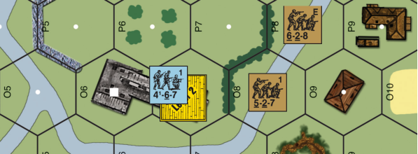

EX: The 4-6-7 on level 2 of 12O7 can ignore the hedge when firing into O8 because its level 2 height is \> the one-hex distance to the target. However, if the 4-6-7 fires on P8, it must still add a +1 hedge TEM because its level 2 height is not \> the distance (two hexes). A unit on the first level of O7 firing into O8 would still have to add a +1 hedge TEM because its elevation advantage (1) is not \> the range (1). The TEM of a unit entrenched in P7 would be reduced to +1 for attacks by the 4-6-7 at level 2.

**9.34 INDIRECT FIRE:** The TEM of a wall/hedge hexside is lowered by one for Indirect Fire, but this TEM applies (irrespective of WA) even if that hexside is not crossed by the incoming fire. Only one wall/hedge TEM can be applied to the resolution of such fire, regardless of the number of such features present in the target hex. A hedge TEM reduced thusly to zero would still negate FFMO/Interdiction for a mortar whose LOF enters the hex via the hedge hexside. A target is never HD (D4.2) to Indirect Fire. If in a woods hex, Air Bursts (13.3) applies—even if the unit has WA (but is combined with wall TEM if applicable).

##### 9.35

**9.35** A wall/hedge which lies along a hexside common to two adjacent hexes with different Base Levels is on the lower of the two Base Levels if some of the lower Base-Level’s terrain is depicted between the wall/hedge depiction and the crest line (e.g., 3U4-V4). If not, the wall/hedge is a Hillside wall/hedge (9.6). A wall/hedge provides no TEM or HD status to a target Location that is at a different elevation than the base elevation of the wall/hedge. EX: Fire against a 4-4-7 in 41R4 (Level 1) would not be affected by the Q5-R4 hexside (Half-Level obstacle on level 0), nor by the P4-R4 hedge hexspine, but a unit in P4 could claim hedge TEM if attacked from R4 due to the P4-R4 hexspine. EX: The 4-6-7 with WA in 41Q5 cannot deny the 5-2-7 in P4 WA (over O4-P4) since the two units do not share any wall/hedge hexsides, nor could it deny an enemy unit in R4 WA if R4-R5 were a wall hexside. The 4-6-7 does deny WA to the 4-4-7 in Q6 since they share the Q5-Q6 hedge hexside (9.321). The 4-6-8 in R5 may not claim WA because it is at a higher elevation than the hedge hexside (9.35). Claiming WA, the 4-6-7 receives hedge TEM vs fire from the 4-4-7, and no TEM vs fire from the 5-2-7 since a unit claiming WA never receives in-hex TEM. It is the Russian PFPh, and the 5-2-7 declares an attack (with no TEM). The 4-6-7 would not be able to forfeit WA and claim building TEM until after the attack has been resolved. After having thusly forfeited WA, the 4-6-7 may choose between the building and hedge TEM if fired on from P6 or R6, but must use the building TEM if fired on from the 4-4-7 (assuming the 4-4-7 now has WA) even though Q5-Q6 is a hedge hexside, since a unit without WA may only use wall/hedge TEM vs units which do not have WA over that hexside (9.31). Furthermore, the 4-4-7 may immediately claim WA since all enemy units sharing wall/hedge hexsides have forfeited WA (9.322). If the 4-4-7 claims WA and later becomes broken or moves, the 4-6-7 may similarly claim WA even if it has previously forfeited it that Player Turn. Assume the 4-6-7 retained WA and survived Prep Fire. When the 4-4-7 moves to P5, the 4-6-7 denies it WA and First Fires on it using FFMO and no TEM because the hedge TEM is NA vs a firer with WA over that hexside. If the 4-6-7 fires as a FG with the 4-6-8 in R5, the hedge TEM applies (A.5). During the next German MPh, the 4-6-8 moves from R5 to Q6 and although it could claim WA as part of the MF expenditure for entering the Location (the 4-4-7 in P5 is still denied WA by the 4-6-7 in Q5, and therefore cannot prevent the 4-6-8 from claiming WA), it chooses not to do so. If the 4-4-7 (or the 6-2-8 in Q7) First Fires now, the attack will be subject to building TEM. After this the 4-6-8 may still claim WA (since it has not yet completed its MPh) even if not spending additional MF, but if doing so the 4-4-7 may (Subsequent) First Fire subject to the hedge TEM and the 6-2-8 may (Subsequent) First Fire with FFMO (assuming the DEFENDERs haven’t exhausted their First Fire capability based on the three MF expended when entering the Location). The 4-6-8 may wait until the APh to claim WA, but if the 4-6-7 in Q5 becomes broken (or leaves) before this, the 4-4-7 in P5 must claim WA (9.323) and will thereafter prevent the 4-6-8 from claiming it.

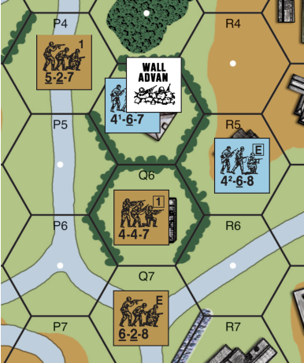

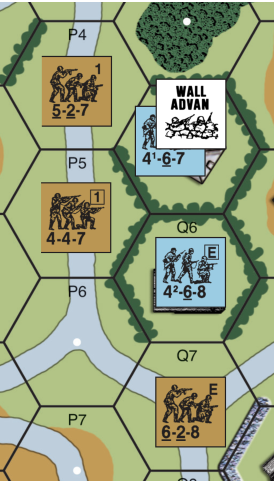

**9.36 HULLDOWN:** Any vehicular target fired on by Direct Fire ordnance subject to wall TEM is considered HD (D4.2) instead of receiving the wall TEM. However, if also able to claim in-hex TEM (9.31), the player may choose in-hex TEM instead of HD benefits (D4.2)—after the attack declaration, but *before* the attack DR is made. If attacked by non-ordnance, the vehicle (but not its PRC) receives the wall TEM (or in-hex TEM). Hedges do not create HD status.

<!-- page 121 -->

EX: The PzIII in 43O10 in Bypass along O10-O9 and the PzIV each have WA and are HD to ordnance attacks from to all 3 Russian AFV. The KV-1S receives no protection from attacks by the panzers, but the PzIV cannot use its BMG against targets in O9 (D4.223). Both the T-34 and IS-2 receive building TEM from attacks by the PzIII and both can qualify for *either* building TEM *or* HD status for attacks from the PzIV (although neither can use its BMG against targets in P9—or vice versa). If the PzIII were in Bypass along O10-N10 instead, it would have WA vs the T-34 but not vs the KV-1S (9.32). The PzIII would still be HD vs all 3 Russian AFV, but now the KV-1S would also be HD vs the PzIII (9.31). In its MPh the PzIII starts and enters P9. The T-34 cannot claim WA because it is eligible for in-hex TEM (9.32). Despite the fact that the PzIII has WA (thanks to the PzIV), it is not HD to the KV-1S through the gap in the wall because it is moving (even if it Stops; C.8). The PzIII changes its VCA to P8-Q9 and enters P8. It has WA (and thus is HD to all 3 Russian AFV) because the KV-1S cannot claim WA (thanks again to the PzIV) and because the IS-2 (occupying in-hex TEM of ≥ 1) also cannot claim WA. If the IS-2 had been in Bypass along either the O9-O8 or P8-O8 hexsides, it would have retained WA, thus denying it to the PzIII. The IS-2 would be HD vs the PzIII, while the KV-1S and PzIII, each lacking WA, would be HD to each other (and thus unable to use their BMG against targets in each other’s hex).

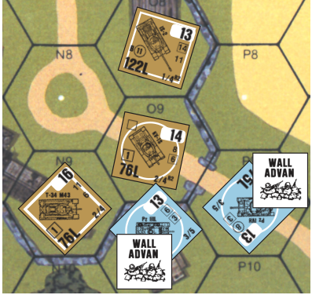

**9.4 MOVEMENT:** The cost for Infantry/Cavalry to cross a wall/hedge hexside is one MF plus the COT of the hex moved into. The cost for various types of vehicles to cross a wall/hedge is indicated on the Chapter B Terrain Chart. A vehicle failing a Bog Check for crossing a wall/hedge is Bogged in the hex it attempted to leave. Wall/hedge hexsides are never expressed as a COT, but rather as an addition to COT. Therefore, when a unit must pay double its normal MF cost to cross a Crest Line it pays double the COT of the hex plus the one MF for its hexside. Some wall/hedge hexsides such as 6W9-X9 have obvious gaps in them which can be crossed without paying the wall/hedge MF/ MP penalty (by using the road if one exists). EX: See the 9.41 illustration. It costs three MF to move from 55H7 to I8 (1 + [2×1] = 3).

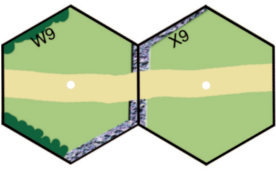

##### 9.41

**9.41** WA is always lost when a unit starts entering a new Location. A unit may not re-claim WA during its MPh if exit of its current Location fails (e.g., A12.15, B28.41, E1.53) unless mandatory WA (9.323) applies. EX: It is the German MPh, and both German squads have WA. The 4-6-7 moves to 55H6, and immediately loses WA, allowing the 7-4-7 to claim it. If the 7-4-7 claims WA, it will be able to fire at the 4-6-7 using FFMO (or no TEM if declaring a Snap Shot vs the G6-H6 hexside). If the 7-4-7 does not claim WA, the 4-6-7 automatically gains it when entering H6 (9.323), and therefore receives the wall TEM vs all attacks, even a Snap Shot (depending on LOS; A8.15, 9.42). The 4-4-7 in H7 now attempts to enter I7, revealing

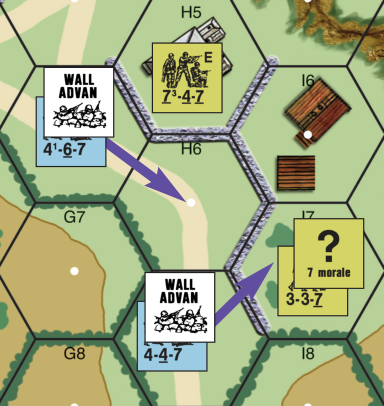

the 3-3-7 and forcing the 4-4-7 back to H7 (A12.15). Even though the 4-4-7 has not left its Location, the WA is momentarily lost, allowing the 3-3-7 to claim it and fire on the 4-4-7 with FFMO, but only if the 4-6-7 did not gain WA in H6.

**9.42 VERTEX LOS:** During bypass movement (including VBM), and when targeted by a Snap Shot, LOS is drawn to a vertex (two in the case of a Snap Shot against the entire hexside). If such a vertex is part of a wall/ hedge hexside, that wall/hedge affects the LOS and provides TEM (or HD status), if:

- the LOS is drawn exactly along that hexside (regardless of which of the three hexes forming the vertex, the target unit occupies), or
- the target unit is in one of the two hexes formed by that hexside (C.5), and the LOS enters the vertex via the opposite hex (including its hexsides).

Targets of Underbelly Hits never receive wall/hedge TEM from any of the three hexsides forming the target vertex (D4.3).

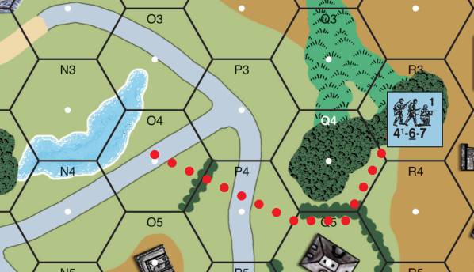

EX: The 4-6-7 declares Double Time and bypasses 41Q4 along Q4-R4. For LOS to the Q4-Q5-R4 vertex to be affected by the Q4-Q5 hedge, the LOS must be drawn along the hexside (e.g., from P4), or enter the vertex via the hex on the opposite side of the hedge (e.g., from O5 or from a unit without WA in Q5). The hedge does not affect fire from O4 where the LOS enters the vertex via Q4, or from R4. The 4-6-7 now expends 2 MF crossing the hedge and bypassing Q5 along the Q5-Q4 hexside. LOS can now be drawn to either the same vertex as before, or to Q5-P4-Q4 (A4.34). If drawn to the former, LOS from P4 is still affected by the hedge, but the target is now in Q5, so hedge TEM is applied from O4, but not from O5 or Q5. For LOS to the Q5-P4-Q4 vertex, the hedge TEM applies from R4 and P3, but not from O3, O4 or O5 since their LOS do not go through Q4. The 4-6-7 then enters P4 and O4. If a Snap Shot is declared along the O4-P4 hedge hexside, LOS must be drawn to both vertices (as part of the hexside). Hedge TEM applies if LOS is drawn from O5 or P3 (along the hedge hexside), P5, Q3, Q4, Q5 (from the opposite side of the hedge as the unit which is now in O4; A8.15)—but not from N3, N4, O3 or P2. If instead the 4-6-7 entered P3, a Snap Shot would receive the hedge TEM only from O5.

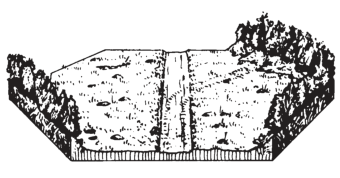

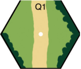

**9.5 BOCAGE:** Bocage (or hedgerow) is a special form of hedge grown on top of low earthen mounds to form a natural wall. All rules pertaining to walls *[EXC: HEAT NA (C8.31)]* are applicable to bocage except as modified below.

##### 9.51

**9.51** Bocage is depicted by wall/hedge hexsides as specified by SSR.

##### 9.52

**9.52 LOS:** Bocage is a one-level LOS obstacle with a difference. Although a defender behind (but in the Location formed by) a bocage hexside may be in the LOS of a higher level firer, the next hex along that LOS through that bocage hexside is a Blind Hex (A6.4). Treating that bocage hexside as instead being a “Single-Story House” in that defender’s hex is a good way to visualize how it creates Blind Hexes vs that higher-level viewer *[EXC: The number* *of blind hexes can be reduced to zero; 9.531]*. LOS cannot be traced along a bocage *hexspine* as can be done with a wall (9.2). A bocage *hexspine* is treated as a normal one-level obstacle in all respects.

**9.521 HEXSIDE LOS:** LOS may be traced through a bocage hexside to the hex formed by that hexside, but what can be seen depends on the viewer’s status:

- *A viewer having WA over that bocage hexside*: can see freely through the bocage hexside and any hex beyond it.
- *A viewer in a hex formed by the bocage hexside, but without WA*: can see through the bocage hexside to the adjacent hex, but not beyond that hex. It can see anything in that hex.
- *A viewer not in a hex formed by the bocage hexside*: can see through the bocage hexside, to the hex forming that hexside, but not beyond that hex. It cannot see units without WA nor their possessed equipment, but it can see everything else in that hex.

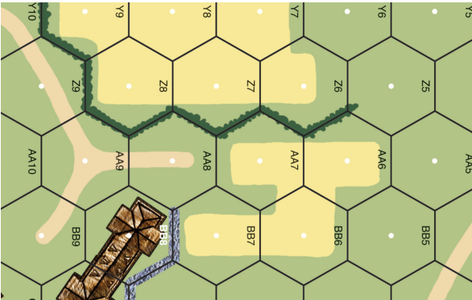

EX: All hedges are bocage. A unit in 44BB8 can see into (but not through) Z6 to Z8 (thus revealing HIP counters per A12.33), but cannot see units without WA in those hexes, nor see Z5. If BB8 had a rooftop, a unit there at level 1½ could also see hexrow X and beyond, but not Y6 to Y9 due to the Blind Hex (9.52; i.e., its LOS would be blocked by the “Single- Story Houses” in Z6 to Z8). It could not see Z5 because the Z6-AA6 hexspine is treated as a one-level obstacle for LOS purposes (9.52) creating one blind hex. It could however see the Y5-Z4 hexside and take a Snap Shot vs a unit crossing it. If it were on level 3, it could see Y6 to Y9 (9.531), but still neither Z5 nor any units without WA in Z6 to Z8. A unit in AA8 can see Z7 and Z8, and with Wall Advantage beyond to Y6 to Y9, but cannot see Z6 or Z9 because LOS cannot be traced along a bocage hexspine (thus also prohibiting Snap Shots from AA8 to hexside Z9-AA9).

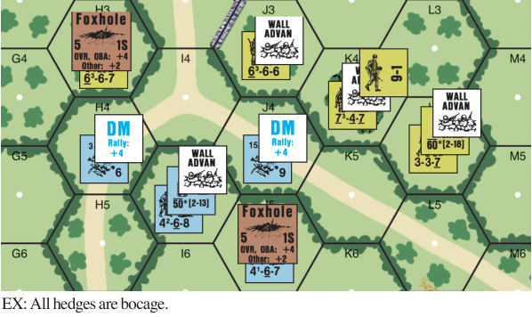

- The 4-6-8 in 54I5 can see all American-occupied Locations (including the Foxhole), but not the 9-1 nor the entrenched 6-6-7—nor hexes K3, L3, etc. The 6-6-7 and 9-1 are therefore immune to Direct Fire attacks. If attacking with the MTR, the 6-6-7 in H3 cannot be hit, but the 9-1 in K4 is hit if the 7-4-7 is hit (C3.33).

```text
•   The 4-6-7 in J5 cannot see any enemy Location.
•   The broken 2-3-7 in H4 can see the adjacent 6-6-7 and units with WA in J3 and K4.
•   The broken 6-5-8 in J4 can see all units in J3 and K4.
•   The entrenched 6-6-7 in H3 can only see the adjacent broken 2-3-7.
•   The 6-6-6 and the 7-4-7 can see all enemy Locations, but not the entrenched 4-6-7.
•   The 9-1 can only see the adjacent broken 6-5-8, so he cannot direct any attack made
```

by the 7-4-7 vs other German units, but is still able to direct MC/TC taken by the 7-4-7 even if attacked by units not in the leader’s LOS (e.g., the 4-6-8).

- The 3-3-7 can see the 4-6-8, but no other German unit, though it can see the 4-6-7’s Location, including the Foxhole. If the 3-3-7 attacks J5 with the MTR, the 4-6-7 cannot be hit since there are no non-hidden enemy units in LOS (C3.33). However, if it declares a WP MTR attack (with +2 Case K; C6.2) and hits the hex, the 4-6-7 must take the WP NMC, because all units in a Location with a WP counter must take a NMC when the WP is placed in that Location (A24.31).

##### 9.53

**9.53** A non-vehicular Direct-Fire Gun may not both change CA and fire through a bocage hexside in the same fire phase (counting Defensive First Fire and Final Fire as one phase—A.15).

###### 9.531

**9.531** Elevation advantages (9.33) have no effect on the TEM of bocage but can reduce the number of Blind hexes caused by bocage *hexsides* to zero, as per A6.42. The number of blind hexes created by a bocage *hexspine* cannot be reduced below one.

**9.54 MOVEMENT:** To cross a bocage hexside costs Infantry two MF plus COT. No other unit may cross a bocage hexside except a fully-tracked AFV. An AFV crossing a bocage hexside cannot use Reverse-movement/carry- Riders, and is subject to Underbelly Hits, loss of Schuerzen (D11.2), and Bog (in the hex being exited), as it crosses the bocage hexside *[EXC to all: if crossing via an obvious gap (9.4) or existing Breach (9.541)]*.

**9.541 BREACH:** A Dozer tank, bulldozer, or AFV designated by SSR as being equipped with the Culin hedgerow device or similar equipment (after 7/25/44) may breach a hedgerow it traverses by expending its entire MP allotment *[EXC: Start MP]* to cross that hexside and passing a Bog DR. Failure to pass the Bog DR leaves the vehicle Bogged in the hex it started in and leaves the bocage unaffected. Such a vehicle engaged in breaching a hedgerow may not use Reverse-movement/carry-Riders, but is not subject to Underbelly Hits. Mark the affected hexside with a Breach counter so that the arrow points to that hexside. Thereafter, movement/Manhandling (C10.3) across that hexside is treated as if the bocage did not exist, but the Breach has no other effect on bocage rules.


**9.55 CONCEALMENT:** An Infantry/dummy unit capable of claiming bocage TEM vs all enemy (Good-Order/unbroken, as per A12.1) ground units with a LOS to it, is treated as being out of all enemy LOS and in Concealment Terrain for all setup and “?” gain purposes. Such a unit is treated as out of all enemy LOS for “?” loss purposes during the RPh and loses “?” during its MPh as if using Assault Movement. If a Good Order enemy unit has LOS through non-bocage at the end of both sides’ setup prior to the start of play, any HIP/“?” allowed solely due to being in a Location containing a bocage hexside is lost. During play, if a Good Order enemy unit has a LOS not affected by bocage TEM to a unit that has set up using HIP solely due to being behind bocage, the HIP unit is immediately placed on board Concealed.


<!-- page 123 -->

EX: All hedges are bocage. By SSR the German player (who sets up first) is allowed to set up ≤ 2 squad equivalents using HIP. He hides a squad in 55R1 and hides two HS in Q1 and Q2 (shown with red borders) despite being non- Concealment terrain, because they have ≥ 1 bocage hexsides. He also uses two OB-designated “?” for a dummy stack in R2, which is allowed for the same reason. The British player sets up a 4-5-7 in S1, with LOS to Q1 and R2 through *non*- bocage hexsides, so the 2-3-7 is placed onboard unconcealed and the dummy stack is eliminated when the British setup has been completed. The squad in R1 remains hidden due to being in an orchard hex. During the British MPh, the 6-4-8 moves to Q3, thereby forcing the hidden 2-4-7 to be placed onboard beneath “?”. EX: All hedges are bocage. It is the British PFPh and the 6-4-8 in 54K4 prep fires against the 4-6-7 and breaks it. A lone broken unit cannot claim WA (9.32), even in a hex where mandatory WA (9.323) otherwise applies; the 4-6-7 therefore loses WA and disappears out of LOS from both British units, making it immune to further attacks. During the British MPh, the concealed 3-3-8 uses Non-Assault Movement and enters K4 without claiming WA (due to the woods TEM), and is therefore out of the 4-4-7’s LOS. It continues to L4 where it *must* claim WA (9.323), thereby moving within the 4-4-7’s LOS, but still retaining Concealment

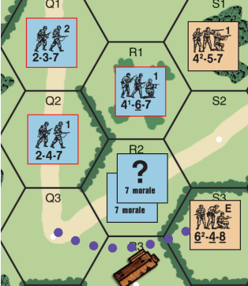

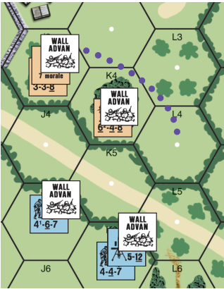

since the movement is treated as Assault Movement for “?”-loss purposes (9.55). Similarly, the 3-3-8 would *not* lose Concealment by entering/exiting a foxhole or changing Crest status, but *would* lose Concealment by performing any other Concealment loss actions (A12.141) besides movement in L4 (e.g., placing a DC). The 4-4-7 and MMG attack with 4 FP (9 FP halved for Concealment) and +2 DRM (+2 [bocage TEM] +1 [orchard Hindrance] -1 [FFNAM]), to no effect but retains ROF. No Residual FP would be placed even if ROF had been lost, since the Residual FP is reduced three columns due to orchard and bocage. (If there were a German 2-4-7 in L5 with WA, the 3-3-8 could not claim WA when entering L4. WA is claimed per *hex*, not per *hexside [EXC: Deluxe ASL]* and the German 2-4-7 having WA over the L4-L5 hexside is enough to prevent the 3-3-8 from claiming any WA at all in L4. In this case the LOS from the 2-4-7 would not receive bocage TEM, so the 3-3-8 would lose “?” and be subject to FFMO from the 2-4-7, but would be out of LOS from the 4-4-7 in K6, and therefore immune to attacks from it.) At the start of the German DFPh, the 6-4-8 drops WA (which he could have done anytime after firing [9.322]), thereby disappearing from the 4-4-7’s LOS. So the 4-4-7 instead fires its MMG at the concealed 3-3-8 which cannot drop WA. A PTC is rolled, forcing loss of the 3-3-8’s “?”. At the start of the British APh, the situation is as shown to the right. During its APh the 6-4-8 claims WA again (which was the earliest it could do so [9.322]). At the end of the British CCPh, both British MMC gain “?” since all enemy LOS is traced through bocage hexsides (9.55). At the start of the next German Player Turn, the 4-6-7 rallies and immediately gains WA (9.323). The British 6-4-8 then forfeits WA again to avoid German Prep Fire. During the German MPh, the 4-6-7 Assault Moves to K5 where it is prevented from claiming WA by the 3-3-8 in L4. The 6-4-8 cannot re-claim WA at this point, so its attack against the 4-6-7 receives the +2 bocage TEM, while fire from the 3-3-8 receives FFMO. If the 6-4-8 and 3-3-8 formed a FG, the attack would receive +2 bocage TEM and no FFMO.

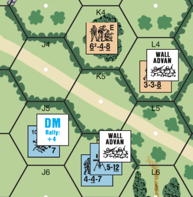

EX: All hedges are bocage, and Deluxe ASL rules are in effect. For purposes of this example, white WA markers represent the situation after the British Infantry moves, and light pink markers (as well as the Carrier wreck) represent the situation at the end of the MPh. A German 6-5-8 squad in gM3 has WA over all 4 wall and hedge hexsides. A British 4-4-7 squad enters L3 and claims WA over L3-M4, L3-L2, and L3-K3, while the German squad retains WA over L3-M3. The British squad has no LOS to any non-adjacent hexes where the LOS crosses the L3-M3 hexside inclusive of vertices; e.g., M2, N2, and N3 (9.521). A British Carrier moves into L2 and then into M3 forcing the German squad to lose all WA as soon as its Location becomes occupied by an armed enemy unit (9.32). The British 4-4-7 automatically gains WA over L3-M3 as soon as all enemy units have lost WA (9.323). The German squad eliminates the vehicle and its crew with CC Reaction Fire, and immediately regains WA over M3-L2, M3-M2 and M3-N2 (9.323). If in-hex TEM were available, it could not regain WA over those hexsides until the following RPh (9.322). In either case, if it manages to break the British 4-4-7 in Final Fire, the broken British loses WA per 9.32 and the German squad automatically gains WA over L3-M3 (or could voluntarily claim it if in-hex TEM were available).

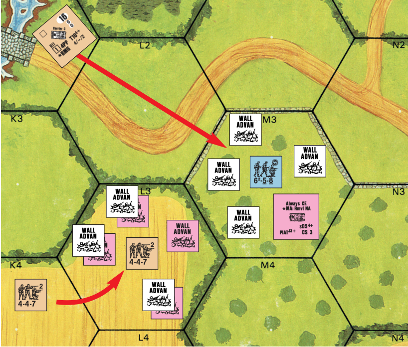

<!-- page 124 -->


**9.6** **HILLSIDE WALL/HEDGE:** A Hillside wall/hedge is one which lies along a hexside that is common to two adjacent hexes with different Base Levels, with none of the lower Base-Level’s terrain appearing between the wall/hedge depiction and the higher Base-Level’s terrain depiction. Exam-ples of Hillside walls/hedges are 25B4-B5, 25C5-C6, 25U3-U4, 25V9-W9, 25X4-X5, 8M4-M5, 8X3-X4, 12X4-Y4, and 13S4-S5. All normal wall/ hedge rules apply to Hillside walls/hedges except as modified herein.

##### 9.61 LOS

**9.61 LOS:** A Hillside wall/hedge (including both its depiction and its associ-ated hexside; 9.1) is ignored (even along a Continuous Slope) when determin-ing whether or not a LOS exists between units whose elevations differ by ≥ one full level *[EXC: a unit entrenched behind a Hillside wall/hedge still has* *its LOS restricted as per 9.21]*. It is likewise ignored when determining the number of Blind Hexes created by a Crest Line. If a hill Crest Line ends at a Hillside wall/hedge, *the line along which the hill depiction meets the wall/* *hedge depiction* is considered to be the actual Crest Line.


EX: The 4-6-7 in 25W4, the 4-3-6 in W5, and the Crest-status 4-6-8 in V5 all have a LOS across one or more wall hexsides/hexspines to the following hill hexes: U7, V6, V7, W6, W7, W8, X5, X6 and X7 (although they could see entrenched units in V6/W6/ X5 only if adjacent to them). A unit IN V5 would have a LOS to all those same hexes *[EXC: not to any entrenched unit(s) in X5]*. The 4-6-7 also has a LOS to the Crest level of Y7. The 4-3-6 also has a LOS to Y5. In no case could any of these units claim wall TEM vs an attack coming from any of these in LOS hill hexes.

**9.62 ELEVATION, TEM & WALL ADVANTAGE:** A Hillside wall/hedge is always at the *higher* of the two Base Levels it lies between, and is treated as a normal wall/hedge when calculating the TEM of targets at ≥ the wall/hedge’s base elevation. However, a unit at any level *lower* than that on which a Hillside wall/hedge sits never receives *any* benefit (including Wall Advantage; 9.32) from that wall/hedge hexside. A unit in Crest status may claim Wall Advantage over a Hillside wall/hedge that forms a hexside of that unit’s hex only if both are at the same elevation and on the same side of the Depression. Otherwise, a unit’s inability to claim Wall Advantage over a Hillside wall/hedge hexside does not prevent it from claiming Wall Advantage over another wall/hedge hexside, provided the unit meets all the other B9 criteria for doing so.


B4-A5 or B4-B5, then it could, if having Wall Advantage, claim hedge TEM vs the 4-5-8/4-5-7 since it would be at the same level as, and directly behind, the hedge. If it claimed Wall Advantage it could not also claim entrenchment TEM vs the 4-5-8 [9.31], but if it did not claim Wall Advantage while in crest status, the 4-5-7’s attack vs it would still be affected by the B4-B5 hedge TEM [9.3]. Regardless of whether or not the crest 4-6-7 claimed Wall Advantage, the 4-5-7’s attack vs it would not be affected by entrenchment TEM [20.92]. Neither the 4-6-8 IN C5 nor the Crest-status 4-4-7 in C5 can claim hedge TEM vs, or Wall Advantage over, the 4-5-7 because both German squads are lower than the C5-C6 hedge’s base elevation. If the hero in B6 attacks the C5 Germans, the 4-4-7 (but not the 4-6-8) can claim the B5-C5 hedge TEM (9.3). (The C5-C6 level-one hedge cannot affect that attack by the hero.) Provided neither the 4-5-8 nor the 4-5-7 were already marked with a Wall Advantage counter the 4-4-7 could claim Wall Advantage over the B5-C5 hedge even though it cannot claim it over the higher-level C5-C6 hedge. If the 4-5-8 fires at the Crest-status 5-4-8 in D5, the latter cannot claim hedge TEM since it is a level lower than hexsides C5-C6 and D5-C6.

**9.7 CACTUS HEDGE:** A SSR may specify that walls/hedges are cactus hedges. All hedge rules apply to such hexsides—except that Infantry may cross one only via Minimum Move (A4.134), Low Crawl (A10.52) or Advance vs Difficult Terrain (A4.72), and that Cavalry, Horses and Wagons may not cross one at all.


## 10. HILLS

#### 10.1

**10.1** Hills represent terrain elevations which rise above ground level, and any terrain upon them rises normally from this new level to form new height equivalents. For example, a one level obstacle on a level 1 hill hex becomes a level 2 obstacle to the LOS of a unit at level 0. Inherent Terrain (B.6), whether a one-level Obstacle or Hindrance (e.g., orchard) or a half-level Obstacle (rubble) or Hindrance (crag, wreck) rises from the actual hill depiction (i.e., in a Hill-Orchard hex, LOS that crosses the hill depiction is affected up through level 2; LOS that does not cross the hill depiction is only affected through level 1). Other terrain (e.g., grain, brush, woods, building) is at the higher level throughout the entire depiction of the terrain in question for LOS purposes (but the actual Crest Line is always used for movement purposes), even if it *appears* to be rising from the lower level portion of the hill hex *[EXC: Newer* *boards may depict visible Crest Lines beneath this other terrain (EX: 61F8),*

<!-- page 125 -->

*in which case the actual Crest Line is used to determine LOS as is the case* *with Inherent Terrain]*<sup>3A</sup>. A hill mass is depicted in various shades of brown; the lightest shade in any group of contiguous brown hexes being level 1, the next darker shade being level 2, and so on. The specific shades often vary from one board to another and are relevant only in comparison to the other shades of the same hill mass. For aesthetic purposes, many hexes contain col-ors representing more than one elevation, but units therein are always consid-ered at the elevation level containing the hex center dot. EX: LOS from 36AA8 to 36GG2 sees “over” (B.4) the orchard in DD4 rising from level 0. LOS from 36CC4 to 36U5 is blocked by the woods in 36BB4 rising from level 2. EX: Level One Hill hexes: 2G4, 15J1, 18Y8; Level Two Hill hexes: 2I4, 15Y8, 18Y7; Level Three Hill hexes: 2J4, 9X6, 15X6; Level Four Hill hexes: 9O5, 15Y6.

**10.11 CREST LINE:** A Crest Line is formed in every hex where two differ-ent full-level elevations meet. Crest Lines are important both for determining movement costs and defining the slope of a hill for possible LOS obstructions.

**10.2 DIFFERENT LEVEL** **LOS:** A lower level unit may trace a LOS into only the initial Crest Line hexside of each level above it. Likewise, a unit may trace a LOS to a lower level only if the higher unit traces its LOS through a Crest Line as it leaves its hex and this LOS never recrosses another Crest Line of the same or higher elevation *[EXC: A unit may always* *trace a LOS through a Crest Line* *in an adjacent hex of lower elevation (15Y4 can fire through Y3 to* *Y2 and along the Y3-Z3 hexside to* *Z2 but it cannot fire through Z3 to AA3)]*. Even if a LOS survives this test it can still be blocked by other requirements such as 10.23.


EX: Using the Alpine Hill option, the only level 2 hill hexes on board 3 which can be seen from 3K7 are J7, J6, H2, W5, W6, W7, and DD2.

##### 10.22

**10.22** A unit always requires a height at least equal to the height equivalent of an obstacle to see past it to a same-level target. Therefore, a unit on a Level 1 hill hex or on the first level of a building is high enough to see over ground level woods (or any other level 1 obstacle at ground level) symbol to a level 1 or higher target. It is also high enough to see over a wreck/AFV or Half-Level Obstacle (such as a wall/hedge) at ground level and thereby negate the effects they exert on a same-level LOS, although TEM may apply as per 9.33.

**10.23 BLIND HEXES:** A lower level non-cliff Crest Line creates a Blind Hex to a higher level viewer only if that Crest Line is at least five hexes away from that viewer and the next hex along his LOS has a lower elevation than that of the Crest Line hex *[EXC: If the elevation level difference caused by* *that Crest Line and the next hex along the LOS is ≥ two, at least one Blind* *Hex is created (unless adjacent) even if within five hexes of the higher lev-* *el firing hex]*. One Blind Hex is created for each elevation level difference caused by that Crest Line. In summary, the nominal effect of a one-elevation change Crest Line to a higher level viewer is to create no Blind Hexes at a range of 1-4, one Blind Hex at a range of 5-9, two Blind Hexes at a range of 10-14, three at a range of 15-19, etc. The Blind Hexes created by these Crest Lines can be reduced to a minimum of zero by A6.42 or increased by A6.43. EX: (A) 15Y6 (level 4) cannot see U7—even though it is only four hexes away—be-cause the V6-U7 cliff hexside creates a drop of two elevation levels, creating a Blind Hex (U7) and also because it is a cliff hexside (11.21). (B) Y6 can see X6, W7, V7, and U8 because each Crest Line creates only a one elevation level drop and each is within four hexes of Y6. It is also a Continuous Slope. (C) Y6 can see EE3 even though the Crest Line in DD3 is five hexes away and creates a Blind Hex, because Y6 (level 4) has a three level elevation advantage over DD3 (level 1) sufficient to negate two Blind Hexes, and an elevation advantage can reduce the number of Blind Hexes to zero in the case of Crest Lines (A6.42). (D) Y6 cannot see EE5 because the 3rd level Crest Line in DD5 is five hexes away and therefore creates a Blind Hex in EE5 which cannot be negated by the one level elevation advantage of Y6. (E) X6 (level 3) cannot see K7 be-cause the second level Crest Line in M7 creates two Blind Hexes at 11 hex range and the elevation advantage of X6 is insufficient to negate them. However, from Y6 the two

```text
                                                                                     Blind Hexes caused by the M7 Crest Line at 12 hex range can be reduced to one due to
                                                                                     the two level elevation advantage of Y6 (A6.42). (F) CC5 (level 3) cannot see CC1 due
                                                                                     to the one level woods obstacle (level 1 woods on a level 1 hill) at CC3 which causes
                                                                                     two Blind Hexes over the lower terrain behind CC3 (A6.43). (G) Q4 can see M2 be-
                                                                                     cause the O3 building presents only a one level obstacle (A6.43) and therefore creates
                                                                                     only one Blind Hex. If M2 were a Level 0 hex, O3 would cause two Blind Hexes.
                                                                                     10.3 The TEM of a hill hex is dependent on the other terrain in the hex/the
                                                                                     LOS of the firer. Barring other terrain in the hex or an applicable Height Ad-
                                                                                     vantage, a hill hex is considered Open Ground for TEM, Interdiction, and
                                                                                     Rout purposes, provided a LOS to it exists.
                                                                                     10.31 HEIGHT ADVANTAGE: Any unit in a hex receiving Direct Fire
                                                                                     from a lower elevation is entitled to a +1 TEM, provided that unit is not eli-
                                                                                     gible to receive any other positive TEM or CE DRM other than those caused
                                                                                     by LOS Hindrances [EXC: a moving unit being fired on by Defensive First
                                                                                     Fire is not eligible for the Height Advantage TEM if in entering the target
                                                                                     hex it crosses a Crest Line through the same hexside that is intersected by
EX: A unit in 3F9 can trace a LOS to level 1 hill hexes G10, G9, F8 and level 2 hill the firer’s LOS]. A unit eligible for the +1 TEM for Height Advantage is not
hexes H7 and I8, but not to any other hex of hill mass 534.                          subject to Interdiction/FFMO by an attack to which that +1 TEM applies.
10.21 SAME LEVEL LOS: Units at the same level can trace a LOS to each                                                             EX: The squads in 3AA2 and BB2
                                                                                                                                  both use Assault Movement to enter
other (barring intervening LOS obstacles—including higher Crest Lines) re­                                                        BB1. If fired on from Z1, the 4-6-7
gardless of the presence of intervening equal or lower elevation Crest Lines.                                                     would be subject to a FFMO DRM
EX: 3E3 can see 3J7 or any other level 2 hill hex of hills 534 and 547. A unit on level 1                                         (instead of the +1 Height Advan­
of building 3L4 can see 3F7.                                                                                                      tage TEM) because it crossed a
                                                                                                                                  Crest Line along the same hexside
                                                                                                                                  intersected by the LOS in entering
*10.211 ALPINE HILL OPTION: The previous rule treats hills as a series                                                            the target hex, but the 6-5-8 would
of plateaus rather than constantly rising and rolling terrain. Those wishing to                                                   be eligible for a +1 TEM for Height
simulate the latter style of terrain can invoke a SSR for Alpine Hills by allow­                                                  Advantage (and thus not FFMO) in­
ing equal-elevation hill hexes to block LOS through (not into) them.                                                              stead because it did not cross a Crest
                                                                                                                                  Line intersected by the LOS while
                                                                                                                                  entering the hex. If these units were
                                                                                      instead routing, only the 4-6-7 could be Interdicted from Z1.
                                                                               B14
```

<!-- page 126 -->

#### 10.4

**10.4** Units crossing a Crest Line into higher terrain must pay an increased movement cost. Infantry, Cavalry, and Horse-Drawn units crossing a Crest Line into higher terrain must pay double the COT of the hex entered, vehicles must pay four MP & COT (unless they enter via a road hexside, in which case they pay two MP plus the COT of the hex entered). Bicycles and ski units can gain MF by moving to a hex of lower elevation, but otherwise movement cost for entering a hill hex is dependent on the other terrain in the hex.

**10.5 ABRUPT ELEVATION CHANGES:** An Abrupt Elevation Change occurs when a unit enters two or more levels while crossing one non-cliff hexside; e.g., 15R3/R4, or 8CC6/DD5, or 13L5/L6, or 15BB8/AA9 or 12Y4/Y5 (see 19.4 example). Abrupt Elevation hexsides have special movement costs/ restrictions.

##### 10.51

**10.51** When a unit crosses an Abrupt Elevation hexside, the calculated terrain cost of each level entered becomes cumulative. Each intermediate level (i.e., each level *between* the unit’s initial and final levels occupied during the move) *ascended* costs two MF/four MP; each intermediate level descended costs one MF/two MP. The last level entered costs both the normal terrain MF/MP amount for being entered from a different level plus any extra MF/MP caused by Artificial Terrain in the hex. EX: (A) It costs a squad four MF to move from 15R3 to R4 (two MF to ascend one intermediate level plus two MF to ascend the final level), and two MF to move back to R3 (one MF to descend one intermediate level plus one MF to enter R3). (B) It costs a squad three MF to move from 15Y9 to X9 (one MF to descend a level plus two MF to enter the crag hex) or to move from 15BB8 to AA9 (one MF to descend a level plus two MF to ascend a level). (C) Likewise, it costs a fully-tracked vehicle nine MP to move from 13L6 to L5 (four MP to ascend one intermediate level and five MP [4 +1] to ascend the final level and move into the hex). The move downward from 13L5 to L6 costs five MP (two MP to descend a level plus three MP to enter the stream). If SMOKE exists in both hexes, the cost would be 10 MP to go up and six MP to go down.


## 11. CLIFFS

#### 11.1

**11.1** Hill hexsides overprinting a darker, serrated, brownish-black color are cliff hexsides representing near-vertical hillsides. Examples of cliff hexsides are 2W5-V4, 3D3-C4, 8X5-Y6, 9EE2-EE3, and 15N5-N6. Cliff hexsides can also occur along Depression hexsides (such as 24E6-E7 or dF1-G1 of *Deluxe* *ASL*).

```text
                                         EX: A unit cannot enter
                                         24D7 from E8 or E7 without
                2                        Climbing. The 4-6-8 in E8
                                         can enter only D8, E7, F7, or
                                         F8 without Climbing. Once
                               4         IN E7 he can enter only F6,
     NA                                  F7, or E8 without Climbing.
2
                                2
              NA
```

#### 11.2

**11.2** The serrated edge of a cliff is no more of an obstacle to LOS traced along that hexside than the elevation level it separates from the higher hill hex. For LOS purposes, the black art depiction of a Depression cliff is treated as part of the Depression artwork.


##### 11.21

**11.21** Unlike normal Crest Lines (10.23), the Blind Hexes caused by a cliff hexside to a non-adjacent viewer can never be reduced below one regardless of elevation advantage.


EX: A unit IN 24E7 could be seen from C6 if the D6-E7 hexside were not a De-pression cliff, but since the cliff is present the unit in C6 has no LOS INTO E7 nor would it have regardless of its elevation advantage (11.21). A unit in D6 can see INTO E7 regardless of the D6-E7 cliff hexside. The Depression cliff in E7 does not block the LOS from C6 or D6 to the Crest-status level of E7 along the E7-F7 hexside.

#### 11.3

**11.3** There is no additional TEM for a cliff hexside beyond that normally attributable to a hill Crest Line. However, fire across a cliff hexside has several restrictions which do not apply to other Crest Lines.

##### 11.31

**11.31** No vehicle armament, IFE, or ordnance may fire through a cliff hexside to an adjacent lower level Location *[EXC: LATW other than PIAT* *(C13.61) or MTR with minimum range of 1 hex]*. Other SW and Small Arms Fire are not so restricted.

##### 11.32

**11.32** Only an AA weapon, MG counter, SW ATR, PIAT, MTR with minimum range of 1 hex and/or inherent Small Arms Fire may fire through a cliff hexside to an adjacent higher level Location.

<!-- page 127 -->

**11.4 CLIMBING:** Only Good Order Infantry may cross a cliff hexside, and only in the act of Climbing. A Climbing unit may not use, transfer, recover, (un)dm, or repair a SW, Prep Fire, or perform any other form of movement or advance *[EXC: 11.432]*. A Climbing unit is not subject to Pinning. Climbing is also used to scale buildings (23.424) or bridges (6.4).


**11.41 FALLING DR:** An Infantry unit must make a DR (∆) ≤9 in order to ascend or descend a cliff hexside during that MPh. If a 10 or 11 Final DR is rolled, the unit may not move from its present position during that phase even though it is considered to be in the act of Climbing/descending. If a 12 or higher is rolled on the Falling DR, the unit and any SW in its possession is eliminated. There is a cumulative +1 DRM to the Falling DR if rain, snow of any kind, or heavy winds are currently in effect. A broken/wounded unit may not Climb. A Climbing unit may portage only its CX IPC (i.e., one less PP than its normal IPC; A4.52).

##### 11.42

**11.42** A Climbing unit is using Hazardous Movement, but a LOS may not be drawn to a Climbing unit through the cliff hexside it is Climbing unless the firer is occupying a hex formed by that cliff hexside. All fire to a Climb-ing unit must be traced to a vertex of the hexside being Climbed. The correct Climbing vertex is designated by placing the Climb counter so that the arrow touches the vertex. If the counter is ambiguously placed, the opponent has his choice of which vertex to fire at. Climbing units never receive a favor-able TEM (even Height Advantage) but Hindrances do apply to incoming fire. Any unit that becomes broken, wounded, or berserk while Climbing is eliminated, but Climbing units need not take any type of MC that is not di-rectly dictated by the IFT (including LLMC/LLTC). Climbing units at a level higher than the base level of the hex are immune to Indirect Fire unless the at-tack crosses the lower-elevation hexside opposite the cliff when being placed in that target hex. For this purpose, OBA is considered traced from the center of the road exiting the firer’s Friendly Board Edge at hexrow Q, or A5/6, or GG5/6 as applicable. EX: A Climbing unit is on level 1 of the 2T6-T7 cliff hexside. A mortar firing into T7 will affect the Climbing unit only if its LOF is traced through the T7-T8 hexside.

##### 11.43

**11.43** Climbing requires ALL of a unit’s MF allotment. Infantry attempting to traverse a cliff hexside is placed on an appropriate (i.e., equaling the unit’s present height on that cliff hexside) Climb counter on the lower side of the cliff hexside. During its MPh, if the unit successfully descends, it is placed on a Climb counter one level lower than previously occupied. If the unit is ascending, it is placed on a Climb counter one level higher than previously occupied. Normal stacking limits apply to each level of the cliff surface. Un-possessed equipment on a Climb counter is eliminated.

###### 11.431

**11.431** Climbing units may fire only during their AFPh and never beyond their Normal Range (although combining AFPh Fire with PBF will return their attack to normal strength), and trace their LOS from their Climbing vertex.

###### 11.432 APh

**11.432 APh:** Climbing may not be attempted during the APh. However, if in the MPh a Climbing unit reaches a level equal in height to its destination it may advance across the cliff hexside if ascending (thereby eliminating the Climb counter) or, if descending, it may remove the Climb counter. A Climb-ing unit is never restricted by the A4.72 APh rules for advancing into difficult terrain, but if there were any movement penalties in addition to Climbing (e.g., leaving an Encircled Location, Climbing in SMOKE, etc.) then the unit would be pinned after advancing off the Climb counter. If scaling a build-ing, the Climbing unit merely removes the Climb counter and substitutes the proper building level counter.

**11.433 COMMANDO:** Gurkhas, or any unit specified by SSR or DYO spe-cial purchase as Commandos are specially trained and equipped for climb-ing. Commandos are prevented from Climbing a cliff hexside only on a Final Falling DR of 12 and eliminated only on a Final Falling DR ≥ 13 (11.41).

###### 11.434 CX

**11.434 CX:** Climbing units are always considered CX while on a Climb counter. Once the Climbing unit advances off the Climb counter it is marked with a CX counter. EX: A squad moves to 15T5 on Turn 1; it cannot Climb because Climbing requires *all* of a unit’s MF. During his turn 2 MPh, the player announces the squad is Climbing the S5-T5 hexside and is placed on a Climb Level 0 counter but, because it rolled a 10 on its Climbing DR, makes no progress and remains on the 0 Level counter. However, it is still Climbing. It may use the subsequent APh to move off the Climb counter at ground level and thus forsake Climbing, but if it does not then it may not move from that hex in its next MPh. On turn 3 it continues to Climb and rolls ≤ 9 on its Climbing DR, so it is now placed on top of a Climb Level 1 counter. Now if it changes its mind about Climbing, it must first ascend to level 3 or descend to level 0 before leaving the hex. If it passes its Climbing DR on turn 4 and 5, it will be able to advance onto S5 during Turn 5 in CX status.


## 12. BRUSH

#### 12.1

**12.1** Brush represents a thinly wooded area with dense undergrowth. Any hex containing grass symbols on a dark green background is a brush hex. 12AA10, 13F5, 14W9, and 15CC9 are examples of brush.

#### 12.2

**12.2** Brush is a LOS Hindrance. Being in a brush hex does not affect the LOS of a firing or target unit; it is only the presence of brush in a same-level hex be-tween the same-level firing (or observing/spotting) and target hex that forms a LOS Hindrance resulting in a +1 DRM per brush hex *[EXC: see A6.7]* to any IFT or To Hit DR, or OBA Accuracy dr.

#### 12.3

**12.3** Brush has no TEM, but because it is not Open Ground it negates Inter-diction and FFMO.

#### 12.4

**12.4** Infantry/Cavalry enter a brush hex at a cost of two MF.

#### 12.5

**12.5** Brush may be kindled on a DR ≥ 9 and Fire will spread to it from an adjacent Blaze on a DR ≥ 6 (both subject to modification; see Section 25).

#### 12.6

**12.6** Deep Snow conditions transform a brush hex to Open Ground.

**12.7 VINEYARD:** A SSR may specify brush (or some other terrain) as be-ing a vineyard. A vineyard hex is treated exactly the same as brush except for also being Inherent Terrain (B.6) and a Bog hex.


## 13. WOODS

#### 13.1

**13.1** Woods represent a forested area with dense undergrowth. A dark green background covered with black woods symbols such as 1C9 or 18J3 is considered a woods hex, as is 19X1 which also contains a road.

<!-- page 128 -->

#### 13.2

**13.2** Woods are a one level obstacle to LOS *[EXC: Forest (13.7); Pine Woods* *(13.8)]*. Like most LOS obstacles, the level of the obstacle is added to the level of the hex; therefore a woods hex on a level 1 hill hex is actually a level 2 LOS obstacle. However, a woods hex in a Depression hex is still a level 1 LOS obstacle because the woods occurs on the higher fringes of the Depression hex as well as IN it.

**13.3 AIR BURSTS:** There is a +1 TEM for all Direct Fire into a woods hex *[EXC: vs. bypass movement]*. All Indirect Fire vs unarmored, CE, or OT (even if BU) targets in a woods hex receives a -1 TEM instead, due to the added lethality of Air Bursts. This negative TEM is always applicable— even to targets claiming other beneficial DRM (such as CE, entrenchments, or emplacements) which cannot be added to other (positive) TEM in the hex. EX: A Mortar fires on a woods hex containing a squad in a foxhole. The Final TEM is +1 (+2 [foxhole] -1 [Air Burst] = +1).

##### 13.31

**13.31** A moving unit in a combination woods-road hex is not eligible for the +1 woods TEM during Defensive First Fire (and is subject to FFMO/Interdiction) *if* the LOS does not cross a green woods symbol *and* the moving unit entered the hex at the road movement rate regardless of the relative elevations of the firer/target. (See A4.132.) Otherwise, the normal woods TEM is in effect *[EXC: a vehicle(s) in a woods-road hex is always considered on the road* *unless beneath a partial Trail Break counter]*.

##### 13.32

**13.32** A vehicular OVR attack in a woods-road hex (regardless of whether the overrunning vehicle enters at the road-movement rate) is penalized by the +1 TEM of the woods except vs vehicle(s) on the road.

#### 13.4

**13.4** Infantry enter a woods hex at a cost of two MF and Cavalry at a cost of four MF unless entry is made via a road hexside. Cavalry may not charge in a woods hex even if on a road.

**13.41 VEHICLES:** Any vehicle may enter a woods hex without using Road or VBM by expending all of its movement capability (other than for starting [D2.12], stopping [D2.13], towing [C10.1] and even if using Minimum Move) to enter that hex and then making a Bog DR *[EXC: Motorcycles must be* *pushed]*. Such movement is possible even while moving in Reverse. Vehicles may also use this method to move off a road into the woods portion of their woods-road hex. All MP penalties for entering a hex containing a wreck/ vehicle, and/or for changing a VCA across a non-road hexside, are doubled while in a woods hex.

**13.42 FULLY-TRACKED:** A fully-tracked vehicle may also enter a woods hex (by other than Bypass, Trail Break, or Road) by expending half of its MP allotment in that hex, but it must check for Bog (D8.21) with a +3 DRM.

**13.421 TRAIL BREAK** **(TB):** Anytime a fully-tracked AFV enters a woods hex without benefit of Bypass or a road/ TB hexside, a partial TB counter is placed on the hex with the counter’s “treads” illustration tracing a line across the woods hex from the hexside entered to the hex center dot. Once that AFV leaves the hex via another hexside, a full TB counter is placed in the hex, showing the vehicle’s path of movement. Thereafter, any fully-tracked vehicle may use the TB to traverse those hexsides at half its MP allotment without threat of Bog. If a fully-tracked AFV enters a woods hex via an already existing TB counter and then exits via a hexside not covered by that TB counter, it must first undergo a Bog DR for exiting the woods without using a TB. A TB cannot be created or used by non-fully tracked vehicles. A vehicle that sets up in a woods hex does not place a TB counter (unless setting up in the woods portion of a woods-road hex) but need not take a Bog Check when exiting the hex without changing its VCA. Any vehicle that *enters* a woods hex via a road must take a Bog Check when exiting the hex via a non-road hexside as it enters the woods portion of the hex.


###### 13.4211

**13.4211** A wreck or Immobile vehicle on a TB counter removes that TB, but does not prevent other fully-tracked vehicles from attempting to establish another TB in the same hex. In fact, multiple TB can always be placed in a hex, provided no two Trail Breaks mark the exact same hexsides. The benefits of a TB apply only to that TB counter; a unit entering a hex via one TB counter hexside may not exit it via another TB counter’s hexside special rate. A fully-tracked vehicle which enters a woods hex containing more than one TB along a pre-existing TB but remains in that hex should be placed beneath the TB counter it used to show the hexside(s) it may use to exit that woods hex along a pre-existing TB.

###### 13.4212

**13.4212** Infantry expend 1<sup>1</sup>/2 MF and Cavalry expend 3 MF to enter woods via a TB. A TB does not alter the effect of woods (or rubble) on OVR attacks, LOS, or TEM. However, whenever Infantry/Cavalry specifically use a TB to enter a hex at a reduced MF cost (Rubble 24.71) or to escape minefield attack (24.74 & 28.61), it is subject to a special -1 Defensive First Fire DRM due to its restricted movement options, in addition to any applicable FFMO/FFNAM DRM. A unit can always avoid this DRM while entering a TB simply by not using the TB advantages. Usage of a TB is limited by one-way direction rules as if the TB were a One-Lane bridge (6.43).

##### 13.43

**13.43** AFV Riders are not allowed in a woods hex *[EXC: on a road or IN a* *stream]* even if on a TB.

#### 13.5

**13.5** Woods may be Kindled on a DR ≥ 9 and Fire will Spread to a connected woods hex from an adjacent Blaze on a DR ≥ 7 (both subject to modification; see Section 25).


**13.6 PATHS:** A woods or brush hex containing a thin brown line such as 24W7 or 24W8 (or cB4 of *Deluxe ASL*) is said to be crossed by a path. A path allows entry of that hex through the path hexside by Infantry/Cavalry at a cost of one/two MF—not two/four. Otherwise, a path has no other effect on a hex (i.e., inside the woods contour the path is woods; outside the contour it is not).

**13.7 FOREST:** A Forest exists only by SSR in an Interior woods hex (i.e., a woods hex composed of six woods or partial-woods hexsides). 5E3 and 5G5 are not Forest hexes; 5F4, 5J3, and 19O9 are. Forest rules are identical to normal woods rules except that they are a two level obstacle to LOS, their TEM is +2 rather than +1 (Air Burst effect remains -1), and vehicles may never enter them except along a road. However, vehicles may still pass other vehicles on the road at the customary double MP cost.


**13.8 PINE WOODS:** Pine woods represent an extensive stand of pine (evergreen) woods. Pine woods exist only by SSR and are treated exactly like normal woods except as stated otherwise.

**13.81 OBSTACLE HEIGHT:** Pine woods are a two-level LOS Obstacle.

**13.82 MF COST:** Infantry enter pine woods at a cost of 1<sup>1</sup>/2 MF (3 MF for Cavalry).

<!-- page 129 -->


## 14. ORCHARD

#### 14.1

**14.1** An orchard represents a thinly wooded area devoid of undergrowth. Any hex or half-hex containing green clusters such as 6F5 or 8P0 is considered an orchard hex. It is not the orchard symbols themselves, but rather the entire orchard hex (B.6) inclusive of hexsides which affects any LOS drawn into or through it.

**14.2 SEASONS:** An orchard is not a LOS obstacle between same-level units. However, an orchard hex is considered a one level obstacle to any LOS to/from a higher elevation during the months of April through October, and consequently can create Blind hexes. Each out-of-season orchard hex presents a +1 Hindrance to any LOS drawn through it to/from a Location higher than the base level (not the obstacle height) of the orchard hex. However, if the LOS is drawn to/from a Location \> one level higher than the base level of the out-of-season orchard hex, only one +1 Hindrance DRM applies, and only if the LOS crosses an orchard adjacent to the ground level target/firer.

**14.21 SAME LEVEL HINDRANCE:** Although an orchard does not block same-level LOS, it does Hinder it by adding a +1 DRM for every orchard hex *[EXC: see A6.7]* between firer and target.


EX: The orchard is in season. A Non-Assault Moving squad in 6G7 may be attacked by the 4-6-7 in J8 at ground level with four FP and a +1 DRM (-1 [FFNAM] +2 [LOS Hindrance for fire through two orchard hexes] = +1). The same squad cannot be seen from the 1st or 2nd level of J8 due to the Blind Hex created by the in-season orchard at H7. Now assume a Non-Assault Moving squad in H9. The 4-6-7 at ground level in J8 may fire at it with four FP and a +2 DRM (-1 [FFNAM] +2 [Wall TEM] +1 [LOS Hindrance for firing through an orchard hex] = +2). If the 4-6-7 were at level 1 in J8 it could not see the target at all due to the intervening same level obstacle (the I9 orchard). If the orchard was not in season a LOS from level 1 of J8 to H9 would exist but with a +2 DRM (-1 [FFNAM] +2 [wall] +1 [Hindrance] = +2). If the 4-6-7 were on the second level of J8 and the orchard was not in season, it could fire on the 4-4-7 with no DRM (-1 [FFNAM] +1 [out-of-season orchard adjacent to target; 14.2] = 0).

#### 14.3

**14.3** An orchard has no TEM for fire traced into it, but because it is not Open Ground it negates Interdiction/FFMO regardless of season.

#### 14.4

**14.4** The movement costs for entering an orchard hex are equal to those for Open Ground.

#### 14.5

**14.5** An orchard may be kindled on a DR ≥ 11 and Fire will spread to it from an adjacent Blaze on a DR ≥ 9 (both subject to modification; see Section 25).

**14.6 ORCHARD ROAD:** A hex containing both orchard and road symbols (such as 23Q8) is actually a tree-lined road. Entrance of such a hex through a road hexside is identical to movement along any road. Hindrance rules do not apply to such hexes if that portion of the LOS from firer to target within those hexes never leaves the confines of the road depiction regardless of the relative elevations of the firer/target; in such cases, the -1 FFMO DRM applies to Infantry using the road to move. Otherwise, orchard roads are identical to orchards in every respect.


**14.7 CACTUS PATCH:** A SSR may specify that orchard hexes are cactus patch hexes instead. All orchard rules apply to such hexes, except that a cactus patch is a Half-Level Obstacle (thus affecting LOS just like rubble), has a +1 TEM, has Kindling and Spreading Fire numbers of 12 and 10 respectively, its MF/MP costs are *triple* those of an orchard, and it is never out of season; vehicles may gain WA (9.32) in a cactus patch hex.

**14.8 OLIVE GROVE:** A SSR may specify that orchard hexes are olive grove hexes instead. All orchard rules apply to such hexes, except that an olive grove also has a +1 TEM, its MF/MP costs are *double* those of an orchard, and it is never out of season; vehicles may gain WA (9.32) in an olive grove hex.


## 15. GRAIN

#### 15.1

**15.1** Grain represents a cultivated field with any of a variety of standing crops. Any yellowish or buff colored area such as 3Z4 is considered grain.

#### 15.2

**15.2** Grain is considered a Hindrance to same-level LOS by adding a +1 DRM for every grain hex *[EXC: see A6.7]* through which that LOS crosses the grain depiction between the firer and target.

#### 15.3

**15.3** Grain has no TEM, but because it is not Open Ground it negates Interdiction/FFMO for fire traced into or through it.


EX: The 4-6-7 squad in 4V3 may Defensive First Fire at the Non-Assault Moving 4-4-7 in W4 with eight FP (PBF) and a -1 DRM (FFNAM). If fired on in X4, the 4-4-7 would be subject to four FP and 0 DRM (-1 [FFNAM] +1 [Hindrance] = 0). The same target in Y5 would be subject to four FP and a +1 DRM (-1 [FFNAM] +2 [Hindrance] = +1).

#### 15.4

**15.4** The MF costs for entering a grain hex are 1<sup>1</sup>/2 MF for all Infantry, Cav-alry, and Horse-Drawn units.

#### 15.5

**15.5** Grain may be kindled on a DR ≥ 10 and Fire will spread to it from an adjacent Blaze on a DR ≥ 6 (both subject to modification; see Section 25).

**15.6 SEASON:** Grain does not exist and is treated as Open Ground outside its growing season which, if otherwise undefined, extends from June to Sep-tember (inclusive). The effect of plowed fields in April and May retains the increased movement cost of grain, but is considered Open Ground for all other purposes.

<!-- page 130 -->


## 16. MARSH

#### 16.1

**16.1** A marsh represents pockets of alternating ankle-to-waist high water and swampy ground overgrown with vegetation. Any hex whose center dot is in-side a dark bluish-green background containing black swamp symbols such as 7P6 or 13X7 is a marsh hex. Any unpossessed portaged equipment in a marsh hex is eliminated.

#### 16.2

**16.2** A marsh hex is a Hindrance to same-level LOS and causes a +1 DRM for every marsh hex *[EXC: A6.7]* between same-level target and firing hexes.

#### 16.3

**16.3** A marsh hex has no TEM for fire traced into it, but because it is not Open Ground it negates Interdiction/FFMO for fire traced into it.

##### 16.31

**16.31** Any HE attack into a marsh hex *[EXC: vs a bridge or units on the* *bridge]* is halved due to the muffling effects of soft ground/water on the ex-plosion.

**16.32** Only the inherent FP of Infantry, their LATW, any LMG, DC, FT or inherent SW may be used from a marsh hex and are resolved as Area Fire *[EXC: a unit on a bridge may fire from a marsh hex with no such detriment]*.

#### 16.4

**16.4** Infantry/Cavalry may enter a marsh hex only at the cost of their entire MF allotment (inclusive of a broken unit’s RtPh allotment); a marsh hex can-not be entered during the APh, nor can it be entered via Low Crawl (A10.52) *[EXC to all: along a bridge]*. Entry of a marsh hex from a lower elevation is a Minimum Move (A4.134).

**16.41** No non-amphibious vehicle, towed or pushed ordnance may enter a marsh hex unless on a bridge.

**16.42 AMPHIBIANS:** Amphibious vehicles may cross any hexside con-taining Open Ground/water/marsh into a marsh hex during the MPh as if it were entering a water hex, but must pay double the normal amphibious MP (D16.2) cost (i.e., two MP) to do so; such MP expenditure includes the cost of both the hexside terrain and of moving to a higher elevation. Boats cannot be used as conveyance in a marsh hex unless the hex has been flooded (16.6), in which case it is treated as a river hex.

**16.43** **BOG:** Any ground level or level -1 hex adjacent to a marsh/mudflat hex is a Bog hex requiring a Bog Check of any vehicle entering it along a non-road hexside *[EXC: 16.8]*.

#### 16.5

**16.5** No Fortifications are allowed in a marsh unless on a bridge (6.6).

**16.6** **WATER DEPTH:** The scenario-defined water depth of a stream/river can alter the effects of a marsh. When a stream/river is flooded, all marsh hexes adjacent to or connected to the stream/river by a continuous string of marsh hexes are treated as stream/river hexes instead (16.43 still applies as if they were Marsh). If the stream/river is dry/fordable respectively, they are treated as mudflats.

**16.7 MUDFLATS:** A mudflat is marsh with a lower water level. All marsh rules apply except where modified below.

##### 16.71

**16.71** Infantry/Cavalry may enter a mudflat hex at a cost of two MF; 16.4 does not apply. Unpossessed portaged equipment in a mudflat is not lost.

##### 16.72

**16.72** Amphibious vehicles may not enter a mudflat in the water movement mode but must use land movement capabilities and roll for Bog instead and pay double Open Ground COT.

**16.8** **WEATHER:** Marsh hexes are treated as Open Ground hexes during scenario-defined Snow, Deep Snow, or sub-zero temperatures (16.43 does not apply).


## 17. CRAG

#### 17.1

**17.1** A crag represents rough terrain strewn with boulders, crevices, and the debris of numerous rockslides. Any hex containing four gray, irregular boulder symbols—such as 15X9 or 9H8—is a crag hex. It is not the boulder symbol itself, but rather the entire crag hex (inclusive of hexsides) which affects any LOS drawn into or through it.

#### 17.2

**17.2** A crag is not a LOS obstacle, but it does Hinder same-level LOS by adding a +1 Hindrance DRM for every crag hex *[EXC: A6.7]* between the firer and target.

#### 17.3

**17.3** A crag hex has a TEM of +1 to any fire traced into it.

#### 17.4

**17.4** It costs Infantry two MF and Cavalry/animals four MF to enter a crag hex. Vehicles and <sup>5</sup>/8" ordnance counters may never occupy a crag hex *[EXC:* *dm mortars may be portaged into/out of a crag hex, and may also be assembled/fired from it]*.

#### 17.5

**17.5** Fortifications other than Wire are not allowed in a crag hex.


## 18. GRAVEYARD

#### 18.1

**18.1** A graveyard represents a West European style cemetery with densely concentrated stone gravemarkers and mausoleums. Any hex containing gray/ white rectangular shapes—such as 12W4 or 21L5—is considered a graveyard hex. It is not the graveyard symbols, but rather the entire graveyard hex (inclusive of non-wall/hedge hexsides) which affects any LOS drawn into or through it.

#### 18.2

**18.2** A graveyard is not a LOS obstacle, but it does Hinder same level LOS by adding a +1 Hindrance DRM for every graveyard hex *[EXC: A6.7]* between the firer and target.

#### 18.3

**18.3** A graveyard hex has a TEM of +1 to any fire traced into it.

#### 18.4

**18.4** Movement costs for entry of a graveyard through a graveyard road hexside (a graveyard road is the thin dark brown line passing through every graveyard hex of board 12 except 12W4) are different than those listed on the Movement Costs Chart for roads.

##### 18.41

**18.41** Infantry enter a graveyard at a MF cost of one regardless of whether they enter via a graveyard road hexside. All vehicles may enter a graveyard through a graveyard road hexside at a cost of one MP (two MP if BU) and without checking for Bog. Otherwise, only fully-tracked vehicles may enter a graveyard and they must expend half their MP allotment plus check for Bog (D8.21) with a +3 DRM *[EXC: motorcycles may enter via a non-road hexside at a cost of four MP, except across a wall or hedge]*.

##### 18.42

**18.42** A graveyard road does not bestow any bonus for movement through a graveyard road hexside (3.4)—either alone or in combination with other road movement.

##### 18.43

**18.43** No Gun may be moved into a graveyard while in the form of a <sup>5</sup>/8" counter, except via a graveyard road hexside. Dismantled mortars may be portaged into/out of any graveyard hex and may also be assembled/fired from one.


## 19. GULLIES

#### 19.1

**19.1** Gullies are relatively narrow slits carved into the earth by once powerful streams. A hex such as 12CC6 containing a thin, meandering black line enclosed in a light brown background which, in turn, is enclosed in a dark green background is a gully. Unlike a stream (even if dry), the gully symbol need only appear in a hex for it to be considered a gully hex. A gully hex is treated as a gully regardless of the other terrain in the hex, although units in a gully bridge hex (20T8 or dH1) are assumed to be on the bridge and not IN the gully unless they are beneath a bridge counter (which must be placed in the hex to denote such status).

#### 19.2

**19.2** A gully is usually a level -1 Depression hex (A6.3), although it is always a -1 level Depression; i.e., a unit IN it is one level lower than it would be if the gully were not present. A unit IN a gully cannot see any other Depression hex unless it is adjacent *and* connected by a Depression hexside, or the LOS can be drawn to another gully hex without leaving the combination brown, dark green background. See 19.5 for LOS to a gully that crosses a Crest Line. EX: A unit IN 12E8 cannot see a unit IN E9 beneath the bridge because although adjacent, there is no connecting gully hexside. A unit IN F8 can see a unit IN G8 or IN E9 because they are adjacent and connected by a gully hexside, but a unit beneath the bridge IN E9 cannot see a unit IN G8 because the LOS between the two hex centers extends outside the gully background coloration in F8 *and* the two hexes are not adjacent.


**19.21** A combination gully-woods hex (5Z8) is still a one level obstacle, and a combination gully-brush hex (12CC9) is still a 0 level LOS Hindrance; as-suming the woods/brush is on both sides of the gully depiction, the same is true at level -1.

#### 19.3

**19.3** Barring other terrain in the hex, a gully is considered Open Ground for TEM and Rout purposes, provided a LOS INTO it exists (see bridges; 6.32).

#### 19.4

**19.4** Infantry move INTO a gully hex at a cost of two MF regardless of whether the move is made through a gully hexside or not. Movement costs for entry INTO a gully hex containing other terrain types are cumulative (i.e., it costs four MF to enter a gully-woods hex). There is no cost for leaving a gully hex other than the doubling of MF (or the increase of four MP) when moving to a higher elevation *[EXC: Abrupt Elevation Change; 10.5]*. EX: It costs Infantry four MF to move from IN 12Z4 INTO Y5, and two MF to move from Y5 to Y6. It costs four MF to move from IN Y5 INTO Y4 (2 MF to cross the interme-diate level +2 MF to enter the gully), and six MF to move from Y4 to Y5 (2 MF to cross the Intermediate level and 4 MF to enter the woods gully), because each of these moves constitutes an Abrupt Elevation Change (10.51). Crossing the higher elevation hex-side makes the unit vulnerable to Snap Shots along that hexside.


**19.5 HILL DEPRESSIONS:** The gully on board 24 changes elevation between hexes D8 and D9. D9 is termed a Hill Depression hex, since it contains both a Depression and a Crest Line. Hexside D8-D9 is termed a Crest Line- Depression hexside, which is always assumed to be at the same elevation as a unit IN the higher level Hill Depression hex.

##### 19.51

**19.51** LOS can be traced INTO a Hill Depression hex from an elevation ≤ that of a unit in that hex, provided the otherwise unblocked LOS enters that hex via its Crest Line-Depression hexside (exclusive of vertices) and does not cross any Crest status level (20.91) terrain in that hex (prior to reaching that hex’s center dot). EX: A unit IN 24D9 can be seen from all level -1 hexes in hex row D, and also from C10, E4, E5, E6, F4, F5, and the Crest Status level of E7 (along Crest hexside E7-F7). A unit IN E7 cannot have a LOS into D9 due to the cliff hexside in E7 (11.21). A unit in E8 cannot see INTO D9 because its LOS crosses the vertex of the D8-D9 Crest Line- Depression hexside—as does the LOS from C8.

##### 19.52

**19.52** The ability of a unit at ≥ the Crest status level of a Hill Depression hex to have a LOS INTO that hex is governed by A6.3 *[EXC: such a unit that is* *non-adjacent to a Hill Depression hex can ignore the A6.3 “one level per* *hex of range” requirement for having a LOS INTO that hex if his otherwise* *unblocked LOS enters that hex in conformity with 19.51]*.


## 20. STREAMS & CREST STATUS

#### 20.1

**20.1** A stream is a gully containing a small rivulet. A hex such as 13P4 containing a thin meandering blue line enclosed in a layered white, brown, and dark green background which extends through two hexsides of the hex is a stream hex. 13G4 and I6 are not stream hexes because the stream symbol crosses only one hexside therein. Non-stream remnants such as those in 22J0 and X10 do not block or impede Bypass movement of the J0-K1 hexside.

<!-- page 132 -->


#### 20.2

**20.2** A stream is usually a level -1 Depression hex (A6.3), although it can exist at one level lower than that of any surrounding terrain. A unit IN a stream cannot see any other Depression hex unless it is ADJACENT and connected by a stream hexside, or the LOS can be drawn to another stream hex without leaving the layered blue-white-brown-dark green stream depiction. A flooded stream is usually level 0; see 20.44.


EX: A unit IN 13P5 can see P3, N4, O4, Q3, N6, M7, and all adjacent hexes, but cannot see M6 or Q4 because the LOS thereto is blocked by higher level Open Ground depictions.

#### 20.3

**20.3** Barring other terrain in the hex, a stream is considered Open Ground for TEM and Rout purposes, provided a LOS INTO it exists (see bridge; 6.32).

**20.4 DEPTH:** The depth of water in a stream is the only thing which distinguishes it from a gully hex. A stream may be defined as one of four types: dry, shallow, deep, or flooded. If undefined by SSR, a stream is considered to be shallow. In DYO scenarios where this information is unknown, it can be resolved with a single dr as per the following chart. This dr is modified by the current EC drm (25.5).

**dr** **Depth**


≥ 6 Dry

**20.41 DRY:** If a stream is dry, it does not exist; rather, it is considered a gully for all purposes *[EXC: 33.],* and all adjacent/connected marsh hexes (B16.6) are considered mudflats.

**20.42 SHALLOW:** If a stream is shallow, Infantry/Cavalry enter at a cost of three MF regardless of whether the move is through a stream hexside or not.

**20.43 DEEP:** If a stream is deep, Infantry/Cavalry enter at a cost of four MF and become CX *[EXC: broken/Beserk units]* (A4.72 would apply to an ad-vance entry)—regardless of whether the move is through a stream hexside or not, or whether the unit was previously CX or not.

**20.44 FLOODED:** If a stream is flooded, it is one level higher than it would normally be (i.e., usually level 0), and is treated as a flooded pond. All map-board-depicted ponds in a scenario that has a flooded stream are also one level higher than normal, as per 21.21. See 16.6 for a flooded stream’s effect on marsh.

**20.45 EXIT:** There is no cost for leaving a stream hex other than the normal doubling of MF (or a four MP increase) when moving to a hex of higher el-evation *[EXC: Abrupt Elevation Change; 10.5]*.

**20.46 VEHICLES:** Vehicles transit a stream hex as if it were a gully, regard-less of water depth *[EXC: Flooded]*. All vehicles leaving a stream hex via a higher elevation hexside are subject to Bog in that stream hex. Motorcycles may not drive into a deep stream. Wrecks do not appear in a flooded stream.

#### 20.5

**20.5** No Fortifications are allowed in a stream except Wire/minefields, and even these are not allowed if the stream is deep or flooded.

<!-- page 133 -->

**20.6 FIRE:** Only the inherent FP of Infantry, their LATW, inherent SW, DC, LMG, or FT may be used while IN a shallow or deep stream and is resolved as Area Fire. The only other weapons which may fire IN such a hex must be vehicular-mounted.

**20.7 FRIGID/FROZEN:** If a stream is designated as frozen, it is treated as a dry stream regardless of depth *[EXC: a flooded stream is still one level* *higher; 20.44]*. If a non-dry stream is not frozen, but snow is present, the stream is a frigid Water Obstacle. If Infantry/Cavalry units enter a frigid Water Obstacle without a bridge they are Replaced by the next lower Class unit or Disrupted as per A19.12-.13 or Casualty Reduced if incapable of both Replacement and Disruption (e.g., heroic or unarmed units). Any boat capable of conveying that size unit can be used to cross a frigid stream at the normal MF cost of the Passenger for entry of that type of stream. There are no loading/unloading costs or other boat rules to consider when crossing a stream unless it is flooded.

**20.8 FORDS:** A ford represents an area within a stream or gully hex where the Depression’s sides have a gentler slope and the streambed itself is level and lies near the surface, but the ford is still at the same elevation as that stream hex, and is treated as a stream/gully hex except as amended below. Fords are not printed on the mapboard, but are represented by ford counters which can be placed on a stream or gully hex only by SSR.


##### 20.81

**20.81** Movement into a ford stream hex from any direction is treated as if the water depth were one classification shallower (dry rather than shallow; deep rather than flooded).

##### 20.82

**20.82** Movement from a ford hex does not require a Bog DR even if the move is across a higher level hexside, but does require the normal additional MF/ MP costs if moving to a higher elevation.

**20.9 CREST STATUS:** Crest status can be gained by Infantry in any Depression hex that contains neither a ford nor a bridge. However, Crest status is never allowed along a Depression Cliff hexside (such as 24E7-E6). One Crest counter may service all units in a hex or multiple Crest counters can be placed in a hex to allow different units Crest status in different directions.


##### 20.91

**20.91** Any Good Order Infantry already IN a Depression may (if capable of Advance) claim Crest status in that same hex during its APh by remain-ing in the same hex and placing a Crest counter beneath it, or by expending two MF in its MPh to do so. Good Order Infantry outside a Depression may claim Crest status in the Depression hex it enters along the hexside it enters by expending one less MF than the normal COT of that hex but its Crest counter must be placed so that the middle of the three hexsides it could con-ceivably protect is the hexside it crossed. Therefore, this option could not be used when entering a Depression via a Depression hexside. Units may begin a scenario already set up in Crest status. Infantry in Crest status are consid-ered entrenched one level higher than the Depression against all Direct Fire attacks across any of the front three hexsides of that Depression hex (as iden-tified by placement of the Crest counter) which are not crossed by a Depres-sion hexside. Crest counters must be placed so that the middle of the three hexsides it could conceivably protect does not cover a hexside intersected by the Depression terrain. Once placed, a Crest counter cannot be altered until it is removed. EX: Entry of 14T3 from T2 (see the 20.92 illustration) costs two MF unless the unit claims Crest status in T3, in which case it costs only one MF.

##### 20.92 TEM

**20.92 TEM:** The entrenchment benefits (27.3) of Crest status do not apply to Indirect Fire or OVR, or to Direct Fire from any position that has a LOS (A6.3) INTO the Depression hex, or to fire at the Crest target which is not traced through one of the protective Crest hexsides. All fire traced INTO a Depression hex affects units both IN the Depression and units in Crest status in the same hex with the same DR. However, same-level, non-adjacent Direct Fire which is valid against Crest status Infantry does not affect units IN that Depression. EX: The crest 4-6-7 in 14T3 is a ground level target. It is entrenched vs attacks through S3, T2, and U3 hexsides, but not from S4, T4, or U4 hexsides. The 4-6-7 can see the 5-4-8 in R3 but only because both are in Crest status; if either or both were IN their respective hexes they could not see each other because of the intervening ground level terrain along the S3-S4 hexside which would block their LOS. The 5-4-8 is entrenched only against fire across the R4 and Q4 hexsides (including fire from hex S5), since S4 contains a connecting Depression hexside.


##### 20.93 MPh/APh

**20.93 MPh/APh:** Infantry may not move directly from one Crest status to another (even in the APh). Crest Infantry are always considered on one spe-cific side of the Depression terrain feature as indicated by the placement of the Crest counter beneath them with the word “Crest” on the occupied side of the Depression. Crest Infantry may exit the Depression hex to a non-Depres-sion hex along the same side of the Depression which they occupy as if they were leaving a foxhole (one MF & COT or normal APh capability). Crest Infantry moving to any other hex must first move (or advance) out of Crest status within the same hex they presently occupy as if they were entering it from an adjacent non-Depression hex. EX: In the previous diagram, it will cost two MF (shown in red) for the 4-6-7 to move out of Crest status plus another two MF to enter T4 (or another one MF to enter S4 or U4), whereas it would cost only two MF to move directly from Crest status to S3, T2, or U3. In all cases, it could be fired on in T3 without benefit of entrenchment before enter-ing the adjacent hex and if pinned or broken in T3 would be placed IN the Depression at the end of its MPh. It would have to become CX (A4.72) to advance into T4, but could advance into the other adjacent hexes without such a penalty.

**20.94 FIRE/CC:** Crest Infantry firing at any target not within their protect-ed Crest front must fire as Area Fire. Crest Infantry in CC are subject to a -2 DRM for all attacks against them and a +2 DRM for any attacks they make (unless the attackers had just entered the hex through a protected Crest hex-side), but if they survive their initial round of CC, they must immediately drop their Crest status if held in Melee.

##### 20.95 SW

**20.95 SW:** Other than their inherent FP, a Crest Infantry unit may fire only LMG, DC, LATW, FT/inherent SW. Any unpossessed SW previously in Crest status falls INTO the Depression hex.

**20.96 BROKEN UNITS:** If broken, Crest Infantry must leave their Crest status during the following RtPh.

**20.97 FORTIFICATIONS:**Fortifications in a Depression hex are assumed to be IN the Depression rather than in Crest status.

**20.98 STACKING:** Despite the different elevation levels of units IN a De-pression and those in Crest status, both count toward the total hex stacking limits of that hex.

<!-- page 134 -->

## 21. WATER OBSTACLES

#### 21.1

**21.1** A Water Obstacle is a body of water large enough to stop the normal movement of men and vehicles, which cannot enter without special assistance. Any non-stream hex whose center dot is emplaced in a blue background is a Water Obstacle hex. There are four types of Water Obstacles—all of which have very similar characteristics.


**21.11 CANAL:** A canal is a man-made waterway one hex in width used for commercial transport between larger natural waterways and flows into a river or off the board end edge. 23H2 is an example of a canal hex.


**21.12 RIVER:** A river is a larger waterway usually of multi-hex width, which extends in a continuous flow of water hexes off the board end. 7E2 is an example of a river hex.

**21.121 CURRENT:** At the outset of any river scenario, the Current direction and force should be defined. In DYO scenarios where these factors are not known they are resolved with a dr. Place the Current counter in any applicable direction. If the dr is odd, reverse it; if even, leave it as is. This same dr, modified by the current EC (25.5), determines the Current force as per the following table. **dr** **Force**


Place the Current counter in a river hex proper side up as a constant reminder of prevailing Current conditions. Current does not affect bridges or any river hex bordered on opposite sides by non-island ground (marsh inclusive) hexes (EX: 7CC4, 7K2, 7H1). Current affects fording Infantry only in that it defines “downstream”. Both moderate and heavy currents affect boats and amphibious vehicles, except during the Player Turn in which they are launched or landed; slow current has no effect. Boats and amphibious units IN a river hex with moderate current must drift one hex downstream during *their* APh; in a heavy current they drift one hex during *each* APh. If there is more than one adjacent downstream hex to drift to, power boats and non-Immobile amphibious vehicles may choose the drift hex if manned by non-broken/shocked/ stunned PRC. The drift hex of all paddled or abandoned boats, and abandoned or shocked/stunned/immobilized amphibians, is determined by dr: 1-3 lower hex coordinate, 4-6 higher hex coordinate. A unit does not drift into/ out of marsh.

**21.122 DEPTH:** At the outset of any river scenario the depth should be defined as fordable, deep, or flooded. If fordable, Infantry units may attempt to ford without use of boats. Wrecks appear IN water hexes only in fordable rivers. If undefined by SSR, a river is considered to be deep. In DYO scenarios where this information is not known it can be resolved with a dr: ≤ 1 = flooded, 2-5 = deep, ≥ 6 = fordable. This dr is modified by the current EC drm (25.5). A flooded river transforms adjacent marsh to river terrain (16.6); a fordable river transforms such marsh to mudflats (16.7).


**21.13 POND:** A pond for game purposes is essentially a land-locked river, lacking the natural flow patterns of a river because it is surrounded by land on all sides. 7CC9 and 17N7 are examples of a pond hex. No dr is made to determine the depth of a pond; 21.2 applies instead. A pond can exist without containing a hex center dot (such as the one in 24L9-M9), but in this case the hex is not considered a Water Obstacle hex (although the pond hexside is a Water Obstacle) and can be entered across any non-all-water hexside. An amphibious vehicle attempting to cross any all-water hexside into a non-Water Obstacle hex *[EXC: marsh; 16.42]* must expend one amphibious mode MP plus the normal non-amphibious MP cost of that hex. Wrecks appear in a pond only if it is defined by SSR as fordable.

**21.14 LAKE/OCEAN:** A lake/ocean is a body of water so large that it extends unimpeded across the entire length of a mapboard and covers that mapboard edge with Water Obstacle hexes.

#### 21.2

**21.2** All Water Obstacles are one level beneath the surrounding terrain (usually level -1), so a Crest Line is formed where a Water Obstacle hex meets a ground level or higher terrain feature *[EXC: 21.21]*. Therefore a unit IN a Water Obstacle hex may trace a LOS into only the initial hex of each level above it; however, this LOS can be blocked by other LOS requirements (such as distance from a Crest Line; 10.23). Similarly, a unit on a higher level may trace a LOS INTO a Water Obstacle hex only if between it and the Water Obstacle hex, there are no other intervening hexsides (other than its own) of equal or higher elevation to it.

##### 21.21

**21.21** If a river is defined as flooded it is one level higher than normal (i.e., usually level 0). All ponds in a scenario that has a flooded river are also one level higher than normal. Such increases in the level of a Water Obstacle (or stream; 20.44) do not prohibit normal movement under a bridge (21.4) in that water hex. (See Example at the top of the next page.) EX: 7AA10 would have to be at level 1 or higher to give it a view INTO the river through AA9. However, if the river were defined as flooded, both AA8 and BB9 would be at ground level (and BB8 would be considered a river hex; 16.6).


#### 21.3

**21.3** Provided a LOS to it exists, a Water Obstacle is considered Open Ground for TEM and Rout purposes (see bridges; 6.32).

#### 21.4

**21.4** Entrance of a Water Obstacle hex is usually limited to units on a bridge, boat, or amphibious vehicle. Otherwise, entrance is limited to swimming or fording by Personnel units. The rules for swimming and boats are highly specialized and therefore described separately in Chapter E.

**21.41 FORDING:** Fording may be attempted by Infantry/Cavalry only in river hexes defined as both fordable and non-frigid. Pushing motorcycles/ Guns is not allowed while fording. Entrance of such a hex costs the unit’s entire MF allotment and is considered Hazardous Movement for as long as the unit is in that hex. There is no penalty for leaving a Water Obstacle hex other than the doubling of MF for each higher elevation entered *[EXC: Abrupt Ele-* *vation Change; 10.5]*. Fording units may not move upstream directly against a heavy current. Fording units are immune to Pin effects. A Water Obstacle cannot be entered (via fording) during the APh, but can be left in the APh. Mortars, MMG, and HMG must be dm to be portaged by fording Infantry/ Cavalry. EX: Movement from 8CC8 across the Double Crest Line to the wood-ed, level 1 hex BB8 requires six MF (2 [to ascend the intermediate level; 10.51] + 4 [to enter a higher wooded hex; A4.133] = 6).


##### 21.42

**21.42** Fording units may fire only their inherent FP and only as Area Fire (which would be halved again for AFPh fire).

##### 21.43

**21.43** Fording units which break may not use Low Crawl and are therefore very vulnerable to Interdiction. Broken units in a Water Obstacle must rout; they may not remain in their current Location even if Disrupted.

#### 21.5

**21.5** No Fortifications are allowed in a Water Obstacle.

**21.6 ICE:** All Water Obstacles (except an ocean) freeze in sub-zero tem-perature scenarios. When frozen, Water Obstacle hexes are treated as Open Ground for all purposes. Ice is removed from any hex in which an Origi-nal HE attack DR scores a KIA on the IFT or when the ice collapses. Mark such hexes as clear water by the placement of a coin or a Collapsed Ice coun-ter (available in *ARMIES OF OBLIVION*). The ice may collapse under the weight of any vehicle of ≥ five tons as per the rules for bridge collapse (6.42; treating the Weight Limit for all ice hexes as equal to that of the highest weight sustained thus far by any ice hex), causing the elimination of all units in that hex and all future vehicles ≥ that weight venturing onto the ice. Wire and unhidden mines are the only Fortifications allowed in an ice hex.


## 22. VALLEY

#### 22.1

**22.1** A valley occurs at an elevation be-low ground level and represents an area much larger than a Depression. A valley is depicted by dark green background in obvious contrast to the lighter green used to represent ground level Open Ground on the same board. 24Q9 is an example of a valley hex.


#### 22.2

**22.2** A valley hex is at level -1. Any terrain in a valley hex rises (or drops, in the case of gullies) normally from this level to form new height equivalents; e.g., a woods hex which is normally a level 1 obstacle, becomes a level 0 obstacle in a valley. A “hill” Crest Line is formed in every non-Depression hex where two different elevation levels meet, and the LOS rules pertaining thereto are handled in the same manner as those for hills. When not dealing with other boards containing hills, players may find it easier to visualize LOS relationships by treating all valley terrain as level 0 and the light green hexes as level 1 hills.

#### 22.3

**22.3** Barring other terrain in the hex, a valley is considered Open Ground for TEM and Rout purposes, provided a LOS to it exists.

#### 22.4

**22.4** Movement costs for entering a valley hex are solely dependent on the other terrain in the hex (except for bicycles [D15.81] and ski units which may gain MF by moving to a hex of lower elevation).

## 23. BUILDINGS

#### 23.1

**23.1** Buildings represent man-made dwellings of various sizes, shapes, and construction. Any hex containing one or more brown or gray rectangular overview building depictions is a building hex—even if the hex center dot does not touch that building depiction. EX: 1M4 is a building hex. M5 is also a building hex but is part of the same building as N3, N4, and N5 because all four building hexes are connected by build-ing hexsides. Unless reference is specifically made to a “hex” of a building, reference to building M5 also includes hexes N3, N4, and N5.


#### 23.2

**23.2** A building is an obstacle to LOS, and its elevation is dependent on the combination of its height and the elevation level it occupies. For example, a Single Story House on a level 0 hex is a level 1 obstacle; a Single Story House in a valley is a level 0 obstacle; and a Single Story House on a level 2 hill is a level 3 obstacle. The height of the building itself is based solely on the number of hexes it occupies and the presence or absence of a stairwell symbol within the building. A stairwell symbol is the small white square which replaces the hex center dot of some building hexes. Remember that either the firing or target unit needs an elevation advantage over the height equivalent of any ob-stacle to see past that obstacle to a lower level, but an intervening same-level obstacle never blocks the LOS of same-level units.


**23.21 SINGLE STORY HOUSE:** All single hex buildings which do not contain a staircase symbol are considered one level obstacles to LOS. All units in such buildings are at the level of the other terrain in the hex. 1D4 is an example of a Single Story House.


**23.211 LUMBERYARD:** Any hex containing numerous brown rectangu-lar striped shapes is a lumberyard hex. Hex 24Q6 (and cD4 of *Deluxe ASL*) is an example of a lumberyard hex. A lumberyard is considered identical to a wooden Single Story House in all respects except for Rout (A10.51), Rally (A10.61), Victory Conditions (A26), and EC DRM for Kindling/ Spreading (25.5) purposes, the ability to fire mortars and AA Guns therefrom, and the hex may not be OVR by vehicles. Vehicles may enter a lumberyard only via Bypass *[EXC: motorcycles may be pushed]*. Paths never exist through a lumberyard.

<!-- page 136 -->


**23.22** **TWO STORY HOUSE:** A multi-hex building which contains no stairwell symbol is considered a 1<sup>1</sup>/2 level obstacle to LOS despite also having another vertical level in each hex besides the ground level in the form of a level 1 capacity. All buildings of this type have an inherent stairwell present in each hex to allow movement between levels. Units on a Level 1 counter are considered to be at a level one higher than the surrounding terrain even though the building itself is only 1<sup>1</sup>/2 levels higher than the surrounding terrain. 1F1-G1 is an example of a two story house.


well symbol. Movement between levels inside the building may only be accomplished in a stairwell hex. 1U3 is an example of a multi-story building.

**23.24 THIRD LEVEL STRUCTURES:** A building with three levels constitutes a 3<sup>1</sup>/2 level obstacle, exists only by SSR, and is identified thereafter by placement of a Level 3 counter on an appropriate hex. The Level 3 height can apply to either the entire Building or a specific hex of that building as specified by SSR. If a SSR or the building itself does not specify the presence of a stair-well, each hex of the building containing a third level Location is assumed to contain an inherent stairwell.


**23.25 ADJACENT BUILDING HEXES:** A unit in a building is ADJA- CENT to an adjacent building level of the same building only if both are ei-ther on the same level *[EXC: Rowhouse; 23.71]*, or are vertically connected by a stairwell (printed or inherent). Otherwise, no LOS exists between adja-cent units in the same building, nor does a LOS exist between non-adjacent units in the same building, unless a LOS clear of the building depiction can be traced through intervening hex(es)—such as from 1M5 to N3 (see 23.1 illustration). LOS to a unit in a building Location *[EXC: rooftop Location]* can exist only if drawn to an ADJACENT unit or (for LOS between different hexes) if the LOS as it enters the hex does not cross a hexside within the build-ing depiction (e.g., in contrast to 1X3/1X4).

EX: The ground level of 1X3 is not in the LOS of the 1st level of W4. Therefore, the broken unit in level 1 of W4 is under no obligation to rout despite the presence of the enemy unit in X3. Similarly, units in those adjacent hexes cannot fire at each other due to their lack of LOS.


**23.26 STAIRWELL:** Attacks up or down a stairwell hex to other vertical levels of the same building hex are limited to the next higher or lower level. A ground level and second (or higher) level of the same building hex are never ADJACENT.

#### 23.3

**23.3** The TEM of a building is dependent on the construction type of that building. Gray buildings represent stone construction and have a TEM of +3. Brown buildings represent wooden construction and have a TEM of +2. If the color of a particular building is such that players cannot agree on the con-struction type of that building, treat it as wooden.

##### 23.31

**23.31** The TEM is determined by the building occupied by the target and is not altered for fire from within the same building *[EXC: Factory; 23.741]*. A Bypassing unit does not qualify for a building TEM vs non-Residual-FP *[EXC: J2.23]* attacks.

**23.32 INDIRECT FIRE:** Indirect Fire is resolved simultaneously with the same Original Resolution DR vs each level of a building (provided it is not an Interior Building Hex), but there is an additional +1 DRM for each non-rooftop level of the building above it (even if in the Marketplace [23.73], or if being attacked by WP); if an Interior Building Hex is hit, only the rooftop and highest level of that building hex are affected *[EXC: Rubble; 24.11-.121]*. EX: A unit on the ground level of a wooden Two Story House receives a +3 TEM vs Indirect Fire; a unit on Level 1 of a stone Multi-Story Building receives a +4 TEM.

#### 23.4

**23.4** Unless using Bypass, Infantry spend two MF to enter a building hex *[EXC: via Road (A4.132); also, if the Bypass portion of the hex contains oth-* *er than Open Ground such as 2I9 (A2.4)]* and one MF to change levels with-in a building in a stairwell hex (whether printed or inherent). A vehicle may enter a building hex only via VBM (D2.3), Factory Stairwell (23.742), or by risking rubble/cellar collapse (23.41) *[EXC: Marketplace; 23.73]*, and may never occupy an upper building level.

**23.41 CELLARS:** Only a fully-tracked, CT, BU AFV without Riders may enter a building obstacle *[EXC: Marketplace (23.73); Factory Stairwell* *(23.742)]* and does so at a total MP cost equal to half of its printed MP allot-ment (plus the additional one-fourth of its MP allotment if it makes an OVR attack; D7.1). Such non-VBM entry of a building hex requires an immediate Bog Check DR with a +3 DRM to the Bog Check only (+4 for stone build-ings). If the AFV rolls ≤ 0 on the colored dr of the Bog Check DR, the build-ing hex has been rubbled. A -1 drm to the colored dr of the Bog Check DR applies if the building is wooden/a Single Story House (per each applicable case) only for purposes of determining rubble creation. Rubbling a Single Story House has no effect upon any occupants of the building, but if a rubbled building has an upper level, 24.11-.121 applies. If the AFV rolls an Original 6 on the colored dr of the Bog Check DR, the AFV has fallen through the floor to the cellar and is removed. Should the AFV crew survive, it is automatically placed at ground level subject to Hazardous Movement for any subsequent fire during that phase (D5.6). Cellars have no other use in the game. An AFV falling into a cellar does not in itself create rubble, nor does it have any effect on Manholes, sewers, or units therein.

##### 23.42

**23.42** A multi-level building contains another vertical Location for each level of the building—each with its own normal stacking limits. No unit may oc-cupy more than one level at once.

**23.421 UPPER LEVELS:** Units in a multi-level building are considered on ground level unless they are placed on top of a Level counter. The Level


<!-- page 137 -->

counter in effect forms the floor between the levels. Level counters are not placed on the board until occupied by a unit *[EXC: Level 3; 23.24]*. The floor remains inherently present despite the absence of the Level counter. The Level counter is used only to show units on that specific upper level. Movement and attack costs are the same for the upper levels as they are for the ground level. Floor Level counters are color coded by elevation so that they can be recognized at a glance without displacing counters on top of them.

###### 23.422

**23.422** Units in non-stairwell hexes may not engage in CC with enemy units above or below them on a different level. Units that start their APh already in a stairwell hex may engage in CC only if they advance during the APh up or down stairs one level and enter into CC with opposing units in that Location. A unit may never advance both into a new hex and up or down into a new vertical building Location in the same APh, *[EXC: moving between hexes of* *a Split level Building; 23.72-.722]* nor move directly from an upper-level Location to a different building.

**23.423 GUNS:** No weapon depicted on a <sup>5</sup>/8" counter may occupy an upper level of a building *[EXC: Mortars (23.85); Fortified Building (23.93)]*. A non-vehicular weapon on a <sup>5</sup>/8" counter may be set up or pushed into a building/ rubble only if it is either a small target (C2.271) or an AT/INF Gun that is not a large target. Mortar fire, and MG/Gun attacks vs Aerial targets, are not allowed from a non-rooftop building Location.

**23.424 SCALING:** Scaling is allowed only by specially-trained and equipped troops designated as Commandos by SSR or DYO purchase. Any Good Order Commando may descend/ascend the outside of a building/ bridge by Climbing (11.4) and placing a Climb counter in the building/bridge hex with the arrow pointing to a vertex of the building hex not touched by the building depiction. Scaling units need not take a Falling DR (11.41); they automatically ascend or descend one level during each Game Turn with the option of advancing off the Climb counter to the current level of the building they occupy in their APh. Scaling a building level containing a Blaze in the Location being entered is not allowed. All Climbing rules apply to Scaling *[EXC: Falling DR; 11.41]*.

#### 23.5

**23.5** The only Fortification allowed in a building hex is a minefield or the fortification of the building itself (23.9).

#### 23.6

**23.6** A Flame can be kindled in a wooden building on a DR ≥ 7 and can later spread to *adjacent* hexes of the same building on a DR ≥ 8. A Flame can be kindled in a stone building on a DR ≥ 8 and can later spread to *adjacent* (see 25.6) hexes of the same building on a DR ≥ 9. These DR are all subject to modification, see Section 25. A multi-level building hex that contains a Blaze on every level is marked with a burning building counter from *PARATROOPER* rather than placing a Blaze counter on each level of the building hex.


**23.7 SPECIAL BUILDING TYPES:** There are four rare building types with special rules pertaining only to them.


**23.71 ROWHOUSE:** Any multi-hex building with a thick black bar over any hexside it crosses (such as 23K7) is considered a Rowhouse structure composed of separate Rowhouses. As a


multi-hex building, Rowhouses have an upper level(s) and are considered either 1<sup>1</sup>/2 level obstacles to LOS if they have only an inherent stairwell (23.22) such as 20X6, or 2<sup>1</sup>/2 level obstacles if they have a printed stairwell (23.23) such as 12O4. The thick black bar blocks all LOS through it at all levels *[EXC: Rowhouse rooftop units retain their normal LOS]*. Rubble has no effect on this black bar unless both hexes formed by that hexside are rubbled, in which case it ceases to exist. Infantry in a Rowhouse may *move/rout/advance/Withdraw-from-CC* directly into another Rowhouse hex of the same building only at the ground or Rooftop (23.8) level; if at the ground level they must specify which side of the building they are “bypassing”. Such units moving/routing on the ground level expend three MF (one to “bypass” in the hex it is leaving where it would be attacked by any OBA/Residual-FP and two to enter the building), and can be Interdicted or Defensive First Fired upon with FFMO/FFNAM DRM by any unit capable of doing so that can trace a LOS to the vertex of the hexside crossed by the moving/routing unit on that side of the building. If broken, pinned, or repulsed at this vertex, the unit is returned to its last-occupied Location as if it had attempted to enter a concealed MMC’s Location during its MPh (A12.15). A ground-level move/rout/advance/Withdrawal of this type is vulnerable to any mines in either hex. Units in different Rowhouses may not form a FG unless each is ADJACENT to another unit that is not in a Rowhouse but that is part of that FG. Each hex of a Rowhouse building is always considered a separate building for Rout and Mopping Up purposes but not for Building Control.


EX: The broken Russian squad in 20I7 must rout, but if it routs into H6 along the H7 side of the building it would be subject to Interdiction from I8 at the I7-H7-H6 vertex. Routing up a level in I7 would save it temporarily but leave it very vulnerable to the next German move, so it elects to rout to H6 on the other side of the building because neither German unit has a LOS to the I7-I6-H6 vertex along the I6 side of the building to H6. EX: A unit in 21O8 does not have a LOS to a unit in P8 because the LOS between the two hex center dots is blocked by the black bar. However, a unit in P8 does have a LOS to P7 because the black bar does not extend to the midpoint of the hexside. Even so, a unit in P8 wishing to directly enter P7 during the MPh would still be subject to FFMO/FFNAM at the P8-P7-Q8 vertex (shown by the red dot)—although not from O8, which cannot see that vertex. **NOTE:** Owners of the first edition board 12 will need to draw these bars onto their board across the O6-O7, O4-P3, and P3-Q4 hexsides within the confines of the building depictions.


**23.711 BREACH:** Unpinned, Good Order Infantry with a DC in a Rowhouse may attempt to Breach the black bar by expending one MF to Place a DC during its MPh and declaring the Rowhouse hexside it is attacking. If successfully Placed, the DC attack is resolved vs the hexside (only—but with normal TEM) during the AFPh; if the DC detonates, it will Breach the wall with any NMC or better result on the IFT and, using the same Original IFT DR, will attack any units in the corre­


<!-- page 138 -->

sponding adjacent Rowhouse Location as Area Fire (12 FP if unconcealed, 6 FP if concealed) with full TEM *[EXC to both: if the DC malfunctions;* *A23.4]*. Place a Breach counter in the proper Location with the arrow pointing toward the breached hexside. Thereafter, normal building-to-building LOS and movement options exist between that level and the same level of the breached ADJACENT rowhouse. A Breach is also created whenever an AFV drives through a black bar without causing rubble as per 23.41.

**23.712 VARIABLE HEIGHT ROWHOUSES**:<sup>3B</sup> Rowhouses (23.71) that have a combination of 1 and 2 levels are denoted by the existence of both an inherent stairwell (23.22) (EX: 16aJ16) and a printed stairwell (23.23) (EX: 16aI15) within the same Rowhouse. EX: A unit at Level 2 in 16aJ15 does not have a LOS to a unit in any Location inside the building in J16 or J17, regardless of whether J16 is rubbled or not. If hexside J15-J16 was breached (23.711) at Level 2 there would be a LOS to the rooftop Location in J16. A unit in the rooftop Location in J15 does have a LOS to the rooftop Location in J16 (as well as all other rooftop Locations of the building). A unit at ground level in J16 may move directly into I17 at a cost of 2 MF; movement into I16 requires “bypass” for 1 MF at vertex J16-I16- I17 (shown by the red dot) and then entry of I16 for 2 MF.


**23.72 SPLIT LEVEL BUILDINGS:** Multi-hex buildings located on different elevation levels such as 15Q8-R8 and containing only one staircase symbol in the lower elevation hex are actually a combination of 1st and 2nd level building hexes. While the building represents a 2<sup>1</sup>/2 level obstacle in both hexes (the building hex containing the stairwell is a 2<sup>1</sup>/2 level obstacle on ground level, while the building hex not containing the stairwell is a 1<sup>1</sup>/2 level obstacle on a level 1 hex), that building hex located on higher terrain actually has one less level than the portion located on lower terrain. The first level of the higher hex connects directly to the second level of the lower hex. Movement within the building to the ground level of the higher hex must be made from Level 1 of the lower hex, etc.


**CUTAWAY SECTIONAL VIEW**


EX: A unit in 15R8 moving within the building directly to Level 1 of Q8 must move by way of the second level Location in R8 and vice versa.


###### 23.721

**23.721** Multi-hex buildings located on different elevation levels and containing a stairwell symbol in both hexes such as 24U4-V3 have the same number of building levels in each hex, but that building hex located on higher terrain presents a higher obstacle to LOS than the building hex on lower terrain. The same is true for multi-hex buildings located on different elevation levels and having no stairwell symbol, whether a Rowhouse (41V6-V7) or regular two story house (overlay 6). Movement within the building from the higher hex to the lower hex must be made from a building level which is one lower than the building level moved into and vice versa; units on rooftops cannot move directly into a new hex. Movement between Rowhouse hexes of the same split level building can occur only at ground level; if ascending elevation, Infantry would spend 4 MF (two [2 × 1] to “bypass” and two to enter the building). In all cases (including non-Rowhouses and buildings with only one stairwell), units may move from the ground level of one hex to the ground level of another hex in a manner similar to Rowhouse Bypass movement (23.71).


###### 23.722

**23.722** Similarly, whenever a multi-hex building is defined by SSR as having higher building levels in one hex than in another, a special LOS restriction applies in that the top level of the higher hex cannot see the top level of the lower hexes (and vice versa) *[EXC: units on rooftops; 23.8]* because the roof of the lower level building hex is between them. **CUTAWAY SECTIONAL VIEW** **OF SPLIT LEVEL BUILDING** **SHOWING FLOOR CONNECTIONS**


EX: The most direct movement from the second level of 24U4 to the second level of V3 is via the first level of V3.

<!-- page 139 -->


**23.73 MARKETPLACE:** Building hex 12R7 is unique in that it has no building obstacle at ground level, as signified by the white dashed lines on the R7 building depiction. Ground level LOS may be maintained through this hex (inclusive of hexsides) in any direction; units of all types may move through it at ground level/be fired on in it at ground level as if it were open

NOTE: Owners of the first edition board 12 will need to draw these dashes across the R6-R7 and R7-R8 hexsides out to and across the middle of R7.

###### 23.731

**23.731** The marketplace hex contains an overhead building Level 1 Location which can be reached directly from ground level only by the inherent (exterior) staircase in the hex. Units moving from ground level to Level 1 (and vice versa) in the MPh via this inherent staircase are considered to be moving in the open at ground level.

###### 23.732

**23.732** The 1st level of the marketplace is considered to overhang the ground level structure to the extent that fire to and from the Level 1 of 12R7 can be accurately traced to the hex center dot. Ground-to-ground LOS through or into the marketplace ground level exists normally, barring other LOS obstacles. LOS from a first level Location exists into both levels of the marketplace *[EXC: 23.25]* but through neither. LOS from a level 2 or 3 Location exists into both levels of the marketplace and also over it into hexes beyond, barring Blind Hexes caused by the 1<sup>1</sup>/2 level obstacle of the marketplace (see A6.4).


EX: 12S8 can see the ground level of O6 through the ground level opening of R7, but it cannot see the Level 1 or 2 of O6 due to the 1<sup>1</sup>/2 level obstacle caused by Level 1 of R7.

**23.733** Due to the lack of a ground level building in the marketplace, many exceptions to normal building rules apply. Wire/roadblocks could be placed in this hex and routing units could be Interdicted at ground level in it.

**23.74 FACTORY:** A Factory exists only by SSR, and represents any warehouse/machine shop type structure with high ceilings and large work bays lacking interior walls or subdivisions. A Factory is a 2<sup>1</sup>/2 level LOS obstacle if it has a printed stairwell, or a 1<sup>1</sup>/2 level LOS obstacle if it does not. In either case, it has no upper level floors—all occupants are at ground level *[EXC:* *rooftops; 23.8]*.<sup>3C</sup>

###### 23.741 LOS/TEM

**23.741 LOS/TEM:** A Factory hex does not block LOS between units in the same building, provided that LOS is traced entirely within the building depiction—although each such hex a LOS is traced through is a Hindrance to LOS. The TEM of a Factory hex to fire traced completely through the same building is +1. Normal building TEM (usually +3) applies to Indirect Fire vs a EX: 20E7 is a Factory. The 4-6-8 in E7 attacks the 6-2-8 in D8 with a TEM of +3 because the LOS is not traced entirely through the Factory depiction. The 5-2-7 in B7 expends one MF to enter B8, two MF to enter C9 (entrance of a building), and only one MF to enter D9 (movement across a Factory hexside). Should the 4-6-7 Defensive First Fire on the 5-2-7 in D9 it will do so with a +2 DRM (+1 TEM [Factory] +2 [LOS Hindrance] -1 [FFNAM] = +2). The 4-4-7 attacks the 4-6-7 in D6 with a +1 TEM (as if across a Factory hexside) even though the LOF leaves the building depiction; the 4-4-7 would expend 1 MF to enter either D6, C7, or B6. The 4-5-8 attacks the 8-3-8 with a +1 TEM (as would the 4-4-7), but a unit at ground level in B6 would receive a +3 TEM from an attack by the 4-5-8 since the LOF does not cross the building depiction while entering the Location. The 4-2-6 on the roof attacks the 4-6-7 with a +1 TEM (and no Factory Hindrance). If hex C7 were also rubble, the 4-5-8 would attack a unit in B7 with +1 TEM. Normal Weather effects apply to hex C6 (e.g., Mist, Deep Snow, etc.), but not to the un-rubbled Factory Locations (A24.6; E3.8). If a +1 Mist LV Hindrance DRM (E3.32) were in effect at a range of ≤ 6 hexes (E3.51), then all the preceding attacks from or “over” C6 would be affected by the Mist DRM, as would return fire (i.e., E3.8 would be NA); attacks between Factory Locations D6 and D9 would be affected by the +2 Factory LOS Hindrance between them but would not be affected by Mist (i.e., E3.8 would apply). non-Rooftop Factory Location (unless Roofless; O5.45). The extra + 1 TEM for a Fortified Factory Location does not apply vs *Indirect* Fire. For Sniper Target Selection (A14.21) a unit in a stone Factory is considered to have a +3 TEM (+2 TEM if wooden). Factory Hindrance is a half-level LOS Hin-drance. For Residual FP in a Factory Location, Building TEM applies if the moving unit is entering by crossing a non-building hexside or Bypassing in the hex; otherwise, Factory TEM applies.


###### 23.742 MF/MP

**23.742 MF/MP:** Movement directly from a Factory hex to another Factory hex of the same building through a Factory hexside costs only one MF. A fully-tracked AFV already within a Factory hex may move inside the same building at one-fourth (FRU) of its MP allotment per hex but must take a Bog Check with a +1 Factory DRM in each such hex entered, and to exit the build-ing must pay normal building entrance costs (23.41) (expended *in* the build-ing) and check for Bog/rubble prior to entering the non-factory hex. *[EXC:* *Any vehicle may enter/exit a Factory Location containing a printed stairwell*

<!-- page 140 -->

*symbol or across a road hexside at Open Ground costs provided the hex is* *controlled by friendly forces (the stairwell symbol in this case representing* *a vehicular-sized entrance)]*. A vehicle that changes its VCA in *any* Factory Location is subject to Bog. A vehicle that becomes Immobile in a Vehicular-Sized Entrance (O5.2 for *RED BARRICADES*) does not negate Entrance benefits. Any unit may use the Open Ground entrance benefits of a Vehicular- Sized-Entrance—but only when entering it from *outside* that Factory and not if that Entrance is Roofless (see O5.42 for *RED BARRICADES*). Such use of OG entrance benefits does not negate that hex’s Factory TEM. Otherwise, a vehicle may not move directly in a non-Bypass fashion from a Factory hex to another hex of the same Factory. Factories do not have cellars (23.41).

**23.743 FACTORY RUBBLE:** A rubbled Factory hex, although no longer a building hex, is still a part of the Factory *[EXC: it does not hinder LOS over* *(B.4) it]*. Normal rubble rules (24.) apply. Movement/fire from such a hex *into* the Factory is treated as coming from a Factory Location. A ground-level Location of a Factory adjacent to a rubble hex of that Factory has a +1 TEM for attacks from outside the Factory provided the LOS is *over* (B.4) the rubble and crosses the building depiction while entering the target Factory Location.

**23.8 ROOFTOPS:** Rooftops come into play only by SSR and, for purposes of unit occupation, do not exist on Single Story Houses. Rooftops are treated the same as another building floor level at the next higher half-level elevation except as amended below. All playable rooftop hexes are assumed to have an inherent stairwell to the level below. The MF costs for entrance of a directly connected rooftop Location is two MF for entrance of another rooftop or one MF for ascending/descending a stairwell; i.e., the same cost as for normal building Location-to-building Location movement. A unit may not move directly from one rooftop Location to a rooftop Location of a non-connected building or one at a different elevation. In the case of Split Level buildings such as 24U4 (see 23.722 illustration), a unit could move directly from the U4 rooftop to V3h2 at a cost of two MF, but it could not move directly to the V3 rooftop.


##### 23.81 TEM

**23.81 TEM:** A unit on a rooftop receives no building TEM, but does receive the +1 DRM for Height Advantage if applicable. Furthermore, it is considered to be in Open Ground for FFMO, Rout, and Interdiction purposes from an equal or higher LOS. A rooftop may not be fortified (23.9).

**23.82 CONCEALMENT:** A Rooftop Location is Concealment Terrain only for setup purposes. A unit can remain hidden or concealed on a rooftop only if there are no Good Order enemy ground units within 16 hexes of it that are at the same or higher level with a LOS to it; these same restrictions apply to gaining “?” on a rooftop *[EXC: the enemy units need only be unbroken (as* *opposed to Good Order) to prohibit such gain]*. A unit on a rooftop is considered in the building for Searching/ Mopping Up purposes.

**23.83 RALLY:** There is no terrain bonus (A10.61) for a Rally attempt on a Rooftop. A Rooftop Location is not considered a building Location for rout and Victory Condition purposes.

**23.84 OBSTRUCTION:** The presence of a Rooftop level does not make the building a higher obstacle to LOS.

**23.85 GUNS:** No <sup>5</sup>/8" counter weapon may occupy a rooftop, except for a mortar of ≤ 82mm which must be dm to be portaged to/from the rooftop (or between different Locations of it). Such mortars may fire from those rooftops. A Gun may never be Emplaced (C11.2) on a Rooftop.

**23.86 RUBBLE:** A rooftop never becomes rubble. It exists until any level beneath it in the same hex becomes rubble, at which time the rooftop simply ceases to exist. Check for rubble as if the Location were a non-rooftop building Location. For HE attacks vs a playable rooftop Location, check for rubble instead in the Location beneath the rooftop.

**23.87 FACTORY ROOFTOP ACCESS POINTS:** Aside from Scaling (23.424), a Factory Rooftop can be reached from ground level only via a non-rubbled, non-roofless (O5.4) Factory Rooftop Access Point; i.e., a printed stairwell or a Location of the Factory that contains a *road hexside*. A Factory that contains neither of these Rooftop Access Points must have at least one such Point designated by SSR if its Rooftop is to be usable. The ground and Rooftop levels of a Factory Rooftop Access Point hex are ADJACENT; intermediate vertical levels do not exist *[EXC: for MF-expenditure, LOF and* *Residual-FP purposes; see 23.88]*. Infantry expend two MF (for a 1<sup>1</sup>/2-level Factory) or three MF (for a 2<sup>1</sup>/2-level Factory) to ascend to the Rooftop or vice-versa.

**23.88 ATTACK EFFECTS:** Infantry changing levels via a Factory Rooftop Access Point may be attacked at ground level (if descending) and/or Rooftop level (if ascending) in the normal manner. However, they may also be attacked at the first-level (and/or second-level if a 2<sup>1</sup>/2-level Factory) “quasi-location” of that hex by a unit that has a LOS to that quasi-Location. Such a quasi-Location is not considered Open Ground, but such an attack vs it receives no TEM *[EXC: non-Fortified building TEM applies if firing from outside the Factory]* and neither Factory nor debris Hindrance DRM. The target is assumed to expend one MF per level changed; if pinned or broken while at that quasi-Location it reverts to the level it was attempting to *leave* (and may be attacked by any Residual FP at that level as it re-enters it). The Residual FP left by an attack vs such a quasi-Location remains at that level (place the Residual FP counter on the appropriate Level counter) to attack each unit subsequently entering that level in that hex during the same MPh. A unit at rooftop level in a Factory Rooftop Access Point being attacked by a same-hex ground-level unit receives Height Advantage +1 TEM (23.81), while the ground-level unit receives Factory TEM (and no additional TEM for a Fortified Building Location) if attacked by that Rooftop unit. Both units may use PBF (since they are ADJACENT; A7.21).

**23.9 FORTIFIED BUILDINGS:** Given sufficient time, materials, and inclination, buildings can be converted into miniature fortresses. The actual effects might vary widely (depending on the materials available), but are generalized as follows.

##### 23.91

**23.91** Optional counters may be used to indicate a Fortified Building. Only buildings can be fortified, and only by SSR or DYO purchase.

**23.911** The number of Fortified Building Locations is specified by SSR or DYO purchase. If the specific building Locations are not specified, they must be selected and secretly recorded prior to the start of play. Buildings cannot be fortified during play. A Fortified Building is not revealed until an enemy unit attempts to enter it, or it is successfully Searched (A12.152) or fired on with a result which would be different due to the increased TEM of a Fortified Building.

**23.912** All non-rooftop levels in a given hex of a multi-level building may be fortified by DYO purchase (H1.6) or SSR. Improvements must be made, in any one hex, from the ground up. Thus, a fortified Level 1 is possible only if the ground level directly below is also fortified. Improvements, or the lack thereof, in adjacent hexes of the same building do not affect this.

##### 23.92

**23.92** Except as modified below, Fortified Buildings are treated the same as other buildings.

###### 23.921 TEM

**23.921 TEM:** The TEM of a Fortified Building Location (including vs DC Breach attempt) is one greater than usual, e.g., +4 for a stone building and +3 for a wooden building. Should a CH occur, the modifier becomes -4 or -3 respectively for the resolution of that CH.

**23.922 ENTRY:** Infantry may not enter a Fortified Building Location during any phase if an unpinned, Good Order, armed enemy squad (or its equivalent) is inside *[EXC: Breach; 23.9221]*. A berserk unit must remain in the adjacent hex attacking it in its AFPh/DFPh until the occupants have been pinned, broken, or Reduced sufficiently to allow it to enter (or until another enemy unit becomes adjacent to it, in which case the berserk unit must charge this new unit). An Infantry unit which attempts to move or advance into a Fortified Building Location occupied by such a squad loses that MPh or APh capability for that turn and must remain in its present hex during that phase. The MF

<!-- page 141 -->

*expended* (not lost) in an unsuccessful entry attempt are considered expended in its present hex for purposes of Residual FP (A12.15), Defensive First Fire, Subsequent First Fire, or FPF; however, once all such fire is completed, the unit’s MPh is over and it is no longer a target for such attacks. Loss of concealment rules (A12.15) apply even though the Fortified Location cannot be entered.

**23.9221 BREACH:** A Breach may be created in a Fortified Building hexside as per 23.711, or in a hexside crossed by the LOF of a HE attack Final IFT DR resulting in a KIA. Once breached, a Fortified Building can be entered through that hexside (and level) in the same manner as any building hex. However, all other Fortified Building benefits still apply. A DC may be Placed on a Fortified Building Location without attempting to Breach it at the normal building entry COT, even if the Placing unit could not enter the Location due to it being Fortified.


**23.93 GUNS:** A Fortified Building differs from a building in that any ART/ AT/INF Guns ≤ 76mm may set up in the fortified upper levels of a multi-level stone Fortified Building. Such a weapon cannot be moved from that Location during play. See C2.6 for the minimum distance at which such a Gun can fire at a different-level target. Any type/target size of Gun may set up in the ground level of a Fortified Building but may not fire at Aerial targets or use Indirect Fire. No <sup>5</sup>/8" weapon counter may be moved into a Fortified Building during play.

##### 23.94

**23.94** All attempts to start a Flame in a Fortified Building Location or to have an existing Blaze spread to such a hex are penalized by a -1 DRM *[EXC:* *Flames caused by MOL attacks are penalized differently; A22.6111]*.

## 24. RUBBLE

**24.1** Rubble represents shattered remnants of a building and is represented by a <sup>5</sup>/8" rubble counter which is brown if the building was wooden, or gray if it was stone. A rubbled Location is no longer a building Location and a building totally reduced to rubble is no longer considered a building *[EXC: for Rubble Clearance purposes; 24.71]*.


**24.11 CREATION:** Any HE (only) attack ≥ 70mm (or HEAT attack) against a building hex with an Original IFT DR which causes a KIA on the appropriate IFT column if reduced for Area Target Type, Harassing Fire, or Barrage result causes structural damage which may possibly cause the affected building level in that hex to collapse and be replaced by a rubble counter (see also Fire Collapse; 25.66). Before normally resolving the HE attack against any affected occupants, make a subsequent dr, adding a +1 drm if the building is of stone construction. If the result is ≤ the KIA# of the Original DR, that building level (and all levels above it in that hex) has been rubbled. This is indicated by placement of a rubble counter on top of the proper Level counter to show that the lower levels still exist. If the building Location is not rubbled, use the Original IFT DR and any applicable DRM to resolve the attack on the target. The level affected in an Area-Target-Type/OBA attack vs a multi-level building is determined via Random Selection among those levels hit. All unarmored occupants (including SW) of a rubbled building level are eliminated (see 24.121 for effects on an AFV). Even if the KIA occurs in a higher building level, there is still a possibility that the entire building will collapse. Roll one die. On a dr ≥ 6 the entire building hex is rubbled. There is a +1 drm for every non-rooftop building level above the one in which the rubble occurred. EX: A Brummbaer attacks a 4-4-7 in a stone building and scores a hit on the Infantry Target Type with its 150mm Gun. The Original IFT DR is a 3 which results in a 3KIA. The building is stone (+1 drm) so the German must roll a 1 or 2 on a subsequent dr to rubble that Location; if he makes an Original dr ≥ 3, no rubble results and he must resolve the Original IFT DR as a 3KIA result vs the 4-4-7 instead. Had the attack been a 150mm FFE, the result would have been the same except that a +3 TEM would have applied after the building failed to rubble, resulting in a K/4 vs the 4-4-7.

EX: Hex 6J8 is a third level building which has just been rubbled from the second level up. The colored dr on the resulting Falling Rubble DR is modified by +2 for the two destroyed building levels. If the firer rolls a colored 5 and a white 3, another rubble counter will be placed on the ground level of K9, thus rubbling all three levels of K9 (24.121) and possibly causing its rubble to spread also. Since K9 has been rubbled from the ground level up, the Falling Rubble colored drm for its Falling Rubble DR will be +3.


**24.12 FALLING RUBBLE:** Whenever an upper level building hex is rubbled by any means, there is a chance that the rubble will fall into an adjacent hex. Make a DR; a colored dr ≥ 7 indicates that the rubble will fall; the white die indicates the direction in which it will fall (B.8). The colored dr is modified by +1 for each non-rooftop level of the building hex above ground level which was rubbled by that shot.

###### 24.121

**24.121** Falling rubble transforms any non-Water Obstacle terrain it falls on into a rubble counter at ground level and eliminates any non-armored (including non-AFV wrecks) or OT AFV unit/Fortification/TB in that hex. Each surviving armored unit must immediately check for Bog (even if its Bog Check caused that rubble; 23.41). A CE, CT AFV is also Stunned (D5.34). It is possible that falling rubble can fall into another building hex (even a higher one), rubbling it, and thereby start a chain reaction of such collapses. The movement costs and TEM of rubble replace whatever terrain was previously present *[EXC: bridges remain intact but with a rubble counter on top]*. See 24.6 for Falling Rubble vs Flame/Blaze.

#### 24.2

**24.2** Ground level rubble is a Half-Level LOS obstacle through the entire hex (including hexsides but without negating any hedge/wall). Rubble at a higher building level is a LOS obstacle equivalent to a half level plus that of the highest non-rubbled level beneath it, but only within the building depiction outline in that hex at upper levels. The ground level of any hex containing upper level rubble is assumed to be covered with rubble throughout the hex, although it does not harm units at ground level when it occurs and units may cross the ground level hex through a connecting (non-rubble) building hexside at non-rubble movement rates. Rubble falling into a hex already containing uncleared rubble has no additional effect other than the danger it poses to the occupants of that hex (24.121). A combination gully-rubble hex is a LOS obstacle at both its Crest (19.) and Depression levels *[EXC: rubbled bridge;* *6.331]*. A unit IN such a hex must expend *four* MF to enter Crest status in that hex (20.91). A Crest unit in such a hex always receives rubble TEM—not entrenchment benefits. All other Crest rules apply unchanged. EX: The 4-6-7 on Level 2 of 20H3 can see directly along the H2-I3 hexside to I2 due to the ground level rubble in H2 despite the H2-I3 hexside still being a two level obstacle, because a LOS must be obstructed on *both* sides of the thread to be blocked unless it is Inherent Terrain—which the I3 building is not (A6.1). However, a unit at ground level in H3 could not be seen from I2 because the rubble is a Half-Level Obstacle and, even though the LOS is traced exactly along a hexside, the H2 rubble and I3 building form a continuous obstacle (albeit of varying height) across that hexside. Now assume that the rubble in H2 was at level one. A unit in I2 would have to pay three MF to enter H2, but a unit at ground level in G3, H3, or I3 would only have to pay two MF to enter H2.


<!-- page 142 -->

#### 24.3

**24.3** The TEM of rubble is equal to the building type from which it was made *[EXC: the TEM of rubble from a Fortified Building is not increased* *due to the Fortification]*. Rubble can never have a building level above it (even in the Marketplace; 23.73), but can exist above an intact building level—in which case it (or rather the level it rests on) still adds a +1 TEM to any Indirect Fire attack on levels below it (23.32). Even though rubble is a Half-Level Obstacle, it does not allow units behind a rubble hex to claim TEM as they would behind a wall.

#### 24.4

**24.4** Infantry movement into rubble costs three MF. Stairwell movement to or from a rubble level also costs three MF, not the normal one MF cost for changing levels via a stairwell. Entrance/exit of a sewer through a rubbled Manhole Location is not allowed unless the Manhole is in a road hex that can be crossed (not just entered) along the road via a full TB. Vehicles may not enter a rubble Location unless they are fully-tracked, and must expend half their MP allotment plus check for Bog (D8.21) with a +3 DRM in the rubble hex. Cellar consequences (23.41) do not occur in a previously completely-rubbled hex. Bypass/VBM is not allowed in a hex containing rubble (24.2).

#### 24.5

**24.5** No Fortifications are allowed in a rubble Location, although rubble effects from higher level rubble can co-exist in a Fortified ground level hex (24.2).

**24.6 FIRE:** Rubble can be Kindled in the same manner as a building. For purposes of Spreading Fire, rubble is considered “part of the same building” as any ADJACENT rubble. A building level which contains a Blaze when it is rubbled and falls into other Burnable Terrain immediately places a Blaze in that terrain also. Similarly, any rubble which falls into a Blaze is automatically set ablaze. A Flame is extinguished by falling rubble, regardless of whether the rubble falls onto the Flame’s Location or the Flame is part of the Falling rubble. If an attack creates rubble, it cannot also create a Flame (rubble creation always takes precedence over Flame creation; 25.13).

**24.7 CLEARANCE:** Rubble, Wire, mines, Set DC, roadblocks, and Flame may all be removed as Tasks by units (at least one MMC/dozer) in the same Location which become TI through the Clearance process using similar rules and DRM. From the time a unit declares a Clearance attempt, it is considered engaged in that attempt until it makes a Clearance DR, is pinned, or is no longer Good Order. Only unpinned, Good Order units may engage in Clearance attempts. A Final DR ≤ 2 is always required for success. All attempts to clear the same item in the same phase must be combined into one DR. The following DRM apply:

```text
+x    Labor Status (24.8)
+y    the leadership factor of one participating leader directing another unit
-1    for Clearance attempt by one squad
-1    for each additional HS/crew (-2 for each squad) beyond the one re­
      quired MMC/Dozer
+z    † EC DRM (25.5)
-1    *for each participating Hero
-2    *for each Sapper (28.8) squad (-1 for Sapper HS)
-5    @for each bulldozer
   †	 Applicable only to Flame
```

\*	 Applicable only to mine, Set DC, or Wire Clearance attempts @	 Applicable only to Flame, roadblock, or rubble Clearance attempts

**24.71 RUBBLE:** Fallen rubble may be partially negated from any non-building hex (i.e., one not containing a building depiction—even if completely rubbled) by any unpinned, Good Order Infantry MMC/bulldozer in the rubble hex by rolling ≤ 2 on a Rubble Clearance DR at the end of their CCPh. The units involved must have declared their Clearance task as Hazardous Movement by expending ALL of their MF to enter (or remain in) the hex during their MPh and being marked with a TI counter. A bulldozer may enter a rubble hex without checking for Bog and make a Clearance attempt provided it expends its entire printed MP allotment (other than for Starting/changing-VCA) to enter/ remain-in the hex, is not using Reverse/ESB, and becomes TI. A cleared rubble hex is marked with a TB counter across any two hexsides of the rubble hex of the clearing player’s choice. A TB counter reduces movement costs into that hex through the TB hexside to its pre-rubble status cost. The TB has no effect on LOS or TEM of that hex (see 13.4212). If every hexside of the rubble hex is crossed by a TB, the rubble and the TB are removed. EX: One squad, a bulldozer, and a 9-1 leader engaged solely in rubble clearance throughout their entire Player Turn can create a TB through the rubble hex with an Original DR ≤ 9 because they qualify for a -7 DRM (-5 [bulldozer] -1 [squad] -1 [leadership] = -7).


**24.72 FIRE:** Unpinned, Good Order Infantry may attempt to ex-tinguish a Flame in the same Location during its own MPh/DFPh as Hazardous Movement, provided the unit declares such an at-tempt, has not already moved or fired (or directed fire) during that Player Turn, and is not engaging in any other activity during that phase (as evidenced by placement of a TI counter). If more than one Flame counter exists in a Location, each must be cleared separately with its own separate DR, although all extinguishing units may attempt to put out each Flame. A Blaze cannot be extinguished by Clearance attempts. An extinguished Flame leaves the terrain in its pre-Fire condition.


**24.721 HAMPER:** A Final Fire Clearance DR of 3-6 prevents a Flame from becoming a Blaze during that Player Turn. A Hampered Flame is signified by placement beneath a PIN counter.

**24.73 WIRE:** Unpinned, Good Order Infantry beneath a Wire counter which has not moved or fired (or directed fire) during that Player Turn (as evidenced by placement of a TI counter and the declaration of their Wire Removal attempt during their MPh/ DFPh) may remove that Wire counter with a successful Clearance DR at the end of the CCPh. See also 26.51-.53.


**24.74 MINEFIELD:** Unpinned, Good Order Infantry in a minefield Location (but not on top of a Wire counter) which has not fired (or directed fire) during that Player Turn and becomes TI during its MPh in an attempt to clear mines may clear a lane through a minefield with a successful Clearance DR at the end of *its* Player Turn’s CCPh. However, any Original Minefield Clearance DR of 12 (11 or 12 if Inexperi-enced) results in Casualty Reduction vs the clearing unit(s). If successful, the minefield hex is marked with a TB counter across any two hexsides (to include any existing partial TB placed upon entry) of the ATTACKER’s choice (28.61). If every hexside of the minefield hex is crossed by a TB, the mines and TB are removed. Good Order Infantry may enter a Known minefield hex free of minefield attack by placing a partial TB, provided they expend their entire MF allotment to do so, become TI, and attempt to clear the minefield at the end of their CCPh. Unless the minefield is cleared, these units may exit the minefield free of minefield attack only by the hexside through which they entered. No other units may use the partial TB. The partial TB counter is removed if they are eliminated or exit the hex. See also 28.62-.8.


**24.75 SET DC:** Unpinned, Good Order Infantry which has not moved or fired (or directed fire) during that Player Turn (as evidenced by placement of a TI counter and the declaration of their removal attempt during their MPh/DFPh) in a Location containing a Set DC may remove that Set DC with a successful Clearance DR at the end of the CCPh.


**24.76 ROADBLOCK:** Unpinned, Good Order Infantry MMC/ Dozer which has not moved or fired (or directed fire) during that Player Turn (as evidenced by placement of a TI counter and the declaration of their removal attempt during their MPh/DFPh) in a Location containing a roadblock hexside may remove that roadblock as Hazardous Movement with a successful Clearance DR at the end of the CCPh (see also 29.5).


<!-- page 143 -->

**24.8 LABOR STATUS:** Any unit which fails a Clearance Attempt (or Entrenchment or Manhandling) DR is placed beneath a Labor (-1 DRM) counter. If it attempts that same DR again it may add the -1 Labor Status DRM to its DR even if joined by new units. If it fails another DR of the same type, the Labor counter is flipped to its -2 DRM side which will then be applicable to future attempts. Once earned, a Labor counter remains in place until the Task is achieved or all MMC beneath it are eliminated or removed from their current Location. A Labor Status DRM is applicable only to the specific Task attempt for which the Labor counter was placed.


## 25. FIRE

**25.1** There are two types of Fire. A *Flame* is a beginning Fire which has no effect of its own other than the threat of growing into a large, fully developed Fire called a *Blaze* which is harmful to terrain, units, and LOS. Fires can be set deliberately, or by accident as a result of combat in Burnable Terrain. See the Index and the Kindle column of the Chapter B/F/G dividers. No other terrain type can ever be set afire.


**25.11 KINDLING:** Any unpinned, Good Order Infantry unit stacked with a leader (or a SMC alone) may deliberately attempt to start a Flame in the Burnable Terrain it occupies during its own PFPh, provided the SMC passes a NTC for that purpose. Making/directing a Kindling attempt, regardless of the outcome, is treated as Prep Fire which uses all of that unit’s fire capability and the Kindling unit is so identified by placement of a Prep Fire counter. A Flame is started if the unit is able to make a DR ≥ the Kindling Number of the terrain (listed on the Kindle # column of the Terrain Chart) after modification for Environmental Conditions. Leadership modifies a MMC Kindling DR with a reversed modifier (e.g., an 8-1 leader directing a squad making a Kindling attempt may add one to the squad’s DR). There is a -2 DRM for a Kindling attempt by a SMC, and a -1 DRM for a HS/crew, but a leader may not both make a Kindling attempt and try to direct one. A leader may direct more than one Kindling attempt, but only if all attempts in that Location are predesignated; a leader may not wait to see if other Kindling attempts in that Location are successful before committing another unit to the same task (see MOL; A22.613).

##### 25.12 FT

**25.12 FT:** A FT attacking an unarmored target may cause a Flame in any Burnable Terrain target Location if it rolls an Original K or KIA on the IFT. After normally resolving the attack on all occupants of that Location, make a subsequent DR and add to it the current applicable (25.5) EC DRM. If this results in the Final DR being ≥ the terrain’s Kindling #, a Flame counter is placed in that Location.

##### 25.13 HE

**25.13 HE:** Any form of HE or HEAT attack *[EXC: a Collateral Attack; an* *attack using the Vehicle Target Type; an attack that causes rubble (24.6)]* may possibly cause a Flame in a Burnable Terrain Target Location if it rolls an Original KIA on the IFT. After normally resolving the attack on all occupants of that Location, make a subsequent DR and add to it the current EC DRM unless the Burnable Terrain is a building (25.5). If this results in the Final DR being ≥ the terrain’s Kindling #, a Flame counter is placed in that Location. An ordnance attack vs a vehicle is not resolved on the IFT and therefore cannot cause a Terrain Fire except as a consequence of creating a Wreck Blaze which spreads. See 24.11 for how multiple levels are affected.

**25.14 WRECK BLAZE:** A Wreck Blaze occurs anytime a vehicle is eliminated by a FT or MOL attack \< the required Kill Number, by a To Kill DR ≤ half of the Final TK#, by an IFT DR ≤ half of the H Vehicle IFT #, by a CC attack DR ≤ half of the highest DR needed for a kill, or by a 1 dr following a 2 DR for an Unlikely Kill (A7.309 & A11.501). A Wreck Blaze is represented by placing a Blaze counter on top of the Wreck. It may spread to become a Blaze in Burnable Terrain in the same Location as per the normal Spreading Fire rules. Should a Location containing a Burning Wreck become a Blaze terrain Fire, the Burning Wreck is removed. A Burning Wreck is not a burning terrain Location; the Fire must first spread from the Wreck to the terrain it occupies before it can spread to another Location.

**25.141 MOVEMENT:** Unlike a terrain Blaze, a Wreck Blaze does not prohibit movement into the Location, but does require the expenditure of an extra MF/MP to enter the Location due to the resulting smoke *[EXC: Heavy* *Winds 25.63]*. This extra MP expenditure is in addition to the normal extra MP cost for entering a Location containing a Wreck (D2.14)

**25.15 FLAME:** A Flame is represented by a flipped Blaze counter with the Clearance and Hamper Numbers side face-up. All Fires start as Flames, except for Wreck Blazes and those spread by falling burning rubble. At the end of each succeeding AFPh *after* the Player Turn in which it first appears in the Location, a Flame may possibly turn into a Blaze (25.6) unless earlier extinguished or *Hampered* by extinguishing attempts (24.72-.721). Mark all newly placed Flame counters with a PIN counter during their initial turn on the board to signify that they are not eligible to spread during that Player Turn’s AFPh. Units may move into and remain in Locations containing Flames. More than one Flame counter can exist in the same Location, but all are removed when a Blaze occurs.

**25.151 BLAZE CREATION/FLAME EXTINGUISHING:** A non- Hampered Flame may become a Blaze in the AFPh of every Player Turn (other than the one in which it first appears) unless it was already extinguished or Hampered (24.721) during that Player Turn. A Flame becomes a Blaze by making a Final DR ≥ the Spread Number of the terrain in its Location. If this Final DR is ≤ 2, the Flame is extinguished. This DR is modified by the EC DRM unless the Flame is in a building. There is also a -1 DRM if the Flame is in a Fortified Building (23.94).

**25.2 SMOKE:** Any Burning Wreck or terrain Blaze is automatically shrouded by smoke up to four levels *[EXC: none in Heavy Winds (25.63); two levels* *in a Mild Breeze (A24.4)]* above the level of the Fire in that hex, so no actual smoke counters need be placed on those Fires. However, Wreck Blazes cause a +2 Hindrance DRM rather than the +3 Hindrance DRM of regular smoke. The SMOKE Hindrance DRM replaces the normal Wreck Hindrance DRM (D9.4) except in the case of an already established Fire Lane (A9.22), or in Heavy Winds (25.63), where only the Wreck Hindrance DRM would apply. Both Wreck and terrain Blazes can create drifting Dispersed Smoke (A24.61) in a Mild Breeze. Flames do not generate smoke. Fire has no other effect on LOS. See also A24.2 and A24.4-.8.

#### 25.3

**25.3** Fire does not modify a hex’s TEM except as outlined above for its attendant smoke effect.

**25.4 ENTRANCE/EXIT:** Infantry in a terrain Blaze must leave by the end of the next RtPh or be eliminated. Unbroken units unable to leave before that RtPh have the option of breaking voluntarily so as to rout out of the Blaze Location. A non-pinned unit that cannot break voluntarily (A10.41) may move during its RtPh into an Accessible Location just as if it were Withdrawing from Melee (A11.2-.21) even if berserk. *[EXC: units in Melee/pinned may not* *leave during the RtPh and are eliminated]*. Such units are vulnerable to Interdiction (as well as minefield/OBA attack) and ATTACKER units must still move first. Vehicular/Cavalry units in a terrain Blaze must leave in their next friendly MPh or be eliminated. Any ground unit that enters a terrain Blaze is eliminated. The occupants of a pillbox (although in a separate Location) are considered fully affected by any Blaze in the ground level of its hex.

**25.5 ENVIRONMENTAL CONDITIONS (EC):** Before the start of any scenario taking place in temperate climates in which Environmental Conditions have not been specified, make a dr on the EC Chart to determine the EC DRM. The EC Chart dr is modified by a drm based on the month of the scenario. See F11.4 for Arid Lands and G16.3 for Tropical scenarios.

<!-- page 144 -->

```text
                       EC CHART
Final dr EC       EC DRM/drm     Month       drm
 ≤ 0    Snow           -3        Jan-Feb      -3
   1    Mud            -3        Dec, Mar     -2
   2    Wet            -2        Nov, Apr     -1
   3    Moist          -1        June, Sept   +1
   4    Moderate        0        July, Aug    +2
   5    Dry            +1
 ≥ 6    Very Dry       +2
```

The EC DRM thus derived always applies to the Kindling and Spreading Fire DR except when Kindling/spreading-to a building. The EC DRM also applies (as a drm) to the stream/river depth dr, when such is not listed in a SSR (21.122).

**25.6 SPREADING FIRE:** Every Player Turn after the first Player Turn in which it appears, a Blaze may spread to any adjacent Burnable Terrain Location (including from the ground floor of a Factory hex to its Rooftop Location, or to Burnable Terrain in the same Location in the case of a Burning Wreck) at the end of each AFPh. A Burning Wreck in Bypass may spread to Burnable Terrain in either/both of the two hexes it straddles. Make a DR for each Burnable Terrain Location containing a Burning Wreck or adjacent to a Terrain Blaze counter and refer to the Spreading Fire Table. If a Burnable Terrain Location is adjacent to more than one Blaze Location/contains a burning vehicle, it is subject to only the one Spreading Fire DR that affords it the greatest chance of spreading. Building Blazes spread horizontally and vertically, but not diagonally (e.g., a Blaze on the ground level of 1E4 can spread to the 1st level of E4 and to the ground level of F3—but not to Level 1 of F3, whereas a ground-level woods Blaze in 2M9 *can* spread to the first level woods of L8). Woods and orchard fires at ground level are considered to spread at ground level; i.e., a Blaze in 1H2 would spread to ground level of G3—not Level 1 of G3.


```text
                   SPREADING FIRE TABLE
                               Final DR
Burnable Terrain Feature       Needed to     DRM
                                Spread
Stone Building or orchard         ≥ 9       -2 not directly attached
Wooden Building or woods-road     ≥ 8       -1 Fortified Building
Woods                             ≥ 7       -1 to lower elevation
Grain or Brush                    ≥ 6       +1 to higher elevation
                                            +x EC DRM
                                            +y Wind Direction DRM
```

##### 25.61

**25.61** A Spreading Fire DR is modified by a +1 DRM if the Blaze is spreading to a Location of higher elevation or a -1 DRM if spreading to a Location of lower elevation.

##### 25.62

**25.62** The Spreading Fire DR is modified by EC/Wind Direction DRM, and a -2 DRM if the terrain on fire is not directly attached to the adjacent terrain (or the now-burning vehicle was Bypassing the terrain obstacle as opposed to occupying it). Rowhouses of the same building are considered directly attached to each other as are Inherent Terrain (including rubble, but not AFV/wreck) hexes. If the Spreading Fire DR is successful, a Flame counter is placed in the new Location.

EX: EC are moderate with no wind. For the Blaze to spread to the adjacent wooden building in P4, the Spreading Fire Original DR must be a ≥ 10 (due to the -2 DRM for terrain which is not directly attached to the terrain on fire). To spread to the stone building in O5, the Original DR must be ≥ 11. To spread to the directly connected woods in Q5, the Original DR must be ≥ 7. To spread to the woods in Q6 which are not directly connected, the Original DR must be ≥ 9.


**25.63 WIND FORCE:** After the setup of any scenario in which Wind Force has not been specified, make a dr to determine it as per the following table: **Wind Force Table**

```text
dr     Wind Force    Result
1-3    No Wind       No Wind Direction DRM
4,5    Mild Breeze   Wind Direction DRM & Dispersed Smoke
6      Heavy Winds   Automatic Spread Downwind; None Upwind
```

If the Wind Force is “Heavy Winds”, Fire from a terrain Blaze spreads automatically to Burnable Terrain in the three adjacent downwind hexes as a Flame, and cannot spread at all to the other three adjacent hexes (those that are upwind); Fire from a Wreck Blaze spreads automatically to Burnable terrain in its Location. Smoke has no effect in scenarios while Heavy Winds are in effect. Wind Force *[EXC: Gusts; 25.651]* does not affect Fire spreading within a building. See A24.61 for the effects of a Mild Breeze on SMOKE. A FT has no Long Range FP (A22.1) during Heavy Winds *[EXC: if being* *fired directly “with the wind”]*. “No Wind” is always in effect in non-rooftop Locations of an Interior Building hex.

**25.64 WIND DIRECTION:** If a Mild Breeze or Heavy Winds occur during a scenario, roll a die to determine Wind Direction (B.8). The resulting number corresponds to the direction the wind is blowing to. Mark the direction by pointing the Wind Direction counter along the proper Hex Grain of the mapboard. This direction remains in effect until there is no wind or a direction change occurs as per 25.65. During a Mild Breeze, the Spreading Fire DR is modified by the Wind Direction as per the diagram. Wind Direction does not affect Fire spreading within a building or Flames spreading to Blaze status.

**25.65 WIND CHANGES:** At the start of each RPh make a DR to determine if the wind will change during that Player Turn. On a DR of 2, a change occurs and a dr is made to determine what the change will be as per the following table:


```text
dr     Wind Change
1      Direction: one hex clockwise (cw)
2      Direction: two hexes clockwise (cw)
3      Direction: one hex counter-clockwise (ccw)
4      Direction: two hexes counter-clockwise (ccw)
5      * Force increases one level
6      * Force decreases one level
```

\* A change of Wind Force beneath No Wind or above Heavy Wind status is treated as a change to Mild Breeze instead. Direction changes have no effect unless there is currently a Mild Breeze or Heavy Winds.

<!-- page 145 -->


EX: The wind is Gusting and the Wind Direction is 5. There are three Blazes in 21FF1, EE1, and EE3, and a Flame in DD2. FF1 is ineligible for the two-hex Fire Spread because there is no Burnable Terrain within two hexes that is not already burning. So only EE1 and EE3 are eligible and subject to the Random Selection DR to determine which Blaze will automatically spread two hexes. The Random Selection DR is Doubles, resulting in both Blazes gaining the automatic two hex spread. A Flame counter is placed in CC2 from the Blaze in EE1. DD3 and CC4 receive Flames from EE3. Had the Wind Direction been 3, a Flame counter would have been placed in GG4; had the Wind Direction been 4, EE4 and EE5 would have received Flame counters. Had the Wind Direction been 6, DD2 would have received another Flame counter and CC2 would have received a Flame counter. Had the Wind Direction been a 1 or 2, no spread would occur.

**25.651 GUSTS:** A Wind Change DR of 12 results in Wind Gusts which have no effect on Wind Force but, for that Player Turn only, allows all terrain Blazes to automatically spread to Burnable Terrain (25.6) in the direction of the Wind (roll for Direction if no Wind). In addition, at least one terrain Blaze currently in effect will spread two hexes during that Player Turn if possible. Determine the Blaze(s) that will spread two hexes by Random Selection from among those with non-burning Burnable Terrain within two hexes of the Blaze in the direction of the wind. Any Flame that spreads two hexes by a Gust appears at ground level in its new hex. A Wreck Blaze automatically spreads only to its own Burnable Terrain Location and is eligible for only a possible one-hex spread instead of a two-hex spread. A Gust eliminates all dispersed SMOKE and disperses all non-dispersed SMOKE currently on the board *[EXC: smoke in a Blaze hex emanating from that Blaze hex is never* *affected by Gusts*].

**25.66 COLLAPSE:** A building Location(s) (determined by Random Selection) in which a Blaze exists (and all levels above it) will collapse (24.12) into burning rubble on an Original Wind Change DR of 12.

**25.7 EXTINGUISHING ATTEMPTS:** Flames are extinguished as per the Fire Clearance rules (24.72) and Flame Extinguished DR (25.151). A Blaze cannot be purposely extinguished during play.

## 26. WIRE

#### 26.1

**26.1** Wire is a Fortification counter. It can be placed only at the start of a scenario in amounts specified by that scenario. Wire cannot be moved, and does not affect normal stacking limits. Only one Wire counter is allowed per Location. Wire can be set up in any terrain except buildings, rubble, sewers, marsh, or Water Obstacles (unless frozen). Wire cannot be placed at Crest level in a Depression; i.e., a Crest unit is not considered to be *on* a Wire counter even though it may be placed physically upon it.


#### 26.2

**26.2** Wire is not an obstacle or LOS Hindrance.

#### 26.3

**26.3** Wire has no TEM; the TEM of a Wire Location is that of the other terrain in the Location.

##### 26.31

**26.31** Any Infantry unit on a Wire counter must add +1 to any attack (including CC) it makes (+1 To Hit DRM for ordnance). Infantry on Wire must deduct one from any CC attack against it.

**26.32 LOCATION:** A unit on a Wire counter and one beneath a Wire counter in the same hex are in the same Location *[EXC: Wire on and beneath a* *bridge]*. A leader on Wire can still direct and rally a unit beneath the Wire and vice versa.

#### 26.4

**26.4** There is no additional cost for Infantry to enter a Wire Location beyond the normal COT of that Location. However, when entering a Wire Location (regardless of phase), they are placed on top of the Wire counter (even if disembarking from a vehicle) and must remain there until they expend sufficient additional MF to move beneath the Wire *[EXC: Units returned to a Wire* *Location after attempted entry of a concealed enemy’s Location; A12.15]*. Infantry may move/rout beneath a Wire counter only during their MPh/RtPh (including the same MPh/RtPh they moved on top of it if able to do so), even if they remain in the same Location and only move/rout (Low Crawl) beneath the Wire counter. To move/rout beneath a Wire counter, each unit must make a dr (∆) and expend that number of MF to be placed beneath the Wire counter in the same Location. Any remaining MF may be used to move/rout elsewhere normally. Once beneath the Wire counter, a unit may move/rout unhindered, even in the direction from which it originally entered the Location. MF expended in an attempt to get beneath the Wire qualify that unit for the FFMO DRM (if in an otherwise Open Ground hex) and for the -1 First Fire DRM for FFNAM if it expends all of its MF in entering that Location/attempting to get beneath the Wire. A unit on a Wire counter cannot use Sewer/Tunnel Movement. It may declare Assault Movement in its attempt to get beneath the Wire (and even move on to another Location) but if it uses all of its MF in doing so, the Assault Movement status is voided. The DEFENDER is entitled to see the Wire Exit dr before declaring any First Fire against the unit. Any unit whose Wire Exit dr is \> its MF capability uses only its remaining MF, is hung up on top of the Wire, and cannot leave during that MPh/RtPh. A unit must declare movement with a leader before making its Wire Exit dr if it wishes to use the MF bonus thus derived to get off the Wire. However, a unit which started the turn on a Wire counter may decide after its Wire Exit dr whether or not to leave any excess PP on top of the Wire in order to move beneath it (although units pushing a Gun may never push it under Wire; C10.3). A SW/Gun on a Wire counter cannot be Recovered by a unit beneath the Wire (and vice versa). A unit may not use a Minimum Move to get beneath Wire, nor do so in the APh. As long as Infantry remain on top of a Wire counter, they cannot Search, enter or create an entrenchment, Recover/Transfer a SW/Gun beneath that Wire counter, or enter a pillbox/vehicle counter also in that hex. However, they may engage in CC with units beneath the Wire (albeit at a disadvantage; see 26.31), including units inside an entrenchment or pillbox.

**26.41 ROUT:** Routing units must pay Wire movement costs during rout in the same manner *[EXC: if they surrender; A20.21]*; if a Wire counter prevents a broken unit from routing away from an ADJACENT armed, unbroken, Known enemy unit (A10.5), it is eliminated or subject to surrender. A broken unit in Open Ground that is within the Normal Range of a Known enemy unit or ADJACENT to a Known armed and unbroken enemy unit, and that fails to pass his Wire exit dr with enough MF to rout into an allowable rout hex (A10.5), is eliminated for Failure to Rout.

##### 26.42

**26.42** Cavalry, motorcycles, or horse-drawn vehicles may not enter a Wire Location. A glider/parachute always lands *beneath* any wire counter in its hex.

<!-- page 146 -->

**26.43 VEHICLES:** Vehicles are never placed beneath Wire, but still affect units above and beneath a Wire counter normally insofar as TEM and LOS Hindrance are concerned. Armored Cars, trucks, and halftracks may enter a Wire Location at a cost of four MP plus the COT of the Location and must check for Bog (D8.21). Fully-tracked vehicles may enter a Wire Location at a cost of two MP plus the COT of the Location and must check for Bog (see also 26.53).

**26.44 BYPASS:** Non-vehicular Bypass of any hexside that is part of a hex containing Wire is not allowed. VBM is allowed but still requires expenditure of the Wire MP penalty and a Bog Check, although these penalties apply only once per hex (in the first hexside Bypassed)—not per hexside traversed.

##### 26.45 DC

**26.45 DC:** Infantry on top of a Wire counter may not Place, Throw, or Set a DC.

**26.46 DOUBLE TIME (CX):** Infantry may neither Double Time (A4.5) nor Dash (A4.63) during a turn in which they attempt to move beneath Wire.

**26.5 CLEARANCE:** Wire can be removed by Infantry using the normal Clearance rules (24.73) or by the following special methods.

##### 26.51 DC

**26.51 DC:** A *Placed* DC can double as a bangalore torpedo and be used to remove a Wire counter with an Original KIA result on the IFT (i.e., an Original DR ≤ 5). The Placing unit cannot be in the same Location with the Wire to remove it *[EXC: Japanese; A23.61]*. The MF cost of Placing a DC in a Wire Location equals the MF cost of the Location the Wire is in; there is no additional MF cost due to the Wire. A Set DC will eliminate Wire with a Final KIA result (A23.7).

##### 26.52 FFE

**26.52 FFE:** Concentrated aerial or artillery bombardment could occasionally clear Wire. A Wire counter within the Blast Area of any HE Concentration FFE or Aerial bomb may be removed as a result of its resolution in that Location. There are no modifiers of any kind for purposes of Wire removal; the Wire counter is removed only if a KIA result is obtained with the Original DR. The attack is then resolved with the same Original DR and any applicable DRM vs all other vulnerable targets.

**26.53 FULLY-TRACKED VEHICLES:** Whenever a fully-tracked vehicle passes a Bog check in a Wire hex, it removes that Wire counter from the hex if the colored dr of the Bog DR is a 1.

## 27. ENTRENCHMENTS

Entrenchments are manmade holes in the earth, dug by troops for protection from direct and indirect attacks. There are two types of entrenchments in the game: foxholes and trenches. The former was more common in WWII and is used here as the basis for our entrenchment rules.

**27.1 FOXHOLE:** A foxhole is a Fortification counter which can be placed either prior to play per scenario OB limits or during play via the Entrenching rules. Foxholes may be placed in any terrain except paved, Sunken or Elevated Road, bridge, runway, marsh, crag, stream, Water Obstacle, rubble or building. A foxhole does not alter the normal stacking capacity of a hex nor does it create a different Location within the hex *[EXC: see 27.13]*. A unit in a foxhole is placed beneath a foxhole counter, while any other unit in the hex but not in the foxhole is placed on top of the foxhole counter. The only <sup>5</sup>/8" counter which may be fired from/Placed beneath a foxhole counter is a mortar (and even it may not enter/exit unless dm); otherwise, only Infantry/SW may be placed beneath a foxhole counter. Foxholes are listed in a scenario OB by their total squad capacity. The player is free to use as many foxhole 1S, 2S, or 3S counters in his initial setup as he wishes, provided the total squad capacity of those foxholes does not exceed the OB limit.


**27.11 ENTRENCHING:** Any unbroken Infantry squad (or its equivalent) which has yet to attempt an action during that phase (and is not currently in an entrenchment or on a Wire counter) may place a “1S” foxhole counter above itself and any participating leader(s) in its current hex during its PFPh by announcing an Entrenching Attempt and making a Final DR ≤ 5. A single crew/ HS attempting to entrench must add a +1 DRM. A similarly unused leader may apply his leadership modifier to all Entrenching Attempt DR in his Location. Labor Status DRM may be gained for Entrenching Attempts as per 24.8. Regardless of the outcome, all participating units are TI.

**27.12 CAPACITY:** A foxhole 1S counter has a capacity of one squad (or its equivalent) regardless of how it was created. This capacity is not in addition to the stacking limits of the hex itself. The capacity of a foxhole counter can be exceeded by four SMC. There is a limit of one foxhole counter per hex, with a total capacity of three squads. Should a second or third foxhole be created in the same hex, the Foxhole 1S counter is replaced by a foxhole 2S or 3S counter as appropriate. Any overstacking in the hex occurs outside of the foxhole counter.

**27.13 LOCATION:** A unit in a foxhole is not in the same Location as a unit outside that foxhole on the same level (not in a pillbox) and in the same hex for purposes of weapon Recovery or TEM, but is considered in the same Location for all other purposes (including CC and LLMC/LLTC).

#### 27.2

**27.2** A foxhole is not an obstacle/Hindrance to LOS. However, any intervening wall/hedge hexside/hexspine forming a part of a foxhole hex blocks the LOS of units beneath the foxhole counter to all non-adjacent hexes on the same or lower level (see 9.21).

#### 27.3

**27.3** Any unit beneath a foxhole counter is entitled to a +4 TEM against any OVR *[EXC: an OVR using only FT armament]* or OBA attack, or a +2 TEM to any other type of attack including on-board mortar fire *[EXC: CC, FT]*. A foxhole TEM is not cumulative with that of other positive TEM in the same hex but is applicable in combination with the negative TEM of an Air Burst (13.3).

#### 27.4

**27.4** The cost of entering a hex containing a foxhole is equal to the COT of the hex entered. However, Infantry moving beneath an existing foxhole counter or from beneath a foxhole counter must pay one additional MF separately after payment of the COT to enter the hex and after suffering any Defensive First Fire that MF expenditure may have enticed. Note, however, that the cost to enter/exit a foxhole/pillbox *during the RtPh* may be combined with the entrance cost of the next hex—thereby escaping Interdiction in the foxhole/ pillbox Location (27.41). EX: A squad moving from a gully hex to beneath an adjacent foxhole at ground level in Open Ground would expend two MF to enter the adjacent hex plus one MF to enter beneath the foxhole. EX: A squad moving into an Open Ground hex containing an empty foxhole can pay one MF to enter the hex and be placed on top of the foxhole, or one plus one MF to enter the hex and be placed beneath the foxhole. Similarly, a unit in a foxhole must pay one plus two plus one MF to move out of that foxhole and into another foxhole in an adjacent woods hex. In each case the MF expenditure must be announced separately as it occurs (i.e., one MF to enter a hex and one more MF to enter the foxhole within that hex) so that the DEFENDER can intervene to Defensive First Fire at that point if he wishes to do so.

##### 27.41 RtPh

**27.41 RtPh:** Interdiction possibilities depend on the MF expended in the foxhole hex (A10.531). If a unit expends minimum MF in entering a foxhole hex, it is considered to be moving through the other terrain in the hex and the foxhole has no effect on Interdiction. However, if a unit simultaneously expends an extra MF to move beneath a foxhole counter which has the capacity to receive it, the foxhole nullifies any Interdiction in that hex. The owner of the routing unit must specify all MF expended in the hex entered as he enters the hex; once an opponent claims Interdiction it is too late for the routing player to specify that he wishes to expend further MF to enter that foxhole until that Interdiction is resolved. A unit expending one MF to leave a foxhole in Open Ground is subject to Interdiction in that hex only if the MF is expended without being combined with the MF cost of another hex being entered; if the MF is expended in combination with the MF for entry of another hex, any possible Interdiction must occur in the newly entered hex as per the terrain in that hex.


EX: The broken unit in 4D6 may rout through the foxhole hexes in D7 and D8 on its way to the woods in D9 at a cost of one MF each (shown in yellow) but it would be subject to Interdiction in each hex. However, if it followed the blue route and expended three MF in D7 (one to enter D7, one to move beneath the foxhole, and one to exit the foxhole) and two MF to enter D8 (one MF to enter the hex and one MF to move beneath the foxhole), it could not be Interdicted—though it could not reach the woods during that RtPh.

##### 27.42 MPh

**27.42 MPh:** The FFMO penalty applies only if Defensive First Fire is announced after the MF expenditure for entry of the hex and prior to the MF expenditure for entry of the foxhole or, conversely, for exit of an Open Ground foxhole if the First Fire is announced prior to the unit’s expenditure of another MF to enter another hex.

##### 27.43

**27.43** Foxholes are not a movement obstacle to tracked vehicles, but do slow down other vehicles and Cavalry as per the Movement Costs Chart.

##### 27.44

**27.44** A unit may move/advance beneath a foxhole if otherwise able to enter that Location even if an enemy unit exists in that foxhole. The capacity of a foxhole counter is per side; i.e., two opposing squads can both occupy a 1S foxhole during CC.

**27.5 TRENCHES:** All rules pertaining to foxholes apply to trenches except as modified herein.

##### 27.51

**27.51** Trench counters may only be placed one per hex prior to play as per scenario OB. A trench (including an A-T Ditch) may not occupy the same Location as a foxhole. A trench may never hold more than three squads and four SMC or their equivalents. Any counter may start a scenario beneath a trench counter, but <sup>5</sup>/8" counters may not be removed from that trench counter during play *[EXC: dm* *mortars]*.


##### 27.52

**27.52** Any vehicle beneath a trench counter is considered HD, but may not change its VCA or expend a Start MP.

##### 27.53

**27.53** The beneficial TEM of a trench applies even if enemy units are in an adjacent, connecting trench.

##### 27.54

**27.54** Trench counters are automatically connected to any adjacent trench counter not separated by a cliff or Water Obstacle. Infantry already beneath a trench counter may therefore move to a connecting trench without paying the extra MF to enter/exit the trench which would normally apply. Infantry moving from one connecting trench to another are never subject to the FFNAM/FFMO DRM, Snap Shots, Interdiction, or minefield attacks. The cost to enter a connecting trench hex is always one MF (unless doubled for a move to higher elevation) regardless of the other terrain in the hex *[EXC: SMOKE]*. Even Wire, walls, or hedges have no effect on movement between connecting trenches (see also 30.8). Units may use Non-Assault Movement between connecting trenches without loss of concealment.

##### 27.55

**27.55** Wheeled vehicles or halftracks may not enter a trench hex. Fully-tracked vehicles may enter a Trench hex at the COT of the other terrain in that hex but are not considered beneath the trench and must chance a Bog DR when entering/changing-VCA.

**27.56 ANTI-TANK (A-T) DITCH:** A SSR may specify placement of trench counters as an A-T Ditch or obstacle in order to simulate extensive anti-armor defenses. An A-T Ditch is treated the same as a trench except that no vehicle may enter an unbridged A-T Ditch and Infantry must pay two MF plus COT to enter/exit the counter of an A-T Trench.

**27.6 LOWER-LEVEL LOCATIONS:**<sup>3D</sup> Infantry beneath a Trench or Sangar (F8.) counter may move/rout/advance/Withdraw-from-CC directly to any Accessible, non-Crest-status *lower-elevation* Location without having to first exit to above that trench/sangar. Such a move/rout/advance/CC-Withdrawal in the opposite direction, from a non-Crest-status position to beneath an Accessible higher-elevation trench/sangar (as if moving from a connecting Trench), is also allowed if that Infantry unit and trench/sangar are in the same side’s OB and/or the unit’s side Controls the trench/sangar Location. In addition, if a Trench counter and Sangar counter are Accessible to each other, Infantry may move/rout/advance/Withdraw-from-CC from beneath one to beneath the other as if both were trenches (in the same manner as a Bunker; see 30.8) regardless of which side set-up/Controls the one being entered. If a sangar already contains its maximum stacking capacity, a unit wishing to enter that sangar hex must first exit to above any trench it may currently be in and may not utilize trench/sangar movement/TEM benefits to enter that hex. This rule does not apply to Infantry Pushing equipment.


EX: An entrenched Infantry unit in M3 can, if not Pushing a Gun, move/rout/advance/ Withdraw-from-CC directly to beneath either sangar at a cost of one MF without losing the protective benefits of the Trench/Sangar counter(s), or it can thusly enter any lower-level Location adjacent to M3 without first having to exit above the trench. If the unit is sangared in L2 it can enter M3 (two MF), L1 (one MF) or K2 (one MF) without first having to exit above the sangar (though it could be subject to FFMO/interdiction in K2); however, it would have to exit above the sangar before it could enter K3, L3 or M2 (and once in M2 would have to expend another MF to enter beneath that sangar). If the unit is sangared in M2 it can enter L1 or M3 in the same manner as entering them from L2, or it can enter M1 at a cost of two MF without first having to exit above the sangar; it must, however, exit above the sangar before it can enter N1, N2 or L2. An Infantry unit in K2 which wishes to move/advance, etc. beneath the sangar in L2 can, if that unit’s side had set up and/or presently Controls that sangar, expend two MF and enter L2 going directly beneath the sangar; and the same would hold true for Infantry in M1, or non-entrenched Infantry in L1, wishing to enter the M2 sangar—but Infantry entrenched in L1 could enter the L2/M2 sangar regardless of which side set-up/ Controls that sangar. If the L2/M2 sangar already contains a squad, an Infantry unit wishing to enter beneath it must first exit above the trench it might be in, cannot claim Trench movement/TEM as it enters the sangar hex, and once in the sangar hex cannot go beneath the sangar. An Infantry unit entrenched in M3 can enter INTO N3 (three MF) without first having to exit above the trench (and could be subject to FFMO/interdiction IN N3), but would first have to exit above the trench if it wished to directly enter Crest status in N3 without first going INTO it; conversely, only from IN N3 can the unit enter M3 (four MF) going directly beneath the trench—and even then only provided that unit’s side had set up and/or presently Controls that Trench. The preceding sentence would still apply if M3 were level 1 hex (though the MF costs would then differ).

<!-- page 148 -->

## 28. MINEFIELDS

**28.1** Minefields are a form of Fortification but are represented by counters only after they are revealed during play *[EXC: A-T mines in hard-surfaced* *terrain; 28.53]*. Minefields are available only per scenario OB. The type, Location, and strength of minefields are secretly recorded prior to the start of play by the owning player. Minefields may not be placed in a bridge, paved road, runway *[EXC: Non-hidden A-T Mines; 28.53]*, sewer, marsh, crag, Interior Building Hex, rubble, or Water Obstacle hex. The presence of a minefield is not revealed until a unit susceptible to that type of attack enters that minefield Location or an MMC discovers it by Searching. The minefield’s strength is not revealed if the minefield attack results in no effect. An Anti-Personnel (A-P) minefield must be constructed with a strength of 6, 8, or 12 factors and is not reduced in strength due to the resolution of an attack by that minefield.

**28.2** Minefields present no obstacle or Hindrance to LOS.

**28.3** The TEM of a minefield hex is equal to that of the other terrain in the hex. However, there is no TEM (including FFMO/FFNAM) or FP modifier to a minefield attack *[EXC: A-P minefield attacks are resolved with half FP* *in Deep Snow and a +1 DRM applies]*.

**28.4** There is no additional movement cost to enter a minefield hex beyond that of the other terrain in the hex. However, entry and exit of a minefield hex has other consequences.

**28.41** Whenever a unit enters/leaves a minefield hex, the owning player must announce a minefield attack vs the unit (as per A12.11) on the IFT, revealing the minefield factors involved only when necessary to verify the IFT results *[EXC: A-T mines do not attack Infantry/Cavalry; 28.5]*. Once the minefield factors have been revealed, mark the hex with an appropriate strength minefield counter.

**28.411** An A-P minefield attack affects only moving/routing/advancing units and those withdrawing from CC. Any other unit in the same Location is not affected. A concealed unit attacked by a minefield is attacked at full (not half) strength and loses its concealment due to that attack (A12.14) only if it breaks or suffers a Casualty Reduction.<sup>4</sup>

**28.412** A unit is considered to be in the minefield hex which attacks it when the attack is resolved. EX: A unit moving from one minefield hex directly to another can undergo two minefield attacks. If it survives the first (exit) attack unaffected, it is moved into the new hex where it must undergo a second (entry) attack in the newly entered minefield hex. However, if broken or pinned by the first attack, it does not leave the original hex and does not undergo the second minefield attack. Consequently, it would not discover concealed units in the hex it attempted to enter or be subject to Snap Shots along that hexside since it failed to leave the initial minefield hex.

**28.413 ROUT:** A routing unit need not move through a known A-P minefield hex and may opt to take a longer route to a building/woods hex instead. However, if a broken squad is Reduced to a broken HS by minefield attack, that HS may continue its rout in the same RtPh at its option. Should a routing unit also be subject to Interdiction, the Interdiction would be resolved after any minefield attack.

**28.42 VEHICLES:** Vehicles entering or leaving an A-P minefield hex also undergo attack on the IFT. A-P minefield attacks are always resolved before A-T minefield attacks, and if they result in Immobilization they cancel any yet-to-be resolved A-T minefield attack vs the same vehicle. Unarmored vehicles use the H Vehicle line of the IFT normally. Armored vehicles do not use the H Vehicle line but are unaffected by minefield attacks resulting in other than a KIA; a KIA result immobilizes an AFV. There is no armor modifier to a minefield attack, but *any* AFV whose lowest hull AF is 0 or whose side and rear are unarmored is treated as an unarmored vehicle for purposes of any type of minefield attack.

##### 28.43 PRC

**28.43 PRC:** PRC are immune to minefield attacks unless their vehicle is eliminated or immobilized. If their vehicle is eliminated, the PRC roll for survival normally. If their vehicle is immobilized, any Vulnerable PRC are attacked Collaterally (all PRC of an *unarmored* vehicle [including those with a 0 hull AF] are considered Vulnerable to minefield attacks). PRC which disembark or Bail Out into an A-P Minefield hex must undergo minefield attack as if they were entering that hex for the first time.

**28.44 MINEFIELDS IN BUILDING/TRENCH HEXES:** Minefields are allowed in non-Interior Building Hexes but do not attack units entering/ exiting those hexes through a building hexside unless using Bypass Movement. Neither would mines attack units using Trench movement, or using a Tower’s stairwell.

**28.45 KNOWN MINEFIELDS:** Due to the often mobile nature of the war in North Africa, minefields were usually well marked so friendly troops would not accidentally enter them. Hence, special minefield counters have been included in *WEST OF ALAMEIN*. These are termed Known Minefield counters, and treated as normal mines except as specified otherwise. Known Minefield counters have the normal depiction on the front but list no attack strength; the reverse side has the same but with the strength shown. When Known Minefields are called for in any scenario, during his setup the owner places the desired number of these counters onboard (with their strength-side *down*). Once the strength of such a counter has been revealed, it is flipped over. Known Minefield counters may represent minefields previously discovered by reconnaissance or in a previous engagement; therefore, Known Minefields are set up onboard even in night scenarios. If a Known Minefield counter has its strength reduced or eliminated by OBA/ Bomb attack (28.62), that counter is replaced by one having the appropriate new strength (or by a Dummy Minefield counter [28.47] if its strength was eliminated); if its strength was unrevealed at the time, its new strength remains unrevealed. Known Minefield factors may not be exchanged for booby trap capability, nor may Known A-P mines be exchanged for any type of A-T mines or vice-versa. The use of Known mines is not restricted to any type of board/scenario. Known minefield factors have the same BPV as hidden mines, and are indicated on the DYO Purchase Roster by adding “Kn” in the “TYPE” column of “Fortifications” section where the purchase was recorded. EX: A player whose OB contains 24 Known minefield factors may set up two Known Minefield counters with 12 factors each, or three of 8 factors each, or four with 6 factors each, or two with 6 factors each plus one with 12 factors, etc.


##### 28.46

**28.46** A second type of Known Minefield counter contains an arrow. Whenever a player wishes to have a multi-hex Known minefield along a Hex Grain (or Alternate Hex Grain), he may place two such counters along it with the arrow on each counter pointing towards the other in the same manner as if they were Barrage counters (E12.11), but with no limit to the number of hexes allowed between them. Such placement indicates that each hex between (and inclusive of) them along that (Alternate) Hex Grain contains a Known minefield. The type(s) and strength(s) of mines (if any; 28.47) in each such hex must still be recorded. A hex containing Known mines can incorporate only one A-P/A-T minefield, regardless of how many multi-hex Known minefields that hex is part of.


**28.47 DUMMY MINEFIELDS:** Some Known Minefield counters have “Dummy” printed on their reverse side in lieu of a FP factor, thus representing Dummy minefields. When the opponent discovers that it is a Dummy (which must be announced when *any* ground unit enters, or successfully Searches [A12.152], its Location), simply remove it from play *[EXC: if an unmined hex is thusly discovered in a minefield laid out as per* *28.46, mark that hex with a Dummy Minefield counter]*. A Dummy minefield is unaffected by a K/KIA resulting from bomb/OBA attack (28.62). The number that may appear beneath a Dummy Minefield counter depiction in a printed scenario OB represents the number of Dummy *counters* allotted. In a scenario that does not allot Dummy minefields (which includes all DYO scenarios), a player may add (at no extra BPV cost) one Dummy Minefield counter to his OB for every 24 *Known* minefield factors he sets up. In addition, in


<!-- page 149 -->

*any* scenario in which a player has received ≥ one Dummy Minefield counter, he may make a Secret dr (halved; FRD) and receives an additional number of Dummy mine counters equal to that result.

**28.48 HIDDEN MINES:** Known Minefield counters may also be used to mark hexes containing hidden mines whose presence (but not strength) is discovered by either Searching (A12.152) or by a unit’s being subjected to a mine attack DR therein. In addition, any “normal” Minefield counter is considered to indicate the presence of Known mines when placed onboard. Normal mines may not be otherwise exchanged for or converted to Known Mines.

**28.5 ANTI-TANK (A-T) MINES:** At the start of a scenario, a player may opt to exchange all or part of his OB minefield *[EXC: Known Minefield; 28.45]* factor capability for A-T Mines. An A-T Mine can be selected by the defender for every three A-P minefield factors he forfeits. A-T Mines may compose a minefield hex of their own of from one to five factors, or be included in any strength from one to five factors in a normal A-P minefield. A-T Mines are not detonated by traversing Infantry/Cavalry. Only a wagon or a vehicle *[EXC: motorcycles]* may trigger an A-T Mine attack.


**28.51 ATTACK:** The number of A-T Mine factors per hex is the number which must be rolled ≤ with one die after a vehicle enters/exits an A-T minefield hex in order to cause an A-T Mine attack.<sup>5</sup> During Deep Snow, the A-T Mine factors present in a hex are always considered to be one less than normal and a +1 DRM applies to all attacks. Any A-T Mine attack that causes other than no effect results in loss of “?” to the attacked unit(s), provided it is in the LOS of a Good Order enemy ground unit.

**28.52** Each A-T Mine attacks on the 36+ column of the IFT. No TEM are applicable. Vs an AFV a 4 KIA results in a Burning Wreck, a KIA results in elimination, and any other result causes Immobilization. The Aerial AF (C7.12) corresponding to the AFV’s lowest hull AF is used as an IFT positive DRM for KIA purposes only. Versus an unarmored vehicle (including any AFV with a hull AF of 0; 28.42), elimination is automatic, but a Burning Wreck applies only on a Final DR of ≤ 6 (i.e., ≤ 1KIA). Random Immobilization does not apply. An A-T Mine detonation has no effect on Personnel in the same hex other than PRC of the same vehicle who must roll for survival normally if the vehicle is eliminated, and Passengers/Riders who are attacked Collaterally with halved FP (i.e., 16) on the IFT if the vehicle is immobilized. An A-T Mine attack does not reduce the number of A-T Mine factors in the hex.

**28.53 PLACEMENT:** A-T Mines may also be placed on a bridge, paved road, ice, or runway where A-P minefields are not allowed, but they must be in full view (i.e., their presence must be marked with an A-T Mine counter although the number of A-T Mine factors is revealed per A12.33) and are eliminated at the end of *the* MPh by any Infantry expending an additional MF in that hex for that purpose which is not pinned, broken, or eliminated in that hex prior to or during that MF expenditure.

**28.531 DAISY CHAIN:** A SSR may allow a certain number of A-T Mine factors to be placed across a road during the enemy MPh as a Daisy Chain. A Daisy Chain is a number of A-T Mines tied together and pulled across a road while a vehicle is passing. These mines can be placed at any time during an enemy MPh (even as an enemy vehicle enters the placement hex), or during a friendly fire phase of the owner’s Player Turn, by an unpinned Good Order Infantry unit possessing that Daisy Chain counter in an ADJACENT hex. Such placement is noted on paper, and not revealed to the opponent until one of his Good Order units has a LOS to the hex containing the Daisy Chain. If the placement is announced immediately after a vehicle expends MP to enter (or change VCA within) the placement hex, the placer then immediately rolls as per 28.51. A Daisy Chain A-T minefield can attack only once; thereafter it ceases to exist. Any Daisy Chain counter which has not yet attacked can be Recovered like any other SW. Placement of a Daisy Chain does not cause loss of concealment, but otherwise is considered use of a SW. The portage cost of a Daisy Chain is one PP per A-T mine factor. All other mine rules apply normally.


**28.6 CLEARANCE:** Infantry may attempt Minefield Clearance as per 24.74.

**28.61 TRAIL BREAK:** A TB may also be used to show fully-tracked AFV movement into or through a minefield *[EXC: the TB* *may not be placed if that AFV is using VBM]*. Units may enter a minefield hex via a TB at twice their normal MF/MP cost (see the example) without coming under minefield attack, but Infantry/Cavalry are subject to the TB Defensive First Fire -1 DRM (13.4212). A unit exiting a minefield hex via a TB in that hex is not attacked by that minefield. EX: Infantry normally expend 1<sup>1</sup>/2 MF to enter woods via a TB, while cavalry does so at a cost of 3 MF. However, if they expend twice that MF cost (i.e., 3 or 6 MF respectively) to enter that woods via the TB, they enter free of minefield attack.


##### 28.62 FFE

**28.62 FFE:** All A-P and A-T Mines in a hex are eliminated by any HE Concentration FFE or HE Aerial bomb attack resolved in that hex, provided an Original KIA was obtained. If an Original K result is obtained with such an attack, the strength of an A-P/A-T minefield is reduced by one column/factor. If both types of mines are in the hex, the strength of both is lowered. If an A-P minefield is already six FP, it is eliminated instead. The opponent does not have to inform the FFE/bomb player if a minefield is eliminated/reduced.

**28.7 FLAIL TANKS:** A Flail Tank (U.S. Vehicle Note 20; British Vehicle Notes 24 and 26) may engage in Mine Clearance by specifying at the start of its MPh that it will do so and expending its entire printed MP allotment (other than any MP for Starting/changing-VCA) to enter a hex, using neither Reverse nor VBM nor ESB. It is then marked with a Motion counter and is immune to minefield attack in the hex entered. A Flail Tank clears (i.e., creates as per 24.74) a TB through the minefield in its hex at the end of its CCPh on a Mine Clearance Final DR of ≤ 10 (∆), provided it did not fire or become Immobile/eliminated during that Player Turn. The TB path cleared must be between the hexside crossed by the Flail Tank and a hexside within its current VCA. A Flail Tank may not clear a minefield occupied by its own Infantry/ Cavalry/Vulnerable-PRC.

##### 28.71

**28.71** On a Mine Clearance Original DR of 12, the Flail Tank is destroyed by any A-T Mines, or immobilized if only A-P Mines are in its Location.

**28.72 FLAIL BREAKDOWN:** Any Mine Clearance Original DR of 11 destroys the Flail mechanism and prohibits the Flail Tank from clearing mines thereafter. Entering a building/woods obstacle without benefit of a road/TB, also destroys the Flail mechanism. There is no other effect on the tank.

**28.8 SAPPERS:** Laying hidden minefields during play is NA. However, squads designated by SSR or DYO purchase as Sappers may deduct two (one per Sapper HS) from their Clearance DR (24.74).

**28.9 BOOBY TRAPS:** Prior to setup, a player may spend some or all of his minefield factors *[EXC: Known; 28.45]* for a Booby Trap capability on a particular board(s). Booby Trap attacks are triggered by an Original TC *[EXC: Sighting TC; E7.3]* DR of 12 if the player has spent ten minefield factors (Level C), or of 11 if the player has spent twenty minefield factors (Level B), or of ≥ 11 if the player has spent thirty minefield factors (Level A). Infantry normally immune to PTC must take them for Booby Trap resolution purposes only, and their PTC cannot activate a Sniper. A Booby Trap attack causes Casualty Reduction to at least one (if any) Personnel unit (as determined by Random Selection, and not necessarily the unit that took that TC) in that Location. Booby Trap capability costs are per board (inclusive of its half-hexes). A player may purchase Booby Trap capability for a board only by SSR—or if he is allowed to set up on any part of that board and, in order to satisfy his victory conditions, does not have to capture terrain or exit the playing area via a non-Friendly Board Edge. Booby Traps do not affect units of the side that placed them, except as per Random Selection caused by an enemy TC. See also A12.154.

<!-- page 150 -->

## 29. ROADBLOCKS

**29.1** A roadblock is a Fortification counter that may be set up only prior to the start of play and only in a road or runway Location, with the roadblock’s arrow pointing to the road—or runway— hexside obstructed.


**29.2** Except as stated otherwise, a roadblock is treated as a stone wall across the hexside to which it points. In addition, the roadblock extends straight along that hexside to the center dot of any Accessible woods/building/Rail-Car-(32.5) Location that includes a roadblock-hexside vertex (see the 29.4 example). The roadblock hexside (and any extension) is a Half-Level Obstacle to LOS.

**29.3** The TEM of a roadblock (and any extension) is equal to that of a wall in all respects *[EXC: the TEM of the roadblock extension can apply only to* *Direct Fire]*.

**29.4** No vehicle may cross a roadblock hexside (inclusive of vertices and even if HIP); Infantry/Cavalry may cross such a hexside as if it were a wall. A roadblock on a hexside that is formed by two hexes of different Base Levels is at the higher level and is treated like a Hillside Wall (9.6). EX: A roadblock in 1G8-H8 extends from the building in H7 to the woods in G9, preventing VBM through (but not just to) the H7-G8-H8 and G9-G8-H8 vertices, and costing Infantry/Cavalry using Bypass there another MF. A squad Bypassing along hexside H7-G8 does not receive the roadblock TEM if fired on from F8 or G9, but would if Direct- Fired on by a unit in H8 that does not have Wall Advantage over the G8-H8 hexside. That squad would also receive roadblock TEM if Direct-Fired on at the H7-H8-G8 vertex by a unit in I8; however, if it was at that vertex Bypassing along hexside H7-H8, it could not claim roadblock TEM when fired on from I8.


**29.5 REMOVAL:** A roadblock can be removed by Clearance (24.76); however, such attempts made by separate stacks must use separate DR. A roadblock can also be removed by any HE attack (including DC; see below) that results in a *Final* KIA against the roadblock. A Direct Fire ordnance attack vs a roadblock must use the Infantry (Other) Target Type or a SCW TH Table, adding the roadblock’s +2 TEM to the TH DR normally (although Infantry targets in the same Location may have different DRM); its LOS must be traced to the center dot of the Roadblock counter’s hex and must also cross the roadblock hexside before/after reaching that center dot. Indirect Fire vs a Location containing a roadblock hexside is resolved vs the roadblock using only its +2 TEM, and vs all other targets in the Location with the same Original DR and all applicable DRM (including a +1 TEM for the roadblock). A DC attack can affect a roadblock only if it is Placed through the roadblock hexside into either hex formed by that hexside, or Set in the Roadblock counter’s Location. EX: A squad is moving without Assault Movement behind a roadblock. A Gun using the Infantry Target Type fires at it at six-hex range. The Modified TH# is 8, but the moving squad has a +1 DRM (+2 [TEM] -1 [Non-Assault Movement] = +1) while the roadblock has a +2 TEM DRM. The squad would be hit on an Original TH DR of ≤ 7, but the roadblock would be eliminated only if the Original TH DR was ≤ 6 *and* the IFT DR achieved a KIA.

## 30. PILLBOXES

#### 30.1

**30.1** A pillbox is a Fortification counter that can be set up only prior to the start of play, and only in Open Ground (including any road/shellholes but not bridges), brush, orchard, grain or woods. A Pillbox counter must be placed with the arrow pointing at a specific hexspine so as to define the CA (C3.2) of the pillbox. Except for its two CA hexsides, the pillbox hex itself is *not* in the pillbox CA. A pillbox may never change its CA or be placed in the same hex with another pillbox. A pillbox is a separate non-vertical-level Location inside its hex; i.e., units inside a pillbox are in a different Location than units outside the pillbox. [Note that new Pillbox counters are included in *GUNG HO*; although these bear different artwork, they are functionally equivalent to their original counterparts in all respects.]


##### 30.11

**30.11** A pillbox can vary in size and type of construction as defined by the Strength Factors on the counter. The factors (read from left to right) are as follows:

**30.111 STACKING CAPACITY:** This is the number of squad-equivalents (A5.5) that may occupy a pillbox. A pillbox may contain one (but not \> one) Gun. The pillbox capacity is separate from (i.e., in addition to) hex stacking limits. No vehicle, PRC or animal may occupy a pillbox. Overstacking in a pillbox is NA (A5.6).

**30.112 CA DEFENSE MODIFICATION:** This is the TEM applied to non-Aerial Direct Fire attacks against the pillbox which originate from a hex within the CA of the pillbox *[EXC: FT (A22.2); AP (30.35)]*. Canister (C8.4) FP is halved vs the CA of a pillbox.

**30.113 NCA DEFENSE MODIFICATION:** This is the TEM applied to ordnance and FT attacks against the pillbox which do not originate from within the CA of the pillbox *[EXC: AP; 30.35]* or are made by Indirect or Aerial fire. CH are resolved normally *[EXC: the NCA TEM is considered* *to be zero for CH resolution]*. Canister, MG, IFE and Small Arms fire vs a pillbox, as well as WP NMC vs pillbox occupants (30.34), are NA through its NCA.

##### 30.12

**30.12** Units in a pillbox are placed beneath the Pillbox counter. Units on top of a pillbox are considered outside it and receive no benefit from the pillbox.

#### 30.2

**30.2** A pillbox is not an obstacle or Hindrance to LOS. However, LOS from inside a pillbox may be traced only within its CA *[EXC: the pillbox Location and the same-level Location outside the pillbox are ADJACENT; 30.6]*. Units in an adjacent, ground-level Location within a pillbox’s CA are treated as being ADJACENT to units in the pillbox (and vice versa) for purposes of Point Blank Fire, FPF, DM, rout, and for DC Placement vs the pillbox. Fire from inside a pillbox into its own hex is limited to CC, or SMOKE grenade placement, or a Thrown DC (30.31), or to vertices of its CA, or to PBF vs units currently crossing the CA hexsides of its own hex. Mortar fire and fire vs an Aerial target are NA from inside a pillbox.

#### 30.3

**30.3** Pillbox TEM is not cumulative with any other +/- TEM *[EXC: mud/* *deep-snow TEM, for certain HE attacks; see E3.62 and E3.731]*, but is cumulative with Hindrances and SMOKE.

##### 30.31 DC

**30.31 DC:** The Defense Modifier of a Placed/Thrown DC attack vs a pillbox/its-contents is determined by the hex occupied by the Placing/Throwing unit. If that unit occupies an adjacent hex in the CA of the pillbox or the pillbox hex itself, the attack is modified by the CA Defense Modification. If Placed/Thrown from any other adjacent hex it is modified by the NCA Defense Modification. A DC may not be Thrown into an adjacent hex from inside a pillbox. A DC may be Thrown from inside a pillbox into its own hex outside the pillbox, with both the +3 DRM for a Thrown DC and the NCA TEM of the pillbox applying to the Thrower. A DC cannot be Placed from inside to outside a pillbox. A DC may be Set vs a pillbox only by a unit in that pillbox’s hex *[EXC: not if in Crest status]* or Location. Any DC that detonates *inside* (i.e., after being Set within, or Placed/Thrown (A23.61) from and to within) a pillbox is resolved as a Set DC.

##### 30.32

**30.32** Ordnance TH attempts vs a pillbox/its-contents are resolved on the Infantry (Other) or Area Target Type. There is no Target-Size TH DRM vs a unit/Gun inside a pillbox. Neither a pillbox nor its contents can be Encircled.

<!-- page 151 -->

##### 30.33

**30.33** The MF expenditure to enter or exit a pillbox Location (30.4) is a separate action and cannot be combined with any other MF expenditure *[EXC:* *during the RtPh; 30.41]*. If a unit becomes pinned or broken outside the pillbox, it cannot enter the pillbox Location during the current MPh (or vice-versa). Once it expends the MF to enter or exit a pillbox Location, the unit is considered to be in the new Location before any attack prompted by that MF expenditure can be resolved.

**30.34** Since a pillbox is a separate Location, each attack *[EXC: Bombardment; Area Target Type; Aerial bomb; OBA]* vs a pillbox hex can affect the pillbox/its-contents only if the pillbox is predesignated as a target Location. A predesignated attack vs the pillbox Location cannot affect another Location in that hex (or vice-versa) *[EXC: Spraying Fire; Canister]*. A pillbox Location may never contain SMOKE, but the contents of a pillbox can be affected in the normal manner (see A24.31 and C3.74) by a non-Indirect-Fire WP CH in the pillbox hex *if* the unit placing/firing the WP is ADJACENT-to/within-the-CA-of the pillbox. An OVR never affects a pillbox/its-contents.

**30.35** AP: Neither the CA nor the NCA Defense Modification nor other TEM applies to an AP/APCR/APDS attack against a pillbox/its-contents, provided the Basic TK# of that ammo type being fired is \> *twice* the Defense Modification that would otherwise apply. An AP/APCR/APDS hit on a pillbox is resolved using the normal HE-Equivalency rules (C8.31).

**30.4** Infantry enter a pillbox Location in their hex at a cost of one MF. Infantry exit a pillbox Location by paying one MF to enter the pillbox hex *[EXC:* *tunnel (8.6); bunker (30.8)]*. EX: A squad moving into a pillbox *hex* in Open Ground must expend one MF to enter the hex and is placed on top of the pillbox. After pausing to undergo any Defensive First Fire, it may then expend one MF to enter the pillbox Location. Similarly, a unit inside a pillbox must pay one MF to move Out of that pillbox Location and into the pillbox hex, where it could be subject to Defensive First Fire. Any SMOKE at ground-level in the pillbox hex would add one MF to the squad’s cost to enter the *hex*.

**30.41 RtPh:** Interdiction possibilities depend on the MF expended in the pillbox hex (A10.531) in exactly the same fashion as is applicable to entrenchments (27.41).

##### 30.42

**30.42** A unit may not move/rout/advance/Withdraw-from-CC into a pillbox Location if an enemy ground unit *[EXC: Disrupted; subterranean; Unarmed; unarmored vehicle with no PRC]* exists in the same hex outside the pillbox *[EXC: RtPh/APh entrance via a tunnel (8.6)]*. See also 30.44 and 30.6.

##### 30.43

**30.43** A pillbox (and any units inside it) does not affect entry/exit of the pillbox hex *[EXC: during the RtPh; 30.7]*.

##### 30.44

**30.44** Infantry (even if berserk) may never enter a pillbox Location that contains enemy Infantry, not even via Infantry OVR. A berserk unit must remain in the pillbox hex and attack any enemy unit(s) in that hex until it eliminates them or is eliminated (A15.43; A15.46). Pillbox occupants may fire at occupants of their own hex only as per 30.2, and, because enemy units never co-exist in the same Location with a friendly-occupied pillbox, TPBF and Target Selection limits (A7.211-.212; A8.312) do not apply.

**30.45 GUNS:** No <sup>5</sup>/8" counter may enter or leave a pillbox during play except as a dm SW. A Gun may set up using HIP in a pillbox (see 30.7).

**30.5 ROUT & RALLY:** A pillbox is equivalent to a building for both rout *[EXC: Known enemy units; see 30.7]* and rally purposes—except that a broken unit inside a pillbox is never forced to rout (even though it can be made DM in the normal manner).

**30.6 SAME HEX:** Same-level units inside and outside a pillbox in the same hex are ADJACENT *[EXC: they cannot form a FG with each other; A7.5]*. A unit inside a pillbox may not move/rout/Withdraw-from-CC out of the pillbox if there is an enemy ground unit *[EXC: Disrupted; subterranean; Unarmed; unarmored vehicle with no PRC]* in the same hex; it can only advance out of the pillbox and must halt in the pillbox hex *[EXC: MPh/RtPh* *exit via a tunnel; 8.61-.62]*. CC is resolved in the normal manner between Infantry units in and outside of a pillbox *[EXC: Hand-to-Hand CC is NA;* *no Melee results (30.1; A11.15)]*. CC is NA between a vehicle(s)/PRC and a unit(s) in a pillbox. A unit in a pillbox cannot be attacked (nor attack) in CC if there is any friendly ground unit(s) *[EXC: Disrupted; subterranean; Unarmed; unarmored vehicle with no PRC]* in the hex outside the pillbox.

**30.7 CONCEALMENT:** A pillbox Location is Concealment Terrain; however, “?”/HIP in a pillbox neither halves the FP of, nor adds a TH DRM to, an attack on it/its-contents. The contents of a pillbox cannot be inspected by an opposing player except to verify the details of an announced attack (or successful SMOKE placement) from that pillbox. Once an attack has been made (or SMOKE has been placed) from within a pillbox, all units therein (even if they entered-subsequently/did-not-fire-originally) are considered Known to all other units (even those outside the pillbox’s CA) within 16 hexes that have/ gain a LOS to that pillbox. If a pillbox sets up hidden, so do its contents.

**30.8 BUNKERS:** A Pillbox counter in the same hex with a trench and/or in a hex Accessible to a Trench counter’s hex is considered a bunker. A bunker is treated as a pillbox in all respects except that a unit may move/rout/ advance/Withdraw-from-CC between a bunker and such a trench as if the bunker were also a trench *[EXC: the entry/exit restrictions given in 30.42,* *30.44 and 30.6 still apply]*.

**30.9** Pillboxes are Controlled/eliminated as follows:

**30.91 CONTROL:** In order to Control a pillbox Location, a unit must actually enter that Location. In order to gain Control of a hex, a player must also Control any pillbox Location in that hex.

**30.92 ELIMINATION:** A pillbox is eliminated by any DC, or *non*-Area- Target-Type ordnance, attack whose IFT Original DR *[EXC: Final DR, for* *a Set DC; 30.31; A23.7]* vs it/its-contents is a KIA, provided that KIA’s # is ≥ the pillbox TEM that applied to the DC-IFT or ordnance-TH DR. For pillbox-elimination purposes only, the KIA’s # is increased by two if the KIA was caused by a Placed/Set DC. A pillbox is also eliminated by an Indirect- Fire CH from any Gun, or OBA, of ≥ 70mm *[EXC: of ≥ 100mm, vs a “gray”* *pillbox]*. When a pillbox is eliminated, *all* of its contents are also eliminated, along with any tunnel entrance in that pillbox Location. A pillbox may also be eliminated by Falling Rubble (24.121), Bombardment (C1.822) or a dozer (G15.21). EX: An Original 1KIA result caused by a Placed-DC attack vs a pillbox/its-occupant(s) becomes a 3KIA, but *only* for the determination of whether or not that pillbox (and its contents) is eliminated. A 150mm Gun within the CA of a “brown” pillbox fires HE at it using the Infantry Target Type, and achieves a hit. If the Original IFT DR is ≤ 3 (i.e., a 3 KIA or better on the 30-FP column), that pillbox and its contents are eliminated.


**31. VILLAGE TERRAIN** <sup>6</sup>

**31.1 NARROW STREET:**<sup>7</sup> A Narrow Street is represented by a road depiction overprinting ≥ one hexside (EX: hexside 46Z2-AA3). A Narrow Street can be paved or unpaved.

<!-- page 152 -->

**31.11 MOVEMENT:** A Narrow Street is always one-lane<sup>8</sup> (i.e., the restrictions of 6.43-.431 apply as if that “road” were a one-lane bridge). A unit Bypassing along a Narrow Street hexside is always assumed to be on the road within its hex—and, if that hexside is also a Crest Line hexside, in the *lower* of those two hexes. VBM along a Narrow Street is allowed regardless of hexside-to-obstacle clearance (D2.3), and costs *half* the normal Bypass MP expenditure *[EXC: VCA change (D2.33) remains* *one MP (MF for a Wag­on)]*. Infantry/­Cavalry Bypassing along a Narrow Street pay normal Bypass MF costs, but can still (as could a Wagon) qualify for the MF road bonus (3.4). Contrary to the 3.4 example, a unit moving along/across a Narrow Street hexside cannot enter an obstacle at the road MF rate. Dashing (A4.63) across/­along, as well as routing along, a Narrow Street is NA.<sup>9</sup> SMOKE in *either/­both* of the two ground-level Locations common to a Narrow Street hexside adds an extra MF/­MP to the cost of using Bypass along that hexside *[EXC: if the hexside is also a Crest Line hexside, only SMOKE in* *the lower hex can do so]*. EX: See the 31.141 EX. If squad G Bypasses along Narrow Street hexside K13-L12, it must still pay to enter building K12 (+1 MF for crossing the roadblock) even though part of that Narrow Street extends into K12. The same would be true if squad G moved from L13 into the K13 building.


**31.12 MOVEMENT RESTRICTIONS:** The following movement-related restrictions apply on a Narrow Street (see also 31.14):

**31.121 TCA:** A turreted vehicle with a MA Caliber Size of ≥ 50mm *and* a Barrel Length of other than “\*” may be Non-Stopped on a Narrow Street only if its TCA coincides with its VCA or “rear” VCA.


**31.122 TCA CHANGE:** A vehicle with a MA Caliber Size of ≥ 50mm attempting to change its TCA relative to its VCA while on a Narrow Street must first make a Final TCA-Change dr of ≤ 3. (See also 31.121.) A maximum of two such dr per vehicle may be made per phase. In its MPh, each failed TCA-change attempt costs the vehicle two MP. Only the following cumulative drm can apply: +2 “LL” Barrel Length +x Armor Leader modifier –1 “\*” Barrel Length

+1 “L” Barrel Length +1 If BU

**31.123 VCA CHANGE:** A motorcycle may expend <sup>1</sup>/4, while a very small (D1.75) Target Size vehicle may expend <sup>1</sup>/2, of its printed MP allotment to change its VCA 180° while on a Narrow Street. No other vehicle type may change its VCA *[EXC: as per D2.33]*, nor may any vehicle change its VCA as part of a Motion attempt (D2.401), while on a Narrow Street.

**31.124 TOWING:** A vehicle towing a Gun or trailer *may* use VBM along a Narrow Street unless otherwise prohibited. However, such a Gun cannot be unhooked while in Bypass during play. A trailer may be unhooked while in Bypass during play (and is eliminated for all purposes thereafter), but only by the crew of the vehicle towing it.

**31.125 (UN)LOADING:** PRC may (un)load (and their possessed 76-107mm MTR [C10.1] may be “[un]hooked”) from/on­to a vehicle on a Narrow Street into/­from either/­both of the ground-level Locations forming that hexside.

**31.126 RUBBLE/BLAZE/WRECK:** All Bypass along a Narrow Street hexside is NA if either/­both of the *hexes* forming that hexside contain(s) another vehicle/­wreck in Bypass along that hexside, a Blaze counter *[EXC:* *burning wreck along another hexside]*, and/or a Rubble counter. No wreck (or Immobile vehicle) on a Narrow Street may be removed as per D10.4.

**31.13 ATTACK EFFECTS:** The following special cases apply to attacks by/­vs a firer/­target in Bypass on a Narrow Street (see also 31.141-.142):

**31.131 SMOKE/RESIDUAL-FP:** SMOKE/Resi-dual-FP in *either* of the two ground-level Locations common to a Narrow Street hexside can affect a unit in Bypass along that hexside. However, if *each* such Location contains SMOKE/­Residual-FP of a different strength from that in the other Location, only the *higher* amount applies. *[EXC to both: If that hexside is also a Crest Line hexside, the SMOKE/Residual-FP in the lower-Base-Level hex applies.]*


###### 31.132 CC

**31.132 CC:** A vehicle on a Narrow Street is subject to Street Fighting (A11.8) when attacked in CC (including CC Reaction Fire) if its attacker occupies the ground level of a building in one of the two hexes common to that Narrow Street hexside. A +1 DRM applies to all CC CMG attacks by a vehicle currently in CC/­Melee on a Narrow Street.


**31.14 FORTIFICATIONS:** Fortifications not normally allowed in a paved road hex may be placed in a hex with ≥ one paved Narrow Street hexside unless prohibited by other terrain in the hex.

**31.141 ROADBLOCK:** A roadblock may be placed “across” a Narrow Street by setting up the counter so that it straddles, with its arrow pointing to a *vertex* of, that hexside. For LOS and movement purposes, the roadblock is considered to extend from center dot to center dot of the two hexes formed by that hexside. A Narrow Street roadblock cannot convey Wall Advantage, provides *no* TEM vs Indirect Fire or Residual FP, and prohibits VBM *along* the straddled hexside. As a non-Bypassing unit *crosses* a hexside that is straddled by a Narrow Street roadblock, it must declare a vertex of that hexside in order to establish, vs any ensuing Snap Shot, which “side” of the roadblock it is on (thus determining whether it will be able to claim the roadblock’s protective benefits vs that attack). LOS to such a roadblock requires LOS to the entire straddled hexside (ignoring the roadblock itself) but HIP loss also occurs per A12.33. (See Example in right-hand column of this page.)


31.141 EX: A roadblock has been placed in hexes PBL12- K13, with its arrow pointing toward the L12-K13-K12 vertex. Since the roadblock is considered to extend from the center dot of L12 to the center dot of K13, squads F and G have no LOS to each other (9.2), and squad H can claim neither roadblock TEM nor Wall Advantage if fired on by squad F. Squad G must also expend one MF to cross the roadblock if it Bypasses directly to vertex L12-K13-K12 (the two MF being expended simultaneously). Squad H may enter K12 (whether entering or Bypassing the building) without the roadblock affecting its entry cost. If it directly enters building K13, its owner must declare if it crossed the hexside on the vertex L12-K13-K12 or L12-K13-L13 side of the roadblock; if he chooses the latter, an ensuing Snap Shot conducted by squad F (or by any other unit—including one in Bypass at vertex L12-K13-K12—whose LOS to vertex L12-K13-L13 first crosses the roadblock) will be subject to the roadblock’s TEM. If squad E enters K12 by Bypassing along Narrow Street hexside L12-K12, each ensuing attack vs it *[EXC: Indirect Fire; (C.1)]* at vertex L12-K12-K13 by any unit whose LOS to that vertex first crosses the roadblock will likewise be subject to roadblock TEM. A vehicle (tracked or not) in L11 moving to J12 would pay 1 MP along the L12- K12 hexside (half the normal 2 MP for Bypassing in Open Ground), plus 2 MP for the VCA change and entry onto the K12-K13 hexside, regardless of CE/BU status.


<!-- page 153 -->

**31.1411 REMOVAL:** Clearance attempts vs a Narrow Street roadblock can be made only from any of the four ground-level Locations that touch the straddled hexside. A unit wishing to use a DC to eliminate a Narrow Street roadblock must occupy one of the three hexes that form a vertex of the straddled hexside, and must declare the attempt to eliminate it. The DC is then Placed/­Thrown/­Set vs that *vertex*, and can affect nothing but the roadblock when it detonates. Direct Fire ordnance can eliminate a Narrow Street roadblock only if the firer has a LOS to the entire straddled hexside and declares the roadblock as its sole target prior to firing; the attack can affect nothing but the roadblock. Indirect Fire HE eliminates a Narrow Street roadblock with the proper result vs *either* of the two ground-level Locations that form the straddled hexside. 29.5 applies otherwise unchanged.

**31.142 MINES:** All mines set up in a hex that contains ≥ one *paved* Narrow Street hexside must be placed on-map revealed (i.e., with the type and strength of that minefield displayed) unless all the Narrow Street hexsides of that hex are also Crest Line hexsides formed by lower-Base-Level hexes. The removal of such revealed mines as per 28.53 is NA. Mines in *either* of the two hexes common to a Narrow Street hexside (or in both such hexes, if one contains A-P mines and the other A-T mines) can possibly affect a unit using Bypass along that hexside; however, if *each* such hex contains mines of the same type but of a different strength from that in the other Location, only the *higher* strength can be used to attack the Bypassing unit. *[EXC to both: If that hexside is also a Crest Line* *hexside, only the mines in the lower-Base-Level hex are used.]* EX: See the 31.141 illustration, and assume that L13, K13, and K12 contain A-P minefields of six, eight and twelve factors respectively, which have to have been set up re****vealed. Any unit Bypassing along the L13-L12 Narrow Street hexside, re­gardless of which hex that unit occupies, will be attacked by the six-FP L13 minefield. A unit Bypassing along the K12-K13 Narrow Street hexside would undergo the twelve-FP attack of the K12 minefield. Note that mines set up in D11 (not shown) could use HIP since its sole Narrow Street hexside is unpaved.


**31.15 RUBBLE:** Placing a Rubble counter in a *hex* that contains a Narrow Street hexside eliminates any roadblock across that hexside, affects all units/­equipment currently in Bypass (in either/­both hexes) along that hexside as if they were hit by falling rubble (i.e., as per 24.121), and eliminates all mines along that hexside (in ­both hexes).


**31.2 STEEPLE:** A building hex with a black center dot in a white cross (EX: 46AA7) denotes a church with a Steeple Location in that hex—i.e., an additional building Location, with an inherent stairwell leading to it from ground level, above what would otherwise be the highest building Location of that hex. Except as stated otherwise, a Steeple Location is treated as a normal building Location *[EXC: it cannot be Fortified, has no Rooftop Location,* *and the +1 drm for stone rubble determination (24.11) is NA]*. Each building Location in the hex beneath the Steeple Location is a normal building Location in all respects.

**31.21 STACKING:** A Steeple Location has a normal stacking limit (A5.1) of one HS-equivalent. No Gun may be set up in a Steeple Location.


**31.3 SINGLE-HEX TWO-STORY HOUSE:** A building with a *large* white center dot (EX: 45E8) is a 1<sup>1</sup>/2-level LOS obstacle with both a ground-and first-level Location and an inherent stairwell. Like a Single Story House (23.21), it has no Rooftop Location. In all other respects it is a normal building.

**32. RAILROADS****<sup>10</sup>**

**32.1 RAILROAD TYPES:** There are four types of Railroads<sup>11</sup> (RR): Ground Level RR (GLRR) which exist at ground level, Embankment RR (EmRR) which are a half-level obstacle, Elevated RR (ElRR) which are a one level obstacle, and Sunken RR (SuRR) which are a -1 level Depression. Even though the art work is different, double and single track RR are treated in the same manner for the purpose of RR rules. RR are represented by black rails on a grey-blue and brown rail bed. A hexside that is crossed by a RR depiction is termed a RR Hexside.

##### 32.11

**32.11** Railroads use *all* rules, except as otherwise stated, pertaining to paved Roads at the corresponding Level: Ground Level (3.), Sunken (4.), or Elevated (5.) *[EXC: The MF/MP cost to enter a RR hex is different from that* *of a paved road (see 32.3); Streetfighting, Manhole Locations, Dash, Road* *Bonus, Road Movement rate, and the -2 Manhandling DRM for crossing a* *road hexside are NA; and Hidden Mines may be placed in a RR hex]*.

##### 32.12

**32.12** EmRR hexes are treated as Hillock (F6.) hexes for LOS, TEM, and COT purposes and units/wrecks in an EmRR hex are considered to be *on* a Hillock (F6.41-.412 and F6.51-.52). Otherwise, EmRR are treated as Paved Roads as per 32.11.

##### 32.13

**32.13** Whenever GLRR and ElRR overlays are joined together, treat the two adjoining overlay hexes as EmRR hexes. Non-bypass units in RR hexes of the same railroad are treated as being at the same level as each other for all LOS between them that cross only RR hexsides (*exclusive* of vertices).<sup>12</sup>

**32.14 RR BRIDGES:** A GLRR overlay may cross a depression hex (e.g., gully, stream, canal, river), in which case the depression terrain continues to exist as a separate Location beneath the RR. The GLRR crosses the depression on a stone bridge (6.) which extends to the hexsides of the two adjoining RR hexes, while the depression encompasses the entire Location below the overlay.

**32.2 OTHER TERRAIN:****<sup>13</sup>** Although the RR hexes on overlays provided in *DOOMED BATTALIONS* contain no other terrain *[EXC: potential RR* *Crossings, 32.4]*, other terrain types (woods, grain, brush, etc.) could potentially exist in a RR hex (by SSR or via future overlays). Except for GLRR hexes, this additional terrain would not be at the base Level of the hex (i.e., not at the same level as the RR), but rather would be considered to be at the level that the RR hex itself rises from (for EmRR and ElRR) or falls from (for SuRR) *[EXC: bridges]*.

##### 32.21

**32.21** If the height of the other terrain in the hex is ≤ the height of the RR (e.g., an EmRR or ElRR in a brush hex), the other terrain has no effect on LOS into the RR hex or to LOS that crossed the RR depiction; units in a RR hex are considered to be in Open Ground *[EXC: Infantry/Cavalry expending MF to enter ground-level non-Open-Ground terrain (32.3); units which* *qualify for pillbox/shellhole/artificial-terrain-(B.9) TEM]*. The -1 Air Burst TEM for woods does not apply to units in an ElRR hex since the woods are no higher than the RR.

<!-- page 154 -->

###### 32.211

**32.211** If the height of the other terrain in the hex is \> the height of the RR (e.g., a GLRR in a woods or brush hex), the principles of woods-road hexes (A4.132 and 13.3-.32; 14.6 for orchards) are used for LOS/LOF purposes, treating a moving unit which crosses a RR hexside at the RR rate (i.e., does not expend MF/MP for the other terrain in the hex) as though it crossed a road hexside.

**32.3 MOVEMENT:** The MF/MP expenditure required to enter a RR hex is determined (per the Railroad Movement Costs Chart found on the Chapter B Divider) by the type of hexside being crossed (i.e., RR hexside or non-RR hexside) and whether or not a higher elevation is being entered (e.g., going from GLRR to EmRR or going from EmRR to ElRR). Additionally, Infantry/ Cavalry units may, while crossing a GLRR hexside, actually enter the non- Open-Ground terrain (if any) in a RR hex by expending the necessary MF. EX: If the road in J3 and K3 were an ElRR, then a unit in K3 would be considered in Open Ground to any unit which it did not have Height Advantage over, and any LOS to it would be unaffected by the woods in its hex. If the road were instead an EmRR or a GLRR, then a unit in K3 would be considered in Open Ground only to LOS entering across a RR depiction (e.g., from a unit in J3).


**32.31 BYPASS:** Units bypassing a woods-RR along a RR hexside (i.e., crossing the RR tracks) expend the MF/MP for crossing a non-RR hexside, excluding the COT of the woods being bypassed. Bypass along a non-RR hexside (i.e., parallel to the tracks of a woods-RR hex) is only allowed in GLRR hexes and costs normal Open Ground (or Brush) MF/MP. EX: See the 32.21 illustration: If the road were either an ElRR or an EmRR, the woods could not by bypassed and a unit in J3 could enter K3 only by using the RR. If the road were a GLRR, a unit in J3 could bypass the woods in K3 along the J2/K3 and K2/K3 hexsides, or, if Infantry/Cavalry, could enter K3 without using the RR by paying the woods COT (thus getting benefit of the woods TEM).

**32.32 ELEVATION CHANGES:** When crossing a RR hexside, the maximum elevation change encountered is one half-level. A Railroad changing from GLRR to SuRR or vice versa does not change levels; only its relationship to the other terrain changes. EX: Infantry entering a brush hex containing an ElRR across a RR Hexside expends 1 MF. It could not expend extra MF to enter the brush terrain since this is not a GLRR. Infantry entering the same hex from a ground level hex across a non-RR Hexside expends 4 MF (2xCOT). EX: A halftrack entering this same hex across a RR hexside would expend 2 MP (3 MP if gaining elevation). If entering across a non-RR Hexside it would expend 7 MP (5 + COT) and would take a Bog Check with a +1 DRM (32.33).

**32.33 BOG:** Only tracked vehicles can enter an ElRR hex across a non-RR Hexside and they must make a Bog Check DR (D8.2) when doing so.<sup>14</sup> Halftracks must add a +1 DRM to that Bog Check DR. Whenever other terrain *[EXC: Mud/Deep-Snow/Walls/Hedges require a separate Bog Check]* in the hex would require a Bog Check DR, only one DR is made, but with an additional +1 DRM; halftracks would therefore add a +2 DRM.

**32.4 RR CROSSINGS:** A road that runs up to a RR hex and continues beyond it in an adjacent non-RR hex crosses the RR via one of the four types of RR Crossings (RR-Xing) in 32.41-.44. A unit entering a RR-Xing via a road hexside may elect to pay the normal non-RR-hexside COT rather than use the road *[EXC: ElRR-Xing and SuRR-Xing (32.43-.44)]*.

**32.41 GROUND LEVEL RR CROSSING:** In a GLRR-Xing, the RR and the road are both at ground level. A unit crossing a road hexside may enter at the normal road rate.

**32.42 EMBANKMENT RR CROSSING:** In an EmRR-Xing, the RR and the road are both at level 1/2 (32.12). A unit which enters using the road incurs no additional cost for changing elevation.

**32.43 ELEVATED RR CROSSING:** In an ElRR-Xing, the RR is elevated and the Road is one level lower. The RR crosses the road on a stone bridge (6.) which extends to the hexsides of the two adjoining RR hexes. A unit entering an ElRR-Xing via a *road* hexside is at ground level in a separate Location underneath the bridge and *must* enter the hex at the road rate. A unit must cross a *RR* hexside in order to enter/exit an ElRR bridge Location *[EXC: by Scaling (23.424)]*. Normal bridge rules (6. and 5.21) apply to RR bridges *[EXC: only Infantry/Cavalry may enter/exit the road Location via* *a RR hexside]*.<sup>15</sup>

**32.44 SUNKEN RR CROSSING:** In a SuRR-Xing, the RR is sunken, and the Road is one level higher. The Road crosses the RR on a Stone Bridge (6.) which extends to the hexsides of the two adjoining road hexes. A unit entering a SuRR-Xing via a *road* hexside *must* enter the Bridge Location at the road rate *[EXC: Infantry/Cavalry may expend the normal non-RR-hexside* *COT to enter the RR Location]*.<sup>16</sup>

**32.5 RAIL CARS**:<sup>16A</sup> Any RR hex containing ≥ 1 printed Rail Car depiction is also a Rail Car hex.


**32.51 TERRAIN**: Each printed Rail Car *depic­tion* is a Level 1 LOS obstacle. A Rail Car hex has a +2 TEM, a Kindling number of “8”, a Spread number of “9”, and is Concealment Ter­rain (A12.12).

###### 32.511 HEAT

**32.511 HEAT**: HEAT (C8.31) may be fired at Infantry receiving Rail Car TEM.

**32.52 MOVEMENT**: Infantry enter a Rail Car hex at a cost of 2 MF. Infantry may also use Bypass Movement (A4.3) to enter a Rail Car hex as if a building. Vehicles/Cavalry may *only* enter a Rail Car hex using Bypass Movement (A13.3; D2.3) as if entering a building hex. Contrary to A4.3 and D2.3, Bypass is allowed regardless of whether the hexside is clear of any obstacle depiction, *unless* the Rail Car de­piction crosses into the adjacent hex (*even if there is a rubble counter in that adjacent hex*). VBM along a hexside that crosses a RR depic­tion must pay the associated RR MP costs. EX: The German AT Gun has a LOS to the Russian 5-2-7 squad, since the LOS does not cross the Rail Car depiction in the intervening hex, unlike the LOS between the AT Gun and the *T-34/85*. The AT Gun receives either Emplacement TEM or the Rail Car hex TEM vs an attack from the 5-2-7. During the Russian MPh, the *T-34/85* can use Bypass along the hexside to its front VCA, in either hex, since the Rail Car depic­tions do not cross into the adjacent hex, and contrary to D2.3 the hexside does not need to clear of any obstacle depiction to the depth of an edge of a unit counter. The *T-34/85* spends 4 MP (2 × [1 + COT]) as it traverses the hexside. When in Bypass of the hexside, if the AT Gun wants to attack the T-34/85 it must change its CA one hexspine, which incurs a Case A To Hit DRM of +6 (2 × 3), i.e., doubled for a Gun in a Rail Car hex.


<!-- page 155 -->

EX: The Rail Car hex has been Wrecked (32.57) and has become wooden rubble. Bypass in the adjacent hex along the hex­side indicated by the red dots is still NA since the Rail Car depiction crosses into the rubble hex. Bypass in the adjacent hexes along the hexsides indicated by the white dots is not affected by the rubble, since the Rail Car depiction crosses into neither of these hexes.


**32.53 GUNS**: The only Guns allowed in a Rail Car hex are Small-Target- Size Guns, AT/INF Guns that are not large targets, and mor­tars. Guns may set up Emplaced in a Rail Car hex.

**32.54 CA CHANGE & FIRE WITHIN HEX**: Case A (C5.11) and Case E (C5.5) To Hit DRM are doubled for Guns in a Rail Car hex.

**32.55 FORTIFICATIONS**: The types of Fortifications allowed in a Rail Car hex are the same as those allowed in a GLRR hex (32.11).

**32.56 AMBUSH & STREET FIGHTING**: Rail Car hexes are treated as buildings for Ambush (A11.4) and Street Fighting (A11.8) purposes.

**32.57 WRECKED RAIL CAR**: Any HE attack of ≥ 70mm against a Rail Car hex in which the Original IFT DR results in a KIA can possibly cause the Rail Car hex to become Wrecked. Before resolving the HE attack against any affected occupants, make a subsequent dr; if the result is ≤ the KIA# of the Original DR, the Rail Car hex is Wrecked, and all occupying unarmored units (includ-ing SW/Guns) are eliminated; any occupying AFV that is currently perform-ing-its-MPh/in-Motion must undergo an immediate Bog Check (D8.2). A Rail Car hex may also become Wrecked (eliminating *all* its occupants) by failing a Bombardment Morale Check (C1.822); a Rail Car hex has a Morale of 9 for Bombardment purposes. When a Rail Car is Wrecked, it becomes Wooden Rubble (24.).


**32.6 RAIL CAR COUNTERS**: Any <sup>5</sup>/8" counter containing ≥ 1 Rail Car depiction is a Rail Car counter, which can only be placed (a maximum of one per hex) in RR hexes. Any RR hex containing a Rail Car counter uses all Rail Car (32.5) rules except as stated otherwise. Any RR depiction in a hex with a Rail Car counter is a Level 1 LOS obstacle exclusive of hexsides *[EXC: any* *such RR depiction that crosses a hexside between adjacent hexes, each with* *a Rail Car counter, prevents Bypass/LOS along that hexside just as if the* *hexside was covered by printed Rail Car depiction; if one of those hexes were* *instead rubble, it would also prevent bypass as if a Rail Car counter]*. EX: The LOS between hexes A and C is clear, and Bypass along the hexside in either hex is possible since the *printed* Rail Car depiction does not cross into the adjacent hex and a Rail Car counter in hex B does not prevent Bypass along a hexside shared with a hex that does not have a Rail Car counter. LOS between hexes D and F is blocked, and Bypass along the hexside is NA, since the RR depiction crosses the hexside between hexes B and E, both of which have a Rail Car counter. However, LOS between hexes C and E is clear, since even though hexes B and F both have a Rail Car counter, the RR depiction in in those hexes does not cross their shared hexside. If the Rail Car in hex B is Wrecked (or rubble is placed in that hex for any other reason), bypass along hexside E-B in hex E is NA, since the RR depiction crosses into hex B). Bypass in hex F along hexside F-B is not affected.


**33. STREAM-HEX TERRAIN**

**33.1 STREAM-WOODS/BRUSH/ORCHARD:** Board 47 features stream-woods (EX: 47F6) and the *KGP* maps feature stream-woods (EX: StMM6), stream-brush (EX: StMM11), and stream-orchard (EX: StLL14) hexes.<sup>17</sup> Each such supplemental terrain type always rises (to its normal Height) from the Crest level of–not from IN–the stream hex. See also 19.5- .52.

**33.11 ENTRY:** A unit enters a stream (including a dry stream)—woods/ brush/orchard hex across a stream hexside at the normal (for its depth; 20.4- .44) stream cost. If entering across a non-stream hexside, movement costs are *cumulative* (e.g., five MF to enter a shallow-stream woods/brush hex–three for a shallow stream (20.42) plus two for the woods or brush–or four MF to enter a shallow stream-orchard hex or a dry stream-woods hex). AFV Riders are unaffected by woods/orchards while IN the stream.

**33.12 CREST:** All rules for Crest status (20.9) apply in a stream- woods/brush/orchard hex. *[EXC: Good Order Infantry may gain Crest status in such an Accessible hex, along the* *non-stream hexside they cross, at a cost of three MF for a* *stream- brush/woods hex or two MF for a stream-orchard* *hex. Otherwise, 20.91 applies unchanged.]*


##### 33.13 TEM

**33.13 TEM:** Disregarding SMOKE and Hindrances, a unit IN a stream(including dry stream)- woods/brush/orchard hex is in Open Ground if the LOS INTO that hex emanates from within, or lies within the stream depiction (20.2) as it enters, that hex. Otherwise, a unit in/IN such a hex is not in Open Ground and can claim the hex’s woods, brush or orchard (or entrenchment, if applicable as per 20.91-.92) TEM *[EXC: Air Burst TEM can also apply to a unit(s) IN a stream-woods hex]*.


**34. TOWERS****<sup>18</sup>**

#### 34.1

**34.1** Towers represent tall, narrow, building-like structures that contain an upper level Location with no ground level Tower Location (although the *hex* contains a Location at ground level). Towers are represented by an obviously round, single-hex structure containing a white, square stairwell symbol (EX: PBC9 in *Pegasus Bridge).* A Tower (but not the ground level Location of its hex) is treated as a wooden building unless otherwise stated.

<!-- page 156 -->

#### 34.2

**34.2** The height and LOS characteristics for each Tower are specified by SSR. Towers will be defined by SSR as being either a LOS obstacle *or* Hindrance. Each Tower contains only a single Tower Location that exists at a Level above ground level which is specified by SSR; the Tower Obstacle/Hindrance height is <sup>1</sup>/2 Level above the SSR designated Tower Location height. EX: An SSR reads, “Hex PBC9 contains a Tower Hindrance with a Tower Location 1 Level above ground level,” describes a 1<sup>1</sup>/2 Level LOS Hindrance.

**34.21 STACKING:** The stacking capacity of a Tower hex’s ground level Location is unaffected by the presence of the Tower. A Tower Location has a normal stacking limit (A5.1) of one HS-equivalent and 5PP. Towers have no Rooftop Locations and may never be fortified.

#### 34.3 TEM

**34.3 TEM:** A unit at the ground-level Location of a Tower hex is considered to be occupying the other terrain in that hex and so uses the TEM of that other terrain. A Tower Location has a TEM of 0, although units therein are eligible for the +1 Height Advantage TEM. Units entering a Tower hex/Location are never subject to FFMO.

**34.31 AIR BURSTS:** Locations of a Tower that are in a woods hex are subject to Air Burst TEM only if those Locations are not higher than the top-most Level of those woods.

**34.4 MOVEMENT:** The cost for Infantry to enter the ground level of a Tower hex is 1 MF plus COT. Cavalry may only enter a Tower hex using bypass movement. A Gun may neither set up in nor enter, nor may a dm 76-82mm mortar be assembled in, a Tower hex/Location.

**34.41** Vehicles must use VBM to enter a Tower hex. Fully-Tracked, BU, CT, AFV may also enter the Tower obstacle as per 23.41 *[EXC: a Tower has no* *cellar and adds an extra -1 drm to the colored dr of the AFV’s Bog Check as* *though the tower was a single story building]*.

**34.42** Infantry may move to/from a Tower Location via the Tower’s stairwell or by Scaling (23.424). Movement along a stairwell costs 1 MF per Level changed and is subject to movement penalties for Snow. A unit may never end its MPh in an intermediate stairwell Location (i.e., it must end its MPh either in the Tower Location or in the Tower Hex’s ground level Location).

**34.43** Infantry moving to/from a Tower Location via the Tower’s stairwell may be attacked at ground level (if descending) and/or the Tower Location (if ascending) in the normal manner. If there is a second-level Location, however, they may also be attacked at the first-level “quasi-Location” of that hex by a unit that has a LOS to that quasi-Location. Such a quasi-Location is not considered Open Ground, but such an attack vs it receives no TEM. The target is assumed to expend one MF per level changed; if pinned or broken while at that quasi-Location it reverts to the level it was attempting to *leave* (and may be attacked by any Residual FP at that level as it re-enters it). The Residual FP left by an attack vs such a quasi-Location remains at that level (place the Residual FP counter on the appropriate Level counter) to attack each unit subsequently entering that level in that hex during the same MPh.

**34.5 CONCEALMENT:** The other terrain in a Tower hex determines whether or not the ground-level Location of that hex is Concealment Terrain. A Tower Location is treated as a building Rooftop (23.82) for HIP/concealment purposes (only).

**34.6 ROUT:** A Tower hex/Location is not considered a building for rout purposes.

**34.7** The ground level Location of a Tower hex is not considered a building Location for Victory purposes, but any Tower Location is.

**35. LIGHT WOODS**<sup>19</sup>

**35.1** Light Woods only exist per SSR and is treated as woods (13.) except as stated otherwise. The Sighting TC DRM (E7.3) for Light Woods is +2.

**35.2 HINDRANCE:** Light Woods are not an obstacle to same-level LOS but are instead a Hindrance (A6.7) to same-level LOS *[EXC: the DRM is +2* *per hex]* that also applies as a DRM to Fire Lanes (A9.222). This Hindrance can apply to a LOS drawn to/from a vertex of a Light Woods hex.


EX: The 4-4-7 in 42Y6 fires at a Russian 4-2-6 moving from AA6 to Z4, bypassing Light Woods hex Z5 along the Z5-AA5 hexside. Fire directed at either of the two possible vertices (Z5-AA5-AA6 or Z5-AA5-Z4) would receive a total DRM of +1 (+2 [Hindrance] and -1 [FFNAM]). If the 4-4-7 were on the roof at Level One, LOS to those vertices would be blocked.

**35.3 VEHICLES:** A tracked vehicle may also enter a Light Woods hex (by other than Bypass, Trail Break, or Road) by expending one-third of its printed MP allotment in that hex, but it must check for Bog (D8.21) with a +1 DRM. Tracked vehicles may also use this method to move off a road into the woods portion of their Light Woods-road hex.

```text
36. PREPARED FIRE ZONE^2^0
   PFZ          PFZ      36.1 Prepared Fire Zone (PFZ) counters are
                         placed prior to setup by the side that has been
                         assigned PFZ factors per scenario OB.^21
  Vineyard   Open Grnd
```

**36.2 PFZ CREATION:** PFZ factors may be “spent” to create a PFZ by converting certain types of terrain within the purchaser’s setup area into Vineyard-(12.7)/Open-Ground-(1.) as outlined below. Converted hexes are treated as the new type except as stated otherwise.

##### 36.21

**36.21** A woods, Forest, pine woods, Light Woods, jungle, or bamboo hex may be permanently converted into a vineyard hex at a cost of one PFZ factor, and is indicated by the placement of a PFZ Vineyard counter in the hex. Deep Snow (E3.73) does not transform a PFZ Vineyard into Open Ground and a converted jungle hex is still treated as a jungle hex for G7.1 purposes.

##### 36.22

**36.22** A brush, vineyard (including such converted per 36.21), orchard, cactus patch, olive grove, grain, palm tree, or kunai hex may be permanently converted into an Open Ground hex at a cost of one PFZ factor, and is indicated by the placement of a PFZ Open Ground counter in the hex.

<!-- page 157 -->

EX: A scenario provides a player with four PFZ factors. He may convert four woods hexes into four vineyard hexes, or three woods hexes into two vineyard hexes and one Open Ground hex or he can convert two woods hexes into two Open Ground hexes.


EX: Using board 42, the Finnish player has received 4 PFZ factors and spent them placing one PFZ (OG) counter in X6 (1 factor) and one in W7 (2 factors) and a PFZ (Vineyard) counter in V6 (1 factor). When the Russian 6-2-8 moves into hexes V7, U7, and V6, fire from the Finnish 4-4-7 will incur the following DRM: vs V7 -1 (-1 [FFNAM]), vs U7 +2 (-1 [FFNAM] +1 [TEM] +2 [Hindrance in W6 and V6]), and vs V6 0 (-1 [FFNAM] +1 [Hindrance in W6]).

**36.23 GULLIES & STREAMS:** The appropriate terrain in a gully/stream hex may be converted and 19.21 (for a gully-PFZ-Vineyard hex) and 33. (for a stream-PFZ-Vineyard hex) apply normally.

**36.3 PATHS & ROADS:** A PFZ counter eliminates any paths (13.6 and G.1) in the hex, but all *playable* roads still exist as depicted in the hex.

**36.4 WALLS, HEDGES, & BOCAGE:** Wall, hedge, and bocage hexsides of converted hexes still exist and are unaffected by the placement of a PFZ counter.

**36.5 WATER OBSTACLES:** All Water Obstacles (e.g., hexside ponds) in a converted hex still exist and are unaffected by the placement of a PFZ counter.

**36.6 DYO COST:** Each PFZ factor has a BPV of “8”.

**37. DEBRIS****<sup>22</sup>**

#### 37.1

**37.1** Debris is represented by a <sup>5</sup>/8" counter. Debris is Inherent Terrain (B.6) and Concealment Terrain (A12.12).


#### 37.2 TEM

**37.2 TEM**: Debris has a +1 TEM *[EXC: 37.63]* and is a Half- Level LOS Hindrance through the entire hex (inclusive of non-wall/hedge hexsides).

#### 37.3 MF/MP

**37.3 MF/MP**: Infantry expend 2 MF to enter a debris Location. The only vehicle type that may enter debris is a fully-tracked AFV, which does so by expending ¼ (FRU) of its MP allotment and taking a Bog Check with a +1 DRM. See also 3.43.

EX: An SSR has invoked 37.5. Hexes 20U8 and V9 have both been rubbled, and debris has fallen into all adjacent hexes, including T8 and U9—both on the bridge and beneath the bridge in the gully Location. An Infantry unit enters V8 at a cost of 2 MF, and a fully-tracked vehicle at a cost of ¼ (FRU) of its MP allotment. The cost for an Infantry unit to move INTO the gully is 4 MF (2 + 2 [COT for debris]). The cost for a fully-tracked vehicle is 2 MP + ¼ (FRU) of MP allotment (COT of debris). Had there been a stream in T8 instead of a gully, the cost for an Infantry unit to move INTO the stream would be 4, 5, or 6 MF depending on the depth of the stream.


**37.4 FORTIFICATIONS**: A Fortification may exist in a debris Location unless other terrain/Fortification(s) therein prohibit it.

**37.5 CREATION**: Debris exists only by SSR. The SSR will specify initial placement and/or the ability to be created during play as a by-product of Falling Rubble (24.12). Whenever an upper-level building Location is rubbled by any means, there is a chance that Falling Debris will be generated as a part of the Falling Rubble (24.12) creation DR. A Final colored dr equal to 5 or 6 indicates that Debris will fall into *all* adjacent lower level Open Ground (1.), Shellholes (2.), Road (3.; 37.61), Sunken Road (4.), Elevated Road (5.), Bridge (6.; 37.63), Runway/WCB (7.; 37.62), Brush (12.), Orchard (14.), Grain (15.), Gully (19.), Stream (20.), RR (32.) *[EXC: if they contain Rail Cars; 32.5]*, and existing Debris (37.641) hexes. The colored dr is modified by +1 for each non-rooftop level of the building hex above the ground level that was rubbled. EX: See the 37.3 illustration. The highest level that was rubbled in hexes U8 and V9 was Level 1. Hence, debris could for example fall into V8 and T8 since the terrain in those hexes is lower than Level 1. Had the roads in the illustration been Elevated Roads, no debris would fall into the road hexes or onto the bridges but would still fall into the gully Locations. If both rubbled buildings were multi-story (23.23), then debris would fall into the Elevated Road and bridge Locations, since the highest level rubbled would be Level 2.

**37.6 TERRAIN**: Falling Debris transforms any terrain it falls on into a Debris counter or Debris-WCB (37.62) counter that supersedes the existing terrain unless noted otherwise.

**37.61 DEBRIS-ROAD HEXES**: A road covered by debris is treated as non-existent (3.43) [*EXC: for Street Fighting (A11.8) purposes; inherent Manhole Locations (8.1) still exist; if Cleared (24.71; 37.7); Roadblock placement* *(29.1)*]. Therefore, Dash (A4.63), road bonus (3.4) and the ½-MP road rate are NA in a road hex covered by debris except via TB. A Gun may be Emplaced (C11.2) and minefields may be set up using HIP in such a hex.

**37.62 DEBRIS-WIDE CITY BOULEVARD HEXES**: A Runway/Wide-City-Boulevard-(7.) covered by debris is marked by a <sup>5</sup>/8" Debris-Wide City Boulevard counter and is treated as non-existent (3.43) [*EXC: if Cleared (24.71; 37.7)*]. Therefore, road bonus (3.4) and the ½-MP road rate are NA in a Runway/Wide-City-Boulevard hex covered by debris except via TB. Dash (A4.63) and Street Fighting (A11.8) are still NA. A Gun may be Emplaced (C11.2) and minefields may be set up using HIP in such a hex.


###### 37.621 TEM

**37.621 TEM**: An unarmored unit does *not* receive the -1 TEM (7.3) in a Debris-Wide City Boulevard hex, *unless* the unit is using a TB to move.

**37.63 DEBRIS-BRIDGE HEXES**: Falling Debris covers a Bridge-(6.)/RR-

<!-- page 158 -->

Bridge-(32.14) crossing an otherwise eligible hex (37.5), as well as the terrain beneath the bridge. In all cases, the bridge remains intact but with a Debris counter on top, affecting LOS only within the bridge depiction outline or the entire hex of a bridge counter. The +1 Debris TEM/Hindrance is not cumulative with the +1 TEM/Hindrance of the bridge.

**37.64 FALLING DEBRIS RESOLUTION**: In a hex where Falling Debris is created, the following applies:

- All Infantry units [*EXC: in a pillbox*] and Vulnerable PRC in the hex must *immediately* take a 1MC.
- Any fully-tracked AFV in the hex that is performing-its-MPh/in-Motion must make a Bog Check (D8.2).
- All non-fully-tracked vehicles in the hex are Immobilized (D8.1).
- All unpossessed SW/Guns in the hex automatically malfunction (or are eliminated if it has an X#).

Fortifications are unaffected by Falling Debris. The order in which Falling Debris creation is determined as a result of a multi-hex attack (e.g., OBA result) is decided by the attacker.

**37.641 MULTIPLE FALLING DEBRIS OCCURRENCES**: A unit/ SW/Gun occupying a hex that contains existing debris is still subject to the conditions of 37.64 any time further Falling Debris is generated in the hex. There are no other cumulative affects to a hex that is subjected to multiple occurrences of Falling Debris.

**37.7 CLEARANCE**: Debris may be Cleared as if Fallen Rubble (24.71) by making a successful Clearance (24.7) attempt. A cleared debris Location is marked with a TB counter across any two hexsides of the debris Location of the clearing player’s choice. A TB counter reduces movement costs into that Location through the TB hexside to its pre-debris status cost. The TB has no effect on LOS or TEM [*EXC: 37.621*] of that Location. If every hexside of the debris Location is crossed by a TB, the Debris and the TB counters are removed, and any pre-existing terrain is re-established.

**37.8 FLAME/BLAZE**: Debris is never considered Burnable Terrain (25.1). Neither a Flame (25.15) nor a Blaze (25.151) may ever spread (25.6) to a debris Location. Debris extinguishes any Blaze/ Flame into which it falls.

## CHAPTER B FOOTNOTES

**1.** *6.1 BRIDGES:* The term “stone construction” is used to define any heavy construction material other than wood. A “stone” bridge or building is just as likely to be made of reinforced concrete, bricks, or other masonry materials.

**2.** *6.5 BURNING:* Burning bridges as a game tactic is so damaging to most scenario Victory Conditions that it is usually not allowed. Realistically speaking this is not as bad as it sounds, for the battlefield commander never had the omniscient view of the battlefield that the player enjoys, nor did he have set Victory Conditions that could be neatly achieved by burning a bridge without regard to the stragglers who might be left behind—or the sudden appearance of reinforcements needing that same bridge to counterattack. In short, the decision is too important and too easy for the player to be entrusted with lest he abuse the privilege.

**3.** *7. RUNWAYS:* Although paved runways were hardly commonplace battlefields, they proved to be among the most lethal terrain the “poor bloody infantry” could cross in the face of enemy fire. Going to ground on macadam/concrete surfaces provided no relief from incoming fire, whose explosive force and fragmentation had no chance to be muffled in the earth; indeed, the hard surface increased the ricochet danger from spent rounds and short-falling fire.

**3A.** *10.1 HILLS*: In addition to having visible Crest Lines beneath some terrain, newer boards are much better at depicting where Crest Lines actually are by using gaps in the terrain. In many areas of these boards, most players will be able to agree on where the Crest Lines actually are underneath the other terrain of grain, brush, woods, or buildings even without visible Crest Lines. When players can so agree, we encourage them to use the actual Crest Lines to determine LOS.

**3B.** 2*3.712 VARIABLE HEIGHT ROWHOUSES:* Common to European architecture are Rowhouses with varying levels within the same structure. The black bars separating Rowhouses still block LOS regardless of height.

**3C.** *23.74 FACTORY COUNTERS:* Counters to designate a building as a Factory are provided in *TWILIGHT OF THE REICH*, along with counters to designate a specific hexside as a Vehicular-Sized Entrance as if a road or railroad hexside (23.742). The Factory counters are provided in gray (1½ level LOS obstacle) and yellow (2½ level LOS obstacle). All these counters are intended to improve playability, particularly for some scenarios in *TWILIGHT OF THE REICH* (whose working title was “Factories & Rails”), which designate multiple buildings as Factories.

**3D.** *27.6 LOWER LEVEL LOCATIONS:* These rules have been included to reflect the fact that in a fortified line (which is what trenches usually represent) communication trenches linked the various defensive positions. It wouldn’t make much sense to fortify a hilltop but not provide a protected access route to it. Sangars were included to further emphasize the benefits inherent in a well-planned position.

**4.** *28.411 A-P MINE ATTACK:* An A-P minefield “attack” does not necessarily indicate that a detonation has occurred. It merely indicates that the unit is at risk while moving through the minefield. If a unit survives a minefield attack, even by passing a MC, it is assumed to have avoided tripping any mines. A unit that pins is considered to have discovered the mines and gone to ground, but has not actually been attacked by them. A detonation occurs only if the unit breaks or is Reduced/eliminated.

**5.** *28.51 A-T MINE ATTACK:* Unlike an A-P minefield attack, an A-T mine attack indicates that a detonation has occurred.

**6.** *31. VILLAGE TERRAIN:* With the introduction of HASL modules *RED BARRICADES*, *KAMPFGRUPPE PEIPER*, and *PEGASUS BRIDGE*, new terrain types representing the particular historical battlefields were developed. While some of these terrain types are very specific to the particular battle (e.g., Roofless Factory Hexes in *RB*), others are more representative of Europe in general. We felt that some of these terrain types warranted wider use than just the original HASL map sheets. In order to utilize them on the geomorphic boards, they had to be included in Chapter B. Since we were expanding Chapter B in *DOOMED BATTALIONS* to include rules for the new Railroad terrain, we have taken the opportunity to include some of these HASL terrain types as well. The Village Terrain rules were originally developed to deal with specific situations in the HASL modules. Single-Hex Two Story Buildings were introduced in *RB*, while Narrow Streets and Steeples were introduced in *KGP*. All were used in *PB*. The two new building types are included on board 45 and overlays in *DOOMED BATTALIONS*, and on Board 46 along with Narrow Streets.

**7.** *31.1 NARROW STREET:* Many European villages and hamlets had very narrow streets, which are represented on the map board by “hexside roads.” Such streets were notorious for restricting the maneuverability of even average-sized vehicles.

**8.** *31.11 ONE-LANE:* Here “road” is defined to mean a string of ≥ one contiguous Narrow Street hexside between the two vertices/hexsides where that string either ends (EX: vertex PBDD10-DD11-EE11), joins with two other Narrow Street hexsides (EX: vertex K12-K13-L12), or becomes a non-hexside road (EX: vertex J12-K12-K13). Hence, each of the following constitutes a separate “road” for one-lane purposes: hexsides K9-L9 and K10-L9; hexsides K13-L12 and L13-L12; and single hexsides B16- C16; P12-P13; K12-K13; K12-L12 and so on.

**9.** *31.11 DASHING/ROUTING:* Dashing across/along a Narrow Street is NA mainly to prevent any conflict between the rules for First Fire vs a Dashing unit and those for Snap Shots. Routing along a Narrow Street is NA because a routing unit may not Bypass (A4.3).

**10.** *32. RAILROADS:* Railroads played a big role in the strategic aspects of WWII. Many battles were fought over or around them, and partisan activity often centered around disrupting the flow of men and supplies along them. Railroads were an important terrain feature throughout the world, especially in northwest Europe where they were readily encountered. While railroads often had a distinctive effect on tactical level combat, their presence just as frequently had no appreciable impact. Some of the battles already portrayed in ASL scenarios took place on or around railroads, but there was no indication that the existence of the railroad had any impact on the fighting. The major exception so far has been the Historical ASL module *RED BARRICADES*. The embanked railroads in the *Barrikady* played an important role in the early German attacks into the factories. By virtue of being on a historical mapsheet, the Railway Embankments and the accompanying rules in *RB* could limit themselves to a specific situation. The hexside nature of the Railway Embankments in *RB* fit that situation very well, but was too limiting for geomorphic boards.

**11.** *32.1 RAILROAD TYPES:* Railroads run through many different types of terrain, via many different methods. To reflect this diversity, railroads at several levels are described, using the existing rules for roads (including sunken roads and elevated roads) and hillocks as a basis. Even so, in order to keep these rules both playable and of manageable length, a good degree of abstraction takes place.

**12.** *32.13 SAME LEVEL LOS:* Railroads typically have a very gentle gradient, gentle enough not to affect line of sight along them. Nonetheless, they do change elevation, especially in relation to the other terrain around them. Treating LOS along a railroad as always being at the same level proved to be the best compromise of realism and playability.

<!-- page 159 -->

**13.** *32.2 OTHER TERRAIN:* These rules are intended to be flexible enough to allow for railroads sharing a hex with terrain other than open ground, bridges, or roads. This flexibility comes at the price of some additional complexity. It is envisioned, howev-er, that the vast majority of ASL railroads will pass through open ground, and only overlays of this type are being provided in *DOOMED BATTALIONS*. While further scenario design experience might uncover the need for railroad hexes combined with other terrain, rules sections 32.2-.211 and 32.31 will not come into play until such time.

**14.** *32.33 BOG:* While generally treated in the rules as an Elevated Road, an Elevated Railroad is usually narrower than an actual road, and harder to enter from “off-road.” Thus, although entry of an Elevated Road across a non-road hexside does not require a Bog Check, entry of an Elevated Railroad across a non-Railroad hexside does.

**15.** *32.43 ELEVATED RR CROSSING:* Typically, the area around an Elevated Rail-road Bridge is more built up, with much less room for maneuver, than a similar area involving a road that crosses a stream or gully on a bridge. A vehicle would have a much tougher time moving from up on an elevated railroad to under the bridge (and vice versa) than it would moving from on a road into the gully (or stream) under the bridge (and vice versa).

**16.** *32.44 SUNKEN RR CROSSING:* Vehicles are prohibited from entering a Sunken Railroad across a non-Railroad hexside, just as they are prohibited from entering a Sunken Lane across a non-road hexside.

**16A.** *32.5 RAIL CARS:* Rail Cars were first introduced in the Historical modules *VALOR OF THE GUARDS* and *FESTUNG BUDAPEST* due to the importance they played in the fighting for key railway stations and rail yards in Stalingrad and Buda-pest. Those particular stations and yards were far from being the only ones in Europe and the Pacific where significant combat occurred, as the thousands of kilometers of rail and tens of thousands of rail cars were instrumental in supplying arms and logis-tics across both theaters of war. We thought about using the rules for wooden buildings as the basis for the Rail Car rules but felt there were too many differences between the rules for that to work, e.g., Rail Cars are not a Rout destination (A10.51), provide no Rally Terrain Bonus (A10.61), are not buildings for Victory Conditions, and incur no Desperation penalty (C13.81) for firing “backblast” weapons from them; Mortars may set up in and fire from them, all Fortifications allowed in a GLRR hex (32.11) may set up in them, and the Kindling and Spreading Fire #s are different, as is the Sighting TC DRM.

**17.** *33.1* *STREAM-HEX TERRAIN:* Although stream-brush and stream-orchard hexes remain confined so far to the *KGP* maps, we include them here with stream-woods hexes for ease of reference.

**18.** *34. TOWERS:* Tower rules are used to represent various highstanding structures such as water towers scattered throughout France and artillery spotting towers on Tarawa as well as other types of unenclosed towers and observation platforms. Clock towers and other substantial enclosed structures will be better represented by normal buildings (23.), perhaps in combination with Steeples (31.2). Towers can also be depict-ed, via an SSR, by on-map buildings. The definition of Towers in these rules was left somewhat open; they were given “plug in” characteristics with the intent that scenario designers adapt them to their own specific situations. Towers were originally included in *Pegasus Bridge* and also appear in our *Blood Reef: Tarawa* HASL module.

**19.** *35. LIGHT WOODS:* Given the forested and semi-forested terrain that the Finns often fought in, it became evident that a new terrain type somewhere between orchard and woods was needed to better represent those actions. Like jungle terrain in the PTO, the new Light Woods terrain type utilizes existing terrain art to provide scenario de-signers additional flexibility in many different theaters.

**20.** *36. PREPARED FIRE ZONE (PFZ):* PFZ represent defensive works created by cutting down trees, brush, or other terrain to improve LOS and deny cover to the en-emy. The forests of Finland brought this tactic to the fore, but it was used in many dif-ferent theaters and is available to scenario designers for use as appropriate.

**21.** *36.1 HIDDEN PFZ:* PFZ may set up hidden as if a Fortification only if specifically allowed to by SSR. Hidden PFZ may present difficult LOS challenges, and designers may want PFZ to become revealed whenever they affect LOS between unbroken units.

**22.** *37. DEBRIS:* Debris represents the scattered remains of automobile, tram car, and wagon wrecks, of pipes, girders and wrecked machinery, as well as light, scattered building rubble resulting from shelling and bombing, all of which littered the inte-riors and lined the roads of many cities over the course of the war. This terrain was first introduced in the historical module *RED BARRICADES* as a lighter alternative to rubble. To maximize flexibility, we use 5/8" Debris counters first introduced in the historical module *FESTUNG BUDAPEST*, which also introduced the process (now incorporated into the *TWILIGHT OF THE REICH* SSRs) for generating debris (and rubble) as part of a scenario. We also include Debris-WCB (Wide City Boulevard) counters introduced in *FESTUNG BUDAPEST*.

<!-- page 160 -->


```text
B. TERRAIN CHART (#. rule number referenced in Chapter B for each terrain type unless another rulebook chapter preceeds the #.)
 LOS                                                                  MF ENTRANCE COSTS                                                        MP ENTRANCE COST
 Obstacle                                                                                                                                                                                       Fully                                                               Kindle #/
Terrain                         Example        /Hindrance          TEM/Indirect†        Infantry        Cavalry            Horse Drawn      Motorcycle        Armored Car     Tracked            Halftrack        Truck           /Spread #           Fortifiable                             Notes
1. Open Ground            1B1                —                         FFMO: -1*               1                     1                        1                           3                         3                           1                        1                       4                          —                 Yes                                          NA if Height Advantage applies
2. Shellholes                 2U6                —                         +1 ©*                       1 or 2*           2                        2                           2 + COT X         2 + COT              COT                  COT                 4 + COT             —                 Yes                                          Treat as OG if entered at 1 MF
3. Road                         1Y10/1Z8      —                         DOT*                       1                     1                        1                           ^1/2                        ^1/2 [BU:1]             ^1/2 [BU:1]          ^1/2 [BU:1]         ^1/2 [BU:1]             —                 Pv No Ent/HIP Mines            FFMO if entered at road rate
4. Sunken Road            14T3              Depression           FFMO: -1*               2 R                 2 R                    NA R D                NA R                 NA R D               NA R D            NA R D           NA R D              —                 No Entrench                           vs unit without Crest status
5. Elevated Road          13L5              Level-One            FFMO: -1*               2 R                 2 R                    NA R D                6 X R P              NA R D               5 R D                5 R D               NA R D              —                 No Entrench                           If Height Advantage NA
6. Bridge                       5Y8                Hindrance            FFMO: -1*/+1          NA R              NA R                NA R                    NA R                  NA R D               NA R D             NA R D            NA R D               —                 No Ent/HIP Mines                 FFMO if LOS is thru road depiction; otherwise +1; TEM: +1
7. Runway                     14M6             —                         -1*                            1 R                 1 R                    1 R                       3 R                     3 R                       1 R                    1 R                   4 R                      —                 Wire & Roadblock only         In any fire phase; NA vs armor
8. Sewer                        1D5/1E4        —*                       -2/NA                       ALL@           NA                    NA                       NA                      NA                       NA                    NA                   NA                      —                 No                                           LOS to adjacent sewer hex only
9. Wall                          2H1/2I1         Half-Level           +2/+1 ©                    1 + COT         1 + COT           NA                       NA P                  NA                       1 + COT            NA                   NA                      —                 —
9. Hedge                       2T1/2U2        Half-Level           +1/0 ©                      1 + COT         1 + COT           NA                       NA P                  3 + COT B           1 + COT            2 + COT B       NA                      —                 —
9.5 Bocage                    2T1/2U2        Level-One            +2/+1 ©                    2 + COT         NA                    NA                       NA                      NA                       Z + COT B       NA                   NA                      —                 —
9.6 Hillside Wall/          25X4-X5        Half-Level           +2 or +1* ©             W                   W                      NA                       W                        W                         W                      W                     NA                      —                 —                                           Wall/hedge respectively. Wall Advan and TEM NA to
Hedge                    25U3-U4                                     /+1 or 0* ©                                                                                                                                                                                                                                                                                                        lower unit
9.7 Cactus Hedge         SSR                Half-Level           +1/0 ©                      Y                    NA                    NA                       W                        W                         W                      W                     NA                      —                 —                                           Wall/hedge hexsides
10. Hill                          2E8                1-4 Levels            DOT*                       DOT h            DOT h               DOT h                  DOT H               DOT H                DOT H              DOT H             DOT H                —                 Yes                                          +1 HA TEM if no other TEM
11. Cliff                         2W5/2V4       —                         -2/NA*                     CLIMB          NA                    NA                       NA                      NA                       NA                    NA                   NA                      —                 —                                           vs climber; otherwise DOT
12. Brush                      12AA10         Hindrance            0                                2 R                 2 R                    2 R                       4 R                      4 R                       2 R                    2 R                   6 R                      9/6                 Yes                                          Deep Snow becomes Open Ground
12.7 Vineyard               SSR                ■ Hindrance        0                                2 R                 2 R                    2 R                       4 R                      4 B R                   2 B R                2 B R               6 B R                  9/6                 Yes f
13. Woods                     1C9                Level-One            +1/-1                         2 R                 4 C R                ALL B R             NA P R              ALL B R             ALL B*/Z D R   ALL B R          ALL B R            9/7                 Yes                                          If no road, VBM, or TB
14. Orchard                   6F5                ■ Level-One*     0                                1                     1                        1                           3 R                      3 R                       1 R                    1 R                   4 R                     11/9                Yes                                          *To higher LOS only in Apr-Oct
 or Hindrance**                                                                                                                                                                                                                                                                                                                               **Max. Hindrance +1 with 2 Level advantage
14.7 Cactus Patch*       SSR                ■ Half-Level       +1                             3 R                 3 R                    3 R                       9 R                      9 R                       3 R                    3 R                   12 R                  12/10               Yes f                                       “Ex-orchard” hexes. Always in season
14.8 Olive Grove*        SSR                ■ Level-One**    +1                             2 R                 2 R                    2 R                       6 R                      6 R                       2 R                    2 R                   8 R                     11/9                Yes f                                       “Ex-orchard” hexes. Always in season
 or Hindrance                                                                                                                                                                                                                                                                                                                                   **To higher LOS only
15. Grain                       3K9                Hindrance*          0                                1^1/2                  1^1/2                                            1^1/2                                                   4                                                      4                                                         1                        1                       5                        10/6                —                                           June-Sept only; MF/MP Apr-Sept
16. Marsh [Mudflat]     7G2                Hindrance            0*                              ALL@ [2]      ALL C  [2]        NA                       NA [P]                NA                       NA                    NA                   NA                      —                 No                                           HE FP halved; [Mudflat only]
17. Crag                        15X9              ■ Hindrance        +1                             2                     4 C                    NA                       NA                      NA                       NA                    NA                   NA                      —                 Wire only
18. Graveyard               12W4             ■ Hindrance        +1                             1                     2 C                    NA [1]                  4 [1]                    NA [1]                 Z B [1]              NA [1]              NA [1]                 —                 Yes                                          [via Graveyard road hexside only]
19. Gully                       5Y3                Depression           DOT                         2*                   2*                      ALL                     4 + COT             4 + COT              2 + COT           3 + COT          6 + COT BB       —                 Yes                                          +COT if not Open Ground
20. Stream                     13N6              Depression           DOT                         *2/3/4 ◆        *2/3/4                ALL BB               4 + COT X ◆    4 + COT BB        2 + COT BB     3 + COT BB    6 + COT BB       —                 Mine/Wire only                      Dry/Shallow/Deep
21. Water Obstacle       7E2                Level -1               FFMO: -1*               ALL*@         ALL*                ALL*                   NA                      NA                       NA                    NA                   NA                      —                 No                                           Only if Fordable (B20.8)
22. Valley                      24P8              Level -1               DOT                         DOT               DOT                  DOT                     DOT                   DOT                    DOT                  DOT                 DOT                    —                 Yes                                          Note h and H when moving higher
23. Wooden Building    1C7                1-3^1/2 Levels                   +2(+1*)                    2                     NA                    NA                       NA P                  NA                       Z B                    NA                   NA                      7/8                 Mines only                             Indirect Fire adds +1/level above target
23. Stone Building        1J2                 1-3^1/2 Levels                   +3(+1*)                    2                     NA                    NA                       NA P                  NA                       Z B                    NA                   NA                      8/9                 Mines only                             Move assumes no road or VBM
24. Rubble                    Counter          ■ Half-Level       +2 or +3*                  3                     NA                    NA                       NA P                  NA                       Z B                    NA                   NA                       *                  No                                           Same as Wood or Stone Building
25. Fire (Blaze)             Counter          ■ Smoke              DOT*                       NA                 NA                    NA                       NA                      NA                       NA                    NA                   NA                      —                 —                                           +3 for Smoke; +2 if Burning Wreck
26. Wire                        Counter          —                         DOT                         COT               NA                    NA                       NA                      4 + COT B          2 + COT B        4 + COT B       4 + COT B          —                 —                                           Exit only in MPh/RtPh
27. Entrenchment         Counter          —                         +2/+4 ©                    COT*             1 + COT           1 + COT              2 + COT             2 + COT              COT                 COT                4 + COT             —                 —                                           1 MF enter/exit beneath
[Trench]                                                                                                                                                        [NA]                    [NA]                   [NA]                    [B]                     [NA]                [NA]
28. Minefield                Recorded       —                         DOT*                       COT               COT                  COT                     COT                   COT                     COT                  COT                 COT                    —                 —                                           TEM NA to mine attack
29. Roadblock               Counter         Half-Level           +2/+1                        1 + COT        1 + COT           NA                       NA                      NA                       NA                    NA                   NA                      —                 —                                           Connects to adjacent building/woods
30. Pillbox                    Counter          —                         LOS*                        COT**           COT                  COT                     COT                   COT                     COT                  COT                 COT                    —                 —                                           *Based on type & LOS
**Costs 1 MF extra to enter/exit beneath
32. Railroads (GLRR/  Overlays        —/Half-Level/     FFMO: -1*                                                                (See Railroad Movement Chart on the reverse side of this chart)                                                            —                 No Entrench                           If Height-Advantage/Crest-status are NA
EmRR/ElRR/SuRR)                Level-One/Depression
32.5 Rail Cars               Overlays/       Level-One/           +2                             2                     NA                    NA                       NA P                  NA                       NA                    NA                   NA                      8/9                 No Entrench                           Move assumes no VBM
Counter          ■ Level-One*                                                                                                                                                                                                                                                                                                                                 *Exclusive of hexsides (unless adjoined)
32.57 Wrecked              Counter          ■ Half-Level       +2                             3                     NA                    NA                       NA P                  NA                       Z B                    NA                   NA                      7/8                 No                                           Represented by a Wooden Rubble counter
Rail Cars
33. Stream-Woods        47F6              Level-One            +1/-1*                      4/5/6              4/5/6                 M                         NA P ◆              M                         M B/Z + 3        M                     M                       9/7                 Mine/Wire only                      Vs unit without Crest status [if IN stream (and LOS
 [—]                      [FFMO: -1]              [2/3/4]◆        [2/3/4]               [ALL]                  [7]                       [7]                        [3]                     [4]                    [10]                                                                                          crosses stream hexside)]
33. Stream-Brush          StMM11        Hindrance            0*                             4/5/6             4/5/6                 M                         11 ◆                   11                        5                       6                      16                       9/6                 Mine/Wire only                      Vs unit without Crest status [if IN stream (and LOS
 [—]                      [FFMO: -1]              [2/3/4]◆        [2/3/4]               [ALL]                  [7]                       [7]                        [3]                     [4]                    [10]                                                                                          crosses stream hexside)]
33. Stream-Orchard      StLL14          Level-One* or     0***                         3/4/5              3/4/5                  M                         10 ◆                   10                        4                       5                      14                      11/9                Mine/Wire only                      *To higher LOS only in Apr-Oct **Max. Hindrance +1
 Hindrance**        [FFMO: -1]              [2/3/4]◆        [2/3/4]               [ALL]                  [7]                       [7]                        [3]                     [4]                    [10]                                                                                          with 2 level advantage ***Vs unit without Crest status
 [—]                                                                                                                                                                                                                                                                                                                                                  [if IN stream (and LOS crosses stream hexside)]
34. Tower hex               PB C9            SSR                      DOT                         1+ COT          NA                    NA                       NA P                  NA                       Z B                    NA                   NA                    DOT               Mines only                             If Height Advantage NA
[Tower Location]                                                        [0*]                           [1 per level]                                                                                                                                                                                               [7/8]               [No]
35. Light Woods            SSR                Level-One*          +1/-1                         2 R                 4 C R                ALL B R             NA P R              ALL B R             ALL B**/z D R  ALL B**/z D R ALL B R            9/7                 Yes                                          *To higher LOS only
or +2 Hindrance                                                                                                                                                                                                                                                                                                                                                                   **If no road, VBM, or TB
36. Prepared Fire Zone
PFZ Vineyard          Counter          ■ Hindrance         0                                2 R                 2 R                    2 R                       4 R                      4 B R                   2 B R                2 B R               6 B R                  9/6                 Yes f
PFZ Open Ground   Counter          —                         FFMO: -1*               1                     1                        1                           3                         3                           1                        1                       4                          —                 Yes                                          NA if Height Advantage applies
37. Debris                     Counter          ■ Hindrance        +1                             2                     NA                    NA                       NA P                  NA                       zz B                   NA                   NA                      —                 Yes
D10. Wreck                   Counter          ■ Hindrance        +1 ©                         COT               COT                  DOT +1*             DOT                   DOT +1*             DOT +1*          DOT +1*         DOT +1*            —                 —                                           Per Vehicle/Wreck; +2 if enter via road
```

```text
Terrain listed in RED is Concealment Terrain (A12.12).
Terrain shown underlined confers -1 Rally DRM (A10.61).
†:  Indirect Fire TEM is listed following a “/” only if different from Direct Fire TEM.
*, **, ***:  See Notes Column.
■: Whole hex affects LOS; not the terrain depiction (Inherent Terrain; B.6).
@: May not enter during APh.
◆: Deep Stream: Infantry must become CX; Motorcycles may not enter.
©: Not cumulative with terrain in same hex [EXC: LOS Hindrance DRM].
B: Requires Bog DR to enter/change-VCA-within.
BB: Requires Bog DR to exit via non-depression hexside.
C: Cavalry may not charge.
COT:  Cost of Terrain.
D: All MP penalties for entering a hex containing a wreck/vehicle or changing VCA are doubled.
DOT: Dependent on Other Terrain in hex.
f: +2 DRM for Entrenching Attempt on Desert Board (F.1) unless Sand is present; F.1B.
FFMO: -1 DRM vs Moving Infantry in Open Ground.
h: MF cost of each full level higher elevation entered is doubled [EXC: changing levels within a building costs 1 MF].
H: Add 4 MP for each full level higher elevation entered [EXC: via road add 2 MP].
M: Minimum Move required.
NA: Not Allowed.
P: May be Pushed.
Pv: If Paved.
R: Or per road cost if through Road/Runway, or track cost if through track, hexside.
W: Entry as per wall/hedge.
X: Requires Wreck Check dr.
Y: Crossable only via Minimum Move, Low Crawl, or Advance vs Difficult Terrain.
Z: Half of MP allotment.
z: One-third of MP allotment.
zz: One-quarter of MP allotment.
```

<!-- page 161 -->


```text
ORIGINAL/FINAL COLORED dr IN DR SUMMARY
≤ 0:   Bog DR of entering AFV rubbles building (B23.41)
 1:    Rear Target Facing vs same-hex target (D3.2); Turret Hit (white dr ≥ 2); Maintains ROF (ROF 1-3)
       (A9.2, C2.24); P. MOL Target Flame (A22.6111); Removes Wire on fully-tracked Bog DR (B26.53);
       CC P. Gun/SW elimination (A11.13)
 2:    Rear Target Facing vs same-hex target (D3.2); Turret Hit (white dr ≥ 3); Maintains ROF (ROF 2-3)
       (A9.2, C2.24)
 3:    Side Target Facing vs same-hex target (D3.2); Turret Hit (white dr ≥ 4); Maintains ROF (ROF 3)
       (A9.2, C2.24)
 4:    Side Target Facing vs same-hex target (D3.2); Turret Hit (white dr ≥ 5)
 5:    Front Target Facing vs same-hex target (D3.2); Turret Hit (white dr 6); Gun’s “?” is lost if Good Order
       enemy ground unit in LOS and within 16 hexes (A12.34)
 6:    Front Target Facing vs same-hex target (D3.2); MOL attacker is broken & Flame placed (A22.6111);
       AFV entering Building obstacle falls into cellar (B23.41); Unit taking NMC due to WP suffers CH
       (A24.31); Gun’s “?” is lost if Good Order enemy ground unit in LOS (A12.34)
1-6:   1 FP attack on IFT for Backblast Weapon use in Restricted Area Option (C12.31, C13.81)
≥ 7:   Causes Falling Rubble (B24.12)
```

```text
                  A24 SMOKE SUMMARY
                                                         Effect on Counter
                                                         Mild          Heavy
 Type                                                   Breeze         Wind
             May be fired by ordnance/OBA only at start of  A         B
             PFPh (A24.5).^1
             May be fired by ordnance/OBA only at start of  C         B
             DFPh (A24.5), or is created at start of firer’s
             next PFPh by flipping over from its +3 side
             (A24.4)^2
             Created downwind of White Smoke or         —             D
             Wreck/Terrain Blaze in next AFPh by Mild
             Breeze as per notes A or C (A24.61).^3
             May be fired by U.S./British/Japanese/     E             B
             Chinese ordnance/OBA only at start of PFPh
             (A24.5). ^1 ^5
             May be fired by U.S./British/Japanese/
             Chinese ordnance/OBA at start of any friendly  F         B
             Fire Phase (A24.5), or is created at start of
             firer’s next PFPh by flipping over from its +2
             side (A24.4). ^2 ^5
             Created downwind of White WP counter in
             AFPh by Mild Breeze as per notes E or F    —             D
             (A24.61).^3
                   May be placed by Infantry rolling ≤ their
                   Smoke Placement Exponent during own  G             H
                   MPh at cost of one MF for same
                   Location placement or two MF for
 ADJACENT Location placement. Placement to a higher level
 (one maximum) is allowed only across a single Crest Line or
 via stairwell on a separate dr of ≤ 3 [≥ 4 = Mandatory same-
 Location placement] (A24.1).^4 WP^5
          Inherently present above any Burning Wreck/
          Terrain Blaze. No SMOKE counter is needed.
          Creates Hindrance up to four levels (inclusive)  I, K        J
          above Blaze’s Location. Hindrance is +3 DRM for
 Terrain Blaze; +2 DRM for Burning Wreck (B25.2).
NOTES:
1: Flip over White Dispersed side at start of placing player’s next PFPh (A24.4).
2: Remove at start of placing player’s next PFPh (A24.4).
3: Remove if wind changes, or if its White SMOKE counter is removed
   (A24.61). If White SMOKE counter is flipped over, reduce number of Gray
   counters drifting from it appropriately.
4: Remove at end of MPh (A24.11).
5: NMC occurs vs occupants of Location where placed; not where it drifts. CH
   results if MC DR colored dr is “6” (A24.31).
A: Creates three dispersed Gray smoke counters in three downwind hexes at
    start of next AFPh (A24.61).
B: Cannot be placed; remove if onboard (A24.6).
C: Creates two Dispersed Gray smoke counters in two downwind hexes at start
    of next AFPh (A24.61).
D: Remove if onboard (A24.6).
E: Creates two Dispersed Gray WP counters in two downwind hexes at start of
    next AFPh (A24.61).
F: Creates a Dispersed Gray WP counter in a downwind hex at start of next
    AFPh (A24.61).
G: Cannot be placed in three adjacent upwind hexes (A24.1).
H: Cannot be placed [EXC: from and into the same building; A24.6].
I:  Creates two or three Dispersed Gray smoke counters as applicable in down­
    wind hexes at start of next AFPh (B25.2).
J: No such smoke can exist (B25.63).
K: Becomes two level Hindrance (A24.4).
```

```text
 KINDLING NUMBERS
       SMC NTC required
7:     Wooden Building*/Rubble
8:     Stone Building*/Rubble
9:     Brush, Woods, Vineyards
10:     Grain
11:     Orchards, Olive Groves
12:     Cactus Patch
Fortified Bldg: -1 DRM
Leadership: -x DRM
    * EC DRM NA
```

```text
ORIGINAL 12 DR SUMMARY
 • AFV with red MP immobilized on Mechanical Reliability DR (D2.51)
 • ATMM CC Dud (C13.74)
 • Burning building collapse during Spreading Fire (B25.66)
 • CC Defender may withdraw (A11.22)
 • CC Attacker vs manned vehicle suffers Casualty Reduction (A11.621)
 • Climbers fall (B11.41)
 • DC/SCW/To Kill DR is Dud (A23.4, C7.35)
 • Elim/Im Flail vs A-T/A-P Mines (B28.71)
 • Gusting Winds (B25.651)
 • Level A/C Booby Trap Attack (TC DR) causes Casualty Reduction (B28.9)
 • Minefield Clearance DR causes Casualty Reduction (B24.74)
 • MMC Replaced in Ammunition Shortage (A19.131)
 • Casualty Reduction on MC (A10.31)
 • OVR Malfunction or Immobilization (D7.17)
 • PF To Hit DR causes Casualty Reduction to firer (C13.36)
 • Rally suffers Casualty Reduction (A10.64)
```

```text
B25.11 KINDLING ATTEMPT
Final Kindling DR ≥ K# = Flame
Treat as Prep Fire Attempt
DRM: EC DRM;  HS/Crew: -1;  SMC: -2; MOL: +2
```

```text
ORIGINAL DOUBLES DR SUMMARY
 • IFT Attack Cowers (A7.9)
 • Gun ≤ 40mm Multiple Hit (C3.8)
 • Bombardment MC causes Casualty Reduction (C1.82)
```

```text
  ORIGINAL 11 DR SUMMARY
• Russian AFV with red MP stalls (Russian
  Multi-Applicable Vehicle Note M)
• Removes Flail mechanism vs mine (B28.72)
• Level A/B Booby Traps TC cause Casualty
 Reduction (B28.9)
• Inexperienced Mine Clearance DR causes
 Casualty Reduction (B24.74)
• RCL TH DR causes P. Flame (C12.4)
• PF TH DR causes Casualty Reduction to
 Inexperienced firer (C13.36)
```

```text
ORIGINAL 2 DR SUMMARY (P.=Possible)
 • CC Attacker may withdraw (A11.22)
 • CH by FFE (C3.7); P. CH by Vehicle/Infantry/Area Target Types
 • Field Phone Loss (C1.23)
 • P. Improbable Hit (C3.6)
 • P. Leader Creation in CC (A18.12) or first Self-Rally (A18.11)
 • MC or Rally DR (not Self-Rally) yields Heat of Battle (A15.1)
 • Rearms Scrounger (A20.552)
 • P. Unlikely Kill IFT (A7.309), CCT (A11.501)
 • Wind Change (B25.65)
```

```text
                                        B32 RAILROAD MOVEMENT COSTS CHART
                         MF ENTRANCE COST                                           MP ENTRANCE COST
                                                 Horse-                       Armored         Fully
    Terrain              Infantry               Cavalry  Drawn             Motorcycle  Car   Tracked             Halftrack Truck
    32. RR p
        GLRR            1            1             2              2              3             2              2              5
                   [DOT]           [1 + COT]        [1 + COT]        [1 + COT]        [2 + COT]        [1 + COT]        [1 + COT]        [5 + COT]
    EmRR            1                1             2             2 L            3 L            2 L           2 L            5 L
    D              [DOT]           [1 + COT]        [1 + COT]        [2 + COT]        [3 + COT]        [2 + COT]        [2 + COT]        [6 + COT]
    ElRR              1              1             2             2 L            3 L            2 L           2 L            5 L
    D O              [h]           [h1]           [h1]          [NA]           [NA]           [5 + COT B]    [5 + COT B1]          [NA]
    SuRR             1               1             2              2              3             2              2              5
    D S          [1 + COT]        [2 + COT]            [NA]     [NA]           [NA]           [NA]          [NA]           [NA]
                            Crossing RR hexside and using RR  (Infantry/Cavalry crossing GLRR hexside and not using RR pay COT)
                                                 [Crossing non-RR hexside and not using RR Crossing]
B:      Requires Bog Check to enter.                                    h:     MF cost of each full level higher elevation entered is doubled (i.e., 2 × COT).
B1:    Requires Bog Check with +1 DRM to enter.                         h1:   2 × [1 + COT].
COT: Cost of Terrain.                                                   L:    +1 MP if entering a half-level higher elevation.
D:      All MP penalties for entering a hex containing a vehicle/wreck or for changing VCA are doubled  O:    One-Lane Bridge rules (B6.4-.431) apply [EXC: VCA not restricted] when crossing RR hexside.
[EXC: Motorcycles].                                                     p:     Paved Road rules apply unless noted otherwise.
DOT: Dependent on Other Terrain.                                        S:     Sunken Lane rules apply (B4.43).
```

```text
B24.11 RUBBLE CREATION BY HE ATTACK                               Δ
Any HE attack ≥ 70mm causing Original KIA allows Rubble dr
Rubble dr: dr ≤ Original KIA # causes Rubble
drm: +1 for stone building
Lower levels will collapse on Final second dr ≥ 6
drm: +1 per non-rooftop level above rubble
Upper levels Falling Rubble (B24.12): Final colored dr ≥ 7 = Spread
           white dr = Direction
colored drm: +1 per non-rooftop level above ground level
```

```text
        OFFBOARD ARTILLERY FIREPOWER CHART
Gun                 HE          Critical         Harassing      Barrage  NOBA
Caliber           Concentration         Hit    Fire       (one column    “LOF” Hexes
Size              (100%)         (doubled)          (33%)       to the left)           (50%)
60mm+ [U.S.]        8 [4]         16          2 [NA]         6 [NA]         —
70mm+               12            24             4           8              —
80mm+               16            30             4          12              —
100mm+              20            36             6          16               8
120mm+              24          36(-1)           8          20              12
150mm+              30          36(-3)           8          24              12
200mm+              36          36(-4)          12          30              16
250mm+            36(-1)        36(-5)          NA          NA              16
300mm+            36(-2)        36(-6)          NA          NA            16(-1)
350mm+            36(-3)        36(-7)          NA          NA            16(-1)
400mm+            36(-4)        36(-8)          NA          NA            16(-2)
Harassing Fire and Barrage NA for NOBA and U.S. 60mm mortars.
```

```text
           A22.6 MOLOTOV COCKTAILS
    Available by SSR or DYO purchase only. (DYO cost of 1 pt
       per Squad which gives all Personnel MOL capability)
Molotov Check dr (Δ)* Result       Molotov Check dr Modifiers
           ≤ 3         Successful    +1 HS/Crew
           ≥ 4         No Effect     +2 SMC
                                   +1 CX
                                   +1 vs non-AFV
* MOL Check only by unpinned, Good Order (or Berserk) Personnel
unit. NA as SFF, FPF, or in both First and Final Fire (even if MOL
not used in First Fire). MOL Check counts as use of SW. Only one
MOL Check per FG. MOL must be combined with unit’s available
inherent FP (if any) and add 4 FP to FG after all modifications.
Molotov IFT DR
Using a MOL entitles firer +4 FP. The MOL 4FP bonus is never modified.
Colored dr 6 = unit breaks (one per FG); FP of that unit and MOL
NA; Flame placed in thrower’s Location.*
Colored dr 1 = Flame placed in target Location.*
* Location must contain burnable terrain. (If Fortified Building or
adverse weather, see A22.6111.)
 After successful MOL Check, MOL used in one of three ways:
Attack NA across woods/orchard hexside [EXC: across road hexside
                        vs unit on road]
1. vs Unarmored Target
Must be PBF/TPBF attack.
2. vs Armored Target
Must pre-designate AFV target. If Check dr successful, MOL vs AFV
resolved on C7.34 TK Table (Δ), Small Arms plus MOL 4FP as
Specific Collateral Attack vs Vulnerable PRC, Small Arms FP with­
out MOL 4FP vs all other non-armored units in AFV Location.
            vs Armored Target TK# Modifiers:
+2 OT AFV or +1 CE AFV, not both; -2 vs Moving Vehicle (C.8);
Same hex MOL attack = rear hit; TK Case A and B can apply but
AF NA.
3. vs Terrain
+2 to Kindling Attempt DR (B25.11). Colored dr NA.
```

```text
B24.7 CLEARANCE ATTEMPTS & DRM
Rubble, Flame, Wire, Mines, Set DC, Roadblock       Final DR ≤ 2
DRM    Condition
  -1       Clearance attempt by Squad
  -1       Per extra HS/Crew (-2 per extra squad) or *Hero
  +y      the leadership DRM of one leader (unless alone)
  -2       *Per Sapper Squad (-1 per Sapper HS)
  -5       @Per bulldozer
  +x      Labor Status DRM
  +z      †EC DRM (B25.5)
* vs Mine/Set DC/Wire only; @ vs Rubble/Flame/Roadblock; † Applicable only to Flame
```

```text
B25.5 ENVIROMENTAL CONDITIONS (EC)
            dr       EC               EC DRM/drm
           ≤ 0       Snow              -3           Δ
             1       Mud               -3
             2       Wet               -2
             3       Moist             -1
             4       Moderate          0
             5       Dry               +1
           ≥ 6       Very Dry          +2
```

```text
                A9.22 FIRE LANES
             FL is declared when the Original DFF
           attack is announced (before it is resolved).
Fire Lane not allowed if:         Fire Lane Cancelled if:
  • MG marked First/Final Fire    • Original DFF IFT DR causes
  • firing > Normal Range           manning Infantry Cower/SFF/
  • different level target          FPF
[EXC: Continuous Slope; B.5]    •  MG Malf/Elim
  • MG using TPBF                 • Manning Infantry are:
  • manning Infantry Pinned         Pinned/Broken/Eliminated
  • MG not Good Order*            • end of the current MPh
                                  • enemy unit enters MG
                                    Location [EXC: unarmored
                                    Vehicle with no PRC]
* Good Order = fully manned by Good Order Personnel unit; not
  Malfunctioned nor restricted by Ammunition Shortage (A19.131).
Each MG creates a separate Fire Lane (even if using the same Hex-
Grain/IFT-DR as another) by placing a FL counter (even beyond the
original DFF Location) within LOS [EXC: “soft” Hindrances NA] of
manning Infantry. MG marked First Fired and manning Infantry may
not Subsequent First Fire unless FL is cancelled. See E1.71 for Fire
Lanes at night.
           FIRE LANE RESIDUAL FP (FL RFP)
A Fire Lane exerts Residual FP in all same-level (B.5) Locations
from the Fire Lane counter to (but not including) the MG Location
equal to one column to the left of the MG’s normal IFT FP [EXC:
PBF doubles the reduced FP in Adjacent Locations].
                   FL RFP HINDRANCES^1
              HARD (+ DRM to FL Residual FP attacks):
    Bridge/Crag/Debris/Graveyard/Light-Woods/Olive-Groves/Orchard/
             Palm-Trees/Seawall/wooden-pier/Wreck/AFV^2
       SOFT (not added to FL placement/attack but cancels FFMO):
     SMOKE/Grain/Brush/Kunai/Hut/Vineyard/Marsh/FFE/Heavy-(or
                    denser)-Dust/In-season-Paddy
1 Low Visibility (LV)/Desert Low Visibility (DLV) and NVR do not
 act as Hindrance to a FL, nor do they cancel FFMO.
2 Wreck/AFV Hindrance NA if Case J applies; see also Deir (F4.51).
Miscellaneous:
• Like other Residual FP, FL RFP is not halved vs a Dashing/con­
 cealed unit and does not cower.
• FL RFP is NA vs units in Deir unless FL counter is in that Deir hex
 or no Deir Lip hexside crossed.
• FL can originate from a Cave, but not enter one.
• FL RFP has No Effect vs units ≥ ^1⁄2-level lower than FL, and ^1⁄2-level
 Hindrance whose base hex level ≥ ^1⁄2-level lower than FL has no
 effect vs FL/FL-RFP.
• FL RFP is not affected by CX/Leadership/Hero/Boresighting DRM.
```

```text
B25.63 WIND FORCE                                  Δ
dr 1-3:   No Wind
dr 4-5:   Mild Breeze
dr 6:       Heavy Winds
Mild: As per Wind Direction Diagram
Heavy: Automatic Flame Spread to 3 adjacent hexes
Gusts: (DR 12): Flame spreads to adjacent hex; one Blaze
spreads Flame two hexes (B25.651)
```

© 2024 Multi-Man Publishing, LLC

```text
                             CONTROL (A26.1)
                                           Location        Hex          Building
Armed Good Order Infantry MMC (A)         Yes                Yes (B)          Yes (C)
Armed-Vehicle/Its-PRC                        Yes (D)        Yes (D, E)       No
A If the MMC either entered or Mopped Up that Building/Hex/Location while there is no
   armed enemy ground unit (including SMC or non-bypassing armed vehicles/PRC) in that
   Building/Hex/Location. Armed enemy vehicles/PRC in bypass prevent Hex and Location
   Control, but not Building Control (A12.153; A26.11).
B If the unit is at ground level [EXC: Bridge hexes can be controlled by Good Order Infantry
   MMC from either the Bridge Location or the Depression Location in the hex; A26.131.
   Pillbox hexes must be controlled by controlling the Pillbox Location and fulfilling the con­
   ditions of Hex Control via footnote A; A26.132].
C The unit must be in a non-rooftop, non-subterranean level.
D If not in Bypass and there are no armed enemy units in the Location. Control reverts to its pre­
   vious status the moment the vehicle leaves the Location; A26.12.
E If the vehicle’s Location is the only one in the hex.
 Other Notes:
  • Each side controls all Buildings/Hexes/Locations within its exclusive setup area or board
    at scenario start.
  • Control cannot be gained via Bypass.
  • A moving unit need not survive Defensive First Fire in order to claim Control.
  • Different hexes of a Rowhouse (B23.71) are considered one building for Building Control
    purposes (A26.14); Mopping Up a Rowhouse hex applies only to that hex alone, not the
    entire Rowhouse Building; A12.153.
  • Control of Buildings/Hexes/Locations deliberately set on fire by Kindling (B25.11) is for­
    feited to the opponent; A26.16.
  • In order to Control a Pillbox Location, a unit must actually enter that Location (B30.91).
  • Non-hidden Caves not occupied by Good Order IJA MMC are controlled by any ADJA­
    CENT Good Order Allied Infantry MMC (G11.94).
  • Entering an empty enemy-controlled building at ground level will gain Control of that
    building, hex, and Location for that side, but any other Locations of that building must be
    either entered directly (and hexes entered at ground level) or be successfully Mopped Up
    in order for that side to gain Control of those Locations or hexes.
```

```text
B25.65 WIND CHANGE
   DR 2: Change   DR 12: Gusts
 dr      Result              Δ
 1       Direction 1 CW
 2       Direction 2 CW
 3       Direction 1 CCW
 4       Direction 2 CCW
 5       Force Increases 1
6       Force Decreases 1
NOTE: Direction Change NA
unless Mild Breeze or Heavy Winds
already exist. Wind Force change
below No Wind or above Heavy
Winds results in Mild Breeze.
```

```text
B25.6 SPREADING FIRE DRM
 +1       to higher elevation     Δ
  -1       to lower elevation
  -2       not directly attached
  -1    *to Fortified Building
 +x     *EC DRM
 +y     Wind Direction if Mild
* Applicable to Flame/Blaze Spread DR (B25.151)
```

```text
   B25.6 SPREADING FIRE Every AFPh
Spread DR       Terrain            Δ
≥ 10       Cactus Patch
≥ 9        Stone Building/Rubble, Orchard, Olive Groves
≥ 8        Wooden Building/Rubble, Woods Road
≥ 7        Woods
≥ 6        Grain, Brush, Vineyards
Each hex checks only once but with highest applicable DRM
```

```text
B25.13 HE FIRES  After non-Rubble Original KIA,
make Kindling DR & add EC DRM; ≥ K# = Flame Δ
```
