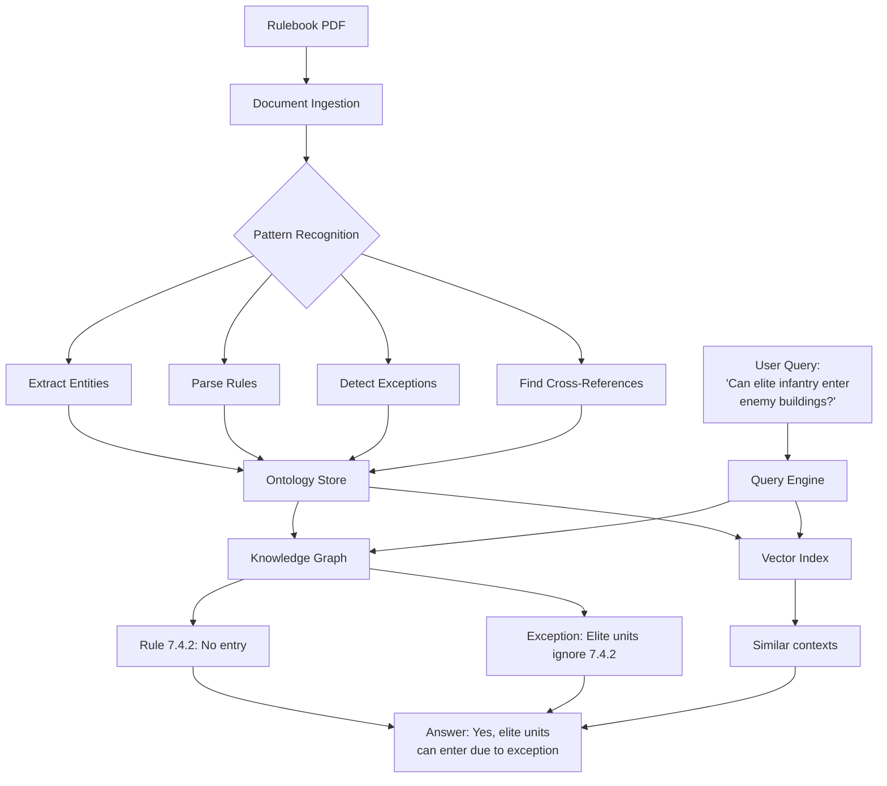
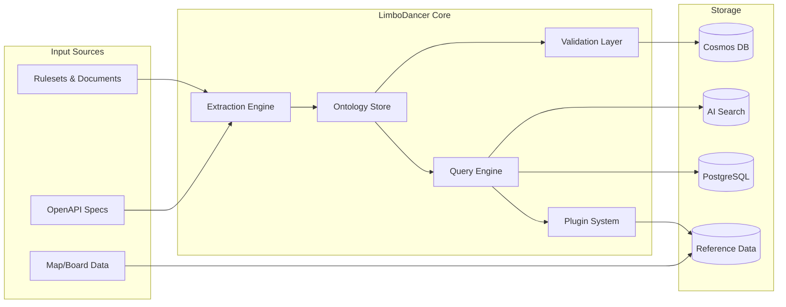
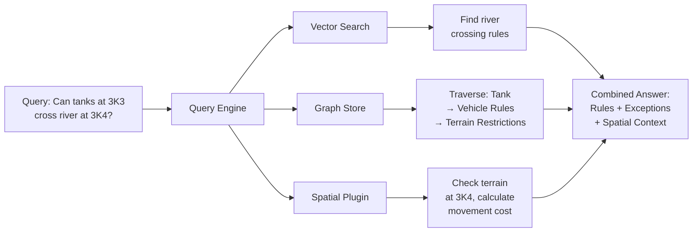
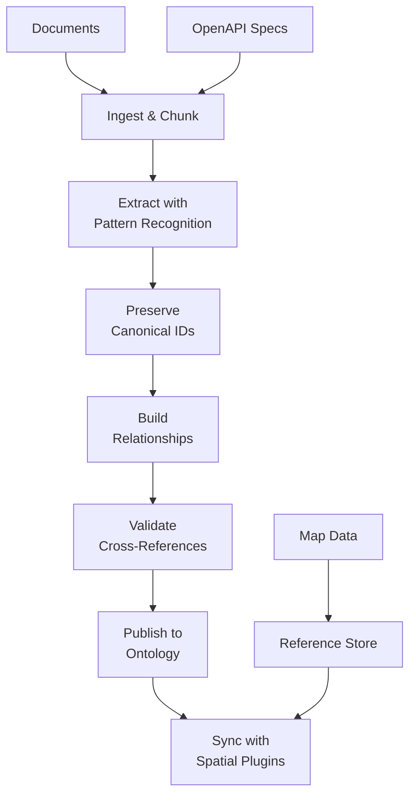

# LimboDancer ASL Reference-Domain Requirements and Historical Design

**Status:** Current reference-domain requirements with a historical design appendix

**Origin:** Pre-cognitive-runtime repository README, formerly titled `LimboDancer.MCP System Design`

**Capability authority:** Normative for the ASL reference-domain capabilities that LimboDancer must ultimately support.

**Architecture authority:** Non-normative for runtime structure, technology selection, project layout, implementation sequence, and deployment topology. The Plane Runtime Specification remains authoritative for runtime execution and authority semantics.

**Transformation authority:** The [ASL Ontology Transformation Specification](<./LimboDancer.Agentic.CognitiveRuntime ASL Ontology Transformation Specification.md>) governs current rulebook-to-package authoring, validation, publication, and first-slice implementation.

## 1. Original product intent

LimboDancer was created to turn complex authoritative material into operational domain knowledge that an AI system can use against current state.

The originating scenario is Advanced Squad Leader (ASL): interpret a deeply cross-referenced, exception-heavy rule system together with maps, terrain, spatial relationships, units, phases, and changing game state; then produce either an explainable domain conclusion or a safely governed state change.

The new cognitive-runtime architecture changes how that goal is realized. It does not replace the goal.

The architecture is successful only if it can ultimately support this end-to-end outcome:

```text
authoritative rules and reference material
-> validated semantic model
-> current domain observations
-> rule, exception, and spatial resolution
-> evidence-backed DomainConclusion
   or
-> governed AuthorizedAction
-> explanation, verification, and audit evidence
```

ASL is the first demanding reference domain. Its concepts must not be embedded in the runtime kernel, but its requirements provide an architectural fitness test for the reusable runtime.

## 2. Reference-domain requirements

### ASL-RD-001: Authoritative source fidelity

The system must preserve exact published identifiers and sufficient provenance for rules, sections, paragraphs, definitions, examples, tables, charts, boards, hexes, and other authoritative source elements.

Aliases and normalized identifiers may improve discovery, but they must not replace or silently rewrite canonical identity.

### ASL-RD-002: Structured rule semantics

The system must distinguish rules, definitions, examples, conditions, effects, cross-references, tables, phase restrictions, base rules, exceptions, and exceptions to exceptions.

The system must not reduce all authoritative material to undifferentiated text chunks.

### ASL-RD-003: Applicability and precedence

The system must determine which rules and exceptions apply to a concrete situation using relevant entity types, unit characteristics, terrain, location, phase, scenario conditions, current markers, module boundaries, and precedence relationships.

It must retain evidence explaining why a rule or exception was included or excluded.

### ASL-RD-004: Complementary evidence mechanisms

The system must be able to combine semantic retrieval, canonical rule traversal, exception resolution, reference data, current state, and deterministic domain calculations.

No vector index, graph store, model, classifier, or calculation provider is authority merely because it supplied relevant evidence.

### ASL-RD-005: Reference state and changing state

The system must distinguish stable reference state—such as board geometry, printed terrain, elevations, and published rules—from changing state such as unit positions, phase, smoke, rubble, fire, weather, overlays, and scenario modifications.

A conclusion or action must retain the identities and versions of the state observations on which it depended.

### ASL-RD-006: Spatial reasoning

The system must ultimately support registered domain calculations for coordinate resolution, adjacency, distance, hexside relationships, elevation, terrain traversal, line of sight, state-dependent invalidation of precomputed results, and multi-board composition where required.

These capabilities may be implemented behind ordinary runtime ports and executors; this requirement does not mandate a generalized plugin registry.

### ASL-RD-007: Domain adjudication

The system must be able to answer a domain question by producing an evidence-backed `DomainConclusion`, not merely a set of retrieved passages.

A DomainConclusion should identify:

- the question or proposition evaluated;
- the conclusion and its disposition;
- applicable rules and controlling exceptions;
- material observations and calculated facts;
- source, ontology, and state-version references;
- assumptions and unresolved ambiguity;
- an explanation suitable for the caller.

The precise runtime type is deferred until implementation evidence justifies it.

### ASL-RD-008: Conclusions are not execution authority

A DomainConclusion is an interpretation of evidence. It is not a SelectedAction, AuthorizedAction, or permission to mutate state.

The runtime must distinguish:

```text
Can this unit enter that location?  -> DomainConclusion
Move this unit into that location.  -> governed action-authority path
```

### ASL-RD-009: Explanation and traceability

The system must be able to explain the controlling rule, applicable exceptions, material observations, calculated spatial facts, assumptions, and reasons plausible alternatives were rejected.

User-facing explanation and runtime audit are related but distinct outputs.

### ASL-RD-010: Change sensitivity

A conclusion must not silently remain authoritative after a material rule, ontology, board, unit, phase, terrain, weather, or other state dependency changes.

The runtime must be able to invalidate, qualify, or recompute conclusions derived from superseded evidence.

### ASL-RD-011: Indeterminate and abstention outcomes

The system must not fabricate a definitive conclusion when relevant rules, state, coordinates, mappings, or precedence relationships are missing, ambiguous, stale, or conflicting.

It must identify the missing or conflicting evidence and return an explicit indeterminate or abstention outcome.

### ASL-RD-012: Governed state change

An ASL state mutation must use a registered semantic action, current observations, deterministic constraints, Governance, Diagnostics, the Execution Gate, an AuthorizedAction, effect observation, and audit evidence.

### ASL-RD-013: Tenant and package isolation

Rules, ontologies, board data, current state, conclusions, and actions must remain within the established tenant and domain-package boundary.

### ASL-RD-014: Domain portability

The reusable architectural pattern is:

```text
authoritative rules
+ domain ontology
+ reference state
+ changing state
+ deterministic calculations
+ evidence-backed conclusions
+ governed semantic actions
```

ASL instantiates this pattern through rules, units, hexes, terrain, phases, and spatial calculations. Other rule-intensive domains may supply different vocabulary without changing the runtime authority model.

### ASL-RD-015: Separate domain-package integration

The ASL implementation must be delivered through one or more separate domain packages that integrate through approved domain-neutral LimboDancer contracts.

The runtime must not reference ASL assemblies or contain ASL-specific vocabulary. The Host composes the runtime and ASL packages. ASL-specific infrastructure remains behind inward-facing ports, and ASL must reuse existing Observation, semantic-action, constraint, Diagnostic, executor, verification, and audit contracts where they fit.

The first read-only ASL adjudication scenario must drive admission of the minimum domain-neutral primitives and interfaces during the Milestone A review and PR-12/PR-13. The complete integration and timing rules are defined in `src/docs/LimboDancer.Agentic.CognitiveRuntime Domain Integration Model.md`.

## 3. End-to-end acceptance scenarios

### Scenario A: State-aware rule adjudication

Given a known unit, location, phase, scenario state, and authoritative rule package, when a caller asks whether the unit may enter an occupied building, LimboDancer must resolve the relevant entities, rules, conditions, and exceptions; incorporate current state; and return a DomainConclusion with controlling evidence and any remaining ambiguity without mutating state.

### Scenario B: Spatial adjudication

Given two board locations, reference terrain and elevation, and current smoke, rubble, weather, or other modifiers, when a caller asks whether line of sight exists, LimboDancer must resolve the coordinates, observe current state, perform the registered spatial calculation, apply relevant rules and exceptions, and return the conclusion with supporting or blocking evidence.

### Scenario C: Governed state mutation

Given a semantically valid movement possibility, when a caller requests that a unit move, LimboDancer must bind a registered action, re-observe material state, evaluate semantic and Governance constraints, run required Diagnostics, pass the Execution Gate, execute only an AuthorizedAction, observe the result, verify the expected effect, and record audit evidence.

### Scenario D: Stale or incomplete evidence

Given missing, conflicting, or superseded rules or state, when a caller requests a ruling or mutation, LimboDancer must not invent certainty. It must return an indeterminate conclusion, re-observe, abstain, or block execution as appropriate and identify the evidence problem.

## 4. Traceability to LimboDancer.Agentic.CognitiveRuntime

The reference-domain capabilities map to the new architecture as follows:

| ASL capability | Future architectural home |
|---|---|
| Rule vocabulary, canonical IDs, entities, relations, conditions, and exceptions | Semantic Plane |
| Rule text, graph relationships, embeddings, maps, board state, and provenance | State Plane through tenant-safe ports |
| Rule interpretation and goal decomposition | Reasoning Plane |
| Finite ASL action candidates and deterministic applicability | Semantic Plane |
| Choice among already permitted ASL actions | Decision Plane for autonomous goals only |
| LOS calculations, state queries, and authorized state changes | Execution Plane through registered executors |
| Tenant, policy, risk, and permission checks | Governance |
| Invariant checks, mapping validation, and effect verification | Diagnostics |
| MCP exposure | Interaction adapter, not ASL or runtime authority |

The intended integration path is:

```text
ASL rules, maps, and reference material
-> validated ASL ontology and state representations
-> observations, semantic resolution, and calculations
   -> DomainConclusion, explanation, and evidence
   or
   -> registered semantic action
   -> directed or autonomous authority path
   -> deterministic constraints and diagnostics
   -> Governance and Execution Gate
   -> authorized ASL executor
   -> observed effects and audit evidence
```

An LLM, embedding model, extraction model, classifier, or search provider may propose interpretations or supply evidence. It may not authorize or directly execute an ASL action.

Porting should be selective. Useful behavior from the legacy implementation should be cleaned, hardened, and retested against the new contracts; obsolete MCP-centric structure should not be reproduced.

## 5. Capability horizon

These requirements do not change the lean initial implementation sequence. They establish the capability horizon that the runtime must eventually reach after its authority substrate is proven.

```text
runtime authority substrate
-> tenant-safe evidence access
-> ASL ontology and authoritative-source package
-> rule ingestion, validation, and publication
-> board and reference-state provider
-> dynamic game-state observations
-> rule, exception, and spatial resolution
-> DomainConclusion and explanation
-> governed ASL mutations
-> end-to-end ASL conformance scenarios
```

Exact projects, contracts, providers, and PRs should be introduced only when the corresponding reference scenario is ready to drive them.

---

## Appendix A: Original historical design

The remainder of this document preserves the earlier implementation-oriented design as historical source material. References to `LimboDancer.MCP` as the product, .NET 9, direct MCP tool execution, the old project layout, generalized plugins, legacy Planner/ReAct behavior, deployment topology, package versions, and implementation status are not current guidance.

## Executive Summary
LimboDancer.MCP is an ontology-first Model Context Protocol server that transforms complex documents—rulebooks, regulations, technical specifications—into queryable knowledge graphs, using Vector and Graph databases, enabling AI assistants like Claude and ChatGPT to provide contextually-accurate answers about intricate rule systems. Built on .NET 9 and Azure, it extracts structured knowledge while preserving exact rule references (critical for domains like wargaming where "Rule A6.41" must remain unchanged), handles nested exceptions and cross-references, integrates spatial data through a plugin architecture (supporting hex-based wargames, grid-based RPGs, or custom coordinate systems), and maintains dynamic state tracking for scenarios where terrain changes or units move. The system combines graph traversal for precise rule relationships with vector search for semantic discovery, validates consistency across thousands of interconnected rules, and scales through multi-tenant isolation—turning 200-page PDFs that require expert interpretation into intelligent systems that can answer questions like "Can my elite infantry unit enter an enemy-occupied building?" by considering base rules, applicable exceptions, current game state, and spatial constraints. This system addresses the AI needs of vertical markets such as gaming (tabletop market $15B+), regulatory compliance, technical documentation, the legal profession, and any domain where complex conditional logic must be consistently applied, offering organizations the ability to democratize expert knowledge while ensuring accuracy and reducing costly rule interpretation errors.

## Table of Contents
1. [Overview and Purpose](#overview-and-purpose)
2. [Architecture](#architecture)
3. [Core Ontology Components](#core-ontology-components)
4. [Extraction and Query Capabilities](#extraction-and-query-capabilities)
5. [Ontology Design and Implementation](#ontology-design-and-implementation)
6. [Core Implementation Components](#core-implementation-components)
7. [Development Setup and Tooling](#development-setup-and-tooling)
8. [Use Cases and Benefits](#use-cases-and-benefits)
9. [Roadmap and Milestones](#roadmap-and-milestones)
10. [Source Code Structure](#source-code-structure)

---

## Overview and Purpose

LimboDancer.MCP is an **ontology-first** Model Context Protocol (MCP) server built on **.NET 9** and **Azure**. As a full-featured MCP implementation, it provides tools for session management, memory storage, vector search, and knowledge graph operations. What distinguishes LimboDancer is its deep integration with formal ontologies - every tool, memory item, and graph entity is grounded in a typed semantic model. This enables the system to extract structured knowledge from complex documents (for instance rulesets, rulebooks, govt regulations or legal documents), maintain consistency across data stores, and provide contextually-aware responses to any MCP-compatible AI assistant, such as Claude and ChatGPT for instance.

### Example: Processing a Strategy Game Rulebook

When a user submits a board game rulebook (e.g., "Advanced Squad Leader"), LimboDancer:



1. **Extracts Ontology** - Identifies game entities (units, terrain, weapons), their properties (movement points, firepower), and relationships (line-of-sight rules, stacking limits)

2. **Captures Rule Structure** - Parses numbered rules (e.g., "7.4.2 Infantry may not enter building hexes occupied by enemy units"), creating queryable nodes with cross-references

3. **Handles Exceptions** - Detects special cases ("EXC: Elite units ignore rule 7.4.2") and links them to base rules with proper precedence

4. **Builds Knowledge Graph** - Creates a navigable structure where rules, exceptions, examples, and game states are interconnected

**Benefits**: Instead of searching through a 200-page PDF, users can ask contextual questions like "Can my elite infantry unit enter a building with enemies?" and receive accurate answers that consider all applicable rules, exceptions, and current game state. The system validates rule consistency and flags conflicts during ingestion.

---

## Architecture

### High-Level System Flow



### Multi-Tenant Scope

Every operation is scoped by hierarchical partition keys:
- **Tenant** - Organization boundary
- **Package** - Module grouping (e.g., "rules", "core")
- **Channel** - Version stream (e.g., "current", "v1.0.0")

### Plugin Architecture

Domain-specific logic is isolated in plugins:
- **ASL Plugin** - Hex-based wargame spatial logic
- **D&D Plugin** - Grid-based RPG mechanics
- **Chess Plugin** - Algebraic notation and board logic
- **Generic Plugin** - Fallback for unstructured documents

---

## Core Ontology Components

### Enhanced Node Types (Phase 3)

1. **Entities** - Objects within the rules (units, tokens, game pieces, domain concepts)
2. **Properties** - Attributes and values (stats, costs, capabilities, with owner/range/cardinality)
3. **Relations** - Typed connections between elements (prerequisites, dependencies, typed edges)
4. **Enums** - Categorical values (states, types, phases, closed value sets)
5. **Shapes** - SHACL-like validation templates for data structures
6. **RuleNodes** - Primary rule statements with preserved canonical IDs (A.1, B.23.71)
7. **ExceptionNodes** - Rule modifications with precedence weights and nested support
8. **ConditionNodes** - Context-dependent rule activation and prerequisites
9. **ReferenceNodes** - Cross-rule linkages preserving exact rule IDs
10. **ExampleNodes** - Clarifying instances with location references validation
11. **DefinitionNodes** - CAPS terms with special meanings
12. **PhaseNodes** - Temporal containers for phase-specific rules
13. **MatrixRuleNodes** - Multi-dimensional rule tables (terrain charts)
14. **Aliases** - Canonical names + synonyms for robust matching

### Dynamic State Components

1. **HexState** - Tracks base and current terrain plus unit occupants
2. **Unit** - Dynamic game pieces with movement and LOS properties
3. **Counter** - Terrain modifiers (smoke, rubble, blazes)
4. **GameBoard** - Manages dynamic state overlay on pre-computed base data

---

## Extraction and Query Capabilities

### Enhanced Extraction Process (Phase 3)

The extraction engine identifies complex patterns:
- **Canonical Rule IDs** preserved exactly (A.1, B.23.71, 10.211)
- **Nested exceptions** with precedence chains (EXC within EXC)
- **Matrix rules** for terrain charts and combat tables
- **Location references** extracted from examples (3K3, P5)
- **Hierarchical rule structure** (10.211 → 10.21 → 10.2 → 10)
- **Module namespacing** (Part A, Part B, module-specific)

### Advanced Query Capabilities

**Structural Queries:**
- Rule hierarchy traversal using canonical IDs
- Exception precedence resolution
- Cross-module reference validation
- Matrix rule lookups

**Spatial Queries (via plugins):**
- Line of sight calculations
- Distance and adjacency checks
- Terrain modification effects
- Dynamic state queries

**Contextual Queries:**
- "Can infantry in woods at K3 see building at P5?"
- "What exceptions apply when elite units enter buildings?"
- "What are my options during Prep Fire Phase?"

### Reference Data Integration

- **Pre-computed LOS data** for performance
- **JSON document store** for map/hex data
- **Dynamic terrain modifications** (buildings→rubble, woods→blazes)
- **Unit movement tracking** with state enrichment

### Validation Layer

- **Rule ID format validation** (canonical ASL format)
- **Location reference validation** against board data
- **Exception precedence validation**
- **Module compatibility checking**
- **Circular dependency detection**
- **Terminology consistency** (CAPS terms)

### Graph vs Vector: Complementary Technologies

**LimboDancer.MCP.Graph.CosmosGremlin** stores **structured relationships**:
- Rule hierarchies with canonical IDs (e.g., "10.211" CHILD-OF "10.21")
- Exception chains with precedence weights
- Phase-based rule activation
- Cross-module references

**LimboDancer.MCP.Vector.AzureSearch** handles **semantic similarity**:
- Rule text with embeddings for meaning-based search
- Example text with location references
- Matrix rule content
- Hybrid search with ontology metadata

**How they work together with spatial plugins**:



---

## Ontology Design and Implementation

### MCP Tool Interface

Enhanced tools for Phase 3 functionality:

```csharp
public class OntologyExtractionTool : IMcpTool
{
    public Task<OntologyGraph> ExtractOntology(
        string documentPath, 
        string systemType = "Generic")  // Plugin selection
    {
        // Preserves canonical rule IDs
        // Handles nested exceptions
        // Extracts matrix rules
    }
    
    public Task<QueryResult> Query(
        string ontologyId, 
        Query query)
    {
        // Uses appropriate spatial plugin
        // Enriches state with reference data
        // Handles dynamic terrain state
    }
}
```

### Key Features

1. **Canonical ID Preservation** - Never modifies rule numbering
2. **Nested Exception Handling** - Supports EXC within EXC patterns
3. **Plugin Architecture** - Domain logic separation
4. **Dynamic State Management** - Terrain modifications and unit movement
5. **Reference Data Integration** - JSON documents for spatial data

### Generation Pipeline



### Governance

- **Rule ID Integrity**: Canonical format enforcement
- **Location Validation**: Board reference checking
- **Exception Precedence**: Weight assignment rules
- **Module Compatibility**: Cross-module validation

### Export Formats

- **JSON-LD**: With preserved rule IDs
- **Turtle/RDF**: Including spatial predicates
- **Plugin Schemas**: Domain-specific formats

---

## Core Implementation Components

### 1. Persistence Baseline (EF Core + Postgres)

**Files**: `src/LimboDancer.MCP.Storage/{ChatDbContext.cs, Entities.cs}`, migrations

**Key Entities**:
```csharp
[Table("sessions")]
public class Session
{
    [Key] public Guid Id { get; set; }
    [MaxLength(256)] public string Title { get; set; } = string.Empty;
    public DateTimeOffset CreatedAt { get; set; } = DateTimeOffset.UtcNow;
}

[Table("messages")]
public class Message
{
    [Key] public long Id { get; set; }
    public Guid SessionId { get; set; }
    [MaxLength(32)] public string Role { get; set; } = "user";
    public string Content { get; set; } = string.Empty;
    public DateTimeOffset Ts { get; set; } = DateTimeOffset.UtcNow;
}
```

### 2. Vector Index for Azure AI Search (Hybrid)

**Files**: `src/LimboDancer.MCP.Vector.AzureSearch/{SearchIndexBuilder.cs, VectorStore.cs}`

**Features**:
- Hybrid search (BM25 + vector)
- Ontology filters (class, uri, tags)
- Multi-tenant support via tenant/package/channel fields
- Rule ID preservation in metadata

### 3. Cosmos Gremlin Graph Scaffold

**Files**: `src/LimboDancer.MCP.Graph.CosmosGremlin/{GremlinClientFactory.cs, GraphStore.cs, Preconditions.cs, Effects.cs}`

**Capabilities**:
- Upsert vertices/edges for enhanced node types
- Exception precedence tracking
- Rule hierarchy navigation
- Cross-module reference support

### 4. Spatial Plugin System (Phase 3)

**Files**: `src/LimboDancer.MCP.Core/Plugins/{ISpatialPlugin.cs, ASLSpatialPlugin.cs}`

**Interface**:
```csharp
public interface ISpatialPlugin
{
    string SystemType { get; }
    object ParseLocation(string location);
    bool CheckVisibility(object from, object to, GameState state);
    void ApplyModification(GameState state, string type, object target);
}
```

### 5. Reference Data Management

**Files**: `src/LimboDancer.MCP.Core/ReferenceData/{GameBoard.cs, HexState.cs}`

**Components**:
- Pre-computed LOS storage
- Dynamic terrain overlay
- Unit movement tracking
- State enrichment pipeline

### 6. MCP Tool Surface

**Enhanced Tools**:
- `ontology.extract` - With system type parameter
- `ontology.query` - Plugin-aware spatial queries
- `reference.load` - Board/map data ingestion
- `state.update` - Dynamic modifications

### 7. HTTP Transport with SSE Events

**Files**: `src/LimboDancer.MCP.McpServer.Http/{AuthExtensions.cs, HttpTransport.cs, ChatStreamEndpoint.cs}`

**Features**:
- Entra ID (Azure AD) JWT authentication
- Server-Sent Events at `/mcp/events`
- Chat streaming endpoints
- Role-based policies (Reader/Operator)

### 8. Operator Console (Blazor Server)

**Enhanced Pages**:
- Rules: Browse extracted ontology with canonical IDs
- Maps: View board data and current state
- Exceptions: Trace precedence chains
- Validation: Check rule consistency

### 9. Developer CLI

**Enhanced Commands**:
```bash
limbodancer ontology extract --file asl.pdf --type ASL
limbodancer ontology validate --id asl-rules-v1
limbodancer reference load --board 1 --data board1.json
limbodancer query --ontology asl-rules --location 3K3
```

---

## Development Setup and Tooling

### Prerequisites
- .NET 9 SDK
- Docker (for local Postgres)
- Azure subscription with:
  - Azure AI Search (Standard or above)
  - Azure OpenAI (for embeddings)
  - Azure Cosmos DB (Gremlin) or Gremlin Emulator

### Local Development Setup

1. **PostgreSQL**:
```bash
docker run --name pg-limbo -e POSTGRES_PASSWORD=postgres -p 5432:5432 -d postgres:16
```

2. **Configuration** (`appsettings.Development.json`):
```json
{
  "Persistence": {
    "ConnectionString": "Host=localhost;Port=5432;Database=limbodancer_dev;Username=postgres;Password=postgres"
  },
  "Search": {
    "Endpoint": "https://<search>.search.windows.net",
    "ApiKey": "<key>",
    "Index": "ldm-memory"
  },
  "OpenAI": {
    "Endpoint": "https://<aoai>.openai.azure.com",
    "ApiKey": "<key>",
    "EmbeddingModel": "text-embedding-3-large"
  },
  "Gremlin": {
    "Host": "<acct>.gremlin.cosmos.azure.com",
    "Port": "443",
    "Database": "ldm",
    "Graph": "kg",
    "Key": "<primary-key>"
  },
  "Plugins": {
    "ASL": "LimboDancer.MCP.Plugins.ASL",
    "DnD": "LimboDancer.MCP.Plugins.DnD",
    "Chess": "LimboDancer.MCP.Plugins.Chess"
  }
}
```

### Bootstrap Script

A PowerShell script (`scripts\bootstrap.ps1`) creates the complete solution structure:
- Creates all projects with proper references
- Adds required NuGet packages
- Generates initial file stubs
- Sets up project dependencies
- Includes plugin templates

---

## Use Cases and Benefits

### Use Cases

- **Complex wargame rules** (ASL, GMT games) - with spatial awareness
- **RPG systems** (D&D, Pathfinder) - grid-based mechanics
- **Board game manuals** - with dynamic state
- **Legal/regulatory documents**
- **Technical specifications**
- **API documentation**
- **Business process definitions**

### Benefits

- **Canonical Reference Preservation** - Rule IDs remain exactly as published
- **Spatial Intelligence** - Location-aware queries via plugins
- **Dynamic State Tracking** - Handles terrain changes and unit movement
- **Exception Precedence** - Correctly resolves nested rule modifications
- **Multi-System Support** - Plugin architecture for different domains
- **Performance Optimization** - Pre-computed spatial data with dynamic overlay
- **Complete Rule Context** - Matrix rules, examples, and cross-references

---

## Roadmap and Milestones

### Guiding Principles
- Built in **.NET 9**
- Hosted in **Azure Container Apps**
- **MCP runtime** = stateless headless worker/web API
- **Blazor Server UI** = operator/console only (separate container, sticky sessions)
- **Ontology is first-class**: every tool, memory, and KG entry tied to ontology terms
- **Incremental milestones** with acceptance gates

### Milestones

#### Alpha Phase (Milestones 1-3)
- ✅ **Milestone 1 – MCP Skeleton**: Scaffold solution, implement MCP server with stdio + noop tool
- ✅ **Milestone 2 – Persistence**: EF Core + PostgreSQL, basic history persistence
- ✅ **Milestone 3 – Embeddings and Vector Store**: Azure OpenAI integration, hybrid retrieval

#### Beta Phase (Milestones 4-9)
- ✅ **Milestone 4 – Ontology v1**: JSON-LD context, base classes, tool schema mapping
- **Milestone 4.5 – Phase 3 Rule Extraction Engine**: 
  - Canonical rule ID preservation
  - Nested exception detection with precedence
  - Matrix rule extraction
  - Location reference validation
  - Cross-module reference resolution
- **Milestone 4.6 – Spatial Plugin Architecture**:
  - ISpatialPlugin interface design
  - ASL hex-based plugin
  - D&D grid-based plugin
  - Generic fallback plugin
- **Milestone 4.7 – Dynamic State Management**:
  - Reference data integration (JSON documents)
  - Pre-computed LOS with modification patterns
  - Unit movement tracking
  - Terrain change handling
- **Milestone 5 – Planner + Precondition/Effect Checks**: Typed ReAct loop, KG validation
- ✅ **Milestone 6 – Knowledge Graph Integration**: Cosmos DB Gremlin, context expansion
- ✅ **Milestone 7 – Ingestion Pipeline**: Event-driven document processing
- **Milestone 7.5 – Enhanced Document Processing**:
  - Rule-aware chunking preserving structure
  - Example extraction with location validation
  - Matrix table recognition
- **Milestone 7.6 – Spatial-Aware Search**:
  - Location-based query enrichment
  - Hybrid search with spatial context
  - Cross-reference preservation
- ✅ **Milestone 8 – HTTP Transport**: Streamable HTTP endpoints, Entra ID auth
- **Milestone 9 – Validation Framework**:
  - Rule ID format checking
  - Location reference validation
  - Exception precedence verification
  - Module compatibility testing

#### 1.0 Release (Milestones 10-13)
- **Milestone 10 – Enhanced Operator Console**:
  - Rule browser with canonical IDs
  - Map viewer with current state
  - Exception trace visualization
  - Validation dashboards
- **Milestone 11 – Multi-tenant hardening**: Proven isolation across all components
- **Milestone 12 – Observability & Governance**: OTEL traces, SHACL validators
- **Milestone 13 – Packaging & 1.0 Release**: Containers, CI/CD, documentation

### Implementation Status

#### Complete
- Multi-tenant Cosmos storage with HPK
- In-memory OntologyStore with indexes
- JSON-LD/RDF export services
- Tool schema binding framework
- Basic validators and governance
- Core MCP server implementation
- PostgreSQL persistence layer
- Azure AI Search integration
- HTTP Transport with SSE
- Authentication via Entra ID

#### In Progress (Phase 3)
- Enhanced rule extraction engine
- Spatial plugin architecture
- Dynamic state management
- Reference data integration
- Canonical ID preservation
- Nested exception handling

#### Not Started
- Planner with precondition/effect checks
- Advanced spatial reasoning
- Cross-ontology mapping

#### Future
- OWL reasoning integration
- Advanced governance rules
- Production hardening
- Comprehensive test coverage

---

## Source Code Structure

### Project Dependencies (.csproj files)

**LimboDancer.MCP.Core** (Base library):
- Target: .NET 9.0
- No external dependencies (contracts only)
- Includes: ISpatialPlugin interface

**LimboDancer.MCP.Plugins.ASL**:
- Dependencies: Core
- Implements: Hex-based spatial logic

**LimboDancer.MCP.Plugins.DnD**:
- Dependencies: Core
- Implements: Grid-based mechanics

**LimboDancer.MCP.Storage**:
- Dependencies: 
  - Microsoft.EntityFrameworkCore 9.0.0
  - Npgsql.EntityFrameworkCore.PostgreSQL 9.0.0
- References: Core

**LimboDancer.MCP.Vector.AzureSearch**:
- Dependencies: Azure.Search.Documents 11.6.0
- References: Core

**LimboDancer.MCP.Graph.CosmosGremlin**:
- Dependencies: Gremlin.Net 3.7.2
- References: Core

**LimboDancer.MCP.McpServer**:
- Dependencies:
  - ModelContextProtocol 0.3.0-preview.3
  - All data layer packages
  - Serilog.AspNetCore 8.0.1
  - OpenTelemetry packages
- References: All internal projects

**LimboDancer.MCP.Cli**:
- Dependencies: System.CommandLine 2.0.0-beta4
- References: All data layer projects

**LimboDancer.MCP.BlazorConsole**:
- Target: ASP.NET Core 9.0
- References: All data layer projects

### Key Implementation Files

**Phase 3 Ontology Implementation**:
- `OntologyExtractionEngine.cs` - Enhanced extraction with canonical IDs
- `PatternExtractor.cs` - Nested exception and matrix rule detection
- `ReferenceDataManager.cs` - JSON document integration
- `SpatialPluginRegistry.cs` - Plugin discovery and loading

**Enhanced Node Types**:
- `RuleNode.cs` - Preserves canonical IDs
- `ExceptionNode.cs` - Precedence weights
- `MatrixRuleNode.cs` - Multi-dimensional tables
- `HexState.cs` - Dynamic terrain tracking

**MCP Tools**:
- `OntologyExtractionTool.cs` - System type parameter
- `SpatialQueryTool.cs` - Plugin-aware queries
- `ReferenceDataTool.cs` - Board data loading
- `StateManagementTool.cs` - Dynamic modifications

**Infrastructure**:
- `SearchIndexBuilder.cs` - Azure AI Search index management
- `GremlinClientFactory.cs` - Cosmos Gremlin connection pooling
- `AuthExtensions.cs` - Entra ID authentication setup
- `HttpTransport.cs` - Server-Sent Events implementation

---

## Implementation Notes

### Security Considerations
- All operations require tenant scope
- Cross-tenant queries explicitly forbidden
- JWT authentication via Entra ID
- Role-based access control (Reader/Operator)
- Plugin sandboxing for untrusted domains

### Performance Optimizations
- Pre-computed spatial data (LOS)
- Dynamic state overlay pattern
- Canonical ID indexing
- Plugin-specific caching
- Lazy reference data loading

### Failure Modes and Resilience
- Circuit breakers for LLM throttling
- Graceful degradation to BM25 search
- Retry with backoff for Cosmos 429s
- Dead letter queue for Service Bus
- Plugin fallback to generic

### Future Considerations
- .NET Aspire adoption for local orchestration
- Graph engine evaluation (Cosmos Gremlin vs Neo4j)
- RDF/OWL reasoning integration
- Advanced planner (DAG/graph executor)
- Multi-board spatial composition

---

*This document represents the complete LimboDancer.MCP system design, combining architectural vision with concrete implementation details including Phase 3 enhancements. The source code serves as the authoritative reference for all implementation specifics.*
