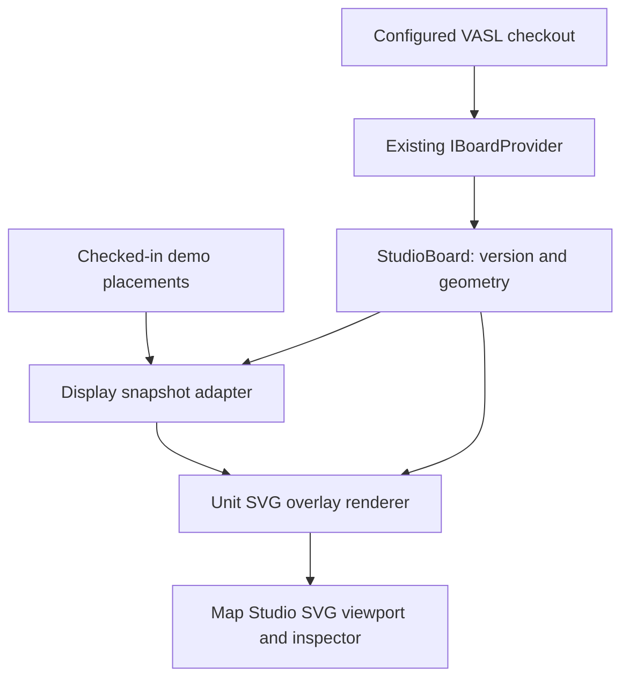

# ASL Unit Counter Map Rendering Design

**Status:** Implemented (commits `88b9077` to `6620817`), then superseded for its drawing by phase 1 of the [ASL Unit Display Design](<ASL Unit Display Design.md>) (section 16): the Units layer and `UnitOverlayBuilder` in `LimboDancer.Domains.Asl.Units.Rendering` replace `DemoUnitOverlay` and its `bd01` fixture. Its isolation and interaction rules still apply, and so does its binding, except that placement sets carry no pinned board version (Display Design, section 16.3).

**Date:** 2026-09-24; status revised the same day

**Baseline:** `main@db38688`, Map Studio through ASL-MAP-04; revised at `main@bdd6d9d` (after ASL-MAP-08)

**Scope:** Read-only display of one or more unit counters on a board; implements the first slice in [ASL Unit Map Rendering Slice](<ASL Unit Map Rendering Slice.md>). The [broader unit domain analysis](<ASL Unit Domain Model Analysis.md>) is deferred.

## 1. Outcome and data ownership

An operator opens an existing Map Studio board, turns on a **Demo units** overlay, and sees counters anchored to hexes in either Exact or HexFacts view. Clicking a counter shows its supplied identity, label, side, face, and location. Several counters can share a hex. The demo does not choose or change placements during play.

There are three distinct inputs. Their source, authority and readiness must remain visible:

| Input | Actual source for this first slice | Owner and meaning |
|---|---|---|
| Map geometry, terrain, and board version | The existing `IBoardProvider`/`VaslBoardProvider` loads a *locally configured* VASL checkout (`AslMaps:VaslRoot` or `AslMaps__VaslRoot`). It imports `boards/src/bdNN` with the shared board metadata, then exposes `StudioBoard.Render.Grid.Geometry` and `StudioBoard.Version`. Currently `Version` is the imported LOSData content blob identifier. | The map project owns the board. No unit data is written to `TerrainGrid`, `HexFacts`, or the board source. If no checkout is configured, Map Studio currently offers no board, so the interactive demo cannot appear on `bd01` until a checkout is supplied. |
| Counter placements and display facts | A **new, checked-in, explicitly labeled demo fixture**, initially keyed to `bd01`, authored for this integration. It supplies counter IDs, locations, display labels, sides, and faces. There is no checked-in general unit-instance catalog or live placement service to read today. | The fixture is illustrative placement input only. Neither the ASL rulebook nor VASL board data says that the sample counters occupy those hexes. The UI must label the overlay “Demo units” and must not feed these placements to Scenario A1 adjudication or an Execution Gate. |
| Counter artwork | Small **original, programmatically generated SVG counter shapes** with generic side colors and text drawn from the fixture. No VASL counter images or scans of physical counters are required or assumed available. | The unit overlay owns this display style. It may later accept a separately sourced asset catalog with source/rights records; visual artwork is never proof of printed capabilities or rules. |

The rulebook is not an input to this rendering slice. Its unit definitions become relevant when a later project replaces generic demo labels with curated ASL counters or when a game-state provider supplies current positions. We will not scrape counter values from rulebook prose or infer a unit's state from an image.

## 2. Boundaries and dependency direction



Proposed location for the display DTO and pure overlay builder: `src/ASL/LimboDancer.Domains.Asl.Units.Rendering/`, referencing `LimboDancer.Domains.Asl.Maps` for `BoardLocation`/geometry and optionally `Maps.Rendering` for `SvgWriter`. Its DTOs are ASL-specific and do not enter `LimboDancer.Runtime` or the map's terrain data model. The fixture adapter and overlay selection belong in `MapStudio`. Integration touches Map Studio's `BoardViewer.razor` and `wwwroot/js/boardViewport.js`; changes to map renderer or board ingestion are unnecessary. The map effort should agree on the overlay mount point and unit-click callback before those shared files are edited.

The `BoardRenderer` and `/render/{board}/{version}/{view}/{file}` continue to produce immutable **board-only** documents and fragments. `RenderCache` currently keys board, version, view, layer, and trace; it has no placement revision. Do not add changing units to that cache or reuse its year-long public immutable response policy for a mutable placement overlay.

## 3. Fixture and display snapshot contracts

The first fixture is a versioned JSON resource, for example `MapStudio/DemoPlacements/bd01.json`. It is intentionally separate from the VASL checkout. Illustrative shape:

```json
{
  "schemaVersion": 1,
  "boardRef": "bd01",
  "fixtureId": "bd01-demo-1",
  "placements": [
    { "placementId": "demo-a", "location": "bd01:E4:0", "sideId": "blue", "label": "A", "faceKey": "front", "stackOrder": 0 },
    { "placementId": "demo-b", "location": "bd01:E4:0", "sideId": "blue", "label": "B", "faceKey": "front", "stackOrder": 1 },
    { "placementId": "demo-c", "location": "bd01:F4:1", "sideId": "red", "label": "C", "faceKey": "front", "stackOrder": 0 }
  ]
}
```

The sample labels and colors are invented visual identifiers, not ASL counter classifications. A fixture may specify `expectedBoardVersion` when authored for a pinned VASL board. On load, the adapter requires `boardRef` to match the displayed board; it also compares `expectedBoardVersion` when supplied. It then binds the **validated** fixture to the loaded `StudioBoard.Version` to produce a `UnitDisplaySnapshot` with `(boardRef, boardVersion, fixtureId, fixture content hash, placements)`. The binding is recorded as a demo-source annotation; it never asserts that the fixture originated from the board. This permits a local checkout at a different VASL revision while preventing stale overlays after a board switch. A fixture pinned to a different board version fails visibly and is not rendered.

Each placement has a unique stable ID within the snapshot, a canonical `BoardLocation`, side and label, an explicit face key, and optional stack order/facing. The original generic artwork uses a fixed `counterKey` such as `demo-square`, supplied by the adapter rather than inferred from `label`. Future source adapters may provide different counter keys. Reject duplicates, invalid fields, unsupported faces, a different board, hexsides, and off-board hex names with per-placement diagnostics. Record any rejected placements; do not move them or silently drop them. A level badge displays the supplied `BoardLocation.Level`; level legality is not checked in this slice.

The runtime display contract is a **projection**, not mutable game state. It must not include hidden opponent records merely to let the UI filter them. A future authoritative source is responsible for selecting visible placements for the viewer before adapting to this DTO. A placement ID is a click/update key, not evidence that an authoritative `UnitInstance` exists.

## 4. Rendering and interaction

1. For every validated location, call the displayed board geometry's `IndexOf(location.Hex)` and `CenterDot(index)` in SVG board-pixel coordinates. Use that anchor for both Exact and HexFacts views. The board's actual width, hex height, and edge behavior come from its `BoardGeometry`; do not derive pixel locations by parsing `E4` manually.
2. Group by hex, order by `(stackOrder, placementId)` using ordinal IDs, and apply fixed, documented offsets in SVG board units. Preserve the whole stack in the inspector if overlap obscures labels. Stack offset is purely graphical; it does not assert legal stacking, order of play, or a particular level's elevation in SVG.
3. Generate one `<g id="layer-units">` of simple SVG rectangles, text, and optional explicit facing cues. Include a deterministic `data-placement-id` and accessible name for each interactive counter; escape all fixture strings through `SvgWriter` or an equivalent safe SVG builder. The overlay must fit at edge hexes without clipping relevant labels or covering the terrain legend. No external image URL or script enters this SVG.
4. Add the units group after the board layers inside the **same inline SVG** so pan, zoom and viewBox transformations apply once. Maintain it on Exact/HexFacts switches. If the board changes, clear the old group immediately and request a new snapshot; never carry units over by same-named hex alone.
5. On pointer or keyboard selection, identify a counter by `placementId` and show the supplied fields in the inspector. Stop propagation only for a recognized counter selection; bare terrain clicks continue to use `BoardViewer.OnBoardClick`. The UI shows “Demo units” near the layer toggle and selected counter details.
6. Replacing a snapshot updates the unit group only and retains current zoom and pan. For this fixture-driven first slice, the snapshot can be loaded with the page and rendered in process; no public unit endpoint is needed. If an endpoint is later introduced, its response must be keyed by board version, snapshot content/revision and art version, or sent without immutable caching.

Both `BoardRenderer.Document` and its existing golden SVG tests remain board-only. Exporting a map *with* units is a separate composite operation that must name both the board and placement snapshot; the first slice only requires the live Studio overlay.

## 5. Verification and handoff

| Check | Evidence |
|---|---|
| Fixture provenance | The UI labels the fixture as demo data and shows its ID; missing configuration has an empty/error state rather than an invented live source. |
| Binding | Wrong board, pinned-version mismatch, invalid hex, duplicate ID and bad face produce diagnostics; valid positions use `BoardGeometry` anchors. |
| Pure output | Same board geometry, fixture and art version produce byte-identical unit SVG, including stack ordering and escaped text. |
| Multiple counters | One counter, separate hexes, and a three-counter stack render in both views; inspector can identify every placement and its level. |
| Isolation | Fixture refresh changes only `layer-units`; board SVG bytes, board-only ETags, terrain facts and board version do not change. |
| Interaction | Unit click/keyboard selection, terrain click, zoom/pan, board switch and view switch preserve the intended selection and overlay behavior. |

**As built.** Departures from this design:

- **Code location:** the DTOs and renderer are in Map Studio (`Services/DemoUnitOverlay.cs`), not a `LimboDancer.Domains.Asl.Units.Rendering` project. ASL-UNIT-001 moves them there when the unit projects are created.
- **Level badge:** section 3 calls for one; it is not drawn yet.
- **Views:** the overlay is loaded with the view the page opens in; the Styled and Comparison views added in ASL-MAP-07 are not covered by the checks above.
- **Verification gaps:** selection surviving a board or view switch, and unchanged board-only ETags, are not asserted by tests.

Resolved by the Unit Display Design, phase 1: the code now lives in `LimboDancer.Domains.Asl.Units.Rendering`; stacks at a level other than ground get a level tab; the Units layer is loaded again with every view, including Styled and Comparison; and a placement set may name any board or map rather than one pinned board. A set is still display input only and is marked synthetic when it comes from the Lab or a fixture.

Implementation handoff: add the fixture schema and one demo fixture; add the DTO, validator and pure unit overlay renderer with focused tests; integrate the overlay and selection into Map Studio; run the board renderer's existing tests to catch regressions to board-only output. Stop there. A curated counter catalog, ASL game state, concealment rules, movement, and Scenario A1 state sourcing belong to later designs.
